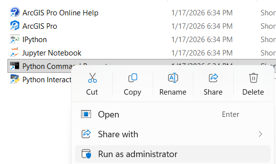
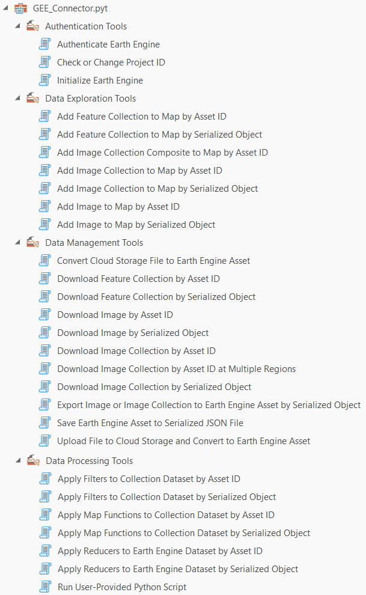
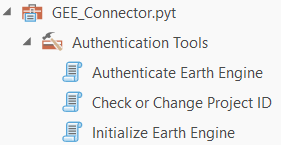
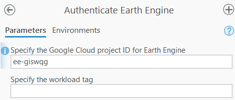

# Guía de Instalación. Opción C: ArcGIS Pro y ArcPy {#guia-C}

## Instalación GEE en ArcGIS Pro {#sec-arcgis-pro-gee}

La guía resumida de instalación y uso se encuentra en el [blog oficial de Esri](https://www.esri.com/arcgis-blog/products/arcgis-pro/imagery/bring-google-earth-engines-data-right-into-arcgis-pro).

**Procedimiento y requerimientos:**

1. Contar con una licencia activa de ArcGIS Pro.
2. Instalar la caja de herramientas siguiendo el [procedimiento oficial](https://github.com/gee-community/arcgis-earthengine-toolbox/blob/main/docs/03_installation.md).
3. Descargar la caja de herramientas [desde este enlace](https://github.com/gee-community/arcgis-earthengine-toolbox/releases/latest).
4. Después de descomprimir el archivo, el procedimiento finaliza [conectando la caja de herramientas](https://pro.arcgis.com/en/pro-app/latest/help/projects/connect-to-a-toolbox.htm) a tu proyecto en ArcGIS Pro.


### Configuración del ambiente Python con Conda

1. Ejecutar **ArcGIS Python Command Prompt** como administrador:
   Ruta: **Start Menu** -> **All Apps** -> **ArcGIS folder** -> **Python Command Prompt** (Clic derecho > Ejecutar como administrador).

{fig-align="center" width="60%"}

2. Verificar los ambientes Conda disponibles:

```bash
conda env list
```

3. Clonar el entorno principal de ArcGIS Pro para no alterar el entorno por defecto:

```bash
conda create --name gee --clone arcgispro-py3
```

*Mensaje de salida apenas inicia la clonación:*
```bash
Source:      C:\Program Files\ArcGIS\Pro\bin\Python\envs\arcgispro-py3
Destination: D:\Programs\miniforge3\envs\gee
```

4. Inicializar Conda con el shell apropiado (opcional):

```bash
conda init cmd.exe
```

5. **Reiniciar** el Python Command Prompt (nuevamente como Administrador).

6. Activar el nuevo entorno `gee`:

```bash
conda activate gee
```

7. Desactivar la verificación SSL (opcional, útil en redes corporativas restrictivas):

```bash
conda config --set ssl_verify false
```

8. Instalar los paquetes necesarios de GEE desde el canal `conda-forge`:

```bash
conda install earthengine-api xee --channel conda-forge
```

> **Alternativa (Si el comando anterior falla):** > Puedes usar `pip` para instalar los paquetes limpiando el entorno e intentándolo de nuevo:
> ```bash
> conda deactivate
> conda env remove --name gee
> conda create --name gee --clone arcgispro-py3
> conda activate gee
> pip install earthengine-api xee
> 
> # Dependiendo de los warnings en consola, es posible que requieras estos paquetes:
> pip install "pyarrow>=17,<21" pywin32
> ```

9. Instalar otros paquetes requeridos desde el canal oficial de `esri` (dependiendo de tu versión):

* Para **ArcGIS Pro 3.5 y anteriores**:

```bash
conda install rasterio=1.3.9 --channel esri
```

* Para **ArcGIS Pro 3.6 y posteriores**:

```bash
conda install rasterio=1.4.3 --channel esri
```

10. Intercambiar el entorno predeterminado de ArcGIS Pro para que use `gee` de ahora en adelante:

```bash
proswap gee
```

11. Cerrar el Python Command Prompt y abrir ArcGIS Pro.

* El ambiente por defecto ahora será `gee`.
* Verifica que los paquetes funcionen yendo a **Analysis** -> **Python** -> **Python Window** y ejecutando:

```python
import ee
import xee
import rasterio
```

---

### Descargar la caja de herramientas (Toolbox)

Puedes clonar el repositorio mediante Git:

```bash
git clone https://github.com/gee-community/arcgis-earthengine-toolbox.git
```

Alternativamente, descarga el archivo `.zip` directamente desde [GitHub](https://github.com/gee-community/arcgis-earthengine-toolbox) y descomprímelo.

* **Opción A:** Guardar la carpeta descargada directamente en el directorio de tu proyecto actual:
  
  `C:\Users\<username>\Documents\ArcGIS\Projects\<project_name>\ArcGIS Earth Engine Toolbox`

* **Opción B:** Guardar la caja de herramientas en un directorio global para usarla en múltiples proyectos. Por ejemplo:
  
  `D:\Programs\ArcGIS\Pro\arcgis-earthengine-toolbox`


### Agregar la caja de herramientas GEE a ArcGIS Pro

1. Abre ArcGIS Pro.
2. En el panel **Catalog** (Catálogo), haz clic derecho en **Toolboxes** (Cajas de herramientas) y selecciona **Add Toolbox** (Agregar caja de herramientas). 
3. Navega a la ruta donde descomprimiste los archivos (ej: `D:\Programs\ArcGIS\Pro\arcgis-earthengine-toolbox`) y selecciona el archivo de la herramienta.

{fig-align="center" width="70%"}

*Consulta el [procedimiento oficial de Esri](https://pro.arcgis.com/en/pro-app/latest/help/projects/connect-to-a-toolbox.htm) si tienes dudas sobre cómo conectar una caja de herramientas.*

### Actualizar la caja de herramientas GEE (Opcional)

Si en el futuro requieres la versión más reciente del Toolbox, sigue el procedimiento descrito en la [documentación oficial de actualizaciones](https://github.com/gee-community/arcgis-earthengine-toolbox/blob/main/docs/08_upgrades.md).

---

### Instalar Google Cloud SDK

Dado que GEE requiere validación en la nube de Google, necesitamos su herramienta de línea de comandos. Encuentra aquí la [guía oficial de instalación de Google Cloud CLI](https://docs.cloud.google.com/sdk/docs/install-sdk).

1. Selecciona o crea tu proyecto de Google Cloud en este [enlace](https://console.cloud.google.com/projectselector2/home/dashboard).
2. Verifica que la facturación (**Billing**) esté habilitada para tu proyecto [aquí](https://docs.cloud.google.com/billing/docs/how-to/verify-billing-enabled#confirm_billing_is_enabled_on_a_project). *(Nota: GEE es gratuito, pero requiere tener facturación configurada como protocolo de Cloud).*
3. Descarga el [instalador de Google Cloud CLI para Windows](https://dl.google.com/dl/cloudsdk/channels/rapid/GoogleCloudSDKInstaller.exe).
4. Ejecuta el instalador y sigue las instrucciones en pantalla.  

**⚠️ Importante:** Al finalizar, **desmarca** la opción de abrir la consola (*Start Google Cloud SDK Shell*).

5. Abre una terminal de **PowerShell** y ejecuta:

```bash
gcloud init
```

* Se abrirá una pestaña en tu navegador web. Ingresa con tu cuenta de Google. 
* Después de autorizar, recibirás un mensaje similar a **"You are now authenticated with the gcloud CLI"**.

De regreso a tu consola de PowerShell:

* Te pedirá que indiques el número del proyecto que deseas utilizar (ej: `1`). Recuerda seleccionar el proyecto que tiene la facturación habilitada.
* Dirígete a [este enlace de la Consola de APIs](https://console.developers.google.com/apis) y asegúrate de tener tu proyecto seleccionado.
* Ve a la pestaña **Enable API and Services**.
* Busca **Compute Engine API**, selecciónala y presiona **Enable**. Esto permitirá a Google Cloud seleccionar una zona y región de cómputo automáticamente, optimizando el uso de recursos. (Debe aparecer activa en tu lista de APIs).

---

### Credenciales para GEE

Una vez que Google Cloud SDK está instalado, GEE utilizará sus credenciales por defecto para autenticarte dentro de ArcGIS Pro.

1. Encuentra tu **Google Cloud Project ID**:

* Recuerda que el `Project ID` suele ser diferente al `Project Name` (típicamente tiene un formato como `my-project-123456`).
* En la esquina superior derecha de la [Consola de Google Cloud](https://console.cloud.google.com/), haz clic en los tres puntos y selecciona **Project settings**. Allí podrás copiar tu `Project ID`.

2. Abre la consola **Google Cloud SDK Shell** (búscala en el menú inicio de Windows).

3. Ejecuta el siguiente comando (esto se hace **solo la primera vez**):

```bash
gcloud auth application-default login
```

* Sigue el proceso en el navegador web para otorgar permisos. Al terminar verás el mensaje: **"You are now authenticated with the gcloud CLI!"**.
* Esto creará un archivo de seguridad llamado `application_default_credentials.json` en tu computador.

4. Asocia tu cuota de proyecto a esas credenciales. Ejecuta este comando reemplazando `TU_PROJECT_ID` con el ID exacto de tu proyecto:

```bash
gcloud auth application-default set-quota-project TU_PROJECT_ID
```

Si todo es correcto, recibirás una confirmación similar a:  

**`Credentials saved to file: [C:\Users\tu_usuario\AppData\Roaming\gcloud\application_default_credentials.json]`**

---

## Inicializar GEE en ArcGIS Pro {#sec-arcgis-pro-initialize-gee}

Una vez configurado el entorno y descargada la caja de herramientas, procede a inicializar Earth Engine dentro de la interfaz de ArcGIS Pro. Antes de usar cualquier función, debemos autenticar nuestra cuenta. En la caja de herramientas de GEE dentro de ArcGIS Pro, abra la sección `Authentication Tools`:

{#fig-arcgis-auth-tools fig-align="center" width="30%"}

**Paso A:** Abra la herramienta `Authenticate Earth Engine` y escriba su *Project ID* (ej. `ee-giswqg`). Al ejecutar (`Run`) la herramienta y ver los detalles de la ejecución (`View Details`), deberá observar un mensaje de éxito como: *Earth Engine is ready to use. Authentication successful*.

{#fig-arcgis-auth-success fig-align="center" width="40%"}

**Paso B:** A continuación, abra la herramienta `Initialize Earth Engine` y escriba nuevamente su *Project ID*. Ejecute la herramienta; en los detalles observará el mensaje confirmando: *Earth Engine is ready to use.*


---

## URLs y enlaces de referencia importantes

* Documentación oficial y [tutoriales de Google Cloud SDK](https://docs.cloud.google.com/sdk/auth_success).
* Procedimiento completo de [instalación del GEE Toolbox](https://github.com/gee-community/arcgis-earthengine-toolbox/blob/main/docs/03_installation.md).
* Artículo de Esri: [Cómo iniciar a trabajar con GEE en ArcGIS Pro](https://www.esri.com/arcgis-blog/products/arcgis-pro/imagery/bring-google-earth-engines-data-right-into-arcgis-pro).

---

## Fuentes de datos alternativas en ArcGIS Pro

Aunque Earth Engine es muy potente, existen otras fuentes masivas de datos espaciales y catálogos en la nube que puedes aprovechar directamente en ArcGIS Pro:

* 🌐 **ArcGIS Living Atlas of the World**
    * Totalmente integrado con ArcGIS Online y ArcGIS Pro (mediante la pestaña `Portal` en el Catálogo).
    * Guía: [ArcGIS Living Atlas ready-to-use imagery layers for analysis](https://www.esri.com/arcgis-blog/products/arcgis-living-atlas/imagery/law-imagery-layers-for-analysis)
    * Guía: [Explore Ready-to-Use Imagery for Analysis](https://www.esri.com/arcgis-blog/products/arcgis-online/imagery/large-scale-analysis-in-arcgis-online)

* 📂 **STAC Catalogs (SpatioTemporal Asset Catalogs)**

    * Permite conectar inmensas bases de datos abiertas, como el [Microsoft Planetary Computer](https://planetarycomputer.microsoft.com/).
    * Conecta la información estableciendo una [conexión STAC en ArcGIS](https://pro.arcgis.com/en/pro-app/latest/help/data/imagery/create-a-stac-connection.htm) y aprovechando archivos [.asc](https://github.com/Esri/arcgis-for-mpc/activity).

* ☁️ **Cloud sources (Almacenamiento en la nube)**

    * Conecta entornos de almacenamiento masivo directamente al Catálogo de ArcGIS Pro vía URLs o APIs, como por ejemplo buckets de [AWS (Amazon Web Services)](https://enterprise.arcgis.com/en/server/10.8/cloud/amazon/connect-to-arcgis-server-on-aws-from-arcmap.htm).

* 🌍 **Google Earth Engine Data Catalog**

    * Operado mediante la caja de herramientas integrada.