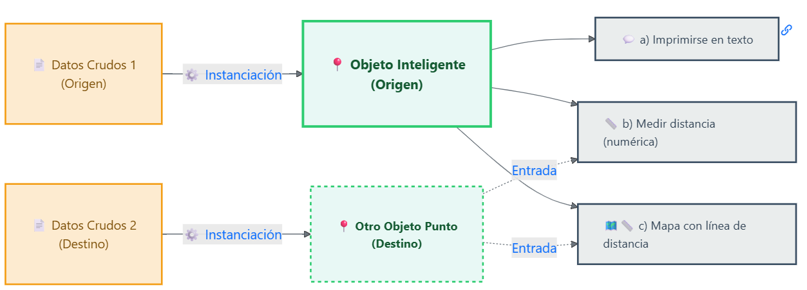
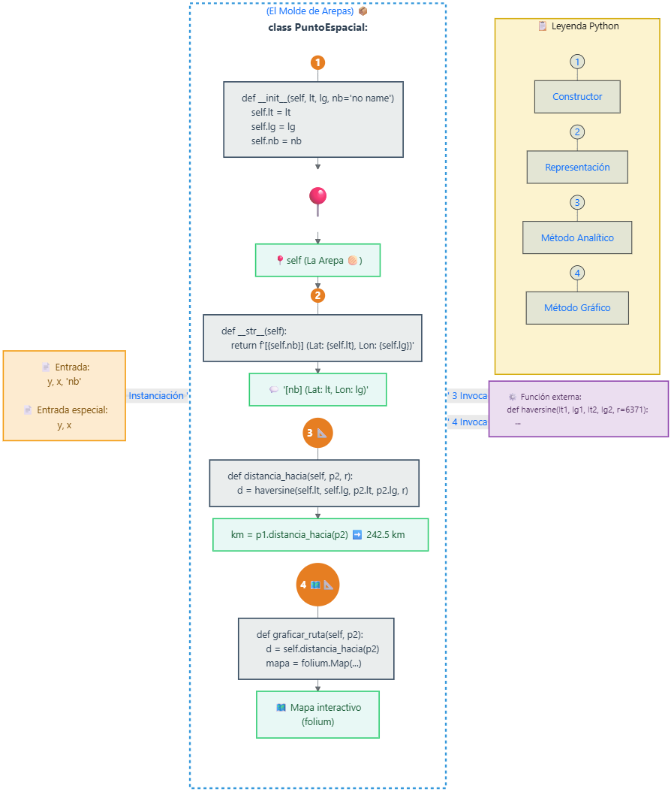
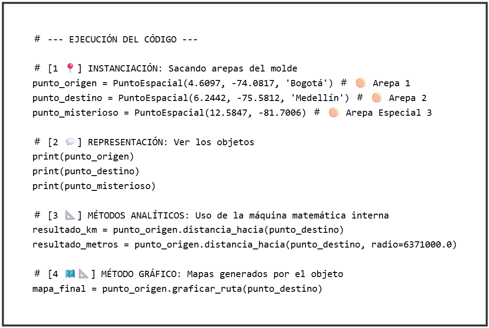
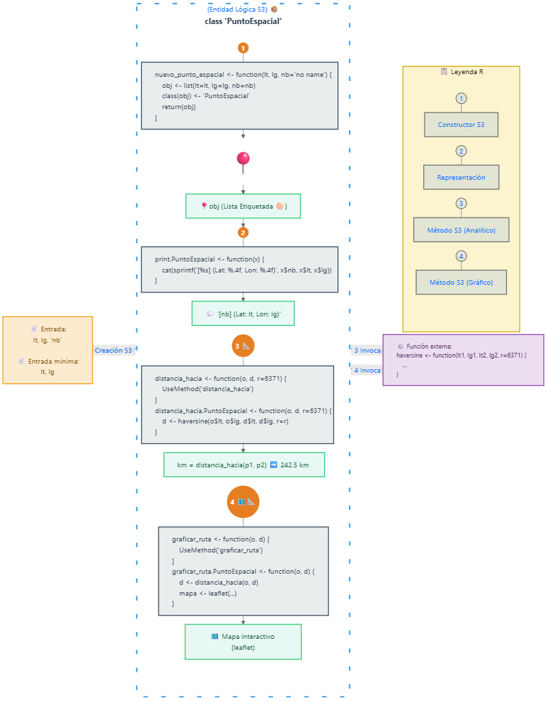
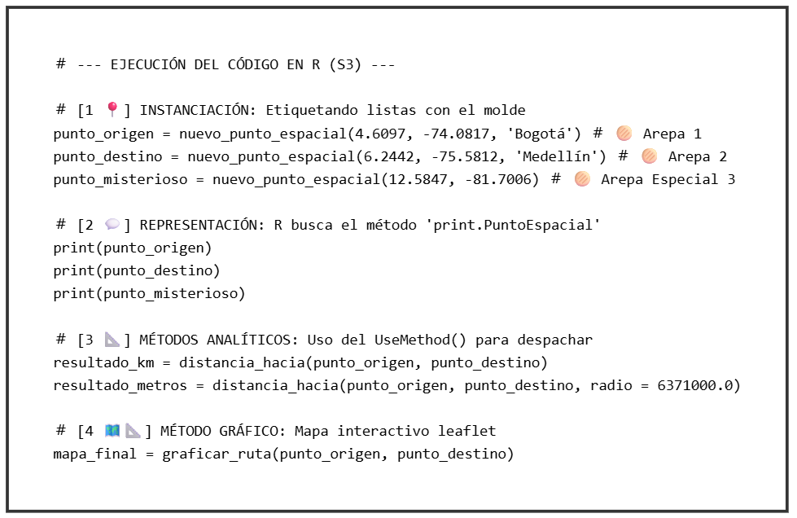
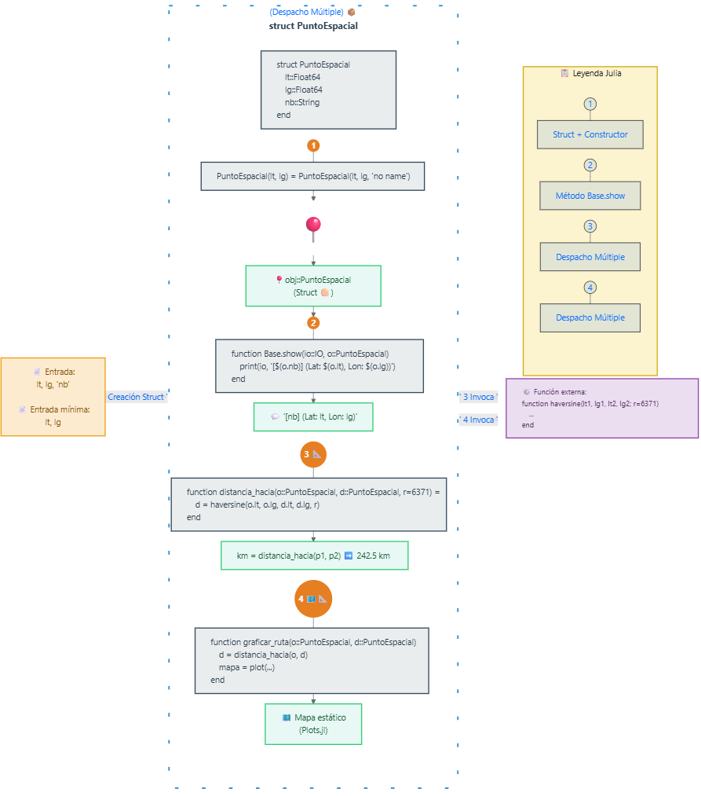
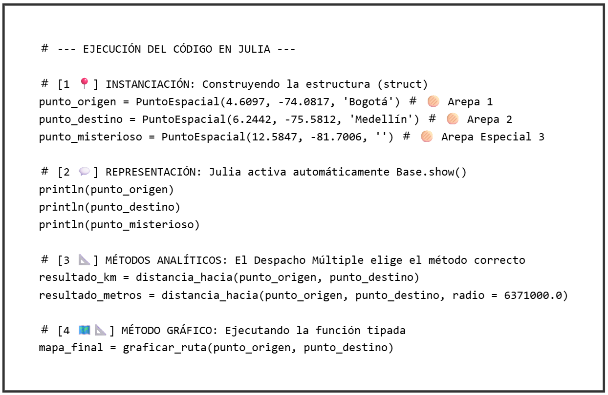
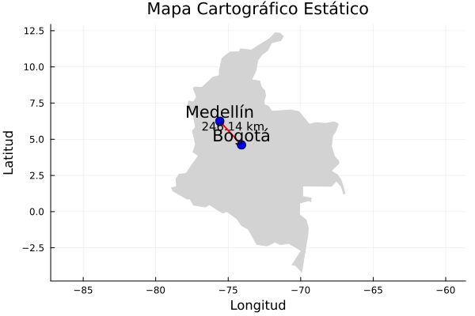

---
format:
  html: default
  pdf:
    screenshot: true  # <--- ESTO ES CLAVE
    # Opcionalmente, si falla, intenta:
    prefer-html: true    
    keep-tex: true
    mermaid-format: png
    include-in-header:
      - text: \usepackage{pdflscape}
---

# Funciones y Clases: El camino a la Modularización {#sec-funciones_clases}

## Funciones j_eval y j_plot en R

```{r}
#| label: j_eval_j_plot
#| code-fold: true
# #| include: false
source("./docs/j_eval_j_plot.r")
```

## Introducción

Hasta ahora, hemos escrito código que se ejecuta de arriba hacia abajo, como una lista de mercado. Pero en proyectos reales de geomática, necesitamos reutilizar lógica. Si tienes un cálculo complejo para medir distancias o para valuar un predio, no quieres copiar y pegar ese código cien veces.

Para eso existen las **funciones** (máquinas que procesan datos) y las **clases** (moldes para crear objetos complejos). En este capítulo aprenderás a encapsular tu lógica para que tu código sea modular, limpio y fácil de mantener.

## Objetivos de aprendizaje

* Crear funciones reutilizables para automatizar cálculos espaciales recurrentes.
* Manejar parámetros opcionales, valores por defecto y argumentos dinámicos.
* Entender los principios básicos de la Programación Orientada a Objetos (POO) para modelar elementos del mundo real.

## Funciones: bloques de código reutilizables

Una función es como una receta de cocina: tú le pasas los ingredientes (parámetros de entrada), ella realiza un proceso interno (cuerpo de la función) y te entrega un resultado (valor de retorno). 

Para ilustrar el poder de las funciones, vamos a construir tres herramientas fundamentales para cualquier analista espacial. Cada una nos enseñará un concepto nuevo de programación:

1. **La calculadora matemática (`haversine`):** Resolveremos el cálculo de la distancia entre dos ciudades. Como la Tierra no es plana, no podemos usar una simple línea recta (Pitágoras). 
2. **El procesador por lotes (`medir_ruta`):** Crearemos una función que reciba una lista completa de coordenadas, la recorra con un ciclo `for` y llame a nuestra primera función (`haversine`) repetidas veces para medir los tramos de una ruta.
3. **El recolector dinámico (`describir_punto`):** Crearemos una función que use **argumentos dinámicos** (`**kwargs` en Python, `...` en R y `kwargs...` en Julia) para atrapar cualquier cantidad de variables extra (clima, población, etc.) que el usuario decida enviarnos.


### La matemática detrás de nuestra calculadora espacial

La **fórmula de Haversine** calcula la distancia de círculo máximo (*great-circle distance*) (@fig-great_circle) entre dos puntos en la superficie de una esfera, como la Tierra, a partir de sus coordenadas de latitud y longitud. La fórmula tiene en cuenta la curvatura de la esfera, lo que la hace mucho más precisa que una simple distancia euclidiana (línea recta) para aplicaciones geoespaciales.

{#fig-great_circle width="60%" fig-align="center"}

Matemáticamente, adaptada a las variables de nuestro código, la ecuación general se ve así:

$$\textstyle distancia = 2 \cdot radio \cdot \arcsin\left(\sqrt{\sin^2\left(\frac{lat2 - lat1}{2}\right) + \cos(lat1) \cdot \cos(lat2) \cdot \sin^2\left(\frac{lon2 - lon1}{2}\right)}\right)$$

Donde:

* **$distancia$**: Distancia física entre los dos puntos a lo largo de la curva de la esfera.
* **$radio$**: Radio de la esfera de referencia (para la Tierra, aproximadamente 6371.0 km).
* **$lat1$, $lat2$**: Latitudes del punto de origen y destino, estrictamente en radianes.
* **$lon1$, $lon2$**: Longitudes del punto de origen y destino, estrictamente en radianes.

*El truco del radio:* El cálculo trigonométrico interno solo produce un ángulo sin unidad física (radianes). Para convertirlo en distancia real, lo multiplicamos por el radio de la Tierra. Si metemos el radio en kilómetros (6371.0), sale en kilómetros; si lo metemos en millas (3958.8), sale en millas. 

En programación, solemos dividir esta gran fórmula en partes más pequeñas (las variables `dlat`, `dlon`, `a` y `c`) para facilitar la lectura del código y evitar errores, reemplazando el $\arcsin$ por la función `atan2` que es computacionalmente más estable.

En la práctica, para que el computador procese esta gran ecuación sin ahogarse (y para evitar errores de paréntesis), los programadores la dividen en tres pasos secuenciales usando las variables `a`, `c` y `distancia`:

1. **El ajuste esférico ($a$):** Calcula el cuadrado de la mitad de la cuerda recta entre los dos puntos.
$$a = \sin^2\left(\frac{dlat}{2}\right) + \cos(lat1) \cdot \cos(lat2) \cdot \sin^2\left(\frac{dlon}{2}\right)$$

2. **El ángulo central ($c$):** Usa la función arcotangente (`atan2`) para hallar el ángulo exacto en radianes desde el centro de la Tierra.
$$c = 2 \cdot \text{atan2}\left(\sqrt{a}, \sqrt{1 - a}\right)$$

3. **La distancia física ($distancia$):** Convierte el ángulo en una longitud real multiplicándolo por el radio.
$$distancia = radio \cdot c$$

::: {.callout-note}
### Nota técnica: ¿Por qué usamos atan2 en lugar de arcsin en el código?
Si buscas la fórmula matemática clásica de Haversine en un libro, notarás que utiliza la función arcoseno ($\arcsin$). Sin embargo, en nuestro código de programación usamos la función arcotangente (`atan2`). ¿Por qué esta diferencia?

Todo se reduce a la **precisión computacional (punto flotante)**. Cuando dos coordenadas están muy cerca la una de la otra, usar $\arcsin(\sqrt{a})$ puede generar imprecisiones severas de redondeo en el procesador. 

Para solucionarlo, la programación aprovecha la trigonometría básica ($\tan = \frac{\sin}{\cos}$) usando la función `atan2(y, x)`:

* Sabiendo que $a = \sin^2$, entonces el seno (cateto opuesto, $y$) es $\sqrt{a}$.
* Por la regla pitagórica ($\sin^2 + \cos^2 = 1$), el coseno (cateto adyacente, $x$) es $\sqrt{1 - a}$.

Al ingresar $c = 2 \cdot \text{atan2}\left(\sqrt{a}, \sqrt{1 - a}\right)$, obligamos al computador a calcular el ángulo exacto usando ambos lados del triángulo, garantizando mediciones perfectas ya sea que midamos la distancia entre dos continentes o entre dos pasos en la calle.
:::

Veamos cómo se programan estas máquinas paso a paso, explicando cada línea de su funcionamiento:

::: {.panel-tabset}

### Python

::: {.content-visible when-format="html"}
::: {.callout-tip collapse="true" icon="false"}
#### ▷ CÓDIGO PURO (Copiar y Pegar)
```{python}
#| label: python_funciones_codigo
#| eval: false

# Importamos la librería matemática nativa de Python para usar senos, cosenos y radianes
import math

# --- FUNCIÓN 1: CÁLCULO MATEMÁTICO BÁSICO ---
def haversine(lat1, lon1, lat2, lon2, radio=6371.0):
    # RECIBE: 4 números (lat/lon de dos puntos) y un radio opcional (por defecto 6371.0)
    
    # Convierte la diferencia de latitudes a radianes (el idioma de los computadores)
    dlat = math.radians(lat2 - lat1)
    
    # Convierte la diferencia de longitudes a radianes
    dlon = math.radians(lon2 - lon1)
    
    # Calcula 'a': el cuadrado de la mitad de la cuerda recta entre los puntos
    a = (math.sin(dlat / 2) ** 2 + 
         math.cos(math.radians(lat1)) * math.cos(math.radians(lat2)) * math.sin(dlon / 2) ** 2)
    
    # Calcula 'c': la distancia angular central usando la función arcotangente (atan2)
    c = 2 * math.atan2(math.sqrt(a), math.sqrt(1 - a))
    
    # SACA: La multiplicación del ángulo por el radio, dando la distancia física real
    return radio * c

print("--- Cálculo de distancia simple ---")
# Ejecutamos la función. Como no le damos el radio, usa el defecto en km.
distancia_km = haversine(4.6097, -74.0817, 6.2442, -75.5812)
print(f"Distancia Bogotá-Medellín: {distancia_km:.2f} km")

# Sobrescribimos el parámetro 'radio' para obtener el resultado en millas (3958.8)
distancia_millas = haversine(4.6097, -74.0817, 6.2442, -75.5812, radio=3958.8)
print(f"Distancia en millas: {distancia_millas:.2f} mi")

# Aplicamos el "truco" matemático: si le pasamos el radio en metros, el resultado sale en metros
distancia_metros = haversine(4.6097, -74.0817, 6.2442, -75.5812, radio=6371000.0)
print(f"Distancia en metros: {distancia_metros:.2f} m")


# --- FUNCIÓN 2: PROCESADOR POR LOTES ---
def medir_ruta(lista_coords):
    # RECIBE: Una lista que contiene múltiples tuplas de coordenadas
    
    # Creamos una lista vacía para ir guardando las distancias calculadas
    distancias_tramos = []
    
    # Iniciamos un ciclo que recorre la lista. Paramos un índice antes del final (- 1)
    # para no desbordar la lista cuando intentemos buscar el punto 'i + 1'
    for i in range(len(lista_coords) - 1):
        
        # Extraemos latitud y longitud del punto actual (donde estamos parados)
        lat1, lon1 = lista_coords[i]
        
        # Extraemos latitud y longitud del punto siguiente (hacia donde vamos)
        lat2, lon2 = lista_coords[i + 1]
        
        # Llamamos a nuestra función 'haversine' para calcular la distancia de este tramo
        distancia_tramo = haversine(lat1, lon1, lat2, lon2)
        
        # Guardamos el resultado de este tramo en nuestra lista final
        distancias_tramos.append(distancia_tramo)
        
    # SACA: La lista completa con todas las distancias de los tramos calculados
    return distancias_tramos

# Definimos una ruta con 3 puntos (2 tramos)
ruta_colombiana = [(4.6097, -74.0817), (6.2442, -75.5812), (3.4516, -76.5320)]
# Ejecutamos nuestra función procesadora
tramos = medir_ruta(ruta_colombiana)

print("\n--- Distancia por tramos en una ruta ---")
# Imprimimos la lista de resultados usando una comprensión de lista para redondear a 2 decimales
print(f"Tramos (km): {[round(d, 2) for d in tramos]}")


# --- FUNCIÓN 3: RECOLECTOR DINÁMICO ---
def describir_punto(lat, lon, **kwargs):
    # RECIBE: Latitud, longitud obligatorias, y un diccionario '**kwargs' con datos extra inventados
    
    # Iniciamos creando un texto base con las coordenadas obligatorias
    descripcion = f"Punto ({lat}, {lon})"
    
    # Iniciamos un ciclo para "abrir" el diccionario de parámetros extra.
    # .items() nos separa el nombre de la variable (clave) y su contenido (valor)
    for clave, valor in kwargs.items():
        
        # Sumamos al texto base una barrita (|) seguida del nombre y valor del dato extra
        descripcion += f" | {clave}: {valor}"
        
    # SACA: Un solo texto largo que concatena toda la información del punto
    return descripcion

print("\n--- Creación de atributos dinámicos ---")
# Ejecutamos enviando variables inventadas (ciudad, elevacion, costero, clima)
print(describir_punto(4.6097, -74.0817, ciudad="Bogotá", elevacion=2640))
print(describir_punto(10.3997, -75.4795, ciudad="Cartagena", costero=True, clima="Cálido"))
```
:::
:::

```{python}
#| label: python_funciones
# #| eval: false

# Importamos la librería matemática nativa de Python para usar senos, cosenos y radianes
import math

# --- FUNCIÓN 1: CÁLCULO MATEMÁTICO BÁSICO ---
def haversine(lat1, lon1, lat2, lon2, radio=6371.0):
    # RECIBE: 4 números (lat/lon de dos puntos) y un radio opcional (por defecto 6371.0)
    
    # Convierte la diferencia de latitudes a radianes (el idioma de los computadores)
    dlat = math.radians(lat2 - lat1)
    
    # Convierte la diferencia de longitudes a radianes
    dlon = math.radians(lon2 - lon1)
    
    # Calcula 'a': el cuadrado de la mitad de la cuerda recta entre los puntos
    a = (math.sin(dlat / 2) ** 2 + 
         math.cos(math.radians(lat1)) * math.cos(math.radians(lat2)) * math.sin(dlon / 2) ** 2)
    
    # Calcula 'c': la distancia angular central usando la función arcotangente (atan2)
    c = 2 * math.atan2(math.sqrt(a), math.sqrt(1 - a))
    
    # SACA: La multiplicación del ángulo por el radio, dando la distancia física real
    return radio * c

print("--- Cálculo de distancia simple ---")
# Ejecutamos la función. Como no le damos el radio, usa el defecto en km.
distancia_km = haversine(4.6097, -74.0817, 6.2442, -75.5812)
print(f"Distancia Bogotá-Medellín: {distancia_km:.2f} km")

# Sobrescribimos el parámetro 'radio' para obtener el resultado en millas (3958.8)
distancia_millas = haversine(4.6097, -74.0817, 6.2442, -75.5812, radio=3958.8)
print(f"Distancia en millas: {distancia_millas:.2f} mi")

# Aplicamos el "truco" matemático: si le pasamos el radio en metros, el resultado sale en metros
distancia_metros = haversine(4.6097, -74.0817, 6.2442, -75.5812, radio=6371000.0)
print(f"Distancia en metros: {distancia_metros:.2f} m")


# --- FUNCIÓN 2: PROCESADOR POR LOTES ---
def medir_ruta(lista_coords):
    # RECIBE: Una lista que contiene múltiples tuplas de coordenadas
    
    # Creamos una lista vacía para ir guardando las distancias calculadas
    distancias_tramos = []
    
    # Iniciamos un ciclo que recorre la lista. Paramos un índice antes del final (- 1)
    # para no desbordar la lista cuando intentemos buscar el punto 'i + 1'
    for i in range(len(lista_coords) - 1):
        
        # Extraemos latitud y longitud del punto actual (donde estamos parados)
        lat1, lon1 = lista_coords[i]
        
        # Extraemos latitud y longitud del punto siguiente (hacia donde vamos)
        lat2, lon2 = lista_coords[i + 1]
        
        # Llamamos a nuestra función 'haversine' para calcular la distancia de este tramo
        distancia_tramo = haversine(lat1, lon1, lat2, lon2)
        
        # Guardamos el resultado de este tramo en nuestra lista final
        distancias_tramos.append(distancia_tramo)
        
    # SACA: La lista completa con todas las distancias de los tramos calculados
    return distancias_tramos

# Definimos una ruta con 3 puntos (2 tramos)
ruta_colombiana = [(4.6097, -74.0817), (6.2442, -75.5812), (3.4516, -76.5320)]
# Ejecutamos nuestra función procesadora
tramos = medir_ruta(ruta_colombiana)

print("\n--- Distancia por tramos en una ruta ---")
# Imprimimos la lista de resultados usando una comprensión de lista para redondear a 2 decimales
print(f"Tramos (km): {[round(d, 2) for d in tramos]}")


# --- FUNCIÓN 3: RECOLECTOR DINÁMICO ---
def describir_punto(lat, lon, **kwargs):
    # RECIBE: Latitud, longitud obligatorias, y un diccionario '**kwargs' con datos extra inventados
    
    # Iniciamos creando un texto base con las coordenadas obligatorias
    descripcion = f"Punto ({lat}, {lon})"
    
    # Iniciamos un ciclo para "abrir" el diccionario de parámetros extra.
    # .items() nos separa el nombre de la variable (clave) y su contenido (valor)
    for clave, valor in kwargs.items():
        
        # Sumamos al texto base una barrita (|) seguida del nombre y valor del dato extra
        descripcion += f" | {clave}: {valor}"
        
    # SACA: Un solo texto largo que concatena toda la información del punto
    return descripcion

print("\n--- Creación de atributos dinámicos ---")
# Ejecutamos enviando variables inventadas (ciudad, elevacion, costero, clima)
print(describir_punto(4.6097, -74.0817, ciudad="Bogotá", elevacion=2640))
print(describir_punto(10.3997, -75.4795, ciudad="Cartagena", costero=True, clima="Cálido"))
```

### R

::: {.content-visible when-format="html"}
::: {.callout-tip collapse="true" icon="false"}
#### ▷ CÓDIGO PURO (Copiar y Pegar)
```{r}
#| label: r_funciones_codigo
#| eval: false

# R no tiene una función nativa directa para radianes, la creamos rápido
pasar_a_radianes <- function(grados) { 
    return(grados * pi / 180) 
}

# --- FUNCIÓN 1: CÁLCULO MATEMÁTICO BÁSICO ---
haversine <- function(lat1, lon1, lat2, lon2, radio = 6371.0) {
    # RECIBE: 4 coordenadas decimales y un radio opcional (por defecto 6371.0)
    
    # Convierte la diferencia de latitudes a radianes llamando a nuestra mini-función
    dlat <- pasar_a_radianes(lat2 - lat1)
    
    # Convierte la diferencia de longitudes a radianes
    dlon <- pasar_a_radianes(lon2 - lon1)
    
    # Calcula 'a': Ajuste trigonométrico esférico
    a <- (sin(dlat / 2)^2 + 
          cos(pasar_a_radianes(lat1)) * cos(pasar_a_radianes(lat2)) * sin(dlon / 2)^2)
          
    # Calcula 'c': Ángulo central en radianes usando arcotangente (atan2)
    c <- 2 * atan2(sqrt(a), sqrt(1 - a))
    
    # SACA: Multiplica el ángulo por el radio para darnos la distancia física
    distancia <- radio * c
    return(distancia) 
}

cat("--- Cálculo de distancia simple ---\n")
# Ejecutamos la función usando el radio en kilómetros por defecto
distancia_km <- haversine(4.6097, -74.0817, 6.2442, -75.5812)
cat(sprintf("Distancia Bogotá-Medellín: %.2f km\n", distancia_km))

# Sobrescribimos el parámetro 'radio' para obtener el resultado en millas (3958.8)
distancia_millas <- haversine(4.6097, -74.0817, 6.2442, -75.5812, radio = 3958.8)
cat(sprintf("Distancia en millas: %.2f mi\n", distancia_millas))

# Aplicamos el "truco" matemático: si le pasamos el radio en metros, el resultado sale en metros
distancia_metros <- haversine(4.6097, -74.0817, 6.2442, -75.5812, radio = 6371000.0)
cat(sprintf("Distancia en metros: %.2f m\n", distancia_metros))


# --- FUNCIÓN 2: PROCESADOR POR LOTES ---
medir_ruta <- function(lista_coords) {
    # RECIBE: Una lista de listas numéricas (coordenadas)
    
    # Creamos un vector numérico vacío donde depositaremos las respuestas
    distancias_tramos <- c() 
    
    # Iniciamos el ciclo restando 1 al tamaño total. Si no restamos 1, 
    # al final del ciclo R buscará el punto 'i + 1' que no existe y arrojará error.
    for (i in 1:(length(lista_coords) - 1)) {
        
        # Extraemos el punto actual (i)
        punto_a <- lista_coords[[i]]
        
        # Extraemos el punto siguiente (i+1)
        punto_b <- lista_coords[[i + 1]]
        
        # Llamamos a 'haversine' dándole latitud y longitud de ambos puntos
        d <- haversine(punto_a[1], punto_a[2], punto_b[1], punto_b[2])
        
        # Añadimos (concatenamos) la distancia recién calculada a nuestro vector
        distancias_tramos <- c(distancias_tramos, d)
    }
    
    # SACA: El vector repleto con las distancias de todos los tramos
    return(distancias_tramos)
}

# Definimos una ruta con 3 puntos (2 tramos)
ruta_colombiana <- list(c(4.6097, -74.0817), c(6.2442, -75.5812), c(3.4516, -76.5320))
# Ejecutamos la función
tramos <- medir_ruta(ruta_colombiana)

cat("\n--- Distancia por tramos en una ruta ---\n")
cat(sprintf("Tramos (km): %.2f, %.2f\n", tramos[1], tramos[2]))


# --- FUNCIÓN 3: RECOLECTOR DINÁMICO ---
describir_punto <- function(lat, lon, ...) {
    # RECIBE: lat, lon, y unos tres puntos (...) que atrapan variables extra nombradas
    
    # Creamos el texto base principal
    descripcion <- sprintf("Punto (%.4f, %.4f)", lat, lon)
    
    # Extraemos las variables atrapadas en los '...' y las metemos a una lista
    args_extra <- list(...)
    
    # Verificamos si la lista tiene datos (si el usuario envió algo extra)
    if (length(args_extra) > 0) {
        
        # Recorremos cada nombre de variable (clave) en la lista extra
        for (clave in names(args_extra)) {
            
            # Pegamos (paste0) la barra, la clave y su valor al texto original
            descripcion <- paste0(descripcion, sprintf(" | %s: %s", clave, args_extra[[clave]]))
        }
    }
    
    # SACA: El texto unificado
    return(descripcion)
}

cat("\n--- Creación de atributos dinámicos ---\n")
# Pasamos las coordenadas y le inventamos datos (ciudad, elevacion, etc.)
cat(describir_punto(4.6097, -74.0817, ciudad="Bogotá", elevacion=2640), "\n")
cat(describir_punto(10.3997, -75.4795, ciudad="Cartagena", costero=TRUE), "\n")
```

:::
:::

```{r}
#| label: r_funciones
# #| eval: false

# R no tiene una función nativa directa para radianes, la creamos rápido
pasar_a_radianes <- function(grados) { 
    return(grados * pi / 180) 
}

# --- FUNCIÓN 1: CÁLCULO MATEMÁTICO BÁSICO ---
haversine <- function(lat1, lon1, lat2, lon2, radio = 6371.0) {
    # RECIBE: 4 coordenadas decimales y un radio opcional (por defecto 6371.0)
    
    # Convierte la diferencia de latitudes a radianes llamando a nuestra mini-función
    dlat <- pasar_a_radianes(lat2 - lat1)
    
    # Convierte la diferencia de longitudes a radianes
    dlon <- pasar_a_radianes(lon2 - lon1)
    
    # Calcula 'a': Ajuste trigonométrico esférico
    a <- (sin(dlat / 2)^2 + 
          cos(pasar_a_radianes(lat1)) * cos(pasar_a_radianes(lat2)) * sin(dlon / 2)^2)
          
    # Calcula 'c': Ángulo central en radianes usando arcotangente (atan2)
    c <- 2 * atan2(sqrt(a), sqrt(1 - a))
    
    # SACA: Multiplica el ángulo por el radio para darnos la distancia física
    distancia <- radio * c
    return(distancia) 
}

cat("--- Cálculo de distancia simple ---\n")
# Ejecutamos la función usando el radio en kilómetros por defecto
distancia_km <- haversine(4.6097, -74.0817, 6.2442, -75.5812)
cat(sprintf("Distancia Bogotá-Medellín: %.2f km\n", distancia_km))

# Sobrescribimos el parámetro 'radio' para obtener el resultado en millas (3958.8)
distancia_millas <- haversine(4.6097, -74.0817, 6.2442, -75.5812, radio = 3958.8)
cat(sprintf("Distancia en millas: %.2f mi\n", distancia_millas))

# Aplicamos el "truco" matemático: si le pasamos el radio en metros, el resultado sale en metros
distancia_metros <- haversine(4.6097, -74.0817, 6.2442, -75.5812, radio = 6371000.0)
cat(sprintf("Distancia en metros: %.2f m\n", distancia_metros))


# --- FUNCIÓN 2: PROCESADOR POR LOTES ---
medir_ruta <- function(lista_coords) {
    # RECIBE: Una lista de listas numéricas (coordenadas)
    
    # Creamos un vector numérico vacío donde depositaremos las respuestas
    distancias_tramos <- c() 
    
    # Iniciamos el ciclo restando 1 al tamaño total. Si no restamos 1, 
    # al final del ciclo R buscará el punto 'i + 1' que no existe y arrojará error.
    for (i in 1:(length(lista_coords) - 1)) {
        
        # Extraemos el punto actual (i)
        punto_a <- lista_coords[[i]]
        
        # Extraemos el punto siguiente (i+1)
        punto_b <- lista_coords[[i + 1]]
        
        # Llamamos a 'haversine' dándole latitud y longitud de ambos puntos
        d <- haversine(punto_a[1], punto_a[2], punto_b[1], punto_b[2])
        
        # Añadimos (concatenamos) la distancia recién calculada a nuestro vector
        distancias_tramos <- c(distancias_tramos, d)
    }
    
    # SACA: El vector repleto con las distancias de todos los tramos
    return(distancias_tramos)
}

# Definimos una ruta con 3 puntos (2 tramos)
ruta_colombiana <- list(c(4.6097, -74.0817), c(6.2442, -75.5812), c(3.4516, -76.5320))
# Ejecutamos la función
tramos <- medir_ruta(ruta_colombiana)

cat("\n--- Distancia por tramos en una ruta ---\n")
cat(sprintf("Tramos (km): %.2f, %.2f\n", tramos[1], tramos[2]))


# --- FUNCIÓN 3: RECOLECTOR DINÁMICO ---
describir_punto <- function(lat, lon, ...) {
    # RECIBE: lat, lon, y unos tres puntos (...) que atrapan variables extra nombradas
    
    # Creamos el texto base principal
    descripcion <- sprintf("Punto (%.4f, %.4f)", lat, lon)
    
    # Extraemos las variables atrapadas en los '...' y las metemos a una lista
    args_extra <- list(...)
    
    # Verificamos si la lista tiene datos (si el usuario envió algo extra)
    if (length(args_extra) > 0) {
        
        # Recorremos cada nombre de variable (clave) en la lista extra
        for (clave in names(args_extra)) {
            
            # Pegamos (paste0) la barra, la clave y su valor al texto original
            descripcion <- paste0(descripcion, sprintf(" | %s: %s", clave, args_extra[[clave]]))
        }
    }
    
    # SACA: El texto unificado
    return(descripcion)
}

cat("\n--- Creación de atributos dinámicos ---\n")
# Pasamos las coordenadas y le inventamos datos (ciudad, elevacion, etc.)
cat(describir_punto(4.6097, -74.0817, ciudad="Bogotá", elevacion=2640), "\n")
cat(describir_punto(10.3997, -75.4795, ciudad="Cartagena", costero=TRUE), "\n")
```

### Julia

::: {.content-visible when-format="html"}
::: {.callout-tip collapse="true" icon="false"}
#### ▷ CÓDIGO PURO (Copiar y Pegar)
```{julia}
#| label: julia_funciones_codigo
#| eval: false

# --- FUNCIÓN 1: CÁLCULO MATEMÁTICO BÁSICO ---
# En Julia, los argumentos opcionales con nombre DEBEN ir después de un punto y coma (;)
function haversine(lat1, lon1, lat2, lon2; radio=6371.0)
    # RECIBE: 4 números flotantes y un radio (por defecto en km)
    
    # Convierte la diferencia de latitudes a radianes con la función nativa 'deg2rad'
    dlat = deg2rad(lat2 - lat1)
    
    # Convierte la diferencia de longitudes a radianes
    dlon = deg2rad(lon2 - lon1)
    
    # Calcula 'a': Ajuste esférico para la Tierra
    a = (sin(dlat / 2)^2 + 
         cos(deg2rad(lat1)) * cos(deg2rad(lat2)) * sin(dlon / 2)^2)
         
    # Calcula 'c': Ángulo central en radianes (Ojo: en Julia es solo 'atan', no 'atan2')
    c = 2 * atan(sqrt(a), sqrt(1 - a)) 
    
    # SACA: Multiplica el ángulo por el radio para la distancia real
    return radio * c
end

using Printf

println("--- Cálculo de distancia simple ---")
# Ejecutamos con el radio por defecto (km)
distancia_km = haversine(4.6097, -74.0817, 6.2442, -75.5812)
@printf("Distancia Bogotá-Medellín: %.2f km\n", distancia_km)

# Sobrescribimos el parámetro 'radio' para obtener el resultado en millas (3958.8)
distancia_millas = haversine(4.6097, -74.0817, 6.2442, -75.5812, radio=3958.8)
@printf("Distancia en millas: %.2f mi\n", distancia_millas)

# Aplicamos el "truco" matemático: si le pasamos el radio en metros, el resultado sale en metros
distancia_metros = haversine(4.6097, -74.0817, 6.2442, -75.5812, radio=6371000.0)
@printf("Distancia en metros: %.2f m\n", distancia_metros)


# --- FUNCIÓN 2: PROCESADOR POR LOTES ---
function medir_ruta(lista_coords)
    # RECIBE: Un arreglo con tuplas de coordenadas
    
    # Creamos un arreglo vacío pero tipado (Float64) para que Julia procese más rápido
    distancias_tramos = Float64[] 
    
    # Iniciamos el ciclo restando 1. Si no restamos 1, al final del ciclo
    # Julia intentará buscar el punto 'i + 1', el cual no existe, y colapsará.
    for i in 1:(length(lista_coords) - 1)
        
        # Extraemos coordenadas iniciales (i) y finales (i+1)
        lat1, lon1 = lista_coords[i]
        lat2, lon2 = lista_coords[i + 1]
        
        # Invocamos la función 'haversine' y 'empujamos' (push!) el dato al arreglo final
        push!(distancias_tramos, haversine(lat1, lon1, lat2, lon2))
    end
    
    # SACA: Arreglo con las distancias parciales
    return distancias_tramos
end

# Definimos una ruta con 3 puntos (2 tramos)
ruta_colombiana = [(4.6097, -74.0817), (6.2442, -75.5812), (3.4516, -76.5320)]
# Ejecutamos la función
tramos = medir_ruta(ruta_colombiana)

println("\n--- Distancia por tramos en una ruta ---")
@printf("Tramos (km): [%.2f, %.2f]\n", tramos[1], tramos[2])


# --- FUNCIÓN 3: RECOLECTOR DINÁMICO ---
# Usamos 'kwargs...' después del punto y coma (;) para atrapar variables extra con nombre
function describir_punto(lat, lon; kwargs...)
    # RECIBE: Coordenadas y una "bolsa" con parámetros extra
    
    # Creamos la cadena de texto base
    descripcion = "Punto ($lat, $lon)"
    
    # Desempaquetamos la bolsa iterando sobre la clave (nombre de variable) y el valor
    for (clave, valor) in kwargs
        
        # En Julia el operador *= sirve para concatenarle más texto a una cadena existente
        descripcion *= " | $clave: $valor"
    end
    
    # SACA: El texto concatenado
    return descripcion
end

println("\n--- Creación de atributos dinámicos ---")
# Le mandamos variables extra (ciudad, elevacion, etc)
println(describir_punto(4.6097, -74.0817, ciudad="Bogotá", elevacion=2640))
println(describir_punto(10.3997, -75.4795, ciudad="Cartagena", costero=true))
```
:::
:::

```{r}
#| label: julia_funciones
#| results: asis
#| code-fold: true
# #| eval: false
j_eval(r"-(
# --- FUNCIÓN 1: CÁLCULO MATEMÁTICO BÁSICO ---
# En Julia, los argumentos opcionales con nombre DEBEN ir después de un punto y coma (;)
function haversine(lat1, lon1, lat2, lon2; radio=6371.0)
    # RECIBE: 4 números flotantes y un radio (por defecto en km)
    
    # Convierte la diferencia de latitudes a radianes con la función nativa 'deg2rad'
    dlat = deg2rad(lat2 - lat1)
    
    # Convierte la diferencia de longitudes a radianes
    dlon = deg2rad(lon2 - lon1)
    
    # Calcula 'a': Ajuste esférico para la Tierra
    a = (sin(dlat / 2)^2 + 
         cos(deg2rad(lat1)) * cos(deg2rad(lat2)) * sin(dlon / 2)^2)
         
    # Calcula 'c': Ángulo central en radianes (Ojo: en Julia es solo 'atan', no 'atan2')
    c = 2 * atan(sqrt(a), sqrt(1 - a)) 
    
    # SACA: Multiplica el ángulo por el radio para la distancia real
    return radio * c
end

using Printf

println("--- Cálculo de distancia simple ---")
# Ejecutamos con el radio por defecto (km)
distancia_km = haversine(4.6097, -74.0817, 6.2442, -75.5812)
@printf("Distancia Bogotá-Medellín: %.2f km\n", distancia_km)

# Sobrescribimos el parámetro 'radio' para obtener el resultado en millas (3958.8)
distancia_millas = haversine(4.6097, -74.0817, 6.2442, -75.5812, radio=3958.8)
@printf("Distancia en millas: %.2f mi\n", distancia_millas)

# Aplicamos el "truco" matemático: si le pasamos el radio en metros, el resultado sale en metros
distancia_metros = haversine(4.6097, -74.0817, 6.2442, -75.5812, radio=6371000.0)
@printf("Distancia en metros: %.2f m\n", distancia_metros)


# --- FUNCIÓN 2: PROCESADOR POR LOTES ---
function medir_ruta(lista_coords)
    # RECIBE: Un arreglo con tuplas de coordenadas
    
    # Creamos un arreglo vacío pero tipado (Float64) para que Julia procese más rápido
    distancias_tramos = Float64[] 
    
    # Iniciamos el ciclo restando 1. Si no restamos 1, al final del ciclo
    # Julia intentará buscar el punto 'i + 1', el cual no existe, y colapsará.
    for i in 1:(length(lista_coords) - 1)
        
        # Extraemos coordenadas iniciales (i) y finales (i+1)
        lat1, lon1 = lista_coords[i]
        lat2, lon2 = lista_coords[i + 1]
        
        # Invocamos la función 'haversine' y 'empujamos' (push!) el dato al arreglo final
        push!(distancias_tramos, haversine(lat1, lon1, lat2, lon2))
    end
    
    # SACA: Arreglo con las distancias parciales
    return distancias_tramos
end

# Definimos una ruta con 3 puntos (2 tramos)
ruta_colombiana = [(4.6097, -74.0817), (6.2442, -75.5812), (3.4516, -76.5320)]
# Ejecutamos la función
tramos = medir_ruta(ruta_colombiana)

println("\n--- Distancia por tramos en una ruta ---")
@printf("Tramos (km): [%.2f, %.2f]\n", tramos[1], tramos[2])


# --- FUNCIÓN 3: RECOLECTOR DINÁMICO ---
# Usamos 'kwargs...' después del punto y coma (;) para atrapar variables extra con nombre
function describir_punto(lat, lon; kwargs...)
    # RECIBE: Coordenadas y una "bolsa" con parámetros extra
    
    # Creamos la cadena de texto base
    descripcion = "Punto ($lat, $lon)"
    
    # Desempaquetamos la bolsa iterando sobre la clave (nombre de variable) y el valor
    for (clave, valor) in kwargs
        
        # En Julia el operador *= sirve para concatenarle más texto a una cadena existente
        descripcion *= " | $clave: $valor"
    end
    
    # SACA: El texto concatenado
    return descripcion
end

println("\n--- Creación de atributos dinámicos ---")
# Le mandamos variables extra (ciudad, elevacion, etc)
println(describir_punto(4.6097, -74.0817, ciudad="Bogotá", elevacion=2640))
println(describir_punto(10.3997, -75.4795, ciudad="Cartagena", costero=true))
)-")
```

:::

### Un ejemplo en R para entender fácilmente el uso de `...`


**El poder de los tres puntos (`...`) en R: Creando funciones envolventes (Wrappers)**

En los ejemplos anteriores vimos cómo capturar argumentos adicionales. Sin embargo, una de las utilidades más prácticas y utilizadas de los tres puntos (`...`) en R (el equivalente directo a `**kwargs` en Python) es la creación de **funciones envolventes o *wrappers***.

Imagina que en tu grupo de investigación han decidido estandarizar el estilo visual de todas sus publicaciones. Quieren que todas las gráficas de dispersión usen por defecto un tipo de punto sólido y el color verde institucional de la Universidad. 

Sería extremadamente tedioso y poco eficiente programar una función personalizada que tenga que declarar explícitamente decenas de parámetros gráficos posibles (`main`, `xlab`, `ylab`, `cex`, `lwd`, `xlim`, `ylim`, etc.) solo para pasárselos a la función base `plot()`. 

Gracias a los `...`, podemos definir nuestros valores por defecto (nuestro sello institucional) y decirle a R: *"Atrapa cualquier otro parámetro extra que el usuario envíe y pásalo directamente al motor de ploteo interno"*. Veamos cómo implementar esto:

```{r}
#| label: r_plot_unal_ejemplo
#| fig-width: 6
#| out-width: 50%
#| fig-align: center
# #| eval: false

# --- FUNCIÓN 4: WRAPPER GRÁFICO (Uso práctico de los tres puntos '...') ---

# Vamos a crear una función de ploteo institucional llamada 'plot_unal'.
# Queremos que por defecto siempre use un tipo de punto sólido (pch = 16) 
# y un color verde específico, pero que el usuario pueda cambiar libremente 
# el título, los ejes o cualquier otro parámetro gráfico de la función original plot().

plot_unal <- function(x, y, ...) {
    # RECIBE: 
    # x: Vector de datos para el eje X
    # y: Vector de datos para el eje Y
    # ... : Los tres puntos atrapan CUALQUIER otro parámetro con nombre 
    #       (como main="Título", xlab="Eje X", col="red", etc.) que el usuario envíe.
    
    # 1. Ejecutamos la función base 'plot'
    # 2. Le pasamos obligatoriamente 'x' e 'y'
    # 3. Le pasamos nuestros valores por defecto (pch y col)
    # 4. Y le "entregamos" los tres puntos (...) al final.
    #    Esto significa: "R, toma todos los parámetros extra que el usuario 
    #    haya escrito y pásaselos directamente a tu función interna plot()".
    
    plot(x, y, pch = 16, col = "#8CC63F", ...)
}

cat("\n--- Ploteo con parámetros dinámicos (...)---\n")

# Creamos unos datos de ejemplo (ej. Temperaturas a lo largo de 5 días)
dias <- c(1, 2, 3, 4, 5)
temperaturas <- c(14.5, 15.2, 13.8, 16.0, 15.5)

# USO 1: Llamada básica. 
# Solo pasamos 'x' e 'y'. R usará los círculos verdes que definimos por defecto,
# y dejará los nombres de los ejes y el título en blanco (o con valores estándar).
plot_unal(dias, temperaturas)

# USO 2: Llamada avanzada aprovechando los tres puntos (...).
# Pasamos 'x' e 'y', pero también enviamos 'main', 'xlab' e 'ylab'.
# Nuestra función plot_unal NO sabe qué son estos parámetros, pero gracias 
# a los '...', los atrapa y se los reenvía intactos a la función interna plot().
plot_unal(dias, temperaturas, 
          main = "Temperaturas en el Campus Bogotá", 
          xlab = "Día de la semana", 
          ylab = "Temperatura (°C)")

# USO 3: Sobrescribiendo parámetros.
# Si el usuario pasa un parámetro que la función interna plot() reconoce, 
# se aplicará. Por ejemplo, podemos cambiar el tamaño del punto con 'cex'.
plot_unal(dias, temperaturas, 
          main = "Temperaturas (Puntos Grandes)", 
          cex = 2.5) # 'cex' es atrapado por los '...' y agranda los puntos
```


### Resumen de sintaxis: estructura de funciones

| Característica | Python | R | Julia |
| :--- | :--- | :--- | :--- |
| **Declaración** | `def calc(x):` | `calc <- function(x) { }` | `function calc(x) ... end` |
| **Retorno** | `return y` | `return(y)` | `return y` |
| **Parámetro x defecto** | `def calc(r=6371):` | `function(r=6371)` | `function calc(; r=6371)` |
| **Múltiples args extra**| `**kwargs` | `...` | `kwargs...` |

: Diferencias en el empaquetado y argumentos de funciones {#tbl-funciones_argumentos tbl-colwidths="[25,25,25,25]"}


## Clases: organizando datos y comportamiento juntos

En el mundo del desarrollo de software, existen diferentes formas de estructurar el código. Tradicionalmente, la programación separaba los datos por un lado y las funciones que operaban sobre esos datos por el otro. Sin embargo, la **Programación Orientada a Objetos (POO)** propone un paradigma distinto: agrupar los datos y los comportamientos relacionados en una sola entidad unificada.

Para dominar este paradigma, primero debemos entender sus conceptos genéricos fundamentales:

* **Clase:** Es el plano, la plantilla o el molde abstracto. No contiene datos reales, sino que define qué estructura tendrán los datos y qué acciones se podrán realizar.
* **Objeto (o instancia):** Es la materialización de la clase. Es el producto final creado a partir del molde, que ocupa un espacio real en la memoria de la computadora y contiene datos específicos.
* **Atributos (o estado):** Son las variables internas que guardan las características únicas de cada objeto.
* **Métodos (o comportamiento):** Son las funciones que viven dentro (o asociadas) al objeto. Definen lo que el objeto "sabe hacer" con sus propios datos.
* **Constructor:** Es la puerta de entrada. Es el mecanismo inicial que toma los datos crudos y los ensambla siguiendo las reglas de la clase para dar vida a un nuevo objeto.

### Analogía entre clases/objetos y moldes/arepas

* **La Clase (el molde):** Es como el plano arquitectónico de una casa o el molde para hacer arepas. El molde define que toda arepa tendrá un grosor y un diámetro, pero el molde en sí no se puede comer.
* **El Objeto (la instancia):** Es la arepa ya hecha, salida del molde. Puedes sacar mil arepas distintas (unas de queso, otras de carne) usando el mismo molde. Todas comparten la misma estructura, pero contienen datos (rellenos) diferentes.


### El reto: de simples números a entidades inteligentes

En el análisis de datos espaciales, solemos trabajar con coordenadas crudas (simples pares de números). Si los dejamos sueltos, son solo texto sin significado. Nuestro objetivo en este ejercicio es aplicar los conceptos de la POO para tomar esos números y "darles vida".

Queremos tomar dos simples coordenadas geográficas y convertirlas en un **Objeto Espacial Inteligente** que tenga la capacidad intrínseca de realizar tres tareas fundamentales:

1.  **Representarse a sí mismo (Texto):** Que el objeto pueda decirnos su nombre y ubicación en un formato legible para humanos.
2.  **Analítica espacial (Matemáticas):** Que el objeto tenga la capacidad de calcular la distancia hacia otro punto.
3.  **Visualización (Gráficos):** Que el objeto, al recibir un punto de destino, sepa cómo dibujar un mapa interactivo mostrando la ruta y la distancia entre ambos.

A continuación, ilustramos conceptualmente este flujo de transformación:

::: {.content-visible when-format="html"}
```{mermaid}
%%| label: fig-flujo-conceptual
%%| fig-cap: "Flujo conceptual: Transformación de datos crudos en un objeto inteligente con capacidades."
%%| fig-width: 6
%%| out-width: 100%
%%| fig-align: center

flowchart LR
    %% ESTILOS
    classDef raw fill:#FDEBD0,stroke:#F39C12,stroke-width:2px,color:#7E5109,font-size:15px,padding:10px
    classDef obj fill:#E8F8F5,stroke:#2ECC71,stroke-width:3px,color:#145A32,font-size:14px,font-weight:bold,padding:15px
    classDef objSmall fill:#E8F8F5,stroke:#2ECC71,stroke-width:2px,color:#145A32,font-size:14px,font-weight:bold,padding:8px,stroke-dasharray: 4 4
    classDef action fill:#EAEDED,stroke:#34495E,stroke-width:2px,color:#2C3E50,font-size:14px,text-align:left

    %% NODOS DE ORIGEN (PUNTO 1)
    DATOS1["📄 Datos Crudos 1<br/>(Origen)"]:::raw
    OBJETO["📍 Objeto Inteligente<br/>(Origen)"]:::obj

    %% NODOS DE DESTINO (PUNTO 2)
    DATOS2["📄 Datos Crudos 2<br/>(Destino)"]:::raw
    DESTINO["📍 Otro Objeto Punto<br/>(Destino)"]:::objSmall

    %% PROCESOS DE INSTANCIACIÓN
    DATOS1 -- "⚙️ Instanciación" --> OBJETO
    DATOS2 -- "⚙️ Instanciación" --> DESTINO

    %% ACCIÓN A (Interna del objeto)
    OBJETO --> A["💬 a) Imprimirse en texto"]:::action

    %% ACCIONES B y C (Interacción entre objetos)
    OBJETO --> B["📏 b) Medir distancia (numérica)"]:::action
    OBJETO --> C["🗺️📏 c) Mapa con línea de distancia"]:::action

    %% EL DESTINO ENTRA COMO ARGUMENTO A LAS ACCIONES DEL ORIGEN
    DESTINO -.->|Entrada| B
    DESTINO -.->|Entrada| C
```

:::

::: {.content-visible when-format="pdf"}
{#fig-flujo-conceptual}
:::


En esta sección, crearemos una Clase llamada `PuntoEspacial`. Este "molde" le enseñará a la computadora cuatro cosas fundamentales:


### Python y la Programación Orientada a Objetos (OOP)

En Python, la creación de estructuras de datos y su comportamiento sigue un enfoque clásico y estricto de **Programación Orientada a Objetos (OOP)**. A diferencia de otros lenguajes donde los datos y las funciones operan por separado, Python prefiere encapsularlo todo (el estado y las acciones) dentro de una única fortaleza lógica: **La Clase**.

::: {.callout-tip title="La Analogía: El Molde y la Arepa"}
Para visualizar cómo Python maneja la memoria, imaginemos una cocina:

* **La Clase (`class PuntoEspacial`):** Es el **molde de hierro**. Por sí solo no contiene ingredientes ni alimenta a nadie; es simplemente un diseño estático que dicta la estructura geométrica, qué datos son obligatorios y qué acciones se pueden realizar.
* **El Objeto (La Instancia):** Es la **arepa física y calientita**. Cuando pasamos ingredientes reales (latitud, longitud, nombre) a través del molde, el computador reserva un espacio en memoria para crear una instancia concreta y única. Podemos sacar mil "arepas" (objetos) del mismo molde, y cada una tendrá sus propios datos independientes.
:::

*Como ilustra la siguiente figura, en Python el paradigma es encapsulado: el objeto nace con sus datos y sus herramientas listas para usar.*

{#fig-analogia-python fig-align="center" width="50%"}

#### La anatomía del molde

Cuando diseñamos una clase en Python, establecemos un contrato estricto con la máquina a través de métodos mágicos y atributos:

1.  **El Constructor (`__init__`):** Es la puerta de entrada. Cada vez que intentamos crear un objeto nuevo, Python llama automáticamente a esta función para recibir los parámetros iniciales y "ensamblar" la estructura en la memoria.
2.  **El Auto-reconocimiento (`self`):** En Python, la clase necesita una forma de referirse a la "arepa" específica que está cocinando en ese momento. El parámetro `self` es ese ancla; garantiza que si modificamos la latitud del "Punto A", no estropeemos accidentalmente la latitud del "Punto B".
3.  **La representación (`__str__`):** Cómo debe presentarse el objeto si intentamos imprimirlo en pantalla.
4.  **Los Métodos (Comportamiento):** Son las funciones que viven **dentro** de la clase. Una vez instanciado el objeto, este carga consigo mismo todas sus herramientas. Un punto espacial en Python "sabe" cómo calcular su propia distancia hacia otro punto o cómo graficarse a sí mismo en un mapa.

    * **Los métodos analíticos (`distancia_hacia`):** Funciones que viven *dentro* del objeto. Nuestro punto será tan inteligente que sabrá calcular la distancia hacia otro punto por sí mismo, invocando internamente a la función `haversine` que programamos en la sección anterior. Además, le agregaremos un parámetro dinámico para que pueda devolver la distancia en **metros** si se lo pedimos.
    * **El método gráfico (`graficar_ruta`):** Un método que le permite al objeto usar una librería cartográfica para dibujarse a sí mismo en un mapa base. Además, usaremos nuestro método analítico para calcular el punto medio y ¡escribir la distancia calculada directamente sobre la línea de la ruta!

A continuación, visualizamos este ciclo de vida completo: primero, el diagrama estructural del molde (la Clase) y sus métodos internos; y luego, el mapa de ejecución que muestra cómo sacamos las instancias (Objetos) a la memoria para interactuar con ellas.

::: {.content-visible when-format="html"}

```{r}
#| label: fig-clases-python-final-vertical3
#| fig-cap: "Diagrama del flujo de instanciación: El molde (Clase) y las arepas (Objetos)."
#| results: asis
#| echo: false
#| out-width: "100%"
#| fig-width: 7

mermaid_code <- c(
  "%%{init: {\"flowchart\": {\"nodeSpacing\": -90, \"rankSpacing\": -90, \"useMaxWidth\": true}}}%%",
  "flowchart TB",
  "    %% ESTILOS",
  "    classDef num fill:#E67E22,color:#FFF,stroke:none,font-weight:bold,font-size:16px",
  "    classDef codeBox fill:#EAEDED,color:#2C3E50,stroke:#34495E,stroke-width:2px",
  "    classDef light fill:#E8F8F5,color:#145A32,stroke:#2ECC71,stroke-width:2px,font-size:16px",
  "    classDef light2 fill:#E8F8F5,color:#145A32,stroke:#2ECC71,stroke-width:2px,font-size:16px,white-space:nowrap,width:300px,padding:0px",
  "    classDef input fill:#FDEBD0,color:#7E5109,stroke:#F39C12,stroke-width:2px,font-size:16px",
  "    classDef box fill:none,stroke:#3498DB,stroke-width:3px,stroke-dasharray: 5 5",
  "    classDef giantPin fill:none,stroke:none,font-size:50px",
  "    classDef extNode fill:#EBDEF0,color:#512E5F,stroke:#8E44AD,stroke-width:2px,font-size:14px,text-align:center,text-align:left,white-space:nowrap,width:300px,padding:0px",
  "    classDef codeBoxLeft1 fill:#EAEDED,color:#2C3E50,stroke:#34495E,stroke-width:2px,text-align:left,white-space:nowrap,width:300px,padding:0px",
  "    classDef codeBoxLeft2 fill:#EAEDED,color:#2C3E50,stroke:#34495E,stroke-width:2px,text-align:left,white-space:nowrap,width:365px,padding:0px",
  "    classDef codeBoxLeft3 fill:#EAEDED,color:#2C3E50,stroke:#34495E,stroke-width:2px,text-align:left,white-space:nowrap,width:350px,padding:0px",
  "    classDef codeBoxLeft4 fill:#EAEDED,color:#2C3E50,stroke:#34495E,stroke-width:2px,text-align:left,white-space:nowrap,width:260px,padding:0px",
  "    classDef classTitle fill:none,color:#2C3E50,stroke:none,font-weight:bold,font-size:18px",
  "    classDef piso fill:#EAEDED,stroke:transparent,color:transparent,stroke-width:0px",
  "    classDef colchon fill:#EAEDED,stroke:#34495E,height:0px,width:0px",
  "",
  "    %% BLOQUE SUPERIOR",
  "    subgraph SUPERIOR [\" \"]",
  "        direction LR",
  "        style SUPERIOR fill:none,stroke:none",
  "",
  "        ENTRADA[\"📄&nbsp;Entrada:<br/>y,&nbsp;x,&nbsp;'nb'<br/><br/>📄&nbsp;Entrada especial:<br/>y,&nbsp;x\"]:::input",
  "",
  "        subgraph CLASE [\"(El&nbsp;Molde&nbsp;de&nbsp;Arepas)&nbsp;📦\"]",
  "            direction TB",
  "            ",
  "            CERO[\"                          class PuntoEspacial:                     \"]:::classTitle",
  "",
  "            n1((\"1 📍\")):::num",
  "            m1[\"def __init__(self, lt, lg, nb='no name')<br/>&emsp;self.lt = lt<br/>&emsp;self.lg = lg<br/>&emsp;self.nb = nb\"]:::codeBoxLeft1",
  "            PIN[\"📍\"]:::giantPin",
  "            r1[\"📍self (La Arepa 🫓)\"]:::light",
  "",
  "            n2((\"2 💬\")):::num",
  "            m2[\"def __str__(self):<br/>&emsp;return f'[{self.nb}] (Lat: {self.lt}, Lon: {self.lg})'\"]:::codeBoxLeft2",
  "            r2[\"💬 '[nb] (Lat: lt, Lon: lg)'\"]:::light",
  "            ",
  "            n3((\"3 📐\")):::num",
  "            m3[\"def distancia_hacia(self, p2, r):<br/>&emsp;d = haversine(self.lt, self.lg, p2.lt, p2.lg, r)\"]:::codeBoxLeft3",
  "",
  "            r3[\"km = p1.distancia_hacia(p2) ➡️ 242.5 km\"]:::light2",
  "            ",
  "            n4((\"4 🗺️📐\")):::num",
  "            m4[\"def graficar_ruta(self, p2):<br/>&emsp;d = self.distancia_hacia(p2)<br/>&emsp;mapa = folium.Map(...)\"]:::codeBoxLeft4",
  "            r4[\"🗺️ Mapa interactivo<br/>(folium)\"]:::light",
  "            ",
  "            CERO ~~~ n1",
  "            n1 --- m1",
  "            m1 --> PIN",
  "            PIN --> r1",
  "            r1 --> n2",
  "            n2 --- m2",
  "            m2 --> r2",
  "            r2 ~~~ n3",
  "            n3 --- m3",
  "            m3 --> r3",
  "            r3 ~~~ n4",
  "            n4 --- m4",
  "            m4 --> r4",
  "        end",
  "",
  "        ENTRADA ==>|'    Instanciación    '| CLASE",
  "        class CLASE box",
  "",
  "        %% CONTENEDOR VERTICAL PARA LOS ACCESORIOS DE LA DERECHA",
  "        subgraph DERECHA [\" \"]",
  "            direction TB",
  "            style DERECHA fill:none,stroke:none",
  "",
  "            subgraph EXTERNO[\" \"]",
  "                direction TB",
  "                HAVERSINE[\"⚙️&nbsp;Función&nbsp;externa:<br/>def&nbsp;haversine(lt1, lg1, lt2, lg2, r=6371):<br/>&emsp;...\"]:::extNode",
  "            end",
  "            style EXTERNO fill:none,stroke:none",
  "",
  "            subgraph SEPARADOR[\" \"]",
  "                direction TB",
  "                SEP[\" \"]:::colchon",
  "            end",
  "            style SEPARADOR fill:none,stroke:none",
  "",
  "            subgraph LEYENDA [\"📋&nbsp;Leyenda Python\"]",
  "                direction TB",
  "                l1((\"1 📍\")) --- t1[\"Constructor\"]",
  "                t1 ~~~ l3((\"3 📐\")) ",
  "                l3 --- t3[\"Método Analítico\"]",
  "                l2((\"2 💬\")) ",
  "                l2 --- t2[\"Representación\"]",
  "                t2 ~~~ l4((\"4 🗺️📐\")) ",
  "                l4 --- t4[\"Método Gráfico\"]",
  "            end",
  "            style LEYENDA fill:#FCF3CF,stroke:#D4AC0D,stroke-width:2px,color:#1A1A1A",
  "            ",
  "        end",
  "        ",
  "        CLASE .->|3 invoca| HAVERSINE",
  "        CLASE .->|4 invoca 3, 3 invoca| HAVERSINE",
  "        CLASE ~~~ DERECHA",
  "    end"
)

cat("```{mermaid}\n")
writeLines(mermaid_code)
cat("```\n")
```

:::

::: {.content-visible when-format="pdf"}
{#fig-clases-python-final-vertical}
:::


Resumen del código necesario para crear una clase en Python:

```{python}
#| label: python_clases_codigo_resumen
#| eval: false

# --- 1. DEFINICIÓN DEL MOLDE (LA CLASE) ---
class PuntoEspacial:

    # [1 📍] 1.1 EL CONSTRUCTOR (__init__)
    def __init__(self, ...):
        ...

    # [2 💬] 1.2 LA REPRESENTACIÓN TEXTUAL (__str__)
    def __str__(self):
        ...

    # [3 📐] 1.3 LOS MÉTODOS (COMPORTAMIENTO ANALÍTICO)
    def distancia_hacia(self, ...):
        ...

    # [4 🗺️📐] 1.4 EL MÉTODO GRÁFICO (MAPA BASE CON ETIQUETA VISIBLE)
    def graficar_ruta(self, otro_punto):
        ...        
```

::: {.content-visible when-format="html"}
```{mermaid}
%%| label: fig-clases-python-codigo
%%| fig-cap: "Ejecución del código en Python instanciando los objetos en memoria."
%%| out-width: 50%
%%| fig-align: center

flowchart LR
    classDef scriptBox fill:#FFFFFF,color:#000000,stroke:#333333,stroke-width:2px,text-align:left,font-family:monospace,font-size:12px,white-space:nowrap,padding:0px
    
    %% Usamos el símbolo Unicode ＃ en lugar del numeral de teclado #
    SCRIPT["＃ --- EJECUCIÓN DEL CÓDIGO ---<br/><br/>＃ [1 📍] INSTANCIACIÓN: Sacando arepas del molde<br/>punto_origen = PuntoEspacial(4.6097, -74.0817, 'Bogotá')      ＃ 🫓 Arepa 1<br/>punto_destino = PuntoEspacial(6.2442, -75.5812, 'Medellín')   ＃ 🫓 Arepa 2<br/>punto_misterioso = PuntoEspacial(12.5847, -81.7006)           ＃ 🫓 Arepa Especial 3<br/><br/>＃ [2 💬] REPRESENTACIÓN: Ver los objetos<br/>print(punto_origen)<br/>print(punto_destino)<br/>print(punto_misterioso)<br/><br/>＃ [3 📐] MÉTODOS ANALÍTICOS: Uso de la máquina matemática interna<br/>resultado_km = punto_origen.distancia_hacia(punto_destino)<br/>resultado_metros = punto_origen.distancia_hacia(punto_destino, radio=6371000.0)<br/><br/>＃ [4 🗺️📐] MÉTODO GRÁFICO: Mapas generados por el objeto<br/>mapa_final = punto_origen.graficar_ruta(punto_destino)"]:::scriptBox
```


:::

::: {.content-visible when-format="pdf"}
{#fig-clases-python-codigo}
:::

### R y el sistema S3: la ilusión del molde y el poder de la etiqueta

Mientras que Python utiliza un enfoque estricto donde cada objeto nace de un "molde de hierro" predefinido, R aborda la programación orientada a objetos de una manera mucho más relajada e informal, principalmente a través de su **sistema S3**.

En R, las clases no se definen formalmente. No hay una bóveda blindada que encierre los datos y los métodos juntos. En su lugar, el sistema S3 confía en el "sistema de honor" y en el uso inteligente de etiquetas.

::: {.callout-note title="La analogía: el recipiente común y el post-it"}
Si en Python teníamos un molde de hierro para hacer arepas, en R la cocina funciona muy distinto:

* **Los ingredientes (la lista):** En lugar de un molde, tomamos un recipiente plástico común y corriente (como el "porta" del almuerzo o una `list` en R), y echamos ahí nuestros ingredientes crudos (latitud, longitud y nombre).
* **La "clase" (el post-it):** Para convertir esa lista genérica en un objeto espacial, literalmente le pegamos un "post-it" en la tapa del recipiente. Al asignarle un atributo de clase (`class(objeto) <- 'PuntoEspacial'`), le estamos diciendo a R: *"De ahora en adelante, confía en mí y trata a este recipiente como si fuera una arepa"*.
:::

*En R, el sistema es mucho más flexible e informal, dependiendo enteramente de cómo etiquetamos nuestros contenedores de datos:*

{#fig-analogia-r fig-align="center" width="50%"}

#### La anatomía del sistema S3

Dado que no hay un "molde" real, la instanciación y el comportamiento en R se dividen en tres pilares fundamentales que flotan libremente en el entorno:

1.  **El constructor informal:** Es simplemente una función normal (como `nuevo_punto_espacial()`) que recibe los datos, los empaqueta en una lista y, lo más importante, le estampa la etiqueta de la clase antes de devolverla.
2.  **Las funciones genéricas (los inspectores):** Funciones como `print()` o `distancia_hacia()` son genéricas. No saben cómo calcular nada por sí mismas; su único trabajo es mirar el "post-it" del objeto que reciben y decir: *"Ah, eres un PuntoEspacial, déjame buscar al experto que sabe tratar contigo"*. Esto se logra mediante el comando interno `UseMethod()`.
3.  **Los métodos específicos (el despacho):** Son las funciones que realmente hacen el trabajo duro, y se nombran uniendo el genérico y la clase (por ejemplo, `distancia_hacia.PuntoEspacial()`). El genérico le "despacha" el objeto a esta función especializada.

A continuación, visualizamos este paradigma en acción: primero, el diagrama arquitectónico que muestra cómo los métodos flotan fuera de la estructura de datos; y luego, el bloque de ejecución donde vemos la magia del etiquetado y el despacho S3 en tiempo real.

::: {.content-visible when-format="html"}
```{mermaid}
%%| label: fig-clases-r-final-vertical
%%| fig-cap: "Diagrama del flujo de instanciación en R (S3): El molde y las arepas."
%%| fig-width: 6
%%| out-width: 20%
%%| fig-align: center

%% COMPRESIÓN TOTAL: La misma fórmula maestra de Python
%%{init: {"flowchart": {"nodeSpacing": -60, "rankSpacing": -60}}}%%

flowchart TB
    %% ESTILOS ADAPTADOS A R
    classDef num fill:#E67E22,color:#FFF,stroke:none,font-weight:bold,font-size:16px
    classDef codeBox fill:#EAEDED,color:#2C3E50,stroke:#34495E,stroke-width:2px
    classDef light fill:#E8F8F5,color:#145A32,stroke:#2ECC71,stroke-width:2px,font-size:16px
    classDef light2 fill:#E8F8F5,color:#145A32,stroke:#2ECC71,stroke-width:2px,font-size:16px,white-space:nowrap,width:320px,padding:0px    
    classDef input fill:#FDEBD0,color:#7E5109,stroke:#F39C12,stroke-width:2px,font-size:16px
    %%classDef box fill:none,stroke:#3498DB,stroke-width:3px,stroke-dasharray: 5 5
    classDef box fill:none,stroke:#3498DB,stroke-width:3px,stroke-dasharray: 10 30
    classDef giantPin fill:none,stroke:none,font-size:50px
    classDef extNode fill:#EBDEF0,color:#512E5F,stroke:#8E44AD,stroke-width:2px,font-size:14px,text-align:left,white-space:nowrap,width:360px,padding:0px
    
    %% ANCHOS ESCULPIDOS PARA LA SINTAXIS S3 (UseMethod ocupa más espacio)
    classDef codeBoxLeft1 fill:#EAEDED,color:#2C3E50,stroke:#34495E,stroke-width:2px,text-align:left,white-space:nowrap,width:440px,padding:0px
    classDef codeBoxLeft2 fill:#EAEDED,color:#2C3E50,stroke:#34495E,stroke-width:2px,text-align:left,white-space:nowrap,width:440px,padding:0px
    classDef codeBoxLeft3 fill:#EAEDED,color:#2C3E50,stroke:#34495E,stroke-width:2px,text-align:left,white-space:nowrap,width:430px,padding:0px
    classDef codeBoxLeft4 fill:#EAEDED,color:#2C3E50,stroke:#34495E,stroke-width:2px,text-align:left,white-space:nowrap,width:380px,padding:0px            
    
    classDef classTitle fill:none,color:#2C3E50,stroke:none,font-weight:bold,font-size:18px

    %%classDef classTitle fill:none,color:#2C3E50,stroke:none,font-weight:bold,font-size:18px,width:450px,white-space:nowrap

    %%classDef piso fill:transparent,stroke:transparent,color:transparent,stroke-width:0px
    classDef piso fill:none,stroke:none,color:transparent,font-size:1px,line-height:0px
    classDef colchon fill:none,stroke:none,height:25px,width:0px
    %% ESTILO PARA EL NODO FANTASMA ENSANCHADOR",
    %% height:0px y font-size:1px aseguran que no agregue altura visible",
    %% width:500px es el ancho forzado que queremos para la caja",
    %%classDef widener fill:none,stroke:none,color:transparent,font-size:1px,height:0px,width:1000px
    
    %% BLOQUE SUPERIOR
    subgraph SUPERIOR [" "]
        direction LR
        style SUPERIOR fill:none,stroke:none

        ENTRADA["📄&nbsp;Entrada:<br/>lt,&nbsp;lg,&nbsp;'nb'<br/><br/>📄&nbsp;Entrada mínima:<br/>lt,&nbsp;lg"]:::input

        %% TÍTULO CORTO
        subgraph CLASE ["(Entidad&nbsp;Lógica&nbsp;S3)&nbsp;📦"]
            direction TB
            
            CERO["class 'PuntoEspacial'"]:::classTitle

            n1(("1 📍")):::num
            m1["nuevo_punto_espacial <- function(lt, lg, nb='no name') {<br/>&emsp;obj <- list(lt=lt, lg=lg, nb=nb)<br/>&emsp;class(obj) <- 'PuntoEspacial'<br/>&emsp;return(obj)<br/>}"]:::codeBoxLeft1
            PIN["📍"]:::giantPin
            r1["📍obj (Lista Etiquetada 🫓)"]:::light

            n2(("2 💬")):::num
            m2["print.PuntoEspacial <- function(x) {<br/>&emsp;cat(sprintf('[%s] (Lat: %.4f, Lon: %.4f)', x$nb, x$lt, x$lg))<br/>}"]:::codeBoxLeft2
            r2["💬 '[nb] (Lat: lt, Lon: lg)'"]:::light
            
            n3(("3 📐")):::num
            m3["distancia_hacia <- function(o, d, r=6371) {<br/>&emsp;UseMethod('distancia_hacia')<br/>}<br/>distancia_hacia.PuntoEspacial <- function(o, d, r=6371) {<br/>&emsp;d <- haversine(o$lt, o$lg, d$lt, d$lg, r=r)<br/>}"]:::codeBoxLeft3

            r3["km = distancia_hacia(p1, p2) ➡️ 242.5 km"]:::light2
            
            n4(("4 🗺️📐")):::num
            m4["graficar_ruta <- function(o, d) {<br/>&emsp;UseMethod('graficar_ruta')<br/>}<br/>graficar_ruta.PuntoEspacial <- function(o, d) {<br/>&emsp;d <- distancia_hacia(o, d)<br/>&emsp;mapa <- leaflet(...)<br/>}"]:::codeBoxLeft4
            r4["🗺️ Mapa interactivo (leaflet)"]:::light
            %%PISO["..........................................................................................................................."]:::piso
            %% NODO FANTASMA: Invisible, sin altura, pero muy ancho
            %% WIDENER[" "]:::widener

            %% SU CONEXIÓN LINEAL INTACTA
            CERO ~~~ n1
            n1 --- m1
            m1 --> PIN
            PIN --> r1
            r1 --> n2
            n2 --- m2
            m2 --> r2
            r2 ~~~ n3
            n3 --- m3
            m3 --> r3
            r3 ~~~ n4
            n4 --- m4
            m4 --> r4
            %% r4 ~~~ WIDENER
        end

        ENTRADA ==>|Creación S3| CLASE
        class CLASE box

        %% SU CONTENEDOR VERTICAL INTACTO
        subgraph DERECHA [" "]
            direction TB
            style DERECHA fill:none,stroke:none

            subgraph EXTERNO[" "]
                direction TB
                HAVERSINE["⚙️&nbsp;Función&nbsp;externa:<br/>haversine <- function(lt1, lg1, lt2, lg2, r=6371) {<br/>&emsp;...<br/>}"]:::extNode
            end
            style EXTERNO fill:none,stroke:none

            subgraph SEPARADOR[" "]
                direction TB
                SEP[" "]:::colchon
            end
            style SEPARADOR fill:none,stroke:none

            subgraph LEYENDA ["📋&nbsp;Leyenda R"]
                direction TB
                l1(("1 📍")) --- t1["Constructor S3"]
                t1 ~~~ l3(("3 📐")) 
                l3 --- t3["Método S3 (Analítico)"]
                l2(("2 💬")) 
                l2 --- t2["Representación"]
                t2 ~~~ l4(("4 🗺️📐")) 
                l4 --- t4["Método S3 (Gráfico)"]
            end
            style LEYENDA fill:#FCF3CF,stroke:#D4AC0D,stroke-width:2px,color:#1A1A1A
        end
        
        %% CONEXIONES DE DEPENDENCIA
        CLASE -.->|3 invoca| HAVERSINE
        CLASE -.->|4 invoca 3, 3 invoca| HAVERSINE
        CLASE ~~~ DERECHA
    end
```

:::

::: {.content-visible when-format="pdf"}
{#fig-clases-r-final-vertical}
:::

Resumen del código para una clase en R:

```{r}
#| label: resumen_codigo_clase_r
#| eval: false

# --- 1. DEFINICIÓN DEL MOLDE (FUNCIÓN CONSTRUCTORA) ---
# [1 📍] 1.1 EL CONSTRUCTOR INFORMAL
nuevo_punto_espacial <- function(...) {
    # Creamos una lista para los atributos
    objeto <- list(
        latitud = ...,
        ...
    )
    
    # Etiquetado de clase (MAGIA)
    class(objeto) <- "PuntoEspacial"
    
    return(objeto)
}

# [2 💬] 1.2 LA REPRESENTACIÓN TEXTUAL (Sobrescribir 'print')
print.PuntoEspacial <- function(obj) {
    ...
}

# [3 📐] 1.3 LOS MÉTODOS (COMPORTAMIENTO ANALÍTICO)
# función genérica
distancia_hacia <- function(...) {
    UseMethod("distancia_hacia")
}

# Ese método SOLO para la clase "PuntoEspacial"
distancia_hacia.PuntoEspacial <- function(...) {
    ...
}

# [4 🗺️📐] 1.4 EL MÉTODO GRÁFICO
graficar_ruta <- function(...) {
    UseMethod("graficar_ruta")
}

# Ese método SOLO para la clase PuntoEspacial
graficar_ruta.PuntoEspacial <- function(...) {
    ...
}
```


::: {.content-visible when-format="html"}
```{mermaid}
%%| label: fig-clases-r-codigo
%%| fig-cap: "Ejecución del código en R (S3) instanciando los objetos en memoria."
%%| out-width: 50%
%%| fig-align: center
flowchart LR
    %% Agregamos el mismo blindaje de estilo que en Python
    classDef scriptBox fill:#FFFFFF,color:#000000,stroke:#333333,stroke-width:2px,text-align:left,font-family:monospace,font-size:12px,white-space:nowrap,padding:5px
    
    %% Usamos el símbolo Unicode ＃ en lugar de &#35;
    SCRIPT["＃ --- EJECUCIÓN DEL CÓDIGO EN R (S3) ---<br/><br/>＃ [1 📍] INSTANCIACIÓN: Etiquetando listas con el molde<br/>punto_origen = nuevo_punto_espacial(4.6097, -74.0817, 'Bogotá')      ＃ 🫓 Arepa 1<br/>punto_destino = nuevo_punto_espacial(6.2442, -75.5812, 'Medellín')   ＃ 🫓 Arepa 2<br/>punto_misterioso = nuevo_punto_espacial(12.5847, -81.7006)           ＃ 🫓 Arepa Especial 3<br/><br/>＃ [2 💬] REPRESENTACIÓN: R busca el método 'print.PuntoEspacial'<br/>print(punto_origen)<br/>print(punto_destino)<br/>print(punto_misterioso)<br/><br/>＃ [3 📐] MÉTODOS ANALÍTICOS: Uso del UseMethod() para despachar<br/>resultado_km = distancia_hacia(punto_origen, punto_destino)<br/>resultado_metros = distancia_hacia(punto_origen, punto_destino, radio = 6371000.0)<br/><br/>＃ [4 🗺️📐] MÉTODO GRÁFICO: Mapa interactivo leaflet<br/>mapa_final = graficar_ruta(punto_origen, punto_destino)"]:::scriptBox
```

:::

::: {.content-visible when-format="pdf"}
{#fig-clases-r-codigo}
:::


### Julia y el despacho múltiple: separando los ingredientes de la receta

Julia rechaza por completo el concepto tradicional de clases que vimos en Python. En su lugar, abraza un paradigma donde los datos (las variables) y el comportamiento (las funciones) están estrictamente separados, pero trabajan en una armonía perfecta gracias al núcleo absoluto del lenguaje: el **despacho múltiple** (Multiple Dispatch).

::: {.callout-tip title="La analogía: el contenedor rígido y los chefs expertos"}
Si Python es un molde de hierro y R es un post-it, Julia es una cocina de alta eficiencia:

* **El contenedor (`struct`):** Es un contenedor plástico rígido (como un "porta" de cristal). Su única función es guardar los ingredientes (latitud, longitud, nombre) de forma organizada y con etiquetas de tipo muy estrictas (`Float64`, `String`). El `struct` es "tonto"; no sabe hacer absolutamente nada por sí solo, no tiene métodos ni recetas grabadas en sus paredes.
* **El comportamiento (las funciones libres):** Son un batallón de chefs expertos que están esperando en la cocina. Cuando usted grita "¡Quiero la distancia!", el jefe de cocina (el compilador de Julia) mira exactamente qué ingredientes le entregó en el porta. Dependiendo de los tipos de datos que usted mande, le asigna el trabajo al chef que tenga la receta matemática más optimizada para esos tipos exactos.
:::

*Julia lleva la separación entre datos y herramientas al extremo, usando una estrategia de clasificación ultrarrápida:*

{#fig-analogia-julia fig-align="center" width="50%"}

#### La anatomía de la arquitectura en Julia

En este lenguaje, construimos la estructura definiendo tipos de datos crudos y luego escribimos funciones libres que declaran para qué combinaciones de tipos están preparadas.

1.  **La estructura base (`struct`):** A diferencia de las clases, aquí solo organizamos las variables en la memoria. Esto garantiza un tipado fuerte que le permite a Julia ser tan rápido como C o Fortran.
2.  **El constructor:** Julia crea un constructor automático básico, pero podemos crear constructores propios si necesitamos reglas especiales (como asignar 'no name' si el usuario olvida el nombre al llenar el contenedor).
3.  **El despacho múltiple en acción:** La magia ocurre al llamar a una función. Si tenemos una función `distancia_hacia(a, b)`, Julia analiza el tipo de dato exacto de **todos** los argumentos que le pasamos. Basado en esa combinación de tipos, el lenguaje enruta la ejecución al método más específico de forma instantánea.

A continuación, visualizamos este potente paradigma: primero, la representación de cómo el `struct` y el despacho múltiple interactúan conceptualmente en una "caja virtual" (con líneas muy espaciadas para notar que no es una prisión de código); y luego, el bloque de ejecución donde vemos a Julia activando los métodos correctos al vuelo.

::: {.content-visible when-format="html"}
```{mermaid}
%%| label: fig-clases-julia-final-vertical
%%| fig-cap: "Diagrama del flujo de instanciación en Julia (Despacho Múltiple): El molde (Struct) y las arepas."
%%| fig-width: 6
%%| out-width: 20%
%%| fig-align: center

%% COMPRESIÓN TOTAL: La fórmula maestra
%%{init: {"flowchart": {"nodeSpacing": -30, "rankSpacing": -30}}}%%

flowchart TB
    %% ESTILOS ADAPTADOS A JULIA
    classDef num fill:#E67E22,color:#FFF,stroke:none,font-weight:bold,font-size:16px
    classDef codeBox fill:#EAEDED,color:#2C3E50,stroke:#34495E,stroke-width:2px
    classDef light fill:#E8F8F5,color:#145A32,stroke:#2ECC71,stroke-width:2px,font-size:16px
    classDef light2 fill:#E8F8F5,color:#145A32,stroke:#2ECC71,stroke-width:2px,font-size:16px,white-space:nowrap,width:330px,padding:0px    
    classDef input fill:#FDEBD0,color:#7E5109,stroke:#F39C12,stroke-width:2px,font-size:16px
    
    %% CAJA VIRTUAL JULIA: Representa el Despacho Múltiple (Agrupación conceptual, no física)
    classDef box fill:none,stroke:#3498DB,stroke-width:3px,stroke-dasharray: 7 45
    
    classDef giantPin fill:none,stroke:none,font-size:50px
    classDef extNode fill:#EBDEF0,color:#512E5F,stroke:#8E44AD,stroke-width:2px,font-size:14px,text-align:left,white-space:nowrap,width:370px,padding:0px
    
    %% ANCHOS ESCULPIDOS PARA LA SINTAXIS JULIA (El tipado ::PuntoEspacial alarga las líneas)
    classDef codeBoxLeft0 fill:#EAEDED,color:#2C3E50,stroke:#34495E,stroke-width:2px,text-align:left,white-space:nowrap,width:260px,padding:0px
    classDef codeBoxLeft1 fill:#EAEDED,color:#2C3E50,stroke:#34495E,stroke-width:2px,text-align:left,white-space:nowrap,width:430px,padding:0px
    classDef codeBoxLeft2 fill:#EAEDED,color:#2C3E50,stroke:#34495E,stroke-width:2px,text-align:left,white-space:nowrap,width:400px,padding:0px
    classDef codeBoxLeft3 fill:#EAEDED,color:#2C3E50,stroke:#34495E,stroke-width:2px,text-align:left,white-space:nowrap,width:530px,padding:0px
    classDef codeBoxLeft4 fill:#EAEDED,color:#2C3E50,stroke:#34495E,stroke-width:2px,text-align:left,white-space:nowrap,width:450px,padding:0px            
    
    classDef classTitle fill:none,color:#2C3E50,stroke:none,font-weight:bold,font-size:18px
    classDef piso fill:transparent,stroke:transparent,color:transparent,stroke-width:0px
    classDef colchon fill:none,stroke:none,height:25px,width:0px

    %% BLOQUE SUPERIOR
    subgraph SUPERIOR [" "]
        direction LR
        style SUPERIOR fill:none,stroke:none

        ENTRADA["📄&nbsp;Entrada:<br/>lt,&nbsp;lg,&nbsp;'nb'<br/><br/>📄&nbsp;Entrada mínima:<br/>lt,&nbsp;lg"]:::input

        %% TÍTULO CORTO
        subgraph CLASE ["(Despacho&nbsp;Múltiple)&nbsp;📦"]
            direction TB
            
            CERO["struct PuntoEspacial"]:::classTitle

            %% EL STRUCT: La base de datos cruda
            m0["struct PuntoEspacial<br/>&emsp;lt::Float64<br/>&emsp;lg::Float64<br/>&emsp;nb::String<br/>end"]:::codeBoxLeft0

            n1(("1 📍")):::num
            m1["PuntoEspacial(lt, lg) = PuntoEspacial(lt, lg, 'no name')"]:::codeBoxLeft1
            PIN["📍"]:::giantPin
            r1["📍obj::PuntoEspacial (Struct 🫓)"]:::light

            n2(("2 💬")):::num
            m2["function Base.show(io::IO, o::PuntoEspacial)<br/>&emsp;print(io, '[$(o.nb)] (Lat: $(o.lt), Lon: $(o.lg))')<br/>end"]:::codeBoxLeft2
            r2["💬 '[nb] (Lat: lt, Lon: lg)'"]:::light
            
            n3(("3 📐")):::num
            m3["function distancia_hacia(o::PuntoEspacial, d::PuntoEspacial, r=6371) = <br/>&emsp;d = haversine(o.lt, o.lg, d.lt, d.lg, r)<br/>end"]:::codeBoxLeft3

            r3["km = distancia_hacia(p1, p2) ➡️ 242.5 km"]:::light2
            
            n4(("4 🗺️📐")):::num
            m4["function graficar_ruta(o::PuntoEspacial, d::PuntoEspacial)<br/>&emsp;d = distancia_hacia(o, d)<br/>&emsp;mapa = plot(...)<br/>end"]:::codeBoxLeft4
            r4["🗺️ Mapa estático<br/>(Plots.jl)"]:::light
            
            %% CONEXIÓN LINEAL INTACTA (El struct encabeza la fila)
            CERO ~~~ m0
            m0 ~~~ n1
            n1 --- m1
            m1 --> PIN
            PIN --> r1
            r1 --> n2
            n2 --- m2
            m2 --> r2
            r2 ~~~ n3
            n3 --- m3
            m3 --> r3
            r3 ~~~ n4
            n4 --- m4
            m4 --> r4
        end

        ENTRADA ==>|Creación Struct| CLASE
        class CLASE box

        %% CONTENEDOR VERTICAL INTACTO
        subgraph DERECHA [" "]
            direction TB
            style DERECHA fill:none,stroke:none

            subgraph EXTERNO[" "]
                direction TB
                HAVERSINE["⚙️&nbsp;Función&nbsp;externa:<br/>function haversine(lt1, lg1, lt2, lg2; r=6371)<br/>&emsp;...<br/>end"]:::extNode
            end
            style EXTERNO fill:none,stroke:none

            subgraph SEPARADOR[" "]
                direction TB
                SEP[" "]:::colchon
            end
            style SEPARADOR fill:none,stroke:none

            subgraph LEYENDA ["📋&nbsp;Leyenda Julia"]
                direction TB
                l1(("1 📍")) --- t1["Struct + Constructor"]
                t1 ~~~ l3(("3 📐")) 
                l3 --- t3["Despacho Múltiple"]                
                l2(("2 💬")) 
                l2 --- t2["Método Base.show"]
                t2 ~~~ l4(("4 🗺️📐")) 
                l4 --- t4["Despacho Múltiple"]
            end           
            style LEYENDA fill:#FCF3CF,stroke:#D4AC0D,stroke-width:2px,color:#1A1A1A
        end
        
        %% CONEXIONES DE DEPENDENCIA
        CLASE -.->|3 invoca| HAVERSINE
        CLASE -.->|4 invoca 3, 3 invoca| HAVERSINE
        CLASE ~~~ DERECHA
    end
```

:::

::: {.content-visible when-format="pdf"}
{#fig-clases-julia-final-vertical}
:::

Resumen del código para un tipo (struct) en Julia

```{julia}
#| label: resumen_codigo_struct_julia
#| eval: false

# --- 1. DEFINICIÓN DE LA CLASE (MOLDE) ---
# [1 📍] 1.1 EL CONSTRUCTOR (LA ESTRUCTURA)

struct PuntoEspacial
    latitud::Float64   # Coordenada Y
    ...
end

# Definimos un método constructor adicional
PuntoEspacial(lat, lon) = PuntoEspacial(lat, lon, "No Name")


# [2 💬] 1.2 LA REPRESENTACIÓN TEXTUAL
function Base.show(io::IO, obj::PuntoEspacial)
    print(...)
end


# [3 📐] 1.3 MÉTODOS ANALÍTICOS (DESPACHO MÚLTIPLE)
function distancia_hacia(o::PuntoEspacial, d::PuntoEspacial; r=6371.0)
    ...
    return distancia
end


# [4 🗺️📐] 1.4 MÉTODO GRÁFICO (DIBUJO Y MANIPULACIÓN DE CADENAS)
function graficar_ruta(o::PuntoEspacial, d::PuntoEspacial)
    ...
    return mapa
end
```


::: {.content-visible when-format="html"}
```{mermaid}
%%| label: fig-clases-julia-codigo
%%| fig-cap: "Ejecución del código en Julia instanciando las estructuras en memoria."
%%| out-width: 50%
%%| fig-align: center
flowchart LR
    %% Agregamos el blindaje de estilo: nowrap y padding
    classDef scriptBox fill:#FFFFFF,color:#000000,stroke:#333333,stroke-width:2px,text-align:left,font-family:monospace,font-size:12px,white-space:nowrap,padding:5px
    %% Reemplazamos &#35; por el símbolo Unicode ＃
    SCRIPT["＃ --- EJECUCIÓN DEL CÓDIGO EN JULIA ---<br/><br/>＃ [1 📍] INSTANCIACIÓN: Construyendo la estructura (struct)<br/>punto_origen = PuntoEspacial(4.6097, -74.0817, 'Bogotá')      ＃ 🫓 Arepa 1<br/>punto_destino = PuntoEspacial(6.2442, -75.5812, 'Medellín')   ＃ 🫓 Arepa 2<br/>punto_misterioso = PuntoEspacial(12.5847, -81.7006, '')       ＃ 🫓 Arepa Especial 3<br/><br/>＃ [2 💬] REPRESENTACIÓN: Julia activa automáticamente Base.show()<br/>println(punto_origen)<br/>println(punto_destino)<br/>println(punto_misterioso)<br/><br/>＃ [3 📐] MÉTODOS ANALÍTICOS: El Despacho Múltiple elige el método correcto<br/>resultado_km = distancia_hacia(punto_origen, punto_destino)<br/>resultado_metros = distancia_hacia(punto_origen, punto_destino, radio = 6371000.0)<br/><br/>＃ [4 🗺️📐] MÉTODO GRÁFICO: Ejecutando la función tipada<br/>mapa_final = graficar_ruta(punto_origen, punto_destino)"]:::scriptBox
```

:::

::: {.content-visible when-format="pdf"}
{#fig-clases-julia-codigo}
:::

### Laboratorio comparativo: implementación del código completo

A continuación, presentamos el código completo y funcional para los tres lenguajes. Te invitamos a navegar entre las pestañas para comparar cómo cada arquitectura resuelve el mismo problema. 

💡 **Tip de lectura:** Busca las etiquetas con emojis (`[1 📍]`, `[2 💬]`, `[3 📐]`, `[4 🗺️📐]`) dentro de los comentarios del código. Estas te ayudarán a conectar cada bloque de código directamente con los diagramas de arquitectura que vimos en las secciones anteriores.


::: {.panel-tabset}

#### Python

::: {.content-visible when-format="html"}
::: {.callout-tip collapse="true" icon="false"}
##### ▷ CÓDIGO PURO (Copiar y Pegar)

```{python}
#| label: python_clases_codigo
#| eval: false

import math
import folium # Librería indispensable en Python para generar mapas interactivos

# --- 0. TRAEMOS NUESTRA MÁQUINA MATEMÁTICA ---
# Pegamos aquí la función que ya habíamos creado para que este código funcione por sí solo
def haversine(lat1, lon1, lat2, lon2, radio=6371.0):
    dlat, dlon = math.radians(lat2 - lat1), math.radians(lon2 - lon1)
    a = math.sin(dlat / 2)**2 + math.cos(math.radians(lat1)) * math.cos(math.radians(lat2)) * math.sin(dlon / 2)**2
    return radio * (2 * math.atan2(math.sqrt(a), math.sqrt(1 - a)))


# --- 1. DEFINICIÓN DEL MOLDE (LA CLASE) ---
# Usamos la palabra reservada 'class' seguida del nombre (en mayúscula por convención)
class PuntoEspacial:
    
    # [1 📍] 1.1 EL CONSTRUCTOR (__init__)
    # Esta función especial se ejecuta automáticamente el momento en que "nace" un punto.
    # 'self' significa "yo mismo". Es la forma en que el objeto se refiere a sus propios datos.
    # Definimos que latitud y longitud son obligatorios, pero el nombre tiene un valor por defecto.
    def __init__(self, latitud, longitud, nombre="Punto sin nombre"):
        
        # Guardamos la latitud que nos entregaron dentro del cuerpo del objeto (self)
        self.latitud = latitud
        
        # Guardamos la longitud dentro del objeto
        self.longitud = longitud
        
        # Guardamos el nombre dentro del objeto
        self.nombre = nombre

    # [2 💬] 1.2 LA REPRESENTACIÓN TEXTUAL (__str__)
    # Si le decimos a Python print(objeto), por defecto imprimirá basura técnica.
    # Esta función especial le enseña a Python cómo queremos que se lea el objeto en pantalla.
    def __str__(self):
        # SACA: Un texto bonito combinando el nombre y las coordenadas
        return f"[{self.nombre}] (Lat: {self.latitud}, Lon: {self.longitud})"

    # [3 📐] 1.3 LOS MÉTODOS (COMPORTAMIENTO ANALÍTICO)
    # Es una función normal, pero como tiene 'self', vive dentro del objeto.
    # Agregamos el parámetro 'radio' para que el usuario pueda pedir el resultado en metros.
    def distancia_hacia(self, otro_punto, radio=6371.0):
        
        # Llamamos a nuestra función haversine externa pasándole el radio solicitado
        # Le enviamos NUESTRAS coordenadas (self) y las coordenadas DEL OTRO (otro_punto)
        distancia = haversine(self.latitud, self.longitud, otro_punto.latitud, otro_punto.longitud, radio)
        
        # SACA: La distancia numérica calculada entre los dos objetos
        return distancia
        
    # [4 🗺️📐] 1.4 EL MÉTODO GRÁFICO (MAPA BASE CON ETIQUETA VISIBLE)
    # Este método le da la habilidad al objeto de dibujarse en un mapa web interactivo.
    def graficar_ruta(self, otro_punto):
        
        # Primero, le decimos al objeto que calcule su propia distancia hacia el destino
        distancia_calculada = self.distancia_hacia(otro_punto)
        
        # Calculamos el punto medio geométrico para centrar la cámara y poner el texto
        centro_lat = (self.latitud + otro_punto.latitud) / 2
        centro_lon = (self.longitud + otro_punto.longitud) / 2
        
        # Creamos el lienzo del mapa base (estilo OpenStreetMap por defecto)
        mapa = folium.Map(location=[centro_lat, centro_lon], zoom_start=6)
        
        # Ponemos un pin en nuestra ubicación de origen (self)
        folium.Marker([self.latitud, self.longitud], popup=self.nombre).add_to(mapa)
        
        # Ponemos un pin en el destino (otro_punto)
        folium.Marker([otro_punto.latitud, otro_punto.longitud], popup=otro_punto.nombre).add_to(mapa)
        
        # Trazamos una línea roja que conecte ambas coordenadas
        folium.PolyLine([(self.latitud, self.longitud), (otro_punto.latitud, otro_punto.longitud)], color="red", weight=3).add_to(mapa)
        
        # ¡NUEVO!: Ponemos un marcador transparente en el medio con un 'Tooltip' permanente.
        # Esto obliga a Folium a mostrar el texto de la distancia sin necesidad de hacer clic.
        etiqueta = f"Distancia: {distancia_calculada:.2f} km"
        folium.Marker(
            [centro_lat, centro_lon],
            icon=folium.DivIcon(html=""), # Ocultamos el ícono tradicional
            tooltip=folium.Tooltip(etiqueta, permanent=True, direction="top")
        ).add_to(mapa)
        
        # SACA: El objeto mapa listo para ser mostrado
        return mapa


# --- 2. CREACIÓN DE OBJETOS (INSTANCIACIÓN) ---

print("--- Creando objetos a partir del molde ---")

# [1 📍] INSTANCIACIÓN: Creamos el primer objeto (Bogotá). 
# Noten que no le pasamos el parámetro 'self', Python hace eso invisiblemente.
punto_origen = PuntoEspacial(4.6097, -74.0817, "Bogotá")

# Creamos el segundo objeto (Medellín). Usamos los mismos planos, pero con otros datos.
punto_destino = PuntoEspacial(6.2442, -75.5812, "Medellín")

# Creamos un tercer objeto, pero omitimos el nombre para ver si funciona el valor por defecto
punto_misterioso = PuntoEspacial(12.5847, -81.7006)

# [2 💬] REPRESENTACIÓN: Probamos nuestra función especial __str__ imprimiendo los objetos
print(punto_origen)
print(punto_destino)
print(punto_misterioso)

print("\n--- Usando los métodos del objeto ---")

# [3 📐] MÉTODOS ANALÍTICOS: Le pedimos al objeto que mida la distancia hacia 'punto_destino'
resultado_km = punto_origen.distancia_hacia(punto_destino)
print(f"La distancia desde {punto_origen.nombre} hasta {punto_destino.nombre} es: {resultado_km:.2f} km")

# Truco de conversión: Pedimos el resultado en metros modificando el parámetro 'radio' a 6371000.0
resultado_metros = punto_origen.distancia_hacia(punto_destino, radio=6371000.0)
print(f"O expresado en metros: {resultado_metros:.2f} m")

# [4 🗺️📐] MÉTODO GRÁFICO: Finalmente, le pedimos al objeto que dibuje el mapa de su ruta
mapa_final = punto_origen.graficar_ruta(punto_destino)
print("\n¡Mapa interactivo generado con éxito en la variable 'mapa_final'!")
# Nota: Si estás en un Notebook, basta con escribir 'mapa_final' en una celda para visualizarlo.
```
:::

:::

```{python}
#| label: python_clases
#| screenshot: true
#| fig-format: png  # <--- FUERZA LA CONVERSIÓN A IMAGEN
#| screenshot-opts:
#|   delay: 10

# #| echo: false
# #| eval: false
import math
import folium # Librería indispensable en Python para generar mapas interactivos

# --- 0. TRAEMOS NUESTRA MÁQUINA MATEMÁTICA ---
# Pegamos aquí la función que ya habíamos creado para que este código funcione por sí solo
def haversine(lat1, lon1, lat2, lon2, radio=6371.0):
    dlat, dlon = math.radians(lat2 - lat1), math.radians(lon2 - lon1)
    a = math.sin(dlat / 2)**2 + math.cos(math.radians(lat1)) * math.cos(math.radians(lat2)) * math.sin(dlon / 2)**2
    return radio * (2 * math.atan2(math.sqrt(a), math.sqrt(1 - a)))


# --- 1. DEFINICIÓN DEL MOLDE (LA CLASE) ---
# Usamos la palabra reservada 'class' seguida del nombre (en mayúscula por convención)
class PuntoEspacial:
    
    # [1 📍] 1.1 EL CONSTRUCTOR (__init__)
    # Esta función especial se ejecuta automáticamente el momento en que "nace" un punto.
    # 'self' significa "yo mismo". Es la forma en que el objeto se refiere a sus propios datos.
    # Definimos que latitud y longitud son obligatorios, pero el nombre tiene un valor por defecto.
    def __init__(self, latitud, longitud, nombre="Punto sin nombre"):
        
        # Guardamos la latitud que nos entregaron dentro del cuerpo del objeto (self)
        self.latitud = latitud
        
        # Guardamos la longitud dentro del objeto
        self.longitud = longitud
        
        # Guardamos el nombre dentro del objeto
        self.nombre = nombre

    # [2 💬] 1.2 LA REPRESENTACIÓN TEXTUAL (__str__)
    # Si le decimos a Python print(objeto), por defecto imprimirá basura técnica.
    # Esta función especial le enseña a Python cómo queremos que se lea el objeto en pantalla.
    def __str__(self):
        # SACA: Un texto bonito combinando el nombre y las coordenadas
        return f"[{self.nombre}] (Lat: {self.latitud}, Lon: {self.longitud})"

    # [3 📐] 1.3 LOS MÉTODOS (COMPORTAMIENTO ANALÍTICO)
    # Es una función normal, pero como tiene 'self', vive dentro del objeto.
    # Agregamos el parámetro 'radio' para que el usuario pueda pedir el resultado en metros.
    def distancia_hacia(self, otro_punto, radio=6371.0):
        
        # Llamamos a nuestra función haversine externa pasándole el radio solicitado
        # Le enviamos NUESTRAS coordenadas (self) y las coordenadas DEL OTRO (otro_punto)
        distancia = haversine(self.latitud, self.longitud, otro_punto.latitud, otro_punto.longitud, radio)
        
        # SACA: La distancia numérica calculada entre los dos objetos
        return distancia
        
    # [4 🗺️📐] 1.4 EL MÉTODO GRÁFICO (MAPA BASE CON ETIQUETA VISIBLE)
    # Este método le da la habilidad al objeto de dibujarse en un mapa web interactivo.
    def graficar_ruta(self, otro_punto):
        
        # Primero, le decimos al objeto que calcule su propia distancia hacia el destino
        distancia_calculada = self.distancia_hacia(otro_punto)
        
        # Calculamos el punto medio geométrico para centrar la cámara y poner el texto
        centro_lat = (self.latitud + otro_punto.latitud) / 2
        centro_lon = (self.longitud + otro_punto.longitud) / 2
        
        # Creamos el lienzo del mapa base (estilo OpenStreetMap por defecto)
        mapa = folium.Map(location=[centro_lat, centro_lon], zoom_start=6)
        
        # Ponemos un pin en nuestra ubicación de origen (self)
        folium.Marker([self.latitud, self.longitud], popup=self.nombre).add_to(mapa)
        
        # Ponemos un pin en el destino (otro_punto)
        folium.Marker([otro_punto.latitud, otro_punto.longitud], popup=otro_punto.nombre).add_to(mapa)
        
        # Trazamos una línea roja que conecte ambas coordenadas
        folium.PolyLine([(self.latitud, self.longitud), (otro_punto.latitud, otro_punto.longitud)], color="red", weight=3).add_to(mapa)
        
        # ¡NUEVO!: Ponemos un marcador transparente en el medio con un 'Tooltip' permanente.
        # Esto obliga a Folium a mostrar el texto de la distancia sin necesidad de hacer clic.
        etiqueta = f"Distancia: {distancia_calculada:.2f} km"
        folium.Marker(
            [centro_lat, centro_lon],
            icon=folium.DivIcon(html=""), # Ocultamos el ícono tradicional
            tooltip=folium.Tooltip(etiqueta, permanent=True, direction="top")
        ).add_to(mapa)
        
        # SACA: El objeto mapa listo para ser mostrado
        return mapa


# --- 2. CREACIÓN DE OBJETOS (INSTANCIACIÓN) ---

print("--- Creando objetos a partir del molde ---")

# [1 📍] INSTANCIACIÓN: Creamos el primer objeto (Bogotá). 
# Noten que no le pasamos el parámetro 'self', Python hace eso invisiblemente.
punto_origen = PuntoEspacial(4.6097, -74.0817, "Bogotá")

# Creamos el segundo objeto (Medellín). Usamos los mismos planos, pero con otros datos.
punto_destino = PuntoEspacial(6.2442, -75.5812, "Medellín")

# Creamos un tercer objeto, pero omitimos el nombre para ver si funciona el valor por defecto
punto_misterioso = PuntoEspacial(12.5847, -81.7006)

# [2 💬] REPRESENTACIÓN: Probamos nuestra función especial __str__ imprimiendo los objetos
print(punto_origen)
print(punto_destino)
print(punto_misterioso)

print("\n--- Usando los métodos del objeto ---")

# [3 📐] MÉTODOS ANALÍTICOS: Le pedimos al objeto que mida la distancia hacia 'punto_destino'
resultado_km = punto_origen.distancia_hacia(punto_destino)
print(f"La distancia desde {punto_origen.nombre} hasta {punto_destino.nombre} es: {resultado_km:.2f} km")

# Truco de conversión: Pedimos el resultado en metros modificando el parámetro 'radio' a 6371000.0
resultado_metros = punto_origen.distancia_hacia(punto_destino, radio=6371000.0)
print(f"O expresado en metros: {resultado_metros:.2f} m")

# [4 🗺️📐] MÉTODO GRÁFICO: Finalmente, le pedimos al objeto que dibuje el mapa de su ruta
mapa_final = punto_origen.graficar_ruta(punto_destino)
print("\n¡Mapa interactivo generado con éxito en la variable 'mapa_final'!")
mapa_final
```

#### R

::: {.content-visible when-format="html"}
::: {.callout-tip collapse="true" icon="false"}
##### ▷ CÓDIGO PURO (Copiar y Pegar)
```{r}
#| label: r_clases_codigo
#| eval: false

# Cargamos leaflet, la librería top para mapas base interactivos en R
library(leaflet) 

# R funciona diferente a Python. Usa un sistema llamado "S3" donde construimos 
# listas normales y les pegamos una "etiqueta" invisible para volverlas objetos.

# --- 0. TRAEMOS NUESTRA MÁQUINA MATEMÁTICA ---
haversine <- function(lat1, lon1, lat2, lon2, radio = 6371.0) {
    rad <- function(g) { g * pi / 180 }
    a <- sin(rad(lat2 - lat1) / 2)^2 + cos(rad(lat1)) * cos(rad(lat2)) * sin(rad(lon2 - lon1) / 2)^2
    return(radio * (2 * atan2(sqrt(a), sqrt(1 - a))))
}


# --- 1. DEFINICIÓN DEL MOLDE (FUNCIÓN CONSTRUCTORA) ---
# [1 📍] 1.1 EL CONSTRUCTOR INFORMAL
# En R, el "molde" es simplemente una función que empaca los datos
nuevo_punto_espacial <- function(latitud, longitud, nombre = "Punto sin nombre") {
    
    # Creamos una lista tradicional de R para guardar los atributos
    objeto <- list(
        latitud = latitud,
        longitud = longitud,
        nombre = nombre
    )
    
    # AQUÍ OCURRE LA MAGIA: Le pegamos la etiqueta de Clase "PuntoEspacial" a nuestra lista
    class(objeto) <- "PuntoEspacial"
    
    # SACA: El objeto ya etiquetado y listo para usarse
    return(objeto)
}

# [2 💬] 1.2 LA REPRESENTACIÓN TEXTUAL (Sobrescribir 'print')
# Le enseñamos a la función nativa print() de R qué hacer cuando reciba un "PuntoEspacial"
print.PuntoEspacial <- function(obj) {
    # Imprimimos un texto bonito en pantalla usando cat() y sprintf()
    cat(sprintf("[%s] (Lat: %.4f, Lon: %.4f)\n", obj$nombre, obj$latitud, obj$longitud))
}

# [3 📐] 1.3 LOS MÉTODOS (COMPORTAMIENTO ANALÍTICO)
# Primero creamos una "función genérica" vacía que avisa que este método existe,
# y le agregamos el parámetro opcional 'radio' para poder convertir a metros.
distancia_hacia <- function(obj_origen, obj_destino, radio = 6371.0) {
    UseMethod("distancia_hacia")
}

# Luego le decimos a R cómo debe funcionar ese método SOLO para la clase "PuntoEspacial"
distancia_hacia.PuntoEspacial <- function(obj_origen, obj_destino, radio = 6371.0) {
    
    # Extraemos los datos de ambos objetos y llamamos a nuestra máquina matemática
    distancia <- haversine(obj_origen$latitud, obj_origen$longitud, 
                           obj_destino$latitud, obj_destino$longitud, radio = radio)
                           
    # SACA: La distancia calculada
    return(distancia)
}

# [4 🗺️📐] 1.4 EL MÉTODO GRÁFICO (MAPA BASE CON ETIQUETA)
# Declaramos la función genérica
graficar_ruta <- function(obj_origen, obj_destino) {
    UseMethod("graficar_ruta")
}

# Creamos el comportamiento específico para nuestros objetos
graficar_ruta.PuntoEspacial <- function(obj_origen, obj_destino) {
    
    # Calculamos la distancia usando nuestro propio método analítico
    distancia_calc <- distancia_hacia(obj_origen, obj_destino)
    
    # Calculamos el punto medio de la ruta para anclar el texto de la distancia
    mid_lat <- (obj_origen$latitud + obj_destino$latitud) / 2
    mid_lon <- (obj_origen$longitud + obj_destino$longitud) / 2
    
    # Creamos el lienzo, añadimos baldosas (OpenStreetMap) y los marcadores/líneas
    mapa <- leaflet() %>%
        addTiles() %>%  # Añade el mapa base tradicional
        addMarkers(lng = c(obj_origen$longitud, obj_destino$longitud), 
                   lat = c(obj_origen$latitud, obj_destino$latitud), 
                   popup = c(obj_origen$nombre, obj_destino$nombre)) %>%
        addPolylines(lng = c(obj_origen$longitud, obj_destino$longitud), 
                     lat = c(obj_origen$latitud, obj_destino$latitud), 
                     color = "red", weight = 3) %>%
        # ¡NUEVO!: Clavamos un popup fijo en el centro geométrico con el resultado
        addPopups(lng = mid_lon, lat = mid_lat, 
                  popup = sprintf("<b>Distancia:</b> %.2f km", distancia_calc))
                     
    # SACA: El mapa interactivo listo
    return(mapa)
}


# --- 2. CREACIÓN DE OBJETOS (INSTANCIACIÓN) ---

cat("--- Creando objetos a partir del molde ---\n")

# [1 📍] INSTANCIACIÓN: Usamos nuestra función constructora para crear a Bogotá
punto_origen <- nuevo_punto_espacial(4.6097, -74.0817, "Bogotá")

# Creamos a Medellín
punto_destino <- nuevo_punto_espacial(6.2442, -75.5812, "Medellín")

# Creamos un punto sin nombre para probar el valor por defecto
punto_misterioso <- nuevo_punto_espacial(12.5847, -81.7006)

# [2 💬] REPRESENTACIÓN: Probamos nuestra modificación al comando print()
print(punto_origen)
print(punto_destino)
print(punto_misterioso)

cat("\n--- Usando los métodos del objeto ---\n")

# [3 📐] MÉTODOS ANALÍTICOS: Ejecutamos nuestra función de clase enviando los dos objetos
resultado_km <- distancia_hacia(punto_origen, punto_destino)
cat(sprintf("La distancia desde %s hasta %s es: %.2f km\n", 
            punto_origen$nombre, punto_destino$nombre, resultado_km))

# Truco de conversión: Forzamos que el método devuelva la respuesta en metros
resultado_metros <- distancia_hacia(punto_origen, punto_destino, radio = 6371000.0)
cat(sprintf("O expresado en metros: %.2f m\n", resultado_metros))

# [4 🗺️📐] MÉTODO GRÁFICO: Lanzamos la creación del mapa
mapa_final <- graficar_ruta(punto_origen, punto_destino)
cat("\n¡Mapa interactivo generado con éxito en la variable 'mapa_final'!\n")
# Imprimir 'mapa_final' en la consola o Quarto abrirá el visor web
```
:::
:::

```{r}
#| label: r_clases
#| screenshot.opts:
#|   delay: 10
# #| eval: false
# #| echo: false
# Cargamos leaflet, la librería top para mapas base interactivos en R
library(leaflet) 

# R funciona diferente a Python. Usa un sistema llamado "S3" donde construimos 
# listas normales y les pegamos una "etiqueta" invisible para volverlas objetos.

# --- 0. TRAEMOS NUESTRA MÁQUINA MATEMÁTICA ---
haversine <- function(lat1, lon1, lat2, lon2, radio = 6371.0) {
    rad <- function(g) { g * pi / 180 }
    a <- sin(rad(lat2 - lat1) / 2)^2 + cos(rad(lat1)) * cos(rad(lat2)) * sin(rad(lon2 - lon1) / 2)^2
    return(radio * (2 * atan2(sqrt(a), sqrt(1 - a))))
}


# --- 1. DEFINICIÓN DEL MOLDE (FUNCIÓN CONSTRUCTORA) ---
# [1 📍] 1.1 EL CONSTRUCTOR INFORMAL
# En R, el "molde" es simplemente una función que empaca los datos
nuevo_punto_espacial <- function(latitud, longitud, nombre = "Punto sin nombre") {
    
    # Creamos una lista tradicional de R para guardar los atributos
    objeto <- list(
        latitud = latitud,
        longitud = longitud,
        nombre = nombre
    )
    
    # AQUÍ OCURRE LA MAGIA: Le pegamos la etiqueta de Clase "PuntoEspacial" a nuestra lista
    class(objeto) <- "PuntoEspacial"
    
    # SACA: El objeto ya etiquetado y listo para usarse
    return(objeto)
}

# [2 💬] 1.2 LA REPRESENTACIÓN TEXTUAL (Sobrescribir 'print')
# Le enseñamos a la función nativa print() de R qué hacer cuando reciba un "PuntoEspacial"
print.PuntoEspacial <- function(obj) {
    # Imprimimos un texto bonito en pantalla usando cat() y sprintf()
    cat(sprintf("[%s] (Lat: %.4f, Lon: %.4f)\n", obj$nombre, obj$latitud, obj$longitud))
}

# [3 📐] 1.3 LOS MÉTODOS (COMPORTAMIENTO ANALÍTICO)
# Primero creamos una "función genérica" vacía que avisa que este método existe,
# y le agregamos el parámetro opcional 'radio' para poder convertir a metros.
distancia_hacia <- function(obj_origen, obj_destino, radio = 6371.0) {
    UseMethod("distancia_hacia")
}

# Luego le decimos a R cómo debe funcionar ese método SOLO para la clase "PuntoEspacial"
distancia_hacia.PuntoEspacial <- function(obj_origen, obj_destino, radio = 6371.0) {
    
    # Extraemos los datos de ambos objetos y llamamos a nuestra máquina matemática
    distancia <- haversine(obj_origen$latitud, obj_origen$longitud, 
                           obj_destino$latitud, obj_destino$longitud, radio = radio)
                           
    # SACA: La distancia calculada
    return(distancia)
}

# [4 🗺️📐] 1.4 EL MÉTODO GRÁFICO (MAPA BASE CON ETIQUETA)
# Declaramos la función genérica
graficar_ruta <- function(obj_origen, obj_destino) {
    UseMethod("graficar_ruta")
}

# Creamos el comportamiento específico para nuestros objetos
graficar_ruta.PuntoEspacial <- function(obj_origen, obj_destino) {
    
    # Calculamos la distancia usando nuestro propio método analítico
    distancia_calc <- distancia_hacia(obj_origen, obj_destino)
    
    # Calculamos el punto medio de la ruta para anclar el texto de la distancia
    mid_lat <- (obj_origen$latitud + obj_destino$latitud) / 2
    mid_lon <- (obj_origen$longitud + obj_destino$longitud) / 2
    
    # Creamos el lienzo, añadimos baldosas (OpenStreetMap) y los marcadores/líneas
    mapa <- leaflet() %>%
        addTiles() %>%  # Añade el mapa base tradicional
        addMarkers(lng = c(obj_origen$longitud, obj_destino$longitud), 
                   lat = c(obj_origen$latitud, obj_destino$latitud), 
                   popup = c(obj_origen$nombre, obj_destino$nombre)) %>%
        addPolylines(lng = c(obj_origen$longitud, obj_destino$longitud), 
                     lat = c(obj_origen$latitud, obj_destino$latitud), 
                     color = "red", weight = 3) %>%
        # ¡NUEVO!: Clavamos un popup fijo en el centro geométrico con el resultado
        addPopups(lng = mid_lon, lat = mid_lat, 
                  popup = sprintf("<b>Distancia:</b> %.2f km", distancia_calc))
                     
    # SACA: El mapa interactivo listo
    return(mapa)
}


# --- 2. CREACIÓN DE OBJETOS (INSTANCIACIÓN) ---

cat("--- Creando objetos a partir del molde ---\n")

# [1 📍] INSTANCIACIÓN: Usamos nuestra función constructora para crear a Bogotá
punto_origen <- nuevo_punto_espacial(4.6097, -74.0817, "Bogotá")

# Creamos a Medellín
punto_destino <- nuevo_punto_espacial(6.2442, -75.5812, "Medellín")

# Creamos un punto sin nombre para probar el valor por defecto
punto_misterioso <- nuevo_punto_espacial(12.5847, -81.7006)

# [2 💬] REPRESENTACIÓN: Probamos nuestra modificación al comando print()
print(punto_origen)
print(punto_destino)
print(punto_misterioso)

cat("\n--- Usando los métodos del objeto ---\n")

# [3 📐] MÉTODOS ANALÍTICOS: Ejecutamos nuestra función de clase enviando los dos objetos
resultado_km <- distancia_hacia(punto_origen, punto_destino)
cat(sprintf("La distancia desde %s hasta %s es: %.2f km\n", 
            punto_origen$nombre, punto_destino$nombre, resultado_km))

# Truco de conversión: Forzamos que el método devuelva la respuesta en metros
resultado_metros <- distancia_hacia(punto_origen, punto_destino, radio = 6371000.0)
cat(sprintf("O expresado en metros: %.2f m\n", resultado_metros))

# [4 🗺️📐] MÉTODO GRÁFICO: Lanzamos la creación del mapa
mapa_final <- graficar_ruta(punto_origen, punto_destino)
cat("\n¡Mapa interactivo generado con éxito en la variable 'mapa_final'!\n")
mapa_final
```

#### Julia

::: {.content-visible when-format="html"}
::: {.callout-tip collapse="true" icon="false"}
##### ▷ CÓDIGO PURO (Copiar y Pegar)

```{julia}
#| label: julia_clases_codigo
#| eval: false

using Printf
using Plots 

# --- 0. FUNCIÓN MATEMÁTICA DE APOYO ---
# Reutilizamos la fórmula del semiverseno (haversine) para el cálculo de distancias
function haversine(lat1, lon1, lat2, lon2; radio=6371.0)
    a = sin(deg2rad(lat2 - lat1) / 2)^2 + cos(deg2rad(lat1)) * cos(deg2rad(lat2)) * sin(deg2rad(lon2 - lon1) / 2)^2
    return radio * (2 * atan(sqrt(a), sqrt(1 - a)))
end


# --- 1. DEFINICIÓN DE LA CLASE (MOLDE) ---
# [1 📍] 1.1 EL CONSTRUCTOR (LA ESTRUCTURA)
# En Julia, la programación orientada a objetos se basa en 'structs' (estructuras).
# Aquí definimos las propiedades fundamentales que componen un punto espacial.
struct PuntoEspacial
    latitud::Float64   # Coordenada Y
    longitud::Float64  # Coordenada X
    nombre::String     # Etiqueta o nombre del lugar
end

# Definimos un método constructor adicional. Si el usuario no proporciona un nombre,
# el objeto se creará automáticamente con la etiqueta "Punto sin nombre".
PuntoEspacial(lat, lon) = PuntoEspacial(lat, lon, "Punto sin nombre")


# [2 💬] 1.2 LA REPRESENTACIÓN TEXTUAL
# Sobrescribimos la función 'show' de Julia. Esto nos permite controlar exactamente
# cómo se imprimirá nuestro objeto en la consola cuando usemos print().
function Base.show(io::IO, obj::PuntoEspacial)
    print(io, "[$(obj.nombre)] (Lat: $(obj.latitud), Lon: $(obj.longitud))")
end


# [3 📐] 1.3 MÉTODOS ANALÍTICOS (DESPACHO MÚLTIPLE)
# En lugar de encapsular la función dentro de la clase, en Julia pasamos el objeto
# explícitamente definiendo su tipo (::PuntoEspacial).
function distancia_hacia(origen::PuntoEspacial, destino::PuntoEspacial; radio=6371.0)
    distancia = haversine(origen.latitud, origen.longitud, destino.latitud, destino.longitud, radio=radio)
    return distancia
end


# [4 🗺️📐] 1.4 MÉTODO GRÁFICO (DIBUJO Y MANIPULACIÓN DE CADENAS)
# Este método enseña cómo leer datos espaciales crudos sin depender de librerías externas.
function graficar_ruta(origen::PuntoEspacial, destino::PuntoEspacial)
    
    # 1. Calculamos la distancia usando el método analítico del objeto
    dist = distancia_hacia(origen, destino)
    
    # 2. Preparamos vectores con las coordenadas para facilitar la gráfica
    lons = [origen.longitud, destino.longitud]
    lats = [origen.latitud, destino.latitud]
    nombres = [origen.nombre, destino.nombre]
    
    # Calculamos el punto medio para ubicar la etiqueta de la distancia
    mid_lon = (origen.longitud + destino.longitud) / 2
    mid_lat = (origen.latitud + destino.latitud) / 2
    
    # Preparamos el lienzo base
    mapa = plot(aspect_ratio=:equal, legend=false,
                xlabel="Longitud", ylabel="Latitud", title="Mapa Cartográfico Estático")
                
    # 3. Usamos un bloque try-catch para evitar que el programa falle si el archivo no existe
    try
        # Leemos el archivo GeoJSON como texto plano (String). 
        # Usamos Base.read explícitamente para evitar ambigüedades con otras funciones.
        texto_json = Base.read("./data/vector/geojson/COL.geo.json", String)
        
        # Buscamos los delimitadores estructurales del arreglo de coordenadas en el JSON
        idx_inicio = findfirst("[[[", texto_json)
        idx_fin = findlast("]]]", texto_json)
        
        if idx_inicio !== nothing && idx_fin !== nothing
            # Aislamos únicamente el bloque de texto que contiene los números
            bloque = texto_json[last(idx_inicio)+1 : first(idx_fin)-1]
            puntos = split(bloque, "],[")
            
            xs = Float64[]
            ys = Float64[]
            
            # Iteramos sobre cada coordenada, limpiamos los caracteres extra y convertimos a número
            for pt in puntos
                limpio = replace(pt, "[" => "", "]" => "", " " => "")
                vals = split(limpio, ",")
                push!(xs, parse(Float64, vals[1]))
                push!(ys, parse(Float64, vals[2]))
            end
            
            # Dibujamos la geometría extraída (silueta del país)
            plot!(mapa, xs, ys, seriestype=:shape, fillcolor=:lightgrey, linecolor=:white)
        end
    catch e
        # Mensaje de respaldo si la lectura del mapa base falla
        annotate!(mapa, mid_lon, mid_lat + 1.5, text("(Sin mapa base)", :gray, 9))
    end
    
    # Trazamos la línea de la ruta que conecta los puntos
    plot!(mapa, lons, lats, linecolor=:red, linewidth=2)
    
    # Añadimos los marcadores de las ciudades
    scatter!(mapa, lons, lats, color=:blue, markersize=6, 
             series_annotations=text.(nombres, :bottom))
             
    # Insertamos el texto con el resultado de la distancia en el centro
    texto_distancia = " $(round(dist, digits=2)) km"
    annotate!(mapa, mid_lon, mid_lat, text(texto_distancia, :black, 10, :bottom))
             
    return mapa
end


# --- 2. CREACIÓN DE OBJETOS (INSTANCIACIÓN) ---

println("--- Creando objetos a partir del molde ---")

# [1 📍] INSTANCIACIÓN: Construyendo los objetos usando el 'struct'
punto_origen = PuntoEspacial(4.6097, -74.0817, "Bogotá")
punto_destino = PuntoEspacial(6.2442, -75.5812, "Medellín")
# Creamos un punto sin nombre para comprobar el comportamiento por defecto
punto_misterioso = PuntoEspacial(12.5847, -81.7006)

# [2 💬] REPRESENTACIÓN: Al imprimir, Julia aplica el formato definido en Base.show
println(punto_origen)
println(punto_destino)
println(punto_misterioso)

println("\n--- Usando los métodos del objeto ---")

# [3 📐] MÉTODOS ANALÍTICOS: Calculamos las distancias dinámicamente
resultado_km = distancia_hacia(punto_origen, punto_destino)
@printf("La distancia desde %s hasta %s es: %.2f km\n", punto_origen.nombre, punto_destino.nombre, resultado_km)

# Truco de conversión
resultado_metros = distancia_hacia(punto_origen, punto_destino, radio=6371000.0)
@printf("O expresado en metros: %.2f m\n", resultado_metros)

# [4 🗺️📐] MÉTODO GRÁFICO: Generamos y visualizamos el mapa
mapa_final = graficar_ruta(punto_origen, punto_destino)
mapa_final
```

:::
:::

::: {.callout-note}
#### Nota Técnica: El Motor de Interoperabilidad Geomática
Si revisas el código fuente de este documento Quarto, notarás que en **Julia** estamos usando dos funciones especiales llamadas `j_eval()` y `j_plot()`, en lugar del bloque de código estándar. Esto se debe a que estamos usando un Motor de Interoperabilidad que conecta R y Julia por debajo.
Para garantizar que la memoria se mantenga y el gráfico se exporte correctamente en el PDF/HTML, usamos `j_eval()` para compilar la lógica, y `j_plot()` **únicamente** al final para pedirle a la librería de gráficos que procese la imagen.
:::

```{r}
#| label: julia_clases
#| results: asis
#| echo: false
#| fig-align: center
#| code-fold: true
#| out-width: "70%"
#| fig-pos: "H"

# 1. EVALUAMOS LA LÓGICA EN LA SESIÓN DE JULIA
j_eval(r"-(
# --- MAGIA NEGRA PARA DOCKER ---
ENV["GKSwstype"] = "100" 

using Printf
using Plots  

# --- 0. FUNCIÓN MATEMÁTICA DE APOYO ---
function haversine(lat1, lon1, lat2, lon2; radio=6371.0)
    a = sin(deg2rad(lat2 - lat1) / 2)^2 + cos(deg2rad(lat1)) * cos(deg2rad(lat2)) * sin(deg2rad(lon2 - lon1) / 2)^2
    return radio * (2 * atan(sqrt(a), sqrt(1 - a)))
end

# --- 1. DEFINICIÓN DE LA CLASE (MOLDE) ---

# [1 📍] 1.1 EL CONSTRUCTOR (LA ESTRUCTURA)
struct PuntoEspacial
    latitud::Float64
    longitud::Float64
    nombre::String
end

# Constructor auxiliar para valores por defecto
PuntoEspacial(lat, lon) = PuntoEspacial(lat, lon, "Punto sin nombre")


# [2 💬] 1.2 LA REPRESENTACIÓN TEXTUAL
# Sobrescribimos show para controlar cómo se ve el objeto al imprimirlo
function Base.show(io::IO, obj::PuntoEspacial)
    print(io, "[$(obj.nombre)] (Lat: $(obj.latitud), Lon: $(obj.longitud))")
end


# [3 📐] 1.3 MÉTODOS ANALÍTICOS (DESPACHO MÚLTIPLE)
function distancia_hacia(origen::PuntoEspacial, destino::PuntoEspacial; radio=6371.0)
    return haversine(origen.latitud, origen.longitud, destino.latitud, destino.longitud, radio=radio)
end


# [4 🗺️📐] 1.4 MÉTODO GRÁFICO (GENERACIÓN DE MAPA)
function graficar_ruta(origen::PuntoEspacial, destino::PuntoEspacial)
    dist = distancia_hacia(origen, destino)
    lons = [origen.longitud, destino.longitud]
    lats = [origen.latitud, destino.latitud]
    nombres = [origen.nombre, destino.nombre]
    
    mid_lon = (origen.longitud + destino.longitud) / 2
    mid_lat = (origen.latitud + destino.latitud) / 2
    
    mapa = plot(aspect_ratio=:equal, legend=false,
                xlabel="Longitud", ylabel="Latitud", title="Mapa Cartográfico Estático")
                
    try
        texto_json = Base.read("./data/vector/geojson/COL.geo.json", String)
        idx_inicio = findfirst("[[[", texto_json)
        idx_fin = findlast("]]]", texto_json)
        
        if idx_inicio !== nothing && idx_fin !== nothing
            bloque = texto_json[last(idx_inicio)+1 : first(idx_fin)-1]
            puntos = split(bloque, "],[")
            xs, ys = Float64[], Float64[]
            
            for pt in puntos
                limpio = replace(pt, "[" => "", "]" => "", " " => "")
                vals = split(limpio, ",")
                push!(xs, parse(Float64, vals[1]))
                push!(ys, parse(Float64, vals[2]))
            end
            plot!(mapa, xs, ys, seriestype=:shape, fillcolor=:lightgrey, linecolor=:white)
        end
    catch e
        annotate!(mapa, mid_lon, mid_lat + 1.5, text("(Sin mapa base)", :gray, 9))
    end
    
    plot!(mapa, lons, lats, linecolor=:red, linewidth=2)
    scatter!(mapa, lons, lats, color=:blue, markersize=6, series_annotations=text.(nombres, :bottom))
    annotate!(mapa, mid_lon, mid_lat, text(" $(round(dist, digits=2)) km", :black, 10, :bottom))
             
    return mapa
end

# --- 2. CREACIÓN DE OBJETOS E INSTANCIACIÓN ---
println("--- Creando objetos a partir del molde ---")

# [1 📍] INSTANCIACIÓN: Creamos los puntos origen y destino en la memoria global
global punto_origen = PuntoEspacial(4.6097, -74.0817, "Bogotá")
global punto_destino = PuntoEspacial(6.2442, -75.5812, "Medellín")
global punto_misterioso = PuntoEspacial(12.5847, -81.7006)

# [2 💬] REPRESENTACIÓN: Julia activa automáticamente Base.show()
println(punto_origen)
println(punto_destino)
println(punto_misterioso)

println("\n--- Usando los métodos del objeto ---")

# [3 📐] MÉTODOS ANALÍTICOS: El despacho múltiple elige la función correcta
resultado_km = distancia_hacia(punto_origen, punto_destino)
@printf("La distancia desde %s hasta %s es: %.2f km\n", punto_origen.nombre, punto_destino.nombre, resultado_km)

resultado_metros = distancia_hacia(punto_origen, punto_destino, radio=6371000.0)
@printf("O expresado en metros: %.2f m\n", resultado_metros)

# [4 🗺️📐] MÉTODO GRÁFICO: Generamos el mapa y lo guardamos directamente en el disco
mapa_final = graficar_ruta(punto_origen, punto_destino)
savefig(mapa_final, "mapa_julia_poo.png")
)-")

# Le decimos a R/Quarto que lea la imagen generada por Julia

```

:::

### Los pilares de la POO en Geomática (sin complicaciones)

Aunque nuestro objetivo principal ha sido organizar el código, sin darte cuenta acabas de implementar los dos pilares más poderosos de la **Programación Orientada a Objetos (POO)**. No son conceptos abstractos de libros; son herramientas reales que acabas de usar en tus mapas:

#### 1. Abstracción: El arte de la "Caja Negra"

Cuando llamaste al método `punto_origen.distancia_hacia(punto_destino)`, aplicaste la **Abstracción**. 

* **Lo que ves:** Una simple orden que te devuelve un número.
* **Lo que ignoras:** Los senos, cosenos, arcosenos y conversiones a radianes de la fórmula de Haversine.

Abstraer es **simplificar la realidad**. En geomática, esto es vital: no queremos pensar en la curvatura de la Tierra cada vez que medimos un predio; queremos una herramienta que "sepa hacerlo" y nos entregue el resultado. Al crear la clase o estructura, convertiste una matemática compleja en un botón fácil de presionar.

#### 2. Encapsulamiento: El "Todo Incluido"

Recuerda nuestra analogía del **porta-comidas** o el **Food Truck**. Al crear el objeto `PuntoEspacial`, aplicaste el **Encapsulamiento**.

En lugar de tener la latitud por un lado, el nombre por otro y la función de medir flotando en un archivo perdido, lo encerraste todo en una sola "cápsula".

* **El beneficio:** Tus datos están protegidos. Sabes que el método `distancia_hacia` solo funciona con los datos que están dentro de esa cápsula. Esto evita que, en un proyecto grande con miles de puntos, termines midiendo accidentalmente la distancia entre el nombre de una ciudad y la temperatura de otra.

> **En resumen:** La **Abstracción** oculta la complejidad matemática y el **Encapsulamiento** mantiene tus datos ordenados y seguros dentro de una misma entidad.


### El motor bajo el capó: Despacho y Velocidad

A lo largo del capítulo vimos cómo se estructuran las clases, pero queda una pregunta crítica: **¿Por qué Julia es tan famoso por su velocidad frente a R y Python en cálculos científicos pesados?** La respuesta no está en la sintaxis, sino en dos conceptos fundamentales que ocurren tras bambalinas: el tipo de despacho y el momento en que se procesa.

1. **Python (Despacho Interno):** Actúa como un **Food Truck autónomo**. El objeto es el dueño de sus métodos. Cuando llamas a `punto.distancia()`, Python busca dentro del objeto `punto` y ejecuta su propia herramienta integrada. Es muy intuitivo, pero cargar "una cocina completa" dentro de cada objeto consume mucha memoria si tienes millones de ellos.
2. **R (Despacho Simple en Runtime):** Actúa como un **inspector de correos perezoso**. R usa funciones genéricas; cuando llamas a `distancia(origen, destino)`, R solo mira el "post-it" (la clase) del *primer* argumento (`origen`). Luego, busca manualmente en su directorio qué función usar y la ejecuta. Como R hace esto en "Tiempo de Ejecución" (*Runtime*), si tienes un ciclo con un millón de coordenadas, R se detiene a leer el post-it un millón de veces. ¡Ese papeleo es lo que lo hace lento!
3. **Julia (Despacho Múltiple + Compilación JIT):** Actúa como una **fábrica industrial láser**. Cuando llamas a `distancia(origen, destino)`, el compilador revisa con láser las etiquetas de *todos* los ingredientes al mismo tiempo. Pero el verdadero secreto es *cuándo* lo hace: la primera vez que Julia ve esa combinación, detiene el tiempo, traduce la receta a **código de máquina nativo** (ceros y unos hiper-optimizados) y construye un "tubo de ensamblaje" directo (Compilación *Just-In-Time* o JIT). Las siguientes 999,999 veces del ciclo, los datos pasan por el tubo a la velocidad de la luz sin leer etiquetas.

*La siguiente analogía visualiza las diferencias entre los tres motores de ejecución:*

{#fig-analogia-motores fig-align="center" width="85%"}

Técnicamente, podemos estructurar el flujo de decisiones de cada motor mediante el siguiente diagrama:

```{mermaid}
%%| label: fig-diagrama-motores
%%| fig-cap: "Flujo lógico de los motores de ejecución: Python, R y Julia."
%%| fig-width: 6.5
%%| out-width: 80%
%%| fig-align: center
%%| fig-responsive: true

flowchart LR
    %% ESTILOS DE LOS NODOS (Pasteles para que resalten)
    classDef python fill:#FDEBD0,stroke:#F39C12,stroke-width:2px,color:#7E5109,font-size:14px
    classDef rlang fill:#E8F8F5,stroke:#2ECC71,stroke-width:2px,color:#145A32,font-size:14px
    classDef julia fill:#EBDEF0,stroke:#8E44AD,stroke-width:2px,color:#512E5F,font-size:14px
    classDef action fill:#EAEDED,stroke:#34495E,stroke-width:1px,color:#2C3E50,font-size:13px
    classDef decision fill:#EAEDED,stroke:#34495E,stroke-width:1px,color:#2C3E50,font-size:13px,shape:diamond
    
    %% SUBGRAFO PYTHON
    subgraph PY ["🐍 PYTHON (POO Clásica)"]
        direction TB
        P1["Objeto llama a su método<br/>obj.distancia(destino)"]:::python
        P2["El objeto busca en su<br/>propio inventario interno"]:::action
        P3["Ejecución Estándar"]:::python
        P1 --> P2 --> P3
    end
    %% FUERZA BRUTA: Pintamos el fondo de la caja de Python de blanco
    style PY fill:#ffffff,stroke:#cccccc,stroke-width:2px,color:#000000

    %% SUBGRAFO R
    subgraph RL ["🔵 R (Despacho Simple + Runtime)"]
        direction TB
        R1["Función Genérica<br/>distancia(origen, destino)"]:::rlang
        R2["Revisa SÓLO la clase<br/>del PRIMER objeto"]:::action
        R3{"Búsqueda<br/>en manual"}:::decision
        R4["Ejecución lenta<br/>(Se repite en cada ciclo)"]:::rlang
        R1 --> R2 --> R3 --> R4
    end
    %% FUERZA BRUTA: Pintamos el fondo de la caja de R de blanco
    style RL fill:#ffffff,stroke:#cccccc,stroke-width:2px,color:#000000

    %% SUBGRAFO JULIA
    subgraph JU ["🟣 JULIA (Despacho Múltiple + JIT)"]
        direction TB
        J1["Función Libre<br/>distancia(origen, destino)"]:::julia
        J2["Escanea los tipos exactos<br/>de TODOS los argumentos"]:::action
        J3{"1ra Vez:<br/>Compila a<br/>Código Máquina"}:::decision
        J4["Ejecución Velocidad Luz<br/>(Pasa directo por el tubo)"]:::julia
        J1 --> J2 --> J3 --> J4
    end
    %% FUERZA BRUTA: Pintamos el fondo de la caja de Julia de blanco
    style JU fill:#ffffff,stroke:#cccccc,stroke-width:2px,color:#000000

    %% ALINEACIÓN HORIZONTAL
    PY ~~~ RL ~~~ JU
```


### Resumen de sintaxis: programación orientada a objetos

Como pudiste observar, cada lenguaje aborda las clases con una filosofía arquitectónica distinta: Python encapsula los métodos dentro del objeto, R usa funciones sueltas que leen etiquetas invisibles (S3), y Julia usa estructuras rígidas con funciones que exigen el tipo de dato exacto (despacho múltiple).

| Característica | Python (POO Clásica) | R (Sistema S3) | Julia (Despacho Múltiple) |
| :--- | :--- | :--- | :--- |
| **Definir Molde** | `class Objeto:` | Función que retorna una `list()` | `struct Objeto ... end` |
| **Constructor** | `def __init__(self):` | Asignar etiqueta: `class(obj) <- 'Tipo'` | `Objeto()` (Automático o explícito) |
| **Auto-referencia**| Usa la palabra `self` | Pasa el objeto `obj` como argumento | Pasa el objeto tipado `obj::Tipo` |
| **Métodos** | Van dentro de `class` | Genérico (`UseMethod`) + `metodo.Clase` | Funciones independientes enrutadas por tipo |
| **Representación** | `def __str__(self):` | `print.Clase <- function(obj)` | `Base.show(io, obj::Clase)` |

: Diferencias en la creación de Clases y Objetos {#tbl-clases_objetos tbl-colwidths="[20,26,27,27]"}


## Guías de diseño para funciones y clases

Escribir código que la máquina entienda es fácil; escribir código que otro ser humano (o usted mismo en seis meses) pueda entender, es un arte. Ya sea que esté usando el molde estricto de Python, las etiquetas de R o los chefs de Julia, existen reglas de oro universales para que su arquitectura sea sólida, limpia y profesional.

A continuación, presentamos los mandamientos del buen diseño de software para la ciencia de datos.

### 1. El diseño de Funciones: los obreros de la obra

Las funciones son la unidad básica de acción en su código. Si sus funciones son un enredo, todo el proyecto lo será.


* **Hagan una sola cosa (Single Responsibility):** Una función debe tener un único propósito claro. Si su función descarga los datos, los limpia, calcula la distancia y de paso le imprime un mapa, está haciendo demasiado. Divídala en cuatro funciones pequeñas. La navaja suiza es útil para acampar, pero en programación es un peligro.
* **Nombres que cuenten la historia:** El nombre de una función debe ser un verbo que describa exactamente su acción. Evite abreviaturas jeroglíficas. Es preferible escribir `calcular_distancia_km()` que `calc_dist()`. 
* **Evite las "novelas" (Mantenlas cortas):** Si el cuerpo de su función no cabe en la pantalla de su monitor sin hacer *scroll*, es momento de machetearla y dividirla. Las funciones cortas son fáciles de testear y rara vez esconden errores.
* **Sin efectos secundarios (Pureza):** Lo ideal es que una función reciba datos, haga su trabajo y devuelva un resultado sin alterar silenciosamente variables globales u otras partes del sistema. Lo que pasa en la función, se queda en la función.

::: {.callout-tip title="La regla DRY (Don't Repeat Yourself)"}
"No te repitas". Si usted se descubre copiando y pegando el mismo bloque de código tres veces seguidas y solo cambiándole una variable, deténgase. Ese bloque debe convertirse inmediatamente en una función.
:::

---

### 2. El diseño de Clases (y Estructuras): los cimientos del edificio

Cuando decida agrupar sus datos y funciones en un objeto o estructura, hágalo con prudencia. No todo necesita ser una clase.


* **Alta cohesión:** Todo lo que viva dentro de su clase (o `struct`) debe estar íntimamente relacionado. Siguiendo nuestra analogía, no meta la receta del sancocho en el molde de las arepas. Si un `PuntoEspacial` tiene latitud y longitud, perfecto; pero si también le agrega un atributo para el "color_favorito_del_usuario", está rompiendo la cohesión.
* **Oculte las tuberías (Encapsulamiento):** El usuario de su objeto no necesita saber cómo funcionan las matemáticas internamente, solo necesita el resultado. Exponga únicamente los métodos y atributos que son estrictamente necesarios para usar el objeto (la interfaz pública) y mantenga la complejidad "escondida" en el motor.
* **Evite el "Síndrome de Dios":** Una "clase Dios" es aquella que sabe demasiado y hace de todo (ej. `GestorDeMapasYDatosYCalculos`). Si su clase maneja toda la lógica del proyecto, divídala en objetos más pequeños y delegue responsabilidades. Un objeto `Coordenada` interactúa con un objeto `Mapa`, no son el mismo ente.
* **Si no hay estado, no hay clase:** Especialmente en Python y R. Si usted crea una clase que solo tiene métodos pero no guarda ningún dato (atributos), no necesita una clase; lo que usted necesita es un simple archivo con funciones sueltas.

### 3. Comentarios y documentación

* **El código explica el *Qué*, el comentario explica el *Por qué*:** No escriba comentarios obvios como `# Esto suma 2 + 2`. Use los comentarios para explicar decisiones de negocio o atajos matemáticos: `# Usamos la fórmula de Haversine porque es más precisa para distancias cortas`.
* **Docstrings siempre:** Todo molde (clase/struct) y toda función importante debe tener una breve cadena de documentación en la parte superior explicando qué recibe (argumentos) y qué devuelve (retorno).


## Resumen de aprendizajes (cheat sheet)

¡Felicidades! Has completado uno de los capítulos más densos y fundamentales para tu carrera como analista espacial. Al dominar las funciones y los objetos, has pasado de escribir "scripts desechables" a construir herramientas profesionales. 

Repasemos los conceptos clave que te llevas en la mochila:

* **Las funciones son máquinas:** Reciben ingredientes (parámetros), aplican una lógica interna sin afectar el entorno exterior (pureza), y devuelven un resultado procesado. Son la máxima expresión de la regla DRY (*Don't Repeat Yourself*).
* **Parámetros dinámicos:** Aprendiste a usar `**kwargs` (Python), `...` (R) y `kwargs...` (Julia) para atrapar un número indefinido de variables, dándole flexibilidad total a tus herramientas.
* **La POO no es igual en todas partes:**
  * **Python (Molde estricto):** Usa Clases formales. El objeto lleva sus propios datos y herramientas por dentro. El despacho es interno (`objeto.metodo()`).
  * **R (Sistema S3 flexible):** Construye listas estándar y les pega una "etiqueta" (post-it). Las funciones genéricas leen la etiqueta y despachan el trabajo a la herramienta adecuada.
  * **Julia (Estructuras y Despacho Múltiple):** Separa radicalmente los datos (en `structs` rígidos) de las funciones. El Jefe de Cocina (compilador) escanea los tipos de todos los ingredientes y compila una tubería de alta velocidad (JIT) para ejecutarlos.
* **Diseño limpio:** Un buen código se lee como un buen libro. Mantén tus funciones enfocadas en una sola tarea, diseña clases con alta cohesión y nunca olvides explicar el *por qué* en tus comentarios.

A continuación, se presenta tu **Hoja de Referencia (Cheat Sheet)** para traducir la sintaxis de estos conceptos entre Python, R y Julia.

### 1. Estructura de funciones

| Característica | Python | R | Julia |
| :--- | :--- | :--- | :--- |
| **Declaración** | `def calc(x):` | `calc <- function(x) { }` | `function calc(x) ... end` |
| **Retorno** | `return y` | `return(y)` | `return y` |
| **Parámetro x defecto** | `def calc(r=6371):` | `function(r=6371)` | `function calc(; r=6371)` |
| **Múltiples args extra**| `**kwargs` | `...` | `kwargs...` |

: Diferencias en el empaquetado y argumentos de funciones {#tbl-funciones_argumentos tbl-colwidths="[25,25,25,25]"}

### 2. Programación Orientada a Objetos (POO)

| Característica | Python (POO Clásica) | R (Sistema S3) | Julia (Despacho Múltiple) |
| :--- | :--- | :--- | :--- |
| **Definir Molde** | `class Objeto:` | Función que retorna una `list()` | `struct Objeto ... end` |
| **Constructor** | `def __init__(self):` | Asignar etiqueta: `class(obj) <- 'Tipo'` | `Objeto()` (Automático o explícito) |
| **Auto-referencia**| Usa la palabra `self` | Pasa el objeto `obj` como argumento | Pasa el objeto tipado `obj::Tipo` |
| **Métodos** | Van dentro de `class` | Genérico (`UseMethod`) + `metodo.Clase` | Funciones independientes enrutadas por tipo |
| **Representación** | `def __str__(self):` | `print.Clase <- function(obj)` | `Base.show(io, obj::Clase)` |

: Diferencias en la creación de Clases y Objetos {#tbl-clases_objetos tbl-colwidths="[20,26,27,27]"}


## Ejercicios

Para poner en práctica los conceptos aprendidos sobre encapsulamiento y diseño de objetos, deberás resolver los siguientes dos ejercicios. Puedes elegir resolverlos en **Python, R o Julia** (o implementar la solución en varios lenguajes si deseas retarte).

### Ejercicio 1: El cazador de coordenadas (Funciones y abstracción)

En geomática, a menudo necesitamos saber cuál es la "caja delimitadora" (*Bounding Box*) de un conjunto de puntos para encuadrar un mapa. 

* Escribe una función pura llamada `calcular_bbox` que reciba una lista de múltiples coordenadas (latitud, longitud).
* La función debe recorrer la lista internamente y devolver cuatro valores: la latitud mínima, la latitud máxima, la longitud mínima y la longitud máxima.
* Asegúrate de que la función incluya una cadena de documentación (Docstring) o comentarios claros explicando qué entra y qué sale.

### Ejercicio 2: Modelando una ruta espacial (Clases e interacción)

Vamos a llevar los objetos al siguiente nivel haciendo que interactúen entre sí. Toma el código base del `PuntoEspacial` que desarrollamos en este capítulo y crea una nueva estructura superior:

* Crea una clase (o sistema S3 / struct en Julia) llamada `RutaGeografica`.
* Su constructor debe recibir un nombre (ej. "Ruta de los Andes") y una lista vacía que almacenará objetos del tipo `PuntoEspacial`.
* Escribe un método `agregar_punto()` que reciba un objeto `PuntoEspacial` y lo guarde en la lista interna de la ruta.
* Escribe un método `medir_distancia_total()` que use un ciclo para sumar la distancia de todos los tramos de la ruta, llamando al método `distancia_hacia()` que los puntos ya tienen integrado. 


### Entregables y criterios de evaluación

El objetivo de esta evaluación no es solo que el código funcione, sino que seas capaz de documentar y explicar tus decisiones de arquitectura de software y el comportamiento del motor de ejecución subyacente.

**1. Archivos de Código:**
Debes desarrollar los algoritmos en al menos uno de los siguientes formatos de archivo:

* Script tradicional (`.py`, `.R`, `.jl`)
* Notebook interactivo (`.ipynb`)
* Documento computacional (`.qmd` con *chunks* de código)

**2. Documento Analítico (Quarto):**
Independientemente del formato de tu código fuente, **debes redactar un documento en Quarto (`.qmd`) y renderizarlo tanto en HTML como en PDF**. En este documento debes incluir tus bloques de código y responder argumentativamente a las siguientes preguntas:

* **Sobre el Ejercicio 1 (Regla DRY y Pureza):** Explica con tus propias palabras qué es la regla DRY (*Don't Repeat Yourself*). ¿Por qué es un riesgo para la mantenibilidad de un proyecto copiar y pegar la gran fórmula matemática de Haversine en múltiples partes de tu código en lugar de usar la función que creaste?
* **Sobre el Ejercicio 2 (Paradigmas de POO):** Si resolviste (o resolvieras) este ejercicio en **Python**, ¿dónde "viven" físicamente los métodos analíticos como `medir_distancia_total()`? Contrasta esta filosofía con el enfoque del **Sistema S3 de R**. Usa la analogía del "Molde" vs el "Post-it" vista en clase para explicarlo.
* **Pregunta General (Eficiencia y Motores):** Imagina que tu `RutaGeografica` tiene 5 millones de puntos recolectados por un GPS y necesitas calcular la distancia total. Si usarás **Julia**, explica brevemente cómo la combinación del **Despacho Múltiple** y la **Compilación JIT** lograría ejecutar este cálculo masivo mucho más rápido que el intérprete estándar de R.

**3. Repositorio en GitHub:**
Sube tu carpeta del proyecto (que debe contener tus scripts, el archivo `.qmd` y los renders finales en HTML y PDF) a un repositorio público en tu cuenta personal de **GitHub**.

* **Entrega:** Deberás enviar únicamente el enlace (URL) a tu repositorio de GitHub para la calificación.