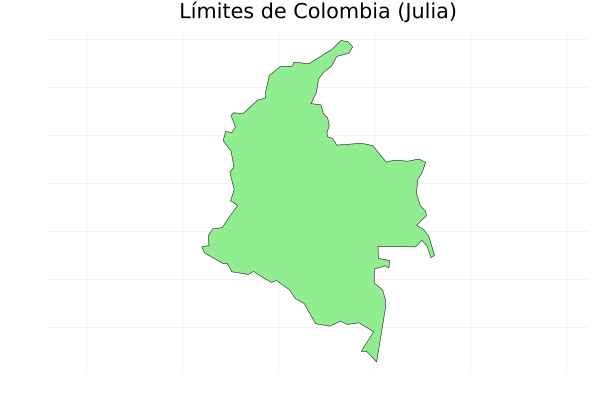

---
format:
  html: default
  pdf:
    screenshot: true  # <--- ESTO ES CLAVE
    # Opcionalmente, si falla, intenta:
    prefer-html: true    
    keep-tex: true
    mermaid-format: png
    include-in-header:
      - text: \usepackage{pdflscape}
---

# Trabajando con Archivos {#sec-trabajando_archivos}

## Funciones j_eval y j_plot en R

```{r}
#| label: j_eval_j_plot
#| code-fold: true
# #| include: false
source("./docs/j_eval_j_plot.r")
```

## Introducción

En el mundo real de la geomática, no todos los datos espaciales llegan a nuestras manos en formatos geográficos perfectamente estructurados como Shapefiles (`.shp`) o GeoPackages (`.gpkg`). Con muchísima frecuencia, los analistas espaciales deben lidiar con datos "crudos": coordenadas GPS capturadas en libretas de campo electrónicas y guardadas en archivos de texto plano, bases de datos socioeconómicas del DANE en formato CSV, o registros de estaciones meteorológicas del IDEAM que contienen valores nulos o errores de tipeo.

Antes de poder visualizar un mapa o ejecutar una herramienta de geoprocesamiento espacial usando librerías avanzadas como `geopandas` o `sf`, es fundamental saber cómo comunicarnos con el sistema operativo para abrir, leer, limpiar y guardar estos archivos desde cero. 

Además, dado que los datos del mundo real son "sucios" por naturaleza, un buen algoritmo de procesamiento masivo no debe colapsar ni detenerse por completo al encontrar una letra donde debería ir un número. Aquí es donde entra en juego el **manejo de excepciones**, una habilidad de programación vital para construir herramientas robustas, automatizadas y a prueba de fallos.

## Objetivos de aprendizaje

Al finalizar esta sección, el estudiante será capaz de:

1. **Manipular archivos en el sistema operativo:** Abrir, leer y escribir archivos de texto plano y tabulares (CSV) garantizando el cierre seguro de las conexiones en Python, R y Julia.
2. **Procesar y limpiar cadenas de texto:** Utilizar métodos nativos de manipulación de *strings* para separar, limpiar y extraer valores numéricos de coordenadas (latitud y longitud).
3. **Implementar manejo robusto de excepciones:** Construir bloques de control predictivos (`try...except`, `tryCatch`) que capturen errores específicos (como archivos no encontrados o formatos de datos inválidos) sin interrumpir el flujo del programa.
4. **Estructurar información asimétrica:** Transformar texto crudo en estructuras de memoria eficientes (como listas de diccionarios) que sirvan de puente hacia la construcción de *DataFrames* espaciales.

## Una nota sobre las rutas de los archivos (paths)

En programación, es un error técnico grave usar **rutas absolutas** (por ejemplo, `C:\Usuarios\Maestria\SIG\data\COL.geo.json`). Si compartes tu código con otro investigador o ejecutas el script en un servidor Linux, la estructura de carpetas no existirá y el programa fallará inmediatamente.

La solución estándar es usar **rutas relativas** en combinación con los **constructores de rutas nativos** de cada lenguaje. Esto garantiza que tu script encuentre los datos basándose en el directorio de trabajo actual y que los separadores de carpetas (`/` en Mac/Linux, `\` en Windows) se asignen dinámicamente según el sistema operativo.

Para navegar de forma relativa, los sistemas informáticos utilizan dos comodines estándar:

* `.` (un punto): Representa el **directorio actual** (la carpeta donde se está ejecutando el script o *notebook*).
* `..` (dos puntos): Representa el **directorio superior** (la carpeta "padre"). Se utiliza para retroceder niveles en el árbol de archivos. 


Por ejemplo, si tu script está dentro de una subcarpeta llamada `scripts/` y quieres acceder a los datos que están en una carpeta paralela, usarías `..` para salir de `scripts/` y luego entrarías a la ruta deseada (ej. `../data/mi_archivo.csv`).

### Ejemplo aplicado: Construcción de rutas y mapa estático

A continuación, asumiremos que nuestro entorno de ejecución está en la raíz del proyecto y necesitamos abrir un límite  nacional ubicado exactamente en la ruta relativa: `data/vector/geojson/COL.geo.json`. 

El código demuestra cómo ensamblar esta ruta independientemente del sistema operativo, abrir el dato espacial y generar un gráfico estático.

::: {.panel-tabset}

### Python

::: {.content-visible when-format="html"}
::: {.callout-tip collapse="true" icon="false"}
#### ▷ CÓDIGO PURO (Copiar y Pegar)
```{python}
#| label: python_rutas_mapa_codigo
#| eval: false

import geopandas as gpd
import matplotlib.pyplot as plt
from pathlib import Path

# 1. Construcción segura de la ruta relativa
# Path(".") hace referencia al directorio actual.
# El operador '/' es sobrecargado por pathlib para unir carpetas correctamente.
ruta_archivo = Path(".") / "data" / "vector" / "geojson" / "COL.geo.json"

# Blindaje con try-except para evitar colapso si la ruta no existe
try:
    # 2. Leer el archivo espacial usando geopandas
    colombia_gdf = gpd.read_file(ruta_archivo)

    # 3. Graficar el mapa estático
    fig, ax = plt.subplots(figsize=(6, 6))
    colombia_gdf.plot(ax=ax, color="lightgreen", edgecolor="black", linewidth=0.5)
    ax.set_title("Límites de Colombia (Python)")
    ax.set_axis_off() # Ocultamos los ejes para una visualización más cartográfica
    plt.show()
except Exception as e:
    # 4. Manejo del error en caso de fallo en la lectura
    print(f"No se pudo generar el mapa. Verifica la ruta: {ruta_archivo}")

```

:::
:::

```{python}
#| label: python_rutas_mapa
#| fig-width: 8
#| out-width: "50%"
#| fig-align: center
# #| eval: false

import geopandas as gpd
import matplotlib.pyplot as plt
from pathlib import Path

# 1. Construcción segura de la ruta relativa
# Path(".") hace referencia al directorio actual.
# El operador '/' es sobrecargado por pathlib para unir carpetas correctamente.
ruta_archivo = Path(".") / "data" / "vector" / "geojson" / "COL.geo.json"

# Blindaje con try-except para evitar colapso en Quarto
try:
    # 2. Leer el archivo espacial
    colombia_gdf = gpd.read_file(ruta_archivo)

    # 3. Graficar el mapa estático
    fig, ax = plt.subplots(figsize=(6, 6))
    colombia_gdf.plot(ax=ax, color="lightgreen", edgecolor="black", linewidth=0.5)
    ax.set_title("Límites de Colombia (Python)")
    ax.set_axis_off() # Ocultamos los ejes para una visualización más cartográfica
    plt.show()
except Exception as e:
    # 4. Mensaje controlado en consola si falla la ruta
    print(f"No se pudo generar el mapa. Verifica la ruta: {ruta_archivo}")
```

### R

::: {.content-visible when-format="html"}
::: {.callout-tip collapse="true" icon="false"}
#### ▷ CÓDIGO PURO (Copiar y Pegar)
```{r}
#| label: r_rutas_mapa_codigo
#| eval: false

library(sf)

# 1. Construcción segura de la ruta relativa
# file.path se encarga de usar el separador adecuado del sistema operativo
ruta_archivo <- file.path(".", "data", "vector", "geojson", "COL.geo.json")

# Blindaje comprobando si el archivo existe
if (file.exists(ruta_archivo)) {
    # 2. Leer el archivo espacial 
    # quiet = TRUE evita que se imprima la metadata en la consola durante la lectura
    colombia_sf <- st_read(ruta_archivo, quiet = TRUE)

    # 3. Graficar el mapa estático
    # st_geometry extrae solo el contorno espacial para un renderizado rápido
    plot(st_geometry(colombia_sf), 
         col = "lightgreen", 
         border = "black", 
         lwd = 0.5,
         main = "Límites de Colombia (R)")
} else {
    # 4. Control del error si la ruta es inválida    
    cat(sprintf("No se pudo generar el mapa. Verifica la ruta: %s\n", ruta_archivo))
}

```
:::
:::

```{r}
#| label: r_rutas_mapa
#| out-width: "80%"
# #| eval: false

library(sf)

# 1. Construcción segura de la ruta relativa
# file.path se encarga de usar el separador adecuado del sistema operativo
ruta_archivo <- file.path(".", "data", "vector", "geojson", "COL.geo.json")

# Blindaje comprobando si el archivo existe
if (file.exists(ruta_archivo)) {
    # 2. Leer el archivo espacial 
    # quiet = TRUE evita que se imprima la metadata en la consola durante la lectura    
    colombia_sf <- st_read(ruta_archivo, quiet = TRUE)

    # 3. Graficar el mapa estático
    # st_geometry extrae solo el contorno espacial para un renderizado rápido    
    plot(st_geometry(colombia_sf), 
         col = "lightgreen", 
         border = "black", 
         lwd = 0.5,
         main = "Límites de Colombia (R)")
} else {
    # 4. Control de error    
    cat(sprintf("No se pudo generar el mapa. Verifica la ruta: %s\n", ruta_archivo))
}
```


### Julia

::: {.content-visible when-format="html"}
::: {.callout-tip collapse="true" icon="false"}
#### ▷ CÓDIGO PURO (Copiar y Pegar)
```{julia}
#| label: julia_rutas_mapa_codigo
#| eval: false

using GeoDataFrames
using Plots

# 1. Construcción segura de la ruta relativa
# joinpath une los segmentos de la ruta utilizando el separador nativo del SO
ruta_archivo = joinpath(".", "data", "vector", "geojson", "COL.geo.json")

# 2. Leer el archivo espacial
colombia_gdf = GeoDataFrames.read(ruta_archivo)

# 3. Graficar el mapa estático
# Plots soporta nativamente la visualización de la columna geometry
plot(colombia_gdf.geometry, 
     fillcolor = :lightgreen, 
     linecolor = :black, 
     linewidth = 0.5,
     title = "Límites de Colombia (Julia)", 
     legend = false,
     axis = false,
     aspect_ratio = :equal) # aspect_ratio = :equal evita que el mapa se deforme
```

:::
:::

```{r}
#| label: julia_rutas_mapa
#| out-width: "60%"
#| fig-align: "center"
#| echo: false
#| results: asis
# #| eval: false


# Envolvemos en invisible() para que no imprima texto basura en el PDF/HTML
invisible(j_eval(r"-(
using GeoDataFrames
using Plots

# 1. Definición de rutas relativas con joinpath (robusto para SO)
# j_eval asume el directorio de trabajo del .qmd
f_entrada = joinpath(".", "data", "vector", "geojson", "COL.geo.json")
f_salida = joinpath(".", "images", "plots", "mapa_colombia_julia.png")

# Garantizar la existencia del directorio images/plots para guardar la imagen
output_dir = dirname(f_salida)
if !isdir(output_dir)
    mkpath(output_dir)
end

# Blindaje general para proteger la ejecución en Quarto
try
    if isfile(f_entrada)
        # 2. Leer GeoJSON
        colombia_gdf = GeoDataFrames.read(f_entrada)

        # 3. Generar gráfico en variable 'p' asegurando la relación de aspecto cartográfica
        p = plot(colombia_gdf.geometry,
             fillcolor = :lightgreen,
             linecolor = :black,
             linewidth = 0.5,
             title = "Límites de Colombia (Julia)",
             legend = false,
             axis = false,
             aspect_ratio = :equal)

        # GUARDAR FÍSICAMENTE la imagen en disco
        savefig(p, f_salida)
    else
        # 4. Si no hay archivo, guardar imagen con mensaje de error claro
        p_error = plot(title = "❌ Archivo no encontrado:\n$f_entrada", legend=false, axis=false, grid=false)
        savefig(p_error, f_salida)
    end
catch e
    # Capturar fallo crítico y guardar mensaje en imagen
    p_crash = plot(title = "❌ Fallo crítico detectado:\n$(typeof(e))", titlefontsize=10, legend=false, axis=false, grid=false)
    savefig(p_crash, f_salida)
end
)-"))

# Inserto la imagen usando R de forma segura

```

:::


## Creando un archivo de muestra

En este ejercicio, vamos a crear un archivo de texto plano (`coordenadas_colombia_p.txt`) que contendrá las coordenadas (Latitud, Longitud) de cinco de las principales ciudades de Colombia: Bogotá, Medellín, Cali, Barranquilla y Cartagena. Esto nos servirá como base para leer datos tabulares más adelante.

::: {.panel-tabset}

### Python

::: {.content-visible when-format="html"}
::: {.callout-tip collapse="true" icon="false"}
#### ▷ CÓDIGO PURO (Copiar y Pegar)
```{python}
#| label: python_crear_archivo_codigo
#| eval: false

# 1. Definimos los datos usando un string de múltiples líneas (triple comilla).
# Orden: Latitud, Longitud (Bogotá, Medellín, Cali, Barranquilla, Cartagena)
datos_muestra = """4.7110,-74.0721
6.2442,-75.5812
3.4516,-76.5320
10.9685,-74.7813
10.3910,-75.4794"""

# 2. Definimos la variable 'f_txt' que almacena la ruta y nombre del archivo
f_txt = "coordenadas_colombia_p.txt"

# 3. Manejo de excepciones completo para la creación del archivo
try:
    # 'w' indica modo escritura (write). 'with' cierra el archivo automáticamente.
    # Asignamos el archivo abierto a la variable 'con' (conexión)
    with open(f_txt, "w", encoding="utf-8") as con:
        # Escribimos los datos en la conexión. 
        # Python retorna la cantidad de caracteres escritos.
        caracteres_escritos = con.write(datos_muestra)
        #
        # Imprime automáticamente caracteres_escritos en modo interactivo
        #con.write(datos_muestra)
        #
        # Evita que se imprima el número de caracteres_escritos usando '_'
        #_ = con.write(datos_muestra)
except Exception as e:
    # Bloque que se ejecuta solo si ocurre un error en la apertura/escritura
    print(f"Ocurrió un error al crear el archivo: {e}")
else:
    # Bloque que se ejecuta solo si el 'try' fue exitoso (sin errores)
    print(f"El archivo '{f_txt}' ha sido creado exitosamente. Se guardaron {caracteres_escritos} caracteres.")
finally:
    # Bloque que se ejecuta SIEMPRE, haya ocurrido un error o no, ideal para limpieza
    print("Done.")
```
:::
:::

```{python}
#| label: python_crear_archivo
# #| eval: false

# 1. Definimos los datos usando un string de múltiples líneas (triple comilla).
# Orden: Latitud, Longitud (Bogotá, Medellín, Cali, Barranquilla, Cartagena)
datos_muestra = """4.7110,-74.0721
6.2442,-75.5812
3.4516,-76.5320
10.9685,-74.7813
10.3910,-75.4794"""

# 2. Definimos la variable 'f_txt' que almacena la ruta y nombre del archivo
f_txt = "coordenadas_colombia_p.txt"

# 3. Manejo de excepciones completo para la creación del archivo
try:
    # 'w' indica modo escritura (write). 'with' cierra el archivo automáticamente.
    # Asignamos el archivo abierto a la variable 'con' (conexión)
    with open(f_txt, "w", encoding="utf-8") as con:
        # Escribimos los datos en la conexión. 
        # Python retorna la cantidad de caracteres escritos.
        caracteres_escritos = con.write(datos_muestra)
        #
        # Imprime automáticamente caracteres_escritos en modo interactivo
        #con.write(datos_muestra)
        #
        # Evita que se imprima el número de caracteres_escritos usando '_'
        #_ = con.write(datos_muestra)
except Exception as e:
    # Bloque que se ejecuta solo si ocurre un error en la apertura/escritura
    print(f"Ocurrió un error al crear el archivo: {e}")
else:
    # Bloque que se ejecuta solo si el 'try' fue exitoso (sin errores)
    print(f"El archivo '{f_txt}' ha sido creado exitosamente. Se guardaron {caracteres_escritos} caracteres.")
finally:
    # Bloque que se ejecuta SIEMPRE, haya ocurrido un error o no, ideal para limpieza
    print("Done.")
```

Las alternativas a `except Exception as e:` son específicas al tipo de error esperado. Mayor información [acá](https://www.datacamp.com/tutorial/python-try-except). Por ejemplo:

* `except ValueError:`
* `except LookupError:`
* `except IOError:`
* `except FileNotFoundError:`
* `except TimeoutError:`
* `except ZeroDivisionError:`
* `except KeyError:`


### R

::: {.content-visible when-format="html"}
::: {.callout-tip collapse="true" icon="false"}
#### ▷ CÓDIGO PURO (Copiar y Pegar)
```{r}
#| label: r_crear_archivo_codigo
#| eval: false

# 1. En R, usamos el salto de línea '\n' para simular múltiples líneas
datos_muestra <- "4.7110,-74.0721\n6.2442,-75.5812\n3.4516,-76.5320\n10.9685,-74.7813\n10.3910,-75.4794"

# 2. Definimos la variable 'f_txt' para la ruta del archivo
f_txt <- "coordenadas_colombia_r.txt"

# 3. tryCatch nos permite manejar errores e incluir un bloque 'finally'
tryCatch({
    # Bloque de ejecución principal
    # Método directo: R abre y cierra la conexión automáticamente
    writeLines(datos_muestra, f_txt)
    #
    # Alternativamente, abrimos la conexión al archivo explícitamente en la variable 'con'
    #con <- file(f_txt, "w", encoding="UTF-8")

    # Escribimos los datos usando esa conexión explícita
    # writeLines(datos_muestra, con)

    # Es fundamental cerrar la conexión manualmente al terminar si usamos file()
    #close(con)

    # En R no hay un 'else' explícito en tryCatch, por lo que el mensaje 
    # de éxito se pone al final del bloque principal (solo llega aquí si no hay error)
    cat(sprintf("El archivo '%s' ha sido creado exitosamente.\n", f_txt))
    
}, error = function(e) {
    # Bloque que se ejecuta si ocurre un error (ej. disco lleno o sin permisos)
    cat(sprintf("Ocurrió un error al crear el archivo: %s\n", e$message))
    
}, finally = {
    # Bloque que se ejecuta SIEMPRE para finalizar el proceso
    cat("Done.\n")
})
```
:::
:::

```{r}
#| label: r_crear_archivo
# #| eval: false

# 1. En R, usamos el salto de línea '\n' para simular múltiples líneas
datos_muestra <- "4.7110,-74.0721\n6.2442,-75.5812\n3.4516,-76.5320\n10.9685,-74.7813\n10.3910,-75.4794"

# 2. Definimos la variable 'f_txt' para la ruta del archivo
f_txt <- "coordenadas_colombia_r.txt"

# 3. tryCatch nos permite manejar errores e incluir un bloque 'finally'
tryCatch({
    # Bloque de ejecución principal
    # Método directo: R abre y cierra la conexión automáticamente
    writeLines(datos_muestra, f_txt)
    #
    # Alternativamente, abrimos la conexión al archivo explícitamente en la variable 'con'
    #con <- file(f_txt, "w")

    # Escribimos los datos usando esa conexión explícita
    # writeLines(datos_muestra, con)

    # Es fundamental cerrar la conexión manualmente al terminar si usamos file()
    #close(con)
    
    # En R no hay un 'else' explícito en tryCatch, por lo que el mensaje 
    # de éxito se pone al final del bloque principal (solo llega aquí si no hay error)
    cat(sprintf("El archivo '%s' ha sido creado exitosamente.\n", f_txt))
    
}, error = function(e) {
    # Bloque que se ejecuta si ocurre un error (ej. disco lleno o sin permisos)
    cat(sprintf("Ocurrió un error al crear el archivo: %s\n", e$message))
    
}, finally = {
    # Bloque que se ejecuta SIEMPRE para finalizar el proceso
    cat("Done.\n")
})
```

### Julia

::: {.content-visible when-format="html"}
::: {.callout-tip collapse="true" icon="false"}
#### ▷ CÓDIGO PURO (Copiar y Pegar)
```{julia}
#| label: julia_crear_archivo_codigo
#| eval: false

# 1. Julia también permite strings de múltiples líneas con triple comilla
datos_muestra = """
4.7110,-74.0721
6.2442,-75.5812
3.4516,-76.5320
10.9685,-74.7813
10.3910,-75.4794"""

# 2. Definimos la variable 'f_txt' que contiene la ruta al archivo
f_txt = "coordenadas_colombia_j.txt"

# 3. Bloque try-catch-finally para manejar la escritura
try
    # open con el bloque 'do' asigna la conexión a 'con' y la cierra automáticamente al terminar
    open(f_txt, "w") do con
        # Escribimos los datos en la conexión. strip() quita saltos de línea extra al inicio/fin
        write(con, strip(datos_muestra))
    end
    
    # Julia no tiene 'else' para el try, el éxito se asume si llegamos a esta línea sin saltar al catch
    println("El archivo '$f_txt' ha sido creado exitosamente.")
    
catch e
    # Bloque que se ejecuta si ocurre un error durante la apertura o escritura
    println("Ocurrió un error al crear el archivo: ", e)
    
finally
    # Bloque que se ejecuta SIEMPRE, útil para garantizar la liberación de recursos
    println("Done.")
end
```
:::
:::

```{r}
#| label: julia_crear_archivo
#| results: asis
#| code-fold: true
# #| eval: false

j_eval(r"-(
# 1. Julia también permite strings de múltiples líneas con triple comilla
datos_muestra = """
4.7110,-74.0721
6.2442,-75.5812
3.4516,-76.5320
10.9685,-74.7813
10.3910,-75.4794"""

# 2. Definimos la variable 'f_txt' que contiene la ruta al archivo
f_txt = "coordenadas_colombia_j.txt"

# 3. Bloque try-catch-finally para manejar la escritura
try
    # open con el bloque 'do' asigna la conexión a 'con' y la cierra automáticamente al terminar
    open(f_txt, "w") do con
        # Escribimos los datos en la conexión. strip() quita saltos de línea extra al inicio/fin
        write(con, strip(datos_muestra))
    end
    
    # Julia no tiene 'else' para el try, el éxito se asume si llegamos a esta línea sin saltar al catch
    println("El archivo '$f_txt' ha sido creado exitosamente.")
    
catch e
    # Bloque que se ejecuta si ocurre un error durante la apertura o escritura
    println("Ocurrió un error al crear el archivo: ", e)
    
finally
    # Bloque que se ejecuta SIEMPRE, útil para garantizar la liberación de recursos
    println("Done.")
end
)-")
```


::: {.callout-note title="¿Por qué usamos strip() aquí?"}
La función `strip(datos_muestra)` en Julia sirve para eliminar cualquier espacio en blanco o salto de línea (`\n`) que esté al principio o al final de la cadena de texto.

Al definir nuestra variable con triple comilla y dar un "enter" para que el código se vea ordenado:

```julia
datos_muestra = """
4.7110,-74.0721
...
```
Ese primer "enter" es interpretado por Julia como una línea vacía. Si no usamos `strip()`, el archivo se guardaría con un salto de línea inicial, lo cual podría generar errores (como datos nulos o `NaN`) al intentar leerlo posteriormente como una tabla. Al aplicar `strip()`, le indicamos a Julia que corte esa "basura" de los bordes, garantizando que el archivo comience exactamente con el primer dígito de la latitud.
:::

:::

### Resumen comparativo de escritura de archivos

Para facilitar el estudio y la asimilación de los tres lenguajes, aquí detallo las diferencias clave en las funciones que acabamos de usar:

| Característica / Tarea | Python 🐍 | R 🔵 | Julia 🟣 |
| :- | :--- | :--- | :--- |
| **Definir strings multilinea** | `"""texto"""` | `"\n"` explícito en la cadena | `"""texto"""` |
| **Abrir/Crear archivo** | `open(f_txt, "w") as con` | `con = file(f_txt, "w")`<br>o<br>`writeLines(datos, f_txt)` | `open(f_txt, "w") do con` |
| **Escribir datos** | `con.write(datos)` | `writeLines(datos, con)`<br>o<br>`writeLines(datos, f_txt)` | `write(con, datos)` |
| **Manejo seguro de cierre** | `with open(f_txt, "w") as con:` | `close(con)`<br>o<br>Automático al terminar script| `open(f_txt, "w") do con`<br>&nbsp;&nbsp;&nbsp;&nbsp;`...`<br>`end` |
| **Manejo de Errores** | `try:`<br>&nbsp;&nbsp;&nbsp;&nbsp;`...`<br>`except Exception as e:`<br>&nbsp;&nbsp;&nbsp;&nbsp;`...` | `tryCatch({`<br>&nbsp;&nbsp;&nbsp;&nbsp;`...`<br>`}, error = function(e){`<br>&nbsp;&nbsp;&nbsp;&nbsp;`...`<br>`})` | `try`<br>&nbsp;&nbsp;&nbsp;&nbsp;`...`<br>`catch e`<br>&nbsp;&nbsp;&nbsp;&nbsp;`...`<br>`end` |
| **Ejecución de Éxito** | Bloque `else:` | Al final del bloque principal `tryCatch` | Al final del bloque `try` |
| **Cierre garantizado** | Bloque `finally:` | Argumento `finally = {}` | Bloque `finally` |

::: {.callout-important title="¡Cuidado con los acentos! (Encoding UTF-8)"}
Al trabajar con datos en Colombia (o en español en general), es común tener caracteres especiales como tildes (Bogotá, Medellín) o la letra ñ. 
Por defecto, Windows puede intentar leer estos archivos usando codificaciones antiguas. Para evitar que tu código colapse con un `UnicodeDecodeError` o que los textos se corrompan, **siempre** declara explícitamente `encoding="utf-8"` (en Python) o `encoding="UTF-8"` (en R) al abrir un archivo de texto. Julia maneja UTF-8 de forma nativa por defecto.
:::

## Leyendo y escribiendo archivos

En este paso, vamos a leer el archivo de coordenadas que creamos en la sección anterior, procesaremos cada línea para separar la latitud de la longitud, y guardaremos los resultados en un nuevo archivo con un formato mucho más legible.

::: {.panel-tabset}

### Python

::: {.content-visible when-format="html"}
::: {.callout-tip collapse="true" icon="false"}
#### ▷ CÓDIGO PURO (Copiar y Pegar)
```{python}
#| label: python_leer_escribir_codigo
#| eval: false

# 1. Definimos las variables para los archivos de entrada y salida
f_in = "coordenadas_colombia_p.txt"
f_out = "coordenadas_formato_p.txt"

try:
    # 2. Abrimos el archivo de entrada en modo lectura ('r' de read)
    with open(f_in, "r", encoding="utf-8") as con_in:
        # readlines() lee todas las líneas y devuelve una lista.
        # Cada elemento de la lista incluye el salto de línea (\n) al final.
        coordenadas = con_in.readlines()

    # 3. Abrimos el archivo de salida en modo escritura ('w' de write)
    with open(f_out, "w", encoding="utf-8") as con_out:
        # Recorremos cada línea de la lista que leímos
        for linea in coordenadas:
            # strip() elimina espacios en blanco y el salto de línea (\n) de los extremos.
            # split(",") divide la cadena de texto en dos partes usando la coma como separador.
            lat, lon = linea.strip().split(",")

            # Escribimos el dato formateado en nuestro archivo de salida.
            # Usamos \n para asegurar que cada coordenada quede en una línea nueva.
            _ = con_out.write(f"Latitud: {lat}, Longitud: {lon}\n")

    print(f"Las coordenadas han sido guardadas con nuevo formato en '{f_out}'.")

except FileNotFoundError:
    # Este bloque específico atrapa el error si el archivo de entrada no existe
    print(f"Error: El archivo '{f_in}' no fue encontrado.")
    print("Asegúrate de haber ejecutado el chunk de Python anterior para crearlo.")
except Exception as e:
    # Atrapa cualquier otro error inesperado
    print(f"Ocurrió un error inesperado: {e}")
```
:::
:::

```{python}
#| label: python_leer_escribir
# #| eval: false

# 1. Definimos las variables para los archivos de entrada y salida
f_in = "coordenadas_colombia_p.txt"
f_out = "coordenadas_formato_p.txt"

try:
    # 2. Abrimos el archivo de entrada en modo lectura ('r' de read)
    with open(f_in, "r", encoding="utf-8") as con_in:
        # readlines() lee todas las líneas y devuelve una lista.
        # Cada elemento de la lista incluye el salto de línea (\n) al final.
        coordenadas = con_in.readlines()

    # 3. Abrimos el archivo de salida en modo escritura ('w' de write)
    with open(f_out, "w", encoding="utf-8") as con_out:
        # Recorremos cada línea de la lista que leímos
        for linea in coordenadas:
            # strip() elimina espacios en blanco y el salto de línea (\n) de los extremos.
            # split(",") divide la cadena de texto en dos partes usando la coma como separador.
            lat, lon = linea.strip().split(",")

            # Escribimos el dato formateado en nuestro archivo de salida.
            # Usamos \n para asegurar que cada coordenada quede en una línea nueva.
            _ = con_out.write(f"Latitud: {lat}, Longitud: {lon}\n")

    print(f"Las coordenadas han sido guardadas con nuevo formato en '{f_out}'.")

except FileNotFoundError:
    # Este bloque específico atrapa el error si el archivo de entrada no existe
    print(f"Error: El archivo '{f_in}' no fue encontrado.")
    print("Asegúrate de haber ejecutado el chunk de Python anterior para crearlo.")
except Exception as e:
    # Atrapa cualquier otro error inesperado
    print(f"Ocurrió un error inesperado: {e}")
```

### R

::: {.content-visible when-format="html"}
::: {.callout-tip collapse="true" icon="false"}
#### ▷ CÓDIGO PURO (Copiar y Pegar)
```{r}
#| label: r_leer_escribir_codigo
#| eval: false

# 1. Definimos las variables para los archivos de entrada y salida (usamos los de R)
f_in <- "coordenadas_colombia_r.txt"
f_out <- "coordenadas_formato_r.txt"

tryCatch({
    # 2. Abrimos conexión de lectura y leemos las líneas
    con_in <- file(f_in, "r", encoding="UTF-8")
    coordenadas <- readLines(con_in, warn = FALSE)
    close(con_in) # Cerramos la conexión de entrada

    # 3. Abrimos conexión de escritura para el nuevo archivo
    con_out <- file(f_out, "w", encoding="UTF-8")
    
    # Iteramos sobre cada línea
    for (linea in coordenadas) {
        # trimws() quita espacios. strsplit() divide por la coma (devuelve una lista)
        partes <- strsplit(trimws(linea), ",")[[1]]
        lat <- partes[1]
        lon <- partes[2]
        
        # Formateamos el texto y lo escribimos en la conexión
        # writeLines añade el salto de línea automáticamente en R
        texto_formateado <- sprintf("Latitud: %s, Longitud: %s", lat, lon)
        writeLines(texto_formateado, con_out)
    }
    close(con_out) # Cerramos la conexión de salida
    
    cat(sprintf("Las coordenadas han sido guardadas con nuevo formato en '%s'.\n", f_out))

}, error = function(e) {
    # Manejo de errores (por ejemplo, si el archivo no existe)
    cat(sprintf("Error al procesar los archivos: %s\n", e$message))
    cat("Asegúrate de haber ejecutado el chunk de R anterior para crear el archivo base.\n")
})
```
:::
:::

```{r}
#| label: r_leer_escribir
# #| eval: false

# 1. Definimos las variables para los archivos de entrada y salida (usamos los de R)
f_in <- "coordenadas_colombia_r.txt"
f_out <- "coordenadas_formato_r.txt"

tryCatch({
    # 2. Abrimos conexión de lectura y leemos las líneas
    con_in <- file(f_in, "r", encoding="UTF-8")
    coordenadas <- readLines(con_in, warn = FALSE)
    close(con_in) # Cerramos la conexión de entrada

    # 3. Abrimos conexión de escritura para el nuevo archivo
    con_out <- file(f_out, "w", encoding="UTF-8")
    
    # Iteramos sobre cada línea
    for (linea in coordenadas) {
        # trimws() quita espacios. strsplit() divide por la coma (devuelve una lista)
        partes <- strsplit(trimws(linea), ",")[[1]]
        lat <- partes[1]
        lon <- partes[2]
        
        # Formateamos el texto y lo escribimos en la conexión
        # writeLines añade el salto de línea automáticamente en R
        texto_formateado <- sprintf("Latitud: %s, Longitud: %s", lat, lon)
        writeLines(texto_formateado, con_out)
    }
    close(con_out) # Cerramos la conexión de salida
    
    cat(sprintf("Las coordenadas han sido guardadas con nuevo formato en '%s'.\n", f_out))

}, error = function(e) {
    # Manejo de errores (por ejemplo, si el archivo no existe)
    cat(sprintf("Error al procesar los archivos: %s\n", e$message))
    cat("Asegúrate de haber ejecutado el chunk de R anterior para crear el archivo base.\n")
})
```

### Julia

::: {.content-visible when-format="html"}
::: {.callout-tip collapse="true" icon="false"}
#### ▷ CÓDIGO PURO (Copiar y Pegar)
```{julia}
#| label: julia_leer_escribir_codigo
#| eval: false

# 1. Definimos los nombres de archivo (usando los de Julia)
f_in = "coordenadas_colombia_j.txt"
f_out = "coordenadas_formato_j.txt"

try
    # 2. Leer los datos. open con 'do' cierra automáticamente la conexión
    coordenadas = open(f_in, "r") do con_in
        readlines(con_in) # Devuelve un arreglo (Array) con cada línea
    end

    # 3. Procesar y escribir. Abrimos el nuevo archivo
    open(f_out, "w") do con_out
        for linea in coordenadas
            # strip() limpia la línea. split() separa por coma y permite asignación múltiple
            lat, lon = split(strip(linea), ",")
            
            # Escribimos el formato en la conexión (añadimos \n manualmente)
            write(con_out, "Latitud: $lat, Longitud: $lon\n")
        end
    end

    println("Las coordenadas han sido guardadas con nuevo formato en '$f_out'.")

catch e
    # Capturamos el error (típicamente SystemError si no encuentra el archivo)
    println("Error al procesar los archivos: ", e)
    println("Asegúrate de haber ejecutado el chunk de Julia anterior para crear el archivo base.")
end
```
:::
:::

```{r}
#| label: julia_leer_escribir
#| results: asis
#| code-fold: true
# #| eval: false

j_eval(r"-(
# 1. Definimos los nombres de archivo (usando los de Julia)
f_in = "coordenadas_colombia_j.txt"
f_out = "coordenadas_formato_j.txt"

try
    # 2. Leer los datos. open con 'do' cierra automáticamente la conexión
    coordenadas = open(f_in, "r") do con_in
        readlines(con_in) # Devuelve un arreglo (Array) con cada línea
    end

    # 3. Procesar y escribir. Abrimos el nuevo archivo
    open(f_out, "w") do con_out
        for linea in coordenadas
            # strip() limpia la línea. split() separa por coma y permite asignación múltiple
            lat, lon = split(strip(linea), ",")
            
            # Escribimos el formato en la conexión (añadimos \n manualmente)
            write(con_out, "Latitud: $lat, Longitud: $lon\n")
        end
    end

    println("Las coordenadas han sido guardadas con nuevo formato en '$f_out'.")

catch e
    # Capturamos el error (típicamente SystemError si no encuentra el archivo)
    println("Error al procesar los archivos: ", e)
    println("Asegúrate de haber ejecutado el chunk de Julia anterior para crear el archivo base.")
end
)-")
```

:::

### Resumen comparativo de lectura de archivos

A continuación, destacamos las diferencias en las funciones de manipulación y lectura de texto:

| Característica / Tarea | Python 🐍 | R 🔵 | Julia 🟣 |
| :- | :--- | :--- | :--- |
| **Abrir en modo lectura** | `open(f_in, "r") as con_in` | `con_in = file(f_in, "r")` | `open(f_in, "r") do con_in` |
| **Leer todas las líneas** | `con_in.readlines()` | `readLines(con_in)` | `readlines(con_in)` |
| **Limpiar espacios / saltos** | `linea.strip()` | `trimws(linea)` | `strip(linea)` |
| **Separar texto por coma** | `linea.split(",")` | `strsplit(linea, ",")[[1]]` | `split(linea, ",")` |
| **Formatear texto (variables)**| `f"Lat: {lat}"` | `sprintf("Lat: %s", lat)` | `"Lat: $lat"` |
| **Manejo Archivo no encontrado**| `except FileNotFoundError:` | Atrapado genéricamente por `error = function(e)` en el `tryCatch` | Atrapado genéricamente en `catch e` (es un `SystemError`) |


## Manejo de excepciones

A menudo, los datos espaciales que recibimos en formato de texto vienen con errores (filas incompletas, letras en lugar de números, etc.). En esta sección aprenderemos a crear una función robusta que capture esos errores usando bloques de excepciones, evitando que nuestro programa colapse al encontrar un dato mal formateado.

::: {.panel-tabset}

### Python

::: {.content-visible when-format="html"}
::: {.callout-tip collapse="true" icon="false"}
#### ▷ CÓDIGO PURO (Copiar y Pegar)
```{python}
#| label: python_excepciones_codigo
#| eval: false

# Ejemplo de manejo de excepciones al analizar coordenadas
def analizar_coordenadas(linea):
    """
    Analiza una línea de texto y la convierte en coordenadas de latitud y longitud.

    Argumentos:
        linea (str): Una cadena de texto con las coordenadas en formato "lat,lon"

    Retorna:
        tuple: (latitud, longitud) como flotantes (floats), o None si el análisis falla
    """
    try:
        # split() divide la cadena y retorna una lista (list) de textos (str).
        # Desempacamos esa lista directamente en dos variables de texto: lat_str y lon_str
        lat_str, lon_str = linea.strip().split(",")
        
        # Convertimos las variables de texto (str) a números decimales (float)
        # Esto puede generar un ValueError si el texto no es un número válido
        lat = float(lat_str)
        lon = float(lon_str)
        
        # Retornamos los valores empaquetados en una tupla (tuple) de floats
        return lat, lon

    except ValueError as e:
        # Este bloque se ejecuta si no se puede convertir a float o si split() no devuelve 2 valores
        print(f"Error de formato: {e}. No se pudo procesar la línea (tipo str): '{linea.strip()}'")
        # Retornamos un tipo nulo (NoneType)
        return None

    except Exception as e:
        # Este bloque captura cualquier otro error inesperado
        print(f"Ocurrió un error inesperado: {e}")
        return None

# Almacenaremos todos los casos de prueba en una lista (list) de textos (str) llamada lineas_prueba
lineas_prueba = [
    "4.7110,-74.0721",      # Coordenadas válidas (Bogotá)
    "datos invalidos",      # Formato inválido (sin coma)
    "10.9685,-74.7813",     # Coordenadas válidas (Barranquilla)
    "10.9685,no_es_numero", # Longitud inválida (no se puede convertir a float)
    "solo_un_valor",        # Falta la coma (split falla al desempacar)
]

print("Probando el análisis de coordenadas:")
# Recorremos la lista. En cada iteración, 'linea' es un texto (str)
for linea in lineas_prueba:
    # 'coordenadas' recibirá una tupla (tuple) o un valor nulo (None)
    coordenadas = analizar_coordenadas(linea)
    
    if coordenadas:
        print(f"✓ Procesado exitosamente: {coordenadas}")
    else:
        print(f"✗ Falló al procesar: '{linea}'")
```
:::
:::

```{python}
#| label: python_excepciones
# #| eval: false

# Ejemplo de manejo de excepciones al analizar coordenadas
def analizar_coordenadas(linea):
    """
    Analiza una línea de texto y la convierte en coordenadas de latitud y longitud.

    Argumentos:
        linea (str): Una cadena de texto con las coordenadas en formato "lat,lon"

    Retorna:
        tuple: (latitud, longitud) como flotantes (floats), o None si el análisis falla
    """
    try:
        # split() divide la cadena y retorna una lista (list) de textos (str).
        # Desempacamos esa lista directamente en dos variables de texto: lat_str y lon_str
        lat_str, lon_str = linea.strip().split(",")
        
        # Convertimos las variables de texto (str) a números decimales (float)
        # Esto puede generar un ValueError si el texto no es un número válido
        lat = float(lat_str)
        lon = float(lon_str)
        
        # Retornamos los valores empaquetados en una tupla (tuple) de floats
        return lat, lon

    except ValueError as e:
        # Este bloque se ejecuta si no se puede convertir a float o si split() no devuelve 2 valores
        print(f"Error de formato: {e}. No se pudo procesar la línea (tipo str): '{linea.strip()}'")
        # Retornamos un tipo nulo (NoneType)
        return None

    except Exception as e:
        # Este bloque captura cualquier otro error inesperado
        print(f"Ocurrió un error inesperado: {e}")
        return None

# Almacenaremos todos los casos de prueba en una lista (list) de textos (str) llamada lineas_prueba
lineas_prueba = [
    "4.7110,-74.0721",      # Coordenadas válidas (Bogotá)
    "datos invalidos",      # Formato inválido (sin coma)
    "10.9685,-74.7813",     # Coordenadas válidas (Barranquilla)
    "10.9685,no_es_numero", # Longitud inválida (no se puede convertir a float)
    "solo_un_valor",        # Falta la coma (split falla al desempacar)
]

print("Probando el análisis de coordenadas:")
# Recorremos la lista. En cada iteración, 'linea' es un texto (str)
for linea in lineas_prueba:
    # 'coordenadas' recibirá una tupla (tuple) o un valor nulo (None)
    coordenadas = analizar_coordenadas(linea)
    
    if coordenadas:
        print(f"✓ Procesado exitosamente: {coordenadas}")
    else:
        print(f"✗ Falló al procesar: '{linea}'")
```

### R

::: {.content-visible when-format="html"}
::: {.callout-tip collapse="true" icon="false"}
#### ▷ CÓDIGO PURO (Copiar y Pegar)
```{r}
#| label: r_excepciones_codigo
#| eval: false

# Ejemplo de manejo de excepciones al analizar coordenadas en R
analizar_coordenadas <- function(linea) {
    # 'linea' ingresa como un vector de caracteres (character) de longitud 1
    tryCatch({
        # Limpiamos espacios. linea_limpia sigue siendo character
        linea_limpia <- trimws(linea)
        
        # strsplit devuelve una lista (list) de vectores. Extraemos el primer vector de caracteres con [[1]]
        # 'partes' es ahora un vector de caracteres (character vector)
        partes <- strsplit(linea_limpia, ",")[[1]]
        
        # Verificamos si la longitud del vector es distinta de 2
        if (length(partes) != 2) {
            stop("La línea no tiene exactamente dos valores separados por coma")
        }
        
        # Intentamos convertir texto (character) a numérico (numeric). 
        # R devuelve NA (Not Available) si falla la conversión.
        lat <- suppressWarnings(as.numeric(partes[1]))
        lon <- suppressWarnings(as.numeric(partes[2]))
        
        # is.na() evalúa si el tipo de dato numérico es un valor perdido
        if (is.na(lat) || is.na(lon)) {
            stop("Uno o ambos valores no son números válidos")
        }
        
        # En R, no hay tuplas. Retornamos un vector numérico (numeric vector) combinando con c()
        return(c(lat, lon))
        
    }, error = function(e) {
        # Atrapamos errores y retornamos NULL (el equivalente al objeto nulo)
        cat(sprintf("Error de formato: %s. No se pudo procesar la línea: '%s'\n", e$message, trimws(linea)))
        return(NULL) 
    })
}

# Almacenaremos todos los casos de prueba en un vector de caracteres (character vector) llamado lineas_prueba
lineas_prueba <- c(
    "4.7110,-74.0721",      # Coordenadas válidas (Bogotá)
    "datos invalidos",      # Formato inválido (sin coma)
    "10.9685,-74.7813",     # Coordenadas válidas (Barranquilla)
    "10.9685,no_es_numero", # Longitud inválida (no se puede convertir a numérico)
    "solo_un_valor"         # Falta la coma
)

cat("Probando el análisis de coordenadas:\n")
# Recorremos el vector. 'linea' toma el valor de texto (character) en cada iteración
for (linea in lineas_prueba) {
    # 'coordenadas' recibe un vector numérico (numeric) o un valor nulo (NULL)
    coordenadas <- analizar_coordenadas(linea)
    
    # is.null() verifica si el objeto pertenece a la clase NULL
    if (!is.null(coordenadas)) {
        cat(sprintf("✓ Procesado exitosamente: [%f, %f]\n", coordenadas[1], coordenadas[2]))
    } else {
        cat(sprintf("✗ Falló al procesar: '%s'\n", linea))
    }
}
```
:::
:::

```{r}
#| label: r_excepciones
# #| eval: false

# Ejemplo de manejo de excepciones al analizar coordenadas en R
analizar_coordenadas <- function(linea) {
    # 'linea' ingresa como un vector de caracteres (character) de longitud 1
    tryCatch({
        # Limpiamos espacios. linea_limpia sigue siendo character
        linea_limpia <- trimws(linea)
        
        # strsplit devuelve una lista (list) de vectores. Extraemos el primer vector de caracteres con [[1]]
        # 'partes' es ahora un vector de caracteres (character vector)
        partes <- strsplit(linea_limpia, ",")[[1]]
        
        # Verificamos si la longitud del vector es distinta de 2
        if (length(partes) != 2) {
            stop("La línea no tiene exactamente dos valores separados por coma")
        }
        
        # Intentamos convertir texto (character) a numérico (numeric). 
        # R devuelve NA (Not Available) si falla la conversión.
        lat <- suppressWarnings(as.numeric(partes[1]))
        lon <- suppressWarnings(as.numeric(partes[2]))
        
        # is.na() evalúa si el tipo de dato numérico es un valor perdido
        if (is.na(lat) || is.na(lon)) {
            stop("Uno o ambos valores no son números válidos")
        }
        
        # En R, no hay tuplas. Retornamos un vector numérico (numeric vector) combinando con c()
        return(c(lat, lon))
        
    }, error = function(e) {
        # Atrapamos errores y retornamos NULL (el equivalente al objeto nulo)
        cat(sprintf("Error de formato: %s. No se pudo procesar la línea: '%s'\n", e$message, trimws(linea)))
        return(NULL) 
    })
}

# Almacenaremos todos los casos de prueba en un vector de caracteres (character vector) llamado lineas_prueba
lineas_prueba <- c(
    "4.7110,-74.0721",      # Coordenadas válidas (Bogotá)
    "datos invalidos",      # Formato inválido (sin coma)
    "10.9685,-74.7813",     # Coordenadas válidas (Barranquilla)
    "10.9685,no_es_numero", # Longitud inválida (no se puede convertir a numérico)
    "solo_un_valor"         # Falta la coma
)

cat("Probando el análisis de coordenadas:\n")
# Recorremos el vector. 'linea' toma el valor de texto (character) en cada iteración
for (linea in lineas_prueba) {
    # 'coordenadas' recibe un vector numérico (numeric) o un valor nulo (NULL)
    coordenadas <- analizar_coordenadas(linea)
    
    # is.null() verifica si el objeto pertenece a la clase NULL
    if (!is.null(coordenadas)) {
        cat(sprintf("✓ Procesado exitosamente: [%f, %f]\n", coordenadas[1], coordenadas[2]))
    } else {
        cat(sprintf("✗ Falló al procesar: '%s'\n", linea))
    }
}
```

### Julia

::: {.content-visible when-format="html"}
::: {.callout-tip collapse="true" icon="false"}
#### ▷ CÓDIGO PURO (Copiar y Pegar)
```{julia}
#| label: julia_excepciones_codigo
#| eval: false

# Ejemplo de manejo de excepciones al analizar coordenadas en Julia
function analizar_coordenadas(linea)
    # 'linea' ingresa como una cadena de texto (String)
    try
        # split() divide el String y retorna un arreglo de subcadenas (Vector{SubString{String}})
        partes = split(strip(linea), ",")
        
        # Verificamos la longitud del arreglo (Array)
        if length(partes) != 2
            error("La línea no tiene exactamente dos valores separados por coma")
        end
        
        # parse() evalúa el texto y lo convierte estrictamente a un decimal de 64 bits (Float64)
        lat = parse(Float64, partes[1])
        lon = parse(Float64, partes[2])
        
        # Retornamos los datos empaquetados en una tupla de decimales (Tuple{Float64, Float64})
        return (lat, lon)
        
    catch e
        # Capturamos errores de parseo o de longitud
        println("Error de formato: $e. No se pudo procesar la línea: '$(strip(linea))'")
        # 'nothing' es el tipo nulo oficial en Julia (tipo Nothing)
        return nothing 
    end
end

# Almacenaremos todos los casos de prueba en un arreglo/vector de textos (Vector{String})
lineas_prueba = [
    "4.7110,-74.0721",      # Coordenadas válidas (Bogotá)
    "datos invalidos",      # Formato inválido
    "10.9685,-74.7813",     # Coordenadas válidas (Barranquilla)
    "10.9685,no_es_numero", # Longitud inválida (no se puede parsear a Float64)
    "solo_un_valor"         # Falta la coma
]

println("Probando el análisis de coordenadas:")
# Recorremos el arreglo. En cada iteración 'linea' es un texto (String)
for linea in lineas_prueba
    # 'coordenadas' recibe una tupla de floats o el valor nulo (nothing)
    coordenadas = analizar_coordenadas(linea)
    
    # En Julia evaluamos estrictamente la identidad del objeto nulo usando '!=='
    if coordenadas !== nothing
        println("✓ Procesado exitosamente: $coordenadas")
    else
        println("✗ Falló al procesar: '$linea'")
    end
end
```
:::
:::

```{r}
#| label: julia_excepciones
#| results: asis
#| code-fold: true
# #| eval: false

j_eval(r"-(
# Ejemplo de manejo de excepciones al analizar coordenadas en Julia
function analizar_coordenadas(linea)
    # 'linea' ingresa como una cadena de texto (String)
    try
        # split() divide el String y retorna un arreglo de subcadenas (Vector{SubString{String}})
        partes = split(strip(linea), ",")
        
        # Verificamos la longitud del arreglo (Array)
        if length(partes) != 2
            error("La línea no tiene exactamente dos valores separados por coma")
        end
        
        # parse() evalúa el texto y lo convierte estrictamente a un decimal de 64 bits (Float64)
        lat = parse(Float64, partes[1])
        lon = parse(Float64, partes[2])
        
        # Retornamos los datos empaquetados en una tupla de decimales (Tuple{Float64, Float64})
        return (lat, lon)
        
    catch e
        # Capturamos errores de parseo o de longitud
        println("Error de formato: $e. No se pudo procesar la línea: '$(strip(linea))'")
        # 'nothing' es el tipo nulo oficial en Julia (tipo Nothing)
        return nothing 
    end
end

# Almacenaremos todos los casos de prueba en un arreglo/vector de textos (Vector{String})
lineas_prueba = [
    "4.7110,-74.0721",      # Coordenadas válidas (Bogotá)
    "datos invalidos",      # Formato inválido
    "10.9685,-74.7813",     # Coordenadas válidas (Barranquilla)
    "10.9685,no_es_numero", # Longitud inválida (no se puede parsear a Float64)
    "solo_un_valor"         # Falta la coma
]

println("Probando el análisis de coordenadas:")
# Recorremos el arreglo. En cada iteración 'linea' es un texto (String)
for linea in lineas_prueba
    # 'coordenadas' recibe una tupla de floats o el valor nulo (nothing)
    coordenadas = analizar_coordenadas(linea)
    
    # En Julia evaluamos estrictamente la identidad del objeto nulo usando '!=='
    if coordenadas !== nothing
        println("✓ Procesado exitosamente: $coordenadas")
    else
        println("✗ Falló al procesar: '$linea'")
    end
end
)-")
```

:::

### Resumen comparativo de funciones y excepciones

A continuación, destacamos las diferencias sintácticas al definir funciones, convertir tipos de datos y manejar valores nulos en los tres lenguajes:

| Característica / Tarea | Python 🐍 | R 🔵 | Julia 🟣 |
| :- | :--- | :--- | :--- |
| **Definir una función** | `def funcion(arg):` | `funcion <- function(arg) {` | `function funcion(arg)` |
| **Retornar valores** | `return lat, lon` (Tupla) | `return(c(lat, lon))` (Vector) | `return (lat, lon)` (Tupla) |
| **Convertir texto a número**| `float(texto)` | `as.numeric(texto)` | `parse(Float64, texto)` |
| **Lanzar error manual** | `raise ValueError("msg")` | `stop("msg")` | `error("msg")` |
| **Valor Nulo/Vacío** | `None` | `NULL` (o `NA` para faltantes) | `nothing` |
| **Verificar valor válido** | `if variable:` | `if (!is.null(variable))` | `if variable !== nothing` |


## Combinando manejo de archivos y excepciones

En este punto, vamos a integrar lo que hemos aprendido sobre lectura de archivos y captura de errores. Crearemos una función que abra nuestro archivo de coordenadas, procese cada línea usando la función `analizar_coordenadas()` (que definimos en el paso anterior), y lleve un registro exacto de cuántas líneas se procesaron con éxito y cuántas fallaron, sin detener la ejecución del script.

::: {.panel-tabset}

### Python

::: {.content-visible when-format="html"}
::: {.callout-tip collapse="true" icon="false"}
#### ▷ CÓDIGO PURO (Copiar y Pegar)
```{python}
#| label: python_combinado_codigo
#| eval: false

# Ejemplo de manejo robusto de archivos con excepciones
def procesar_archivo_espacial(f_in):
    """
    Procesa un archivo con coordenadas, manejando varios errores potenciales.
    Argumentos:
        f_in (str): La ruta del archivo a leer.
    """
    # Contadores enteros (int) para el resumen final
    procesados = 0
    errores = 0

    try:
        print(f"Iniciando el procesamiento del archivo: {f_in}")

        # Abrimos la conexión al archivo en modo lectura ('r')
        with open(f_in, "r", encoding="utf-8") as con_in:
            # enumerate() nos da un índice entero (int) y la línea de texto (str)
            # El '1' indica que queremos empezar a contar desde la línea 1
            for num_linea, linea in enumerate(con_in, 1):
                
                # Omitimos líneas vacías. strip() quita espacios, y 'not' evalúa si quedó vacío
                if not linea.strip():
                    continue

                # 'coordenadas' recibirá una tupla (tuple) o un nulo (None)
                coordenadas = analizar_coordenadas(linea)
                
                if coordenadas:
                    # Desempacamos la tupla en dos decimales (float)
                    lat, lon = coordenadas
                    # Usamos .4f para formatear los floats a 4 decimales en el texto
                    print(f"Línea {num_linea}: Coordenadas procesadas ({lat:.4f}, {lon:.4f})")
                    procesados += 1
                else:
                    print(f"Línea {num_linea}: Omitida debido a un error de formato")
                    errores += 1

    except FileNotFoundError:
        # Atrapa específicamente el error si el archivo (str) no existe
        print(f"Error: El archivo '{f_in}' no fue encontrado.")
        print("Por favor verifica la ruta y asegúrate de que el archivo exista.")
        return

    except PermissionError:
        # Atrapa el error si no tenemos derechos de lectura en el sistema operativo
        print(f"Error: Permiso denegado al intentar leer '{f_in}'.")
        print("Por favor verifica si tienes permisos de lectura para este archivo.")
        return

    except Exception as e:
        # Atrapa cualquier otro error genérico
        print(f"Ocurrió un error inesperado al procesar el archivo: {e}")
        return

    finally:
        # Este bloque SIEMPRE se ejecuta, independientemente de si hubo errores o retornos previos
        print(f"\n--- Resumen del Procesamiento ---")
        print(f"Procesadas con éxito: {procesados} coordenadas")
        print(f"Errores encontrados: {errores} líneas")
        print(f"Finalizó el procesamiento de '{f_in}'")

# Llamada de ejemplo usando nuestro archivo (tipo str)
procesar_archivo_espacial("coordenadas_colombia_p.txt")
```
:::
:::

```{python}
#| label: python_combinado
# #| eval: false

# Ejemplo de manejo robusto de archivos con excepciones
def procesar_archivo_espacial(f_in):
    """
    Procesa un archivo con coordenadas, manejando varios errores potenciales.
    Argumentos:
        f_in (str): La ruta del archivo a leer.
    """
    # Contadores enteros (int) para el resumen final
    procesados = 0
    errores = 0

    try:
        print(f"Iniciando el procesamiento del archivo: {f_in}")

        # Abrimos la conexión al archivo en modo lectura ('r')
        with open(f_in, "r", encoding="utf-8") as con_in:
            # enumerate() nos da un índice entero (int) y la línea de texto (str)
            # El '1' indica que queremos empezar a contar desde la línea 1
            for num_linea, linea in enumerate(con_in, 1):
                
                # Omitimos líneas vacías. strip() quita espacios, y 'not' evalúa si quedó vacío
                if not linea.strip():
                    continue

                # 'coordenadas' recibirá una tupla (tuple) o un nulo (None)
                coordenadas = analizar_coordenadas(linea)
                
                if coordenadas:
                    # Desempacamos la tupla en dos decimales (float)
                    lat, lon = coordenadas
                    # Usamos .4f para formatear los floats a 4 decimales en el texto
                    print(f"Línea {num_linea}: Coordenadas procesadas ({lat:.4f}, {lon:.4f})")
                    procesados += 1
                else:
                    print(f"Línea {num_linea}: Omitida debido a un error de formato")
                    errores += 1

    except FileNotFoundError:
        # Atrapa específicamente el error si el archivo (str) no existe
        print(f"Error: El archivo '{f_in}' no fue encontrado.")
        print("Por favor verifica la ruta y asegúrate de que el archivo exista.")
        return

    except PermissionError:
        # Atrapa el error si no tenemos derechos de lectura en el sistema operativo
        print(f"Error: Permiso denegado al intentar leer '{f_in}'.")
        print("Por favor verifica si tienes permisos de lectura para este archivo.")
        return

    except Exception as e:
        # Atrapa cualquier otro error genérico
        print(f"Ocurrió un error inesperado al procesar el archivo: {e}")
        return

    finally:
        # Este bloque SIEMPRE se ejecuta, independientemente de si hubo errores o retornos previos
        print(f"\n--- Resumen del Procesamiento ---")
        print(f"Procesadas con éxito: {procesados} coordenadas")
        print(f"Errores encontrados: {errores} líneas")
        print(f"Finalizó el procesamiento de '{f_in}'")

# Llamada de ejemplo usando nuestro archivo (tipo str)
procesar_archivo_espacial("coordenadas_colombia_p.txt")
```

### R

::: {.content-visible when-format="html"}
::: {.callout-tip collapse="true" icon="false"}
#### ▷ CÓDIGO PURO (Copiar y Pegar)
```{r}
#| label: r_combinado_codigo
#| eval: false

# Ejemplo de manejo robusto de archivos con excepciones en R
procesar_archivo_espacial <- function(f_in) {
    # f_in es un vector de caracteres (character)
    # Contadores numéricos (numeric)
    procesados <- 0
    errores <- 0
    
    cat(sprintf("Iniciando el procesamiento del archivo: %s\n", f_in))
    
    tryCatch({
        # Verificamos manualmente la existencia y permisos para emular excepciones específicas
        if (!file.exists(f_in)) {
            stop("FileNotFoundError") # Lanzamos un error personalizado
        }
        if (file.access(f_in, 4) != 0) { # 4 = permiso de lectura en R
            stop("PermissionError")
        }
        
        # Abrimos la conexión y leemos. Devuelve un vector de caracteres (character vector)
        con_in <- file(f_in, "r", encoding="UTF-8")
        # el argumento warn = FALSE en la función readLines se utiliza 
        # principalmente para evitar que el programa arroje un mensaje 
        # de advertencia si el archivo no termina con una línea 
        # nueva vacía (un End Of Line o EOL)
        lineas <- readLines(con_in, warn = FALSE)
        close(con_in)
        
        # seq_along genera una secuencia de enteros (integer) basada en la longitud del vector
        for (num_linea in seq_along(lineas)) {
            linea <- lineas[num_linea]
            
            # Omitimos líneas vacías. nchar() cuenta los caracteres del string
            if (nchar(trimws(linea)) == 0) {
                next # Equivalente a 'continue' en Python
            }
            
            # Llamamos a nuestra función. Devuelve vector numérico (numeric) o nulo (NULL)
            coordenadas <- analizar_coordenadas(linea)
            
            if (!is.null(coordenadas)) {
                # Formateamos los números a 4 decimales
                cat(sprintf("Línea %d: Coordenadas procesadas (%.4f, %.4f)\n", 
                            num_linea, coordenadas[1], coordenadas[2]))
                procesados <- procesados + 1
            } else {
                cat(sprintf("Línea %d: Omitida debido a un error de formato\n", num_linea))
                errores <- errores + 1
            }
        }
        
    }, error = function(e) {
        # Manejador de errores usando expresiones regulares para identificar el tipo
        if (grepl("FileNotFoundError", e$message)) {
            cat(sprintf("Error: El archivo '%s' no fue encontrado.\n", f_in))
            cat("Por favor verifica la ruta y asegúrate de que el archivo exista.\n")
        } else if (grepl("PermissionError", e$message)) {
            cat(sprintf("Error: Permiso denegado al intentar leer '%s'.\n", f_in))
            cat("Por favor verifica si tienes permisos de lectura para este archivo.\n")
        } else {
            cat(sprintf("Ocurrió un error inesperado al procesar el archivo: %s\n", e$message))
        }
        
    }, finally = {
        # Este bloque se ejecuta SIEMPRE al final
        cat("\n--- Resumen del Procesamiento ---\n")
        cat(sprintf("Procesadas con éxito: %d coordenadas\n", procesados))
        cat(sprintf("Errores encontrados: %d líneas\n", errores))
        cat(sprintf("Finalizó el procesamiento de '%s'\n", f_in))
    })
}

# Llamada de ejemplo (pasamos un string)
procesar_archivo_espacial("coordenadas_colombia_r.txt")
```
:::
:::

```{r}
#| label: r_combinado
# #| eval: false

# Ejemplo de manejo robusto de archivos con excepciones en R
procesar_archivo_espacial <- function(f_in) {
    # f_in es un vector de caracteres (character)
    # Contadores numéricos (numeric)
    procesados <- 0
    errores <- 0
    
    cat(sprintf("Iniciando el procesamiento del archivo: %s\n", f_in))
    
    tryCatch({
        # Verificamos manualmente la existencia y permisos para emular excepciones específicas
        if (!file.exists(f_in)) {
            stop("FileNotFoundError") # Lanzamos un error personalizado
        }
        if (file.access(f_in, 4) != 0) { # 4 = permiso de lectura en R
            stop("PermissionError")
        }
        
        # Abrimos la conexión y leemos. Devuelve un vector de caracteres (character vector)
        con_in <- file(f_in, "r", encoding="UTF-8")
        lineas <- readLines(con_in, warn = FALSE)
        close(con_in)
        
        # seq_along genera una secuencia de enteros (integer) basada en la longitud del vector
        for (num_linea in seq_along(lineas)) {
            linea <- lineas[num_linea]
            
            # Omitimos líneas vacías. nchar() cuenta los caracteres del string
            if (nchar(trimws(linea)) == 0) {
                next # Equivalente a 'continue' en Python
            }
            
            # Llamamos a nuestra función. Devuelve vector numérico (numeric) o nulo (NULL)
            coordenadas <- analizar_coordenadas(linea)
            
            if (!is.null(coordenadas)) {
                # Formateamos los números a 4 decimales
                cat(sprintf("Línea %d: Coordenadas procesadas (%.4f, %.4f)\n", 
                            num_linea, coordenadas[1], coordenadas[2]))
                procesados <- procesados + 1
            } else {
                cat(sprintf("Línea %d: Omitida debido a un error de formato\n", num_linea))
                errores <- errores + 1
            }
        }
        
    }, error = function(e) {
        # Manejador de errores usando expresiones regulares para identificar el tipo
        if (grepl("FileNotFoundError", e$message)) {
            cat(sprintf("Error: El archivo '%s' no fue encontrado.\n", f_in))
            cat("Por favor verifica la ruta y asegúrate de que el archivo exista.\n")
        } else if (grepl("PermissionError", e$message)) {
            cat(sprintf("Error: Permiso denegado al intentar leer '%s'.\n", f_in))
            cat("Por favor verifica si tienes permisos de lectura para este archivo.\n")
        } else {
            cat(sprintf("Ocurrió un error inesperado al procesar el archivo: %s\n", e$message))
        }
        
    }, finally = {
        # Este bloque se ejecuta SIEMPRE al final
        cat("\n--- Resumen del Procesamiento ---\n")
        cat(sprintf("Procesadas con éxito: %d coordenadas\n", procesados))
        cat(sprintf("Errores encontrados: %d líneas\n", errores))
        cat(sprintf("Finalizó el procesamiento de '%s'\n", f_in))
    })
}

# Llamada de ejemplo (pasamos un string)
procesar_archivo_espacial("coordenadas_colombia_r.txt")
```

### Julia

::: {.content-visible when-format="html"}
::: {.callout-tip collapse="true" icon="false"}
#### ▷ CÓDIGO PURO (Copiar y Pegar)
```{julia}
#| label: julia_combinado_codigo
#| eval: false

# Ejemplo de manejo robusto de archivos con excepciones en Julia
function procesar_archivo_espacial(f_in)
    # f_in entra como cadena (String)
    # Contadores enteros (Int64)
    procesados = 0
    errores = 0

    println("Iniciando el procesamiento del archivo: $f_in")

    try
        # eachline(f_in) crea un iterador eficiente sin cargar todo a la memoria.
        # enumerate nos da una tupla con (índice entero, línea string)
        for (num_linea, linea) in enumerate(eachline(f_in))
            
            # isempty evalúa si un string está vacío después de limpiarlo (strip)
            if isempty(strip(linea))
                continue
            end

            # coordenadas recibe tupla de floats o nulo (nothing)
            coordenadas = analizar_coordenadas(linea)
            
            if coordenadas !== nothing
                lat, lon = coordenadas
                # Usamos round(num, digits=4) para formatear los números flotantes a 4 decimales
                lat_fmt = round(lat, digits=4)
                lon_fmt = round(lon, digits=4)
                println("Línea $num_linea: Coordenadas procesadas ($lat_fmt, $lon_fmt)")
                procesados += 1
            else
                println("Línea $num_linea: Omitida debido a un error de formato")
                errores += 1
            end
        end

    catch e
        # Julia distingue tipos de excepciones mediante 'isa' (is a)
        if e isa SystemError
            # Un SystemError suele ocurrir por archivos inexistentes o sin permisos
            println("Error de sistema al leer '$f_in': $(e.msg)")
            println("Por favor verifica la ruta o los permisos del archivo.")
        else
            # Para cualquier otra clase de error no manejada
            println("Ocurrió un error inesperado al procesar el archivo: $e")
        end

    finally
        # Bloque que siempre se ejecuta al finalizar
        println("\n--- Resumen del Procesamiento ---")
        println("Procesadas con éxito: $procesados coordenadas")
        println("Errores encontrados: $errores líneas")
        println("Finalizó el procesamiento de '$f_in'")
    end
end

# Llamada de ejemplo (String)
procesar_archivo_espacial("coordenadas_colombia_j.txt")
```
:::
:::

```{r}
#| label: julia_combinado
#| results: asis
#| code-fold: true
# #| eval: false

j_eval(r"-(
# Ejemplo de manejo robusto de archivos con excepciones en Julia
function procesar_archivo_espacial(f_in)
    # f_in entra como cadena (String)
    # Contadores enteros (Int64)
    procesados = 0
    errores = 0

    println("Iniciando el procesamiento del archivo: $f_in")

    try
        # eachline(f_in) crea un iterador eficiente sin cargar todo a la memoria.
        # enumerate nos da una tupla con (índice entero, línea string)
        for (num_linea, linea) in enumerate(eachline(f_in))
            
            # isempty evalúa si un string está vacío después de limpiarlo (strip)
            if isempty(strip(linea))
                continue
            end

            # coordenadas recibe tupla de floats o nulo (nothing)
            coordenadas = analizar_coordenadas(linea)
            
            if coordenadas !== nothing
                lat, lon = coordenadas
                # Usamos round(num, digits=4) para formatear los números flotantes a 4 decimales
                lat_fmt = round(lat, digits=4)
                lon_fmt = round(lon, digits=4)
                println("Línea $num_linea: Coordenadas procesadas ($lat_fmt, $lon_fmt)")
                procesados += 1
            else
                println("Línea $num_linea: Omitida debido a un error de formato")
                errores += 1
            end
        end

    catch e
        # Julia distingue tipos de excepciones mediante 'isa' (is a)
        if e isa SystemError
            # Un SystemError suele ocurrir por archivos inexistentes o sin permisos
            println("Error de sistema al leer '$f_in': $(e.msg)")
            println("Por favor verifica la ruta o los permisos del archivo.")
        else
            # Para cualquier otra clase de error no manejada
            println("Ocurrió un error inesperado al procesar el archivo: $e")
        end

    finally
        # Bloque que siempre se ejecuta al finalizar
        println("\n--- Resumen del Procesamiento ---")
        println("Procesadas con éxito: $procesados coordenadas")
        println("Errores encontrados: $errores líneas")
        println("Finalizó el procesamiento de '$f_in'")
    end
end

# Llamada de ejemplo (String)
procesar_archivo_espacial("coordenadas_colombia_j.txt")
)-")
```

:::

### Resumen comparativo: Iteración y excepciones avanzadas

A continuación, destaco cómo cada lenguaje itera sobre las líneas, numera esos ciclos y captura diferentes tipos de error:

| Característica / Tarea | Python 🐍 | R 🔵 | Julia 🟣 |
| :- | :--- | :--- | :--- |
| **Iterar un archivo línea a línea** | `for linea in con_in:` | `for (linea in lineas)` (vector leído) | `for linea in eachline(f_in)` |
| **Numerar las líneas iteradas** | `enumerate(con_in, 1)` | `seq_along(lineas)` | `enumerate(eachline(f_in))` |
| **Saltar iteración actual** | `continue` | `next` | `continue` |
| **Verificar línea vacía** | `if not linea.strip():` | `if (nchar(trimws(linea)) == 0)` | `if isempty(strip(linea))` |
| **Formateo de decimales** | `f"Lat: {lat:.4f}"` | `sprintf("Lat: %.4f", lat)` | `round(lat, digits=4)` |
| **Diferenciar tipo de error** | Diferentes bloques `except Tipo:` | Mismo bloque, condicional `grepl()` | Mismo bloque, usar `if e isa Tipo` |


## Trabajando con diferentes formatos de archivo

En esta sección daremos un paso más allá: simularemos la lectura de un archivo en formato CSV (Valores Separados por Comas) que contiene un encabezado. Aprenderemos a omitir esa primera línea y a estructurar los datos leídos almacenándolos en diccionarios (o sus equivalentes), lo cual es la base para entender cómo funcionan los DataFrames internamente.

::: {.panel-tabset}

### Python

::: {.content-visible when-format="html"}
::: {.callout-tip collapse="true" icon="false"}
#### ▷ CÓDIGO PURO (Copiar y Pegar)
```{python}
#| label: python_formatos_codigo
#| eval: false

# 1. Creamos los datos CSV como una cadena de texto (str) con un encabezado
datos_csv = """Ciudad,Latitud,Longitud
Bogotá,4.7110,-74.0721
Medellín,6.2442,-75.5812
Cali,3.4516,-76.5320
Barranquilla,10.9685,-74.7813
Cartagena,10.3910,-75.4794"""

# Guardamos el nombre del archivo en una variable de texto (str)
f_csv = "ciudades_colombia_p.csv"

# Bloque try-except para crear el archivo CSV
try:
    with open(f_csv, "w", encoding="utf-8") as con_csv:
        _ = con_csv.write(datos_csv)
    print(f"Archivo CSV '{f_csv}' creado exitosamente.\n")
except Exception as e:
    print(f"Error al crear el archivo CSV: {e}\n")


# 2. Definimos una función para leer y estructurar esos datos
def leer_coordenadas_ciudades(nombre_archivo):
    """
    Lee datos de coordenadas desde un archivo estilo CSV.
    Retorna una lista (list) de diccionarios (dict) con la información.
    """
    # Inicializamos una lista vacía (list) para almacenar nuestros registros
    ciudades = []

    try:
        # Abrimos conexión de lectura
        with open(nombre_archivo, "r", encoding="utf-8") as con_csv:
            # readlines() nos devuelve una lista (list) de textos (str)
            lineas = con_csv.readlines()

            # Omitimos el encabezado usando segmentación de listas (slicing): lineas[1:]
            # enumerate(..., 2) indica que el contador entero (int) inicia en 2
            for num_linea, linea in enumerate(lineas[1:], 2):
                try:
                    # Limpiamos y dividimos la línea de texto (str)
                    partes = linea.strip().split(",")
                    
                    # Verificamos que la lista 'partes' tenga 3 elementos
                    if len(partes) == 3:
                        ciudad_nombre = partes[0]          # str
                        latitud = float(partes[1])         # float
                        longitud = float(partes[2])        # float

                        # Creamos un diccionario (dict) y lo agregamos (append) a la lista
                        ciudades.append({
                            "nombre": ciudad_nombre,
                            "latitud": latitud,
                            "longitud": longitud
                        })

                except ValueError as e:
                    # Este try interno evita que una línea mala detenga todo el ciclo
                    print(f"Advertencia: No se pudo procesar la línea {num_linea}: {linea.strip()}")
                    continue

    except FileNotFoundError:
        print(f"Error: El archivo '{nombre_archivo}' no fue encontrado.")
        return [] # Retornamos lista vacía en caso de error crítico
    except Exception as e:
        print(f"Error al leer el archivo: {e}")
        return []

    return ciudades


# 3. Llamamos a la función y guardamos el resultado (lista de diccionarios)
lista_ciudades = leer_coordenadas_ciudades(f_csv)

print(f"Se cargaron exitosamente {len(lista_ciudades)} ciudades:")
# Iteramos sobre la lista. En cada paso, 'ciudad' es un diccionario (dict)
for ciudad in lista_ciudades:
    # Accedemos a los valores del diccionario usando sus llaves (keys)
    print(f"- {ciudad['nombre']}: ({ciudad['latitud']:.4f}, {ciudad['longitud']:.4f})")
```
:::
:::

```{python}
#| label: python_formatos
# #| eval: false

# 1. Creamos los datos CSV como una cadena de texto (str) con un encabezado
datos_csv = """Ciudad,Latitud,Longitud
Bogotá,4.7110,-74.0721
Medellín,6.2442,-75.5812
Cali,3.4516,-76.5320
Barranquilla,10.9685,-74.7813
Cartagena,10.3910,-75.4794"""

# Guardamos el nombre del archivo en una variable de texto (str)
f_csv = "ciudades_colombia_p.csv"

# Bloque try-except para crear el archivo CSV
try:
    with open(f_csv, "w", encoding="utf-8") as con_csv:
        _ = con_csv.write(datos_csv)
    print(f"Archivo CSV '{f_csv}' creado exitosamente.\n")
except Exception as e:
    print(f"Error al crear el archivo CSV: {e}\n")


# 2. Definimos una función para leer y estructurar esos datos
def leer_coordenadas_ciudades(nombre_archivo):
    """
    Lee datos de coordenadas desde un archivo estilo CSV.
    Retorna una lista (list) de diccionarios (dict) con la información.
    """
    # Inicializamos una lista vacía (list) para almacenar nuestros registros
    ciudades = []

    try:
        # Abrimos conexión de lectura
        with open(nombre_archivo, "r", encoding="utf-8") as con_csv:
            # readlines() nos devuelve una lista (list) de textos (str)
            lineas = con_csv.readlines()

            # Omitimos el encabezado usando segmentación de listas (slicing): lineas[1:]
            # enumerate(..., 2) indica que el contador entero (int) inicia en 2
            for num_linea, linea in enumerate(lineas[1:], 2):
                try:
                    # Limpiamos y dividimos la línea de texto (str)
                    partes = linea.strip().split(",")
                    
                    # Verificamos que la lista 'partes' tenga 3 elementos
                    if len(partes) == 3:
                        ciudad_nombre = partes[0]          # str
                        latitud = float(partes[1])         # float
                        longitud = float(partes[2])        # float

                        # Creamos un diccionario (dict) y lo agregamos (append) a la lista
                        ciudades.append({
                            "nombre": ciudad_nombre,
                            "latitud": latitud,
                            "longitud": longitud
                        })

                except ValueError as e:
                    # Este try interno evita que una línea mala detenga todo el ciclo
                    print(f"Advertencia: No se pudo procesar la línea {num_linea}: {linea.strip()}")
                    continue

    except FileNotFoundError:
        print(f"Error: El archivo '{nombre_archivo}' no fue encontrado.")
        return [] # Retornamos lista vacía en caso de error crítico
    except Exception as e:
        print(f"Error al leer el archivo: {e}")
        return []

    return ciudades


# 3. Llamamos a la función y guardamos el resultado (lista de diccionarios)
lista_ciudades = leer_coordenadas_ciudades(f_csv)

print(f"Se cargaron exitosamente {len(lista_ciudades)} ciudades:")
# Iteramos sobre la lista. En cada paso, 'ciudad' es un diccionario (dict)
for ciudad in lista_ciudades:
    # Accedemos a los valores del diccionario usando sus llaves (keys)
    print(f"- {ciudad['nombre']}: ({ciudad['latitud']:.4f}, {ciudad['longitud']:.4f})")
```

### R

::: {.content-visible when-format="html"}
::: {.callout-tip collapse="true" icon="false"}
#### ▷ CÓDIGO PURO (Copiar y Pegar)
```{r}
#| label: r_formatos_codigo
#| eval: false

# 1. Creamos los datos CSV como un vector de caracteres (character)
datos_csv <- "Ciudad,Latitud,Longitud\nBogotá,4.7110,-74.0721\nMedellín,6.2442,-75.5812\nCali,3.4516,-76.5320\nBarranquilla,10.9685,-74.7813\nCartagena,10.3910,-75.4794"

# Nombre del archivo (character)
f_csv <- "ciudades_colombia_r.csv"

tryCatch({
    writeLines(datos_csv, f_csv)
    cat(sprintf("Archivo CSV '%s' creado exitosamente.\n\n", f_csv))
}, error = function(e) {
    cat(sprintf("Error al crear el archivo CSV: %s\n\n", e$message))
})


# 2. Definimos una función para leer y estructurar esos datos
leer_coordenadas_ciudades <- function(nombre_archivo) {
    # Inicializamos una lista (list) vacía. En R, una lista guarda diferentes tipos de datos.
    ciudades <- list()
    
    tryCatch({
        if (!file.exists(nombre_archivo)) stop("FileNotFound")
        
        # Leemos el archivo. Retorna vector de caracteres (character vector)
        con_csv <- file(nombre_archivo, "r", encoding="UTF-8")
        lineas <- readLines(con_csv, warn = FALSE)
        close(con_csv)
        
        # Omitimos el encabezado eliminando el primer elemento con [-1]
        lineas_datos <- lineas[-1]
        
        # Iteramos usando seq_along para tener un índice numérico (integer)
        for (i in seq_along(lineas_datos)) {
            linea <- lineas_datos[i]
            num_linea <- i + 1 # Sumamos 1 por el encabezado que quitamos
            
            partes <- strsplit(trimws(linea), ",")[[1]]
            
            if (length(partes) == 3) {
                ciudad_nombre <- partes[1] # character
                
                # Intentamos convertir a numérico (numeric). Retorna NA si falla
                latitud <- suppressWarnings(as.numeric(partes[2]))
                longitud <- suppressWarnings(as.numeric(partes[3]))
                
                # Evaluamos errores a nivel de línea
                if (is.na(latitud) || is.na(longitud)) {
                    cat(sprintf("Advertencia: No se pudo procesar la línea %d\n", num_linea))
                    next
                }
                
                # En R, una lista con nombres (named list) actúa como un diccionario de Python
                registro <- list(nombre = ciudad_nombre, latitud = latitud, longitud = longitud)
                
                # Agregamos el registro al final de nuestra lista principal
                ciudades[[length(ciudades) + 1]] <- registro
            }
        }
        return(ciudades)
        
    }, error = function(e) {
        cat(sprintf("Error al leer el archivo: %s\n", e$message))
        return(list()) # Retornamos lista vacía si hay error crítico
    })
}

# 3. Llamamos a la función
lista_ciudades <- leer_coordenadas_ciudades(f_csv)

cat(sprintf("Se cargaron exitosamente %d ciudades:\n", length(lista_ciudades)))
# Iteramos sobre la lista
for (ciudad in lista_ciudades) {
    # Accedemos a los elementos de la lista nombrada usando el símbolo '$' o '[[]]'
    cat(sprintf("- %s: (%.4f, %.4f)\n", ciudad$nombre, ciudad$latitud, ciudad$longitud))
}
```
:::
:::

```{r}
#| label: r_formatos
# #| eval: false

# 1. Creamos los datos CSV como un vector de caracteres (character)
datos_csv <- "Ciudad,Latitud,Longitud\nBogotá,4.7110,-74.0721\nMedellín,6.2442,-75.5812\nCali,3.4516,-76.5320\nBarranquilla,10.9685,-74.7813\nCartagena,10.3910,-75.4794"

# Nombre del archivo (character)
f_csv <- "ciudades_colombia_r.csv"

tryCatch({
    writeLines(datos_csv, f_csv)
    cat(sprintf("Archivo CSV '%s' creado exitosamente.\n\n", f_csv))
}, error = function(e) {
    cat(sprintf("Error al crear el archivo CSV: %s\n\n", e$message))
})


# 2. Definimos una función para leer y estructurar esos datos
leer_coordenadas_ciudades <- function(nombre_archivo) {
    # Inicializamos una lista (list) vacía. En R, una lista guarda diferentes tipos de datos.
    ciudades <- list()
    
    tryCatch({
        if (!file.exists(nombre_archivo)) stop("FileNotFound")
        
        # Leemos el archivo. Retorna vector de caracteres (character vector)
        con_csv <- file(nombre_archivo, "r", encoding="UTF-8")
        lineas <- readLines(con_csv, warn = FALSE)
        close(con_csv)
        
        # Omitimos el encabezado eliminando el primer elemento con [-1]
        lineas_datos <- lineas[-1]
        
        # Iteramos usando seq_along para tener un índice numérico (integer)
        for (i in seq_along(lineas_datos)) {
            linea <- lineas_datos[i]
            num_linea <- i + 1 # Sumamos 1 por el encabezado que quitamos
            
            partes <- strsplit(trimws(linea), ",")[[1]]
            
            if (length(partes) == 3) {
                ciudad_nombre <- partes[1] # character
                
                # Intentamos convertir a numérico (numeric). Retorna NA si falla
                latitud <- suppressWarnings(as.numeric(partes[2]))
                longitud <- suppressWarnings(as.numeric(partes[3]))
                
                # Evaluamos errores a nivel de línea
                if (is.na(latitud) || is.na(longitud)) {
                    cat(sprintf("Advertencia: No se pudo procesar la línea %d\n", num_linea))
                    next
                }
                
                # En R, una lista con nombres (named list) actúa como un diccionario de Python
                registro <- list(nombre = ciudad_nombre, latitud = latitud, longitud = longitud)
                
                # Agregamos el registro al final de nuestra lista principal
                ciudades[[length(ciudades) + 1]] <- registro
            }
        }
        return(ciudades)
        
    }, error = function(e) {
        cat(sprintf("Error al leer el archivo: %s\n", e$message))
        return(list()) # Retornamos lista vacía si hay error crítico
    })
}

# 3. Llamamos a la función
lista_ciudades <- leer_coordenadas_ciudades(f_csv)

cat(sprintf("Se cargaron exitosamente %d ciudades:\n", length(lista_ciudades)))
# Iteramos sobre la lista
for (ciudad in lista_ciudades) {
    # Accedemos a los elementos de la lista nombrada usando el símbolo '$' o '[[]]'
    cat(sprintf("- %s: (%.4f, %.4f)\n", ciudad$nombre, ciudad$latitud, ciudad$longitud))
}
```

### Julia

::: {.content-visible when-format="html"}
::: {.callout-tip collapse="true" icon="false"}
#### ▷ CÓDIGO PURO (Copiar y Pegar)
```{julia}
#| label: julia_formatos_codigo
#| eval: false

# 1. Creamos el texto CSV (String)
datos_csv = """Ciudad,Latitud,Longitud
Bogotá,4.7110,-74.0721
Medellín,6.2442,-75.5812
Cali,3.4516,-76.5320
Barranquilla,10.9685,-74.7813
Cartagena,10.3910,-75.4794"""

f_csv = "ciudades_colombia_j.csv"

try
    open(f_csv, "w") do con_csv
        write(con_csv, strip(datos_csv))
    end
    println("Archivo CSV '$f_csv' creado exitosamente.\n")
catch e
    println("Error al crear el archivo CSV: $e\n")
end

# 2. Definimos una función para leer y estructurar esos datos
function leer_coordenadas_ciudades(nombre_archivo)
    ciudades = Dict{String, Any}[]
    try
        lineas = open(nombre_archivo, "r") do con_csv
            readlines(con_csv)
        end
        # Omitimos el encabezado haciendo un corte (slice) desde la pos 2 hasta el final [2:end]
        for (i, linea) in enumerate(lineas[2:end])
            num_linea = i + 1
            partes = split(strip(linea), ",")
            if length(partes) == 3
                try
                    ciudad_nombre = String(partes[1])     # String
                    latitud = parse(Float64, partes[2])   # Float64
                    longitud = parse(Float64, partes[3])  # Float64
                    
                    registro = Dict(
                        "nombre" => ciudad_nombre,
                        "latitud" => latitud,
                        "longitud" => longitud
                    )
                    push!(ciudades, registro)
                catch e
                    println("Advertencia: No se pudo procesar la línea $num_linea")
                    continue
                end
            end
        end
        return ciudades
    catch e
        println("Error al leer el archivo: $e")
        return Dict{String, Any}[] 
    end
end

# 3. Llamamos a la función
lista_ciudades = leer_coordenadas_ciudades(f_csv)

println("Se cargaron exitosamente $(length(lista_ciudades)) ciudades:")
# Iteramos sobre el arreglo de diccionarios
for ciudad in lista_ciudades
    lat_fmt = round(ciudad["latitud"], digits=4)
    lon_fmt = round(ciudad["longitud"], digits=4)
    println("- $(ciudad["nombre"]): ($lat_fmt, $lon_fmt)")
end
```
:::
:::

```{r}
#| label: julia_formatos
#| results: asis
#| code-fold: true
# #| eval: false

j_eval(r"-(
# 1. Creamos el texto CSV (String)
datos_csv = """Ciudad,Latitud,Longitud
Bogotá,4.7110,-74.0721
Medellín,6.2442,-75.5812
Cali,3.4516,-76.5320
Barranquilla,10.9685,-74.7813
Cartagena,10.3910,-75.4794"""

f_csv = "ciudades_colombia_j.csv"

try
    open(f_csv, "w") do con_csv
        write(con_csv, strip(datos_csv))
    end
    println("Archivo CSV '$f_csv' creado exitosamente.\n")
catch e
    println("Error al crear el archivo CSV: $e\n")
end

# 2. Definimos una función para leer y estructurar esos datos
function leer_coordenadas_ciudades(nombre_archivo)
    ciudades = Dict{String, Any}[]
    try
        lineas = open(nombre_archivo, "r") do con_csv
            readlines(con_csv)
        end
        
        # Omitimos el encabezado haciendo un corte (slice) desde la pos 2 hasta el final.
        # NOTA: Normalmente en Julia esto se escribe usando 'end': lineas[2:end]
        # Aquí usamos lastindex(lineas) porque el evaluador interno (j_eval) se confunde
        # con la palabra 'end' al estar dentro de los corchetes.
        for (i, linea) in enumerate(lineas[2:lastindex(lineas)])
            num_linea = i + 1
            partes = split(strip(linea), ",")
            if length(partes) == 3
                try
                    ciudad_nombre = String(partes[1])     # String
                    latitud = parse(Float64, partes[2])   # Float64
                    longitud = parse(Float64, partes[3])  # Float64
                    
                    registro = Dict(
                        "nombre" => ciudad_nombre,
                        "latitud" => latitud,
                        "longitud" => longitud
                    )
                    push!(ciudades, registro)
                catch e
                    println("Advertencia: No se pudo procesar la línea $num_linea")
                    continue
                end
            end
        end
        return ciudades
    catch e
        println("Error al leer el archivo: $e")
        return Dict{String, Any}[] 
    end
end

# 3. Llamamos a la función
lista_ciudades = leer_coordenadas_ciudades(f_csv)

println("Se cargaron exitosamente $(length(lista_ciudades)) ciudades:")
for ciudad in lista_ciudades
    lat_fmt = round(ciudad["latitud"], digits=4)
    lon_fmt = round(ciudad["longitud"], digits=4)
    println("- $(ciudad["nombre"]): ($lat_fmt, $lon_fmt)")
end
)-")
```

:::

::: {.callout-tip title="Pro-Tip: La forma 'Real' de leer datos tabulares"}
En esta sección construimos un lector de CSV desde cero para entender cómo funcionan los ciclos, el manejo de strings y las excepciones. Sin embargo, en tu día a día como especialista SIG, **no reinventarás la rueda**. 

Los tres lenguajes tienen librerías estándar o externas altamente optimizadas (escritas en C o C++) que leen archivos CSV con millones de registros en fracciones de segundo y manejan los tipos de datos automáticamente:

* **Python:** Módulo estándar `import csv` o la todopoderosa librería `pandas` (`pd.read_csv()`).
* **R:** Función base `read.csv()` o el paquete `readr` (`read_csv()`).
* **Julia:** Paquetes como `CSV.jl` o `DelimitedFiles`.

Dominar lo que vimos hoy te permitirá entender qué pasa "bajo el capó" cuando esas librerías fallan.
:::

### Resumen comparativo: Estructuras y manipulación de listas

A continuación, detallamos las diferencias para organizar registros y omitir encabezados de tablas en los tres lenguajes:

| Característica / Tarea | Python 🐍 | R 🔵 | Julia 🟣 |
| :- | :--- | :--- | :--- |
| **Diccionario / Registro** | `{"llave": valor}` | `list(llave = valor)` | `Dict("llave" => valor)` |
| **Acceder a un valor** | `dict["llave"]` | `lista$llave` | `dict["llave"]` |
| **Lista/Arreglo vacío** | `lista = []` | `lista <- list()` | `lista = Dict{String, Any}[]` |
| **Agregar elemento a lista**| `lista.append(item)` | `lista[[length(lista)+1]] <- item` | `push!(lista, item)` |
| **Omitir primera línea** | `lineas[1:]` (Slice desde pos 1) | `lineas[-1]` (Quitar el primero) | `lineas[2:end]` (Slice 2 al final)|
| **Tipo devuelto al leer** | `list` de textos (`str`) | `character` (Vector de textos) | `Vector{String}` (Arreglo textos) |


## Resumen de aprendizajes (cheat sheet)


Al dominar la lectura de archivos y el manejo de excepciones, has pasado de trabajar con "datos perfectos" a poder enfrentarte a la realidad del geoprocesamiento: bases de datos sucias, archivos incompletos y errores de formato.

Repasemos los conceptos clave que te llevas en la mochila:

* **Las conexiones a archivos son recursos valiosos:** Cuando abres un archivo, bloqueas ese recurso en el sistema operativo. Aprendiste la importancia vital de cerrarlos usando bloques seguros como `with open(...)` en Python o `open(...) do` en Julia, y la gestión manual mediante `close()` en R.
* **Limpieza de datos (String Manipulation):** Los datos geográficos rara vez vienen limpios. Funciones como `strip()` (para quitar espacios y saltos de línea invisibles) y `split(",")` (para separar columnas) son tu primera línea de defensa antes de crear cualquier geometría.
* **Las excepciones son tus aliadas:** En lugar de rezar para que un archivo no tenga letras donde van números, aprendiste a usar bloques `try...catch` / `try...except`. Esto te permite interceptar el error, registrar en qué línea ocurrió, y continuar procesando el resto de los miles de registros sin que el script colapse.
* **Estructurando la información:** Pasar de texto plano a colecciones estructuradas (como listas de diccionarios en Python, listas nombradas en R, o `Dict`s en Julia) es el paso inmediatamente previo a la creación formal de DataFrames y GeoDataFrames.

A continuación, se presenta tu **Hoja de Referencia (Cheat Sheet)** para traducir la sintaxis de estos conceptos entre Python, R y Julia.

### 1. Manejo y lectura de archivos

| Característica | Python 🐍 | R 🔵 | Julia 🟣 |
| :--- | :--- | :--- | :--- |
| **Abrir conexión (Lectura)** | `open(f, "r")` | `file(f, "r")` | `open(f, "r")` |
| **Cierre automático** | `with open(...) as c:` | No nativo (`close(c)`) | `open(...) do c` |
| **Leer todo (Lista/Vector)**| `c.readlines()` | `readLines(c)` | `readlines(c)` |
| **Iterador eficiente** | `for linea in c:` | `for(i in seq_along(l))` | `eachline(f)` |
| **Escribir línea** | `c.write(texto)` | `writeLines(texto, c)` | `write(c, texto)` |
| **Codificación (Tildes)** | `encoding="utf-8"` | `encoding="UTF-8"` | *Nativo por defecto* |

: Diferencias en las operaciones de Entrada/Salida (I/O) {#tbl-io_archivos tbl-colwidths="[25,25,25,25]"}

### 2. Texto y manejo de excepciones

| Característica | Python 🐍 | R 🔵 | Julia 🟣 |
| :--- | :--- | :--- | :--- |
| **Limpiar extremos** | `texto.strip()` | `trimws(texto)` | `strip(texto)` |
| **Separar por coma** | `texto.split(",")` | `strsplit(texto, ",")[[1]]`| `split(texto, ",")` |
| **Convertir a Decimal** | `float(txt)` | `as.numeric(txt)` | `parse(Float64, txt)` |
| **Bloque de prueba** | `try:` | `tryCatch({` | `try` |
| **Captura de error** | `except Exception as e:` | `error = function(e){` | `catch e` |
| **Bloque de salida** | `finally:` | `finally = {` | `finally` |

: Diferencias en manipulación de strings y captura de errores {#tbl-strings_excepciones tbl-colwidths="[25,25,25,25]"}


## Ejercicios

Para poner en práctica los conceptos aprendidos sobre lectura robusta de archivos y limpieza de datos, deberás resolver los siguientes dos ejercicios. Puedes elegir resolverlos en **Python, R o Julia** (o implementar la solución en varios lenguajes si deseas retarte).

### Ejercicio 1: Limpiando un inventario forestal (I/O y Excepciones)

A menudo recibimos datos de campo tomados manualmente que contienen errores tipográficos. Crea un script que realice lo siguiente:

1. Crea programáticamente un archivo llamado `arboles_crudos.txt` con el siguiente contenido (nota los errores intencionales en las latitudes y longitudes):
   ```text
   Especie,Latitud,Longitud
   Roble,4.6097,-74.0817
   Pino,4.6XYZ,-74.0900
   Cedro,4.6150,-74.0850
   Eucalipto,NULA,-74.0700
   Nogal,4.6200,-74.0650
   ```
2. Escribe una función llamada `limpiar_inventario` que abra este archivo, lea línea por línea (omitiendo el encabezado) y utilice un bloque de manejo de excepciones (`try-except` / `tryCatch`) al intentar convertir las coordenadas a decimales (`float` / `numeric`).
3. Si la línea es válida, escríbela en un nuevo archivo llamado `arboles_limpios.csv`. Si falla, omítela pero imprime en consola una advertencia indicando qué especie tuvo el error.

### Ejercicio 2: Analizando datos estructurados (Diccionarios y Listas)

Vamos a tomar los datos limpios y pasarlos a la memoria estructurada de nuestro programa:

1. Crea una función `cargar_datos_espaciales` que lea el archivo `arboles_limpios.csv` que generaste en el Ejercicio 1.
2. Por cada línea, crea un Diccionario (o Lista nombrada en R) con las llaves `especie`, `latitud` y `longitud`.
3. Almacena todos esos diccionarios en una Lista o Arreglo principal.
4. Recorre esa lista final y calcula programáticamente **cuál es la latitud promedio** de los árboles válidos, imprimiendo el resultado en consola.


### Entregables y criterios de evaluación

El objetivo de esta evaluación no es solo que el código funcione, sino que seas capaz de documentar y explicar tus decisiones sobre el manejo de errores y la interacción con el sistema operativo.

**1. Archivos de Código:**
Debes desarrollar los algoritmos en al menos uno de los siguientes formatos de archivo:

* Script tradicional (`.py`, `.R`, `.jl`)
* Notebook interactivo (`.ipynb`)
* Documento computacional (`.qmd` con *chunks* de código)

**2. Documento Analítico (Quarto):**
Independientemente del formato de tu código fuente, **debes redactar un documento en Quarto (`.qmd`) y renderizarlo tanto en HTML como en PDF**. En este documento debes incluir tus bloques de código y responder argumentativamente a las siguientes preguntas:

* **Sobre el Ejercicio 1 (Manejo de Excepciones):** Explica por qué procesar datos espaciales usando bloques `try...catch` (o `except`) es una mejor práctica que dejar que el intérprete arroje un error por defecto. ¿Qué pasaría con un archivo de 500,000 registros si el registro número 499,999 tiene un error tipográfico y no usaste manejo de excepciones?
* **Sobre la Gestión de Recursos (I/O):** Compara cómo Python y Julia manejan el cierre automático de archivos (`with open(...) as f:` vs `open(...) do f`) frente al enfoque de R (`close()`). ¿Por qué es un riesgo de seguridad y rendimiento dejar conexiones de archivos abiertas en un flujo de geoprocesamiento continuo?
* **Sobre la Limpieza de Datos:** Explica brevemente cuál es la función de los comandos `strip()` (o `trimws()`) y `split()` al momento de crear bases de datos a partir de archivos de texto plano. ¿Qué errores silenciosos evitan al momento de intentar convertir texto a números decimales?

**3. Repositorio en GitHub:**
Sube tu carpeta del proyecto (que debe contener tus scripts, el archivo `.qmd` y los renders finales en HTML y PDF) a un repositorio público en tu cuenta personal de **GitHub**.

* **Entrega:** Deberás enviar únicamente el enlace (URL) a tu repositorio de GitHub para la calificación.