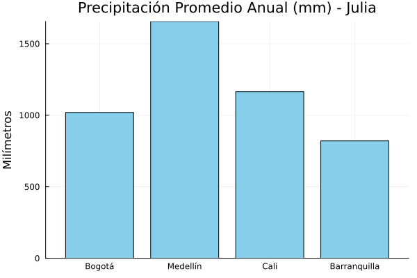
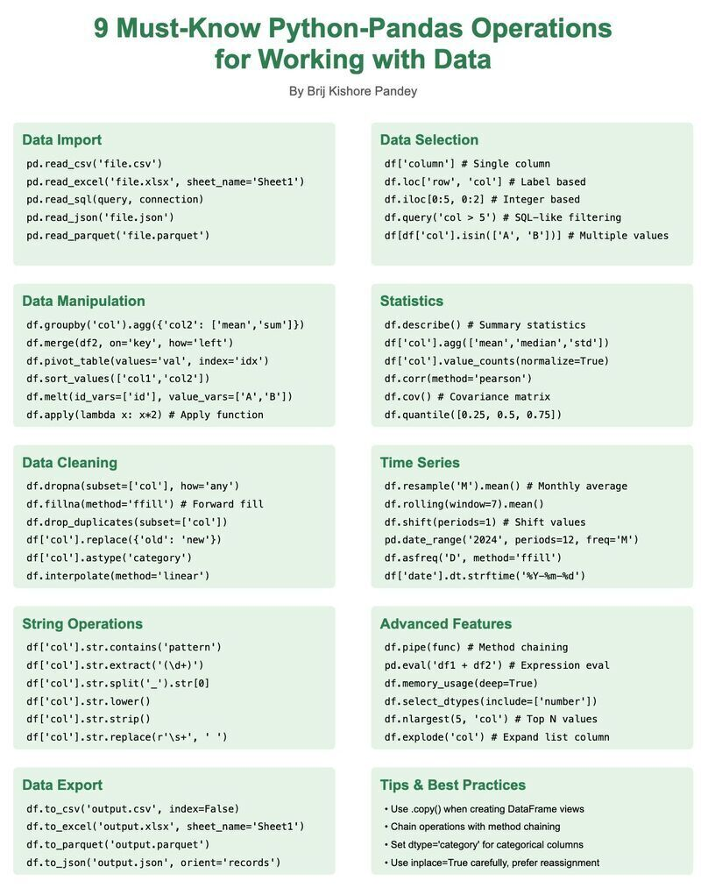
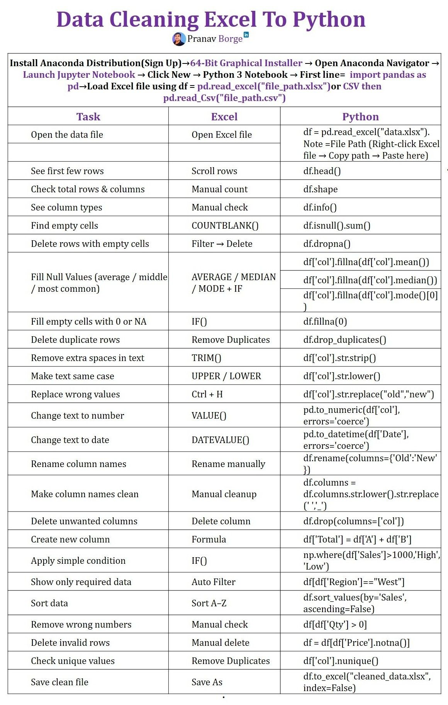
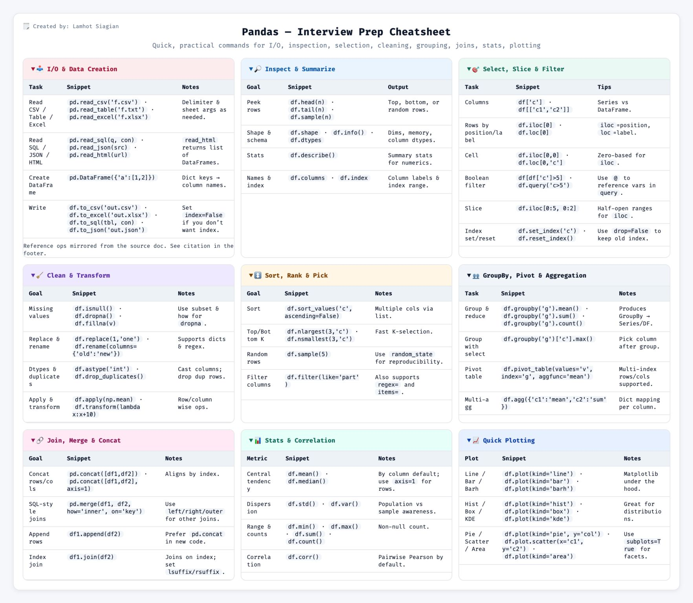

---
format:
  html: default
  pdf:
    screenshot: true  
    prefer-html: true   
    keep-tex: true
    mermaid-format: png
    include-in-header:
      - text: \usepackage{pdflscape}
---

# Analítica Espacial: Arreglos y Tablas {#sec-analitica_datos}

## Funciones j_eval y j_plot en R

```{r}
#| label: j_eval_j_plot_arreglos
#| code-fold: true
#| include: false
source("./docs/j_eval_j_plot.r")
```

## Introducción

En el procesamiento de datos geográficos, rara vez trabajamos con una sola coordenada a la vez. Los Modelos Digitales de Elevación (DEM) son esencialmente inmensas matrices matemáticas bidimensionales, y las bases de datos censales del DANE son tablas con millones de filas.

Para manipular este volumen de información de forma eficiente, los lenguajes de programación utilizan estructuras de datos optimizadas escritas en lenguajes de bajo nivel (como C o Fortran). En Python, los pilares indiscutibles de la analítica son **NumPy** (para cálculos numéricos matriciales) y **Pandas** (para manipulación tabular). 

En este capítulo aprenderemos a dominar estas estructuras, comparando la sintaxis de Python con las capacidades nativas y los paquetes equivalentes en **R** (vectores, matrices y DataFrames) y **Julia** (Arrays y `DataFrames.jl`).

## Objetivos de aprendizaje

Al finalizar esta sección, el estudiante será capaz de:

1. **Manipular matrices numéricas:** Crear, redimensionar y operar arreglos unidimensionales (1D) y bidimensionales (2D) simulando coordenadas y datos de elevación.
2. **Aplicar filtros matemáticos:** Utilizar indexación booleana y *slicing* para aislar datos geográficos que cumplan condiciones específicas (ej. elevación > 2000 m).
3. **Estructurar datos tabulares:** Construir y consultar *DataFrames* para organizar atributos de geometrías.
4. **Agrupar y unir bases de datos:** Ejecutar cruces de información (*merges*) y resúmenes estadísticos (agrupaciones) simulando cruces de datos del DANE y el IDEAM.

---

## Vectores y matrices (alternativas a NumPy)

Comenzaremos modelando listas de números puros. Supongamos que tomamos lecturas de elevación en cinco puntos de la Cordillera Central de Colombia y necesitamos almacenarlas en una estructura que nos permita realizar cálculos matemáticos rápidos.

::: {.panel-tabset}

### Python

::: {.content-visible when-format="html"}
::: {.callout-tip collapse="true" icon="false"}
#### ▷ CÓDIGO PURO (Copiar y Pegar)
```{python}
#| label: python_arrays_codigo
#| eval: false

# 1. Importamos la librería estándar para cálculo numérico
import numpy as np

# 2. Arreglos 1D (Vectores): Elevaciones en metros
elevaciones = np.array([2640, 1495, 1018, 18, 959])
print(f"Elevaciones (1D): {elevaciones}")
print(f"Tipo de dato interno: {elevaciones.dtype}")
print(f"Forma (Shape): {elevaciones.shape}\n")

# 3. Arreglos 2D (Matrices): [Latitud, Longitud]
# Representan a: Bogotá, Medellín, Cali
coordenadas = np.array([
    [4.7110, -74.0721],  
    [6.2442, -75.5812],  
    [3.4516, -76.5320]   
])
print(f"Coordenadas (2D):\n{coordenadas}")
print(f"Forma de la matriz: {coordenadas.shape} (Filas, Columnas)")

# 4. Generadores automáticos (útiles para cuadrículas o rasters vacíos)
matriz_vacia = np.zeros((3, 3)) # Matriz 3x3 llena de ceros
print(f"Matriz 3x3 (2D):\n{matriz_vacia}")
rango_anios = np.arange(2015, 2021, 1) # Serie del 2015 al 2020
print(f"\nRango de años generado: {rango_anios}")
```
:::
:::

```{python}
#| label: python_arrays
# #| eval: false

# 1. Importamos la librería estándar para cálculo numérico
import numpy as np

# 2. Arreglos 1D (Vectores): Elevaciones en metros
elevaciones = np.array([2640, 1495, 1018, 18, 959])
print(f"Elevaciones (1D): {elevaciones}")
print(f"Tipo de dato interno: {elevaciones.dtype}")
print(f"Forma (Shape): {elevaciones.shape}\n")

# 3. Arreglos 2D (Matrices): [Latitud, Longitud]
# Representan a: Bogotá, Medellín, Cali
coordenadas = np.array([
    [4.7110, -74.0721],  
    [6.2442, -75.5812],  
    [3.4516, -76.5320]   
])
print(f"Coordenadas (2D):\n{coordenadas}")
print(f"Forma de la matriz: {coordenadas.shape} (Filas, Columnas)")

# 4. Generadores automáticos (útiles para cuadrículas o rasters vacíos)
matriz_vacia = np.zeros((3, 3)) # Matriz 3x3 llena de ceros
print(f"Matriz 3x3 (2D):\n{matriz_vacia}")
rango_anios = np.arange(2015, 2021, 1) # Serie del 2015 al 2020
print(f"\nRango de años generado: {rango_anios}")
```

### R

::: {.content-visible when-format="html"}
::: {.callout-tip collapse="true" icon="false"}
#### ▷ CÓDIGO PURO (Copiar y Pegar)
```{r}
#| label: r_arrays_codigo
#| eval: false

# 1. En R, no necesitamos importar librerías numéricas externas.

# 2. Arreglos 1D (Vectores): Usamos c() para combinar datos
elevaciones <- c(2640, 1495, 1018, 18, 959)
cat(sprintf("Elevaciones (1D): %s\n", paste(elevaciones, collapse=", ")))
cat(sprintf("Tipo de dato interno: %s\n", typeof(elevaciones)))
cat(sprintf("Longitud (Length): %d\n\n", length(elevaciones)))

# 3. Arreglos 2D (Matrices)
# Creamos un vector largo y lo doblamos en una matriz especificando columnas
datos_coord <- c(4.7110, -74.0721, 6.2442, -75.5812, 3.4516, -76.5320)
coordenadas <- matrix(datos_coord, ncol = 2, byrow = TRUE)

cat("Coordenadas (2D):\n")
print(coordenadas)
cat(sprintf("Dimensiones: %d filas, %d columnas\n", nrow(coordenadas), ncol(coordenadas)))

# 4. Generadores automáticos
matriz_vacia <- matrix(0, nrow=3, ncol=3)
cat("Matriz 3x3 (2D):\n")
print(matriz_vacia)
rango_anios <- seq(2015, 2020, by=1) # Equivalente a arange
cat(sprintf("\nRango de años generado: %s\n", paste(rango_anios, collapse=", ")))
```
:::
:::

```{r}
#| label: r_arrays
# #| eval: false

# 1. En R, no necesitamos importar librerías numéricas externas.

# 2. Arreglos 1D (Vectores): Usamos c() para combinar datos
elevaciones <- c(2640, 1495, 1018, 18, 959)
cat(sprintf("Elevaciones (1D): %s\n", paste(elevaciones, collapse=", ")))
cat(sprintf("Tipo de dato interno: %s\n", typeof(elevaciones)))
cat(sprintf("Longitud (Length): %d\n\n", length(elevaciones)))

# 3. Arreglos 2D (Matrices)
# Creamos un vector largo y lo doblamos en una matriz especificando columnas
datos_coord <- c(4.7110, -74.0721, 6.2442, -75.5812, 3.4516, -76.5320)
coordenadas <- matrix(datos_coord, ncol = 2, byrow = TRUE)

cat("Coordenadas (2D):\n")
print(coordenadas)
cat(sprintf("Dimensiones: %d filas, %d columnas\n", nrow(coordenadas), ncol(coordenadas)))

# 4. Generadores automáticos
matriz_vacia <- matrix(0, nrow=3, ncol=3)
cat("Matriz 3x3 (2D):\n")
print(matriz_vacia)
rango_anios <- seq(2015, 2020, by=1) # Equivalente a arange
cat(sprintf("\nRango de años generado: %s\n", paste(rango_anios, collapse=", ")))
```

### Julia

::: {.content-visible when-format="html"}
::: {.callout-tip collapse="true" icon="false"}
#### ▷ CÓDIGO PURO (Copiar y Pegar)
```{julia}
#| label: julia_arrays_codigo
#| eval: false

# 1. Julia es un lenguaje matemático nato, las matrices están construidas en su ADN.

# 2. Arreglos 1D (Vectores): Usamos corchetes separados por comas
elevaciones = [2640, 1495, 1018, 18, 959]
println("Elevaciones (1D): ", elevaciones)
println("Tipo de dato: ", eltype(elevaciones))
println("Forma (Size): ", size(elevaciones), "\n")

# 3. Arreglos 2D (Matrices): Corchetes sin comas para columnas, ';' para filas
coordenadas = [
    4.7110  -74.0721;
    6.2442  -75.5812;
    3.4516  -76.5320
]
println("Coordenadas (2D):")
display(coordenadas)
println("\nDimensiones: ", size(coordenadas))

# 4. Generadores automáticos
matriz_vacia = zeros(3, 3)
println("Matriz 3x3:")
display(matriz_vacia)
rango_anios = collect(2015:1:2020) # Usamos notación de rangos y collect()
println("\nRango de años generado: ", rango_anios)
```
:::
:::

```{r}
#| label: julia_arrays
#| results: asis
#| code-fold: true
#| echo: false
# #| eval: false

j_eval(r"-(
# 1. Julia es un lenguaje matemático nato, las matrices están construidas en su ADN.

# 2. Arreglos 1D (Vectores): Usamos corchetes separados por comas
elevaciones = [2640, 1495, 1018, 18, 959]
println("Elevaciones (1D): ", elevaciones)
println("Tipo de dato: ", eltype(elevaciones))
println("Forma (Size): ", size(elevaciones), "\n")

# 3. Arreglos 2D (Matrices): Corchetes sin comas para columnas, ';' para filas
coordenadas = [
    4.7110  -74.0721;
    6.2442  -75.5812;
    3.4516  -76.5320
]
println("Coordenadas (2D):")
display(coordenadas)
println("\nDimensiones: ", size(coordenadas))

# 4. Generadores automáticos
matriz_vacia = zeros(3, 3)
println("Matriz 3x3:")
display(matriz_vacia)
rango_anios = collect(2015:1:2020) # Usamos notación de rangos y collect()
println("\nRango de años generado: ", rango_anios)
)-")
```

:::


### Resumen comparativo: Creación de Arreglos

| Tarea / Estructura | Python (NumPy) 🐍 | R (Nativo) 🔵 | Julia (Nativo) 🟣 |
| :--- | :--- | :--- | :--- |
| **Crear Arreglo 1D** | `np.array([1, 2, 3])` | `c(1, 2, 3)` | `[1, 2, 3]` |
| **Crear Matriz 2D** | `np.array([[1, 2], [3, 4]])` | `matrix(c(1,2,3,4), ncol=2, byrow=TRUE)` | `[1 2; 3 4]` |
| **Generar Rango (Secuencia)** | `np.arange(1, 10, 2)` | `seq(1, 9, by=2)` | `1:2:9` |
| **Matriz de Ceros (Inicializada)** | `np.zeros((3, 3))` | `matrix(0, nrow=3, ncol=3)` | `zeros(3, 3)` |
| **Verificar Dimensiones** | `arr.shape` | `dim(arr)` o `nrow()` / `ncol()` | `size(arr)` |
| **Verificar Tipo Interno** | `arr.dtype` | `typeof(arr)` o `class(arr)` | `eltype(arr)` |

: Resumen de comandos para creación e inspección de arreglos y matrices {#tbl-creacion_arreglos tbl-colwidths="[25,25,25,25]"}


---

## Álgebra de matrices y estadística (vectorización)

La ventaja de estructurar los datos en estos arreglos es la **vectorización**. Si tenemos 10 millones de puntos de elevación y queremos sumarle 10 metros a cada uno, hacer un ciclo `for` tomaría mucho tiempo. Con operaciones vectorizadas, el lenguaje lo hace instantáneamente aplicando la operación a cada elemento ("element-wise").

::: {.panel-tabset}

### Python

::: {.content-visible when-format="html"}
::: {.callout-tip collapse="true" icon="false"}
#### ▷ CÓDIGO PURO (Copiar y Pegar)
```{python}
#| label: python_math_codigo
#| eval: false

# 1. Operaciones matemáticas vectorizadas
elevaciones_m = np.array([2640, 1495, 1018, 18, 959])
# Multiplicamos toda la matriz de golpe para convertir a pies (ft)
elevaciones_ft = elevaciones_m * 3.28084  
print(f"Elevaciones en pies: {np.round(elevaciones_ft, 1)}")

# 2. Funciones trigonométricas (vitales para proyecciones)
latitudes = np.array([0, 4.71, 10.96]) # Ecuador, Bogotá, B/quilla
lat_radianes = np.radians(latitudes)
seno_lat = np.sin(lat_radianes)
print(f"Seno de las latitudes: {np.round(seno_lat, 3)}")

# 3. Estadística Espacial
perfil = np.array([1245, 1367, 1423, 1389, 1456, 1502, 1478, 1398, 1334, 1278])
print(f"\n--- Estadísticas del Transecto ---")
print(f"Media: {np.mean(perfil):.1f} m")
print(f"Desviación Estándar: {np.std(perfil):.1f} m")
print(f"Desnivel total (Rango): {np.max(perfil) - np.min(perfil)} m")
```
:::
:::

```{python}
#| label: python_math
# #| eval: false

# 1. Operaciones matemáticas vectorizadas
elevaciones_m = np.array([2640, 1495, 1018, 18, 959])
# Multiplicamos toda la matriz de golpe para convertir a pies (ft)
elevaciones_ft = elevaciones_m * 3.28084  
print(f"Elevaciones en pies: {np.round(elevaciones_ft, 1)}")

# 2. Funciones trigonométricas (vitales para proyecciones)
latitudes = np.array([0, 4.71, 10.96]) # Ecuador, Bogotá, B/quilla
lat_radianes = np.radians(latitudes)
seno_lat = np.sin(lat_radianes)
print(f"Seno de las latitudes: {np.round(seno_lat, 3)}")

# 3. Estadística Espacial
perfil = np.array([1245, 1367, 1423, 1389, 1456, 1502, 1478, 1398, 1334, 1278])
print(f"\n--- Estadísticas del Transecto ---")
print(f"Media: {np.mean(perfil):.1f} m")
print(f"Desviación Estándar: {np.std(perfil):.1f} m")
print(f"Desnivel total (Rango): {np.max(perfil) - np.min(perfil)} m")
```

### R

::: {.content-visible when-format="html"}
::: {.callout-tip collapse="true" icon="false"}
#### ▷ CÓDIGO PURO (Copiar y Pegar)
```{r}
#| label: r_math_codigo
#| eval: false

# 1. Operaciones matemáticas vectorizadas en R
elevaciones_m <- c(2640, 1495, 1018, 18, 959)
elevaciones_ft <- elevaciones_m * 3.28084
cat(sprintf("Elevaciones en pies: %s\n", paste(round(elevaciones_ft, 1), collapse=", ")))

# 2. Funciones trigonométricas
latitudes <- c(0, 4.71, 10.96)
# En R, multiplicamos por (pi/180) para pasar a radianes
lat_radianes <- latitudes * (pi / 180)
seno_lat <- sin(lat_radianes)
cat(sprintf("Seno de las latitudes: %s\n", paste(round(seno_lat, 3), collapse=", ")))

# 3. Estadística Espacial
perfil <- c(1245, 1367, 1423, 1389, 1456, 1502, 1478, 1398, 1334, 1278)
cat("\n--- Estadísticas del Transecto ---\n")
cat(sprintf("Media: %.1f m\n", mean(perfil)))
cat(sprintf("Desviación Estándar: %.1f m\n", sd(perfil)))
cat(sprintf("Desnivel total (Rango): %d m\n", max(perfil) - min(perfil)))
```
:::
:::

```{r}
#| label: r_math
# #| eval: false

# 1. Operaciones matemáticas vectorizadas en R
elevaciones_m <- c(2640, 1495, 1018, 18, 959)
elevaciones_ft <- elevaciones_m * 3.28084
cat(sprintf("Elevaciones en pies: %s\n", paste(round(elevaciones_ft, 1), collapse=", ")))

# 2. Funciones trigonométricas
latitudes <- c(0, 4.71, 10.96)
# En R, multiplicamos por (pi/180) para pasar a radianes
lat_radianes <- latitudes * (pi / 180)
seno_lat <- sin(lat_radianes)
cat(sprintf("Seno de las latitudes: %s\n", paste(round(seno_lat, 3), collapse=", ")))

# 3. Estadística Espacial
perfil <- c(1245, 1367, 1423, 1389, 1456, 1502, 1478, 1398, 1334, 1278)
cat("\n--- Estadísticas del Transecto ---\n")
cat(sprintf("Media: %.1f m\n", mean(perfil)))
cat(sprintf("Desviación Estándar: %.1f m\n", sd(perfil))) # sd calcula standard deviation
cat(sprintf("Desnivel total (Rango): %d m\n", max(perfil) - min(perfil)))
```

### Julia

::: {.content-visible when-format="html"}
::: {.callout-tip collapse="true" icon="false"}
#### ▷ CÓDIGO PURO (Copiar y Pegar)
```{julia}
#| label: julia_math_codigo
#| eval: false

# En Julia importamos Statistics para la media y desviación estándar
using Statistics 

# 1. Operaciones vectorizadas: En Julia DEBEMOS agregar un punto (.) 
# antes del operador para indicar que es una operación "elemento a elemento"
elevaciones_m = [2640, 1495, 1018, 18, 959]
elevaciones_ft = elevaciones_m .* 3.28084  
println("Elevaciones en pies: ", round.(elevaciones_ft, digits=1))

# 2. Funciones trigonométricas
latitudes = [0, 4.71, 10.96]
lat_radianes = deg2rad.(latitudes) # Aplicación vectorizada con punto
seno_lat = sin.(lat_radianes)
println("Seno de las latitudes: ", round.(seno_lat, digits=3))

# 3. Estadística Espacial
perfil = [1245, 1367, 1423, 1389, 1456, 1502, 1478, 1398, 1334, 1278]
println("\n--- Estadísticas del Transecto ---")
println("Media: ", round(mean(perfil), digits=1), " m")
println("Desviación Estándar: ", round(std(perfil), digits=1), " m")
println("Desnivel total (Rango): ", maximum(perfil) - minimum(perfil), " m")
```
:::
:::

```{r}
#| label: julia_math
#| results: asis
#| code-fold: true
#| echo: false
# #| eval: false

j_eval(r"-(
using Statistics 

# 1. Operaciones vectorizadas: En Julia DEBEMOS agregar un punto (.) 
# antes del operador para indicar que es una operación "elemento a elemento"
elevaciones_m = [2640, 1495, 1018, 18, 959]
elevaciones_ft = elevaciones_m .* 3.28084  
println("Elevaciones en pies: ", round.(elevaciones_ft, digits=1))

# 2. Funciones trigonométricas
latitudes = [0, 4.71, 10.96]
lat_radianes = deg2rad.(latitudes) # Aplicación vectorizada con punto
seno_lat = sin.(lat_radianes)
println("Seno de las latitudes: ", round.(seno_lat, digits=3))

# 3. Estadística Espacial
perfil = [1245, 1367, 1423, 1389, 1456, 1502, 1478, 1398, 1334, 1278]
println("\n--- Estadísticas del Transecto ---")
println("Media: ", round(mean(perfil), digits=1), " m")
println("Desviación Estándar: ", round(std(perfil), digits=1), " m")
println("Desnivel total (Rango): ", maximum(perfil) - minimum(perfil), " m")
)-")
```
:::

### Resumen comparativo: álgebra y estadística vectorizada

| Tarea / Operación | Python (NumPy) 🐍 | R (Nativo) 🔵 | Julia (Nativo) 🟣 |
| :--- | :--- | :--- | :--- |
| **Multiplicación Vectorial**<br>*(Element-wise)* | `arr * 2` | `arr * 2` | `arr .* 2` *(Nota el punto)* |
| **Operador Matemático**<br>*(Ej. Redondeo)* | `np.round(arr, 1)` | `round(arr, 1)` | `round.(arr, digits=1)` |
| **Func. Trigonométrica**<br>*(Ej. Seno)* | `np.sin(arr)` | `sin(arr)` | `sin.(arr)` |
| **Media (Promedio)** | `np.mean(arr)` | `mean(arr)` | `mean(arr)`<br>*(req. `using Statistics`)* |
| **Desviación Estándar** | `np.std(arr)` | `sd(arr)` | `std(arr)`<br>*(req. `using Statistics`)* |
| **Valor Máximo / Mínimo** | `np.max(arr)` / `np.min(arr)` | `max(arr)` / `min(arr)` | `maximum(arr)` / `minimum(arr)` |

: Resumen de comandos para operaciones matemáticas y estadísticas en arreglos {#tbl-algebra_estadistica tbl-colwidths="[25,25,25,25]"}

---

## Slicing e indexación booleana (filtros espaciales)

A menudo necesitamos aislar partes de nuestros datos. Por ejemplo, si tenemos un DEM, podríamos querer solo las celdas que superan la altitud del páramo (> 3000m). 

::: {.callout-warning title="Diferencia de Indexación Fundamental"}
Como mencionamos en capítulos anteriores, recuerda que:

* **Python** empieza a contar desde el índice **`0`**.
* **R** y **Julia** empiezan a contar de forma cartográfica desde el índice **`1`**.
:::

::: {.panel-tabset}

### Python

::: {.content-visible when-format="html"}
::: {.callout-tip collapse="true" icon="false"}
#### ▷ CÓDIGO PURO (Copiar y Pegar)
```{python}
#| label: python_slicing_codigo
#| eval: false

import numpy as np

# Simulamos la elevación de 6 estaciones andinas
estaciones = np.array([2800, 3100, 2400, 3500, 1900, 3800])

# 1. Slicing (cortes basados en posiciones)
# Python omite el último límite (1:4 extraerá los índices 1, 2 y 3)
tramo_medio = estaciones[1:4]
print(f"Estaciones (índices 1 al 3): {tramo_medio}")

# 2. Indexación Booleana (Filtros)
# Creamos una máscara (True/False) para datos en zona de páramo (> 3000m)
mascara_paramo = estaciones > 3000
print(f"\nMáscara booleana: {mascara_paramo}")

# Aplicamos la máscara a los datos originales
estaciones_paramo = estaciones[mascara_paramo]
print(f"Estaciones que superan los 3000m: {estaciones_paramo}")

# 3. Modificación masiva
# A veces necesitamos clasificar datos (ej. valores nulos a -9999)
estaciones[estaciones < 2500] = 0 # Convertir pisos cálidos/templados a 0
print(f"\nDatos tras modificación masiva: {estaciones}")
```
:::
:::

```{python}
#| label: python_slicing
# #| eval: false

import numpy as np

# Simulamos la elevación de 6 estaciones andinas
estaciones = np.array([2800, 3100, 2400, 3500, 1900, 3800])

# 1. Slicing (cortes basados en posiciones)
# Python omite el último límite (1:4 extraerá los índices 1, 2 y 3)
tramo_medio = estaciones[1:4]
print(f"Estaciones (índices 1 al 3): {tramo_medio}")

# 2. Indexación Booleana (Filtros)
# Creamos una máscara (True/False) para datos en zona de páramo (> 3000m)
mascara_paramo = estaciones > 3000
print(f"\nMáscara booleana: {mascara_paramo}")

# Aplicamos la máscara a los datos originales
estaciones_paramo = estaciones[mascara_paramo]
print(f"Estaciones que superan los 3000m: {estaciones_paramo}")

# 3. Modificación masiva
# A veces necesitamos clasificar datos (ej. valores nulos a -9999)
estaciones[estaciones < 2500] = 0 # Convertir pisos cálidos/templados a 0
print(f"\nDatos tras modificación masiva: {estaciones}")
```

### R

::: {.content-visible when-format="html"}
::: {.callout-tip collapse="true" icon="false"}
#### ▷ CÓDIGO PURO (Copiar y Pegar)
```{r}
#| label: r_slicing_codigo
#| eval: false

# 6 estaciones andinas
estaciones <- c(2800, 3100, 2400, 3500, 1900, 3800)

# 1. Slicing (R incluye ambos límites en el corte)
tramo_medio <- estaciones[2:4] # Extrae las posiciones reales 2, 3 y 4
cat(sprintf("Estaciones (índices 2 al 4): %s\n", paste(tramo_medio, collapse=", ")))

# 2. Indexación Booleana
mascara_paramo <- estaciones > 3000
cat(sprintf("\nMáscara booleana: %s\n", paste(mascara_paramo, collapse=", ")))

estaciones_paramo <- estaciones[mascara_paramo]
cat(sprintf("Estaciones que superan los 3000m: %s\n", paste(estaciones_paramo, collapse=", ")))

# 3. Modificación masiva
estaciones[estaciones < 2500] <- 0
cat(sprintf("\nDatos tras modificación masiva: %s\n", paste(estaciones, collapse=", ")))
```
:::
:::

```{r}
#| label: r_slicing
# #| eval: false

# 6 estaciones andinas
estaciones <- c(2800, 3100, 2400, 3500, 1900, 3800)

# 1. Slicing (R incluye ambos límites en el corte)
tramo_medio <- estaciones[2:4] # Extrae las posiciones reales 2, 3 y 4
cat(sprintf("Estaciones (índices 2 al 4): %s\n", paste(tramo_medio, collapse=", ")))

# 2. Indexación Booleana
mascara_paramo <- estaciones > 3000
cat(sprintf("\nMáscara booleana: %s\n", paste(mascara_paramo, collapse=", ")))

estaciones_paramo <- estaciones[mascara_paramo]
cat(sprintf("Estaciones que superan los 3000m: %s\n", paste(estaciones_paramo, collapse=", ")))

# 3. Modificación masiva
estaciones[estaciones < 2500] <- 0
cat(sprintf("\nDatos tras modificación masiva: %s\n", paste(estaciones, collapse=", ")))
```

### Julia

::: {.content-visible when-format="html"}
::: {.callout-tip collapse="true" icon="false"}
#### ▷ CÓDIGO PURO (Copiar y Pegar)
```{julia}
#| label: julia_slicing_codigo
#| eval: false

# 6 estaciones andinas
estaciones = [2800, 3100, 2400, 3500, 1900, 3800]

# 1. Slicing (Julia, como R, incluye ambos límites)
tramo_medio = estaciones[2:4]
println("Estaciones (índices 2 al 4): ", tramo_medio)

# 2. Indexación Booleana
# IMPORTANTE: Al aplicar operadores lógicos, usamos el punto para vectorizar
mascara_paramo = estaciones .> 3000
println("\nMáscara booleana: ", mascara_paramo)

estaciones_paramo = estaciones[mascara_paramo]
println("Estaciones que superan los 3000m: ", estaciones_paramo)

# 3. Modificación masiva (Usando de nuevo indexación booleana vectorizada)
estaciones[estaciones .< 2500] .= 0 # Nota el punto en la asignación masiva (.=)
println("\nDatos tras modificación masiva: ", estaciones)
```
:::
:::

```{r}
#| label: julia_slicing
#| results: asis
#| code-fold: true
#| echo: false
# #| eval: false

j_eval(r"-(
# 6 estaciones andinas
estaciones = [2800, 3100, 2400, 3500, 1900, 3800]

# 1. Slicing (Julia, como R, incluye ambos límites)
tramo_medio = estaciones[2:4]
println("Estaciones (índices 2 al 4): ", tramo_medio)

# 2. Indexación Booleana
# IMPORTANTE: Al aplicar operadores lógicos, usamos el punto para vectorizar
mascara_paramo = estaciones .> 3000
println("\nMáscara booleana: ", mascara_paramo)

estaciones_paramo = estaciones[mascara_paramo]
println("Estaciones que superan los 3000m: ", estaciones_paramo)

# 3. Modificación masiva (Usando de nuevo indexación booleana vectorizada)
estaciones[estaciones .< 2500] .= 0 # Nota el punto en la asignación masiva (.=)
println("\nDatos tras modificación masiva: ", estaciones)
)-")
```
:::


### Resumen comparativo: slicing y filtros en arreglos

| Operación / Concepto | Python (NumPy) 🐍 | R (Nativo) 🔵 | Julia (Nativo) 🟣 |
| :--- | :--- | :--- | :--- |
| **Índice Inicial** | `0` *(Zero-based)* | `1` *(One-based)* | `1` *(One-based)* |
| **Slicing Básico** | `arr[1:4]`<br>*(Extrae índices 1, 2, 3)* | `arr[2:4]`<br>*(Extrae índices 2, 3, 4)* | `arr[2:4]`<br>*(Extrae índices 2, 3, 4)* |
| **Máscara Lógica** | `mascara = arr > 10` | `mascara <- arr > 10` | `mascara = arr .> 10` |
| **Aplicar Filtro** | `arr[mascara]` | `arr[mascara]` | `arr[mascara]` |
| **Modificación Masiva**| `arr[arr < 5] = 0` | `arr[arr < 5] <- 0` | `arr[arr .< 5] = 0` |

: Diferencias en extracción de datos y aplicación de filtros lógicos {#tbl-slicing_filtros tbl-colwidths="[20,25,25,30]"}

---

## Analítica tabular con DataFrames

Mientras que las matrices son ideales para matemáticas puras o imágenes satelitales, los analistas de SIG suelen recibir gran parte de su información como atributos estructurados de un Censo, un catastro o tablas climáticas.

Aquí entran los **DataFrames**, que son esencialmente matrices superpoderosas donde cada columna puede tener un tipo de dato distinto (textos, fechas, números) y podemos acceder a ellas por su nombre y no solo por su posición.

Construyamos una tabla censal sencilla para cuatro de nuestras ciudades principales.

::: {.panel-tabset}

### Python (Pandas)

::: {.content-visible when-format="html"}
::: {.callout-tip collapse="true" icon="false"}
#### ▷ CÓDIGO PURO (Copiar y Pegar)
```{python}
#| label: python_df_codigo
#| eval: false

# 1. Importamos la librería líder para manejo de datos
import pandas as pd

# 2. Construimos los datos usando un diccionario (dict)
datos_censo = {
    "Ciudad": ["Bogotá", "Medellín", "Cali", "Barranquilla"],
    "Region": ["Andina", "Andina", "Pacífica", "Caribe"],
    "Poblacion": [7181469, 2529403, 2227642, 1206319],
    "Elevacion": [2640, 1495, 1018, 18]
}

# 3. Convertimos el diccionario en un DataFrame estructurado
df = pd.DataFrame(datos_censo)

print("DataFrame Original:")
print(df) # Usamos print() para compatibilidad en cualquier entorno

print(f"\nResumen rápido de tipos de datos:")
print(df.dtypes)
```
:::
:::

```{python}
#| label: python_df
# #| eval: false

# 1. Importamos la librería líder para manejo de datos
import pandas as pd

# 2. Construimos los datos usando un diccionario (dict)
datos_censo = {
    "Ciudad": ["Bogotá", "Medellín", "Cali", "Barranquilla"],
    "Region": ["Andina", "Andina", "Pacífica", "Caribe"],
    "Poblacion": [7181469, 2529403, 2227642, 1206319],
    "Elevacion": [2640, 1495, 1018, 18]
}

# 3. Convertimos el diccionario en un DataFrame estructurado
df = pd.DataFrame(datos_censo)

print("DataFrame Original:")
# display(df) arroja error si no estamos en un entorno interactivo Jupyter.
# print() es la opción más segura en ejecución de consola / Quarto.
print(df) 

print(f"\nResumen rápido de tipos de datos:")
print(df.dtypes)
```

### R

::: {.content-visible when-format="html"}
::: {.callout-tip collapse="true" icon="false"}
#### ▷ CÓDIGO PURO (Copiar y Pegar)
```{r}
#| label: r_df_codigo
#| eval: false

# En R, el concepto de DataFrame es nativo y original del lenguaje.

# 1. Construimos el DataFrame directamente definiendo columnas
df <- data.frame(
    Ciudad = c("Bogotá", "Medellín", "Cali", "Barranquilla"),
    Region = c("Andina", "Andina", "Pacífica", "Caribe"),
    Poblacion = c(7181469, 2529403, 2227642, 1206319),
    Elevacion = c(2640, 1495, 1018, 18)
)

cat("DataFrame Original:\n")
print(df)

cat("\nResumen estructural rápido (str):\n")
str(df)
```
:::
:::

```{r}
#| label: r_df
# #| eval: false

# En R, el concepto de DataFrame es nativo y original del lenguaje.

# 1. Construimos el DataFrame directamente definiendo columnas
df <- data.frame(
    Ciudad = c("Bogotá", "Medellín", "Cali", "Barranquilla"),
    Region = c("Andina", "Andina", "Pacífica", "Caribe"),
    Poblacion = c(7181469, 2529403, 2227642, 1206319),
    Elevacion = c(2640, 1495, 1018, 18)
)

cat("DataFrame Original:\n")
print(df)

cat("\nResumen estructural rápido (str):\n")
str(df)
```

### Julia (DataFrames.jl)

::: {.content-visible when-format="html"}
::: {.callout-tip collapse="true" icon="false"}
#### ▷ CÓDIGO PURO (Copiar y Pegar)
```{julia}
#| label: julia_df_codigo
#| eval: false

# Julia no trae DataFrames de fábrica, necesitamos importar el paquete oficial
using DataFrames

# 1. Construimos el DataFrame asignando vectores a nombres (símbolos con dos puntos :)
df = DataFrame(
    Ciudad = ["Bogotá", "Medellín", "Cali", "Barranquilla"],
    Region = ["Andina", "Andina", "Pacífica", "Caribe"],
    Poblacion = [7181469, 2529403, 2227642, 1206319],
    Elevacion = [2640, 1495, 1018, 18]
)

println("DataFrame Original:")
display(df)
```
:::
:::

```{r}
#| label: julia_df
#| results: asis
#| code-fold: true
#| echo: false
# #| eval: false

j_eval(r"-(
using DataFrames

# 1. Construimos el DataFrame asignando vectores a nombres (símbolos con dos puntos :)
df = DataFrame(
    Ciudad = ["Bogotá", "Medellín", "Cali", "Barranquilla"],
    Region = ["Andina", "Andina", "Pacífica", "Caribe"],
    Poblacion = [7181469, 2529403, 2227642, 1206319],
    Elevacion = [2640, 1495, 1018, 18]
)

println("DataFrame Original:")
display(df)
)-")
```
:::


### Resumen comparativo: creación e inspección de DataFrames

| Operación / Concepto | Python (Pandas) 🐍 | R (Nativo) 🔵 | Julia (DataFrames.jl) 🟣 |
| :--- | :--- | :--- | :--- |
| **Requisito inicial** | `import pandas as pd` | *Nativo (viene por defecto)* | `using DataFrames` |
| **Crear DataFrame** | `pd.DataFrame({"Col": [1, 2]})`<br>*(Usa un diccionario)* | `data.frame(Col = c(1, 2))` | `DataFrame(Col = [1, 2])` |
| **Mostrar en consola** | `print(df)` | `print(df)` | `display(df)` |
| **Ver estructura/tipos** | `df.dtypes` o `df.info()` | `str(df)` | `describe(df)` |

: Comandos básicos para inicializar y explorar tablas de datos {#tbl-creacion_df tbl-colwidths="[25,25,25,25]"}

---

## Operaciones espaciales tabulares (filtros, agrupación y merges)

Extraer valor de una base de datos de atributos geográficos requiere filtrar información, cruzar tablas secundarias que un colega nos compartió, y resumir variables. 

::: {.panel-tabset}

### Python (Pandas)

::: {.content-visible when-format="html"}
::: {.callout-tip collapse="true" icon="false"}
#### ▷ CÓDIGO PURO (Copiar y Pegar)
```{python}
#| label: python_ops_codigo
#| eval: false

# 1. Selección y Filtros Booleanos
# Extraer ciudades de clima cálido (< 1000m)
ciudades_calidas = df[df["Elevacion"] < 1000]
print("Ciudades de clima cálido:")
print(ciudades_calidas)

# 2. Agrupación (Groupby)
# Sumar la población agrupando por Región
poblacion_regional = df.groupby("Region")["Poblacion"].sum().reset_index()
print("\nAgrupación - Población por Región:")
print(poblacion_regional)

# 3. Cruzar Datos (Merge)
# Un colega nos pasa las temperaturas promedio de las ciudades
temp_data = pd.DataFrame({
    "Ciudad": ["Medellín", "Bogotá", "Barranquilla", "Cali"],
    "Temp_Promedio": [22.0, 14.0, 28.0, 24.0]
})

# Hacemos un cruce (JOIN) de la tabla original con la nueva usando la llave 'Ciudad'
df_enriquecido = pd.merge(df, temp_data, on="Ciudad")
print("\nCruce de Tablas (Merge):")
print(df_enriquecido)
```
:::
:::

```{python}
#| label: python_ops
# #| eval: false

# 1. Selección y Filtros Booleanos
# Extraer ciudades de clima cálido (< 1000m)
ciudades_calidas = df[df["Elevacion"] < 1000]
print("Ciudades de clima cálido:")
print(ciudades_calidas) # print() asegura compatibilidad con reticulate

# 2. Agrupación (Groupby)
# Sumar la población agrupando por Región
poblacion_regional = df.groupby("Region")["Poblacion"].sum().reset_index()
print("\nAgrupación - Población por Región:")
print(poblacion_regional)

# 3. Cruzar Datos (Merge)
# Un colega nos pasa las temperaturas promedio de las ciudades
temp_data = pd.DataFrame({
    "Ciudad": ["Medellín", "Bogotá", "Barranquilla", "Cali"],
    "Temp_Promedio": [22.0, 14.0, 28.0, 24.0]
})

# Hacemos un cruce (JOIN) de la tabla original con la nueva usando la llave 'Ciudad'
df_enriquecido = pd.merge(df, temp_data, on="Ciudad")
print("\nCruce de Tablas (Merge):")
print(df_enriquecido)
```

### R (dplyr)

::: {.content-visible when-format="html"}
::: {.callout-tip collapse="true" icon="false"}
#### ▷ CÓDIGO PURO (Copiar y Pegar)
```{r}
#| label: r_ops_codigo
#| eval: false

# Usamos la poderosa librería 'dplyr' para manipulación de tablas (Tidyverse)
library(dplyr)

# 1. Selección y Filtros Booleanos
# Extraer ciudades de clima cálido usando la función filter()
ciudades_calidas <- df %>% filter(Elevacion < 1000)
cat("Ciudades de clima cálido:\n")
print(ciudades_calidas)

# 2. Agrupación (Groupby)
# Agrupar (group_by) y resumir (summarise) la suma de población
poblacion_regional <- df %>% 
    group_by(Region) %>% 
    summarise(Poblacion_Total = sum(Poblacion))
cat("\nAgrupación - Población por Región:\n")
print(poblacion_regional)

# 3. Cruzar Datos (Merge)
temp_data <- data.frame(
    Ciudad = c("Medellín", "Bogotá", "Barranquilla", "Cali"),
    Temp_Promedio = c(22.0, 14.0, 28.0, 24.0)
)

# inner_join combina las tablas por la llave común
df_enriquecido <- inner_join(df, temp_data, by="Ciudad")
cat("\nCruce de Tablas (Merge):\n")
print(df_enriquecido)
```
:::
:::

```{r}
#| label: r_ops
#| message: false
#| warning: false
# #| eval: false

# Usamos la poderosa librería 'dplyr' para manipulación de tablas (Tidyverse)
library(dplyr)

# 1. Selección y Filtros Booleanos
# Extraer ciudades de clima cálido usando la función filter()
ciudades_calidas <- df %>% filter(Elevacion < 1000)
cat("Ciudades de clima cálido:\n")
print(ciudades_calidas)

# 2. Agrupación (Groupby)
# Agrupar (group_by) y resumir (summarise) la suma de población
poblacion_regional <- df %>% 
    group_by(Region) %>% 
    summarise(Poblacion_Total = sum(Poblacion))
cat("\nAgrupación - Población por Región:\n")
print(poblacion_regional)

# 3. Cruzar Datos (Merge)
temp_data <- data.frame(
    Ciudad = c("Medellín", "Bogotá", "Barranquilla", "Cali"),
    Temp_Promedio = c(22.0, 14.0, 28.0, 24.0)
)

# inner_join combina las tablas por la llave común
df_enriquecido <- inner_join(df, temp_data, by="Ciudad")
cat("\nCruce de Tablas (Merge):\n")
print(df_enriquecido)
```

### Julia (DataFrames.jl)

::: {.content-visible when-format="html"}
::: {.callout-tip collapse="true" icon="false"}
#### ▷ CÓDIGO PURO (Copiar y Pegar)
```{julia}
#| label: julia_ops_codigo
#| eval: false

using DataFrames

# 1. Selección y Filtros Booleanos
# Julia usa un sistema de indexación similar a Pandas pero con el punto vectorizado (.)
ciudades_calidas = df[df.Elevacion .< 1000, :] # Selecciona filas condicionales y [:,] todas las columnas
println("Ciudades de clima cálido:")
display(ciudades_calidas)

# 2. Agrupación (Groupby)
# combine(groupby(...), columna => funcion => nuevo_nombre)
poblacion_regional = combine(groupby(df, :Region), :Poblacion => sum => :Poblacion_Total)
println("\nAgrupación - Población por Región:")
display(poblacion_regional)

# 3. Cruzar Datos (Merge)
temp_data = DataFrame(
    Ciudad = ["Medellín", "Bogotá", "Barranquilla", "Cali"],
    Temp_Promedio = [22.0, 14.0, 28.0, 24.0]
)

# innerjoin cruza las tablas basándose en el símbolo compartido :Ciudad
df_enriquecido = innerjoin(df, temp_data, on=:Ciudad)
println("\nCruce de Tablas (Merge):")
display(df_enriquecido)
```
:::
:::

```{r}
#| label: julia_ops
#| results: asis
#| echo: false
#| code-fold: true
# #| eval: false

j_eval(r"-(
using DataFrames

# 1. Selección y Filtros Booleanos
ciudades_calidas = df[df.Elevacion .< 1000, :] 
println("Ciudades de clima cálido:")
display(ciudades_calidas)

# 2. Agrupación (Groupby)
poblacion_regional = combine(groupby(df, :Region), :Poblacion => sum => :Poblacion_Total)
println("\nAgrupación - Población por Región:")
display(poblacion_regional)

# 3. Cruzar Datos (Merge)
temp_data = DataFrame(
    Ciudad = ["Medellín", "Bogotá", "Barranquilla", "Cali"],
    Temp_Promedio = [22.0, 14.0, 28.0, 24.0]
)

# innerjoin cruza las tablas basándose en el símbolo compartido :Ciudad
df_enriquecido = innerjoin(df, temp_data, on=:Ciudad)
println("\nCruce de Tablas (Merge):")
display(df_enriquecido)
)-")
```
:::

### Resumen comparativo: operaciones tabulares avanzadas

| Operación / Concepto | Python (Pandas) 🐍 | R (dplyr) 🔵 | Julia (DataFrames.jl) 🟣 |
| :--- | :--- | :--- | :--- |
| **Filtrar por condición** | `df[df["Col"] < 10]` | `df %>% filter(Col < 10)` | `df[df.Col .< 10, :]` |
| **Agrupar y sumar** | `df.groupby("A")["B"].sum()` | `df %>% group_by(A) %>% summarise(Total = sum(B))` | `combine(groupby(df, :A), :B => sum => :Total)` |
| **Cruzar tablas (Join)** | `pd.merge(df1, df2, on="Id")` | `inner_join(df1, df2, by="Id")` | `innerjoin(df1, df2, on=:Id)` |

: Sintaxis comparativa para filtros, agrupaciones y cruces de datos {#tbl-operaciones_tabulares tbl-colwidths="[22,26,26,26]"}

---

## Manipulación de datos incompletos y visualización

Uno de los problemas más comunes al importar tablas del IDEAM o de una estación climática en campo, es que los sensores fallan y la tabla viene con **datos nulos** o incompletos (`NaN` o `NA`). 

Pandas, R y Julia tienen herramientas para rellenar (imputar) esos vacíos automáticamente (ej. con el promedio de las demás lecturas) antes de poder generar una gráfica.

::: {.panel-tabset}

### Python (Pandas)

::: {.content-visible when-format="html"}
::: {.callout-tip collapse="true" icon="false"}
#### ▷ CÓDIGO PURO (Copiar y Pegar)
```{python}
#| label: python_impute_codigo
#| eval: false

import matplotlib.pyplot as plt

# 1. Simulación de falla en un sensor (Falta dato de Cali)
datos_ideam = {
    "Ciudad": ["Bogotá", "Medellín", "Cali", "Barranquilla"],
    "Precipitacion_Anual": [1020, 1656, None, 821] # None indica nulo
}
df_sensor = pd.DataFrame(datos_ideam)
print("Datos con fallos del sensor:")
print(df_sensor)

# 2. Imputación: Llenar el vacío (fillna) con la media del resto
media_lluvia = df_sensor["Precipitacion_Anual"].mean()
df_limpio = df_sensor.fillna(value={"Precipitacion_Anual": media_lluvia})
print(f"\nDatos Limpios (Rellenado con media = {media_lluvia:.1f}):")
print(df_limpio)

# 3. Visualización Básica de los datos limpios
# Pandas se comunica internamente con Matplotlib
fig, ax = plt.subplots(figsize=(6, 4))
df_limpio.plot.bar(x="Ciudad", y="Precipitacion_Anual", ax=ax, color="skyblue")
ax.set_title("Precipitación Promedio Anual (mm)")
ax.set_ylabel("Milímetros")
plt.tight_layout()
plt.show()
```
:::
:::

```{python}
#| label: python_impute
#| fig-width: 6
#| out-width: "60%"
#| fig-align: center
# #| eval: false

import matplotlib.pyplot as plt

# 1. Simulación de falla en un sensor (Falta dato de Cali)
datos_ideam = {
    "Ciudad": ["Bogotá", "Medellín", "Cali", "Barranquilla"],
    "Precipitacion_Anual": [1020, 1656, None, 821] # None indica nulo
}
df_sensor = pd.DataFrame(datos_ideam)
print("Datos con fallos del sensor:")
print(df_sensor)

# 2. Imputación: Llenar el vacío (fillna) con la media del resto
media_lluvia = df_sensor["Precipitacion_Anual"].mean()
df_limpio = df_sensor.fillna(value={"Precipitacion_Anual": media_lluvia})
print(f"\nDatos Limpios (Rellenado con media = {media_lluvia:.1f}):")
print(df_limpio)

# 3. Visualización Básica de los datos limpios
fig, ax = plt.subplots(figsize=(6, 4))
df_limpio.plot.bar(x="Ciudad", y="Precipitacion_Anual", ax=ax, color="skyblue", legend=False)
ax.set_title("Precipitación Promedio Anual (mm) - Python")
ax.set_ylabel("Milímetros")
plt.tight_layout()
plt.show()
```

### R

::: {.content-visible when-format="html"}
::: {.callout-tip collapse="true" icon="false"}
#### ▷ CÓDIGO PURO (Copiar y Pegar)
```{r}
#| label: r_impute_codigo
#| eval: false

# 1. Simulación de sensor fallando en R (usamos NA en lugar de None)
df_sensor <- data.frame(
    Ciudad = c("Bogotá", "Medellín", "Cali", "Barranquilla"),
    Precipitacion_Anual = c(1020, 1656, NA, 821)
)
cat("Datos con fallos del sensor:\n")
print(df_sensor)

# 2. Imputación: Calcular la media ignorando NAs (na.rm=TRUE) y rellenar
# ifelse evalúa cada fila: si es NA, pone la media, si no, deja el valor
media_lluvia <- mean(df_sensor$Precipitacion_Anual, na.rm = TRUE)
df_limpio <- df_sensor %>%
    mutate(Precipitacion_Anual = ifelse(is.na(Precipitacion_Anual), media_lluvia, Precipitacion_Anual))

cat(sprintf("\nDatos Limpios (Rellenado con media = %.1f):\n", media_lluvia))
print(df_limpio)

# 3. Visualización usando plot base de R con barplot
barplot(
    df_limpio$Precipitacion_Anual, 
    names.arg = df_limpio$Ciudad,
    col = "skyblue",
    main = "Precipitación Promedio Anual (mm) - R",
    ylab = "Milímetros"
)
```
:::
:::

```{r}
#| label: r_impute
#| out-width: "60%"
#| fig-align: center
#| message: false
#| warning: false
# #| eval: false

# 1. Simulación de sensor fallando en R (usamos NA en lugar de None)
df_sensor <- data.frame(
    Ciudad = c("Bogotá", "Medellín", "Cali", "Barranquilla"),
    Precipitacion_Anual = c(1020, 1656, NA, 821)
)
cat("Datos con fallos del sensor:\n")
print(df_sensor)

# 2. Imputación: Calcular la media ignorando NAs (na.rm=TRUE) y rellenar
media_lluvia <- mean(df_sensor$Precipitacion_Anual, na.rm = TRUE)
df_limpio <- df_sensor %>%
    mutate(Precipitacion_Anual = ifelse(is.na(Precipitacion_Anual), media_lluvia, Precipitacion_Anual))

cat(sprintf("\nDatos Limpios (Rellenado con media = %.1f):\n", media_lluvia))
print(df_limpio)

# 3. Visualización usando plot base de R con barplot
barplot(
    df_limpio$Precipitacion_Anual, 
    names.arg = df_limpio$Ciudad,
    col = "skyblue",
    main = "Precipitación Promedio Anual (mm) - R",
    ylab = "Milímetros"
)
```

### Julia

::: {.content-visible when-format="html"}
::: {.callout-tip collapse="true" icon="false"}
#### ▷ CÓDIGO PURO (Copiar y Pegar)
```{julia}
#| label: julia_impute_codigo
#| eval: false

using DataFrames, Statistics, Plots

# 1. Simulación de falla. En Julia, los Nulos se representan con 'missing'
# Si una columna acepta missings, debe declararse explícitamente mezclando tipos con Union
df_sensor = DataFrame(
    Ciudad = ["Bogotá", "Medellín", "Cali", "Barranquilla"],
    Precipitacion_Anual = Union{Float64, Missing}[1020.0, 1656.0, missing, 821.0]
)
println("Datos con fallos del sensor:")
display(df_sensor)

# 2. Imputación
# skipmissing es vital en Julia para operar donde hay vacíos
media_lluvia = mean(skipmissing(df_sensor.Precipitacion_Anual))

# coalesce() es una función mágica en Julia que reemplaza los 'missing' 
# con el segundo valor que le pases
df_limpio = copy(df_sensor) # Copiamos para no alterar el original
df_limpio.Precipitacion_Anual = coalesce.(df_limpio.Precipitacion_Anual, media_lluvia)

println("\nDatos Limpios (Rellenado con media):")
display(df_limpio)

# 3. Visualización Básica de Barras
bar(df_limpio.Ciudad, df_limpio.Precipitacion_Anual, 
    title="Precipitación Promedio Anual (mm) - Julia",
    ylabel="Milímetros",
    legend=false,
    color=:skyblue)
```
:::
:::

```{r}
#| label: julia_impute
#| results: asis
#| out-width: "60%"
#| fig-align: "center"
#| echo: false
#| message: false
#| warning: false

invisible(j_eval(r"-(
using DataFrames, Statistics, Plots

# 1. Simulación de falla. En Julia, los Nulos se representan con 'missing'
df_sensor = DataFrame(
    Ciudad = ["Bogotá", "Medellín", "Cali", "Barranquilla"],
    Precipitacion_Anual = Union{Float64, Missing}[1020.0, 1656.0, missing, 821.0]
)
println("Datos con fallos del sensor:")
display(df_sensor)

# 2. Imputación usando skipmissing y coalesce
media_lluvia = mean(skipmissing(df_sensor.Precipitacion_Anual))
df_limpio = copy(df_sensor) 
df_limpio.Precipitacion_Anual = coalesce.(df_limpio.Precipitacion_Anual, media_lluvia)

println("\nDatos Limpios (Rellenado con media):")
display(df_limpio)

# 3. Gráfica protegida generada físicamente
f_salida_bar = joinpath(".", "images", "plots", "bar_precip_julia.png")
try
    p = bar(df_limpio.Ciudad, df_limpio.Precipitacion_Anual, 
        title="Precipitación Promedio Anual (mm) - Julia",
        ylabel="Milímetros",
        legend=false,
        color=:skyblue)
    savefig(p, f_salida_bar)
catch e
    p_err = plot(title="Error graficando:\n$(typeof(e))", legend=false, axis=false)
    savefig(p_err, f_salida_bar)
end
)-"))


```

:::

### Resumen comparativo: manejo de datos nulos y visualización

| Operación / Concepto | Python (Pandas) 🐍 | R (Nativo / dplyr) 🔵 | Julia (DataFrames.jl) 🟣 |
| :--- | :--- | :--- | :--- |
| **Representación del Nulo** | `np.nan` *(NaN)* | `NA` | `missing` |
| **Media ignorando nulos** | `df["Col"].mean()` | `mean(df$Col, na.rm=TRUE)` | `mean(skipmissing(df.Col))` |
| **Rellenar nulos (Imputación)** | `df["Col"].fillna(valor)` | `df$Col[is.na(df$Col)] <- valor` | `df.Col = coalesce.(df.Col, valor)` |
| **Gráfico de barras básico** | `df.plot.bar(x="A", y="B")` | `barplot(y, names.arg=x)` | `bar(x, y)` *(Plots.jl)* |

: Comandos esenciales para tratar datos incompletos y graficar {#tbl-datos_nulos tbl-colwidths="[26,24,25,25]"}

---

## Resumen de aprendizajes (cheat sheet)

A lo largo de este capítulo hemos construido los cimientos analíticos que todo especialista en geomática necesita antes de tocar un mapa. Pasar de datos crudos a información útil requiere dominar las estructuras de memoria y sus operaciones. 

Repasemos los conceptos clave que ahora llevas en tu caja de herramientas:

* **Estructuras optimizadas (Arreglos):** Entendimos que los lenguajes usan estructuras de bajo nivel (`np.array`, `c()`, `[]`) para almacenar datos del mismo tipo de forma contigua en la memoria, lo que permite un acceso extremadamente rápido, ideal para imágenes satelitales o modelos de elevación.
* **La regla de oro: ¡Vectorización!:** Aprendiste que en el análisis masivo de datos **nunca debes usar un ciclo `for`** si existe una función matemática vectorizada. Multiplicar o sacar el seno de un millón de coordenadas se hace en una sola línea de código.
* **Filtros mediante indexación booleana:** Descubrimos cómo crear "máscaras" de Verdadero/Falso (ej. `elevacion > 3000`) para extraer rápidamente un subconjunto de datos sin alterar la matriz original.
* **El poder de los DataFrames:** Transicionamos de las matrices matemáticas puras a tablas complejas que combinan textos y números. Entendiste que herramientas como `Pandas`, `dplyr` o `DataFrames.jl` son el equivalente a un Excel programable y automatizable.
* **Operaciones espaciales tabulares:** Vimos que el geoprocesamiento no es solo dibujar geometrías; a menudo implica cruzar bases de datos (*Merges/Joins*) y calcular estadísticas por regiones (*Groupby/Summarise*).
* **Gestión de la incertidumbre (Nulos):** Te enfrentaste a la realidad de los datos de campo (`NaN`, `NA`, `missing`). Aprendiste que ignorarlos rompe el código, y dominaste técnicas para rellenarlos (imputación) usando medias o valores de contingencia.

A continuación, se presenta tu **Hoja de Referencia (Cheat Sheet)** consolidada para traducir la sintaxis de estos conceptos entre Python, R y Julia.

### 1. Creación y operaciones con arreglos numéricos

| Operación | Python (NumPy) 🐍 | R (Nativo) 🔵 | Julia (Nativo) 🟣 |
| :--- | :--- | :--- | :--- |
| **Crear arreglo 1D** | `np.array([1, 2])` | `c(1, 2)` | `[1, 2]` |
| **Matriz de ceros** | `np.zeros((3, 3))` | `matrix(0, nrow=3, ncol=3)` | `zeros(3, 3)` |
| **Ver dimensiones** | `arr.shape` | `dim(arr)` | `size(arr)` |
| **Generar secuencia** | `np.arange(1, 10, 2)` | `seq(1, 9, by=2)` | `1:2:9` |
| **Álgebra masiva** | `arr * 2` | `arr * 2` | `arr .* 2` *(Nota el punto)* |
| **Estadística (Media)** | `np.mean(arr)` | `mean(arr)` | `mean(arr)` *(req. Statistics)* |

: Sintaxis para creación y matemáticas de arreglos {#tbl-resumen_arreglos tbl-colwidths="[25,25,25,25]"}

### 2. Filtros e indexación booleana

| Operación | Python (NumPy) 🐍 | R (Nativo) 🔵 | Julia (Nativo) 🟣 |
| :--- | :--- | :--- | :--- |
| **Índice inicial** | `0` *(Zero-based)* | `1` *(One-based)* | `1` *(One-based)* |
| **Slicing básico** | `arr[1:4]` *(índices 1,2,3)* | `arr[2:4]` *(índices 2,3,4)* | `arr[2:4]` *(índices 2,3,4)* |
| **Máscara lógica** | `mascara = arr > 10` | `mascara <- arr > 10` | `mascara = arr .> 10` |
| **Aplicar filtro** | `arr[mascara]` | `arr[mascara]` | `arr[mascara]` |
| **Reemplazo masivo**| `arr[arr < 5] = 0` | `arr[arr < 5] <- 0` | `arr[arr .< 5] .= 0` |

: Sintaxis para manipulación y cortes de vectores {#tbl-resumen_slicing tbl-colwidths="[25,25,25,25]"}

### 3. DataFrames y operaciones tabulares

| Operación | Python (Pandas) 🐍 | R (dplyr) 🔵 | Julia (DataFrames) 🟣 |
| :--- | :--- | :--- | :--- |
| **Crear DataFrame** | `pd.DataFrame({...})` | `data.frame(...)` | `DataFrame(...)` |
| **Filtrar filas** | `df[df["Col"] < 10]` | `df %>% filter(Col < 10)` | `df[df.Col .< 10, :]` |
| **Agrupar y sumar** | `df.groupby("A")["B"].sum()` | `df %>% group_by(A) %>% summarise(T = sum(B))`| `combine(groupby(df, :A), :B => sum)` |
| **Cruzar (Merge)** | `pd.merge(d1, d2, on="Id")` | `inner_join(d1, d2, by="Id")` | `innerjoin(d1, d2, on=:Id)` |

: Sintaxis para manipulación de tablas y bases de datos {#tbl-resumen_dataframes tbl-colwidths="[25,25,25,25]"}

### 4. Manejo de datos nulos (incompletos)

| Operación | Python (Pandas) 🐍 | R (dplyr) 🔵 | Julia (DataFrames) 🟣 |
| :--- | :--- | :--- | :--- |
| **Símbolo del nulo** | `np.nan` o `None` | `NA` | `missing` |
| **Media sin nulos** | `df["C"].mean()` | `mean(df$C, na.rm=TRUE)` | `mean(skipmissing(df.C))` |
| **Imputar (Rellenar)**| `df["C"].fillna(val)` | `ifelse(is.na(C), val, C)` | `coalesce.(df.C, val)` |
| **Eliminar filas** | `df.dropna()` | `df %>% drop_na()` | `dropmissing(df)` |

: Sintaxis para tratamiento de datos faltantes {#tbl-resumen_nulos tbl-colwidths="[25,25,25,25]"}

## Ejercicios

### Ejercicio 1: Vectorización y álgebra espacial (Haversine)


La **fórmula de Haversine** permite calcular la gran distancia sobre la esfera terrestre dadas dos coordenadas en latitud y longitud. 

Tu misión es crear una función vectorizada (en Python, R o Julia) llamada `calcular_distancias` que reciba como argumento el DataFrame `df` de censos (que construimos en la sección 4) y calcule la distancia en kilómetros desde **Bogotá (Lat: 4.7110, Lon: -74.0721)** a todas las demás ciudades de la tabla, agregando el resultado en una nueva columna llamada `Distancia_Bogota`.


* *Tip:* **¡Recicla tu código!** Recuerda que en el capítulo de *Funciones y Clases* ya construiste matemáticamente la función Haversine. Solo tienes que traerla a este script y adaptarla para que funcione directamente sobre vectores en lugar de números individuales, **evitando usar ciclos `for`**.
* *Pista de rendimiento:* Aplica la matemática directamente sobre las columnas completas del *DataFrame* (ej. `df['Latitud'] * np.pi / 180`).

### Ejercicio 2: Limpieza, filtros y agregación tabular

Para consolidar tus habilidades analíticas con *DataFrames*, crea un script que resuelva el siguiente flujo de trabajo simulado:

1. **Creación:** Genera un DataFrame con los siguientes datos de estaciones meteorológicas:
   * Estación: ["Páramo", "Valle", "Costa", "Selva", "Sabana"]
   * Elevación: [3200, 1500, 15, 200, 2600]
   * Precipitación: [850.5, 1200.0, None, 3000.5, None] *(Usa el tipo de nulo apropiado según tu lenguaje: `None`/`np.nan`, `NA` o `missing`)*.
2. **Imputación:** Los sensores de la Costa y la Sabana fallaron. Rellena los datos de precipitación nulos utilizando el valor **promedio (media)** de las estaciones válidas.
3. **Filtro espacial (Slicing):** Extrae en un nuevo DataFrame llamado `estaciones_altas` solo aquellas filas cuya elevación sea estrictamente mayor a 1000 metros.
4. **Cálculo final:** Muestra en consola cuál es la precipitación promedio anual reportada *exclusivamente* en las estaciones altas.

### Entregables y criterios de evaluación

Añade la resolución documentada de estos dos ejercicios en formato `.qmd` a tu repositorio de GitHub. Asegúrate de renderizar el documento (HTML o PDF) e incluir comentarios breves en tu código explicando por qué elegiste ciertas funciones para imputar o filtrar los datos.


## Anexo 1: Resumen de limpieza de datos con pandas

A continuación, se presenta una tabla de referencia rápida (*Cheat Sheet*) con los comandos más utilizados en Python para inspección y limpieza de datos tabulares con la librería Pandas. Las operaciones se agrupan según las principales etapas del proceso de limpieza de datos.

| Categoría | Tarea de Limpieza | Comando en Pandas | Descripción |
| :-- | :-- | :- | :----- |
| **1. Inspección de datos** | Ver primeras filas | `df.head()` | Muestra las primeras 5 filas del DataFrame para una inspección rápida. |
|  | Ver últimas filas | `df.tail()` | Muestra las últimas 5 filas del DataFrame. |
|  | Ver estructura del DataFrame | `df.info()` | Muestra número de filas, columnas, tipos de datos y valores nulos. |
|  | Resumen estadístico | `df.describe()` | Calcula estadísticas básicas de columnas numéricas. |
|  | Dimensiones del DataFrame | `df.shape` | Devuelve el número de filas y columnas. |
|  | Nombres de columnas | `df.columns` | Lista los nombres de todas las columnas. |
|  | Tipos de datos | `df.dtypes` | Muestra el tipo de dato de cada columna. |
| **2. Manejo de valores faltantes** | Identificar nulos | `df.isna()` | Devuelve un DataFrame de booleanos indicando valores faltantes. |
|  | Contar nulos | `df.isna().sum()` | Cuenta cuántos valores nulos hay por columna. |
|  | Eliminar filas con nulos | `df.dropna()` | Elimina filas con al menos un valor faltante. |
|  | Eliminar nulos en columnas específicas | `df.dropna(subset=['Col'])` | Elimina filas si ciertas columnas contienen nulos. |
|  | Rellenar nulos | `df.fillna(valor)` | Sustituye valores faltantes por un valor específico. |
|  | Relleno hacia adelante | `df.fillna(method='ffill')` | Rellena nulos con el valor válido anterior. |
|  | Relleno hacia atrás | `df.fillna(method='bfill')` | Rellena nulos con el valor siguiente disponible. |
| **3. Eliminación de duplicados** | Detectar duplicados | `df.duplicated()` | Devuelve un vector booleano indicando filas duplicadas. |
|  | Contar duplicados | `df.duplicated().sum()` | Cuenta cuántas filas duplicadas existen. |
|  | Eliminar duplicados | `df.drop_duplicates()` | Elimina filas duplicadas manteniendo la primera aparición. |
| **4. Corrección de tipos de datos** | Revisar tipos | `df.dtypes` | Permite verificar los tipos de datos actuales. |
|  | Convertir tipo numérico | `df['Col'].astype(float)` | Convierte una columna al tipo numérico indicado. |
|  | Convertir a fecha | `pd.to_datetime(df['Fecha'])` | Convierte texto a formato fecha. |
| **5. Renombrar columnas** | Cambiar nombre de columna | `df.rename(columns={'Antiguo':'Nuevo'})` | Cambia el nombre de columnas usando un diccionario. |
| **6. Estandarización de texto** | Convertir a minúsculas | `df['Col'].str.lower()` | Convierte texto a minúsculas para estandarizar datos. |
|  | Convertir a mayúsculas | `df['Col'].str.upper()` | Convierte texto a mayúsculas. |
|  | Eliminar espacios | `df['Col'].str.strip()` | Elimina espacios al inicio o final de cadenas de texto. |
|  | Reemplazar valores | `df['Col'].replace('x','y')` | Sustituye valores específicos dentro de una columna. |
| **7. Filtrado de datos** | Filtrar filas por condición | `df[df['Col'] > 0]` | Mantiene solo filas que cumplen una condición lógica. |
|  | Filtrar valores atípicos | `df[df['Edad'] <= 100]` | Ejemplo de filtrado para eliminar datos inválidos. |
| **8. Manejo de datos categóricos** | Valores únicos | `df['Col'].unique()` | Devuelve los valores únicos de una columna. |
|  | Frecuencia de categorías | `df['Col'].value_counts()` | Cuenta cuántas veces aparece cada valor. |
|  | Codificación categórica simple | `df['Genero_code'] = df['Genero'].map({'M':1,'F':0})` | Convierte categorías en valores numéricos. |
|  | Codificación One-Hot | `pd.get_dummies(df, columns=['Pais'])` | Convierte variables categóricas en variables binarias. |
| **9. Reinicio del índice** | Resetear índice | `df.reset_index(drop=True)` | Reorganiza el índice después de eliminar o filtrar filas. |
| **10. Detección de errores** | Buscar valores inválidos | `df[df['Salario'] < 0]` | Permite detectar valores fuera de rango o inconsistentes. |

: Comandos esenciales para inspección y limpieza de datos en Pandas {#tbl-pandas_limpieza tbl-colwidths="[22,25,28,25]"}

---


## Anexo 2: Hojas de referencia rápidas (Cheat Sheets) visuales

Para apoyar tu estudio y práctica, a continuación se incluyen diagramas visuales con los comandos más utilizados de Pandas:

::: {layout-ncol=1 layout-valign="middle" fig-align="center"}
{width=80% fig-alt="9 comandos fundamentales de Python Pandas"}

{width=80% fig-alt="Equivalencias de Excel a Python Pandas"}

{width=95% fig-alt="Hoja de referencia general de Pandas"}
:::