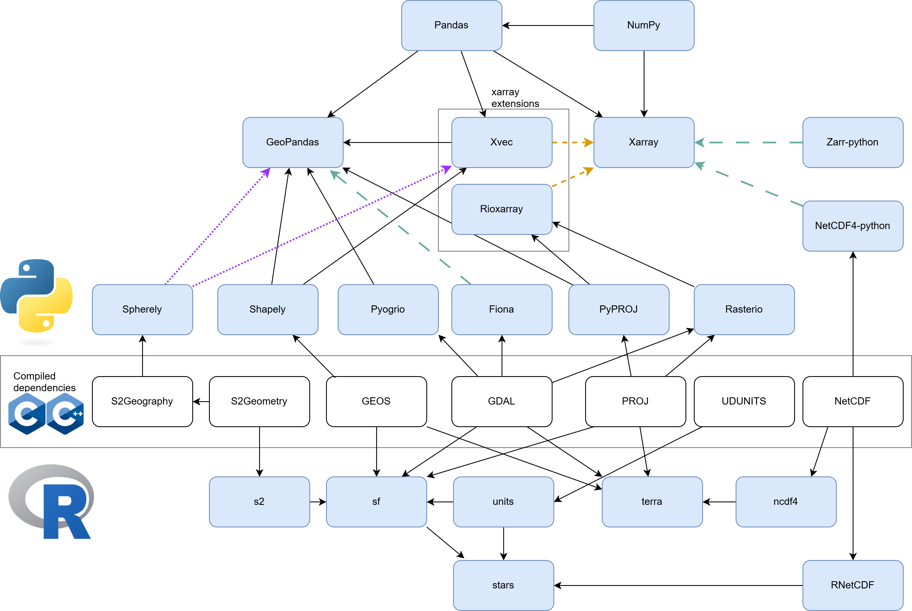
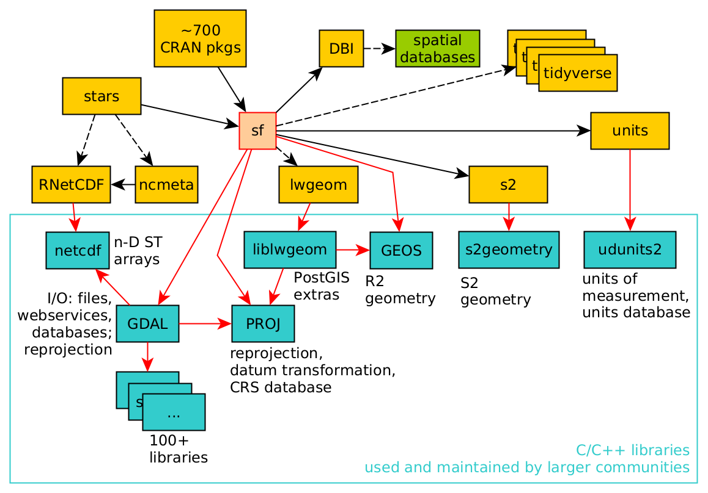
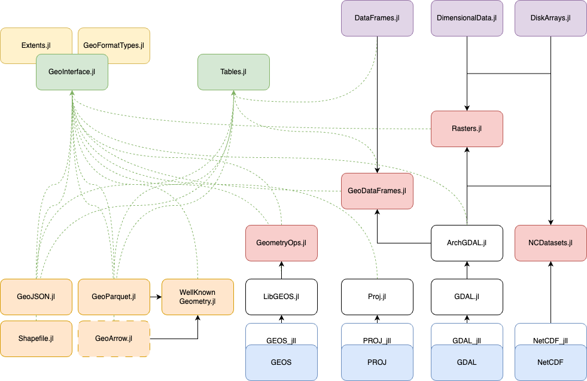

---
title: "Introducción a Programación Geoespacial"
author: "Alexys H. Rodríguez-Avellaneda, PhD"
date: last-modified
format:
  html:
    toc: true
    code-fold: true
    embed-resources: true
    self-contained-math: true    
    theme: cosmo
  pdf:
    keep-tex: true       # Esta es la etiqueta que buscas
    toc: true
    number-sections: true
    colorlinks: true
    papersize: letter
    #mermaid-format: png
    # Forzamos a Quarto a usar nuestro wrapper
    #chrome: /usr/local/bin/quarto-browser
execute-dir: project # Asegura contexto limpio
execute:
  cache: false        # Desactiva la caché de knitr
  freeze: false       # No congela resultados previos
  echo: true
  warning: false
  message: false
  daemon: false      # Evita que procesos en segundo plano interfieran
  enabled: true      # Asegura la ejecución
engine: knitr
---


## Funciones j_eval y j_plot en R

```{r}
#| label: j_eval_j_plot
#| code-fold: true
# #| include: false
source("./docs/j_eval_j_plot.r")
```


## Introducción

La programación aplicada al análisis de datos vectoriales sustituye la interacción manual en interfaces gráficas (GUI) por rutinas computacionales orientadas al procesamiento de geometrías y atributos espaciales. En la práctica de la Geomática, la manipulación de estructuras vectoriales mediante código es indispensable para gestionar altos volúmenes de cartografía oficial, como la producida por el Instituto Geográfico Agustín Codazzi (IGAC) o las bases de datos catastrales de Bogotá.

El diseño de flujos de trabajo programáticos para datos espaciales se fundamenta en tres principios técnicos:

* **Reproducibilidad:** La ejecución de un script asegura un procesamiento determinista. Un algoritmo de validación topológica sobre coberturas terrestres generará los mismos resultados independientemente del número de ejecuciones.
* **Escalabilidad:** Estructuras de control iterativas permiten procesar operaciones masivas de forma automatizada. El cálculo de áreas para miles de predios o la actualización masiva de sistemas de referencia geocéntricos requiere fracciones del tiempo comparado con flujos manuales.
* **Trazabilidad analítica:** El código fuente sirve como documentación algorítmica estandarizada. Permite auditar cada paso metodológico aplicado a un conjunto de datos, desde la lectura de la fuente original hasta las transformaciones geométricas aplicadas (ej. reproyecciones al sistema MAGNA-SIRGAS Origen Nacional EPSG:9377).

El estudio del procesamiento vectorial abarca la implementación del estándar *Simple Features* para la representación de puntos, líneas y polígonos, la referenciación lineal sobre infraestructuras de red (como la red vial del INVIAS), y el cálculo estricto de relaciones espaciales mediante la Matriz de Intersección Dimensionalmente Extendida de 9 Intersecciones (DE-9IM).

Estas operaciones geométricas y de geoprocesamiento se desarrollarán estableciendo una equivalencia técnica directa entre ecosistemas, implementando algoritmos espaciales estructurados en Python, R y Julia.

## Configuración del entorno

Para nuestra maestría, utilizaremos entornos aislados. Esto evita que una actualización de una librería de Python dañe nuestro flujo de trabajo en R o Julia.

::: {.panel-tabset}

### Python

::: {.content-visible when-format="html"}
::: {.callout-tip collapse="true" icon="false"}
#### ▷ CÓDIGO PURO (Copiar y Pegar)
```{bash}
#| label: python_instalacion_codigo
#| eval: false

# OPCIÓN 1: Usando uv (Recomendado para la Maestría)
# Instalación de uv
curl -LsSf https://astral.sh/uv/install.sh | sh
powershell -ExecutionPolicy ByPass -c "irm https://astral.sh/uv/install.ps1 | iex"

# Crear y activar entorno virtual
uv venv
.venv\Scripts\activate

# Instalación de librerías base (Soporte MAGNA-SIRGAS)
uv pip install --find-links https://girder.github.io/large_image_wheels gdal pyproj
uv pip install pygis

# ---------------------------------------------------------
# OPCIÓN 2: Usando pixi (Para dependencias complejas)
curl -fsSL https://pixi.sh/install.sh | bash
pixi init
pixi add pygis jupyterlab
pixi run jupyter lab

# ---------------------------------------------------------
# OPCIÓN 3: Usando conda/mamba (Enfoque tradicional)
conda create -n geo python=3.12
conda activate geo
conda install -c conda-forge mamba
mamba install -c conda-forge pygis
```
:::
:::

```{bash}
#| label: python_instalacion
#| eval: false

# OPCIÓN 1: Usando uv (Recomendado para la Maestría)
# Instalación de uv
curl -LsSf https://astral.sh/uv/install.sh | sh
powershell -ExecutionPolicy ByPass -c "irm https://astral.sh/uv/install.ps1 | iex"

# Crear y activar entorno virtual
uv venv
.venv\Scripts\activate

# Instalación de librerías base (Soporte MAGNA-SIRGAS)
uv pip install --find-links https://girder.github.io/large_image_wheels gdal pyproj
uv pip install pygis

# ---------------------------------------------------------
# OPCIÓN 2: Usando pixi (Para dependencias complejas)
curl -fsSL https://pixi.sh/install.sh | bash
pixi init
pixi add pygis jupyterlab
pixi run jupyter lab

# ---------------------------------------------------------
# OPCIÓN 3: Usando conda/mamba (Enfoque tradicional)
conda create -n geo python=3.12
conda activate geo
conda install -c conda-forge mamba
mamba install -c conda-forge pygis
```

### R

::: {.content-visible when-format="html"}
::: {.callout-tip collapse="true" icon="false"}
#### ▷ CÓDIGO PURO (Copiar y Pegar)
```{r}
#| label: r_instalacion_codigo
#| eval: false

# Instalación de paquetes geoespaciales fundamentales
install.packages(c("sf", "terra", "leaflet", "tmap"), dependencies = TRUE)

# Verificación de librerías de sistema vinculadas
sf::sf_extSoftVersion()
```
:::
:::

```{r}
#| label: r_instalacion
#| eval: false

# Instalación de paquetes geoespaciales fundamentales
install.packages(c("sf", "terra", "leaflet", "tmap"), dependencies = TRUE)

# Verificación de librerías de sistema vinculadas
sf::sf_extSoftVersion()
```

### Julia

::: {.content-visible when-format="html"}
::: {.callout-tip collapse="true" icon="false"}
#### ▷ CÓDIGO PURO (Copiar y Pegar)
```{julia}
#| label: julia_instalacion_codigo
#| eval: false

# Configuración del entorno de paquetes en Julia
using Pkg
Pkg.activate(".")

# Instalación de la pila geoespacial para la maestría
Pkg.add(["ArchGDAL", "GeoDataFrames", "Leaflet", "DataFrames"])
```
:::
:::

```{r}
#| label: julia_instalacion
#| results: asis
#| eval: false
# #| code-fold: true

j_eval('
# Configuración del entorno de paquetes en Julia
using Pkg
Pkg.activate(".")

# Instalación de la pila geoespacial para la maestría
Pkg.add(["ArchGDAL", "GeoDataFrames", "Leaflet", "DataFrames"])
')
```

:::

## Verificación y primeros pasos

Antes de procesar capas vectoriales o raster, debemos asegurar que el "motor" está encendido y los sistemas de coordenadas están disponibles.

::: {.panel-tabset}

### Python

::: {.content-visible when-format="html"}
::: {.callout-tip collapse="true" icon="false"}
#### ▷ CÓDIGO PURO (Copiar y Pegar)
```{python}
#| label: python_verificacion_codigo
#| eval: false

# Importación de librerías core para el curso
import geopandas as gpd
import rasterio
import leafmap
import pyproj

# Verificamos soporte para el Origen Único Nacional de Colombia (EPSG:9377)
try:
    crs = pyproj.CRS("EPSG:9377")
    print(f"✓ Soporte para {crs.name} verificado correctamente.")
except:
    print("X Error en la configuración de PROJ. Revisa la instalación de GDAL.")
```
:::
:::

```{python}
#| label: python_verificacion
# #| eval: false

# Importación de librerías core para el curso
import geopandas as gpd
import rasterio
import leafmap
import pyproj

# Verificamos soporte para el Origen Único Nacional de Colombia (EPSG:9377)
try:
    crs = pyproj.CRS("EPSG:9377")
    print(f"✓ Soporte para {crs.name} verificado correctamente.")
except:
    print("X Error en la configuración de PROJ. Revisa la instalación de GDAL.")
```

### R

::: {.content-visible when-format="html"}
::: {.callout-tip collapse="true" icon="false"}
#### ▷ CÓDIGO PURO (Copiar y Pegar)
```{r}
#| label: r_verificacion_codigo
#| eval: false

# Carga de librerías principales
library(sf)
library(terra)

# Verificamos si R reconoce el sistema de referencia oficial de Colombia (MAGNA-SIRGAS)
colombia_crs <- st_crs(9377)
print(paste("✓ Sistema detectado:", colombia_crs$name))
```
:::
:::

```{r}
#| label: r_verificacion
# #| eval: false

# Carga de librerías principales
library(sf)
library(terra)

# Verificamos si R reconoce el sistema de referencia oficial de Colombia (MAGNA-SIRGAS)
colombia_crs <- st_crs(9377)
print(paste("✓ Sistema detectado:", colombia_crs$name))
```

### Julia

::: {.content-visible when-format="html"}
::: {.callout-tip collapse="true" icon="false"}
#### ▷ CÓDIGO PURO (Copiar y Pegar)
```{julia}
#| label: julia_verificacion_codigo
#| eval: false

# Carga de librerías de lectura y manipulación de datos espaciales
using ArchGDAL
using GeoDataFrames

# Verificamos la carga de drivers geoespaciales (necesario para leer Shapefiles del IGAC)
println("✓ Drivers de GDAL disponibles: ", length(ArchGDAL.listdrivers()))
```
:::
:::

```{r}
#| label: julia_verificacion
#| results: asis
#| code-fold: true
# #| eval: false

j_eval('
# Carga de librerías de lectura y manipulación de datos espaciales
using ArchGDAL
using GeoDataFrames

# Verificamos la carga de drivers geoespaciales (necesario para leer Shapefiles del IGAC)
println("✓ Drivers de GDAL disponibles: ", length(ArchGDAL.listdrivers()))
')

```

:::

## Relación entre librerías geoespaciales

Para entender el funcionamiento de las librerías espaciales vectoriales, es estrictamente necesario analizar su arquitectura de software. Como señalan [@pebesma2025spatial], los lenguajes de programación para la ciencia de datos espaciales operan metodológicamente como interfaces de alto nivel (*wrappers*) que delegan el procesamiento algorítmico pesado a un núcleo de librerías estandarizadas escritas en C y C++.

Las tres librerías fundamentales que sustentan este ecosistema geoespacial son:

* **GDAL/OGR (Geospatial Data Abstraction Library):** Actúa como el **traductor universal de lectura y escritura**. Permite la importación y exportación estructurada de más de 100 formatos **vectoriales y raster** (ej. Shapefile de ESRI, GeoPackage, GeoJSON).
* **GEOS (Geometry Engine, Open Source):** Motor topológico responsable de ejecutar las **operaciones de geoprocesamiento paramétrico** (intersecciones espaciales, extracciones de centroides, áreas de influencia o *buffers*) y evaluar rigurosamente las **relaciones matemáticas entre geometrías** mediante el modelo DE-9IM.
* **PROJ:** Librería cartográfica dedicada exclusivamente a la **transformación algorítmica** de **Sistemas de Referencia de Coordenadas (CRS)**. Gestiona los modelos matemáticos para proyectar datos desde elipsoides globales (WGS84) hacia sistemas locales o proyectados (como el sistema MAGNA-SIRGAS Origen Nacional EPSG:9377).

La dependencia técnica compartida de esta triada garantiza la **interoperabilidad absoluta** entre ecosistemas. Si un flujo de trabajo exige limpiar un archivo GeoPackage catastral utilizando Python (`geopandas`), calcular métricas de área en R (`sf`) y ejecutar un modelo iterativo de optimización de rutas en Julia (`ArchGDAL`), el dato espacial mantendrá su integridad geométrica y tabular en todo momento. 

Esta coherencia transversal ocurre porque la **lectura binaria** de los vértices siempre la ejecuta **GDAL**, el cálculo del **área** siempre lo resuelve la matemática subyacente de **GEOS** y la **proyección espacial** siempre la maneja **PROJ**, independientemente de la sintaxis del lenguaje que envió la instrucción inicial.

A continuación, se visualizan las arquitecturas de dependencias y el enrutamiento hacia las librerías base en nuestros tres lenguajes:

::: {.panel-tabset}

### Python y R (General)

Esta gráfica detalla la relación de dependencias compartidas a nivel de sistema operativo entre los ecosistemas de R y Python.

{#fig-geopython fig-align="center" out-width="80%"}

### R (`sf`)

Árbol de dependencias específico para el paquete `sf` (Simple Features) en R, el motor fundamental de la geomática moderna en este entorno analítico.

{#fig-sfdeps fig-align="center" out-width="80%"}

### Julia

Estructura de la pila de dependencias dentro del ecosistema de Julia (GeoStack), destacando las envolturas directas (GDAL.jl, GEOS.jl, Proj.jl) hacia las API en lenguaje C.

{#fig-geostack fig-align="center" out-width="80%"}

:::


## Mapa interactivo en Colombia

Finalizaremos visualizando nuestra ubicación central: la **Universidad Nacional de Colombia, Sede Bogotá**.

::: {.panel-tabset}

### Python

::: {.content-visible when-format="html"}
::: {.callout-tip collapse="true" icon="false"}
#### ▷ CÓDIGO PURO (Copiar y Pegar)
```{python}
#| label: python_mapa_codigo
#| eval: false

import leafmap

# Definimos las coordenadas de la Plaza Central de la UNAL Bogotá
lat, lon = 4.6381, -74.0841

# Inicializamos el mapa interactivo centrado en la universidad
m = leafmap.Map(center=[lat, lon], zoom=15, height="500px")

# Añadimos un mapa base topográfico libre
m.add_basemap("OpenTopoMap")

# Colocamos un marcador en nuestra ubicación
m.add_marker(location=[lat, lon], text="Sede Bogotá - UNAL")

# Mostramos el mapa
m
```
:::
:::

```{python}
#| label: python_mapa
# #| eval: false

import leafmap

# Definimos las coordenadas de la Plaza Central de la UNAL Bogotá
lat, lon = 4.6381, -74.0841

# Inicializamos el mapa interactivo centrado en la universidad
m = leafmap.Map(center=[lat, lon], zoom=15, height="500px")

# Añadimos un mapa base topográfico libre
m.add_basemap("OpenTopoMap")

# Colocamos un marcador en nuestra ubicación
m.add_marker(location=[lat, lon], text="Sede Bogotá - UNAL")

# Mostramos el mapa
m
```

### R

::: {.content-visible when-format="html"}
::: {.callout-tip collapse="true" icon="false"}
#### ▷ CÓDIGO PURO (Copiar y Pegar)
```{r}
#| label: r_mapa_codigo
#| eval: false

library(leaflet)

# Creamos un mapa interactivo encadenando funciones (pipes %>%)
leaflet() %>%
  # Añadimos la capa de fondo topográfica
  addProviderTiles(providers$OpenTopoMap) %>%
  # Añadimos un pin con un mensaje emergente
  addMarkers(lng = -74.0841, lat = 4.6381, popup = "Universidad Nacional de Colombia") %>%
  # Centramos la vista inicial
  setView(lng = -74.0841, lat = 4.6381, zoom = 15)
```
:::
:::

```{r}
#| label: r_mapa
# #| eval: false

library(leaflet)

# Creamos un mapa interactivo encadenando funciones (pipes %>%)
mapa <- leaflet() %>%
  # Añade el mapa base tradicional (probado y robusto en Quarto)
  addTiles() %>% 
  # Añadimos un pin con un mensaje emergente
  addMarkers(lng = -74.0841, lat = 4.6381, popup = "Universidad Nacional de Colombia") %>%
  # Centramos la vista inicial
  setView(lng = -74.0841, lat = 4.6381, zoom = 15)

# SACA: El mapa interactivo listo
mapa
```

### Julia

::: {.content-visible when-format="html"}
::: {.callout-tip collapse="true" icon="false"}
#### ▷ CÓDIGO PURO (Copiar y Pegar)
```{julia}
#| label: julia_mapa_codigo
#| eval: false

# NOTA TÉCNICA: 
# La visualización interactiva nativa en Julia a través de Quarto
# está en desarrollo activo. Si el paquete Leaflet no está instalado en el 
# entorno o presenta conflictos de renderizado con j_eval, 
# se recomienda ejecutar este bloque localmente en su REPL.

using Leaflet

# Generación del mapa interactivo usando Leaflet.jl
mapa = Leaflet.Map(
    # URL directa del mapa base OpenTopoMap
    layers=[Leaflet.Layer("https://{s}.tile.opentopomap.org/{z}/{x}/{y}.png")], 
    # Coordenadas de la Sede Bogotá
    center=[4.6381, -74.0841], 
    zoom=15
)

# Renderizar el mapa
mapa
```
:::
:::

```{r}
#| label: julia_mapa
#| results: asis
#| eval: false
# #| code-fold: true

# NOTA TÉCNICA: 
# La visualización interactiva nativa en Julia a través de Quarto
# está en desarrollo activo. Si el paquete Leaflet no está instalado en el 
# entorno o presenta conflictos de renderizado con j_eval, 
# se recomienda ejecutar este bloque localmente en su REPL.

#
# Usamos j_eval para que el motor knitr comunique con Julia
j_eval('
using Leaflet

# Generación del mapa interactivo usando Leaflet.jl
mapa = Leaflet.Map(
    # URL directa del mapa base OpenTopoMap
    layers=[Leaflet.Layer("https://{s}.tile.opentopomap.org/{z}/{x}/{y}.png")], 
    # Coordenadas de la Sede Bogotá
    center=[4.6381, -74.0841], 
    zoom=15
)

# Renderizar el mapa
mapa
')
```

:::


## Resumen de aprendizajes (cheat sheet)

Este primer capítulo establece los requerimientos técnicos y de entorno necesarios para el procesamiento de datos espaciales. 

Conceptos clave abordados:

* **Dependencias base (GDAL/PROJ/GEOS):** Python, R y Julia actúan como interfaces de alto nivel que ejecutan rutinas sobre estas librerías subyacentes de C/C++ para la lectura de formatos y cálculo de proyecciones.
* **Aislamiento de proyectos:** El uso de entornos virtuales es un estándar en la programación científica. Evita la instalación global de paquetes para prevenir conflictos de versiones entre diferentes análisis.
* **Sistemas de referencia:** La verificación y configuración de PROJ es un requisito fundamental para garantizar el soporte del Origen Único Nacional (MAGNA-SIRGAS EPSG:9377) y evitar errores métricos al trabajar con datos de Colombia.
* **Visualización interactiva:** Las librerías de alto nivel permiten la instanciación de mapas web de forma declarativa para la exploración rápida del área de estudio.

Hoja de referencia sintáctica para la configuración del entorno y visualización básica entre Python, R y Julia:

### Gestión de entornos e instalación

| Tarea | Python (`uv` / `pip`) 🐍 | R (CRAN) 🔵 | Julia (`Pkg`) 🟣 |
| :--- | :--- | :--- | :--- |
| **Crear entorno** | `uv venv` | `renv::init()` *(Opcional)* | `Pkg.activate(".")` |
| **Activar entorno** | `source .venv/bin/activate` | Automático al abrir proyecto | `using Pkg; Pkg.activate(".")` |
| **Instalar vectores** | `uv pip install geopandas` | `install.packages("sf")` | `Pkg.add("GeoDataFrames")` |
| **Instalar rasters** | `uv pip install rasterio` | `install.packages("terra")` | `Pkg.add("ArchGDAL")` |
| **Instalar visualización** | `uv pip install leafmap` | `install.packages("leaflet")`| `Pkg.add("Leaflet")` |

: Sintaxis para la preparación del entorno de trabajo SIG {#tbl-resumen_entornos tbl-colwidths="[25,25,25,25]"}

### Verificación del motor geoespacial

| Tarea | Python (Geopandas/Pyproj) 🐍 | R (`sf`) 🔵 | Julia (ArchGDAL) 🟣 |
| :--- | :--- | :--- | :--- |
| **Importar librerías** | `import geopandas as gpd` | `library(sf)` | `using ArchGDAL` |
| **Verificar GDAL/PROJ**| Automático al importar | `sf::sf_extSoftVersion()` | `length(ArchGDAL.listdrivers())` |
| **Comprobar EPSG** | `pyproj.CRS("EPSG:9377")` | `st_crs(9377)` | *(Lo veremos en cap. vectores)* |

: Sintaxis para verificar el estado de las librerías base de C/C++ {#tbl-resumen_verificacion tbl-colwidths="[25,25,25,25]"}

### Mapas web interactivos básicos

| Tarea | Python (`leafmap`) 🐍 | R (`leaflet`) 🔵 | Julia (`Leaflet.jl`) 🟣 |
| :--- | :--- | :--- | :--- |
| **Importar módulo** | `import leafmap` | `library(leaflet)` | `using Leaflet` |
| **Inicializar mapa** | `m = leafmap.Map(center=[lat, lon], zoom=15)` | `leaflet(height=500) %>% setView(lon, lat, 15)` | `Leaflet.Map(center=[lat, lon], zoom=15)` |
| **Capa base** | `m.add_basemap("OpenTopoMap")` | `addProviderTiles(providers$OpenTopoMap)` | `layers=[Leaflet.Layer("url_aqui")]` |
| **Añadir marcador** | `m.add_marker([lat, lon], text="Sede")` | `addMarkers(lng=lon, lat=lat, popup="Sede")` | *(Mediante inserción de Features)* |

: Sintaxis para la creación de mapas interactivos con tecnología Leaflet {#tbl-resumen_mapas tbl-colwidths="[25,25,25,25]"}


---

**Siguiente paso:** Con nuestro entorno de trabajo configurado, las dependencias base de GDAL/PROJ/GEOS verificadas y nuestro primer mapa interactivo renderizado, estamos listos para adentrarnos en la manipulación directa de los datos espaciales. En el siguiente capítulo, exploraremos a fondo la estructura y creación del modelo vectorial mediante el estándar *Simple Features*.
