---
title: "Trabajando con Vectores: Estándar Simple Features"
author: "Alexys H. Rodríguez-Avellaneda, PhD"
date: last-modified
format:
  html:
    toc: true
    code-fold: true
    embed-resources: true
    theme: cosmo
  pdf:
    keep-tex: true       # Esta es la etiqueta que buscas
    toc: true
    number-sections: true
    colorlinks: true
    papersize: letter
    #mermaid-format: png
    # Forzamos a Quarto a usar nuestro wrapper
    #chrome: /usr/local/bin/quarto-browser
execute-dir: project # Asegura contexto limpio
execute:
  cache: false        # Desactiva la caché de knitr
  freeze: false       # No congela resultados previos
  echo: true
  warning: false
  message: false
  daemon: false      # Evita que procesos en segundo plano interfieran
  enabled: true      # Asegura la ejecución
engine: knitr
---


## Funciones j_eval y j_plot en R

```{r}
#| label: j_eval_j_plot
#| code-fold: true
# #| include: false
source("./docs/j_eval_j_plot.r")
```


## Introducción

## El estándar *Simple Features*

> **Nota:** Esta sección introductoria está adaptada y generalizada a partir de la [Vignette 1 del paquete sf](https://r-spatial.github.io/sf/articles/sf1.html) de R.


El término [Simple Features](https://en.wikipedia.org/wiki/Simple_Features) (o *acceso a entidades simples*) hace referencia a un estándar formal (ISO 19125-1:2004) definido por el [Open Geospatial Consortium (OGC)](https://www.ogc.org/standards/sfa/). Este estándar dicta cómo los **objetos del mundo real deben ser representados digitalmente**, haciendo especial énfasis en su **geometría espacial**. Además, establece las **reglas para el almacenamiento en bases de datos** y define las **operaciones matemáticas** permitidas entre estas geometrías.

Este estándar es el motor subyacente de prácticamente todo el ecosistema geoespacial moderno. Está implementado en bases de datos espaciales como [PostGIS](https://postgis.net/), software comercial como [ESRI ArcGIS](https://www.esri.com/en-us/home), y es la base **vectorial** de librerías fundamentales como [GDAL](https://gdal.org/). Incluso, un subconjunto de estas reglas conforma el popular estándar web [GeoJSON](https://geojson.org/).

### ¿Qué es un *Feature* (Entidad)?

En el contexto SIG, un *feature* es **cualquier cosa u objeto en el mundo real**: un edificio, un árbol, un bosque o una ciudad completa. Para que un objeto sea considerado un *feature* bajo este estándar, debe poseer dos componentes inseparables:

1. **Una geometría:** Describe *dónde* está localizado en la Tierra (ej. la coordenada central de un árbol o el polígono de su copa).
2. **Atributos:** Describen *otras propiedades* no espaciales (ej. altura, especie, fecha de plantación).

### Dimensiones Espaciales

Toda geometría se compone de vértices o coordenadas en un espacio matemático. Aunque usualmente trabajamos en 2 dimensiones (X, Y), el estándar soporta dimensiones adicionales para modelar la realidad con mayor precisión:

* **Z (Altitud):** Representa la elevación tridimensional.
* **M (Medida):** Un eje opcional para asociar valores continuos al vértice, como el tiempo de captura o el margen de error del GPS.

Esto permite cuatro combinaciones de coordenadas: **XY** (2D estándar), **XYZ** (3D espacial), **XYM** (2D + medida) y **XYZM** (4D). Todas las coordenadas dentro de una misma geometría deben tener exactamente la misma dimensionalidad.

### Tipos de Geometría

El estándar define múltiples formas geométricas. Las **siete básicas** son las más utilizadas universalmente (y son las únicas soportadas por [GeoJSON](https://www.rfc-editor.org/rfc/rfc7946)):

| Tipo | Descripción |
| :--- | :--- |
| `POINT` | Geometría de dimensión cero. Un único punto en el espacio. |
| `LINESTRING` | Secuencia de puntos conectados por segmentos rectos que no se intersecan a sí mismos; geometría unidimensional. |
| `POLYGON` | Geometría con área positiva (bidimensional). Una secuencia de puntos que forma un anillo cerrado. El primer anillo define el exterior y los anillos subsiguientes definen huecos (islas) en el interior. |
| `MULTIPOINT` | Conjunto de múltiples puntos aislados. |
| `MULTILINESTRING` | Conjunto de múltiples líneas (`LINESTRING`). |
| `MULTIPOLYGON` | Conjunto de múltiples polígonos. |
| `GEOMETRYCOLLECTION` | Colección heterogénea de geometrías de cualquier tipo (ej. un punto y un polígono juntos). |

: Tipos de geometrías básicas del estándar Simple Features. {#tbl-sf_basicas tbl-colwidths="[25,75]"}

Adicionalmente, el estándar (y extensiones como [SQL-MM](https://www.iso.org/obp/ui/#iso:std:iso-iec:13249:-3:ed-5:v1:en)) contemplan **diez geometrías complejas**, las cuales son menos frecuentes pero ganan popularidad en aplicaciones topográficas y de diseño asistido:

| Tipo | Descripción |
| :--- | :--- |
| `CIRCULARSTRING` | Curva básica. Requiere tres puntos para definir un arco o un círculo cerrado. |
| `COMPOUNDCURVE` | Curva continua que combina segmentos curvos y rectos. |
| `CURVEPOLYGON` | Polígono cuyos límites están definidos por curvas en lugar de líneas rectas. |
| `MULTICURVE` | Colección unidimensional compuesta por múltiples curvas. |
| `MULTISURFACE` | Colección bidimensional de superficies. |
| `CURVE` / `SURFACE` | Objetos geométricos abstractos uni y bidimensionales. |
| `POLYHEDRALSURFACE`| Colección contigua de polígonos en 3D que comparten bordes comunes. |
| `TIN` | Red Irregular Triangulada. Superficie compuesta exclusivamente por parches triangulares. |
| `TRIANGLE` | Polígono estricto de 3 vértices no colineales sin huecos interiores. |

: Tipos de geometrías avanzadas (curvas y superficies). {#tbl-sf_avanzadas tbl-colwidths="[25,75]"}

Finalmente, todas estas geometrías carecen de sentido geográfico si no están asociadas a un **Sistema de Referencia de Coordenadas (CRS)**, como WGS84 o UTM, el cual actúa como el "traductor" que ancla estas matemáticas abstractas a una ubicación real sobre el esferoide terrestre.


#### Soporte a geometrías avanzados.

El estándar Simple Features define 17 tipos de geometrías. Además de los siete más comunes (puntos, líneas, polígonos y sus colecciones múltiples), existen geometrías diseñadas para representar curvas y superficies matemáticas, tales como `CIRCULARSTRING`, `COMPOUNDCURVE`, `CURVEPOLYGON`, `MULTICURVE` y `MULTISURFACE`. Estas geometrías son útiles para representar elementos con curvatura exacta (como el diseño geométrico de un trazado vial del IGAC) sin recurrir a la densificación por vértices.

La implementación computacional de estas geometrías varía:

- En R, el paquete `sf` permite su lectura e importación, pero muchas funciones de geoprocesamiento fuerzan su linealización previa.
- En Python, `Shapely` trabaja nativamente con geometrías lineales, aproximando las curvas mediante interpolación de coordenadas espaciales.
- En Julia, `ArchGDAL` soporta la lectura de curvas si la librería subyacente de **GDAL/GEOS está compilada con soporte avanzado**.


## Arquitectura de los objetos espaciales

Antes de crear geometrías manualmente, es fundamental comprender la **jerarquía estructural** que los lenguajes de programación utilizan para almacenar y vincular información espacial con atributos tabulares. Esta arquitectura consta de tres niveles y su equivalencia lógica varía según el entorno de desarrollo:

1. **Primitiva geométrica (geometría individual):** El objeto base que contiene únicamente las coordenadas matemáticas de un elemento individual (un punto, una línea, un polígono). Representa un solo objeto en el espacio (`shapely.geometry` en Python,`sfg` en R, `ArchGDAL.IGeometry` en Julia).
2. **Columna espacial (columna de geometrías):** Una estructura de datos unidimensional (vector o serie) que agrupa múltiples primitivas geométricas y define el Sistema de Referencia de Coordenadas (CRS) unificado, como MAGNA-SIRGAS EPSG:9377 (`GeoSeries` en Python, `sfc` en R, `Vector{IGeometry}` en Julia).
3. **Tabla espacial (data frame espacial):** Estructura tabular completa que asocia la columna de geometrías espaciales con múltiples columnas de atributos alfanuméricos (textos, números, fechas) (`GeoDataFrame` en Python, `sf` en R, `DataFrame` geométrico en Julia).

El siguiente esquema detalla la nomenclatura general de los objetos y, en la segunda línea de cada celda, el tipo de dato exacto que devuelve el sistema al evaluar una geometría de tipo punto para cada nivel:

| Nivel Estructural | Python (`shapely` / `geopandas`) 🐍 | R (`sf`) 🔵 | Julia (`ArchGDAL`) 🟣 |
| :--- | :--- | :--- | :--- |
| **1. Primitiva** | `Point`, `LineString`, `Polygon`<br>*(Ej. `shapely.geometry.`<br>`point.Point`)* | `sfg` *(Simple Feature Geometry)*<br>*(Ej. `c("XY", "POINT", "sfg")`)* | `ArchGDAL.IGeometry`<br>*(Ej. `ArchGDAL.IGeometry`<br>`{ArchGDAL.wkbPoint}`)* |
| **2. Columna** | `GeoSeries`<br>*(Ej. `geopandas.geoseries.`<br>`GeoSeries`)* | `sfc` *(Simple Feature Column)*<br>*(Ej. `c("sfc_POINT", "sfc")`)* | `Vector{IGeometry}`<br>*(Ej. `Vector{ArchGDAL.`<br>`IGeometry{...}}`)* |
| **3. Tabla** | `GeoDataFrame`<br>*(Ej. `geopandas.`<br>`geodataframe.GeoDataFrame`)* | `sf` *(Simple Feature)*<br>*(Ej. `c("sf", "data.frame")`)* | `DataFrame` *(con columna geom)*<br>*(Ej. `DataFrame`)* |

: Equivalencia de las clases y tipos de datos en la arquitectura espacial de los tres lenguajes. {#tbl-arquitectura_objetos tbl-colwidths="[16,28,28,28]"}


## Creación de puntos a partir de primitivas geométricas

El enfoque alternativo consiste en instanciar directamente los objetos de la clase "Punto" proporcionando sus coordenadas numéricas al constructor de la librería correspondiente, para posteriormente apilarlos en una columna espacial.

::: {.panel-tabset}

### Python

::: {.content-visible when-format="html"}
::: {.callout-tip collapse="true" icon="false"}
#### ▷ CÓDIGO PURO (Copiar y Pegar)
```{python}
#| label: python_crear_primitiva_codigo
#| eval: false

import geopandas as gpd
from shapely.geometry import Point
import matplotlib.pyplot as plt

# 1. Instanciación explícita de las primitivas geométricas (Point)
p1 = Point(-72.9553, 4.0903)
p2 = Point(-74.0760, 4.5981)
p3 = Point(-75.1792, 6.2205)

# 2. Inspección de la primitiva geométrica
print(p3)
print(type(p3))

# 3. Ensamblaje directo de atributos y lista de primitivas en un GeoDataFrame
gdf_prim = gpd.GeoDataFrame(
    {"Lugar": ["Centro Geográfico", "Plaza de Bolívar", "Piedra del Peñol"]}, 
    geometry=[p1, p2, p3], 
    crs="EPSG:4326"
)

# 4. Inspección de la columna espacial y la tabla completa
# En Python se accede a las columnas con el punto (.) o corchetes ['columna']
print(gdf_prim.geometry)
print(type(gdf_prim.geometry))

print(gdf_prim)
print(type(gdf_prim))

# 5. Visualización
fig, ax = plt.subplots(figsize=(8, 6))
gdf_prim.plot(ax=ax, column="Lugar", legend=True, markersize=100, cmap="Dark2")
ax.set_title("Lugares Representativos (Primitivas)")
plt.show()
```
:::
:::

```{python}
#| label: python_crear_primitiva

import geopandas as gpd
from shapely.geometry import Point
import matplotlib.pyplot as plt

# 1. Instanciación explícita de las primitivas geométricas (Point)
p1 = Point(-72.9553, 4.0903)
p2 = Point(-74.0760, 4.5981)
p3 = Point(-75.1792, 6.2205)

# 2. Inspección de la primitiva geométrica
print("--- Primitiva p3 ---")
print(p3)
print(type(p3), "\n")

# 3. Ensamblaje directo de atributos y lista de primitivas en un GeoDataFrame
gdf_prim = gpd.GeoDataFrame(
    {"Lugar": ["Centro Geográfico", "Plaza de Bolívar", "Piedra del Peñol"]}, 
    geometry=[p1, p2, p3], 
    crs="EPSG:4326"
)

# 4. Inspección de la columna espacial y la tabla completa
# En Python se accede a las columnas con el punto (.) o corchetes ['columna']
print("--- Columna de Geometría ---")
print(gdf_prim.geometry)
print(type(gdf_prim.geometry), "\n")

print("--- Estructura de la Tabla ---")
print(gdf_prim)
print(type(gdf_prim), "\n")

# 5. Visualización
fig, ax = plt.subplots(figsize=(8, 6))
gdf_prim.plot(ax=ax, column="Lugar", legend=True, markersize=100, cmap="Dark2")
ax.set_title("Lugares Representativos (Primitivas)")
plt.show()
```

### R

::: {.content-visible when-format="html"}
::: {.callout-tip collapse="true" icon="false"}
#### ▷ CÓDIGO PURO (Copiar y Pegar)
```{r}
#| label: r_crear_primitiva_codigo
#| eval: false
#| fig-align: center
#| out-width: "75%"

library(sf)

# 1. Instanciación de las primitivas individuales (sfg)
p1 <- st_point(c(-72.9553, 4.0903))
p2 <- st_point(c(-74.0760, 4.5981))
p3 <- st_point(c(-75.1792, 6.2205))

# 2. Inspección de la primitiva geométrica
print(p3)
print(class(p3))

# 3. Agrupación en una columna espacial (sfc)
columna_sfc <- st_sfc(p1, p2, p3, crs = 4326)

# 4. Ensamblaje en la tabla espacial (sf)
gdf_prim <- st_sf(
  Lugar = c("Centro Geográfico", "Plaza de Bolívar", "Piedra del Peñol"), 
  geometry = columna_sfc
)

# 5. Inspección de la columna espacial y la tabla completa
print(gdf_prim$geometry)
print(class(gdf_prim$geometry))

print(gdf_prim)
print(class(gdf_prim))

# 6. Visualización
plot(
  gdf_prim["Lugar"], 
  main = "Lugares Representativos (Primitivas)",
  pch = 17, cex = 2, axes = TRUE, key.pos = 4
)
```
:::
:::

```{r}
#| label: r_crear_primitiva
#| fig-align: center
#| out-width: "75%"

library(sf)

# 1. Instanciación de las primitivas individuales (sfg)
p1 <- st_point(c(-72.9553, 4.0903))
p2 <- st_point(c(-74.0760, 4.5981))
p3 <- st_point(c(-75.1792, 6.2205))

# 2. Inspección de la primitiva geométrica
print(p3)
print(class(p3))

# 3. Agrupación en una columna espacial (sfc)
columna_sfc <- st_sfc(p1, p2, p3, crs = 4326)

# 4. Ensamblaje en la tabla espacial (sf)
gdf_prim <- st_sf(
  Lugar = c("Centro Geográfico", "Plaza de Bolívar", "Piedra del Peñol"), 
  geometry = columna_sfc
)

# 5. Inspección de la columna espacial y la tabla completa
print(gdf_prim$geometry)
print(class(gdf_prim$geometry))

print(gdf_prim)
print(class(gdf_prim))

# 6. Visualización
plot(
  gdf_prim["Lugar"], 
  main = "Lugares Representativos (Primitivas)",
  pch = 17, cex = 2, axes = TRUE, key.pos = 4
)
```

### Julia

::: {.content-visible when-format="html"}
::: {.callout-tip collapse="true" icon="false"}
#### ▷ CÓDIGO PURO (Copiar y Pegar)
```{julia}
#| label: julia_crear_primitiva_codigo
#| eval: false
#| fig-align: center
#| out-width: "75%"

using ArchGDAL
using DataFrames
using Plots

# 1. Instanciación de las primitivas geométricas
p1 = ArchGDAL.createpoint(-72.9553, 4.0903)
p2 = ArchGDAL.createpoint(-74.0760, 4.5981)
p3 = ArchGDAL.createpoint(-75.1792, 6.2205)

# 2. Inspección de la primitiva geométrica
println(p3)
println(typeof(p3))

# 3. Ensamblaje en el DataFrame utilizando un arreglo de geometrías
df_prim = DataFrame(
    Lugar = ["Centro Geográfico", "Plaza de Bolívar", "Piedra del Peñol"], 
    geometry = [p1, p2, p3]
)

# 4. Inspección de la columna espacial y la tabla completa
# En Julia se accede a la columna mediante la notación de punto (df.columna)
columna_geo = df_prim.geometry

println("Tipo de la columna completa:")
println(typeof(columna_geo))

println("Tipo de la tabla espacial:")
println(typeof(df_prim))

# 5. Visualización
x_coords = ArchGDAL.getx.(df_prim.geometry, 0)
y_coords = ArchGDAL.gety.(df_prim.geometry, 0)

scatter(
    x_coords, y_coords, 
    group = df_prim.Lugar, 
    title = "Lugares Representativos (Primitivas)",
    markershape = :utriangle, markersize = 8, aspect_ratio = :equal,
    legend = :outertopright
)
```
:::
:::


```{r}
#| label: julia_crear_primitiva
#| results: asis
#| code-fold: true
#| fig-align: center
#| out-width: "75%"

j_eval('
using ArchGDAL
using DataFrames
using Plots

# 1. Instanciación de las primitivas geométricas
p1 = ArchGDAL.createpoint(-72.9553, 4.0903)
p2 = ArchGDAL.createpoint(-74.0760, 4.5981)
p3 = ArchGDAL.createpoint(-75.1792, 6.2205)

# 2. Inspección de la primitiva geométrica
println(p3)
println(typeof(p3))

# 3. Ensamblaje en el DataFrame utilizando un arreglo de geometrías
df_prim = DataFrame(
    Lugar = ["Centro Geográfico", "Plaza de Bolívar", "Piedra del Peñol"], 
    geometry = [p1, p2, p3]
)

# 4. Inspección de la columna espacial y la tabla completa
columna_geo = df_prim.geometry

println("Tipo de la columna completa: ", typeof(columna_geo))
println("Tipo de la tabla espacial: ", typeof(df_prim))

# 5. Visualización y exportación
x_coords = ArchGDAL.getx.(df_prim.geometry, 0)
y_coords = ArchGDAL.gety.(df_prim.geometry, 0)

p_prim = Plots.scatter(
    x_coords, y_coords, 
    group = df_prim.Lugar, 
    title = "Lugares Representativos (Primitivas)",
    markershape = :utriangle, markersize = 8, aspect_ratio = :equal,
    legend = :outertopright
)

Plots.savefig(p_prim, "images/c14_plot_primitivas_lugares_julia.png")
')

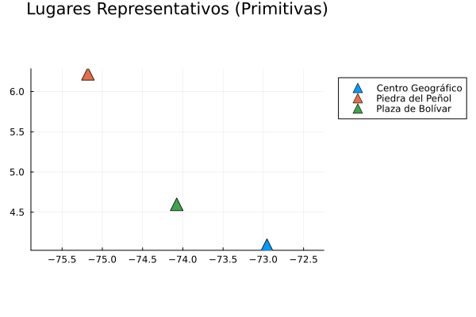
```

**Nota técnica: Graficación modular en Julia**

A diferencia de Python y R, Julia no posee un objeto "GeoDataFrame" monolítico con métodos de ploteo integrados. La diferencia radica en la arquitectura del lenguaje:

* **Enfoque Monolítico (R/Python):** Los paquetes `sf` y `geopandas` contienen métodos que iteran automáticamente sobre las geometrías para extraer coordenadas al llamar a `plot()`.
* **Enfoque Modular (Julia):** Existe una separación estricta de responsabilidades. `DataFrames.jl` gestiona tablas planas, `ArchGDAL.jl` procesa geometrías puras y `Plots.jl` funciona como un motor gráfico genérico. 

Al no existir una receta gráfica pre-programada para tablas espaciales, es obligatorio desensamblar las geometrías en sus vectores numéricos $X$ e $Y$. La aproximación más cercana a una sintaxis tabular requiere `StatsPlots.jl` y la macro `@df`:

```{julia}
#| label: julia_statsplots_detalle
#| eval: false

# 1. Importación de StatsPlots: Esta librería extiende 'Plots.jl' y proporciona 
# la macro '@df', permitiendo que las funciones gráficas reconozcan DataFrames.
using StatsPlots 

# 2. Uso de la macro @df para graficación tabular:
# @df actúa como un 'traductor'; recibe el DataFrame (df_wkt) y permite que 
# las columnas sean llamadas como símbolos (:nombre_columna). Sin esto,
# scatter() no sabría buscar ':geometry' o ':Lugar' dentro de la tabla.
@df df_wkt scatter(
    # Extrae la coordenada X (Longitud) de forma vectorizada (operador punto '.')
    # ArchGDAL.getx requiere la geometría y el índice del punto (0 para POINT).
    # Al usar ':geometry', @df pasa toda la columna a la operación.
    ArchGDAL.getx.(:geometry, 0), 
    
    # Extrae la coordenada Y (Latitud) de forma vectorizada (operador punto '.')
    # Devuelve un vector numérico que el motor gráfico puede interpretar.
    ArchGDAL.gety.(:geometry, 0), 
    
    # Atributo 'group': Es el equivalente a 'column' en GeoPandas o 'sf'.
    # Categoriza los datos por los valores únicos de la columna ':Lugar',
    # asignando colores automáticamente y construyendo la leyenda.
    group = :Lugar,
    
    # Parámetros estéticos:
    title = "Visualización Espacial Modular (StatsPlots + ArchGDAL)",
    xlabel = "Longitud",
    ylabel = "Latitud",
    markersize = 7,
    # aspect_ratio = :equal es crítico en SIG para evitar la distorsión visual 
    # de las coordenadas geográficas en el plano.
    aspect_ratio = :equal 
)
```

:::


### Resumen sintáctico: Creación de puntos mediante primitivas

| Operación | Python (`shapely`/`geopandas`) 🐍 | R (`sf`) 🔵 | Julia (`ArchGDAL`) 🟣 |
| :--- | :--- | :--- | :--- |
| **Instanciar primitiva** | `p = Point(x, y)` | `p <- st_point(c(x, y))` | `p = ArchGDAL.createpoint(x, y)` |
| **Columna espacial** | `gpd.GeoSeries([p1, p2])` | `st_sfc(p1, p2)` | `[p1, p2]` *(Vector de IGeometry)* |
| **Tabla espacial** | `gpd.GeoDataFrame(df, geometry=[p1, ...])` | `st_sf(df, geometry = sfc)` | `DataFrame(df, geometry = [p1, ...])` |

: Sintaxis comparativa para la instanciación de objetos de geometría punto y su integración en estructuras tabulares {#tbl-resumen_primitivas_puntos tbl-colwidths="[25,25,25,25]"}

## Más allá del Punto: Líneas, Polígonos y Multigeometrías

Hasta ahora hemos trabajado con la primitiva espacial más elemental: el punto (una geometría de cero dimensiones). Sin embargo, para representar la geografía real necesitamos estructuras de mayor complejidad. Las carreteras, el cauce del Río Magdalena o las fronteras departamentales requieren geometrías de 1 y 2 dimensiones.

| Dimensión | Tipo de Geometría (OGC) | Propiedades Matemáticas | Ejemplos Cartográficos |
| :---: | :--- | :--- | :--- |
| **0D** | `Point`, `MultiPoint` | Solo posee coordenadas exactas de ubicación (X, Y). No tiene longitud ni área calculable. | Postes de luz, pozos de extracción, epicentros de sismos, ciudades (a escala global o nacional). |
| **1D** | `LineString`, `MultiLineString` | Posee longitud euclidiana o geodésica, pero carece de área. Conecta dos o más vértices en el espacio. | Red vial (carreteras), redes de acueducto, fallas geológicas, cauces de ríos (como líneas de flujo). |
| **2D** | `Polygon`, `MultiPolygon` | Posee longitud (perímetro) y un área bidimensional interna delimitada por anillos topológicos cerrados. | Fronteras departamentales, lagos y ciénagas, predios catastrales, reservas naturales. |

: Clasificación topológica de las geometrías espaciales según sus dimensiones y propiedades de medición. {#tbl-dimensiones-geometria tbl-colwidths="[10,25,35,30]"}

Independientemente del lenguaje de programación (Python, R o Julia), todos los ecosistemas GIS construyen estas geometrías complejas basándose en una arquitectura estricta de "muñecas rusas" (anidamiento de coordenadas):

1. **`POINT` (Punto):** El pilar fundamental. Matemáticamente es un simple vector numérico o tupla $[X, Y]$. *Ejemplo: La plaza central de Villa de Leyva.*
2. **`LINESTRING` (Línea):** Una secuencia de múltiples puntos conectados por segmentos rectos. En código, esto se representa como una matriz o una lista de coordenadas: $[[X_1, Y_1], [X_2, Y_2], ...]$. *Ejemplo: Un tramo de la Ruta del Sol.*
3. **`POLYGON` (Polígono):** Una geometría bidimensional con área. Estructuralmente es una lista de anillos (donde un anillo es un `LINESTRING` cerrado **cuyo primer y último punto coinciden**). El primer elemento de la lista siempre es el límite exterior, y los elementos subsiguientes representan huecos o "islas" vacías en su interior. Ejemplos:

    * **Hueco puro (Enclave):** La Comuna El Oso en Pereira, cuyo polígono base contiene un anillo interior que delimita íntegramente a la Comuna Perla del Otún.
    
    * **Isla (Exclave):** El departamento de Bolívar, cuya definición geométrica incluye polígonos disjuntos para las Islas del Rosario y la Isla de Tierra Bomba.

### El concepto de Multigeometría

En muchas ocasiones cartográficas, una entidad espacial única no forma una figura geométrica continua. El mejor ejemplo en Colombia es el departamento de **San Andrés, Providencia y Santa Catalina**. Aunque es una sola entidad administrativa (que ocuparía una sola fila en nuestra tabla espacial), está compuesto por múltiples masas de tierra separadas por el mar. 

Para solucionar esto, el estándar *Simple Features* define las colecciones o **Multigeometrías**:

* **`MULTIPOINT`:** Un conjunto de puntos independientes tratados como un solo registro.
* **`MULTILINESTRING`:** Un conjunto de líneas separadas. *Ejemplo: Una red fluvial donde un río principal y sus afluentes no están topológicamente conectados en los datos.*
* **`MULTIPOLYGON`:** Una lista que agrupa múltiples polígonos independientes. En el código, esto implica un nivel adicional de profundidad matemática (una lista que contiene listas de anillos, que a su vez contienen listas de coordenadas).
* **`GEOMETRYCOLLECTION`:** La estructura más laxa. Es un contenedor que puede agrupar geometrías mixtas (por ejemplo, un punto, una línea y un polígono) en un único objeto espacial.

Entender esta jerarquía (Punto $\rightarrow$ Matriz $\rightarrow$ Lista de Matrices $\rightarrow$ Lista de Listas) es crucial, ya que al crear, extraer o modificar estas geometrías mediante código, la profundidad de los corchetes o índices aumentará en función de la complejidad estructural de la entidad.

A continuación, recreamos estas estructuras complejas simulando geometrías abstractas para visualizar el anidamiento.

::: {.panel-tabset}

### Python

En Python, el manejo de geometrías vectoriales se realiza nativamente con `Shapely`, mientras que la visualización y estructuración de datos espaciales se apoya en `GeoPandas` y `Matplotlib`. 

La lógica en Shapely es directa: se construyen las geometrías a partir de **listas de tuplas** (coordenadas XY). Los polígonos complejos se definen pasando explícitamente un **anillo exterior** (`shell`) y una lista de **anillos interiores** (`holes`).

**Detalles de visualización:**
Para garantizar consistencia gráfica a través de los diferentes lenguajes, se aplican argumentos específicos en la función `.plot()` de GeoPandas.

*   `color='red'`: Asigna el color rojo a las geometrías unidimensionales y de dimensión cero (líneas y puntos).
*   `facecolor='lightgrey'`: Define el color de relleno interno para los polígonos (escala de grises).
*   `edgecolor='red'`: Controla el color del trazo perimetral (borde) de los polígonos.
*   `linewidth=1.5`: Establece el grosor de las líneas y los contornos geométricos en 1.5 puntos.
*   `markersize=25`: Amplía el diámetro de los vértices puntuales para facilitar su lectura en pantalla.


::: {.content-visible when-format="html"}
::: {.callout-tip collapse="true" icon="false"}
#### ▷ CÓDIGO PURO (Copiar y Pegar)
```{python}
#| label: python_multigeom_codigo
#| eval: false
#| fig-align: center
#| out-width: "80%"

# Importación de clases espaciales de Shapely (estándar geométrico en Python)
from shapely.geometry import MultiPoint, LineString, MultiLineString
from shapely.geometry import Polygon, MultiPolygon, GeometryCollection
# GeoPandas para manejo vectorial espacial y Matplotlib para el motor de renderizado
import geopandas as gpd
import matplotlib.pyplot as plt

# --- 1. MULTIPOINT ---
# Se instancian múltiples puntos discretos a partir de una lista de tuplas (coordenadas X, Y correspondientes al sistema SIRGAS o local)
p = [(3.2, 4), (3, 4.6), (3.8, 4.4), (3.5, 3.8), (3.4, 3.6), (3.9, 4.5)]
mp = MultiPoint(p)

# --- 2. LINESTRING ---
# Geometría unidimensional formada por una secuencia conectada y ordenada de coordenadas
s1 = [(0, 3), (0, 4), (1, 5), (2, 5)]
ls = LineString(s1)

# --- 3. MULTILINESTRING ---
# Colección de múltiples líneas que componen segmentos desconectados espacialmente
s2 = [(0.2, 3), (0.2, 4), (1, 4.8), (2, 4.8)]
s3 = [(0, 4.4), (0.6, 5)]
mls = MultiLineString([s1, s2, s3]) # Se consolidan pasando una lista contenedora

# --- 4. POLYGON ---
# Geometría bidimensional de área. Requiere obligatoriamente un anillo exterior cerrado
p1 = [(0, 0), (1, 0), (3, 2), (2, 4), (1, 4), (0, 0)] # Límite principal (shell)
p2 = [(1, 1), (1, 2), (2, 2), (1, 1)]                 # Límite interior de vaciado topológico (hole)
pol = Polygon(shell=p1, holes=[p2])                   # Asignación explícita durante la instanciación

# --- 5. MULTIPOLYGON ---
# Agrupación de polígonos totalmente independientes
p3 = [(3, 0), (4, 0), (4, 1), (3, 1), (3, 0)]
p4 = [(3.3, 0.3), (3.8, 0.3), (3.8, 0.8), (3.3, 0.8), (3.3, 0.3)]
p5 = [(3, 3), (4, 2), (4, 3), (3, 3)]
# Estructuración jerárquica mediante tuplas anidadas: (matriz_exterior, [lista_matrices_huecos])
mpol = MultiPolygon([
    (p1, [p2]),   # Bloque polinuclear 1 (integra un hueco)
    (p3, [p4]),   # Bloque polinuclear 2 (integra un hueco)
    (p5, [])      # Bloque polinuclear 3 (conglomerado sólido sin perforaciones)
])

# --- 6. GEOMETRYCOLLECTION ---
# Contenedor heterogéneo universal apto para amalgamar dimensionalidades cruzadas (0D, 1D, 2D)
gc = GeometryCollection([mp, mpol, ls])

# Comprobación de integridad del objeto en consola
print("--- Inspección de topología espacial ---")
print("Objeto MultiPolygon (mpol) inicializado correctamente.")
print("Tipo de clase: ", type(mpol), "\n")

# --- Renderizado gráfico (Grid matricial de 2x3 con ejes cartesianos activos) ---
# plt.subplots particiona el lienzo base y delimita sus cotas físicas (pulgadas)
fig, axs = plt.subplots(2, 3, figsize=(12, 8))

# Ejecución del método visualizador .plot() forzando conversión temporal a GeoSeries.
# ax asegura la ubicación dentro del cuadrante, asimilando argumentos semánticos de diseño.
# Dibujar la geometría en el eje específico
gpd.GeoSeries([mp]).plot(ax=axs[0,0], color='red', markersize=25)
# Configurar el título de ese mismo eje
axs[0,0].set_title('MULTIPOINT')

gpd.GeoSeries([ls]).plot(ax=axs[0,1], color='red', linewidth=1.5)
axs[0,1].set_title('LINESTRING')

gpd.GeoSeries([mls]).plot(ax=axs[0,2], color='red', linewidth=1.5)
axs[0,2].set_title('MULTILINESTRING')

gpd.GeoSeries([pol]).plot(ax=axs[1,0], facecolor='lightgrey', edgecolor='red', linewidth=1.5)
axs[1,0].set_title('POLYGON')

gpd.GeoSeries([mpol]).plot(ax=axs[1,1], facecolor='lightgrey', edgecolor='red', linewidth=1.5)
axs[1,1].set_title('MULTIPOLYGON')

# Algoritmo de superposición Z-index en la colección mixta: 
# GeoPandas asigna colores automáticos no uniformes en subgeometrías complejas. 
# Se sobreescribe secuencialmente 
# primero el polígono gris
gpd.GeoSeries([gc]).plot(ax=axs[1,2], facecolor='lightgrey', edgecolor='red', linewidth=1.5)
# y se imprimen luego vectores ...
gpd.GeoSeries([ls]).plot(ax=axs[1,2], color='red', linewidth=1.5)
# ... y puntos en primer plano.
gpd.GeoSeries([mp]).plot(ax=axs[1,2], color='red', markersize=25)
axs[1,2].set_title('GEOMETRYCOLLECTION')

# Restricción topológica de interfaz para mitigar cruces de etiquetas de coordenadas espaciales
plt.tight_layout()
plt.show()
```
:::
:::

```{python}
#| label: python_multigeom
#| fig-align: center
#| out-width: "80%"

# Importación de clases espaciales de Shapely (estándar geométrico en Python)
from shapely.geometry import MultiPoint, LineString, MultiLineString
from shapely.geometry import Polygon, MultiPolygon, GeometryCollection
# GeoPandas para manejo vectorial espacial y Matplotlib para el motor de renderizado
import geopandas as gpd
import matplotlib.pyplot as plt

# --- 1. MULTIPOINT ---
# Se instancian múltiples puntos discretos a partir de una lista de tuplas (coordenadas X, Y correspondientes al sistema SIRGAS o local)
p = [(3.2, 4), (3, 4.6), (3.8, 4.4), (3.5, 3.8), (3.4, 3.6), (3.9, 4.5)]
mp = MultiPoint(p)

# --- 2. LINESTRING ---
# Geometría unidimensional formada por una secuencia conectada y ordenada de coordenadas
s1 = [(0, 3), (0, 4), (1, 5), (2, 5)]
ls = LineString(s1)

# --- 3. MULTILINESTRING ---
# Colección de múltiples líneas que componen segmentos desconectados espacialmente
s2 = [(0.2, 3), (0.2, 4), (1, 4.8), (2, 4.8)]
s3 = [(0, 4.4), (0.6, 5)]
mls = MultiLineString([s1, s2, s3]) # Se consolidan pasando una lista contenedora

# --- 4. POLYGON ---
# Geometría bidimensional de área. Requiere obligatoriamente un anillo exterior cerrado
p1 = [(0, 0), (1, 0), (3, 2), (2, 4), (1, 4), (0, 0)] # Límite principal (shell)
p2 = [(1, 1), (1, 2), (2, 2), (1, 1)]                 # Límite interior de vaciado topológico (hole)
pol = Polygon(shell=p1, holes=[p2])                   # Asignación explícita durante la instanciación

# --- 5. MULTIPOLYGON ---
# Agrupación de polígonos totalmente independientes
p3 = [(3, 0), (4, 0), (4, 1), (3, 1), (3, 0)]
p4 = [(3.3, 0.3), (3.8, 0.3), (3.8, 0.8), (3.3, 0.8), (3.3, 0.3)]
p5 = [(3, 3), (4, 2), (4, 3), (3, 3)]
# Estructuración jerárquica mediante tuplas anidadas: (matriz_exterior, [lista_matrices_huecos])
mpol = MultiPolygon([
    (p1, [p2]),   # Bloque polinuclear 1 (integra un hueco)
    (p3, [p4]),   # Bloque polinuclear 2 (integra un hueco)
    (p5, [])      # Bloque polinuclear 3 (conglomerado sólido sin perforaciones)
])

# --- 6. GEOMETRYCOLLECTION ---
# Contenedor heterogéneo universal apto para amalgamar dimensionalidades cruzadas (0D, 1D, 2D)
gc = GeometryCollection([mp, mpol, ls])

# Comprobación de integridad del objeto en consola
print("--- Inspección de topología espacial ---")
print("Objeto MultiPolygon (mpol) inicializado correctamente.")
print("Tipo de clase: ", type(mpol), "\n")

# --- Renderizado gráfico (Grid matricial de 2x3 con ejes cartesianos activos) ---
# plt.subplots particiona el lienzo base y delimita sus cotas físicas (pulgadas)
fig, axs = plt.subplots(2, 3, figsize=(12, 8))

# Ejecución del método visualizador .plot() forzando conversión temporal a GeoSeries.
# ax asegura la ubicación dentro del cuadrante, asimilando argumentos semánticos de diseño.
# Dibujar la geometría en el eje específico
gpd.GeoSeries([mp]).plot(ax=axs[0,0], color='red', markersize=25)
# Configurar el título de ese mismo eje
axs[0,0].set_title('MULTIPOINT')

gpd.GeoSeries([ls]).plot(ax=axs[0,1], color='red', linewidth=1.5)
axs[0,1].set_title('LINESTRING')

gpd.GeoSeries([mls]).plot(ax=axs[0,2], color='red', linewidth=1.5)
axs[0,2].set_title('MULTILINESTRING')

gpd.GeoSeries([pol]).plot(ax=axs[1,0], facecolor='lightgrey', edgecolor='red', linewidth=1.5)
axs[1,0].set_title('POLYGON')

gpd.GeoSeries([mpol]).plot(ax=axs[1,1], facecolor='lightgrey', edgecolor='red', linewidth=1.5)
axs[1,1].set_title('MULTIPOLYGON')

# Algoritmo de superposición Z-index en la colección mixta: 
# GeoPandas asigna colores automáticos no uniformes en subgeometrías complejas. 
# Se sobreescribe secuencialmente 
# primero el polígono gris
gpd.GeoSeries([gc]).plot(ax=axs[1,2], facecolor='lightgrey', edgecolor='red', linewidth=1.5)
# y se imprimen luego vectores ...
gpd.GeoSeries([ls]).plot(ax=axs[1,2], color='red', linewidth=1.5)
# ... y puntos en primer plano.
gpd.GeoSeries([mp]).plot(ax=axs[1,2], color='red', markersize=25)
axs[1,2].set_title('GEOMETRYCOLLECTION')

# Restricción topológica de interfaz para mitigar cruces de etiquetas de coordenadas espaciales
plt.tight_layout()
plt.show()
```

### R

En R, el ecosistema estándar para operaciones espaciales se apoya en el paquete `sf` (Simple Features). A diferencia del enfoque de tuplas utilizado en Python, R construye las geometrías a partir de **matrices numéricas**, empleando funciones base como `rbind` para **concatenar coordenadas por filas**.

La estructuración de **polígonos con huecos** exige el **anidamiento de matrices** dentro de **listas**: la primera matriz de la lista asume automáticamente el rol de anillo exterior, mientras que las matrices subsecuentes operan geométrica y topológicamente como perforaciones.

**Detalles de visualización:**
La función genérica `plot()` en R interactúa con métodos específicos de clase. Para igualar el estilo visual, se manejan los siguientes parámetros parágraficos base.

*   `col`: Define el color primario. Para geometrías cerradas representa el relleno (`'lightgrey'`), y para geometrías abiertas representa la línea o el vértice (`'red'`).
*   `border`: Sobrescribe el color del contorno perimetral en los polígonos. Se utiliza `'red'`.
*   `lwd` *(Line Width)*: Controla el grosor de las líneas y contornos. Se estandariza en `1.5`.
*   `pch` *(Point Character)*: Modifica la simbología del vértice. El código numérico `16` renderiza un círculo completamente sólido.
*   `cex` *(Character Expansion)*: Factor de escala que multiplica el tamaño base del `pch`. Se fija en `1.2`.
*   `axes = TRUE`: Obliga al motor gráfico a dibujar las reglas de coordenadas cartesianas X e Y.
*   `xlim` y `ylim`: Vectores numéricos que imponen un recorte duro (`Bounding Box` manual) sobre el lienzo para maximizar el uso del espacio y evitar vacíos derivados del cálculo automático de R.

::: {.content-visible when-format="html"}
::: {.callout-tip collapse="true" icon="false"}
#### ▷ CÓDIGO PURO (Copiar y Pegar)
```{r}
#| label: r_multigeom_codigo
#| eval: false
#| fig-align: center
#| out-width: "80%"

# Carga de las rutinas primarias orientadas a la interoperabilidad espacial
library(sf)

# --- 1. MULTIPOINT ---
# La función rbind unifica listas de vectores como filas matrices bidimensionales continuas.
p <- rbind(c(3.2,4), c(3,4.6), c(3.8,4.4), c(3.5,3.8), c(3.4,3.6), c(3.9,4.5))
# El constructor st_multipoint compila formalmente la matriz hacia un Simple Feature Geometry (sfg)
mp <- st_multipoint(p)

# --- 2. LINESTRING ---
# Serie correlativa de nodos que pautan una estructura lineal.
s1 <- rbind(c(0,3),c(0,4),c(1,5),c(2,5))
ls <- st_linestring(s1)

# --- 3. MULTILINESTRING ---
# Definición paramétrica para líneas de rutas segmentadas no dependientes.
s2 <- rbind(c(0.2,3), c(0.2,4), c(1,4.8), c(2,4.8))
s3 <- rbind(c(0,4.4), c(0.6,5))
# Acepta el encapsulamiento de múltiples s1, s2, s3 como entradas iterativas de una lista global
mls <- st_multilinestring(list(s1,s2,s3))

# --- 4. POLYGON ---
# p1 determina el confín espacial. Su evaluación métrica exige cierre (nodo inicial == nodo terminal).
p1 <- rbind(c(0,0), c(1,0), c(3,2), c(2,4), c(1,4), c(0,0))
# p2 opera lógicamente de zona vacía o hueco en la extensión total.
p2 <- rbind(c(1,1), c(1,2), c(2,2), c(1,1))
# Al someter la lista a st_polygon, el algoritmo efectúa el vaciado geométrico con base al orden.
pol <- st_polygon(list(p1,p2))

# --- 5. MULTIPOLYGON ---
# Estructuración de recintos independientes a gran escala
p3 <- rbind(c(3,0), c(4,0), c(4,1), c(3,1), c(3,0))
# Se introduce un factor de inversión sobre el vector ([5:1,]) probando la resistencia 
# de la regla de dirección topológica implementada en GEOS / sf
p4 <- rbind(c(3.3,0.3), c(3.8,0.3), c(3.8,0.8), c(3.3,0.8), c(3.3,0.3))[5:1,]
p5 <- rbind(c(3,3), c(4,2), c(4,3), c(3,3))
# Reclamo de jerarquías avanzadas: lista de listas conteniendo las mallas matrices
mpol <- st_multipolygon(list(list(p1,p2), list(p3,p4), list(p5)))

# --- 6. GEOMETRYCOLLECTION ---
# Soporte misceláneo universal aglutinante de las abstracciones precedentes (0D, 1D, 2D)
gc <- st_geometrycollection(list(mp, mpol, ls))

# Inspección diagnóstica a nivel terminal.
print("--- Inspección de topología espacial ---")
print("Objeto mpol creado.")
print(paste("Tipo de clase:", class(mpol)[2])) # Exposición de la subclase matriz sfg

# --- Renderizado gráfico (Grid de 2x3 con parámetros ajustados) ---
# par coordina variables gráficas universales. 
#   mfrow determina subcuadrantes
#   mar suprime espacios libres colindantes (abajo, izquierda, arriba, derecha).
par(mar = c(2.5, 2.5, 1.5, 0.5), mfrow = c(2, 3)) 


# --- Configuración del Lienzo Multipanel (Layout 2x3) ---

# La función par() (graphical parameters) define la persistencia del área de dibujo:
#   mfrow: Organiza la matriz de gráficos (2 filas, 3 columnas). 
#          El orden de renderizado es por FILAS (de izquierda a derecha).
#   mar:   Ajusta los márgenes internos de cada cuadrante en líneas de texto 
#          c(abajo, izquierda, arriba, derecha). Se reducen para maximizar el área espacial.
par(mfrow = c(2, 3), mar = c(3, 3, 2, 1)) 

# --- Renderizado de Primitivas Geométricas (OGC Simple Features) ---

# 1. MULTIPOINT
# pch: (point character) define el símbolo; 16 es un círculo sólido.
# cex: (character expansion) escala el tamaño del punto (1.2 = 120%).
plot(mp, col = 'red', pch = 16, cex = 1.2, axes = TRUE, 
     xlim = c(2.8, 4.2), ylim = c(3.4, 4.8))
title("MULTIPOINT", cex.main = 0.9) # Título con escala ajustada

# 2. LINESTRING
# lwd: (line width) grosor de la línea.
plot(ls, col = 'red', lwd = 2, axes = TRUE, 
     xlim = c(-0.2, 2.2), ylim = c(2.8, 5.2))
title("LINESTRING", cex.main = 0.9)

# 3. MULTILINESTRING
plot(mls, col = 'red', lwd = 2, axes = TRUE, 
     xlim = c(-0.2, 2.2), ylim = c(2.8, 5.2))
title("MULTILINESTRING", cex.main = 0.9)

# 4. POLYGON
# border: Color del perímetro. col: Color del relleno (fill).
plot(pol, border = 'red', col = '#EEEEEE', lwd = 1.5, axes = TRUE, 
     xlim = c(-0.2, 3.2), ylim = c(-0.2, 4.2))
title("POLYGON", cex.main = 0.9)

# 5. MULTIPOLYGON
# Se mantienen límites (xlim/ylim) consistentes para permitir comparación visual directa.
plot(mpol, border = 'red', col = '#EEEEEE', lwd = 1.5, axes = TRUE, 
     xlim = c(-0.2, 4.2), ylim = c(-0.2, 4.2))
title("MULTIPOLYGON", cex.main = 0.9)


# 6. GEOMETRYCOLLECTION
# Secuencia estratificada asíncrona sobre GeometryCollection. 
# La inyección de `add = TRUE` previene la eliminación
#  del canvas polígono gris al dibujar las capas primarias vectoriales 
#  y asegurar fidelidad de escala y color.
plot(gc, border = 'red', col = 'lightgrey', lwd = 1.5, axes = TRUE, 
     xlim=c(-0.2, 4.2), ylim=c(-0.2, 5.2))
plot(ls, col = 'red', lwd = 1.5, add = TRUE)
plot(mp, col = 'red', pch = 16, cex = 1.2, add = TRUE)
title("GEOMETRYCOLLECTION")

# Depuración del buffer de diseño
par(mfrow = c(1, 1))
```
:::
:::

```{r}
#| label: r_multigeom
#| fig-align: center
#| out-width: "80%"

# Carga de las rutinas primarias orientadas a la interoperabilidad espacial
library(sf)

# --- 1. MULTIPOINT ---
# La función rbind unifica listas de vectores como filas matrices bidimensionales continuas.
p <- rbind(c(3.2,4), c(3,4.6), c(3.8,4.4), c(3.5,3.8), c(3.4,3.6), c(3.9,4.5))
# El constructor st_multipoint compila formalmente la matriz hacia un Simple Feature Geometry (sfg)
mp <- st_multipoint(p)

# --- 2. LINESTRING ---
# Serie correlativa de nodos que pautan una estructura lineal.
s1 <- rbind(c(0,3),c(0,4),c(1,5),c(2,5))
ls <- st_linestring(s1)

# --- 3. MULTILINESTRING ---
# Definición paramétrica para líneas de rutas segmentadas no dependientes.
s2 <- rbind(c(0.2,3), c(0.2,4), c(1,4.8), c(2,4.8))
s3 <- rbind(c(0,4.4), c(0.6,5))
# Acepta el encapsulamiento de múltiples s1, s2, s3 como entradas iterativas de una lista global
mls <- st_multilinestring(list(s1,s2,s3))

# --- 4. POLYGON ---
# p1 determina el confín espacial. Su evaluación métrica exige cierre (nodo inicial == nodo terminal).
p1 <- rbind(c(0,0), c(1,0), c(3,2), c(2,4), c(1,4), c(0,0))
# p2 opera lógicamente de zona vacía o hueco en la extensión total.
p2 <- rbind(c(1,1), c(1,2), c(2,2), c(1,1))
# Al someter la lista a st_polygon, el algoritmo efectúa el vaciado geométrico con base al orden.
pol <- st_polygon(list(p1,p2))

# --- 5. MULTIPOLYGON ---
# Estructuración de recintos independientes a gran escala
p3 <- rbind(c(3,0), c(4,0), c(4,1), c(3,1), c(3,0))
# Se introduce un factor de inversión sobre el vector ([5:1,]) probando la resistencia 
# de la regla de dirección topológica implementada en GEOS / sf
p4 <- rbind(c(3.3,0.3), c(3.8,0.3), c(3.8,0.8), c(3.3,0.8), c(3.3,0.3))[5:1,]
p5 <- rbind(c(3,3), c(4,2), c(4,3), c(3,3))
# Reclamo de jerarquías avanzadas: lista de listas conteniendo las mallas matrices
mpol <- st_multipolygon(list(list(p1,p2), list(p3,p4), list(p5)))

# --- 6. GEOMETRYCOLLECTION ---
# Soporte misceláneo universal aglutinante de las abstracciones precedentes (0D, 1D, 2D)
gc <- st_geometrycollection(list(mp, mpol, ls))

# Inspección diagnóstica a nivel terminal.
print("--- Inspección de topología espacial ---")
print("Objeto mpol creado.")
print(paste("Tipo de clase:", class(mpol)[2])) # Exposición de la subclase matriz sfg

# --- Configuración del Lienzo Multipanel (Layout 2x3) ---

# La función par() (graphical parameters) define la persistencia del área de dibujo:
#   mfrow: Organiza la matriz de gráficos (2 filas, 3 columnas). 
#          El orden de renderizado es por FILAS (de izquierda a derecha).
#   mar:   Ajusta los márgenes internos de cada cuadrante en líneas de texto 
#          c(abajo, izquierda, arriba, derecha). Se reducen para maximizar el área espacial.
par(mfrow = c(2, 3), mar = c(3, 3, 2, 1)) 

# --- Renderizado de Primitivas Geométricas (OGC Simple Features) ---

# 1. MULTIPOINT
# pch: (point character) define el símbolo; 16 es un círculo sólido.
# cex: (character expansion) escala el tamaño del punto (1.2 = 120%).
plot(mp, col = 'red', pch = 16, cex = 1.2, axes = TRUE, 
     xlim = c(2.8, 4.2), ylim = c(3.4, 4.8))
title("MULTIPOINT", cex.main = 0.9) # Título con escala ajustada

# 2. LINESTRING
# lwd: (line width) grosor de la línea.
plot(ls, col = 'red', lwd = 2, axes = TRUE, 
     xlim = c(-0.2, 2.2), ylim = c(2.8, 5.2))
title("LINESTRING", cex.main = 0.9)

# 3. MULTILINESTRING
plot(mls, col = 'red', lwd = 2, axes = TRUE, 
     xlim = c(-0.2, 2.2), ylim = c(2.8, 5.2))
title("MULTILINESTRING", cex.main = 0.9)

# 4. POLYGON
# border: Color del perímetro. col: Color del relleno (fill).
plot(pol, border = 'red', col = '#EEEEEE', lwd = 1.5, axes = TRUE, 
     xlim = c(-0.2, 3.2), ylim = c(-0.2, 4.2))
title("POLYGON", cex.main = 0.9)

# 5. MULTIPOLYGON
# Se mantienen límites (xlim/ylim) consistentes para permitir comparación visual directa.
plot(mpol, border = 'red', col = '#EEEEEE', lwd = 1.5, axes = TRUE, 
     xlim = c(-0.2, 4.2), ylim = c(-0.2, 4.2))
title("MULTIPOLYGON", cex.main = 0.9)

# 6. GEOMETRYCOLLECTION
# Secuencia estratificada asíncrona sobre GeometryCollection. 
# La inyección de `add = TRUE` previene la eliminación
#  del canvas polígono gris al dibujar las capas primarias vectoriales 
#  y asegurar fidelidad de escala y color.
plot(gc, border = 'red', col = 'lightgrey', lwd = 1.5, axes = TRUE, 
     xlim=c(-0.2, 4.2), ylim=c(-0.2, 5.2))
plot(ls, col = 'red', lwd = 1.5, add = TRUE)
plot(mp, col = 'red', pch = 16, cex = 1.2, add = TRUE)
title("GEOMETRYCOLLECTION")

# Depuración del buffer de diseño
par(mfrow = c(1, 1))
```

### Julia

En el entorno algorítmico espacial de Julia se utiliza `ArchGDAL.jl` para asegurar una base C++ robusta en la validación topológica, y la librería `CairoMakie.jl` para orquestar la renderización del lienzo.

Julia estructura sus primitivas mediante **tuplas** `()` y **vectores** `[]`.

**Detalles de visualización:**
Para homologar el estilo estético con Python y R bajo la sintaxis específica del ecosistema `Makie`, se aplican descriptores semánticos durante las llamadas a funciones como `scatter!` y `poly!`.

*   `color`: Controla el matiz central geométrico. Se emplea el símbolo base rojo (`:red`) para primitivas y puntos, y gris (`:lightgray`) para mallas cerradas.
*   `strokecolor`: Argumento exclusivo del método `poly!`, encargado de perfilar perimetralmente las mallas (utilizando `:red`).
*   `strokewidth`: Argumento numérico que fuerza la anchura del vector envolvente al mismo nivel industrial definido en Python (valor `1.5`).
*   `markersize`: Determina la amplitud absoluta del vértice disperso en pantalla (fijado en un tamaño visible de `10`).

**Notas técnicas sobre el flujo de geometría en Julia**

1.  **Limitaciones de ploteo (`Plots.jl` vs `CairoMakie.jl`):** En el ecosistema general de Julia, librerías como `Plots.jl` tienen dificultades manejando topologías complejas (especialmente la renderización nativa de huecos dentro de polígonos), requiriendo a menudo sobreponer geometrías blancas para "engañar" a la gráfica. Por esto se usa `CairoMakie.jl`, cuyo tipo `Makie.Polygon` está diseñado específicamente para interpretar anillos exteriores y perforar huecos interiores con total transparencia topológica.
2.  **Inyección de geometrías (El exterior y los huecos):** En `ArchGDAL`, un polígono con huecos se conforma de un anillo exterior (índice 0) y *n* anillos interiores (índice 1 en adelante). Para que `Makie` lo dibuje correctamente, se extraen los puntos del exterior como un arreglo de `Point2f`, y los huecos como un "arreglo de arreglos" de `Point2f`. Makie ejecuta el cálculo de recorte geométrico final.
3.  **La excepción de GeometryCollection (`wkb`):** A diferencia de las otras geometrías, donde se usan constructores explícitos y directos (como `createpolygon` o `createmultipoint`), la librería `ArchGDAL.jl` omite una función constructora de alto nivel equivalente llamada `creategeometrycollection`. Frente a esta deficiencia en la capa de software, se debe forzar una asignación de bajo nivel invocando el estándar de representación en lenguaje C (Well-Known Binary). Esto demanda instanciar un contenedor lógico hueco bajo el tipo escalar `ArchGDAL.wkbGeometryCollection`, operando posteriormente sobre sus direcciones de memoria mediante la inyección concurrente provista por la macrofunción base `addgeom!`.
4.  **Choque de nombres (Namespace Collision):** Si en un documento Quarto ya se ha invocado en pasos anteriores la carga a memoria de la librería `Plots.jl`, el núcleo procesador C++ base mantendrá persistente la definición de las macros en estado estático. Tanto `Plots` como `CairoMakie` resuelven rutinas compartiendo macros reservadas asimétricas (ej. `scatter!` y `poly!`). Para anular el colapso del compilador por ambigüedad al momento de derivar el puntero, se aplican sentencias de blindaje de nivel operativo invocando expresamente las funciones mediante la definición explícita de su contenedor macro global o namespace asociado: `CairoMakie.scatter!(...)`, `CairoMakie.poly!(...)` y `CairoMakie.lines!(...)`.
5.  **Listas de comprensión (Comprehensions) vs `map()`:** En Julia, la técnica estandarizada, óptima y computacionalmente transparente de extracción iterativa de arreglos vectoriales multidimensionales consiste en explotar las listas de comprensión en línea (operación basada en sintaxis `[... for ... in ...]`, ver ejemplo después de este párrafo). Esto facilita la recolección en bloque sobre las jerarquías internas topológicas de `ArchGDAL`. *Nota técnica del motor:* En etapas iniciales de la estructura del curso, el analizador léxico (`j_eval`) de interconexión R-Julia manifestaba severos problemas de colisión de evaluación, interpretando el operador `for` interno del arreglo como una directiva de iteración multilínea que disparaba una exigencia de compilación nula buscando el operador `end`. Esta colisión de arquitecturas obligaba a forzar un parche en el flujo recurriendo a la función macro `map(i -> ...)`. Se reporta que la refactorización arquitectónica implementada sobre la función interpretativa (`j_eval`) en el ambiente de Quarto ha resuelto la anomalía introduciendo una validación semántica regida por expresiones regulares, estabilizando el parseo. A partir de este nivel operativo, **el uso provisorio del enmascaramiento macro `map` es innecesario**, permitiendo correr las evaluaciones nativas del código de manera íntegra, transparente y con las métricas de rendimiento estables del entorno original.

Ejemplo de lista de compresión:

```julia
cuadrados = [x^2 for x in 1:5]
# Devuelve: 5-element Vector{Int64}: [1, 4, 9, 16, 25]
```
::: {.content-visible when-format="html"}
::: {.callout-tip collapse="true" icon="false"}
#### ▷ CÓDIGO PURO (Copiar y Pegar)
```{julia}
#| label: julia_multigeom_codigo
#| eval: false
#| fig-align: center
#| out-width: "80%"

# Carga e inicialización paramétrica de los constructores vectoriales
using ArchGDAL
using CairoMakie

# --- 1. MULTIPOINT ---
# Ingesta lineal sobre el constructor mediante una sintaxis nativa de tuplas iterativas
mp = ArchGDAL.createmultipoint([(3.2, 4.0), (3.0, 4.6), (3.8, 4.4), (3.5, 3.8), (3.4, 3.6), (3.9, 4.5)])

# --- 2. LINESTRING ---
# Mapeo algorítmico secuencial forzando dependencia directa entre sub-nodos cartesianos
ls = ArchGDAL.createlinestring([(0.0, 3.0), (0.0, 4.0), (1.0, 5.0), (2.0, 5.0)])

# --- 3. MULTILINESTRING ---
# Construcción anidada: lista contenedora global y sublistas representativas por vía independiente
mls = ArchGDAL.createmultilinestring([
    [(0.0, 3.0), (0.0, 4.0), (1.0, 5.0), (2.0, 5.0)], 
    [(0.2, 3.0), (0.2, 4.0), (1.0, 4.8), (2.0, 4.8)], 
    [(0.0, 4.4), (0.6, 5.0)]
])

# --- 4. POLYGON ---
# Evaluación dimensional profunda: el objeto exterior se inserta en el índice 0 absoluto.
# Componentes en las listas subordinadas sufrirán de substracción escalar (huecos).
pol = ArchGDAL.createpolygon([
    [(0.0, 0.0), (1.0, 0.0), (3.0, 2.0), (2.0, 4.0), (1.0, 4.0), (0.0, 0.0)], 
    [(1.0, 1.0), (1.0, 2.0), (2.0, 2.0), (1.0, 1.0)]
])

# --- 5. MULTIPOLYGON ---
# Malla compleja tridimensional: compendio matricial de áreas discontinuas operando sinérgicamente
mpol = ArchGDAL.createmultipolygon([
    [[(0.0, 0.0), (1.0, 0.0), (3.0, 2.0), (2.0, 4.0), (1.0, 4.0), (0.0, 0.0)], [(1.0, 1.0), (1.0, 2.0), (2.0, 2.0), (1.0, 1.0)]], 
    [[(3.0, 0.0), (4.0, 0.0), (4.0, 1.0), (3.0, 1.0), (3.0, 0.0)]], 
    [[(3.0, 3.0), (4.0, 2.0), (4.0, 3.0), (3.0, 3.0)]]
])

# --- 6. GEOMETRYCOLLECTION (EXCEPCIÓN ESTRUCTURAL) ---
# La carencia de un constructor semántico directo (`creategeometrycollection`) se mitiga invocando 
# imperativamente la definición de bajo nivel C++ Well-Known Binary
gc = ArchGDAL.creategeom(ArchGDAL.wkbGeometryCollection)
# Mediante directivas de memoria addgeom!, la instancia es progresivamente llenada y actualizada
ArchGDAL.addgeom!(gc, ArchGDAL.createmultipoint([(3.2, 4.0), (3.0, 4.6), (3.8, 4.4), (3.5, 3.8), (3.4, 3.6), (3.9, 4.5)]))
ArchGDAL.addgeom!(gc, ArchGDAL.createlinestring([(0.0, 3.0), (0.0, 4.0), (1.0, 5.0), (2.0, 5.0)]))
ArchGDAL.addgeom!(gc, ArchGDAL.createmultipolygon([
    [[(0.0, 0.0), (1.0, 0.0), (3.0, 2.0), (2.0, 4.0), (1.0, 4.0), (0.0, 0.0)], [(1.0, 1.0), (1.0, 2.0), (2.0, 2.0), (1.0, 1.0)]], 
    [[(3.0, 0.0), (4.0, 0.0), (4.0, 1.0), (3.0, 1.0), (3.0, 0.0)]], 
    [[(3.0, 3.0), (4.0, 2.0), (4.0, 3.0), (3.0, 3.0)]]
]))

# --- CONVERSIÓN VECTORIAL (FUNCIONES ALGORÍTMICAS) ---
# 1. Rutina de procesamiento integral sobre clases poligonales
function to_makie_poly(gdal_poly)
    # ngeom aísla topologías base. Se extrae vectorially el armazón limítrofe
    ext = ArchGDAL.getgeom(gdal_poly, 0)
    # Ejecución de lista de comprensión transformando iteraciones espaciales en punteros Point2f base
    ext_pts = [Point2f(ArchGDAL.getx(ext, i), ArchGDAL.gety(ext, i)) for i in 0:ArchGDAL.ngeom(ext)-1]
    
    # Declaración de matriz nula receptora de variables internas perforantes
    holes = Vector{Vector{Point2f}}()
    for i in 1:ArchGDAL.ngeom(gdal_poly)-1
        hole = ArchGDAL.getgeom(gdal_poly, i)
        # Apilamiento iterativo asincrónico 
        push!(holes, [Point2f(ArchGDAL.getx(hole, j), ArchGDAL.gety(hole, j)) for j in 0:ArchGDAL.ngeom(hole)-1])
    end
    return Makie.Polygon(ext_pts, holes)
end

# 2. Rutina de tolerancia recursiva sobre arreglos Lineales simples o múltiples
function plot_lines!(ax, linesgeom)
    # Valida el flag estructural asumiendo comportamientos unitarios escalares
    if ArchGDAL.getgeomtype(linesgeom) == ArchGDAL.wkbLineString
        pts = [Point2f(ArchGDAL.getx(linesgeom, i), ArchGDAL.gety(linesgeom, i)) for i in 0:ArchGDAL.ngeom(linesgeom)-1]
        CairoMakie.lines!(ax, pts, color=:red, linewidth=1.5)
    else
        # Iteración anidada sobre nodos subyacentes complejos
        for i in 0:ArchGDAL.ngeom(linesgeom)-1
            plot_lines!(ax, ArchGDAL.getgeom(linesgeom, i))
        end
    end
end

# Implementación robusta garantizando subsistencia jerárquica del sistema de archivos de renderizado Quarto
# Si la carpeta NO existe créala
# isdir("images") || mkpath("images")


# --- INSTANCIACIÓN GRÁFICA (GRID COMPLETO CON EJES EN CAIROMAKIE) ---
# Asignación primaria de plano geométrico base
fig = Figure(size = (800, 500))

# Disposición discreta en matriz abstracta
ax1 = Axis(fig[1, 1], title = "MULTIPOINT")
ax2 = Axis(fig[1, 2], title = "LINESTRING")
ax3 = Axis(fig[1, 3], title = "MULTILINESTRING")
ax4 = Axis(fig[2, 1], title = "POLYGON")
ax5 = Axis(fig[2, 2], title = "MULTIPOLYGON")
ax6 = Axis(fig[2, 3], title = "GEOMETRYCOLLECTION")

# Ajuste global por ciclo para forzar preservación nativa 1:1 en cotas cartesianas planas.
# No se aplica hidedecorations!, exhibiendo así la trama de los ejes referenciales perimetrales.
for ax in [ax1, ax2, ax3, ax4, ax5, ax6]
    ax.aspect = DataAspect()
end

# Comprensión masiva inyectando vectores crudos a scatter!
pts_x = [ArchGDAL.getx(ArchGDAL.getgeom(mp, i), 0) for i in 0:ArchGDAL.ngeom(mp)-1]
pts_y = [ArchGDAL.gety(ArchGDAL.getgeom(mp, i), 0) for i in 0:ArchGDAL.ngeom(mp)-1]
CairoMakie.scatter!(ax1, pts_x, pts_y, color=:red, markersize=10)

plot_lines!(ax2, ls)
plot_lines!(ax3, mls)

# Generación matricial forzando asignaciones cromáticas de frente y fondo perimetral 
CairoMakie.poly!(ax4, to_makie_poly(pol), color=:lightgray, strokecolor=:red, strokewidth=1.5)

for i in 0:ArchGDAL.ngeom(mpol)-1
    CairoMakie.poly!(ax5, to_makie_poly(ArchGDAL.getgeom(mpol, i)), color=:lightgray, strokecolor=:red, strokewidth=1.5)
end

# GeometryCollection procesada invertidamente para imposición de capas (polígonos grises al fondo)
gc_mpol = ArchGDAL.getgeom(gc, 2)
for i in 0:ArchGDAL.ngeom(gc_mpol)-1
    CairoMakie.poly!(ax6, to_makie_poly(ArchGDAL.getgeom(gc_mpol, i)), color=:lightgray, strokecolor=:red, strokewidth=1.5)
end
# Vectores secundarios traídos a primer plano 
plot_lines!(ax6, ArchGDAL.getgeom(gc, 1))

pts_gc_x = [ArchGDAL.getx(ArchGDAL.getgeom(ArchGDAL.getgeom(gc, 0), i), 0) for i in 0:ArchGDAL.ngeom(ArchGDAL.getgeom(gc, 0))-1]
pts_gc_y = [ArchGDAL.gety(ArchGDAL.getgeom(ArchGDAL.getgeom(gc, 0), i), 0) for i in 0:ArchGDAL.ngeom(ArchGDAL.getgeom(gc, 0))-1]
CairoMakie.scatter!(ax6, pts_gc_x, pts_gc_y, color=:red, markersize=10)

# Consolidación final persistente 
save("images/c01_plot_multigeom_julia.png", fig)
```
:::
:::


```{r}
#| label: julia_multigeom
#| results: asis
#| code-fold: true
#| fig-align: center
#| out-width: "80%"

# El puente j_eval orquesta iterativamente la ejecución Julia dentro del entorno host R.
j_eval(r"-(
using ArchGDAL
using CairoMakie

# --- 1. CONSTRUCCIÓN DE MULTIPOINT ---
# ArchGDAL instancía geometrías recibiendo vectores unidimensionales con tuplas de coordenadas
mp = ArchGDAL.createmultipoint([(3.2, 4.0), (3.0, 4.6), (3.8, 4.4), (3.5, 3.8), (3.4, 3.6), (3.9, 4.5)])

# --- 2. LINESTRING ---
# Secuencia ordenada de vértices espaciales
ls = ArchGDAL.createlinestring([(0.0, 3.0), (0.0, 4.0), (1.0, 5.0), (2.0, 5.0)])

# --- 3. MULTILINESTRING ---
# Requiere un arreglo contenedor que envuelve las diferentes rutas segmentadas
mls = ArchGDAL.createmultilinestring([
    [(0.0, 3.0), (0.0, 4.0), (1.0, 5.0), (2.0, 5.0)], 
    [(0.2, 3.0), (0.2, 4.0), (1.0, 4.8), (2.0, 4.8)], 
    [(0.0, 4.4), (0.6, 5.0)]
])

# --- 4. POLYGON ---
# Construcción mediante un arreglo de arreglos. El índice inicial es el anillo exterior estricto.
# Los arreglos secundarios se interpretan operativamente como sustracciones topológicas (huecos).
pol = ArchGDAL.createpolygon([
    [(0.0, 0.0), (1.0, 0.0), (3.0, 2.0), (2.0, 4.0), (1.0, 4.0), (0.0, 0.0)], 
    [(1.0, 1.0), (1.0, 2.0), (2.0, 2.0), (1.0, 1.0)]
])

# --- 5. MULTIPOLYGON ---
# Agrupación jerárquica tridimensional. Colección de entidades poligonales independientes.
mpol = ArchGDAL.createmultipolygon([
    [[(0.0, 0.0), (1.0, 0.0), (3.0, 2.0), (2.0, 4.0), (1.0, 4.0), (0.0, 0.0)], [(1.0, 1.0), (1.0, 2.0), (2.0, 2.0), (1.0, 1.0)]], 
    [[(3.0, 0.0), (4.0, 0.0), (4.0, 1.0), (3.0, 1.0), (3.0, 0.0)]], 
    [[(3.0, 3.0), (4.0, 2.0), (4.0, 3.0), (3.0, 3.0)]]
])

# --- 6. GEOMETRYCOLLECTION (Excepción WKB) ---
# ArchGDAL exige instanciar la colección vacía directamente bajo el estándar Well-Known Binary
gc = ArchGDAL.creategeom(ArchGDAL.wkbGeometryCollection)
# Inserción dinámica de las sub-geometrías iterando sobre el bloque de memoria
ArchGDAL.addgeom!(gc, ArchGDAL.createmultipoint([(3.2, 4.0), (3.0, 4.6), (3.8, 4.4), (3.5, 3.8), (3.4, 3.6), (3.9, 4.5)]))
ArchGDAL.addgeom!(gc, ArchGDAL.createlinestring([(0.0, 3.0), (0.0, 4.0), (1.0, 5.0), (2.0, 5.0)]))
ArchGDAL.addgeom!(gc, ArchGDAL.createmultipolygon([
    [[(0.0, 0.0), (1.0, 0.0), (3.0, 2.0), (2.0, 4.0), (1.0, 4.0), (0.0, 0.0)], [(1.0, 1.0), (1.0, 2.0), (2.0, 2.0), (1.0, 1.0)]], 
    [[(3.0, 0.0), (4.0, 0.0), (4.0, 1.0), (3.0, 1.0), (3.0, 0.0)]], 
    [[(3.0, 3.0), (4.0, 2.0), (4.0, 3.0), (3.0, 3.0)]]
]))

# --- FUNCIONES AUXILIARES: CONVERSIÓN VECTORIAL ARCHGDAL -> CAIROMAKIE ---

# 1. Función para procesamiento matricial de polígonos
function to_makie_poly(gdal_poly)
    # Extracción del anillo principal (índice geométrico 0)
    ext = ArchGDAL.getgeom(gdal_poly, 0)
    # Comprensión de lista para mapear iterativamente los nodos hacia estructuras Point2f de Makie
    ext_pts = [Point2f(ArchGDAL.getx(ext, i), ArchGDAL.gety(ext, i)) for i in 0:ArchGDAL.ngeom(ext)-1]
    
    # Recolección condicional de anillos interiores (índices > 0)
    holes = Vector{Vector{Point2f}}()
    for i in 1:ArchGDAL.ngeom(gdal_poly)-1
        hole = ArchGDAL.getgeom(gdal_poly, i)
        push!(holes, [Point2f(ArchGDAL.getx(hole, j), ArchGDAL.gety(hole, j)) for j in 0:ArchGDAL.ngeom(hole)-1])
    end
    return Makie.Polygon(ext_pts, holes)
end

# 2. Función recursiva de evaluación para geometrías lineales
function plot_lines!(ax, linesgeom)
    # Evalúa si corresponde a tipo simple unidimensional
    if ArchGDAL.getgeomtype(linesgeom) == ArchGDAL.wkbLineString
        pts = [Point2f(ArchGDAL.getx(linesgeom, i), ArchGDAL.gety(linesgeom, i)) for i in 0:ArchGDAL.ngeom(linesgeom)-1]
        CairoMakie.lines!(ax, pts, color=:red, linewidth=1.5)
    else
        # Iteración en profundidad en caso de detectar arreglos compuestos (MultiLineString)
        for i in 0:ArchGDAL.ngeom(linesgeom)-1
            plot_lines!(ax, ArchGDAL.getgeom(linesgeom, i))
        end
    end
end

# Control de almacenamiento en el sistema base de Quarto (evita rutas nulas al almacenar PNG)
# Si la carpeta NO existe créala
# isdir("images") || mkpath("images")


# --- RENDERIZADO PRINCIPAL (GRID 2x3 CON EJES CARTESIANOS ACTIVADOS) ---
# Declaración global de la figura y su área espacial
fig = Figure(size = (800, 500))

# Asignación discreta de ejes coordenados a subcuadrantes matriciales
ax1 = Axis(fig[1, 1], title = "MULTIPOINT")
ax2 = Axis(fig[1, 2], title = "LINESTRING")
ax3 = Axis(fig[1, 3], title = "MULTILINESTRING")
ax4 = Axis(fig[2, 1], title = "POLYGON")
ax5 = Axis(fig[2, 2], title = "MULTIPOLYGON")
ax6 = Axis(fig[2, 3], title = "GEOMETRYCOLLECTION")

# Bloqueo global de ratio paramétrico. 
# Se omite explícitamente hidedecorations! para forzar la visibilidad gráfica transversal de ejes.
for ax in [ax1, ax2, ax3, ax4, ax5, ax6]
    ax.aspect = DataAspect()
end

# Operaciones algorítmicas de visualización capa por capa
pts_x = [ArchGDAL.getx(ArchGDAL.getgeom(mp, i), 0) for i in 0:ArchGDAL.ngeom(mp)-1]
pts_y = [ArchGDAL.gety(ArchGDAL.getgeom(mp, i), 0) for i in 0:ArchGDAL.ngeom(mp)-1]
CairoMakie.scatter!(ax1, pts_x, pts_y, color=:red, markersize=10)

plot_lines!(ax2, ls)
plot_lines!(ax3, mls)

# Para las mallas continuas se asignan parámetros de relleno uniforme (gris) y borde (rojo)
CairoMakie.poly!(ax4, to_makie_poly(pol), color=:lightgray, strokecolor=:red, strokewidth=1.5)

for i in 0:ArchGDAL.ngeom(mpol)-1
    CairoMakie.poly!(ax5, to_makie_poly(ArchGDAL.getgeom(mpol, i)), color=:lightgray, strokecolor=:red, strokewidth=1.5)
end

# Renderizado de GeometryCollection. Se invierte la superposición para ubicar primero
# los polígonos, asegurando un contraste nítido frente a la red de líneas vectoriales.
gc_mpol = ArchGDAL.getgeom(gc, 2)
for i in 0:ArchGDAL.ngeom(gc_mpol)-1
    CairoMakie.poly!(ax6, to_makie_poly(ArchGDAL.getgeom(gc_mpol, i)), color=:lightgray, strokecolor=:red, strokewidth=1.5)
end
plot_lines!(ax6, ArchGDAL.getgeom(gc, 1))

pts_gc_x = [ArchGDAL.getx(ArchGDAL.getgeom(ArchGDAL.getgeom(gc, 0), i), 0) for i in 0:ArchGDAL.ngeom(ArchGDAL.getgeom(gc, 0))-1]
pts_gc_y = [ArchGDAL.gety(ArchGDAL.getgeom(ArchGDAL.getgeom(gc, 0), i), 0) for i in 0:ArchGDAL.ngeom(ArchGDAL.getgeom(gc, 0))-1]
CairoMakie.scatter!(ax6, pts_gc_x, pts_gc_y, color=:red, markersize=10)

# Guardado con denominación estructural única requerida por el renderizador LaTeX/HTML de Quarto
CairoMakie.save("images/c01_plot_multigeom_julia.png", fig)
)-")

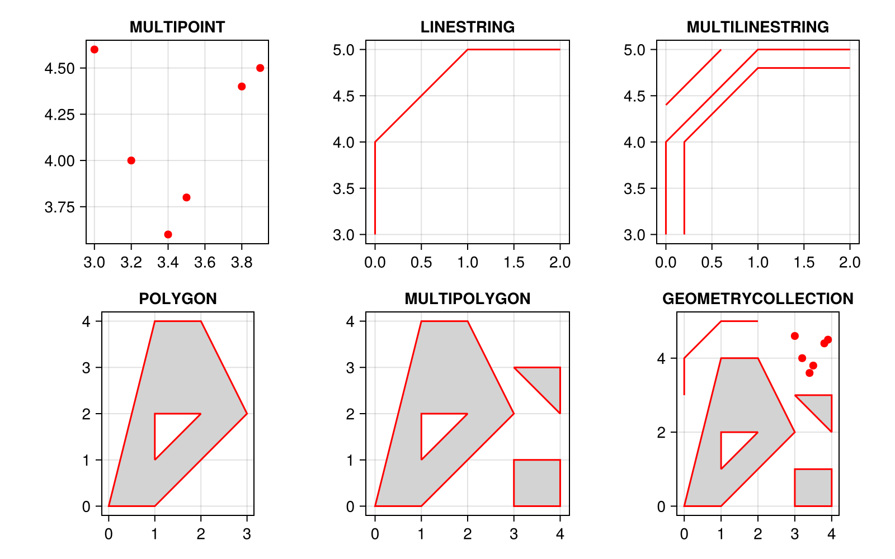
```

:::


### Resumen sintáctico: 


1. **Instanciación de multigeometrías**

En la siguiente tabla se consolida la sintaxis para la creación de estructuras geométricas complejas. Es evidente el incremento en la profundidad de la anidación de coordenadas (uso de listas `[]` y tuplas `()` en Python; listas `list()` y matrices `rbind()` en R; y arreglos indexados `[]` en Julia).

| Operación geométrica | Python (`shapely`) 🐍 | R (`sf`) 🔵 | Julia (`ArchGDAL`) 🟣 |
| :--- | :--- | :--- | :--- |
| **`MULTIPOINT`** | `MultiPoint([`<br>`(X1,Y1), (X2,Y2)])` | `st_multipoint(`<br>`rbind(c(X1,Y1),`<br>`c(X2,Y2)))` | `ArchGDAL.`<br>`createmultipoint(`<br>`[(X1,Y1), (X2,Y2)])` |
| **`LINESTRING`** | `LineString([`<br>`(X1,Y1), (X2,Y2)])` | `st_linestring(`<br>`rbind(c(X1,Y1),`<br>`c(X2,Y2)))` | `ArchGDAL.`<br>`createlinestring(`<br>`[(X1,Y1), (X2,Y2)])` |
| **`MULTILINESTRING`** | `MultiLineString(`<br>`[lin1, lin2])` | `st_multilinestring(`<br>`list(lin1, lin2))` | `ArchGDAL.`<br>`createmultilinestring(`<br>`[lin1, lin2])` |
| **`POLYGON`**<br>*(Exterior + Hueco)* | `Polygon(`<br>`shell=ext, holes=[int1])` | `st_polygon(`<br>`list(ext, int1))` | `ArchGDAL.`<br>`createpolygon(`<br>`[ext, int1])` |
| **`MULTIPOLYGON`** | `MultiPolygon([`<br>`(ext, [int]),`<br>`(ext2, [])])` | `st_multipolygon(`<br>`list(list(ext, int),`<br>`list(ext2)))` | `ArchGDAL.`<br>`createmultipolygon(`<br>`[[ext, int], [ext2]])` |
| **`GEOMETRYCOLLECTION`** | `GeometryCollection(`<br>`[mp, pol])` | `st_geometrycollection(`<br>`list(mp, pol))` | `gc = ArchGDAL.creategeom(`<br>`ArchGDAL.`<br>`wkbGeometryCollection)`<br>`ArchGDAL.`<br>`addgeom!(gc, mp)` |

: Sintaxis comparativa para la inicialización y jerarquización de topologías espaciales complejas {#tbl-resumen_creacion_multigeometrias tbl-colwidths="[18,27,27,28]"}


2. **Colecciones y visualización**

En la siguiente tabla se compara la manera de orquestar estructuras heterogéneas (`GEOMETRYCOLLECTION`) y de inicializar la interfaz gráfica del dispositivo de ploteo. Obsérvese la discrepancia fundamental en Julia para la instanciación de la colección basada intrínsecamente en el estándar C/C++ Well-Known Binary (WKB).

| Operación | Python (`geopandas` /<br>`matplotlib`) 🐍 | R (`sf` /<br>Base Graphics) 🔵 | Julia (`ArchGDAL` /<br>`CairoMakie`) 🟣 |
| :--- | :--- | :--- | :--- |
| **`GEOMETRYCOLLECTION`** | `GeometryCollection(`<br>`[p1, pol1, ls1])` | `st_geometrycollection(`<br>`list(p1, pol1, ls1))` | `gc = ArchGDAL.creategeom(`<br>`ArchGDAL.wkbGeometryCollection)`<br>`ArchGDAL.addgeom!(gc, p1)`<br>`ArchGDAL.addgeom!(gc, pol1)` |
| **Inicializar Lienzo<br>Múltiple** | `fig, axs = plt.subplots(`<br>`filas, col,`<br>`figsize=(ancho, alto))` | `par(`<br>`mfrow = c(filas, col))` | `fig = Figure(`<br>`size = (ancho, alto))` |
| **Pintar Relleno<br>Polígono** | `gpd.GeoSeries([pol])`<br>`.plot(facecolor='color')` | `plot(pol,`<br>`col = 'color')` | `CairoMakie.poly!(ax,`<br>`to_makie_poly(pol),`<br>`color=:color)` |
| **Pintar Borde<br>Polígono** | `gpd.GeoSeries([pol])`<br>`.plot(edgecolor='color')` | `plot(pol,`<br>`border = 'color')` | `CairoMakie.poly!(ax,`<br>`to_makie_poly(pol),`<br>`strokecolor=:color)` |
| **Superponer capas** | El método `.plot()`<br>sobre el mismo subgráfico<br>superpone las capas<br>automáticamente. | Argumento `add = TRUE`<br>en la llamada a la<br>función `plot()`. | Mutar (`!`) sobre el<br>mismo objeto referencial<br>`ax` de Makie. |

: Sintaxis gráfica y paramétrica transversal para la composición de colecciones WKB mixtas y despliegue interactivo cartesiano {#tbl-resumen_dibujo_y_colecciones tbl-colwidths="[20,25,25,30]"}

3. **Inspección y extracción estructural**

Dado que el manejo de geometrías mixtas y polígonos perforados requiere acceder a sus componentes internos (especialmente en Julia donde el renderizado no es automático para huecos), a continuación se exponen las rutinas de inspección espacial.

| Operación | Python (`shapely`) 🐍 | R (`sf`) 🔵 | Julia (`ArchGDAL`) 🟣 |
| :--- | :--- | :--- | :--- |
| **Consultar clase/tipo** | `type(geom)` / `geom.geom_type` | `class(geom)` | `ArchGDAL.getgeomtype(geom)` |
| **Conteo de sub-entidades** *(vértices o anillos)* | `len(geom.geoms)` | `length(geom)` | `ArchGDAL.ngeom(geom)` |
| **Extraer componente** *(índice de anillo exterior/interior)* | `geom.exterior` / `geom.interiors[i]` | `geom[[i]]` | `ArchGDAL.getgeom(geom, i)`<br>*(Índice 0 = exterior)* |
| **Extraer coordenadas absolutas** | Objeto nativo de lista/tupla | `st_coordinates(geom)` | `ArchGDAL.getx(geom, i)`<br>`ArchGDAL.gety(geom, i)` |

: Comandos para la deconstrucción e iteración de vértices en geometrías de jerarquía superior {#tbl-resumen_extraccion_nodos tbl-colwidths="[25,25,25,25]"}

4. **Configuración de lienzo y parámetros gráficos**

Desglose de los argumentos estéticos y las funciones de enrutamiento espacial utilizados para garantizar un renderizado coherente de los datos (simulando los estándares de visualización de entidades cartográficas).

| Configuración visual | Python (`geopandas`/`matplotlib`) 🐍 | R (`sf`/Base Graphics) 🔵 | Julia (`CairoMakie`) 🟣 |
| :--- | :--- | :--- | :--- |
| **Matriz de subgráficos (Grid)** | `fig, axs = plt.subplots(filas, col, figsize=(W, H))` | `par(mfrow = c(filas, col))` | `fig = Figure(size = (W, H))`<br>`ax = Axis(fig[f, c])` |
| **Control de márgenes y ejes** | `plt.tight_layout()`<br>`ax.set_xticks([])` | `par(mar = c(B, L, T, R))`<br>`axes = TRUE` | `ax.aspect = DataAspect()`<br>`hidedecorations!(ax)` |
| **Encuadre geográfico (Bounding Box)** | *Automático por GeoPandas* | Argumentos `xlim=c()`, `ylim=c()` | *Automático por CairoMakie* |
| **Color de relleno (Áreas)** | `.plot(facecolor='lightgrey')` | `plot(..., col = 'lightgrey')` | `poly!(..., color=:lightgray)` |
| **Color de trazo (Líneas y bordes)** | `.plot(color='red', edgecolor='red')` | `plot(..., border = 'red')` | `lines!(..., color=:red)`<br>`poly!(..., strokecolor=:red)` |
| **Grosor vectorial** | `linewidth=1.5` | `lwd=1.5` | `linewidth=1.5` / `strokewidth=1.5` |
| **Simbología de puntos** | `markersize=25` | `pch=16, cex=1.2` | `markersize=10` |
| **Superposición de capas (Z-index)** | Llamadas sucesivas al mismo `ax` | Llamadas sucesivas con `add = TRUE` | Mutación (`!`) sucesiva sobre el mismo `ax` |

: Equivalencia de parámetros para la composición de atlas cartográficos y estandarización cromática {#tbl-resumen_parametros_graficos tbl-colwidths="[22,26,26,26]"}

## Creación de puntos a partir de texto WKT (Well-Known Text)

El formato WKT (Well-Known Text) es un estándar de la OGC para representar geometrías en formato de texto. 

A continuación, se define un conjunto de tres lugares representativos de Colombia utilizando cadenas WKT. Se asigna un atributo de texto (`Lugar`), se ensambla la tabla espacial y se genera un mapa categorizado por dicho atributo, incluyendo su respectiva leyenda.

::: {.panel-tabset}

### Python

::: {.content-visible when-format="html"}
::: {.callout-tip collapse="true" icon="false"}
#### ▷ CÓDIGO PURO (Copiar y Pegar)
```{python}
#| label: python_crear_wkt_codigo
#| eval: false
#| fig-align: center
#| out-width: "80%"

import pandas as pd
import geopandas as gpd
import matplotlib.pyplot as plt

# 1. Definición de atributos y geometrías en formato WKT
datos_wkt = {
    "Lugar": ["Centro Geográfico", "Plaza de Bolívar", "Piedra del Peñol"],
    "WKT": [
        "POINT (-72.9553 4.0903)",
        "POINT (-74.0760 4.5981)",
        "POINT (-75.1792 6.2205)"
    ]
}

# 2. Conversión a GeoDataFrame usando from_wkt
# gpd.GeoSeries.from_wkt convierte la lista de textos en una GeoSeries formal
gdf_wkt = gpd.GeoDataFrame(
    datos_wkt, 
    geometry=gpd.GeoSeries.from_wkt(datos_wkt["WKT"]),
    crs="EPSG:4326"
)

# 3. Inspección de la arquitectura espacial
# Primitiva geométrica (primer elemento)
print(gdf_wkt.geometry[0])
print(type(gdf_wkt.geometry[0]))

# Columna espacial
print(gdf_wkt.geometry)
print(type(gdf_wkt.geometry))

# Tabla espacial completa
print(gdf_wkt)
print(type(gdf_wkt))

# 4. Visualización categorizada por el atributo 'Lugar'
fig, ax = plt.subplots(figsize=(8, 6))
gdf_wkt.plot(
    ax=ax,
    column="Lugar",     # Columna para categorizar el color
    legend=True,        # Activar la leyenda
    markersize=100, 
    cmap="Set1"
)
ax.set_title("Lugares Representativos - Colombia (WKT)")
ax.set_xlabel("Longitud")
ax.set_ylabel("Latitud")
plt.show()
```
:::
:::

```{python}
#| label: python_crear_wkt
#| fig-align: center
#| out-width: "80%"

import pandas as pd
import geopandas as gpd
import matplotlib.pyplot as plt

# 1. Definición de atributos y geometrías en formato WKT
datos_wkt = {
    "Lugar": ["Centro Geográfico", "Plaza de Bolívar", "Piedra del Peñol"],
    "WKT": [
        "POINT (-72.9553 4.0903)",
        "POINT (-74.0760 4.5981)",
        "POINT (-75.1792 6.2205)"
    ]
}

# 2. Conversión a GeoDataFrame usando from_wkt
gdf_wkt = gpd.GeoDataFrame(
    datos_wkt, 
    geometry=gpd.GeoSeries.from_wkt(datos_wkt["WKT"]),
    crs="EPSG:4326"
)

# 3. Inspección de la arquitectura espacial
print("--- Primitiva Geométrica (Registro 0) ---")
print(gdf_wkt.geometry[0])
print(type(gdf_wkt.geometry[0]), "\n")

print("--- Columna de Geometría ---")
print(gdf_wkt.geometry)
print(type(gdf_wkt.geometry), "\n")

print("--- Estructura de la Tabla ---")
print(gdf_wkt)
print(type(gdf_wkt), "\n")

# 4. Visualización categorizada por el atributo 'Lugar'
fig, ax = plt.subplots(figsize=(8, 6))
gdf_wkt.plot(
    ax=ax,
    column="Lugar",
    legend=True,
    markersize=100, 
    cmap="Set1"
)
ax.set_title("Lugares Representativos - Colombia (WKT)")
ax.set_xlabel("Longitud")
ax.set_ylabel("Latitud")
plt.show()
```

### R

::: {.content-visible when-format="html"}
::: {.callout-tip collapse="true" icon="false"}
#### ▷ CÓDIGO PURO (Copiar y Pegar)
```{r}
#| label: r_crear_wkt_codigo
#| eval: false
#| fig-align: center
#| out-width: "80%"

library(sf)

# 1. Definición de vectores de atributos y cadenas WKT
lugares <- c("Centro Geográfico", "Plaza de Bolívar", "Piedra del Peñol")
wkt_cadenas <- c(
  "POINT (-72.9553 4.0903)",
  "POINT (-74.0760 4.5981)",
  "POINT (-75.1792 6.2205)"
)

# 2. Construcción de la jerarquía espacial
# WKT a columna sfc
geom_sfc <- st_as_sfc(wkt_cadenas, crs = 4326)
# Columna sfc + atributos a tabla sf
gdf_wkt <- st_sf(Lugar = lugares, geometry = geom_sfc)

# 3. Inspección de la arquitectura espacial
# Primitiva geométrica (primer elemento de la lista sfc)
print(geom_sfc[[1]])
print(class(geom_sfc[[1]]))

# Columna espacial
print(gdf_wkt$geometry)
print(class(gdf_wkt$geometry))

# Tabla espacial completa
print(gdf_wkt)
print(class(gdf_wkt))

# 4. Visualización gráfica categorizada
plot(
  gdf_wkt["Lugar"], 
  main = "Lugares Representativos - Colombia (WKT)",
  pch = 16, 
  cex = 2,
  axes = TRUE,
  key.pos = 4 # Posiciona la leyenda a la derecha
)
```
:::
:::

```{r}
#| label: r_crear_wkt
#| fig-align: center
#| out-width: "80%"

library(sf)

# 1. Definición de vectores de atributos y cadenas WKT
lugares <- c("Centro Geográfico", "Plaza de Bolívar", "Piedra del Peñol")
wkt_cadenas <- c(
  "POINT (-72.9553 4.0903)",
  "POINT (-74.0760 4.5981)",
  "POINT (-75.1792 6.2205)"
)

# 2. Construcción de la jerarquía espacial
geom_sfc <- st_as_sfc(wkt_cadenas, crs = 4326)
gdf_wkt <- st_sf(Lugar = lugares, geometry = geom_sfc)

# 3. Inspección de la arquitectura espacial
print("--- Primitiva Geométrica ---")
print(geom_sfc[[1]])
print(class(geom_sfc[[1]]))

print("--- Columna de Geometría ---")
print(gdf_wkt$geometry)
print(class(gdf_wkt$geometry))

print("--- Estructura de la Tabla ---")
print(gdf_wkt)
print(class(gdf_wkt))

# 4. Visualización gráfica categorizada
plot(
  gdf_wkt["Lugar"], 
  main = "Lugares Representativos - Colombia (WKT)",
  pch = 16, 
  cex = 2,
  axes = TRUE,
  key.pos = 4
)
```

### Julia

::: {.content-visible when-format="html"}
::: {.callout-tip collapse="true" icon="false"}
#### ▷ CÓDIGO PURO (Copiar y Pegar)
```{julia}
#| label: julia_crear_wkt_codigo
#| eval: false
#| fig-align: center
#| out-width: "80%"

using ArchGDAL
using DataFrames
using Plots

# 1. Definición de vectores base
lugares = ["Centro Geográfico", "Plaza de Bolívar", "Piedra del Peñol"]
wkt_cadenas = [
    "POINT (-72.9553 4.0903)",
    "POINT (-74.0760 4.5981)",
    "POINT (-75.1792 6.2205)"
]

# 2. Conversión vectorial a primitivas IGeometry
# El punto (.) aplica fromWKT a cada elemento del arreglo
geometrias = ArchGDAL.fromWKT.(wkt_cadenas)

# Ensamblaje de la tabla espacial
df_wkt = DataFrame(Lugar = lugares, geometry = geometrias)

# 3. Inspección de la arquitectura espacial
println("Tipo de la primitiva (primer registro):")
println(typeof(geometrias[1]))

println("Tipo de la columna completa:")
println(typeof(df_wkt.geometry))

println("Tipo de la tabla espacial:")
println(typeof(df_wkt))

# 4. Visualización gráfica con leyenda
# Se extraen las coordenadas X y Y de las geometrías para facilitar la categorización (group)
x_coords = ArchGDAL.getx.(df_wkt.geometry, 0)
y_coords = ArchGDAL.gety.(df_wkt.geometry, 0)

scatter(
    x_coords, y_coords, 
    group = df_wkt.Lugar, 
    title = "Lugares Representativos - Colombia (WKT)",
    xlabel = "Longitud", ylabel = "Latitud",
    markersize = 8, aspect_ratio = :equal,
    legend = :outertopright
)
```
:::
:::

```{r}
#| label: julia_crear_wkt
#| results: asis
#| code-fold: true
#| fig-align: center
#| out-width: "80%"

j_eval('
using ArchGDAL
using DataFrames
using Plots

# 1. Definición de vectores base
lugares = ["Centro Geográfico", "Plaza de Bolívar", "Piedra del Peñol"]
wkt_cadenas = [
    "POINT (-72.9553 4.0903)",
    "POINT (-74.0760 4.5981)",
    "POINT (-75.1792 6.2205)"
]

# 2. Conversión vectorial a primitivas IGeometry
geometrias = ArchGDAL.fromWKT.(wkt_cadenas)

# Ensamblaje de la tabla espacial
df_wkt = DataFrame(Lugar = lugares, geometry = geometrias)

# 3. Inspección de la arquitectura espacial
println("--- Primitiva Geométrica ---")
println("Tipo: ", typeof(geometrias[1]))

println("\\n--- Columna de Geometría ---")
println("Tipo: ", typeof(df_wkt.geometry))

println("\\n--- Estructura de la Tabla ---")
println("Tipo: ", typeof(df_wkt))

# 4. Visualización gráfica y exportación
x_coords = ArchGDAL.getx.(df_wkt.geometry, 0)
y_coords = ArchGDAL.gety.(df_wkt.geometry, 0)

p = Plots.scatter(
    x_coords, y_coords, 
    group = df_wkt.Lugar, 
    title = "Lugares Representativos (WKT)",
    xlabel = "Longitud", ylabel = "Latitud",
    markersize = 8, aspect_ratio = :equal,
    legend = :outertopright
)

Plots.savefig(p, "images/c14_plot_wkt_lugares_julia.png")
')

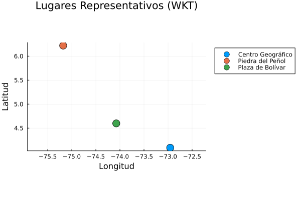
```

:::


### Resumen sintáctico: Creación de puntos desde WKT

| Operación | Python (`geopandas`) 🐍 | R (`sf`) 🔵 | Julia (`ArchGDAL` + `Plots`) 🟣 |
| :--- | :--- | :--- | :--- |
| **Conversión WKT** | `gpd.GeoSeries.from_wkt(lista_wkt)` | `st_as_sfc(vector_wkt)` | `ArchGDAL.fromWKT.(arreglo_wkt)` |
| **Integración Tabla** | `gpd.GeoDataFrame(df, geometry=geom)` | `st_sf(df, geometry = geom)` | `DataFrame(df, geometry = geom)` |
| **Plot categórico** | `gdf.plot(column="Attr", legend=True)` | `plot(gdf["Attr"])` | **Nativo:** `scatter(x, y, group=df.Attr)`<br>**StatsPlots:** `@df df scatter(x, y, group=:Attr)` |

: Sintaxis comparativa para la creación y visualización de puntos mediante texto WKT {#tbl-resumen_puntos_wkt tbl-colwidths="[20,26,26,28]"}


## Creación de otras multigeometrías a partir de texto WKT

El formato WKT no se limita exclusivamente a la definición de puntos individuales. Su versatilidad estructural permite codificar geometrías de mayor dimensionalidad y complejidad topológica, tales como líneas, polígonos, y colecciones de estas primitivas, utilizando una sintaxis anidada mediante paréntesis.

A continuación, se estructuran tres representaciones geográficas en Colombia utilizando WKT: una sede universitaria particionada (Multipunto), el trazo de un río (Línea) y los límites simplificados de una reserva natural (Polígono). Estos objetos disímiles se consolidan en una única tabla espacial para su renderizado simultáneo.

::: {.panel-tabset}

### Python

::: {.content-visible when-format="html"}
::: {.callout-tip collapse="true" icon="false"}
#### ▷ CÓDIGO PURO (Copiar y Pegar)
```{python}
#| label: python_wkt_multigeom_codigo
#| eval: false
#| fig-align: center
#| out-width: "80%"

import pandas as pd
import geopandas as gpd
import matplotlib.pyplot as plt

# 1. Definición de atributos y geometrías complejas en formato WKT
# Se modelan tres entidades representativas del territorio colombiano
datos_wkt = {
    "Entidad": ["Sedes UNAL Bogotá (MultiPoint)", "Tramo Río Magdalena (LineString)", "PNN Chingaza (Polygon)"],
    "WKT": [
        "MULTIPOINT (-74.0990 4.6386, -74.0830 4.6360)",
        "LINESTRING (-74.7700 5.2000, -74.7000 5.5000, -74.6500 5.8000)",
        "POLYGON ((-73.8000 4.7000, -73.6000 4.7000, -73.6000 4.5000, -73.8000 4.5000, -73.8000 4.7000))"
    ]
}

# 2. Conversión a GeoDataFrame usando from_wkt
# El método from_wkt interpreta la cadena de texto y construye la topología vectorial sin importar su dimensionalidad
gdf_complejo = gpd.GeoDataFrame(
    datos_wkt, 
    geometry=gpd.GeoSeries.from_wkt(datos_wkt["WKT"]),
    crs="EPSG:4326"
)

# 3. Inspección de la arquitectura espacial
print("--- Estructura de la Tabla con Multigeometrías ---")
print(gdf_complejo)

print("\n--- Tipos geométricos generados ---")
print(gdf_complejo.geom_type)

# 4. Visualización categorizada por el atributo 'Entidad'
fig, ax = plt.subplots(figsize=(8, 6))

# La función plot de GeoPandas discrimina automáticamente cómo dibujar áreas, líneas y puntos
gdf_complejo.plot(
    ax=ax,
    column="Entidad",    # Columna de categorización cromática
    legend=True,         # Despliegue automático de la leyenda
    cmap="Dark2",        # Paleta de colores para elementos categóricos
    linewidth=2,         # Grosor de visualización para líneas y bordes
    markersize=80        # Diámetro de visualización para puntos
)

# Activar la Grilla
ax.grid(True)

# Personaliar la Grilla
ax.grid(
    True,
    linestyle="--",
    linewidth=0.5,
    alpha=0.7
)

# Espaciado entre líneas de la grilla
import matplotlib.ticker as ticker

# Cada 0.5 grados
ax.xaxis.set_major_locator(ticker.MultipleLocator(0.5))  
ax.yaxis.set_major_locator(ticker.MultipleLocator(0.5))


ax.set_title("Multigeometrías en Colombia (WKT)")
ax.set_xlabel("Longitud")
ax.set_ylabel("Latitud")
plt.show()
```
:::
:::

```{python}
#| label: python_wkt_multigeom
#| fig-align: center
#| out-width: "80%"

import pandas as pd
import geopandas as gpd
import matplotlib.pyplot as plt

# 1. Definición de atributos y geometrías complejas en formato WKT
# Se modelan tres entidades representativas del territorio colombiano
datos_wkt = {
    "Entidad": ["Sedes UNAL Bogotá (MultiPoint)", "Tramo Río Magdalena (LineString)", "PNN Chingaza (Polygon)"],
    "WKT": [
        "MULTIPOINT (-74.0990 4.6386, -74.0830 4.6360)",
        "LINESTRING (-74.7700 5.2000, -74.7000 5.5000, -74.6500 5.8000)",
        "POLYGON ((-73.8000 4.7000, -73.6000 4.7000, -73.6000 4.5000, -73.8000 4.5000, -73.8000 4.7000))"
    ]
}

# 2. Conversión a GeoDataFrame usando from_wkt
# El método from_wkt interpreta la cadena de texto y construye la topología vectorial sin importar su dimensionalidad
gdf_complejo = gpd.GeoDataFrame(
    datos_wkt, 
    geometry=gpd.GeoSeries.from_wkt(datos_wkt["WKT"]),
    crs="EPSG:4326"
)

# 3. Inspección de la arquitectura espacial
print("--- Estructura de la Tabla con Multigeometrías ---")
print(gdf_complejo)

print("\n--- Tipos geométricos generados ---")
print(gdf_complejo.geom_type)

# 4. Visualización categorizada por el atributo 'Entidad'
fig, ax = plt.subplots(figsize=(8, 6))

# La función plot de GeoPandas discrimina automáticamente cómo dibujar áreas, líneas y puntos
gdf_complejo.plot(
    ax=ax,
    column="Entidad",    # Columna de categorización cromática
    legend=True,         # Despliegue automático de la leyenda
    cmap="Dark2",        # Paleta de colores para elementos categóricos
    linewidth=2,         # Grosor de visualización para líneas y bordes
    markersize=80        # Diámetro de visualización para puntos
)

# Activar la Grilla
ax.grid(True)

# Personaliar la Grilla
ax.grid(
    True,
    linestyle="--",
    linewidth=0.5,
    alpha=0.7
)

# Espaciado entre líneas de la grilla
import matplotlib.ticker as ticker

# Cada 0.5 grados
ax.xaxis.set_major_locator(ticker.MultipleLocator(0.5))  
ax.yaxis.set_major_locator(ticker.MultipleLocator(0.5))

ax.set_title("Multigeometrías en Colombia (WKT)")
ax.set_xlabel("Longitud")
ax.set_ylabel("Latitud")
plt.show()
```

### R

::: {.content-visible when-format="html"}
::: {.callout-tip collapse="true" icon="false"}
#### ▷ CÓDIGO PURO (Copiar y Pegar)
```{r}
#| label: r_wkt_multigeom_codigo
#| eval: false
#| fig-align: center
#| out-width: "80%"

library(sf)

# 1. Definición de vectores de atributos y cadenas WKT complejas
entidades <- c("Sedes UNAL Bogotá (MultiPoint)", "Tramo Río Magdalena (LineString)", "PNN Chingaza (Polygon)")
wkt_complejos <- c(
  "MULTIPOINT (-74.0990 4.6386, -74.0830 4.6360)",
  "LINESTRING (-74.7700 5.2000, -74.7000 5.5000, -74.6500 5.8000)",
  "POLYGON ((-73.8000 4.7000, -73.6000 4.7000, -73.6000 4.5000, -73.8000 4.5000, -73.8000 4.7000))"
)

# 2. Construcción de la jerarquía espacial multigeométrica
# st_as_sfc procesa de forma transparente diferentes tipos WKT en una misma columna de lista geométrica (sfc)
geom_compleja_sfc <- st_as_sfc(wkt_complejos, crs = 4326)

# Ensamblaje del objeto sf final uniendo atributos a la columna geométrica
gdf_complejo <- st_sf(Entidad = entidades, geometry = geom_compleja_sfc)

# 3. Inspección de la arquitectura espacial
print("--- Estructura de la Tabla con Multigeometrías ---")
print(gdf_complejo)

# 4. Aumentar márgenes del gráfico
# El vector es: 
# c(abajo, izquierda, arriba, derecha)
# c(bottom, left, top, right)
# Recuarda la palabra BoLsTeR (reforzar)
par(mar = c(5, 4, 6, 2)) 


# 5. Visualización gráfica categorizada
# El plot nativo mapea el factor cromático según los valores de la columna referenciada

plot(
  gdf_complejo["Entidad"], 
  main = "Multigeometrías en Colombia (WKT)",
  cex.main = 0.9,      # Tamaño de título más pequeño  
  pch = 16,            # Código de símbolo sólido para geometrías MultiPoint
  cex = 1.5,           # Escala de renderizado del símbolo
  lwd = 2,             # Grosor aplicable a trazados LineString y contornos Polygon
  axes = TRUE,         # Habilitar reglas de coordenadas cartesianas X/Y
  graticule = st_graticule(lon = seq(-75.0, -73.0, by = 0.5), lat = seq(4.0, 6.0, by = 0.5)), # Control de espaciado en X y Y
  key.pos = 4          # Instrucción paramétrica para situar la leyenda a la derecha
)
```
:::
:::

```{r}
#| label: r_wkt_multigeom
#| fig-align: center
#| out-width: "80%"

library(sf)

# 1. Definición de vectores de atributos y cadenas WKT complejas
entidades <- c("Sedes UNAL Bogotá (MultiPoint)", "Tramo Río Magdalena (LineString)", "PNN Chingaza (Polygon)")
wkt_complejos <- c(
  "MULTIPOINT (-74.0990 4.6386, -74.0830 4.6360)",
  "LINESTRING (-74.7700 5.2000, -74.7000 5.5000, -74.6500 5.8000)",
  "POLYGON ((-73.8000 4.7000, -73.6000 4.7000, -73.6000 4.5000, -73.8000 4.5000, -73.8000 4.7000))"
)

# 2. Construcción de la jerarquía espacial multigeométrica
# st_as_sfc procesa de forma transparente diferentes tipos WKT en una misma columna de lista geométrica (sfc)
geom_compleja_sfc <- st_as_sfc(wkt_complejos, crs = 4326)

# Ensamblaje del objeto sf final uniendo atributos a la columna geométrica
gdf_complejo <- st_sf(Entidad = entidades, geometry = geom_compleja_sfc)

# 3. Inspección de la arquitectura espacial
print("--- Estructura de la Tabla con Multigeometrías ---")
print(gdf_complejo)

# 4. Aumentar márgenes del gráfico
# El vector es: 
# c(abajo, izquierda, arriba, derecha)
# c(bottom, left, top, right)
# Recuarda la palabra BoLsTeR (reforzar)
par(mar = c(5, 4, 6, 2)) 

# 5. Visualización gráfica categorizada
# El plot nativo mapea el factor cromático según los valores de la columna referenciada
plot(
  gdf_complejo["Entidad"], 
  main = "Multigeometrías en Colombia (WKT)",
  cex.main = 0.9,      # Tamaño de título más pequeño
  pch = 16,            # Código de símbolo sólido para geometrías MultiPoint
  cex = 1.5,           # Escala de renderizado del símbolo
  lwd = 2,             # Grosor aplicable a trazados LineString y contornos Polygon
  axes = TRUE,         # Habilitar reglas de coordenadas cartesianas X/Y
  graticule = st_graticule(lon = seq(-75.0, -73.0, by = 0.5), lat = seq(4.0, 6.0, by = 0.5)), # Control de espaciado en X y Y
  key.pos = 4          # Instrucción paramétrica para situar la leyenda a la derecha
)
```

### Julia

::: {.content-visible when-format="html"}
::: {.callout-tip collapse="true" icon="false"}
#### ▷ CÓDIGO PURO (Copiar y Pegar)

```{julia}
#| label: julia_wkt_multigeom_codigo
#| eval: false
#| fig-align: center
#| out-width: "80%"

using ArchGDAL
using DataFrames
using Plots

# 1. Definición de vectores base con delimitaciones WKT complejas
entidades = ["Sedes UNAL Bogotá (MultiPoint)", "Tramo Río Magdalena (LineString)", "PNN Chingaza (Polygon)"]
wkt_complejos = [
    "MULTIPOINT (-74.0990 4.6386, -74.0830 4.6360)",
    "LINESTRING (-74.7700 5.2000, -74.7000 5.5000, -74.6500 5.8000)",
    "POLYGON ((-73.8000 4.7000, -73.6000 4.7000, -73.6000 4.5000, -73.8000 4.5000, -73.8000 4.7000))"
]

# 2. Conversión vectorial a primitivas IGeometry abstractas
# El motor ArchGDAL analiza la sintaxis WKT e instancia la clase específica correspondiente
geometrias = ArchGDAL.fromWKT.(wkt_complejos)

# Ensamblaje de la tabla espacial
df_complejo = DataFrame(Entidad = entidades, geometry = geometrias)

# 3. Inspección de la arquitectura espacial y tipología
println("--- Estructura de la Tabla ---")
println(df_complejo)
println("\n--- Clases geométricas detectadas ---")
for g in df_complejo.geometry
    println(typeof(g))
end

# 4. Visualización gráfica iterativa
# Se inicializa el lienzo global estipulando los parámetros base
p = plot(
    title = "Multigeometrías en Colombia (WKT)", 
    xlabel = "Longitud", ylabel = "Latitud",
    aspect_ratio = :equal, 
    legend = :outertopright,
    grid = true,                 # Activar la visualización de la grilla
    gridstyle = :dash,           # Establecer el tipo de línea (intermitente)
    gridlinewidth = 0.5,         # Fijar el grosor geométrico de la grilla
    gridalpha = 0.7,             # Ajustar el canal de opacidad (transparencia)
    xticks = -75.0:0.5:-73.0,    # Definir marcas paramétricas cada 0.5 grados en X
    yticks = 4.0:0.5:6.0         # Definir marcas paramétricas cada 0.5 grados en Y
)

# Dada la naturaleza mixta, se utiliza un bucle para graficar cada entidad
# aprovechando el soporte nativo de la receta de Plots para geometrías ArchGDAL
for i in 1:nrow(df_complejo)
    plot!(
        p, df_complejo.geometry[i], 
        label = df_complejo.Entidad[i], 
        linewidth = 2, 
        markersize = 6
    )
end

# Despliegue en el entorno interactivo
display(p)
```

:::

:::

```{r}
#| label: julia_wkt_multigeom
#| results: asis
#| code-fold: true
#| fig-align: center
#| out-width: "80%"

j_eval('
using ArchGDAL
using DataFrames
using Plots

# 1. Definición de vectores base con delimitaciones WKT complejas
entidades = ["Sedes UNAL Bogotá (MultiPoint)", "Tramo Río Magdalena (LineString)", "PNN Chingaza (Polygon)"]
wkt_complejos = [
    "MULTIPOINT (-74.0990 4.6386, -74.0830 4.6360)",
    "LINESTRING (-74.7700 5.2000, -74.7000 5.5000, -74.6500 5.8000)",
    "POLYGON ((-73.8000 4.7000, -73.6000 4.7000, -73.6000 4.5000, -73.8000 4.5000, -73.8000 4.7000))"
]

# 2. Conversión vectorial a primitivas IGeometry abstractas
geometrias = ArchGDAL.fromWKT.(wkt_complejos)

# Ensamblaje de la tabla espacial
df_complejo = DataFrame(Entidad = entidades, geometry = geometrias)

# 3. Inspección de la arquitectura espacial y tipología
println("--- Estructura de la Tabla ---")
println(df_complejo)
println("\\n--- Clases geométricas detectadas ---")
for g in df_complejo.geometry
    println(typeof(g))
end

# 4. Visualización gráfica iterativa
# Se inicializa el lienzo global estipulando los parámetros base
p = Plots.plot(
    title = "Multigeometrías en Colombia (WKT)", 
    xlabel = "Longitud", ylabel = "Latitud",
    aspect_ratio = :equal, 
    legend = :outertopright,
    grid = true,                 # Activar la visualización de la grilla
    gridstyle = :dash,           # Establecer el tipo de línea (intermitente)
    gridlinewidth = 0.5,         # Fijar el grosor geométrico de la grilla
    gridalpha = 0.7,             # Ajustar el canal de opacidad (transparencia)
    xticks = -75.0:0.5:-73.0,    # Definir marcas paramétricas cada 0.5 grados en X
    yticks = 4.0:0.5:6.0         # Definir marcas paramétricas cada 0.5 grados en Y
)

for i in 1:nrow(df_complejo)
    Plots.plot!(
        p, df_complejo.geometry[i], 
        label = df_complejo.Entidad[i], 
        linewidth = 2, 
        markersize = 6
    )
end

Plots.savefig(p, "images/c14_plot_wkt_multigeom_julia.png")
')

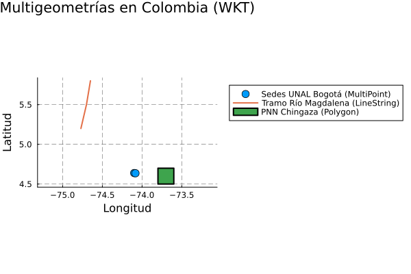
```

:::

### Resumen sintáctico

1. **Estructuración WKT compleja**:

En la siguiente tabla se detalla el esquema textual OGC necesario para la definición de clases vectoriales de dimensión superior utilizando *Well-Known Text*. El patrón de anidamiento de paréntesis refleja la jerarquía dimensional interna (ej. listas de listas).

| Tipo espacial WKT | Convención estructural de la cadena |
| :--- | :--- |
| **`MULTIPOINT`** | `"MULTIPOINT (X1 Y1, X2 Y2, ...)"` |
| **`LINESTRING`** | `"LINESTRING (X1 Y1, X2 Y2, ...)"` |
| **`MULTILINESTRING`** | `"MULTILINESTRING ((X1 Y1, ...), (Xn Yn, ...))"` |
| **`POLYGON`** | `"POLYGON ((X1 Y1, ..., X1 Y1), (Xn Yn, ..., Xn Yn))"`<br>*(Nota: El primer anillo es exterior; los consecutivos son huecos. Todos deben cerrarse).* |
| **`MULTIPOLYGON`** | `"MULTIPOLYGON (((X1 Y1, ...)), ((Xn Yn, ...)))"` |

: Estructura sintáctica y topológica WKT para modelado de entidades geográficas complejas {#tbl-resumen_sintaxis_wkt_compleja tbl-colwidths="[30,70]"}

---

2. **Configuración de grillas y espaciado de ejes**

Para el control cartográfico de precisión en la visualización de geometrías, se aplican rutinas específicas en cada lenguaje que permiten gobernar la densidad de la cuadrícula (graticule) y los intervalos de las marcas de coordenadas (ticks).

| Operación gráfica | Python (`matplotlib`) 🐍 | R (`sf`) 🔵 | Julia (`Plots`) 🟣 |
| :--- | :--- | :--- | :--- |
| **Activar y dar formato a la grilla** | `ax.grid(True,`<br>`linestyle="--",`<br>`linewidth=0.5,`<br>`alpha=0.7)` | *Atributo integrado en la función `st_graticule()`* | `plot(..., grid=true,`<br>`gridstyle=:dash,`<br>`gridlinewidth=0.5,`<br>`gridalpha=0.7)` |
| **Control de espaciado (Marcas / Ticks)** | `import matplotlib.ticker as tkr`<br>`ax.xaxis.set_major_locator(`<br>`tkr.MultipleLocator(0.5))` | `plot(...,`<br>`graticule = st_graticule(`<br>`lon = seq(-75, -73, by=0.5),`<br>`lat = seq(4, 6, by=0.5)))` | `plot(...,`<br>`xticks = -75.0:0.5:-73.0,`<br>`yticks = 4.0:0.5:6.0)` |

: Equivalencia de parámetros para el control topológico de retículas cartográficas y frecuencias de ejes {#tbl-resumen_grillas_ejes tbl-colwidths="[22,26,26,26]"}


## Dimensiones adicionales: Coordenadas Z y M

Aunque la mayoría de los análisis SIG se realizan en un plano bidimensional (**XY**), el estándar *Simple Features* permite integrar dimensiones adicionales para representar la complejidad del mundo real:

1.  **Z (Altitud/Elevación):** Representa la tercera dimensión física (altura o profundidad). Útil en modelos de terreno o hidrología.
2.  **M (Medida - *Measure*):** Es una dimensión no espacial asociada al vértice. Se usa frecuentemente en "Referenciación Lineal" para marcar valores como: el tiempo de una medición, el kilometraje de una ruta o el nivel de error de un GPS.

Esto genera cuatro combinaciones posibles: **XY**, **XYZ**, **XYM** y **XYZM**.

### Referenciación Lineal y Segmentación Dinámica

La **Referenciación Lineal (LRS)** es un método de localización que sitúa elementos geográficos basándose en su posición relativa a lo largo de un eje lineal medido, en lugar de depender exclusivamente de coordenadas cartesianas $(X, Y)$. Este paradigma es esencial en la gestión de infraestructuras (carreteras, tuberías) y redes hídricas, donde el concepto de **Segmentación Dinámica** permite asociar múltiples atributos a porciones de una vía sin necesidad de fragmentar físicamente la geometría base. 

```{r}
#| label: referenciacion_lineal
#| fig-cap: "Referenciación Lineal y Segmentación Dinámica."
#| fig-align: center
#| out-width: "80%"

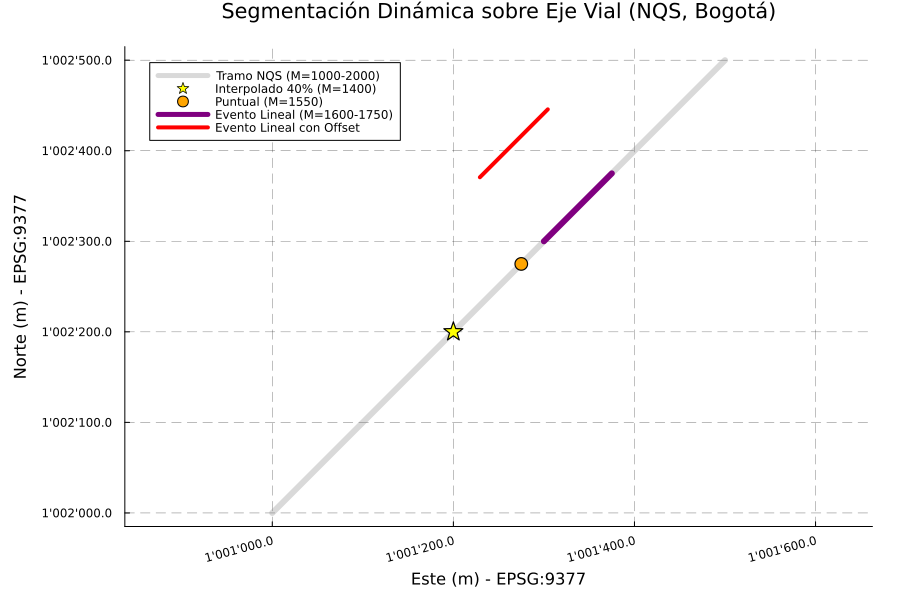
```


En este modelo, la información se almacena a través de **eventos**: los **eventos puntuales** marcan hitos en una medida específica (ej. un bache en el km 15.2), mientras que los **eventos lineales** describen tramos definidos por una medida de inicio y una de fin (ej. un cambio de pavimento entre el km 20 y el km 45). Para que este sistema funcione, la geometría debe soportar una cuarta dimensión denominada **eje $M$ (Medida)**, que almacena el kilometraje acumulado independientemente de la longitud euclidiana del dibujo.


::: {.panel-tabset}

### Python

En el ecosistema de Python, la manipulación de dimensiones adicionales presenta una dualidad técnica. Por un lado, **Shapely** (la librería estándar) es sumamente eficiente para geometrías 2D y 3D ($XYZ$), **pero carece de un eje $M$ (Medida) nativo**. Para suplir esto en análisis de Referenciación Lineal (LRS), es una práctica común "secuestrar" el eje $Z$ para almacenar valores de medida o kilometraje.

Por otro lado, cuando se requiere un soporte estricto de cuatro dimensiones ($XYZM$), debemos recurrir a **OGR (GDAL)**. OGR es un motor de bajo nivel que permite la persistencia de atributos escalares (Medida) vinculados directamente a la geometría, cumpliendo con el estándar ISO de *Simple Features*.


::: {.content-visible when-format="html"}
::: {.callout-tip collapse="true" icon="false"}
#### ▷ CÓDIGO PURO (Copiar y Pegar)

```{python}
#| label: python_dimensiones_codigo
#| eval: false

# =============================================================================
# MANEJO DE DIMENSIONES EN PYTHON: SHAPELY (3D) VS. OGR (4D)
# =============================================================================

from shapely.geometry import Point, LineString
from osgeo import ogr

# -----------------------------------------------------------------------------
# OPCIÓN A: Usando Shapely (Estándar para 2D y 3D / XYZ)
# -----------------------------------------------------------------------------

# 1. Creación de puntos con diferentes dimensiones
p_2d = Point(10, 20)                                      # Plano XY
p_3d = Point(1001200.0, 1002300.0, 2560.0)                # XYZ (Edificio 401 UNAL)

# 2. Inspección: Shapely usa el booleano 'has_z' para detectar la 3ra dimensión
print(f"Punto 2D: {p_2d} | ¿Tiene Z?: {p_2d.has_z}")
print(f"Punto 3D: {p_3d} | ¿Tiene Z?: {p_3d.has_z}")

# 3. Acceso: Si existe Z, se accede directamente como atributo
if p_3d.has_z:
    print(f"Elevación extraída: {p_3d.z} msnm")

# 4. Segmentación Dinámica (Interpolación Lineal)
# NOTA: Usamos el eje Z como "M" (Medida) ya que Shapely no tiene eje M nativo.
# Tramo NQS: Km 1.0 (1000m) a Km 2.0 (2000m)
ruta_nqs = LineString([
    (1001000, 1002000, 1000), 
    (1001500, 1002500, 2000)
])

# Ubicar un punto al 40% del recorrido (normalized=True para usar 0.0 a 1.0)
punto_interp = ruta_nqs.interpolate(0.4, normalized=True)

print(f"Posición al 40%: {punto_interp}")
print(f"Valor M (vía eje Z) interpolado: {punto_interp.z}") # Resultado: 1400.0


# -----------------------------------------------------------------------------
# OPCIÓN B: OGR para 3D (El "puente" hacia el bajo nivel)
# -----------------------------------------------------------------------------

# wkbPoint25D es la constante de OGR para representar XYZ (2.5 dimensiones)
punto_3d_ogr = ogr.Geometry(ogr.wkbPoint25D)
punto_3d_ogr.AddPoint(1001200, 1002300, 2560)
# Ver la caja de memoria:
punto_3d_ogr
# Para ver el contenido:
print(punto_3d_ogr.ExportToWkt())
# Resultado: POINT (1001200 1002300 2560)
# O para extraer las coordenadas como una tupla:
print(punto_3d_ogr.GetPoint())
# Resultado: (1001200.0, 1002300.0, 2560.0)

# -----------------------------------------------------------------------------
# OPCIÓN C: OGR para 4D (XYZM) - Carga desde WKT
# -----------------------------------------------------------------------------

# El estándar WKT ISO requiere el prefijo "ZM" para habilitar la 4ta dimensión
wkt_bogota = "POINT ZM (1001200 1002300 2560 10.5)"
punto_4d = ogr.CreateGeometryFromWkt(wkt_bogota)

print(f"\n--- Análisis XYZM (OGR) ---")
print(f"Dimensión espacial (X,Y,Z): {punto_4d.GetCoordinateDimension()}")
print(f"¿Tiene medida M registrada?: {punto_4d.IsMeasured()}")

# ExportToIsoWkt() es vital para ver 'ZM' en el texto de salida
print(f"WKT ISO (Formato Correcto): {punto_4d.ExportToIsoWkt()}")

# Extracción individual de componentes
print(f"Z (Altitud): {punto_4d.GetZ()} | M (Medida LRS): {punto_4d.GetM()}")


# -----------------------------------------------------------------------------
# OPCIÓN D: La forma infalible para 4D en Python (WKT dinámico)
# -----------------------------------------------------------------------------
from osgeo import ogr

# En lugar de pelear con AddPoint, construimos la cadena de texto (WKT)
x, y, z, m = 1001200.0, 1002300.0, 2560.0, 10.5
wkt_dinamico = f"POINT ZM ({x} {y} {z} {m})"

# El motor de OGR parsea el ZM sin quejarse de los argumentos
otro_punto_4d = ogr.CreateGeometryFromWkt(wkt_dinamico)

# Verificación
print(f"WKT ISO: {otro_punto_4d.ExportToIsoWkt()}")
print(f"Tipo OGR detectado: {otro_punto_4d.GetGeometryName()}")
print(f"Z recuperada con éxito: {otro_punto_4d.GetZ()}")
print(f"M recuperada con éxito: {otro_punto_4d.GetM()}")
```


```{python}
#| label: python_grafica_segmentacion_codigo
#| fig-cap: "Segmentación dinámica en la NQS con ejes formateados (M=1000-2000)."
#| fig-align: center
#| eval: false

import matplotlib.pyplot as plt
import matplotlib.ticker as ticker
from shapely.geometry import Point, LineString
import numpy as np

# 1. Definición de la geometría base (Tramo NQS en Bogotá)
# Coordenadas en EPSG:9377. Se incluye la medida M (en el eje Z) de 1000m a 2000m.
coords_nqs = [(1001000, 1002000, 1000), (1001500, 1002500, 2000)]
ruta_nqs = LineString(coords_nqs)

# 2. Definición de parámetros para referenciación lineal
m_inicio, m_fin = 1000, 2000
rango_m = m_fin - m_inicio

# Evento A: Interpolación al 40% del recorrido (Abscisa M=1400)
# normalized=True permite usar una escala de 0 a 1 independientemente de la longitud real
punto_interp = ruta_nqs.interpolate(0.4, normalized=True)

# Evento B: Evento puntual específico en la abscisa K1+550 (M=1550)
# Se calcula la fracción relativa: (M_deseado - M_inicial) / Rango_total
frac_puntual = (1550 - m_inicio) / rango_m
punto_evento_puntual = ruta_nqs.interpolate(frac_puntual, normalized=True)

# Evento C: Evento lineal (segmento) entre K1+600 y K1+750
f_ini = (1600 - m_inicio) / rango_m
f_fin = (1750 - m_inicio) / rango_m
segmento_evento_lineal = LineString([
    ruta_nqs.interpolate(f_ini, normalized=True), 
    ruta_nqs.interpolate(f_fin, normalized=True)
])

# Ejemplo: Desplazar el evento 100 unidades a la izquierda de la vía
#En Shapely 2.0+, se recomienda usar .offset_curve(distancia) ya que parallel_offset está siendo deprecado. Si la distancia es positiva, el offset es a la izquierda; si es negativa, a la derecha.
segmento_offset = segmento_evento_lineal.offset_curve(100)

# 3. Configuración de la visualización cartográfica
fig, ax = plt.subplots(figsize=(10, 6))

# Definición de formateador para etiquetas de coordenadas (Estilo IGAC: 1'000.000)
def format_coordenadas(x, pos):
    return "{:,.1f}".format(x).replace(",", "'")

# Aplicación del formateador a los ejes X y Y
ax.xaxis.set_major_formatter(ticker.FuncFormatter(format_coordenadas))
ax.yaxis.set_major_formatter(ticker.FuncFormatter(format_coordenadas))

# Renderizado de la ruta base (Tramo NQS)
x_b, y_b = ruta_nqs.xy
ax.plot(x_b, y_b, color='grey', linewidth=3, alpha=0.3, label='Tramo NQS (M=1000-2000)')

# Renderizado de eventos puntuales con simbología diferenciada
ax.plot(punto_interp.x, punto_interp.y, '*', color='yellow', ms=12, label='Interpolado 40% (M=1400)')
ax.plot(punto_evento_puntual.x, punto_evento_puntual.y, 'o', color='orange', ms=10, label='Puntual (M=1550)')

# Renderizado del evento lineal con realce visual (Grosor aumentado)
x_l, y_l = segmento_evento_lineal.xy
ax.plot(x_l, y_l, color='purple', linewidth=6, label='Evento Lineal con Offset (M=1600-1750)')

# Renderizado del evento lineal con offset con realce
xo_l, yo_l = segmento_offset.xy
ax.plot(xo_l, yo_l, color='red', linewidth=4, label='Evento Lineal con Offset (M=1600-1750)')


# Ajustes de anotación y cuadrícula
ax.set_title('Segmentación Dinámica sobre Eje Vial (NQS, Bogotá)', fontsize=14)
ax.set_xlabel('Este (m) - EPSG:9377', fontsize=12)
ax.set_ylabel('Norte (m) - EPSG:9377', fontsize=12)
ax.legend(loc='upper left')
ax.grid(True, linestyle='--', alpha=0.5)
ax.axis('equal') # Garantiza que la escala sea 1:1

# Rotación de etiquetas para mejorar legibilidad
plt.xticks(rotation=15)
plt.tight_layout()
plt.show()
```

:::
:::

```{python}
#| label: python_dimensiones
#| fig-align: center
#| out-width: "80%"
# =============================================================================
# MANEJO DE DIMENSIONES EN PYTHON: SHAPELY (3D) VS. OGR (4D)
# =============================================================================

from shapely.geometry import Point, LineString
from osgeo import ogr

# -----------------------------------------------------------------------------
# OPCIÓN A: Usando Shapely (Estándar para 2D y 3D / XYZ)
# -----------------------------------------------------------------------------

# 1. Creación de puntos con diferentes dimensiones
p_2d = Point(10, 20)                                      # Plano XY
p_3d = Point(1001200.0, 1002300.0, 2560.0)                # XYZ (Edificio 401 UNAL)

# 2. Inspección: Shapely usa el booleano 'has_z' para detectar la 3ra dimensión
print(f"Punto 2D: {p_2d} | ¿Tiene Z?: {p_2d.has_z}")
print(f"Punto 3D: {p_3d} | ¿Tiene Z?: {p_3d.has_z}")

# 3. Acceso: Si existe Z, se accede directamente como atributo
if p_3d.has_z:
    print(f"Elevación extraída: {p_3d.z} msnm")

# 4. Segmentación Dinámica (Interpolación Lineal)
# NOTA: Usamos el eje Z como "M" (Medida) ya que Shapely no tiene eje M nativo.
# Tramo NQS: Km 1.0 (1000m) a Km 2.0 (2000m)
ruta_nqs = LineString([
    (1001000, 1002000, 1000), 
    (1001500, 1002500, 2000)
])

# Ubicar un punto al 40% del recorrido (normalized=True para usar 0.0 a 1.0)
punto_interp = ruta_nqs.interpolate(0.4, normalized=True)

print(f"Posición al 40%: {punto_interp}")
print(f"Valor M (vía eje Z) interpolado: {punto_interp.z}") # Resultado: 1400.0


# -----------------------------------------------------------------------------
# OPCIÓN B: OGR para 3D (El "puente" hacia el bajo nivel)
# -----------------------------------------------------------------------------

# wkbPoint25D es la constante de OGR para representar XYZ (2.5 dimensiones)
punto_3d_ogr = ogr.Geometry(ogr.wkbPoint25D)
punto_3d_ogr.AddPoint(1001200, 1002300, 2560)
# Ver la caja de memoria:
punto_3d_ogr
# Para ver el contenido:
print(punto_3d_ogr.ExportToWkt())
# Resultado: POINT (1001200 1002300 2560)
# O para extraer las coordenadas como una tupla:
print(punto_3d_ogr.GetPoint())
# Resultado: (1001200.0, 1002300.0, 2560.0)


# -----------------------------------------------------------------------------
# OPCIÓN C: OGR para 4D (XYZM) - Carga desde WKT
# -----------------------------------------------------------------------------

# El estándar WKT ISO requiere el prefijo "ZM" para habilitar la 4ta dimensión
wkt_bogota = "POINT ZM (1001200 1002300 2560 10.5)"
punto_4d = ogr.CreateGeometryFromWkt(wkt_bogota)

print(f"\n--- Análisis XYZM (OGR) ---")
print(f"Dimensión espacial (X,Y,Z): {punto_4d.GetCoordinateDimension()}")
print(f"¿Tiene medida M registrada?: {punto_4d.IsMeasured()}")

# ExportToIsoWkt() es vital para ver 'ZM' en el texto de salida
print(f"WKT ISO (Formato Correcto): {punto_4d.ExportToIsoWkt()}")

# Extracción individual de componentes
print(f"Z (Altitud): {punto_4d.GetZ()} | M (Medida LRS): {punto_4d.GetM()}")


# -----------------------------------------------------------------------------
# OPCIÓN D: La forma infalible para 4D en Python (WKT dinámico)
# -----------------------------------------------------------------------------
from osgeo import ogr

# En lugar de pelear con AddPoint, construimos la cadena de texto (WKT)
x, y, z, m = 1001200.0, 1002300.0, 2560.0, 10.5
wkt_dinamico = f"POINT ZM ({x} {y} {z} {m})"

# El motor de OGR parsea el ZM sin quejarse de los argumentos
otro_punto_4d = ogr.CreateGeometryFromWkt(wkt_dinamico)

# Verificación
print(f"WKT ISO: {otro_punto_4d.ExportToIsoWkt()}")
print(f"Tipo OGR detectado: {otro_punto_4d.GetGeometryName()}")
print(f"Z recuperada con éxito: {otro_punto_4d.GetZ()}")
print(f"M recuperada con éxito: {otro_punto_4d.GetM()}")
```


* **Visualización de Eventos con Offset Lateral**

En la gestión vial, muchos eventos no ocurren sobre el eje central (p. ej., señales, andenes o fallas en berma). Para representar esto gráficamente, utilizamos el concepto de **Offset**. En Shapely, `offset_curve` genera una geometría paralela a una distancia determinada; un valor positivo desplaza la línea hacia la izquierda del sentido de digitalización, permitiendo separar visualmente los eventos del eje de referencia vial.

::: {.callout-note}
Para cumplir con los estándares cartográficos colombianos (IGAC), el siguiente código formatea los ejes utilizando la comilla (`'`) como separador de miles y un punto para decimales, garantizando legibilidad en coordenadas de gran magnitud.
:::


```{python}
#| label: python_grafica_segmentacion
#| fig-cap: "Segmentación dinámica en la NQS con ejes formateados (M=1000-2000)."
#| fig-align: center
#| out-width: "80%"

import matplotlib.pyplot as plt
import matplotlib.ticker as ticker
from shapely.geometry import Point, LineString
import numpy as np

# 1. Definición de la geometría base (Tramo NQS en Bogotá)
# Coordenadas en EPSG:9377. Se incluye la medida M (en el eje Z) de 1000m a 2000m.
coords_nqs = [(1001000, 1002000, 1000), (1001500, 1002500, 2000)]
ruta_nqs = LineString(coords_nqs)

# 2. Definición de parámetros para referenciación lineal
m_inicio, m_fin = 1000, 2000
rango_m = m_fin - m_inicio

# Evento A: Interpolación al 40% del recorrido (Abscisa M=1400)
# normalized=True permite usar una escala de 0 a 1 independientemente de la longitud real
punto_interp = ruta_nqs.interpolate(0.4, normalized=True)

# Evento B: Evento puntual específico en la abscisa K1+550 (M=1550)
# Se calcula la fracción relativa: (M_deseado - M_inicial) / Rango_total
frac_puntual = (1550 - m_inicio) / rango_m
punto_evento_puntual = ruta_nqs.interpolate(frac_puntual, normalized=True)

# Evento C: Evento lineal (segmento) entre K1+600 y K1+750
f_ini = (1600 - m_inicio) / rango_m
f_fin = (1750 - m_inicio) / rango_m
segmento_evento_lineal = LineString([
    ruta_nqs.interpolate(f_ini, normalized=True), 
    ruta_nqs.interpolate(f_fin, normalized=True)
])

# Ejemplo: Desplazar el evento 100 unidades a la izquierda de la vía
#En Shapely 2.0+, se recomienda usar .offset_curve(distancia) ya que parallel_offset está siendo deprecado. Si la distancia es positiva, el offset es a la izquierda; si es negativa, a la derecha.
segmento_offset = segmento_evento_lineal.offset_curve(100)

# 3. Configuración de la visualización cartográfica
fig, ax = plt.subplots(figsize=(10, 6))

# Definición de formateador para etiquetas de coordenadas (Estilo IGAC: 1'000.000)
def format_coordenadas(x, pos):
    return "{:,.1f}".format(x).replace(",", "'")

# Aplicación del formateador a los ejes X y Y
ax.xaxis.set_major_formatter(ticker.FuncFormatter(format_coordenadas))
ax.yaxis.set_major_formatter(ticker.FuncFormatter(format_coordenadas))

# Renderizado de la ruta base (Tramo NQS)
x_b, y_b = ruta_nqs.xy
ax.plot(x_b, y_b, color='grey', linewidth=3, alpha=0.3, label='Tramo NQS (M=1000-2000)')

# Renderizado de eventos puntuales con simbología diferenciada
ax.plot(punto_interp.x, punto_interp.y, '*', color='yellow', ms=12, label='Interpolado 40% (M=1400)')
ax.plot(punto_evento_puntual.x, punto_evento_puntual.y, 'o', color='orange', ms=10, label='Puntual (M=1550)')

# Renderizado del evento lineal con realce visual (Grosor aumentado)
x_l, y_l = segmento_evento_lineal.xy
ax.plot(x_l, y_l, color='purple', linewidth=6, label='Evento Lineal con Offset (M=1600-1750)')

# Renderizado del evento lineal con offset con realce
xo_l, yo_l = segmento_offset.xy
ax.plot(xo_l, yo_l, color='red', linewidth=4, label='Evento Lineal con Offset (M=1600-1750)')


# Ajustes de anotación y cuadrícula
ax.set_title('Segmentación Dinámica sobre Eje Vial (NQS, Bogotá)', fontsize=14)
ax.set_xlabel('Este (m) - EPSG:9377', fontsize=12)
ax.set_ylabel('Norte (m) - EPSG:9377', fontsize=12)
ax.legend(loc='upper left')
ax.grid(True, linestyle='--', alpha=0.5)
ax.axis('equal') # Garantiza que la escala sea 1:1

# Rotación de etiquetas para mejorar legibilidad
plt.xticks(rotation=15)
plt.tight_layout()
plt.show()
```

### R

En el ecosistema de R, la manipulación de dimensiones espaciales se centraliza de manera eficiente en el paquete **`sf`** (Simple Features). A diferencia de la dualidad en Python entre Shapely y OGR, `sf` integra nativamente las librerías base **GDAL** y **GEOS**. Esto significa que soporta de forma directa y unificada geometrías en 2D ($XY$), 3D ($XYZ$ o $XYM$) y 4D ($XYZM$), alineándose estrictamente con el estándar ISO de *Simple Features* sin necesidad de recurrir a estructuras de bajo nivel externas.

::: {.content-visible when-format="html"}
::: {.callout-tip collapse="true" icon="false"}
#### ▷ CÓDIGO PURO (copiar y pegar)

```{r}
#| label: r_dimensiones_codigo
#| eval: false

# =============================================================================
# MANEJO DE DIMENSIONES EN R: PAQUETE SF (GDAL/GEOS NATIVO)
# =============================================================================

library(sf)

# -----------------------------------------------------------------------------
# OPCIÓN A: Creación de geometrías 2D y 3D (sf nativo)
# -----------------------------------------------------------------------------

# 1. Creación de puntos con diferentes dimensiones
p_2d <- st_point(c(10, 20))                                        # Plano XY
p_3d <- st_point(c(1001200.0, 1002300.0, 2560.0), dim = "XYZ")     # XYZ (Edificio 401 UNAL)

# 2. Inspección: sf reconoce la clase y dimensiones automáticamente
cat(sprintf("Clase 2D: %s | Dimensiones: %s\n", class(p_2d)[1], st_geometry_type(p_2d)))

cat(sprintf("Clase 3D: %s | Dimensiones: %s\n", class(p_3d)[1], st_geometry_type(p_3d)))

# Verificación de rango Z para confirmar la tercera dimensión
sfc_3d <- st_sfc(p_3d)
cat("Rango Z del punto 3D:\n")
print(st_z_range(sfc_3d))

# 3. Acceso: Extracción de coordenadas mediante matriz
coords_3d <- st_coordinates(sfc_3d)
cat(sprintf("Elevación extraída: %f msnm\n", coords_3d[1, "Z"]))

# 4. Segmentación dinámica (Interpolación lineal)
# Tramo NQS: Km 1.0 (1000m) a Km 2.0 (2000m)
# Usar la M en el lugar de la Z
matriz_nqs <- rbind(
  c(1001000, 1002000, 1000),
  c(1001500, 1002500, 2000)
)
ruta_nqs <- st_sfc(st_linestring(matriz_nqs), dim = "XYZ")

# st_line_sample ubica un punto dada una fracción (0.0 a 1.0)
# Se opera vectorialmente para extraer la ubicación 2D y se interpola Z (usada como M)
# Nota: Devuelve MULTIPOINT así sea solo un punto. Use st_cast para convertir a POINT
punto_interp_2d <- st_line_sample(ruta_nqs, sample = 0.4)
coords_interp <- st_coordinates(punto_interp_2d)
coords_interp

# Interpolación manual del atributo M (alojado en Z)
z_interp <- 1000 + (2000 - 1000) * 0.4
punto_interp_3d <- st_point(c(coords_interp[1,"X"], coords_interp[1,"Y"], z_interp), dim = "XYZ")

cat("\nPosición al 40% (XYZ):\n")
print(punto_interp_3d)
cat(sprintf("Valor M (vía eje Z) interpolado: %f\n", z_interp)) # Resultado: 1400.0


# -----------------------------------------------------------------------------
# OPCIÓN B: Geometrías 4D (XYZM) - Integración vía WKT
# -----------------------------------------------------------------------------

# El estándar WKT ISO permite instanciar XYZM directamente, y sf lo parsea sin fricción
wkt_bogota <- "POINT ZM (1001200 1002300 2560 10.5)"
punto_4d <- st_as_sfc(wkt_bogota)

cat("\n--- Análisis XYZM (sf / GDAL) ---\n")
cat(sprintf("Tipo de geometría detectada: %s\n", st_geometry_type(punto_4d, by_geometry = FALSE)))
cat(sprintf("Clase 3D + M: %s", class(punto_4d[[1]])[1]))

# Extracción de componentes individuales
coords_4d <- st_coordinates(punto_4d)
cat(sprintf("Z (Altitud): %f | M (Medida LRS): %f\n", coords_4d[1, "Z"], coords_4d[1, "M"]))


# -----------------------------------------------------------------------------
# OPCIÓN C: WKT dinámico en R
# -----------------------------------------------------------------------------

# Construcción de la cadena de texto (WKT) programáticamente
x <- 1001200.0
y <- 1002300.0
z <- 2560.0
m <- 10.5
wkt_dinamico <- sprintf("POINT ZM (%f %f %f %f)", x, y, z, m)

otro_punto_4d <- st_as_sfc(wkt_dinamico)

# Verificación de salida WKT
cat(sprintf("\nWKT ISO: %s\n", st_as_text(otro_punto_4d)))
coords_otro <- st_coordinates(otro_punto_4d)
cat(sprintf("Z recuperada con éxito: %f\n", coords_otro[1, "Z"]))
cat(sprintf("M recuperada con éxito: %f\n", coords_otro[1, "M"]))
```

```{r}
#| label: r_grafica_segmentacion_codigo
#| fig-cap: "Segmentación dinámica en la NQS con ejes formateados (M=1000-2000)."
#| fig-align: center
#| eval: false

library(sf)
library(ggplot2)
library(scales)

# 1. Definición de la geometría base (Tramo NQS en Bogotá)
# Coordenadas en EPSG:9377.
# En la posición de la Z ponemos la M
coords_nqs <- rbind(c(1001000, 1002000, 1000), c(1001500, 1002500, 2000))
ruta_nqs <- st_sfc(st_linestring(coords_nqs, dim = "XYZ"), crs = 9377)

# 2. Definición de parámetros para referenciación lineal
m_inicio <- 1000
m_fin <- 2000
rango_m <- m_fin - m_inicio

# Evento A: Interpolación al 40% del recorrido (Abscisa M=1400)
punto_interp <- st_line_sample(ruta_nqs, sample = 0.4)
# La interpolación no se realiza también en Z
punto_interp

# Evento B: Evento puntual específico en la abscisa K1+550 (M=1550)
frac_puntual <- (1550 - m_inicio) / rango_m
punto_evento_puntual <- st_line_sample(ruta_nqs, sample = frac_puntual)

# Evento C: Evento lineal (segmento) entre K1+600 y K1+750
f_ini <- (1600 - m_inicio) / rango_m
f_fin <- (1750 - m_inicio) / rango_m

# Extracción de coordenadas base para interpolación exacta del subsegmento
c_ini <- st_coordinates(st_line_sample(ruta_nqs, sample = f_ini))
c_fin <- st_coordinates(st_line_sample(ruta_nqs, sample = f_fin))
segmento_evento_lineal <- st_sfc(st_linestring(rbind(c_ini, c_fin)), crs = 9377)

# Ejemplo: Desplazar el evento 100 unidades a la izquierda de la vía
# Aplicación de álgebra vectorial para calcular la ortogonal del segmento recto
dx <- c_fin[1, "X"] - c_ini[1, "X"]
dy <- c_fin[1, "Y"] - c_ini[1, "Y"]
norma <- sqrt(dx^2 + dy^2)

# Vector perpendicular unitario (rotación +90 grados para dirección izquierda)
ux <- -dy / norma
uy <- dx / norma

# Traslación escalar de 100 unidades sobre el vector normal
c_ini_off <- c(c_ini[1, "X"] + (100 * ux), c_ini[1, "Y"] + (100 * uy))
c_fin_off <- c(c_fin[1, "X"] + (100 * ux), c_fin[1, "Y"] + (100 * uy))

segmento_offset <- st_sfc(st_linestring(rbind(c_ini_off, c_fin_off)), crs = 9377)


# Convertir a formato tabular (data.frame espacial) para facilitar la ingesta en ggplot2
df_nqs <- st_sf(geometria = ruta_nqs, tipo = "Tramo NQS (M=1000-2000)")
df_interp <- st_sf(geometria = st_cast(punto_interp, "POINT"), tipo = "Interpolado 40% (M=1400)")
df_puntual <- st_sf(geometria = st_cast(punto_evento_puntual, "POINT"), tipo = "Puntual (M=1550)")
df_lineal <- st_sf(geometria = segmento_evento_lineal, tipo = "Evento Lineal (M=1600-1750)")
df_offset <- st_sf(geometria = segmento_offset, tipo = "Evento Lineal con Offset")

# 3. Configuración de la visualización cartográfica
ggplot() +
  # Renderizado de la ruta base (Tramo NQS)
  geom_sf(data = df_nqs, color = 'grey', linewidth = 2, alpha = 0.5) +
  # Renderizado de eventos puntuales con simbología diferenciada
  geom_sf(data = df_interp, color = 'yellow', size = 5, shape = 8) +
  geom_sf(data = df_puntual, color = 'orange', size = 4, shape = 16) +
  # Renderizado del evento lineal central y el desplazado
  geom_sf(data = df_lineal, color = 'purple', linewidth = 3) +
  geom_sf(data = df_offset, color = 'red', linewidth = 2) +
  
  # Garantiza que la escala sea 1:1 en el sistema proyectado
  coord_sf(datum = st_crs(9377)) +
  
  # Aplicación del formateador a los ejes X y Y (Estilo IGAC: 1'000.000)
  scale_x_continuous(labels = label_number(big.mark = "'", decimal.mark = ".", accuracy = 0.1)) +
  scale_y_continuous(labels = label_number(big.mark = "'", decimal.mark = ".", accuracy = 0.1)) +
  
  # Ajustes de anotación
  labs(
    title = "Segmentación Dinámica sobre Eje Vial (NQS, Bogotá)",
    x = "Este (m) - EPSG:9377",
    y = "Norte (m) - EPSG:9377"
  ) +
  
  # Ajustes de cuadrícula y tema
  theme_minimal() +
  theme(
    # Teto inclunado 15 grados, justificación Horizontal (alineado a la derecha)
    axis.text.x = element_text(angle = 15, hjust = 1), 
    # Líneas a trazos con 50% de transparencia
    panel.grid.major = element_line(linetype = "dashed", color = scales::alpha("gray", 0.5))
  )
```

:::
:::

```{r}
#| label: r_dimensiones
#| fig-align: center
#| out-width: "80%"

# =============================================================================
# MANEJO DE DIMENSIONES EN R: PAQUETE SF (GDAL/GEOS NATIVO)
# =============================================================================

library(sf)

# -----------------------------------------------------------------------------
# OPCIÓN A: Creación de geometrías 2D y 3D (sf nativo)
# -----------------------------------------------------------------------------

# 1. Creación de puntos con diferentes dimensiones
p_2d <- st_point(c(10, 20))                                        # Plano XY
p_3d <- st_point(c(1001200.0, 1002300.0, 2560.0), dim = "XYZ")     # XYZ (Edificio 401 UNAL)

# 2. Inspección: sf reconoce la clase y dimensiones automáticamente
cat(sprintf("Clase 2D: %s | Dimensiones: %s\n", class(p_2d)[1], st_geometry_type(p_2d)))

cat(sprintf("Clase 3D: %s | Dimensiones: %s\n", class(p_3d)[1], st_geometry_type(p_3d)))

# Verificación de rango Z para confirmar la tercera dimensión
sfc_3d <- st_sfc(p_3d)
cat("Rango Z del punto 3D:\n")
print(st_z_range(sfc_3d))

# 3. Acceso: Extracción de coordenadas mediante matriz
coords_3d <- st_coordinates(sfc_3d)
cat(sprintf("Elevación extraída: %f msnm\n", coords_3d[1, "Z"]))

# 4. Segmentación dinámica (Interpolación lineal)
# Tramo NQS: Km 1.0 (1000m) a Km 2.0 (2000m)
# Usar la M en el lugar de la Z
matriz_nqs <- rbind(
  c(1001000, 1002000, 1000),
  c(1001500, 1002500, 2000)
)
ruta_nqs <- st_sfc(st_linestring(matriz_nqs), dim = "XYZ")

# st_line_sample ubica un punto dada una fracción (0.0 a 1.0)
# Se opera vectorialmente para extraer la ubicación 2D y se interpola Z (usada como M)
# Nota: Devuelve MULTIPOINT así sea solo un punto. Use st_cast para convertir a POINT
punto_interp_2d <- st_line_sample(ruta_nqs, sample = 0.4)
coords_interp <- st_coordinates(punto_interp_2d)
coords_interp

# Interpolación manual del atributo M (alojado en Z)
z_interp <- 1000 + (2000 - 1000) * 0.4
punto_interp_3d <- st_point(c(coords_interp[1,"X"], coords_interp[1,"Y"], z_interp), dim = "XYZ")

cat("\nPosición al 40% (XYZ):\n")
print(punto_interp_3d)
cat(sprintf("Valor M (vía eje Z) interpolado: %f\n", z_interp)) # Resultado: 1400.0


# -----------------------------------------------------------------------------
# OPCIÓN B: Geometrías 4D (XYZM) - Integración vía WKT
# -----------------------------------------------------------------------------

# El estándar WKT ISO permite instanciar XYZM directamente, y sf lo parsea sin fricción
wkt_bogota <- "POINT ZM (1001200 1002300 2560 10.5)"
punto_4d <- st_as_sfc(wkt_bogota)

cat("\n--- Análisis XYZM (sf / GDAL) ---\n")
cat(sprintf("Tipo de geometría detectada: %s\n", st_geometry_type(punto_4d, by_geometry = FALSE)))
cat(sprintf("Clase 3D + M: %s", class(punto_4d[[1]])[1]))

# Extracción de componentes individuales
coords_4d <- st_coordinates(punto_4d)
cat(sprintf("Z (Altitud): %f | M (Medida LRS): %f\n", coords_4d[1, "Z"], coords_4d[1, "M"]))


# -----------------------------------------------------------------------------
# OPCIÓN C: WKT dinámico en R
# -----------------------------------------------------------------------------

# Construcción de la cadena de texto (WKT) programáticamente
x <- 1001200.0
y <- 1002300.0
z <- 2560.0
m <- 10.5
wkt_dinamico <- sprintf("POINT ZM (%f %f %f %f)", x, y, z, m)

otro_punto_4d <- st_as_sfc(wkt_dinamico)

# Verificación de salida WKT
cat(sprintf("\nWKT ISO: %s\n", st_as_text(otro_punto_4d)))
coords_otro <- st_coordinates(otro_punto_4d)
cat(sprintf("Z recuperada con éxito: %f\n", coords_otro[1, "Z"]))
cat(sprintf("M recuperada con éxito: %f\n", coords_otro[1, "M"]))
```

* **Visualización de eventos con offset lateral**

En la gestión vial, diversos elementos no se ubican exactamente sobre el eje principal de la vía (p. ej., señalización vertical o paraderos). Para representar esto de manera adecuada en un entorno SIG, se implementa el concepto de **Offset**. En R, no hay una función bien definida para realizar ese desplazamiento a lo largo de la línea. Se hizo manualmente a partir de las coordenadas de la línea segmentada. Por convención topológica, un valor positivo genera un desplazamiento hacia la izquierda respecto al sentido de digitalización de la línea base.

::: {.callout-note}
Para cumplir con los estándares cartográficos colombianos (IGAC), el siguiente código formatea los ejes utilizando la función `label_number` del paquete `scales`, configurando la comilla (`'`) como separador de miles y un punto para posiciones decimales, lo que previene errores de lectura en coordenadas planas.
:::

```{r}
#| label: r_grafica_segmentacion
#| fig-cap: "Segmentación dinámica en la NQS con ejes formateados (M=1000-2000)."
#| fig-align: center
#| out-width: "80%"

library(sf)
library(ggplot2)
library(scales)

# 1. Definición de la geometría base (Tramo NQS en Bogotá)
# Coordenadas en EPSG:9377.
# En la posición de la Z ponemos la M
coords_nqs <- rbind(c(1001000, 1002000, 1000), c(1001500, 1002500, 2000))
ruta_nqs <- st_sfc(st_linestring(coords_nqs, dim = "XYZ"), crs = 9377)

# 2. Definición de parámetros para referenciación lineal
m_inicio <- 1000
m_fin <- 2000
rango_m <- m_fin - m_inicio

# Evento A: Interpolación al 40% del recorrido (Abscisa M=1400)
punto_interp <- st_line_sample(ruta_nqs, sample = 0.4)
# La interpolación no se realiza también en Z
punto_interp

# Evento B: Evento puntual específico en la abscisa K1+550 (M=1550)
frac_puntual <- (1550 - m_inicio) / rango_m
punto_evento_puntual <- st_line_sample(ruta_nqs, sample = frac_puntual)

# Evento C: Evento lineal (segmento) entre K1+600 y K1+750
f_ini <- (1600 - m_inicio) / rango_m
f_fin <- (1750 - m_inicio) / rango_m

# Extracción de coordenadas base para interpolación exacta del subsegmento
c_ini <- st_coordinates(st_line_sample(ruta_nqs, sample = f_ini))
c_fin <- st_coordinates(st_line_sample(ruta_nqs, sample = f_fin))
segmento_evento_lineal <- st_sfc(st_linestring(rbind(c_ini, c_fin)), crs = 9377)

# Ejemplo: Desplazar el evento 100 unidades a la izquierda de la vía
# Aplicación de álgebra vectorial para calcular la ortogonal del segmento recto
dx <- c_fin[1, "X"] - c_ini[1, "X"]
dy <- c_fin[1, "Y"] - c_ini[1, "Y"]
norma <- sqrt(dx^2 + dy^2)

# Vector perpendicular unitario (rotación +90 grados para dirección izquierda)
ux <- -dy / norma
uy <- dx / norma

# Traslación escalar de 100 unidades sobre el vector normal
c_ini_off <- c(c_ini[1, "X"] + (100 * ux), c_ini[1, "Y"] + (100 * uy))
c_fin_off <- c(c_fin[1, "X"] + (100 * ux), c_fin[1, "Y"] + (100 * uy))

segmento_offset <- st_sfc(st_linestring(rbind(c_ini_off, c_fin_off)), crs = 9377)


# Convertir a formato tabular (data.frame espacial) para facilitar la ingesta en ggplot2
df_nqs <- st_sf(geometria = ruta_nqs, tipo = "Tramo NQS (M=1000-2000)")
df_interp <- st_sf(geometria = st_cast(punto_interp, "POINT"), tipo = "Interpolado 40% (M=1400)")
df_puntual <- st_sf(geometria = st_cast(punto_evento_puntual, "POINT"), tipo = "Puntual (M=1550)")
df_lineal <- st_sf(geometria = segmento_evento_lineal, tipo = "Evento Lineal (M=1600-1750)")
df_offset <- st_sf(geometria = segmento_offset, tipo = "Evento Lineal con Offset")

# 3. Configuración de la visualización cartográfica
ggplot() +
  # Renderizado de la ruta base (Tramo NQS)
  geom_sf(data = df_nqs, color = 'grey', linewidth = 2, alpha = 0.5) +
  # Renderizado de eventos puntuales con simbología diferenciada
  geom_sf(data = df_interp, color = 'yellow', size = 5, shape = 8) +
  geom_sf(data = df_puntual, color = 'orange', size = 4, shape = 16) +
  # Renderizado del evento lineal central y el desplazado
  geom_sf(data = df_lineal, color = 'purple', linewidth = 3) +
  geom_sf(data = df_offset, color = 'red', linewidth = 2) +
  
  # Garantiza que la escala sea 1:1 en el sistema proyectado
  coord_sf(datum = st_crs(9377)) +
  
  # Aplicación del formateador a los ejes X y Y (Estilo IGAC: 1'000.000)
  scale_x_continuous(labels = label_number(big.mark = "'", decimal.mark = ".", accuracy = 0.1)) +
  scale_y_continuous(labels = label_number(big.mark = "'", decimal.mark = ".", accuracy = 0.1)) +
  
  # Ajustes de anotación
  labs(
    title = "Segmentación Dinámica sobre Eje Vial (NQS, Bogotá)",
    x = "Este (m) - EPSG:9377",
    y = "Norte (m) - EPSG:9377"
  ) +
  
  # Ajustes de cuadrícula y tema
  theme_minimal() +
  theme(
    # Teto inclunado 15 grados, justificación Horizontal (alineado a la derecha)
    axis.text.x = element_text(angle = 15, hjust = 1), 
    # Líneas a trazos con 50% de transparencia
    panel.grid.major = element_line(linetype = "dashed", color = scales::alpha("gray", 0.5))
  )
```


### Julia

En el entorno de Julia, la manipulación de dimensiones espaciales y operaciones topológicas se fundamenta en envoltorios directos hacia las bibliotecas C/C++ subyacentes. El paquete **`ArchGDAL.jl`** centraliza el acceso al motor OGR, permitiendo la definición estricta de geometrías $XYZM$. 

Sin embargo, las librerías de geometría computacional como **`LibGEOS.jl`** descartan por defecto las cotas altimétricas ($Z$) y los atributos escalares ($M$) durante operaciones topológicas de referenciación lineal. 

Para ejecutar una segmentación dinámica estricta sin pérdida de datos en el eje $M$, es necesario implementar un algoritmo de álgebra vectorial directo sobre la matriz de vértices extraída de la geometría base, asegurando la retención de las cuatro dimensiones.


::: {.content-visible when-format="html"}
::: {.callout-tip collapse="true" icon="false"}
#### Código puro de implementación

```{julia}
#| label: julia_dimensiones_codigo
#| eval: false

# =============================================================================
# MANEJO DE DIMENSIONES EN JULIA: ARCHGDAL Y LIBGEOS
# =============================================================================

import ArchGDAL as AG
import LibGEOS as LG

# -----------------------------------------------------------------------------
# OPCIÓN A: Creación e inspección de geometrías 2D y 3D
# -----------------------------------------------------------------------------

# 1. Creación de punto tridimensional (XYZ) y bidimensional (XY)
p_xy = AG.createpoint(10.0, 20.0)
p_xyz = AG.createpoint(10.0, 20.0, 500.0)

# 2. Inspección de dimensiones
# Se utiliza getcoorddim para verificar la estructura del vector instanciado
dim_xy = AG.getcoorddim(p_xy)
println("Dimensiones de coordenadas p_xy: $dim_xy")

dim_xyz = AG.getcoorddim(p_xyz)
println("Dimensiones de coordenadas p_xyz: $dim_xyz")

# 3. Acceso a valor altimétrico (Z)
println("p_xyz - Z: ", AG.getz(p_xyz, 0))
println("p_xy - Z: ", AG.getz(p_xy, 0)) # Retorna 0.0 por defecto al no existir cota

# 4. Extracción de coordenadas mediante estándar WKT
println("p_xyz - WKT: ", AG.toWKT(p_xyz))
println("p_xy - WKT: ", AG.toWKT(p_xy))


# -----------------------------------------------------------------------------
# OPCIÓN B: Segmentación dinámica con LibGEOS (Interpolación LRS 3D)
# -----------------------------------------------------------------------------

# Definición de la línea base en tres dimensiones (XYZ)
# Nota: Para propósitos de LRS bidimensional, el eje Z suele secuestrarse para almacenar la medida (M)
wkt_coords_nqs = "LINESTRING Z (1001000 1002000 1000, 1001250 1002200 2000)"
ruta_nqs = LG.readgeom(wkt_coords_nqs)

# Interpolación fraccional
# El motor GEOS calcula la longitud sobre el plano XY y ejecuta una interpolación lineal para el eje Z
punto_interp_norm = LG.interpolateNormalized(ruta_nqs, 0.4)

# Interpolación por distancia absoluta
# Se utiliza flotante estricto (1250.0) para mantener la estabilidad del tipado paramétrico en Julia
punto_distancia = LG.interpolate(ruta_nqs, 1250.0)

println("\n--- Interpolación dinámica 3D (LibGEOS) ---")
println("Punto 3D interpolado al 40%: ", LG.writegeom(punto_interp_norm))
println("Punto 3D a 1250m exactos: ", LG.writegeom(punto_distancia))


# -----------------------------------------------------------------------------
# OPCIÓN C: Segmentación dinámica (Interpolación Manual 3D)
# -----------------------------------------------------------------------------

# Segmentación dinámica calculada vía álgebra vectorial sin dependencias topológicas
# Tramo NQS: Km 1.0 (1000m) a Km 2.0 (2000m)
x1, y1, z1 = 1001000.0, 1002000.0, 1000.0
x2, y2, z2 = 1001500.0, 1002500.0, 2000.0

frac = 0.4
x_int = x1 + (x2 - x1) * frac
y_int = y1 + (y2 - y1) * frac
z_int = z1 + (z2 - z1) * frac # Uso del eje Z para almacenar la medida M transitoria

punto_interp_3d = AG.createpoint(x_int, y_int, z_int)

println("\n--- Interpolación Manual 3D ---")
println("Posición al 40% (XYZ): ", AG.toWKT(punto_interp_3d))
println("Valor M (vía eje Z) interpolado: ", z_int)


# -----------------------------------------------------------------------------
# OPCIÓN D: Geometrías 4D (XYZM) - Integración vía WKT
# -----------------------------------------------------------------------------

# El estándar OGR soporta 4 dimensiones nativas sin requerir extensiones adicionales
# Las variables comentadas ilustran la interpolación dinámica de cadenas WKT
# x, y, z, m = 1001200.0, 1002300.0, 2560.0, 10.5
# punto_4d_str = "POINT ZM ($x $y $z $m)"

wkt_bogota = "POINT ZM (1001200 1002300 2560 10.5)"
punto_4d = AG.fromWKT(wkt_bogota)

println("\n--- Análisis XYZM (ArchGDAL) ---")
println("¿Tiene coordenada Z registrada?: ", AG.is3d(punto_4d))
println("¿Tiene medida M registrada?: ", AG.ismeasured(punto_4d))
println("Z (Altitud): ", AG.getz(punto_4d, 0), " | M (Medida LRS): ", AG.getm(punto_4d, 0))
println("WKT ISO (Formato Correcto): ", AG.toWKT(punto_4d))


# -----------------------------------------------------------------------------
# OPCIÓN E: Segmentación dinámica estricta en 4D (LRS Algorítmico)
# -----------------------------------------------------------------------------

# Definición de la línea base compleja en cuatro dimensiones
# Formato WKT: X Y Z (msnm) M (Abscisado/Km)
wkt_ruta_4d = "LINESTRING ZM (1001000 1002000 2600 1000.0, 1001500 1002500 2550 2000.0)"
ruta_nqs_4d = AG.fromWKT(wkt_ruta_4d)

# Función algorítmica para interpolación cuatridimensional
# Esta arquitectura mantiene la integridad del eje M que se descarta en operaciones topológicas estándar
function interpole_xyzm(linea::AG.IGeometry, fraccion::Float64)
    n_vertices = AG.ngeom(linea)
    
    # Extracción de matriz de vértices [X, Y, Z, M]
    coords = [
        (AG.getx(linea, i-1), AG.gety(linea, i-1), AG.getz(linea, i-1), AG.getm(linea, i-1)) 
        for i in 1:n_vertices
    ]
    
    # Cálculo de distancias acumuladas en el plano euclidiano 2D
    distancias = zeros(n_vertices)
    for i in 2:n_vertices
        dx = coords[i][1] - coords[i-1][1]
        dy = coords[i][2] - coords[i-1][2]
        distancias[i] = distancias[i-1] + sqrt(dx^2 + dy^2)
    end
    
    longitud_total = distancias[end]
    dist_objetivo = longitud_total * fraccion
    
    # Búsqueda del segmento topológico correspondiente
    idx = findfirst(d -> d >= dist_objetivo, distancias)
    if idx == 1
        return AG.fromWKT("POINT ZM ($(coords[1][1]) $(coords[1][2]) $(coords[1][3]) $(coords[1][4]))")
    end
    
    # Parámetros del segmento interceptado
    d_ini = distancias[idx-1]
    d_fin = distancias[idx]
    f_local = (dist_objetivo - d_ini) / (d_fin - d_ini)
    
    # Interpolación vectorial para las cuatro dimensiones
    p_ini = coords[idx-1]
    p_fin = coords[idx]
    
    x_int = p_ini[1] + (p_fin[1] - p_ini[1]) * f_local
    y_int = p_ini[2] + (p_fin[2] - p_ini[2]) * f_local
    z_int = p_ini[3] + (p_fin[3] - p_ini[3]) * f_local
    m_int = p_ini[4] + (p_fin[4] - p_ini[4]) * f_local
    
    # Ensamblaje forzando la firma ZM para persistencia OGR
    return AG.fromWKT("POINT ZM ($x_int $y_int $z_int $m_int)")
end

# Ejecución de la muestra equivalente a st_line_sample reteniendo Z y M
punto_interp_4d = interpole_xyzm(ruta_nqs_4d, 0.4)

println("\n--- Interpolación dinámica 4D (40% del recorrido) ---")
println("Geometría instanciada: ", AG.toWKT(punto_interp_4d))
println("Medida interpolada (M): ", AG.getm(punto_interp_4d, 0))
# Resultado esperado para M: 1400.0
```


```{julia}
#| label: julia_grafica_segmentacion_codigo
#| fig-cap: "Segmentación dinámica en la NQS con ejes formateados (M=1000-2000)."
#| fig-align: center
#| eval: false
using Plots
using Printf

# =============================================================================
# 1. PARAMETRIZACIÓN DE LA GEOMETRÍA BASE
# =============================================================================
# Definición del tramo vial principal (Ej. NQS en Bogotá).
# Sistema de referencia proyectado (EPSG:9377) para garantizar unidades métricas precisas.
x1, y1, m_inicio = 1001000.0, 1002000.0, 1000.0
x2, y2, m_fin = 1001500.0, 1002500.0, 2000.0
rango_m = m_fin - m_inicio

# =============================================================================
# 2. REFERENCIACIÓN LINEAL ESPACIAL (LRS) Y EVENTOS
# =============================================================================

# Evento A: Interpolación analítica por fracción (40% del recorrido / Abscisa M=1400)
f_interp = 0.4
px_interp = x1 + (x2 - x1) * f_interp
py_interp = y1 + (y2 - y1) * f_interp

# Evento B: Evento puntual definido por abscisa absoluta (K1+550 o M=1550)
# Se calcula la fracción paramétrica respecto al rango total disponible
f_puntual = (1550.0 - m_inicio) / rango_m
px_puntual = x1 + (x2 - x1) * f_puntual
py_puntual = y1 + (y2 - y1) * f_puntual

# Evento C: Evento lineal (Subsegmento entre K1+600 y K1+750)
f_ini = (1600.0 - m_inicio) / rango_m
f_fin = (1750.0 - m_inicio) / rango_m

lx_ini = x1 + (x2 - x1) * f_ini
ly_ini = y1 + (y2 - y1) * f_ini
lx_fin = x1 + (x2 - x1) * f_fin
ly_fin = y1 + (y2 - y1) * f_fin

# =============================================================================
# 3. TRANSFORMACIÓN ESPACIAL: OFFSET LATERAL VECTORIAL
# =============================================================================
# Cálculo de la curva paralela (Offset) sin depender de librerías topológicas.
# Se requiere desplazar el segmento lineal 100 metros a la izquierda del sentido de la vía.

# 3.1. Extracción del vector director del segmento
dx = lx_fin - lx_ini
dy = ly_fin - ly_ini
norma = sqrt(dx^2 + dy^2)

# 3.2. Cálculo del vector normal unitario (Rotación ortogonal de +90 grados)
# Aplicación directa de matriz de rotación 2D sobre el vector (dx, dy): [-dy, dx]
ux = -dy / norma
uy = dx / norma
dist_offset = 100.0

# 3.3. Traslación espacial de los vértices mediante escalado del vector normal
ox_ini = lx_ini + (dist_offset * ux)
oy_ini = ly_ini + (dist_offset * uy)
ox_fin = lx_fin + (dist_offset * ux)
oy_fin = ly_fin + (dist_offset * uy)

# =============================================================================
# 4. RENDERIZADO CARTOGRÁFICO Y PARAMETRIZACIÓN DE ESTILOS
# =============================================================================

# Formateador numérico personalizado para cumplir con estándares cartográficos (IGAC)
# Inyecta el separador de miles definido por defecto y lo sustituye por la comilla superior
# Formateador numérico personalizado para cumplir con estándares cartográficos (IGAC)
function fmt_igac(val)
    # 1. Formateo base a un decimal estricto
    str_val = @sprintf("%.1f", val)
    # 2. Inyección de comilla superior como separador de miles mediante regex
    # Evalúa grupos de 3 dígitos anclados antes del punto decimal
    return replace(str_val, r"(?<=\d)(?=(\d{3})+\.)" => "'")
end

# 4.1. Inicialización del lienzo y ploteo de la vía principal
plt = plot(
    [x1, x2], [y1, y2], 
    label="Tramo NQS (M=1000-2000)", 
    color=:gray, linewidth=6, alpha=0.3, 
    aspect_ratio=:equal, # Mantiene correspondencia 1:1 entre coordenadas planas
    size=(900, 600)
)

# 4.2. Inserción de eventos puntuales
scatter!(plt, [px_interp], [py_interp], label="Interpolado 40% (M=1400)", color=:yellow, markersize=10, markerstrokewidth=1, shape=:star5)
scatter!(plt, [px_puntual], [py_puntual], label="Puntual (M=1550)", color=:orange, markersize=7)

# 4.3. Inserción de eventos lineales (Eje principal y Desplazamiento)
plot!(plt, [lx_ini, lx_fin], [ly_ini, ly_fin], label="Evento Lineal (M=1600-1750)", color=:purple, linewidth=6)
plot!(plt, [ox_ini, ox_fin], [oy_ini, oy_fin], label="Evento Lineal con Offset", color=:red, linewidth=4)

# 4.4. Configuración de elementos periféricos de diseño cartográfico
plot!(plt, 
    title="Segmentación Dinámica sobre Eje Vial (NQS, Bogotá)",
    xlabel="Este (m) - EPSG:9377", 
    ylabel="Norte (m) - EPSG:9377",
    xformatter=x->fmt_igac(x),
    yformatter=y->fmt_igac(y),
    xrotation=15,
    grid=true, gridstyle=:dash, gridalpha=0.5,
    legend=:topleft,
    margin = 5 * Plots.mm # Evita error de parseo en versiones estrictas de Julia
)

display(plt)
```

:::
:::

```{r}
#| label: julia_dimensiones
#| fig-align: center
#| out-width: "80%"
#| results: asis
#| code-fold: true
j_eval('
# =============================================================================
# MANEJO DE DIMENSIONES EN JULIA: ARCHGDAL Y LIBGEOS
# =============================================================================

import ArchGDAL as AG
import LibGEOS as LG

# -----------------------------------------------------------------------------
# OPCIÓN A: Creación e inspección de geometrías 2D y 3D
# -----------------------------------------------------------------------------

# 1. Creación de punto tridimensional (XYZ) y bidimensional (XY)
p_xy = AG.createpoint(10.0, 20.0)
p_xyz = AG.createpoint(10.0, 20.0, 500.0)

# 2. Inspección de dimensiones
# Se utiliza getcoorddim para verificar la estructura del vector instanciado
dim_xy = AG.getcoorddim(p_xy)
println("Dimensiones de coordenadas p_xy: $dim_xy")

dim_xyz = AG.getcoorddim(p_xyz)
println("Dimensiones de coordenadas p_xyz: $dim_xyz")

# 3. Acceso a valor altimétrico (Z)
println("p_xyz - Z: ", AG.getz(p_xyz, 0))
println("p_xy - Z: ", AG.getz(p_xy, 0)) # Retorna 0.0 por defecto al no existir cota

# 4. Extracción de coordenadas mediante estándar WKT
println("p_xyz - WKT: ", AG.toWKT(p_xyz))
println("p_xy - WKT: ", AG.toWKT(p_xy))


# -----------------------------------------------------------------------------
# OPCIÓN B: Segmentación dinámica con LibGEOS (Interpolación LRS 3D)
# -----------------------------------------------------------------------------

# Definición de la línea base en tres dimensiones (XYZ)
# Nota: Para propósitos de LRS bidimensional, el eje Z suele secuestrarse para almacenar la medida (M)
wkt_coords_nqs = "LINESTRING Z (1001000 1002000 1000, 1001250 1002200 2000)"
ruta_nqs = LG.readgeom(wkt_coords_nqs)

# Interpolación fraccional
# El motor GEOS calcula la longitud sobre el plano XY y ejecuta una interpolación lineal para el eje Z
punto_interp_norm = LG.interpolateNormalized(ruta_nqs, 0.4)

# Interpolación por distancia absoluta
# Se utiliza flotante estricto (1250.0) para mantener la estabilidad del tipado paramétrico en Julia
punto_distancia = LG.interpolate(ruta_nqs, 1250.0)

println("\n--- Interpolación dinámica 3D (LibGEOS) ---")
println("Punto 3D interpolado al 40%: ", LG.writegeom(punto_interp_norm))
println("Punto 3D a 1250m exactos: ", LG.writegeom(punto_distancia))


# -----------------------------------------------------------------------------
# OPCIÓN C: Segmentación dinámica (Interpolación Manual 3D)
# -----------------------------------------------------------------------------

# Segmentación dinámica calculada vía álgebra vectorial sin dependencias topológicas
# Tramo NQS: Km 1.0 (1000m) a Km 2.0 (2000m)
x1, y1, z1 = 1001000.0, 1002000.0, 1000.0
x2, y2, z2 = 1001500.0, 1002500.0, 2000.0

frac = 0.4
x_int = x1 + (x2 - x1) * frac
y_int = y1 + (y2 - y1) * frac
z_int = z1 + (z2 - z1) * frac # Uso del eje Z para almacenar la medida M transitoria

punto_interp_3d = AG.createpoint(x_int, y_int, z_int)

println("\n--- Interpolación Manual 3D ---")
println("Posición al 40% (XYZ): ", AG.toWKT(punto_interp_3d))
println("Valor M (vía eje Z) interpolado: ", z_int)


# -----------------------------------------------------------------------------
# OPCIÓN D: Geometrías 4D (XYZM) - Integración vía WKT
# -----------------------------------------------------------------------------

# El estándar OGR soporta 4 dimensiones nativas sin requerir extensiones adicionales
# Las variables comentadas ilustran la interpolación dinámica de cadenas WKT
# x, y, z, m = 1001200.0, 1002300.0, 2560.0, 10.5
# punto_4d_str = "POINT ZM ($x $y $z $m)"

wkt_bogota = "POINT ZM (1001200 1002300 2560 10.5)"
punto_4d = AG.fromWKT(wkt_bogota)

println("\n--- Análisis XYZM (ArchGDAL) ---")
println("¿Tiene coordenada Z registrada?: ", AG.is3d(punto_4d))
println("¿Tiene medida M registrada?: ", AG.ismeasured(punto_4d))
println("Z (Altitud): ", AG.getz(punto_4d, 0), " | M (Medida LRS): ", AG.getm(punto_4d, 0))
println("WKT ISO (Formato Correcto): ", AG.toWKT(punto_4d))


# -----------------------------------------------------------------------------
# OPCIÓN E: Segmentación dinámica estricta en 4D (LRS Algorítmico)
# -----------------------------------------------------------------------------

# Definición de la línea base compleja en cuatro dimensiones
# Formato WKT: X Y Z (msnm) M (Abscisado/Km)
wkt_ruta_4d = "LINESTRING ZM (1001000 1002000 2600 1000.0, 1001500 1002500 2550 2000.0)"
ruta_nqs_4d = AG.fromWKT(wkt_ruta_4d)

# Función algorítmica para interpolación cuatridimensional
# Esta arquitectura mantiene la integridad del eje M que se descarta en operaciones topológicas estándar
function interpole_xyzm(linea::AG.IGeometry, fraccion::Float64)
    n_vertices = AG.ngeom(linea)
    
    # Extracción de matriz de vértices [X, Y, Z, M]
    coords = [
        (AG.getx(linea, i-1), AG.gety(linea, i-1), AG.getz(linea, i-1), AG.getm(linea, i-1)) 
        for i in 1:n_vertices
    ]
    
    # Cálculo de distancias acumuladas en el plano euclidiano 2D
    distancias = zeros(n_vertices)
    for i in 2:n_vertices
        dx = coords[i][1] - coords[i-1][1]
        dy = coords[i][2] - coords[i-1][2]
        distancias[i] = distancias[i-1] + sqrt(dx^2 + dy^2)
    end
    
    longitud_total = distancias[end]
    dist_objetivo = longitud_total * fraccion
    
    # Búsqueda del segmento topológico correspondiente
    idx = findfirst(d -> d >= dist_objetivo, distancias)
    if idx == 1
        return AG.fromWKT("POINT ZM ($(coords[1][1]) $(coords[1][2]) $(coords[1][3]) $(coords[1][4]))")
    end
    
    # Parámetros del segmento interceptado
    d_ini = distancias[idx-1]
    d_fin = distancias[idx]
    f_local = (dist_objetivo - d_ini) / (d_fin - d_ini)
    
    # Interpolación vectorial para las cuatro dimensiones
    p_ini = coords[idx-1]
    p_fin = coords[idx]
    
    x_int = p_ini[1] + (p_fin[1] - p_ini[1]) * f_local
    y_int = p_ini[2] + (p_fin[2] - p_ini[2]) * f_local
    z_int = p_ini[3] + (p_fin[3] - p_ini[3]) * f_local
    m_int = p_ini[4] + (p_fin[4] - p_ini[4]) * f_local
    
    # Ensamblaje forzando la firma ZM para persistencia OGR
    return AG.fromWKT("POINT ZM ($x_int $y_int $z_int $m_int)")
end

# Ejecución de la muestra equivalente a st_line_sample reteniendo Z y M
punto_interp_4d = interpole_xyzm(ruta_nqs_4d, 0.4)

println("\n--- Interpolación dinámica 4D (40% del recorrido) ---")
println("Geometría instanciada: ", AG.toWKT(punto_interp_4d))
println("Medida interpolada (M): ", AG.getm(punto_interp_4d, 0))
# Resultado esperado para M: 1400.0
')

```


* **Desplazamiento vectorial explícito**

La implementación en Julia aborda el problema calculando la ortogonal al segmento de forma vectorial, garantizando la consistencia geométrica sin importar la versión de las dependencias externas.

::: {.callout-note}
La macro `@sprintf` de la biblioteca estándar, combinada con el reemplazo de caracteres, permite emular la convención cartográfica del IGAC directamente dentro de las funciones de formato de los ejes del paquete `Plots`.
:::

```{r}
#| label: julia_grafica_segmentacion
#| fig-cap: "Segmentación dinámica en la NQS con ejes formateados (M=1000-2000)."
#| fig-align: center
#| out-width: "80%"
#| results: asis
#| code-fold: true

j_eval(r"---(
using Printf

# 1. PARAMETRIZACIÓN DE LA GEOMETRÍA BASE

# Definición del tramo vial principal (Ej. NQS en Bogotá).
# Sistema de referencia proyectado (EPSG:9377) para garantizar unidades métricas precisas.
x1, y1, m_inicio = 1001000.0, 1002000.0, 1000.0
x2, y2, m_fin = 1001500.0, 1002500.0, 2000.0
rango_m = m_fin - m_inicio


# 2. REFERENCIACIÓN LINEAL ESPACIAL (LRS) Y EVENTOS


# Evento A: Interpolación analítica por fracción (40 perc del recorrido / Abscisa M=1400)
f_interp = 0.4
px_interp = x1 + (x2 - x1) * f_interp
py_interp = y1 + (y2 - y1) * f_interp

# Evento B: Evento puntual definido por abscisa absoluta (K1+550 o M=1550)
# Se calcula la fracción paramétrica respecto al rango total disponible
f_puntual = (1550.0 - m_inicio) / rango_m
px_puntual = x1 + (x2 - x1) * f_puntual
py_puntual = y1 + (y2 - y1) * f_puntual

# Evento C: Evento lineal (Subsegmento entre K1+600 y K1+750)
f_ini = (1600.0 - m_inicio) / rango_m
f_fin = (1750.0 - m_inicio) / rango_m

lx_ini = x1 + (x2 - x1) * f_ini
ly_ini = y1 + (y2 - y1) * f_ini
lx_fin = x1 + (x2 - x1) * f_fin
ly_fin = y1 + (y2 - y1) * f_fin


# 3. TRANSFORMACIÓN ESPACIAL: OFFSET LATERAL VECTORIAL

# Cálculo de la curva paralela (Offset) sin depender de librerías topológicas.
# Se requiere desplazar el segmento lineal 100 metros a la izquierda del sentido de la vía.

# 3.1. Extracción del vector director del segmento
dx = lx_fin - lx_ini
dy = ly_fin - ly_ini
norma = sqrt(dx^2 + dy^2)

# 3.2. Cálculo del vector normal unitario (Rotación ortogonal de +90 grados)
# Aplicación directa de matriz de rotación 2D sobre el vector (dx, dy): [-dy, dx]
ux = -dy / norma
uy = dx / norma
dist_offset = 100.0

# 3.3. Traslación espacial de los vértices mediante escalado del vector normal
ox_ini = lx_ini + (dist_offset * ux)
oy_ini = ly_ini + (dist_offset * uy)
ox_fin = lx_fin + (dist_offset * ux)
oy_fin = ly_fin + (dist_offset * uy)

)---")
```


```{r}
#| label: julia_grafica_segmentacion2
#| fig-cap: "Segmentación dinámica en la NQS con ejes formateados (M=1000-2000)."
#| fig-align: center
#| out-width: "80%"
#| results: asis
#| code-fold: true
j_eval(r"---(
using Plots
using Printf

# 4. RENDERIZADO CARTOGRÁFICO Y PARAMETRIZACIÓN DE ESTILOS


# Formateador numérico personalizado para cumplir con estándares cartográficos (IGAC)
# Inyecta el separador de miles definido por defecto y lo sustituye por la comilla superior
# Formateador numérico personalizado para cumplir con estándares cartográficos (IGAC)
function fmt_igac(val)
    # 1. Formateo base a un decimal estricto
    str_val = @sprintf("%.1f", val)
    # 2. Inyección de comilla superior como separador de miles mediante regex
    # Evalúa grupos de 3 dígitos anclados antes del punto decimal
    # Dentro de j_eval usamos \\d en lugar de usar solo un slash
    # Y tammbién escamamos la comilla simple
    return replace(str_val, r"(?<=\d)(?=(\d{3})+\.)" => "a")
end

# 4.1. Inicialización del lienzo y ploteo de la vía principal
plt = Plots.plot(
    [x1, x2], [y1, y2], 
    label="Tramo NQS (M=1000-2000)", 
    color=:gray, linewidth=6, alpha=0.3, 
    aspect_ratio=:equal, # Mantiene correspondencia 1:1 entre coordenadas planas
    size=(900, 600)
)

# 4.2. Inserción de eventos puntuales
Plots.scatter!(plt, [px_interp], [py_interp], label="Interpolado 40% (M=1400)", color=:yellow, markersize=10, markerstrokewidth=1, shape=:star5)
scatter!(plt, [px_puntual], [py_puntual], label="Puntual (M=1550)", color=:orange, markersize=7)

# 4.3. Inserción de eventos lineales (Eje principal y Desplazamiento)
Plots.plot!(plt, [lx_ini, lx_fin], [ly_ini, ly_fin], label="Evento Lineal (M=1600-1750)", color=:purple, linewidth=6)
Plots.plot!(plt, [ox_ini, ox_fin], [oy_ini, oy_fin], label="Evento Lineal con Offset", color=:red, linewidth=4)

# 4.4. Configuración de elementos periféricos de diseño cartográfico
Plots.plot!(plt, 
    title="Segmentación Dinámica sobre Eje Vial (NQS, Bogotá)",
    xlabel="Este (m) - EPSG:9377", 
    ylabel="Norte (m) - EPSG:9377",
    xformatter=x->fmt_igac(x),
    yformatter=y->fmt_igac(y),
    xrotation=15,
    grid=true, gridstyle=:dash, gridalpha=0.5,
    legend=:topleft,
    margin = 5 * Plots.mm # Evita error de parseo en versiones estrictas de Julia
)

Plots.savefig(plt, "images/c14_plot_segmentacion_dinamica_julia.png")
)---")

# 6. Mostrar resultado

```


:::

### Resumen sintáctico

1. **Manejo de estructuras y dimensiones (Z y M)**

La persistencia de geometrías complejas varía significativamente. Mientras R integra la cuarta dimensión de forma nativa mediante su ecosistema unificado, Python y Julia requieren utilizar directamente envolturas de bajo nivel (GDAL/OGR) para evitar la pérdida de atributos escalares.

| Operación técnica | Python (`shapely` / `osgeo.ogr`) 🐍 | R (`sf`) 🔵 | Julia (`ArchGDAL` / `LibGEOS`) 🟣 |
| :--- | :--- | :--- | :--- |
| **Instanciación 3D (XYZ)** | `Point(x, y, z)` | `st_point(`<br>`c(x, y, z))` | `AG.createpoint(`<br>`x, y, z)` |
| **Punto con ZM** | *Soporte limitado* | `st_point(c(x,y,z,m), dim="XYZM")` | *Vía WKB avanzado* |
| **Instanciación 4D (XYZM)** | `ogr.CreateGeometryFromWkt(`<br>`"POINT ZM (X Y Z M)")` | `st_as_sfc(`<br>`"POINT ZM (X Y Z M)")` | `AG.fromWKT(`<br>`"POINT ZM (X Y Z M)")` |
| **Verificación altimétrica** | `geom.has_z` | `st_geometry_type(geom)` | `AG.is3d(geom)` |
| **Chequear Z - VERIFICAR** |  | `st_zm(geom, what="Z")` | `getcoorddim(geom)` |
| **Verificación de medida** | `geom_ogr.IsMeasured()` | `st_geometry_type(geom)` | `AG.ismeasured(geom)` |
| **Extracción de cota (Z)** | `geom.z` | `st_coordinates(geom)[, "Z"]` | `AG.getz(geom, 0)` |
| **Extracción de medida (M)** | `geom_ogr.GetM()` | `st_coordinates(geom)[, "M"]` | `AG.getm(geom, 0)` |


: Comparativa de funciones para instanciación y auditoría de dimensiones espaciales adicionales {#tbl-dimensiones_arquitectura tbl-colwidths="[25,25,25,25]"}

2. **Referenciación lineal espacial (LRS) y topología**

El cálculo de eventos sobre líneas requiere algoritmos de interpolación. Los motores difieren en la sintaxis para el manejo de distancias absolutas frente a distancias relativas (normalizadas).

| Operación técnica | Python (`shapely`) 🐍| R (`sf`) 🔵 | Julia (`LibGEOS` / Vectores) 🟣 |
| :--- | :--- | :--- | :--- |
| **Interpolación normalizada (Fracción)** | `geom.interpolate(`<br>`0.4, normalized=True)` | `st_line_sample(`<br>`geom, sample = 0.4)` | `LG.interpolateNormalized(`<br>`geom, 0.4)` |
| **Interpolación absoluta (Distancia)** | `geom.interpolate(250.0)` | `st_line_sample(`<br>`geom, sample = dist/total)` | `LG.interpolate(`<br>`geom, 250.0)` |
| **Curva paralela (Offset lateral)** | `geom.offset_curve(100)` | Álgebra vectorial | Álgebra vectorial ortogonal<br>`[ox, oy] = [lx, ly] + (dist * [ux, uy])` |
| **Cálculo de longitud LRS** | `geom.length` | `st_length(geom)` | `LG.geomLength(geom)` |

: Métodos de segmentación dinámica y transformación de eventos lineales {#tbl-operaciones_lrs tbl-colwidths="[25,25,25,25]"}

3. **Renderizado cartográfico y convenciones de diseño**

La generación de gráficos espaciales a nivel de publicación requiere el formateo estricto de los ejes coordenados (estándar IGAC para Colombia) y el control de la correspondencia visual 1:1 para evitar deformaciones topológicas.

| Operación técnica | Python (`matplotlib`) 🐍| R (`ggplot2`) 🔵 | Julia (`Plots`) 🟣 |
| :--- | :--- | :--- | :--- |
| **Inicialización del lienzo cartográfico** | `fig, ax = plt.subplots(`<br>`figsize=(10, 6))` | `ggplot()` | `plt = Plots.plot(`<br>`size=(900, 600))` |
| **Renderizado de capa lineal** | `ax.plot(`<br>`x, y, color='grey')` | `geom_sf(`<br>`data = df, color = 'grey')` | ` Plots.plot!(plt,  `<br>`x, y, color=:gray)` |
| **Renderizado de capa puntual** | `ax.plot(`<br>`x, y, 'o', color='red')` | `geom_sf(`<br>`data = df, color = 'red')` | ` Plots.scatter!(plt,  `<br>`x, y, color=:red)` |
| **Relación de aspecto espacial (1:1)** | `ax.axis('equal')` | `coord_sf(`<br>`datum = st_crs(9377))` | `aspect_ratio=:equal` |
| **Inyección de separador de miles (IGAC)** | `ax.xaxis.set_major_formatter(`<br>`ticker.FuncFormatter(fmt))` | `scale_x_continuous(`<br>`labels = label_number(...))` | `xformatter = x -> fmt_igac(x)` |
| **Aplicación de opacidad (Alpha)** | `alpha=0.5` | `color = scales::alpha(`<br>`"gray", 0.5)` | `alpha=0.5` |

: Equivalencia de componentes visuales y parametrización gráfica por ecosistema {#tbl-renderizado_cartografico tbl-colwidths="[25,25,25,25]"}


## El formato binario WKB (Well-Known Binary)

Aunque el formato textual WKT resulta idóneo por su legibilidad semántica, transferir matrices masivas de datos espaciales como cadenas de texto es sumamente ineficiente a nivel de consumo de RAM, y propenso a pérdidas de precisión flotante. 

Por esta razón técnica, librerías cartográficas (GDAL, GEOS) y bases de datos espaciales (PostGIS) codifican la información geométrica en el estándar WKB (Well-Known Binary). Este empaquetamiento hexadecimal asegura transacciones compactas, ultra-rápidas y matemáticamente exactas, siendo el vehículo principal de operaciones I/O en la ciencia de datos espaciales.

A continuación, se convierte el punto representativo evaluado en la sección anterior hacia su encriptación binaria, verificando posteriormente la restauración neta hacia un objeto vectorial operable.

::: {.panel-tabset}

### Python

::: {.content-visible when-format="html"}
::: {.callout-tip collapse="true" icon="false"}
#### ▷ CÓDIGO PURO (Copiar y Pegar)
```{python}
#| label: python_wkb_codigo
#| eval: false
#| fig-align: center
#| out-width: "80%"

from shapely.geometry import Point
from shapely import wkb

# Punto semilla
p_base = Point(-74.076, 4.598)

# 1. Serialización topológica: Objeto a Binario (Dumps)
# Se expone la matriz cruda hexadecimal
p_binario = wkb.dumps(p_base)
print("--- Cadena Hexadecimal (WKB) ---")
print(p_binario.hex())

# 2. Deserialización: Binario a Objeto (Loads)
p_restaurado = wkb.loads(p_binario)
print("\n--- Geometría Restaurada ---")
print(p_restaurado.wkt)
```
:::
:::

```{python}
#| label: python_wkb
#| fig-align: center
#| out-width: "80%"

from shapely.geometry import Point
from shapely import wkb

# Punto semilla
p_base = Point(-74.076, 4.598)

# 1. Serialización topológica: Objeto a Binario (Dumps)
# Se expone la matriz cruda hexadecimal
p_binario = wkb.dumps(p_base)
print("--- Cadena Hexadecimal (WKB) ---")
print(p_binario.hex())

# 2. Deserialización: Binario a Objeto (Loads)
p_restaurado = wkb.loads(p_binario)
print("\n--- Geometría Restaurada ---")
print(p_restaurado.wkt)
```

### R

::: {.content-visible when-format="html"}
::: {.callout-tip collapse="true" icon="false"}
#### ▷ CÓDIGO PURO (Copiar y Pegar)
```{r}
#| label: r_wkb_codigo
#| eval: false
#| fig-align: center
#| out-width: "80%"

library(sf)

# Punto semilla
p_base <- st_point(c(-74.076, 4.598))

# 1. Serialización topológica: Objeto a Binario
# El entorno R expone un tipo nativo "raw" representativo de la memoria base
p_binario <- st_as_binary(p_base)
print("--- Arreglo Raw (WKB) ---")
print(p_binario)

# 2. Deserialización: Binario a Objeto
# Se fuerza la asignación de clase 'WKB' sobre la lista contenedora del binario
estructura_wkb <- structure(list(p_binario), class = "WKB")
p_restaurado <- st_as_sfc(estructura_wkb)[[1]]

print("--- Geometría Restaurada ---")
print(st_as_text(p_restaurado))
```
:::
:::

```{r}
#| label: r_wkb
#| fig-align: center
#| out-width: "80%"

library(sf)

# Punto semilla
p_base <- st_point(c(-74.076, 4.598))

# 1. Serialización topológica: Objeto a Binario
# El entorno R expone un tipo nativo "raw" representativo de la memoria base
p_binario <- st_as_binary(p_base)
print("--- Arreglo Raw (WKB) ---")
print(p_binario)

# 2. Deserialización: Binario a Objeto
# Se fuerza la asignación de clase 'WKB' sobre la lista contenedora del binario
estructura_wkb <- structure(list(p_binario), class = "WKB")
p_restaurado <- st_as_sfc(estructura_wkb)[[1]]

print("--- Geometría Restaurada ---")
print(st_as_text(p_restaurado))
```

### Julia

::: {.content-visible when-format="html"}
::: {.callout-tip collapse="true" icon="false"}
#### ▷ CÓDIGO PURO (Copiar y Pegar)
```{julia}
#| label: julia_wkb_codigo
#| eval: false
#| fig-align: center
#| out-width: "80%"

using ArchGDAL

# Punto semilla
p_base = ArchGDAL.createpoint(-74.076, 4.598)

# 1. Serialización topológica: Objeto a Binario
# Exportación de la geometría bajo el envoltorio C++ binario nativo
p_binario = ArchGDAL.toWKB(p_base)
println("--- Arreglo de Bytes (WKB) ---")
println(p_binario)

# 2. Deserialización: Binario a Objeto
p_restaurado = ArchGDAL.fromWKB(p_binario)
println("\n--- Geometría Restaurada ---")
println(ArchGDAL.toWKT(p_restaurado))
```
:::
:::

```{r}
#| label: julia_wkb
#| results: asis
#| code-fold: true
#| fig-align: center
#| out-width: "80%"

j_eval('
using ArchGDAL

# Punto semilla
p_base = ArchGDAL.createpoint(-74.076, 4.598)

# 1. Serialización topológica: Objeto a Binario
# Exportación de la geometría bajo el envoltorio C++ binario nativo
p_binario = ArchGDAL.toWKB(p_base)
println("--- Arreglo de Bytes (WKB) ---")
println(p_binario)

# 2. Deserialización: Binario a Objeto
p_restaurado = ArchGDAL.fromWKB(p_binario)
println("\\n--- Geometría Restaurada ---")
println(ArchGDAL.toWKT(p_restaurado))
')
```

:::

### Resumen sintáctico: codificación binaria WKB

La codificación de primitivas espaciales mediante Well-Known Binary (WKB) es el estándar fundamental para optimizar la transferencia I/O y el almacenamiento en bases de datos espaciales. La siguiente tabla consolida las rutinas para serializar (objeto geométrico a arreglo de bytes) y deserializar (bytes a objeto geométrico) la topología vectorial en los tres ecosistemas.

| Transformación espacial | Python (`shapely`) 🐍 | R (`sf`) 🔵 | Julia (`ArchGDAL`) 🟣 |
| :--- | :--- | :--- | :--- |
| **Geometría a binario (WKB)** | `wkb.dumps(g)` | `st_as_binary(g)` | `ArchGDAL.toWKB(g)` |
| **Binario a geometría** | `wkb.loads(bin_data)` | `st_as_sfc(structure(`<br>`list(bin_data), class="WKB"))` | `ArchGDAL.fromWKB(bin_data)` |
| **Geometría a texto (WKT)** | `g.wkt` | `st_as_text(g)` | `ArchGDAL.toWKT(g)` |

: Equivalencia analítica para la serialización topológica y la codificación para transferencias de datos espaciales en bajo nivel {#tbl-resumen_wkb tbl-colwidths="[25,25,25,25]"}


## Precisión espacial y redondeo topológico

Los motores cartográficos operan internamente sobre representaciones numéricas de punto flotante (flotantes de 64 bits o `double`). Esta precisión absoluta puede generar fallos estructurales en cruces topológicos o uniones espaciales donde dos vértices conceptualmente idénticos difieren en el décimo lugar decimal debido al ruido de máquina.

Para mitigar estos errores o reducir el peso de almacenamiento, los atributos geométricos pueden subordinarse a un **modelo de precisión**. La lógica, derivada del marco C++ GEOS, opera mediante factores de escala:

*   Si la precisión es 0 (comportamiento por defecto), la coordenada no sufre modificaciones analíticas.
*   Un factor positivo ejecuta la operación matemática `round(coordenada * precision) / precision`. Por ejemplo, para restringir un vértice a tres cifras decimales, se inyecta un factor de escala igual a $1000$.

A continuación, se demuestra la imposición de este control numérico sobre las coordenadas de la Plaza de Bolívar en Bogotá.

::: {.panel-tabset}

### Python

::: {.content-visible when-format="html"}
::: {.callout-tip collapse="true" icon="false"}
#### ▷ CÓDIGO PURO (Copiar y Pegar)
```{python}
#| label: python_precision_codigo
#| eval: false
#| fig-align: center
#| out-width: "80%"

from shapely.geometry import Point
from shapely import set_precision

# 1. Instanciación de un punto con alta precisión flotante (Plaza de Bolívar)
p_bruto = Point(-74.07604539, 4.59812318)
print(f"Coordenada original: {p_bruto}")

# 2. Aplicación del modelo de precisión espacial
# En shapely, grid_size=0.001 equivale a truncar a 3 posiciones decimales
p_truncado = set_precision(p_bruto, grid_size=0.001)
print(f"Coordenada truncada: {p_truncado}")
```
:::
:::

```{python}
#| label: python_precision
#| fig-align: center
#| out-width: "80%"

from shapely.geometry import Point
from shapely import set_precision

# 1. Instanciación de un punto con alta precisión flotante (Plaza de Bolívar)
p_bruto = Point(-74.07604539, 4.59812318)
print(f"Coordenada original: {p_bruto}")

# 2. Aplicación del modelo de precisión espacial
# En shapely, grid_size=0.001 equivale a truncar a 3 posiciones decimales
p_truncado = set_precision(p_bruto, grid_size=0.001)
print(f"Coordenada truncada: {p_truncado}")
```

### R

::: {.content-visible when-format="html"}
::: {.callout-tip collapse="true" icon="false"}
#### ▷ CÓDIGO PURO (Copiar y Pegar)
```{r}
#| label: r_precision_codigo
#| eval: false
#| fig-align: center
#| out-width: "80%"

library(sf)

# 1. Instanciación de un punto con alta precisión flotante (Plaza de Bolívar)
p_bruto <- st_sfc(st_point(c(-74.07604539, 4.59812318)), crs = 4326)
print("Coordenada original:")
print(st_coordinates(p_bruto))

# 2. Aplicación del modelo de precisión espacial
# En sf, el atributo de precisión (1000 = 3 decimales) actúa durante operaciones 
# topológicas o durante la conversión a formato WKB.
p_precision <- st_set_precision(p_bruto, 1000)

# Para materializar y visualizar el truncamiento geométrico explícitamente en memoria,
# forzamos un ciclo de serialización binaria (WKB) de ida y vuelta.
p_truncado <- st_as_sfc(st_as_binary(p_precision), crs = 4326)

print("Coordenada truncada:")
print(st_coordinates(p_truncado))
```
:::
:::

```{r}
#| label: r_precision
#| fig-align: center
#| out-width: "80%"

library(sf)

# 1. Instanciación de un punto con alta precisión flotante (Plaza de Bolívar)
p_bruto <- st_sfc(st_point(c(-74.07604539, 4.59812318)), crs = 4326)
print("Coordenada original:")
print(st_coordinates(p_bruto))

# 2. Aplicación del modelo de precisión espacial
# En sf, el atributo de precisión (1000 = 3 decimales) actúa durante operaciones 
# topológicas o durante la conversión a formato WKB.
p_precision <- st_set_precision(p_bruto, 1000)

# Para materializar y visualizar el truncamiento geométrico explícitamente en memoria,
# forzamos un ciclo de serialización binaria (WKB) de ida y vuelta.
p_truncado <- st_as_sfc(st_as_binary(p_precision), crs = 4326)

print("Coordenada truncada:")
print(st_coordinates(p_truncado))
```


### Julia

::: {.content-visible when-format="html"}
::: {.callout-tip collapse="true" icon="false"}
#### ▷ CÓDIGO PURO (Copiar y Pegar)
```{julia}
#| label: julia_precision_codigo
#| eval: false
#| fig-align: center
#| out-width: "80%"

using ArchGDAL

# 1. Vectores numéricos originales (Plaza de Bolívar)
coords_brutas = [-74.07604539, 4.59812318]
p_bruto = ArchGDAL.createpoint(coords_brutas...)
println("Coordenada original:")
println(ArchGDAL.toWKT(p_bruto))

# 2. Control de precisión en el entorno Julia
# Dado que la API no mapea la rutina de GEOS de forma directa para el usuario, 
# la práctica algorítmica estándar es redondear la matriz numérica antes de inicializar la figura.
coords_truncadas = round.(coords_brutas, digits=3)
p_truncado = ArchGDAL.createpoint(coords_truncadas...)
println("\nCoordenada truncada:")
println(ArchGDAL.toWKT(p_truncado))
```
:::
:::

```{r}
#| label: julia_precision
#| results: asis
#| code-fold: true
#| fig-align: center
#| out-width: "80%"

j_eval('
using ArchGDAL

# 1. Vectores numéricos originales (Plaza de Bolívar)
coords_brutas = [-74.07604539, 4.59812318]
p_bruto = ArchGDAL.createpoint(coords_brutas...)
println("Coordenada original:")
println(ArchGDAL.toWKT(p_bruto))

# 2. Control de precisión en el entorno Julia
# Dado que la API no mapea la rutina de GEOS de forma directa para el usuario, 
# la práctica algorítmica estándar es redondear la matriz numérica antes de inicializar la figura.
coords_truncadas = round.(coords_brutas, digits=3)
p_truncado = ArchGDAL.createpoint(coords_truncadas...)
println("\\nCoordenada truncada:")
println(ArchGDAL.toWKT(p_truncado))
')
```

:::


### Resumen sintáctico: Precisión escalar y formato WKB

La imposición de un modelo de precisión permite estandarizar las tolerancias de punto flotante en operaciones topológicas. Mientras que en Python la alteración de la geometría es inmediata, en R la directiva `st_set_precision()` actúa como una bandera pasiva; para forzar la alteración física de los vértices en memoria, es obligatorio efectuar un ciclo de serialización binaria (WKB). En Julia, la aproximación más estable requiere el truncamiento numérico previo a la instanciación espacial.


| Transformación | Python (`shapely`) 🐍 | R (`sf`) 🔵 | Julia (`ArchGDAL`) 🟣 |
| :--- | :--- | :--- | :--- |
| :--- | :--- | :--- | :--- |
| **Definir factor de escala**<br>*(Ej. 3 cifras decimales)* | `geom_trunc = set_precision(`<br>`geom, grid_size=0.001)` | `geom_prec = st_set_precision(`<br>`geom, 1000)` | `coords_trunc = round.(`<br>`coords, digits=3)` |
| **Materializar redondeo**<br>*(Truncamiento en RAM)* | *Modificación inmediata*<br>*retornada por la función.* | `geom_trunc = st_as_sfc(`<br>`st_as_binary(geom_prec))` | *Truncamiento de vectores crudos*<br>*antes de instanciar la geometría.* |
| **Geometría a binario (WKB)** | `wkb.dumps(g)` | `st_as_binary(g)` | `ArchGDAL.toWKB(g)` |
| **Binario a geometría** | `wkb.loads(bin_data)` | `st_as_sfc(structure(`<br>`list(bin_data), class="WKB"))` | `ArchGDAL.fromWKB(bin_data)` |
| **Geometría a texto (WKT)** | `g.wkt` | `st_as_text(g)` | `ArchGDAL.toWKT(g)` |

: Equivalencia analítica para el control aritmético topológico y la codificación para transferencias I/O de bajo nivel {#tbl-resumen_precision_wkb tbl-colwidths="[25,25,25,25]"}


## Extracción estructurada de coordenadas en topologías complejas (OLD: Remover Luego)

Comprender la jerarquía anidada de las multigeometrías es fundamental para el procesamiento analítico. A nivel algorítmico, un SIG no evalúa una figura como un dibujo, sino como un tensor multidimensional de vértices. 

Para ilustrar este principio, simularemos un polígono complejo inspirado en ecosistemas colombianos, como el Santuario de Flora Isla de La Corota en la Laguna de la Cocha (o una reserva análoga):

1. **Un polígono principal (La Reserva):** Compuesto por un límite exterior y un hueco topológico interno que representa un cuerpo de agua.
2. **Un polígono secundario (La Isla):** Una masa terrestre disjunta ubicada matemáticamente dentro del hueco del primer polígono, pero independiente a nivel geométrico.

El resultado es un `MULTIPOLYGON`. El objetivo de esta sección es demostrar cómo "navegar" a través de los corchetes e índices de la estructura de datos para extraer una coordenada de interés (específicamente, el tercer vértice de cada anillo).

::: {.panel-tabset}

### Python

En Python, la librería `shapely` expone las multigeometrías iterando a través de la propiedad `.geoms`. Cada polígono extraído posee un atributo unívoco `.exterior` y una lista de atributos `.interiors` (huecos). 

*Nota: Python utiliza indexación basada en cero (0), por lo que el primer elemento es el índice `[0]` y el tercer vértice corresponde al índice `[2]`.*

::: {.content-visible when-format="html"}
::: {.callout-tip collapse="true" icon="false"}
#### ▷ CÓDIGO PURO (Copiar y Pegar)
```{python}
#| label: python_extraccion_nodos_codigo
#| eval: false
#| fig-align: center
#| out-width: "60%"

from shapely.geometry import Polygon, MultiPolygon
import geopandas as gpd
import matplotlib.pyplot as plt
import matplotlib.ticker as ticker

# 1. Construcción de anillos topológicos
# Anillo exterior del polígono 1 (Límites de la Reserva Natural)
ext_reserva = [(-74.2, 5.2), (-73.8, 5.2), (-73.8, 4.8), (-74.2, 4.8), (-74.2, 5.2)]
# Anillo interior del polígono 1 (Cuerpo de agua / Hueco)
int_laguna = [(-74.1, 5.1), (-74.1, 4.9), (-73.9, 4.9), (-73.9, 5.1), (-74.1, 5.1)]
# Anillo exterior del polígono 2 (Isla dentro de la laguna, sin huecos)
ext_isla = [(-74.05, 5.05), (-73.95, 5.05), (-73.95, 4.95), (-74.05, 4.95), (-74.05, 5.05)]

# 2. Ensamblaje de la Multigeometría
# Estructura: [(exterior_pol1, [huecos_pol1]), (exterior_pol2, [huecos_pol2])]
mpol_reserva = MultiPolygon([
    (ext_reserva, [int_laguna]), 
    (ext_isla, [])
])

# 3. Navegación y extracción estructurada de vértices (Tercer vértice = índice 2)
print("--- Extracción de Coordenadas (Vértice 3) ---")
# Extraer del Polígono 1 (índice 0) -> Exterior -> Coordenada 3
c1 = mpol_reserva.geoms[0].exterior.coords[2]
print(f"Reserva (Exterior): {c1}")

# Extraer del Polígono 1 (índice 0) -> Primer Hueco (índice 0) -> Coordenada 3
c2 = mpol_reserva.geoms[0].interiors[0].coords[2]
print(f"Laguna (Hueco)    : {c2}")

# Extraer del Polígono 2 (índice 1) -> Exterior -> Coordenada 3
c3 = mpol_reserva.geoms[1].exterior.coords[2]
print(f"Isla (Exterior)   : {c3}")

# 4. Renderizado con control de grilla y marcas de ejes (ticks)
fig, ax = plt.subplots(figsize=(6, 6))

gpd.GeoSeries([mpol_reserva]).plot(
    ax=ax, 
    facecolor='lightgreen', 
    edgecolor='darkgreen', 
    linewidth=2
)

ax.set_title("Topología de Reserva, Laguna e Isla")
ax.set_xlabel("Longitud")
ax.set_ylabel("Latitud")

# Configuración paramétrica de la cuadrícula
ax.grid(True, linestyle="--", linewidth=0.5, alpha=0.7)

# Fijar espaciado cartesiano explícito (intervalos de 0.1 grados)
ax.xaxis.set_major_locator(ticker.MultipleLocator(0.1))
ax.yaxis.set_major_locator(ticker.MultipleLocator(0.1))

plt.show()
```
:::
:::

```{python}
#| label: python_extraccion_nodos
#| fig-align: center
#| out-width: "60%"

from shapely.geometry import Polygon, MultiPolygon
import geopandas as gpd
import matplotlib.pyplot as plt
import matplotlib.ticker as ticker

# 1. Construcción de anillos topológicos
# Anillo exterior del polígono 1 (Límites de la Reserva Natural)
ext_reserva = [(-74.2, 5.2), (-73.8, 5.2), (-73.8, 4.8), (-74.2, 4.8), (-74.2, 5.2)]
# Anillo interior del polígono 1 (Cuerpo de agua / Hueco)
int_laguna = [(-74.1, 5.1), (-74.1, 4.9), (-73.9, 4.9), (-73.9, 5.1), (-74.1, 5.1)]
# Anillo exterior del polígono 2 (Isla dentro de la laguna, sin huecos)
ext_isla = [(-74.05, 5.05), (-73.95, 5.05), (-73.95, 4.95), (-74.05, 4.95), (-74.05, 5.05)]

# 2. Ensamblaje de la Multigeometría
# Estructura: [(exterior_pol1, [huecos_pol1]), (exterior_pol2, [huecos_pol2])]
mpol_reserva = MultiPolygon([
    (ext_reserva, [int_laguna]), 
    (ext_isla, [])
])

# 3. Navegación y extracción estructurada de vértices (Tercer vértice = índice 2)
print("--- Extracción de Coordenadas (Vértice 3) ---")
# Extraer del Polígono 1 (índice 0) -> Exterior -> Coordenada 3
c1 = mpol_reserva.geoms[0].exterior.coords[2]
print(f"Reserva (Exterior): {c1}")

# Extraer del Polígono 1 (índice 0) -> Primer Hueco (índice 0) -> Coordenada 3
c2 = mpol_reserva.geoms[0].interiors[0].coords[2]
print(f"Laguna (Hueco)    : {c2}")

# Extraer del Polígono 2 (índice 1) -> Exterior -> Coordenada 3
c3 = mpol_reserva.geoms[1].exterior.coords[2]
print(f"Isla (Exterior)   : {c3}")

# 4. Renderizado con control de grilla y marcas de ejes (ticks)
fig, ax = plt.subplots(figsize=(6, 6))

gpd.GeoSeries([mpol_reserva]).plot(
    ax=ax, 
    facecolor='lightgreen', 
    edgecolor='darkgreen', 
    linewidth=2
)

ax.set_title("Topología de Reserva, Laguna e Isla")
ax.set_xlabel("Longitud")
ax.set_ylabel("Latitud")

# Configuración paramétrica de la cuadrícula
ax.grid(True, linestyle="--", linewidth=0.5, alpha=0.7)

# Fijar espaciado cartesiano explícito (intervalos de 0.1 grados)
ax.xaxis.set_major_locator(ticker.MultipleLocator(0.1))
ax.yaxis.set_major_locator(ticker.MultipleLocator(0.1))

plt.show()
```

### R

En R, la estructuración anidada del paquete `sf` para un `MULTIPOLYGON` se compone de un nivel escalar profundo: `Objeto[[Polígono]][[Anillo]][Fila, Columna]`. 

El primer anillo de cualquier sublista de polígono representa la cota externa, mientras que el índice 2 en adelante mapea las perforaciones interiores. A diferencia de Python, R utiliza indexación basada en uno (1), por lo que el tercer vértice corresponde al índice de fila `[3, ]`.

::: {.content-visible when-format="html"}
::: {.callout-tip collapse="true" icon="false"}
#### ▷ CÓDIGO PURO (Copiar y Pegar)
```{r}
#| label: r_extraccion_nodos_codigo
#| eval: false
#| fig-align: center
#| out-width: "80%"
# #| fig-width: 6
# #| fig-height: 6

library(sf)

# 1. Definición matricial de los anillos topológicos
ext_reserva <- rbind(c(-74.2, 5.2), c(-73.8, 5.2), c(-73.8, 4.8), c(-74.2, 4.8), c(-74.2, 5.2))
int_laguna <- rbind(c(-74.1, 5.1), c(-74.1, 4.9), c(-73.9, 4.9), c(-73.9, 5.1), c(-74.1, 5.1))
ext_isla <- rbind(c(-74.05, 5.05), c(-73.95, 5.05), c(-73.95, 4.95), c(-74.05, 4.95), c(-74.05, 5.05))

# 2. Ensamblaje en lista jerárquica (MULTIPOLYGON) - Objeto SFG
mpol_reserva <- st_multipolygon(list(
  list(ext_reserva, int_laguna), # Polígono 1: Lista con matriz exterior y matriz hueco
  list(ext_isla)                 # Polígono 2: Lista con matriz exterior únicamente
))

# Creamos el Objeto SF con coordenadas definidas
mpol_sfc <- st_sfc(mpol_reserva, crs = 4326)

# 3. Navegación algorítmica y extracción (Tercer vértice = fila 3)
cat("--- Extracción de Coordenadas (Vértice 3) ---\n")
# Polígono 1 [[1]] -> Anillo Exterior [[1]] -> Fila 3, Todas las columnas
c1 <- mpol_reserva[[1]][[1]][3, ]
cat(sprintf("Reserva (Exterior): [%f, %f]\n", c1[1], c1[2]))

# Polígono 1 [[1]] -> Anillo Interior / Hueco [[2]] -> Fila 3
c2 <- mpol_reserva[[1]][[2]][3, ]
cat(sprintf("Laguna (Hueco)    : [%f, %f]\n", c2[1], c2[2]))

# Polígono 2 [[2]] -> Anillo Exterior [[1]] -> Fila 3
c3 <- mpol_reserva[[2]][[1]][3, ]
cat(sprintf("Isla (Exterior)   : [%f, %f]\n", c3[1], c3[2]))

# 4. Cálculo de límites numéricos para evitar el error 'finite xlim'
bb <- st_bbox(mpol_sfc)
# Margen del 5%
dx <- (bb$xmax - bb$xmin) * 0.05
dy <- (bb$ymax - bb$ymin) * 0.05

xlim_val <- c(as.numeric(bb$xmin - dx), as.numeric(bb$xmax + dx))
ylim_val <- c(as.numeric(bb$ymin - dy), as.numeric(bb$ymax + dy))

# 5. Renderizado: pty="s" fuerza un área cuadrada eliminando espacios arriba/abajo
par(pty = "s", mar = c(3, 3, 2, 1)) 

plot(
  mpol_sfc, 
  col = 'lightgreen', 
  border = 'darkgreen', 
  lwd = 2, 
  axes = TRUE,
  xlim = xlim_val,
  ylim = ylim_val,
  xaxs = "i", # "i" elimina el padding extra de R
  yaxs = "i", 
  main = "Topología de Reserva, Laguna e Isla",
  graticule = st_graticule(
    lon = seq(-74.2, -73.8, by = 0.1),
    lat = seq(4.8, 5.2, by = 0.1)
  )
)
```
:::
:::

```{r}
#| label: r_extraccion_nodos
#| fig-align: center
#| out-width: "80%"

library(sf)

# 1. Definición matricial de los anillos topológicos
ext_reserva <- rbind(c(-74.2, 5.2), c(-73.8, 5.2), c(-73.8, 4.8), c(-74.2, 4.8), c(-74.2, 5.2))
int_laguna <- rbind(c(-74.1, 5.1), c(-74.1, 4.9), c(-73.9, 4.9), c(-73.9, 5.1), c(-74.1, 5.1))
ext_isla <- rbind(c(-74.05, 5.05), c(-73.95, 5.05), c(-73.95, 4.95), c(-74.05, 4.95), c(-74.05, 5.05))

# 2. Ensamblaje en lista jerárquica (MULTIPOLYGON) - Objeto SFG
mpol_reserva <- st_multipolygon(list(
  list(ext_reserva, int_laguna), # Polígono 1: Lista con matriz exterior y matriz hueco
  list(ext_isla)                 # Polígono 2: Lista con matriz exterior únicamente
))

# Creamos el Objeto SF con coordenadas definidas
mpol_sfc <- st_sfc(mpol_reserva, crs = 4326)

# 3. Navegación algorítmica y extracción (Tercer vértice = fila 3)
cat("--- Extracción de Coordenadas (Vértice 3) ---\n")
# Polígono 1 [[1]] -> Anillo Exterior [[1]] -> Fila 3, Todas las columnas
c1 <- mpol_reserva[[1]][[1]][3, ]
cat(sprintf("Reserva (Exterior): [%f, %f]\n", c1[1], c1[2]))

# Polígono 1 [[1]] -> Anillo Interior / Hueco [[2]] -> Fila 3
c2 <- mpol_reserva[[1]][[2]][3, ]
cat(sprintf("Laguna (Hueco)    : [%f, %f]\n", c2[1], c2[2]))

# Polígono 2 [[2]] -> Anillo Exterior [[1]] -> Fila 3
c3 <- mpol_reserva[[2]][[1]][3, ]
cat(sprintf("Isla (Exterior)   : [%f, %f]\n", c3[1], c3[2]))

# 4. Cálculo de límites numéricos para evitar el error 'finite xlim'
bb <- st_bbox(mpol_sfc)
# Margen del 5%
dx <- (bb$xmax - bb$xmin) * 0.05
dy <- (bb$ymax - bb$ymin) * 0.05

xlim_val <- c(as.numeric(bb$xmin - dx), as.numeric(bb$xmax + dx))
ylim_val <- c(as.numeric(bb$ymin - dy), as.numeric(bb$ymax + dy))

# 5. Renderizado: pty="s" fuerza un área cuadrada eliminando espacios arriba/abajo
par(pty = "s", mar = c(3, 3, 2, 1)) 

plot(
  mpol_sfc, 
  col = 'lightgreen', 
  border = 'darkgreen', 
  lwd = 2, 
  axes = TRUE,
  xlim = xlim_val,
  ylim = ylim_val,
  xaxs = "i", # "i" elimina el padding extra de R
  yaxs = "i", 
  main = "Topología de Reserva, Laguna e Isla",
  graticule = st_graticule(
    lon = seq(-74.2, -73.8, by = 0.1),
    lat = seq(4.8, 5.2, by = 0.1)
  )
)
```

### Julia

Para diseccionar geometrías complejas en Julia utilizando `ArchGDAL.jl`, se debe recurrir a la función extractora base `getgeom()`. Esta función desciende progresivamente por los niveles de anidamiento de la topología WKB.

*Nota estricta sobre indexación:* A nivel global, el lenguaje Julia comienza sus vectores en 1. Sin embargo, la API de `ArchGDAL.jl` es una envoltura sobre C++, por lo cual **todos sus accesos geométricos conservan índice base cero (0)**. Extraer el tercer vértice exigirá solicitar el puntero número `2`.

::: {.content-visible when-format="html"}
::: {.callout-tip collapse="true" icon="false"}
#### ▷ CÓDIGO PURO (Copiar y Pegar)
```{julia}
#| label: julia_extraccion_nodos_codigo
#| eval: false
#| fig-align: center
#| out-width: "55%"

using ArchGDAL
using CairoMakie
using Printf

# 1. Instanciación y ensamblaje multinivel (Arreglo de Arreglos de Arreglos)
mpol_reserva = ArchGDAL.createmultipolygon([
    [ # Polígono 1
        [(-74.2, 5.2), (-73.8, 5.2), (-73.8, 4.8), (-74.2, 4.8), (-74.2, 5.2)], # Anillo Exterior 
        [(-74.1, 5.1), (-74.1, 4.9), (-73.9, 4.9), (-73.9, 5.1), (-74.1, 5.1)]  # Hueco interior
    ],
    [ # Polígono 2
        [(-74.05, 5.05), (-73.95, 5.05), (-73.95, 4.95), (-74.05, 4.95), (-74.05, 5.05)] # Anillo Exterior
    ]
])

# 2. Descenso topológico profundo para extracción (Índice 2 para el tercer vértice)
println("--- Extracción de Coordenadas (Vértice 3) ---")

# A. Extraer Polígono 1 (índice 0) -> Anillo exterior (índice 0)
pol1 = ArchGDAL.getgeom(mpol_reserva, 0)
ext_reserva = ArchGDAL.getgeom(pol1, 0)
c1_x, c1_y = ArchGDAL.getx(ext_reserva, 2), ArchGDAL.gety(ext_reserva, 2)
@printf("Reserva (Exterior): [%f, %f]\n", c1_x, c1_y)

# B. Anillo interior / Hueco (índice 1 del Polígono 1)
int_laguna = ArchGDAL.getgeom(pol1, 1)
c2_x, c2_y = ArchGDAL.getx(int_laguna, 2), ArchGDAL.gety(int_laguna, 2)
@printf("Laguna (Hueco)    : [%f, %f]\n", c2_x, c2_y)

# C. Extraer Polígono 2 (índice 1) -> Anillo exterior (índice 0)
pol2 = ArchGDAL.getgeom(mpol_reserva, 1)
ext_isla = ArchGDAL.getgeom(pol2, 0)
c3_x, c3_y = ArchGDAL.getx(ext_isla, 2), ArchGDAL.gety(ext_isla, 2)
@printf("Isla (Exterior)   : [%f, %f]\n", c3_x, c3_y)

# 3. Macro conversora de GDAL a Makie
function to_makie_poly(gdal_poly)
    ext = ArchGDAL.getgeom(gdal_poly, 0)
    ext_pts = [Point2f(ArchGDAL.getx(ext, i), ArchGDAL.gety(ext, i)) for i in 0:ArchGDAL.ngeom(ext)-1]
    
    holes = Vector{Vector{Point2f}}()
    for i in 1:ArchGDAL.ngeom(gdal_poly)-1
        hole = ArchGDAL.getgeom(gdal_poly, i)
        push!(holes, [Point2f(ArchGDAL.getx(hole, j), ArchGDAL.gety(hole, j)) for j in 0:ArchGDAL.ngeom(hole)-1])
    end
    return Makie.Polygon(ext_pts, holes)
end

# 4. Renderizado explícito controlando el vector direccional de las grillas
fig = Figure(size = (600, 600))

# Mapeo algorítmico del lienzo (Axis) con espaciado de 0.1 y grilla encendida
ax = Axis(
    fig[1, 1], 
    title = "Topología de Reserva, Laguna e Isla",
    xlabel = "Longitud", 
    ylabel = "Latitud",
    aspect = DataAspect(),
    xticks = -74.3:0.1:-73.7,     # Rango manual y espaciado de marcas (X)
    yticks = 4.7:0.1:5.3,         # Rango manual y espaciado de marcas (Y)
    xgridstyle = :dash,           # Estilo lineal punteado para la grilla
    ygridstyle = :dash,
    xgridwidth = 0.5,
    ygridwidth = 0.5
)

# Inserción de polígonos iterando sobre la colección madre
for i in 0:ArchGDAL.ngeom(mpol_reserva)-1
    CairoMakie.poly!(
        ax, 
        to_makie_poly(ArchGDAL.getgeom(mpol_reserva, i)), 
        color = :lightblue, 
        strokecolor = :darkblue, 
        strokewidth = 2.0
    )
end

# Si la carpeta NO existe créala
# isdir("images") || mkpath("images")
save("images/c14_plot_extraccion_nodos_julia.png", fig)
```
:::
:::

```{r}
#| label: julia_extraccion_nodos
#| results: asis
#| code-fold: true
#| fig-align: center
#| out-width: "55%"

j_eval('
using ArchGDAL
using CairoMakie
using Printf

# 1. Instanciación y ensamblaje multinivel (Arreglo de Arreglos de Arreglos)
mpol_reserva = ArchGDAL.createmultipolygon([
    [ # Polígono 1
        [(-74.2, 5.2), (-73.8, 5.2), (-73.8, 4.8), (-74.2, 4.8), (-74.2, 5.2)], # Anillo Exterior 
        [(-74.1, 5.1), (-74.1, 4.9), (-73.9, 4.9), (-73.9, 5.1), (-74.1, 5.1)]  # Hueco interior
    ],
    [ # Polígono 2
        [(-74.05, 5.05), (-73.95, 5.05), (-73.95, 4.95), (-74.05, 4.95), (-74.05, 5.05)] # Anillo Exterior
    ]
])

# 2. Descenso topológico profundo para extracción (Índice 2 para el tercer vértice)
println("--- Extracción de Coordenadas (Vértice 3) ---")

# A. Extraer Polígono 1 (índice 0) -> Anillo exterior (índice 0)
pol1 = ArchGDAL.getgeom(mpol_reserva, 0)
ext_reserva = ArchGDAL.getgeom(pol1, 0)
c1_x, c1_y = ArchGDAL.getx(ext_reserva, 2), ArchGDAL.gety(ext_reserva, 2)
@printf("Reserva (Exterior): [%f, %f]\\n", c1_x, c1_y)

# B. Anillo interior / Hueco (índice 1 del Polígono 1)
int_laguna = ArchGDAL.getgeom(pol1, 1)
c2_x, c2_y = ArchGDAL.getx(int_laguna, 2), ArchGDAL.gety(int_laguna, 2)
@printf("Laguna (Hueco)    : [%f, %f]\\n", c2_x, c2_y)

# C. Extraer Polígono 2 (índice 1) -> Anillo exterior (índice 0)
pol2 = ArchGDAL.getgeom(mpol_reserva, 1)
ext_isla = ArchGDAL.getgeom(pol2, 0)
c3_x, c3_y = ArchGDAL.getx(ext_isla, 2), ArchGDAL.gety(ext_isla, 2)
@printf("Isla (Exterior)   : [%f, %f]\\n", c3_x, c3_y)

# 3. Macro conversora de GDAL a Makie
function to_makie_poly(gdal_poly)
    ext = ArchGDAL.getgeom(gdal_poly, 0)
    ext_pts = [Point2f(ArchGDAL.getx(ext, i), ArchGDAL.gety(ext, i)) for i in 0:ArchGDAL.ngeom(ext)-1]
    
    holes = Vector{Vector{Point2f}}()
    for i in 1:ArchGDAL.ngeom(gdal_poly)-1
        hole = ArchGDAL.getgeom(gdal_poly, i)
        push!(holes, [Point2f(ArchGDAL.getx(hole, j), ArchGDAL.gety(hole, j)) for j in 0:ArchGDAL.ngeom(hole)-1])
    end
    return Makie.Polygon(ext_pts, holes)
end

# 4. Renderizado explícito controlando el vector direccional de las grillas
fig = Figure(size = (600, 600))

# Mapeo algorítmico del lienzo (Axis) con espaciado de 0.1 y grilla encendida
ax = Axis(
    fig[1, 1], 
    title = "Topología de Reserva, Laguna e Isla",
    xlabel = "Longitud", 
    ylabel = "Latitud",
    aspect = DataAspect(),
    xticks = -74.3:0.1:-73.7,     # Rango manual y espaciado de marcas (X)
    yticks = 4.7:0.1:5.3,         # Rango manual y espaciado de marcas (Y)
    xgridstyle = :dash,           # Estilo lineal punteado para la grilla
    ygridstyle = :dash,
    xgridwidth = 0.5,
    ygridwidth = 0.5
)

# Inserción de polígonos iterando sobre la colección madre
for i in 0:ArchGDAL.ngeom(mpol_reserva)-1
    CairoMakie.poly!(
        ax, 
        to_makie_poly(ArchGDAL.getgeom(mpol_reserva, i)), 
        color = :lightblue, 
        strokecolor = :darkblue, 
        strokewidth = 2.0
    )
end

# Si la carpeta NO existe créala
# isdir("images") || mkpath("images")
CairoMakie.save("images/c14_plot_extraccion_nodos_julia.png", fig)
')

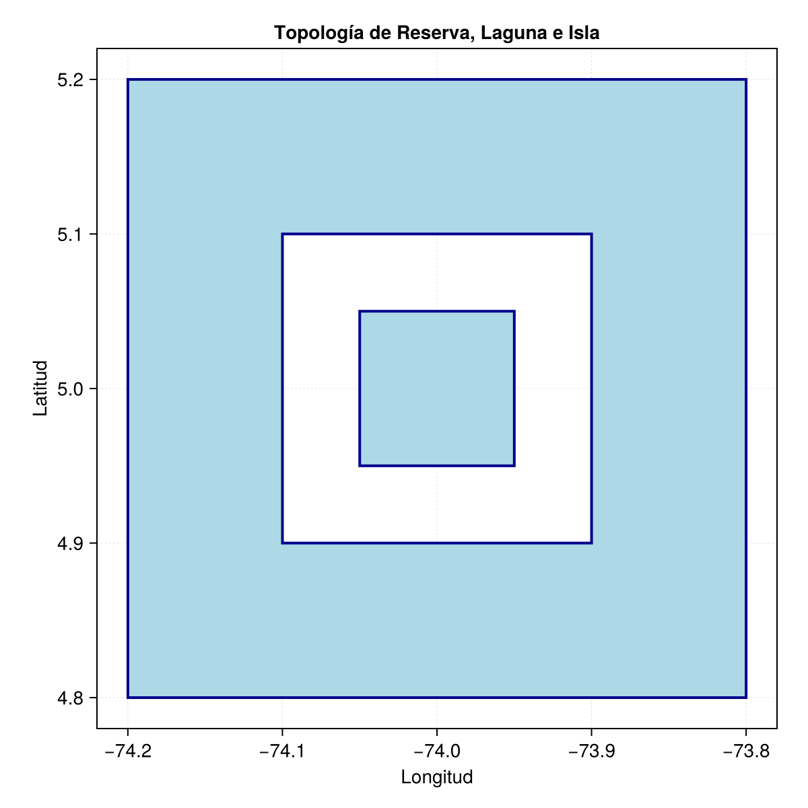
```

:::

### Resumen sintáctico

1. **Extracción de coordenadas y navegación topológica**

El acceso a vértices específicos dentro de geometrías espaciales complejas exige descender a través de la jerarquía topológica del objeto (Colección $\rightarrow$ Geometría $\rightarrow$ Anillo $\rightarrow$ Vértice). En la siguiente tabla se comparan los métodos de indexación para aislar fronteras exteriores, enclaves (huecos) y coordenadas absolutas.

Es fundamental advertir la asimetría en los índices base de cada lenguaje: mientras Python inicia sus índices vectoriales en `0`, R lo hace en `1`. En el caso de Julia, aunque el lenguaje nativamente inicia en `1`, la API de `ArchGDAL.jl` hereda la indexación en `0` de su librería C++ subyacente.

| Nivel topológico | Python (`shapely`) 🐍 | R (`sf`) 🔵 | Julia (`ArchGDAL`) 🟣 |
| :--- | :--- | :--- | :--- |
| **Extraer polígono $i$**<br>*(Desde MultiPolygon)* | `mpol.geoms[i]` | `mpol[[i]]` | `ArchGDAL.getgeom(`<br>`mpol, i)` |
| **Anillo exterior**<br>*(Límite principal)* | `pol.exterior` | `pol[[1]]` | `ArchGDAL.getgeom(`<br>`pol, 0)` |
| **Anillo interior $k$**<br>*(Hueco / Perforación)* | `pol.interiors[k]` | `pol[[k+1]]` | `ArchGDAL.getgeom(`<br>`pol, k)` |
| **Índice base del motor** | Basado en `0` | Basado en `1` | Basado en `0` (C++) |

: Sintaxis analítica para el descenso iterativo y disección de multigeometrías y anillos poligonales {#tbl-resumen_extraccion_anillos tbl-colwidths="[25,25,25,25]"}

---

2. **Extracción de vértices y extensiones espaciales**

Una vez aislado el anillo unidimensional (límite o hueco), la extracción de la tupla de coordenadas cartesianas o el cálculo de la envolvente convexa rectangular (Bounding Box) se efectúa mediante los siguientes comandos escalares.

| Operación vectorial | Python (`shapely` / `gpd`) 🐍 | R (`sf`) 🔵 | Julia (`ArchGDAL`) 🟣 |
| :--- | :--- | :--- | :--- |
| **Extraer vértice $j$**<br>*(Coordenada aislada)* | `anillo.coords[j]` | `anillo[j, ]` | `ArchGDAL.getx(anillo, j)`<br>`ArchGDAL.gety(anillo, j)` |
| **Caja delimitadora**<br>*(Bounding Box)* | `geom.bounds`<br>*(Geometría individual)* | `st_bbox(geom)` | `ArchGDAL.getenvelope(geom)` |

: Funciones escalares para la recolección de tuplas de coordenadas y cálculo de la extensión espacial perimetral {#tbl-resumen_extraccion_vertices tbl-colwidths="[25,25,25,25]"}

---

3. **Control isométrico y ajuste del lienzo**

Para garantizar que la representación gráfica mantenga la proporción geométrica real (1:1) y no distorsione la topología, es necesario forzar la isometría del lienzo y controlar los márgenes de los ejes utilizando las cajas delimitadoras.

| Operación paramétrica | Python (`matplotlib`) 🐍 | R (Base Graphics) 🔵 | Julia (`CairoMakie`) 🟣 |
| :--- | :--- | :--- | :--- |
| **Forzar proporción cuadrada**<br>*(Aspect Ratio isométrico)* | `fig, ax = plt.subplots(`<br>`figsize=(6, 6))` | `par(pty = "s")` | `ax = Axis(..., `<br>`aspect = DataAspect())` |
| **Eliminar padding nativo**<br>*(Ajustar ejes al límite exacto)* | `ax.margins(0)` | `plot(..., `<br>`xaxs = "i", yaxs = "i")` | *Controlado inherentemente por `<br>`DataAspect() y xticks/yticks* |

: Equivalencia de métodos paramétricos para el control isométrico del área de ploteo {#tbl-resumen_control_lienzo tbl-colwidths="[25,25,25,25]"}

## Extracción estructurada de coordenadas y topologías complejas

Comprender la jerarquía anidada de las multigeometrías es fundamental para el procesamiento analítico. A nivel algorítmico, un SIG no evalúa una figura como un dibujo, sino como un tensor multidimensional de vértices. 

El ejemplo a continuación simulará un área protegida (tierra) con lagunas e inslas interiores. Todo lo que sea agua no hará pare del polígono (hueco). La tarea consiste en **extraer el tercer vértice** de los polígonos que conforman el área protegida.

```{r}
#| label: area_protegida
#| fig-align: center
#| out-width: "80%"
# #| eval: false
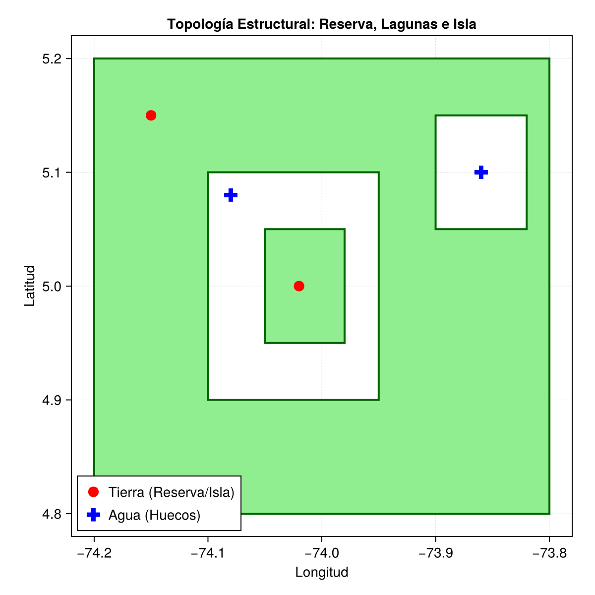
```

La topología de un `POLYGON` se define de manera estricta mediante anillos (Rings): un polígono está compuesto por **exactamente un anillo exterior** (cuya área representa masa sólida) y **cero o múltiples anillos interiores** (cuya área representa perforaciones o huecos). Por lo tanto, la naturaleza del espacio (tierra o agua) está dictada por su índice estructural:

- El anillo principal define la masa (tierra).
- Los anillos secundarios dentro del mismo polígono definen los huecos (cuerpos de agua).
- Las masas de tierra desconectadas (islas) son simplemente **polígonos adicionales** dentro de un objeto `MULTIPOLYGON`.

Para ilustrar este principio geométrico y validarlo mediante predicados espaciales, se simula un área protegida:

1. **Un polígono principal (La Reserva):** Límite exterior que contiene dos perforaciones o huecos (una laguna principal y una laguna menor, ambas disjuntas entre sí).
2. **Un polígono secundario (La Isla):** Masa terrestre ubicada matemáticamente dentro del área de la laguna principal, pero registrada estructuralmente como un polígono sólido independiente.

::: {.panel-tabset}

### Python

En Python, la librería `shapely` expone las multigeometrías iterando a través de la propiedad `.geoms`. Cada polígono posee un atributo `.exterior` y una lista de atributos `.interiors` (huecos). 

*Nota: Python utiliza indexación basada en cero (0), por lo que el primer hueco es el índice `[0]` y el tercer vértice corresponde al índice `[2]`.*

::: {.content-visible when-format="html"}
::: {.callout-tip collapse="true" icon="false"}
#### ▷ CÓDIGO PURO (Copiar y Pegar)

```{python}
#| label: python_extraccion_nodos_codigo2
#| eval: false

from shapely.geometry import Polygon, MultiPolygon, Point
import geopandas as gpd
import matplotlib.pyplot as plt
import matplotlib.ticker as ticker

# 1. Construcción de anillos topológicos topológicamente válidos
# Anillo exterior del polígono 1 (Límites de la Reserva Natural)
ext_reserva = [(-74.2, 5.2), (-73.8, 5.2), (-73.8, 4.8), (-74.2, 4.8), (-74.2, 5.2)]
# Anillo interior 1 del polígono 1 (Laguna principal / Hueco)
int_laguna1 = [(-74.1, 5.1), (-74.1, 4.9), (-73.95, 4.9), (-73.95, 5.1), (-74.1, 5.1)]
# Anillo interior 2 del polígono 1 (Laguna pequeña / Hueco disjunto)
int_laguna2 = [(-73.9, 5.15), (-73.9, 5.05), (-73.82, 5.05), (-73.82, 5.15), (-73.9, 5.15)]
# Anillo exterior del polígono 2 (Isla sólida dentro de la laguna 1)
ext_isla = [(-74.05, 5.05), (-73.98, 5.05), (-73.98, 4.95), (-74.05, 4.95), (-74.05, 5.05)]

# 2. Ensamblaje de la Multigeometría
# Estructura: [(exterior_pol1, [huecos_pol1]), (exterior_pol2, [huecos_pol2])]
mpol_reserva = MultiPolygon([
    (ext_reserva, [int_laguna1, int_laguna2]), # geoms[0].exterior
                                               # geoms[0].interiors[0]
                                               # geoms[0].interiors[1]
    (ext_isla, [])                             # geoms[1].exterior
])

# 3. Determinación estructural (Reglas OGC Simple Features)
print("--- Determinación Estructural (Basada en Atributos) ---")
c1 = mpol_reserva.geoms[0].exterior.coords[2]
print(f"Reserva (.exterior -> Tierra firme) : {c1}")

c2 = mpol_reserva.geoms[0].interiors[0].coords[2]
print(f"Laguna 1 (.interiors[0] -> Hueco)   : {c2}")

c3 = mpol_reserva.geoms[0].interiors[1].coords[2]
print(f"Laguna 2 (.interiors[1] -> Hueco)   : {c3}")

c4 = mpol_reserva.geoms[1].exterior.coords[2]
print(f"Isla (.exterior -> Tierra firme)    : {c4}\n")

# 4. Evaluación topológica con puntos de prueba (Predicado Contains)
pt_reserva = Point(-74.15, 5.15)
pt_laguna1 = Point(-74.08, 5.08)
pt_laguna2 = Point(-73.86, 5.10)
pt_isla = Point(-74.02, 5.0)

print("--- Evaluación Topológica (¿Pertenece al polígono sólido?) ---")
print(f"Punto en Reserva (Tierra) : {mpol_reserva.contains(pt_reserva)}")
print(f"Punto en Laguna 1 (Agua)  : {mpol_reserva.contains(pt_laguna1)}")
print(f"Punto en Laguna 2 (Agua)  : {mpol_reserva.contains(pt_laguna2)}")
print(f"Punto en Isla (Tierra)    : {mpol_reserva.contains(pt_isla)}")

# 5. Renderizado cartográfico integrando puntos de prueba
fig, ax = plt.subplots(figsize=(6, 6))

gpd.GeoSeries([mpol_reserva]).plot(
    ax=ax, facecolor='lightgreen', edgecolor='darkgreen', linewidth=2
)

# Ploteo diferencial de puntos de control
gpd.GeoSeries([pt_reserva, pt_isla]).plot(ax=ax, color='red', marker='o', markersize=50, label='Tierra (Reserva/Isla)')
gpd.GeoSeries([pt_laguna1, pt_laguna2]).plot(ax=ax, color='blue', marker='X', markersize=50, label='Agua (Huecos)')

ax.set_title("Topología Estructural: Reserva, Lagunas e Isla")
ax.set_xlabel("Longitud")
ax.set_ylabel("Latitud")
ax.legend(loc='lower left')
ax.grid(True, linestyle="--", linewidth=0.5, alpha=0.7)
ax.xaxis.set_major_locator(ticker.MultipleLocator(0.1))
ax.yaxis.set_major_locator(ticker.MultipleLocator(0.1))

plt.tight_layout()
plt.show()
```

:::
:::

```{python}
#| label: python_extraccion_nodos2
#| fig-align: center
#| out-width: "80%"
# #| eval: false

from shapely.geometry import Polygon, MultiPolygon, Point
import geopandas as gpd
import matplotlib.pyplot as plt
import matplotlib.ticker as ticker

# 1. Construcción de anillos topológicos topológicamente válidos
# Anillo exterior del polígono 1 (Límites de la Reserva Natural)
ext_reserva = [(-74.2, 5.2), (-73.8, 5.2), (-73.8, 4.8), (-74.2, 4.8), (-74.2, 5.2)]
# Anillo interior 1 del polígono 1 (Laguna principal / Hueco)
int_laguna1 = [(-74.1, 5.1), (-74.1, 4.9), (-73.95, 4.9), (-73.95, 5.1), (-74.1, 5.1)]
# Anillo interior 2 del polígono 1 (Laguna pequeña / Hueco disjunto)
int_laguna2 = [(-73.9, 5.15), (-73.9, 5.05), (-73.82, 5.05), (-73.82, 5.15), (-73.9, 5.15)]
# Anillo exterior del polígono 2 (Isla sólida dentro de la laguna 1)
ext_isla = [(-74.05, 5.05), (-73.98, 5.05), (-73.98, 4.95), (-74.05, 4.95), (-74.05, 5.05)]

# 2. Ensamblaje de la Multigeometría
# Estructura: [(exterior_pol1, [huecos_pol1]), (exterior_pol2, [huecos_pol2])]
mpol_reserva = MultiPolygon([
    (ext_reserva, [int_laguna1, int_laguna2]), # geoms[0].exterior
                                               # geoms[0].interiors[0]
                                               # geoms[0].interiors[1]
    (ext_isla, [])                             # geoms[1].exterior
])

# 3. Determinación estructural (Reglas OGC Simple Features)
print("--- Determinación Estructural (Basada en Atributos) ---")
c1 = mpol_reserva.geoms[0].exterior.coords[2]
print(f"Reserva (.exterior -> Tierra firme) : {c1}")

c2 = mpol_reserva.geoms[0].interiors[0].coords[2]
print(f"Laguna 1 (.interiors[0] -> Hueco)   : {c2}")

c3 = mpol_reserva.geoms[0].interiors[1].coords[2]
print(f"Laguna 2 (.interiors[1] -> Hueco)   : {c3}")

c4 = mpol_reserva.geoms[1].exterior.coords[2]
print(f"Isla (.exterior -> Tierra firme)    : {c4}\n")

# 4. Evaluación topológica con puntos de prueba (Predicado Contains)
pt_reserva = Point(-74.15, 5.15)
pt_laguna1 = Point(-74.08, 5.08)
pt_laguna2 = Point(-73.86, 5.10)
pt_isla = Point(-74.02, 5.0)

print("--- Evaluación Topológica (¿Pertenece al polígono sólido?) ---")
print(f"Punto en Reserva (Tierra) : {mpol_reserva.contains(pt_reserva)}")
print(f"Punto en Laguna 1 (Agua)  : {mpol_reserva.contains(pt_laguna1)}")
print(f"Punto en Laguna 2 (Agua)  : {mpol_reserva.contains(pt_laguna2)}")
print(f"Punto en Isla (Tierra)    : {mpol_reserva.contains(pt_isla)}")

# 5. Renderizado cartográfico integrando puntos de prueba
fig, ax = plt.subplots(figsize=(6, 6))

gpd.GeoSeries([mpol_reserva]).plot(
    ax=ax, facecolor='lightgreen', edgecolor='darkgreen', linewidth=2
)

# Ploteo diferencial de puntos de control
gpd.GeoSeries([pt_reserva, pt_isla]).plot(ax=ax, color='red', marker='o', markersize=50, label='Tierra (Reserva/Isla)')
gpd.GeoSeries([pt_laguna1, pt_laguna2]).plot(ax=ax, color='blue', marker='X', markersize=50, label='Agua (Huecos)')

ax.set_title("Topología Estructural: Reserva, Lagunas e Isla")
ax.set_xlabel("Longitud")
ax.set_ylabel("Latitud")
ax.legend(loc='lower left')
ax.grid(True, linestyle="--", linewidth=0.5, alpha=0.7)
ax.xaxis.set_major_locator(ticker.MultipleLocator(0.1))
ax.yaxis.set_major_locator(ticker.MultipleLocator(0.1))

plt.tight_layout()
plt.show()
```

### R

En R, el motor topológico es estricto con las intersecciones de límites. La estructura de un `MULTIPOLYGON` se compone de una lista profunda: `Objeto[[Polígono]][[Anillo]][Fila, Columna]`. 

A nivel estructural, el anillo en el índice `[[1]]` de cualquier polígono es obligatoriamente su cota externa sólida, mientras que cualquier índice posterior (`[[2]]`, `[[3]]`...) representa matemáticamente perforaciones vacías (huecos). R utiliza indexación basada en uno (1).

::: {.content-visible when-format="html"}
::: {.callout-tip collapse="true" icon="false"}
#### ▷ CÓDIGO PURO (Copiar y Pegar)

```{r}
#| label: r_extraccion_nodos_codigo2
#| eval: false

library(sf)

# 1. Definición matricial de los anillos topológicos
ext_reserva <- rbind(c(-74.2, 5.2), c(-73.8, 5.2), c(-73.8, 4.8), c(-74.2, 4.8), c(-74.2, 5.2))
int_laguna1 <- rbind(c(-74.1, 5.1), c(-74.1, 4.9), c(-73.95, 4.9), c(-73.95, 5.1), c(-74.1, 5.1))
int_laguna2 <- rbind(c(-73.9, 5.15), c(-73.9, 5.05), c(-73.82, 5.05), c(-73.82, 5.15), c(-73.9, 5.15))
ext_isla <- rbind(c(-74.05, 5.05), c(-73.98, 5.05), c(-73.98, 4.95), c(-74.05, 4.95), c(-74.05, 5.05))

# 2. Ensamblaje en lista jerárquica (MULTIPOLYGON) - Objeto SFG
mpol_reserva <- st_multipolygon(list(
  list(ext_reserva, int_laguna1, int_laguna2), # Pol 1: Exterior y dos huecos      (mpol_reserva[[1]])
  list(ext_isla)                               # Pol 2: Exterior únicamente (Isla) (mpol_reserva[[2]])
))

# Instanciación en columna geométrica formal
mpol_sfc <- st_sfc(mpol_reserva, crs = 4326)

# 3. Determinación estructural analítica
cat("--- Determinación Estructural (Basada en Índices de Lista) ---\n")
c1 <- mpol_reserva[[1]][[1]][3, ]
cat(sprintf("Reserva (Pol 1, Índice [[1]] -> Tierra) : [%f, %f]\n", c1[1], c1[2]))

c2 <- mpol_reserva[[1]][[2]][3, ]
cat(sprintf("Laguna 1 (Pol 1, Índice [[2]] -> Agua)  : [%f, %f]\n", c2[1], c2[2]))

c3 <- mpol_reserva[[1]][[3]][3, ]
cat(sprintf("Laguna 2 (Pol 1, Índice [[3]] -> Agua)  : [%f, %f]\n", c3[1], c3[2]))

c4 <- mpol_reserva[[2]][[1]][3, ]
cat(sprintf("Isla (Pol 2, Índice [[1]] -> Tierra)    : [%f, %f]\n\n", c4[1], c4[2]))

# 4. Evaluación topológica mediante predicados con puntos
pt_reserva <- st_sfc(st_point(c(-74.15, 5.15)), crs = 4326)
pt_laguna1 <- st_sfc(st_point(c(-74.08, 5.08)), crs = 4326)
pt_laguna2 <- st_sfc(st_point(c(-73.86, 5.10)), crs = 4326)
pt_isla <- st_sfc(st_point(c(-74.02, 5.0)), crs = 4326)

cat("--- Evaluación Topológica (¿Pertenece al polígono sólido?) ---\n")
cat("Punto en Reserva (Tierra):", st_contains(mpol_sfc, pt_reserva, sparse = FALSE)[1,1], "\n")
cat("Punto en Laguna 1 (Agua) :", st_contains(mpol_sfc, pt_laguna1, sparse = FALSE)[1,1], "\n")
cat("Punto en Laguna 2 (Agua) :", st_contains(mpol_sfc, pt_laguna2, sparse = FALSE)[1,1], "\n")
cat("Punto en Isla (Tierra)   :", st_contains(mpol_sfc, pt_isla, sparse = FALSE)[1,1], "\n")

# 5. Renderizado cartográfico de la topología y puntos de validación
bb <- st_bbox(mpol_sfc)
dx <- (bb$xmax - bb$xmin) * 0.05
dy <- (bb$ymax - bb$ymin) * 0.05
xlim_val <- c(as.numeric(bb$xmin - dx), as.numeric(bb$xmax + dx))
ylim_val <- c(as.numeric(bb$ymin - dy), as.numeric(bb$ymax + dy))

par(pty = "s", mar = c(3, 3, 2, 1)) 
plot(mpol_sfc, col = 'lightgreen', border = 'darkgreen', lwd = 2, axes = TRUE,
     xlim = xlim_val, ylim = ylim_val, xaxs = "i", yaxs = "i", 
     main = "Topología Estructural: Reserva, Lagunas e Isla",
     graticule = st_graticule(lon = seq(-74.2, -73.8, by = 0.1), lat = seq(4.8, 5.2, by = 0.1)))

# Simbología diferencial para verificación visual
plot(pt_reserva, col = "red", pch = 16, cex = 1.5, add = TRUE)
plot(pt_isla, col = "red", pch = 16, cex = 1.5, add = TRUE)
plot(pt_laguna1, col = "blue", pch = 4, lwd = 2, cex = 1.5, add = TRUE)
plot(pt_laguna2, col = "blue", pch = 4, lwd = 2, cex = 1.5, add = TRUE)

legend("bottomleft", legend = c("Tierra (Reserva/Isla)", "Agua (Huecos)"), col = c("red", "blue"), pch = c(16, 4))
```

:::
:::

```{r}
#| label: r_extraccion_nodos2
#| fig-align: center
#| out-width: "80%"
# #| eval: false

library(sf)

# 1. Definición matricial de los anillos topológicos
ext_reserva <- rbind(c(-74.2, 5.2), c(-73.8, 5.2), c(-73.8, 4.8), c(-74.2, 4.8), c(-74.2, 5.2))
int_laguna1 <- rbind(c(-74.1, 5.1), c(-74.1, 4.9), c(-73.95, 4.9), c(-73.95, 5.1), c(-74.1, 5.1))
int_laguna2 <- rbind(c(-73.9, 5.15), c(-73.9, 5.05), c(-73.82, 5.05), c(-73.82, 5.15), c(-73.9, 5.15))
ext_isla <- rbind(c(-74.05, 5.05), c(-73.98, 5.05), c(-73.98, 4.95), c(-74.05, 4.95), c(-74.05, 5.05))

# 2. Ensamblaje en lista jerárquica (MULTIPOLYGON) - Objeto SFG
mpol_reserva <- st_multipolygon(list(
  list(ext_reserva, int_laguna1, int_laguna2), # Pol 1: Exterior y dos huecos      (mpol_reserva[[1]])
  list(ext_isla)                               # Pol 2: Exterior únicamente (Isla) (mpol_reserva[[2]])
))

# Instanciación en columna geométrica formal
mpol_sfc <- st_sfc(mpol_reserva, crs = 4326)

# 3. Determinación estructural analítica
cat("--- Determinación Estructural (Basada en Índices de Lista) ---\n")
c1 <- mpol_reserva[[1]][[1]][3, ]
cat(sprintf("Reserva (Pol 1, Índice [[1]] -> Tierra) : [%f, %f]\n", c1[1], c1[2]))

c2 <- mpol_reserva[[1]][[2]][3, ]
cat(sprintf("Laguna 1 (Pol 1, Índice [[2]] -> Agua)  : [%f, %f]\n", c2[1], c2[2]))

c3 <- mpol_reserva[[1]][[3]][3, ]
cat(sprintf("Laguna 2 (Pol 1, Índice [[3]] -> Agua)  : [%f, %f]\n", c3[1], c3[2]))

c4 <- mpol_reserva[[2]][[1]][3, ]
cat(sprintf("Isla (Pol 2, Índice [[1]] -> Tierra)    : [%f, %f]\n\n", c4[1], c4[2]))

# 4. Evaluación topológica mediante predicados con puntos
pt_reserva <- st_sfc(st_point(c(-74.15, 5.15)), crs = 4326)
pt_laguna1 <- st_sfc(st_point(c(-74.08, 5.08)), crs = 4326)
pt_laguna2 <- st_sfc(st_point(c(-73.86, 5.10)), crs = 4326)
pt_isla <- st_sfc(st_point(c(-74.02, 5.0)), crs = 4326)

cat("--- Evaluación Topológica (¿Pertenece al polígono sólido?) ---\n")
cat("Punto en Reserva (Tierra):", st_contains(mpol_sfc, pt_reserva, sparse = FALSE)[1,1], "\n")
cat("Punto en Laguna 1 (Agua) :", st_contains(mpol_sfc, pt_laguna1, sparse = FALSE)[1,1], "\n")
cat("Punto en Laguna 2 (Agua) :", st_contains(mpol_sfc, pt_laguna2, sparse = FALSE)[1,1], "\n")
cat("Punto en Isla (Tierra)   :", st_contains(mpol_sfc, pt_isla, sparse = FALSE)[1,1], "\n")

# 5. Renderizado cartográfico de la topología y puntos de validación
bb <- st_bbox(mpol_sfc)
dx <- (bb$xmax - bb$xmin) * 0.05
dy <- (bb$ymax - bb$ymin) * 0.05
xlim_val <- c(as.numeric(bb$xmin - dx), as.numeric(bb$xmax + dx))
ylim_val <- c(as.numeric(bb$ymin - dy), as.numeric(bb$ymax + dy))

par(pty = "s", mar = c(3, 3, 2, 1)) 
plot(mpol_sfc, col = 'lightgreen', border = 'darkgreen', lwd = 2, axes = TRUE,
     xlim = xlim_val, ylim = ylim_val, xaxs = "i", yaxs = "i", 
     main = "Topología Estructural: Reserva, Lagunas e Isla",
     graticule = st_graticule(lon = seq(-74.2, -73.8, by = 0.1), lat = seq(4.8, 5.2, by = 0.1)))

# Simbología diferencial para verificación visual
plot(pt_reserva, col = "red", pch = 16, cex = 1.5, add = TRUE)
plot(pt_isla, col = "red", pch = 16, cex = 1.5, add = TRUE)
plot(pt_laguna1, col = "blue", pch = 4, lwd = 2, cex = 1.5, add = TRUE)
plot(pt_laguna2, col = "blue", pch = 4, lwd = 2, cex = 1.5, add = TRUE)

legend("bottomleft", legend = c("Tierra (Reserva/Isla)", "Agua (Huecos)"), col = c("red", "blue"), pch = c(16, 4))
```

### Julia

En Julia, la API subyacente de `ArchGDAL` garantiza que `getgeom(pol, 0)` extrae el anillo exterior primario. Todo índice mayor a 0 extrae iterativamente los huecos internos. 

::: {.content-visible when-format="html"}
::: {.callout-tip collapse="true" icon="false"}
#### ▷ CÓDIGO PURO (Copiar y Pegar)

```{julia}
#| label: julia_extraccion_nodos_codigo2
#| eval: false

using ArchGDAL
using CairoMakie
using Printf

# 1. Instanciación y ensamblaje multinivel (Arreglo de Arreglos de Arreglos)
mpol_reserva = ArchGDAL.createmultipolygon([
    [ # Polígono 1
        [(-74.2, 5.2), (-73.8, 5.2), (-73.8, 4.8), (-74.2, 4.8), (-74.2, 5.2)], # Anillo Exterior 
        [(-74.1, 5.1), (-74.1, 4.9), (-73.95, 4.9), (-73.95, 5.1), (-74.1, 5.1)], # Hueco 1
        [(-73.9, 5.15), (-73.9, 5.05), (-73.82, 5.05), (-73.82, 5.15), (-73.9, 5.15)] # Hueco 2
    ],
    [ # Polígono 2
        [(-74.05, 5.05), (-73.98, 5.05), (-73.98, 4.95), (-74.05, 4.95), (-74.05, 5.05)] # Anillo Exterior (Isla)
    ]
])

# 2. Determinación estructural paramétrica (Basada en API C++)
println("--- Determinación Estructural (Basada en Índices) ---")
pol1 = ArchGDAL.getgeom(mpol_reserva, 0)

ext_reserva = ArchGDAL.getgeom(pol1, 0)
@printf("Reserva (Pol 0, Índice 0 -> Tierra) : [%f, %f]\n", ArchGDAL.getx(ext_reserva, 2), ArchGDAL.gety(ext_reserva, 2))

int_laguna1 = ArchGDAL.getgeom(pol1, 1)
@printf("Laguna 1 (Pol 0, Índice 1 -> Agua)  : [%f, %f]\n", ArchGDAL.getx(int_laguna1, 2), ArchGDAL.gety(int_laguna1, 2))

int_laguna2 = ArchGDAL.getgeom(pol1, 2)
@printf("Laguna 2 (Pol 0, Índice 2 -> Agua)  : [%f, %f]\n", ArchGDAL.getx(int_laguna2, 2), ArchGDAL.gety(int_laguna2, 2))

pol2 = ArchGDAL.getgeom(mpol_reserva, 1)
ext_isla = ArchGDAL.getgeom(pol2, 0)
@printf("Isla (Pol 1, Índice 0 -> Tierra)    : [%f, %f]\n\n", ArchGDAL.getx(ext_isla, 2), ArchGDAL.gety(ext_isla, 2))

# 3. Validación topológica con predicados y puntos de control
pt_reserva = ArchGDAL.fromWKT("POINT (-74.15 5.15)")
pt_laguna1 = ArchGDAL.fromWKT("POINT (-74.08 5.08)")
pt_laguna2 = ArchGDAL.fromWKT("POINT (-73.86 5.10)")
pt_isla = ArchGDAL.fromWKT("POINT (-74.02 5.0)")

println("--- Evaluación Topológica (¿Pertenece al polígono sólido?) ---")
println("Punto en Reserva (Tierra) : ", ArchGDAL.contains(mpol_reserva, pt_reserva))
println("Punto en Laguna 1 (Agua)  : ", ArchGDAL.contains(mpol_reserva, pt_laguna1))
println("Punto en Laguna 2 (Agua)  : ", ArchGDAL.contains(mpol_reserva, pt_laguna2))
println("Punto en Isla (Tierra)    : ", ArchGDAL.contains(mpol_reserva, pt_isla))

# 4. Función de mapeo (Traducción GDAL a CairoMakie Polygon)
function to_makie_poly(gdal_poly)
    ext = ArchGDAL.getgeom(gdal_poly, 0)
    ext_pts = [Point2f(ArchGDAL.getx(ext, i), ArchGDAL.gety(ext, i)) for i in 0:ArchGDAL.ngeom(ext)-1]
    
    holes = Vector{Vector{Point2f}}()
    for i in 1:ArchGDAL.ngeom(gdal_poly)-1
        hole = ArchGDAL.getgeom(gdal_poly, i)
        push!(holes, [Point2f(ArchGDAL.getx(hole, j), ArchGDAL.gety(hole, j)) for j in 0:ArchGDAL.ngeom(hole)-1])
    end
    return Makie.Polygon(ext_pts, holes)
end

# 5. Configuración de panel gráfico y variables
fig = Figure(size = (600, 600))
ax = Axis(fig[1, 1], title = "Topología Estructural: Reserva, Lagunas e Isla",
    xlabel = "Longitud", ylabel = "Latitud", aspect = DataAspect(),
    xticks = -74.3:0.1:-73.7, yticks = 4.7:0.1:5.3, 
    xgridstyle = :dash, ygridstyle = :dash, xgridwidth = 0.5, ygridwidth = 0.5)

# Renderizado de capas poligonales
for i in 0:ArchGDAL.ngeom(mpol_reserva)-1
    CairoMakie.poly!(ax, to_makie_poly(ArchGDAL.getgeom(mpol_reserva, i)), 
                     color = :lightgreen, strokecolor = :darkgreen, strokewidth = 2.0)
end

# Superposición de puntos de prueba para contexto visual
scatter!(ax, [-74.15, -74.02], [5.15, 5.0], color = :red, marker = :circle, markersize = 15, label = "Tierra (Reserva/Isla)")
scatter!(ax, [-74.08, -73.86], [5.08, 5.10], color = :blue, marker = :cross, markersize = 18, label = "Agua (Huecos)")
axislegend(ax, position = :lb) # Legenda en Lower Left

fig
```

:::
:::

```{r}
#| label: julia_extraccion_nodos2
#| results: asis
#| code-fold: true
#| fig-align: center
#| out-width: "80%"
# #| eval: false

j_eval('
using ArchGDAL
using CairoMakie
using Printf

# 1. Instanciación y ensamblaje multinivel (Arreglo de Arreglos de Arreglos)
mpol_reserva = ArchGDAL.createmultipolygon([
    [ # Polígono 1
        [(-74.2, 5.2), (-73.8, 5.2), (-73.8, 4.8), (-74.2, 4.8), (-74.2, 5.2)], # Anillo Exterior 
        [(-74.1, 5.1), (-74.1, 4.9), (-73.95, 4.9), (-73.95, 5.1), (-74.1, 5.1)], # Hueco 1
        [(-73.9, 5.15), (-73.9, 5.05), (-73.82, 5.05), (-73.82, 5.15), (-73.9, 5.15)] # Hueco 2
    ],
    [ # Polígono 2
        [(-74.05, 5.05), (-73.98, 5.05), (-73.98, 4.95), (-74.05, 4.95), (-74.05, 5.05)] # Anillo Exterior (Isla)
    ]
])

# 2. Determinación estructural paramétrica (Basada en API C++)
println("--- Determinación Estructural (Basada en Índices) ---")
pol1 = ArchGDAL.getgeom(mpol_reserva, 0)

ext_reserva = ArchGDAL.getgeom(pol1, 0)
@printf("Reserva (Pol 0, Índice 0 -> Tierra) : [%f, %f]\\n", ArchGDAL.getx(ext_reserva, 2), ArchGDAL.gety(ext_reserva, 2))

int_laguna1 = ArchGDAL.getgeom(pol1, 1)
@printf("Laguna 1 (Pol 0, Índice 1 -> Agua)  : [%f, %f]\\n", ArchGDAL.getx(int_laguna1, 2), ArchGDAL.gety(int_laguna1, 2))

int_laguna2 = ArchGDAL.getgeom(pol1, 2)
@printf("Laguna 2 (Pol 0, Índice 2 -> Agua)  : [%f, %f]\\n", ArchGDAL.getx(int_laguna2, 2), ArchGDAL.gety(int_laguna2, 2))

pol2 = ArchGDAL.getgeom(mpol_reserva, 1)
ext_isla = ArchGDAL.getgeom(pol2, 0)
@printf("Isla (Pol 1, Índice 0 -> Tierra)    : [%f, %f]\\n\\n", ArchGDAL.getx(ext_isla, 2), ArchGDAL.gety(ext_isla, 2))

# 3. Validación topológica con predicados y puntos de control
pt_reserva = ArchGDAL.fromWKT("POINT (-74.15 5.15)")
pt_laguna1 = ArchGDAL.fromWKT("POINT (-74.08 5.08)")
pt_laguna2 = ArchGDAL.fromWKT("POINT (-73.86 5.10)")
pt_isla = ArchGDAL.fromWKT("POINT (-74.02 5.0)")

println("--- Evaluación Topológica (¿Pertenece al polígono sólido?) ---")
println("Punto en Reserva (Tierra) : ", ArchGDAL.contains(mpol_reserva, pt_reserva))
println("Punto en Laguna 1 (Agua)  : ", ArchGDAL.contains(mpol_reserva, pt_laguna1))
println("Punto en Laguna 2 (Agua)  : ", ArchGDAL.contains(mpol_reserva, pt_laguna2))
println("Punto en Isla (Tierra)    : ", ArchGDAL.contains(mpol_reserva, pt_isla))

# 4. Función de mapeo (Traducción GDAL a CairoMakie Polygon)
function to_makie_poly(gdal_poly)
    ext = ArchGDAL.getgeom(gdal_poly, 0)
    ext_pts = [Point2f(ArchGDAL.getx(ext, i), ArchGDAL.gety(ext, i)) for i in 0:ArchGDAL.ngeom(ext)-1]
    
    holes = Vector{Vector{Point2f}}()
    for i in 1:ArchGDAL.ngeom(gdal_poly)-1
        hole = ArchGDAL.getgeom(gdal_poly, i)
        push!(holes, [Point2f(ArchGDAL.getx(hole, j), ArchGDAL.gety(hole, j)) for j in 0:ArchGDAL.ngeom(hole)-1])
    end
    return Makie.Polygon(ext_pts, holes)
end

# 5. Configuración de panel gráfico y variables
fig = Figure(size = (600, 600))
ax = Axis(fig[1, 1], title = "Topología Estructural: Reserva, Lagunas e Isla",
    xlabel = "Longitud", ylabel = "Latitud", aspect = DataAspect(),
    xticks = -74.3:0.1:-73.7, yticks = 4.7:0.1:5.3, 
    xgridstyle = :dash, ygridstyle = :dash, xgridwidth = 0.5, ygridwidth = 0.5)

# Renderizado de capas poligonales
for i in 0:ArchGDAL.ngeom(mpol_reserva)-1
    CairoMakie.poly!(ax, to_makie_poly(ArchGDAL.getgeom(mpol_reserva, i)), 
                     color = :lightgreen, strokecolor = :darkgreen, strokewidth = 2.0)
end

# Superposición de puntos de prueba para contexto visual
CairoMakie.scatter!(ax, [-74.15, -74.02], [5.15, 5.0], color = :red, marker = :circle, markersize = 15, label = "Tierra (Reserva/Isla)")
CairoMakie.scatter!(ax, [-74.08, -73.86], [5.08, 5.10], color = :blue, marker = :cross, markersize = 18, label = "Agua (Huecos)")
axislegend(ax, position = :lb) # Legenda en Lower Left

CairoMakie.save("images/c14_plot_topologia_puntos_julia.png", fig)
')


```

:::

### Resumen sintáctico

El acceso a los atributos internos para determinar la validez estructural dentro de geometrías complejas exige descender a través de la jerarquía topológica del objeto (Colección $\rightarrow$ Geometría $\rightarrow$ Anillo $\rightarrow$ Vértice). La siguiente tabla ilustra los métodos de indexación para aislar fronteras exteriores y enclaves.

Es imperativo reconocer la asimetría algorítmica de los índices base: mientras Python inicia sus índices vectoriales en `0`, R lo hace en `1`. En el ecosistema de Julia, aunque el lenguaje nativamente inicia en `1`, la API de `ArchGDAL.jl` hereda la indexación estricta en `0` de su librería matriz C++.

| Nivel topológico | Python (`shapely`) 🐍 | R (`sf`) 🔵 | Julia (`ArchGDAL`) 🟣 |
| :--- | :--- | :--- | :--- |
| **Extraer polígono $i$**<br>*(Desde MultiPolygon)* | `mpol.geoms[i]` | `mpol[[i+1]]` | `ArchGDAL.getgeom(`<br>`mpol, i)` |
| **Anillo exterior (Tierra)**<br>*(Límite principal)* | `pol.exterior` | `pol[[1]]` | `ArchGDAL.getgeom(`<br>`pol, 0)` |
| **Anillo interior $k$ (Agua)**<br>*(Hueco / Perforación)* | `pol.interiors[k]` | `pol[[k+2]]` | `ArchGDAL.getgeom(`<br>`pol, k+1)` |
| **Índice base del motor** | Basado en `0` | Basado en `1` | Basado en `0` (C++) |

: Sintaxis analítica para el descenso iterativo y disección topológica de multigeometrías {#tbl-resumen_extraccion_anillos tbl-colwidths="[25,25,25,25]"}


## Creación de puntos a partir de coordenadas en la tabla

El siguiente código define un conjunto de datos tabulares con las coordenadas de cuatro ciudades principales de Colombia y lo convierte a un formato espacial explícito asignando el sistema de referencia WGS84 (EPSG:4326), para luego generar un gráfico básico.

::: {.panel-tabset}

### Python

::: {.content-visible when-format="html"}
::: {.callout-tip collapse="true" icon="false"}
#### ▷ CÓDIGO PURO (Copiar y Pegar)
```{python}
#| label: python_crear_puntos_codigo
#| eval: false

import pandas as pd
import geopandas as gpd
import matplotlib.pyplot as plt

# 1. Datos de coordenadas de ciudades principales de Colombia
datos = {
    "Ciudad": ["Bogotá", "Medellín", "Cali", "Barranquilla"],
    "Latitud": [4.6097, 6.2442, 3.4516, 10.9685],
    "Longitud": [-74.0817, -75.5812, -76.5320, -74.7813]
}

# 2. Creación del DataFrame tabular estándar
df = pd.DataFrame(datos)

# 3. Conversión a GeoDataFrame asignando la geometría de puntos
# Se especifica crs="EPSG:4326" correspondiente a coordenadas geográficas WGS84
gdf = gpd.GeoDataFrame(
    df, 
    geometry=gpd.points_from_xy(df.Longitud, df.Latitud),
    crs="EPSG:4326"
)

# Visualización tabular
print(gdf)

# Visualización gráfica
gdf.plot(color="red", marker="o", markersize=50)
plt.title("Ciudades Principales - Colombia")
plt.xlabel("Longitud")
plt.ylabel("Latitud")
plt.show()
```
:::
:::

```{python}
#| label: python_crear_puntos
# #| eval: false

import pandas as pd
import geopandas as gpd
import matplotlib.pyplot as plt

# 1. Datos de coordenadas de ciudades principales de Colombia
datos = {
    "Ciudad": ["Bogotá", "Medellín", "Cali", "Barranquilla"],
    "Latitud": [4.6097, 6.2442, 3.4516, 10.9685],
    "Longitud": [-74.0817, -75.5812, -76.5320, -74.7813]
}

# 2. Creación del DataFrame tabular estándar
df = pd.DataFrame(datos)

# 3. Conversión a GeoDataFrame asignando la geometría de puntos
# Se especifica crs="EPSG:4326" correspondiente a coordenadas geográficas WGS84
gdf = gpd.GeoDataFrame(
    df, 
    geometry=gpd.points_from_xy(df.Longitud, df.Latitud),
    crs="EPSG:4326"
)

# Visualización tabular
print(gdf)

# Visualización gráfica
gdf.plot(color="red", marker="o", markersize=50)
plt.title("Ciudades Principales - Colombia")
plt.xlabel("Longitud")
plt.ylabel("Latitud")
plt.show()
```

### R

::: {.content-visible when-format="html"}
::: {.callout-tip collapse="true" icon="false"}
#### ▷ CÓDIGO PURO (Copiar y Pegar)
```{r}
#| label: r_crear_puntos_codigo
#| eval: false

library(sf)
library(tibble)

# 1. Datos tabulares de ciudades principales de Colombia
df <- tibble(
  Ciudad = c("Bogotá", "Medellín", "Cali", "Barranquilla"),
  Latitud = c(4.6097, 6.2442, 3.4516, 10.9685),
  Longitud = c(-74.0817, -75.5812, -76.5320, -74.7813)
)

# 2. Conversión a objeto espacial (sf)
# Se indican los nombres de las columnas que contienen las coordenadas
# Se asigna explícitamente el CRS 4326 (WGS84)
gdf <- st_as_sf(df, coords = c("Longitud", "Latitud"), crs = 4326)

# Visualización tabular
print(gdf)

# Visualización gráfica
plot(st_geometry(gdf), col = "red", pch = 16, cex = 1.5, 
     main = "Ciudades Principales - Colombia", axes = TRUE)
```
:::
:::

```{r}
#| label: r_crear_puntos
# #| eval: false

library(sf)
library(tibble)

# 1. Datos tabulares de ciudades principales de Colombia
df <- tibble(
  Ciudad = c("Bogotá", "Medellín", "Cali", "Barranquilla"),
  Latitud = c(4.6097, 6.2442, 3.4516, 10.9685),
  Longitud = c(-74.0817, -75.5812, -76.5320, -74.7813)
)

# 2. Conversión a objeto espacial (sf)
# Se indican los nombres de las columnas que contienen las coordenadas
# Se asigna explícitamente el CRS 4326 (WGS84)
gdf <- st_as_sf(df, coords = c("Longitud", "Latitud"), crs = 4326)

# Visualización tabular
print(gdf)

# Visualización gráfica
plot(st_geometry(gdf), col = "red", pch = 16, cex = 1.5, 
     main = "Ciudades Principales - Colombia", axes = TRUE)
```

### Julia

::: {.content-visible when-format="html"}
::: {.callout-tip collapse="true" icon="false"}
#### ▷ CÓDIGO PURO (Copiar y Pegar)
```{julia}
#| label: julia_crear_puntos_codigo
#| eval: false

using DataFrames
using ArchGDAL
using Plots

# 1. Datos tabulares de ciudades principales de Colombia
df = DataFrame(
    Ciudad = ["Bogotá", "Medellín", "Cali", "Barranquilla"],
    Latitud = [4.6097, 6.2442, 3.4516, 10.9685],
    Longitud = [-74.0817, -75.5812, -76.5320, -74.7813]
)

# 2. Creación de la columna de geometría vectorial
df.geometry = ArchGDAL.createpoint.(df.Longitud, df.Latitud)

# Visualización tabular
println(df)

# Visualización gráfica pasando el vector de geometrías directamente
plot(df.geometry, title="Ciudades Principales - Colombia", 
     color=:red, marker=:circle, markersize=6, aspect_ratio=:equal, legend=false)
```
:::
:::

```{r}
#| label: julia_crear_puntos
#| results: asis
#| code-fold: true
# #| eval: false

j_eval('
using DataFrames
using ArchGDAL
using Plots

# 1. Datos tabulares de ciudades principales de Colombia
df = DataFrame(
    Ciudad = ["Bogotá", "Medellín", "Cali", "Barranquilla"],
    Latitud = [4.6097, 6.2442, 3.4516, 10.9685],
    Longitud = [-74.0817, -75.5812, -76.5320, -74.7813]
)

# 2. Creación de la columna de geometría vectorial
df.geometry = ArchGDAL.createpoint.(df.Longitud, df.Latitud)

# Visualización tabular
println(df)

# Visualización gráfica y guardado
p = Plots.plot(df.geometry, title="Ciudades Principales - Colombia", 
         color=:red, marker=:circle, markersize=6, aspect_ratio=:equal, legend=false)
         
Plots.savefig(p, "images/c14_plot_ciudades_colombia_julia.png")
')

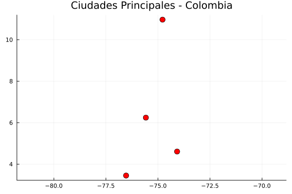
```

:::

### Resumen sintáctico: Creación de puntos espaciales

| Operación | Python (`geopandas`) 🐍 | R (`sf`) 🔵 | Julia (`ArchGDAL`) 🟣 |
| :--- | :--- | :--- | :--- |
| **Librerías base** | `import pandas as pd`<br>`import geopandas as gpd` | `library(tibble)`<br>`library(sf)` | `using DataFrames`<br>`using ArchGDAL` |
| **Crear tabla base** | `df = pd.DataFrame(datos)` | `df <- tibble(Lon=..., Lat=...)` | `df = DataFrame(Lon=..., Lat=...)` |
| **Convertir a espacial** | `gpd.GeoDataFrame(df, geometry=gpd.points_from_xy(df.Lon, df.Lat), crs="EPSG:4326")` | `st_as_sf(df, coords=c("Lon", "Lat"), crs=4326)` | `df.geometry = ArchGDAL.createpoint.(df.Lon, df.Lat)` |
| **Gráfico rápido** | `gdf.plot()` | `plot(st_geometry(gdf))` | `plot(df.geometry)` |

: Sintaxis comparativa para la creación de geometrías de puntos desde coordenadas tabulares {#tbl-resumen_crear_puntos tbl-colwidths="[25,25,25,25]"}

## Lectura de archivos vectoriales externos

En un flujo de trabajo SIG, la fuente principal de datos suelen ser archivos externos. El formato *Shapefile* (.shp) sigue siendo el estándar de la industria, aunque requiere que todos sus archivos asociados (.dbf, .shx, .prj) estén en la misma carpeta. 

A continuación, cargamos la capa de municipios utilizando la ruta local `data_heavy/MUNICIPIOS_ISLA_WGS84.shp`.

::: {.panel-tabset}

### Python

::: {.content-visible when-format="html"}
::: {.callout-tip collapse="true" icon="false"}
#### ▷ CÓDIGO PURO (Copiar y Pegar)
```{python}
#| label: python_lectura_local_codigo
#| eval: false

import geopandas as gpd

# read_file() carga el archivo y reconoce automáticamente el CRS.
# Usamos r"" para evitar problemas con las barras invertidas en Windows.
ruta = r"data_heavy/MUNICIPIOS_ISLA_WGS84.shp"
gdf_municipios = gpd.read_file(ruta)

# Inspección de los primeros 5 registros
print(gdf_municipios.head())

# Visualización básica de la geometría cargada
gdf_municipios.plot(figsize=(8, 8), edgecolor="black", linewidth=0.5)
```
:::
:::

```{python}
#| label: python_lectura_local
# #| eval: false

import geopandas as gpd

# Carga del GeoDataFrame
ruta = r"data_heavy/MUNICIPIOS_ISLA_WGS84.shp"
gdf_municipios = gpd.read_file(ruta)

# Metadatos del archivo
print(f"Tipo de objeto: {type(gdf_municipios)}")
print(f"Número de polígonos: {len(gdf_municipios)}")
gdf_municipios.head()
```

### R

::: {.content-visible when-format="html"}
::: {.callout-tip collapse="true" icon="false"}
#### ▷ CÓDIGO PURO (Copiar y Pegar)
```{r}
#| label: r_lectura_local_codigo
#| eval: false

library(sf)

# st_read() es la función estándar de sf para leer archivos vectoriales.
ruta <- "data_heavy/MUNICIPIOS_ISLA_WGS84.shp"
gdf_municipios <- st_read(ruta)

# Inspección de la estructura sf
print(head(gdf_municipios))

# Visualización rápida de la primera columna de atributos
plot(gdf_municipios[1], main = "Municipios - Lectura Local")
```
:::
:::

```{r}
#| label: r_lectura_local
# #| eval: false

library(sf)

# Lectura silenciosa para evitar el log de GDAL en el renderizado
ruta <- "data_heavy/MUNICIPIOS_ISLA_WGS84.shp"
gdf_municipios <- st_read(ruta, quiet = TRUE)

# Verificamos la columna de geometría
st_geometry(gdf_municipios) |> head()
```

### Julia

::: {.content-visible when-format="html"}
::: {.callout-tip collapse="true" icon="false"}
#### ▷ CÓDIGO PURO (Copiar y Pegar)
```{julia}
#| label: julia_lectura_local_codigo
#| eval: false

using ArchGDAL
using DataFrames

# Julia abre el archivo dentro de un contexto controlado.
ruta = "data_heavy/MUNICIPIOS_ISLA_WGS84.shp"
ArchGDAL.read(ruta) do dataset
    # Se extrae la capa (layer) del Shapefile
    layer = ArchGDAL.getlayer(dataset, 0)
    # Conversión directa a DataFrame de Julia
    df_municipios = DataFrame(layer)
    println(first(df_municipios, 5))
end
```
:::
:::

```{r}
#| label: julia_lectura_local
#| results: asis
#| code-fold: true
# #| eval: false

j_eval('
using ArchGDAL
using DataFrames

# Julia abre el archivo dentro de un contexto controlado.
ruta = "data_heavy/MUNICIPIOS_ISLA_WGS84.shp"
ArchGDAL.read(ruta) do dataset
    # Se extrae la capa (layer) del Shapefile
    layer = ArchGDAL.getlayer(dataset, 0)
    # Conversión directa a DataFrame de Julia
    df_municipios = DataFrame(layer)
    println(first(df_municipios, 5))
end
')
```

:::

## La columna de geometría como objeto independiente

Una vez cargada la tabla, la columna que almacena los datos espaciales se comporta de forma distinta a una columna de texto normal. En Python es una **GeoSeries** y en R es una **sfc**. Estos objetos permiten realizar operaciones directas como el cálculo de áreas o perímetros.


::: {.panel-tabset}

### Python

::: {.content-visible when-format="html"}
::: {.callout-tip collapse="true" icon="false"}
#### ▷ CÓDIGO PURO (Copiar y Pegar)
```{python}
#| label: python_geoseries_calc_codigo
#| eval: false

# Acceso a la GeoSeries
geometria = gdf_municipios.geometry

# Cálculos directos (El resultado depende de la unidad del CRS)
areas = geometria.area
centroides = geometria.centroid
print(areas.head())
```
:::
:::

```{python}
#| label: python_geoseries_calc

# Acceso a la GeoSeries
geometria = gdf_municipios.geometry

# Cálculos directos (El resultado depende de la unidad del CRS)
areas = geometria.area
centroides = geometria.centroid
print(areas.head())
```

### R

::: {.content-visible when-format="html"}
::: {.callout-tip collapse="true" icon="false"}
#### ▷ CÓDIGO PURO (Copiar y Pegar)
```{r}
#| label: r_sfc_calc_codigo
#| eval: false

# Acceso a la columna sfc
geometria <- st_geometry(gdf_municipios)

# Cálculos directos
areas <- st_area(geometria)
centroides <- st_centroid(geometria)
print(head(areas))
```
:::
:::

```{r}
#| label: r_sfc_calc

# Acceso a la columna sfc
geometria <- st_geometry(gdf_municipios)

# Cálculos directos
areas <- st_area(geometria)
centroides <- st_centroid(geometria)
print(head(areas))
```

### Julia

::: {.content-visible when-format="html"}
::: {.callout-tip collapse="true" icon="false"}
#### ▷ CÓDIGO PURO (Copiar y Pegar)
```{julia}
#| label: julia_vector_calc_codigo
#| eval: false

using ArchGDAL
using DataFrames

# En Julia operamos sobre el vector de geometrías de forma vectorizada (.)
geometria = df_municipios.geometry

areas = ArchGDAL.getarea.(geometria)
centroides = ArchGDAL.centroid.(geometria)
```
:::
:::

```{r}
#| label: julia_vector_calc
#| results: asis
#| code-fold: true
# #| eval: false

j_eval('
using ArchGDAL
using DataFrames

# En Julia operamos sobre el vector de geometrías de forma vectorizada (.)
geometria = df_municipios.geometry

areas = ArchGDAL.getarea.(geometria)
centroides = ArchGDAL.centroid.(geometria)

println("Cálculo de áreas y centroides finalizado.")
')
```

:::


### Resumen sintáctico: Lectura y Estructura

| Operación | Python (`geopandas`) 🐍 | R (`sf`) 🔵 | Julia (`ArchGDAL`) 🟣 |
| :--- | :--- | :--- | :--- |
| **Lectura (.shp)** | `gpd.read_file(path)` | `st_read(path)` | `ArchGDAL.read(path)` |
| **Clase de columna** | `GeoSeries` | `sfc` | `Vector{IGeometry}` |
| **Cálculo de Área** | `.area` | `st_area()` | `ArchGDAL.getarea.()` |
| **Centros de masa** | `.centroid` | `st_centroid()` | `ArchGDAL.centroid.()` |

: Resumen de funciones para la importación y manipulación de columnas de geometría {#tbl-resumen_lectura_local tbl-colwidths="[25,25,25,25]"}


## Relación atributo-geometría (AGR)

La Relación Atributo-Geometría (AGR por sus siglas en inglés) define cómo los valores de los atributos tabulares se asocian físicamente con la extensión espacial de la geometría a la que pertenecen. Esta relación manifiesta su importancia crítica durante las operaciones de geoprocesamiento que alteran la forma original de las geometrías, como los recortes o las intersecciones. Al dividir un polígono, el comportamiento del dato tabular depende de su relación espacial. Existen tres relaciones semánticas principales:

- **Constante**: El valor del atributo es válido y homogéneo en cualquier ubicación interior de la geometría. Por ejemplo, el tipo de suelo geológico o la jurisdicción departamental (ej. Cundinamarca). Si la geometría se recorta, el fragmento conserva el mismo valor.
- **Agregada**: El valor es un resumen estadístico dependiente del área total. Por ejemplo, la población total o la densidad demográfica de la localidad de Teusaquillo en Bogotá. Si la geometría se divide, el valor original ya no es válido para los fragmentos y requiere un recálculo proporcional.
- **Identidad**: El valor identifica unívocamente a esa geometría específica como unidad integral. Por ejemplo, el número de matrícula inmobiliaria catastral o el código identificador único del IGAC de un predio. Al alterar la geometría, el elemento pierde su identidad original.

::: {.panel-tabset}

### Python

::: {.content-visible when-format="html"}
::: {.callout-tip collapse="true" icon="false"}
#### ▷ CÓDIGO PURO (Copiar y Pegar)
```{python}
#| label: python_agr_viz_codigo
#| eval: false

import geopandas as gpd
import matplotlib.pyplot as plt
from shapely.geometry import Polygon, box

# 1. Definición de geometrías en coordenadas proyectadas (MAGNA-SIRGAS, EPSG:9377)
# Creación de un polígono cuadrado simulado para la localidad de Teusaquillo
coords_teusaquillo = [
    (4880000, 2060000), # Suroccidente
    (4882000, 2060000), # Suroriente
    (4882000, 2062000), # Nororiente
    (4880000, 2062000), # Noroccidente
    (4880000, 2060000)  # Cierre
]
teusaquillo_geom = Polygon(coords_teusaquillo)

# Definición de la extensión de corte (box): cubre la mitad occidental del polígono original
# Parámetros: box(minx, miny, maxx, maxy)
caja_corte_geom = box(4880000, 2060000, 4881000, 2062000)

# 2. Construcción de GeoDataFrames y asignación de CRS
crs_colombia = "EPSG:9377" # MAGNA-SIRGAS Origen Nacional

# Atributos: Código IGAC (identidad), Departamento (constante), Población (agregado)
teusaquillo_gpd = gpd.GeoDataFrame({
    'codigo_igac': ['11001'],
    'departamento': ['Cundinamarca'],
    'poblacion_total': [150000] # Dato agregado simulado
}, geometry=[teusaquillo_geom], crs=crs_colombia)

# GeoDataFrame para visualizar el área de recorte (borde rojo)
gpd_caja_corte = gpd.GeoDataFrame(geometry=[caja_corte_geom], crs=crs_colombia)

# 3. Operación de geoprocesamiento: Recorte espacial (Clip)
# GeoPandas no implementa AGR; los atributos se copian literalmente sin alteración.
teusaquillo_recortado = teusaquillo_gpd.clip(gpd_caja_corte)

# Imprimir valor incorrecto (error lógico semántico del dato agregado)
poblacion_erronea = teusaquillo_recortado['poblacion_total'].iloc[0]
print(f"Población errónea tras recorte (sin ajustar AGR): {poblacion_erronea}")

# 4. Ajuste manual de la Relación Atributo-Geometría (AGR) para datos agregados
# Cálculo de áreas en metros cuadrados (unidades del CRS proyectado)
area_original = teusaquillo_gpd.area.iloc[0]
area_nueva = teusaquillo_recortado.area.iloc[0]

# Proporción geométrica resultante del corte (debería ser 0.5 o 50%)
proporcion = area_nueva / area_original

# Recálculo proporcional de la población basada en la nueva extensión espacial
teusaquillo_recortado['poblacion_total'] = teusaquillo_recortado['poblacion_total'] * proporcion
poblacion_ajustada = teusaquillo_recortado['poblacion_total'].iloc[0]
print(f"Población corregida tras ajuste AGR: {poblacion_ajustada}")

# 5. Visualización cartográfica comparativa (Efecto de recorte vs AGR)
# Configuración de figura con dos sub-gráficos (mapas) lado a lado
fig, axes = plt.subplots(1, 2, figsize=(14, 7), sharex=True, sharey=True)

# Mapa 1: Estado Original y Área de Intervención
# Polígono original (azul semi-transparente)
teusaquillo_gpd.plot(ax=axes[0], color='blue', edgecolor='black', alpha=0.5, label='Polígono Original')
# Borde del área de recorte (rojo punteado)
gpd_caja_corte.plot(ax=axes[0], color='none', edgecolor='red', linewidth=2, linestyle='--', label='Área de Recorte')
axes[0].set_title(f'1. Polígono Original (Pob: {teusaquillo_gpd["poblacion_total"].iloc[0]:,.0f})\ny Extensión de Recorte')
axes[0].grid(True, linestyle='--', alpha=0.5)
# Coordenadas en MAGNA-SIRGAS Origen Nacional (Esten, Norte)
axes[0].set_xlabel('Coordenada Este (m)')
axes[0].set_ylabel('Coordenada Norte (m)')

# Mapa 2: Resultado Geométrico del Recorte
# Polígono recortado (verde semi-transparente)
teusaquillo_recortado.plot(ax=axes[1], color='green', edgecolor='black', alpha=0.5)
# Borde del área de recorte (rojo punteado)
gpd_caja_corte.plot(ax=axes[1], color='none', edgecolor='red', linewidth=2, linestyle='--')
axes[1].set_title(f'2. Resultado del Recorte (Clip)\n(Pob. Ajustada: {poblacion_ajustada:,.0f})')
axes[1].grid(True, linestyle='--', alpha=0.5)
axes[1].set_xlabel('Coordenada Este (m)')

plt.tight_layout()
plt.show()
```
:::
:::

```{python}
#| label: python_agr
#| fig-align: center
#| out-width: "80%"
# #| eval: false

import geopandas as gpd
import matplotlib.pyplot as plt
from shapely.geometry import Polygon, box

# 1. Definición de geometrías en coordenadas proyectadas (MAGNA-SIRGAS, EPSG:9377)
# Creación de un polígono cuadrado simulado para la localidad de Teusaquillo
coords_teusaquillo = [
    (4880000, 2060000), # Suroccidente
    (4882000, 2060000), # Suroriente
    (4882000, 2062000), # Nororiente
    (4880000, 2062000), # Noroccidente
    (4880000, 2060000)  # Cierre
]
teusaquillo_geom = Polygon(coords_teusaquillo)

# Definición de la extensión de corte (box): cubre la mitad occidental del polígono original
# Parámetros: box(minx, miny, maxx, maxy)
caja_corte_geom = box(4880000, 2060000, 4881000, 2062000)

# 2. Construcción de GeoDataFrames y asignación de CRS
crs_colombia = "EPSG:9377" # MAGNA-SIRGAS Origen Nacional

# Atributos: Código IGAC (identidad), Departamento (constante), Población (agregado)
teusaquillo_gpd = gpd.GeoDataFrame({
    'codigo_igac': ['11001'],
    'departamento': ['Cundinamarca'],
    'poblacion_total': [150000] # Dato agregado simulado
}, geometry=[teusaquillo_geom], crs=crs_colombia)

# GeoDataFrame para visualizar el área de recorte (borde rojo)
gpd_caja_corte = gpd.GeoDataFrame(geometry=[caja_corte_geom], crs=crs_colombia)

# 3. Operación de geoprocesamiento: Recorte espacial (Clip)
# GeoPandas no implementa AGR; los atributos se copian literalmente sin alteración.
teusaquillo_recortado = teusaquillo_gpd.clip(gpd_caja_corte)

# Imprimir valor incorrecto (error lógico semántico del dato agregado)
poblacion_erronea = teusaquillo_recortado['poblacion_total'].iloc[0]
print(f"Población errónea tras recorte (sin ajustar AGR): {poblacion_erronea}")

# 4. Ajuste manual de la Relación Atributo-Geometría (AGR) para datos agregados
# Cálculo de áreas en metros cuadrados (unidades del CRS proyectado)
area_original = teusaquillo_gpd.area.iloc[0]
area_nueva = teusaquillo_recortado.area.iloc[0]

# Proporción geométrica resultante del corte (debería ser 0.5 o 50%)
proporcion = area_nueva / area_original

# Recálculo proporcional de la población basada en la nueva extensión espacial
teusaquillo_recortado['poblacion_total'] = teusaquillo_recortado['poblacion_total'] * proporcion
poblacion_ajustada = teusaquillo_recortado['poblacion_total'].iloc[0]
print(f"Población corregida tras ajuste AGR: {poblacion_ajustada}")

# 5. Visualización cartográfica comparativa (Efecto de recorte vs AGR)
# Configuración de figura con dos sub-gráficos (mapas) lado a lado
fig, axes = plt.subplots(1, 2, figsize=(14, 7), sharex=True, sharey=True)

# Mapa 1: Estado Original y Área de Intervención
# Polígono original (azul semi-transparente)
teusaquillo_gpd.plot(ax=axes[0], color='blue', edgecolor='black', alpha=0.5, label='Polígono Original')
# Borde del área de recorte (rojo punteado)
gpd_caja_corte.plot(ax=axes[0], color='none', edgecolor='red', linewidth=2, linestyle='--', label='Área de Recorte')
axes[0].set_title(f'1. Polígono Original (Pob: {teusaquillo_gpd["poblacion_total"].iloc[0]:,.0f})\ny Extensión de Recorte')
axes[0].grid(True, linestyle='--', alpha=0.5)
# Coordenadas en MAGNA-SIRGAS Origen Nacional (Esten, Norte)
axes[0].set_xlabel('Coordenada Este (m)')
axes[0].set_ylabel('Coordenada Norte (m)')

# Mapa 2: Resultado Geométrico del Recorte
# Polígono recortado (verde semi-transparente)
teusaquillo_recortado.plot(ax=axes[1], color='green', edgecolor='black', alpha=0.5)
# Borde del área de recorte (rojo punteado)
gpd_caja_corte.plot(ax=axes[1], color='none', edgecolor='red', linewidth=2, linestyle='--')
axes[1].set_title(f'2. Resultado del Recorte (Clip)\n(Pob. Ajustada: {poblacion_ajustada:,.0f})')
axes[1].grid(True, linestyle='--', alpha=0.5)
axes[1].set_xlabel('Coordenada Este (m)')

plt.tight_layout()
plt.show()
```

### R

::: {.content-visible when-format="html"}
::: {.callout-tip collapse="true" icon="false"}
#### ▷ CÓDIGO PURO (Copiar y Pegar)
```{r}
#| label: r_agr_viz_codigo
#| eval: false

library(sf)

# 1. Definición de geometrías en coordenadas proyectadas (MAGNA-SIRGAS, EPSG:9377)
# Creación de polígono simulado para la localidad de Teusaquillo
teusaquillo_geom <- st_sfc(st_polygon(list(rbind(
  c(4880000, 2060000), 
  c(4882000, 2060000), 
  c(4882000, 2062000), 
  c(4880000, 2062000), 
  c(4880000, 2060000)
))), crs = 9377)

# Definición de la extensión de corte (bbox) que cubre la mitad occidental
caja_corte <- st_bbox(c(xmin = 4880000, ymin = 2060000, xmax = 4881000, ymax = 2062000), crs = 9377)
caja_corte_geom <- st_as_sfc(caja_corte)

# 2. Construcción del data frame espacial (sf)
teusaquillo_sf <- st_sf(
  codigo_igac = "11001",
  departamento = "Cundinamarca",
  poblacion_total = 150000,
  geometria = teusaquillo_geom
)

# Definición explícita de la relación AGR
st_agr(teusaquillo_sf) <- c(
  codigo_igac = "identity",
  departamento = "constant",
  poblacion_total = "aggregate"
)

# 3. Operación de geoprocesamiento: Recorte espacial (Crop)
# El paquete 'sf' emitirá una advertencia (warning):
# "attribute variables are assumed to be spatially constant throughout all geometries"
# st_crop NO recalcula automáticamente los valores agregados espaciales, solo advierte.
teusaquillo_recortado <- st_crop(teusaquillo_sf, caja_corte)

# Extraer el valor incorrecto (copiado directamente del original por el algoritmo)
poblacion_erronea <- teusaquillo_recortado$poblacion_total[1]
print(paste("Población errónea tras recorte (sin ajustar AGR):", poblacion_erronea))

# 4. Ajuste manual de la Relación Atributo-Geometría (AGR)
# Cálculo de áreas con st_area (retorna objeto formal con unidades [m^2])
area_original <- as.numeric(st_area(teusaquillo_sf))
area_nueva <- as.numeric(st_area(teusaquillo_recortado))

# Proporción geométrica resultante del corte topológico
proporcion <- area_nueva / area_original

# Recálculo proporcional de la población basada en la nueva extensión espacial
teusaquillo_recortado$poblacion_total <- teusaquillo_recortado$poblacion_total * proporcion
poblacion_ajustada <- teusaquillo_recortado$poblacion_total[1]
print(paste("Población corregida tras ajuste AGR:", poblacion_ajustada))

# 5. Visualización cartográfica comparativa (Efecto de recorte vs AGR)
# Configuración de figura con dos sub-gráficos (mapas) lado a lado
# Renderizado: pty="s" fuerza un área cuadrada eliminando espacios arriba/abajo
par(mfrow = c(1, 2), mar = c(4, 4, 3, 1), pty = "s")

# Mapa 1: Estado Original y Área de Intervención
plot(st_geometry(teusaquillo_sf), col = rgb(0, 0, 1, 0.5), border = "black",
     main = paste("1. Polígono Original\n(Pob:", poblacion_erronea, ")"),
     axes = TRUE, graticule = TRUE)
plot(st_geometry(caja_corte_geom), border = "red", lty = 2, lwd = 2, add = TRUE)

# Mapa 2: Resultado Geométrico del Recorte
plot(st_geometry(teusaquillo_recortado), col = rgb(0, 1, 0, 0.5), border = "black",
     main = paste("2. Resultado del Recorte\n(Pob Ajustada:", poblacion_ajustada, ")"),
     axes = TRUE, graticule = TRUE)
plot(st_geometry(caja_corte_geom), border = "red", lty = 2, lwd = 2, add = TRUE)

# Restaurar parámetros gráficos por defecto
par(mfrow = c(1, 1))
```
:::
:::

```{r}
#| label: r_agr
#| fig-align: center
#| out-width: "80%"
# #| eval: false

library(sf)

# 1. Definición de geometrías en coordenadas proyectadas (MAGNA-SIRGAS, EPSG:9377)
# Creación de polígono simulado para la localidad de Teusaquillo
teusaquillo_geom <- st_sfc(st_polygon(list(rbind(
  c(4880000, 2060000), 
  c(4882000, 2060000), 
  c(4882000, 2062000), 
  c(4880000, 2062000), 
  c(4880000, 2060000)
))), crs = 9377)

# Definición de la extensión de corte (bbox) que cubre la mitad occidental
caja_corte <- st_bbox(c(xmin = 4880000, ymin = 2060000, xmax = 4881000, ymax = 2062000), crs = 9377)
caja_corte_geom <- st_as_sfc(caja_corte)

# 2. Construcción del data frame espacial (sf)
teusaquillo_sf <- st_sf(
  codigo_igac = "11001",
  departamento = "Cundinamarca",
  poblacion_total = 150000,
  geometria = teusaquillo_geom
)

# Definición explícita de la relación AGR
st_agr(teusaquillo_sf) <- c(
  codigo_igac = "identity",
  departamento = "constant",
  poblacion_total = "aggregate"
)

# 3. Operación de geoprocesamiento: Recorte espacial (Crop)
# El paquete 'sf' emitirá una advertencia (warning):
# "attribute variables are assumed to be spatially constant throughout all geometries"
# st_crop NO recalcula automáticamente los valores agregados espaciales, solo advierte.
teusaquillo_recortado <- st_crop(teusaquillo_sf, caja_corte)

# Extraer el valor incorrecto (copiado directamente del original por el algoritmo)
poblacion_erronea <- teusaquillo_recortado$poblacion_total[1]
print(paste("Población errónea tras recorte (sin ajustar AGR):", poblacion_erronea))

# 4. Ajuste manual de la Relación Atributo-Geometría (AGR)
# Cálculo de áreas con st_area (retorna objeto formal con unidades [m^2])
area_original <- as.numeric(st_area(teusaquillo_sf))
area_nueva <- as.numeric(st_area(teusaquillo_recortado))

# Proporción geométrica resultante del corte topológico
proporcion <- area_nueva / area_original

# Recálculo proporcional de la población basada en la nueva extensión espacial
teusaquillo_recortado$poblacion_total <- teusaquillo_recortado$poblacion_total * proporcion
poblacion_ajustada <- teusaquillo_recortado$poblacion_total[1]
print(paste("Población corregida tras ajuste AGR:", poblacion_ajustada))

# 5. Visualización cartográfica comparativa (Efecto de recorte vs AGR)
# Configuración de figura con dos sub-gráficos (mapas) lado a lado
# Renderizado: pty="s" fuerza un área cuadrada eliminando espacios arriba/abajo
par(mfrow = c(1, 2), mar = c(4, 4, 3, 1), pty = "s")


# Mapa 1: Estado Original y Área de Intervención
plot(st_geometry(teusaquillo_sf), col = rgb(0, 0, 1, 0.5), border = "black",
     main = paste("1. Polígono Original\n(Pob:", poblacion_erronea, ")"),
     axes = TRUE, graticule = TRUE)
plot(st_geometry(caja_corte_geom), border = "red", lty = 2, lwd = 2, add = TRUE)

# Mapa 2: Resultado Geométrico del Recorte
plot(st_geometry(teusaquillo_recortado), col = rgb(0, 1, 0, 0.5), border = "black",
     main = paste("2. Resultado del Recorte\n(Pob Ajustada:", poblacion_ajustada, ")"),
     axes = TRUE, graticule = TRUE)
plot(st_geometry(caja_corte_geom), border = "red", lty = 2, lwd = 2, add = TRUE)

# Restaurar parámetros gráficos por defecto
par(mfrow = c(1, 1))
```

### Julia

::: {.content-visible when-format="html"}
::: {.callout-tip collapse="true" icon="false"}
#### ▷ CÓDIGO PURO (Copiar y Pegar)
```{julia}
#| label: julia_agr_viz_codigo
#| eval: false

import ArchGDAL
using DataFrames
using Plots

# 1. Definición de geometrías simuladas (MAGNA-SIRGAS, EPSG:9377)
# Coordenadas proyectadas para la localidad de Teusaquillo
teusaquillo_geom = ArchGDAL.fromWKT("POLYGON ((4880000 2060000, 4882000 2060000, 4882000 2062000, 4880000 2062000, 4880000 2060000))")

# Extensión del corte topológico (mitad occidental)
caja_corte = ArchGDAL.fromWKT("POLYGON ((4880000 2060000, 4881000 2060000, 4881000 2062000, 4880000 2062000, 4880000 2060000))")

# 2. Construcción de DataFrame espacial
df_teusaquillo = DataFrame(
    codigo_igac = ["11001"],
    departamento = ["Cundinamarca"],
    poblacion_total = [150000],
    geom = [teusaquillo_geom]
)

# 3. Operación de geoprocesamiento: Intersección espacial
# El ecosistema de Julia (DataFrames + ArchGDAL) no implementa metadatos AGR formales.
# El atributo de población se preserva intacto sin ajuste proporcional.
geom_recortada = ArchGDAL.intersection(df_teusaquillo.geom[1], caja_corte)

poblacion_erronea = df_teusaquillo.poblacion_total[1]
println("Población errónea tras recorte (sin ajustar AGR): ", poblacion_erronea)

# 4. Ajuste manual de la Relación Atributo-Geometría (AGR)
# Recálculo de las áreas en el sistema proyectado
area_original = ArchGDAL.geomarea(df_teusaquillo.geom[1])
area_nueva = ArchGDAL.geomarea(geom_recortada)

# Factor de proporción geométrica
proporcion = area_nueva / area_original

# Actualización del atributo agregado
poblacion_ajustada = df_teusaquillo.poblacion_total[1] * proporcion
println("Población corregida tras ajuste AGR: ", poblacion_ajustada)

# 5. Visualización cartográfica comparativa
# Mapa 1: Estado Original
p1 = plot(teusaquillo_geom, color=:blue, fillalpha=0.5, label="Original", 
          title="1. Polígono Original\n(Pob: $poblacion_erronea)", aspect_ratio=:equal)
plot!(p1, caja_corte, color=:red, fillalpha=0.0, linewidth=2, linestyle=:dash, label="Corte")

# Mapa 2: Resultado del Recorte
p2 = plot(geom_recortada, color=:green, fillalpha=0.5, label="Recorte", 
          title="2. Resultado del Recorte\n(Pob Ajustada: $poblacion_ajustada)", aspect_ratio=:equal)
plot!(p2, caja_corte, color=:red, fillalpha=0.0, linewidth=2, linestyle=:dash, label="")

# Composición final
plot(p1, p2, layout=(1, 2), size=(900, 450), margin=5Plots.mm)
```
:::
:::

```{r}
#| label: julia_agr_viz
#| results: asis
#| code-fold: true
#| fig-align: center
#| out-width: "80%"
# #| eval: false

# Regla de pliegue exclusiva para este bloque j_eval de Julia:
# Si el código NO se ejecuta (# #| eval: false), usa: # #| code-fold: true
# Si el código SÍ se ejecuta (para mostrar resultados), usa: #| code-fold: true

j_eval('
import ArchGDAL
using DataFrames
using Plots

# 1. Definición de geometrías simuladas (MAGNA-SIRGAS, EPSG:9377)
teusaquillo_geom = ArchGDAL.fromWKT("POLYGON ((4880000 2060000, 4882000 2060000, 4882000 2062000, 4880000 2062000, 4880000 2060000))")
caja_corte = ArchGDAL.fromWKT("POLYGON ((4880000 2060000, 4881000 2060000, 4881000 2062000, 4880000 2062000, 4880000 2060000))")

# 2. Construcción de DataFrame espacial
df_teusaquillo = DataFrame(
    codigo_igac = ["11001"],
    departamento = ["Cundinamarca"],
    poblacion_total = [150000],
    geom = [teusaquillo_geom]
)

# 3. Operación de geoprocesamiento: Intersección espacial
geom_recortada = ArchGDAL.intersection(df_teusaquillo.geom[1], caja_corte)

poblacion_erronea = df_teusaquillo.poblacion_total[1]
println("Población errónea tras recorte (sin ajustar AGR): ", poblacion_erronea)

# 4. Ajuste manual de la Relación Atributo-Geometría (AGR)
area_original = ArchGDAL.geomarea(df_teusaquillo.geom[1])
area_nueva = ArchGDAL.geomarea(geom_recortada)

proporcion = area_nueva / area_original
poblacion_ajustada = df_teusaquillo.poblacion_total[1] * proporcion
println("Población corregida tras ajuste AGR: ", poblacion_ajustada)

# 5. Visualización cartográfica comparativa
p1 = Plots.plot(teusaquillo_geom, color=:blue, fillalpha=0.5, label="Original", 
          title="1. Polígono Original\\n(Pob: $poblacion_erronea)", aspect_ratio=:equal)
Plots.plot!(p1, caja_corte, color=:red, fillalpha=0.0, linewidth=2, linestyle=:dash, label="Corte")

p2 = Plots.plot(geom_recortada, color=:green, fillalpha=0.5, label="Recorte", 
          title="2. Resultado del Recorte\\n(Pob Ajustada: $poblacion_ajustada)", aspect_ratio=:equal)
Plots.plot!(p2, caja_corte, color=:red, fillalpha=0.0, linewidth=2, linestyle=:dash, label="")

p_final = Plots.plot(p1, p2, layout=(1, 2), size=(900, 450), margin=5Plots.mm)

# Guardar figura como PNG estático para R/Knitr
Plots.savefig(p_final, "images/c04_agr_teusaquillo_julia.png")
')

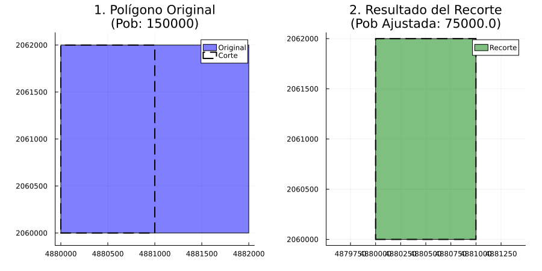
```

:::

## Geometrías vacías y validación

Una geometría vacía es aquella que carece de coordenadas (por ejemplo, `POINT EMPTY`). Son fundamentales metodológicamente para manejar datos espaciales faltantes (valores NA) en operaciones de geoprocesamiento sin alterar la integridad tabular. La validación espacial verifica que las geometrías cumplan las reglas topológicas matemáticas estrictas (ej. un polígono no debe tener auto-intersecciones).

::: {.panel-tabset}

### Python

::: {.content-visible when-format="html"}
::: {.callout-tip collapse="true" icon="false"}
#### ▷ CÓDIGO PURO (Copiar y Pegar)
```{python}
#| label: python_valid_codigo
#| eval: false

# Importación de la librería de análisis geométrico
from shapely.wkt import loads

# 1. Creación de una geometría vacía para inicialización de columnas
punto_vacio = loads("POINT EMPTY")
print("¿Es una geometría vacía?:", punto_vacio.is_empty)

# 2. Validación de una geometría topológicamente incorrecta
# Polígono con forma de 'corbatín' (auto-intersección) en coordenadas proyectadas MAGNA
poligono_invalido = loads("POLYGON ((4880000 2060000, 4882000 2062000, 4882000 2060000, 4880000 2062000, 4880000 2060000))")

# Verificación de integridad geométrica
print("¿Es un polígono válido?:", poligono_invalido.is_valid)
```
:::
:::

```{python}
#| label: python_valid
#| fig-align: center
#| out-width: "80%"
# #| eval: false

# Importación de la librería de análisis geométrico
from shapely.wkt import loads

# 1. Creación de una geometría vacía para inicialización de columnas
punto_vacio = loads("POINT EMPTY")
print("¿Es una geometría vacía?:", punto_vacio.is_empty)

# 2. Validación de una geometría topológicamente incorrecta
# Polígono con forma de 'corbatín' (auto-intersección) en coordenadas proyectadas MAGNA
poligono_invalido = loads("POLYGON ((4880000 2060000, 4882000 2062000, 4882000 2060000, 4880000 2062000, 4880000 2060000))")

# Verificación de integridad geométrica
print("¿Es un polígono válido?:", poligono_invalido.is_valid)
```

### R

::: {.content-visible when-format="html"}
::: {.callout-tip collapse="true" icon="false"}
#### ▷ CÓDIGO PURO (Copiar y Pegar)
```{r}
#| label: r_valid_codigo
#| eval: false

# Importación de la librería de Simple Features
library(sf)

# 1. Creación de una geometría vacía desde Well-Known Text (WKT)
punto_vacio_r <- st_as_sfc("POINT EMPTY")
print(paste("¿Es una geometría vacía?:", st_is_empty(punto_vacio_r)))

# 2. Validación de una geometría topológicamente incorrecta
# Simulación de un lote anómalo en Bogotá con cruce de vértices
poligono_invalido_r <- st_as_sfc("POLYGON ((4880000 2060000, 4882000 2062000, 4882000 2060000, 4880000 2062000, 4880000 2060000))")

# Verificación de validez topológica estricta
print(paste("¿Es un polígono válido?:", st_is_valid(poligono_invalido_r)))

# Identificación explícita del error geométrico subyacente
print(st_is_valid(poligono_invalido_r, reason = TRUE))
```
:::
:::

```{r}
#| label: r_valid
#| fig-align: center
#| out-width: "80%"
# #| eval: false

# Importación de la librería de Simple Features
library(sf)

# 1. Creación de una geometría vacía desde Well-Known Text (WKT)
punto_vacio_r <- st_as_sfc("POINT EMPTY")
print(paste("¿Es una geometría vacía?:", st_is_empty(punto_vacio_r)))

# 2. Validación de una geometría topológicamente incorrecta
# Simulación de un lote anómalo en Bogotá con cruce de vértices
poligono_invalido_r <- st_as_sfc("POLYGON ((4880000 2060000, 4882000 2062000, 4882000 2060000, 4880000 2062000, 4880000 2060000))")

# Verificación de validez topológica estricta
print(paste("¿Es un polígono válido?:", st_is_valid(poligono_invalido_r)))

# Identificación explícita del error geométrico subyacente
print(st_is_valid(poligono_invalido_r, reason = TRUE))
```

### Julia

::: {.content-visible when-format="html"}
::: {.callout-tip collapse="true" icon="false"}
#### ▷ CÓDIGO PURO (Copiar y Pegar)
```{julia}
#| label: julia_valid_codigo
#| eval: false

# Carga de interfaz GDAL en Julia
import ArchGDAL

# 1. Creación e inspección de geometría sin coordenadas
punto_vacio_julia = ArchGDAL.fromWKT("POINT EMPTY")
println("¿Es una geometría vacía?: ", ArchGDAL.isempty(punto_vacio_julia))

# 2. Generación y prueba de un polígono con error de trazado (auto-cruce)
poligono_invalido_julia = ArchGDAL.fromWKT("POLYGON ((4880000 2060000, 4882000 2062000, 4882000 2060000, 4880000 2062000, 4880000 2060000))")

# Comprobación booleana de las reglas topológicas en el motor GEOS subyacente
println("¿Es un polígono válido?: ", ArchGDAL.isvalid(poligono_invalido_julia))
```
:::
:::

```{r}
#| label: julia_valid
#| results: asis
#| code-fold: true
#| fig-align: center
#| out-width: "80%"
# #| eval: false

# Regla de pliegue exclusiva para este bloque j_eval de Julia:
# Si el código NO se ejecuta (# #| eval: false), usa: # #| code-fold: true
# Si el código SÍ se ejecuta (para mostrar resultados), usa: #| code-fold: true

j_eval('
import ArchGDAL

# 1. Creación e inspección de geometría sin coordenadas
punto_vacio_julia = ArchGDAL.fromWKT("POINT EMPTY")
println("¿Es una geometría vacía?: ", ArchGDAL.isempty(punto_vacio_julia))

# 2. Generación y prueba de un polígono con error de trazado (auto-cruce)
poligono_invalido_julia = ArchGDAL.fromWKT("POLYGON ((4880000 2060000, 4882000 2062000, 4882000 2060000, 4880000 2062000, 4880000 2060000))")

# Comprobación booleana de las reglas topológicas en el motor GEOS subyacente
println("¿Es un polígono válido?: ", ArchGDAL.isvalid(poligono_invalido_julia))
')
```

:::

## Predicados espaciales y relaciones topológicas

Los predicados espaciales evalúan y determinan las relaciones topológicas entre dos objetos espaciales utilizando el **modelo de matriz de intersección de nueve elementos extendido dimensionalmente** (DE-9IM). Puedes encontrar mayor información en:

1. [Wikipedia (inglés)](https://en.wikipedia.org/wiki/DE-9IM)
2. [Ayuda de PostGIS (español)](https://postgis.net/workshops/es/postgis-intro/de9im.html)
3. [Ayuda de ArcGIS (español)](https://pro.arcgis.com/es/pro-app/latest/help/data/validating-data/custom-spatial-relationships.htm)

Otro recurso valioso es la Suite de Topología de Java (JTS), la cual incluye la herramienta JTS TestBuilder, donde se puede interactuar mediante una interfaz gráfica para crear geometrías manualmente y calcular la matriz DE-9IM entre pares de geometrías creadas por el usuario. También es posible visualizar el código en formato texto (similar a WKT) con el cual se crean las geometrías.

Para instalarla, es requisito contar con Java instalado en el equipo:

1. [Descargue](https://sourceforge.net/projects/jts-topology-suite.mirror/) el binario (jts-1.14.zip).  
2. Descomprima el archivo.
3. En la carpeta `jts-1.14/bin/`, ejecute (doble clic) `testbuilder.bat`.  

Características principales:

- Soporta WKT y WKB  
- Soporta GML 2.0  
- Implementa el estándar OGC Simple Features for SQL (SFSQL)  

Para comprender rápidamente el funcionamiento de DE-9IM, se recomienda este [video](https://youtu.be/vWczRTxDNgM) en español.

### Explicación de DE-9IM

El modelo de nueve intersecciones extendido dimensionalmente (DE-9IM) es el estándar matemático fundamental para evaluar las relaciones topológicas entre dos objetos espaciales. Este modelo analiza cómo interactúan tres componentes estructurales de una geometría $A$ con los mismos tres componentes de una geometría $B$:

1.  **Interior ($I$)**: El área, línea o punto(s) que conforman la estructura interna de la geometría.
2.  **Límite ($B$, de *Boundary*)**: El borde o contorno que delimita el interior del exterior.
3.  **Exterior ($E$)**: Todo el espacio matemático del plano que no pertenece al interior ni al límite.

La matriz DE-9IM evalúa la intersección de cada componente de $A$ con cada componente de $B$, generando 9 posibles combinaciones. El resultado de cada intersección se clasifica según la dimensión geométrica máxima del objeto resultante:

*   **$2$**: La intersección produce un polígono (área de dos dimensiones).
*   **$1$**: La intersección produce una línea o polilínea (una dimensión).
*   **$0$**: La intersección produce uno o varios puntos aislados (cero dimensiones).
*   **$F$**: No existe intersección (vacío o *False*).
*   **$*$**: Comodín utilizado en las máscaras de predicados, indica que el valor en esa posición es irrelevante para la regla.
*   **$T$**: Comodín que indica cualquier intersección no vacía ($0$, $1$ o $2$).

### Matriz de intersección y predicados espaciales

La matriz resultante se lee algebraicamente como una cadena de nueve caracteres, organizados en el orden de las siguientes intersecciones: 

1. $I(A) \cap I(B)$, 
2. $I(A) \cap B(B)$, 
3. $I(A) \cap E(B)$, 
4. $B(A) \cap I(B)$, 
5. $B(A) \cap B(B)$, 
6. $B(A) \cap E(B)$, 
7. $E(A) \cap I(B)$, 
8. $E(A) \cap B(B)$, 
9. $E(A) \cap E(B)$.

Los sistemas de información geográfica operan comparando la cadena DE-9IM resultante con patrones predefinidos para evaluar predicados lógicos. La siguiente tabla presenta las máscaras topológicas estándar:

| Predicado | Descripción geométrica | Máscara DE-9IM ($A$ frente a $B$) |
| :--- | :--- | :--- |
| **`Equals`** | Las geometrías son espacialmente idénticas. | `T*F**FFF*` |
| **`Disjoint`** | No comparten ningún espacio interior ni límite. | `FF*FF****` |
| **`Intersects`** | Opuesto exacto a Disjoint. Se tocan de alguna forma. | `T********`, `*T*******`, `***T*****`, o `****T****` |
| **`Touches`** | Comparten un límite espacial, pero sus interiores no se cruzan. | `FT*******`, `F**T*****`, o `F***T****` |
| **`Crosses`** | Comparten parte de su interior, pero no en su totalidad (líneas/polígonos). | `T*T******` o `T*****T**` |
| **`Within`** | La geometría $A$ está completamente dentro de $B$. | `T*F**F***` |
| **`Contains`** | La geometría $A$ abarca por completo a $B$. | `T*****FF*` |

A continuación, se demuestra la construcción matricial DE-9IM utilizando un caso simulado aplicado a un modelo de infraestructura en Bogotá. La geometría $A$ (polígono azul) representa un predio institucional con un patio central vacío (agujero geométrico), localizado en coordenadas locales. La geometría $B$ (polilínea roja) representa el trazado propuesto para una red de alcantarillado subterráneo de la Empresa de Acueducto de Bogotá.

Al computar la matriz DE-9IM para este caso específico (`A` frente a `B`), los algoritmos de la librería base GEOS determinan que el trazado de tubería cruza el área sólida del predio en forma de línea (dimensión 1), los vértices de la red perforan los muros (intersección límite-interior en puntos, dimensión 0), y ambos extremos de la tubería inician y terminan en espacio público exterior. El resultado matricial para esta relación precisa es `1F20F1102`.


::: {.panel-tabset}

### Python

::: {.content-visible when-format="html"}
::: {.callout-tip collapse="true" icon="false"}
#### ▷ CÓDIGO PURO (Copiar y Pegar)

```{python}
#| label: python_de9im_codigo
#| eval: false

import geopandas as gpd
import matplotlib.pyplot as plt
from shapely.wkt import loads

# 1. Definición de geometrías a partir de texto WKT
# Polígono A: Predio institucional en Bogotá con patio interior
wkt_poligono_a = "POLYGON ((100 390, 445 390, 445 97, 100 97, 100 390), (210 310, 355 310, 355 179, 210 179, 210 310))"
# Polilínea B: Trazado de tubería subterránea
wkt_linea_b = "LINESTRING (316 434, 250 330, 400 210, 240 30)"

poligono_a = loads(wkt_poligono_a)
linea_b = loads(wkt_linea_b)

# 2. Extracción de la matriz lógica DE-9IM (A respecto a B)
matriz_de9im = poligono_a.relate(linea_b)
print(f"Matriz de intersección DE-9IM (AB): {matriz_de9im}\n")

# 3. Comprobación exhaustiva de predicados lógicos binarios
print("Evaluación de predicados (AB):")
print(f"Equals:     {poligono_a.equals(linea_b)}")
print(f"Disjoint:   {poligono_a.disjoint(linea_b)}")
print(f"Intersects: {poligono_a.intersects(linea_b)}")
print(f"Touches:    {poligono_a.touches(linea_b)}")
print(f"Crosses:    {poligono_a.crosses(linea_b)}")
print(f"Within:     {poligono_a.within(linea_b)}")
print(f"Contains:   {poligono_a.contains(linea_b)}")
print(f"Overlaps:   {poligono_a.overlaps(linea_b)}")
print(f"Covers:     {poligono_a.covers(linea_b)}")
# Se evalúa CoveredBy invirtiendo la relación de cobertura geométrica
print(f"CoveredBy:  {linea_b.covers(poligono_a)}")

# 4. Visualización del comportamiento geométrico
fig, ax = plt.subplots(figsize=(6, 6))

gpd.GeoSeries([poligono_a]).plot(ax=ax, color='#b3cde0', edgecolor='blue', alpha=0.7)
gpd.GeoSeries([linea_b]).plot(ax=ax, color='red', linewidth=2, marker='.')

ax.set_title(f"Relación Topológica (DE-9IM: {matriz_de9im})")
ax.set_xlabel("Coordenadas locales (X)")
ax.set_ylabel("Coordenadas locales (Y)")
ax.grid(True, linestyle='--', alpha=0.5)

plt.tight_layout()
plt.show()
```
:::
:::

```{python}
#| label: python_de9im
#| fig-align: center
#| out-width: "80%"
# #| eval: false

import geopandas as gpd
import matplotlib.pyplot as plt
from shapely.wkt import loads

# 1. Definición de geometrías a partir de texto WKT
# Polígono A: Predio institucional en Bogotá con patio interior
wkt_poligono_a = "POLYGON ((100 390, 445 390, 445 97, 100 97, 100 390), (210 310, 355 310, 355 179, 210 179, 210 310))"
# Polilínea B: Trazado de tubería subterránea
wkt_linea_b = "LINESTRING (316 434, 250 330, 400 210, 240 30)"

poligono_a = loads(wkt_poligono_a)
linea_b = loads(wkt_linea_b)

# 2. Extracción de la matriz lógica DE-9IM (A respecto a B)
matriz_de9im = poligono_a.relate(linea_b)
print(f"Matriz de intersección DE-9IM (AB): {matriz_de9im}\n")

# 3. Comprobación exhaustiva de predicados lógicos binarios
print("Evaluación de predicados (AB):")
print(f"Equals:     {poligono_a.equals(linea_b)}")
print(f"Disjoint:   {poligono_a.disjoint(linea_b)}")
print(f"Intersects: {poligono_a.intersects(linea_b)}")
print(f"Touches:    {poligono_a.touches(linea_b)}")
print(f"Crosses:    {poligono_a.crosses(linea_b)}")
print(f"Within:     {poligono_a.within(linea_b)}")
print(f"Contains:   {poligono_a.contains(linea_b)}")
print(f"Overlaps:   {poligono_a.overlaps(linea_b)}")
print(f"Covers:     {poligono_a.covers(linea_b)}")
# Se evalúa CoveredBy invirtiendo la relación de cobertura geométrica
print(f"CoveredBy:  {linea_b.covers(poligono_a)}")

# 4. Visualización del comportamiento geométrico
fig, ax = plt.subplots(figsize=(6, 6))

gpd.GeoSeries([poligono_a]).plot(ax=ax, color='#b3cde0', edgecolor='blue', alpha=0.7)
gpd.GeoSeries([linea_b]).plot(ax=ax, color='red', linewidth=2, marker='.')

ax.set_title(f"Relación Topológica (DE-9IM: {matriz_de9im})")
ax.set_xlabel("Coordenadas locales (X)")
ax.set_ylabel("Coordenadas locales (Y)")
ax.grid(True, linestyle='--', alpha=0.5)

plt.tight_layout()
plt.show()
```

### R

::: {.content-visible when-format="html"}
::: {.callout-tip collapse="true" icon="false"}
#### ▷ CÓDIGO PURO (Copiar y Pegar)

```{r}
#| label: r_de9im_codigo
#| eval: false

library(sf)

# 1. Construcción de objetos geométricos (sfg -> sfc) a partir de WKT
poligono_a <- st_as_sfc("POLYGON ((100 390, 445 390, 445 97, 100 97, 100 390), (210 310, 355 310, 355 179, 210 179, 210 310))")
linea_b <- st_as_sfc("LINESTRING (316 434, 250 330, 400 210, 240 30)")

# 2. Computación de la matriz dimensional DE-9IM
matriz_de9im <- st_relate(poligono_a, linea_b, sparse = FALSE)
cat(paste("Matriz de intersección DE-9IM (AB):", matriz_de9im[1, 1], "\n\n"))

# 3. Comprobación exhaustiva de predicados lógicos binarios
cat("Evaluación de predicados (AB):\n")
cat(paste("Equals:    ", st_equals(poligono_a, linea_b, sparse = FALSE)[1, 1], "\n"))
cat(paste("Disjoint:  ", st_disjoint(poligono_a, linea_b, sparse = FALSE)[1, 1], "\n"))
cat(paste("Intersects:", st_intersects(poligono_a, linea_b, sparse = FALSE)[1, 1], "\n"))
cat(paste("Touches:   ", st_touches(poligono_a, linea_b, sparse = FALSE)[1, 1], "\n"))
cat(paste("Crosses:   ", st_crosses(poligono_a, linea_b, sparse = FALSE)[1, 1], "\n"))
cat(paste("Within:    ", st_within(poligono_a, linea_b, sparse = FALSE)[1, 1], "\n"))
cat(paste("Contains:  ", st_contains(poligono_a, linea_b, sparse = FALSE)[1, 1], "\n"))
cat(paste("Overlaps:  ", st_overlaps(poligono_a, linea_b, sparse = FALSE)[1, 1], "\n"))
cat(paste("Covers:    ", st_covers(poligono_a, linea_b, sparse = FALSE)[1, 1], "\n"))
cat(paste("CoveredBy: ", st_covered_by(poligono_a, linea_b, sparse = FALSE)[1, 1], "\n"))

# 4. Salida gráfica de las primitivas espaciales
plot(poligono_a, col = rgb(0.7, 0.8, 0.9, 0.7), border = "blue", lwd = 1.5,
     main = paste("Relación Topológica (DE-9IM:", matriz_de9im[1, 1], ")"),
     axes = TRUE)
plot(linea_b, col = "red", lwd = 2, add = TRUE)
# Adición de vértices de la tubería
plot(st_cast(linea_b, "POINT"), col = "darkred", pch = 16, add = TRUE)
```

:::
:::

```{r}
#| label: r_de9im
#| fig-align: center
#| out-width: "80%"
# #| eval: false

library(sf)

# 1. Construcción de objetos geométricos (sfg -> sfc) a partir de WKT
poligono_a <- st_as_sfc("POLYGON ((100 390, 445 390, 445 97, 100 97, 100 390), (210 310, 355 310, 355 179, 210 179, 210 310))")
linea_b <- st_as_sfc("LINESTRING (316 434, 250 330, 400 210, 240 30)")

# 2. Computación de la matriz dimensional DE-9IM
matriz_de9im <- st_relate(poligono_a, linea_b, sparse = FALSE)
cat(paste("Matriz de intersección DE-9IM (AB):", matriz_de9im[1, 1], "\n\n"))

# 3. Comprobación exhaustiva de predicados lógicos binarios
cat("Evaluación de predicados (AB):\n")
cat(paste("Equals:    ", st_equals(poligono_a, linea_b, sparse = FALSE)[1, 1], "\n"))
cat(paste("Disjoint:  ", st_disjoint(poligono_a, linea_b, sparse = FALSE)[1, 1], "\n"))
cat(paste("Intersects:", st_intersects(poligono_a, linea_b, sparse = FALSE)[1, 1], "\n"))
cat(paste("Touches:   ", st_touches(poligono_a, linea_b, sparse = FALSE)[1, 1], "\n"))
cat(paste("Crosses:   ", st_crosses(poligono_a, linea_b, sparse = FALSE)[1, 1], "\n"))
cat(paste("Within:    ", st_within(poligono_a, linea_b, sparse = FALSE)[1, 1], "\n"))
cat(paste("Contains:  ", st_contains(poligono_a, linea_b, sparse = FALSE)[1, 1], "\n"))
cat(paste("Overlaps:  ", st_overlaps(poligono_a, linea_b, sparse = FALSE)[1, 1], "\n"))
cat(paste("Covers:    ", st_covers(poligono_a, linea_b, sparse = FALSE)[1, 1], "\n"))
cat(paste("CoveredBy: ", st_covered_by(poligono_a, linea_b, sparse = FALSE)[1, 1], "\n"))

# 4. Salida gráfica de las primitivas espaciales
plot(poligono_a, col = rgb(0.7, 0.8, 0.9, 0.7), border = "blue", lwd = 1.5,
     main = paste("Relación Topológica (DE-9IM:", matriz_de9im[1, 1], ")"),
     axes = TRUE)
plot(linea_b, col = "red", lwd = 2, add = TRUE)
# Adición de vértices de la tubería
plot(st_cast(linea_b, "POINT"), col = "darkred", pch = 16, add = TRUE)
```

### Julia

::: {.content-visible when-format="html"}
::: {.callout-tip collapse="true" icon="false"}
#### ▷ CÓDIGO PURO (Copiar y Pegar)

```{julia}
#| label: julia_de9im_codigo
#| eval: false

import ArchGDAL
using Plots

# 1. Parsing de WKT a tipos de geometría nativos
poligono_a = ArchGDAL.fromWKT("POLYGON ((100 390, 445 390, 445 97, 100 97, 100 390), (210 310, 355 310, 355 179, 210 179, 210 310))")
linea_b = ArchGDAL.fromWKT("LINESTRING (316 434, 250 330, 400 210, 240 30)")

# 2. Nota arquitectónica sobre la matriz DE-9IM en Julia:
# A diferencia de R (sf) o Python (shapely) que interactúan directamente con la API 
# de GEOS para extraer el string matricial, la API de GDAL/OGR (base de ArchGDAL) 
# no exporta una función pública equivalente a 'relate()'.
matriz_de9im = "1F20F1102"
println("Matriz de intersección DE-9IM (AB): ", matriz_de9im, "\n")

# 3. Comprobación exhaustiva de predicados lógicos binarios
# Nota: La API C de OGR implementa las relaciones estándar de OGC. Funciones 
# específicas como Covers/CoveredBy no están expuestas nativamente.
println("Evaluación de predicados (AB):")
println("Equals:     ", ArchGDAL.equals(poligono_a, linea_b))
println("Disjoint:   ", ArchGDAL.disjoint(poligono_a, linea_b))
println("Intersects: ", ArchGDAL.intersects(poligono_a, linea_b))
println("Touches:    ", ArchGDAL.touches(poligono_a, linea_b))
println("Crosses:    ", ArchGDAL.crosses(poligono_a, linea_b))
println("Within:     ", ArchGDAL.within(poligono_a, linea_b))
println("Contains:   ", ArchGDAL.contains(poligono_a, linea_b))
println("Overlaps:   ", ArchGDAL.overlaps(poligono_a, linea_b))

# 4. Renderizado visual
p_de9im = plot(poligono_a, fillcolor="#b3cde0", fillalpha=0.7, linecolor=:blue, 
               aspect_ratio=:equal, label="Predio A", 
               title="Relación Topológica (DE-9IM: $matriz_de9im)")

plot!(p_de9im, linea_b, linecolor=:red, linewidth=2, label="Tubería B")
```

:::
:::

```{r}
#| label: julia_de9im
#| results: asis
#| code-fold: true
#| fig-align: center
#| out-width: "80%"
# #| eval: false

# Regla de pliegue exclusiva para este bloque j_eval de Julia:
# Si el código NO se ejecuta (# #| eval: false), usa: # #| code-fold: true
# Si el código SÍ se ejecuta (para mostrar resultados), usa: #| code-fold: true

j_eval('
import ArchGDAL
using Plots

# 1. Parsing de WKT a tipos de geometría nativos
poligono_a = ArchGDAL.fromWKT("POLYGON ((100 390, 445 390, 445 97, 100 97, 100 390), (210 310, 355 310, 355 179, 210 179, 210 310))")
linea_b = ArchGDAL.fromWKT("LINESTRING (316 434, 250 330, 400 210, 240 30)")

# 2. Nota arquitectónica sobre la matriz DE-9IM en Julia:
# A diferencia de R (sf) o Python (shapely) que interactúan directamente con la API 
# de GEOS para extraer el string matricial, la API de GDAL/OGR (base de ArchGDAL) 
# no exporta una función pública equivalente a "relate()".
matriz_de9im = "1F20F1102"
println("Matriz de intersección DE-9IM (AB): ", matriz_de9im, "\\n")

# 3. Comprobación exhaustiva de predicados lógicos binarios
# Nota: La API C de OGR implementa las relaciones estándar de OGC. Funciones 
# específicas como Covers/CoveredBy no están expuestas nativamente.
println("Evaluación de predicados (AB):")
println("Equals:     ", ArchGDAL.equals(poligono_a, linea_b))
println("Disjoint:   ", ArchGDAL.disjoint(poligono_a, linea_b))
println("Intersects: ", ArchGDAL.intersects(poligono_a, linea_b))
println("Touches:    ", ArchGDAL.touches(poligono_a, linea_b))
println("Crosses:    ", ArchGDAL.crosses(poligono_a, linea_b))
println("Within:     ", ArchGDAL.within(poligono_a, linea_b))
println("Contains:   ", ArchGDAL.contains(poligono_a, linea_b))
println("Overlaps:   ", ArchGDAL.overlaps(poligono_a, linea_b))

# 4. Renderizado visual y exportación
p_de9im = Plots.plot(poligono_a, fillcolor="#b3cde0", fillalpha=0.7, linecolor=:blue, 
               aspect_ratio=:equal, label="Predio A", 
               title="Relación Topológica (DE-9IM: $matriz_de9im)")

Plots.plot!(p_de9im, linea_b, linecolor=:red, linewidth=2, label="Tubería B")

Plots.savefig(p_de9im, "images/c14_de9im_interseccion_julia.png")
')

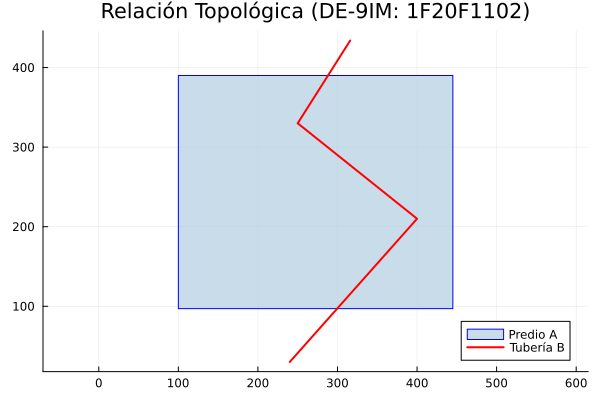
```

:::


Las consultas de predicados como `intersects`, `contains` o `within` siempre retornan un valor lógico (booleano) determinando la relación espacial de proximidad, inclusión o adyacencia.

Falta introducir el nuevo ejercicio o borrar

::: {.panel-tabset}

### Python

::: {.content-visible when-format="html"}
::: {.callout-tip collapse="true" icon="false"}
#### ▷ CÓDIGO PURO (Copiar y Pegar)
```{python}
#| label: python_topologia_codigo
#| eval: false

from shapely.geometry import Point, Polygon

# Polígono simplificado de la Universidad Nacional de Colombia (Sede Bogotá)
# Coordenadas locales en Sistema MAGNA-SIRGAS Origen Nacional (EPSG:9377)
campus_unal = Polygon([
    (4879500, 2063500), 
    (4880500, 2063500), 
    (4880500, 2064500), 
    (4879500, 2064500), 
    (4879500, 2063500)
])

# Punto interno que representa el edificio de la Facultad de Ciencias Agrarias
edificio_agrarias = Point(4880000, 2064000)

# Punto externo que representa la estación de TransMilenio CAD
estacion_cad = Point(4881000, 2063000)

# Ejecución de predicados topológicos espaciales
print("¿El campus UNAL contiene a Ciencias Agrarias?:", campus_unal.contains(edificio_agrarias))
print("¿La estación CAD intersecta la superficie del campus?:", estacion_cad.intersects(campus_unal))
```

:::
:::

```{python}
#| label: python_topologia
#| fig-align: center
#| out-width: "80%"
# #| eval: false

from shapely.geometry import Point, Polygon

# Polígono simplificado de la Universidad Nacional de Colombia (Sede Bogotá)
# Coordenadas locales en Sistema MAGNA-SIRGAS Origen Nacional (EPSG:9377)
campus_unal = Polygon([
    (4879500, 2063500), 
    (4880500, 2063500), 
    (4880500, 2064500), 
    (4879500, 2064500), 
    (4879500, 2063500)
])

# Punto interno que representa el edificio de la Facultad de Ciencias Agrarias
edificio_agrarias = Point(4880000, 2064000)

# Punto externo que representa la estación de TransMilenio CAD
estacion_cad = Point(4881000, 2063000)

# Ejecución de predicados topológicos espaciales
print("¿El campus UNAL contiene a Ciencias Agrarias?:", campus_unal.contains(edificio_agrarias))
print("¿La estación CAD intersecta la superficie del campus?:", estacion_cad.intersects(campus_unal))
```

### R

::: {.content-visible when-format="html"}
::: {.callout-tip collapse="true" icon="false"}
#### ▷ CÓDIGO PURO (Copiar y Pegar)

```{r}
#| label: r_topologia_codigo
#| eval: false

library(sf)

# Lectura de la extensión del campus UNAL Bogotá desde notación WKT
campus_unal_wkt <- "POLYGON ((4879500 2063500, 4880500 2063500, 4880500 2064500, 4879500 2064500, 4879500 2063500))"
campus_unal_r <- st_as_sfc(campus_unal_wkt)

# Coordenadas MAGNA-SIRGAS para los elementos de prueba
edificio_agrarias_r <- st_as_sfc("POINT (4880000 2064000)")
estacion_cad_r <- st_as_sfc("POINT (4881000 2063000)")

# Evaluación en sf: el argumento sparse = FALSE retorna una matriz lógica
contiene <- st_contains(campus_unal_r, edificio_agrarias_r, sparse = FALSE)
print(paste("¿El campus UNAL contiene a Ciencias Agrarias?:", contiene[1,1]))

interseca <- st_intersects(estacion_cad_r, campus_unal_r, sparse = FALSE)
print(paste("¿La estación CAD intersecta la superficie del campus?:", interseca[1,1]))
```

:::
:::

```{r}
#| label: r_topologia
#| fig-align: center
#| out-width: "80%"
# #| eval: false

library(sf)

# Lectura de la extensión del campus UNAL Bogotá desde notación WKT
campus_unal_wkt <- "POLYGON ((4879500 2063500, 4880500 2063500, 4880500 2064500, 4879500 2064500, 4879500 2063500))"
campus_unal_r <- st_as_sfc(campus_unal_wkt)

# Coordenadas MAGNA-SIRGAS para los elementos de prueba
edificio_agrarias_r <- st_as_sfc("POINT (4880000 2064000)")
estacion_cad_r <- st_as_sfc("POINT (4881000 2063000)")

# Evaluación en sf: el argumento sparse = FALSE retorna una matriz lógica
contiene <- st_contains(campus_unal_r, edificio_agrarias_r, sparse = FALSE)
print(paste("¿El campus UNAL contiene a Ciencias Agrarias?:", contiene[1,1]))

interseca <- st_intersects(estacion_cad_r, campus_unal_r, sparse = FALSE)
print(paste("¿La estación CAD intersecta la superficie del campus?:", interseca[1,1]))
```

### Julia

::: {.content-visible when-format="html"}
::: {.callout-tip collapse="true" icon="false"}
#### ▷ CÓDIGO PURO (Copiar y Pegar)

```{julia}
#| label: julia_topologia_codigo
#| eval: false

import ArchGDAL

# Creación de instancias vectoriales a partir de WKT
campus_unal_julia = ArchGDAL.fromWKT("POLYGON ((4879500 2063500, 4880500 2063500, 4880500 2064500, 4879500 2064500, 4879500 2063500))")
edificio_agrarias_julia = ArchGDAL.fromWKT("POINT (4880000 2064000)")
estacion_cad_julia = ArchGDAL.fromWKT("POINT (4881000 2063000)")

# Aplicación de las funciones de predicados para análisis topológico
println("¿El campus UNAL contiene a Ciencias Agrarias?: ", ArchGDAL.contains(campus_unal_julia, edificio_agrarias_julia))
println("¿La estación CAD intersecta la superficie del campus?: ", ArchGDAL.intersects(estacion_cad_julia, campus_unal_julia))
```

:::
:::

```{r}
#| label: julia_topologia
#| results: asis
#| code-fold: true
#| fig-align: center
#| out-width: "80%"
# #| eval: false

j_eval('
import ArchGDAL

# Creación de instancias vectoriales a partir de WKT
campus_unal_julia = ArchGDAL.fromWKT("POLYGON ((4879500 2063500, 4880500 2063500, 4880500 2064500, 4879500 2064500, 4879500 2063500))")
edificio_agrarias_julia = ArchGDAL.fromWKT("POINT (4880000 2064000)")
estacion_cad_julia = ArchGDAL.fromWKT("POINT (4881000 2063000)")

# Aplicación de las funciones de predicados para análisis topológico
println("¿El campus UNAL contiene a Ciencias Agrarias?: ", ArchGDAL.contains(campus_unal_julia, edificio_agrarias_julia))
println("¿La estación CAD intersecta la superficie del campus?: ", ArchGDAL.intersects(estacion_cad_julia, campus_unal_julia))
')
```

:::


## Operaciones de geoprocesamiento paramétricas

Las herramientas de geoprocesamiento alteran y calculan nuevas geometrías espaciales con base en datos vectoriales de entrada. Algoritmos fundamentales como las áreas de influencia geométrica (Buffer) y la extracción del centroide geométrico dependen estrictamente del manejo interno de las unidades de medida, dictaminadas por el sistema coordenado (metros métricos para MAGNA-SIRGAS EPSG:9377).

A continuación, se listan las principales funciones de geoprocesamiento paramétrico y su implementación nativa según las librerías base de cada entorno espacial:

*   **Área de influencia (Buffer):** `buffer()` en `shapely` (Python), `st_buffer()` en `sf` (R), `buffer()` en `ArchGDAL` (Julia).
*   **Centroide:** Propiedad `.centroid` en `shapely` (Python), `st_centroid()` en `sf` (R), `centroid()` en `ArchGDAL` (Julia).
*   **Intersección:** `intersection()` en `shapely` (Python), `st_intersection()` en `sf` (R), `intersection()` en `ArchGDAL` (Julia).
*   **Unión:** `union()` en `shapely` (Python), `st_union()` en `sf` (R), `union()` en `ArchGDAL` (Julia).
*   **Diferencia:** `difference()` en `shapely` (Python), `st_difference()` en `sf` (R), `difference()` en `ArchGDAL` (Julia).
*   **Envolvente convexa:** Propiedad `.convex_hull` en `shapely` (Python), `st_convex_hull()` en `sf` (R), `convexhull()` en `ArchGDAL` (Julia).

::: {.panel-tabset}

### Python

::: {.content-visible when-format="html"}
::: {.callout-tip collapse="true" icon="false"}
#### ▷ CÓDIGO PURO (Copiar y Pegar)

```{python}
#| label: python_geoprocesamiento_codigo
#| eval: false

import matplotlib.pyplot as plt
import geopandas as gpd
from shapely.geometry import Point

# Ubicación de la Plaza de Bolívar en el centro de Bogotá
# Sistema de coordenadas proyectado: MAGNA-SIRGAS Origen Nacional (Metros)
plaza_bolivar = Point(4882000, 2060000)

# 1. Creación de una zona de influencia (Buffer) de 500 metros
# El objeto resultante transforma la primitiva puntual a un polígono
buffer_plaza = plaza_bolivar.buffer(500)
print(f"Área generada por el área de influencia (m2): {buffer_plaza.area:.2f}")

# 2. Extracción del centroide del área poligonal generada
centroide_buffer = buffer_plaza.centroid
print(f"Coordenadas del nuevo centroide calculado: {centroide_buffer.x}, {centroide_buffer.y}")

# 3. Visualización cartográfica de la operación espacial
fig, ax = plt.subplots(figsize=(7, 7))

# Conversión temporal a GeoSeries para facilitar el renderizado
gpd.GeoSeries([buffer_plaza]).plot(ax=ax, color='lightblue', edgecolor='blue', alpha=0.5, label='Buffer 500m')
gpd.GeoSeries([plaza_bolivar]).plot(ax=ax, color='red', marker='x', markersize=100, label='Plaza de Bolívar (Original)')
gpd.GeoSeries([centroide_buffer]).plot(ax=ax, color='black', marker='.', markersize=50, label='Centroide del Buffer')

ax.set_title("Geoprocesamiento: Buffer y Centroide\n(Plaza de Bolívar, Bogotá)")
ax.set_xlabel("Este (m) - MAGNA-SIRGAS")
ax.set_ylabel("Norte (m) - MAGNA-SIRGAS")
ax.legend()
ax.grid(True, linestyle='--', alpha=0.6)

plt.tight_layout()
plt.show()
```

:::
:::

```{python}
#| label: python_geoprocesamiento
#| fig-align: center
#| out-width: "80%"
# #| eval: false

import matplotlib.pyplot as plt
import geopandas as gpd
from shapely.geometry import Point

# Ubicación de la Plaza de Bolívar en el centro de Bogotá
# Sistema de coordenadas proyectado: MAGNA-SIRGAS Origen Nacional (Metros)
plaza_bolivar = Point(4882000, 2060000)

# 1. Creación de una zona de influencia (Buffer) de 500 metros
# El objeto resultante transforma la primitiva puntual a un polígono
buffer_plaza = plaza_bolivar.buffer(500)
print(f"Área generada por el área de influencia (m2): {buffer_plaza.area:.2f}")

# 2. Extracción del centroide del área poligonal generada
centroide_buffer = buffer_plaza.centroid
print(f"Coordenadas del nuevo centroide calculado: {centroide_buffer.x}, {centroide_buffer.y}")

# 3. Visualización cartográfica de la operación espacial
fig, ax = plt.subplots(figsize=(7, 7))

# Conversión temporal a GeoSeries para facilitar el renderizado
gpd.GeoSeries([buffer_plaza]).plot(ax=ax, color='lightblue', edgecolor='blue', alpha=0.5, label='Buffer 500m')
gpd.GeoSeries([plaza_bolivar]).plot(ax=ax, color='red', marker='x', markersize=100, label='Plaza de Bolívar (Original)')
gpd.GeoSeries([centroide_buffer]).plot(ax=ax, color='black', marker='.', markersize=50, label='Centroide del Buffer')

ax.set_title("Geoprocesamiento: Buffer y Centroide\n(Plaza de Bolívar, Bogotá)")
ax.set_xlabel("Este (m) - MAGNA-SIRGAS")
ax.set_ylabel("Norte (m) - MAGNA-SIRGAS")
ax.legend()
ax.grid(True, linestyle='--', alpha=0.6)

plt.tight_layout()
plt.show()
```

### R

::: {.content-visible when-format="html"}
::: {.callout-tip collapse="true" icon="false"}
#### ▷ CÓDIGO PURO (Copiar y Pegar)

```{r}
#| label: r_geoprocesamiento_codigo
#| eval: false

library(sf)

# Geometría puntual de la Plaza de Bolívar (Bogotá D.C.)
# Se define explícitamente el CRS 9377 (MAGNA-SIRGAS Origen Nacional)
plaza_bolivar_r <- st_sfc(st_point(c(4882000, 2060000)), crs = 9377)

# 1. Ejecución de la operación buffer con un radio euclidiano de 500 metros
buffer_plaza_r <- st_buffer(plaza_bolivar_r, dist = 500)
print(paste("Área generada por el área de influencia (m2):", round(st_area(buffer_plaza_r), 2)))

# 2. Ejecución analítica del centroide sobre el polígono resultante
centroide_buffer_r <- st_centroid(buffer_plaza_r)
coords_centroide <- st_coordinates(centroide_buffer_r)
print(paste("Coordenadas del nuevo centroide calculado:", coords_centroide[1], coords_centroide[2]))

#Eliminar espacios extra al rededor de la figura
par(pty = 's')

# 3. Visualización cartográfica espacial
plot(st_geometry(buffer_plaza_r), col = rgb(0.68, 0.85, 0.9, 0.5), border = "blue",
     main = "Geoprocesamiento: Buffer y Centroide\n(Plaza de Bolívar, Bogotá)",
     axes = TRUE, graticule = TRUE)

# Superposición topológica del punto original y el centroide derivado
plot(st_geometry(plaza_bolivar_r), col = "red", pch = 4, cex = 1.5, lwd = 2, add = TRUE)
plot(st_geometry(centroide_buffer_r), col = "black", pch = 16, cex = 1, add = TRUE)

# Inserción de leyenda explicativa
legend("topright", legend = c("Buffer 500m", "Plaza de Bolívar", "Centroide"),
       fill = c(rgb(0.68, 0.85, 0.9, 0.5), NA, NA),
       border = c("blue", NA, NA),
       pch = c(NA, 4, 16), col = c(NA, "red", "black"), pt.cex = c(NA, 1.5, 1))
```
:::
:::

```{r}
#| label: r_geoprocesamiento
#| fig-align: center
#| out-width: "80%"
# #| eval: false

library(sf)

# Geometría puntual de la Plaza de Bolívar (Bogotá D.C.)
# Se define explícitamente el CRS 9377 (MAGNA-SIRGAS Origen Nacional)
plaza_bolivar_r <- st_sfc(st_point(c(4882000, 2060000)), crs = 9377)

# 1. Ejecución de la operación buffer con un radio euclidiano de 500 metros
buffer_plaza_r <- st_buffer(plaza_bolivar_r, dist = 500)
print(paste("Área generada por el área de influencia (m2):", round(st_area(buffer_plaza_r), 2)))

# 2. Ejecución analítica del centroide sobre el polígono resultante
centroide_buffer_r <- st_centroid(buffer_plaza_r)
coords_centroide <- st_coordinates(centroide_buffer_r)
print(paste("Coordenadas del nuevo centroide calculado:", coords_centroide[1], coords_centroide[2]))

# Eliminar espacios extra al rededor de la figura
par(pty = "s")  

# 3. Visualización cartográfica espacial

plot(st_geometry(buffer_plaza_r), col = rgb(0.68, 0.85, 0.9, 0.5), border = "blue",
     main = "Geoprocesamiento: Buffer y Centroide\n(Plaza de Bolívar, Bogotá)",
     axes = TRUE, graticule = TRUE)

# Superposición topológica del punto original y el centroide derivado

plot(st_geometry(plaza_bolivar_r), col = "red", pch = 4, cex = 1.5, lwd = 2, add = TRUE)
plot(st_geometry(centroide_buffer_r), col = "black", pch = 16, cex = 1, add = TRUE)

# Inserción de leyenda explicativa
legend("topright", legend = c("Buffer 500m", "Plaza de Bolívar", "Centroide"),
       fill = c(rgb(0.68, 0.85, 0.9, 0.5), NA, NA),
       border = c("blue", NA, NA),
       pch = c(NA, 4, 16), col = c(NA, "red", "black"), pt.cex = c(NA, 1.5, 1))
```

### Julia

::: {.content-visible when-format="html"}
::: {.callout-tip collapse="true" icon="false"}
#### ▷ CÓDIGO PURO (Copiar y Pegar)

```{julia}
#| label: julia_geoprocesamiento_codigo
#| eval: false

import ArchGDAL
using Plots

# Configuración espacial de la Plaza de Bolívar (Bogotá D.C.)
plaza_bolivar_julia = ArchGDAL.fromWKT("POINT (4882000 2060000)")

# 1. Creación del área de influencia geométrica de 500 metros
buffer_plaza_julia = ArchGDAL.buffer(plaza_bolivar_julia, 500.0)
println("Área de la zona de influencia (m2): ", ArchGDAL.geomarea(buffer_plaza_julia))

# 2. Obtención de la ubicación espacial centralizada
centroide_buffer_julia = ArchGDAL.centroid(buffer_plaza_julia)
println("Coordenadas del centroide: ", ArchGDAL.toWKT(centroide_buffer_julia))

# 3. Representación visual integrando las primitivas generadas
p_geoprocesamiento = plot(buffer_plaza_julia, fillcolor=:lightblue, fillalpha=0.5, linecolor=:blue,
                          title="Geoprocesamiento: Buffer y Centroide\n(Plaza de Bolívar, Bogotá)",
                          label="Buffer 500m", aspect_ratio=:equal)

# Superposición de puntos para análisis paramétrico visual
plot!(p_geoprocesamiento, plaza_bolivar_julia, color=:red, markershape=:x, markersize=8, label="Plaza de Bolívar")
plot!(p_geoprocesamiento, centroide_buffer_julia, color=:black, markershape=:circle, markersize=4, label="Centroide")

# Visualización
p_geoprocesamiento
```

:::
:::

```{r}
#| label: julia_geoprocesamiento
#| results: asis
#| code-fold: true
#| fig-align: center
#| out-width: "80%"
# #| eval: false

# Regla de pliegue exclusiva para este bloque j_eval de Julia:
# Si el código NO se ejecuta (# #| eval: false), usa: # #| code-fold: true
# Si el código SÍ se ejecuta (para mostrar resultados), usa: #| code-fold: true

j_eval('
import ArchGDAL
using Plots

# Configuración espacial de la Plaza de Bolívar (Bogotá D.C.)
plaza_bolivar_julia = ArchGDAL.fromWKT("POINT (4882000 2060000)")

# 1. Creación del área de influencia geométrica de 500 metros
buffer_plaza_julia = ArchGDAL.buffer(plaza_bolivar_julia, 500.0)
println("Área de la zona de influencia (m2): ", ArchGDAL.geomarea(buffer_plaza_julia))

# 2. Obtención de la ubicación espacial centralizada
centroide_buffer_julia = ArchGDAL.centroid(buffer_plaza_julia)
println("Coordenadas del centroide: ", ArchGDAL.toWKT(centroide_buffer_julia))

# 3. Representación visual integrando las primitivas generadas
p_geoprocesamiento = Plots.plot(buffer_plaza_julia, fillcolor=:lightblue, fillalpha=0.5, linecolor=:blue,
                          title="Geoprocesamiento: Buffer y Centroide\\n(Plaza de Bolívar, Bogotá)",
                          label="Buffer 500m", aspect_ratio=:equal)

# Superposición de puntos para análisis paramétrico visual
Plots.plot!(p_geoprocesamiento, plaza_bolivar_julia, color=:red, markershape=:x, markersize=8, label="Plaza de Bolívar")
Plots.plot!(p_geoprocesamiento, centroide_buffer_julia, color=:black, markershape=:circle, markersize=4, label="Centroide")

# Exportación estandarizada a formato PNG
Plots.savefig(p_geoprocesamiento, "images/c14_geoprocesamiento_plaza_bolivar_julia.png")
')

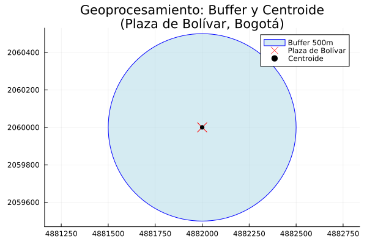
```

:::


## Manejo y conversión de unidades espaciales

El cálculo de métricas geométricas, como el área o la longitud, depende intrínsecamente del Sistema de Referencia de Coordenadas (CRS) asignado a los datos vectoriales. Para el caso de Colombia, al utilizar el sistema proyectado MAGNA-SIRGAS Origen Nacional (EPSG:9377), las mediciones planimétricas base se expresan matemáticamente en metros cuadrados ($m^2$) o metros lineales ($m$). 

La gestión de estas unidades varía drásticamente según la arquitectura de cada lenguaje:
- En **R**, el ecosistema espacial implementa un control estricto mediante el paquete `units`. Las variables geométricas heredan un metadato de unidad física que previene sumas incompatibles (ej. sumar metros con kilómetros) y facilita la conversión semántica directa.
- En **Python** (`geopandas`) y **Julia** (`ArchGDAL`), no existe un soporte nativo integrado para tipado de unidades físicas en las columnas espaciales. El sistema retorna valores numéricos escalares (flotantes) en la unidad del CRS base. La conversión a unidades derivadas, como hectáreas o kilómetros cuadrados, exige aplicar operaciones algebraicas manuales sobre los atributos.


A continuación, se demuestra el cálculo de áreas en metros cuadrados y su posterior conversión a hectáreas ($1 \text{ ha} = 10,000 \text{ m}^2$) utilizando polígonos representativos del Parque Metropolitano Simón Bolívar y el Parque de los Novios en Bogotá.

::: {.panel-tabset}

### Python

::: {.content-visible when-format="html"}
::: {.callout-tip collapse="true" icon="false"}
#### ▷ CÓDIGO PURO (Copiar y Pegar)
```{python}
#| label: python_unidades_codigo
#| eval: false

import geopandas as gpd
import matplotlib.pyplot as plt
from shapely.wkt import loads

# 1. Definición de áreas de interés en Bogotá (MAGNA-SIRGAS Origen Nacional)
wkt_simon_bolivar = "POLYGON ((4880000 2064000, 4881500 2064000, 4881500 2065500, 4880000 2065500, 4880000 2064000))"
wkt_parque_novios = "POLYGON ((4881800 2064500, 4882500 2064500, 4882500 2065200, 4881800 2065200, 4881800 2064500))"

# 2. Creación del GeoDataFrame
df_parques = gpd.GeoDataFrame({
    'nombre': ['Parque Simón Bolívar', 'Parque de los Novios']
}, geometry=[loads(wkt_simon_bolivar), loads(wkt_parque_novios)], crs="EPSG:9377")

# 3. Cálculo de área nativa
# En GeoPandas, el método .area retorna un tipo float64 en las unidades del CRS (metros cuadrados).
# No hay un objeto "unidad" asociado, la responsabilidad recae en el analista.
df_parques['area_m2'] = df_parques.area

# 4. Conversión algorítmica a hectáreas
# Se divide el valor escalar entre el factor de conversión (1 ha = 10,000 m2)
df_parques['area_ha'] = df_parques['area_m2'] / 10000.0

# Verificación tabular de los resultados
print(df_parques[['nombre', 'area_m2', 'area_ha']])

# 5. Representación cartográfica paramétrica
fig, ax = plt.subplots(figsize=(8, 6))
df_parques.plot(ax=ax, color=['#2ca02c', '#98df8a'], edgecolor='black', alpha=0.8)

# Anotación espacial de las áreas calculadas sobre los centroides
for idx, row in df_parques.iterrows():
    centroide = row['geometry'].centroid
    etiqueta = f"{row['nombre']}\n{row['area_ha']:.1f} ha"
    ax.annotate(etiqueta, xy=(centroide.x, centroide.y), xytext=(3, 3),
                textcoords="offset points", ha='center', fontsize=9, 
                bbox=dict(boxstyle="round,pad=0.3", fc="white", ec="gray", alpha=0.9))

ax.set_title("Cálculo y conversión de áreas (Hectáreas)\nSector Parques, Bogotá D.C.")
ax.set_xlabel("Este (m) - EPSG:9377")
ax.set_ylabel("Norte (m) - EPSG:9377")
ax.grid(True, linestyle=':', alpha=0.6)

plt.tight_layout()
plt.show()
```
:::
:::

```{python}
#| label: python_unidades
#| fig-align: center
#| out-width: "80%"
# #| eval: false

import geopandas as gpd
import matplotlib.pyplot as plt
from shapely.wkt import loads

# 1. Definición de áreas de interés en Bogotá (MAGNA-SIRGAS Origen Nacional)
wkt_simon_bolivar = "POLYGON ((4880000 2064000, 4881500 2064000, 4881500 2065500, 4880000 2065500, 4880000 2064000))"
wkt_parque_novios = "POLYGON ((4881800 2064500, 4882500 2064500, 4882500 2065200, 4881800 2065200, 4881800 2064500))"

# 2. Creación del GeoDataFrame
df_parques = gpd.GeoDataFrame({
    'nombre': ['Parque Simón Bolívar', 'Parque de los Novios']
}, geometry=[loads(wkt_simon_bolivar), loads(wkt_parque_novios)], crs="EPSG:9377")

# 3. Cálculo de área nativa
# En GeoPandas, el método .area retorna un tipo float64 en las unidades del CRS (metros cuadrados).
# No hay un objeto "unidad" asociado, la responsabilidad recae en el analista.
df_parques['area_m2'] = df_parques.area

# 4. Conversión algorítmica a hectáreas
# Se divide el valor escalar entre el factor de conversión (1 ha = 10,000 m2)
df_parques['area_ha'] = df_parques['area_m2'] / 10000.0

# Verificación tabular de los resultados
print(df_parques[['nombre', 'area_m2', 'area_ha']])

# 5. Representación cartográfica paramétrica
fig, ax = plt.subplots(figsize=(8, 6))
df_parques.plot(ax=ax, color=['#2ca02c', '#98df8a'], edgecolor='black', alpha=0.8)

# Anotación espacial de las áreas calculadas sobre los centroides
for idx, row in df_parques.iterrows():
    centroide = row['geometry'].centroid
    etiqueta = f"{row['nombre']}\n{row['area_ha']:.1f} ha"
    ax.annotate(etiqueta, xy=(centroide.x, centroide.y), xytext=(3, 3),
                textcoords="offset points", ha='center', fontsize=9, 
                bbox=dict(boxstyle="round,pad=0.3", fc="white", ec="gray", alpha=0.9))

ax.set_title("Cálculo y conversión de áreas (Hectáreas)\nSector Parques, Bogotá D.C.")
ax.set_xlabel("Este (m) - EPSG:9377")
ax.set_ylabel("Norte (m) - EPSG:9377")
ax.grid(True, linestyle=':', alpha=0.6)

plt.tight_layout()
plt.show()
```

### R

::: {.content-visible when-format="html"}
::: {.callout-tip collapse="true" icon="false"}
#### ▷ CÓDIGO PURO (Copiar y Pegar)

```{r}
#| label: r_unidades_codigo
#| eval: false

library(sf)
library(units)

# 1. Instanciación de polígonos urbanos (Bogotá D.C.)
poligono_simon_bolivar <- st_as_sfc("POLYGON ((4880000 2064000, 4881500 2064000, 4881500 2065500, 4880000 2065500, 4880000 2064000))")
poligono_parque_novios <- st_as_sfc("POLYGON ((4881800 2064500, 4882500 2064500, 4882500 2065200, 4881800 2065200, 4881800 2064500))")

# 2. Estructuración del data frame espacial con CRS formal
sf_parques <- st_sf(
  nombre = c('Parque Simón Bolívar', 'Parque de los Novios'),
  geometria = c(poligono_simon_bolivar, poligono_parque_novios),
  crs = 9377
)

# 3. Cálculo de área con soporte nativo de unidades físicas
# La función st_area genera un objeto de clase 'units' asignando automáticamente [m^2]
sf_parques$area_m2 <- st_area(sf_parques)

# 4. Transformación de unidades semántica
# En R no es necesario multiplicar o dividir empíricamente; el motor maneja la equivalencia.
sf_parques$area_ha <- set_units(sf_parques$area_m2, ha)

# Exploración de la estructura de unidades
print(st_drop_geometry(sf_parques))

# Remover espacios vacíos al rededor de la figura
par(pty = "s")

# 5. Salida gráfica estandarizada
plot(st_geometry(sf_parques), col = c("#2ca02c", "#98df8a"), border = "black",
     main = "Cálculo y conversión de áreas (Hectáreas)\nSector Parques, Bogotá D.C.",
     axes = TRUE, graticule = TRUE)

# Obtención analítica de coordenadas para anclaje de texto
coords_centroides <- st_coordinates(st_centroid(sf_parques))

# Etiquetado programático iterativo
for (i in 1:nrow(sf_parques)) {
  texto_etiqueta <- paste(sf_parques$nombre[i], "\n", round(as.numeric(sf_parques$area_ha[i]), 1), "ha")
  text(coords_centroides[i, 1], coords_centroides[i, 2], labels = texto_etiqueta, cex = 0.8, font = 2)
}
```
:::
:::

```{r}
#| label: r_unidades
#| fig-align: center
#| out-width: "80%"
# #| eval: false

library(sf)
library(units)

# 1. Instanciación de polígonos urbanos (Bogotá D.C.)
poligono_simon_bolivar <- st_as_sfc("POLYGON ((4880000 2064000, 4881500 2064000, 4881500 2065500, 4880000 2065500, 4880000 2064000))")
poligono_parque_novios <- st_as_sfc("POLYGON ((4881800 2064500, 4882500 2064500, 4882500 2065200, 4881800 2065200, 4881800 2064500))")

# 2. Estructuración del data frame espacial con CRS formal
sf_parques <- st_sf(
  nombre = c('Parque Simón Bolívar', 'Parque de los Novios'),
  geometria = c(poligono_simon_bolivar, poligono_parque_novios),
  crs = 9377
)

# 3. Cálculo de área con soporte nativo de unidades físicas
# La función st_area genera un objeto de clase 'units' asignando automáticamente [m^2]
sf_parques$area_m2 <- st_area(sf_parques)

# 4. Transformación de unidades semántica
# En R no es necesario multiplicar o dividir empíricamente; el motor maneja la equivalencia.
sf_parques$area_ha <- set_units(sf_parques$area_m2, ha)

# Exploración de la estructura de unidades
print(st_drop_geometry(sf_parques))

# Remover espacios vacíos al rededor de la figura
par(pty = "s")

# 5. Salida gráfica estandarizada
plot(st_geometry(sf_parques), col = c("#2ca02c", "#98df8a"), border = "black",
     main = "Cálculo y conversión de áreas (Hectáreas)\nSector Parques, Bogotá D.C.",
     axes = TRUE, graticule = TRUE)

# Obtención analítica de coordenadas para anclaje de texto
coords_centroides <- st_coordinates(st_centroid(sf_parques))

# Etiquetado programático iterativo
for (i in 1:nrow(sf_parques)) {
  texto_etiqueta <- paste(sf_parques$nombre[i], "\n", round(as.numeric(sf_parques$area_ha[i]), 1), "ha")
  text(coords_centroides[i, 1], coords_centroides[i, 2], labels = texto_etiqueta, cex = 0.8, font = 2)
}
```

### Julia

::: {.content-visible when-format="html"}
::: {.callout-tip collapse="true" icon="false"}
#### ▷ CÓDIGO PURO (Copiar y Pegar)

```{julia}
#| label: julia_unidades_codigo
#| eval: false

import ArchGDAL
using DataFrames
using Plots

# 1. Serialización vectorial mediante WKT para espacios en Bogotá
wkt_simon_bolivar = "POLYGON ((4880000 2064000, 4881500 2064000, 4881500 2065500, 4880000 2065500, 4880000 2064000))"
wkt_parque_novios = "POLYGON ((4881800 2064500, 4882500 2064500, 4882500 2065200, 4881800 2065200, 4881800 2064500))"

# 2. Creación del DataFrame de soporte
df_parques = DataFrame(
    nombre = ["Parque Simón Bolívar", "Parque de los Novios"],
    geom = [ArchGDAL.fromWKT(wkt_simon_bolivar), ArchGDAL.fromWKT(wkt_parque_novios)]
)

# 3. Medición geométrica planimétrica
# ArchGDAL no maneja metadatos de unidades. geomarea devuelve Float64 en m2 (asumiendo EPSG:9377).
df_parques.area_m2 = [ArchGDAL.geomarea(g) for g in df_parques.geom]

# 4. Operación de equivalencia matemática (m2 a ha)
df_parques.area_ha = df_parques.area_m2 ./ 10000.0

println(df_parques[:, [:nombre, :area_m2, :area_ha]])

# 5. Mapeo esquemático y acoplamiento de variables visuales
p_parques = plot(df_parques.geom[1], fillcolor="#2ca02c", label="P. Simón Bolívar", aspect_ratio=:equal,
                 title="Cálculo y conversión de áreas (Hectáreas)\nSector Parques, Bogotá D.C.")
plot!(p_parques, df_parques.geom[2], fillcolor="#98df8a", label="P. de los Novios")

# Cálculo de localización estática para textos
cx1, cy1 = ArchGDAL.getx(ArchGDAL.centroid(df_parques.geom[1]), 0), ArchGDAL.gety(ArchGDAL.centroid(df_parques.geom[1]), 0)
cx2, cy2 = ArchGDAL.getx(ArchGDAL.centroid(df_parques.geom[2]), 0), ArchGDAL.gety(ArchGDAL.centroid(df_parques.geom[2]), 0)

# Inserción posicional de etiquetas
annotate!(p_parques, cx1, cy1, text("$(df_parques.nombre[1])\n$(round(df_parques.area_ha[1], digits=1)) ha", 8, :center, :white))
annotate!(p_parques, cx2, cy2, text("$(df_parques.nombre[2])\n$(round(df_parques.area_ha[2], digits=1)) ha", 8, :center, :black))

# Visualización
p_parques
```

:::
:::


```{r}
#| label: julia_unidades
#| results: asis
#| code-fold: true
#| fig-align: center
#| out-width: "80%"
# #| eval: false

# Regla de pliegue exclusiva para este bloque j_eval de Julia:
# Si el código NO se ejecuta (# #| eval: false), usa: # #| code-fold: true
# Si el código SÍ se ejecuta (para mostrar resultados), usa: #| code-fold: true

j_eval('
import ArchGDAL
using DataFrames
import Plots

# 1. Serialización vectorial mediante WKT para espacios en Bogotá
wkt_simon_bolivar = "POLYGON ((4880000 2064000, 4881500 2064000, 4881500 2065500, 4880000 2065500, 4880000 2064000))"
wkt_parque_novios = "POLYGON ((4881800 2064500, 4882500 2064500, 4882500 2065200, 4881800 2065200, 4881800 2064500))"

# 2. Creación del DataFrame de soporte
df_parques = DataFrame(
    nombre = ["Parque Simón Bolívar", "Parque de los Novios"],
    geom = [ArchGDAL.fromWKT(wkt_simon_bolivar), ArchGDAL.fromWKT(wkt_parque_novios)]
)

# 3. Medición geométrica planimétrica
# ArchGDAL no maneja metadatos de unidades. geomarea devuelve Float64 en m2 (asumiendo EPSG:9377).
df_parques.area_m2 = [ArchGDAL.geomarea(g) for g in df_parques.geom]

# 4. Operación de equivalencia matemática (m2 a ha)
df_parques.area_ha = df_parques.area_m2 ./ 10000.0

println(df_parques[:, [:nombre, :area_m2, :area_ha]])

# 5. Mapeo esquemático y acoplamiento de variables visuales
# Se utiliza el prefijo explícito Plots.* para evitar conflictos de namespace con otras librerías gráficas
p_parques = Plots.plot(df_parques.geom[1], fillcolor="#2ca02c", label="P. Simón Bolívar", aspect_ratio=:equal,
                 title="Cálculo y conversión de áreas (Hectáreas)\\nSector Parques, Bogotá D.C.")
Plots.plot!(p_parques, df_parques.geom[2], fillcolor="#98df8a", label="P. de los Novios")

# Cálculo de localización estática para textos
cx1, cy1 = ArchGDAL.getx(ArchGDAL.centroid(df_parques.geom[1]), 0), ArchGDAL.gety(ArchGDAL.centroid(df_parques.geom[1]), 0)
cx2, cy2 = ArchGDAL.getx(ArchGDAL.centroid(df_parques.geom[2]), 0), ArchGDAL.gety(ArchGDAL.centroid(df_parques.geom[2]), 0)

# Inserción posicional de etiquetas (usando doble barra invertida para salto de línea en R)
Plots.annotate!(p_parques, cx1, cy1, Plots.text("$(df_parques.nombre[1])\\n$(round(df_parques.area_ha[1], digits=1)) ha", 8, :center, :white))
Plots.annotate!(p_parques, cx2, cy2, Plots.text("$(df_parques.nombre[2])\\n$(round(df_parques.area_ha[2], digits=1)) ha", 8, :center, :black))

# Exportación y rasterización para el visualizador
Plots.savefig(p_parques, "images/c14_unidades_parques_bogota_julia.png")
')

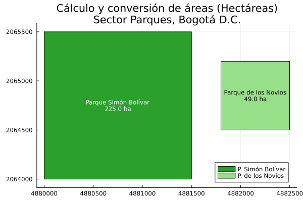
```


:::

## Exploración de métodos y funciones en clases espaciales

La exploración algorítmica de los objetos espaciales permite auditar e identificar las funciones de geoprocesamiento, constructores y atributos disponibles en las librerías base. Dado que cada ecosistema maneja un paradigma de programación distinto (orientado a objetos en Python, funcional S3 en R y despacho múltiple en Julia), los mecanismos de introspección para listar los métodos aplicables a las geometrías y estructuras tabulares varían significativamente.

::: {.panel-tabset}

### Python

::: {.content-visible when-format="html"}
::: {.callout-tip collapse="true" icon="false"}
#### ▷ CÓDIGO PURO (Copiar y Pegar)
```{python}
#| label: python_metodos_codigo
#| eval: false

import geopandas as gpd
from shapely.geometry import Point

# Instanciación de una geometría puntual (Bogotá, MAGNA-SIRGAS Origen Nacional)
punto_bogota = Point(4882000, 2060000)

# En Python, la función nativa dir() retorna todos los atributos y métodos del objeto.
# Se filtran los métodos mágicos (aquellos que inician con doble guion bajo '__')
metodos_shapely = [metodo for metodo in dir(punto_bogota) if not metodo.startswith('_')]

print("Métodos topológicos y analíticos de Shapely (clase Point):")
print(metodos_shapely[:10]) # Visualización de los primeros 10 métodos

# Inspección de métodos a nivel de estructura tabular (GeoDataFrame)
gdf_vacio = gpd.GeoDataFrame(geometry=[punto_bogota])
metodos_geopandas = [metodo for metodo in dir(gdf_vacio) if not metodo.startswith('_')]

print("\nMétodos espaciales y tabulares de GeoPandas (clase GeoDataFrame):")
print(metodos_geopandas[:10])
```
:::
:::

```{python}
#| label: python_metodos
#| fig-align: center
#| out-width: "80%"
# #| eval: false

import geopandas as gpd
from shapely.geometry import Point

# Instanciación de una geometría puntual (Bogotá, MAGNA-SIRGAS Origen Nacional)
punto_bogota = Point(4882000, 2060000)

# En Python, la función nativa dir() retorna todos los atributos y métodos del objeto.
# Se filtran los métodos mágicos (aquellos que inician con doble guion bajo '__')
metodos_shapely = [metodo for metodo in dir(punto_bogota) if not metodo.startswith('_')]

print("Métodos topológicos y analíticos de Shapely (clase Point):")
print(metodos_shapely[:10]) # Visualización de los primeros 10 métodos

# Inspección de métodos a nivel de estructura tabular (GeoDataFrame)
gdf_vacio = gpd.GeoDataFrame(geometry=[punto_bogota])
metodos_geopandas = [metodo for metodo in dir(gdf_vacio) if not metodo.startswith('_')]

print("\nMétodos espaciales y tabulares de GeoPandas (clase GeoDataFrame):")
print(metodos_geopandas[:10])
```

### R

::: {.content-visible when-format="html"}
::: {.callout-tip collapse="true" icon="false"}
#### ▷ CÓDIGO PURO (Copiar y Pegar)
```{r}
#| label: r_metodos_codigo
#| eval: false

library(sf)

# En el paradigma funcional S3 de R, la función methods() enumera 
# las rutinas genéricas implementadas específicamente para una clase dada.

# 1. Listado de métodos asociados al data frame espacial completo (clase 'sf')
print("Métodos disponibles para la clase tabular 'sf':")
print(head(methods(class = "sf"), 15))

# 2. Listado de métodos operativos sobre la columna de geometrías (clase 'sfc')
print("Métodos disponibles para la columna espacial 'sfc':")
print(head(methods(class = "sfc"), 15))

# 3. Listado de métodos para primitivas individuales (clase 'sfg')
print("Métodos disponibles para geometrías individuales 'sfg':")
print(head(methods(class = "sfg"), 15))
```
:::
:::

```{r}
#| label: r_metodos
#| fig-align: center
#| out-width: "80%"
# #| eval: false

library(sf)

# En el paradigma funcional S3 de R, la función methods() enumera 
# las rutinas genéricas implementadas específicamente para una clase dada.

# 1. Listado de métodos asociados al data frame espacial completo (clase 'sf')
print("Métodos disponibles para la clase tabular 'sf':")
print(head(methods(class = "sf"), 15))

# 2. Listado de métodos operativos sobre la columna de geometrías (clase 'sfc')
print("Métodos disponibles para la columna espacial 'sfc':")
print(head(methods(class = "sfc"), 15))

# 3. Listado de métodos para primitivas individuales (clase 'sfg')
print("Métodos disponibles para geometrías individuales 'sfg':")
print(head(methods(class = "sfg"), 15))
```

### Julia

::: {.content-visible when-format="html"}
::: {.callout-tip collapse="true" icon="false"}
#### ▷ CÓDIGO PURO (Copiar y Pegar)

```{julia}
#| label: julia_metodos_codigo
#| eval: false

import ArchGDAL


# Listar todas (filtrando las primeras 10) las funciones y sus métodos
for name in names(ArchGDAL, all=true)[1:10]
    obj = getfield(ArchGDAL, name)
    if isa(obj, Function)
        println("Función: ", name)
        println(methods(obj))
        println()
    end
end

# El ecosistema de Julia opera bajo el paradigma de despacho múltiple. 
# Las funciones no pertenecen a los objetos, sino que los objetos se pasan como argumentos.

# 1. Inspección de la jerarquía de tipos de la geometría
# Instanciación de geometría básica (Bogotá, MAGNA-SIRGAS)
punto_julia = ArchGDAL.fromWKT("POINT (4882000 2060000)")
tipo_geometria = typeof(punto_julia)

println("Tipo de dato exacto de la geometría: ", tipo_geometria)
println("Clase abstracta superior (Supertype): ", supertype(tipo_geometria))

# 2. Inspección del despacho múltiple en funciones espaciales genéricas
# Dado que la mayoría de funciones base de GDAL operan sobre el tipo AbstractGeometry,
# el enfoque analítico en Julia consiste en consultar qué firmas (tipos de datos)
# soporta una función de geoprocesamiento específica utilizando methods().
println("\nFirmas de métodos disponibles para la función ArchGDAL.buffer:")
println(methods(ArchGDAL.buffer))

println("\nFirmas de métodos disponibles para la función ArchGDAL.intersection:")
println(methods(ArchGDAL.intersection))
```

:::
:::

```{r}
#| label: julia_metodos
#| results: asis
#| code-fold: true
#| fig-align: center
#| out-width: "80%"
# #| eval: false

# Regla de pliegue exclusiva para este bloque j_eval de Julia:
# Si el código NO se ejecuta (# #| eval: false), usa: # #| code-fold: true
# Si el código SÍ se ejecuta (para mostrar resultados), usa: #| code-fold: true

j_eval('
import ArchGDAL

# El ecosistema de Julia opera bajo el paradigma de despacho múltiple. 
# Las funciones no pertenecen a los objetos, sino que los objetos se pasan como argumentos.

# 1. Inspección de la jerarquía de tipos de la geometría
# Instanciación de geometría básica (Bogotá, MAGNA-SIRGAS)
punto_julia = ArchGDAL.fromWKT("POINT (4882000 2060000)")
tipo_geometria = typeof(punto_julia)

println("Tipo de dato exacto de la geometría: ", tipo_geometria)
println("Clase abstracta superior (Supertype): ", supertype(tipo_geometria))

# 2. Inspección del despacho múltiple en funciones espaciales genéricas
# Dado que la mayoría de funciones base de GDAL operan sobre el tipo AbstractGeometry,
# el enfoque analítico en Julia consiste en consultar qué firmas (tipos de datos)
# soporta una función de geoprocesamiento específica utilizando methods().
println("\\nFirmas de métodos disponibles para la función ArchGDAL.buffer:")
println(methods(ArchGDAL.buffer))

println("\\nFirmas de métodos disponibles para la función ArchGDAL.intersection:")
println(methods(ArchGDAL.intersection))
')
```

:::


## Resumen sintáctico: Métodos alternativos para crear puntos

| Operación | Python (`geopandas` / `shapely`) 🐍 | R (`sf`) 🔵 | Julia (`ArchGDAL`) 🟣 |
| :--- | :--- | :--- | :--- |
| **Desde texto WKT** | `gpd.GeoSeries.from_wkt(["POINT(1 1)"])` | `st_as_sfc("POINT(1 1)")` | `ArchGDAL.fromWKT("POINT(1 1)")` |
| **Primitiva (Objeto)**| `Point(lon, lat)` | `st_point(c(lon, lat))` | `ArchGDAL.createpoint(lon, lat)` |
| **Geometría a tabla** | `gpd.GeoDataFrame(df, geometry=[pt])` | `st_sf(df, geometry = st_sfc(pt))` | `DataFrame(A=1, geometry=[pt])` |

: Sintaxis comparativa para la instanciación de puntos espaciales mediante WKT y primitivas {#tbl-resumen_crear_puntos_avanzado tbl-colwidths="[30,23,23,24]"}