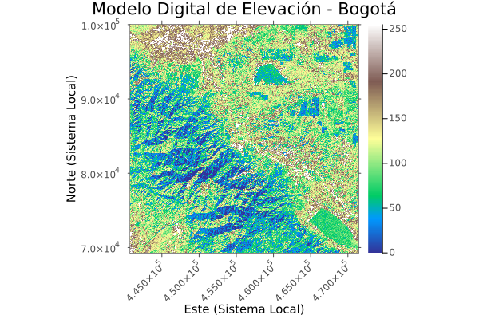




# Fundamentos raster

## Funciones j_eval y j_plot en R

```{r}
#| label: j_eval_j_plot
#| code-fold: true
# #| include: false
source("./docs/j_eval_j_plot.r")
```


## Introducción

El modelo de datos raster representa información espacial mediante una cuadrícula o matriz regular de celdas (píxeles). Cada celda contiene un valor numérico que representa una variable temática, como la altitud en un Modelo Digital de Elevación (MDE).

La validez geométrica de una matriz raster depende de sus metadatos espaciales: resolución espacial, extensión rectangular (bounding box) y el Sistema de Referencia de Coordenadas (CRS). La inspección de estos metadatos es el primer paso crítico en cualquier flujo de trabajo. Es frecuente adquirir datos históricos o externos que operan bajo sistemas de referencia obsoletos. En el caso de Colombia, es vital identificar si los datos se encuentran en un sistema legado (ej. Datum Bogotá 1941) para prever una futura transformación al estándar oficial MAGNA-SIRGAS Origen Nacional (EPSG:9377).

## Lectura de datos y extracción de metadatos

El siguiente procedimiento importa un archivo físico a la memoria. En lugar de cargar la totalidad de la matriz de píxeles, las librerías extraen inicialmente el encabezado del archivo (metadatos), lo que optimiza la memoria RAM. Al leer el MDE de Bogotá propuesto, se evidenciará mediante la definición Proj4 (`+ellps=intl`, entre otros parámetros) que el archivo original no corresponde a MAGNA-SIRGAS, dictando la necesidad de una reproyección en etapas de geoprocesamiento posteriores (Capítulo 19).

::: {.panel-tabset}

### Python

::: {.content-visible when-format="html"}
::: {.callout-tip collapse="true" icon="false"}
#### ▷ CÓDIGO PURO (Copiar y Pegar)
```{python}
#| label: python_lectura_raster_codigo
#| eval: false

# Importación de la librería rasterio, estándar para lectura y escritura raster en Python
import rasterio

# Definición de la ruta al archivo raster
# Fuente original: [http://dl.maptools.org/dl/geotiff/samples/made_up/bogota.tif](http://dl.maptools.org/dl/geotiff/samples/made_up/bogota.tif)
ruta_raster = "data_heavy/raster/bogota.tif"

# Apertura del archivo utilizando un bloque contextual (with)
# Garantiza que el puntero de archivo se cierre automáticamente tras la lectura
with rasterio.open(ruta_raster) as src:
    
    # Extracción de dimensiones espaciales de la matriz
    columnas = src.width
    filas = src.height
    
    # Conteo del número de bandas (1 banda para elevación continua)
    numero_bandas = src.count
    
    # Extracción del Sistema de Referencia de Coordenadas
    # Permite identificar la definición Proj4 nativa del archivo (Datum legado)
    crs_raster = src.crs
    
    # Extracción de la resolución espacial (tamaño del píxel en unidades del CRS)
    resolucion = src.res
    
    # Extracción de la extensión o bounding box
    extension = src.bounds

    # Impresión estructurada en consola
    print(f"Dimensiones de la matriz: {columnas} columnas x {filas} filas")
    print(f"Total de bandas: {numero_bandas}")
    print(f"Sistema de referencia (CRS): {crs_raster}")
    print(f"Resolución espacial: {resolucion[0]} metros")
    print(f"Extensión espacial: {extension}")
```

:::
:::

```{python}
#| label: python_lectura_raster
#| fig-align: center
#| out-width: "80%"
# #| eval: false

# Importación de la librería rasterio, estándar para lectura y escritura raster en Python
import rasterio

# Definición de la ruta al archivo raster
# Fuente original: [http://dl.maptools.org/dl/geotiff/samples/made_up/bogota.tif](http://dl.maptools.org/dl/geotiff/samples/made_up/bogota.tif)
ruta_raster = "data_heavy/raster/bogota.tif"

# Apertura del archivo utilizando un bloque contextual (with)
# Garantiza que el puntero de archivo se cierre automáticamente tras la lectura
with rasterio.open(ruta_raster) as src:
    
    # Extracción de dimensiones espaciales de la matriz
    columnas = src.width
    filas = src.height
    
    # Conteo del número de bandas (1 banda para elevación continua)
    numero_bandas = src.count
    
    # Extracción del Sistema de Referencia de Coordenadas
    # Permite identificar la definición Proj4 nativa del archivo (Datum legado)
    crs_raster = src.crs
    
    # Extracción de la resolución espacial (tamaño del píxel en unidades del CRS)
    resolucion = src.res
    
    # Extracción de la extensión o bounding box
    extension = src.bounds

    # Impresión estructurada en consola
    print(f"Dimensiones de la matriz: {columnas} columnas x {filas} filas")
    print(f"Total de bandas: {numero_bandas}")
    print(f"Sistema de referencia (CRS): {crs_raster}")
    print(f"Resolución espacial: {resolucion[0]} metros")
    print(f"Extensión espacial: {extension}")
```

### R

::: {.content-visible when-format="html"}
::: {.callout-tip collapse="true" icon="false"}
#### ▷ CÓDIGO PURO (Copiar y Pegar)
```{r}
#| label: r_lectura_raster_codigo
#| eval: false

# Carga de terra, paquete de alto rendimiento para estructuras espaciales en R
library(terra)

# Definición de la ruta local del archivo
# Fuente original: [http://dl.maptools.org/dl/geotiff/samples/made_up/bogota.tif](http://dl.maptools.org/dl/geotiff/samples/made_up/bogota.tif)
ruta_raster <- "data_heavy/raster/bogota.tif"

# rast() establece el enlace con el archivo y crea un objeto SpatRaster con los metadatos
mde_bogota <- rast(ruta_raster)

# La impresión directa del objeto revela las dimensiones y la cadena de texto del CRS
print(mde_bogota)

# Extracción algorítmica de atributos específicos
crs_texto <- crs(mde_bogota, describe=TRUE)$name
resolucion <- res(mde_bogota)
dimensiones <- dim(mde_bogota)

# Impresión en consola
cat("Sistema de Referencia identificado:", crs_texto, "\n")
cat("Resolución espacial (X, Y):", resolucion, "metros\n")
cat("Filas, Columnas, Bandas:", dimensiones, "\n")
```
:::
:::

```{r}
#| label: r_lectura_raster
#| fig-align: center
#| out-width: "80%"
# #| eval: false

# Carga de terra, paquete de alto rendimiento para estructuras espaciales en R
library(terra)

# Definición de la ruta local del archivo
# Fuente original: [http://dl.maptools.org/dl/geotiff/samples/made_up/bogota.tif](http://dl.maptools.org/dl/geotiff/samples/made_up/bogota.tif)
ruta_raster <- "data_heavy/raster/bogota.tif"

# rast() establece el enlace con el archivo y crea un objeto SpatRaster con los metadatos
mde_bogota <- rast(ruta_raster)

# La impresión directa del objeto revela las dimensiones y la cadena de texto del CRS
print(mde_bogota)

# Extracción algorítmica de atributos específicos
crs_texto <- crs(mde_bogota, describe=TRUE)$name
resolucion <- res(mde_bogota)
dimensiones <- dim(mde_bogota)

# Impresión en consola
cat("Sistema de Referencia identificado:", crs_texto, "\n")
cat("Resolución espacial (X, Y):", resolucion, "metros\n")
cat("Filas, Columnas, Bandas:", dimensiones, "\n")
```

### Julia

::: {.content-visible when-format="html"}
::: {.callout-tip collapse="true" icon="false"}
#### ▷ CÓDIGO PURO (Copiar y Pegar)
```{julia}
#| label: julia_lectura_raster_codigo
#| eval: false

# Es estricto cargar ArchGDAL junto a Rasters para habilitar el backend 
# de lectura y decodificación de formatos raster estándar como GeoTIFF.
using Rasters
using ArchGDAL

# Definición de la ruta local
# Fuente original: [http://dl.maptools.org/dl/geotiff/samples/made_up/bogota.tif](http://dl.maptools.org/dl/geotiff/samples/made_up/bogota.tif)
ruta_raster = "data_heavy/raster/bogota.tif"

# Construcción de la estructura Raster a partir del archivo
# Analiza la grilla y carga el sistema de coordenadas
# En Julia, el despliegue automático de salidas en la consola interactiva 
# se suprime añadiendo un punto y coma (;) al final de la instrucción.
mde_bogota = Raster(ruta_raster);

# Despliegue de los metadatos estructurales (tamaño de la matriz)
println("Dimensiones espaciales: ", dims(mde_bogota))

# Extracción del CRS base
# Mostrará los parámetros crudos de Proj4 si el CRS carece de un código EPSG explícito
println("CRS nativo del archivo: ", crs(mde_bogota))
```
:::
:::

```{r}
#| label: julia_lectura_raster
#| results: asis
#| fig-align: center
#| out-width: "80%"
#| code-fold: true
# #| eval: false

j_eval('
# Carga del módulo Rasters.jl para matrices georreferenciadas
# Es estricto cargar ArchGDAL junto a Rasters para habilitar el backend 
# de lectura y decodificación de formatos raster estándar como GeoTIFF.
using Rasters
using ArchGDAL

# Definición de la ruta local
# Fuente original: [http://dl.maptools.org/dl/geotiff/samples/made_up/bogota.tif](http://dl.maptools.org/dl/geotiff/samples/made_up/bogota.tif)
ruta_raster = "data_heavy/raster/bogota.tif"

# Construcción de la estructura Raster a partir del archivo
# Analiza la grilla y carga el sistema de coordenadas
# Se añade "; nothing" para silenciar la salida estricta en el motor de evaluación
mde_bogota = Raster(ruta_raster); nothing


# Despliegue de los metadatos estructurales (tamaño de la matriz)
println("Dimensiones espaciales: ", dims(mde_bogota))

# Extracción del CRS base
# Mostrará los parámetros crudos de Proj4 si el CRS carece de un código EPSG explícito
println("CRS nativo del archivo: ", crs(mde_bogota))
')
```

:::

## Visualización cartográfica básica

La representación visual directa de la matriz, incluso antes de transformar su CRS, es necesaria para evaluar distribuciones anómalas de valores, coberturas espaciales incompletas (nodata) o artefactos de adquisición. El renderizado asocia los rangos de elevación del MDE con una rampa de color continua.

::: {.panel-tabset}

### Python

::: {.content-visible when-format="html"}
::: {.callout-tip collapse="true" icon="false"}
#### ▷ CÓDIGO PURO (Copiar y Pegar)
```{python}
#| label: python_plot_raster_codigo
#| eval: false

import rasterio
from rasterio.plot import show
import matplotlib.pyplot as plt

# Acceso contextual a la matriz raster
with rasterio.open("data_heavy/raster/bogota.tif") as src:
    
    # Inicialización del lienzo gráfico (figura y ejes)
    fig, ax = plt.subplots(figsize=(10, 8))
    
    # Renderizado espacial mediante la utilidad show()
    # cmap='terrain' ajusta la gradación de colores para altimetría
    show(src, ax=ax, title="Modelo Digital de Elevación - Bogotá", cmap="terrain")
    
    # Despliegue del arreglo en el entorno gráfico
    plt.show()
```
:::
:::

```{python}
#| label: python_plot_raster
#| fig-align: center
#| out-width: "80%"
# #| eval: false

import rasterio
from rasterio.plot import show
import matplotlib.pyplot as plt

# Acceso contextual a la matriz raster
with rasterio.open("data_heavy/raster/bogota.tif") as src:
    
    # Inicialización del lienzo gráfico (figura y ejes)
    fig, ax = plt.subplots(figsize=(10, 8))
    
    # Renderizado espacial mediante la utilidad show()
    # cmap='terrain' ajusta la gradación de colores para altimetría
    show(src, ax=ax, title="Modelo Digital de Elevación - Bogotá", cmap="terrain")
    
    # Despliegue del arreglo en el entorno gráfico
    plt.show()
```

### R

::: {.content-visible when-format="html"}
::: {.callout-tip collapse="true" icon="false"}
#### ▷ CÓDIGO PURO (Copiar y Pegar)
```{r}
#| label: r_plot_raster_codigo
#| eval: false

library(terra)

# Instanciación del archivo de entrada
mde_bogota <- rast("data_heavy/raster/bogota.tif")

# Ejecución de la función plot sobrecargada para métodos espaciales
# Genera los márgenes cartográficos y mapea la matriz a la rampa altimétrica
plot(mde_bogota, 
     main="Modelo Digital de Elevación - Bogotá", 
     col=terrain.colors(50), # Segmentación de la paleta en 50 clases
     axes=TRUE, 
     legend=TRUE)
```
:::
:::

```{r}
#| label: r_plot_raster
#| fig-align: center
#| out-width: "80%"
# #| eval: false

library(terra)

# Instanciación del archivo de entrada
mde_bogota <- rast("data_heavy/raster/bogota.tif")

# Ejecución de la función plot sobrecargada para métodos espaciales
# Genera los márgenes cartográficos y mapea la matriz a la rampa altimétrica
plot(mde_bogota, 
     main="Modelo Digital de Elevación - Bogotá", 
     col=terrain.colors(50), # Segmentación de la paleta en 50 clases
     axes=TRUE, 
     legend=TRUE)
```

### Julia

::: {.content-visible when-format="html"}
::: {.callout-tip collapse="true" icon="false"}
#### ▷ CÓDIGO PURO (Copiar y Pegar)

```{julia}
#| label: julia_plot_raster_codigo
#| eval: false

# Es estricto cargar ArchGDAL junto a Rasters para habilitar el backend 
# de lectura y decodificación de formatos raster estándar como GeoTIFF.
using Rasters
using ArchGDAL
using Plots
# using Measures # Necesario para definir márgenes en mm o px


# Carga de la estructura del MDE
# En Julia, el despliegue automático de salidas en la consola interactiva 
# se suprime añadiendo un punto y coma (;) al final de la instrucción.
mde_bogota = Raster("data_heavy/raster/bogota.tif");

# Construcción de la visualización cruzando Plots.jl con el objeto Raster
p = plot(mde_bogota, 
         title="Modelo Digital de Elevación - Bogotá", 
         c=:terrain,
         xlabel="Este (Sistema Local)\n", # La nueva línea añade espacio vertical 
                                          # para que se vea la etiqueta
         ylabel="Norte (Sistema Local)",
         # --- MEJORAS DE VISIBILIDAD ---
         xrotation = 45,        # Rota las etiquetas del eje X 45 grados
         # bottom_margin = 10mm,  # Da espacio extra en la base (requiere using Measures)
         #size = (850, 650),         # Incrementa el alto del lienzo para dar aire al label         
         guidefontsize = 10,    # Tamaño de fuente para los títulos de los ejes
         tickfontsize = 8       # Tamaño de fuente para los números de las coordenadas
         )

# Salida del gráfico a la interfaz activa
display(p)
```

:::
:::

```{r}
#| label: julia_plot_raster
#| results: asis
#| fig-align: center
#| out-width: "80%"
#| code-fold: true
# #| eval: false

j_eval('
# Es estricto cargar ArchGDAL junto a Rasters para habilitar el backend 
# de lectura y decodificación de formatos raster estándar como GeoTIFF.
using Rasters
using ArchGDAL
using Plots
# using Measures # Necesario para definir márgenes en mm o px

# Carga de la estructura del MDE
# Se añade "; nothing" para silenciar la salida estricta en el motor de evaluación
mde_bogota = Raster("data_heavy/raster/bogota.tif"); nothing

# Construcción de la visualización cruzando Plots.jl con el objeto Raster
p = plot(mde_bogota, 
         title="Modelo Digital de Elevación - Bogotá", 
         c=:terrain,
         xlabel="Este (Sistema Local)\n", # La nueva línea añade espacio vertical 
                                          # para que se vea la etiqueta
         ylabel="Norte (Sistema Local)",
         # --- MEJORAS DE VISIBILIDAD ---
         xrotation = 45,        # Rota las etiquetas del eje X 45 grados
         # bottom_margin = 10mm,  # Da espacio extra en la base (requiere using Measures)
         #size = (850, 650),         # Incrementa el alto del lienzo para dar aire al label         
         guidefontsize = 10,    # Tamaño de fuente para los títulos de los ejes
         tickfontsize = 8       # Tamaño de fuente para los números de las coordenadas
         )

# Almacenamiento riguroso de la figura para renderizado en Quarto
savefig(p, "images/c18_plot_mde_bogota_julia.png")
')


```


:::


## Resumen sintáctico

1. **Lectura y extracción de metadatos raster**

La siguiente tabla consolida los comandos base para la instanciación de objetos raster en memoria y la extracción de sus atributos topológicos y espaciales. La lectura inicial prioriza la extracción de metadatos sobre la carga de la matriz completa (lectura diferida).

| Operación | Python (`rasterio`) 🐍 | R (`terra`) 🔵 | Julia (`Rasters.jl`) 🟣 |
| :--- | :--- | :--- | :--- |
| **Enlace al archivo (Lazy loading)** | `src = rasterio.open("ruta.tif")` | ` r = rast("ruta.tif")` | ` r = Raster("ruta.tif")` |
| **Dimensiones (Columnas, Filas, Bandas)** | `src.width`, `src.height`, `src.count` | `dim(r)` | `dims(r)` |
| **Sistema de Referencia (CRS)** | `src.crs` | `crs(r)` | `crs(r)` |
| **Resolución espacial (X, Y)** | `src.res` | `res(r)` | *Derivada de la estructura de la grilla* |
| **Extensión espacial (Bounding Box)** | `src.bounds` | `ext(r)` | `bounds(r)` |

: Equivalencia de métodos para la lectura y auscultación de metadatos matriciales {#tbl-resumen_metadatos_raster tbl-colwidths="[25,25,25,25]"}

---

2. **Renderizado cartográfico matricial**

La representación visual directa de la matriz de píxeles requiere la asociación de los valores numéricos a una paleta de colores. Cada lenguaje integra su propio motor de graficación para el mapeo espacial continuo.

| Operación | Python (`rasterio.plot`) 🐍 | R (`terra`) 🔵 | Julia (`Plots.jl`) 🟣 |
| :--- | :--- | :--- | :--- |
| **Despliegue del arreglo con rampa altimétrica** | `show(src, ax=ax, cmap="terrain")` | `plot(r, col=terrain.colors(50))` | `plot(r, c=:terrain)` |
| **Ajuste de orientación de etiquetas de ejes** | `ax.tick_params(axis='x', rotation=45)` | *No requiere (Manejado por parámetros par/mar)* | `plot(..., xrotation = 45)` |

: Comandos fundamentales para la representación gráfica de modelos de datos continuos {#tbl-resumen_plot_raster tbl-colwidths="[25,25,25,25]"}


## Cierre del capítulo

La exploración inicial de estructuras raster se rige por la decodificación estricta de sus metadatos fundamentales. La correcta identificación del Sistema de Referencia de Coordenadas, la resolución espacial y la extensión geométrica condicionan la viabilidad técnica de cualquier operación analítica posterior. 

Las librerías modernas implementadas en ecosistemas científicos (como `rasterio`, `terra` y `Rasters.jl`) operan bajo el paradigma de lectura diferida. Este enfoque mitiga el desbordamiento de memoria al extraer exclusivamente las cabeceras de los archivos, reservando el procesamiento masivo de la cuadrícula para etapas algorítmicas explícitas. El dominio de esta arquitectura de datos sienta las bases metodológicas para la ejecución de álgebra de mapas, transformaciones geométricas de reproyección espacial y extracción estadística.


## Evaluación

**1. Análisis de Metadatos y Gestión de Memoria:**
Se le ha entregado un Modelo Digital de Elevación de alta resolución (0.5m) que cubre toda la extensión del departamento de Antioquia, con un tamaño físico en disco de 14 GB. Usted dispone de una estación de trabajo con 8 GB de memoria RAM. Explique técnicamente por qué la ejecución de los comandos de apertura como `rasterio.open()` (Python), `rast()` (R) o `Raster()` (Julia) no genera un error de *Out of Memory* (OOM). Especifique qué información se transfiere realmente a la memoria volátil durante la ejecución de esa primera instrucción.

**2. Sistemas de Referencia en Datos Legados:**
Al inspeccionar los metadatos de un mosaico de imágenes históricas provisto por el IGAC, identifica mediante la cadena *Proj4* que el CRS nativo del archivo corresponde a un sistema obsoleto basado en el Datum Bogotá 1941 (`+ellps=intl`). Describa la implicación metodológica de este hallazgo. ¿Qué procedimiento obligatorio debe aplicarse a esta matriz antes de ejecutar una operación de intersección espacial contra la base catastral actual de Bogotá, proyectada en MAGNA-SIRGAS Origen Nacional (EPSG:9377)?

**3. Repositorio en GitHub:**
Independientemente del formato de su código fuente, redacte un documento en Quarto (`.qmd`) con las respuestas argumentativas de los puntos anteriores y renderícelo en formato HTML y PDF.
* Sube la carpeta completa del proyecto a un repositorio público en su cuenta personal de **GitHub**.
* **Entrega:** Para la calificación formal, remita exclusivamente el enlace (URL) de su repositorio.