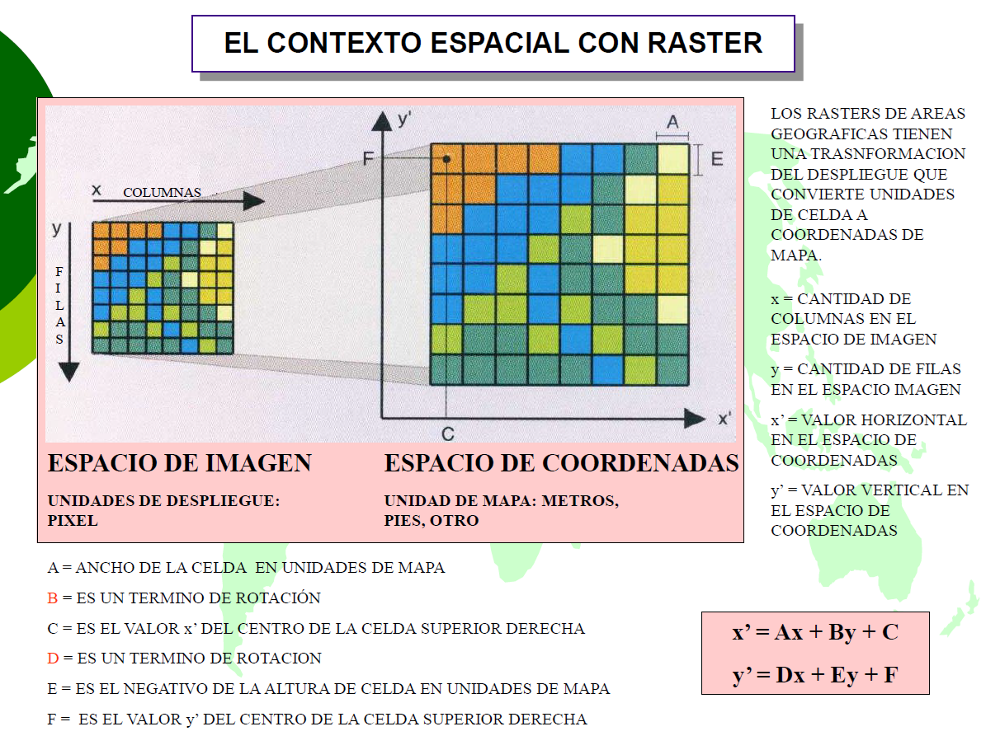


# Operaciones raster


## Funciones j_eval y j_plot en R

```{r}
#| label: j_eval_j_plot
#| code-fold: true
# #| include: false
source("./docs/j_eval_j_plot.r")
```

## Introducción

Las operaciones raster consisten en la manipulación analítica y geométrica de las matrices espaciales. Mientras que en el formato vectorial las transformaciones alteran vértices explícitos, en el modelo raster las operaciones modifican los valores de los píxeles (álgebra de mapas) o reestructuran la cuadrícula subyacente (reproyección y remuestreo).

Para garantizar la interoperabilidad de datos en Colombia, es un procedimiento estándar transformar insumos globales (como imágenes satelitales Sentinel o modelos de precipitación WGS84) al Sistema de Referencia de Coordenadas oficial MAGNA-SIRGAS Origen Nacional (EPSG:9377). Una vez unificada la base espacial, es viable ejecutar operaciones aritméticas entre bandas, aislar regiones de interés mediante recortes espaciales (clipping) y derivar nuevos índices temáticos.

### Comparación de librerías raster

| Enfoque técnico | Python 🐍 | R 🔵 | Julia 🟣 |
| :--- | :--- | :--- | :--- |
| **Bajo nivel (I/O y matrices crudas)** | **`rasterio`**: Interfaz directa a GDAL. Retorna matrices puras de NumPy. Ideal para operaciones de entrada/salida y control granular de memoria (lectura por ventanas). | **`terra`**: Sustituto moderno de `raster`. Escrito en C++, es rápido para operaciones estándar 2D/3D y gestiona la memoria de forma automática. | **`ArchGDAL.jl`**: *Bindings* nativos a la API de GDAL en C. Ofrece control absoluto sobre punteros de memoria, datasets y subdatasets virtuales. |
| **Alto nivel (Cubos espaciales)** | **`rioxarray`**: Basado en `xarray`. Trata los rasters como tensores etiquetados (X, Y, Tiempo). Mantiene el CRS y la georreferenciación en cada operación matemática. | **`stars`**: Diseñada para cubos hiperdimensionales (espacio-tiempo). Su fortaleza radica en la integración nativa con `sf` y el ecosistema `tidyverse` (ggplot2). | **`Rasters.jl`**: Provee abstracción espacial. Envuelve los arreglos crudos leídos por ArchGDAL para asignarles dimensiones explícitas (`X`, `Y`, `Band`). |
| **Ventajas** | **`rasterio`**: Máxima eficiencia computacional en I/O.<br>**`rioxarray`**: Facilita el álgebra vectorial y el remuestreo automático sin perder metadatos espaciales. | **`terra`**: Sintaxis concisa y rendimiento excepcional en geoprocesamiento focal/local.<br>**`stars`**: Manejo superior de series de tiempo multiespectrales. | Operan en sinergia: `ArchGDAL` garantiza lectura asíncrona a prueba de fallos, mientras `Rasters.jl` aporta sintaxis declarativa con rendimiento equivalente a C. |
| **Desventajas** | **`rasterio`**: Exige manejo manual de matrices de transformación afín.<br>**`rioxarray`**: Alto consumo de memoria RAM si no se fragmenta la lectura mediante *chunks* (Dask). | **`terra`**: Los objetos `SpatRaster` requieren conversión explícita para renderizado en librerías estándar.<br>**`stars`**: Ligeramente inferior a `terra` en velocidad pura de álgebra de mapas. | Documentación técnica fragmentada. Exige manejo riguroso de cierres de sesión de archivos (`close`) y supresión de volcados de memoria (`nothing`). |

## Reproyección de sistemas de coordenadas

La reproyección raster no solo reasigna metadatos, sino que exige una reinterpolación (remuestreo) de la matriz de píxeles original para ajustarla a una nueva malla geométrica. En este ejemplo, se toma un raster de precipitación mensual del IDEAM que se encuentra en coordenadas geográficas (EPSG:4326) y se proyecta a coordenadas planas (EPSG:9377).


::: {.panel-tabset}

### Python

::: {.content-visible when-format="html"}
::: {.callout-tip collapse="true" icon="false"}
#### ▷ CÓDIGO PURO (Copiar y Pegar)
```{python}
#| label: python_reproyeccion_viento_codigo
#| eval: false

import os
import rioxarray

# Definición de rutas para el modelo de vientos (Huracanes)
ruta_origen = "data_heavy/wind_tif/st24_h_50.tif"
# Se usa un sufijo único para evitar conflictos entre lenguajes
ruta_salida = "data_heavy/raster/st24_h_50_9377_py.tif"

# Verificación de existencia del insumo original
if not os.path.exists(ruta_origen):
    print(f"ERROR: No se encontró el archivo en: {ruta_origen}")
    print("Verifique que la carpeta 'data_heavy/wind_tif/' contenga el archivo original.")
else:
    try:
        # Carga del raster con metadatos espaciales (EPSG:4326)
        raster_viento = rioxarray.open_rasterio(ruta_origen)
        
        # Reproyección al sistema oficial MAGNA-SIRGAS Origen Nacional (EPSG:9377)
        # Se aplica remuestreo por vecino más cercano (default) para datos de magnitud
        viento_9377 = raster_viento.rio.reproject("EPSG:9377")
        
        # Creación automática del directorio de salida si no existe
        os.makedirs(os.path.dirname(ruta_salida), exist_ok=True)
        
        # Exportación a GeoTIFF (rioxarray sobreescribe por defecto)
        viento_9377.rio.to_raster(ruta_salida)
        
        print("Reproyección exitosa con motor Python.")
        print(f"CRS Original: {raster_viento.rio.crs}")
        print(f"CRS Destino: {viento_9377.rio.crs}")
        
    except Exception as e:
        print(f"Error detectado en el flujo de Python: {e}")
```
:::
:::

```{python}
#| label: python_reproyeccion_viento
#| fig-align: center
#| out-width: "80%"
# #| eval: false

import os
import rioxarray

# Definición de rutas para el modelo de vientos (Huracanes)
ruta_origen = "data_heavy/wind_tif/st24_h_50.tif"
# Se usa un sufijo único para evitar conflictos entre lenguajes
ruta_salida = "data_heavy/raster/st24_h_50_9377_py.tif"

# Verificación de existencia del insumo original
if not os.path.exists(ruta_origen):
    print(f"ERROR: No se encontró el archivo en: {ruta_origen}")
    print("Verifique que la carpeta 'data_heavy/wind_tif/' contenga el archivo original.")
else:
    try:
        # Carga del raster con metadatos espaciales (EPSG:4326)
        raster_viento = rioxarray.open_rasterio(ruta_origen)
        
        # Reproyección al sistema oficial MAGNA-SIRGAS Origen Nacional (EPSG:9377)
        # Se aplica remuestreo por vecino más cercano (default) para datos de magnitud
        viento_9377 = raster_viento.rio.reproject("EPSG:9377")
        
        # Creación automática del directorio de salida si no existe
        os.makedirs(os.path.dirname(ruta_salida), exist_ok=True)
        
        # Exportación a GeoTIFF (rioxarray sobreescribe por defecto)
        viento_9377.rio.to_raster(ruta_salida)
        
        print("Reproyección exitosa con motor Python.")
        print(f"CRS Original: {raster_viento.rio.crs}")
        print(f"CRS Destino: {viento_9377.rio.crs}")
        
    except Exception as e:
        print(f"Error detectado en el flujo de Python: {e}")
```

### R

::: {.content-visible when-format="html"}
::: {.callout-tip collapse="true" icon="false"}
#### ▷ CÓDIGO PURO (Copiar y Pegar)
```{r}
#| label: r_reproyeccion_viento_codigo
#| eval: false

library(terra)

# Rutas para el procesamiento de vientos extremos
ruta_origen <- "data_heavy/wind_tif/st24_h_50.tif"
ruta_salida <- "data_heavy/raster/st24_h_50_9377_r.tif"

# Validación de existencia del archivo fuente
if (!file.exists(ruta_origen)) {
  cat("ERROR: No se detectó el archivo de entrada en:", ruta_origen, "\n")
} else {
  tryCatch({
    # Carga diferida del SpatRaster
    viento_orig <- rast(ruta_origen)
    
    # Reproyección al CRS oficial de Colombia (EPSG:9377)
    viento_9377 <- project(viento_orig, "epsg:9377")
    
    # Asegurar la estructura de directorios recursivamente
    if (!dir.exists(dirname(ruta_salida))) dir.create(dirname(ruta_salida), recursive = TRUE)
    
    # Escritura en disco con bandera de sobreescritura habilitada
    writeRaster(viento_9377, ruta_salida, overwrite = TRUE)
    
    cat("Reproyección exitosa con motor R (terra).\n")
    cat("CRS Final:", crs(viento_9377, describe = TRUE)$name, "\n")
    
  }, error = function(e) {
    cat("Excepción en R:", e$message, "\n")
  })
}
```
:::
:::

```{r}
#| label: r_reproyeccion_viento
#| fig-align: center
#| out-width: "80%"
# #| eval: false

library(terra)

# Rutas para el procesamiento de vientos extremos
ruta_origen <- "data_heavy/wind_tif/st24_h_50.tif"
ruta_salida <- "data_heavy/raster/st24_h_50_9377_r.tif"

# Validación de existencia del archivo fuente
if (!file.exists(ruta_origen)) {
  cat("ERROR: No se detectó el archivo de entrada en:", ruta_origen, "\n")
} else {
  tryCatch({
    # Carga diferida del SpatRaster
    viento_orig <- rast(ruta_origen)
    
    # Reproyección al CRS oficial de Colombia (EPSG:9377)
    viento_9377 <- project(viento_orig, "epsg:9377")
    
    # Asegurar la estructura de directorios recursivamente
    if (!dir.exists(dirname(ruta_salida))) dir.create(dirname(ruta_salida), recursive = TRUE)
    
    # Escritura en disco con bandera de sobreescritura habilitada
    writeRaster(viento_9377, ruta_salida, overwrite = TRUE)
    
    cat("Reproyección exitosa con motor R (terra).\n")
    cat("CRS Final:", crs(viento_9377, describe = TRUE)$name, "\n")
    
  }, error = function(e) {
    cat("Excepción en R:", e$message, "\n")
  })
}
```

### Julia

::: {.content-visible when-format="html"}
::: {.callout-tip collapse="true" icon="false"}
#### ▷ CÓDIGO PURO (Copiar y Pegar)
```{julia}
#| label: julia_reproyeccion_viento_codigo
#| eval: false

using Rasters
using ArchGDAL

# Rutas del modelo de vientos para Colombia
ruta_origen = "data_heavy/wind_tif/st24_h_50.tif"
ruta_salida = "data_heavy/raster/st24_h_50_9377_jl.tif"

# Comprobación de integridad del archivo de entrada
if !isfile(ruta_origen)
    println("ERROR: El archivo no existe en: ", ruta_origen)
else
    try
        # Carga del objeto silenciando el retorno detallado
        viento_orig = Raster(ruta_origen); nothing
        
        # Reproyección mediante remuestreo a MAGNA-SIRGAS (EPSG:9377)
        viento_9377 = resample(viento_orig; crs=EPSG(9377)); nothing
        
        # Creación de ruta de directorios (mkpath es equivalente a mkdir -p)
        mkpath(dirname(ruta_salida))
        
        # Escritura forzada (force=true) para evitar errores si el archivo ya existe
        write(ruta_salida, viento_9377; force=true)
        
        println("Reproyección exitosa con motor Julia (Rasters.jl).")
        println("CRS Destino: ", crs(viento_9377))
        
    catch e
        println("Se detectó una falla en el bloque Julia: ", e)
    end
end
```
:::
:::

```{r}
#| label: julia_reproyeccion_viento
#| results: asis
#| code-fold: true
# #| eval: false

j_eval('
using Rasters
using ArchGDAL

ruta_origen = "data_heavy/wind_tif/st24_h_50.tif"
ruta_salida = "data_heavy/raster/st24_h_50_9377_jl.tif"

if !isfile(ruta_origen)
    println("ERROR: El archivo no existe en: ", ruta_origen)
else
    try
        # Carga silenciada para el motor de evaluación
        viento_orig = Raster(ruta_origen); nothing
        
        # Remuestreo espacial al sistema nacional
        viento_9377 = resample(viento_orig; crs=EPSG(9377)); nothing
        
        # Gestión de carpetas y escritura forzada
        mkpath(dirname(ruta_salida))
        write(ruta_salida, viento_9377; force=true); nothing
        
        println("Reproyección exitosa con motor Julia (Rasters.jl).")
        println("CRS Destino: ", crs(viento_9377))
        
    catch e
        println("Falla en el geoprocesamiento: ", e)
    end
end
')
```

:::

### Espacio de imagen vs. espacio de coordenadas

La diferencia fundamental entre el procesamiento de imágenes digitales estándar y el análisis SIG radica en la interpretación de los ejes de referencia. Entender cómo "puentear" matemáticamente estos dos espacios es crucial para georreferenciar correctamente un raster.

#### Espacio de Imagen (Cuadrícula de Píxeles)

Como se ilustra en el panel izquierdo de la @fig-pixel_coord_space, un raster es, en su origen, una matriz numérica bidimensional. Los softwares de gráficos visualizan este espacio siguiendo la lógica de almacenamiento de memoria de los archivos:

1.  **Origen:** Se ubica en la esquina superior izquierda del archivo.
2.  **Eje X (Pixel X / Columnas):** Los valores aumentan hacia la **derecha**.
3.  **Eje Y (Pixel Y / Filas):** Los valores aumentan hacia **abajo**.

#### Espacio de Coordenadas (Mundo Real)

En cartografía y SIG (panel derecho de la @fig-pixel_coord_space), el Norte y el Este se definen siguiendo la lógica del plano cartesiano, que está invertido respecto al espacio de imagen en el eje vertical:

1.  **Origen:** Depende del Sistema de Referencia de Coordenadas (CRS) proyectado (ej. metros UTM o MAGNA-SIRGAS).
2.  **Eje X (Este / Real X):** Los valores aumentan hacia la **derecha**.
3.  **Eje Y (Norte / Real Y):** Los valores aumentan hacia **arriba**.

::: {#fig-pixel_coord_space layout-align="center"}
{fig-align="center" width="90%"}

Relación entre el espacio de imagen (píxeles) y el espacio de coordenadas geográficas (metros).
:::

#### La Transformación Afín

Para vincular una ubicación $(X_{píxel}, Y_{píxel})$ de la imagen con una coordenada real $(X_{real}, Y_{real})$, las librerías como `rasterio` utilizan una **Transformación Afín 2D**. Este tipo de transformación geométrica es lineal y preserva el paralelismo entre líneas, lo que permite mover (trasladar), escalar y rotar el raster para que encaje perfectamente sobre el mapa.

#### Fórmulas de Transformación

La matriz afín de 6 parámetros (excluyendo los técnicos $g$, $h$, $i$) mapea los píxeles a coordenadas reales usando las siguientes ecuaciones lineales generales:

$$X_{real} = c + X_{píxel} \times a + Y_{píxel} \times b$$
$$Y_{real} = f + X_{píxel} \times d + Y_{píxel} \times e$$

Donde los coeficientes son:

* **$c, f$**: Traslación. Coordenadas $(E, N)$ de la esquina superior izquierda del raster (origen geográfico).
* **$a, e$**: Escala. Tamaño horizontal y vertical del píxel (resolución).
* **$b, d$**: Rotación y Cizallamiento (shear). Usualmente $0$ en imágenes de satélite alineadas al norte de la grilla.

Si no hay rotación, la fórmula se simplifica a la lógica lineal directa: $Origen + (Indice \times Resolución)$.

**Nota importante sobre la Resolución Vertical ($e$):** Para resolver la contradicción entre las filas que bajan (imagen) y el norte que sube (coordenadas), el valor de resolución vertical $e$ debe ser **NEGATIVO**. Esto asegura que a medida que avanzamos hacia abajo en las filas ($Y_{píxel}$ aumenta), la coordenada geográfica Norte ($Y_{real}$) decrezca correctamente.

```python
# Ejemplo matemático con los datos impresos anteriormente:
# f (Origen Y Norte): 5,960,000 m
# e (Resolución Y): -10 m/píxel

# Si bajamos 10 filas (Y_pixel = 10):
# Coordenada Y_real = 5,960,000 + (10 * -10)
# Y_real = 5,960,000 - 100 = 5,959,900 m (Nos movimos al Sur)
```

### Resumen sintáctico

| Operación | Python 🐍 | R 🔵 | Julia 🟣 |
| :--- | :--- | :--- | :--- |
| Validar existencia de archivo | `os.path.exists(ruta)` | `file.exists(ruta)` | `isfile(ruta)` |
| Cargar archivo raster | `rioxarray.open_rasterio(ruta)` | `rast(ruta)` | `Raster(ruta)` |
| Reproyección espacial | `raster.rio.reproject("EPSG:9377")` | `project(raster, "epsg:9377")` | `resample(raster; crs=EPSG(9377))` |
| Crear directorios anidados | `os.makedirs(ruta, exist_ok=True)` | `dir.create(ruta, recursive=TRUE)` | `mkpath(ruta)` |
| Exportar / Escribir en disco | `raster.rio.to_raster(ruta)` | `writeRaster(raster, overwrite=TRUE)` | `write(ruta, raster; force=true)` |
| Consultar CRS | `raster.rio.crs` | `crs(raster)` | `crs(raster)` |


## Álgebra de mapas: Cálculo del NDWI a partir de rutas virtuales

El álgebra de mapas permite evaluar operaciones aritméticas píxel a píxel a través de múltiples bandas u objetos raster. Para este ejercicio, calcularemos el Índice de Agua de Diferencia Normalizada (NDWI), el cual es altamente efectivo para aislar y delimitar cuerpos hídricos superficiales.

**Fórmula espectral:**
$$NDWI = \frac{Green - NIR}{Green + NIR}$$

El **Índice de Diferencia Normalizada de Agua (NDWI)**, propuesto originalmente por McFeeters (1996) [@mcfeeters1996use], aprovecha el comportamiento físico de la luz al interactuar con distintas superficies. El agua absorbe casi por completo la radiación en el espectro del Infrarrojo Cercano (NIR), mientras que refleja la luz visible, especialmente en la banda verde. Por el contrario, la vegetación y el suelo seco reflejan el NIR de forma muy intensa.

Al aplicar esta ecuación, la diferencia entre bandas se normaliza, produciendo un nuevo raster continuo cuyos valores resultantes siempre oscilarán entre **-1.0** y **+1.0**.

#### Interpretación de los rangos del NDWI

El análisis de este índice se basa en establecer un punto de corte (*threshold*) para separar el agua del fondo terrestre. La regla general de interpretación es la siguiente:

* **Valores Negativos (-1.0 a < 0.0):** Representan superficies sin agua libre. Incluyen vegetación (valores más negativos), suelo desnudo y áreas urbanas construidas (valores más cercanos a cero). Aquí, la reflectancia del NIR supera a la del verde.
* **Valores cercanos a 0.0 (Zonas de Transición):** Suelen corresponder a píxeles mixtos en las orillas de los ríos, zonas de inundación temporal, lodo húmedo, o bien, "falsos positivos" generados por sombras topográficas o de nubes (zonas oscuras que absorben mucha radiación en general).
* **Valores Positivos (> 0.0 a 1.0):** Indican la presencia de cuerpos hídricos. La banda verde es dominante frente al NIR. Los valores positivos bajos (ej. **0.1 a 0.3**) pueden indicar aguas poco profundas, turbias o humedales; mientras que los valores altos (cercanos a **1.0**) representan aguas profundas, limpias y abiertas.

::: {.callout-note}
**Ajuste del umbral en la práctica**
En los ejercicios SIG teóricos, el punto de corte estándar es el **0.0** (todo píxel $>0$ es agua). Sin embargo, en imágenes satelitales reales que presentan nubosidad o relieve montañoso, los analistas suelen ajustar este umbral manualmente (por ejemplo, subiéndolo a **0.1** o **0.15**) para eliminar el "ruido" que generan las sombras y aislar los ríos o lagos con mayor precisión cartográfica.
:::

Utilizaremos la lectura nativa de archivos comprimidos para evitar cuellos de botella en el almacenamiento físico. Utilizando el Sistema de Archivos Virtuales de GDAL (`/vsizip/`), podemos leer una escena satelital Sentinel-2 directamente desde su archivo `.zip` original sin necesidad de descomprimirla.

#### A. Anatomía de la Imagen y Subdatasets

Un producto Sentinel-2 es una estructura jerárquica gobernada por el archivo **XML de metadatos** (`MTD_MSIL1C.xml`). Este archivo no contiene los píxeles, sino que actúa como un índice lógico que organiza las bandas individuales en **4 grupos funcionales (Subdatasets)**:

1.  **10m**: Bandas de alta resolución (B02, B03, B04, B08). Es el grupo estándar para cálculo de índices de vegetación y agua (NDVI, NDWI).
2.  **20m**: Bandas de resolución media (B05, B06, B07, B8A, B11, B12). Usadas para geología y estrés hídrico.
3.  **60m**: Bandas de baja resolución (B01, B09, B10). Dedicadas a correcciones atmosféricas.
4.  **TCI (True Color Image)**: Un subdataset especial que entrega una composición RGB pre-renderizada usando las bandas B04 (R), B03 (G) y B02 (B).

Al invocar la ruta con el filtro específico:  
`SENTINEL2_L1C:/vsizip/.../MTD_MSIL1C.xml:10m:EPSG_32632`

Estamos forzando al sistema a ignorar los grupos de 20m, 60m y el TCI, cargando únicamente el **cubo de 4 bandas de 10 metros** para garantizar la máxima precisión analítica.

#### B. Estructura del Subdataset de 10 metros

Cuando trabajamos con el subdataset de 10m, el sistema nos entrega un arreglo de 4 capas con el siguiente orden interno (ver @tbl-sentinel_bands):

| Banda en el "Cubo" | Banda Sentinel-2 | Resolución | Longitud de Onda | Uso Principal |
|:---|:---|:---|:---|:---|
| **1** | B04 (Red) | 10m | 665 nm | Absorción de clorofila |
| **2** | B03 (Green) | 10m | 560 nm | Vigor de vegetación y turbidez |
| **3** | B02 (Blue) | 10m | 490 nm | Mapeo de aguas y suelos |
| **4** | B08 (NIR) | 10m | 842 nm | Biomasa y salud foliar |

: Organización de capas en el subdataset de alta resolución (10m) {#tbl-sentinel_bands}

> **Nota sobre el TCI:** Aunque el subdataset `:TCI:` también contiene las bandas B04, B03 y B02, suele entregarse como un producto de 8 bits (valores de 0 a 255) ya estirado visualmente. Para el álgebra de mapas profesional (como el NDWI), siempre debemos usar el subdataset de `:10m:`, ya que conserva los valores de reflectancia originales de 16 bits.

#### C. Proceso para el cálculo del NDWI

A continuación, mediante R, construiremos la ruta de enlace a una imagen satelital empaquetada internamente en la librería `starsdata` y la exportaremos a un archivo de texto en la carpeta `data/` para compartirla interoperablemente con Python y Julia.

```{r}
#| label: prep_ruta_sentinel
#| code-fold: false
#| message: false
#| warning: false
# #| eval: false

library(starsdata) # Librería que contiene datasets espaciales de prueba

# -------------------------------------------------------------------------
# 1. LOCALIZACIÓN DEL ARCHIVO FÍSICO
# -------------------------------------------------------------------------
# Definimos la ruta relativa del archivo .zip dentro de la estructura del paquete
f <- "sentinel/S2A_MSIL1C_20180220T105051_N0206_R051_T32ULE_20180221T134037.zip"

# system.file() busca la ruta absoluta de ese archivo en nuestro disco duro
granule <- system.file(file = f, package = "starsdata")

# Extraemos solo el nombre base del archivo (sin la extensión .zip)
# Esto es clave porque el directorio interno .SAFE se llama exactamente igual
base_name <- strsplit(basename(granule), ".zip")[[1]]

# -------------------------------------------------------------------------
# 2. CONSTRUCCIÓN DE LA RUTA VIRTUAL (VSI) DE GDAL
# -------------------------------------------------------------------------
# Construimos una cadena de conexión especializada para GDAL:
# - SENTINEL2_L1C: Activa el driver específico de Sentinel-2
# - /vsizip/: Indica a GDAL que lea dentro del archivo comprimido sin extraerlo en disco
# - MTD_MSIL1C.xml: Archivo maestro que organiza las bandas
# - :10m:EPSG_32632: Filtramos estrictamente el subdataset de 10 metros
s2_path <- paste0("SENTINEL2_L1C:/vsizip/", granule, "/", base_name, ".SAFE/MTD_MSIL1C.xml:10m:EPSG_32632")

# -------------------------------------------------------------------------
# 3. PERSISTENCIA DE LA RUTA PARA INTEROPERABILIDAD
# -------------------------------------------------------------------------
# Creamos la carpeta 'data' si no existe en nuestro espacio de trabajo
if (!dir.exists("data")) {
  dir.create("data")
}

# Guardamos la ruta virtual en un archivo de texto plano.
# Esto permite que Python y Julia puedan leer exactamente el mismo insumo
# sin tener que recalcular las rutas de los paquetes de R.
writeLines(s2_path, "data/s2_shared_path.txt")

cat("Ruta virtual de GDAL generada y almacenada en: data/s2_shared_path.txt\n")
```

Una vez materializada la ruta, los tres lenguajes la consumirán para ejecutar de forma enlazada el cálculo del NDWI y resguardar el resultado en la carpeta de procesamiento masivo (`data_heavy/raster/`). Es importante inspeccionar siempre los metadatos de las bandas; para este producto específico, el orden interno reportado por GDAL es: 1:Rojo(B4), 2:Verde(B3), 3:Azul(B2) y 4:NIR(B8).

::: {.callout-note}
### Visualización: ¿Matriz Matemática o Mapa Geográfico?

En esta sección exploraremos las diversas estrategias y librerías para representar visualmente el NDWI. El objetivo es comprender la transición entre la **matriz numérica cruda** (regida por el plano cartesiano y los índices de memoria) y el **objeto raster georreferenciado** (regido por coordenadas reales y el Norte geográfico). 

Se abordarán soluciones específicas para corregir errores comunes de orientación, tales como la transposición de ejes y la inversión vertical de las filas, garantizando que la representación visual coincida estrictamente con la realidad del terreno.
:::


::: {.panel-tabset}

### Python

::: {.content-visible when-format="html"}
::: {.callout-tip collapse="true" icon="false"}
#### ▷ CÓDIGO PURO (Copiar y Pegar)

```{python}
#| label: python_ndwi_bad_codigo
#| fig-align: center
#| out-width: "80%"
#| eval: false

# -------------------------------
# IMPORTACIÓN DE LIBRERÍAS
# -------------------------------
import os  # Manejo de rutas y sistema de archivos
import rasterio  # Lectura/escritura de datos raster geoespaciales
from rasterio.windows import Window  # Permite trabajar con subregiones (ventanas) del raster
import xarray as xr  # Manejo avanzado de arrays etiquetados (útil para visualización)
import numpy as np  # Operaciones numéricas eficientes
import matplotlib.pyplot as plt  # Visualización gráfica

# -------------------------------
# CONFIGURACIÓN DE RUTAS
# -------------------------------
# Archivo .txt que contiene la ruta al raster Sentinel-2 original
ruta_txt = "data/s2_shared_path.txt"

# Ruta donde se guardará el resultado NDWI optimizado
ruta_salida = "data_heavy/raster/ndwi_sentinel_optimizado_python_1.tif"

# Verificamos que el archivo con la ruta exista
if not os.path.exists(ruta_txt):
    print(f"ERROR: Insumo ausente en {ruta_txt}")
else:
    try:
        # -------------------------------
        # LECTURA DE LA RUTA DEL RASTER
        # -------------------------------
        with open(ruta_txt, "r") as f:
            # Leemos la ruta almacenada en el .txt y eliminamos espacios extra
            s2_path = f.read().strip()
            
        # -------------------------------
        # APERTURA DEL RASTER ORIGINAL
        # -------------------------------
        with rasterio.open(s2_path) as src:
            
            # --- OPTIMIZACIÓN 1: USO DE VENTANA ---
            # En lugar de procesar toda la imagen (~11000 x 11000 px),
            # trabajamos solo con una subregión (ventana).
            
            # Parámetros de la ventana:
            # col_off: desplazamiento horizontal (columnas) desde la esquina superior izquierda
            # row_off: desplazamiento vertical (filas)
            # width: ancho del recorte en píxeles
            # height: alto del recorte en píxeles
            # Imagen completa (10980 px de ancho aprox)
            # |--------------------|---------------------------|
            # 0                  9980                       10980
            #                      ↑                           ↑
            #                    col_off               col_off + width 
            ventana = Window(col_off=9980, row_off=4000, width=1000, height=2500)
            
            # Lectura selectiva de bandas:
            # Banda 2 = Green (verde)
            # Banda 4 = NIR (infrarrojo cercano)
            
            # Convertimos a float32 para reducir uso de memoria (vs float64)
            # Nota importante : Cuando trabajas con la librería rasterio (y casi cualquier 
            # software basado en GDAL): las bandas de un archivo raster se 
            # cuentan empezando desde 1 (independientemente de la base 0 de Python)
            green_arr = src.read(2, window=ventana).astype(np.float32)
            nir_arr = src.read(4, window=ventana).astype(np.float32)
            
            # Guardamos el perfil original (metadatos del raster)
            perfil_salida = src.profile
            
            # Calculamos la nueva transformada espacial para la ventana
            # Esto asegura que el recorte conserve su georreferenciación correcta
            # El objeto nueva_transformada es una Matriz de Transformación Afín:
            # (col, row)    →  (x, y)
            # píxel         → coordenada real
            # Es el "puente" matemático que le dice al ordenador cómo convertir 
            # un número de fila y columna (píxel) en una coordenada real 
            # en el mapa (ej: metros)
            # Cuando usas src.window_transform(ventana), rasterio calcula una 
            # nueva matriz que desplaza el origen (la esquina superior izquierda) 
            # desde el borde de la imagen original hasta el borde de tu recorte
            nueva_transformada = src.window_transform(ventana)

            # nueva_transformada contiene 6 coeficientes principales que definen 
            # la posición y escala del raster:
            # a: scale x - ancho del píxel (ej. 10 metros).
            # b: rotation x - rotación de filas (normalmente 0).
            # c: x origin - coordenada Este (X) de la esquina superior izquierda 
            #    del recorte.
            # d: rotation y - rotación de columnas (normalmente 0).
            # e: scale y - alto del píxel (suele ser negativo, ej. -10, 
            #    porque las coordenadas del mapa suben y las filas del raster 
            #    bajan)
            # f: y origin - coordenada Norte (Y) de la esquina superior izquierda 
            #    del recorte.
            # g, h, i: estándar de matrices 3x3
            # Imprimimos el contenido
            print(f"Contenido nueva_transformada: {nueva_transformada}")
            print(f"Contenido nueva_transformada como tupla: {tuple(nueva_transformada)}")

            # Los 6 parámetros principales de la transformación afín
            print(f"a - Resolución horizontal (ancho píxel): {nueva_transformada.a}")
            print(f"b - Rotación/Cizallamiento en X: {nueva_transformada.b}")
            print(f"c - Origen Este (X) del recorte: {nueva_transformada.c}")
            print(f"d - Rotación/Cizallamiento en Y: {nueva_transformada.d}")
            print(f"e - Resolución vertical (alto píxel): {nueva_transformada.e}")
            print(f"f - Origen Norte (Y) del recorte: {nueva_transformada.f}")
            # Los 3 parámetros de la tercera fila (estándar de matrices 3x3)
            # Los parámetros g, h, i son componentes técnicos necesarios para que 
            # la matriz sea cuadrada (3 x 3) y funcione bajo el concepto de 
            # coordenadas homogéneas
            # En procesamiento de mapas 2D (como este), sus valores son fijos:
            # g y h (Perspectiva): Controlan la inclinación en un espacio 3D (perspectiva). 
            #       Como los rasters son planos, siempre son 0.0.
            print(f"g - Parámetro de perspectiva g: {nueva_transformada.g}")
            print(f"h - Parámetro de perspectiva h: {nueva_transformada.h}")
            # i (Factor de escala): Es un normalizador matemático para que la 
            # matriz sea operativa. Siempre es 1.0.
            print(f"i - Factor de escala homogénea i: {nueva_transformada.i}")

        # -------------------------------
        # CÁLCULO DEL NDWI
        # -------------------------------
        # Fórmula del NDWI (Normalized Difference Water Index):
        # NDWI = (Green - NIR) / (Green + NIR)
        
        denominador = green_arr + nir_arr
        
        # Evitamos divisiones por cero:
        # - Si el denominador es 0 → asignamos NaN
        # - Si es válido → aplicamos la fórmula
        # Nota 1: ndwi_np no sabe sobre coordenadas
        #    las columnas inician en 0 y continúan ascendiendo
        #    las filas inician en 0 y continúan ascendiendo
        # Nota 2: El resultado es una matriz 'cruda'. En esta etapa, 
        #    el píxel [0,0] es simplemente el primer dato de la memoria, 
        #    sin ubicación en el mundo real"
        ndwi_np = np.where(
            denominador > 0,
            (green_arr - nir_arr) / denominador,
            np.nan
        )
        
        # -------------------------------
        # OPTIMIZACIÓN 2: ESCRITURA EFICIENTE
        # -------------------------------
        
        # Creamos la carpeta de salida si no existe
        os.makedirs(os.path.dirname(ruta_salida), exist_ok=True)
        
        # Actualizamos el perfil del raster de salida
        perfil_salida.update(
            dtype=rasterio.float32,  # Tipo de dato (menor peso)
            count=1,  # Solo una banda (NDWI)
            driver='GTiff',  # Formato GeoTIFF
            nodata=-9999,  # Valor para datos faltantes
            width=ventana.width,  # Nuevo ancho (recorte)
            height=ventana.height,  # Nuevo alto (recorte)
            transform=nueva_transformada,  # Nueva georreferenciación
            
            # Compresión LZW:
            # Reduce significativamente el tamaño del archivo sin perder información
            compress='lzw',
            
            # tiled=True:
            # Mejora el rendimiento de lectura en SIG (ej. QGIS)
            tiled=True
        )
        
        # -------------------------------
        # ESCRITURA DEL RASTER NDWI
        # -------------------------------
        with rasterio.open(ruta_salida, 'w', **perfil_salida) as dst:
            
            # Reemplazamos NaN por el valor nodata definido (-9999)
            out_data = np.nan_to_num(ndwi_np, nan=-9999).astype(np.float32)
            
            # Escribimos la banda NDWI en el archivo de salida
            # Nota: A pesar que la visualización en Python es invertida (cols)
            #       el archivo exportado si está correctamente georeferenciado
            #       porque usa nueva_transformada en el perfil de salida perfil_salida
            dst.write(out_data, 1)
            
        print(f"Proceso optimizado exitoso. Archivo ligero guardado en: {ruta_salida}")

        # -------------------------------
        # VISUALIZACIÓN CARTOGRÁFICA
        # -------------------------------

        # 2. Creamos el DataArray con COORDENADAS REALES
        ndwi_xr = xr.DataArray(
            ndwi_np, 
            dims=("y", "x")
        )

        # Imprimir los valores del eje X
        print("Valores de X (Este):")
        print(ndwi_xr.x.values[:5])
        #print(ndwi_xr.x.values)

        # Imprimir los valores del eje Y
        print("\nValores de Y (Norte):")
        print(ndwi_xr.y.values[:5])
        #print(ndwi_xr.y.values)

        print(f"Rango de X: desde {ndwi_xr.x.min().values} hasta {ndwi_xr.x.max().values}")
        print(f"Rango de Y: desde {ndwi_xr.y.min().values} hasta {ndwi_xr.y.max().values}")
        print(f"Cantidad de píxeles: {ndwi_xr.x.size} en X, {ndwi_xr.y.size} en Y")
        
        # 3. Graficamos
        # Creamos figura y eje
        fig, ax = plt.subplots(figsize=(10, 8))

        # Visualización del NDWI:
        # cmap="GnBu" → tonos verde-azul (agua en azul intenso)
        # vmin/vmax → controlan el rango de visualización
        ndwi_xr.plot(ax=ax, cmap="GnBu", vmin=-0.5, vmax=0.5)

        # Título del gráfico
        ax.set_title("NDWI SIN Georreferenciar")
        ax.set_xlabel("Columnas  (1000)")
        ax.set_ylabel("Filas (2500)")

        # Esto asegura que 1 unidad en X sea igual a 1 unidad en Y (evita deformación)
        plt.axis("equal") 

        # -------------------------------------------------------------------------
        # NOTA SOBRE VISUALIZACIÓN: NumPy (Cartesiano) vs. Xarray (Geográfico)
        # -------------------------------------------------------------------------
        # Sin coordenadas geográficas, Matplotlib usa el plano cartesiano estándar:
        # el origen (0,0) se ubica ABAJO a la izquierda y el eje Y aumenta hacia arriba. 
        # Esto hace que el raster se vea "invertido", pues la fila 0 (el Norte real) 
        # termina dibujada en la base del gráfico.
        #
        # Al usar un array georeferenciado (Xarray con coords), el sistema reconoce
        # la naturaleza del raster: el origen (índice 0,0) está ARRIBA a la izquierda. 
        # Gracias a la resolución vertical negativa, las coordenadas Norte disminuyen 
        # conforme bajamos en las filas, alineando el mapa correctamente con el mundo real.
        # -------------------------------------------------------------------------
        # Conclusión: este gráfico está invertido (mal) en los valores de las filas
        plt.show()
    except Exception as e:
        # Captura cualquier error inesperado en el flujo
        print(f"Error crítico en el flujo de trabajo: {e}")
```


```{python}
#| label: python_ndwi_codigo
#| fig-align: center
#| out-width: "80%"
#| eval: false

# -------------------------------
# IMPORTACIÓN DE LIBRERÍAS
# -------------------------------
import os  # Manejo de rutas y sistema de archivos
import rasterio  # Lectura/escritura de datos raster geoespaciales
from rasterio.windows import Window  # Permite trabajar con subregiones (ventanas) del raster
import xarray as xr  # Manejo avanzado de arrays etiquetados (útil para visualización)
import numpy as np  # Operaciones numéricas eficientes
import matplotlib.pyplot as plt  # Visualización gráfica

# -------------------------------
# CONFIGURACIÓN DE RUTAS
# -------------------------------
# Archivo .txt que contiene la ruta al raster Sentinel-2 original
ruta_txt = "data/s2_shared_path.txt"

# Ruta donde se guardará el resultado NDWI optimizado
ruta_salida = "data_heavy/raster/ndwi_sentinel_optimizado_python.tif"

# Verificamos que el archivo con la ruta exista
if not os.path.exists(ruta_txt):
    print(f"ERROR: Insumo ausente en {ruta_txt}")
else:
    try:
        # -------------------------------
        # LECTURA DE LA RUTA DEL RASTER
        # -------------------------------
        with open(ruta_txt, "r") as f:
            # Leemos la ruta almacenada en el .txt y eliminamos espacios extra
            s2_path = f.read().strip()
            
        # -------------------------------
        # APERTURA DEL RASTER ORIGINAL
        # -------------------------------
        with rasterio.open(s2_path) as src:
            
            # --- OPTIMIZACIÓN 1: USO DE VENTANA ---
            # En lugar de procesar toda la imagen (~11000 x 11000 px),
            # trabajamos solo con una subregión (ventana).
            
            # Parámetros de la ventana:
            # col_off: desplazamiento horizontal (columnas) desde la esquina superior izquierda
            # row_off: desplazamiento vertical (filas)
            # width: ancho del recorte en píxeles
            # height: alto del recorte en píxeles
            # Imagen completa (10980 px de ancho aprox)
            # |--------------------|---------------------------|
            # 0                  9980                       10980
            #                      ↑                           ↑
            #                    col_off               col_off + width 
            ventana = Window(col_off=9980, row_off=4000, width=1000, height=2500)
            
            # Lectura selectiva de bandas:
            # Banda 2 = Green (verde)
            # Banda 4 = NIR (infrarrojo cercano)
            
            # Convertimos a float32 para reducir uso de memoria (vs float64)
            # Nota importante : Cuando trabajas con la librería rasterio (y casi cualquier 
            # software basado en GDAL): las bandas de un archivo raster se 
            # cuentan empezando desde 1 (independientemente de la base 0 de Python)            
            green_arr = src.read(2, window=ventana).astype(np.float32)
            nir_arr = src.read(4, window=ventana).astype(np.float32)
            
            # Guardamos el perfil original (metadatos del raster)
            perfil_salida = src.profile
            
            # Calculamos la nueva transformada espacial para la ventana
            # Esto asegura que el recorte conserve su georreferenciación correcta
            # El objeto nueva_transformada es una Matriz de Transformación Afín:
            # (col, row)    →  (x, y)
            # píxel         → coordenada real
            # Es el "puente" matemático que le dice al ordenador cómo convertir 
            # un número de fila y columna (píxel) en una coordenada real 
            # en el mapa (ej: metros)
            # Cuando usas src.window_transform(ventana), rasterio calcula una 
            # nueva matriz que desplaza el origen (la esquina superior izquierda) 
            # desde el borde de la imagen original hasta el borde de tu recorte
            nueva_transformada = src.window_transform(ventana)

            # nueva_transformada contiene 6 coeficientes principales que definen 
            # la posición y escala del raster:
            # a: scale x - ancho del píxel (ej. 10 metros).
            # b: rotation x - rotación de filas (normalmente 0).
            # c: x origin - coordenada Este (X) de la esquina superior izquierda 
            #    del recorte.
            # d: rotation y - rotación de columnas (normalmente 0).
            # e: scale y - alto del píxel (suele ser negativo, ej. -10, 
            #    porque las coordenadas del mapa suben y las filas del raster 
            #    bajan)
            # f: y origin - coordenada Norte (Y) de la esquina superior izquierda 
            #    del recorte.
            # g, h, i: estándar de matrices 3x3
            # Imprimimos el contenido
            print(f"Contenido nueva_transformada: {nueva_transformada}")
            print(f"Contenido nueva_transformada como tupla: {tuple(nueva_transformada)}")

            # Los 6 parámetros principales de la transformación afín
            print(f"a - Resolución horizontal (ancho píxel): {nueva_transformada.a}")
            print(f"b - Rotación/Cizallamiento en X: {nueva_transformada.b}")
            print(f"c - Origen Este (X) del recorte: {nueva_transformada.c}")
            print(f"d - Rotación/Cizallamiento en Y: {nueva_transformada.d}")
            print(f"e - Resolución vertical (alto píxel): {nueva_transformada.e}")
            print(f"f - Origen Norte (Y) del recorte: {nueva_transformada.f}")
            # Los 3 parámetros de la tercera fila (estándar de matrices 3x3)
            # Los parámetros g, h, i son componentes técnicos necesarios para que 
            # la matriz sea cuadrada (3 x 3) y funcione bajo el concepto de 
            # coordenadas homogéneas
            # En procesamiento de mapas 2D (como este), sus valores son fijos:
            # g y h (Perspectiva): Controlan la inclinación en un espacio 3D (perspectiva). 
            #       Como los rasters son planos, siempre son 0.0.
            print(f"g - Parámetro de perspectiva g: {nueva_transformada.g}")
            print(f"h - Parámetro de perspectiva h: {nueva_transformada.h}")
            # i (Factor de escala): Es un normalizador matemático para que la 
            # matriz sea operativa. Siempre es 1.0.
            print(f"i - Factor de escala homogénea i: {nueva_transformada.i}")

        # -------------------------------
        # CÁLCULO DEL NDWI (CON MANEJO DE ADVERTENCIAS)
        # -------------------------------
        # Fórmula del NDWI (Normalized Difference Water Index):
        # NDWI = (Green - NIR) / (Green + NIR)        
        denominador = green_arr + nir_arr
        
        # Usamos np.errstate para ignorar advertencias de división por cero localmente
        with np.errstate(divide='ignore', invalid='ignore'):
            # - Si el denominador es 0 → asignamos NaN
            # - Si es válido → aplicamos la fórmula            
            ndwi_np = np.where(
                denominador > 0,
                (green_arr - nir_arr) / denominador,
                np.nan
            )
            
        # -------------------------------
        # OPTIMIZACIÓN 2: ESCRITURA EFICIENTE
        # -------------------------------
        
        # Creamos la carpeta de salida si no existe
        os.makedirs(os.path.dirname(ruta_salida), exist_ok=True)
        
        # Actualizamos el perfil del raster de salida
        perfil_salida.update(
            dtype=rasterio.float32,  # Tipo de dato (menor peso)
            count=1,  # Solo una banda (NDWI)
            driver='GTiff',  # Formato GeoTIFF
            nodata=-9999,  # Valor para datos faltantes
            width=ventana.width,  # Nuevo ancho (recorte)
            height=ventana.height,  # Nuevo alto (recorte)
            transform=nueva_transformada,  # Nueva georreferenciación
            
            # Compresión LZW:
            # Reduce significativamente el tamaño del archivo sin perder información
            compress='lzw',
            
            # tiled=True:
            # Mejora el rendimiento de lectura en SIG (ej. QGIS)
            tiled=True
        )
        
        # -------------------------------
        # ESCRITURA DEL RASTER NDWI
        # -------------------------------
        with rasterio.open(ruta_salida, 'w', **perfil_salida) as dst:
            
            # Reemplazamos NaN por el valor nodata definido (-9999)
            out_data = np.nan_to_num(ndwi_np, nan=-9999).astype(np.float32)
            
            # Escribimos la banda NDWI en el archivo de salida
            # Nota: el archivo exportado si está correctamente georeferenciado
            #       porque usa nueva_transformada en el perfil de salida
            dst.write(out_data, 1)
            
        print(f"Proceso optimizado exitoso. Archivo ligero guardado en: {ruta_salida}")

        # -------------------------------
        # VISUALIZACIÓN CARTOGRÁFICA 
        # -------------------------------
        
        rows = np.arange(ventana.height)
        print(f"rows: {rows[:5]}") # primeros 5 valores de numpy.ndarray
        # Esto genera rows: [0, 1, 2, ..., 2499]
        # Son posiciones internas del raster (píxeles)
        # Aún NO son coordenadas proyectadas
        cols = np.arange(ventana.width)
        print(f"cols: {cols[:5]}") # primeros 5 valores de numpy.ndarray
        # Esto genera cols: [0, 1, 2, ..., 2499]
        # Son posiciones internas del raster (píxeles)
        # Aún NO son coordenadas proyectadas

        # Usamos la nueva_transformada para obtener los metros exactos

        # nueva_transformada es una fórmula, y de ella extraeremos las coordenadas.
        # nueva_transformada contiene la regla matemática para calcularlas
        # nueva_transformada es como una receta (la fórmula) pero no el plato servido 
        # (las coordenadas)

        # La función 'transform * (col, row)' nos da las coordenadas (x, y)
        # Cuando escribes nueva_transformada * (cols, rows), estás ejecutando la fórmula. 
        # Estás diciendo: "Toma estos índices (0, 1, 2...) y pásalos por la matriz para 
        # que me digas cuántos metros corresponden en la realidad
        # eastings, northings = nueva_transformada * (cols, rows)
        # print(f"eastings, northings: {eastings, northings}")
        
        # PERO: como el número de columnas (1000) es diferente al número de filas (2500),
        # calculamos las coordenadas para cada eje de forma independiente.
        
        # Para el eje X (Este): Usamos el origen 'c' y la resolución 'a'
        # Coordenada X = Origen_X + (Índice_Columna * Resolución_X)
        eastings = nueva_transformada.c + (np.arange(ventana.width) * nueva_transformada.a)
        
        # Para el eje Y (Norte): Usamos el origen 'f' y la resolución 'e'
        # Coordenada Y = Origen_Y + (Índice_Fila * Resolución_Y)
        northings = nueva_transformada.f + (np.arange(ventana.height) * nueva_transformada.e)
        
        # Creamos el DataArray con las coordenadas reales
        ndwi_xr = xr.DataArray(
            ndwi_np, 
            dims=("y", "x"),
            coords={
                "x": eastings,
                "y": northings
            }
        )


        # Ahora el print mostrará coordenadas reales
        print(f"Esquina superior izquierda (X, Y): {ndwi_xr.x[0].values}, {ndwi_xr.y[0].values}")
        print(f"Resolución del eje X: {ndwi_xr.x[1].values - ndwi_xr.x[0].values} metros")
                
        # 3. Graficamos
        # Creamos figura y eje
        fig, ax = plt.subplots(figsize=(10, 8))

        # Al tener coordenadas reales, el plot respetará la orientación geográfica
        # Visualización del NDWI:
        # cmap="GnBu" → tonos verde-azul (agua en azul intenso)
        # vmin/vmax → controlan el rango de visualización
        ndwi_xr.plot(ax=ax, cmap="GnBu", vmin=-0.5, vmax=0.5)

        # Título del gráfico
        ax.set_title("NDWI Georreferenciado")
        ax.set_xlabel("Este (Metros)")
        ax.set_ylabel("Norte (Metros)")

        # Esto asegura que 1 metro en X sea igual a 1 metro en Y (evita deformación)
        plt.axis("equal") 

        # Mostrar resultado
        plt.show()
    except Exception as e:
        # Captura cualquier error inesperado en el flujo
        print(f"Error crítico en el flujo de trabajo: {e}")
```

:::
:::

**Gestión de metadatos: El perfil de salida (Profile)**

En el contexto de la programación SIG con la librería `rasterio`, el **perfil de salida** (`profile`) es un diccionario de Python que consolida los metadatos técnicos necesarios para la instanciación de un nuevo archivo físico en el disco. Al realizar análisis espaciales (como el cálculo del NDWI), el nuevo archivo debe heredar o adaptar las propiedades del insumo original para garantizar su validez y alineación en softwares de escritorio como QGIS o ArcGIS.

Los componentes fundamentales que definen un perfil son:

* **`driver`**: Especifica el formato de almacenamiento. El estándar de la industria es `'GTiff'` (GeoTIFF).
* **`dtype`**: Define el tipo de dato de los píxeles. Se utiliza `float32` para valores continuos (índices espectrales) o `uint16` para valores de reflectancia cruda.
* **`nodata`**: Valor numérico (ej. `-9999`) que designa la ausencia de información, permitiendo que el software lo interprete como transparencia.
* **`width` y `height`**: Dimensiones de la matriz (columnas y filas). Deben coincidir estrictamente con el tamaño del arreglo de datos.
* **`count`**: Número de bandas. Si el insumo es multiespectral pero el resultado es un índice único, este valor debe actualizarse a `1`.
* **`crs`**: Sistema de Referencia de Coordenadas (ej. EPSG:9377 para Colombia).
* **`transform`**: Matriz de transformación afín que vincula los índices de la matriz con coordenadas geográficas reales.

**El método `.update()`**

Dada la complejidad de definir estos parámetros desde cero, el flujo de trabajo estándar consiste en extraer el perfil del archivo fuente y modificar exclusivamente los atributos que cambian mediante el método `.update()`:

```python
# 1. Cargar la imagen a la variable src
# Usando por ejemplo: with rasterio.open(s2_path) as src:

# 2. Extraer metadatos del original
perfil = src.profile

# 3. Adaptar parámetros para el nuevo índice
perfil.update(
    count=1, 
    dtype='float32', 
    nodata=-9999
)
```

Este procedimiento garantiza la **coincidencia espacial perfecta**: el raster resultante mantendrá la misma ubicación, resolución y proyección que el insumo original, facilitando su integración en sistemas de información geográfica.


```{python}
#| label: python_ndwi_bad
#| fig-align: center
#| out-width: "80%"
# #| eval: false
#| label: python_ndwi_bad_codigo
#| fig-align: center
#| out-width: "80%"
#| eval: false

# -------------------------------
# IMPORTACIÓN DE LIBRERÍAS
# -------------------------------
import os  # Manejo de rutas y sistema de archivos
import rasterio  # Lectura/escritura de datos raster geoespaciales
from rasterio.windows import Window  # Permite trabajar con subregiones (ventanas) del raster
import xarray as xr  # Manejo avanzado de arrays etiquetados (útil para visualización)
import numpy as np  # Operaciones numéricas eficientes
import matplotlib.pyplot as plt  # Visualización gráfica

# -------------------------------
# CONFIGURACIÓN DE RUTAS
# -------------------------------
# Archivo .txt que contiene la ruta al raster Sentinel-2 original
ruta_txt = "data/s2_shared_path.txt"

# Ruta donde se guardará el resultado NDWI optimizado
ruta_salida = "data_heavy/raster/ndwi_sentinel_optimizado_python_1.tif"

# Verificamos que el archivo con la ruta exista
if not os.path.exists(ruta_txt):
    print(f"ERROR: Insumo ausente en {ruta_txt}")
else:
    try:
        # -------------------------------
        # LECTURA DE LA RUTA DEL RASTER
        # -------------------------------
        with open(ruta_txt, "r") as f:
            # Leemos la ruta almacenada en el .txt y eliminamos espacios extra
            s2_path = f.read().strip()
            
        # -------------------------------
        # APERTURA DEL RASTER ORIGINAL
        # -------------------------------
        with rasterio.open(s2_path) as src:
            
            # --- OPTIMIZACIÓN 1: USO DE VENTANA ---
            # En lugar de procesar toda la imagen (~11000 x 11000 px),
            # trabajamos solo con una subregión (ventana).
            
            # Parámetros de la ventana:
            # col_off: desplazamiento horizontal (columnas) desde la esquina superior izquierda
            # row_off: desplazamiento vertical (filas)
            # width: ancho del recorte en píxeles
            # height: alto del recorte en píxeles
            # Imagen completa (10980 px de ancho aprox)
            # |--------------------|---------------------------|
            # 0                  9980                       10980
            #                      ↑                           ↑
            #                    col_off               col_off + width 
            ventana = Window(col_off=9980, row_off=4000, width=1000, height=2500)
            
            # Lectura selectiva de bandas:
            # Banda 2 = Green (verde)
            # Banda 4 = NIR (infrarrojo cercano)
            
            # Convertimos a float32 para reducir uso de memoria (vs float64)
            # Nota importante : Cuando trabajas con la librería rasterio (y casi cualquier 
            # software basado en GDAL): las bandas de un archivo raster se 
            # cuentan empezando desde 1 (independientemente de la base 0 de Python)            
            green_arr = src.read(2, window=ventana).astype(np.float32)
            nir_arr = src.read(4, window=ventana).astype(np.float32)
            
            # Guardamos el perfil original (metadatos del raster)
            perfil_salida = src.profile
            
            # Calculamos la nueva transformada espacial para la ventana
            # Esto asegura que el recorte conserve su georreferenciación correcta
            # El objeto nueva_transformada es una Matriz de Transformación Afín:
            # (col, row)    →  (x, y)
            # píxel         → coordenada real
            # Es el "puente" matemático que le dice al ordenador cómo convertir 
            # un número de fila y columna (píxel) en una coordenada real 
            # en el mapa (ej: metros)
            # Cuando usas src.window_transform(ventana), rasterio calcula una 
            # nueva matriz que desplaza el origen (la esquina superior izquierda) 
            # desde el borde de la imagen original hasta el borde de tu recorte
            nueva_transformada = src.window_transform(ventana)

            # nueva_transformada contiene 6 coeficientes principales que definen 
            # la posición y escala del raster:
            # a: scale x - ancho del píxel (ej. 10 metros).
            # b: rotation x - rotación de filas (normalmente 0).
            # c: x origin - coordenada Este (X) de la esquina superior izquierda 
            #    del recorte.
            # d: rotation y - rotación de columnas (normalmente 0).
            # e: scale y - alto del píxel (suele ser negativo, ej. -10, 
            #    porque las coordenadas del mapa suben y las filas del raster 
            #    bajan)
            # f: y origin - coordenada Norte (Y) de la esquina superior izquierda 
            #    del recorte.
            # g, h, i: estándar de matrices 3x3
            # Imprimimos el contenido
            print(f"Contenido nueva_transformada: {nueva_transformada}")
            print(f"Contenido nueva_transformada como tupla: {tuple(nueva_transformada)}")

            # Los 6 parámetros principales de la transformación afín
            print(f"a - Resolución horizontal (ancho píxel): {nueva_transformada.a}")
            print(f"b - Rotación/Cizallamiento en X: {nueva_transformada.b}")
            print(f"c - Origen Este (X) del recorte: {nueva_transformada.c}")
            print(f"d - Rotación/Cizallamiento en Y: {nueva_transformada.d}")
            print(f"e - Resolución vertical (alto píxel): {nueva_transformada.e}")
            print(f"f - Origen Norte (Y) del recorte: {nueva_transformada.f}")
            # Los 3 parámetros de la tercera fila (estándar de matrices 3x3)
            # Los parámetros g, h, i son componentes técnicos necesarios para que 
            # la matriz sea cuadrada (3 x 3) y funcione bajo el concepto de 
            # coordenadas homogéneas
            # En procesamiento de mapas 2D (como este), sus valores son fijos:
            # g y h (Perspectiva): Controlan la inclinación en un espacio 3D (perspectiva). 
            #       Como los rasters son planos, siempre son 0.0.
            print(f"g - Parámetro de perspectiva g: {nueva_transformada.g}")
            print(f"h - Parámetro de perspectiva h: {nueva_transformada.h}")
            # i (Factor de escala): Es un normalizador matemático para que la 
            # matriz sea operativa. Siempre es 1.0.
            print(f"i - Factor de escala homogénea i: {nueva_transformada.i}")

        # -------------------------------
        # CÁLCULO DEL NDWI
        # -------------------------------
        # Fórmula del NDWI (Normalized Difference Water Index):
        # NDWI = (Green - NIR) / (Green + NIR)
        
        denominador = green_arr + nir_arr
        
        # Evitamos divisiones por cero:
        # - Si el denominador es 0 → asignamos NaN
        # - Si es válido → aplicamos la fórmula
        # Nota 1: ndwi_np no sabe sobre coordenadas
        #    las columnas inician en 0 y continúan ascendiendo
        #    las filas inician en 0 y continúan ascendiendo
        # Nota 2: El resultado es una matriz 'cruda'. En esta etapa, 
        #    el píxel [0,0] es simplemente el primer dato de la memoria, 
        #    sin ubicación en el mundo real"
        ndwi_np = np.where(
            denominador > 0,
            (green_arr - nir_arr) / denominador,
            np.nan
        )
        
        # -------------------------------
        # OPTIMIZACIÓN 2: ESCRITURA EFICIENTE
        # -------------------------------
        
        # Creamos la carpeta de salida si no existe
        os.makedirs(os.path.dirname(ruta_salida), exist_ok=True)
        
        # Actualizamos el perfil del raster de salida
        perfil_salida.update(
            dtype=rasterio.float32,  # Tipo de dato (menor peso)
            count=1,  # Solo una banda (NDWI)
            driver='GTiff',  # Formato GeoTIFF
            nodata=-9999,  # Valor para datos faltantes
            width=ventana.width,  # Nuevo ancho (recorte)
            height=ventana.height,  # Nuevo alto (recorte)
            transform=nueva_transformada,  # Nueva georreferenciación
            
            # Compresión LZW:
            # Reduce significativamente el tamaño del archivo sin perder información
            compress='lzw',
            
            # tiled=True:
            # Mejora el rendimiento de lectura en SIG (ej. QGIS)
            tiled=True
        )
        
        # -------------------------------
        # ESCRITURA DEL RASTER NDWI
        # -------------------------------
        with rasterio.open(ruta_salida, 'w', **perfil_salida) as dst:
            
            # Reemplazamos NaN por el valor nodata definido (-9999)
            out_data = np.nan_to_num(ndwi_np, nan=-9999).astype(np.float32)
            
            # Escribimos la banda NDWI en el archivo de salida
            # Nota: A pesar que la visualización en Python es invertida (cols)
            #       el archivo exportado si está correctamente georeferenciado
            #       porque usa nueva_transformada en el perfil de salida perfil_salida            
            dst.write(out_data, 1)
            
        print(f"Proceso optimizado exitoso. Archivo ligero guardado en: {ruta_salida}")

        # -------------------------------
        # VISUALIZACIÓN CARTOGRÁFICA
        # -------------------------------

        # 2. Creamos el DataArray con COORDENADAS REALES
        ndwi_xr = xr.DataArray(
            ndwi_np, 
            dims=("y", "x")
        )

        # Imprimir los valores del eje X
        print("Valores de X (Este):")
        print(ndwi_xr.x.values[:5])
        #print(ndwi_xr.x.values)

        # Imprimir los valores del eje Y
        print("\nValores de Y (Norte):")
        print(ndwi_xr.y.values[:5])
        #print(ndwi_xr.y.values)

        print(f"Rango de X: desde {ndwi_xr.x.min().values} hasta {ndwi_xr.x.max().values}")
        print(f"Rango de Y: desde {ndwi_xr.y.min().values} hasta {ndwi_xr.y.max().values}")
        print(f"Cantidad de píxeles: {ndwi_xr.x.size} en X, {ndwi_xr.y.size} en Y")
        
        # 3. Graficamos
        # Creamos figura y eje
        fig, ax = plt.subplots(figsize=(10, 8))

        # Visualización del NDWI:
        # cmap="GnBu" → tonos verde-azul (agua en azul intenso)
        # vmin/vmax → controlan el rango de visualización
        ndwi_xr.plot(ax=ax, cmap="GnBu", vmin=-0.5, vmax=0.5)

        # Título del gráfico
        ax.set_title("NDWI SIN Georreferenciar")
        ax.set_xlabel("Columnas  (1000)")
        ax.set_ylabel("Filas (2500)")

        # Esto asegura que 1 unidad en X sea igual a 1 unidad en Y (evita deformación)
        plt.axis("equal") 

        # -------------------------------------------------------------------------
        # NOTA SOBRE VISUALIZACIÓN: NumPy (Cartesiano) vs. Xarray (Geográfico)
        # -------------------------------------------------------------------------
        # Sin coordenadas geográficas, Matplotlib usa el plano cartesiano estándar:
        # el origen (0,0) se ubica ABAJO a la izquierda y el eje Y aumenta hacia arriba. 
        # Esto hace que el raster se vea "invertido", pues la fila 0 (el Norte real) 
        # termina dibujada en la base del gráfico.
        #
        # Al usar un array georeferenciado (Xarray con coords), el sistema reconoce
        # la naturaleza del raster: el origen (índice 0,0) está ARRIBA a la izquierda. 
        # Gracias a la resolución vertical negativa, las coordenadas Norte disminuyen 
        # conforme bajamos en las filas, alineando el mapa correctamente con el mundo real.
        # -------------------------------------------------------------------------
        # Conclusión: este gráfico está invertido (mal) en los valores de las filas
        plt.show()
    except Exception as e:
        # Captura cualquier error inesperado en el flujo
        print(f"Error crítico en el flujo de trabajo: {e}")
```

```{python}
#| label: python_ndwi
#| fig-align: center
#| out-width: "80%"
# #| eval: false

# -------------------------------
# IMPORTACIÓN DE LIBRERÍAS
# -------------------------------
import os  # Manejo de rutas y sistema de archivos
import rasterio  # Lectura/escritura de datos raster geoespaciales
from rasterio.windows import Window  # Permite trabajar con subregiones (ventanas) del raster
import xarray as xr  # Manejo avanzado de arrays etiquetados (útil para visualización)
import numpy as np  # Operaciones numéricas eficientes
import matplotlib.pyplot as plt  # Visualización gráfica

# -------------------------------
# CONFIGURACIÓN DE RUTAS
# -------------------------------
# Archivo .txt que contiene la ruta al raster Sentinel-2 original
ruta_txt = "data/s2_shared_path.txt"

# Ruta donde se guardará el resultado NDWI optimizado
ruta_salida = "data_heavy/raster/ndwi_sentinel_optimizado_python.tif"

# Verificamos que el archivo con la ruta exista
if not os.path.exists(ruta_txt):
    print(f"ERROR: Insumo ausente en {ruta_txt}")
else:
    try:
        # -------------------------------
        # LECTURA DE LA RUTA DEL RASTER
        # -------------------------------
        with open(ruta_txt, "r") as f:
            # Leemos la ruta almacenada en el .txt y eliminamos espacios extra
            s2_path = f.read().strip()
            
        # -------------------------------
        # APERTURA DEL RASTER ORIGINAL
        # -------------------------------
        with rasterio.open(s2_path) as src:
            
            # --- OPTIMIZACIÓN 1: USO DE VENTANA ---
            # En lugar de procesar toda la imagen (~11000 x 11000 px),
            # trabajamos solo con una subregión (ventana).
            
            # Parámetros de la ventana:
            # col_off: desplazamiento horizontal (columnas) desde la esquina superior izquierda
            # row_off: desplazamiento vertical (filas)
            # width: ancho del recorte en píxeles
            # height: alto del recorte en píxeles
            # Imagen completa (10980 px de ancho aprox)
            # |--------------------|---------------------------|
            # 0                  9980                       10980
            #                      ↑                           ↑
            #                    col_off               col_off + width 
            ventana = Window(col_off=9980, row_off=4000, width=1000, height=2500)
            
            # Lectura selectiva de bandas:
            # Banda 2 = Green (verde)
            # Banda 4 = NIR (infrarrojo cercano)
            
            # Convertimos a float32 para reducir uso de memoria (vs float64)
            # Nota importante : Cuando trabajas con la librería rasterio (y casi cualquier 
            # software basado en GDAL): las bandas de un archivo raster se 
            # cuentan empezando desde 1 (independientemente de la base 0 de Python)            
            green_arr = src.read(2, window=ventana).astype(np.float32)
            nir_arr = src.read(4, window=ventana).astype(np.float32)
            
            # Guardamos el perfil original (metadatos del raster)
            perfil_salida = src.profile
            
            # Calculamos la nueva transformada espacial para la ventana
            # Esto asegura que el recorte conserve su georreferenciación correcta
            # El objeto nueva_transformada es una Matriz de Transformación Afín:
            # (col, row)    →  (x, y)
            # píxel         → coordenada real
            # Es el "puente" matemático que le dice al ordenador cómo convertir 
            # un número de fila y columna (píxel) en una coordenada real 
            # en el mapa (ej: metros)
            # Cuando usas src.window_transform(ventana), rasterio calcula una 
            # nueva matriz que desplaza el origen (la esquina superior izquierda) 
            # desde el borde de la imagen original hasta el borde de tu recorte
            nueva_transformada = src.window_transform(ventana)

            # nueva_transformada contiene 6 coeficientes principales que definen 
            # la posición y escala del raster:
            # a: scale x - ancho del píxel (ej. 10 metros).
            # b: rotation x - rotación de filas (normalmente 0).
            # c: x origin - coordenada Este (X) de la esquina superior izquierda 
            #    del recorte.
            # d: rotation y - rotación de columnas (normalmente 0).
            # e: scale y - alto del píxel (suele ser negativo, ej. -10, 
            #    porque las coordenadas del mapa suben y las filas del raster 
            #    bajan)
            # f: y origin - coordenada Norte (Y) de la esquina superior izquierda 
            #    del recorte.
            # g, h, i: estándar de matrices 3x3
            # Imprimimos el contenido
            print(f"Contenido nueva_transformada: {nueva_transformada}")
            print(f"Contenido nueva_transformada como tupla: {tuple(nueva_transformada)}")

            # Los 6 parámetros principales de la transformación afín
            print(f"a - Resolución horizontal (ancho píxel): {nueva_transformada.a}")
            print(f"b - Rotación/Cizallamiento en X: {nueva_transformada.b}")
            print(f"c - Origen Este (X) del recorte: {nueva_transformada.c}")
            print(f"d - Rotación/Cizallamiento en Y: {nueva_transformada.d}")
            print(f"e - Resolución vertical (alto píxel): {nueva_transformada.e}")
            print(f"f - Origen Norte (Y) del recorte: {nueva_transformada.f}")
            # Los 3 parámetros de la tercera fila (estándar de matrices 3x3)
            # Los parámetros g, h, i son componentes técnicos necesarios para que 
            # la matriz sea cuadrada (3 x 3) y funcione bajo el concepto de 
            # coordenadas homogéneas
            # En procesamiento de mapas 2D (como este), sus valores son fijos:
            # g y h (Perspectiva): Controlan la inclinación en un espacio 3D (perspectiva). 
            #       Como los rasters son planos, siempre son 0.0.
            print(f"g - Parámetro de perspectiva g: {nueva_transformada.g}")
            print(f"h - Parámetro de perspectiva h: {nueva_transformada.h}")
            # i (Factor de escala): Es un normalizador matemático para que la 
            # matriz sea operativa. Siempre es 1.0.
            print(f"i - Factor de escala homogénea i: {nueva_transformada.i}")

        # -------------------------------
        # CÁLCULO DEL NDWI (CON MANEJO DE ADVERTENCIAS)
        # -------------------------------
        # Fórmula del NDWI (Normalized Difference Water Index):
        # NDWI = (Green - NIR) / (Green + NIR)        
        denominador = green_arr + nir_arr
        
        # Usamos np.errstate para ignorar advertencias de división por cero localmente
        with np.errstate(divide='ignore', invalid='ignore'):
            # - Si el denominador es 0 → asignamos NaN
            # - Si es válido → aplicamos la fórmula            
            ndwi_np = np.where(
                denominador > 0,
                (green_arr - nir_arr) / denominador,
                np.nan
            )
            
        # -------------------------------
        # OPTIMIZACIÓN 2: ESCRITURA EFICIENTE
        # -------------------------------
        
        # Creamos la carpeta de salida si no existe
        os.makedirs(os.path.dirname(ruta_salida), exist_ok=True)
        
        # Actualizamos el perfil del raster de salida
        perfil_salida.update(
            dtype=rasterio.float32,  # Tipo de dato (menor peso)
            count=1,  # Solo una banda (NDWI)
            driver='GTiff',  # Formato GeoTIFF
            nodata=-9999,  # Valor para datos faltantes
            width=ventana.width,  # Nuevo ancho (recorte)
            height=ventana.height,  # Nuevo alto (recorte)
            transform=nueva_transformada,  # Nueva georreferenciación
            
            # Compresión LZW:
            # Reduce significativamente el tamaño del archivo sin perder información
            compress='lzw',
            
            # tiled=True:
            # Mejora el rendimiento de lectura en SIG (ej. QGIS)
            tiled=True
        )
        
        # -------------------------------
        # ESCRITURA DEL RASTER NDWI
        # -------------------------------
        with rasterio.open(ruta_salida, 'w', **perfil_salida) as dst:
            
            # Reemplazamos NaN por el valor nodata definido (-9999)
            out_data = np.nan_to_num(ndwi_np, nan=-9999).astype(np.float32)
            
            # Escribimos la banda NDWI en el archivo de salida
            # Nota: el archivo exportado si está correctamente georeferenciado
            #       porque usa nueva_transformada en el perfil de salida
            dst.write(out_data, 1)
            
        print(f"Proceso optimizado exitoso. Archivo ligero guardado en: {ruta_salida}")

        # -------------------------------
        # VISUALIZACIÓN CARTOGRÁFICA 
        # -------------------------------
        
        rows = np.arange(ventana.height)
        print(f"rows: {rows[:5]}") # primeros 5 valores de numpy.ndarray
        # Esto genera rows: [0, 1, 2, ..., 2499]
        # Son posiciones internas del raster (píxeles)
        # Aún NO son coordenadas proyectadas
        cols = np.arange(ventana.width)
        print(f"cols: {cols[:5]}") # primeros 5 valores de numpy.ndarray
        # Esto genera cols: [0, 1, 2, ..., 2499]
        # Son posiciones internas del raster (píxeles)
        # Aún NO son coordenadas proyectadas

        # Usamos la nueva_transformada para obtener los metros exactos

        # nueva_transformada es una fórmula, y de ella extraeremos las coordenadas.
        # nueva_transformada contiene la regla matemática para calcularlas
        # nueva_transformada es como una receta (la fórmula) pero no el plato servido 
        # (las coordenadas)

        # La función 'transform * (col, row)' nos da las coordenadas (x, y)
        # Cuando escribes nueva_transformada * (cols, rows), estás ejecutando la fórmula. 
        # Estás diciendo: "Toma estos índices (0, 1, 2...) y pásalos por la matriz para 
        # que me digas cuántos metros corresponden en la realidad
        # eastings, northings = nueva_transformada * (cols, rows)
        # print(f"eastings, northings: {eastings, northings}")
        
        # PERO: como el número de columnas (1000) es diferente al número de filas (2500),
        # calculamos las coordenadas para cada eje de forma independiente.
        
        # Para el eje X (Este): Usamos el origen 'c' y la resolución 'a'
        # Coordenada X = Origen_X + (Índice_Columna * Resolución_X)
        eastings = nueva_transformada.c + (np.arange(ventana.width) * nueva_transformada.a)
        
        # Para el eje Y (Norte): Usamos el origen 'f' y la resolución 'e'
        # Coordenada Y = Origen_Y + (Índice_Fila * Resolución_Y)
        northings = nueva_transformada.f + (np.arange(ventana.height) * nueva_transformada.e)
        
        # Creamos el DataArray con las coordenadas reales
        ndwi_xr = xr.DataArray(
            ndwi_np, 
            dims=("y", "x"),
            coords={
                "x": eastings,
                "y": northings
            }
        )


        # Ahora el print mostrará coordenadas reales
        print(f"Esquina superior izquierda (X, Y): {ndwi_xr.x[0].values}, {ndwi_xr.y[0].values}")
        print(f"Resolución del eje X: {ndwi_xr.x[1].values - ndwi_xr.x[0].values} metros")
                
        # 3. Graficamos
        # Creamos figura y eje
        fig, ax = plt.subplots(figsize=(10, 8))

        # Al tener coordenadas reales, el plot respetará la orientación geográfica
        # Visualización del NDWI:
        # cmap="GnBu" → tonos verde-azul (agua en azul intenso)
        # vmin/vmax → controlan el rango de visualización
        ndwi_xr.plot(ax=ax, cmap="GnBu", vmin=-0.5, vmax=0.5)

        # Título del gráfico
        ax.set_title("NDWI Georreferenciado")
        ax.set_xlabel("Este (Metros)")
        ax.set_ylabel("Norte (Metros)")

        # Esto asegura que 1 metro en X sea igual a 1 metro en Y (evita deformación)
        plt.axis("equal") 

        # Mostrar resultado
        plt.show()
    except Exception as e:
        # Captura cualquier error inesperado en el flujo
        print(f"Error crítico en el flujo de trabajo: {e}")
```

### R

::: {.content-visible when-format="html"}
::: {.callout-tip collapse="true" icon="false"}
#### ▷ CÓDIGO PURO (Copiar y Pegar)

```{r}
#| label: r_ndwi_bad_codigo
#| fig-align: center
#| out-width: "80%"
#| eval: false

# -------------------------------
# IMPORTACIÓN DE LIBRERÍAS
# -------------------------------
# terra es el paquete moderno y estándar para datos espaciales raster en R
# Reemplaza y unifica las funciones de rasterio, xarray y numpy en Python
library(terra) 
library(grDevices) # Para las paletas de colores

# -------------------------------
# CONFIGURACIÓN DE RUTAS
# -------------------------------
# Archivo .txt que contiene la ruta al raster Sentinel-2 original
ruta_txt <- "data/s2_shared_path.txt"

# Ruta donde se guardará el resultado NDWI optimizado
ruta_salida <- "data_heavy/raster/ndwi_sentinel_optimizado_r_1.tif"

# Verificamos que el archivo con la ruta exista
if (!file.exists(ruta_txt)) {
  cat("ERROR: Insumo ausente en", ruta_txt, "\n")
} else {
  tryCatch({
    # -------------------------------
    # LECTURA DE LA RUTA DEL RASTER
    # -------------------------------
    # Leemos la ruta almacenada en el .txt y eliminamos espacios extra
    s2_path <- trimws(readLines(ruta_txt, warn = FALSE))
    
    # -------------------------------
    # APERTURA DEL RASTER ORIGINAL
    # -------------------------------
    src <- rast(s2_path)
    
    # --- OPTIMIZACIÓN 1: USO DE VENTANA ---
    # En lugar de procesar toda la imagen (~10980 x 10980 px),
    # trabajamos solo con una subregión (ventana).

    # Parámetros de la ventana:
    # A diferencia de Python (base 0), los índices en R empiezan en 1.
    # Python: col_off=9980, width=1000 -> columnas 9980 a 10980
    # R: inician en 9981 hasta 10980
    # Python: row_off=4000, height=2500 -> filas 4000 a 6500
    # R: inician en 4001 hasta 6500
    
    r_start <- 4001
    r_end <- 6500
    c_start <- 9981
    c_end <- 10980
    
    # Creamos un Extent (caja delimitadora)
    ventana_row_cols <- ext(r_start, r_end, c_start, c_end)
    cat("Ventana en filas y columnas:", as.character(ventana_row_cols), "\n")
    # Para extraer coordenadas en terra:
    # primero extraemos el recorte y luego obtenemos 
    # su extensión
    ventana_ext <- ext(src[r_start:r_end, c_start:c_end, drop=FALSE])
    cat("Ventana en coordenadas X, Y:", as.character(ventana_ext), "\n")
    # ext(src) devuelve la extensión de toda la imagen

    # crop() realiza la lectura selectiva: solo carga este fragmento en memoria RAM
    # Nota: el crop se hace sobre las 4 bandas
    src_crop <- crop(src, ventana_ext)
    
    # Lectura selectiva de bandas:
    # Banda 2 = Green (verde)
    # Banda 4 = NIR (infrarrojo cercano)
    # Nota: Tanto en R como en el estándar GDAL, las bandas empiezan en 1.
    green_band <- src_crop[[2]]
    nir_band <- src_crop[[4]]
    
    # Para emular el comportamiento de NumPy y ver el error cartesiano,
    # convertimos los objetos geográficos a matrices numéricas "crudas"
    green_mat <- as.matrix(green_band, wide=TRUE)
    nir_mat <- as.matrix(nir_band, wide=TRUE)
    
    # En R (terra), la Matriz de Transformación Afín se maneja internamente 
    # a través de la Extensión (Bounding Box) y la Resolución. 
    # Extraemos sus equivalentes matemáticos (a, b, c, d, e, f):
    res_x <- res(src_crop)[1] # a: ancho del píxel
    res_y <- -res(src_crop)[2] # e: alto del píxel (negativo porque filas bajan)
    origen_x <- ext(src_crop)$xmin # c: coordenada Este (X) origen
    origen_y <- ext(src_crop)$ymax # f: coordenada Norte (Y) origen
    
    cat("Transformación Afín Equivalente en R:\n")
    cat("a - Resolución horizontal (ancho píxel):", res_x, "\n")
    cat("c - Origen Este (X) del recorte:", origen_x, "\n")
    cat("e - Resolución vertical (alto píxel):", res_y, "\n")
    cat("f - Origen Norte (Y) del recorte:", origen_y, "\n\n")

    # -------------------------------
    # CÁLCULO DEL NDWI
    # -------------------------------
    # Fórmula del NDWI: (Green - NIR) / (Green + NIR)
    
    denominador <- green_mat + nir_mat
    
    # ifelse maneja la división y evita errores matemáticos asignando NA (Not Available)
    # Nota 1: ndwi_mat no sabe sobre coordenadas, es una simple cuadrícula matemática
    # Nota 2: El resultado es una matriz 'cruda'. En esta etapa, 
    #    el píxel [1,1] es simplemente el primer dato de la memoria.
    ndwi_mat <- ifelse(denominador > 0, (green_mat - nir_mat) / denominador, NA)
    
    # -------------------------------
    # OPTIMIZACIÓN 2: ESCRITURA EFICIENTE
    # -------------------------------
    dir.create(dirname(ruta_salida), recursive = TRUE, showWarnings = FALSE)
    
    # Para guardar, primero debemos devolverle sus coordenadas a la matriz
    # Convirtiéndola de nuevo en un SpatRaster
    ndwi_rast <- rast(ndwi_mat, extent=ventana_ext, crs=crs(src_crop))
    
    # Escritura física con parámetros optimizados
    writeRaster(ndwi_rast, ruta_salida, 
                datatype = "FLT4S",  # FLT4S = Float32 (menor peso)
                NAflag = -9999,      # Valor para datos faltantes
                gdal = c("COMPRESS=LZW", "TILED=YES"), # Compresión
                overwrite = TRUE)
                
    cat("Proceso optimizado exitoso. Archivo ligero guardado en:", ruta_salida, "\n")

    # -------------------------------
    # VISUALIZACIÓN CARTOGRÁFICA (ERRADA)
    # -------------------------------
    
    cat("Valores de X (Índices de Columnas):\n")
    print(head(1:ncol(ndwi_mat)))
    
    cat("Valores de Y (Índices de Filas):\n")
    print(head(1:nrow(ndwi_mat)))
    
    cat("Cantidad de píxeles:", ncol(ndwi_mat), "en X,", nrow(ndwi_mat), "en Y\n")

    # 3. Graficamos la matriz cruda
    # En R, la función image() asume un plano cartesiano. Dibuja el índice 1,1 
    # en la esquina inferior izquierda.
    # Transponemos (t) la matriz para que coincidan las dimensiones.
    # Conclusión: Gráfico invertido (mal)
    image(1:ncol(ndwi_mat), 1:nrow(ndwi_mat), t(ndwi_mat),
          col = hcl.colors(100, "GnBu"),
          main = "NDWI SIN Georreferenciar - Invertido",
          xlab = "Columnas  (1000)", 
          ylab = "Filas (2500)",
          asp = 1) # asp = 1 equivale al plt.axis("equal") de Python

    # 4. Explicación del ploteo con image
    #    y librerías alternativas
    # --------------------------------------------------
    # ¿Por qué usamos t(ndwi_mat) en la función image()?
    # --------------------------------------------------
    # A) ¿Por qué no se puede hacer simplemente esto?
    # image(1:ncol(ndwi_mat), 1:nrow(ndwi_mat), ndwi_mat)
    # image(1:1000, 1:2500, ndwi_mat)
    #
    # El problema radica en cómo R base dibuja gráficos 
    # cartesianos frente a cómo se estructuran las matrices. 
    # Nuestra matriz tiene [2500 filas, 1000 columnas].
    # Sin embargo, la función image(x, y, z) exige que 
    # - 1ra dimensión de 'z' coincida con 'x' (ancho/columnas) 
    # - 2da dimension de 'z' coincida con 'y' (alto/filas)
    #
    dim(ndwi_mat)
    # [1] 2500 1000
    #

    # Si ejecutamos image(1:1000, 1:2500, ndwi_mat), R lanzará 
    # un error porque intentará forzar la primera dimensión de 
    # la matriz (2500) en el eje X (1000).

    # La solución es transponer. 
    dim(t(ndwi_mat))
    # [1] 1000 2500
    #
    # Al ejecutar image(1:1000, 1:2500, t(ndwi_mat)),
    # invertimos la matriz a [1000, 2500]. Así las dimensiones 
    # empatan perfectamente con los ejes y, además, 
    # evitamos que la imagen aparezca rotada 90 grados.
    #
    # B) ¿Esto ocurre con otras librerías espaciales?
    # No. Esto solo ocurre al graficar matrices numéricas puras 
    # con la función base image(). 
    # Si usamos objetos espaciales formales, paquetes orientados 
    # a SIG como 'terra' o 'stars' detectan automáticamente que 
    # son mapas y realizan los ajustes geométricos internamente, 
    # por lo que nunca tendrás que transponer.
    # Pero si usas matrices puras deberás aplicar la transpuesta.

    # Ejemplos modernos donde NO es necesario transponer:
    #
    # Con terra y r base
    # Nota: Usamos el objeto ndwi_rast en lugar de ndwi_mat
    # ndwi_rast <- rast(ndwi_mat, extent=ventana_ext, crs=crs(src_crop))
    # # Conclusión: Gráfico correcto (no usamos la matriz cruda)
    plot(ndwi_rast, col = hcl.colors(100, "GnBu"), main = "Plot correcto con terra")

    # Con terra y ggplot2
    # ggplot2 + tidyterra (la opción más directa para objetos de terra)
    # remotes::install_github("dieghernan/tidyterra")
    #library(tidyterra)
    #ggplot() +
    #    geom_spatraster(data = ndwi_rast) +
    #    scale_fill_whitebox_c(palette = "gn_bu") +
    #    labs(title = "Plot con ggplot2 + tidyterra")

    # Con stars y r base
    library(stars)
    ndwi_stars <- st_as_stars(ndwi_rast)
    # Conclusión: Gráfico correcto (no usamos la matriz cruda)
    plot(ndwi_stars, col = hcl.colors(100, "GnBu"), main = "Plot correcto con stars")
    
    # Con stars y ggplot2 (usando geom_stars)
    library(ggplot2)
    # Conclusión: Gráfico correcto (no usamos la matriz cruda)
    ggplot() +
        geom_stars(data = ndwi_stars) +
        scale_fill_gradientn(colors = hcl.colors(100, "GnBu")) +
        coord_equal() +
        labs(title = "Plot con ggplot2 + stars")

    #Con ggplot2 básico (convirtiendo el raster a un data.frame de puntos XY)
    ndwi_df <- as.data.frame(ndwi_rast, xy = TRUE)
    # Conclusión: Gráfico correcto (no usamos la matriz cruda)
    ggplot(ndwi_df, aes(x = x, y = y, fill = lyr.1)) +
        geom_raster() +
        scale_fill_gradientn(colors = hcl.colors(100, "GnBu")) +
        coord_equal() +
        labs(title = "Plot correcto ggplot2 (data.frame XY)")

    # Ejemplos donde SI es necesario transponer (uso de matriz base):
    # -------------------------------------------------------------------------
    # CREACIÓN DE UN OBJETO STARS DESDE UNA MATRIZ (ndwi_mat)
    # -------------------------------------------------------------------------

    # A. Convertimos la matriz a stars. 
    # Importante: Usamos t() porque stars espera [x, y] y nuestra matriz es [y, x]
    ndwi_stars <- st_as_stars(t(ndwi_mat))

    # 2. Asignamos las dimensiones geográficas (Transformación Afín)
    # offset: Es el punto de inicio (c y f de la matriz afín)
    # delta: Es el tamaño del píxel (a y e de la matriz afín)
    ndwi_stars <- ndwi_stars %>%
        st_set_dimensions(names = c("x", "y")) %>%
        st_set_dimensions("x", offset = origen_x, delta = res_x) %>%
        st_set_dimensions("y", offset = origen_y, delta = res_y) %>% # res_y es -10
        st_set_crs(crs(src_crop)) # Asignamos el sistema de coordenadas original
    ndwi_stars
    # -------------------------------------------------------------------------
    # VERIFICACIÓN
    # -------------------------------------------------------------------------
    # Ahora puedes plotearlo con ggplot2 o con el plot nativo de stars 
    # y aparecerá correctamente orientado (Norte arriba) sin usar t()
    # Conclusión: Gráfico correcto (usamos la matriz cruda transpuesta
    #             y definimos offset y delta)
    plot(ndwi_stars, col = hcl.colors(100, "GnBu"), main = "Stars correcto desde Matriz")
          
    # -------------------------------------------------------------------------
    # NOTA SOBRE VISUALIZACIÓN: Matrices (Cartesiano) vs. Rasters (Geográfico)
    # -------------------------------------------------------------------------
    # Sin coordenadas geográficas, la función base de R asume el plano cartesiano estándar:
    # el origen (0,0) o (1,1) se ubica ABAJO a la izquierda y el eje Y aumenta hacia arriba. 
    # Esto hace que el raster se vea "invertido", pues la fila 1 (el Norte real de la imagen) 
    # termina dibujada en la base del gráfico.
    # -------------------------------------------------------------------------
    # Conclusión: los gráficos que usan las matrices crudas, aún transponiendo,
    #             están invertidos (mal) en los valores de las filas
    #             porque se imprime la matriz y no el raster.
    #             En los raster se controla la transformación afín (stars, terra)
  }, error = function(e) {
    cat("Error crítico en el flujo de trabajo:", conditionMessage(e), "\n")
  })
}
```

```{r}
#| label: r_ndwi_codigo
#| fig-align: center
#| out-width: "80%"
#| eval: false

# -------------------------------
# IMPORTACIÓN DE LIBRERÍAS
# -------------------------------
library(terra) 
library(grDevices)

# -------------------------------
# CONFIGURACIÓN DE RUTAS
# -------------------------------
ruta_txt <- "data/s2_shared_path.txt"
ruta_salida <- "data_heavy/raster/ndwi_sentinel_optimizado_r.tif"

if (!file.exists(ruta_txt)) {
  cat("ERROR: Insumo ausente en", ruta_txt, "\n")
} else {
  tryCatch({
    # -------------------------------
    # LECTURA DEL RASTER Y VENTANA
    # -------------------------------
    s2_path <- trimws(readLines(ruta_txt, warn = FALSE))
    src <- rast(s2_path)
    
    # Parámetros de la ventana (1000 cols x 2500 filas)
    # Creamos un Extent (caja delimitadora)
    ventana_row_cols <- ext(4001, 6500, 9981, 10980)
    cat("Ventana en filas y columnas:", as.character(ventana_row_cols), "\n")
    # Para extraer coordenadas en terra:
    # primero extraemos el recorte y luego obtenemos 
    # su extensión
    ventana_ext <- ext(src[4001:6500, 9981:10980, drop=FALSE])
    cat("Ventana en coordenadas X, Y:", as.character(ventana_ext), "\n")
    # ext(src) devuelve la extensión de toda la imagen

    # Lectura selectiva en memoria (crop)
    src_crop <- crop(src, ventana_ext)
    
    green_band <- src_crop[[2]]
    nir_band <- src_crop[[4]]
    
    # -------------------------------
    # CÁLCULO DEL NDWI DIRECTO GEORREFERENCIADO
    # -------------------------------
    # A diferencia del ejemplo anterior con matrices "crudas", 
    # si operamos directamente con objetos SpatRaster, terra 
    # mantiene la georreferenciación y el manejo de NAs automáticamente.
    
    denominador <- green_band + nir_band
    
    # Calculamos la fórmula (las operaciones entre SpatRasters conservan el CRS y Extent)
    ndwi_rast <- ifel(denominador > 0, (green_band - nir_band) / denominador, NA)
    
    # -------------------------------
    # ESCRITURA EFICIENTE
    # -------------------------------
    dir.create(dirname(ruta_salida), recursive = TRUE, showWarnings = FALSE)
    
    writeRaster(ndwi_rast, ruta_salida, 
                datatype = "FLT4S", 
                NAflag = -9999, 
                gdal = c("COMPRESS=LZW", "TILED=YES"), 
                overwrite = TRUE)
                
    cat("Proceso optimizado exitoso. Archivo ligero guardado en:", ruta_salida, "\n")

    # -------------------------------
    # VISUALIZACIÓN CARTOGRÁFICA
    # -------------------------------
    
    # Extraemos los vectores de coordenadas reales (Equivalente a eastings y northings)
    # xFromCol y yFromRow aplican internamente la "Resolución * Índice + Origen"
    eastings <- xFromCol(ndwi_rast, 1:ncol(ndwi_rast))
    head(eastings)
    northings <- yFromRow(ndwi_rast, 1:nrow(ndwi_rast))
    head(northings)
    
    cat("Esquina superior izquierda (X, Y):", eastings[1], ",", northings[1], "\n")
    cat("Resolución del eje X:", eastings[2] - eastings[1], "metros\n")
    
    # Al graficar un objeto SpatRaster, R reconoce su naturaleza geográfica:
    # el origen (índice 1,1) está ARRIBA a la izquierda. 
    # Las coordenadas Norte disminuyen conforme bajamos en las filas, 
    # alineando el mapa correctamente con el mundo real.
    
    plot(ndwi_rast, 
         col = hcl.colors(100, "GnBu"),
         main = "NDWI Georreferenciado - Correcto",
         xlab = "Este (Metros)", 
         ylab = "Norte (Metros)",
         axes = TRUE,
         mar = c(3, 3, 2, 4)) # Ajuste básico de márgenes

    # Cómo usar image corrigiendo la matriz
    # A. Convertimos el raster a matriz
    ndwi_mat <- as.matrix(ndwi_rast, wide=TRUE)

    # B. Inversión de filas para corregir el eje Y (Norte arriba)
    # Se utiliza el índice nrow(ndwi_mat):1 para invertir el orden vertical
    ndwi_mat_corr <- ndwi_mat[nrow(ndwi_mat):1, ]

    # C. Visualización con la matriz corregida
    image(1:ncol(ndwi_mat_corr), 1:nrow(ndwi_mat_corr), t(ndwi_mat_corr),
          col = hcl.colors(100, "GnBu"),
          main = "NDWI SIN Georreferenciar - No invertido",
          xlab = "Columnas  (1000)", 
          ylab = "Filas (2500)",
          asp = 1) # asp = 1 equivale al plt.axis("equal") de Python

  }, error = function(e) {
    cat("Error crítico en el flujo de trabajo:", conditionMessage(e), "\n")
  })
}
```

:::
:::

```{r}
#| label: r_ndwi_bad
#| fig-align: center
#| out-width: "80%"
# #| eval: false

# -------------------------------
# IMPORTACIÓN DE LIBRERÍAS
# -------------------------------
# terra es el paquete moderno y estándar para datos espaciales raster en R
# Reemplaza y unifica las funciones de rasterio, xarray y numpy en Python
library(terra) 
library(grDevices) # Para las paletas de colores

# -------------------------------
# CONFIGURACIÓN DE RUTAS
# -------------------------------
# Archivo .txt que contiene la ruta al raster Sentinel-2 original
ruta_txt <- "data/s2_shared_path.txt"

# Ruta donde se guardará el resultado NDWI optimizado
ruta_salida <- "data_heavy/raster/ndwi_sentinel_optimizado_r_1.tif"

# Verificamos que el archivo con la ruta exista
if (!file.exists(ruta_txt)) {
  cat("ERROR: Insumo ausente en", ruta_txt, "\n")
} else {
  tryCatch({
    # -------------------------------
    # LECTURA DE LA RUTA DEL RASTER
    # -------------------------------
    # Leemos la ruta almacenada en el .txt y eliminamos espacios extra
    s2_path <- trimws(readLines(ruta_txt, warn = FALSE))
    
    # -------------------------------
    # APERTURA DEL RASTER ORIGINAL
    # -------------------------------
    src <- rast(s2_path)
    
    # --- OPTIMIZACIÓN 1: USO DE VENTANA ---
    # En lugar de procesar toda la imagen (~10980 x 10980 px),
    # trabajamos solo con una subregión (ventana).

    # Parámetros de la ventana:
    # A diferencia de Python (base 0), los índices en R empiezan en 1.
    # Python: col_off=9980, width=1000 -> columnas 9980 a 10980
    # R: inician en 9981 hasta 10980
    # Python: row_off=4000, height=2500 -> filas 4000 a 6500
    # R: inician en 4001 hasta 6500
    
    r_start <- 4001
    r_end <- 6500
    c_start <- 9981
    c_end <- 10980
    
    # Creamos un Extent (caja delimitadora)
    ventana_row_cols <- ext(r_start, r_end, c_start, c_end)
    cat("Ventana en filas y columnas:", as.character(ventana_row_cols), "\n")
    # Para extraer coordenadas en terra:
    # primero extraemos el recorte y luego obtenemos 
    # su extensión
    ventana_ext <- ext(src[r_start:r_end, c_start:c_end, drop=FALSE])
    cat("Ventana en coordenadas X, Y:", as.character(ventana_ext), "\n")
    # ext(src) devuelve la extensión de toda la imagen

    # crop() realiza la lectura selectiva: solo carga este fragmento en memoria RAM
    # Nota: el crop se hace sobre las 4 bandas
    src_crop <- crop(src, ventana_ext)
    
    # Lectura selectiva de bandas:
    # Banda 2 = Green (verde)
    # Banda 4 = NIR (infrarrojo cercano)
    # Nota: Tanto en R como en el estándar GDAL, las bandas empiezan en 1.
    green_band <- src_crop[[2]]
    nir_band <- src_crop[[4]]
    
    # Para emular el comportamiento de NumPy y ver el error cartesiano,
    # convertimos los objetos geográficos a matrices numéricas "crudas"
    green_mat <- as.matrix(green_band, wide=TRUE)
    nir_mat <- as.matrix(nir_band, wide=TRUE)
    
    # En R (terra), la Matriz de Transformación Afín se maneja internamente 
    # a través de la Extensión (Bounding Box) y la Resolución. 
    # Extraemos sus equivalentes matemáticos (a, b, c, d, e, f):
    res_x <- res(src_crop)[1] # a: ancho del píxel
    res_y <- -res(src_crop)[2] # e: alto del píxel (negativo porque filas bajan)
    origen_x <- ext(src_crop)$xmin # c: coordenada Este (X) origen
    origen_y <- ext(src_crop)$ymax # f: coordenada Norte (Y) origen
    
    cat("Transformación Afín Equivalente en R:\n")
    cat("a - Resolución horizontal (ancho píxel):", res_x, "\n")
    cat("c - Origen Este (X) del recorte:", origen_x, "\n")
    cat("e - Resolución vertical (alto píxel):", res_y, "\n")
    cat("f - Origen Norte (Y) del recorte:", origen_y, "\n\n")

    # -------------------------------
    # CÁLCULO DEL NDWI
    # -------------------------------
    # Fórmula del NDWI: (Green - NIR) / (Green + NIR)
    
    denominador <- green_mat + nir_mat
    
    # ifelse maneja la división y evita errores matemáticos asignando NA (Not Available)
    # Nota 1: ndwi_mat no sabe sobre coordenadas, es una simple cuadrícula matemática
    # Nota 2: El resultado es una matriz 'cruda'. En esta etapa, 
    #    el píxel [1,1] es simplemente el primer dato de la memoria.
    ndwi_mat <- ifelse(denominador > 0, (green_mat - nir_mat) / denominador, NA)
    
    # -------------------------------
    # OPTIMIZACIÓN 2: ESCRITURA EFICIENTE
    # -------------------------------
    dir.create(dirname(ruta_salida), recursive = TRUE, showWarnings = FALSE)
    
    # Para guardar, primero debemos devolverle sus coordenadas a la matriz
    # Convirtiéndola de nuevo en un SpatRaster
    ndwi_rast <- rast(ndwi_mat, extent=ventana_ext, crs=crs(src_crop))
    
    # Escritura física con parámetros optimizados
    writeRaster(ndwi_rast, ruta_salida, 
                datatype = "FLT4S",  # FLT4S = Float32 (menor peso)
                NAflag = -9999,      # Valor para datos faltantes
                gdal = c("COMPRESS=LZW", "TILED=YES"), # Compresión
                overwrite = TRUE)
                
    cat("Proceso optimizado exitoso. Archivo ligero guardado en:", ruta_salida, "\n")

    # -------------------------------
    # VISUALIZACIÓN CARTOGRÁFICA (ERRADA)
    # -------------------------------
    
    cat("Valores de X (Índices de Columnas):\n")
    print(head(1:ncol(ndwi_mat)))
    
    cat("Valores de Y (Índices de Filas):\n")
    print(head(1:nrow(ndwi_mat)))
    
    cat("Cantidad de píxeles:", ncol(ndwi_mat), "en X,", nrow(ndwi_mat), "en Y\n")

    # 3. Graficamos la matriz cruda
    # En R, la función image() asume un plano cartesiano. Dibuja el índice 1,1 
    # en la esquina inferior izquierda.
    # Transponemos (t) la matriz para que coincidan las dimensiones.
    # Conclusión: Gráfico invertido (mal)
    image(1:ncol(ndwi_mat), 1:nrow(ndwi_mat), t(ndwi_mat),
          col = hcl.colors(100, "GnBu"),
          main = "NDWI SIN Georreferenciar - Invertido",
          xlab = "Columnas  (1000)", 
          ylab = "Filas (2500)",
          asp = 1) # asp = 1 equivale al plt.axis("equal") de Python

    # 4. Explicación del ploteo con image
    #    y librerías alternativas
    # --------------------------------------------------
    # ¿Por qué usamos t(ndwi_mat) en la función image()?
    # --------------------------------------------------
    # A) ¿Por qué no se puede hacer simplemente esto?
    # image(1:ncol(ndwi_mat), 1:nrow(ndwi_mat), ndwi_mat)
    # image(1:1000, 1:2500, ndwi_mat)
    #
    # El problema radica en cómo R base dibuja gráficos 
    # cartesianos frente a cómo se estructuran las matrices. 
    # Nuestra matriz tiene [2500 filas, 1000 columnas].
    # Sin embargo, la función image(x, y, z) exige que 
    # - 1ra dimensión de 'z' coincida con 'x' (ancho/columnas) 
    # - 2da dimension de 'z' coincida con 'y' (alto/filas)
    #
    dim(ndwi_mat)
    # [1] 2500 1000
    #

    # Si ejecutamos image(1:1000, 1:2500, ndwi_mat), R lanzará 
    # un error porque intentará forzar la primera dimensión de 
    # la matriz (2500) en el eje X (1000).

    # La solución es transponer. 
    dim(t(ndwi_mat))
    # [1] 1000 2500
    #
    # Al ejecutar image(1:1000, 1:2500, t(ndwi_mat)),
    # invertimos la matriz a [1000, 2500]. Así las dimensiones 
    # empatan perfectamente con los ejes y, además, 
    # evitamos que la imagen aparezca rotada 90 grados.
    #
    # B) ¿Esto ocurre con otras librerías espaciales?
    # No. Esto solo ocurre al graficar matrices numéricas puras 
    # con la función base image(). 
    # Si usamos objetos espaciales formales, paquetes orientados 
    # a SIG como 'terra' o 'stars' detectan automáticamente que 
    # son mapas y realizan los ajustes geométricos internamente, 
    # por lo que nunca tendrás que transponer.
    # Pero si usas matrices puras deberás aplicar la transpuesta.

    # Ejemplos modernos donde NO es necesario transponer:
    #
    # Con terra y r base
    # Nota: Usamos el objeto ndwi_rast en lugar de ndwi_mat
    # ndwi_rast <- rast(ndwi_mat, extent=ventana_ext, crs=crs(src_crop))
    # # Conclusión: Gráfico correcto (no usamos la matriz cruda)
    plot(ndwi_rast, col = hcl.colors(100, "GnBu"), main = "Plot correcto con terra")

    # Con terra y ggplot2
    # ggplot2 + tidyterra (la opción más directa para objetos de terra)
    # remotes::install_github("dieghernan/tidyterra")
    #library(tidyterra)
    #ggplot() +
    #    geom_spatraster(data = ndwi_rast) +
    #    scale_fill_whitebox_c(palette = "gn_bu") +
    #    labs(title = "Plot con ggplot2 + tidyterra")

    # Con stars y r base
    library(stars)
    ndwi_stars <- st_as_stars(ndwi_rast)
    # Conclusión: Gráfico correcto (no usamos la matriz cruda)
    plot(ndwi_stars, col = hcl.colors(100, "GnBu"), main = "Plot correcto con stars")
    
    # Con stars y ggplot2 (usando geom_stars)
    library(ggplot2)
    # Conclusión: Gráfico correcto (no usamos la matriz cruda)
    ggplot() +
        geom_stars(data = ndwi_stars) +
        scale_fill_gradientn(colors = hcl.colors(100, "GnBu")) +
        coord_equal() +
        labs(title = "Plot con ggplot2 + stars")

    #Con ggplot2 básico (convirtiendo el raster a un data.frame de puntos XY)
    ndwi_df <- as.data.frame(ndwi_rast, xy = TRUE)
    # Conclusión: Gráfico correcto (no usamos la matriz cruda)
    ggplot(ndwi_df, aes(x = x, y = y, fill = lyr.1)) +
        geom_raster() +
        scale_fill_gradientn(colors = hcl.colors(100, "GnBu")) +
        coord_equal() +
        labs(title = "Plot correcto ggplot2 (data.frame XY)")

    # Ejemplos donde SI es necesario transponer (uso de matriz base):
    # -------------------------------------------------------------------------
    # CREACIÓN DE UN OBJETO STARS DESDE UNA MATRIZ (ndwi_mat)
    # -------------------------------------------------------------------------

    # A. Convertimos la matriz a stars. 
    # Importante: Usamos t() porque stars espera [x, y] y nuestra matriz es [y, x]
    ndwi_stars <- st_as_stars(t(ndwi_mat))

    # 2. Asignamos las dimensiones geográficas (Transformación Afín)
    # offset: Es el punto de inicio (c y f de la matriz afín)
    # delta: Es el tamaño del píxel (a y e de la matriz afín)
    ndwi_stars <- ndwi_stars %>%
        st_set_dimensions(names = c("x", "y")) %>%
        st_set_dimensions("x", offset = origen_x, delta = res_x) %>%
        st_set_dimensions("y", offset = origen_y, delta = res_y) %>% # res_y es -10
        st_set_crs(crs(src_crop)) # Asignamos el sistema de coordenadas original
    ndwi_stars
    # -------------------------------------------------------------------------
    # VERIFICACIÓN
    # -------------------------------------------------------------------------
    # Ahora puedes plotearlo con ggplot2 o con el plot nativo de stars 
    # y aparecerá correctamente orientado (Norte arriba) sin usar t()
    # Conclusión: Gráfico correcto (usamos la matriz cruda transpuesta
    #             y definimos offset y delta)
    plot(ndwi_stars, col = hcl.colors(100, "GnBu"), main = "Stars correcto desde Matriz")
          
    # -------------------------------------------------------------------------
    # NOTA SOBRE VISUALIZACIÓN: Matrices (Cartesiano) vs. Rasters (Geográfico)
    # -------------------------------------------------------------------------
    # Sin coordenadas geográficas, la función base de R asume el plano cartesiano estándar:
    # el origen (0,0) o (1,1) se ubica ABAJO a la izquierda y el eje Y aumenta hacia arriba. 
    # Esto hace que el raster se vea "invertido", pues la fila 1 (el Norte real de la imagen) 
    # termina dibujada en la base del gráfico.
    # -------------------------------------------------------------------------
    # Conclusión: los gráficos que usan las matrices crudas, aún transponiendo,
    #             están invertidos (mal) en los valores de las filas
    #             porque se imprime la matriz y no el raster.
    #             En los raster se controla la transformación afín (stars, terra)
  }, error = function(e) {
    cat("Error crítico en el flujo de trabajo:", conditionMessage(e), "\n")
  })
}
```

```{r}
#| label: r_ndwi
#| fig-align: center
#| out-width: "80%"
# #| eval: false

# -------------------------------
# IMPORTACIÓN DE LIBRERÍAS
# -------------------------------
library(terra) 
library(grDevices)

# -------------------------------
# CONFIGURACIÓN DE RUTAS
# -------------------------------
ruta_txt <- "data/s2_shared_path.txt"
ruta_salida <- "data_heavy/raster/ndwi_sentinel_optimizado_r.tif"

if (!file.exists(ruta_txt)) {
  cat("ERROR: Insumo ausente en", ruta_txt, "\n")
} else {
  tryCatch({
    # -------------------------------
    # LECTURA DEL RASTER Y VENTANA
    # -------------------------------
    s2_path <- trimws(readLines(ruta_txt, warn = FALSE))
    src <- rast(s2_path)
    
    # Parámetros de la ventana (1000 cols x 2500 filas)
    # Creamos un Extent (caja delimitadora)
    ventana_row_cols <- ext(4001, 6500, 9981, 10980)
    cat("Ventana en filas y columnas:", as.character(ventana_row_cols), "\n")
    # Para extraer coordenadas en terra:
    # primero extraemos el recorte y luego obtenemos 
    # su extensión
    ventana_ext <- ext(src[4001:6500, 9981:10980, drop=FALSE])
    cat("Ventana en coordenadas X, Y:", as.character(ventana_ext), "\n")
    # ext(src) devuelve la extensión de toda la imagen

    # Lectura selectiva en memoria (crop)
    src_crop <- crop(src, ventana_ext)
    
    green_band <- src_crop[[2]]
    nir_band <- src_crop[[4]]
    
    # -------------------------------
    # CÁLCULO DEL NDWI DIRECTO GEORREFERENCIADO
    # -------------------------------
    # A diferencia del ejemplo anterior con matrices "crudas", 
    # si operamos directamente con objetos SpatRaster, terra 
    # mantiene la georreferenciación y el manejo de NAs automáticamente.
    
    denominador <- green_band + nir_band
    
    # Calculamos la fórmula (las operaciones entre SpatRasters conservan el CRS y Extent)
    ndwi_rast <- ifel(denominador > 0, (green_band - nir_band) / denominador, NA)
    
    # -------------------------------
    # ESCRITURA EFICIENTE
    # -------------------------------
    dir.create(dirname(ruta_salida), recursive = TRUE, showWarnings = FALSE)
    
    writeRaster(ndwi_rast, ruta_salida, 
                datatype = "FLT4S", 
                NAflag = -9999, 
                gdal = c("COMPRESS=LZW", "TILED=YES"), 
                overwrite = TRUE)
                
    cat("Proceso optimizado exitoso. Archivo ligero guardado en:", ruta_salida, "\n")

    # -------------------------------
    # VISUALIZACIÓN CARTOGRÁFICA
    # -------------------------------
    
    # Extraemos los vectores de coordenadas reales (Equivalente a eastings y northings)
    # xFromCol y yFromRow aplican internamente la "Resolución * Índice + Origen"
    eastings <- xFromCol(ndwi_rast, 1:ncol(ndwi_rast))
    head(eastings)
    northings <- yFromRow(ndwi_rast, 1:nrow(ndwi_rast))
    head(northings)
    
    cat("Esquina superior izquierda (X, Y):", eastings[1], ",", northings[1], "\n")
    cat("Resolución del eje X:", eastings[2] - eastings[1], "metros\n")
    
    # Al graficar un objeto SpatRaster, R reconoce su naturaleza geográfica:
    # el origen (índice 1,1) está ARRIBA a la izquierda. 
    # Las coordenadas Norte disminuyen conforme bajamos en las filas, 
    # alineando el mapa correctamente con el mundo real.
    
    plot(ndwi_rast, 
         col = hcl.colors(100, "GnBu"),
         main = "NDWI Georreferenciado - Correcto",
         xlab = "Este (Metros)", 
         ylab = "Norte (Metros)",
         axes = TRUE,
         mar = c(3, 3, 2, 4)) # Ajuste básico de márgenes

    # Cómo usar image corrigiendo la matriz
    # A. Convertimos el raster a matriz
    ndwi_mat <- as.matrix(ndwi_rast, wide=TRUE)

    # B. Inversión de filas para corregir el eje Y (Norte arriba)
    # Se utiliza el índice nrow(ndwi_mat):1 para invertir el orden vertical
    ndwi_mat_corr <- ndwi_mat[nrow(ndwi_mat):1, ]

    # C. Visualización con la matriz corregida
    image(1:ncol(ndwi_mat_corr), 1:nrow(ndwi_mat_corr), t(ndwi_mat_corr),
          col = hcl.colors(100, "GnBu"),
          main = "NDWI SIN Georreferenciar. No Invertido",
          xlab = "Columnas  (1000)", 
          ylab = "Filas (2500)",
          asp = 1) # asp = 1 equivale al plt.axis("equal") de Python

  }, error = function(e) {
    cat("Error crítico en el flujo de trabajo:", conditionMessage(e), "\n")
  })
}
```


### Julia

::: {.content-visible when-format="html"}
::: {.callout-tip collapse="true" icon="false"}
#### ▷ Código puro (copiar y pegar)

```{julia}
#| label: julia_ndwi_bad_codigo
#| fig-align: center
#| out-width: "80%"
#| eval: false

# -------------------------------
# IMPORTACIÓN DE LIBRERÍAS
# -------------------------------
# Rasters.jl es el paquete estándar en Julia para manipulación de datos espaciales
# Interactúa nativamente con ArchGDAL para lectura y escritura
using Rasters
using ArchGDAL
using Plots

# -------------------------------
# CONFIGURACIÓN DE RUTAS
# -------------------------------
ruta_txt = "data/s2_shared_path.txt"
ruta_salida = "data_heavy/raster/ndwi_sentinel_optimizado_julia_1.tif"

if !isfile(ruta_txt)
    println("ERROR: Insumo ausente en ", ruta_txt)
else
    try
        # -------------------------------
        # LECTURA DE LA RUTA DEL RASTER
        # -------------------------------
        s2_path = strip(read(ruta_txt, String))
        
        # -------------------------------
        # APERTURA DEL RASTER ORIGINAL
        # -------------------------------

        # --- OPTIMIZACIÓN: USO DE VENTANA ---
        # Julia utiliza índices base 1, igual que R.
        # Filas: 4001 a 6500, Columnas: 9981 a 10980
        # En Rasters.jl, el orden espacial estándar es 
        # X (columnas) y Y (filas)
        # Definición de coordenadas base 1 (estándar de Julia)
        c_start, c_end = 9981, 10980
        r_start, r_end = 4001, 6500

        # Conversión a parámetros espaciales base 0 (estándar de C/GDAL)
        xoff = c_start - 1
        yoff = r_start - 1
        xcols = c_end - c_start + 1
        yrows = r_end - r_start + 1

        # Evita la re-apertura del archivo: Al utilizar ArchGDAL.read con parámetros numéricos de ventana, 
        # la lectura ocurre utilizando el puntero ds ya establecido en memoria, 
        # eliminando el fallo de validación del sistema de archivos virtual.
        green_mat, nir_mat = ArchGDAL.read(String(s2_path)) do ds
            # ArchGDAL.read nativo transfiere directamente el bloque de bytes a una matriz de Julia
            # Estructura: ArchGDAL.read(dataset, indice_banda, xoffset, yoffset, xsize, ysize)
            g_mat = ArchGDAL.read(ds, 2, xoff, yoff, xcols, yrows)
            n_mat = ArchGDAL.read(ds, 4, xoff, yoff, xcols, yrows)
            
            return g_mat, n_mat
        end
        
        # -------------------------------
        # CÁLCULO DEL NDWI
        # -------------------------------
        # Fórmula: (Green - NIR) / (Green + NIR)
        
        denominador = green_mat .+ nir_mat
        
        # ifelse. maneja la división condicional vectorizada
        # El resultado es un Array crudo sin dimensiones espaciales
        ndwi_mat = ifelse.(denominador .> 0, (green_mat .- nir_mat) ./ denominador, NaN32)
        
        # -------------------------------
        # OPTIMIZACIÓN 2: ESCRITURA EFICIENTE
        # -------------------------------

        # Definimos el objeto Raster de forma perezosa (solo metadatos)
        # Usamos ArchGDAL.read para que el motor reconozca la ruta virtual de Sentinel
        src = ArchGDAL.read(String(s2_path)) do ds
            Raster(ds; lazy=true)
        end

        # Definición de la vista (solo para metadatos, no ejecutar read() sobre esto)
        src_crop = view(src, X(c_start:c_end), Y(r_start:r_end))

        # Reconstrucción del ráster con conversión a tipo de dato concreto (Float32)
        # Se extraen las dimensiones espaciales (X, Y) de la vista perezosa para el objeto final
        ndwi_rast = Raster(Float32.(ndwi_mat), dims(src_crop, (X, Y)))

        # 2. Creación del directorio y escritura física optimizada
        mkpath(dirname(ruta_salida))
        write(ruta_salida, ndwi_rast, force=true, 
            options=Dict("COMPRESS"=>"LZW", "TILED"=>"YES"))

        println("Reporte de proceso: Archivo guardado con éxito en: ", ruta_salida)

        # --------------------------
        # VISUALIZACIÓN CARTOGRÁFICA
        # --------------------------
        # 3. Visualización cartográfica georreferenciada
        # El uso del objeto Raster asegura la orientación correcta y coordenadas UTM
        p_correct = plot(ndwi_rast, 
                        c=:GnBu, 
                        title="NDWI con Georreferenciación. No Invertido",
                        xlabel="Easting (m)", 
                        ylabel="Northing (m)",
                        aspect_ratio=:equal)
        display(p_correct)


        # -------------------------------
        # VISUALIZACIÓN CARTOGRÁFICA (ERRADA)
        # -------------------------------
        println("Cantidad de píxeles: ", size(ndwi_mat, 1), " en X, ", size(ndwi_mat, 2), " en Y")

        # Al graficar la matriz cruda con heatmap, se asume un plano cartesiano.
        # Julia/Plots posiciona el índice [1,1] en la esquina superior izquierda
        # o inferior izquierda dependiendo del backend, pero sin coordenadas reales,
        # la orientación geométrica no coincide con el Norte real.        
        p_bad = heatmap(ndwi_mat, 
                        c=:GnBu, 
                        title="NDWI SIN Georreferenciar",
                        xlabel="Columnas", 
                        ylabel="Filas",
                        aspect_ratio=:equal)
        display(p_bad)
        
        # -------------------------------------------------------------------------
        # Reporte de dimensiones y análisis de rotación de p_bad:
        # -------------------------------------------------------------------------
        println("Estructura de la matriz (ndwi_mat): ", size(ndwi_mat))
        println("Dimensión 1 (Columnas/Eje X real): ", size(ndwi_mat, 1))
        println("Dimensión 2 (Filas/Eje Y real): ", size(ndwi_mat, 2))

        # 1. Orientación nativa [X, Y]: ArchGDAL en Julia lee las matrices como [Columnas, Filas].
        #    Nuestra matriz es de 1000 x 2500 (Dim 1 = 1000, Dim 2 = 2500).
        # 2. Rotación Cartesiana en Plots.jl: Al usar heatmap() con una matriz cruda, 
        #    la librería mapea la Dimensión 1 al eje Vertical (Y) y la Dimensión 2 al eje Horizontal (X).
        # 3. Resultado visual: Como fuerza los 1000 píxeles a la vertical y los 2500 a la horizontal, 
        #    la imagen termina "acostada" (rotada 90 grados a la izquierda respecto al mundo real).
        # 4. Solución: Al usar un objeto `Raster` (como en p_correct), la librería Rasters.jl 
        #    obliga al motor gráfico a respetar las dimensiones espaciales reales y su proyección.
        # -------------------------------------------------------------------------
    catch e
        println("Error crítico en el flujo de trabajo: ", e)
    end
end
```

```{julia}
#| label: julia_ndwi_codigo
#| fig-align: center
#| out-width: "80%"
#| eval: false

# -------------------------------
# IMPORTACIÓN DE LIBRERÍAS
# -------------------------------
using Rasters
using ArchGDAL
using Plots

# -------------------------------
# CONFIGURACIÓN DE RUTAS
# -------------------------------
ruta_txt = "data/s2_shared_path.txt"
ruta_salida = "data_heavy/raster/ndwi_sentinel_optimizado_julia.tif"

if !isfile(ruta_txt)
    println("ERROR: Insumo ausente en ", ruta_txt)
else
    try
        # -------------------------------
        # LECTURA DE LA RUTA DEL RASTER
        # -------------------------------
        s2_path = strip(read(ruta_txt, String))
        
        # -------------------------------
        # OPTIMIZACIÓN 1: EXTRACCIÓN DE BAJO NIVEL (BUFFER)
        # -------------------------------
        # Definición de coordenadas base 1 (estándar de Julia)
        c_start, c_end = 9981, 10980
        r_start, r_end = 4001, 6500

        # Conversión a parámetros espaciales base 0 (estándar de C/GDAL)
        xoff = c_start - 1
        yoff = r_start - 1
        xcols = c_end - c_start + 1
        yrows = r_end - r_start + 1

        # Usamos ArchGDAL nativo para transferir directamente el bloque de bytes a la RAM.
        # Esto es altamente eficiente y a prueba de fallos con archivos virtuales (.zip).
        green_mat, nir_mat = ArchGDAL.read(String(s2_path)) do ds
            g_mat = ArchGDAL.read(ds, 2, xoff, yoff, xcols, yrows)
            n_mat = ArchGDAL.read(ds, 4, xoff, yoff, xcols, yrows)
            return g_mat, n_mat
        end
        
        # -------------------------------
        # CÁLCULO DEL NDWI
        # -------------------------------
        denominador = green_mat .+ nir_mat
        
        # El resultado es un Array de Julia puro [Columnas, Filas] sin inteligencia espacial.
        # Si lo graficáramos ahora, saldría rotado e invertido.
        ndwi_mat = ifelse.(denominador .> 0, (green_mat .- nir_mat) ./ denominador, NaN32)
        
        # -------------------------------
        # RECONSTRUCCIÓN ESPACIAL Y ESCRITURA
        # -------------------------------
        # Para arreglar la matriz, extraemos las dimensiones reales del archivo fuente.
        # Al usar lazy=true, solo leemos los metadatos (Extent, CRS, Resolución) sin gastar RAM.
        src = ArchGDAL.read(String(s2_path)) do ds
            Raster(ds; lazy=true)
        end

        # Creamos una 'vista' de los metadatos para nuestro recorte
        src_crop = view(src, X(c_start:c_end), Y(r_start:r_end))

        # ¡LA MAGIA OCURRE AQUÍ!
        # Fusionamos la matriz cruda con los metadatos espaciales (dims).
        # Ahora el objeto sabe exactamente dónde está el Norte y cuánto mide cada píxel.
        ndwi_rast = Raster(Float32.(ndwi_mat), dims(src_crop, (X, Y)))

        # Guardamos en disco
        mkpath(dirname(ruta_salida))
        write(ruta_salida, ndwi_rast, force=true, 
            options=Dict("COMPRESS"=>"LZW", "TILED"=>"YES"))

        println("Proceso optimizado exitoso. Archivo guardado en: ", ruta_salida)

        # --------------------------
        # VISUALIZACIÓN CARTOGRÁFICA
        # --------------------------
        # Al graficar ndwi_rast, Plots.jl detecta que es un objeto espacial (no una matriz simple).
        # El motor gráfico alinea automáticamente el eje Y con el Norte real y el eje X con el Este,
        # corrigiendo cualquier rotación nativa de la memoria.
        
        p_good = plot(ndwi_rast, 
                      c=:GnBu, 
                      title="NDWI Georreferenciado",
                      xlabel="Este (Metros)", 
                      ylabel="Norte (Metros)",
                      aspect_ratio=:equal) # Evita que los píxeles se estiren
        display(p_good)

        # -------------------------------------------------------------------------
        # VISUALIZACIÓN CARTOGRÁFICA 2: LA SOLUCIÓN MANUAL (Matriz cruda corregida)
        # -------------------------------------------------------------------------
        # Si graficamos la matriz cruda `ndwi_mat` sola, saldrá rotada e invertida.
        # Para corregirlo usando heatmap(), aplicamos dos operaciones matemáticas:
        # 1. ndwi_mat' (Transpuesta): Convierte [X, Y] a [Y, X], evitando la rotación de 90°.
        # 2. yflip=true: Invierte el eje Y para que el índice 1 quede arriba (Norte).

        ndwi_mat_transpuesta = ndwi_mat'

        p_manual = heatmap(ndwi_mat_transpuesta, 
                           c=:GnBu, 
                           yflip=true, # Invertimos el eje Y
                           title="2. Solución Manual (Matriz Transpuesta e Invertida)",
                           xlabel="Columnas (X)", 
                           ylabel="Filas (Y)",
                           aspect_ratio=:equal)
        display(p_manual)

        # ------------------------------------------
        # ALTERNATIVA A VISUALIZACIÓN CARTOGRÁFICA 2
        # ------------------------------------------
        # Preparamos la matriz matemáticamente antes de graficarla:
        # 1. ndwi_mat' (Transpuesta): Cambia [X, Y] a [Y, X] para evitar que salga acostada.
        # 2. reverse(..., dims=1): Invierte el eje Y (filas) para que el Norte quede arriba.
        ndwi_mat_corregida = reverse(ndwi_mat', dims=1)
        
        # Ahora pasamos la matriz ya estructurada y omitimos el yflip=true
        p_manual = heatmap(ndwi_mat_corregida, 
                           c=:GnBu, 
                           title="2. Solución Manual (Matriz Transpuesta e Invertida)",
                           xlabel="Columnas (X)", 
                           ylabel="Filas (Y)",
                           aspect_ratio=:equal)
        display(p_manual)
        
    catch e
        println("Error crítico en el flujo de trabajo: ", e)
    end
end
```

:::
:::

```{r}
#| label: julia_ndwi_bad
#| fig-align: center
#| out-width: "80%"
#| code-fold: true
#| results: asis
# #| eval: false

j_eval('
# -------------------------------
# IMPORTACIÓN DE LIBRERÍAS
# -------------------------------
# Rasters.jl es el paquete estándar en Julia para manipulación de datos espaciales
# Interactúa nativamente con ArchGDAL para lectura y escritura
using Rasters
using ArchGDAL
using Plots

# -------------------------------
# CONFIGURACIÓN DE RUTAS
# -------------------------------
ruta_txt = "data/s2_shared_path.txt"
ruta_salida = "data_heavy/raster/ndwi_sentinel_optimizado_julia_1.tif"

# Definimos el directorio físico donde depositaremos los gráficos generados.
# Esto es esencial porque nuestra función R j_eval ejecuta Julia en un proceso
# subyacente que no transfiere ventanas gráficas directamente a Quarto.
dir_graficos = "./images/"
mkpath(dir_graficos) # Crea la estructura de carpetas si no existe en el sistema

if !isfile(ruta_txt)
    println("ERROR: Insumo ausente en ", ruta_txt)
else
    try
        # -------------------------------
        # LECTURA DE LA RUTA DEL RASTER
        # -------------------------------
        s2_path = strip(read(ruta_txt, String))
        
        # -------------------------------
        # APERTURA DEL RASTER ORIGINAL
        # -------------------------------

        # --- OPTIMIZACIÓN: USO DE VENTANA ---
        # Julia utiliza índices base 1, igual que R.
        # Filas: 4001 a 6500, Columnas: 9981 a 10980
        # En Rasters.jl, el orden espacial estándar es 
        # X (columnas) y Y (filas)
        # Definición de coordenadas base 1 (estándar de Julia)
        c_start, c_end = 9981, 10980
        r_start, r_end = 4001, 6500

        # Conversión a parámetros espaciales base 0 (estándar de C/GDAL)
        xoff = c_start - 1
        yoff = r_start - 1
        xcols = c_end - c_start + 1
        yrows = r_end - r_start + 1

        # Evita la re-apertura del archivo: Al utilizar ArchGDAL.read con parámetros numéricos de ventana, 
        # la lectura ocurre utilizando el puntero ds ya establecido en memoria, 
        # eliminando el fallo de validación del sistema de archivos virtual.
        green_mat, nir_mat = ArchGDAL.read(String(s2_path)) do ds
            # ArchGDAL.read nativo transfiere directamente el bloque de bytes a una matriz de Julia
            # Estructura: ArchGDAL.read(dataset, indice_banda, xoffset, yoffset, xsize, ysize)
            g_mat = ArchGDAL.read(ds, 2, xoff, yoff, xcols, yrows)
            n_mat = ArchGDAL.read(ds, 4, xoff, yoff, xcols, yrows)
            
            return g_mat, n_mat
        end
        
        # -------------------------------
        # CÁLCULO DEL NDWI
        # -------------------------------
        # Fórmula: (Green - NIR) / (Green + NIR)
        
        denominador = green_mat .+ nir_mat
        
        # ifelse. maneja la división condicional vectorizada
        # El resultado es un Array crudo sin dimensiones espaciales
        ndwi_mat = ifelse.(denominador .> 0, (green_mat .- nir_mat) ./ denominador, NaN32)
        
        # -------------------------------
        # OPTIMIZACIÓN 2: ESCRITURA EFICIENTE
        # -------------------------------

        # Definimos el objeto Raster de forma perezosa (solo metadatos)
        # Usamos ArchGDAL.read para que el motor reconozca la ruta virtual de Sentinel
        src = ArchGDAL.read(String(s2_path)) do ds
            Raster(ds; lazy=true)
        end

        # Definición de la vista (solo para metadatos, no ejecutar read() sobre esto)
        src_crop = view(src, X(c_start:c_end), Y(r_start:r_end))

        # Reconstrucción del ráster con conversión a tipo de dato concreto (Float32)
        # Se extraen las dimensiones espaciales (X, Y) de la vista perezosa para el objeto final
        ndwi_rast = Raster(Float32.(ndwi_mat), dims(src_crop, (X, Y)))

        # 2. Creación del directorio y escritura física optimizada
        mkpath(dirname(ruta_salida))
        write(ruta_salida, ndwi_rast, force=true, 
            options=Dict("COMPRESS"=>"LZW", "TILED"=>"YES"))

        println("Reporte de proceso: Archivo guardado con éxito en: ", ruta_salida)

        # --------------------------
        # VISUALIZACIÓN CARTOGRÁFICA
        # --------------------------
        # 3. Visualización cartográfica georreferenciada
        # El uso del objeto Raster asegura la orientación correcta y coordenadas UTM
        p_correct = plot(ndwi_rast, 
                        c=:GnBu, 
                        title="NDWI con Georreferenciación. No Invertido",
                        xlabel="Easting (m)", 
                        ylabel="Northing (m)",
                        aspect_ratio=:equal)
                        
        # En lugar de mostrarlo al vuelo con display(), lo escribimos a disco.
        # Posteriormente R tomará el relevo para insertarlo en el documento.
        ruta_p_correct = joinpath(dir_graficos, "julia_ndwi_correct.png")
        savefig(p_correct, ruta_p_correct)
        println("Gráfico correcto guardado en: ", ruta_p_correct)


        # -------------------------------
        # VISUALIZACIÓN CARTOGRÁFICA (ERRADA)
        # -------------------------------
        println("Cantidad de píxeles: ", size(ndwi_mat, 1), " en X, ", size(ndwi_mat, 2), " en Y")

        # Al graficar la matriz cruda con heatmap, se asume un plano cartesiano.
        # Julia/Plots posiciona el índice [1,1] en la esquina superior izquierda
        # o inferior izquierda dependiendo del backend, pero sin coordenadas reales,
        # la orientación geométrica no coincide con el Norte real.        
        p_bad = heatmap(ndwi_mat, 
                        c=:GnBu, 
                        title="NDWI SIN Georreferenciar",
                        xlabel="Columnas", 
                        ylabel="Filas",
                        aspect_ratio=:equal)
                        
        # Guardamos el gráfico de la matriz errada
        ruta_p_bad = joinpath(dir_graficos, "julia_ndwi_bad.png")
        savefig(p_bad, ruta_p_bad)
        println("Gráfico errado guardado en: ", ruta_p_bad)
        
        # -------------------------------------------------------------------------
        # Reporte de dimensiones y análisis de rotación de p_bad:
        # -------------------------------------------------------------------------
        println("Estructura de la matriz (ndwi_mat): ", size(ndwi_mat))
        println("Dimensión 1 (Columnas/Eje X real): ", size(ndwi_mat, 1))
        println("Dimensión 2 (Filas/Eje Y real): ", size(ndwi_mat, 2))

        # 1. Orientación nativa [X, Y]: ArchGDAL en Julia lee las matrices como [Columnas, Filas].
        #    Nuestra matriz es de 1000 x 2500 (Dim 1 = 1000, Dim 2 = 2500).
        # 2. Rotación Cartesiana en Plots.jl: Al usar heatmap() con una matriz cruda, 
        #    la librería mapea la Dimensión 1 al eje Vertical (Y) y la Dimensión 2 al eje Horizontal (X).
        # 3. Resultado visual: Como fuerza los 1000 píxeles a la vertical y los 2500 a la horizontal, 
        #    la imagen termina "acostada" (rotada 90 grados a la izquierda respecto al mundo real).
        # 4. Solución: Al usar un objeto `Raster` (como en p_correct), la librería Rasters.jl 
        #    obliga al motor gráfico a respetar las dimensiones espaciales reales y su proyección.
        # -------------------------------------------------------------------------
    catch e
        println("Error crítico en el flujo de trabajo: ", e)
    end
end
')

# -------------------------------------------------------------------------
# IMPORTACIÓN AL DOCUMENTO QUARTO MEDIANTE KNITR
# -------------------------------------------------------------------------
# include_graphics() toma las imágenes exportadas por Julia y las inyecta en el flujo 
# del documento, heredando automáticamente las directrices #| fig-align y #| out-width
knitr::include_graphics(c("./images/julia_ndwi_correct.png", "./images/julia_ndwi_bad.png"))
```


```{r}
#| label: julia_ndwi
#| fig-align: center
#| out-width: "80%"
#| code-fold: true
#| eval: false

j_eval('
# -------------------------------
# IMPORTACIÓN DE LIBRERÍAS
# -------------------------------
using Rasters
using ArchGDAL
using Plots

# -------------------------------
# CONFIGURACIÓN DE RUTAS
# -------------------------------
ruta_txt = "data/s2_shared_path.txt"
ruta_salida = "data_heavy/raster/ndwi_sentinel_optimizado_julia.tif"

# Definimos el directorio físico donde depositaremos los gráficos generados.
# Al estar ejecutando Julia dentro de R mediante j_eval, los gráficos generados
# no siempre se envían a la salida estándar visual. Escribirlos en disco garantiza 
# que Quarto pueda integrarlos en el documento final.
dir_graficos = "./images/"
mkpath(dir_graficos)

if !isfile(ruta_txt)
    println("ERROR: Insumo ausente en ", ruta_txt)
else
    try
        # -------------------------------
        # LECTURA DE LA RUTA DEL RASTER
        # -------------------------------
        s2_path = strip(read(ruta_txt, String))
        
        # -------------------------------
        # OPTIMIZACIÓN 1: EXTRACCIÓN DE BAJO NIVEL (BUFFER)
        # -------------------------------
        # Definición de coordenadas base 1 (estándar de Julia)
        c_start, c_end = 9981, 10980
        r_start, r_end = 4001, 6500

        # Conversión a parámetros espaciales base 0 (estándar de C/GDAL)
        xoff = c_start - 1
        yoff = r_start - 1
        xcols = c_end - c_start + 1
        yrows = r_end - r_start + 1

        # Usamos ArchGDAL nativo para transferir directamente el bloque de bytes a la RAM.
        # Esto es altamente eficiente y a prueba de fallos con archivos virtuales (.zip).
        green_mat, nir_mat = ArchGDAL.read(String(s2_path)) do ds
            g_mat = ArchGDAL.read(ds, 2, xoff, yoff, xcols, yrows)
            n_mat = ArchGDAL.read(ds, 4, xoff, yoff, xcols, yrows)
            return g_mat, n_mat
        end
        
        # -------------------------------
        # CÁLCULO DEL NDWI
        # -------------------------------
        denominador = green_mat .+ nir_mat
        
        # El resultado es un Array de Julia puro [Columnas, Filas] sin inteligencia espacial.
        # Si lo graficáramos ahora, saldría rotado e invertido.
        ndwi_mat = ifelse.(denominador .> 0, (green_mat .- nir_mat) ./ denominador, NaN32)
        
        # -------------------------------
        # RECONSTRUCCIÓN ESPACIAL Y ESCRITURA
        # -------------------------------
        # Para arreglar la matriz, extraemos las dimensiones reales del archivo fuente.
        # Al usar lazy=true, solo leemos los metadatos (Extent, CRS, Resolución) sin gastar RAM.
        src = ArchGDAL.read(String(s2_path)) do ds
            Raster(ds; lazy=true)
        end

        # Creamos una "vista" de los metadatos para nuestro recorte
        src_crop = view(src, X(c_start:c_end), Y(r_start:r_end))

        # ¡LA MAGIA OCURRE AQUÍ!
        # Fusionamos la matriz cruda con los metadatos espaciales (dims).
        # Ahora el objeto sabe exactamente dónde está el Norte y cuánto mide cada píxel.
        ndwi_rast = Raster(Float32.(ndwi_mat), dims(src_crop, (X, Y)))

        # Guardamos en disco
        mkpath(dirname(ruta_salida))
        write(ruta_salida, ndwi_rast, force=true, 
            options=Dict("COMPRESS"=>"LZW", "TILED"=>"YES"))

        println("Proceso optimizado exitoso. Archivo guardado en: ", ruta_salida)

        # --------------------------
        # VISUALIZACIÓN CARTOGRÁFICA
        # --------------------------
        # Al graficar ndwi_rast, Plots.jl detecta que es un objeto espacial (no una matriz simple).
        # El motor gráfico alinea automáticamente el eje Y con el Norte real y el eje X con el Este,
        # corrigiendo cualquier rotación nativa de la memoria.
        
        p_good = plot(ndwi_rast, 
                      c=:GnBu, 
                      title="NDWI Georreferenciado",
                      xlabel="Este (Metros)", 
                      ylabel="Norte (Metros)",
                      aspect_ratio=:equal) # Evita que los píxeles se estiren
                      
        # Guardamos la figura georreferenciada correctamente
        ruta_p_good = joinpath(dir_graficos, "julia_ndwi_good.png")
        savefig(p_good, ruta_p_good)
        println("Gráfico espacial exportado: ", ruta_p_good)

        # -------------------------------------------------------------------------
        # VISUALIZACIÓN CARTOGRÁFICA 2: LA SOLUCIÓN MANUAL (Matriz cruda corregida)
        # -------------------------------------------------------------------------
        # Si graficamos la matriz cruda `ndwi_mat` sola, saldrá rotada e invertida.
        # Para corregirlo usando heatmap(), aplicamos dos operaciones matemáticas:
        # 1. ndwi_mat\' (Transpuesta): Convierte [X, Y] a [Y, X], evitando la rotación de 90°.
        # 2. yflip=true: Invierte visualmente el eje Y para que el índice 1 quede arriba (Norte).

        ndwi_mat_transpuesta = ndwi_mat\'

        p_manual = heatmap(ndwi_mat_transpuesta, 
                           c=:GnBu, 
                           yflip=true, # Invertimos el eje Y desde el motor gráfico
                           title="2. Solución Manual (Matriz Transpuesta e Invertida)",
                           xlabel="Columnas (X)", 
                           ylabel="Filas (Y)",
                           aspect_ratio=:equal)
                           
        # Exportamos la figura corregida vía motor gráfico
        ruta_p_manual = joinpath(dir_graficos, "julia_ndwi_manual_yflip.png")
        savefig(p_manual, ruta_p_manual)
        println("Gráfico manual (yflip) exportado: ", ruta_p_manual)

        # ------------------------------------------
        # ALTERNATIVA A VISUALIZACIÓN CARTOGRÁFICA 2
        # ------------------------------------------
        # Preparamos la matriz matemáticamente en la memoria ANTES de graficarla:
        # 1. ndwi_mat\' (Transpuesta): Cambia [X, Y] a [Y, X] para evitar que salga acostada.
        # 2. reverse(..., dims=1): Invierte el eje Y físicamente en la memoria para que 
        #    la fila 1 (Norte) quede reordenada correctamente.
        ndwi_mat_corregida = reverse(ndwi_mat\', dims=1)
        
        # Ahora pasamos la matriz ya estructurada y omitimos el parámetro yflip=true
        p_manual_rev = heatmap(ndwi_mat_corregida, 
                               c=:GnBu, 
                               title="3. Alternativa Manual (Matriz pre-reversada)",
                               xlabel="Columnas (X)", 
                               ylabel="Filas (Y)",
                               aspect_ratio=:equal)
                               
        # Exportamos la alternativa estructural
        ruta_p_manual_rev = joinpath(dir_graficos, "julia_ndwi_manual_reverse.png")
        savefig(p_manual_rev, ruta_p_manual_rev)
        println("Gráfico manual (reverse) exportado: ", ruta_p_manual_rev)
        
    catch e
        println("Error crítico en el flujo de trabajo: ", e)
    end
end
')

# -------------------------------------------------------------------------
# IMPORTACIÓN AL DOCUMENTO QUARTO MEDIANTE KNITR
# -------------------------------------------------------------------------
# include_graphics inyecta las tres imágenes secuencialmente en el documento,
# aplicando las configuraciones del chunk (#| fig-align: center y #| out-width: "80%")
knitr::include_graphics(c(
  "./images/julia_ndwi_good.png", 
  "./images/julia_ndwi_manual_yflip.png", 
  "./images/julia_ndwi_manual_reverse.png"
))
```

:::


### Resumen sintáctico

| Operación | Python 🐍 | R 🔵 | Julia 🟣 |
| :--- | :--- | :--- | :--- |
| Leer ruta desde texto | `open(ruta).read().strip()` | `trimws(readLines(ruta))` | `strip(read(ruta, String))` |
| Apertura de raster | `rasterio.open(ruta)` | `rast(ruta)` | `ArchGDAL.read(ruta)` / `Raster(ruta)` |
| Definición de ventana | `Window(col, row, w, h)` | `ext(xmin, xmax, ymin, ymax)` | Índices: `xoff, yoff, xcols, yrows` |
| Recorte / Extracción espacial | `src.read(banda, window=v)` | `crop(src, ventana)` | `ArchGDAL.read(ds, banda, x, y, w, h)` |
| Álgebra de mapas condicional | `np.where(cond, true, false)` | `ifel(cond, true, false)` | `ifelse.(cond, true, false)` |
| Extracción de metadatos (Perfil) | `src.profile` / `src.window_transform()` | Nativo en el objeto `SpatRaster` | `dims(raster_view, (X, Y))` |
| Escritura de raster a disco | `dst.write(arr, 1)` | `writeRaster(rast, ruta)` | `write(ruta, rast)` |
| Visualización de matriz cruda | `plt.imshow(arr)` | `image(..., t(arr))` | `heatmap(arr')` |
| Visualización con coordenadas | `xarray.plot()` | `plot(rast)` | `plot(rast)` |

## Recorte espacial (Clipping por Bounding Box)

Extraer una zona de interés (recorte) a partir de un raster masivo mejora la eficiencia computacional en etapas posteriores. Esta operación requiere definir una caja delimitadora (*Bounding Box*) en las mismas coordenadas del objeto matricial.

Para extraer las coordenadas de la zona de interés dentro de QGIS:

1. Cargue la imagen a QGIS
2. Haga zoom a la zona de interés
3. Ejecute el siguiente código dentro de un scrip de Python en QGIS (`Ctrl + Alt + P`)

```python
# Acceder a la interfaz del lienzo de mapa (map canvas) activo
canvas = iface.mapCanvas()

# Recuperar el objeto de extensión geográfica actual (QgsRectangle)
extent = canvas.extent()

# Impresión de los límites espaciales del área de visualización
print(f"X Mínimo: {extent.xMinimum()}")  # Coordenada oeste
print(f"Y Mínimo: {extent.yMinimum()}")  # Coordenada sur
print(f"X Máximo: {extent.xMaximum()}")  # Coordenada este
print(f"Y Máximo: {extent.yMaximum()}")  # Coordenada norte

# Obtención del punto central de la vista actual
print(f"Centro: {extent.center().toString()}")
```

::: {.panel-tabset}

### Python

::: {.content-visible when-format="html"}
::: {.callout-tip collapse="true" icon="false"}
#### ▷ CÓDIGO PURO (Copiar y Pegar)

```{python}
#| label: python_recorte_codigo
#| eval: false

import rioxarray

# Cargar el raster del modelo de vientos (Huracanes)
vientos_modelo = rioxarray.open_rasterio("data_heavy/raster/st24_h_50_9377_py.tif")

# Definición de coordenadas límites (Bounding Box) en sistema EPSG:9377
min_x, min_y = 4762861.122004522, 2474583.429398312
max_x, max_y = 5371716.890535228, 2726316.6215890343

# Ejecución del método espacial de recorte por contorno rectangular (clip_box)
# Este método reduce drásticamente el tamaño del archivo al aislar solo nuestra área de interés
vientos_recorte = vientos_modelo.rio.clip_box(minx=min_x, miny=min_y, maxx=max_x, maxy=max_y)

# Exportación de la matriz reducida a un nuevo archivo
ruta_salida = "data_heavy/raster/vientos_huracan_recorte_py.tif"
vientos_recorte.rio.to_raster(ruta_salida)

print(f"Proceso exitoso. Raster guardado en: {ruta_salida}")
print(f"Dimensiones recortadas: {vientos_recorte.rio.width}x{vientos_recorte.rio.height}")
```

:::
:::

```{python}
#| label: python_recorte
#| fig-align: center
#| out-width: "80%"
# #| eval: false

import rioxarray

# Cargar el raster del modelo de vientos (Huracanes)
vientos_modelo = rioxarray.open_rasterio("data_heavy/raster/st24_h_50_9377_py.tif")

# Definición de coordenadas límites (Bounding Box) en sistema EPSG:9377
min_x, min_y = 4762861.122004522, 2474583.429398312
max_x, max_y = 5371716.890535228, 2726316.6215890343

# Ejecución del método espacial de recorte por contorno rectangular (clip_box)
# Este método reduce drásticamente el tamaño del archivo al aislar solo nuestra área de interés
vientos_recorte = vientos_modelo.rio.clip_box(minx=min_x, miny=min_y, maxx=max_x, maxy=max_y)

# Exportación de la matriz reducida a un nuevo archivo
ruta_salida = "data_heavy/raster/vientos_huracan_recorte_py.tif"
vientos_recorte.rio.to_raster(ruta_salida)

print(f"Proceso exitoso. Raster guardado en: {ruta_salida}")
print(f"Dimensiones recortadas: {vientos_recorte.rio.width}x{vientos_recorte.rio.height}")
```

### R

::: {.content-visible when-format="html"}
::: {.callout-tip collapse="true" icon="false"}
#### ▷ CÓDIGO PURO (Copiar y Pegar)


```{r}
#| label: r_recorte_codigo
#| eval: false

library(terra)

# Cargar el raster del modelo de vientos (Huracanes)
vientos_modelo <- rast("data_heavy/raster/st24_h_50_9377_py.tif")

# Construcción explícita de un objeto de extensión (xmin, xmax, ymin, ymax)
# Utilizamos los límites exactos del Bounding Box en EPSG:9377
extension_recorte <- ext(4762861.122004522, 5371716.890535228, 2474583.429398312, 2726316.6215890343)

# Uso de la función crop para extraer la sub-cuadrícula de interés
# Esto recorta el área del huracán y descarta el resto de los datos
vientos_recorte <- crop(vientos_modelo, extension_recorte)

# Escritura a disco del raster reducido
ruta_salida <- "data_heavy/raster/vientos_huracan_recorte_r.tif"
writeRaster(vientos_recorte, ruta_salida, overwrite=TRUE)

cat("Proceso exitoso. Raster guardado en:", ruta_salida, "\n")
cat("Dimensiones recortadas (filas, columnas, bandas): ")
print(dim(vientos_recorte))
```

:::
:::

```{r}
#| label: r_recorte
#| fig-align: center
#| out-width: "80%"
# #| eval: false

library(terra)

# Cargar el raster del modelo de vientos (Huracanes)
vientos_modelo <- rast("data_heavy/raster/st24_h_50_9377_py.tif")

# Construcción explícita de un objeto de extensión (xmin, xmax, ymin, ymax)
# Utilizamos los límites exactos del Bounding Box en EPSG:9377
extension_recorte <- ext(4762861.122004522, 5371716.890535228, 2474583.429398312, 2726316.6215890343)

# Uso de la función crop para extraer la sub-cuadrícula de interés
# Esto recorta el área del huracán y descarta el resto de los datos
vientos_recorte <- crop(vientos_modelo, extension_recorte)

# Escritura a disco del raster reducido
ruta_salida <- "data_heavy/raster/vientos_huracan_recorte_r.tif"
writeRaster(vientos_recorte, ruta_salida, overwrite=TRUE)

cat("Proceso exitoso. Raster guardado en:", ruta_salida, "\n")
cat("Dimensiones recortadas (filas, columnas, bandas): ")
print(dim(vientos_recorte))
```

### Julia

::: {.content-visible when-format="html"}
::: {.callout-tip collapse="true" icon="false"}
#### ▷ CÓDIGO PURO (Copiar y Pegar)

```{julia}
#| label: julia_recorte_codigo
#| eval: false

using Rasters

# Cargar el raster del modelo de vientos (Huracanes)
vientos_modelo = Raster("data_heavy/raster/st24_h_50_9377_py.tif"); nothing

# Recorte dimensional indicando el rango continuo mediante predicados espaciales X, Y.
# Se utiliza la notación estandarizada Between() con los límites exactos del Bounding Box
vientos_recorte = vientos_modelo[X(Between(4762861.122004522, 5371716.890535228)), 
                                 Y(Between(2474583.429398312, 2726316.6215890343))]; nothing

# Exportación de la matriz reducida a un nuevo archivo en disco
ruta_salida = "data_heavy/raster/vientos_huracan_recorte_julia.tif"
write(ruta_salida, vientos_recorte)

println("Proceso exitoso. Raster guardado en: ", ruta_salida)
println("Grilla extraída: ", dims(vientos_recorte))
```

:::
:::

```{r}
#| label: julia_recorte
#| results: asis
#| code-fold: true
#| eval: false

j_eval('
using Rasters

# -------------------------------------------------------------------------
# 1. CARGA DEL RASTER ORIGINAL
# -------------------------------------------------------------------------
# Cargamos el modelo de vientos (Huracanes) en sistema de coordenadas 9377.
# El uso de ";" seguido de "nothing" evita el volcado de metadatos en la consola.
vientos_modelo = Raster("data_heavy/raster/st24_h_50_9377_py.tif"); nothing

# -------------------------------------------------------------------------
# 2. RECORTE ESPACIAL MEDIANTE PREDICADOS
# -------------------------------------------------------------------------
# En Julia/Rasters, el recorte se realiza mediante indexación dimensional.
# Utilizamos "Between(min, max)" para definir el rango geográfico exacto 
# (Bounding Box) proporcionado para el área del huracán.
vientos_recorte = vientos_modelo[
    X(Between(4762861.122004522, 5371716.890535228)), 
    Y(Between(2474583.429398312, 2726316.6215890343))
]; nothing

# -------------------------------------------------------------------------
# 3. EXPORTACIÓN Y REPORTE
# -------------------------------------------------------------------------
ruta_salida = "data_heavy/raster/vientos_huracan_recorte_julia.tif"
write(ruta_salida, vientos_recorte); nothing

# Imprimimos las dimensiones resultantes para verificar la reducción del dataset
println("Proceso de recorte finalizado con éxito.")
println("Ruta de salida: ", ruta_salida)
println("Dimensiones de la grilla extraída: ", size(vientos_recorte))
println("Metadatos de dimensiones: ", dims(vientos_recorte))
')
```

:::


### Resumen sintáctico

| Operación | Python 🐍 | R 🔵 | Julia 🟣 |
| :--- | :--- | :--- | :--- |
| Cargar ráster | `rioxarray.open_rasterio()` | `rast()` | `Raster()` |
| Definir extensión | Parámetros `minx, miny, maxx, maxy` | `ext(xmin, xmax, ymin, ymax)` | Predicados `Between(min, max)` |
| Ejecutar recorte | `raster.rio.clip_box()` | `crop()` | `raster[X(...), Y(...)]` |
| Guardar ráster | `raster.rio.to_raster()` | `writeRaster()` | `write()` |
| Consultar tamaño | `raster.rio.width` / `.height` | `dim()` | `size()` |


## Descarga de datos ráster desde la nube


La adquisición de Modelos Digitales de Elevación (MDE) es un paso común en la programación SIG. Tradicionalmente, la descarga manual de estos insumos presentaba cuellos de botella geográficos y computacionales. Actualmente, plataformas como Google Earth Engine (GEE) permiten acceder al catálogo global del *Shuttle Radar Topography Mission* (SRTM) y procesar los recortes de interés directamente en la nube. Este enfoque reduce el ancho de banda requerido y estandariza el preprocesamiento de los datos, facilitando el análisis topográfico para áreas específicas como la Sabana de Bogotá y el campus de la Universidad Nacional de Colombia.

### Inicialización del entorno GEE

El primer paso para interactuar con la API de Earth Engine es la autenticación e inicialización del cliente. Este proceso verifica las credenciales de acceso asociadas al proyecto de Google Cloud.

::: {.panel-tabset}

#### Python

::: {.content-visible when-format="html"}
::: {.callout-tip collapse="true" icon="false"}
##### ▷ CÓDIGO PURO (Copiar y Pegar)

```{python}
#| label: python_init_codigo
#| eval: false

# 1. IMPORTACIÓN DE LIBRERÍAS
# 'ee' es la librería principal de Google Earth Engine.
import ee

# 2. AUTENTICACIÓN
# Este comando abre una ventana en el navegador para dar permisos a Google.
# Solo es necesario correrlo la primera vez o si el token de acceso expira.
ee.Authenticate()

# 3. INICIALIZACIÓN DEL PROYECTO
# Debemos especificar el ID del proyecto que creamos en Google Cloud.
# Para este curso usamos el proyecto: "ee-giswqg"
ee.Initialize(project="ee-giswqg")

print("Google Earth Engine se ha inicializado con éxito!")
```

:::
:::

```{python}
#| label: python_init
#| fig-align: center
#| out-width: "80%"
# #| eval: false

# 1. IMPORTACIÓN DE LIBRERÍAS
# 'ee' es la librería principal de Google Earth Engine.
import ee

# 2. AUTENTICACIÓN
# Este comando abre una ventana en el navegador para dar permisos a Google.
# Solo es necesario correrlo la primera vez o si el token de acceso expira.
ee.Authenticate()

# 3. INICIALIZACIÓN DEL PROYECTO
# Debemos especificar el ID del proyecto que creamos en Google Cloud.
# Para este curso usamos el proyecto: "ee-giswqg"
ee.Initialize(project="ee-giswqg")

print("Google Earth Engine se ha inicializado con éxito!")
```

#### R

::: {.content-visible when-format="html"}
::: {.callout-tip collapse="true" icon="false"}
##### ▷ CÓDIGO PURO (Copiar y Pegar)

```{r}
#| label: r_init_codigo_puro
#| eval: false

# 1. IMPORTACIÓN DE LIBRERÍAS
# 'rgee' es el paquete puente de R hacia la API de Python de Earth Engine.
library(rgee)  # Librería no instalada en el contenedor

# 2. INICIALIZACIÓN Y AUTENTICACIÓN
# La función ee_Initialize gestiona tanto la autenticación como la inicialización.
# Especificamos el proyecto de Google Cloud correspondiente.
ee_Initialize(project = "ee-giswqg")

print("Google Earth Engine se ha inicializado con éxito en R!")
```
:::
:::

```{r}
#| label: r_init_codigo
#| fig-align: center
#| out-width: "80%"
#| eval: false

# 1. IMPORTACIÓN DE LIBRERÍAS
# 'rgee' es el paquete puente de R hacia la API de Python de Earth Engine.
library(rgee) # Librería no instalada en el contenedor

# 2. INICIALIZACIÓN Y AUTENTICACIÓN
# La función ee_Initialize gestiona tanto la autenticación como la inicialización.
# Especificamos el proyecto de Google Cloud correspondiente.
ee_Initialize(project = "ee-giswqg")

print("Google Earth Engine se ha inicializado con éxito en R!")
```

#### Julia

::: {.content-visible when-format="html"}
::: {.callout-tip collapse="true" icon="false"}
##### ▷ CÓDIGO PURO (Copiar y Pegar)

```{julia}
#| label: julia_init_codigo_puro
#| eval: false

# 1. IMPORTACIÓN DE LIBRERÍAS
# Julia utiliza PyCall para interactuar nativamente con la API de Python de Earth Engine.
using PyCall  # Librería no instalada en el contenedor
const ee = pyimport("ee")

# 2. AUTENTICACIÓN
# ee.Authenticate() invoca la ventana del navegador si el token no existe.
ee.Authenticate()

# 3. INICIALIZACIÓN DEL PROYECTO
# Especificamos el ID del proyecto de Google Cloud.
ee.Initialize(project="ee-giswqg")

println("Google Earth Engine se ha inicializado con éxito en Julia!")
```
:::
:::

```{r}
#| label: julia_init_codigo
#| fig-align: center
#| out-width: "80%"
#| results: asis
#| code-fold: true
#| eval: false

j_eval('
# 1. IMPORTACIÓN DE LIBRERÍAS
# Julia utiliza PyCall para interactuar nativamente con la API de Python de Earth Engine.
using PyCall  # Librería no instalada en el contenedor
const ee = pyimport("ee")

# 2. AUTENTICACIÓN
# ee.Authenticate() invoca la ventana del navegador si el token no existe.
ee.Authenticate()

# 3. INICIALIZACIÓN DEL PROYECTO
# Especificamos el ID del proyecto de Google Cloud.
ee.Initialize(project="ee-giswqg")

println("Google Earth Engine se ha inicializado con éxito en Julia!")
')
```

:::


### Descarga del SRTM a GeoTiff mediante librerías integradas

Librerías de terceros facilitan la conversión y empaquetado de las estructuras de datos de Earth Engine hacia formatos locales como GeoTIFF. Cuando los paquetes de ayuda (como `geedim` o dependencias de subprocesamiento) no se encuentran disponibles en el entorno, se pueden usar alternativas de descarga nativa con el API de GEE.

::: {.panel-tabset}

#### Python

::: {.content-visible when-format="html"}
::: {.callout-tip collapse="true" icon="false"}
##### ▷ CÓDIGO PURO (Copiar y Pegar)

```{python}
#| label: python_srtm_descarga_puro
#| eval: false

# -------------------------------
# 1. IMPORTACIÓN DE LIBRERÍAS
# -------------------------------
import ee
import geemap
import os
# import geedim  #Nota: no está instalada en el contenedor

# -------------------------------
# 2. CARGA DEL MODELO DIGITAL DE ELEVACIÓN
# -------------------------------
# Cargamos la imagen global de SRTM (30 metros de resolución)
srtm = ee.Image("USGS/SRTMGL1_003")

# -------------------------------
# 3. DEFINICIÓN DEL ÁREA DE DESCARGA (BOGOTÁ)
# -------------------------------
# Definimos el punto base (Universidad Nacional)
unal_punto = ee.Geometry.Point([-74.084, 4.638])

# Creamos una "caja delimitadora" (Bounding Box) alrededor del punto.
# Usamos un buffer de 15,000 metros (15 km) de radio y extraemos sus límites (.bounds())
roi_bogota = unal_punto.buffer(15000).bounds()

# -------------------------------
# 4. CONFIGURACIÓN DE LA RUTA LOCAL
# -------------------------------
directorio_salida = "data_heavy/raster"

# os.makedirs asegura que la carpeta exista antes de intentar guardar el archivo
os.makedirs(directorio_salida, exist_ok=True)
ruta_tif = os.path.join(directorio_salida, "mde_bogota_srtm_elevation.tif")

# -------------------------------
# 5. EJECUCIÓN DE LA DESCARGA
# -------------------------------
print("Iniciando la petición al servidor de Earth Engine...")
print("Descargando GeoTIFF (esto puede tomar unos segundos/minutos dependiendo de tu conexión)...")

# geemap procesa la imagen en los servidores de Google, la empaqueta y la descarga a tu PC
geemap.download_ee_image(
    image=srtm,
    filename=ruta_tif,
    scale=30,           # Resolución espacial original del SRTM (30 metros/píxel)
    region=roi_bogota,  # Forzamos el recorte al área de Bogotá
    crs="EPSG:4326"     # Guardamos nativamente en coordenadas geográficas WGS84
)

print(f"\n DESCARGA COMPLETADA CON ÉXITO")
print(f"El MDE de Bogotá está disponible físicamente en: {ruta_tif}")
```

:::
:::

```{python}
#| label: python_srtm_descarga
#| fig-align: center
#| out-width: "80%"
#| eval: false

# -------------------------------
# 1. IMPORTACIÓN DE LIBRERÍAS
# -------------------------------
import ee
import geemap
import os
# import geedim  #Nota: no está instalada en el contenedor

# -------------------------------
# 2. CARGA DEL MODELO DIGITAL DE ELEVACIÓN
# -------------------------------
# Cargamos la imagen global de SRTM (30 metros de resolución)
srtm = ee.Image("USGS/SRTMGL1_003")

# -------------------------------
# 3. DEFINICIÓN DEL ÁREA DE DESCARGA (BOGOTÁ)
# -------------------------------
# Definimos el punto base (Universidad Nacional)
unal_punto = ee.Geometry.Point([-74.084, 4.638])

# Creamos una "caja delimitadora" (Bounding Box) alrededor del punto.
# Usamos un buffer de 15,000 metros (15 km) de radio y extraemos sus límites (.bounds())
roi_bogota = unal_punto.buffer(15000).bounds()

# -------------------------------
# 4. CONFIGURACIÓN DE LA RUTA LOCAL
# -------------------------------
directorio_salida = "data_heavy/raster"

# os.makedirs asegura que la carpeta exista antes de intentar guardar el archivo
os.makedirs(directorio_salida, exist_ok=True)
ruta_tif = os.path.join(directorio_salida, "mde_bogota_srtm_elevation.tif")

# -------------------------------
# 5. EJECUCIÓN DE LA DESCARGA
# -------------------------------
print("Iniciando la petición al servidor de Earth Engine...")
print("Descargando GeoTIFF (esto puede tomar unos segundos/minutos dependiendo de tu conexión)...")

# geemap procesa la imagen en los servidores de Google, la empaqueta y la descarga a tu PC
geemap.download_ee_image(
    image=srtm,
    filename=ruta_tif,
    scale=30,           # Resolución espacial original del SRTM (30 metros/píxel)
    region=roi_bogota,  # Forzamos el recorte al área de Bogotá
    crs="EPSG:4326"     # Guardamos nativamente en coordenadas geográficas WGS84
)

print(f"\n DESCARGA COMPLETADA CON ÉXITO")
print(f"El MDE de Bogotá está disponible físicamente en: {ruta_tif}")
```

#### R

::: {.content-visible when-format="html"}
::: {.callout-tip collapse="true" icon="false"}
##### ▷ CÓDIGO PURO (Copiar y Pegar)

```{r}
#| label: r_srtm_descarga_puro
#| eval: false

library(rgee) # Librería no instalada en el contenedor

# -------------------------------
# 1. CARGA DEL MODELO DIGITAL DE ELEVACIÓN
# -------------------------------
srtm <- ee$Image("USGS/SRTMGL1_003")

# -------------------------------
# 2. DEFINICIÓN DEL ÁREA DE DESCARGA (BOGOTÁ)
# -------------------------------
unal_punto <- ee$Geometry$Point(c(-74.084, 4.638))
roi_bogota <- unal_punto$buffer(15000)$bounds()

# -------------------------------
# 3. CONFIGURACIÓN DE LA RUTA LOCAL
# -------------------------------
directorio_salida <- "data_heavy/raster"
if (!dir.exists(directorio_salida)) {
  dir.create(directorio_salida, recursive = TRUE)
}
ruta_tif <- file.path(directorio_salida, "mde_bogota_srtm_r.tif")

# -------------------------------
# 4. EJECUCIÓN DE LA DESCARGA
# -------------------------------
cat("Iniciando la petición al servidor de Earth Engine...\n")

# ee_as_raster transfiere y convierte el objeto ee.Image a un objeto rastar/SpatRaster nativo.
# Utiliza internamente protocolos de drive o enlace directo temporal.
mde_local <- ee_as_raster(
  image = srtm,
  region = roi_bogota,
  scale = 30,
  dsn = ruta_tif,
  crs = "EPSG:4326"
)

cat("DESCARGA COMPLETADA CON ÉXITO\n")
```

:::
:::

```{r}
#| label: r_srtm_descarga
#| fig-align: center
#| out-width: "80%"
#| eval: false

library(rgee) # Librería no instalada en el contenedor

# -------------------------------
# 1. CARGA DEL MODELO DIGITAL DE ELEVACIÓN
# -------------------------------
srtm <- ee$Image("USGS/SRTMGL1_003")

# -------------------------------
# 2. DEFINICIÓN DEL ÁREA DE DESCARGA (BOGOTÁ)
# -------------------------------
unal_punto <- ee$Geometry$Point(c(-74.084, 4.638))
roi_bogota <- unal_punto$buffer(15000)$bounds()

# -------------------------------
# 3. CONFIGURACIÓN DE LA RUTA LOCAL
# -------------------------------
directorio_salida <- "data_heavy/raster"
if (!dir.exists(directorio_salida)) {
  dir.create(directorio_salida, recursive = TRUE)
}
ruta_tif <- file.path(directorio_salida, "mde_bogota_srtm_r.tif")

# -------------------------------
# 4. EJECUCIÓN DE LA DESCARGA
# -------------------------------
cat("Iniciando la petición al servidor de Earth Engine...\n")

# ee_as_raster transfiere y convierte el objeto ee.Image a un objeto rastar/SpatRaster nativo.
# Utiliza internamente protocolos de drive o enlace directo temporal.
mde_local <- ee_as_raster(
  image = srtm,
  region = roi_bogota,
  scale = 30,
  dsn = ruta_tif,
  crs = "EPSG:4326"
)

cat("DESCARGA COMPLETADA CON ÉXITO\n")
```

#### Julia

::: {.content-visible when-format="html"}
::: {.callout-tip collapse="true" icon="false"}
##### ▷ CÓDIGO PURO (Copiar y Pegar)

```{julia}
#| label: julia_srtm_descarga_puro
#| eval: false

using PyCall  # Librería no instalada en el contenedor
const ee = pyimport("ee")

# -------------------------------
# 1. IMPORTACIÓN DE LIBRERÍAS Y CARGA DEL MDE
# -------------------------------
# En Julia podemos invocar módulos de Python como geemap a través de PyCall
geemap = pyimport("geemap")
os = pyimport("os")

srtm = ee.Image("USGS/SRTMGL1_003")

# -------------------------------
# 2. DEFINICIÓN DEL ÁREA DE DESCARGA (BOGOTÁ)
# -------------------------------
unal_punto = ee.Geometry.Point([-74.084, 4.638])
roi_bogota = unal_punto.buffer(15000).bounds()

# -------------------------------
# 3. CONFIGURACIÓN DE LA RUTA LOCAL
# -------------------------------
directorio_salida = "data_heavy/raster"
os.makedirs(directorio_salida, exist_ok=true)
ruta_tif = joinpath(directorio_salida, "mde_bogota_srtm_jl.tif")

# -------------------------------
# 4. EJECUCIÓN DE LA DESCARGA
# -------------------------------
println("Iniciando la petición al servidor de Earth Engine...")

geemap.download_ee_image(
    image=srtm,
    filename=ruta_tif,
    scale=30,
    region=roi_bogota,
    crs="EPSG:4326"
)

println("DESCARGA COMPLETADA CON ÉXITO")
```
:::
:::

```{r}
#| label: julia_srtm_descarga
#| fig-align: center
#| out-width: "80%"
#| results: asis
#| code-fold: true
#| eval: false

j_eval('

using PyCall  # Librería no instalada en el contenedor
const ee = pyimport("ee")

# -------------------------------
# 1. IMPORTACIÓN DE LIBRERÍAS Y CARGA DEL MDE
# -------------------------------
# En Julia podemos invocar módulos de Python como geemap a través de PyCall
geemap = pyimport("geemap")
os = pyimport("os")

srtm = ee.Image("USGS/SRTMGL1_003")

# -------------------------------
# 2. DEFINICIÓN DEL ÁREA DE DESCARGA (BOGOTÁ)
# -------------------------------
unal_punto = ee.Geometry.Point([-74.084, 4.638])
roi_bogota = unal_punto.buffer(15000).bounds()

# -------------------------------
# 3. CONFIGURACIÓN DE LA RUTA LOCAL
# -------------------------------
directorio_salida = "data_heavy/raster"
os.makedirs(directorio_salida, exist_ok=true)
ruta_tif = joinpath(directorio_salida, "mde_bogota_srtm_jl.tif")

# -------------------------------
# 4. EJECUCIÓN DE LA DESCARGA
# -------------------------------
println("Iniciando la petición al servidor de Earth Engine...")

geemap.download_ee_image(
    image=srtm,
    filename=ruta_tif,
    scale=30,
    region=roi_bogota,
    crs="EPSG:4326"
)

println("DESCARGA COMPLETADA CON ÉXITO")
')
```

:::


### Descarga nativa mediante la API REST de Earth Engine

Cuando los paquetes de abstracción presentan fallos de dependencias, es posible interactuar directamente con la API REST de Google Earth Engine. El método `getDownloadURL` solicita a los servidores la generación de un archivo comprimido que contiene la imagen recortada, la cual se procesa posteriormente con las utilidades estándar del sistema.

::: {.panel-tabset}

#### Python

::: {.content-visible when-format="html"}
::: {.callout-tip collapse="true" icon="false"}
##### ▷ CÓDIGO PURO (Copiar y Pegar)

```{python}
#| label: python_srtm_nativa_puro
#| eval: false

# -------------------------------
# 1. IMPORTACIÓN DE LIBRERÍAS
# -------------------------------
import ee
import os
import urllib.request  # Librería nativa de Python para descargar URLs
import zipfile         # Librería nativa de Python para descomprimir

# -------------------------------
# 2. CARGA DEL MDE Y ÁREA DE DESCARGA
# -------------------------------
srtm = ee.Image("USGS/SRTMGL1_003")

# Definimos el punto y el área de interés (Bounding Box de ~30x30 km)
unal_punto = ee.Geometry.Point([-74.084, 4.638])
roi_bogota = unal_punto.buffer(15000).bounds()

# -------------------------------
# 3. CONFIGURACIÓN DE RUTAS LOCALES
# -------------------------------
directorio_salida = "data_heavy/raster"
os.makedirs(directorio_salida, exist_ok=True)

# Archivo temporal donde caerá el ZIP que nos envía Google
ruta_zip = os.path.join(directorio_salida, "mde_bogota_temp.zip")

# -------------------------------
# 4. PETICIÓN NATIVA A EARTH ENGINE (SIN DEPENDENCIAS EXTRA)
# -------------------------------
print("Solicitando el enlace de descarga a los servidores de Google...")

# getDownloadURL() es el método nativo de la API de EE.
# Empaqueta nuestro recorte a 30m en un archivo comprimido.
url_descarga = srtm.getDownloadURL({
    'name': 'mde_bogota_srtm', # Nombre interno del archivo .tif
    'scale': 30,               # Resolución espacial original (30m)
    'crs': 'EPSG:4326',        # Coordenadas geográficas WGS84
    'region': roi_bogota       # Filtro espacial obligatorio
})

print(f"Enlace generado. Iniciando descarga...")

# -------------------------------
# 5. DESCARGA Y EXTRACCIÓN AUTOMÁTICA
# -------------------------------
# Descargamos el archivo ZIP desde la URL generada
urllib.request.urlretrieve(url_descarga, ruta_zip)

print("Descarga finalizada. Descomprimiendo el archivo GeoTIFF...")

with zipfile.ZipFile(ruta_zip, 'r') as zip_ref:
    # Obtenemos el nombre del archivo que Google metió en el ZIP
    # Probablemente: "mde_bogota_srtm.elevation.tif"
    nombre_original_ee = zip_ref.namelist()[0]
    
    # Extraemos el contenido
    zip_ref.extractall(directorio_salida)

# Definimos las rutas para el renombrado
ruta_antigua = os.path.join(directorio_salida, nombre_original_ee)
ruta_nueva = os.path.join(directorio_salida, "mde_bogota_srtm_elevation.tif")

# Ejecutamos el cambio de nombre en el sistema de archivos
if os.path.exists(ruta_antigua):
    os.rename(ruta_antigua, ruta_nueva)

# Limpieza del disco: borramos el ZIP porque ya tenemos el .tif
os.remove(ruta_zip)

print(f"\nPROCESO COMPLETADO CON ÉXITO")
print(f"El MDE de Bogotá ha sido renombrado a: {ruta_nueva}")
```
:::
:::


Al utilizar el método `getDownloadURL` de Google Earth Engine, el servidor genera de forma automática un nombre de archivo que concatena el prefijo definido en el parámetro `name` con el nombre técnico de la banda del producto (en el caso del SRTM, la banda única es `elevation`). Este proceso produce un archivo con una nomenclatura de doble punto (ej. `mde_bogota_srtm.elevation.tif`).

Desde una perspectiva de arquitectura de software y gestión de datos, los nombres de archivos con múltiples puntos pueden inducir a errores en la interpretación de extensiones por parte de ciertos sistemas operativos o librerías de lectura ráster que esperan una extensión estándar única. Para garantizar la interoperabilidad del flujo de trabajo y la compatibilidad con herramientas de geoprocesamiento posteriores, se implementa una rutina de renombrado físico inmediatamente después de la descompresión, transformando el nombre a `mde_bogota_srtm_elevation.tif`.

```{python}
#| label: python_srtm_descarga_nativa
#| fig-align: center
#| out-width: "80%"
#| eval: false

# -------------------------------
# 1. IMPORTACIÓN DE LIBRERÍAS
# -------------------------------
import ee
import os
import urllib.request  # Librería nativa de Python para descargar URLs
import zipfile         # Librería nativa de Python para descomprimir

# -------------------------------
# 2. CARGA DEL MDE Y ÁREA DE DESCARGA
# -------------------------------
srtm = ee.Image("USGS/SRTMGL1_003")

# Definimos el punto y el área de interés (Bounding Box de ~30x30 km)
unal_punto = ee.Geometry.Point([-74.084, 4.638])
roi_bogota = unal_punto.buffer(15000).bounds()

# -------------------------------
# 3. CONFIGURACIÓN DE RUTAS LOCALES
# -------------------------------
directorio_salida = "data_heavy/raster"
os.makedirs(directorio_salida, exist_ok=True)

# Archivo temporal donde caerá el ZIP que nos envía Google
ruta_zip = os.path.join(directorio_salida, "mde_bogota_temp.zip")

# -------------------------------
# 4. PETICIÓN NATIVA A EARTH ENGINE (SIN DEPENDENCIAS EXTRA)
# -------------------------------
print("Solicitando el enlace de descarga a los servidores de Google...")

# getDownloadURL() es el método nativo de la API de EE.
# Empaqueta nuestro recorte a 30m en un archivo comprimido.
url_descarga = srtm.getDownloadURL({
    'name': 'mde_bogota_srtm', # Nombre interno del archivo .tif
    'scale': 30,               # Resolución espacial original (30m)
    'crs': 'EPSG:4326',        # Coordenadas geográficas WGS84
    'region': roi_bogota       # Filtro espacial obligatorio
})

print(f"Enlace generado. Iniciando descarga...")

# -------------------------------
# 5. DESCARGA Y EXTRACCIÓN AUTOMÁTICA
# -------------------------------
# Descargamos el archivo ZIP desde la URL generada
urllib.request.urlretrieve(url_descarga, ruta_zip)

print("Descarga finalizada. Descomprimiendo el archivo GeoTIFF...")

with zipfile.ZipFile(ruta_zip, 'r') as zip_ref:
    # Obtenemos el nombre del archivo que Google metió en el ZIP
    # Probablemente: "mde_bogota_srtm.elevation.tif"
    nombre_original_ee = zip_ref.namelist()[0]
    
    # Extraemos el contenido
    zip_ref.extractall(directorio_salida)

# Definimos las rutas para el renombrado
ruta_antigua = os.path.join(directorio_salida, nombre_original_ee)
ruta_nueva = os.path.join(directorio_salida, "mde_bogota_srtm_elevation.tif")

# Ejecutamos el cambio de nombre en el sistema de archivos
if os.path.exists(ruta_antigua):
    os.rename(ruta_antigua, ruta_nueva)

# Limpieza del disco: borramos el ZIP porque ya tenemos el .tif
os.remove(ruta_zip)

print(f"\nPROCESO COMPLETADO CON ÉXITO")
print(f"El MDE de Bogotá ha sido renombrado a: {ruta_nueva}")
```


#### R

::: {.content-visible when-format="html"}
::: {.callout-tip collapse="true" icon="false"}
##### ▷ CÓDIGO PURO (Copiar y Pegar)

```{r}
#| label: r_srtm_nativa_puro
#| eval: false

library(rgee) # Librería no instalada en el contenedor

# -------------------------------
# 1. CARGA DEL MDE Y ÁREA DE DESCARGA
# -------------------------------
srtm <- ee$Image("USGS/SRTMGL1_003")
unal_punto <- ee$Geometry$Point(c(-74.084, 4.638))
roi_bogota <- unal_punto$buffer(15000)$bounds()

# -------------------------------
# 2. RUTAS LOCALES
# -------------------------------
directorio_salida <- "data_heavy/raster"
if (!dir.exists(directorio_salida)) dir.create(directorio_salida, recursive = TRUE)
ruta_zip <- file.path(directorio_salida, "mde_bogota_temp.zip")

# -------------------------------
# 3. PETICIÓN NATIVA A EARTH ENGINE
# -------------------------------
cat("Solicitando el enlace de descarga...\n")

# Estructuración de los parámetros para el método getDownloadURL()
parametros <- list(
  name = 'mde_bogota_srtm_r',
  scale = 30,
  crs = 'EPSG:4326',
  region = roi_bogota
)

url_descarga <- srtm$getDownloadURL(parametros)

# -------------------------------
# 4. DESCARGA Y EXTRACCIÓN
# -------------------------------
download.file(url_descarga, destfile = ruta_zip, mode = "wb", quiet = TRUE)
unzip(ruta_zip, exdir = directorio_salida)
file.remove(ruta_zip)

cat("PROCESO COMPLETADO CON ÉXITO\n")
```

:::
:::

```{r}
#| label: r_srtm_nativa
#| fig-align: center
#| out-width: "80%"
#| eval: false

library(rgee) # Librería no instalada en el contenedor

# -------------------------------
# 1. CARGA DEL MDE Y ÁREA DE DESCARGA
# -------------------------------
srtm <- ee$Image("USGS/SRTMGL1_003")
unal_punto <- ee$Geometry$Point(c(-74.084, 4.638))
roi_bogota <- unal_punto$buffer(15000)$bounds()

# -------------------------------
# 2. RUTAS LOCALES
# -------------------------------
directorio_salida <- "data_heavy/raster"
if (!dir.exists(directorio_salida)) dir.create(directorio_salida, recursive = TRUE)
ruta_zip <- file.path(directorio_salida, "mde_bogota_temp.zip")

# -------------------------------
# 3. PETICIÓN NATIVA A EARTH ENGINE
# -------------------------------
cat("Solicitando el enlace de descarga...\n")

# Estructuración de los parámetros para el método getDownloadURL()
parametros <- list(
  name = 'mde_bogota_srtm_r',
  scale = 30,
  crs = 'EPSG:4326',
  region = roi_bogota
)

url_descarga <- srtm$getDownloadURL(parametros)

# -------------------------------
# 4. DESCARGA Y EXTRACCIÓN
# -------------------------------
download.file(url_descarga, destfile = ruta_zip, mode = "wb", quiet = TRUE)
unzip(ruta_zip, exdir = directorio_salida)
file.remove(ruta_zip)

cat("PROCESO COMPLETADO CON ÉXITO\n")
```

#### Julia

::: {.content-visible when-format="html"}
::: {.callout-tip collapse="true" icon="false"}
##### ▷ CÓDIGO PURO (Copiar y Pegar)

```{julia}
#| label: julia_srtm_nativa_puro
#| eval: false

using Downloads
using ZipFile
using PyCall  # Librería no instalada en el contenedor
const ee = pyimport("ee")

# -------------------------------
# 1. CARGA DEL MDE Y ÁREA DE DESCARGA
# -------------------------------
srtm = ee.Image("USGS/SRTMGL1_003")
unal_punto = ee.Geometry.Point([-74.084, 4.638])
roi_bogota = unal_punto.buffer(15000).bounds()

# -------------------------------
# 2. RUTAS LOCALES
# -------------------------------
directorio_salida = "data_heavy/raster"
isdir(directorio_salida) || mkpath(directorio_salida)
ruta_zip = joinpath(directorio_salida, "mde_bogota_temp.zip")

# -------------------------------
# 3. PETICIÓN NATIVA A EARTH ENGINE
# -------------------------------
println("Solicitando el enlace de descarga...")

parametros = Dict(
    "name" => "mde_bogota_srtm_jl",
    "scale" => 30,
    "crs" => "EPSG:4326",
    "region" => roi_bogota
)

url_descarga = srtm.getDownloadURL(parametros)

# -------------------------------
# 4. DESCARGA Y EXTRACCIÓN
# -------------------------------
Downloads.download(url_descarga, ruta_zip)

# Extracción manual del contenido del ZIP
reader = ZipFile.Reader(ruta_zip)
for f in reader.files
    out_path = joinpath(directorio_salida, f.name)
    open(out_path, "w") do io
        write(io, read(f))
    end
end
close(reader)
rm(ruta_zip)

println("PROCESO COMPLETADO CON ÉXITO")
```
:::
:::

```{r}
#| label: julia_srtm_nativa
#| fig-align: center
#| out-width: "80%"
#| results: asis
#| code-fold: true
#| eval: false

j_eval('
using Downloads
using ZipFile
using PyCall  # Librería no instalada en el contenedor
const ee = pyimport("ee")

# -------------------------------
# 1. CARGA DEL MDE Y ÁREA DE DESCARGA
# -------------------------------
srtm = ee.Image("USGS/SRTMGL1_003")
unal_punto = ee.Geometry.Point([-74.084, 4.638])
roi_bogota = unal_punto.buffer(15000).bounds()

# -------------------------------
# 2. RUTAS LOCALES
# -------------------------------
directorio_salida = "data_heavy/raster"
isdir(directorio_salida) || mkpath(directorio_salida)
ruta_zip = joinpath(directorio_salida, "mde_bogota_temp.zip")

# -------------------------------
# 3. PETICIÓN NATIVA A EARTH ENGINE
# -------------------------------
println("Solicitando el enlace de descarga...")

parametros = Dict(
    "name" => "mde_bogota_srtm_jl",
    "scale" => 30,
    "crs" => "EPSG:4326",
    "region" => roi_bogota
)

url_descarga = srtm.getDownloadURL(parametros)

# -------------------------------
# 4. DESCARGA Y EXTRACCIÓN
# -------------------------------
Downloads.download(url_descarga, ruta_zip)

# Extracción manual del contenido del ZIP
reader = ZipFile.Reader(ruta_zip)
for f in reader.files
    out_path = joinpath(directorio_salida, f.name)
    open(out_path, "w") do io
        write(io, read(f))
    end
end
close(reader)
rm(ruta_zip)

println("PROCESO COMPLETADO CON ÉXITO")
')
```

:::

### Resumen sintáctico

| Operación | Python 🐍 | R 🔵 | Julia 🟣 |
| :--- | :--- | :--- | :--- |
| Autenticación GEE | `ee.Authenticate()` | `ee_Initialize()` | `ee.Authenticate()` |
| Inicialización GEE | `ee.Initialize(project="id")` | `ee_Initialize(project="id")` | `ee.Initialize(project="id")` |
| Bounding Box (Límites) | `geom.bounds()` | `geom$bounds()` | `geom.bounds()` |
| Descarga (vía Librería) | `geemap.download_ee_image()` | `ee_as_raster()` | `geemap.download_ee_image()` |
| URL de Descarga (REST) | `img.getDownloadURL()` | `img$getDownloadURL()` | `img.getDownloadURL()` |
| Petición HTTP (Download) | `urllib.request.urlretrieve()` | `download.file()` | `Downloads.download()` |
| Crear Carpetas | `os.makedirs(..., exist_ok=True)` | `dir.create(..., recursive=TRUE)` | `mkpath(...)` |
| Descompresión ZIP | `zipfile.ZipFile().extractall()` | `unzip()` | `ZipFile.Reader()` |


## Derivados topográficos: pendiente, orientación y sombras

El Modelo Digital de Elevación (MDE) crudo es solo el punto de partida. A partir de la matriz de elevación, podemos extraer variables geomorfométricas críticas mediante el análisis de vecindad (evaluando cómo interactúa cada píxel con los 8 píxeles que lo rodean). 

Los tres productos derivados más comunes y útiles en el análisis espacial son:

1. **Pendiente (Slope):** Calcula la tasa máxima de cambio de elevación entre un píxel y sus vecinos. Esencial para estudios de susceptibilidad a deslizamientos, hidrología y planificación de infraestructura.
2. **Orientación (Aspect):** Determina la dirección cardinal (de 0° a 360°) hacia la que "mira" la ladera. Es vital en ecología (horas de luz solar directa) y modelamiento de humedad del suelo.
3. **Sombreado (Hillshade):** Un modelo 3D simulado que calcula la iluminación de la superficie asumiendo una fuente de luz (el sol) a un azimut (dirección) y altitud (ángulo) específicos. El estándar cartográfico suele ser un azimut de 315° (Noroeste) y una altitud de 45°.

::: {.callout-important}
### El Problema del Sistema de Referencia

El MDE de la misión SRTM descargado se encuentra originalmente en **EPSG:4326** (Coordenadas Geográficas). Esto implica que las distancias horizontales (X, Y) se miden en **grados**, mientras que la elevación (Z) se mide en **metros**. 

Si se aplican algoritmos de pendiente o sombreado directamente sobre esta matriz, el motor de procesamiento mezclará unidades no equivalentes, generando un relieve extremadamente oscuro o matemáticamente exagerado. Para solucionar esta inconsistencia geométrica, es obligatorio **reproyectar el MDE** a un sistema de coordenadas planas métricas (como el Origen Nacional EPSG:9377 para Colombia) antes de generar cualquier producto derivado.
:::

::: {.panel-tabset}

### Python

Para entornos donde no se disponga de librerías especializadas como `xrspatial`, el estándar de la industria es utilizar directamente los *bindings* de **GDAL** en Python. Esta aproximación es altamente eficiente ya que invoca rutinas compiladas en C++ y realiza las operaciones directamente en el disco duro.

::: {.content-visible when-format="html"}
::: {.callout-tip collapse="true" icon="false"}
#### ▷ CÓDIGO PURO (Copiar y Pegar)

```{python}
#| label: python_derivados_mde_codigo
#| eval: false

from osgeo import gdal
import rasterio
from rasterio.plot import show
import matplotlib.pyplot as plt

# -------------------------------------------------------------------------
# 1. CONFIGURACIÓN DE RUTAS Y REPROYECCIÓN (EPSG:9377)
# -------------------------------------------------------------------------
# Definimos los archivos de entrada y salida
ruta_mde_4326 = "data_heavy/raster/mde_bogota_srtm_elevation.tif"
ruta_mde_9377 = "data_heavy/raster/mde_bogota_9377_py.tif"

# gdal.Warp realiza la reproyección al sistema Origen Nacional de Colombia.
# Se captura el objeto 'ds_warp' para asegurar su cierre posterior.
ds_warp = gdal.Warp(ruta_mde_9377, ruta_mde_4326, dstSRS="EPSG:9377")

# CRÍTICO PARA QUARTO/RETICULATE:
# Se iguala a None para cerrar el puntero de C++, forzar la escritura a disco
# y liberar el archivo para que otros procesos (como DEMProcessing) puedan abrirlo.
ds_warp = None

# -------------------------------------------------------------------------
# 2. CÁLCULO DE PRODUCTOS TOPOGRÁFICOS (PENDIENTE, ORIENTACIÓN Y SOMBREADO)
# -------------------------------------------------------------------------
ruta_pendiente = "data_heavy/raster/mde_bogota_slope_py.tif"
ruta_orientacion = "data_heavy/raster/mde_bogota_aspect_py.tif"
ruta_sombreado = "data_heavy/raster/mde_bogota_hillshade_py.tif"

# Pendiente (Slope): Calculada sobre el ráster proyectado en metros.
ds_slope = gdal.DEMProcessing(ruta_pendiente, ruta_mde_9377, "slope")
ds_slope = None # Liberar memoria y cerrar archivo

# Orientación (Aspect): Determina la dirección cardinal de las laderas.
ds_aspect = gdal.DEMProcessing(ruta_orientacion, ruta_mde_9377, "aspect")
ds_aspect = None # Liberar memoria y cerrar archivo

# Sombreado (Hillshade): Modelo de iluminación con Azimut 315° y Altitud 45°.
ds_hill = gdal.DEMProcessing(ruta_sombreado, ruta_mde_9377, "hillshade", azimuth=315, altitude=45)
ds_hill = None # Liberar memoria y cerrar archivo

# -------------------------------------------------------------------------
# 3. RENDERIZADO VISUAL CARTOGRÁFICO
# -------------------------------------------------------------------------
# Al usar el gestor de contexto 'with', aseguramos el cierre automático de los archivos.
with rasterio.open(ruta_mde_9377) as mde_src, rasterio.open(ruta_sombreado) as hill_src:
    fig, ax = plt.subplots(figsize=(10, 10))

    # 1. Capa base: Modelo de sombras en escala de grises.
    show(hill_src, ax=ax, cmap='Greys_r')

    # 2. Capa superior: Elevación (MDE) con paleta 'terrain' y transparencia del 40%.
    # Esto permite visualizar la topografía sobre el relieve sombreado.
    show(mde_src, ax=ax, cmap='terrain', alpha=0.4)

    # Configuración de estética del mapa
    ax.set_title("Relieve sombreado y elevación - Bogotá (Python/GDAL)")
    ax.set_axis_off() 
    plt.show()
```

:::
:::


```{python}
#| label: python_derivados_mde
#| fig-align: center
#| out-width: "80%"
#| eval: false

from osgeo import gdal
import rasterio
from rasterio.plot import show
import matplotlib.pyplot as plt

# -------------------------------------------------------------------------
# 1. CONFIGURACIÓN DE RUTAS Y REPROYECCIÓN (EPSG:9377)
# -------------------------------------------------------------------------
# Definimos los archivos de entrada y salida
ruta_mde_4326 = "data_heavy/raster/mde_bogota_srtm_elevation.tif"
ruta_mde_9377 = "data_heavy/raster/mde_bogota_9377_py.tif"

# gdal.Warp realiza la reproyección al sistema Origen Nacional de Colombia.
# Se captura el objeto 'ds_warp' para asegurar su cierre posterior.
ds_warp = gdal.Warp(ruta_mde_9377, ruta_mde_4326, dstSRS="EPSG:9377")

# CRÍTICO PARA QUARTO/RETICULATE:
# Se iguala a None para cerrar el puntero de C++, forzar la escritura a disco
# y liberar el archivo para que otros procesos (como DEMProcessing) puedan abrirlo.
ds_warp = None

# -------------------------------------------------------------------------
# 2. CÁLCULO DE PRODUCTOS TOPOGRÁFICOS (PENDIENTE, ORIENTACIÓN Y SOMBREADO)
# -------------------------------------------------------------------------
ruta_pendiente = "data_heavy/raster/mde_bogota_slope_py.tif"
ruta_orientacion = "data_heavy/raster/mde_bogota_aspect_py.tif"
ruta_sombreado = "data_heavy/raster/mde_bogota_hillshade_py.tif"

# Pendiente (Slope): Calculada sobre el ráster proyectado en metros.
ds_slope = gdal.DEMProcessing(ruta_pendiente, ruta_mde_9377, "slope")
ds_slope = None # Liberar memoria y cerrar archivo

# Orientación (Aspect): Determina la dirección cardinal de las laderas.
ds_aspect = gdal.DEMProcessing(ruta_orientacion, ruta_mde_9377, "aspect")
ds_aspect = None # Liberar memoria y cerrar archivo

# Sombreado (Hillshade): Modelo de iluminación con Azimut 315° y Altitud 45°.
ds_hill = gdal.DEMProcessing(ruta_sombreado, ruta_mde_9377, "hillshade", azimuth=315, altitude=45)
ds_hill = None # Liberar memoria y cerrar archivo

# -------------------------------------------------------------------------
# 3. RENDERIZADO VISUAL CARTOGRÁFICO
# -------------------------------------------------------------------------
# Al usar el gestor de contexto 'with', aseguramos el cierre automático de los archivos.
with rasterio.open(ruta_mde_9377) as mde_src, rasterio.open(ruta_sombreado) as hill_src:
    fig, ax = plt.subplots(figsize=(10, 10))

    # 1. Capa base: Modelo de sombras en escala de grises.
    show(hill_src, ax=ax, cmap='Greys_r')

    # 2. Capa superior: Elevación (MDE) con paleta 'terrain' y transparencia del 40%.
    # Esto permite visualizar la topografía sobre el relieve sombreado.
    show(mde_src, ax=ax, cmap='terrain', alpha=0.4)

    # Configuración de estética del mapa
    ax.set_title("Relieve sombreado y elevación - Bogotá (Python/GDAL)")
    ax.set_axis_off() 
    plt.show()
```

### R

::: {.content-visible when-format="html"}
::: {.callout-tip collapse="true" icon="false"}
#### ▷ CÓDIGO PURO (Copiar y Pegar)

```{r}
#| label: r_derivados_mde_codigo
#| eval: false

library(terra)

# -------------------------------------------------------------------------
# 1. CARGA Y REPROYECCIÓN DEL MDE
# -------------------------------------------------------------------------
mde_4326 <- rast("data_heavy/raster/mde_bogota_srtm_elevation.tif")

# Reproyectamos a EPSG:9377 (Métrico) para asegurar que X, Y y Z estén en metros.
# Esto garantiza que los cálculos trigonométricos de la pendiente sean exactos.
mde_9377 <- project(mde_4326, "EPSG:9377")

# -------------------------------------------------------------------------
# 2. CÁLCULO DE DERIVADOS (PENDIENTE Y ORIENTACIÓN)
# -------------------------------------------------------------------------
# Para generar un Hillshade en terra, primero requerimos la pendiente y 
# orientación calculadas explícitamente en "radianes", no en grados.
pendiente <- terrain(mde_9377, v="slope", unit="radians")
orientacion <- terrain(mde_9377, v="aspect", unit="radians")

# -------------------------------------------------------------------------
# 3. GENERACIÓN DEL HILLSHADE (SOMBREADO)
# -------------------------------------------------------------------------
# Aplicamos la función shade() simulando el sol en el Noroeste (315°) a 45° de altura.
sombreado <- shade(slope = pendiente, aspect = orientacion, angle = 45, direction = 315)

# Guardamos el archivo resultante en disco
writeRaster(sombreado, "data_heavy/raster/mde_bogota_hillshade_r.tif", overwrite=TRUE)
cat("Hillshade generado y guardado exitosamente.\n")

# -------------------------------------------------------------------------
# 4. VISUALIZACIÓN CARTOGRÁFICA DE ALTA CALIDAD
# -------------------------------------------------------------------------
# La técnica clásica en cartografía es plotear el hillshade en escala de grises,
# y luego superponer el MDE (o la pendiente) con una paleta de color y transparencia.
plot(sombreado, col=grey(0:100/100), legend=FALSE, main="Sombreado y Elevación (R - Terra)")

# add=TRUE permite renderizar la capa de altitud sobre el relieve sombreado
plot(mde_9377, col=terrain.colors(50, alpha=0.4), add=TRUE)
```

:::
:::

```{r}
#| label: r_derivados_mde
#| fig-align: center
#| out-width: "80%"
# #| eval: false

library(terra)

# -------------------------------------------------------------------------
# 1. CARGA Y REPROYECCIÓN DEL MDE
# -------------------------------------------------------------------------
mde_4326 <- rast("data_heavy/raster/mde_bogota_srtm_elevation.tif")

# Reproyectamos a EPSG:9377 (Métrico) para asegurar que X, Y y Z estén en metros.
# Esto garantiza que los cálculos trigonométricos de la pendiente sean exactos.
mde_9377 <- project(mde_4326, "EPSG:9377")

# -------------------------------------------------------------------------
# 2. CÁLCULO DE DERIVADOS (PENDIENTE Y ORIENTACIÓN)
# -------------------------------------------------------------------------
# Para generar un Hillshade en terra, primero requerimos la pendiente y 
# orientación calculadas explícitamente en "radianes", no en grados.
pendiente <- terrain(mde_9377, v="slope", unit="radians")
orientacion <- terrain(mde_9377, v="aspect", unit="radians")

# -------------------------------------------------------------------------
# 3. GENERACIÓN DEL HILLSHADE (SOMBREADO)
# -------------------------------------------------------------------------
# Aplicamos la función shade() simulando el sol en el Noroeste (315°) a 45° de altura.
sombreado <- shade(slope = pendiente, aspect = orientacion, angle = 45, direction = 315)

# Guardamos el archivo resultante en disco
writeRaster(sombreado, "data_heavy/raster/mde_bogota_hillshade_r.tif", overwrite=TRUE)
cat("Hillshade generado y guardado exitosamente.\n")

# -------------------------------------------------------------------------
# 4. VISUALIZACIÓN CARTOGRÁFICA DE ALTA CALIDAD
# -------------------------------------------------------------------------
# La técnica clásica en cartografía es plotear el hillshade en escala de grises,
# y luego superponer el MDE (o la pendiente) con una paleta de color y transparencia.
plot(sombreado, col=grey(0:100/100), legend=FALSE, main="Sombreado y Elevación (R - Terra)")

# add=TRUE permite renderizar la capa de altitud sobre el relieve sombreado
plot(mde_9377, col=terrain.colors(50, alpha=0.4), add=TRUE)
```

### Julia

::: {.content-visible when-format="html"}
::: {.callout-tip collapse="true" icon="false"}
#### ▷ CÓDIGO PURO (Copiar y Pegar)

```{julia}
#| label: julia_derivados_mde_codigo
#| eval: false


```

:::
:::

```{r}
#| label: julia_derivados_mde
#| fig-align: center
#| out-width: "80%"
#| results: asis
#| code-fold: true
#| eval: false


```

:::


### Resumen sintáctico

| Operación | Python 🐍 | R 🔵 | Julia 🟣 |
| :--- | :--- | :--- | :--- |
| Carga de archivo a memoria | `rasterio.open()` | `rast()` | `Raster()` |
| Reproyección Ráster | `gdal.Warp(..., dstSRS="EPSG:9377")` | `project(mde, "EPSG:9377")` | `resample(mde, crs=EPSG(9377))` |
| Pendiente | `gdal.DEMProcessing(..., "slope")` | `terrain(mde, v="slope")` | `ArchGDAL.gdaldem(..., "slope")` |
| Orientación | `gdal.DEMProcessing(..., "aspect")` | `terrain(mde, v="aspect")` | `ArchGDAL.gdaldem(..., "aspect")` |
| Sombreado | `gdal.DEMProcessing(..., "hillshade")` | `shade(slope, aspect)` | `ArchGDAL.gdaldem(..., "hillshade")` |
| Apilamiento Visual | `show(..., alpha=0.4)` | `plot(..., add=TRUE, alpha=0.4)` | `plot!(..., alpha=0.45)` |


## Resumen sintáctico

| Operación | Python 🐍 | R 🔵 | Julia 🟣 |
| :--- | :--- | :--- | :--- |
| **Manejo de Archivos y Entorno** | | | |
| Validar existencia de archivo | `os.path.exists(ruta)` | `file.exists(ruta)` | `isfile(ruta)` |
| Crear directorios anidados | `os.makedirs(ruta, exist_ok=True)` | `dir.create(ruta, recursive=TRUE)` | `mkpath(ruta)` |
| Cargar archivo ráster | `rioxarray.open_rasterio(ruta)` | `rast(ruta)` | `Raster(ruta)` <br> `ArchGDAL.read(ruta)` |
| Exportar / Escribir en disco | `raster.rio.to_raster(ruta)` <br> `dst.write(arr, 1)` | `writeRaster(raster, overwrite=TRUE)` | `write(ruta, raster; force=true)` |
| **Inicialización y Descarga (Nube/API)** | | | |
| Autenticación GEE | `ee.Authenticate()` | `ee_Initialize()` | `ee.Authenticate()` |
| Inicialización GEE | `ee.Initialize(project="id")` | `ee_Initialize(project="id")` | `ee.Initialize(project="id")` |
| URL de Descarga (REST) | `img.getDownloadURL()` | `img$getDownloadURL()` | `img.getDownloadURL()` |
| Petición HTTP (Download) | `urllib.request.urlretrieve()` | `download.file()` | `Downloads.download()` |
| Descompresión ZIP | `zipfile.ZipFile().extractall()` | `unzip()` | `ZipFile.Reader()` |
| **Transformaciones Espaciales** | | | |
| Consultar CRS | `raster.rio.crs` | `crs(raster)` | `crs(raster)` |
| Reproyección espacial | `raster.rio.reproject("EPSG:9377")` <br> `gdal.Warp(..., dstSRS="EPSG:9377")` | `project(raster, "epsg:9377")` | `resample(raster; crs=EPSG(9377))` |
| Extracción de metadatos (Perfil) | `src.profile` / `src.window_transform()` | Nativo en el objeto `SpatRaster` | `dims(raster_view, (X, Y))` |
| **Recortes y Dimensiones** | | | |
| Consultar tamaño / dimensiones | `raster.rio.width` / `.height` | `dim(raster)` | `size(raster)` / `dims(raster)` |
| Definir extensión (Bounding Box) | Variables `minx, miny, maxx, maxy` <br> `Window(col, row, w, h)` | `ext(xmin, xmax, ymin, ymax)` | Predicados `Between(min, max)` <br> Índices: `xoff, yoff, xcols, yrows` |
| Recorte espacial (Crop/Clip) | `raster.rio.clip_box(minx, miny, maxx, maxy)` <br> `src.read(banda, window=v)` | `crop(raster, extension)` | `raster[X(Between()), Y(Between())]` <br> `ArchGDAL.read(ds, banda, x, y, w, h)` |
| **Álgebra de Mapas y Topografía** | | | |
| Álgebra condicional (ej. NDWI) | `np.where(cond, true, false)` | `ifel(cond, true, false)` | `ifelse.(cond, true, false)` |
| Pendiente | `gdal.DEMProcessing(..., "slope")` | `terrain(mde, v="slope")` | `ArchGDAL.gdaldem(..., "slope")` |
| Orientación | `gdal.DEMProcessing(..., "aspect")` | `terrain(mde, v="aspect")` | `ArchGDAL.gdaldem(..., "aspect")` |
| Sombreado | `gdal.DEMProcessing(..., "hillshade")` | `shade(slope, aspect)` | `ArchGDAL.gdaldem(..., "hillshade")` |
| **Visualización Cartográfica** | | | |
| Visualización de matriz cruda | `plt.imshow(arr)` | `image(..., t(arr))` | `heatmap(arr')` |
| Visualización con coordenadas | `xarray.plot()` | `plot(rast)` | `plot(rast)` |
| Apilamiento Visual (Capas) | `show(..., alpha=0.4)` | `plot(..., add=TRUE, alpha=0.4)` | `plot!(..., alpha=0.45)` |


La siguiente matriz comparativa condensa la sintaxis algorítmica empleada para operaciones de geoprocesamiento nativo raster en los tres lenguajes (REVISAR PARA INTEGRAR CON LA ANTERIOR TABLA).

| Operación | Python (`rioxarray`) 🐍 | R (`terra`) 🔵 | Julia (`Rasters.jl`) 🟣 |
| :--- | :--- | :--- | :--- |
| **Reproyección CRS** | `r.rio.reproject("EPSG:9377")` | `project(r, "epsg:9377")` | `resample(r; crs=EPSG(9377))` |
| **Álgebra de mapas** | Vectorizado directo (Ej. `(b1-b2) / (b1+b2)`) | Directo sobre `SpatRaster` | Vectorizado con macro broadcast (`@.`) |
| **Extracción banda** | `r[indice]` | `r[[indice]]` | `r[Band(indice)]` |
| **Recorte espacial** | `r.rio.clip_box(minX, minY, maxX, maxY)` | `crop(r, ext(xmin, xmax, ymin, ymax))` | `r[X(Between(x1, x2)), Y(Between(y1, y2))]` |
| **Escritura en disco** | `r.rio.to_raster("salida.tif")` | `writeRaster(r, "salida.tif")` | `write("salida.tif", r)` |

## Cierre del capítulo

La manipulación matricial constituye el núcleo del geoprocesamiento continuo y la teledetección aplicada. La ejecución de flujos de trabajo que integran la computación en la nube (Google Earth Engine) con el procesamiento local permite gestionar volúmenes de datos masivos sin comprometer la capacidad de almacenamiento de la infraestructura del usuario. El rigor en la reproyección estricta bajo el sistema MAGNA-SIRGAS Origen Nacional (EPSG:9377) garantiza que los derivados analíticos, como el NDWI o los modelos de sombreado, mantengan una métrica coherente y sean plenamente interoperables con la cartografía oficial del IGAC.

## Evaluación


### Ejercicio único: Caracterización del piso térmico nival en el Parque Nacional Natural Los Nevados

Usted debe construir un flujo de trabajo computacional en **Python o R** que cumpla con los siguientes requerimientos técnicos, utilizando los servicios de Google Earth Engine para la adquisición de datos en el área del Volcán Nevado del Ruiz (Cráter Arenas):

**1. Adquisición y Estandarización:**

* Conéctese a GEE y descargue el Modelo Digital de Elevación (MDE) de la misión **SRTM** (`USGS/SRTMGL1_003`) para un área de 15x15 km centrada en las coordenadas `-75.319, 4.892`.
* Reproyecte el ráster descargado (WGS84) al sistema oficial de Colombia **MAGNA-SIRGAS Origen Nacional (EPSG:9377)**.

**2. Geoprocesamiento Local:**

* **Recorte:** Realice un recorte (*Clip*) que aísle exclusivamente el edificio volcánico utilizando un Bounding Box definido por usted.
* **Topografía:** Genere un modelo de sombreado (*Hillshade*) con un azimut de 315° y una altitud solar de 45° a partir del MDE reproyectado.

**3. Visualización:**

* Despliegue el mapa resultante aplicando una rampa de color adecuada (ej. `terrain` para el MDE o `Greys` para el sombreado).


### Entregables y criterios de evaluación

El objetivo de esta evaluación no es solo que el código funcione, sino que seas capaz de documentar y explicar tus decisiones de arquitectura de software y el comportamiento del motor de ejecución subyacente.

**1. Archivos de Código:**
Debes desarrollar los algoritmos en al menos uno de los siguientes formatos de archivo:

* Script tradicional (`.py`, `.R`, `.jl`)
* Notebook interactivo (`.ipynb`)
* Documento computacional (`.qmd` con *chunks* de código)

**2. Documento Analítico (Quarto):**
Independientemente del formato de tu código fuente, **debes redactar un documento en Quarto (`.qmd`) y renderizarlo tanto en HTML como en PDF**. En este documento debes incluir tus bloques de código y responder argumentativamente a las siguientes preguntas:

* **Sobre el control de CRS:** ¿Por qué es un error metodológico crítico intentar realizar álgebra de mapas combinando una banda verde proyectada en WGS84 Geográfico y una banda NIR en MAGNA-SIRGAS Plano, aunque visualmente parezcan abarcar la misma región colombiana?
* **Sobre la eficiencia de ejecución:** Explique técnicamente por qué el cálculo de índices espectrales usando matrices puras (álgebra vectorizada) finaliza en milisegundos, frente al riesgo de implementar algoritmos manuales que usen ciclos `for` que iteren fila por fila y columna por columna sobre toda la escena del Nevado del Ruiz.
* **Sobre librerías y memoria (Lazy Evaluation):** En el contexto de Python (`rioxarray`) y R (`terra`), describa el concepto técnico que permite extraer matemáticamente recortes espaciales a partir de archivos ráster masivos sin cargar la totalidad del archivo en la memoria RAM (Gestión de punteros y buffers).

**3. Repositorio en GitHub:**
Sube tu carpeta del proyecto (que debe contener tus scripts, el archivo `.qmd` y los renders finales en HTML y PDF) a un repositorio público o privado en tu cuenta personal de **GitHub**.

* **Entrega:** Deberás enviar únicamente el enlace (URL) a tu repositorio de GitHub para la calificación.