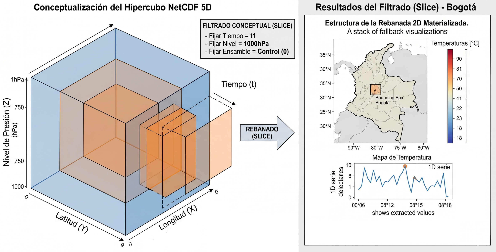
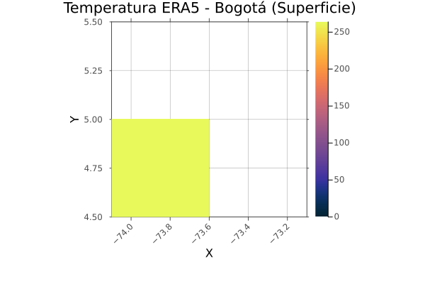
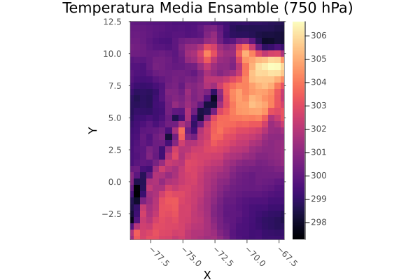
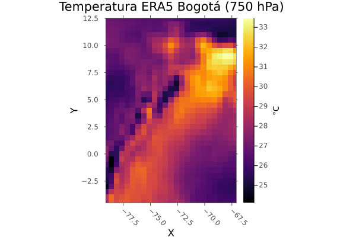
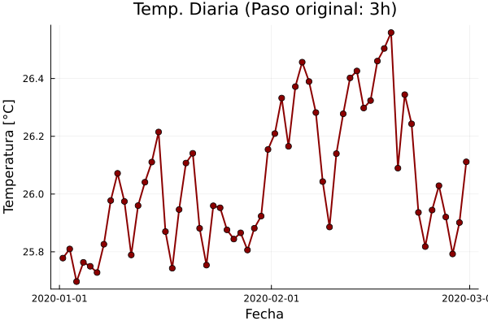
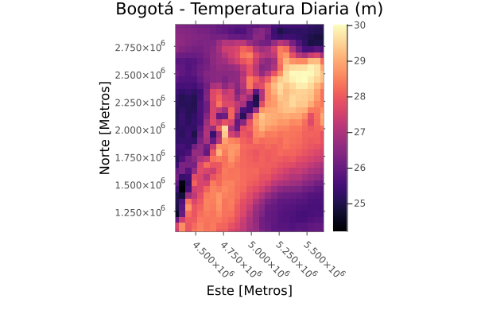

---
title: "Cubos Multidimensionales"
author: "Alexys H. Rodríguez-Avellaneda, PhD"
date: last-modified
format:
  html:
    toc: true
    code-fold: true
    embed-resources: true
    theme: cosmo
  pdf:
    keep-tex: true       # Esta es la etiqueta que buscas
    toc: true
    number-sections: true
    colorlinks: true
    papersize: letter
    #mermaid-format: png
    # Forzamos a Quarto a usar nuestro wrapper
    #chrome: /usr/local/bin/quarto-browser
execute-dir: project # Asegura contexto limpio
execute:
  cache: true        # Guarda los resultados en disco, si el código no cambia, no lo recalcula.
  freeze: auto       # Evita recompilar el código de capítulos anteriores si solo cambiaste texto.
  echo: true
  warning: false
  message: false
  daemon: false      # Evita que procesos en segundo plano interfieran
  enabled: true      # Asegura la ejecución
engine: knitr
---

execute:
  cache: true      
  freeze: auto     

## Funciones j_eval y j_plot en R

```{r}
#| label: j_eval_j_plot
#| code-fold: true
# #| include: false
source("./docs/j_eval_j_plot.r")
```


## Introducción

En la geomática tradicional, estamos acostumbrados a trabajar con capas que representan una superficie en dos dimensiones ($x, y$). Sin embargo, para comprender fenómenos dinámicos como el cambio climático, la oceanografía o la meteorología, es imperativo añadir dimensiones adicionales: el **tiempo** ($t$), la **altitud o niveles de presión** ($z$), e incluso la **incertidumbre** (miembros de ensamble).

Para reconstruir el comportamiento de estas dimensiones hacia el pasado, la ciencia atmosférica utiliza el concepto de **reanálisis**. Un reanálisis es una síntesis científica que combina billones de observaciones históricas (provenientes de satélites, estaciones terrestres, barcos y aviones) con modelos meteorológicos de vanguardia mediante técnicas de asimilación de datos. Este proceso genera un registro global, físicamente consistente y sin vacíos espaciales ni temporales, permitiendo observar la evolución de la atmósfera incluso en zonas donde no existen estaciones de medición.

A lo largo de este módulo, procesaremos datos de **ERA5**, el reanálisis global de quinta generación producido por el Centro Europeo de Previsiones Meteorológicas a Plazo Medio (ECMWF). Según **Hersbach et al. (2020)** [@hersbach2020era5], ERA5 proporciona una descripción detallada del estado de la atmósfera, la tierra y el océano desde 1940, ofreciendo una resolución espacial significativamente superior y una mejor representación de los ciclos hidrológicos y térmicos en comparación con sus predecesores.

Este capítulo aborda la gestión de estos hipercubos de datos mediante el formato **NetCDF** (*Network Common Data Form*), el estándar de oro para el intercambio de datos científicos. A diferencia de un archivo raster convencional, un NetCDF es un contenedor autónomo que no solo almacena matrices de números, sino también metadatos estructurados bajo las **convenciones CF** (*Climate and Forecast*). Estos metadatos permiten que el software "entienda" qué está leyendo, en qué unidades está y cómo se desplaza a través del tiempo sin intervención humana.

Aprenderemos a manejar arquitecturas de cinco dimensiones (5D), donde una sola variable como la temperatura se desglosa en múltiples niveles atmosféricos y escenarios de probabilidad. El objetivo es dominar el flujo de trabajo profesional —desde la lectura y decodificación temporal hasta la reproyección y persistencia de datos— utilizando **evaluación perezosa** (*lazy evaluation*) en R, Python y Julia. Esta técnica nos permitirá manipular gigabytes de información climática sobre el territorio colombiano de forma eficiente, materializando cálculos solo cuando sea estrictamente necesario para el análisis.

## Leer un archivo NetCDF

La lectura de archivos NetCDF (Network Common Data Form) representa un salto cualitativo respecto al manejo de imágenes raster tradicionales. Mientras que un archivo GeoTIFF suele ser una "fotografía" estática de la superficie, un NetCDF es un contenedor científico autodescriptivo. La clave de su potencia reside en la capacidad de las librerías modernas para interpretar las **convenciones CF** (Climate and Forecast), permitiendo que el software no solo lea números, sino que comprenda la física, el tiempo y el espacio que estos representan. 

En esta sección, exploraremos cómo R, Python y Julia gestionan la descarga, descompresión y apertura de estos cubos, haciendo especial énfasis en la **decodificación automática de metadatos** y en la asignación correcta de sistemas de referencia espaciales, procesos fundamentales para asegurar que nuestros análisis climáticos tengan rigor geográfico.

### Convenciones de metadatos Climate and Forecast (CF)

Las convenciones Climate and Forecast (CF) constituyen un estándar de metadatos diseñado para facilitar el procesamiento y el intercambio de archivos de datos geofísicos, específicamente aquellos almacenados en formato NetCDF (Network Common Data Form). El objetivo primordial es que cada variable cuente con una descripción suficiente para que los usuarios de los datos, o las aplicaciones como **xarray**, puedan identificar qué representan los datos, sus unidades físicas y su ubicación espacial y temporal sin necesidad de consultar documentación externa.

### Arquitectura de los metadatos

El cumplimiento de las normas CF permite que el software interprete automáticamente la semántica de los datos. Esto se logra mediante la inclusión de atributos específicos en el encabezado del archivo:

* **standard_name:** Atributo que utiliza una nomenclatura estandarizada (ej. `eastward_wind`) para describir la cantidad física, eliminando la ambigüedad de nombres de variables arbitrarios.
* **units:** Definición de las unidades de medida siguiendo el sistema UDUNITS (ej. `m s-1`).
* **coordinates:** Identificación de las variables de coordenadas (latitud, longitud, tiempo, nivel vertical) asociadas a una matriz de datos.
* **_FillValue:** Valor utilizado para representar datos faltantes o nulos.

### Decodificación de la dimensión temporal

En el código analizado, la mención a la decodificación automática de tiempo es fundamental. Según las convenciones CF, el tiempo no suele almacenarse como fechas legibles (ej. "2026-04-20"), sino como valores numéricos relativos a un origen o época (epoch). Un atributo típico de tiempo en un archivo NetCDF sigue el formato: `units: hours since 2010-01-01 00:00:00`.

Cuando **xarray** lee el archivo siguiendo estas normas, realiza las siguientes operaciones:

1.  Lectura del valor numérico y el atributo de unidades.
2.  Identificación del calendario utilizado (ej. `gregorian`, `noleap` o `360_day`).
3.  Conversión de los enteros o flotantes a objetos de tipo `datetime64[ns]` de **pandas/numpy**.

Este proceso transforma un eje puramente matemático en un eje temporal indexable, permitiendo realizar operaciones de selección por fechas, remuestreo (resampling) y agregaciones temporales de manera inmediata.

### Integración con sistemas de referencia de coordenadas (CRS)

Aunque las convenciones CF definen cómo describir proyecciones cartográficas mediante el atributo `grid_mapping`, herramientas como **rioxarray** extienden esta funcionalidad para traducir dichos metadatos al estándar internacional EPSG. Esto asegura que, al visualizar o exportar los datos a otros sistemas de información geográfica (SIG), la posición geoespacial sea interpretada correctamente por el software receptor.


::: {.panel-tabset}

#### Python

::: {.content-visible when-format="html"}
::: {.callout-tip collapse="true" icon="false"}
##### ▷ CÓDIGO PURO (Copiar y Pegar)

```{python}
#| label: python_leer_netcdf_multiplebands_codigo
#| eval: false

# ============================================================
# Lectura de NetCDF con múltiples bandas usando {xarray}
# + Decodificación automática de tiempo
# + Asignación de CRS WGS84 con {rioxarray}
# ============================================================

# -------------------------------
# 1. Cargar librerías necesarias
# -------------------------------
import urllib.request
import zipfile
import os
import xarray as xr
import rioxarray
import matplotlib.pyplot as plt

# -------------------------------
# 2. Configuración de rutas y directorios
# -------------------------------
# Definición del directorio de datos
data_dir = "./data_heavy/"

# Crear el directorio si no existe
if not os.path.exists(data_dir):
    os.makedirs(data_dir)
    print(f"Directorio creado: {data_dir}")

url = "http://geocorp.co/wind/goodland_10u_1.zip"
zip_file = os.path.join(data_dir, "10fg_2017_2018.zip")
nc_file = os.path.join(data_dir, "goodland_10u_1.nc")

# -------------------------------
# 3. Descargar y descomprimir datos
# -------------------------------
# Descargar archivo si no existe en la ruta especificada
if not os.path.exists(zip_file):
    print("Iniciando descarga...")
    urllib.request.urlretrieve(url, zip_file)
    print(f"Archivo descargado en: {zip_file}")

# Descomprimir dentro de ./data_heavy/
with zipfile.ZipFile(zip_file, 'r') as zip_ref:
    zip_ref.extractall(data_dir)
    print(f"Contenido extraído en: {data_dir}")

# -------------------------------
# 4. Leer el archivo NetCDF
# -------------------------------
# xarray lee las dimensiones y decodifica el tiempo desde la ruta local
if os.path.exists(nc_file):
    ds = xr.open_dataset(nc_file)
    print("Estructura del dataset:")
    print(ds)
else:
    print(f"Error: No se encontró el archivo {nc_file}")

# -------------------------------
# 5. Asignar sistema de referencia (CRS)
# -------------------------------
# xarray lee las dimensiones y decodifica el tiempo según convenciones CF
# Asignación de CRS WGS84 (EPSG:4326) usando rioxarray
ds.rio.write_crs("epsg:4326", inplace=True)

# -------------------------------
# 6. Ejemplo: extraer un tiempo específico
# -------------------------------
# Extraer la primera variable de datos (en este caso u10)
var_name = list(ds.data_vars)[0]
da = ds[var_name]

# Seleccionar el primer instante temporal (índice 0)
da_t0 = da.isel(time=0)
da_t0
fecha_0 = da.time.values[0]
fecha_0

# Graficar
da_t0.plot(cmap="viridis")
# Rotar etiquetas de longitud para evitar solapamiento
plt.xticks(rotation=45)
# Ajustar el layout para que las etiquetas no se corten
plt.tight_layout()
plt.title(f"Velocidad del viento\n{fecha_0}")
plt.show()

# -------------------------------
# 7. Ejemplo: promedio temporal
# -------------------------------
# Calcular media a lo largo del tiempo
da_mean = da.mean(dim="time")

# Graficar
da_mean.plot(cmap="viridis")
# Rotar etiquetas de longitud para evitar solapamiento
plt.xticks(rotation=45)
# Ajustar el layout para que las etiquetas no se corten
plt.tight_layout()
plt.title("Velocidad promedio del viento")
plt.show()
```

:::
:::

```{python}
#| label: python_leer_netcdf_multiplebands
#| fig-align: center
#| out-width: "80%"
# #| eval: false

# ============================================================
# Lectura de NetCDF con múltiples bandas usando {xarray}
# + Decodificación automática de tiempo
# + Asignación de CRS WGS84 con {rioxarray}
# ============================================================

# -------------------------------
# 1. Cargar librerías necesarias
# -------------------------------
import urllib.request
import zipfile
import os
import xarray as xr
import rioxarray
import matplotlib.pyplot as plt

# -------------------------------
# 2. Configuración de rutas y directorios
# -------------------------------
# Definición del directorio de datos
data_dir = "./data_heavy/"

# Crear el directorio si no existe
if not os.path.exists(data_dir):
    os.makedirs(data_dir)
    print(f"Directorio creado: {data_dir}")

url = "http://geocorp.co/wind/goodland_10u_1.zip"
zip_file = os.path.join(data_dir, "10fg_2017_2018.zip")
nc_file = os.path.join(data_dir, "goodland_10u_1.nc")

# -------------------------------
# 3. Descargar y descomprimir datos
# -------------------------------
# Descargar archivo si no existe en la ruta especificada
if not os.path.exists(zip_file):
    print("Iniciando descarga...")
    urllib.request.urlretrieve(url, zip_file)
    print(f"Archivo descargado en: {zip_file}")

# Descomprimir dentro de ./data_heavy/
with zipfile.ZipFile(zip_file, 'r') as zip_ref:
    zip_ref.extractall(data_dir)
    print(f"Contenido extraído en: {data_dir}")

# -------------------------------
# 4. Leer el archivo NetCDF
# -------------------------------
# xarray lee las dimensiones y decodifica el tiempo desde la ruta local
if os.path.exists(nc_file):
    ds = xr.open_dataset(nc_file)
    print("Estructura del dataset:")
    print(ds)
else:
    print(f"Error: No se encontró el archivo {nc_file}")

# -------------------------------
# 5. Asignar sistema de referencia (CRS)
# -------------------------------
# xarray lee las dimensiones y decodifica el tiempo según convenciones CF
# Asignación de CRS WGS84 (EPSG:4326) usando rioxarray
ds.rio.write_crs("epsg:4326", inplace=True)

# -------------------------------
# 6. Ejemplo: extraer un tiempo específico
# -------------------------------
# Extraer la primera variable de datos (en este caso u10)
var_name = list(ds.data_vars)[0]
da = ds[var_name]

# Seleccionar el primer instante temporal (índice 0)
da_t0 = da.isel(time=0)
da_t0
fecha_0 = da.time.values[0]
fecha_0

# Graficar
da_t0.plot(cmap="viridis")
# Rotar etiquetas de longitud para evitar solapamiento
plt.xticks(rotation=45)
# Ajustar el layout para que las etiquetas no se corten
plt.tight_layout()
plt.title(f"Velocidad del viento\n{fecha_0}")
plt.show()

# -------------------------------
# 7. Ejemplo: promedio temporal
# -------------------------------
# Calcular media a lo largo del tiempo
da_mean = da.mean(dim="time")

# Graficar
da_mean.plot(cmap="viridis")
# Rotar etiquetas de longitud para evitar solapamiento
plt.xticks(rotation=45)
# Ajustar el layout para que las etiquetas no se corten
plt.tight_layout()
plt.title("Velocidad promedio del viento")
plt.show()
```

#### R

::: {.content-visible when-format="html"}
::: {.callout-tip collapse="true" icon="false"}
##### ▷ CÓDIGO PURO (Copiar y Pegar)

```{r}
#| label: r_leer_netcdf_multiplebands_codigo 
#| eval: false
# ============================================================
# Lectura de NetCDF con múltiples bandas usando {stars}
# + Gestión de directorio local ./data_heavy/
# + Conversión de tiempo a fechas reales
# + Asignación de CRS WGS84
# ============================================================

# -------------------------------
# 1. Cargar librerías necesarias
# -------------------------------
library(stars)     # Manejo de datos raster multidimensionales
library(units)     # Manejo de unidades

# -------------------------------
# 2. Configuración de rutas
# -------------------------------
data_dir <- "./data_heavy/"

# Crear el directorio si no existe
if (!dir.exists(data_dir)) {
  dir.create(data_dir, recursive = TRUE)
  message(paste("Directorio creado:", data_dir))
}

# Definición de rutas completas
url <- "http://geocorp.co/wind/goodland_10u_1.zip"
zip_file <- file.path(data_dir, "10fg_2017_2018.zip")
nc_file <- file.path(data_dir, "goodland_10u_1.nc")

# -------------------------------
# 3. Descargar y descomprimir datos
# -------------------------------
# Descargar solo si el archivo NO existe en la ruta destino
if (!file.exists(zip_file)) {
  message("Iniciando descarga...")
  download.file(url, zip_file, mode = "wb")
} else {
  message("El archivo zip ya existe en el directorio de datos.")
}

# Descomprimir específicamente en el directorio indicado
unzip(zip_file, exdir = data_dir)

# -------------------------------
# 4. Configuración de entorno y lectura
# -------------------------------
# Ajuste de límite de bandas para series temporales extensas
Sys.setenv(GDAL_MAX_BAND_COUNT = 120000)

# Lectura del archivo desde la ruta procesada
if (file.exists(nc_file)) {
  y <- read_stars(nc_file, quiet = TRUE)
  print(y)
  y
} else {
  stop("Archivo .nc no encontrado en la ruta especificada.")
}

# -------------------------------
# 5. Asignar sistema de referencia (CRS)
# -------------------------------

# Según los valores de coordenadas:
# x ≈ longitudes (-102.7, etc.)
# y ≈ latitudes (40.62, etc.)
# → corresponde a WGS84 (EPSG:4326)

st_crs(y) <- 4326  # Asignación directa
y

# -------------------------------
# 6. Convertir dimensión temporal a fechas reales
# -------------------------------

# Extraer dimensión tiempo
time_vals <- st_get_dimension_values(y, "time")

# Ver unidades del tiempo
attr(time_vals, "units")

# En este caso:
# "hours since 1900-01-01 00:00:00"

# Convertir a POSIXct (fechas reales)
time_real <- as.POSIXct(
  time_vals,
  origin = "1900-01-01",
  tz = "UTC"
)

# Reemplazar dimensión en el objeto stars
st_set_dimensions(y, "time", values = time_real) -> y

# -------------------------------
# 7. Verificar resultado
# -------------------------------
y

# Revisar primeras fechas
head(st_get_dimension_values(y, "time"))

# -------------------------------
# 8. Ejemplo: extraer un tiempo específico
# -------------------------------

# Índice temporal que quieres graficar
i <- 1

# Seleccionar primer instante temporal
y_ti <- y[,,,i]

# Obtener la fecha correspondiente
fecha_i <- st_get_dimension_values(y, "time")[i]

# Crear título dinámico
titulo <- paste0(
  "Velocidad del viento: ",
  format(fecha_i, "%Y-%m-%d %H:%M UTC")
)

# -------------------------------
# Configuración de paleta y cortes
# -------------------------------
# Viridis es perceptualmente uniforme y coincide con la estética de Python
#pal <- hcl.colors(100, "YlGnBu", rev = TRUE)
pal <- hcl.colors(100, "Viridis") 

valores <- as.vector(y_ti[[1]])
brks <- seq(min(valores, na.rm = TRUE),
            max(valores, na.rm = TRUE),
            length.out = length(pal) + 1)

# -------------------------------
# Graficación mejorada
# -------------------------------
# Se aumenta key.width para legibilidad y se ajustan márgenes
par(mar = c(
  4,  # Margen inferior: suficiente espacio para etiquetas del eje X
  4,  # Margen izquierdo: espacio para etiquetas del eje Y
  5,  # Margen superior: espacio para el título (un poco más compacto)
  1   # Margen derecho: mínimo (útil si la leyenda está fuera o no es grande)
))


plot(
  y_ti,                  # Objeto stars a graficar
  col = pal,             # Paleta de colores
  main = "",             # Título del gráfico
  breaks = brks,         # Intervalos de valores (deben ser length(col) + 1)
  key.pos = 4,           # Posición de la leyenda (4 = derecha, 1 = abajo, ...)
  key.width = lcm(2),    # Ancho de la barra de la leyenda (en cm)
  key.length = 1,        # Longitud relativa de la leyenda (escala vertical)
  axes = TRUE,           # Mostrar ejes (coordenadas X e Y)
  reset = FALSE,         # Para poder añadir elementos después
  cex.axis = 0.8         # Tamaño de fuente en ejes
)


# Adición de etiquetas de eje de forma manual para mayor claridad
title(
  main = titulo,     # Texto del título principal
  cex.main = 0.8,    # Tamaño del título (1 = normal; 1.2 = 20% más grande)
  font.main = 1,     # Tipo de fuente del título (1 = normal, 2 = negrita, 
                     #                   3 = cursiva, 4 = negrita+cursiva)
  line = 0           # Ajustar según necesidad para evitar solapamiento                     
)
title(
  xlab = "Longitude [degrees_east]",  # Etiqueta del eje X
  line = 2.5                          # Distancia vertical desde el eje X 
                                      # hacia abajo (en líneas de texto);
                                      # valores mayores → más separado del eje
)
title(ylab = "Latitude [degrees_north]", line = 2.5)

# -------------------------------
# 9. Ejemplo: promedio temporal
# -------------------------------

# Calcular media a lo largo del tiempo
y_mean <- st_apply(y, c("x", "y"), mean, na.rm = TRUE)


pal <- hcl.colors(100, "Viridis") 
valores <- as.vector(y_mean[[1]])
brks <- seq(min(valores, na.rm = TRUE),
            max(valores, na.rm = TRUE),
            length.out = length(pal) + 1)

par(mar = c(4, 4, 4, 1))

titulo = "Velocidad promedio del viento"

plot(
  y_mean,                # Objeto stars a graficar
  col = pal,             # Paleta de colores
  main = "",             # Título del gráfico
  breaks = brks,         # Intervalos de valores (deben ser length(col) + 1)
  key.pos = 4,           # Posición de la leyenda (4 = derecha, 1 = abajo, ...)
  key.width = lcm(2),    # Ancho de la barra de la leyenda (en cm)
  key.length = 1,        # Longitud relativa de la leyenda (escala vertical)
  axes = TRUE,           # Mostrar ejes (coordenadas X e Y)
  reset = FALSE,         # Para poder añadir elementos después
  cex.axis = 0.8         # Tamaño de fuente en ejes
)

# Adición de etiquetas de eje de forma manual para mayor claridad
title(
  main = titulo,     # Texto del título principal
  cex.main = 0.8,    # Tamaño del título (1 = normal; 1.2 = 20% más grande)
  font.main = 1,     # Tipo de fuente del título (1 = normal, 2 = negrita, 
                     #                   3 = cursiva, 4 = negrita+cursiva)
  line = 0           # Ajustar según necesidad para evitar solapamiento
)
title(
  xlab = "Longitude [degrees_east]",  # Etiqueta del eje X
  line = 2.5                          # Distancia vertical desde el eje X 
                                      # hacia abajo (en líneas de texto);
                                      # valores mayores → más separado del eje
)
title(ylab = "Latitude [degrees_north]", line = 2.5)
```

:::
:::


```{r}
#| label: r_leer_netcdf_multiplebands
#| fig-align: center
#| out-width: "80%"
# #| eval: false

# ============================================================
# Lectura de NetCDF con múltiples bandas usando {stars}
# + Gestión de directorio local ./data_heavy/
# + Conversión de tiempo a fechas reales
# + Asignación de CRS WGS84
# ============================================================

# -------------------------------
# 1. Cargar librerías necesarias
# -------------------------------
library(stars)     # Manejo de datos raster multidimensionales
library(units)     # Manejo de unidades

# -------------------------------
# 2. Configuración de rutas
# -------------------------------
data_dir <- "./data_heavy/"

# Crear el directorio si no existe
if (!dir.exists(data_dir)) {
  dir.create(data_dir, recursive = TRUE)
  message(paste("Directorio creado:", data_dir))
}

# Definición de rutas completas
url <- "http://geocorp.co/wind/goodland_10u_1.zip"
zip_file <- file.path(data_dir, "10fg_2017_2018.zip")
nc_file <- file.path(data_dir, "goodland_10u_1.nc")

# -------------------------------
# 3. Descargar y descomprimir datos
# -------------------------------
# Descargar solo si el archivo NO existe en la ruta destino
if (!file.exists(zip_file)) {
  message("Iniciando descarga...")
  download.file(url, zip_file, mode = "wb")
} else {
  message("El archivo zip ya existe en el directorio de datos.")
}

# Descomprimir específicamente en el directorio indicado
unzip(zip_file, exdir = data_dir)

# -------------------------------
# 4. Configuración de entorno y lectura
# -------------------------------
# Ajuste de límite de bandas para series temporales extensas
Sys.setenv(GDAL_MAX_BAND_COUNT = 120000)

# Lectura del archivo desde la ruta procesada
if (file.exists(nc_file)) {
  y <- read_stars(nc_file, quiet = TRUE)
  print(y)
  y
} else {
  stop("Archivo .nc no encontrado en la ruta especificada.")
}

# -------------------------------
# 5. Asignar sistema de referencia (CRS)
# -------------------------------

# Según los valores de coordenadas:
# x ≈ longitudes (-102.7, etc.)
# y ≈ latitudes (40.62, etc.)
# → corresponde a WGS84 (EPSG:4326)

st_crs(y) <- 4326  # Asignación directa
y

# -------------------------------
# 6. Convertir dimensión temporal a fechas reales
# -------------------------------

# Extraer dimensión tiempo
time_vals <- st_get_dimension_values(y, "time")

# Ver unidades del tiempo
attr(time_vals, "units")

# En este caso:
# "hours since 1900-01-01 00:00:00"

# Convertir a POSIXct (fechas reales)
time_real <- as.POSIXct(
  time_vals,
  origin = "1900-01-01",
  tz = "UTC"
)

# Reemplazar dimensión en el objeto stars
st_set_dimensions(y, "time", values = time_real) -> y

# -------------------------------
# 7. Verificar resultado
# -------------------------------
y

# Revisar primeras fechas
head(st_get_dimension_values(y, "time"))

# -------------------------------
# 8. Ejemplo: extraer un tiempo específico
# -------------------------------

# Índice temporal que quieres graficar
i <- 1

# Seleccionar primer instante temporal
y_ti <- y[,,,i]

# Obtener la fecha correspondiente
fecha_i <- st_get_dimension_values(y, "time")[i]

# Crear título dinámico
titulo <- paste0(
  "Velocidad del viento: ",
  format(fecha_i, "%Y-%m-%d %H:%M UTC")
)

# -------------------------------
# Configuración de paleta y cortes
# -------------------------------
# Viridis es perceptualmente uniforme y coincide con la estética de Python
#pal <- hcl.colors(100, "YlGnBu", rev = TRUE)
pal <- hcl.colors(100, "Viridis") 

valores <- as.vector(y_ti[[1]])
brks <- seq(min(valores, na.rm = TRUE),
            max(valores, na.rm = TRUE),
            length.out = length(pal) + 1)

# -------------------------------
# Graficación mejorada
# -------------------------------
# Se aumenta key.width para legibilidad y se ajustan márgenes
par(mar = c(
  4,  # Margen inferior: suficiente espacio para etiquetas del eje X
  4,  # Margen izquierdo: espacio para etiquetas del eje Y
  5,  # Margen superior: espacio para el título (un poco más compacto)
  1   # Margen derecho: mínimo (útil si la leyenda está fuera o no es grande)
))


plot(
  y_ti,                  # Objeto stars a graficar
  col = pal,             # Paleta de colores
  main = "",             # Título del gráfico
  breaks = brks,         # Intervalos de valores (deben ser length(col) + 1)
  key.pos = 4,           # Posición de la leyenda (4 = derecha, 1 = abajo, ...)
  key.width = lcm(2),    # Ancho de la barra de la leyenda (en cm)
  key.length = 1,        # Longitud relativa de la leyenda (escala vertical)
  axes = TRUE,           # Mostrar ejes (coordenadas X e Y)
  reset = FALSE,         # Para poder añadir elementos después
  cex.axis = 0.8         # Tamaño de fuente en ejes
)


# Adición de etiquetas de eje de forma manual para mayor claridad
title(
  main = titulo,     # Texto del título principal
  cex.main = 0.8,    # Tamaño del título (1 = normal; 1.2 = 20% más grande)
  font.main = 1,     # Tipo de fuente del título (1 = normal, 2 = negrita, 
                     #                   3 = cursiva, 4 = negrita+cursiva)
  line = 0           # Ajustar según necesidad para evitar solapamiento                     
)
title(
  xlab = "Longitude [degrees_east]",  # Etiqueta del eje X
  line = 2.5                          # Distancia vertical desde el eje X 
                                      # hacia abajo (en líneas de texto);
                                      # valores mayores → más separado del eje
)
title(ylab = "Latitude [degrees_north]", line = 2.5)

# -------------------------------
# 9. Ejemplo: promedio temporal
# -------------------------------

# Calcular media a lo largo del tiempo
y_mean <- st_apply(y, c("x", "y"), mean, na.rm = TRUE)


pal <- hcl.colors(100, "Viridis") 
valores <- as.vector(y_mean[[1]])
brks <- seq(min(valores, na.rm = TRUE),
            max(valores, na.rm = TRUE),
            length.out = length(pal) + 1)

par(mar = c(4, 4, 4, 1))

titulo = "Velocidad promedio del viento"

plot(
  y_mean,                # Objeto stars a graficar
  col = pal,             # Paleta de colores
  main = "",             # Título del gráfico
  breaks = brks,         # Intervalos de valores (deben ser length(col) + 1)
  key.pos = 4,           # Posición de la leyenda (4 = derecha, 1 = abajo, ...)
  key.width = lcm(2),    # Ancho de la barra de la leyenda (en cm)
  key.length = 1,        # Longitud relativa de la leyenda (escala vertical)
  axes = TRUE,           # Mostrar ejes (coordenadas X e Y)
  reset = FALSE,         # Para poder añadir elementos después
  cex.axis = 0.8         # Tamaño de fuente en ejes
)

# Adición de etiquetas de eje de forma manual para mayor claridad
title(
  main = titulo,     # Texto del título principal
  cex.main = 0.8,    # Tamaño del título (1 = normal; 1.2 = 20% más grande)
  font.main = 1,     # Tipo de fuente del título (1 = normal, 2 = negrita, 
                     #                   3 = cursiva, 4 = negrita+cursiva)
  line = 0           # Ajustar según necesidad para evitar solapamiento
)
title(
  xlab = "Longitude [degrees_east]",  # Etiqueta del eje X
  line = 2.5                          # Distancia vertical desde el eje X 
                                      # hacia abajo (en líneas de texto);
                                      # valores mayores → más separado del eje
)
title(ylab = "Latitude [degrees_north]", line = 2.5)
```

#### Julia

::: {.content-visible when-format="html"}
::: {.callout-tip collapse="true" icon="false"}
##### ▷ CÓDIGO PURO (Copiar y Pegar)

```{julia}
#| label: julia_leer_netcdf_multiplebands_codigo
#| eval: false
# ============================================================
# Lectura de NetCDF con múltiples bandas usando {Rasters}
# + Interpretación nativa de dimensiones
# + Cálculo estadístico con {Statistics}
# + Gestión de directorio local ./data_heavy/
# ============================================================

# -------------------------------
# 1. Cargar librerías necesarias
# -------------------------------
using Downloads
using Rasters
using NCDatasets
using Plots
using Statistics

# -------------------------------
# 2. Configuración de rutas y directorios
# -------------------------------
data_dir = "./data_heavy/"

# Crear el directorio si no existe (recursivo por defecto)
if !isdir(data_dir)
    mkpath(data_dir)
    println("Directorio creado: $data_dir")
end

url = "http://geocorp.co/wind/goodland_10u_1.zip"
zip_file = joinpath(data_dir, "10fg_2017_2018.zip")
nc_file = joinpath(data_dir, "goodland_10u_1.nc")

# -------------------------------
# 3. Descargar y descomprimir datos
# -------------------------------
# Descargar solo si el archivo no existe en la ruta destino
if !isfile(zip_file)
    println("Iniciando descarga en $zip_file...")
    Downloads.download(url, zip_file)
end

# Extraer el contenido dentro del directorio de datos pesados
# Se utiliza el flag -d para especificar el destino de extracción
run(`unzip -o $zip_file -d $data_dir`)

# -------------------------------
# 4. Leer el archivo NetCDF
# -------------------------------
# Rasters.jl utiliza lazy loading a través de DiskArrays.jl
# Solo se cargan en memoria los metadatos y punteros al archivo
if isfile(nc_file)
    cube = Raster(nc_file)
    
    println("\nResumen del dataset:")
    println(summary(cube))
    
    println("\nDimensiones detectadas:")
    println(dims(cube))
else
    error("El archivo NetCDF no se encuentra en la ruta: $nc_file")
end

# -------------------------------
# 5. Ejemplo: extraer un tiempo específico
# -------------------------------
# Ti() permite seleccionar mediante índice en la dimensión temporal
# Los recortes con cube[...] su puramente perezosos
cube_t1 = cube[Ti(1)]
println(summary(cube_t1))
println(dims(cube_t1))

p1 = plot(cube_t1, title="Velocidad del viento - Instante 1", c=:viridis)
display(p1)

# -------------------------------
# 6. Ejemplo: promedio temporal
# -------------------------------
# Reducir el cubo multidimensional promediando sobre el tiempo (Ti)
# Se usa dropdims para remover la dimensión residual de longitud 1
cube_mean = dropdims(mean(cube, dims=Ti), dims=Ti)

p2 = plot(cube_mean, title="Velocidad promedio del viento", c=:viridis)
display(p2)
```

:::
:::

```{r}
#| label: julia_leer_netcdf_multiplebands
#| results: asis
#| code-fold: true
# #| eval: false

j_eval('
# ============================================================
# Lectura de NetCDF con múltiples bandas usando {Rasters}
# + Interpretación nativa de dimensiones
# + Cálculo estadístico con {Statistics}
# + Gestión de directorio local ./data_heavy/
# ============================================================

# -------------------------------
# 1. Cargar librerías necesarias
# -------------------------------
using Downloads
using Rasters
using NCDatasets
using Plots
using Statistics

# -------------------------------
# 2. Configuración de rutas y directorios
# -------------------------------
data_dir = "./data_heavy/"

# Crear el directorio si no existe (recursivo por defecto)
if !isdir(data_dir)
    mkpath(data_dir)
    println("Directorio creado: $data_dir")
end

url = "http://geocorp.co/wind/goodland_10u_1.zip"
zip_file = joinpath(data_dir, "10fg_2017_2018.zip")
nc_file = joinpath(data_dir, "goodland_10u_1.nc")

# -------------------------------
# 3. Descargar y descomprimir datos
# -------------------------------
# Descargar solo si el archivo no existe en la ruta destino
if !isfile(zip_file)
    println("Iniciando descarga en $zip_file...")
    Downloads.download(url, zip_file)
end

# Extraer el contenido dentro del directorio de datos pesados
# Se utiliza el flag -d para especificar el destino de extracción
run(`unzip -o $zip_file -d $data_dir`)

# -------------------------------
# 4. Leer el archivo NetCDF
# -------------------------------
# Rasters.jl utiliza lazy loading a través de DiskArrays.jl
# Solo se cargan en memoria los metadatos y punteros al archivo
if isfile(nc_file)
    cube = Raster(nc_file)
    
    println("\nResumen del dataset:")
    println(summary(cube))
    
    println("\nDimensiones detectadas:")
    println(dims(cube))
else
    error("El archivo NetCDF no se encuentra en la ruta: $nc_file")
end

# -------------------------------
# 5. Ejemplo: extraer un tiempo específico
# -------------------------------
# Ti() permite seleccionar mediante índice en la dimensión temporal
# Los recortes con cube[...] su puramente perezosos
cube_t1 = cube[Ti(1)]
println(summary(cube_t1))
println(dims(cube_t1))

p1 = plot(cube_t1, title="Velocidad del viento - Instante 1", c=:viridis)
display(p1)

# -------------------------------
# 6. Ejemplo: promedio temporal
# -------------------------------
# Reducir el cubo multidimensional promediando sobre el tiempo (Ti)
# Se usa dropdims para remover la dimensión residual de longitud 1
cube_mean = dropdims(mean(cube, dims=Ti), dims=Ti)

p2 = plot(cube_mean, title="Velocidad promedio del viento", c=:viridis)
savefig(p2, "images/c10_netcdf_mean_plot_julia.png")
')

knitr::include_graphics(c("images/c10_netcdf_time_plot_julia.png", "images/c10_netcdf_mean_plot_julia.png"))
```

:::

### Limitaciones en la Interpretación Automática de Estándares NetCDF

El cumplimiento de las convenciones CF (Climate and Forecast) constituye un marco de interoperabilidad, pero no garantiza una traducción automática y unívoca hacia objetos de datos espaciales en todos los entornos de programación. Mientras que bibliotecas como **xarray** en Python cuentan con motores de decodificación específicos (como `cftime`), el paquete **stars** en R depende de la abstracción de GDAL, lo que puede derivar en una interpretación incompleta de los metadatos.

**Factores que impiden la decodificación de metadatos:**

La necesidad de intervenir manualmente en la asignación de Sistemas de Referencia de Coordenadas (CRS) y en la conversión de ejes temporales responde a inconsistencias estructurales o limitaciones en los controladores de lectura:

1.  **Omisión del atributo grid_mapping:** Aunque el archivo siga las convenciones CF para las dimensiones de latitud, longitud y tiempo, si carece del atributo `grid_mapping`, las librerías basadas en GDAL no pueden inferir la proyección matemática exacta. En estos casos, el software interpreta los datos como una rejilla regular (curvilínea o no) pero carente de elipsoide o datum definido.
2.  **Codificación no estándar del CRS:** Algunos archivos NetCDF almacenan la información geoespacial en atributos específicos de modelos climáticos o versiones antiguas del estándar que los traductores de metadatos de GDAL no logran mapear hacia una cadena WKT o un código EPSG de forma nativa.
3.  **Ambigüedad en la dimensión temporal y unidades:** El estándar CF define el tiempo mediante una cadena de texto (ej. "hours since 1900-01-01"). Sin embargo, **stars** prioriza la integridad de los valores numéricos brutos almacenados en el arreglo. Si el controlador no detecta una estructura de calendario reconocida o si las unidades no están estrictamente vinculadas a la dimensión mediante el atributo `calendar`, el software retiene los valores como simples flotantes o enteros, delegando la conversión al usuario para evitar errores de redondeo o desajustes de zona horaria.

Por lo tanto, la asignación manual del CRS mediante `st_set_crs()` y la reconstrucción de la dimensión temporal con `st_set_dimensions()` tras una conversión a `POSIXct` son procedimientos necesarios para asegurar el rigor analítico. Estas acciones garantizan que el manejo de series temporales y la superposición de capas vectoriales se realicen sobre una base geográfica y cronológica verificada, mitigando las deficiencias de la detección automática.


### Resumen sintáctico de lectura y gestión básica

Esta tabla compara las funciones clave utilizadas para la gestión de cubos NetCDF.

| Operación | Python 🐍 | R 🔵 | Julia 🟣 |
| :--- | :--- | :--- | :--- |
| **Cargar librería** | `import xarray as xr` | `library(stars)` | `using Rasters` |
| **Lectura (Lazy)** | `xr.open_dataset(file)` | `read_stars(file, proxy=TRUE)` | `Raster(file)` |
| **Asignar CRS** | `ds.rio.write_crs("epsg:4326")` | `st_crs(y) <- 4326` | Automático vía metadatos |
| **Extraer tiempo** | `ds.time.values` | `st_get_dimension_values(y, "time")` | `lookup(cube, Ti)` |
| **Conversión tiempo** | Automática (Convenciones CF) | Manual via `as.POSIXct()` | Automática (Convenciones CF) |
| **Selección (Slice)** | `da.isel(time=0)` | `y[,,,i]` | `cube[Ti(1)]` |
| **Media temporal** | `da.mean(dim="time")` | `st_apply(y, c("x", "y"), mean)` | `mean(cube, dims=Ti)` |

**Notas:**
* **Python 🐍:** Es el más automatizado para estándares CF.
* **R 🔵:** Requiere mayor intervención manual en el eje temporal para garantizar rigor cronológico.
* **Julia 🟣:** Es *lazy* por diseño, lo que lo hace sumamente eficiente para archivos que superan la capacidad de la RAM.


## Leer y filtrar un archivo NetCDF 5D

El manejo de datos de reanálisis (como ERA5 de Copernicus) implica trabajar con estructuras de cinco dimensiones (5D). Estas dimensiones permiten capturar la temperatura (`t`) no solo en superficie ($x, y$), sino en diferentes niveles de presión atmosférica (`level`), a través del tiempo (`time`) y considerando múltiples escenarios o miembros de ensamble (`number`) para cuantificar la incertidumbre. Para un profesional en Colombia, estos datos son vitales en el análisis de eventos climáticos extremos en la Región Andina o el Caribe, permitiendo una comprensión volumétrica y temporal de la atmósfera sobre el territorio nacional.

### Conceptualización del Cubo 5D

{width=70% fig-align="center"}

### Resultados del Filtrado (Slice)

{width=90% fig-align="center"}


### Eficiencia computacional: el motor detrás de los grandes volúmenes

Procesar un archivo de cientos de megabytes (o gigabytes) en tres lenguajes distintos requiere entender cómo cada uno gestiona la memoria RAM para evitar colapsos del sistema. La clave no es "leer" el archivo, sino "conectarse" a él:

* **Python 🐍 (Dask):** Utiliza una estrategia de **fragmentación** (*chunking*). Divide el cubo en bloques pequeños y solo carga en memoria aquellos necesarios para el cálculo actual, permitiendo procesar datos que superan la capacidad física de la RAM.
* **R 🔵 (Stars Proxy):** Emplea un objeto **proxy** que almacena una "lista de intenciones" (*call list*). Las operaciones de filtrado o promedio no se ejecutan inmediatamente; R solo las anota y espera hasta que el usuario pide un mapa o un archivo de salida para procesar los datos por bandas.
* **Julia 🟣 (DiskArrays):** Se basa en una abstracción nativa de **arreglos de disco**. Julia trata al archivo NetCDF como si fuera una matriz residente en memoria, pero las operaciones de lectura ocurren de forma perezosa y altamente optimizada mediante iteradores que recorren el disco de forma lineal.

### Anatomía de las dimensiones en ERA5: El caso de los 37 niveles y 10 miembros

Para entender por qué nuestro archivo `download5Dcolombia.nc` tiene exactamente **37 niveles** y **10 miembros**, debemos remitirnos a la arquitectura del modelo global del Centro Europeo de Previsiones Meteorológicas a Plazo Medio (ECMWF).

#### ¿Por qué 37 niveles de presión (level)?

El estándar de ERA5 para niveles de presión define 37 capas que van desde los **1000 hPa** (cerca del nivel del mar) hasta **1 hPa** (en la parte alta de la estratosfera). 


**Propósito:**

1. **Resolución en la Troposfera:** La mayoría de estos 37 niveles se concentran en la parte baja de la atmósfera, donde ocurren los fenómenos climáticos que afectan nuestro mundo.
2. **Contexto Colombiano:** Colombia es un país de contrastes altitudinales. Al tener 37 niveles, podemos estudiar la temperatura desde el nivel del mar en Cartagena ($1000 \, hPa$), pasando por la Sabana de Bogotá ($\approx 750 \, hPa$), hasta llegar a las cimas de los Nevados como el Ritacuba Blanco o el Huila ($\approx 500 \, hPa$), y aún tener capas superiores para estudiar el comportamiento de la atmósfera sobre las cordilleras.

#### ¿Por qué 10 miembros de ensamble (number)?

El dataset que estamos usando es el **ERA5 EDA (Ensemble Data Assimilation)**. A diferencia del dataset de "alta resolución" que solo entrega un valor, el EDA entrega 10 versiones ligeramente diferentes de la misma realidad meteorológica.

**Propósito:**

1. **Cuantificación del error:** En ciencia de datos espaciales, no existe la "medida perfecta". Los 10 miembros (etiquetados del 0 al 9) representan 10 simulaciones donde se variaron levemente las observaciones iniciales.
2. **Cómputo de Incertidumbre:** Si sobre el departamento del Chocó los 10 miembros muestran temperaturas muy parecidas, nuestra confianza en el dato es máxima. Si los miembros divergen (uno dice 25°C y otro 28°C), el estudiante debe entender que hay alta incertidumbre en esa zona.
3. **El Miembro de Control:** Por convención, el miembro `0` es el experimento de control.


### Descarga del Archivo


Descargar el archivo [download5Dcolombia.zip](https://drive.google.com/file/d/1UgEsmJx2XM2Iuxr7L5s4IQ83rRS2Ngh1/view?usp=sharing) de 262 MB.

URL de descarga: "https://drive.google.com/file/d/1UgEsmJx2XM2Iuxr7L5s4IQ83rRS2Ngh1/view?usp=sharing"


### Verificación de los niveles de presión y su correspondencia

::: {.panel-tabset}

### Python

::: {.content-visible when-format="html"}
::: {.callout-tip collapse="true" icon="false"}
#### ▷ CÓDIGO PURO (Copiar y Pepar)
```{python}
#| label: python_verificacion_presion_codigo
#| eval: false

"""
Verificación integral de un cubo NetCDF ERA5 (EDA)

Este script:
1. Controla existencia de archivos (.nc / .zip)
2. Carga el dataset en modo lazy
3. Inspecciona:
   - dimensiones
   - variable principal
   - metadatos
   - forma del arreglo
4. Verifica la estructura vertical (niveles de presión)

Contexto físico:
---------------
La presión disminuye con la altura:
    ~1 hPa     → estratosfera alta
    ~500 hPa   → troposfera media
    ~1000 hPa  → superficie
"""

import xarray as xr
import os
import zipfile

# -------------------------------------------------------------------------
# Rutas
# -------------------------------------------------------------------------

path = "./data_heavy/"
ncname = "download5Dcolombia"
ncfile5d = os.path.join(path, ncname + ".nc")
zipfile_path = os.path.join(path, ncname + ".zip")


# -------------------------------------------------------------------------
# Control de existencia y descompresión
# -------------------------------------------------------------------------

if not os.path.exists(ncfile5d):

    if os.path.exists(zipfile_path):
        print(f"Archivo .nc no encontrado. Descomprimiendo {zipfile_path}")
        with zipfile.ZipFile(zipfile_path, 'r') as zip_ref:
            zip_ref.extractall(path)
    else:
        raise FileNotFoundError("No existe .nc ni .zip")

else:
    print(f"Usando archivo existente: {ncfile5d}")


# -------------------------------------------------------------------------
# Carga (lazy)
# -------------------------------------------------------------------------

# Carga lazy pero sin dask
ds = xr.open_dataset(ncfile5d)

# chunks="auto" activa Dask y divide el cubo en bloques manejables para la RAM
# Se requieren las librerías:
# xarray (instalada en el contenedor),
# netcdf4 (no instalada en el contenedor)
# y toolz (no instalada en el contenedor)
# ds = xr.open_dataset(ncfile5d, chunks="auto")

print("\n=== DATASET ===")
print(ds)


# -------------------------------------------------------------------------
# Dimensiones
# -------------------------------------------------------------------------

print("\n=== DIMENSIONES ===")
print(ds.dims)


# -------------------------------------------------------------------------
# Variable principal
# -------------------------------------------------------------------------

print("\n=== VARIABLES ===")
print(list(ds.data_vars))


# -------------------------------------------------------------------------
# Metadatos
# -------------------------------------------------------------------------

print("\n=== METADATOS ===")
print(ds.attrs)


# -------------------------------------------------------------------------
# Forma del arreglo
# -------------------------------------------------------------------------

print("\n=== SHAPE ===")
print(ds["t"].shape)


# -------------------------------------------------------------------------
# Niveles de presión
# -------------------------------------------------------------------------

z_levels = ds.level.values

print("\nPrimeros niveles (Alta atmósfera):")
print(z_levels[:2])

print("\nÚltimos niveles (Superficie):")
print(z_levels[-2:])

```

:::
:::

```{python}
#| label: python_verificacion_presion
# #| eval: false

"""
Verificación integral de un cubo NetCDF ERA5 (EDA)

Este script:
1. Controla existencia de archivos (.nc / .zip)
2. Carga el dataset en modo lazy
3. Inspecciona:
   - dimensiones
   - variable principal
   - metadatos
   - forma del arreglo
4. Verifica la estructura vertical (niveles de presión)

Contexto físico:
---------------
La presión disminuye con la altura:
    ~1 hPa     → estratosfera alta
    ~500 hPa   → troposfera media
    ~1000 hPa  → superficie
"""

import xarray as xr
import os
import zipfile

# -------------------------------------------------------------------------
# Rutas
# -------------------------------------------------------------------------

path = "./data_heavy/"
ncname = "download5Dcolombia"
ncfile5d = os.path.join(path, ncname + ".nc")
zipfile_path = os.path.join(path, ncname + ".zip")


# -------------------------------------------------------------------------
# Control de existencia y descompresión
# -------------------------------------------------------------------------

if not os.path.exists(ncfile5d):

    if os.path.exists(zipfile_path):
        print(f"Archivo .nc no encontrado. Descomprimiendo {zipfile_path}")
        with zipfile.ZipFile(zipfile_path, 'r') as zip_ref:
            zip_ref.extractall(path)
    else:
        raise FileNotFoundError("No existe .nc ni .zip")

else:
    print(f"Usando archivo existente: {ncfile5d}")


# -------------------------------------------------------------------------
# Carga (lazy)
# -------------------------------------------------------------------------

# Carga lazy pero sin dask
ds = xr.open_dataset(ncfile5d)

# chunks="auto" activa Dask y divide el cubo en bloques manejables para la RAM
# Se requieren las librerías:
# xarray (instalada en el contenedor),
# netcdf4 (no instalada en el contenedor)
# y toolz (no instalada en el contenedor)
#ds = xr.open_dataset(ncfile5d, chunks="auto")

print("\n=== DATASET ===")
print(ds)


# -------------------------------------------------------------------------
# Dimensiones
# -------------------------------------------------------------------------

print("\n=== DIMENSIONES ===")
print(ds.dims)


# -------------------------------------------------------------------------
# Variable principal
# -------------------------------------------------------------------------

print("\n=== VARIABLES ===")
print(list(ds.data_vars))


# -------------------------------------------------------------------------
# Metadatos
# -------------------------------------------------------------------------

print("\n=== METADATOS ===")
print(ds.attrs)


# -------------------------------------------------------------------------
# Forma del arreglo
# -------------------------------------------------------------------------

print("\n=== SHAPE ===")
print(ds["t"].shape)


# -------------------------------------------------------------------------
# Niveles de presión
# -------------------------------------------------------------------------

z_levels = ds.level.values

print("\nPrimeros niveles (Alta atmósfera):")
print(z_levels[:2])

print("\nÚltimos niveles (Superficie):")
print(z_levels[-2:])

```

### R

::: {.content-visible when-format="html"}
::: {.callout-tip collapse="true" icon="false"}
#### ▷ CÓDIGO PURO (Copiar y Pegar)
```{r}
#| label: r_verificacion_presion_codigo
#| eval: false

# -------------------------------------------------------------------------
# Librerías
# -------------------------------------------------------------------------
library(stars)
library(dplyr)
library(sf)

# Ajuste de variables de entorno de GDAL
# Se incrementa el límite de bandas para permitir el procesamiento de cubos 5D 
# con una densidad temporal o vertical elevada (ej. ERA5 o modelos climáticos).
Sys.setenv(GDAL_MAX_BAND_COUNT = 1200000)

# -------------------------------------------------------------------------
# Rutas y nombres de archivos
# -------------------------------------------------------------------------

path     <- "./data_heavy/"
ncname   <- "download5Dcolombia"
ncfile5d <- paste0(path, ncname, ".nc")
zipfile  <- paste0(path, ncname, ".zip")

# -------------------------------------------------------------------------
# Control de existencia y descompresión de archivos
# -------------------------------------------------------------------------

if (!file.exists(ncfile5d)) {

  if (file.exists(zipfile)) {
    message("Descomprimiendo archivo...")
    unzip(zipfile, exdir = path)
  } else {
    stop("No existe .nc ni .zip")
  }

} else {
  message("Usando archivo existente")
}

# -------------------------------------------------------------------------
# Carga lazy
# -------------------------------------------------------------------------

# Lectura mediante proxy=TRUE para manipulación diferida (lazy evaluation).
# Esto permite definir recortes espaciales y temporales sin cargar todo el 
# archivo.
st_col5d = read_stars(ncfile5d, proxy=TRUE)

# Warning: dimension #1 (number) is not a Time dimension.
# Explicación: GDAL identifica "number" (ensamble) y aclara que no cumple 
# con los atributos CF de tiempo; se procesa como dimensión entera.

# Warning: The dataset has several variables that could be identified as vector fields...
# Explicación: Si hubiera vientos U/V, GDAL no los agrupa automáticamente por 
# discrepancias dimensionales; se cargan como atributos escalares.

# Chequeto de CRS
st_crs(st_col5d)

# Asignación de CRS en {stars}
# Opción 1: Asignación directa (reemplaza el NA en el objeto existente)
#st_crs(st_col5d) <- 4326
# Opción 2: Usando st_set_crs (estilo funcional/pipe)
st_col5d <- st_col5d %>% st_set_crs(4326)
#st_col5d <- st_set_crs(st_col5d, 4326)

cat("\n=== DATASET ===\n")
print(st_col5d)

# -------------------------------------------------------------------------
# Dimensiones
# -------------------------------------------------------------------------

cat("\n=== DIMENSIONES ===\n")
print(st_dimensions(st_col5d))

# -------------------------------------------------------------------------
# Variable
# -------------------------------------------------------------------------

cat("\n=== VARIABLES ===\n")
print(names(st_col5d))

# -------------------------------------------------------------------------
# Metadatos
# -------------------------------------------------------------------------

cat("\n=== METADATOS ===\n")
print(st_get_dimension_values(st_col5d, names(st_dimensions(st_col5d))[1]))

# (Nota: stars no expone attrs globales tan directo como xarray/Julia)

# -------------------------------------------------------------------------
# Forma
# -------------------------------------------------------------------------

cat("\n=== SHAPE ===\n")
print(dim(st_col5d))

# -------------------------------------------------------------------------
# Niveles
# -------------------------------------------------------------------------

niveles_presion <- st_get_dimension_values(st_col5d, "level")

cat("\nPrimeros niveles:\n")
print(head(niveles_presion, 2))

cat("\nÚltimos niveles:\n")
print(tail(niveles_presion, 2))
```

:::
:::

```{r}
#| label: r_verificacion_presion
# #| eval: false

# -------------------------------------------------------------------------
# Librerías
# -------------------------------------------------------------------------
library(stars)
library(dplyr)
library(sf)

# Ajuste de variables de entorno de GDAL
# Se incrementa el límite de bandas para permitir el procesamiento de cubos 5D 
# con una densidad temporal o vertical elevada (ej. ERA5 o modelos climáticos).
Sys.setenv(GDAL_MAX_BAND_COUNT = 1200000)

# -------------------------------------------------------------------------
# Rutas y nombres de archivos
# -------------------------------------------------------------------------

path     <- "./data_heavy/"
ncname   <- "download5Dcolombia"
ncfile5d <- paste0(path, ncname, ".nc")
zipfile  <- paste0(path, ncname, ".zip")

# -------------------------------------------------------------------------
# Control de existencia y descompresión de archivos
# -------------------------------------------------------------------------

if (!file.exists(ncfile5d)) {

  if (file.exists(zipfile)) {
    message("Descomprimiendo archivo...")
    unzip(zipfile, exdir = path)
  } else {
    stop("No existe .nc ni .zip")
  }

} else {
  message("Usando archivo existente")
}

# -------------------------------------------------------------------------
# Carga lazy
# -------------------------------------------------------------------------

# Lectura mediante proxy=TRUE para manipulación diferida (lazy evaluation).
# Esto permite definir recortes espaciales y temporales sin cargar todo el 
# archivo.
st_col5d = read_stars(ncfile5d, proxy=TRUE)

# Warning: dimension #1 (number) is not a Time dimension.
# Explicación: GDAL identifica "number" (ensamble) y aclara que no cumple 
# con los atributos CF de tiempo; se procesa como dimensión entera.

# Warning: The dataset has several variables that could be identified as vector fields...
# Explicación: Si hubiera vientos U/V, GDAL no los agrupa automáticamente por 
# discrepancias dimensionales; se cargan como atributos escalares.

# Chequeto de CRS
st_crs(st_col5d)

# Asignación de CRS en {stars}
# Opción 1: Asignación directa (reemplaza el NA en el objeto existente)
#st_crs(st_col5d) <- 4326
# Opción 2: Usando st_set_crs (estilo funcional/pipe)
st_col5d <- st_col5d %>% st_set_crs(4326)
#st_col5d <- st_set_crs(st_col5d, 4326)

cat("\n=== DATASET ===\n")
print(st_col5d)

# -------------------------------------------------------------------------
# Dimensiones
# -------------------------------------------------------------------------

cat("\n=== DIMENSIONES ===\n")
print(st_dimensions(st_col5d))

# -------------------------------------------------------------------------
# Variable
# -------------------------------------------------------------------------

cat("\n=== VARIABLES ===\n")
print(names(st_col5d))

# -------------------------------------------------------------------------
# Metadatos
# -------------------------------------------------------------------------

cat("\n=== METADATOS ===\n")
print(st_get_dimension_values(st_col5d, names(st_dimensions(st_col5d))[1]))

# (Nota: stars no expone attrs globales tan directo como xarray/Julia)

# -------------------------------------------------------------------------
# Forma
# -------------------------------------------------------------------------

cat("\n=== SHAPE ===\n")
print(dim(st_col5d))

# -------------------------------------------------------------------------
# Niveles
# -------------------------------------------------------------------------

niveles_presion <- st_get_dimension_values(st_col5d, "level")

cat("\nPrimeros niveles:\n")
print(head(niveles_presion, 2))

cat("\nÚltimos niveles:\n")
print(tail(niveles_presion, 2))
```

### Julia

::: {.content-visible when-format="html"}
::: {.callout-tip collapse="true" icon="false"}
#### ▷ CÓDIGO PURO (Copiar y Pegar)
```{julia}
#| label: julia_verificacion_presion_codigo
#| eval: false

using Rasters
# Usa internamente DiskArrays.jl 
#   Cuando cargas un NetCDF grande, Julia crea una "vista" del disco duro

using NCDatasets
using Printf
using Statistics


# -------------------------------------------------------------------------
# Rutas
# -------------------------------------------------------------------------

path = "./data_heavy/"
ncname = "download5Dcolombia"
ncfile5d = joinpath(path, ncname * ".nc")
zipfile = joinpath(path, ncname * ".zip")

# -------------------------------------------------------------------------
# Control de archivos
# -------------------------------------------------------------------------

if !isfile(ncfile5d)
    if !isfile(zipfile)
        error("No existe .nc ni .zip")
    end
else
    println("Usando archivo existente")
end


# -------------------------------------------------------------------------
# Carga lazy
# -------------------------------------------------------------------------

# Dimensiones: X, Y, Z (level), Int (number), Ti (time)
cube = Raster(ncfile5d); nothing

# -------------------------------------------------------------------------
# Dimensiones
# -------------------------------------------------------------------------

println("\n=== DIMENSIONES ===")
println(Rasters.dims(cube))

# -------------------------------------------------------------------------
# Variable
# -------------------------------------------------------------------------

println("\n=== VARIABLE ===")
println(Rasters.name(cube))

# -------------------------------------------------------------------------
# Metadatos
# -------------------------------------------------------------------------

println("\n=== METADATOS ===")
println(Rasters.metadata(cube))

# -------------------------------------------------------------------------
# Shape
# -------------------------------------------------------------------------

println("\n=== SHAPE ===")
println(size(cube))

# -------------------------------------------------------------------------
# Niveles
# -------------------------------------------------------------------------

z_levels = dims(cube, Z); nothing

println("\nPrimeros niveles:")
println(z_levels[1:2])

println("\nÚltimos niveles:")
println(z_levels[end-1:end])

```

:::
:::

```{r}
#| label: julia_verificacion_presion
#| results: asis
#| code-fold: true
# #| eval: false

j_eval('
using Rasters
# Usa internamente DiskArrays.jl 
#   Cuando cargas un NetCDF grande, Julia crea una "vista" del disco duro


using NCDatasets
using Printf
using Statistics

# -------------------------------------------------------------------------
# Rutas
# -------------------------------------------------------------------------

path = "./data_heavy/"
ncname = "download5Dcolombia"
ncfile5d = joinpath(path, ncname * ".nc")
zipfile = joinpath(path, ncname * ".zip")

# -------------------------------------------------------------------------
# Control de archivos
# -------------------------------------------------------------------------

if !isfile(ncfile5d)
    if !isfile(zipfile)
        error("No existe .nc ni .zip")
    end
else
    println("Usando archivo existente")
end


# -------------------------------------------------------------------------
# Carga lazy
# -------------------------------------------------------------------------

# Dimensiones: X, Y, Z (level), Int (number), Ti (time)
cube = Raster(ncfile5d); nothing

# -------------------------------------------------------------------------
# Dimensiones
# -------------------------------------------------------------------------

println("\n=== DIMENSIONES ===")
println(Rasters.dims(cube))

# -------------------------------------------------------------------------
# Variable
# -------------------------------------------------------------------------

println("\n=== VARIABLE ===")
println(Rasters.name(cube))

# -------------------------------------------------------------------------
# Metadatos
# -------------------------------------------------------------------------

println("\n=== METADATOS ===")
println(Rasters.metadata(cube))

# -------------------------------------------------------------------------
# Shape
# -------------------------------------------------------------------------

println("\n=== SHAPE ===")
println(size(cube))

# -------------------------------------------------------------------------
# Niveles
# -------------------------------------------------------------------------

z_levels = dims(cube, Z); nothing

println("\nPrimeros niveles:")
println(z_levels[1:2])

println("\nÚltimos niveles:")
println(z_levels[end-1:end])
')
```

:::


### Lectura y filtrado

::: {.panel-tabset}

### Python

::: {.content-visible when-format="html"}
::: {.callout-tip collapse="true" icon="false"}
#### ▷ CÓDIGO PURO (Copiar y Pegar)

```{python}
#| label: python_leer_netcdf_5D_codigo
#| eval: false

import matplotlib.pyplot as plt

# ============================================================
# Selección avanzada en cubo 5D (ERA5) con xarray
# - Selección por dimensiones (level, number, time)
# - Selección espacial (bounding box Bogotá)
# - Extracción de variable
# - Reducción a slice 2D + Visualización
# ============================================================

# -------------------------------------------------------------------------
# Selección 1: Subconjunto por dimensiones (label-based)
# -------------------------------------------------------------------------
# Selecciona:
# - miembro de ensamble 0
# - primeros dos niveles de presión
# - primer instante temporal
sel_dim = ds.sel(
    number=0,
    level=ds.level[:2],
    time=ds.time[0]
)

print(sel_dim)


# -------------------------------------------------------------------------
# Selección 2: Recorte espacial (Bogotá - WGS84)
# -------------------------------------------------------------------------
# Nota:
# - longitude = eje X
# - latitude  = eje Y
# - slice respeta orden de coordenadas

sel_bogota = ds.sel(
    longitude=slice(-74.25, -73.90),
    latitude=slice(4.85, 4.45)
)

print(sel_bogota)


# -------------------------------------------------------------------------
# Extracción de variable
# -------------------------------------------------------------------------
# 't' corresponde a temperatura (K)
t_bogota = sel_bogota["t"]

print(t_bogota)

# -------------------------------------------------------------------------
# Slice 2D (reducción dimensional)
# -------------------------------------------------------------------------
# Selecciona:
# - nivel más bajo (aprox. superficie)
# - ensamble 0
# - tiempo 0

capa_2d = t_bogota.isel(
    level=-1,
    number=0,
    time=0
)

print(capa_2d)

# Visualización de la matriz de datos
# El objeto se materializa (RAM) al usar .values
print(capa_2d.values)

# Verificación de las dimensiones restantes
print(capa_2d.dims)

# Verificación de los valores de las coordenadas
print(capa_2d.coords)

# Extracción de los valores de latitud o longitud asociados
eje_x = capa_2d.longitude.values
eje_y = capa_2d.latitude.values
print(eje_x)
print(eje_y)

# Verificación y extracción robusta
for dim in capa_2d.dims:
    print(f"Valores en la dimensión {dim}: {capa_2d[dim].values}")

# -------------------------------------------------------------------------
# Plot
# -------------------------------------------------------------------------


if capa_2d.size > 1:
    # Imprimir como mapa: requiere mínimo matriz de 2 x 2
    # El objeto se materializa (RAM) al usar .plot()
    capa_2d.plot(cmap="coolwarm")
else:
    print("⚠️ Solo hay un pixel, no se puede hacer plot espacial")
    # Esto ya no es un mapa, es un escalar
    plt.imshow(capa_2d.values.reshape(1,1), cmap="coolwarm")
    plt.colorbar(label="Temperatura (K)")

plt.title("Temperatura ERA5 - Bogotá (Superficie)")
plt.show()
```

:::
:::

```{python}
#| label: python_leer_netcdf_5D
#| fig-align: center
#| out-width: "80%"
# #| eval: false

import matplotlib.pyplot as plt

# ============================================================
# Selección avanzada en cubo 5D (ERA5) con xarray
# - Selección por dimensiones (level, number, time)
# - Selección espacial (bounding box Bogotá)
# - Extracción de variable
# - Reducción a slice 2D + Visualización
# ============================================================

# -------------------------------------------------------------------------
# Selección 1: Subconjunto por dimensiones (label-based)
# -------------------------------------------------------------------------
# Selecciona:
# - miembro de ensamble 0
# - primeros dos niveles de presión
# - primer instante temporal
sel_dim = ds.sel(
    number=0,
    level=ds.level[:2],
    time=ds.time[0]
)

print(sel_dim)


# -------------------------------------------------------------------------
# Selección 2: Recorte espacial (Bogotá - WGS84)
# -------------------------------------------------------------------------
# Nota:
# - longitude = eje X
# - latitude  = eje Y
# - slice respeta orden de coordenadas

sel_bogota = ds.sel(
    longitude=slice(-74.25, -73.90),
    latitude=slice(4.85, 4.45)
)

print(sel_bogota)


# -------------------------------------------------------------------------
# Extracción de variable
# -------------------------------------------------------------------------
# 't' corresponde a temperatura (K)
t_bogota = sel_bogota["t"]

print(t_bogota)

# -------------------------------------------------------------------------
# Slice 2D (reducción dimensional)
# -------------------------------------------------------------------------
# Selecciona:
# - nivel más bajo (aprox. superficie)
# - ensamble 0
# - tiempo 0

capa_2d = t_bogota.isel(
    level=-1,
    number=0,
    time=0
)

print(capa_2d)

# Visualización de la matriz de datos
# El objeto se materializa (RAM) al usar .values
print(capa_2d.values)

# Verificación de las dimensiones restantes
print(capa_2d.dims)

# Verificación de los valores de las coordenadas
print(capa_2d.coords)

# Extracción de los valores de latitud o longitud asociados
eje_x = capa_2d.longitude.values
eje_y = capa_2d.latitude.values
print(eje_x)
print(eje_y)

# Verificación y extracción robusta
for dim in capa_2d.dims:
    print(f"Valores en la dimensión {dim}: {capa_2d[dim].values}")

# -------------------------------------------------------------------------
# Plot
# -------------------------------------------------------------------------

if capa_2d.size > 1:
    # Imprimir como mapa: requiere mínimo matriz de 2 x 2
    # El objeto se materializa (RAM) al usar .plot()
    capa_2d.plot(cmap="coolwarm")
else:
    print("⚠️ Solo hay un pixel, no se puede hacer plot espacial")
    # Esto ya no es un mapa, es un escalar
    plt.imshow(capa_2d.values.reshape(1,1), cmap="coolwarm")
    plt.colorbar(label="Temperatura (K)")

plt.title("Temperatura ERA5 - Bogotá (Superficie)")
plt.show()

```

### R

::: {.content-visible when-format="html"}
::: {.callout-tip collapse="true" icon="false"}
#### ▷ CÓDIGO PURO (Copiar y Pegar)

```{r}
#| label: r_leer_netcdf_5D_codigo 
#| eval: false

library(stars)
library(dplyr)
library(sf)
library(ggplot2)

# ============================================================
# Selección avanzada en cubo 5D (ERA5) con {stars}
# - Selección por dimensiones
# - Recorte espacial (Bogotá)
# - Extracción de variable
# - Reducción a slice 2D + Visualización
# ============================================================

# -------------------------------------------------------------------------
# Selección de atributos mediante indexación posicional
# -------------------------------------------------------------------------
# El filtrado se realiza sobre las dimensiones del cubo (atributos, x, y, level, number, time).
# st_as_stars() materializa el recorte en memoria tras la selección.
# pero la indexación posicional no funciona, porque internamente
# el orden de las dimensiones puede ser diferente a como se despliega en el objeto stars
# mySel1 <- st_as_stars(st_col5d[         , 1:25,   1:35,   1:2,      1, 1   ])
# mySel1 <- st_as_stars(st_col5d[ atributo,    x,      y, level, number, time])
# mySel1 <- st_as_stars(st_col5d[,1:25,1:35,1:2,1,1])


# Simplificación de la estructura
# adrop() elimina dimensiones unitarias (longitud 1) generadas tras la selección.
# mySel1 <- mySel1 %>% adrop()

# -------------------------------------------------------------------------
# Selección 1: Subconjunto por dimensiones.
#              Mediante verbos de dplyr.
# -------------------------------------------------------------------------
# Selecciona:
# - niveles 1 y 2
# - miembro de ensamble 1
# - tiempo 1

sel_dim <- st_col5d %>% 
  slice(level, 1:2) %>% 
  slice(number, 1) %>% 
  slice(time, 1)

# Materializa en memoria
sel_dim <- st_as_stars(sel_dim)
sel_dim


# -------------------------------------------------------------------------
# Selección 2: Recorte espacial (Bogotá)
# -------------------------------------------------------------------------
# Bounding box en WGS84

bog_bbox <- st_bbox(
  c(xmin = -74.25, ymin = 4.45,
    xmax = -73.90, ymax = 4.85),
  crs = st_crs(4326)
)

# Recorte espacial sobre el proxy
# Nota: Ambos objetos deben tener el mismo CRS
sel_bogota <- st_crop(st_col5d, bog_bbox)
sel_bogota <- st_as_stars(sel_bogota)
sel_bogota


# -------------------------------------------------------------------------
# Slice 2D
# -------------------------------------------------------------------------
# Selecciona:
# - último nivel
# - ensamble 1
# - tiempo 1

capa_2d <- sel_bogota %>%
  slice(level, length(st_get_dimension_values(st_col5d, "level"))) %>%
  slice(number, 1) %>%
  slice(time, 1) %>%
  adrop() # borra dimensiones unitarias

capa_2d


# Alternativa mediante indexación de atributos
print(capa_2d[[1]])

# Verificación de las dimensiones restantes (nombres)
print(names(st_dimensions(capa_2d)))

# Verificación de los valores de las coordenadas y metadatos completos
print(st_dimensions(capa_2d))

# Extracción de los valores de longitud (x) y latitud (y)
# Se asume que las dimensiones se llaman "x" e "y" tras el procesamiento
eje_x <- st_get_dimension_values(capa_2d, "x")
eje_y <- st_get_dimension_values(capa_2d, "y")

print(eje_x)
print(eje_y)

# Verificación y extracción robusta
dimensiones_nombres <- names(st_dimensions(capa_2d))

for (dim in dimensiones_nombres) {
  valores <- st_get_dimension_values(capa_2d, dim)
  cat(paste0("Valores en la dimensión ", dim, ": "), paste(valores, collapse = ", "), "\n")
}

# -------------------------------------------------------------------------
# Plot simple según tamaño del objeto stars
# -------------------------------------------------------------------------

# -------------------------------------------------------------------------
# Control de renderizado para resolución espacial baja y variables con unidades
# -------------------------------------------------------------------------
library(viridis)

# 1. Recuperar dimensiones
dim_x <- dim(capa_2d)["x"]
dim_y <- dim(capa_2d)["y"]

if (dim_x >= 2 && dim_y >= 2) {
  
  plot(capa_2d[1], 
       main = "Temperatura ERA5 - Bogotá [K]", 
       col = paleta_colores, 
       breaks = cortes_leyenda, 
       key.pos = 4)
       
} else {
  
  message("Resolución espacial baja. Renderizando matriz nativa sin unidades.")
  
  # -------------------------------------------------------------------------
  # Control de renderizado de matriz nativa aplicando el rango global
  # -------------------------------------------------------------------------
  library(viridis)
    
  # 1. Definir rango global (del stars original sel_bogota)
  rango_global <- range(sel_bogota[[1]], na.rm = TRUE)
    
  # 2. Remover la clase 'units' (ej. [K]) para evitar conflictos con image() nativo
  rango_num <- as.numeric(rango_global)
    
  # 3. Extraer valores y asegurar estructura de matriz puramente numérica
  matriz_valores <- as.numeric(drop(capa_2d[[1]]))
  matriz_valores <- matrix(matriz_valores, nrow = dim_x, ncol = dim_y)
    
  # 4. Configurar la paleta de colores
  paleta_colores <- viridis::magma(11)
    
  # Dividir la ventana gráfica: 80% para el mapa, 20% para la leyenda
  layout(matrix(1:2, ncol = 2), widths = c(4, 1))
    
  # --- PANEL 1: MAPA ---
  par(mar = c(5, 4, 4, 0) + 0.1)
    
  # Se utiliza zlim = rango_num para obligar a que los colores de la matriz 
  # se mapeen estrictamente dentro del rango global, no del local.
  image(z = matriz_valores, 
        main = "Temperatura ERA5 [K]", 
        col = paleta_colores, 
        zlim = rango_num, 
        axes = FALSE)
  box()
    
  # --- PANEL 2: LEYENDA ---
  par(mar = c(5, 0, 4, 4) + 0.1)
    
  # Se construye el eje de la leyenda basándose en el rango global numérico
  eje_leyenda <- seq(rango_num[1], rango_num[2], length.out = length(paleta_colores) + 1)
    
  image(x = 1, 
        y = eje_leyenda, 
        z = t(as.matrix(eje_leyenda[-1])), 
        col = paleta_colores, 
        zlim = rango_num, 
        axes = FALSE, 
        xlab = "", 
        ylab = "")
    
  # Añadir los valores del rango global en el eje derecho
  axis(4) 
    
  # Restaurar la configuración de la ventana gráfica
  layout(1)
  par(mar = c(5, 4, 4, 2) + 0.1)
}

ggplot() +
  # geom_stars extrae automáticamente las coordenadas y el valor del píxel
  geom_stars(data = capa_2d)
```

:::
:::

```{r}
#| label: r_leer_netcdf_5D
#| fig-align: center
#| out-width: "80%"
# #| eval: false

library(stars)
library(dplyr)
library(sf)
library(ggplot2)

# ============================================================
# Selección avanzada en cubo 5D (ERA5) con {stars}
# - Selección por dimensiones
# - Recorte espacial (Bogotá)
# - Extracción de variable
# - Reducción a slice 2D + Visualización
# ============================================================

# -------------------------------------------------------------------------
# Selección de atributos mediante indexación posicional
# -------------------------------------------------------------------------
# El filtrado se realiza sobre las dimensiones del cubo (atributos, x, y, level, number, time).
# st_as_stars() materializa el recorte en memoria tras la selección.
# pero la indexación posicional no funciona, porque internamente
# el orden de las dimensiones puede ser diferente a como se despliega en el objeto stars
# mySel1 <- st_as_stars(st_col5d[         , 1:25,   1:35,   1:2,      1, 1   ])
# mySel1 <- st_as_stars(st_col5d[ atributo,    x,      y, level, number, time])
# mySel1 <- st_as_stars(st_col5d[,1:25,1:35,1:2,1,1])


# Simplificación de la estructura
# adrop() elimina dimensiones unitarias (longitud 1) generadas tras la selección.
# mySel1 <- mySel1 %>% adrop()

# -------------------------------------------------------------------------
# Selección 1: Subconjunto por dimensiones.
#              Mediante verbos de dplyr.
# -------------------------------------------------------------------------
# Selecciona:
# - niveles 1 y 2
# - miembro de ensamble 1
# - tiempo 1

sel_dim <- st_col5d %>% 
  slice(level, 1:2) %>% 
  slice(number, 1) %>% 
  slice(time, 1)

# Materializa en memoria
sel_dim <- st_as_stars(sel_dim)
sel_dim


# -------------------------------------------------------------------------
# Selección 2: Recorte espacial (Bogotá)
# -------------------------------------------------------------------------
# Bounding box en WGS84

bog_bbox <- st_bbox(
  c(xmin = -74.25, ymin = 4.45,
    xmax = -73.90, ymax = 4.85),
  crs = st_crs(4326)
)

# Recorte espacial sobre el proxy
# Nota: Ambos objetos deben tener el mismo CRS
sel_bogota <- st_crop(st_col5d, bog_bbox)
sel_bogota <- st_as_stars(sel_bogota)
sel_bogota


# -------------------------------------------------------------------------
# Slice 2D
# -------------------------------------------------------------------------
# Selecciona:
# - último nivel
# - ensamble 1
# - tiempo 1

capa_2d <- sel_bogota %>%
  slice(level, length(st_get_dimension_values(st_col5d, "level"))) %>%
  slice(number, 1) %>%
  slice(time, 1) %>%
  adrop() # borra dimensiones unitarias

capa_2d

# Alternativa mediante indexación de atributos
print(capa_2d[[1]])

# Verificación de las dimensiones restantes (nombres)
print(names(st_dimensions(capa_2d)))

# Verificación de los valores de las coordenadas y metadatos completos
print(st_dimensions(capa_2d))

# Extracción de los valores de longitud (x) y latitud (y)
# Se asume que las dimensiones se llaman "x" e "y" tras el procesamiento
eje_x <- st_get_dimension_values(capa_2d, "x")
eje_y <- st_get_dimension_values(capa_2d, "y")

print(eje_x)
print(eje_y)

# Verificación y extracción robusta
dimensiones_nombres <- names(st_dimensions(capa_2d))

for (dim in dimensiones_nombres) {
  valores <- st_get_dimension_values(capa_2d, dim)
  cat(paste0("Valores en la dimensión ", dim, ": "), paste(valores, collapse = ", "), "\n")
}

# -------------------------------------------------------------------------
# Plot simple según tamaño del objeto stars
# -------------------------------------------------------------------------

# -------------------------------------------------------------------------
# Control de renderizado para resolución espacial baja y variables con unidades
# -------------------------------------------------------------------------
library(viridis)

# 1. Recuperar dimensiones
dim_x <- dim(capa_2d)["x"]
dim_y <- dim(capa_2d)["y"]

if (dim_x >= 2 && dim_y >= 2) {
  
  plot(capa_2d[1], 
       main = "Temperatura ERA5 - Bogotá [K]", 
       col = paleta_colores, 
       breaks = cortes_leyenda, 
       key.pos = 4)
       
} else {
  
  message("Resolución espacial baja. Renderizando matriz nativa sin unidades.")
  
  # -------------------------------------------------------------------------
  # Control de renderizado de matriz nativa aplicando el rango global
  # -------------------------------------------------------------------------
  library(viridis)
    
  # 1. Definir rango global (del stars original sel_bogota)
  rango_global <- range(sel_bogota[[1]], na.rm = TRUE)
    
  # 2. Remover la clase 'units' (ej. [K]) para evitar conflictos con image() nativo
  rango_num <- as.numeric(rango_global)
    
  # 3. Extraer valores y asegurar estructura de matriz puramente numérica
  matriz_valores <- as.numeric(drop(capa_2d[[1]]))
  matriz_valores <- matrix(matriz_valores, nrow = dim_x, ncol = dim_y)
    
  # 4. Configurar la paleta de colores
  paleta_colores <- viridis::magma(11)
    
  # Dividir la ventana gráfica: 80% para el mapa, 20% para la leyenda
  layout(matrix(1:2, ncol = 2), widths = c(4, 1))
    
  # --- PANEL 1: MAPA ---
  par(mar = c(5, 4, 4, 0) + 0.1)
    
  # Se utiliza zlim = rango_num para obligar a que los colores de la matriz 
  # se mapeen estrictamente dentro del rango global, no del local.
  image(z = matriz_valores, 
        main = "Temperatura ERA5 [K]", 
        col = paleta_colores, 
        zlim = rango_num, 
        axes = FALSE)
  box()
    
  # --- PANEL 2: LEYENDA ---
  par(mar = c(5, 0, 4, 4) + 0.1)
    
  # Se construye el eje de la leyenda basándose en el rango global numérico
  eje_leyenda <- seq(rango_num[1], rango_num[2], length.out = length(paleta_colores) + 1)
    
  image(x = 1, 
        y = eje_leyenda, 
        z = t(as.matrix(eje_leyenda[-1])), 
        col = paleta_colores, 
        zlim = rango_num, 
        axes = FALSE, 
        xlab = "", 
        ylab = "")
    
  # Añadir los valores del rango global en el eje derecho
  axis(4) 
    
  # Restaurar la configuración de la ventana gráfica
  layout(1)
  par(mar = c(5, 4, 4, 2) + 0.1)
}

ggplot() +
  # geom_stars extrae automáticamente las coordenadas y el valor del píxel
  geom_stars(data = capa_2d)

```

### Julia

::: {.content-visible when-format="html"}
::: {.callout-tip collapse="true" icon="false"}
#### ▷ CÓDIGO PURO (Copiar y Pegar)
```{julia}
#| label: julia_leer_netcdf_5D_codigo
#| eval: false

# ============================================================
# Selección avanzada en cubo 5D (ERA5) con Rasters.jl
# - Selección por dimensiones (Z, Ti, number)
# - Recorte espacial (Bogotá)
# - Extracción implícita de variable
# - Reducción a slice 2D + Visualización
# ============================================================

using Rasters
# Usa internamente DiskArrays.jl 
#   Cuando cargas un NetCDF grande, Julia crea una "vista" del disco duro

using Plots

# -------------------------------------------------------------------------
# Selección 1: Subconjunto por dimensiones
# -------------------------------------------------------------------------
# En Julia, específicamente en el ecosistema de Rasters.jl y DimensionalData.jl, existen dos tipos de dimensiones:
# - Dimensiones Estándar: Son "atajos" predefinidos para los ejes más comunes: X, Y, Z y Ti (para el tiempo). 
# Por eso puedes usarlos directamente como Z(1) o Ti(1).
# - Dimensiones Genéricas (Custom): Cualquier otra dimensión que venga en un NetCDF (como number, ensemble, 
#   level_str, etc.) no tiene un "atajo" de una sola letra. Para referirte a ellas, debes usar el constructor 
#   genérico Dim{:nombre_de_la_variable}.
#

# Selecciona:
# - niveles 1:2
# - tiempo 1

# Los recortes con cube[...] su puramente perezosos
sel_dim = cube[Z(1:2), Ti(1)]; nothing

# -------------------------------------------------------------------------
# Selección 2: Recorte espacial (Bogotá)
# -------------------------------------------------------------------------
# Filtrado por rango en coordenadas
# Between permite filtrar rangos espaciales directamente
# Los recortes con cube[...] su puramente perezosos
sel_bogota = cube[
    X(Between(-74.25, -73.90)),
    Y(Between(4.45, 4.85))
]; nothing

# -------------------------------------------------------------------------
# Slice 2D
# -------------------------------------------------------------------------
# Selecciona:
# - último nivel (superficie): Z(37) -> Nivel de 1000 hPa (superficie)
# - miembro de ensamble 1: Dim{:number}(1) -> Miembro de ensamble de control
# - tiempo 1: Ti(1)  -> Primer paso de tiempo.
#
# Nota: Si usaras solo - number(1) - Julia daría error porque "number" no es un tipo definido.
capa_2d = sel_bogota[Z(end), Dim{:number}(1), Ti(1)]

# Visualización de la matriz de datos (arreglo de Julia)
println(parent(capa_2d))

# Verificación de las dimensiones restantes
# Nota: escribir f.(x) es equivalente a invocar broadcast
println(name.(dims(capa_2d)))

# Verificación de los valores de las coordenadas
# Nota: escribir f.(x) es equivalente a invocar broadcast
println(lookup.(dims(capa_2d)))

# Extracción de los valores de longitud (X) y latitud (Y)
# Se asume el uso de selectores DimensionalData.X y DimensionalData.Y
eje_x = lookup(capa_2d, X)
eje_y = lookup(capa_2d, Y)

println(eje_x)
println(eje_y)

# Verificación y extracción robusta
for d in dims(capa_2d)
    nom = name(d)
    vals = lookup(d)
    println("Valores en la dimensión $nom: $vals")
end

# -------------------------------------------------------------------------
# Visualización
# -------------------------------------------------------------------------
# Objeto ya reducido a 2D (X, Y)

p_5d = plot(
    capa_2d,
    title = "Temperatura ERA5 - Bogotá (Superficie)",
    c = :thermal,
    xrotation=45,
    bottom_margin=10Plots.mm
)

display(p_5d)
```

:::
:::

```{r}
#| label: julia_leer_netcdf_5D
#| results: asis
#| code-fold: true
#| fig-align: center
#| out-width: "80%"
# #| eval: false

j_eval(r"---(
# ============================================================
# Selección avanzada en cubo 5D (ERA5) con Rasters.jl
# - Selección por dimensiones (Z, Ti, number)
# - Recorte espacial (Bogotá)
# - Extracción implícita de variable
# - Reducción a slice 2D + Visualización
# ============================================================

using Rasters
# Usa internamente DiskArrays.jl 
#   Cuando cargas un NetCDF grande, Julia crea una "vista" del disco duro

using Plots

# -------------------------------------------------------------------------
# Selección 1: Subconjunto por dimensiones
# -------------------------------------------------------------------------
# En Julia, específicamente en el ecosistema de Rasters.jl y DimensionalData.jl, existen dos tipos de dimensiones:
# - Dimensiones Estándar: Son "atajos" predefinidos para los ejes más comunes: X, Y, Z y Ti (para el tiempo). 
# Por eso puedes usarlos directamente como Z(1) o Ti(1).
# - Dimensiones Genéricas (Custom): Cualquier otra dimensión que venga en un NetCDF (como number, ensemble, 
#   level_str, etc.) no tiene un "atajo" de una sola letra. Para referirte a ellas, debes usar el constructor 
#   genérico Dim{:nombre_de_la_variable}.
#

# Selecciona:
# - niveles 1:2
# - tiempo 1

# Los recortes con cube[...] su puramente perezosos
sel_dim = cube[Z(1:2), Ti(1)]; nothing

# -------------------------------------------------------------------------
# Selección 2: Recorte espacial (Bogotá)
# -------------------------------------------------------------------------
# Filtrado por rango en coordenadas
# Between permite filtrar rangos espaciales directamente
# Los recortes con cube[...] su puramente perezosos
sel_bogota = cube[
    X(Between(-74.25, -73.90)),
    Y(Between(4.45, 4.85))
]; nothing

# -------------------------------------------------------------------------
# Slice 2D
# -------------------------------------------------------------------------
# Selecciona:
# - último nivel (superficie): Z(37) -> Nivel de 1000 hPa (superficie)
# - miembro de ensamble 1: Dim{:number}(1) -> Miembro de ensamble de control
# - tiempo 1: Ti(1)  -> Primer paso de tiempo.
#
# Nota: Si usaras solo - number(1) - Julia daría error porque "number" no es un tipo definido.
capa_2d = sel_bogota[Z(end), Dim{:number}(1), Ti(1)]

# Visualización de la matriz de datos (arreglo de Julia)
println(parent(capa_2d))

# Verificación de las dimensiones restantes
# Nota: escribir f.(x) es equivalente a invocar broadcast(f, x)
println(name.(dims(capa_2d)))

# Verificación de los valores de las coordenadas
# Nota: escribir f.(x) es equivalente a invocar broadcast
println(lookup.(dims(capa_2d)))

# Extracción de los valores de longitud (X) y latitud (Y)
# Se asume el uso de selectores DimensionalData.X y DimensionalData.Y
eje_x = lookup(capa_2d, X)
eje_y = lookup(capa_2d, Y)

println(eje_x)
println(eje_y)

# Verificación y extracción robusta
for d in dims(capa_2d)
    nom = name(d)
    vals = lookup(d)
    println("Valores en la dimensión $nom: $vals")
end

# -------------------------------------------------------------------------
# Visualización
# -------------------------------------------------------------------------
# Objeto ya reducido a 2D (X, Y)

p_5d = plot(
    capa_2d,
    title = "Temperatura ERA5 - Bogotá (Superficie)",
    c = :thermal,
    xrotation=45,
    bottom_margin=10Plots.mm
)
savefig(p_5d, "images/c10_era5_bogota_5d_julia.png")
)---")


```

:::


### Gestión dimensional de los miembros del ensamble

"colapsar" estas dimensiones mediante estadística

::: {.panel-tabset}

### Python

::: {.content-visible when-format="html"}
::: {.callout-tip collapse="true" icon="false"}
#### ▷ CÓDIGO PURO (Copiar y Pegar)
```{python}
#| label: python_reduccion_5d_codigo
#| eval: false

# 1. Calcular el promedio de temperatura sobre los 10 miembros de ensamble
# Esto reduce la dimensión - number - y nos deja con la 'media del ensamble'
# Nota: Al usar dask el objeto t_mean no se calcula inmediatamente
#       Si usas ds = xr.open_dataset(ncfile5d), t_mean va a RAM!
t_mean = ds['t'].mean(dim='number')
t_mean

# 2. Seleccionar un nivel de presión específico para Bogotá (aprox 750 hPa)
# Buscamos el nivel más cercano a la presión de la capital
t_bogota_alt = t_mean.sel(level=750, method='nearest')
t_bogota_alt

print(f"Estructura resultante: {t_bogota_alt.dims}")
```
:::
:::

```{python}
#| label: python_reduccion_5d
# #| eval: false

# 1. Calcular el promedio de temperatura sobre los 10 miembros de ensamble
# Esto reduce la dimensión - number - y nos deja con la 'media del ensamble'
# Nota: Al usar dask el objeto t_mean no se calcula inmediatamente
#       Si usas ds = xr.open_dataset(ncfile5d), t_mean va a RAM!
t_mean = ds['t'].mean(dim='number')
t_mean

# 2. Seleccionar un nivel de presión específico para Bogotá (aprox 750 hPa)
# Buscamos el nivel más cercano a la presión de la capital
t_bogota_alt = t_mean.sel(level=750, method='nearest')
t_bogota_alt

print(f"Estructura resultante: {t_bogota_alt.dims}")
```

### R

::: {.content-visible when-format="html"}
::: {.callout-tip collapse="true" icon="false"}
#### ▷ CÓDIGO PURO (Copiar y Pegar)
```{r}
#| label: r_reduccion_5d_codigo
#| eval: false

# 1. Reducir la dimensión de ensamble (number) calculando la media
# Usamos st_apply sobre las dimensiones espaciales, temporales y de nivel
t_mean <- st_apply(st_col5d, c("x", "y", "level", "time"), mean)

# 2. Verificar que el nivel 27 corresponda a 750 hPa (Bogotá)
# Extracción de los valores de la dimensión "level"
valores_dimension <- st_get_dimension_values(st_col5d, "level")
valores_dimension

# Generar índices a partir de los valores
indices_dimension <- seq_along(st_get_dimension_values(st_col5d, "level"))
indices_dimension

# Extraer la extensión numérica desde las dimensiones del objeto
# indices_dimension <- 1:dim(st_col5d)["level"]
# indices_dimension

# Identificación de la posición del valor 750 en la dimensión especificada
indice_objetivo <- which(units::drop_units(valores_dimension) == 750)
indice_objetivo

# 2. Seleccionar el nivel 27 (750 hPa)
t_level_bog <- t_mean %>% slice(level, indice_objetivo)
# El objeto proxy tiene operaciones pendientes
# así que la impresión de su contenido no refleja esas operaciones
print(t_level_bog)

# La inspección de la estructura lógica de la dimensión level
# tampoco está actualizada (ignora operaciones lazy)
dimensiones_actuales <- st_dimensions(t_level_bog)
print(dimensiones_actuales$level)

# Usar la función genérica dim() tambpoco funciona.
# resultante tras aplicar la lista de llamadas pendientes
# Verificación del tamaño del cubo tras la operación slice
dim(t_level_bog)


# Solución para ver el estado real de t_level_bog:
# 1. Convertir a memoria (puede ser muy pesado)
# t_level_bog <- st_as_stars(t_level_bog)
#

# Nota: La persistencia de las dimensiones originales (level = 37 y number = 10) en la salida de dim() y print() tras aplicar st_apply y slice indica que el objeto stars_proxy mantiene una vinculación estricta con los metadatos del archivo NetCDF original. En esta configuración, las operaciones no modifican el encabezado del objeto en memoria para evitar inconsistencias con el archivo físico hasta que se fuerce una evaluación

# 2. Solución alternativa: realizar una materialización selectiva

# Materialización de un subconjunto mínimo (un solo píxel espacial)
# Esto fuerza la ejecución de la call_list solo para una celda
verificacion_minima <- t_level_bog %>%
  slice(x, 1) %>%
  slice(y, 1) %>%
  st_as_stars()

# Inspección de las dimensiones finales reales
print(dim(verificacion_minima))

# Inspección de las dimensiones resultantes
print(dim(verificacion_minima))

# Inspección de las dimensiones resultantes
# Si la lógica es correcta, el resultado de dim() para verificacion_minima debería omitir la dimensión number (eliminada por mean) y mostrar level = 1.
print(dim(verificacion_minima))

# Solucion alternativa 3: downsample
# Carga de una versión simplificada (1 de cada 20 píxeles) para inspección
t_preview <- st_as_stars(t_level_bog, downsample = 20)

# Verificación de que 'number' ha desaparecido y 'level' es 1
print(t_preview)
```
:::
:::

```{r}
#| label: r_reduccion_5d
# #| eval: false

# 1. Reducir la dimensión de ensamble (number) calculando la media
# Usamos st_apply sobre las dimensiones espaciales, temporales y de nivel
t_mean <- st_apply(st_col5d, c("x", "y", "level", "time"), mean)

# 2. Verificar que el nivel 27 corresponda a 750 hPa (Bogotá)
# Extracción de los valores de la dimensión "level"
valores_dimension <- st_get_dimension_values(st_col5d, "level")
valores_dimension

# Generar índices a partir de los valores
indices_dimension <- seq_along(st_get_dimension_values(st_col5d, "level"))
indices_dimension

# Extraer la extensión numérica desde las dimensiones del objeto
# indices_dimension <- 1:dim(st_col5d)["level"]
# indices_dimension

# Identificación de la posición del valor 750 en la dimensión especificada
indice_objetivo <- which(units::drop_units(valores_dimension) == 750)
indice_objetivo

# 2. Seleccionar el nivel 27 (750 hPa)
t_level_bog <- t_mean %>% slice(level, indice_objetivo)
# El objeto proxy tiene operaciones pendientes
# así que la impresión de su contenido no refleja esas operaciones
print(t_level_bog)

# La inspección de la estructura lógica de la dimensión level
# tampoco está actualizada (ignora operaciones lazy)
dimensiones_actuales <- st_dimensions(t_level_bog)
print(dimensiones_actuales$level)


# Usar la función genérica dim() tambpoco funciona.
# resultante tras aplicar la lista de llamadas pendientes
# Verificación del tamaño del cubo tras la operación slice
dim(t_level_bog)


# Solución para ver el estado real de t_level_bog:
# 1. Convertir a memoria (puede ser muy pesado)
# t_level_bog <- st_as_stars(t_level_bog)
#

# Nota: La persistencia de las dimensiones originales (level = 37 y number = 10) en la salida de dim() y print() tras aplicar st_apply y slice indica que el objeto stars_proxy mantiene una vinculación estricta con los metadatos del archivo NetCDF original. En esta configuración, las operaciones no modifican el encabezado del objeto en memoria para evitar inconsistencias con el archivo físico hasta que se fuerce una evaluación

# 2. Solución alternativa: realizar una materialización selectiva

# Materialización de un subconjunto mínimo (un solo píxel espacial)
# Esto fuerza la ejecución de la call_list solo para una celda
verificacion_minima <- t_level_bog %>%
  slice(x, 1) %>%
  slice(y, 1) %>%
  st_as_stars()

# Inspección de las dimensiones resultantes
print(dim(verificacion_minima))

# Inspección de las dimensiones resultantes
# Si la lógica es correcta, el resultado de dim() para verificacion_minima debería omitir la dimensión number (eliminada por mean) y mostrar level = 1.
print(dim(verificacion_minima))

# Solucion alternativa 3: downsample
# Carga de una versión simplificada (1 de cada 20 píxeles) para inspección
t_preview <- st_as_stars(t_level_bog, downsample = 20)

# Verificación de que 'number' ha desaparecido y 'level' es 1
print(t_preview)
```

### Julia

::: {.content-visible when-format="html"}
::: {.callout-tip collapse="true" icon="false"}
#### ▷ CÓDIGO PURO (Copiar y Pegar)
```{julia}
#| label: julia_reduccion_5d_codigo
#| eval: false

using Statistics

# 1. Promediar sobre la dimensión de ensamble (4ta dimensión o number)
# dropdims elimina la dimensión de tamaño 1 restante
# Nota: mean se aplica leyendo pequeños bloques del disco duro secuencialmente
#       devolviendo el resultado sin saturar RAM (no necesitas invocar "dask" 
#       en Julia)
t_mean = dropdims(mean(cube, dims=4), dims=4)
#t_mean = dropdims(mean(cube, dims=Dim{:number}), dims=Dim{:number})

# 2. Seleccionar nivel de presión por valor exacto (ej. 750 hPa)
t_bog = t_mean[Z(At(1000))]
println(size(t_bog))


# 3. Selección de nivel (Z) e instante de tiempo (Ti)
# Al agregar Ti(1), reducimos el objeto de (X, Y, Ti) a (X, Y)
t_bog_slice = t_mean[Z(At(1000)), Ti(1)]
println(size(t_bog_slice))

plot(t_bog_slice, title="Temperatura Media Ensamble (750 hPa)", c=:magma)

```
:::
:::

```{r}
#| label: julia_reduccion_5d
#| results: asis
#| code-fold: true
# #| eval: false

j_eval('
using Statistics

# 1. Promediar sobre la dimensión de ensamble (4ta dimensión o number)
# dropdims elimina la dimensión de tamaño 1 restante
t_mean = dropdims(mean(cube, dims=4), dims=4)
#t_mean = dropdims(mean(cube, dims=Dim{:number}), dims=Dim{:number})

# 2. Seleccionar nivel de presión por valor exacto (ej. 750 hPa)
t_bog = t_mean[Z(At(1000))]
println(size(t_bog))


# 3. Selección de nivel (Z) e instante de tiempo (Ti)
# Al agregar Ti(1), reducimos el objeto de (X, Y, Ti) a (X, Y)
t_bog_slice = t_mean[Z(At(1000)), Ti(1)]
println(size(t_bog_slice))

p_reduccion = plot(t_bog_slice, title="Temperatura Media Ensamble (750 hPa)", c=:magma)

savefig(p_reduccion, "images/c10_reduccion_julia.png")
')


```

:::


### Resumen sintáctico de manipulación 5D

En cubos de alta dimensionalidad, la complejidad no reside solo en el volumen de datos, sino en la precisión de los selectores. A continuación, se comparan las funciones críticas para navegar y colapsar las dimensiones de ERA5.

| Operación | Python 🐍 | R 🔵 | Julia 🟣 |
| :--- | :--- | :--- | :--- |
| **Selección por valor (Presión)** | `.sel(level=750)` | `slice(level, indice)` | `cube[Z(At(750))]` |
| **Búsqueda del más cercano** | `method='nearest'` | `which.min(abs(v - val))` | `X(Near(valor))` |
| **Reducción (Promedio Ensamble)** | `.mean(dim='number')` | `st_apply(..., mean)` | `mean(cube, dims=4)` |
| **Recorte Espacial (BBox)** | `.sel(lat=slice(), ...)` | `st_crop(obj, bbox)` | `X(Between(a, b))` |
| **Eliminar dimensión unitaria** | `.squeeze()` | `adrop()` | `dropdims(..., dims=N)` |

**Notas sobre la gestión 5D:**

* **Python 🐍**: `xarray` es extremadamente intuitivo al permitir llamar a las dimensiones por su nombre (`dim='number'`), lo que reduce errores humanos al manipular arreglos de gran tamaño.
* **R 🔵**: El uso de `st_as_stars()` tras un filtrado es vital. Al trabajar con objetos *proxy*, R solo "anota" la intención del recorte; materializarlo selectivamente es la estrategia más eficiente para no agotar la RAM.
* **Julia 🟣**: Destaca por su manejo de índices lógicos. El uso de `At()` y `Near()` permite que el código sea autodocumentado, indicando explícitamente si estamos buscando un valor exacto o la coordenada más próxima.


### Hacia la transformación del dato

Una vez que hemos filtrado nuestro cubo 5D a una estructura más manejable (generalmente 3D: espacio y tiempo), el siguiente reto es la **operacionalización**. En la práctica profesional, los datos climáticos brutos rara vez vienen en las unidades o proyecciones necesarias para un informe técnico. En la siguiente sección, abordaremos el **Álgebra de mapas multidimensional**, donde transformaremos Kelvin a Celsius y realizaremos agregaciones temporales masivas bajo el estándar de evaluación perezosa.


## Álgebra de mapas multidimensional (Raster Math)

Una de las ventajas más potentes de trabajar con cubos de datos es la capacidad de realizar operaciones aritméticas sobre millones de píxeles simultáneamente sin necesidad de escribir bucles (`for loops`). Esto se conoce como álgebra de mapas o vectorización. 

Dado que la temperatura en ERA5 viene por defecto en Kelvin (K), una operación obligatoria para el análisis climático en Colombia es la conversión a grados Celsius. La fórmula matemática es sencilla ($C = K - 273.15$), pero el reto computacional es aplicarla a través de todas las dimensiones (espacio, tiempo y niveles) de forma eficiente. Gracias a la **evaluación perezosa**, esta resta no colapsa la memoria RAM; simplemente se añade como una instrucción pendiente en el grafo de tareas hasta que decidamos visualizar o guardar el dato.

::: {.panel-tabset}

### Python

::: {.content-visible when-format="html"}
::: {.callout-tip collapse="true" icon="false"}
#### ▷ CÓDIGO PURO (Copiar y Pegar)
```{python}
#| label: python_algebra_codigo
#| eval: false

# -------------------------------------------------------------------------
# Álgebra de mapas: Conversión de Kelvin a Celsius
# -------------------------------------------------------------------------

# Restamos el escalar directamente al DataArray promediado (t_mean).
# xarray aplica la operación de forma vectorizada (broadcast) a todas las dimensiones.
t_celsius = t_mean - 273.15

# Actualizamos los metadatos para mantener la consistencia científica
t_celsius.attrs['units'] = '°C'
t_celsius.attrs['long_name'] = 'Temperatura Media (Celsius)'

# Seleccionamos Bogotá (aprox 750 hPa) para verificar
t_bogota_celsius = t_celsius.sel(level=750, method='nearest')

print(t_bogota_celsius)

import matplotlib.pyplot as plt
# Visualización de la rebanada (Tiempo 0)
t_bogota_celsius.isel(time=0).plot(cmap="inferno")
plt.title("Temperatura ERA5 Bogotá - Nivel 750 hPa (°C)")
plt.show()
```

:::
:::

```{python}
#| label: python_algebra
# #| eval: false

# Resta vectorizada a todo el cubo de medias
t_celsius = t_mean - 273.15

# Actualización de atributos
t_celsius.attrs['units'] = '°C'
t_celsius.attrs['long_name'] = 'Temperatura Media (Celsius)'

# Verificación en el nivel de Bogotá
t_bogota_celsius = t_celsius.sel(level=750, method='nearest')
print(t_bogota_celsius)

import matplotlib.pyplot as plt
# Visualización de la rebanada (Tiempo 0)
t_bogota_celsius.isel(time=0).plot(cmap="inferno")
plt.title("Temperatura ERA5 Bogotá - Nivel 750 hPa (°C)")
plt.show()
```

### R

::: {.content-visible when-format="html"}
::: {.callout-tip collapse="true" icon="false"}
#### ▷ CÓDIGO PURO (Copiar y Pegar)

```{r}
#| label: r_algebra_codigo
#| eval: false

# -------------------------------------------------------------------------
# Álgebra de mapas: Conversión de Kelvin a Celsius en {stars}
# -------------------------------------------------------------------------

# Restamos el escalar directamente al objeto stars proxy.
# Esta operación matemática se añade a la lista de tareas pendientes (lazy).
t_celsius <- t_mean - 273.15

# Filtrado espacial/vertical
t_level_bog_c <- t_celsius %>% slice(level, indice_objetivo)

# Materialización de un píxel para control de calidad
verificacion_celsius <- t_level_bog_c %>%
  slice(x, 1) %>%
  slice(y, 1) %>%
  # <--- 1. Aquí se calcula todo y pasa a RAM
  st_as_stars() %>%
  # <--- 2. Ahora le cambiamos el nombre
  setNames("Temperatura_Celsius") %>%
  # 3. Y le ponemos unidades
  mutate(Temperatura_Celsius = units::set_units(Temperatura_Celsius, "°C"))

print(verificacion_celsius)

library(ggplot2)
ggplot() +
  geom_stars(data = verificacion_celsius) +
  scale_fill_viridis_c(option = "inferno", name = "Temp (°C)") +
  theme_minimal() +
  ggtitle("Temperatura ERA5 Bogotá - Nivel 750 hPa (°C)")
```

:::
:::

```{r}
#| label: r_algebra
# #| eval: false

# -------------------------------------------------------------------------
# Álgebra de mapas: Conversión de Kelvin a Celsius en {stars}
# -------------------------------------------------------------------------

# Restamos el escalar directamente al objeto stars proxy.
# Esta operación matemática se añade a la lista de tareas pendientes (lazy).
t_celsius <- t_mean - 273.15

# Filtrado espacial/vertical
t_level_bog_c <- t_celsius %>% slice(level, indice_objetivo)

# Materialización de un píxel para control de calidad
verificacion_celsius <- t_level_bog_c %>%
  slice(x, 1) %>%
  slice(y, 1) %>%
  # <--- 1. Aquí se calcula todo y pasa a RAM
  st_as_stars() %>%
  # <--- 2. Ahora le cambiamos el nombre
  setNames("Temperatura_Celsius") %>%
  # 3. Y le ponemos unidades
  mutate(Temperatura_Celsius = units::set_units(Temperatura_Celsius, "°C"))

print(verificacion_celsius)

library(ggplot2)
ggplot() +
  geom_stars(data = verificacion_celsius) +
  scale_fill_viridis_c(option = "inferno", name = "Temp (°C)") +
  theme_minimal() +
  ggtitle("Temperatura ERA5 Bogotá - Nivel 750 hPa (°C)")
```


### Julia

::: {.content-visible when-format="html"}
::: {.callout-tip collapse="true" icon="false"}
#### ▷ CÓDIGO PURO (Copiar y Pegar)

```{julia}
#| label: julia_algebra_codigo
#| eval: false

# -------------------------------------------------------------------------
# Álgebra de mapas: Conversión de Kelvin a Celsius
# -------------------------------------------------------------------------

# En Julia, es CRÍTICO usar el operador de "broadcast" (el punto antes del menos: .-)
# Esto le indica al compilador que debe aplicar la resta elemento por elemento 
# a lo largo de toda la matriz, sin colapsar la RAM gracias a DiskArrays.
t_celsius = t_mean .- 273.15

# Seleccionamos nivel de presión para Bogotá (750 hPa) y el primer instante (Ti=1)
t_bog_c_slice = t_celsius[Z(At(1000)), Ti(1)]

using Plots
p_celsius = plot(
    t_bog_c_slice, 
    title="Temperatura ERA5 Bogotá (750 hPa)", 
    c=:inferno,
    colorbar_title="°C"
)
display(p_celsius)
```

:::
:::

```{r}
#| label: julia_algebra
#| results: asis
#| code-fold: true
# #| eval: false

j_eval('
# Operador broadcast (.-) para vectorización lazy
t_celsius = t_mean .- 273.15

# Extracción de una rebanada 2D para visualización
t_bog_c_slice = t_celsius[Z(At(1000)), Ti(1)]

using Plots
p_celsius = plot(
    t_bog_c_slice, 
    title="Temperatura ERA5 Bogotá (750 hPa)", 
    c=:inferno,
    colorbar_title="°C"
)

savefig(p_celsius, "images/t_bog_slice_julia.png")
')



```

:::


### Agregación Temporal: Calculando la Climatología

El álgebra de mapas multidimensional no se limita a operaciones escalares; también abarca funciones de reducción sobre ejes completos. Si deseamos conocer la temperatura media histórica de cada píxel, debemos "colapsar" la dimensión `time`. 

Al igual que con la conversión a Celsius, esta operación se distribuye espacialmente y de forma perezosa:

* **Python:** `t_celsius.mean(dim='time')`
* **R:** `st_apply(t_celsius, c("x", "y", "level"), mean)`
* **Julia:** `dropdims(mean(t_celsius, dims=Ti), dims=Ti)`

El resultado es un cubo donde la dimensión temporal ha desaparecido, dejándonos con un mapa estático que representa el promedio climatológico para el periodo analizado.

### Resumen sintáctico de Álgebra Multidimensional

| Operación | Python 🐍 | R 🔵 | Julia 🟣 |
| :--- | :--- | :--- | :--- |
| **Operación Escalar** | `ds - 273.15` | `obj - 273.15` | `cube .- 273.15` |
| **Actualizar Metadato** | `da.attrs['units'] = '°C'` | `units::set_units(obj, "°C")` | Depende de `DimensionalData` |
| **Promedio Temporal** | `.mean(dim='time')` | `st_apply(..., mean)` | `mean(cube, dims=Ti)` |
| **Tipo de Ejecución** | Perezosa (Dask) | Perezosa (Proxy) | Perezosa (DiskArrays) |


## Remuestreo y agregación temporal avanzada

Los datos de reanálisis como ERA5 suelen descargarse en resoluciones temporales muy altas (ej. datos horarios). Sin embargo, para la planificación territorial en Colombia, la gestión de riesgos o la agricultura, rara vez analizamos el clima hora a hora. Generalmente, necesitamos transformar esa alta frecuencia en **promedios diarios, climatologías mensuales o acumulados anuales**.

El proceso de cambiar la frecuencia temporal de un cubo de datos se conoce como **remuestreo temporal** (*temporal resampling*). Computacionalmente, esto implica redefinir la "geometría temporal" del cubo: agrupamos las "láminas" horarias en bloques (ej. 24 láminas para formar un día) y les aplicamos una función de reducción (media, máximo, suma). Al igual que el álgebra de mapas, estas operaciones aprovechan la **evaluación perezosa**, ejecutando los cálculos paso a paso para evitar el colapso de la memoria RAM. El primer y más crítico paso antes de cualquier remuestreo es auditar la resolución original del archivo.


::: {.panel-tabset}

### Python

::: {.content-visible when-format="html"}
::: {.callout-tip collapse="true" icon="false"}
#### ▷ CÓDIGO PURO (Copiar y Pegar)
```{python}
#| label: python_remuestreo_codigo
#| eval: false

# -------------------------------------------------------------------------
# Inspección de resolución temporal
# -------------------------------------------------------------------------
import pandas as pd

# Calculamos la diferencia entre los dos primeros registros de tiempo
delta_t = ds.time.diff(dim="time")[0].values
# Convertimos a horas (float)
horas_paso = delta_t / pd.Timedelta('1 hour')

print(f"Resolución temporal detectada: {horas_paso} horas")

# -------------------------------------------------------------------------
# Remuestreo temporal con xarray (Resampling)
# -------------------------------------------------------------------------

# Partimos del cubo t_celsius (que ya tiene el ensamble promediado)
# .resample() agrupa la dimensión de tiempo. "1D" significa "1 Día" (Diario).
# Luego aplicamos .mean() para calcular la temperatura media diaria.
t_diaria = t_celsius.resample(time="1D").mean()

print("\n--- Estructura Original ---")
print(t_celsius.time)

print("\n--- Estructura Remuestreada (Diaria) ---")
print(t_diaria.time)

# Seleccionamos: Nivel 750hPa Y un punto específico de Lat/Lon
# (Cerca del centro de Bogotá)
punto_especifico = t_diaria.sel(
    level=750, 
    latitude=4.6, 
    longitude=-74.0, 
    method='nearest'
)

# Ahora sí, graficar una línea
plt.figure(figsize=(10, 4))
punto_especifico.plot(marker='o', color='firebrick')
plt.title("Evolución de la Temperatura Diaria en un punto de Bogotá")
plt.ylabel("Temperatura Media [°C]")
plt.grid(True)
plt.show()
```

:::
:::

```{python}
#| label: python_remuestreo
# #| eval: false

# -------------------------------------------------------------------------
# Inspección de resolución temporal
# -------------------------------------------------------------------------
import pandas as pd

# Calculamos la diferencia entre los dos primeros registros de tiempo
delta_t = ds.time.diff(dim="time")[0].values
# Convertimos a horas (float)
horas_paso = delta_t / pd.Timedelta('1 hour')

print(f"Resolución temporal detectada: {horas_paso} horas")

# -------------------------------------------------------------------------
# Remuestreo temporal con xarray (Resampling)
# -------------------------------------------------------------------------

# Partimos del cubo t_celsius (que ya tiene el ensamble promediado)
# .resample() agrupa la dimensión de tiempo. "1D" significa "1 Día" (Diario).
# Luego aplicamos .mean() para calcular la temperatura media diaria.
t_diaria = t_celsius.resample(time="1D").mean()

print("\n--- Estructura Original ---")
print(t_celsius.time)

print("\n--- Estructura Remuestreada (Diaria) ---")
print(t_diaria.time)

# Seleccionamos: Nivel 750hPa Y un punto específico de Lat/Lon
# (Cerca del centro de Bogotá)
punto_especifico = t_diaria.sel(
    level=750, 
    latitude=4.6, 
    longitude=-74.0, 
    method='nearest'
)

# Ahora sí, graficar una línea
plt.figure(figsize=(10, 4))
punto_especifico.plot(marker='o', color='firebrick')
plt.title("Evolución de la Temperatura Diaria en un punto de Bogotá")
plt.ylabel("Temperatura Media [°C]")
plt.grid(True)
plt.show()
```

### R

::: {.content-visible when-format="html"}
::: {.callout-tip collapse="true" icon="false"}
#### ▷ CÓDIGO PURO (Copiar y Pegar)
```{r}
#| label: r_remuestreo_codigo
#| eval: false

# -------------------------------------------------------------------------
# 1. Sincronización y Auditoría Temporal
# -------------------------------------------------------------------------
# Es imperativo convertir la dimensión 'time' a formato POSIXct (Fecha/Hora). 
# Sin esto, las funciones de agregación temporal no reconocerán unidades como "days".
fechas_reales <- as.POSIXct(st_get_dimension_values(t_celsius, "time"))
t_celsius <- st_set_dimensions(t_celsius, "time", values = fechas_reales)

# Auditoría de resolución: Calculamos la diferencia entre los dos primeros pasos
diff_horas <- as.numeric(difftime(fechas_reales[2], fechas_reales[1], units = "hours"))
cat("Resolución temporal detectada:", diff_horas, "horas\n")

# -------------------------------------------------------------------------
# 2. Remuestreo Temporal (Temporal Resampling)
# -------------------------------------------------------------------------
# stars utiliza aggregate() para reducir la resolución temporal.
# Esta operación es "Lazy" (perezosa): no calcula nada aún, solo lo anota.
# El argumento 'by = "days"' colapsa las horas en promedios diarios.
t_diaria <- aggregate(t_celsius, by = "days", FUN = mean, na.rm = TRUE)

# Filtrado perezoso por nivel de presión (750hPa para Bogotá)
t_diaria_bogota <- t_diaria %>% slice(level, indice_objetivo)


# -------------------------------------------------------------------------
# 3. Materialización y Extracción de Serie de Tiempo (Punto Exacto)
# -------------------------------------------------------------------------
# A diferencia de slice() que usa índices (1, 2, 3...), st_extract() usa 
# coordenadas geográficas reales, igual que el .sel() de xarray.
#

# Localización del punto más cercano (Equivalente a 'nearest' de Python)
#
# Extraemos los vectores de coordenadas del cubo
lon_vec <- st_get_dimension_values(t_diaria, "x")
lat_vec <- st_get_dimension_values(t_diaria, "y")

# Encontramos la posición (índice) más cercana a nuestro objetivo
idx_x <- which.min(abs(lon_vec - (-74.0)))
idx_y <- which.min(abs(lat_vec - 4.6))

# Extraemos el píxel por índice, así evitamos que st_extract cambie el tipo de objeto
punto_bogota <- t_diaria %>% 
  slice(level, indice_objetivo) %>%
  slice(x, idx_x) %>% 
  slice(y, idx_y) %>% 
  st_as_stars() %>%
  setNames("Temp_C")

# Alternativa usando un punto sf (MEJORAR)
# 1. Definimos el punto de interés (Centro de Bogotá) como objeto espacial
#punto_interes <- st_sfc(st_point(c(-74.0, 4.6)), crs = 4326)

# 2. Extraemos el valor del cubo más cercano a esa coordenada
# Usamos st_as_stars() para materializar el resultado en RAM
#punto_bogota <- t_diaria_bogota %>% 
#  st_extract(at = punto_interes) %>% 
#  st_as_stars() %>%
#  setNames("Temp_C")

# -------------------------------------------------------------------------
# 4. Visualización de Resultados
# -------------------------------------------------------------------------
# Ahora fechas y valores_temp vendrán del píxel más cercano a -74.0, 4.6
valores_temp <- as.numeric(punto_bogota[[1]])
fechas <- st_get_dimension_values(punto_bogota, "time")

plot(fechas, valores_temp, 
     type = "o",  # "o" para ver puntos y líneas 
                  # (más parecido al marker='o' de Python)
                  # Alternativa "l"
     col = "firebrick", 
     lwd = 2, 
     pch = 16,
     main = paste("Temp. Media Diaria - Resolución original:", diff_horas, "h"),
     xlab = "Fecha", 
     ylab = "Temperatura [°C]")
grid()
```

:::
:::

```{r}
#| label: r_remuestreo
# #| eval: false

# -------------------------------------------------------------------------
# 1. Sincronización y Auditoría Temporal
# -------------------------------------------------------------------------
# Es imperativo convertir la dimensión 'time' a formato POSIXct (Fecha/Hora). 
# Sin esto, las funciones de agregación temporal no reconocerán unidades como "days".
fechas_reales <- as.POSIXct(st_get_dimension_values(t_celsius, "time"))
t_celsius <- st_set_dimensions(t_celsius, "time", values = fechas_reales)

# Auditoría de resolución: Calculamos la diferencia entre los dos primeros pasos
diff_horas <- as.numeric(difftime(fechas_reales[2], fechas_reales[1], units = "hours"))
cat("Resolución temporal detectada:", diff_horas, "horas\n")

# -------------------------------------------------------------------------
# 2. Remuestreo Temporal (Temporal Resampling)
# -------------------------------------------------------------------------
# stars utiliza aggregate() para reducir la resolución temporal.
# Esta operación es "Lazy" (perezosa): no calcula nada aún, solo lo anota.
# El argumento 'by = "days"' colapsa las horas en promedios diarios.
t_diaria <- aggregate(t_celsius, by = "days", FUN = mean, na.rm = TRUE)

# Filtrado perezoso por nivel de presión (750hPa para Bogotá)
t_diaria_bogota <- t_diaria %>% slice(level, indice_objetivo)


# -------------------------------------------------------------------------
# 3. Materialización y Extracción de Serie de Tiempo (Punto Exacto)
# -------------------------------------------------------------------------
# A diferencia de slice() que usa índices (1, 2, 3...), st_extract() usa 
# coordenadas geográficas reales, igual que el .sel() de xarray.
#

# Localización del punto más cercano (Equivalente a 'nearest' de Python)
#
# Extraemos los vectores de coordenadas del cubo
lon_vec <- st_get_dimension_values(t_diaria, "x")
lat_vec <- st_get_dimension_values(t_diaria, "y")

# Encontramos la posición (índice) más cercana a nuestro objetivo
idx_x <- which.min(abs(lon_vec - (-74.0)))
idx_y <- which.min(abs(lat_vec - 4.6))

# Extraemos el píxel por índice, así evitamos que st_extract cambie el tipo de objeto
punto_bogota <- t_diaria %>% 
  slice(level, indice_objetivo) %>%
  slice(x, idx_x) %>% 
  slice(y, idx_y) %>% 
  st_as_stars() %>%
  setNames("Temp_C")

# Alternativa usando un punto sf (MEJORAR)
# 1. Definimos el punto de interés (Centro de Bogotá) como objeto espacial
#punto_interes <- st_sfc(st_point(c(-74.0, 4.6)), crs = 4326)

# 2. Extraemos el valor del cubo más cercano a esa coordenada
# Usamos st_as_stars() para materializar el resultado en RAM
#punto_bogota <- t_diaria_bogota %>% 
#  st_extract(at = punto_interes) %>% 
#  st_as_stars() %>%
#  setNames("Temp_C")

# -------------------------------------------------------------------------
# 4. Visualización de Resultados
# -------------------------------------------------------------------------
# Ahora fechas y valores_temp vendrán del píxel más cercano a -74.0, 4.6
valores_temp <- as.numeric(punto_bogota[[1]])
fechas <- st_get_dimension_values(punto_bogota, "time")

plot(fechas, valores_temp, 
     type = "o",  # "o" para ver puntos y líneas 
                  # (más parecido al marker='o' de Python)
                  # Alternativa "l"
     col = "firebrick", 
     lwd = 2, 
     pch = 16,
     main = paste("Temp. Media Diaria - Resolución original:", diff_horas, "h"),
     xlab = "Fecha", 
     ylab = "Temperatura [°C]")
grid()
```

### Julia

::: {.content-visible when-format="html"}
::: {.callout-tip collapse="true" icon="false"}
#### ▷ CÓDIGO PURO (Copiar y Pegar)
```{julia}
#| label: julia_remuestreo_codigo
#| eval: false

# -------------------------------------------------------------------------
# 1. Auditoría y Cálculo del Factor de Agregación
# -------------------------------------------------------------------------
using Dates

# Obtenemos los valores de la dimensión de tiempo
tiempos = lookup(t_celsius, Ti); nothing

# Retorna un sub-vector con los 5 elementos
println("Primeros 5: ", first(tiempos, 5))
println("Últimos 5:  ", last(tiempos, 5))

# Calculamos la diferencia entre los dos primeros pasos
paso_tiempo = tiempos[2] - tiempos[1]
# Convertimos el Periodo a horas (ERA5 suele ser Hour(1) o Hour(3))
horas_paso = Dates.value(Hour(paso_tiempo))

# Calculamos dinámicamente cuántos pasos hay en 24 horas
factor_agregacion = Int(24 / horas_paso)

println("Resolución: $horas_paso horas. Factor de agregación diario: $factor_agregacion")

# -------------------------------------------------------------------------
# Remuestreo temporal y Series de Tiempo en Julia
# -------------------------------------------------------------------------

# En Rasters.jl, la reducción de resolución (downsampling/aggregation) 
# se realiza indicando la dimensión y el factor de agrupación.
# Si ERA5 es horario, agrupar de 24 en 24 nos da el promedio diario.
# La función `aggregate` se encarga de esto leyendo del disco eficientemente.

# Agregamos la dimensión temporal (Ti) en bloques de 24 horas usando la media
t_diaria = aggregate(mean, t_celsius, Ti(factor_agregacion))

println("\n--- Nueva estructura del cubo diario ---")
println(dims(t_diaria, Ti))

# Para analizar una serie de tiempo, fijamos las coordenadas espaciales (X, Y) 
# y el nivel de presión (Z), dejando 'libre' la dimensión del tiempo (Ti(:)).
# Nota: Extraemos la serie del centro geométrico del recorte.
serie_bogota = t_diaria[X(Near(-74.0)), Y(Near(4.6)), Z(At(1000))]


# Al dejar el tiempo libre, 'serie_bogota' es un vector 1D.
# Rasters.jl + Plots detecta automáticamente la dimensión temporal para el eje X.
p_serie = plot(serie_bogota, 
               title="Temp. Diaria (Paso original: $(horas_paso)h)", 
               ylabel="Temperatura [°C]", 
               xlabel="Fecha",
               linewidth=2, 
               color=:darkred,
               markershape=:circle,
               legend=false)

display(p_serie)
```

:::
:::

```{r}
#| label: julia_remuestreo
#| results: asis
#| code-fold: true
#| fig-align: center
#| out-width: "80%"
# #| eval: false

j_eval('
# -------------------------------------------------------------------------
# 1. Auditoría y Cálculo del Factor de Agregación
# -------------------------------------------------------------------------
using Dates

# Obtenemos los valores de la dimensión de tiempo
tiempos = lookup(t_celsius, Ti); nothing

# Retorna un sub-vector con los 5 elementos
println("Primeros 5: ", first(tiempos, 5))
println("Últimos 5:  ", last(tiempos, 5))

# Calculamos la diferencia entre los dos primeros pasos
paso_tiempo = tiempos[2] - tiempos[1]
# Convertimos el Periodo a horas (ERA5 suele ser Hour(1) o Hour(3))
horas_paso = Dates.value(Hour(paso_tiempo))

# Calculamos dinámicamente cuántos pasos hay en 24 horas
factor_agregacion = Int(24 / horas_paso)

println("Resolución: $horas_paso horas. Factor de agregación diario: $factor_agregacion")

# -------------------------------------------------------------------------
# Remuestreo temporal y Series de Tiempo en Julia
# -------------------------------------------------------------------------

# En Rasters.jl, la reducción de resolución (downsampling/aggregation) 
# se realiza indicando la dimensión y el factor de agrupación.
# Si ERA5 es horario, agrupar de 24 en 24 nos da el promedio diario.
# La función `aggregate` se encarga de esto leyendo del disco eficientemente.

# Agregamos la dimensión temporal (Ti) en bloques de 24 horas usando la media
t_diaria = aggregate(mean, t_celsius, Ti(factor_agregacion))

println("\n--- Nueva estructura del cubo diario ---")
println(dims(t_diaria, Ti))

# Para analizar una serie de tiempo, fijamos las coordenadas espaciales (X, Y) 
# y el nivel de presión (Z), dejando libre la dimensión del tiempo (Ti(:)).
# Nota: Extraemos la serie del centro geométrico del recorte.
serie_bogota = t_diaria[X(Near(-74.0)), Y(Near(4.6)), Z(At(1000))]


# Al dejar el tiempo libre, serie_bogota es un vector 1D.
# Rasters.jl + Plots detecta automáticamente la dimensión temporal para el eje X.
p_serie = plot(serie_bogota, 
               title="Temp. Diaria (Paso original: $(horas_paso)h)", 
               ylabel="Temperatura [°C]", 
               xlabel="Fecha",
               linewidth=2, 
               color=:darkred,
               markershape=:circle,
               legend=false)

savefig(p_serie, "images/c10_serie_tiempo_julia.png")
')


```

:::

### Resumen sintáctico de remuestreo temporal

La siguiente tabla sintetiza las funciones clave para agrupar y extraer series temporales a partir de cubos multidimensionales:

| Operación | Python 🐍 | R 🔵 | Julia 🟣 |
| :--- | :--- | :--- | :--- |
| **Detectar paso de tiempo** | `ds.time.diff(dim="time")` | `difftime(f2, f1)` | `tiempos[2] - tiempos[1]` |
| **Agrupación Temporal** | `.resample(time="1D")` | `aggregate(by = "days")` | `aggregate(mean, obj, Ti(X))` |
| **Aplicar Reducción** | `.mean()` | Incluido en `aggregate(FUN)` | Incluido en `aggregate(FUN)` |
| **Extraer por Coordenada** | `.sel(lat=Y, lon=X, method='nearest')` | `which.min(abs(vec - val))` | `X(Near(lon)), Y(Near(lat))` |

**Notas sobre el remuestreo:**

* **Python 🐍:** `xarray.resample()` utiliza una sintaxis muy similar a `pandas` (ej. "1D", "1M"), lo que lo hace extremadamente intuitivo si ya tienes experiencia en análisis de datos tradicionales.
* **R 🔵:** El uso de `aggregate()` en *stars* es robusto, pero depende estrictamente de que la dimensión de tiempo esté correctamente formateada como `POSIXct`. La extracción puntual requiere un manejo explícito de índices si no se cuenta con un objeto vectorial (`sf`) de antemano.
* **Julia 🟣:** *Rasters.jl* enfoca el remuestreo calculando un "factor de agregación" numérico en lugar de usar cadenas de texto ("1D"). La extracción puntual usando selectores geográficos (`Near()`) es muy limpia y autodocumentada.


## Reproyección de cubos (warping)

Los datos globales de ERA5 se distribuyen de manera nativa en coordenadas geográficas (WGS84, EPSG:4326), donde la unidad de medida fundamental es el grado decimal. Sin embargo, para realizar análisis espaciales rigurosos en Colombia —como el cálculo de gradientes térmicos por kilómetro, la medición de áreas afectadas por anomalías, o la integración con capas catastrales locales— es importante transformar el cubo a un sistema de coordenadas proyectado.

El estándar oficial actual para el país es el **MAGNA-SIRGAS / Origen Nacional (EPSG:9377)**. La operación geomática que transforma los píxeles de grados a metros a través de todas las dimensiones del cubo (espacio, tiempo y niveles) se conoce como *warping*. Debido a que los centros de los píxeles originales no coincidirán geométricamente con la nueva cuadrícula ortogonal, debemos aplicar un método de interpolación; para variables climáticas continuas como la temperatura, el estándar matemático es la interpolación bilineal.


::: {.panel-tabset}

### Python

::: {.content-visible when-format="html"}
::: {.callout-tip collapse="true" icon="false"}
#### ▷ CÓDIGO PURO (Copiar y pegar)
```{python}
#| label: python_reproyeccion_codigo
#| eval: false

# -------------------------------------------------------------------------
# Reproyección espacial de cubos multidimensionales (Warping)
# -------------------------------------------------------------------------

# 1. Reducción dimensional (4D -> 3D)
# rioxarray requiere arreglos de máximo 3 dimensiones para re-proyectar.
# Seleccionamos el nivel de presión representativo para Bogotá (750 hPa).
t_3d = t_diaria.sel(level=750, method='nearest')

# 2. Asegurar metadatos del CRS
# Las operaciones previas de reducción y remuestreo pueden "limpiar" los 
# atributos de rioxarray. Re-asignamos el CRS original para evitar errores.
t_3d.rio.write_crs("epsg:4326", inplace=True)

# 3. Ejecución de la reproyección a metros (EPSG:9377)
# Utilizamos el método 'bilinear' para garantizar que los valores térmicos 
# se interpolen suavemente en la nueva rejilla de metros.
t_proyectado = t_3d.rio.reproject("EPSG:9377", resampling=1)

# 4. Auditoría de dimensiones y coordenadas
# Confirmamos que las dimensiones espaciales ahora estén en el rango de metros.
print(f"Dimensiones finales: {t_proyectado.dims}")
print(f"Sistema de coordenadas resultante: {t_proyectado.rio.crs}")

# 5. Visualización de control
# Graficamos el primer día del cubo ya proyectado.
plt.figure(figsize=(8, 6))
t_proyectado.isel(time=0).plot(cmap="magma")
plt.title("Temperatura Diaria Bogotá (750 hPa)\nProyección Origen Nacional EPSG:9377")
plt.xlabel("Este [m]")
plt.ylabel("Norte [m]")
plt.grid(True, linestyle="--", alpha=0.5)
plt.show()
```

:::
:::

```{python}
#| label: python_reproyeccion
#| fig-align: center
#| out-width: "80%"
# #| eval: false

# -------------------------------------------------------------------------
# Reproyección espacial de cubos multidimensionales (Warping)
# -------------------------------------------------------------------------

# 1. Selección de nivel y re-asignación de CRS (Seguridad)
t_3d = t_diaria.sel(level=750, method='nearest')
t_3d.rio.write_crs("epsg:4326", inplace=True)

# 2. Transformación a MAGNA-SIRGAS Origen Nacional (Metros)
# Se aplica el algoritmo bilineal para variables continuas.
t_proyectado = t_3d.rio.reproject("EPSG:9377", resampling=1)

# 3. Validación de la estructura resultante
print(f"Estructura 3D proyectada: {t_proyectado.shape}")
print(f"Nuevo CRS: {t_proyectado.rio.crs}")

# 4. Renderizado de validación métrica
plt.figure(figsize=(8, 6))
t_proyectado.isel(time=0).plot(cmap="magma")
plt.title("Temperatura Diaria Bogotá (750 hPa)\n(Unidades en Metros)")
plt.grid(True, alpha=0.3)
plt.show()
```

### R

::: {.content-visible when-format="html"}
::: {.callout-tip collapse="true" icon="false"}
#### ▷ CÓDIGO PURO (Copiar y pegar)
```{r}
#| label: r_reproyeccion_codigo
#| eval: false

# -------------------------------------------------------------------------
# Reproyección espacial de cubos en {stars} (Warping)
# -------------------------------------------------------------------------

# 1. Selección del nivel de presión (Reducción a 3D)
# Para mantener la paridad con Python y optimizar la RAM, filtramos el 
# cubo proxy al nivel de interés (750hPa) antes de realizar el cambio geométrico.
# Convertimos el recorte en un objeto físico en memoria con dimensiones claras
t_diaria_3d <- t_diaria %>% 
               slice(level, indice_objetivo) %>% 
               st_as_stars()

# 2. Ejecución de st_warp()
# Esta función es la herramienta optimizada de stars para transformar 
# la geometría. Define una nueva cuadrícula en el CRS 9377 (metros)
# y remuestrea los valores originales mediante interpolación bilineal.
# IMPORTANTE: Para usar métodos como "bilinear", se debe especificar 
# use_gdal = TRUE. Esto invoca las librerías C++ de GDAL, ya que el 
# motor nativo de R solo soporta el método "near".
# Nota: Funciona solo si el objeto no es proxy
t_proyectado <- st_warp(
  t_diaria_3d, 
  crs = 9377, 
  method = "bilinear", 
  use_gdal = TRUE
)

#A diferencia de st_warp, st_transform maneja mejor los objetos proxy con múltiples
#bandas temporales, evitando el error de discrepancia de bandas de GDAL.
#Sigue siendo una operación perezosa (lazy) en {stars}.
#t_proyectado <- st_transform(t_diaria_3d, crs = 9377)


# 3. Validación de metadatos espaciales
# Confirmamos que el objeto ahora reconoce la proyección en metros.
cat("CRS Original (Grados):\n", st_crs(t_diaria)$input, "\n\n")
cat("CRS Proyectado (Metros):\n", st_crs(t_proyectado)$input, "\n")

# 4. Inspección visual (Capa del primer día proyectado)
paleta_colores <- viridis::magma(100)
plot(t_proyectado[,,,1], 
     main = "Temperatura ERA5 (750 hPa)\nProyección Origen Nacional (m)",
     col = paleta_colores, 
     axes = TRUE,
     key.pos = 4)
```

:::
:::

```{r}
#| label: r_reproyeccion
#| fig-align: center
#| out-width: "80%"
# #| eval: false

# -------------------------------------------------------------------------
# Reproyección espacial de cubos en {stars} (Warping)
# -------------------------------------------------------------------------

# 1. Selección del nivel de presión (Reducción a 3D)
# Para mantener la paridad con Python y optimizar la RAM, filtramos el 
# cubo proxy al nivel de interés (750hPa) antes de realizar el cambio geométrico.
# Convertimos el recorte en un objeto físico en memoria con dimensiones claras
t_diaria_3d <- t_diaria %>% 
               slice(level, indice_objetivo) %>% 
               st_as_stars()

# 2. Ejecución de st_warp()
# Esta función es la herramienta optimizada de stars para transformar 
# la geometría. Define una nueva cuadrícula en el CRS 9377 (metros)
# y remuestrea los valores originales mediante interpolación bilineal.
# IMPORTANTE: Para usar métodos como "bilinear", se debe especificar 
# use_gdal = TRUE. Esto invoca las librerías C++ de GDAL, ya que el 
# motor nativo de R solo soporta el método "near".
# Nota: Funciona solo si el objeto no es proxy
t_proyectado <- st_warp(
  t_diaria_3d, 
  crs = 9377, 
  method = "bilinear", 
  use_gdal = TRUE
)

#A diferencia de st_warp, st_transform maneja mejor los objetos proxy con múltiples
#bandas temporales, evitando el error de discrepancia de bandas de GDAL.
#Sigue siendo una operación perezosa (lazy) en {stars}.
#t_proyectado <- st_transform(t_diaria_3d, crs = 9377)


# 3. Validación de metadatos espaciales
# Confirmamos que el objeto ahora reconoce la proyección en metros.
cat("CRS Original (Grados):\n", st_crs(t_diaria)$input, "\n\n")
cat("CRS Proyectado (Metros):\n", st_crs(t_proyectado)$input, "\n")

# 4. Inspección visual (Capa del primer día proyectado)
paleta_colores <- viridis::magma(100)
plot(t_proyectado[,,,1], 
     main = "Temperatura ERA5 (750 hPa)\nProyección Origen Nacional (m)",
     col = paleta_colores, 
     axes = TRUE,
     key.pos = 4)
```

### Julia

::: {.content-visible when-format="html"}
::: {.callout-tip collapse="true" icon="false"}
#### ▷ CÓDIGO PURO (Copiar y pegar)
```{julia}
#| label: julia_reproyeccion_codigo
#| eval: false

# -------------------------------------------------------------------------
# Reproyección espacial de cubos multidimensionales (Warping)
# -------------------------------------------------------------------------
# En el ecosistema de Rasters.jl, la modificación integral de la matriz 
# espacial se realiza mediante `resample`. Es obligatorio cargar el 
# paquete ArchGDAL para habilitar los algoritmos de transformación C++.

using ArchGDAL

# 1. Reducción a 3D y reproyección métrica
# Seleccionamos el nivel de 1000 hPa para obtener un objeto 3D (X, Y, Ti)
# y aplicamos resample al sistema de Origen Nacional de Colombia (9377).
# El método :bilinear asegura una transición térmica suave entre píxeles.
t_3d = t_diaria[Z(At(1000))]
t_proyectado = resample(t_3d; crs=EPSG(9377), method=:bilinear)

# 2. Auditoría de dimensiones proyectadas
# Veremos que las coordenadas X e Y ahora se expresan en metros.
println("Nuevas dimensiones proyectadas (X, Y):")
println(dims(t_proyectado, (X, Y)))

# 3. Validación visual
# Mostramos la superficie de Bogotá en el primer paso de tiempo diario.
p_proy = plot(t_proyectado[Ti(1)], 
              title="Bogotá - Temperatura Diaria\n(EPSG:9377 Origen Nacional)", 
              c=:magma, 
              xlabel="Este [Metros]", 
              ylabel="Norte [Metros]",
              bottom_margin=10Plots.mm)

display(p_proy)
```

:::
:::

```{r}
#| label: julia_reproyeccion
#| results: asis
#| code-fold: true
#| fig-align: center
#| out-width: "80%"
# #| eval: false

j_eval('
using ArchGDAL

# Reducción a 3D (Superficie) y reproyección métrica simultánea
t_3d = t_diaria[Z(At(1000))]
t_proyectado = resample(t_3d; crs=EPSG(9377), method=:bilinear)

# Auditoría de las nuevas dimensiones en metros
println("Estructura proyectada:")
println(dims(t_proyectado, (X, Y)))

# Renderizado del mapa proyectado para validación
p_proy = plot(t_proyectado[Ti(1)], 
              title="Bogotá - Temperatura Diaria (m)", 
              c=:magma, 
              xlabel="Este [Metros]", 
              ylabel="Norte [Metros]",
              bottom_margin=10Plots.mm)

savefig(p_proy, "images/c10_reproyeccion_julia.png")
')


```

:::


### Costo Computacional del Warping

Reproyectar datos ráster no es una simple reasignación de etiquetas; requiere recalcular los valores de cada píxel en una nueva malla matemática. Esta operación rompe temporalmente el paradigma de la "evaluación perezosa", ya que fuerza a las librerías a procesar grandes bloques de datos o incluso materializarlos en RAM. Por regla general: **filtre primero (espacio, tiempo y niveles), y reproyecte de último**. 

### Resumen Sintáctico de Reproyección

| Operación | Python 🐍 (`rioxarray`) | R 🔵 (`stars`) | Julia 🟣 (`Rasters.jl`) |
| :--- | :--- | :--- | :--- |
| **Forzar/Asignar CRS original** | `.rio.write_crs("EPSG:4326")` | `st_set_crs(obj, 4326)` | Automático vía metadatos |
| **Reproyectar (Warping)** | `.rio.reproject("EPSG:9377")` | `st_warp(crs = 9377)` | `resample(crs=EPSG(9377))` |
| **Definir Método Bilineal** | `resampling=1` | `method = "bilinear"` | `method=:bilinear` |
| **Dependencia del motor C++** | Implícito (Rasterio/GDAL) | `use_gdal = TRUE` | Requiere `using ArchGDAL` |

## Persistencia de datos (exportar el cubo)

Tras haber procesado nuestro cubo 5D inicial (recorte espacial sobre Bogotá, agregación de los miembros de ensamble, conversión de unidades a grados Celsius, remuestreo temporal a promedios diarios y reproyección a coordenadas métricas), hemos construido un grafo de tareas computacionales sustancial. 

Para evitar que el compilador tenga que recalcular todo este flujo desde los datos base cada vez que ejecutamos nuestro código, y para preparar el terreno para las operaciones integradas Raster-Vector del siguiente módulo, el paso final es **guardar (materializar) este nuevo cubo simplificado en el disco duro**. Exportaremos el resultado en formato estandarizado NetCDF (`.nc`), lo que garantizará que tanto la estructura dimensional como los metadatos se conserven perfectamente.

::: {.panel-tabset}

### Python

::: {.content-visible when-format="html"}
::: {.callout-tip collapse="true" icon="false"}
#### ▷ CÓDIGO PURO (Copiar y pegar)
```{python}
#| label: python_exportar_codigo
#| eval: false

# -------------------------------------------------------------------------
# Persistencia: Exportar el DataArray a disco
# -------------------------------------------------------------------------
import os

# 1. Definición de la ruta de salida
# Aseguramos un nombre descriptivo que indique el procesamiento previo
archivo_salida = "./data_heavy/t_diaria_bogota_9377.nc"

# 2. Materialización y exportación
# El método .to_netcdf() detona la ejecución de todo el grafo de tareas 
# diferidas (Dask) y escribe el resultado físico en el disco.
# Verificamos si el archivo ya existe para evitar sobrescribirlo innecesariamente.
if not os.path.exists(archivo_salida):
    t_proyectado.to_netcdf(archivo_salida)
    print(f"¡Éxito! Archivo guardado en: {archivo_salida}")
else:
    print(f"El archivo {archivo_salida} ya existe en disco.")
```

:::
:::

```{python}
#| label: python_exportar
# #| eval: false

# -------------------------------------------------------------------------
# Persistencia: Exportar el DataArray a disco
# -------------------------------------------------------------------------
import os

# 1. Definición de la ruta de salida
# Aseguramos un nombre descriptivo que indique el procesamiento previo
archivo_salida = "./data_heavy/t_diaria_bogota_9377.nc"

# 2. Materialización y exportación
# El método .to_netcdf() detona la ejecución de todo el grafo de tareas 
# diferidas (Dask) y escribe el resultado físico en el disco.
# Verificamos si el archivo ya existe para evitar sobrescribirlo innecesariamente.
if not os.path.exists(archivo_salida):
    t_proyectado.to_netcdf(archivo_salida)
    print(f"¡Éxito! Archivo guardado en: {archivo_salida}")
else:
    print(f"El archivo {archivo_salida} ya existe en disco.")
```

### R

::: {.content-visible when-format="html"}
::: {.callout-tip collapse="true" icon="false"}
#### ▷ CÓDIGO PURO (Copiar y pegar)
```{r}
#| label: r_exportar_codigo
#| eval: false

# -------------------------------------------------------------------------
# Persistencia: Exportar objeto {stars} a NetCDF
# -------------------------------------------------------------------------

# 1. Definición de la ruta de destino
archivo_salida_r <- "./data_heavy/t_diaria_bogota_9377_R.nc"

# 2. Materialización y exportación
# En {stars}, la función recomendada para escribir arreglos multidimensionales
# complejos (con tiempo y profundidad) en NetCDF es write_mdim().
# Esta función ejecutará el proxy y volcará el resultado a disco.
if (!file.exists(archivo_salida_r)) {
  write_mdim(t_proyectado, archivo_salida_r)
  cat("¡Éxito! Archivo guardado en:", archivo_salida_r, "\n")
} else {
  cat("El archivo", archivo_salida_r, "ya existe. Omisión de escritura.\n")
}
```

:::
:::

```{r}
#| label: r_exportar
# #| eval: false

# -------------------------------------------------------------------------
# Persistencia: Exportar objeto {stars} a NetCDF
# -------------------------------------------------------------------------

# 1. Definición de la ruta de destino
archivo_salida_r <- "./data_heavy/t_diaria_bogota_9377_R.nc"

# 2. Materialización y exportación
# En {stars}, la función recomendada para escribir arreglos multidimensionales
# complejos (con tiempo y profundidad) en NetCDF es write_mdim().
# Esta función ejecutará el proxy y volcará el resultado a disco.
if (!file.exists(archivo_salida_r)) {
  write_mdim(t_proyectado, archivo_salida_r)
  cat("¡Éxito! Archivo guardado en:", archivo_salida_r, "\n")
} else {
  cat("El archivo", archivo_salida_r, "ya existe. Omisión de escritura.\n")
}

```

### Julia

::: {.content-visible when-format="html"}
::: {.callout-tip collapse="true" icon="false"}
#### ▷ CÓDIGO PURO (Copiar y pegar)
```{julia}
#| label: julia_exportar_codigo
#| eval: false

# -------------------------------------------------------------------------
# Persistencia: Guardar el Raster a disco
# -------------------------------------------------------------------------

# 1. Definición de la ruta
# Concatenamos la ruta de manera segura usando joinpath
archivo_salida_jl = joinpath("./data_heavy/", "t_diaria_bogota_9377_JL.nc")

# 2. Exportación a formato nativo
# Rasters.jl sobrescribe la función base `write` de Julia. Al pasarle un 
# archivo con extensión .nc, invoca internamente a NCDatasets para 
# compilar el cubo en disco, manteniendo intacto el sistema EPSG y el tiempo.
if !isfile(archivo_salida_jl)
    write(archivo_salida_jl, t_proyectado)
    println("¡Éxito! Archivo guardado en: $archivo_salida_jl")
else
    println("El archivo $archivo_salida_jl ya existe en disco.")
end
```

:::
:::

```{r}
#| label: julia_exportar
#| results: asis
#| code-fold: true
# #| eval: false

j_eval('
# -------------------------------------------------------------------------
# Persistencia: Guardar el Raster a disco
# -------------------------------------------------------------------------

# 1. Definición de la ruta
# Concatenamos la ruta de manera segura usando joinpath
archivo_salida_jl = joinpath("./data_heavy/", "t_diaria_bogota_9377_JL.nc")

# 2. Exportación a formato nativo
# Rasters.jl sobrescribe la función base `write` de Julia. Al pasarle un 
# archivo con extensión .nc, invoca internamente a NCDatasets para 
# compilar el cubo en disco, manteniendo intacto el sistema EPSG y el tiempo.
if !isfile(archivo_salida_jl)
    write(archivo_salida_jl, t_proyectado)
    println("¡Éxito! Archivo guardado en: $archivo_salida_jl")
else
    println("El archivo $archivo_salida_jl ya existe en disco.")
end
')
```

:::


### Resumen Sintáctico: Exportación

| Operación | Python 🐍 (`xarray`) | R 🔵 (`stars`) | Julia 🟣 (`Rasters`) |
| :--- | :--- | :--- | :--- |
| **Exportar a NetCDF** | `.to_netcdf("file.nc")` | `write_mdim(obj, "file.nc")` | `write("file.nc", obj)` |
| **Materialización** | Ejecuta el grafo (Dask) | Ejecuta el Proxy | Compila (NCDatasets) |


## Resumen global de operaciones con cubos NetCDF

| Operación | Python 🐍 (`xarray` / `rioxarray`) | R 🔵 (`stars` / `sf`) | Julia 🟣 (`Rasters.jl`) |
| :--- | :--- | :--- | :--- |
| **Cargar librería base** | `import xarray as xr` | `library(stars)` | `using Rasters` |
| **Lectura (Evaluación Perezosa)** | `xr.open_dataset(file)` | `read_stars(file, proxy=TRUE)` | `Raster(file)` |
| **Asignar CRS original** | `ds.rio.write_crs("epsg:4326")` | `st_crs(y) <- 4326` | Automático vía metadatos |
| **Extraer dimensión temporal** | `ds.time.values` | `st_get_dimension_values(y, "time")` | `lookup(cube, Ti)` |
| **Conversión de tiempo** | Automática (CF Conventions) | Manual via `as.POSIXct()` | Automática (CF Conventions) |
| **Selección por Posición/Índice** | `.isel(time=0)` | `y[,,,i]` | `cube[Ti(1)]` |
| **Selección por Valor Físico** | `.sel(level=750, method='nearest')` | `slice(level, indice_objetivo)` | `cube[Z(At(750))]` |
| **Recorte Espacial (BBox)** | `.sel(lat=slice(), lon=slice())` | `st_crop(obj, bbox)` | `X(Between()), Y(Between())` |
| **Eliminar dimensiones unitarias** | `.squeeze()` | `adrop()` | `dropdims(..., dims=N)` |
| **Álgebra: Operación Escalar** | `obj - 273.15` | `obj - 273.15` | `cube .- 273.15` (Broadcast) |
| **Álgebra: Promedio (Reducción)** | `.mean(dim='number')` | `st_apply(..., mean)` | `mean(cube, dims=4)` |
| **Remuestreo: Agrupación Temporal**| `.resample(time="1D")` | `aggregate(by = "days")` | `aggregate(mean, obj, Ti(X))` |
| **Reproyectar (Warping)** | `.rio.reproject("EPSG:9377")` | `st_warp(crs = 9377)` | `resample(crs=EPSG(9377))` |
| **Exportar a NetCDF** | `.to_netcdf("file.nc")` | `write_mdim(obj, "file.nc")` | `write("file.nc", obj)` |

## Ejercicios

Para poner en práctica los conceptos avanzados abordados en este capítulo, deberán resolver los siguientes dos ejercicios en **grupos de 4 personas**. El objetivo es que ejecuten un flujo de trabajo profesional completo: desde la adquisición de datos climáticos brutos en la nube hasta el procesamiento multidimensional en su máquina local. Pueden elegir resolver la parte de código en **Python, R o Julia**.

### Ejercicio 1: Adquisición de datos climáticos (Copernicus CDS)

**Contexto:** Los repositorios climáticos globales contienen petabytes de información. Para su proyecto final (o para este ejercicio), necesitarán descargar un subconjunto de datos de reanálisis ERA5 correspondiente a una región y periodo de su interés.

**Instrucciones:**

1.  **Registro:** Diríjanse al portal de *Copernicus Climate Data Store* (CDS) y regístrense para obtener una cuenta gratuita.
2.  **Exploración:** Naveguen hacia uno de los siguientes conjuntos de datos:
    * [ERA5 hourly data on single levels from 1940 to present](https://cds.climate.copernicus.eu/datasets/reanalysis-era5-single-levels)
    * [ERA5-Land hourly data from 1950 to present](https://cds.climate.copernicus.eu/datasets/reanalysis-era5-land)
    * Otro dataset de Copernicus que sea de interés para su proyecto final.
3.  **Selección mediante Interfaz Gráfica:** Utilicen el formulario web para seleccionar:
    * Una variable continua (ej. *2m temperature* o *Total precipitation*).
    * Un año, un mes y todos los días/horas de ese mes.
    * **Importante:** En la sección "Geographical area", seleccionen "Sub-region extraction" e introduzcan las coordenadas de un *bounding box* de su elección (ej. el departamento o cuenca de su proyecto de investigación). Si descargan el mundo entero, el archivo será demasiado pesado.
    * Formato: NetCDF.
4.  **Automatización (Requisito):** En lugar de hacer clic en "Submit Form", hagan clic en el botón **"Show API request"**. Esto generará un bloque de código en Python. Utilizando la librería `cdsapi`, integren este código en un script (`.py`) para realizar la descarga automáticamente desde su entorno de programación. Deben instalar la librería `cdsapi`.
5.  **Descarga:** Obtengan el archivo `.nc` (asegúrense de que no supere los 500 MB para no saturar sus equipos locales) y guárdenlo en su carpeta `./data_heavy/`.

### Ejercicio 2: Procesamiento del cubo NetCDF (El pipeline perezoso)

**Contexto:** Tienen un archivo NetCDF crudo recién descargado de Copernicus. Deben aplicar el flujo de trabajo aprendido para limpiar, transformar y preparar este hipercubo para análisis posteriores o cartografía.

**Instrucciones de código:**

1.  **Lectura:** Carguen el archivo `.nc` en su entorno utilizando la estrategia de evaluación perezosa (*lazy evaluation*) correspondiente a su lenguaje (`xarray` + `dask`, `stars` con `proxy=TRUE`, o `Rasters.jl`).
2.  **Auditoría:** Impriman en consola un resumen de las dimensiones del cubo, sus variables y su CRS actual.
3.  **Álgebra de Mapas:** Apliquen una transformación matemática a la variable principal utilizando vectorización (sin bucles). 
    * *Si descargaron Temperatura:* Conviertan de Kelvin a Celsius.
    * *Si descargaron Precipitación:* Conviertan los valores de metros a milímetros (multiplicando por 1000).
4.  **Remuestreo Temporal:** El archivo descargado está en resolución horaria. Agrupen la dimensión temporal y calculen la **media diaria** (o la suma diaria, si eligieron precipitación).
5.  **Máxima mensual y fecha de ocurrencia:** A partir del cubo diario, calculen el valor máximo mensual para cada píxel. Además, generen una segunda variable (atributo) dentro del cubo que almacene la fecha exacta en la que ocurrió dicha máxima. *(Pista conceptual: busquen funciones que devuelvan el índice del valor máximo, como `idxmax` o índices espaciotemporales según el lenguaje elegido)*.
6.  **Persistencia:** Exporten el resultado final de este procesamiento a un nuevo archivo NetCDF llamado `mi_zona_procesada.nc`.

### Entregables y criterios de evaluación

El objetivo de esta evaluación no es solo que el código se ejecute sin errores, sino que demuestren comprensión sobre cómo se gestiona la memoria y la metadata en datos multidimensionales.

**1. Archivos de Código:**
Deben desarrollar los algoritmos del procesamiento en un documento computacional (`.qmd` con *chunks* de código de R, Python o Julia).

**2. Documento Analítico (Quarto):**
Deben renderizar su archivo `.qmd` tanto en formato **HTML** como en **PDF**. Además del código, deben responder argumentativamente a las siguientes preguntas de análisis dentro del documento:

* **Sobre Evaluación Perezosa (Lazy Evaluation):** Imaginen que olvidaron hacer el remuestreo temporal a medias diarias y deciden reproyectar (hacer *warping*) el cubo horario completo de Copernicus a un sistema local (ej. EPSG:9377) para luego guardarlo. ¿Qué implicaciones tendría esta decisión en la memoria RAM de su computadora y en los tiempos de procesamiento? Justifiquen por qué el *warping* debe ser uno de los últimos pasos del pipeline.
* **Sobre Convenciones CF y Tiempo:** Basados en su experiencia resolviendo el Ejercicio 2, ¿su lenguaje de programación decodificó automáticamente las fechas del archivo NetCDF al cargarlo, o tuvieron que realizar alguna operación manual para que el eje de tiempo fuera reconocido como fechas reales y no como simples números? Expliquen brevemente.

**3. Repositorio en GitHub:**
Suban la carpeta del proyecto a un repositorio privado en GitHub (puede ser en la cuenta de uno de los miembros del grupo).
* **Nota de exclusión:** ¡NO suban los archivos `.nc` al repositorio! (GitHub bloquea archivos muy pesados). Asegúrense de agregar la carpeta `data_heavy/` a su archivo `.gitignore`. 
* **Qué debe contener el repositorio:** * El script de Python (`.py`) usando la librería `cdsapi` con la que descargaron los datos.
    * El documento computacional fuente (`.qmd`).
    * Los renders finales en HTML y PDF.
    * Scrips en Python, R o Julia
* **Entrega:** Deberán enviar únicamente el enlace (URL) de su repositorio a la plataforma de calificación, indicando los nombres de los 4 integrantes del grupo.