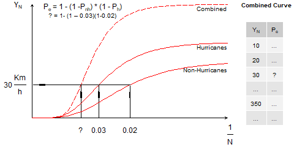

---
title: "Cubos Multidimensionales Vector y Raster"
author: "Alexys H. Rodríguez-Avellaneda, PhD"
date: last-modified
format:
  html:
    toc: true
    code-fold: true
    embed-resources: true
    theme: cosmo
  pdf:
    keep-tex: true       # Esta es la etiqueta que buscas
    toc: true
    number-sections: true
    colorlinks: true
    papersize: letter
    #mermaid-format: png
    # Forzamos a Quarto a usar nuestro wrapper
    #chrome: /usr/local/bin/quarto-browser
execute-dir: project # Asegura contexto limpio
execute:
  cache: true        # Guarda los resultados en disco, si el código no cambia, no lo recalcula.
  freeze: auto       # Evita recompilar el código de capítulos anteriores si solo cambiaste texto.
  echo: true
  warning: false
  message: false
  daemon: false      # Evita que procesos en segundo plano interfieran
  enabled: true      # Asegura la ejecución
engine: knitr
---

## Funciones j_eval y j_plot en R

```{r}
#| label: j_eval_j_plot
#| code-fold: true
# #| include: false
source("./docs/j_eval_j_plot.r")
```


## Introducción

En el ámbito de la geomática aplicada y el diseño de infraestructura segura, el modelado espacial de amenazas naturales exige el procesamiento ágil de grandes volúmenes de datos meteorológicos y climáticos. Para ilustrar estos flujos de trabajo en un entorno real, este capítulo utiliza como caso de estudio los datos y resultados derivados de la investigación "*Spatio-temporal analysis of extreme wind velocities for infrastructure design*" [@rodriguez2020spatio], disponible de forma íntegra en [geocorp.co/thesis/mastergeotech](https://geocorp.co/thesis/mastergeotech/). A través del análisis del régimen de vientos extremos en Colombia —integrando la amenaza probabilística de huracanes en el Caribe y vientos sinópticos locales—, exploraremos cómo la programación en Sistemas de Información Geográfica (SIG) permite resolver problemas de álgebra de mapas a gran escala.

El objetivo pedagógico central de este texto trasciende el análisis climatológico para centrarse en la arquitectura de datos computacional. Históricamente, el análisis espacial ha mantenido una dicotomía estricta: los datos vectoriales para la gestión de objetos y los rasters para la representación de campos continuos. Sin embargo, los modelos climáticos modernos, como el reanálisis ERA5, poseen una naturaleza **multidimensional** (longitud, latitud, tiempo, variables atmosféricas y niveles de retorno) que desafía estas estructuras planas. 

Para procesar esta complejidad, aprenderemos a dominar el paradigma de los **cubos de datos espaciales**, focalizándonos en la interoperabilidad profunda entre los paquetes `sf` (*Simple Features*) y `stars` (*Spatio-Temporal Arrays*). El avance tecnológico clave que exploraremos es la capacidad de **combinar vectores y rasters dentro de un mismo cubo**. Esto implica que una geometría vectorial (como una malla de polígonos o una red de estaciones) puede ser tratada como una dimensión más de un array, permitiendo que operaciones típicas de imágenes (como el álgebra de mapas o funciones de agregación) se apliquen directamente sobre datos vectoriales masivos de forma estructurada y eficiente.

A lo largo del capítulo, el lector desarrollará un flujo de trabajo que inicia en la ingesta de archivos discretos (NetCDF y GeoTIFF), avanza hacia la transformación de estas mallas en **cubos de datos vectoriales**, y culmina en la aplicación de programación funcional espacial vectorizada (mediante la familia `apply`) para fusionar regímenes de amenaza heterogéneos.

Finalmente, dado que el análisis geoespacial está incompleto sin una comunicación visual efectiva, este capítulo dedica un esfuerzo sustancial a las **técnicas avanzadas de representación cartográfica**. Transformar cubos híbridos en mapas estáticos con rigor de publicación científica supone un desafío técnico notable. Por ello, profundizaremos en estrategias de renderizado vectorial sobre *basemaps* continuos, manipulación de formatos topológicos (Long/Wide) para el facetado dinámico de escenarios, y la composición algorítmica de *layouts* multiescalares (mapas de detalle y contexto) empleando la gramática gráfica de `ggplot2`.


## Construcción de cubos espacio-temporales a partir de archivos GeoTIFF


```{r}
#| label: r_crear_cubo_desde_tif
# #| eval: false

# ================================
# DESCARGA Y PREPARACIÓN DE DATOS
# ================================

# Obtener datos vector y raster
# URL de ejemplo donde se encuentran los datos comprimidos
# myurl <- "http://geocorp.co/wind/wind_result.zip"

# Nombre del archivo ZIP que se descargará localmente
# filename <- "wind_result.zip"

# Descarga el archivo desde la URL especificada
# mode = "wb" asegura que el archivo se descargue en modo binario (necesario para archivos ZIP)
# download.file(myurl, filename, mode = "wb")

# Descomprime el archivo ZIP en el directorio de trabajo actual
# unzip(filename)

# Nota: 
# - Los archivos raster (.tif) deben ubicarse en la carpeta: ./data_heavy/wind_tif/
# - El shapefile de municipios debe ubicarse en: ./data_heavy/

# ================================
# CARGA DE LIBRERÍAS
# ================================

# stringr: manejo de strings (cadenas de texto)
library(stringr)

# stars: manejo de datos raster multidimensionales
library(stars)

# ================================
# DEFINICIÓN DE RUTAS
# ================================

# Ruta base donde están almacenados los datos
# Se usa "./" para indicar el directorio de trabajo actual
the_path = "./data_heavy/"

# ================================
# LECTURA Y ORDENAMIENTO DE RASTERS
# ================================

# Listar los archivos en la carpeta ./data_heavy/wind_tif/
# path: ruta donde buscar los archivos
# pattern: expresión regular para filtrar archivos .tif
rasterfiles <- list.files(path = paste0(the_path, "wind_tif/"), pattern = "*.*.tif$")

# Construye la ruta completa de cada archivo concatenando:
# la ruta base + nombre del archivo
rasterfiles <- paste0(the_path, "wind_tif/", rasterfiles)

# Ordena los archivos según los números en sus nombres (orden numérico real, no alfabético)
# numeric = TRUE permite ordenar correctamente (ej: st22 antes que st23)
rasterfiles <- str_sort(rasterfiles, numeric = TRUE)

# Ejemplo del primer archivo en la lista
#'./data_heavy/wind_tif/st1_cellindexlr.tif'
head(rasterfiles)

# Ejemplo del último archivo en la lista
#'./data_heavy/wind_tif/st43_c_7000.tif'
tail(rasterfiles)

# ================================
# CREACIÓN DEL OBJETO STARS
# ================================

# Lee múltiples archivos raster (TIF) y los combina en un solo objeto tipo stars
# rasterfiles: vector de rutas a archivos raster
# quiet = TRUE evita imprimir mensajes en consola
h_nh_c.st <- read_stars(rasterfiles, quiet = TRUE)

# Obtiene los nombres de las capas (atributos) del objeto stars
mynames <- names(h_nh_c.st)

# Nota:
# stars elimina automáticamente el prefijo común más largo (LCP: Longest Common Prefix)
# al asignar nombres a las capas

# Ejemplo de nombres resultantes
#'1_cellindexlr.tif'
head(mynames)
tail(mynames)

# Imprime el objeto stars (dimensiones y atributos)
h_nh_c.st

# ================================
# LIMPIEZA DE NOMBRES DE VARIABLES
# ================================

# Eliminaremos "1_" al inicio y ".tif" al final en los nombres

# str_locate devuelve la posición de un patrón en cada string
# Aquí buscamos la posición del "_" (guion bajo)
start <- str_locate(mynames, "_")

# Buscamos la posición del "." (inicio de la extensión .tif)
# "\\." se usa porque el punto es un carácter especial en expresiones regulares
stop <- str_locate(mynames, "\\.")

# Extraemos nuevos nombres usando substrings:
# start = posición después del "_" (por eso +1)
# end = posición antes del "." (por eso -1)
mynames <- str_sub(mynames, start = start[, 1] + 1, end = stop[, 1] - 1)

# Ejemplo de nombres transformados
# 'cellindexlr'
head(mynames)

# 'c_7000'
tail(mynames)

# ================================
# RENOMBRAR ATRIBUTOS
# ================================

# Reemplaza los nombres originales de las capas por los nuevos nombres limpiados
h_nh_c.st <- setNames(h_nh_c.st, mynames)

# Muestra el objeto stars con los nuevos nombres
# Este objeto tiene dimensiones espaciales X, Y (grid raster)
h_nh_c.st

# ================================
# CONVERSIÓN A GEOMETRÍA VECTORIAL
# ================================

# Convierte el objeto raster (grid) a geometrías tipo sf (polígonos)
# st_xy2sfc transforma cada celda raster en un polígono

# Parámetros:
# as_points = FALSE → crea polígonos (celdas), no puntos
# na.rm = TRUE → elimina celdas con valores NA
h_nh_c.stnoxy <- st_xy2sfc(h_nh_c.st, as_points = FALSE, na.rm = TRUE)

# Muestra las primeras geometrías
head(h_nh_c.stnoxy)

# Consulta la estructura de dimensiones del objeto
st_dimensions(h_nh_c.stnoxy)

# ================================
# LECTURA DE DATOS VECTORIALES
# ================================

# Lee el shapefile de municipios de Colombia
# st_read detecta automáticamente todos los archivos asociados (.shp, .dbf, etc.)
mun <- st_read(paste0(the_path, "MUNICIPIOS_WGS84.shp"))

# ================================
# VISUALIZACIÓN
# ================================

# Plotear un atributo específico del cubo multidimensional vectorial
# "c_700" es una de las variables del objeto stars

# reset = FALSE → permite superponer múltiples gráficos
# border = NA → elimina bordes de los polígonos (visual más limpio)
# plot(h_nh_c.stnoxy["c_700"], reset = FALSE, border = NA)
# Usamos una paleta más brillante (col) como 'plasma' o 'viridis'
plot(h_nh_c.stnoxy["c_700"], reset = FALSE, border = NA, col = viridis::plasma(100))


# Agrega la geometría de los municipios sobre el gráfico anterior
# add = TRUE → superpone en el mismo plot
# plot(st_geometry(mun), add = TRUE)
# Cambiamos el borde de los municipios a blanco o gris muy claro 
# y reducimos el grosor (lwd) al mínimo.
plot(st_geometry(mun), add = TRUE, border = "white", lwd = 0.1)
```

### Resumen sintáctico: Del GeoTIFF al Cubo Híbrido

En esta etapa, hemos transformado archivos planos en una estructura multidimensional. La siguiente tabla desglosa las funciones clave empleadas en el flujo de trabajo:

| Función / Operador | Librería | Propósito en el flujo SIG | Parámetro Crítico |
| :--- | :--- | :--- | :--- |
| **`list.files()`** | `base` | Lista los archivos en disco que cumplen un patrón. | `pattern = "*.*.tif$"` |
| **`str_sort()`** | `stringr` | Ordena los nombres de archivo bajo lógica numérica. | `numeric = TRUE` |
| **`read_stars()`** | `stars` | Ingiere múltiples rasters y los apila en un cubo. | `quiet = TRUE` |
| **`str_sub()`** | `stringr` | Limpia los nombres de los atributos/bandas. | `start` / `end` |
| **`setNames()`** | `stats` | Renombra las variables del cubo para legibilidad. | `object`, `nm` |
| **`st_xy2sfc()`** | `stars` | **Punto de inflexión:** Convierte la malla raster en polígonos. | `as_points = FALSE` |
| **`st_read()`** | `sf` | Carga cartografía base vectorial (Shapefiles). | `dsn` (ruta al .shp) |
| **`plot()`** | `base/stars` | Genera visualizaciones por capas superpuestas. | `reset = FALSE` / `add = TRUE` |

> **Nota del Autor:** Observe que al usar `read_stars()`, la librería intenta ser inteligente y elimina el prefijo común más largo (LCP) de los nombres de archivos. Por ello, requerimos de las funciones de `stringr` para garantizar que los nombres de las variables (como `c_700`) queden perfectamente normalizados para el análisis posterior.


## Integración probabilística: Fusión de regímenes de viento extremo


En el análisis de riesgo y resiliencia de infraestructura, así como en la normativa de diseño de infraestructura, las **curvas de amenaza** suelen representar la relación entre una intensidad de evento, en nuestro caso, la velocidad del viento o **nivel de retorno** (*return level - rl*) y su **probabilidad de excedencia** o **periodo de retorno** (*return period*). En [@rodriguez2020spatio] se usó ERA5 para estimar la curva de amenaza relacionada con **vientos extremos no huracanados** (*nh*) en Colombia. Otro estudio empleó simulaciones sintéticas de huracanes para estimar la curva de amenaza relacionada con **vientos extremos huracanados** (*h*). 


### Fundamentos teóricos: Periodo de retorno y probabilidad de excedencia

En el análisis de amenazas naturales, como los vientos extremos por huracanes o eventos sinópticos, el **Periodo de Retorno ($T$)** (Nota: en el documento de tesis se usa **N**) es un concepto fundamental para cuantificar el riesgo. Para comprenderlo de manera intuitiva, podemos recurrir al ejemplo de una persona de 50 años de edad.

#### La perspectiva del observador (experiencia vital)
Supongamos que, a lo largo de su vida, esta persona ha experimentado una única vez una ráfaga de viento de magnitud excepcional. Desde la perspectiva de su experiencia acumulada de 50 años, la probabilidad de haber igualado o excedido ese viento específico es de **uno ($50/50$)**, lo que representa una certeza empírica en ese lapso de tiempo.

Sin embargo, para el diseño de infraestructura y la gestión del riesgo, lo que interesa es determinar la **Probabilidad Anual de Excedencia ($P_a$)**, es decir, qué tan probable es que dicho evento ocurra en cualquier año individual. Si distribuimos esa probabilidad acumulada en los 50 años de vida, obtenemos que la probabilidad de exceder o igualar ese viento en un año cualquiera es de:

$$P_a = \frac{1}{50} = 0.02 \text{ (un } 2\%) $$

Bajo esta lógica, el Periodo de Retorno se define como el inverso de esta probabilidad anual ($T = 1/P_a$). Si habláramos de un evento con un Periodo de Retorno de **25 años**, la probabilidad de excedencia acumulada en los mismos 50 años de vida sería de **$2$ ($50/25$)**, lo que sugiere que estadísticamente se esperaría haber vivido dicho evento dos veces.


#### El riesgo en la vida útil de diseño ($n$)

Un error común es asumir que un viento con un periodo de retorno de 50 años ocurrirá con total seguridad cada 50 años. Para corregir esto, la geomática y la ingeniería estructural utilizan el concepto de **Riesgo o Probabilidad de Excedencia ($P$) durante la vida útil ($n$)** de una obra o proyecto.

La probabilidad de que un evento con un periodo de retorno $T$ sea igualado o excedido **al menos una vez** durante un periodo de $n$ años consecutivos se calcula mediante la siguiente expresión:

$$P = 1 - \left( 1 - \frac{1}{T} \right)^n$$

Donde:

* **$T$:** Periodo de retorno (años).
* **$n$:** Vida útil de diseño o periodo de exposición (años).

#### Ejemplo aplicado al diseño

Si aplicamos esta fórmula al caso de nuestra persona (o una estructura con 50 años de vida útil) frente a un viento con un periodo de retorno de $T = 50$ años:

$$P = 1 - \left( 1 - \frac{1}{50} \right)^{50} = 1 - (0.98)^{50} \approx 0.636$$

Esto revela una realidad técnica fundamental: existe un **$63.6\%$ de probabilidad** de que el viento de diseño sea alcanzado o superado durante los 50 años de vida útil de la estructura. Este valor explica por qué para infraestructuras críticas (puentes, hospitales o centrales eléctricas), los estándares nacionales e internacionales exigen periodos de retorno mucho más elevados, como los escenarios de **700, 1700 o 3000 años** analizados en esta investigación.

Al aumentar el periodo de retorno ($T$) a 700 años para una estructura que se planea usar durante 50 años ($n=50$), el riesgo de excedencia se reduce drásticamente a aproximadamente un **$6.9\%$**, garantizando un margen de seguridad superior frente a la variabilidad climática y los eventos extremos del Caribe colombiano.


#### Resumen para el análisis de resultados

* **MRI 700 años:** $P_a \approx 0.14\%$. Riesgo bajo, estándar para edificaciones convencionales.
* **MRI 1700-3000 años:** $P_a \approx 0.06\% - 0.03\%$. Estándar de seguridad para infraestructuras de alta importancia o impacto social.

### Arquitectura de datos: Trazabilidad y transformaciones topológicas

En esta sección se llevará a cabo la integración probabilística o combinación (*c*) de las amenazas por vientos extremos huracanados (*h*) y no huracanados (*h*). Para lograr este objetivo, se realizarán múltiples transformaciones y uniones geométricas, transitando entre formatos vectoriales, raster y tabulares planos. 

A continuación, se presenta un inventario estructurado del flujo de trabajo de todos los objetos en memoria que se generarán para el cálculo dimensional y la representación espacial, detallando su clase y características estructurales fundamentales.

| Categoría | Objeto | Clase | Origen | Características y dimensiones |
| :--- | :--- | :--- | :--- | :--- |
| **Cartografía Base** | `world` | sf | Paquete `rnaturalearth` | Geometría global de referencia para los mapas de contexto regional. |
| **Cartografía Base** | `col_4326_sf_pol` | sf | Archivo `COLOMBIA.shp` | Polígono nacional de alta resolución utilizado para enmascaramiento espacial (*masking*). |
| **Cartografía Base** | `relieve` / `relieve_rgb` | stars | Archivo `col2.tif` | Raster topográfico de fondo. Se procesa a valores RGB para visualizaciones multiescalares. |
| **Iniciales** | `st1` | stars | Archivo `.nc` (ERA5) | Dimensión espacial: `x`, `y`. Atributo `cellindexlr` creado a partir de los valores de `x`, `y`. |
| **Iniciales** | `sf1` | sf | Creado a partir de `st1` | Geometría de polígonos base (Malla espacial). |
| **No Huracanes** | `nhrl` | data.frame | Archivo Excel | Estructura tabular con información sinóptica original. |
| **No Huracanes** | `sf_nh` | sf | Unión de `sf1` y `nhrl` | Geometría de polígonos enriquecida espacialmente mediante *left_join*. |
| **No Huracanes** | `st_nh` | stars | Creado a partir de `sf_nh` | Dimensión espacial convertida a: `geometry`. |
| **Huracanes** | `st_h` | stars | Archivos `.tif` | Cubo multidimensional. Dimensión espacial original: `x`, `y`. |
| **Huracanes** | `sf_h` | sf | Creado a partir de `st_h` | Geometría de polígonos. |
| **Huracanes** | `st_h.stnoxy` | stars | Creado a partir de `st_h` | Dimensión espacial reestructurada a: `geometry`. |
| **Combinado** | `df_nh_h` | data.frame | Unión de `sf_nh` y `sf_h` | Contiene las columnas para la combinación (se inicializan con `NA` y se actualizan al final). |
| **Combinado** | `sf_nh_h_c` | sf | Creado a partir de `df_nh_h` | Geometría de polígonos con columnas combinadas vacías (para mantener topología). |
| **Combinado** | `st_nh_h_c` | stars | Creado a partir de `sf_nh_h_c` | Base para `st_apply`. Atributos H: `13:23`. Atributos NH: `2:12`. Columnas C vacías. |
| **Combinado** | `st_nh_h_c_merged` | stars | Creado a partir de `st_nh_h_c` | Todos los atributos colapsan en una dimensión única denominada `"attributes"`. |
| **Combinado** | `combined_st` | stars | Resultado de `st_apply` | Atributo consolidado renombrado a `"rafaga_viento"`. Dimensión temporal/mri renombrada a `"c_mri"`. Orden ajustado usando `aperm`. |
| **Extracción** | `combined_st_700` | stars | `slice(combined_st)` | Cubo filtrado dinámicamente aislando la "rebanada" (slice) correspondiente a 700 años. |
| **Extracción** | `sf_combined` | sf | Creado a partir de `combined_st` | Objeto en formato **LARGO** (`long=TRUE`). Contiene: `"c_mri"`, `"rafaga_viento"` y `"geometry"`. Ideal para *facets*. |
| **Extracción** | `sf_combined_wide`| sf | Creado a partir de `combined_st` | Objeto en formato **ANCHO** (`long=FALSE`). Contiene columnas independientes de `"c_10"` a `"c_7000"`. |
| **Extracción** | `combined_st_attrs`| stars | Creado de `sf_combined_wide`| Dimensión espacial: `geometry`. Atributos paralelos desde `"c_10"` hasta `"c_7000"`. |
| **Extracción** | `sf_c_700` | sf | Extracción individual | Objeto derivado de aislar un único atributo de `combined_st_attrs`. |
| **Retroalimentación** | `datos_calculados`| data.frame | `st_drop_geometry()` | Matriz numérica pura. Extraída para inyectar resultados eficientemente en `df_nh_h` y `sf_nh_h_c` sin sobrecarga espacial. |


### Ingesta de datos NetCDF y estructuración de la malla espacial

Se usó la fuente de datos ERA5, variable `fg10` para calcular los vientos extremos relacionados con viento no huracanado (*nh*). A continuación se desplegará la malla/grilla correspondiente a este dataset para verificar su configuración espacial a lo largo y ancho del territorio colombiano, incluyendo parte de la extensión marítima del país.

En el siguiente código, se crean los objetos `st1` y `sf1` a partir de un archivo `NetCDF` que contiene la malla proveniente de `ERA5`.

```{r}
#| label: r_leer_malla_sf
# #| eval: false


# ================================
# DESCARGA Y PREPARACIÓN DE DATOS
# ================================

# Obtener datos vector y raster
# URL del archivo comprimido que contiene las curvas de amenaza
# myurl = "http://geocorp.co/wind/hazard_curves.zip"

# Nombre del archivo ZIP que se descargará localmente
# filename = "hazard_curves.zip"

# Descarga el archivo desde internet
# mode = "wb" (write binary) es necesario para archivos comprimidos
# download.file(myurl, filename, mode = "wb")

# Descomprime el archivo en el directorio de trabajo
# unzip(filename)

# Nota: Carpeta de descarga:
#       ./data_heavy/hazard_curves/
# En esta carpeta debe quedar el archivo NetCDF (.nc)

# ================================
# CARGA DE LIBRERÍAS
# ================================

# stars: manejo de datos raster multidimensionales (incluye NetCDF)
library(stars)

# sf: manejo de datos espaciales vectoriales (features)
library(sf)

# stringr: manipulación de cadenas de texto
library(stringr)

# dplyr: manipulación de datos (filtrar, seleccionar, mutar, etc.)
library(dplyr)

# ggplot2: visualización de datos
library(ggplot2)

# ================================
# DEFINICIÓN DE RUTA
# ================================

# Ruta donde se encuentra el archivo NetCDF
path = "./data_heavy/hazard_curves/"

# ================================
# DEFINICIÓN DEL ARCHIVO NetCDF
# ================================

# Nombre base del archivo (sin extensión)
# 10fg_jan1_2017.nc: variable 10fg de ERA5
# 10fg: "10 metre wind gust since previous post-processing"
# Es decir: ráfaga máxima de viento a 10 metros de altura
# Fuente de variables ERA5:
# https://ecmwf-models.readthedocs.io/en/latest/variables_era5.html 
ncname <- "10fg_jan1_2017"

# Construcción de la ruta completa al archivo:
# paste0 concatena strings sin separador
# ncfile = paste0(path, ncname, ".nc")
ncfile = paste(path, ncname, ".nc", sep = "")

# ================================
# LECTURA DEL ARCHIVO NetCDF
# ================================

# Leemos el archivo NetCDF como objeto stars
# Este tipo de archivo suele contener datos multidimensionales
# (ej: x, y, tiempo, variables)
st1 = read_stars(ncfile)

# El objeto contiene:
# - Un atributo: valores de velocidad del viento (en m/s)
# - Dimensiones: x (longitud), y (latitud), time (tiempo)

# ================================
# SISTEMA DE COORDENADAS
# ================================

# Verificar sistema de coordenadas del objeto
# st_crs devuelve el sistema de referencia espacial (CRS)
print(paste0("st1: ", st_crs(st1)))

# Asignar sistema de coordenadas si no está definido correctamente
# 4326 corresponde a WGS84 (latitud/longitud en grados)
# st_crs(st1) <- 4326
# Recomendado:
st1 <- st_set_crs(st1, 4326)

# Nota: Este dataset solo tiene un valor en la dimensión temporal
# (un instante específico: 1 de enero de 2017)
st1

# ================================
# EXTRACCIÓN DE DIMENSIONES
# ================================

# Leemos los valores de X (longitud)
# st_get_dimension_values extrae los valores de una dimensión específica
lon <- st_get_dimension_values(st1, "x")

# Leemos los valores de Y (latitud)
lat <- st_get_dimension_values(st1, "y")

# Visualizar algunos valores
head(lon)
head(lat)

# Conteo de la cantidad de coordenadas en cada dimensión
# length cuenta cuántos valores hay en cada vector
nlon <- length(lon)
nlon

nlat <- length(lat)
nlat

# ================================
# CREACIÓN DE IDENTIFICADOR DE CELDAS
# ================================

# Agregamos un atributo al objeto stars
# con el id (cellindexlr) de las celdas:

# La numeración sigue este patrón:
# - Empieza en la esquina superior izquierda
# - Avanza hacia la derecha
# - Luego baja fila por fila (tipo raster scan)

# Opción 1: Coerción explícita
# Convierte la secuencia a entero
# st1$cellindexlr <- as.integer(1:(nlon * nlat))

# Opción 2: Definición nativa como entero (más eficiente)
# seq(1L, ...) crea directamente enteros (L indica tipo integer)
# nlon * nlat = número total de celdas espaciales


# stars distribuye automáticamente este vector
# sobre las dimensiones espaciales (x, y)
st1$cellindexlr <- seq(1L, as.integer(nlon * nlat))

# Visualizar el objeto con el nuevo atributo
st1

# Aunque se imprime como decimal, internamente es entero
head(st1$cellindexlr, 2)
tail(st1$cellindexlr, 2)

# ================================
# CONVERSIÓN A OBJETO SF
# ================================

# Convierte el objeto stars (raster/grid)
# a un objeto sf (vectorial)
# Cada celda se convierte en una geometría (polígono o punto)
sf1 = st_as_sf(st1)

# ================================
# RENOMBRAR ATRIBUTOS
# ================================

# Cambiamos los nombres de las columnas:
# 1. Variable meteorológica
# 2. ID de celda
# 3. Geometría espacial
names(sf1) = c("fg10_2017-01-01", "cellindexlr", "geometry")

# Visualizar estructura completa
sf1

# Ver primeras filas
head(sf1, 1)

# Ver últimas filas
tail(sf1, 1)

```


#### Resumen sintáctico: Ingesta de NetCDF y gestión de mallas

En este bloque, el lector aprende a interpretar la estructura de un archivo multidimensional y a transformarlo en una entidad vectorial indexada.

| Función / Operador | Librería | Propósito en el flujo SIG | Parámetro Crítico |
| :--- | :--- | :--- | :--- |
| **`read_stars()`** | `stars` | Ingiere archivos NetCDF (`.nc`) conservando dimensiones espaciales y temporales. | `ncfile` (Ruta al archivo) |
| **`st_set_crs()`** | `sf/stars` | Asigna un Sistema de Referencia de Coordenadas (CRS) cuando el archivo no lo trae definido. | `4326` (WGS84) |
| **`st_get_dimension_values()`** | `stars` | Extrae los valores numéricos de los ejes (ej: todas las longitudes o latitudes). | `"x"` o `"y"` |
| **`seq(1L, ...)`** | `base` | Crea una secuencia de números enteros (**L**) para identificar cada celda de la malla. | `1L` (Indica tipo Integer) |
| **`st_as_sf()`** | `sf/stars` | **La gran transformación:** Convierte el objeto de malla multidimensional a un objeto vectorial de polígonos. | `stars_object` |
| **`names()`** | `base` | Renombra las columnas del objeto vectorial para estandarizar los atributos. | `c("attr1", "attr2", ...)` |


> **Nota del Autor:** Es fundamental que el estudiante note el uso de `1L` al crear el `cellindexlr`. En programación SIG a gran escala, usar tipos de datos **Integer** en lugar de **Numeric** (decimales) para los índices no solo ahorra memoria, sino que evita errores de precisión al realizar uniones relacionales (*joins*) entre millones de registros.


### Técnicas cartográficas multiescalares: Representación vectorial sobre raster

```{r}
#| label: r_funcion_graficar_malla_rgb
# #| eval: false

# Definición de la función principal
# data_base: objeto espacial (tipo sf) que contiene la malla base (ERA5 u otra)
# path_raster: ruta al archivo raster (relieve/hillshade) que se usará como fondo visual
# sf_poligono: objeto sf opcional para recorte espacial (si es NULL, se usa Colombia)
graficar_malla_rgb <- function(data_base, path_raster = "./data_heavy/col2.tif", sf_poligono = NULL) {
  
  # Verificación defensiva del sistema de referencia de coordenadas (CRS)
  # Es obligatorio que el objeto tenga un CRS definido para evitar errores espaciales
  if (!is.na(st_crs(data_base))) { 

    # -------------------------------------------------------------------------
    # 2. Preparación de geometrías vectoriales (malla de datos ERA5)
    # -------------------------------------------------------------------------

    # Convierte la geometría del objeto sf a otro sf 
    # conteniendo solo la geometría (permite manipular atributos fácilmente)
    grid_sf <- st_as_sf(st_geometry(data_base))
    
    # Crea un identificador único (DN = Digital Number) para cada celda de la malla
    # DN es equivalente a cellindexlr
    grid_sf$DN <- 1:nrow(grid_sf)

    # Calcula los centroides de cada celda (punto central de cada polígono)
    # suppressWarnings evita mensajes por geometrías potencialmente complejas
    # o geometrías en coordenadas geográficas
    coords_grid <- suppressWarnings(st_coordinates(st_centroid(grid_sf)))
    
    # Extrae coordenadas X (longitud)
    grid_sf$coord_x <- coords_grid[, 1]
    
    # Extrae coordenadas Y (latitud)
    grid_sf$coord_y <- coords_grid[, 2]

    # -------------------------------------------------------------------------
    # Definición de índices para etiquetado lateral (optimización visual)
    # -------------------------------------------------------------------------

    # Índices para la primera columna (lado izquierdo de la malla)
    # - 1: primera celda
    # - seq(...): genera una secuencia cada 98 celdas
    # - 3333: última celda relevante del borde
    idx_col1 <- unique(c(1, seq(from = 50, to = 3333, by = 98), 3333))

    # Índices para la última columna (lado derecho)
    # Incluye explícitamente el último índice (3381) para cerrar la grilla
    idx_col49 <- unique(c(49, 98, seq(from = 196, to = 3332, by = 98), 3381))

    # Filtra las celdas correspondientes a cada lado
    grid_col1 <- grid_sf[grid_sf$DN %in% idx_col1, ]
    grid_col49 <- grid_sf[grid_sf$DN %in% idx_col49, ]

    # -------------------------------------------------------------------------
    # 3. Datos auxiliares (mapa base y etiquetas)
    # -------------------------------------------------------------------------

    # Descarga mapa mundial simplificado (escala media)
    world <- rnaturalearth::ne_countries(scale = "medium", returnclass = "sf")
    
    # Filtra únicamente Colombia
    colombia <- world[world$name %in% c("Colombia"), ]

    # Data frame manual con etiquetas de países vecinos
    df_etiquetas_paises <- data.frame(
      name = c("Colombia", "Panamá", "Venezuela", "Ecuador", "Perú", "Brasil"),
      lon = c(-74.0, -79, -67.5, -78.2, -76.0, -68.5), # Longitud
      lat = c(4.0, 9.15, 7.5, -1.0, -4.0, -3.0)       # Latitud
    )

    # -------------------------------------------------------------------------
    # 4. Procesamiento del raster de relieve
    # -------------------------------------------------------------------------

    # Lee el raster desde disco como objeto stars
    relieve <- read_stars(path_raster)
    
    # Se fuerza el uso del polígono de Colombia para recorte (sobrescribe sf_poligono)
    sf_poligono <- colombia
    
    # Si hay polígono, recorta raster a ese límite
    # Si no, recorta usando bounding box de data_base
    relieve_plot <- if (!is.null(sf_poligono)) relieve[sf_poligono] else st_crop(relieve, st_bbox(data_base))
    
    # Convierte raster a RGB (colores hexadecimales)
    # maxColorValue = 255 → escala estándar de 8 bits por canal (0–255)
    relieve_rgb <- st_rgb(relieve_plot, maxColorValue = 255)

    # -------------------------------------------------------------------------
    # 5. Construcción del gráfico (ggplot2)
    # -------------------------------------------------------------------------

    p <- ggplot() +
      
      # ---------------------------------------------------------------------
      # Capa base del mundo
      # ---------------------------------------------------------------------
      geom_sf(
        data = world,              # objeto espacial a graficar
        fill = "antiquewhite",     # color de relleno (tierra)
        colour = "black",          # color de borde
        alpha = 0.7,               # transparencia (0 = invisible, 1 = sólido)
        linewidth = 0.4            # grosor de línea del borde
      ) +
      
      # ---------------------------------------------------------------------
      # Capa raster (relieve)
      # ---------------------------------------------------------------------
      geom_stars(
        data = relieve_rgb,  # raster en formato RGB
        alpha = 0.8,         # transparencia (permite ver capas debajo)
        na.rm = TRUE         # elimina valores NA (evita warnings)
      ) +
      
      # scale_fill_identity → usa colores tal cual vienen (sin escala automática)
      scale_fill_identity() +
      
      # ---------------------------------------------------------------------
      # Capa de grilla (malla)
      # ---------------------------------------------------------------------
      geom_sf(
        data = grid_sf,      # malla completa
        colour = "grey",     # color de líneas
        fill = NA,           # sin relleno (solo contorno)
        linewidth = 0.1      # líneas muy delgadas (evita saturación visual)
      ) +

      # ---------------------------------------------------------------------
      # Etiquetas de países
      # ---------------------------------------------------------------------
      geom_text(
        data = df_etiquetas_paises,
        aes(
          x = lon,           # coordenada X (longitud)
          y = lat,           # coordenada Y (latitud)
          label = name       # texto a mostrar
        ), 
        colour = "grey10",   # color del texto
        fontface = "bold",   # negrita
        size = 2.5           # tamaño del texto
      ) +

      # ---------------------------------------------------------------------
      # Etiquetas lado izquierdo (ggrepel evita superposición)
      # ---------------------------------------------------------------------
      ggrepel::geom_text_repel(
        data = grid_col1,
        aes(
          x = coord_x,       # posición X
          y = coord_y,       # posición Y
          label = DN         # número de celda
        ), 
        size = 2,            # tamaño del texto
        direction = "y",     # solo mueve etiquetas verticalmente
        segment.size = 0.2,  # grosor de línea que conecta etiqueta con punto
        segment.color = "grey50", # color de esa línea
        color = "grey50",    # color del texto
        bg.color = "white",  # fondo del texto (halo)
        bg.r = 0.15,         # radio del halo
        nudge_x = -1.2,      # desplazamiento horizontal manual (izquierda)
        hjust = 1,           # alineación horizontal (1 = derecha)
        box.padding = 0.1    # espacio alrededor del texto
      ) +
                               
      # ---------------------------------------------------------------------
      # Etiquetas lado derecho
      # ---------------------------------------------------------------------
      ggrepel::geom_text_repel(
        data = grid_col49,
        aes(
          x = coord_x,
          y = coord_y,
          label = DN
        ), 
        size = 2,
        direction = "y",
        segment.size = 0.2,
        segment.color = "grey50",
        color = "grey50",
        bg.color = "white",
        bg.r = 0.15,
        nudge_x = 1.2,       # desplazamiento a la derecha
        hjust = 0,           # alineación a la izquierda
        box.padding = 0.1
      ) +
      
      # ---------------------------------------------------------------------
      # Sistema de coordenadas
      # ---------------------------------------------------------------------
      coord_sf(
        xlim = c(-81.25, -64.75), # límites en longitud
        ylim = c(-5, 13),         # límites en latitud
        expand = FALSE            # sin expansión automática (sin márgenes extra)
      ) +
      
      # Título del gráfico
      labs(title = "Malla para el análisis de vientos extremos en Colombia") +
      
      # Tema base (fondo blanco)
      theme_bw() +
      
      # Personalización fina del tema
      theme(
        panel.background = element_rect(fill = "aliceblue"), # color del océano
        
        plot.margin = unit(c(0, 0, 0, 0), "cm"), # márgenes externos
        
        # Texto eje X
        axis.text.x = element_text(
          size = 7,
          margin = margin(t = 2, b = -10) # ajuste fino de posición
        ), 
        
        # Texto eje Y
        axis.text.y = element_text(
          size = 7,
          margin = margin(r = 2, l = -10)
        ), 
        
        plot.title = element_text(
          size = 8,
          face = "bold" # negrita
        ),
        
        # Grilla principal (líneas de coordenadas)
        panel.grid.major = element_line(
          color = gray(.5),   # gris medio
          linetype = "dashed", # línea discontinua
          linewidth = 0.1     # muy delgada
        )
      ) +
      
      # Quita etiquetas de ejes
      xlab("") + 
      ylab("")

    # Devuelve el objeto gráfico
    return(p)

  } else {
    # Mensaje de error si no hay CRS
    return("El objeto data_base debe tener sistema de coordenadas asignado!")
  }
}
```

```{r}
#| label: r_plotear_malla_rgb
# #| eval: false

# ================================
# CARGA DE LIBRERÍAS
# ================================

# sf: librería para manejo de datos espaciales vectoriales
# Permite leer shapefiles, transformar coordenadas y trabajar con geometrías
library(sf)

# ================================
# LECTURA DEL SHAPEFILE
# ================================

# Ruta al shapefile del contorno de Colombia
# Un shapefile está compuesto por varios archivos (.shp, .dbf, .shx, etc.)
file_col_sf_pol = "./data_heavy/COLOMBIA.shp"

# Lectura del shapefile como objeto sf
# st_read():
# - Detecta automáticamente los archivos asociados
# - Retorna un objeto con geometría (polígonos) y atributos
col_4326_sf_pol = st_read(file_col_sf_pol)

# Nota:
# El nombre "4326" sugiere que el shapefile está en coordenadas geográficas WGS84
# (EPSG:4326 → latitud/longitud en grados)

# ================================
# GENERACIÓN DEL MAPA
# ================================

# Se llama a la función graficar_malla_rgb(), definida previamente
# Esta función construye un mapa combinando:
# - Una grilla espacial (data_base)
# - Un raster RGB (relieve o imagen base)
# - Un polígono de recorte (opcional)

p_mapa2 <- graficar_malla_rgb(

  # data_base:
  # Objeto sf con la malla (grilla) a visualizar
  # En este caso, proviene del objeto sf1 creado anteriormente
  # (derivado de datos ERA5 o raster convertido a vector)
  data_base = sf1,

  # path_raster:
  # Ruta al archivo raster (imagen base)
  # Generalmente contiene un relieve o imagen satelital en formato RGB
  # Este raster será leído con read_stars() dentro de la función
  path_raster = "./data_heavy/col2.tif",

  # sf_poligono:
  # Polígono utilizado para recortar el raster o delimitar el área de interés
  # Aquí se pasa el contorno de Colombia
  # Nota importante:
  # En la implementación actual de la función, este parámetro
  # es sobrescrito internamente por el objeto "colombia"
  # (definido dentro de la función), por lo que este argumento
  # no tiene efecto real en el resultado final
  sf_poligono = col_4326_sf_pol 
)

# ================================
# VISUALIZACIÓN DEL RESULTADO
# ================================

# print():
# Muestra el objeto gráfico generado (ggplot)
# Es necesario en algunos contextos (scripts, funciones, loops)
# para forzar la renderización del gráfico
print(p_mapa2)
```


El siguiente bloque de código implementa una estrategia de visualización compuesta. Se generan dos objetos gráficos independientes para representar la distribución espacial de la malla ERA5: un mapa de contexto regional y un mapa de detalle (inset) que permite verificar la indexación individual de las celdas. Los dos mapas se organizan en uno al lado del otro (1 fila, dos columnas).

Esta aproximación es fundamental en reportes técnicos para validar la resolución espacial nacional versus detalles regionales o locales.

```{r}
#| label: r_graficar_malla_zoom 
# #| eval: false

# ================================
# CARGA DE DEPENDENCIAS
# ================================

library(sf)           # Manejo de datos espaciales vectoriales (simple features)
library(ggplot2)      # Sistema de gráficos basado en "grammar of graphics"
library(ggspatial)    # Elementos cartográficos: barra de escala y flecha norte
library(ggrepel)      # Evita solapamiento de etiquetas (repulsión)
library(gridExtra)    # Permite organizar múltiples gráficos en un layout
library(rnaturalearth) # Datos geográficos globales (países, límites, etc.)

# ================================
# CONFIGURACIÓN DEL ENTORNO
# ================================

# Define un tema base global para todos los gráficos
# theme_bw(): fondo blanco, grillas grises, estilo limpio tipo publicación científica
theme_set(theme_bw())

# Carga de países del mundo como objeto sf
# scale = "medium" → resolución media (balance entre detalle y rendimiento)
# returnclass = "sf" → devuelve un objeto tipo simple features
world <- ne_countries(scale = "medium", returnclass = "sf")

# Cálculo del centroide de Colombia
# st_centroid(): obtiene el centro geométrico del polígono
# suppressWarnings(): evita advertencias sobre centroides en coordenadas geográficas
colombia_points <- suppressWarnings(
  st_centroid(world[world$name == "Colombia", ])
)

# ================================
# GENERACIÓN DEL MAPA REGIONAL (CONTEXTO)
# ================================

big <- ggplot() +
  
  # -------------------------------------------------------------------------
  # CAPA BASE: países del mundo
  # -------------------------------------------------------------------------
  geom_sf(
    data = world,            # objeto espacial a representar
    fill = "antiquewhite",   # color de relleno (tono tipo pergamino)
    colour = "black",        # color del borde de los países
    alpha = 0.7,             # transparencia (0=transparente, 1=opaco)
    linewidth = 0.4          # grosor de línea del borde
  ) +
  
  # -------------------------------------------------------------------------
  # RESALTADO DE PAÍSES DE INTERÉS
  # -------------------------------------------------------------------------
  geom_sf(
    data = world[world$name %in% c("Colombia", "Panama", "Venezuela", "Ecuador", "Peru", "Brazil"),],
    fill = NA               # sin relleno → solo contorno visible
    # colour hereda el valor por defecto (negro)
  ) +
  
  # -------------------------------------------------------------------------
  # ANOTACIONES (texto manual en coordenadas específicas)
  # -------------------------------------------------------------------------
  annotate(
    geom = "text",          # tipo de anotación: texto
    x = -76.5,              # coordenada X (longitud)
    y = 14,                 # coordenada Y (latitud)
    label = "Mar\nCaribe",  # \n genera salto de línea
    fontface = "italic",    # estilo de fuente (cursiva)
    size = 2                # tamaño del texto
  ) +
  
  annotate(
    geom = "text",
    x = -88.5,
    y = 5,
    label = "Oceano\nPacífico",
    fontface = "italic",
    color = "grey22",       # color del texto (gris oscuro)
    size = 2
  ) +
  
  # -------------------------------------------------------------------------
  # CAPA DE GRILLA (malla de análisis)
  # -------------------------------------------------------------------------
  geom_sf(
    data = sf1,             # objeto sf con la grilla
    colour = "grey",        # color de las líneas
    fill = NA,              # sin relleno
    linewidth = 0.1         # grosor muy fino (evita saturación visual)
  ) +
  
  # -------------------------------------------------------------------------
  # ELEMENTOS CARTOGRÁFICOS
  # -------------------------------------------------------------------------
  
  # Barra de escala
  annotation_scale(
    location = "bl",        # bottom-left (abajo izquierda)
    width_hint = 0.5        # proporción del ancho del gráfico que ocupa (0–1)
  ) +
  
  # Flecha de norte
  annotation_north_arrow(
    location = "br",        # bottom-right (abajo derecha)
    style = north_arrow_fancy_orienteering # estilo visual predefinido
  ) +
  
  # -------------------------------------------------------------------------
  # SISTEMA DE COORDENADAS Y EXTENSIÓN
  # -------------------------------------------------------------------------
  coord_sf(
    xlim = c(-79.7, -66.5), # límites en longitud
    ylim = c(-5.4, 13),     # límites en latitud
    expand = FALSE          # evita padding automático alrededor del mapa
  ) +
  
  # Título del gráfico
  labs(title = "Malla de celdas para el análisis de vientos extremos") +
  
  # -------------------------------------------------------------------------
  # PERSONALIZACIÓN DEL TEMA
  # -------------------------------------------------------------------------
  theme(
    plot.title = element_text(size = 8), # tamaño del título
    
    plot.margin = unit(c(0, 0, 0, 0), "cm"), # márgenes externos
    
    # Texto eje X
    axis.text.x = element_text(
      size = 7,
      margin = margin(t = 2, b = -10) # ajuste fino vertical
    ),
    
    # Texto eje Y
    axis.text.y = element_text(
      size = 7,
      margin = margin(r = 2, l = -10)
    ),
    
    # Grilla principal (coordenadas)
    panel.grid.major = element_line(
      color = gray(.5),      # gris medio
      linetype = "dashed",   # línea discontinua
      linewidth = 0.1        # grosor fino
    ),
    
    # Fondo del panel (representa el océano)
    panel.background = element_rect(fill = "aliceblue")
  ) +
  
  # Elimina etiquetas de ejes
  xlab("") + 
  ylab("")

# ================================
# GENERACIÓN DEL MAPA DE DETALLE (ZOOM)
# ================================

small <- ggplot() +
  
  # -------------------------------------------------------------------------
  # CAPA BASE (igual que mapa grande)
  # -------------------------------------------------------------------------
  geom_sf(
    data = world,
    fill = "antiquewhite",
    colour = "black",
    alpha = 0.7,
    linewidth = 0.4
  ) +
  
  # -------------------------------------------------------------------------
  # GRILLA (resaltada)
  # -------------------------------------------------------------------------
  geom_sf(
    data = sf1,
    colour = "black",   # más contraste que en el mapa grande
    fill = NA,
    linewidth = 0.1
  ) + 
  
  # -------------------------------------------------------------------------
  # ETIQUETAS DE CELDAS
  # -------------------------------------------------------------------------
  geom_sf_label(
    data = sf1,
    aes(label = cellindexlr), # variable a mostrar como etiqueta
    size = 2                  # tamaño del texto
    # posicionamiento automático en centroides
  ) +
  
  # -------------------------------------------------------------------------
  # ELEMENTOS CARTOGRÁFICOS (AJUSTADOS AL ZOOM)
  # -------------------------------------------------------------------------
  
  annotation_scale(
    location = "bl",
    width_hint = 0.5,
    height = unit(0.2, "cm") # altura de la barra de escala
  ) +
  
  annotation_north_arrow(
    location = "br",
    which_north = "true",    # usa norte geográfico real
    pad_x = unit(0.05, "in"), # separación horizontal del borde
    pad_y = unit(0.05, "in"), # separación vertical
    height = unit(1, "cm"),   # altura de la flecha
    width = unit(1, "cm"),    # ancho de la flecha
    style = north_arrow_fancy_orienteering
  ) +
  
  # -------------------------------------------------------------------------
  # ZOOM (recorte espacial)
  # -------------------------------------------------------------------------
  coord_sf(
    xlim = c(-73.7, -72.85),
    ylim = c(10.1, 10.9),
    expand = FALSE
  ) +
  
  labs(title = "Detalle: Celdas para Análisis de Viento") +
  
  # -------------------------------------------------------------------------
  # TEMA DEL MAPA DETALLE
  # -------------------------------------------------------------------------
  theme(
    plot.title = element_text(size = 8),
    
    axis.text.x = element_text(size = 7), 
    axis.text.y = element_text(size = 7), 
    
    # Borde rojo para enfatizar que es un zoom
    panel.border = element_rect(
      colour = "red",
      fill = NA,
      linewidth = 1
    ),
    
    panel.grid.major = element_line(
      color = gray(.5),
      linetype = "dashed",
      linewidth = 0.5 # más visible que en el mapa grande
    ), 
    
    panel.background = element_rect(fill = "aliceblue")
  ) + 
  
  xlab("") + 
  ylab("")

# ================================
# DISPOSICIÓN FINAL (COMPOSICIÓN)
# ================================

# grid.arrange:
# - organiza múltiples gráficos en una grilla
# - útil para reportes (Quarto, RMarkdown, PDF, etc.)
# ncol = 2 → dos columnas (big | small)
# suppressWarnings evita mensajes menores de renderizado
suppressWarnings(
  grid.arrange(big, small, ncol = 2)
)
```

La visualización de mallas/rasters requiere una validación rigurosa de la indexación espacial. El siguiente bloque de código implementa una composición cartográfica avanzada que integra un mapa de contexto nacional con cuatro vistas de detalle en cada esquina para verificar la coherencia de la grilla ERA5.

El script utiliza una función personalizada para automatizar la generación de recuadros de detalle, optimizando el uso de memoria mediante el pre-cálculo de centroides y la gestión eficiente de geometrías vectoriales.

```{r}
#| label: r_graficar_malla_4zoom
# #| eval: false

# ================================
# CARGA DE DEPENDENCIAS TÉCNICAS
# ================================

library(sf)            # Manejo de datos espaciales vectoriales (Simple Features)
library(ggplot2)       # Sistema de visualización basado en "grammar of graphics"
library(ggspatial)     # Elementos cartográficos: barra de escala, flecha norte, etc.
library(gridExtra)     # Composición de múltiples gráficos en una misma figura
library(rnaturalearth) # Datos geográficos globales (países, fronteras, etc.)

# ================================
# CONFIGURACIÓN DEL ENTORNO
# ================================

# Define un tema global para todos los gráficos generados posteriormente
# theme_bw(): fondo blanco, grilla gris tenue → estándar en publicaciones científicas
theme_set(theme_bw())

# Descarga y carga el shapefile mundial
# scale = "medium" → resolución intermedia (balance entre detalle y rendimiento)
# returnclass = "sf" → formato Simple Features
world <- ne_countries(scale = "medium", returnclass = "sf")

# ================================
# DEFINICIÓN DE ÍNDICES CRÍTICOS
# ================================

# Índices extremos de la malla (útiles para validar bordes espaciales)
# IMPORTANTE: cellindexlr representa el índice lineal de la grilla

# Columna 1 (Extremo Izquierdo)
# 1 → primera celda
# 3333 → última celda de esa columna
idx_col1 <- c(1, 3333)

# Columna 49 (Extremo Derecho)
# 49 → primera celda de la última columna
# 3381 → última celda total de la grilla (cierre global)
idx_col49 <- c(49, 3381)

# ================================
# PREPROCESAMIENTO GEOMÉTRICO
# ================================

# Copia de trabajo (evita modificar sf1 directamente)
sf2 <- sf1

# ------------------------------------------------------------
# Cálculo de centroides
# ------------------------------------------------------------
# st_centroid(): calcula el centro geométrico de cada polígono
# suppressWarnings(): evita advertencias en CRS geográficos (lon/lat)
coords_grid <- suppressWarnings(st_coordinates(st_centroid(sf2)))

# Separación explícita de coordenadas (requerido por ggrepel)
sf2$coord_x <- coords_grid[, 1] # Longitud
sf2$coord_y <- coords_grid[, 2] # Latitud

# ------------------------------------------------------------
# Filtrado de celdas en bordes
# ------------------------------------------------------------
# %in% permite seleccionar filas cuyo índice esté en los vectores definidos
grid_col1 <- sf2[sf2$cellindexlr %in% idx_col1, ]
grid_col49 <- sf2[sf2$cellindexlr %in% idx_col49, ]

# ------------------------------------------------------------
# Pre-cálculo de centroides optimizado
# ------------------------------------------------------------
# Se calcula una sola vez para evitar recomputación en múltiples gráficos
sf1_centroids <- suppressWarnings(st_centroid(sf1))

# ================================
# GENERACIÓN DEL MAPA REGIONAL (CONTEXTO)
# ================================

big <- ggplot() +
  
  # -------------------------------------------------------------------------
  # CAPA BASE GLOBAL
  # -------------------------------------------------------------------------
  geom_sf(
    data = world,            # objeto espacial
    fill = "antiquewhite",   # color tipo pergamino (tierra)
    colour = "black",        # color de fronteras
    alpha = 0.7,             # transparencia (permite ver capas debajo)
    linewidth = 0.4          # grosor de línea
  ) +
  
  # -------------------------------------------------------------------------
  # ANOTACIONES MANUALES (TOPONIMIA)
  # -------------------------------------------------------------------------
  annotate(
    geom = "text",           # tipo de geometría (texto)
    x = -77.5,               # coordenada X (longitud)
    y = 12,                  # coordenada Y (latitud)
    label = "Mar\nCaribe",   # salto de línea con \n
    fontface = "italic",     # estilo de fuente
    size = 2.5               # tamaño del texto
  ) +
  
  annotate(
    geom = "text",
    x = -79.5,
    y = 5,
    label = "Océano\nPacífico",
    fontface = "italic",
    color = "grey22",        # gris oscuro (menos dominante que negro)
    size = 2.5
  ) +
  
  # -------------------------------------------------------------------------
  # CAPA DE MALLA COMPLETA
  # -------------------------------------------------------------------------
  geom_sf(
    data = sf1,
    colour = "grey",         # gris tenue (no competir visualmente)
    fill = NA,               # sin relleno
    linewidth = 0.1          # líneas muy delgadas
  ) +

  # -------------------------------------------------------------------------
  # ETIQUETADO INTELIGENTE CON GGPREPEL (BORDE IZQUIERDO)
  # -------------------------------------------------------------------------
  ggrepel::geom_text_repel(
    data = grid_col1,
    aes(
      x = coord_x,
      y = coord_y,
      label = cellindexlr
    ), 
    size = 2,                # tamaño del texto
    direction = "y",         # solo desplazamiento vertical (mantiene alineación lateral)
    segment.size = 0.2,      # grosor de la línea conectora
    segment.color = "grey50",# color de la línea
    color = "grey50",        # color del texto
    bg.color = "white",      # halo blanco (mejora legibilidad)
    bg.r = 0.15,             # radio del halo
    nudge_x = -1.2,          # desplazamiento manual hacia la izquierda
    hjust = 1,               # alineación derecha del texto
    box.padding = 0.1        # espacio alrededor de la etiqueta
  ) +
                            
  # -------------------------------------------------------------------------
  # ETIQUETADO BORDE DERECHO
  # -------------------------------------------------------------------------
  ggrepel::geom_text_repel(
    data = grid_col49,
    aes(x = coord_x, y = coord_y, label = cellindexlr), 
    size = 2,
    direction = "y",
    segment.size = 0.2,
    segment.color = "grey50",
    color = "grey50",
    bg.color = "white",
    bg.r = 0.15,
    nudge_x = 1.2,           # desplazamiento hacia la derecha
    hjust = 0,               # alineación izquierda
    box.padding = 0.1
  ) +

  # -------------------------------------------------------------------------
  # CUADRANTES DE VALIDACIÓN (RECTÁNGULOS ROJOS)
  # -------------------------------------------------------------------------
  geom_rect(
    mapping = aes(xmin=-79.25, xmax=-78.24, ymin=11.83, ymax=12.66),
    color = "red",           # color del borde
    alpha = 0,               # transparente (solo se ve el contorno)
    linewidth = 0.3          # grosor del rectángulo
  ) +
  geom_rect(
    aes(xmin=-67.75, xmax=-66.74, ymin=11.83, ymax=12.66), 
    color="red", alpha=0, linewidth=0.3
  ) +
  geom_rect(
    aes(xmin=-79.25, xmax=-78.24, ymin=-4.67, ymax=-3.82), 
    color="red", alpha=0, linewidth=0.3
  ) +
  geom_rect(
    aes(xmin=-67.75, xmax=-66.74, ymin=-4.67, ymax=-3.82), 
    color="red", alpha=0, linewidth=0.3
  ) +

  # -------------------------------------------------------------------------
  # SISTEMA DE COORDENADAS
  # -------------------------------------------------------------------------
  coord_sf(
    xlim = c(-81.25, -64.75), # rango en longitud
    ylim = c(-5, 13),         # rango en latitud
    expand = FALSE            # sin padding automático
  ) +
  
  labs(title = "Malla de celdas para el análisis de vientos extremos") +
  
  # -------------------------------------------------------------------------
  # TEMA
  # -------------------------------------------------------------------------
  theme(
    plot.title = element_text(size = 8),
    
    axis.text.x = element_text(size = 7, margin = margin(t = 2, b = -10)),
    axis.text.y = element_text(size = 7, margin = margin(r = 2, l = -10)),
    
    panel.grid.major = element_line(
      color = gray(.5),
      linetype = "dashed",
      linewidth = 0.1
    ),
    
    panel.background = element_rect(fill = "aliceblue"),
    
    plot.margin = unit(c(0, 0, 0, 0), "cm")
  ) +
  
  xlab("") + 
  ylab("")

# ================================
# FUNCIÓN DE AUTOMATIZACIÓN DE DETALLE
# ================================

# Esta función encapsula la lógica de creación de mapas zoom
# Permite evitar repetición de código (principio DRY: Don't Repeat Yourself)

generar_esquina <- function(xlim_vals, ylim_vals, margen) {
  ggplot() +
    
    # Capa base
    geom_sf(
      data = world,
      fill = "antiquewhite",
      colour = "black",
      alpha = 0.7,
      linewidth = 0.4
    ) +
    
    # Malla
    geom_sf(
      data = sf1,
      colour = "black",
      fill = NA,
      linewidth = 0.1
    ) + 
    
    # Etiquetas usando centroides precalculados (optimización)
    geom_sf_text(
      data = sf1_centroids,
      aes(label = cellindexlr),
      size = 2
    ) +
    
    # Zoom espacial
    coord_sf(
      xlim = xlim_vals,  # vector c(min, max) en X
      ylim = ylim_vals,  # vector c(min, max) en Y
      expand = FALSE
    ) +
    
    # Tema minimalista
    theme(
      panel.grid = element_blank(), # elimina grilla
      panel.background = element_rect(fill = "aliceblue"),
      
      axis.text = element_blank(),  # elimina etiquetas
      axis.ticks = element_blank(), # elimina marcas
      axis.title = element_blank(), # elimina títulos
      
      plot.title = element_blank(),
      
      # Borde rojo → coherente con rectángulos del mapa principal
      panel.border = element_rect(
        colour = "red",
        fill = NA,
        linewidth = 1
      ),
      
      plot.margin = margen # controla separación entre paneles
    )
}

# ================================
# GENERACIÓN DE LOS 4 ZOOM
# ================================

corner1lt <- generar_esquina(
  c(-79.25, -78.24), c(11.83, 12.66),
  grid::unit(c(0, 0.1, 0.1, 0), "cm") # top-right-bottom-left
)

corner2rt <- generar_esquina(
  c(-67.75, -66.74), c(11.83, 12.66),
  grid::unit(c(0, 0, 0.1, 0.1), "cm")
)

corner3lb <- generar_esquina(
  c(-79.25, -78.24), c(-4.67, -3.82),
  grid::unit(c(0.1, 0.1, 0, 0), "cm")
)

corner4rb <- generar_esquina(
  c(-67.75, -66.74), c(-4.67, -3.82),
  grid::unit(c(0.1, 0, 0, 0.1), "cm")
)

# ================================
# COMPOSICIÓN FINAL
# ================================

suppressWarnings(
  grid.arrange(
    big,                    # mapa principal
    grid::nullGrob(),       # separador vacío
    arrangeGrob(
      corner1lt, corner2rt,
      corner3lb, corner4rb,
      ncol = 2              # layout 2x2
    ),
    ncol = 3,               # 3 columnas totales
    widths = c(2.2, 0.1, 1.2) # proporciones relativas de ancho
  )
)
```

#### Resumen sintáctico: Diseño Cartográfico y Layouts Compuestos

La representación de mallas densas exige un control preciso sobre las capas de información. La siguiente tabla desglosa las funciones de dibujo y ensamblaje utilizadas para generar los mapas de contexto y detalle:

| Función / Operador | Librería | Propósito en el flujo SIG | Parámetro Crítico |
| :--- | :--- | :--- | :--- |
| **`st_centroid()`** | `sf` | Calcula el centro geométrico de los polígonos para anclar etiquetas. | Objeto vectorial |
| **`geom_sf()`** | `ggplot2` | Proyecta geometrías espaciales (países, mallas, celdas) en el mapa. | `fill` / `colour` / `linewidth` |
| **`geom_stars()`** | `stars` | Renderiza el raster base (como el relieve) directamente en ggplot. | `alpha` (transparencia) |
| **`st_rgb()`** | `stars` | Convierte un raster a valores de color hexadecimales (RGB) para mapeo rápido. | `maxColorValue = 255` |
| **`geom_text_repel()`** | `ggrepel` | Algoritmo que evita la superposición de etiquetas (*anti-aliasing* textual). | `direction`, `nudge_x` |
| **`coord_sf()`** | `ggplot2` | Define los límites espaciales (Zoom) del mapa y evita márgenes extra. | `xlim`, `ylim`, `expand = FALSE` |
| **`theme()`** | `ggplot2` | Modifica milimétricamente el aspecto visual (grillas, márgenes, fondos). | `plot.margin`, `axis.text` |
| **`grid.arrange()`** | `gridExtra` | Ensambla múltiples gráficos independientes en una sola figura (*Layout*). | `ncol`, `widths` |

> **Nota del Autor:** En la construcción de la función `generar_esquina()`, se ilustra el principio DRY (*Don't Repeat Yourself*). En lugar de escribir el código de formato para los cuatro paneles de zoom, se encapsula la lógica en una función, permitiendo generar vistas de detalle simplemente pasando las coordenadas de los bordes.

### Programación funcional en SIG: El paradigma de la familia apply

El procesamiento de estructuras matriciales en R mediante la familia de funciones `apply` representa un cambio de paradigma desde la iteración imperativa (*for loops*) hacia la programación funcional. Este enfoque permite abstraer la lógica de recorrido sobre las dimensiones de un objeto, optimizando la legibilidad y, en ciertos contextos de estructuras atómicas, la eficiencia del código.

El script proporcionado ilustra un caso crítico de estudio: la gestión de efectos secundarios (*side effects*) y la persistencia de estados (contadores) dentro de una función anónima. La interacción entre el operador de super-asignación y la gestión explícita de entornos es fundamental para comprender el comportamiento de la memoria en R durante procesos iterativos.

```{r}
#| label: r_explicacion_apply_en_r
# #| eval: false

# ==============================================================================
# INICIALIZACIÓN DE VARIABLES DE ESTADO
# ==============================================================================

# Inicialización del contador en el entorno global (Global Environment)
# Este objeto actuará como acumulador durante la ejecución de la función apply
mycuenta <- 0

# ==============================================================================
# DEFINICIÓN DE ESTRUCTURA DE DATOS
# ==============================================================================

# Generación de una matriz de prueba: 3381 filas (geometrías) y 34 columnas (atributos)
# El producto (3381 * 34) resulta en 114,954 elementos atómicos
mi_matriz <- matrix(1:114954, nrow = 3381, ncol = 34)

# ==============================================================================
# APLICACIÓN DE LÓGICA FUNCIONAL (APPLY)
# ==============================================================================

# Al aplicar sobre las filas (MARGIN = 1)
# MARGIN = 1: Indica procesamiento por filas (horizontal)
# MARGIN = 2: Indicaría procesamiento por columnas (vertical)
mi_resultado <- apply(mi_matriz, 1, function(st) {
  
  # Lógica de conteo solicitada:
  # El operador <<- (super-asignación) busca la variable en los entornos
  # padres hasta encontrarla y actualiza su valor, permitiendo persistencia
  # fuera del ámbito local de la función anónima.
  mycuenta <<- mycuenta + 1
  contar = mycuenta
  
  # Asignación explícita al entorno padre (parent.frame())
  # Esta técnica refuerza la persistencia del estado en el entorno desde 
  # el cual se invocó apply, garantizando que el contador se mantenga actualizado.
  assign("mycuenta", contar, envir = parent.frame())
  
  # Monitoreo de ejecución:
  # Se implementa una impresión condicional para verificar el flujo en los 
  # puntos críticos (primera y última iteración).
  if (contar == 1 | contar == 3381) {
    print(paste("Ejecución número:", contar))
  }
  
  # Definición del valor de retorno:
  # 'st' representa la fila actual como un vector atómico de 34 elementos.
  # La función apply recolectará estos resultados en un nuevo vector o matriz.
  return(length(st)) 
})

# ==============================================================================
# VALIDACIÓN Y DIAGNÓSTICO FINAL
# ==============================================================================

# Verificación de la integridad del objeto resultante
# Se espera un vector de longitud igual al número de filas (3381)
length(mi_resultado)

# Inspección de los extremos del vector para validar consistencia en la salida
head(mi_resultado)
tail(mi_resultado)
```


#### Resumen sintáctico: Programación Funcional y Gestión de Estados

El uso de funciones de orden superior permite abstraer la complejidad de los datos espaciales (geometrías y atributos) tratándolos como unidades de procesamiento atómicas.

| Función / Operador | Librería | Propósito en el flujo SIG | Parámetro Crítico / Nota |
| :--- | :--- | :--- | :--- |
| **`apply()`** | `base` | Aplica una función sobre las dimensiones de una matriz o array (ej: procesar cada celda de una malla). | `MARGIN`: 1 para filas, 2 para columnas. |
| **`function(x) {}`** | `base` | Define una **función anónima** para encapsular la lógica personalizada de análisis geoespacial. | `x`: representa el vector de datos actual. |
| **`<<-`** | `base` | **Operador de super-asignación:** Permite que una función interna modifique variables en entornos superiores. | Crucial para contadores globales de progreso. |
| **`assign()`** | `base` | Asigna un valor a un nombre de variable en un entorno específico. | `envir`: define dónde se guarda el dato. |
| **`parent.frame()`** | `base` | Referencia al entorno desde el cual se invocó la función (Scoping). | Permite la persistencia de estados entre iteraciones. |
| **`matrix()`** | `base` | Estructura de datos base para representar mallas raster o tablas de atributos densas. | `nrow` / `ncol` |

> **Nota del Autor:** Aunque en el análisis SIG moderno muchas funciones están vectorizadas, el uso de `apply` (y posteriormente `st_apply` en `stars`) es indispensable cuando la lógica de combinación de ráfagas de viento requiere una secuencia de pasos que no existe de forma nativa en R. El lector debe prestar especial atención a la gestión del entorno con `parent.frame()`, ya que es la técnica estándar para monitorear el progreso en procesos que pueden durar varios minutos sobre mallas nacionales.


### Modelo algebraico espacial para combinación de amenazas

La integración de regímenes meteorológicos estocásticamente independientes —como los vientos sinópticos de fondo y los eventos ciclónicos tropicales— exige una metodología de combinación que respete la probabilidad de excedencia anual agregada.

El siguiente gráfico ilustra la creacion de la curva de amenaza combinada (*c*) a partir de las curvas de amenaza por vientos no huracanados (*nh*) y la curva de amenaza por vientos huracanados (*nh*).

{#fig-concept width=80% alt="Diagrama conceptual"}

La lógica subyacente asume que los eventos extremos siguen procesos de Poisson independientes, donde la probabilidad de que la velocidad combinada exceda un umbral $v$ se define por la unión de las probabilidades individuales: $p_c = 1 - ((1 - p_{nh}) \times (1 - p_{h}))$.

### Algoritmos de interpolación y extrapolación lineal aplicados a vectores

La función detallada a continuación implementa un algoritmo de interpolación lineal interna complementado con una extensión de extrapolación fundamentada en la gradiente de los límites del dominio. Este procedimiento permite la estimación de valores en cualquiera de las dimensiones de una curva de amenaza, partiendo de un conjunto discreto de valores de amenaza (*rl*) y probabilidad predefinidas.

La extrapolación lineal aplicada en la función se basa en la ecuación de la recta punto-pendiente. Para un valor $x_{out}$ fuera del rango, la probabilidad $y_{out}$ se calcula mediante la relación:

$$y_{out} = y_i + \left( \frac{y_j - y_i}{x_j - x_i} \right) (x_{out} - x_i)$$

Donde:

* El término entre paréntesis representa el gradiente o pendiente local ($m$).
* $(x_i, y_i)$ y $(x_j, y_j)$ representan el par de puntos más cercanos al límite del dominio (el primer y segundo punto para el límite inferior, y los dos últimos para el superior).

Este método asegura que la función sea continua, aunque es importante advertir a los estudiantes que la precisión de la extrapolación disminuye a medida que $x_{out}$ se aleja significativamente del rango observado, especialmente en variables meteorológicas con comportamientos no lineales en las colas.


```{r}
#| label: r_funcion_para_extrapolar
# #| eval: false

# ==============================================================================
# DEFINICIÓN DE FUNCIÓN PARA ESTIMACIÓN DE VALORES (INTERPOLACIÓN/EXTRAPOLACIÓN)
# ==============================================================================

# Entradas:
#   x: Vector de valores del eje independiente (ej: Velocidad del viento en m/s)
#   y: Vector de valores del eje dependiente (ej: Probabilidad de excedencia)
#   xout: Valor o vector de valores específicos a consultar (ej: Velocidad de diseño)

# Salida:
#   yout: Valor interpolado o extrapolado (probabilidad) correspondiente a xout
#   Nota: El periodo de retorno se calcula como N = 1 / yout

# Restricción técnica: 
# La librería Hmisc no se encuentra disponible en el entorno de ejecución (contenedor),
# por lo cual se implementa una solución nativa robusta basada en approx().
# Esta sería la función usando el paquete Hmisc
# extrapola <- function(x, y, xout){
#  yout=Hmisc::approxExtrap(x=x, y=y, xout=xout)$y
# }

extrapola <- function(x, y, xout) {

  # 1. TRATAMIENTO DE DUPLICADOS (TIES)
  # La presencia de valores de x idénticos genera ambigüedad en la interpolación lineal.
  # Se consolidan los duplicados calculando la media de y para cada x único.
  if (any(duplicated(x))) {
    datos_unicos <- aggregate(y ~ x, data = data.frame(x = x, y = y), FUN = mean)
    x <- datos_unicos$x
    y <- datos_unicos$y
  }

  # 2. ORDENAMIENTO DE VECTORES
  # La función approx() y la lógica de pendientes requieren vectores ordenados ascendentemente.
  ord <- order(x)
  x <- x[ord]
  y <- y[ord]
  n <- length(x)
  
  # 3. INICIALIZACIÓN DEL VECTOR DE SALIDA
  # Se pre-asigna espacio en memoria para optimizar el rendimiento.
  yout <- numeric(length(xout))
  
  # 4. INTERPOLACIÓN LINEAL (DENTRO DEL RANGO)
  # Se utiliza approx() para estimar valores dentro del intervalo [min(x), max(x)].
  # suppressWarnings() evita alertas por duplicados que ya han sido tratados previamente.
  yout <- suppressWarnings(approx(x, y, xout)$y)
  
  # 5. LÓGICA DE EXTRAPOLACIÓN LINEAL
  # Identificación de índices de xout que se encuentran fuera del dominio de x.
  idx_inf <- which(xout < x[1])  # Valores menores al límite inferior
  idx_sup <- which(xout > x[n])  # Valores mayores al límite superior
  
  # Extrapolación lineal inferior:
  # Se utiliza la pendiente derivada de los dos primeros puntos de la curva.
  if (length(idx_inf) > 0) {
    slope_low <- (y[2] - y[1]) / (x[2] - x[1])
    yout[idx_inf] <- y[1] + slope_low * (xout[idx_inf] - x[1])
  }
  
  # Extrapolación lineal superior:
  # Se utiliza la pendiente derivada de los dos últimos puntos de la curva.
  # El modelo asume que el comportamiento de la cola de la distribución es lineal.
  if (length(idx_sup) > 0) {
    slope_high <- (y[n] - y[n-1]) / (x[n] - x[n-1])
    yout[idx_sup] <- y[n] + slope_high * (xout[idx_sup] - x[n])
  }
  
  return(yout)
}

```

#### Resumen sintáctico: Estimación de curvas y manejo de colas estadísticas

La función `extrapola` es un ejemplo de cómo extender las capacidades nativas de R para resolver problemas específicos de ingeniería climática, como la continuidad de las curvas de amenaza.

| Función / Operador | Librería | Propósito en el flujo SIG | Parámetro Crítico / Lógica |
| :--- | :--- | :--- | :--- |
| **`aggregate()`** | `stats` | Consolidar "ties" (duplicados en X) que romperían la lógica de la función. | `FUN = mean`: promedia valores redundantes. |
| **`order()`** | `base` | Garantiza que los vectores de ráfagas sean estrictamente ascendentes. | Crucial para que `approx()` funcione. |
| **`numeric()`** | `base` | **Pre-asignación de memoria:** Crea un vector vacío del tamaño exacto del resultado. | Optimiza el rendimiento en procesos masivos. |
| **`approx()`** | `stats` | Realiza la interpolación lineal estándar dentro del rango de datos conocidos. | `x`, `y`, `xout`. |
| **`which()`** | `base` | Identifica qué valores de consulta están por fuera de los límites (Extrapolación). | `xout < x[1]` o `xout > x[n]`. |
| **Gradiente ($m$)** | `manual` | Calcula la pendiente local de la curva en sus extremos para proyectar valores. | `(y[j]-y[i]) / (x[j]-x[i])`. |
| **`suppressWarnings()`** | `base` | Silencia advertencias de renderizado que no afectan el cálculo numérico. | Mantiene la consola limpia durante el proceso. |

> **Nota del Autor:** Note que la función implementa una solución "nativa" robusta. En entornos de producción o contenedores donde no siempre es posible instalar librerías externas (como `Hmisc`), el programador SIG debe ser capaz de codificar manualmente modelos geométricos básicos como la **recta punto-pendiente**. Esta técnica garantiza que si un usuario consulta un viento de un periodo de retorno no calculado (ej: 10,000 años), el software devuelva una estimación lógica basada en la tendencia de los datos y no un error de sistema.

### Diseño de funciones para operaciones multidimensionales (st_apply)

La combinación se realizará mediante la función `st_apply` del ecosistema `stars`, la cual permite la iteración eficiente sobre la dimensión espacial (celdas de la malla ERA5). En cada iteración, se procesan los valores de una dimensión adicional que almacena los niveles de retorno para vientos no huracanados (*nh*) y huracanados (*h*).

Este enfoque es fundamental porque las curvas de amenaza originales suelen estar discretizadas en diferentes periodos de retorno o presentar rangos de intensidad dispares. Al reconstruir una curva detallada (de 1 a 600 km/h) mediante la función `extrapola`, se garantiza que la operación de combinación se realice sobre una base común de intensidades antes de re-interpolar los resultados hacia los periodos de retorno de interés ($MRI$).

Tal y como se mencionó anteriormente la combinación se define por la unión de las probabilidades individuales: $p_c = 1 - ((1 - p_{nh}) \times (1 - p_{h}))$.

#### Anatomía de la función `st_apply`

Para comprender la orquestación de este proceso, es fundamental desglosar la sintaxis de la función `st_apply`. A diferencia de los bucles iterativos tradicionales (`for`, `while`), `st_apply` traslada la filosofía de la programación funcional al análisis de cubos espaciales, delegando al motor subyacente de R la gestión de la memoria y el recorrido de los índices.

```r
st_apply(X, MARGIN, FUN, ...)
```

**Desglose de parámetros clave:**

* **`X`**: El objeto multidimensional de clase `stars`. En nuestro caso de estudio, es el cubo unificado (`st_nh_h_c_merged`) que contiene tanto la dimensión espacial (la malla de Colombia) como la dimensión de atributos (los periodos de retorno de cada régimen de viento).
* **`MARGIN`**: Define la dimensión (o dimensiones) sobre la cual se iterará. 
    * Si definimos `MARGIN = "geometry"` (nuestro enfoque), la función `FUN` recibirá un vector con todos los atributos correspondientes a **una sola celda espacial** a la vez. Es ideal para álgebra de mapas local.
    * Si definiéramos `MARGIN = "time"` o el nombre de un atributo, la función operaría sobre el mapa completo (todas las celdas) para ese instante de tiempo o capa específica.
* **`FUN`**: La función matemática, estadística o lógica que se ejecutará en cada iteración. Aquí pasaremos nuestra función personalizada `combined_columns_st_apply` que contiene el algoritmo de interpolación y extrapolación.
* **`...` (Puntos suspensivos)**: Representa los argumentos adicionales que requiere la función definida en `FUN`. Es a través de este canal que inyectaremos los vectores de periodos de retorno (`mri_h`, `mri_nh`, `mri_c`) y los índices de las bandas para que `combined_columns_st_apply` sepa exactamente qué procesar.


```{r}
#| label: r_funcion_combinacion_huracane_no_huracane
# #| eval: false

# Función para combinar información de viento de
# huracanes con información no huracanada usando
# la fórmula típica de combinación de curvas de amenaza:
# p_c = (1 - ((1 - p_h) * (1 - p_nh)))
#
# dónde: 
#   p_c  : probabilidad combinada del viento extremo
#   p_h  : probabilidad de viento de huracanes
#   p_nh : probabilidad de viento no huracanado
#
# Entrada: 
#  - st: objeto stars. En el contexto de st_apply, este argumento
#        corresponde a un vector con los valores de una celda
#        a través de múltiples bandas (no es todo el raster).
#
#  - bands_rl_h: atributos (índices de bandas) correspondientes
#        a las velocidades de huracanes
#
#  - mri_h: periodos de retorno (en años) correspondientes a los
#        atributos de velocidades de huracanes. Se transforman a
#        probabilidades como p = 1 / MRI
#
#  - bands_rl_nh: atributos correspondientes a las velocidades
#        de no huracanes
#
#  - mri_nh: periodos de retorno correspondientes a los atributos
#        de velocidades de no huracanes
#
#  - mri_c: periodos de retorno a consultar en la curva combinada
#
# Forma de aplicarse: st_apply
#
# Salida: niveles de retorno (velocidades) para los periodos
#         de retorno consultados

combined_columns_st_apply <- function(
    
    # La función se ejecutará en la primera dimensión "geometry"
    # del objeto stars st_nh_h_c_merged.
    # Todos los valores de la otra dimensión ("attributes") no usada en st_apply
    # se retornan en 'st'
    # El argumento recibe dinámicamente un vector de 34 posiciones
    # correspondientes a todos los valores de la dimension "attributes"
    st,
    
    # Posiciones de los valores en la dimensión "attributes"
    # del objeto st_nh_h_c_merged, correspondientes a vientos huracanados,
    # para extraerlos del vector st
    bands_rl_h = c(13:23),
    
    # Periodos de retorno (años) asociados a bandas de huracanes
    # almacenados en las posiciones 13 a 23 de la dimensión "attributes"
    # Deben corresponder uno a uno con bands_rl_h
    mri_h = c(10,20,50,100,250,500,700,1000,1700,3000,7000),
    
    # Posiciones de los valores en la dimensión "attributes"
    # del objeto st_nh_h_c_merged, correspondientes a vientos no huracanados,
    # para extraerlos del vector st
    bands_rl_nh = c(2:12),
    
    # Periodos de retorno (años) asociados a bandas no huracanadas
    # almacenados en las posiciones 2 a 12 de la dimensión "attributes"
    # Deben corresponder uno a uno con bands_rl_nh    
    mri_nh = c(10,20,50,100,250,500,700,1000,1700,3000,7000),
    
    # Periodos de retorno (años) a consultar en la curva combinada
    # En las posiciones 25 a 34 de la dimensión "attributes" hay
    # valores nulos, pero los valores (nombres) de esas bandas 
    # ("c_10", ..., "c_7000") corresponden a estos periodos de retorno
    mri_c = c(10,20,50,100,250,500,700,1000,1700,3000,7000)
    ) {
    
  # --------------------------------------------------
  # Gestión del contador para monitoreo de progreso
  # --------------------------------------------------
  
  mycuenta <<- mycuenta + 1
  contar = mycuenta
  assign("mycuenta", contar, envir = parent.frame() )
  
  if (contar == 1 | contar == 3381) {
    print(paste("contar:", contar))
    print(paste("mycuenta:", mycuenta))
  }
  
  # --------------------------------------------------
  # Construcción del dominio de velocidades
  # --------------------------------------------------
  
  # Secuencia de 1 km/h a 600 km/h para construir
  # una curva de amenaza detallada mediante interpolación
  rl600 = seq(from = 1, to = 600, by = 1)
  
  
  # ==================================================
  # Huracanes
  # ==================================================
  
  # Para cada celda (geometry) se leen las velocidades 
  # de las bandas 13 a 23 de la dimensión "attributes"
  # y se almacenan almaceno en rl_h
  rl_h = NULL
  
  for (band in bands_rl_h) {
    # Leo el valor (banda) de un valor de "attributes"
    # correspondiente a huracanes en la celda actual
    # st[band]: valor de la celda en la banda indicada
    # Se crea el vector con información de huracanes
    # al recorrer valor tras valor (banda a banda)
    rl_h = c(rl_h, st[band])  
  }
  
  # Chequear si hay problemas de datos en los valores
  # almacenados en rl_h. Si es así, convertir todo a NA
  if (any(!is.na(rl_h))){
    if (sum(rl_h) == 0 | sum(rl_h) < 0) {
      rl_h = rep(NA, length(bands_rl_h))
    }
  }

  # Data frame con curva de amenaza para huracanes 
  # Solo puntos discretos originales:
  #  mri_h = 10,20,50,100,250,500,700,1000,1700,3000,7000
  # rl   = velocidad
  # prob = 1 / mri_h
  h = data.frame(rl = rl_h, prob = 1 / mri_h)
  
  # Calcular probabilidades para las 600 velocidades (1 a 600 km/h)
  # Si hay NA en los datos, no usar extrapola
  if (any(is.na(h$rl)) | any(is.na(h$prob))){
    # en hc_h_prob se almacenan solo nulos
    hc_h_prob = rep(NA, length(rl600))
  } else{
    # Ingreso velocidades en xout
    # en hc_h_prob se almacenan las probabilidades
    # después de usar extrapola
    hc_h_prob = extrapola(x = h$rl, y = h$prob, xout = rl600)  
  }
  
  # Curva de amenaza detallada para huracanes
  # rl = 1 a 600 km/h (velocidades)
  # prob = probabilidades de extrapola
  hc_h = data.frame(rl = rl600, prob = hc_h_prob)
  
  # Control de valores extremos de probabilidad (rango [0,1])
  hc_h$prob[hc_h$prob < 0] = 0
  hc_h$prob[hc_h$prob > 1] = 1
  
  
  # ==================================================
  # No huracanes
  # ==================================================
  
  # Leemos las velocidades no huracanadas de cada celda
  rl_nh = NULL
  
  # se usan los indices de bandas para no huracanes
  # y se extraen de la dimensión "attributes", ahora
  # disponibles para la celda (geometría) actual a través
  # de st
  for (band in bands_rl_nh) {
    rl_nh = c(rl_nh, st[band])
  }
  
  # Control de calidad de datos
  if (any(!is.na(rl_nh))){
    if (sum(rl_nh) == 0 | sum(rl_nh) < 0) {
      rl_nh = rep(NA, length(bands_rl_nh))
    }
  }
  
  # Curva discreta inicial de no huracanes
  nh = data.frame(rl = rl_nh, prob = 1 / mri_nh)
  
  # Interpolación a curva detallada (1–600 km/h)
  if (any(is.na(nh$rl)) | any(is.na(nh$prob))){
    hc_nh_prob = rep(NA, length(rl600))
  } else{
    hc_nh_prob = extrapola(x = nh$rl, y = nh$prob, xout = rl600)
  }
  
  hc_nh = data.frame(rl = rl600, prob = hc_nh_prob)
  
  # Control de rango
  hc_nh$prob[hc_nh$prob < 0] = 0
  hc_nh$prob[hc_nh$prob > 1] = 1
  
  
  # ==================================================
  # Combinación de curvas
  # ==================================================
  
  # Antes de combinar:
  # 1) No huracán (nh): no puede ser nulo
  # 2) Huracán (h): puede ser nulo
  # 3) Se usa la curva detallada con velocidades
  #    1 a 600 Km/h

  if (any(is.na(hc_h$prob)) | any(is.na(hc_h$rl))){
    # Si huracanes es nulo, la combinación depende solo 
    # de no huracanes
    hc_c_prob = hc_nh$prob
  } else {
    # Fórmula de combinación probabilística
    # p_c = (1 - ((1-p_h)*(1-p_nh)))
    hc_c_prob = (1 - ((1 - hc_h$prob) * (1 - hc_nh$prob)))     
  }

  # Curva combinada detallada en un data-frame
  hc_c = data.frame(rl = rl600, prob = hc_c_prob)
  
  # Control de valores negativos
  hc_c$prob[hc_c$prob < 0] = 0
  
  
  # ==================================================
  # Interpolación final (salida)
  # ==================================================
  
  # Convertir periodos de retorno combinados
  # a probabilidades
  prob_c = 1 / mri_c
  
  # Obtener velocidades correspondientes a esas probabilidades
  if (any(is.na(hc_c$prob)) | any(is.na(hc_h$rl))){
    # Si alguno es nulo, no interpole, devuelva NAs
    rl_c_output = rep(NA, length(prob_c))
  } else {
    # Interpole ingresando probabilidades y devolviendo
    # velocidades (niveles de retorno)
    rl_c_output = extrapola(x = hc_c$prob, y = hc_c$rl, xout = prob_c)  
  }
  
  # Retorno de los niveles de retorno (velocidades)
  # para los MRI consultados (VALORES COMBINADOS)
  return(rl_c_output)
}
```

El uso de `st_apply` en este contexto transforma una operación puramente matemática en un flujo de trabajo geoespacial robusto. Se destacan los siguientes aspectos del diseño de la función:

* **Discretización sistemática**: Al generar un vector `rl600` (1 a 600 km/h), la función crea un espacio de búsqueda continuo que permite combinar curvas con orígenes de datos heterogéneos. Esto es crucial cuando se integran datos de reanálisis (ERA5) con simulaciones sintéticas de huracanes.
* **Control de integridad de datos**: El script implementa verificaciones defensivas (`any(!is.na(rl_h))` y `sum(rl_h) == 0`) para gestionar celdas donde la información de huracanes es inexistente o nula, asegurando que la combinación no colapse ante la falta de una de las fuentes.
* **Manejo de entornos**: La persistencia del contador mediante `assign("mycuenta", ..., envir = parent.frame())` permite al docente y al analista monitorear la ejecución masiva, identificando el estado del proceso en tiempo real sobre las 3,381 celdas del dominio.

#### Resumen sintáctico: Operaciones de celda y Álgebra de Mapas local

La función `st_apply` actúa como el motor de orquestación que permite ejecutar lógica compleja de ingeniería (como la combinación probabilística de ráfagas) de forma masiva sobre cada unidad espacial del dominio.

| Función / Operador | Librería | Propósito en el flujo SIG | Parámetro Crítico / Lógica |
| :--- | :--- | :--- | :--- |
| **`st_apply()`** | `stars` | Ejecuta una función personalizada sobre una dimensión específica del cubo. | `MARGIN = "geometry"` (itera por celda). |
| **`st` (Argumento)** | `stars` | Representa el **perfil de atributos** (vector) de una sola unidad espacial en la iteración actual. | Recibe los 34 valores de la celda. |
| **`seq(1, 600)`** | `base` | Crea un dominio de búsqueda continuo para uniformar curvas de amenaza heterogéneas. | `by = 1` (resolución de 1 km/h). |
| **`1 / MRI`** | `manual` | Transforma el Periodo de Retorno ($T$) en Probabilidad Anual de Excedencia ($P$). | Lógica de riesgo fundamental. |
| **`any(!is.na())`** | `base` | Control de calidad: verifica si la celda tiene datos antes de intentar interpolar. | Evita el colapso del proceso global. |
| **`1 - ((1-p1)*(1-p2))`** | `manual` | **Fórmula de Combinación:** Calcula la probabilidad de excedencia total para eventos independientes. | Fusión de Huracanes + No-Huracanes. |
| **`return()`** | `base` | Devuelve los nuevos niveles de retorno calculados hacia el cubo resultante. | Debe coincidir con la longitud de `mri_c`. |

> **Nota del Autor:** Es crucial entender que dentro de `st_apply`, el objeto `st` **no es un mapa**, sino un vector atómico. Esta distinción es lo que permite que el proceso sea eficiente en términos de memoria: R no intenta cargar toda la matriz de combinación a la vez, sino que "escanea" la malla celda por celda. Además, el uso de la técnica de **monitoreo de progreso** (usando `parent.frame()`) es una práctica recomendada en programación SIG profesional para procesos de larga duración, permitiendo al usuario saber si el algoritmo sigue vivo tras procesar miles de geometrías.

### Interoperabilidad tabular: Unión relacional espacial (Spatial Join)

La incorporación de datos provenientes de formatos tabulares externos, como Microsoft Excel, constituye una fase importante en el flujo de trabajo de la programación SIG aplicada. En este procedimiento, se aborda la lectura de registros de viento no huracanado y su posterior integración con una malla de celdas preexistente mediante una unión relacional (*left join*). Esta operación permite enriquecer las geometrías vectoriales con atributos de intensidad de viento para múltiples periodos de retorno, facilitando la transición hacia objetos de tipo `stars` para análisis multidimensionales de mayor complejidad.


```{r}
#| label: r_complementar_sf_con_excel_exportar_st
# #| eval: false

# ================================
# CARGA DE LIBRERÍAS
# ================================

# readxl: librería estándar de Tidyverse para la lectura de archivos Excel (.xls, .xlsx)
# A diferencia de xlsx, no requiere dependencias de Java (rJava).
library(readxl) 
library(dplyr)
library(sf)
library(stars)

# ================================
# LECTURA DE DATOS EXTERNOS
# ================================

# Viento no huracanado proveniente de Excel
# Archivo: rlera5_original.xlsx
# Hoja: pp_pintar
# Lectura del archivo especificando la hoja de interés
# Nota: En la hoja origen, la primera columna actúa como identificador (cellindexlr)
# El conjunto de datos contempla un total de 12 columnas de atributos.
nhrl <- read_excel(paste0(path, "rlera5_original.xlsx"), sheet = "pp_pintar")

# Inspección inicial del objeto tibble resultante
nhrl
class(nhrl)
head(nhrl, 1)
tail(nhrl, 1)

# Conversión del índice de celda a tipo entero (integer)
# Esta normalización es imperativa para garantizar la compatibilidad 
# durante la operación de unión relacional.
nhrl$cellindexlr <- as.integer(nhrl$cellindexlr)

# ================================
# UNIÓN RELACIONAL ESPACIAL
# ================================

# Unir el objeto sf (sf1) con el tibble (nhrl)
# El resultado es un nuevo objeto sf (sf_nh) enriquecido con atributos.

# Alternativa técnica analizada:
# 1) Conversión de sf1 a dataframe eliminando la columna espacial explícitamente.
# 2) Filtrado manual de columnas del tibble.
# 3) Re-creación del objeto sf definiendo la geometría original.
# sf_nh = st_sf(sf1[,1:2, drop=TRUE], nhrl[,2:12], geometry=sf1$geometry)

# Implementación optimizada mediante dplyr:
# Unión relacional (left_join) utilizando 'cellindexlr' como clave primaria.
# El método conserva automáticamente la naturaleza espacial del objeto sf.
sf_nh <- sf1 %>%
  left_join(nhrl, by = "cellindexlr")

# Verificación de la estructura resultante (13 columnas de atributos + geometría)
sf_nh
names(sf_nh)
head(sf_nh, 1)
tail(sf_nh, 1)

# Visualización exploratoria del periodo de retorno de 7000 años (nh_700)
# key.pos = 1 posiciona la leyenda en la parte inferior del mapa.
plot(sf_nh[,"nh_700"], key.pos = 1, reset = FALSE)

# ================================
# CONVERSIÓN A OBJETO MULTIDIMENSIONAL
# ================================

# Transformación de la estructura sf (vectorial) a stars (cubo de datos espacial)
# vientos no huracanados representados como un raster multidimensional.
st_nh = st_as_stars(sf_nh)

# Diagnóstico del objeto stars final
st_nh

# Consulta detallada de las dimensiones (x, y, atributos)
st_dimensions(st_nh)

# Listado de atributos (periodos de retorno) disponibles para el análisis
names(st_nh)
```

**Análisis técnico del flujo de integración:**

* **Garantía de integridad referencial**: La conversión explícita `as.integer(nhrl$cellindexlr)` previene errores de emparejamiento silenciosos que ocurren cuando los identificadores se importan como punto flotante (`double`) desde Excel, lo cual es vital para la precisión de la malla.

* **Eficiencia en la unión de datos**: Al invocar `left_join` sobre un objeto de clase `sf`, el motor de R prioriza el mantenimiento de la columna `geometry`. Esto evita la necesidad de reasignar el Sistema de Referencia de Coordenadas (CRS) o reconstruir el objeto espacial manualmente.

* **Modelado multidimensional**: La transición a un objeto `stars` permite tratar los diferentes periodos de retorno como una dimensión adicional o como un conjunto de atributos espacialmente vinculados. Esto facilita la aplicación posterior de funciones como `st_apply` para el cálculo de riesgos combinados o transformaciones de álgebra de mapas.

#### Resumen sintáctico: Integración de datos tabulares y vectoriales

El éxito de la unión relacional espacial depende de la consistencia entre los tipos de datos y el mantenimiento de la integridad topológica del objeto `sf`.

| Función / Operador | Librería | Propósito en el flujo SIG | Parámetro Crítico / Observación |
| :--- | :--- | :--- | :--- |
| **`read_excel()`** | `readxl` | Ingiere datos tabulares desde libros de Excel sin dependencias externas complejas. | `sheet`: define la hoja específica de datos. |
| **`as.integer()`** | `base` | **Normalización de claves:** Convierte identificadores a enteros para asegurar el *match*. | Evita fallos por decimales invisibles (Double). |
| **`left_join()`** | `dplyr` | Realiza una unión relacional manteniendo todas las geometrías del objeto base (`sf`). | `by`: columna clave compartida entre tablas. |
| **`%>%` (Pipe)** | `magrittr` | Conecta operaciones secuenciales para mejorar la legibilidad del código. | Facilita la trazabilidad de transformaciones. |
| **`st_as_stars()`** | `stars` | **Crea el cubo:** Transforma un objeto vectorial enriquecido en un array multidimensional. | Interpreta columnas como dimensiones o atributos. |
| **`st_dimensions()`** | `stars` | Consulta la estructura interna, extensión y deltas del cubo espacial resultante. | Permite verificar la coherencia espacial. |

> **Nota del Autor:** Un error común en la programación SIG es intentar unir tablas usando identificadores que "parecen" iguales pero tienen tipos de datos distintos. Al forzar `as.integer()`, garantizamos una **integridad referencial** robusta. Además, observe el poder de la integración entre `sf` y `dplyr`: al usar `left_join`, R reconoce automáticamente que el objeto de la izquierda tiene una columna `geometry` y la preserva, ahorrándonos el paso de reconstruir el mapa después de la unión de datos.

### Orquestación multidimensional: Fusión de objetos sf y stars

La fase final del proceso analítico consiste en la ejecución de la combinación probabilística sobre el dominio espacial completo. Este procedimiento requiere la transformación de archivos raster independientes en un cubo de datos multidimensional unificado. La transición de una estructura de archivos dispersos a un objeto `stars` con geometría vectorial integrada permite aplicar la lógica de combinación de forma masiva y eficiente, garantizando que cada celda de la malla ERA5 sea procesada bajo los mismos estándares de interpolación y extrapolación previamente definidos.

El siguiente bloque de código detalla la preparación de los insumos de vientos huracanados, la unión relacional con los datos no huracanados y la invocación de la arquitectura *split-apply-combine* mediante `st_apply`.


```{r}
#| label: r_combinar_huracane_no_huracane
#| out-width: "80%"
#| out-height: "400px"
#| fig-align: "center"
# #| eval: false

# ============================================================
# BLOQUE 1: LECTURA Y ORGANIZACIÓN DE RASTERS (VIENTOS HURACANADOS)
# ============================================================

# VIENTOS HURACANADOS DE ARCHIVOS TIF
# Objetivo:
#   - Leer múltiples archivos raster (.tif)
#   - Ordenarlos correctamente según su numeración (st1, st2, ..., st32)
#   - Prepararlos para ser cargados como un cubo multidimensional (stars)

# Listar los archivos en la carpeta ./data_heavy/hazard_curves/
# pattern = "*.*.tif$" → selecciona archivos .tif con nombres que contienen al menos un punto adicional
rasterfiles <- list.files(path = path, pattern = "*.*.tif$")

# Construir la ruta completa concatenando el directorio base
rasterfiles <- paste0(path, rasterfiles)

# Ordenar los archivos numéricamente (muy importante para consistencia temporal/bandas)
rasterfiles <- str_sort(rasterfiles, numeric = TRUE)

# Ejemplos de archivos
head(rasterfiles)  # "./data_heavy/hazard_curves/st1_cellindexlr.tif"
tail(rasterfiles)  # "./data_heavy/hazard_curves/st32_h_7000.tif"


# ============================================================
# BLOQUE 2: CARGA DE DATOS COMO OBJETO STARS
# ============================================================

# Leer los archivos raster como un solo objeto multidimensional (stars)
# quiet = TRUE evita mensajes en consola
st_h <- read_stars(rasterfiles, quiet = TRUE)

# Extraer nombres de atributos (bandas)
mynames <- names(st_h)

# Nota importante:
# stars elimina automáticamente el prefijo común más largo (LCP)
# Ejemplo:
#   'st1_cellindexlr.tif' → '1_cellindexlr.tif'
head(mynames)  # '1_cellindexlr.tif'
tail(mynames)  # '32_h_7000.tif'

# Visualizar estructura del objeto
st_h


# ============================================================
# BLOQUE 3: LIMPIEZA DE NOMBRES DE ATRIBUTOS
# ============================================================

# Objetivo:
#   Convertir nombres como:
#     "1_cellindexlr.tif" → "cellindexlr"
#     "32_h_7000.tif"     → "h_7000"

# Localizar la posición del primer "_"
start <- str_locate(mynames, "_")

# Localizar la posición del "."
stop <- str_locate(mynames, "\\.")

# Extraer substring entre "_" y "."
# start + 1 → evita incluir "_"
# stop - 1  → evita incluir "."
mynames <- str_sub(
  mynames,
  start = start[, 1] + 1,
  end   = stop[, 1] - 1
)

# Resultado esperado
head(mynames)  # 'cellindexlr'
tail(mynames)  # 'h_7000'

# Asignar nuevos nombres al objeto stars
st_h <- setNames(st_h, mynames)

# Verificar
st_h
names(st_h)


# ============================================================
# BLOQUE 4: CONVERSIÓN A GEOMETRÍAS (VECTORIAL)
# ============================================================

# Convertir las dimensiones X,Y a geometría (polígonos)
# Cada celda raster → un polígono
# na.rm = TRUE elimina celdas sin datos
st_h.stnoxy <- st_xy2sfc(st_h, as_points = FALSE, na.rm = TRUE)

st_h.stnoxy
names(st_h.stnoxy)

# Conversión alternativa directa a sf
# merge = FALSE → mantiene atributos separados
sf_h = st_as_sf(st_h, as_points = FALSE, merge = FALSE)

sf_h  # 12 columnas + geometry
names(sf_h)

# Visualización rápida (ejemplo: periodo de retorno 700 años)
plot(sf_h[,"h_700"], key.pos = 1, reset = FALSE)


# ============================================================
# BLOQUE 5: INTEGRACIÓN HURACANADOS Y NO HURACANADOS
# ============================================================

# Estrategias alternativas (comentadas) — NO BORRAR
# df_nh_h = cbind(sf_nh[ ,2:13, drop=TRUE], sf_h[, 2:12, drop=TRUE])

# df_nh_h <- sf_nh %>%
#    st_drop_geometry() %>%
#    select(-"fg10_2017-01-01") %>%
#    bind_cols(
#      sf_h %>%
#        st_drop_geometry() %>%
#        select(-cellindexlr)
#    )

# Estrategia recomendada: unión relacional segura
df_nh_h <- sf_nh %>%
  st_drop_geometry() %>%                  # elimina geometría
  select(-any_of("fg10_2017-01-01")) %>%  # elimina variable redundante
  left_join(
    sf_h %>% st_drop_geometry(),          # datos huracanados sin geometría
    by = "cellindexlr"                   # clave espacial única
  )

# Verificación
colnames(df_nh_h)
head(df_nh_h)


# ============================================================
# BLOQUE 6: CREACIÓN DE VARIABLES COMBINADAS
# ============================================================

# Fórmula de combinación de probabilidades:
# Pc = 1 - (1 - Pnh) * (1 - Ph)

# Crear columnas vacías para resultados combinados
df_nh_h$c_10   = NA
df_nh_h$c_20   = NA
df_nh_h$c_50   = NA
df_nh_h$c_100  = NA
df_nh_h$c_250  = NA
df_nh_h$c_500  = NA
df_nh_h$c_700  = NA
df_nh_h$c_1000 = NA
df_nh_h$c_1700 = NA
df_nh_h$c_3000 = NA
df_nh_h$c_7000 = NA


# ============================================================
# BLOQUE 7: RECONSTRUCCIÓN COMO OBJETO ESPACIAL
# ============================================================

# Reconstruir objeto sf con geometría original
sf_nh_h_c = st_sf(df_nh_h, geometry = sf_nh$geometry)

colnames(sf_nh_h_c)
head(sf_nh_h_c)

# Convertir a stars
st_nh_h_c <- st_as_stars(sf_nh_h_c)

# Inspección
head(st_nh_h_c)
st_nh_h_c
names(st_nh_h_c)
st_dimensions(st_nh_h_c)

# Identificación de atributos
names(st_nh_h_c[13:23])  # huracanados
names(st_nh_h_c[2:12])   # no huracanados


# ============================================================
# BLOQUE 8: DEFINICIÓN DE PERIODOS DE RETORNO
# ============================================================

# MRI = Mean Recurrence Interval (años)
mri_c = c(10,20,50,100,250,500,700,1000,1700,3000,7000)


# ============================================================
# BLOQUE 9: CONSOLIDACIÓN EN UNA DIMENSIÓN
# ============================================================

# merge() convierte múltiples atributos → una dimensión (bands)
st_nh_h_c_merged <- merge(st_nh_h_c)

st_nh_h_c_merged
head(st_nh_h_c_merged, 1)
st_dimensions(st_nh_h_c_merged)
names(st_nh_h_c_merged)


# ============================================================
# BLOQUE 10: APLICACIÓN CELDA A CELDA (st_apply)
# ============================================================

# Variable global usada dentro de la función
mycuenta = 0

# IMPORTANTE:
# st_apply trabaja por "slices" (rebanadas de datos)
# Para cada celda:
#   → recibe un vector con TODOS los atributos (34 valores)

combined_st = st_apply(
  X = st_nh_h_c_merged,   # objeto de entrada
  MARGIN = "geometry",    # iteración por celda espacial
  FUN = combined_columns_st_apply,

  # Parámetros explícitos:

  bands_rl_h = c(13:23),  # índices columnas huracanadas
  mri_h      = c(10,20,50,100,250,500,700,1000,1700,3000,7000),

  bands_rl_nh = c(2:12),  # índices columnas no huracanadas
  mri_nh      = c(10,20,50,100,250,500,700,1000,1700,3000,7000),

  mri_c = mri_c           # periodos de salida
)

# Alternativa simplificada (comentada)
#combined_st = st_apply(
#  X = st_nh_h_c_merged,
#  MARGIN = "geometry",
#  FUN = combined_columns_st_apply,
#  mri_c = mri_c
#)

# Verificación
combined_st
st_dimensions(combined_st)
names(combined_st)


# ============================================================
# BLOQUE 11: AJUSTE DE DIMENSIONES Y NOMBRES
# ============================================================

# Renombrar dimensión generada
combined_st <- st_set_dimensions(
  combined_st,
  "combined_columns_st_apply",
  names = "c_mri"
)

# Asignar etiquetas (c_10, c_20, ...)
combined_st <- st_set_dimensions(
  combined_st,
  "c_mri",
  values = paste0("c_", mri_c)
)

# Renombrar variable principal
names(combined_st) <- "rafaga_viento"

# Verificación
print(combined_st)


# ============================================================
# BLOQUE 12: REORDENAMIENTO FINAL
# ============================================================

# aperm → permuta dimensiones
# Orden final:
#   1: geometry
#   2: c_mri
combined_st <- aperm(combined_st, c(2, 1))

# Resultado final listo para análisis o visualización
print(combined_st)
```


**Análisis de la tubería de procesamiento geográfico:**

La robustez de este script reside en su capacidad para manejar la heterogeneidad de los datos de entrada a través de las siguientes etapas clave:

* **Normalización de metadatos**: La manipulación de cadenas mediante `str_sub` y `str_locate` es necesaria para transformar nombres de archivos (e.g., `st1_cellindexlr.tif`) en nombres de variables limpios, lo cual facilita el acceso indexado dentro de la función de combinación.

* **Fusión de arquitecturas (stars + sf)**: La conversión de raster a `sf` mediante `st_as_sf(merge = FALSE)` es una decisión técnica acertada. Al no fusionar polígonos con valores iguales, se mantiene la correspondencia 1:1 con la malla original, permitiendo la unión relacional precisa (`left_join`) con el dataset de ERA5.

* **Estrategia de agregación**: El uso de `merge()` previo al `st_apply()` es el núcleo de la eficiencia del script. Al "colapsar" los atributos en una dimensión temporal/temática, se permite que `st_apply` recorra el objeto como un arreglo tridimensional, extrayendo perfiles de amenaza completos por cada unidad espacial.


#### Resumen sintáctico: Flujo de integración y reestructuración de cubos

La orquestación de datos masivos requiere transitar entre formatos vectoriales y matriciales para aprovechar las ventajas analíticas de cada uno.

| Función / Operador | Librería | Propósito en el flujo SIG | Parámetro Crítico / Observación |
| :--- | :--- | :--- | :--- |
| **`st_drop_geometry()`** | `sf` | Desvincula la tabla de atributos de la topología para optimizar uniones relacionales. | Indispensable para mejorar el rendimiento de `left_join`. |
| **`st_sf()`** | `sf` | Reconstruye un objeto espacial a partir de una tabla de datos y un vector de geometrías. | `geometry`: permite recuperar la malla espacial tras el cálculo. |
| **`merge()`** | `stars` | **Punto de giro:** Transforma múltiples atributos (columnas) en una sola dimensión temática. | Crea la dimensión `"attributes"` necesaria para `st_apply`. |
| **`st_set_dimensions()`** | `stars` | Modifica los metadatos de las dimensiones (nombres, valores, etiquetas). | `names` / `values`: define la escala del Periodo de Retorno. |
| **`aperm()`** | `stars` | Permuta el orden de las dimensiones del cubo (transposición multidimensional). | Crucial para alinear los datos antes de graficar con `ggplot2`. |
| **`any_of()`** | `tidyselect` | Selección defensiva de columnas; evita errores si la variable no existe en el objeto. | Se usa dentro de `select()` para limpieza de datos. |

> **Nota del Autor:** La "magia" de esta sección ocurre en el uso de `merge()` seguido de `st_set_dimensions()`. En el SIG tradicional, tendríamos 11 mapas independientes; aquí, al fusionarlos en una dimensión denominada `"c_mri"`, creamos un **hipercubo**. Esto permite que el reordenamiento con `aperm()` coloque la geometría en la posición correcta para que las funciones de visualización interpreten cada rebanada del cubo como un escenario de amenaza distinto. El lector debe notar que sin `aperm(..., c(2, 1))`, el intento de ploteo simplemente fallaría.

### Estrategias de renderizado: Formatos Long/Wide y Facetas

La representación cartográfica de cubos de datos que integran geometrías vectoriales (`sf`) con dimensiones temáticas o temporales (`stars`) requiere una comprensión profunda de las estructuras subyacentes. El siguiente bloque de código ilustra diversas estrategias para la visualización de niveles de retorno combinados, abordando desde el ploteo de facetas automáticas hasta la transformación de formatos largos y anchos para optimizar la representación mediante la gramática de gráficos de `ggplot2`.

La capacidad de transitar entre formatos permite al analista validar la distribución espacial de la amenaza en diferentes periodos de retorno. Se presentan métodos para el filtrado dinámico de dimensiones y la reconstrucción de atributos, garantizando un control riguroso sobre la estética y la precisión topológica de los mapas resultantes.


```{r}
#| label: r_opciones_ploteo_stars_sf
#| out-width: "80%"
#| out-height: "400px"
#| fig-align: "center"
# #| eval: false

# ============================================================
# BLOQUE 1: PLOTEO DIRECTO CON stars (BASE R)
# ============================================================

# Generación directa de los 11 mapas (uno por cada periodo de retorno)
# stars detecta automáticamente la dimensión adicional (c_mri)
# y genera "facets" (paneles múltiples)

plot(
  combined_st,

  key.pos = 4,  
  # Posición de la leyenda:
  # 1 = abajo, 2 = izquierda, 3 = arriba, 4 = derecha

  main = "Nivel de retorno combinado (Km/h)",  
  # Título global del gráfico

  max.plot = 11,  
  # Número máximo de paneles a mostrar
  # (aquí coincide con los 11 periodos de retorno)

  border = NA  
  # NA → elimina bordes de celdas (mejora visual tipo raster continuo)
)


# ============================================================
# BLOQUE 2: VISUALIZACIÓN CON ggplot2 + geom_stars
# ============================================================

ggplot() +

  geom_stars(
    data = combined_st,
    color = NA  
    # color = NA → elimina bordes de cada píxel/celda
    # útil para evitar efecto "rejilla"
  ) + 

  facet_wrap("c_mri") +
  # Divide el gráfico en múltiples paneles según la dimensión "c_mri"
  # Cada panel = un periodo de retorno

  # ================= ESCALA DE COLOR =================
  # Opción alternativa (comentada): viridis
  #scale_fill_viridis_c(
  #  name = "Velocidad\nKm/h", 
  #  option = "plasma", 
  #  begin = 0.1
  #)

  scale_fill_gradientn(
    name = "Velocidad\nKm/h",  
    # Título de la leyenda (salto de línea con \n)

    colours = rev(RColorBrewer::brewer.pal(11, "Spectral"))
    # Paleta Spectral invertida:
    #   - valores altos → colores cálidos (rojos)
    #   - valores bajos → colores fríos (azules)
  ) +

  theme_minimal() +
  # Tema base limpio (sin fondo pesado)

  theme(
    panel.grid = element_blank(),
    # Elimina grilla interna → mejora contraste

    axis.text.x = element_text(
      angle = 45,  # rotación texto eje X
      hjust = 1,   # alineación horizontal
      size = 6     # tamaño reducido para evitar superposición
    )
  )


# ============================================================
# BLOQUE 3: FILTRADO (NO ACTIVO - REQUIERE cubelyr)
# ============================================================

# Ejemplo conceptual de filtrado dinámico dentro de ggplot
# (No funciona sin la librería cubelyr)

# ggplot() +
#   geom_stars(data = combined_st %>% filter(c_mri == "c_700")) + 
#   scale_fill_viridis_c(name = "Velocidad\n(Km/h)", option = "magma") +
#   theme_minimal() +
#   labs(
#     title = "Amenaza Combinada (huracane + no-huracane)",
#     subtitle = "Periodo de retorno 700 años"
#   )


# ============================================================
# BLOQUE 4: SELECCIÓN DE UNA CAPA (slice)
# ============================================================

# Extraer un único periodo de retorno (700 años)
# index = 7 porque:
# mri_c = c(10,20,50,100,250,500,700,...)
combined_st_700 <- slice(
  combined_st,
  along = "c_mri",  # dimensión sobre la cual se hace slicing
  index = 7         # posición del valor deseado
)

ggplot() +

 geom_stars(data = combined_st_700) + 

 scale_fill_viridis_c(
  option = "magma",  
  # Paleta perceptualmente uniforme (oscura → clara)

  name = "Km/h"  
  # Título de la leyenda
 ) +

 theme_minimal() +

 labs(
   title = "Amenaza Combinada - Periodo de Retorno 700 mts"
 )


# ============================================================
# BLOQUE 5: CONVERSIÓN A sf (FORMATO LARGO)
# ============================================================

# long = TRUE → formato tidy:
# cada fila = combinación (celda + periodo)
sf_combined <- st_as_sf(
  combined_st, 
  as_points = FALSE,  # mantiene polígonos (no centroides)
  merge = FALSE,      # mantiene atributos separados
  long = TRUE         # formato largo
)

head(sf_combined)
tail(sf_combined)
colnames(sf_combined)


# ============================================================
# BLOQUE 6: VISUALIZACIÓN CON geom_sf (MÁS RIGUROSA)
# ============================================================

ggplot(data = sf_combined) +

  geom_sf(
    aes(fill = rafaga_viento),
    color = NA  
    # elimina bordes → mapa continuo
  ) +

  facet_wrap(~ c_mri, ncol = 3) +
  # organiza paneles en 3 columnas

  scale_fill_viridis_c(
    name = "Velocidad\n(Km/h)", 
    option = "plasma"
    # "plasma" → más brillante que "magma"
  ) + 

  theme_void() +  
  # elimina TODO (ejes, fondo, grilla)
  # ideal para mapas puros

  theme(
    strip.text = element_text(face = "bold", size = 8), 
    # títulos de cada panel

    plot.title = element_text(
      hjust = 0.5,  # centrado
      face = "bold",
      size = 10
    ),

    legend.position = "right"
  ) +

  labs(title = "Vientos extremos (huracane + no-huracane)")


# ============================================================
# BLOQUE 7: CONVERSIÓN A FORMATO ANCHO
# ============================================================

# long = FALSE → cada periodo se vuelve una columna
sf_combined_wide <- st_as_sf(
  combined_st, 
  as_points = FALSE, 
  merge = FALSE, 
  long = FALSE
)

# Verificación: 11 columnas + geometry
names(sf_combined_wide)


# ============================================================
# BLOQUE 8: RECONVERSIÓN A stars
# ============================================================

combined_st_attrs <- st_as_stars(sf_combined_wide)

print(combined_st_attrs)
names(combined_st_attrs)


# ============================================================
# BLOQUE 9: MAPA FINAL (UNA VARIABLE ESPECÍFICA)
# ============================================================

# Extraer solo el periodo de retorno 700
sf_c_700 <- st_as_sf(combined_st_attrs["c_700"])

ggplot(data = sf_c_700) +

  geom_sf(
    aes(fill = c_700),
    color = NA
  ) +

  scale_fill_viridis_c(
    name = "Velocidad\n(Km/h)",
    option = "plasma",
    begin = 0.05  
    # evita iniciar en el color más oscuro (mejora contraste)
  ) +

  theme_minimal() +

  labs(
    title = "Amenaza combinada (huracán + no huracán)",
    subtitle = "Periodo de retorno 700 años"
  ) +

  theme(
    axis.text = element_blank(),   # elimina coordenadas
    panel.grid = element_blank()   # elimina grilla
  )
```


**Análisis técnico de las técnicas de visualización:**

El procesamiento gráfico de objetos `stars` con geometría vectorial integrada permite una flexibilidad superior frente a los formatos raster tradicionales. A continuación se detallan los pilares técnicos de la implementación:

* **Gestión de dimensiones mediante slice**: La función `slice()` permite extraer subconjuntos de datos a lo largo de una dimensión específica (en este caso, `c_mri`). Esta operación es más eficiente que el filtrado tabular convencional, ya que opera directamente sobre la estructura de arreglo del objeto multidimensional.

* **Transformación de formatos (Long vs. Wide)**: La conversión de cubos `stars` a objetos `sf` mediante `st_as_sf()` con el parámetro `long = TRUE` es fundamental para el uso de facetas en `ggplot2`. El formato largo normaliza los datos, permitiendo que una sola columna de valores (`rafaga_viento`) sea mapeada estéticamente, mientras que la variable de periodo de retorno actúa como discriminador para las sub-gráficas.

* **Renderizado con geom_sf**: Aunque `geom_stars()` es altamente eficiente para pre-visualizaciones, el uso de `geom_sf()` sobre polígonos individuales garantiza una representación rigurosa de los límites de las celdas y permite una personalización avanzada de los elementos temáticos, como la eliminación de bordes (`color = NA`) para evitar el ruido visual en escalas pequeñas.

* **Reconstrucción de atributos**: El flujo que transforma el cubo a formato ancho y luego de regreso a `stars` ilustra cómo reorganizar la estructura interna para tratar cada periodo de retorno como un atributo independiente. Esta técnica es útil cuando se requiere realizar operaciones de álgebra de mapas entre diferentes escenarios de amenaza.

#### Resumen sintáctico: Estéticas espaciales y transformaciones de formato

El renderizado avanzado requiere que el programador elija la estructura de datos adecuada según el nivel de detalle y el motor de dibujo (Base R o ggplot2).

| Función / Operador | Librería | Propósito en el flujo SIG | Parámetro Crítico / Observación |
| :--- | :--- | :--- | :--- |
| **`plot()`** | `stars` | Genera una vista previa rápida y automática de todas las dimensiones del cubo. | `max.plot`: define cuántas "rebanadas" mostrar. |
| **`geom_stars()`** | `stars` | Capa de ggplot para renderizar cubos; es extremadamente eficiente para mallas grandes. | `color = NA`: elimina el borde de los píxeles. |
| **`facet_wrap()`** | `ggplot2` | Crea una cuadrícula de mapas independientes basados en una dimensión (ej: una por cada MRI). | `~ c_mri`: la variable que divide los paneles. |
| **`slice()`** | `dplyr/stars` | Filtra el cubo extrayendo una capa específica sin perder la estructura multidimensional. | `along`: nombre de la dimensión a cortar. |
| **`st_as_sf()`** | `stars` | **Transformador de formato:** Convierte el cubo a vectores para un control topológico total. | `long = TRUE`: fundamental para usar facetas. |
| **`geom_sf()`** | `ggplot2` | Renderiza los polígonos del viento con la máxima precisión cartográfica. | `aes(fill = ...)`: mapea la ráfaga al color. |
| **`theme_void()`** | `ggplot2` | Elimina absolutamente todos los elementos no cartográficos (ejes, fondos, grillas). | Ideal para mapas listos para publicación. |

> **Nota del Autor:** La decisión entre usar el formato **Ancho (Wide)** o **Largo (Long)** no es solo estética, es funcional. Al usar `long = TRUE` en `st_as_sf()`, estamos creando una estructura "Tidy" donde todos los valores de ráfaga quedan en una sola columna; esto es lo que permite que `ggplot2` pueda aplicar una única escala de colores a todos los mapas del panel simultáneamente. Por otro lado, el renderizado con `geom_sf` es más exigente computacionalmente que `geom_stars`, por lo que se recomienda usar polígonos (`sf`) solo cuando se necesite una limpieza visual absoluta o superposición con límites administrativos precisos.


### Composición avanzada: Gestión de grobs y ensamblaje de layouts

La visualización de resultados de amenaza combinada requiere una disposición que facilite la comparación directa entre diferentes escenarios de probabilidad. El siguiente bloque de código implementa una solución avanzada de composición cartográfica, utilizando funciones personalizadas para garantizar la consistencia estética y manipulación de objetos `grob` (*graphical objects*) para la gestión de leyendas compartidas. Esta técnica es importante en reportes técnicos donde el espacio debe optimizarse sin sacrificar la legibilidad de los elementos normativos del mapa.

La construcción de la composición se basa en un cálculo riguroso de proporciones espaciales. Dado que el dominio geográfico abarca aproximadamente $18.3^\circ$ de longitud y $23.0^\circ$ de latitud, la relación de aspecto individual es de $\approx 0.8$. Al integrar tres paneles y una barra de leyenda, la relación de aspecto total de la figura se ajusta a $2.5$, permitiendo una visualización equilibrada en documentos de formato ancho.


```{r}
#| label: r_ploteo_3rl_combinada
#| out-width: "100%"
#| fig-width: 7
#| fig-height: 2.8
#| fig-align: "center"
# #| eval: false

# ============================================================
# BLOQUE 0: FUNDAMENTO CARTOGRÁFICO DE LA PROPORCIÓN
# ============================================================

# Extensión espacial del dominio de estudio:
# Longitud (X):  -82.1 → -63.8  → rango = 18.3°
# Latitud  (Y):  -7.5  →  15.5  → rango = 23.0°

# Relación de aspecto geográfica (aspect ratio):
#   ancho / alto = 18.3 / 23.0 ≈ 0.8
# Esto significa que cada mapa individual es más alto que ancho.

# Composición final:
#   3 mapas + 1 columna de leyenda
#   widths = c(1, 1, 1, 0.15)
#   → la leyenda ocupa el 15% del ancho de un mapa

# Ancho total:
#   (3 * 18.3) + (0.15 * 18.3) = 57.6°

# Nueva relación:
#   57.6 / 23.0 ≈ 2.5

# Por tanto:
#   height = width / 2.5


# ============================================================
# BLOQUE 1: LIBRERÍAS
# ============================================================

library(sf)            # Manejo de geometrías vectoriales (simple features)
library(ggplot2)       # Motor de visualización
library(ggspatial)     # Elementos cartográficos (escala, norte)
library(rnaturalearth) # Base cartográfica mundial
library(gridExtra)     # Composición de múltiples gráficos (layout)
library(RColorBrewer)  # Paletas de color predefinidas

# library(cowplot)     # Alternativa más moderna (no disponible aquí)


# ============================================================
# BLOQUE 2: DATOS BASE Y TOPONIMIA
# ============================================================

theme_set(theme_bw())
# Define un tema global base (fondo blanco con grilla ligera)

# Cargar países del mundo como objeto sf
world <- ne_countries(
  scale = "medium",     # resolución intermedia
  returnclass = "sf"    # salida como simple features
)

# ------------------ ETIQUETAS DE PAÍSES ------------------
# Coordenadas manuales (lon/lat) para control preciso de ubicación
df_etiquetas_paises <- data.frame(
  name = c("Colombia", "Panamá", "Venezuela", "Ecuador", "Perú", "Brasil"),
  lon  = c(-71.0, -80.3, -66.5, -78.8, -75.0, -68.0),
  lat  = c(4.0,   9.2,   8.5,   -1.0,  -6.0,  -6.0)
)

# ------------------ ETIQUETAS DE OCÉANOS ------------------
df_etiquetas_mares <- data.frame(
  name = c("Mar Caribe", "Océano\nPacífico"),
  lon  = c(-77.5, -80),
  lat  = c(14.0,   5.0)
)


# ============================================================
# BLOQUE 3: FUNCIÓN GENERADORA DE MAPAS
# ============================================================

# Esta función encapsula TODO el diseño cartográfico
# → Garantiza consistencia visual entre mapas comparables

generar_mapa_viento <- function(obj_stars, atributo, titulo) {
  
  # --------------------------------------------------------
  # 1. CONVERSIÓN DE DATOS
  # --------------------------------------------------------
  
  capa_sf <- st_as_sf(obj_stars[atributo])
  # Extrae UNA banda (ej: "c_700") y la convierte a sf
  # Resultado: polígonos + atributo de viento
  
  
  # --------------------------------------------------------
  # 2. CONSTRUCCIÓN DEL MAPA
  # --------------------------------------------------------
  
  p <- ggplot(data = world) + 
    
    # ---------------- CAPA BASE ----------------
    geom_sf(
      fill = "antiquewhite", # color de tierra
      linewidth = 0.1        # grosor bordes países
    ) + 
    
    # ---------------- CAPA TEMÁTICA ----------------
    geom_sf(
      data = capa_sf,
      aes(fill = .data[[atributo]]),
      # .data[[atributo]] → evaluación segura del nombre dinámico
      
      colour = NA  
      # elimina bordes de polígonos → apariencia raster continua
    ) + 
    
    # ---------------- ESCALA DE COLOR ----------------
    scale_fill_gradientn(
      
      colours = colorRampPalette(
        rev(brewer.pal(11, "Spectral"))
      )(100),
      # - brewer.pal → paleta discreta (11 colores)
      # - rev() → invierte (rojo = valores altos)
      # - colorRampPalette → interpola a 100 colores (suaviza gradiente)
      
      limits = c(37, 438),
      # rango fijo → permite comparación consistente entre mapas
      
      breaks = c(37, 100, 200, 300, 400, 438),
      # valores etiquetados en la leyenda
      
      name = "Km/h"
      # título de la leyenda
    ) +
    
    # ---------------- TOPONIMIA ----------------
    geom_text(
      data = df_etiquetas_paises,
      aes(x = lon, y = lat, label = name),
      color = "darkblue",
      fontface = "bold",
      size = 2
    ) +
    
    geom_text(
      data = df_etiquetas_mares,
      aes(x = lon, y = lat, label = name),
      color = "grey22",
      fontface = "italic",
      size = 2
    ) +
    
    # ---------------- COSTAS ----------------
    geom_sf(
      data = st_cast(world, "MULTILINESTRING"),
      linewidth = 0.1
    ) +
    
    # ---------------- ELEMENTOS CARTOGRÁFICOS ----------------
    
    annotation_scale(
      location = "bl",   # bottom-left
      width_hint = 0.5,  # proporción ancho barra
      height = unit(0.1, "cm"),
      line_width = 0.1,
      text_cex = 0.5,
      pad_x = unit(0.03, "in"),
      pad_y = unit(0.03, "in")
    ) + 
    
    annotation_north_arrow(
      location = "br",       # bottom-right
      which_north = "true",  # norte geográfico
      
      pad_x = unit(0.01, "in"),
      pad_y = unit(0.02, "in"),
      
      height = unit(0.5, "cm"),
      width  = unit(0.5, "cm"),
      
      style = north_arrow_minimal
    ) +
    
    # ---------------- CONTROL ESPACIAL ----------------
    coord_sf(
      xlim = c(-82.1, -63.8),
      ylim = c(-7.5, 15.5),
      expand = FALSE,
      crs = 4326
      # EPSG:4326 → lat/lon (WGS84)
    ) +
    
    # ---------------- METADATOS ----------------
    labs(
      title = titulo,
      x = "", y = ""
    ) +
    
    # ---------------- ESTÉTICA GLOBAL ----------------
    theme(

      # ---------------- TÍTULO ----------------
      plot.title = element_text(
        size = 7
        # Tamaño pequeño porque:
        # - Este mapa forma parte de una composición múltiple (panel)
        # - Evita que el título domine visualmente el contenido
      ),
      

      # ---------------- EJE X ----------------
      axis.text.x = element_text(
        size = 6,
        # Tamaño reducido para evitar saturación visual en mapas pequeños
        
        margin = margin(
          t = 2,   # margen superior (separa el texto del eje)
          b = -14  # margen inferior NEGATIVO:
                  # "empuja" el texto hacia dentro del panel
                  # → técnica útil para compactar layouts
        )
      ),
      

      # ---------------- EJE Y ----------------
      axis.text.y = element_text(
        size = 6,
        
        margin = margin(
          r = 2,    # separación respecto al eje
          l = -16   # margen negativo → compactación horizontal
        )
      ),
      

      # ---------------- GRILLA PRINCIPAL ----------------
      panel.grid.major = element_line(
        color = gray(.5),
        # gray(.5) = gris medio (50% intensidad)
        # evita competir con la capa temática
        
        linetype = "dashed",
        # línea discontinua → menor peso visual
        
        linewidth = 0.1
        # línea muy delgada → referencia espacial sutil
      ),
      

      # ---------------- FONDO DEL PANEL ----------------
      panel.background = element_rect(
        fill = "aliceblue"
        # color suave azulado:
        # - evoca contexto geográfico (atmósfera / océano)
        # - mejora contraste con tierras (antiquewhite)
      ),
      

      # ---------------- MÁRGENES DEL PLOT ----------------
      plot.margin = unit(c(0, 0, 0, 0), "cm"),
      # elimina márgenes externos:
      # → clave cuando se ensamblan múltiples mapas (grid.arrange)
      

      # ---------------- FONDO GLOBAL ----------------
      plot.background = element_rect(
        fill = "transparent",
        color = NA
        # fondo transparente:
        # - útil para exportar (PNG, overlay en documentos)
        # - evita bordes blancos no deseados
      ),
      

      # ---------------- LEYENDA ----------------
      legend.title = element_text(size = 6),
      # título pequeño → coherente con escala del mapa
      
      legend.text  = element_text(size = 6),
      # etiquetas de valores
      
      legend.background = element_blank(),
      # elimina caja de fondo → diseño limpio
      
      legend.key.width = unit(0.1, "cm")
      # ancho de cada "bloque" de color en la leyenda:
      # valores pequeños → leyenda más compacta
    )
  
  return(p)
}


# ============================================================
# BLOQUE 4: CONTROL DE CRS
# ============================================================

if(is.na(st_crs(combined_st_attrs))) {
  st_crs(combined_st_attrs) <- 4326
}


# ============================================================
# BLOQUE 5: GENERACIÓN DE MAPAS
# ============================================================

c700  <- generar_mapa_viento(combined_st_attrs, "c_700",  "Amenaza Combinada\nMRI-700 años")
c1700 <- generar_mapa_viento(combined_st_attrs, "c_1700", "Amenaza Combinada\nMRI-1700 años")
c3000 <- generar_mapa_viento(combined_st_attrs, "c_3000", "Amenaza Combinada\nMRI-3000 años")


# ============================================================
# BLOQUE 6: EXTRACCIÓN DE LEYENDA
# ============================================================

extraer_leyenda_grob <- function(mapa_ggplot) {
  
  # --------------------------------------------------------
  # 1. COMPILACIÓN DEL GRÁFICO
  # --------------------------------------------------------
  
  tabla_grafica <- ggplot_gtable(
    ggplot_build(mapa_ggplot)
  )
  
  # ggplot_build():
  #   - Convierte el objeto ggplot en datos listos para dibujar
  #   - Calcula escalas, posiciones, transformaciones
  
  # ggplot_gtable():
  #   - Convierte ese resultado en una "gtable"
  #   - Una gtable es una tabla de componentes gráficos (grobs)
  #   - Cada elemento visual (panel, eje, leyenda) es un "grob"
  
  
  # --------------------------------------------------------
  # 2. LOCALIZACIÓN DE LA LEYENDA
  # --------------------------------------------------------
  
  indice_leyenda <- which(
    sapply(
      tabla_grafica$grobs,
      function(x) x$name
    ) == "guide-box"
  )
  
  # tabla_grafica$grobs:
  #   lista de TODOS los componentes gráficos
  
  # x$name:
  #   nombre interno de cada componente
  
  # "guide-box":
  #   nombre estándar que ggplot asigna a la leyenda
  
  # which():
  #   devuelve la posición donde está la leyenda
  
  
  # --------------------------------------------------------
  # 3. EXTRACCIÓN
  # --------------------------------------------------------
  
  leyenda <- tabla_grafica$grobs[[indice_leyenda]]
  
  # Se extrae únicamente el grob de la leyenda
  # Resultado: objeto reutilizable (no es un ggplot completo)
  
  
  # --------------------------------------------------------
  # 4. RETORNO
  # --------------------------------------------------------
  
  return(leyenda)
}

leyenda_global <- extraer_leyenda_grob(c700)

# Eliminar leyendas individuales
c700  <- c700  + theme(legend.position = "none")
c1700 <- c1700 + theme(legend.position = "none")
c3000 <- c3000 + theme(legend.position = "none")


# ============================================================
# BLOQUE 7: COMPOSICIÓN FINAL
# ============================================================

panel_final <- suppressWarnings(
  grid.arrange(
    c700, c1700, c3000, leyenda_global,
    
    ncol = 4,
    # 3 mapas + 1 leyenda
    
    widths = c(1, 1, 1, 0.15)
    # proporción relativa de cada columna
  )
)

print(panel_final)


# ============================================================
# BLOQUE 8: EXPORTACIÓN
# ============================================================

if(!dir.exists("images")) dir.create("images")

ggsave(
  filename = "images/panel_final_amenaza.png",
  
  plot = panel_final,
  
  width = 7,    # pulgadas
  height = 2.8, # respeta relación 2.5
  
  units = "in",
  dpi = 300,    # calidad impresión
  
  bg = "transparent"
  # fondo transparente (útil para publicaciones)
)


# ============================================================
# NOTA FINAL
# ============================================================

# Este flujo es completamente reutilizable para:
#   - st_h   (solo huracanes)
#   - st_nh  (no huracanes)
# Basta con cambiar:
#   atributo → "h_700", "nh_700", etc.
# y ajustar los límites de color si cambia el rango.
```

**Consideraciones sobre el procesamiento gráfico avanzado:**

La técnica de extracción de leyendas mediante la manipulación de la tabla de gráficos (`gtable`) es una solución robusta ante la ausencia de librerías como `cowplot` en entornos restringidos (Docker). Esta aproximación permite tratar la leyenda como un objeto independiente, asegurando que los tres mapas mantengan dimensiones idénticas y una alineación perfecta de sus ejes.

* **Normalización de la escala**: Al fijar los límites de la rampa de color con `limits = c(37, 438)` en todos los mapas, se garantiza que los cambios cromáticos observados entre los paneles correspondan efectivamente a variaciones en la intensidad del viento y no a reajustes automáticos de la escala.

* **Gestión de toponimia**: La inserción manual de etiquetas a través de `geom_text` permite un control superior sobre el contraste y la jerarquía visual de los nombres geográficos, evitando interferencias con los datos de amenaza en zonas de alta densidad de información.

#### Resumen sintáctico: Manipulación de Grobs y composición de Layouts

La composición avanzada utiliza la "anatomía interna" de ggplot para desacoplar elementos (como la leyenda) y reorganizarlos en una rejilla personalizada.

| Función / Operador | Librería | Propósito en el flujo SIG | Detalle Técnico |
| :--- | :--- | :--- | :--- |
| **`colorRampPalette()`** | `grDevices` | Genera una rampa de colores continua a partir de una paleta discreta. | Interpola a 100 niveles para suavizar el gradiente. |
| **`limits = c(min, max)`** | `ggplot2` | **Normalización:** Fija el rango de la escala de colores para todos los mapas. | Imprescindible para que el color sea comparable entre paneles. |
| **`ggplot_build()`** | `ggplot2` | Renderiza el objeto gráfico en una lista de datos técnicos (escalas, posiciones). | Es el paso previo a la conversión en tabla. |
| **`ggplot_gtable()`** | `ggplot2` | Convierte el gráfico en una **gtable** (rejilla de componentes visuales). | Transforma el plot en una colección de "grobs". |
| **`guide-box`** | `ggplot2` | Nombre interno del componente que almacena la leyenda. | Se busca en la lista de grobs para extraerlo. |
| **`grid.arrange()`** | `gridExtra` | Ensambla los mapas y la leyenda extraída en una sola figura final. | `widths`: controla el peso visual de cada columna. |
| **`ggsave()`** | `ggplot2` | Exporta la composición final respetando la relación de aspecto calculada. | `bg = "transparent"`: evita bordes blancos. |


**Lógica de la Leyenda Compartida (The Shared Legend Hack):**

Uno de los desafíos más comunes en los reportes técnicos es evitar la redundancia. Si tenemos tres mapas con la misma escala, mostrar tres leyendas idénticas desperdicia un $30\%$ del área de la figura. El flujo de trabajo aquí implementado sigue esta lógica:

1.  **Generar un mapa "maestro":** Se crea un mapa con todas las propiedades estéticas finales.
2.  **Extracción quirúrgica:** Se utiliza `ggplot_gtable` para "desarmar" el mapa y buscar el objeto gráfico (`grob`) llamado `guide-box`.
3.  **Supresión:** Se apaga la leyenda en los tres mapas individuales (`legend.position = "none"`) para recuperar espacio.
4.  **Reensamblaje:** Se coloca la leyenda extraída como una cuarta columna independiente en `grid.arrange`.

> **Nota del Autor:** La clave del éxito en este layout es la **Relación de Aspecto ($Aspect \ Ratio$)**. Si cada mapa individual tiene una proporción de $\approx 0.8$ (alto por ancho), al poner tres juntos más la leyenda, la figura total debe tener una proporción de $2.5$. Si exportamos con un `height` o `width` incorrecto, los mapas se verán comprimidos o con espacios en blanco excesivos. Observe cómo en `ggsave` usamos $7 \times 2.8$ pulgadas para mantener esta armonía matemática: $7 / 2.8 = 2.5$.


### Retroalimentación de estructuras: Actualización de atributos espaciales

La fase final del procesamiento geoespacial consiste en la retroalimentación de las estructuras de datos originales con los resultados derivados de la ejecución de modelos de combinación. En flujos de trabajo de gran escala, es una práctica estándar inicializar esquemas con valores nulos para asegurar la integridad de los índices espaciales, permitiendo la coexistencia de registros de vientos huracanados, no huracanados y combinados en un entorno multidimensional unificado.

Este procedimiento ofrece flexibilidad técnica al sincronizar formatos tabulares (`data.frame`), vectoriales (`sf`) y cubos de datos (`stars`). Se procederá a la actualización de los objetos `df_nh_h`, `sf_nh_h_c` y `st_nh_h_c`, inicializados previamente con atributos vacíos para el área de estudio. A continuación, se exponen dos enfoques técnicos convergentes: la extracción tabular desde el objeto vectorial y la manipulación directa de atributos en el cubo espacial, culminando en la consolidación del objeto fusionado `st_nh_h_c_merged`.


```{r}
#| label: r_actualizacion_objetos
# #| eval: false

# Identificación de los campos de interés
# Se generan los nombres de las columnas correspondientes a la combinación (c_10, c_20, etc.)
cols_c <- paste0("c_", mri_c)

# ==========================================================================
# OPCIÓN 1: Actualización a partir del formato vectorial ancho (sf_combined_wide)
# ==========================================================================

# Extracción de la matriz numérica de datos calculados descartando la topología
# st_drop_geometry() optimiza la memoria al operar sobre un objeto puramente tabular
datos_calculados <- st_drop_geometry(sf_combined_wide)

# Inyección directa de valores en el data.frame base (df_nh_h)
# Esta operación sincroniza los registros numéricos originales con los nuevos resultados
df_nh_h[, cols_c] <- datos_calculados[, cols_c]

# Inyección directa en la tabla de atributos del objeto sf (sf_nh_h_c)
# Se garantiza que la información espacial (geometry) quede vinculada a los datos combinados
sf_nh_h_c[, cols_c] <- datos_calculados[, cols_c]

# Reconstrucción del cubo espacial base a partir del objeto sf actualizado
# stars interpreta cada columna del sf como un atributo del cubo multidimensional
st_nh_h_c <- st_as_stars(sf_nh_h_c)


# ==========================================================================
# OPCIÓN 2: Actualización a partir del cubo espacial de atributos (combined_st_attrs)
# (Descomentar para usar como vía principal de actualización)
# ==========================================================================

# Reemplazo iterativo de los atributos en el cubo original
# Esta iteración mantiene intacta la dimensión espacial y actualiza cada banda
# for (col in cols_c) {
#   st_nh_h_c[[col]] <- combined_st_attrs[[col]]
# }

# Propagación en cascada de los datos hacia los formatos vectoriales simples
# sf_nh_h_c <- st_as_sf(st_nh_h_c, as_points = FALSE, merge = FALSE)
# df_nh_h <- st_drop_geometry(sf_nh_h_c)


# ==========================================================================
# CONSOLIDACIÓN Y VERIFICACIÓN
# ==========================================================================

# Actualización del cubo fusionado: la dimensión "attributes" se recalcula
# merge() colapsa los atributos individuales en una nueva dimensión temática
st_nh_h_c_merged <- merge(st_nh_h_c)

# 1. Verificación de completitud estructural en el Dataframe
# Se validan los primeros registros para asegurar que los NAs iniciales fueron reemplazados
print("Primeras filas del DataFrame actualizado:")
head(df_nh_h[, cols_c], 3)

# 2. Verificación en el objeto sf actualizado
# Comprobación de la integridad de los datos vinculados a la geometría
print("Primeras filas del sf actualizado (sin geometría):")
head(st_drop_geometry(sf_nh_h_c[, cols_c]), 3)

# 3. Consulta de la dimensión 'attributes' del cubo fusionado
# Verificamos que los niveles de la dimensión incluyan correctamente las nuevas variables
print("Niveles de la dimensión 'attributes':")
st_get_dimension_values(st_nh_h_c_merged, "attributes")

# 4. Consulta de valores específicos para cols_c en st_nh_h_c_merged
# Filtrado del cubo para inspeccionar las posiciones correspondientes a la combinación
idx_cols <- which(st_get_dimension_values(st_nh_h_c_merged, "attributes") %in% cols_c)
print("Resumen de valores combinados en el cubo (Primer elemento espacial):")
st_nh_h_c_merged[, 1, idx_cols]

# El uso de [[1]] es la forma estándar de acceder al array de datos subyacente en stars
# Se extrae el primer slice espacial para verificar las velocidades calculadas
matriz_valores <- st_nh_h_c_merged[, 1, idx_cols][[1]]

# Conversión a vector numérico para facilitar la lectura técnica de las ráfagas
vector_viento <- as.numeric(matriz_valores)
print(vector_viento)
```

**Análisis técnico de la consolidación de atributos:**

El procedimiento de actualización es un paso necesario para garantizar que los análisis posteriores cuenten con datos consistentes. La utilización de la **Opción 1** es altamente eficiente cuando se trabaja con mallas de polígonos, ya que la manipulación a través de `st_drop_geometry()` evita la sobrecarga computacional de procesar coordenadas durante la asignación de valores.

* **Persistencia del modelo**: Al reconstruir `st_nh_h_c` mediante `st_as_stars(sf_nh_h_c)`, se asegura que el objeto multidimensional herede todos los metadatos espaciales y atributos tabulares de forma coherente.
* **Validación de dimensiones**: La verificación final de la dimensión `attributes` es obligatoria tras un `merge()`, dado que cualquier error en la longitud de los vectores de entrada podría desplazar los valores de viento, invalidando el análisis.
* **Interoperabilidad**: La actualización simultánea del `data.frame` y del objeto `sf` facilita la exportación inmediata de los resultados hacia formatos interoperables como CSV o GeoPackage, permitiendo su uso en otras plataformas de SIG o estadística.


#### Resumen sintáctico: Retroalimentación y sincronización de objetos

El proceso de retroalimentación asegura que los cálculos realizados en el "vacío" de una función se consoliden en los objetos espaciales y tabulares que definen el proyecto.

| Función / Operador | Librería | Propósito en el flujo SIG | Detalle Técnico |
| :--- | :--- | :--- | :--- |
| **`st_drop_geometry()`** | `sf` | Separa los datos alfanuméricos de la topología. | Optimiza la velocidad de inyección de datos masivos. |
| **`df[, cols] <- val`** | `base` | Actualización por referencia de múltiples columnas. | Sincroniza los resultados `c_10...c_7000` en el esquema original. |
| **`st_as_stars()`** | `stars` | Re-materializa el cubo multidimensional. | Cada columna del objeto `sf` se convierte en un atributo del cubo. |
| **`merge()`** | `stars` | **Consolidación final:** Fusiona atributos en una sola dimensión. | Reconstruye la dimensión `"attributes"` tras la actualización. |
| **`st_get_dimension_values()`** | `stars` | Consulta de metadatos de dimensiones. | Permite auditar si las nuevas capas existen en la estructura. |
| **`which(... %in% ...)`** | `base` | Indexación lógica basada en nombres de variables. | Localiza posiciones exactas dentro del array multidimensional. |
| **`[[1]]`** | `base` | Acceso directo al array de datos subyacente. | Extrae la matriz numérica pura de ráfagas de viento. |

> **Nota del Autor:** La técnica de usar `st_drop_geometry()` antes de la actualización es una "buena práctica" de rendimiento. Al trabajar con 3,381 polígonos, intentar actualizar la tabla manteniendo la geometría activa en cada paso consume recursos innecesarios. Al "soltar" la geometría, la inyección de los niveles de retorno calculados es instantánea. Finalmente, el uso de `merge()` es vital: observe cómo transforma un cubo de "muchas carpetas" (atributos independientes) en un cubo de "una sola libreta con muchas páginas" (una dimensión única de atributos), lo cual es el estándar para exportaciones NetCDF.

xxx

### Consultas espaciales precisas (Spatial Querying) y perfilamiento de datos

La extracción de perfiles de amenaza desde cubos multidimensionales exige rutinas de consulta espacial rigurosas. A continuación, se implementan funciones modulares para aislar y graficar las curvas de amenaza (individuales y combinadas) correspondientes a una celda específica. Este procedimiento se complementa con la generación de mapas de contexto topológico, lo cual permite al analista validar visualmente la posición de la celda de interés respecto a la orografía y la división política, operando tanto por índice directo como por proximidad a coordenadas geográficas dadas.

```{r}
#| label: r_funcion_graficacion_amenaza_leerstars
# #| eval: false

# Carga de librerías requeridas
# library(sf)
# library(stars)
# library(ggplot2)
# library(dplyr)

graficar_curva_amenaza_celda <- function(data_base, data_combinada = NULL, cell_index = NULL, long = NULL, lat = NULL, tipo_curva = "completa") {
  
  # Validación de parámetros de entrada funcionales
  if (!(tipo_curva %in% c("original", "completa"))) {
    stop("Error: El parámetro tipo_curva debe definirse como 'original' o 'completa'.")
  }

  # ==============================================================================
  # 1. Resolución espacial y determinación del índice de la celda (idx)
  # ==============================================================================
  # La función admite consulta por coordenadas geográficas o por índice directo.
  if (!is.null(long) && !is.null(lat)) {
    # Transformación del par de coordenadas a una geometría sf puntual, 
    # heredando el Sistema de Referencia de Coordenadas (CRS) del objeto stars.
    punto_consulta <- st_sfc(st_point(c(long, lat)), crs = st_crs(data_base))
    
    # Extracción del arreglo de geometrías del cubo espacial.
    geometrias <- st_get_dimension_values(data_base, "geometry")
    
    # Búsqueda topológica del polígono/celda más cercano al punto de consulta.
    idx <- as.integer(st_nearest_feature(punto_consulta, geometrias))
  } else if (!is.null(cell_index)) {
    # Asignación directa si se provee el identificador posicional.
    idx <- cell_index
  } else {
    stop("Error: Se requiere especificar un cell_index o un par de coordenadas (long, lat).")
  }

  # ==============================================================================
  # 2. Extracción indexada de datos de entrada (Objeto data_base)
  # ==============================================================================
  # Control de dimensionalidad: los objetos stars pueden transponer sus dimensiones 
  # (atributos vs. geometría) dependiendo de manipulaciones previas como merge() o st_apply().
  dimensiones_base <- dim(data_base)
  
  # Verificación: Si las geometrías están en las filas (posición 1), se extrae por fila.
  # De lo contrario, se extrae por columna. Evita el error "subscript out of bounds".
  if (names(dimensiones_base)[1] == "geometry") {
    v_base <- as.numeric(data_base[[1]][idx, ])
  } else {
    v_base <- as.numeric(data_base[[1]][, idx])
  }
  
  # Descomposición del vector base (34 posiciones teóricas provenientes de st_nh_h_c_merged)
  id_celda <- v_base[1]            # Posición 1: Identificador de la celda (cellindexlr)
  v_nh <- v_base[2:12]             # Posiciones 2-12: Velocidades viento no huracanado
  v_h  <- v_base[13:23]            # Posiciones 13-23: Velocidades viento huracanado
  
  # Vector constante con los periodos de retorno estandarizados para el análisis
  mris <- c(10, 20, 50, 100, 250, 500, 700, 1000, 1700, 3000, 7000)

  # Determinación del centroide de la celda para etiquetado en el gráfico y nomenclatura
  coords <- suppressWarnings(st_coordinates(st_centroid(st_geometry(st_as_sf(data_base))[idx])))
  lon_val <- round(coords[1], 4)
  lat_val <- round(coords[2], 4)

  # ==============================================================================
  # 3. Configuración topológica del sistema de coordenadas cartesianas
  # ==============================================================================
  # Se implementa un eje dual utilizando la transformación matemática P = 1 / T.
  # dup_axis() obliga al eje superior a alinear sus marcas (ticks) con el eje inferior,
  # modificando únicamente el texto a renderizar mediante la función anónima en 'labels'.
  escala_x_dual <- scale_x_continuous(
    limits = c(0, 10000),
    sec.axis = dup_axis(
      name = "Probabilidad anual de excedencia",
      labels = function(x) {
        # Prevención de división por cero en el límite inferior del eje (T=0)
        res <- ifelse(x <= 0, NA, 1 / x)
        format(res, scientific = FALSE, digits = 3, drop0trailing = TRUE)
      }
    )
  )

  # ==============================================================================
  # 4. Estructuración relacional de datos para renderizado geométrico (ggplot2)
  # ==============================================================================
  # La disociación entre df_lineas y df_puntos permite aplicar estéticas (aes)
  # diferenciadas por capa. Específicamente: no plotear puntos para la curva combinada.

  if (tipo_curva == "original") {
    
    # Preparación de dataframes excluyendo resultados procesados.
    df_lineas <- data.frame(
      velocidad = c(v_nh, v_h),
      periodo_retorno = rep(mris, 2),
      tipo = factor(rep(c("No huracanes", "Huracanes"), each = 11),
                    levels = c("No huracanes", "Huracanes", "Combinada"))
    ) |> filter(!is.na(velocidad))
    
    # En modo original, los puntos coinciden exactamente con las líneas.
    df_puntos <- df_lineas
    
    titulo_grafico <- paste("Curvas de amenaza originales - Celda", id_celda)
    prefijo_archivo <- "amenaza_original"

  } else if (tipo_curva == "completa") {
    
    # Restricción de ejecución: el objeto resultante de st_apply es obligatorio aquí.
    if (is.null(data_combinada)) {
      stop("Error: Para graficar la curva completa se requiere proveer el objeto data_combinada.")
    }

    # Lectura estricta de resultados combinados generados por st_apply (combined_st).
    # Se aplica el mismo control de dimensionalidad que al objeto base.
    dimensiones_c <- dim(data_combinada)
    if (names(dimensiones_c)[1] == "geometry") {
      v_c <- as.numeric(data_combinada[[1]][idx, ])
    } else {
      v_c <- as.numeric(data_combinada[[1]][, idx])
    }

    # Consolidación de los tres regímenes en el dataframe para trazar geometrías de línea
    df_lineas <- data.frame(
      velocidad = c(v_nh, v_h, v_c),
      periodo_retorno = rep(mris, 3),
      tipo = factor(rep(c("No huracanes", "Huracanes", "Combinada"), each = 11),
                    levels = c("No huracanes", "Huracanes", "Combinada"))
    ) |> filter(!is.na(velocidad))
    
    # Filtrado lógico: Se excluyen los registros etiquetados como "Combinada" 
    # del dataframe que alimentará geom_point(), suprimiendo así los nodos en la gráfica.
    df_puntos <- df_lineas |> filter(tipo != "Combinada")
    
    titulo_grafico <- paste("Curvas de amenaza completas - Celda", id_celda)
    prefijo_archivo <- "amenaza_completa"
  }

  # ==============================================================================
  # 5. Trazado del lienzo y exportación a memoria no volátil
  # ==============================================================================
  p <- ggplot() +
    # Capa 1: Trazado de trayectorias (df_lineas contiene las 3 componentes si tipo = "completa")
    geom_line(data = df_lineas, aes(x = periodo_retorno, y = velocidad, color = tipo), linewidth = 1, na.rm = TRUE) +
    # Capa 2: Trazado de nodos de referencia (df_puntos NO contiene la componente combinada)
    geom_point(data = df_puntos, aes(x = periodo_retorno, y = velocidad, color = tipo), size = 2.5, na.rm = TRUE) +
    # Configuración de ejes y atributos visuales
    escala_x_dual +
    labs(
      title = titulo_grafico,
      subtitle = paste("Coordenadas:", lon_val, ",", lat_val),
      x = "Periodos de retorno (Años)",
      y = "Velocidad de ráfaga (Km/h)",
      color = "Componente"
    ) +
    theme_minimal()

  # Control de directorio y almacenamiento del binario gráfico (.png)
  if(!dir.exists("images")) dir.create("images")
  nombre_archivo <- paste0("images/", prefijo_archivo, "_lon", lon_val, "_lat", lat_val, "_idx", id_celda, ".png")
  
  # Exportación con parámetros de alta resolución para reportes técnicos (dpi = 300)
  ggsave(nombre_archivo, plot = p, width = 8, height = 6, dpi = 300)
  
  # Se retorna el objeto 'p' por si se requiere manipulación posterior en el entorno.
  return(p)
}

```

```{r}
#| label: r_funcion_mapeo_celda
# #| eval: false

graficar_ubicacion_celda <- function(data_base, cell_index = NULL, long = NULL, lat = NULL, path_raster = "./data_heavy/col2.tif", sf_poligono = NULL) {
  
  # 1. Identificación de la celda objetivo
  if (!is.null(long) && !is.null(lat)) {
    punto_consulta <- st_sfc(st_point(c(long, lat)), crs = st_crs(data_base))
    geometrias <- st_get_dimension_values(data_base, "geometry")
    idx <- as.integer(st_nearest_feature(punto_consulta, geometrias))
  } else if (!is.null(cell_index)) {
    idx <- cell_index
  } else {
    stop("Error: Se requiere especificar un cell_index o coordenadas (long, lat).")
  }

  # 2. Preparación de geometrías vectoriales
  # Se extrae la geometría de la malla completa y se aísla la celda de interés
  grid_sf <- st_as_sf(st_geometry(data_base))
  celda_sf <- grid_sf[idx, ]
  
  # 3. Procesamiento del relieve de fondo con stars
  # Lectura del archivo TIF y recorte basado en la extensión de la malla (data_base)
  relieve <- read_stars(path_raster)
  
  # Enmascaramiento opcional: si se provee un sf de polígono (ej. Colombia), 
  # el relieve se recorta y enmascara a esa forma específica.
  if (!is.null(sf_poligono)) {
    relieve_plot <- relieve[sf_poligono]
  } else {
    relieve_plot <- st_crop(relieve, st_bbox(data_base))
  }

  # 4. Construcción del mapa topológico
  # Definición de paleta
  myPalette <- colorRampPalette(rev(RColorBrewer::brewer.pal(9, "YlGn")))

  p <- ggplot() +
    # Capa de fondo: Relieve (reemplaza la función ggRGB)
    geom_stars(data = relieve_plot, alpha = 0.8) +
    scale_fill_gradientn(
      colours = myPalette(100), 
      limits = c(0, 255), 
      guide = "none" # Se oculta la leyenda del relieve
    ) +
    # Capa de malla ERA5 completa
    geom_sf(data = grid_sf, colour = "grey", fill = NA, linewidth = 0.1) +
    # Resaltado de la celda de análisis en amarillo
    geom_sf(data = celda_sf, fill = "yellow", colour = "black", linewidth = 0.3) +
    # Configuración de límites espaciales y sistema de coordenadas
    coord_sf(xlim = c(-81.25, -64.75), ylim = c(-5, 13), expand = FALSE) +
    labs(
      title = paste("Reporte de ubicación espacial - Celda", idx),
      subtitle = "Visualización de la celda seleccionada sobre relieve y grilla ERA5",
      x = "", # Dejar vacío el título del eje x
      y = ""  # Dejar vacío el título del eje y
    ) +
    theme_bw() +
    theme(
      plot.title = element_text(size = 9, face = "bold"),
      plot.subtitle = element_text(size = 8),
      panel.grid.major = element_line(color = gray(.5), linetype = "dashed", linewidth = 0.1),
      panel.background = element_rect(fill = "aliceblue"),
      axis.text = element_text(size = 7) # +
      # Quitar los títulos de los ejes
      # axis.title = element_blank()
    ) # +
    # Quitar los títulos de los ejes
    # labs(x = NULL, y = NULL) +
    # xlab("") + 
    # ylab("") 


  # 5. Exportación del archivo binario
  if(!dir.exists("images")) dir.create("images")
  
  coords <- suppressWarnings(st_coordinates(st_centroid(celda_sf)))
  nombre_archivo <- paste0("images/ubicacion_idx", idx, "_lon", round(coords[1], 2), ".png")
  ggsave(nombre_archivo, plot = p, width = 7, height = 7, dpi = 300)
  
  return(p)
}


graficar_ubicacion_celda_rgb <- function(data_base, cell_index = NULL, long = NULL, lat = NULL, path_raster = "./data_heavy/col2.tif", sf_poligono = NULL) {
  
  # Verificación defensiva del Sistema de Referencia de Coordenadas
  if (!is.na(st_crs(data_base))) { 
    
    # 1. Identificación topológica de la celda objetivo
    if (!is.null(long) && !is.null(lat)) {
      punto_consulta <- st_sfc(st_point(c(long, lat)), crs = st_crs(data_base))
      geometrias <- st_get_dimension_values(data_base, "geometry")
      idx <- as.integer(st_nearest_feature(punto_consulta, geometrias))
    } else if (!is.null(cell_index)) {
      idx <- cell_index
    } else {
      stop("Error: Se requiere especificar un cell_index o coordenadas (long, lat).")
    }

    # 2. Preparación de geometrías vectoriales (grilla ERA5)
    grid_sf <- st_as_sf(st_geometry(data_base))
    grid_sf$DN <- 1:nrow(grid_sf)
    celda_sf <- grid_sf[idx, ]
    
    # Generación de centroides para etiquetas
    coords_grid <- suppressWarnings(st_coordinates(st_centroid(grid_sf)))
    grid_sf$coord_x <- coords_grid[, 1]
    grid_sf$coord_y <- coords_grid[, 2]
    
    # Selección de columnas para toponimia lateral
    #idx_col1 <- c(1, 50, 148, 246, 344, 442, 540, 638, 736, 834, 932, 1030, 1128, 1226, 1324, 1422, 1520, 1618, 1716, 1814, 1912, 2010, 2108, 2206, 2304, 2402, 2500, 2598, 2696, 2794, 2892, 2990, 3088, 3186, 3284, 3333)
    #idx_col49 <- c(49, 147, 245, 343, 441, 539, 637, 735, 833, 931, 1029, 1127, 1225, 1323, 1421, 1519, 1617, 1715, 1813, 1911, 2009, 2107, 2205, 2303, 2401, 2499, 2597, 2695, 2793, 2891, 2989, 3087, 3185, 3283, 3381)

    # Columna 1 (Izquierda): Primera (1), Segunda (50) y saltos de 2 filas
    idx_col1 <- unique(c(1, seq(from = 50, to = 3333, by = 98), 3333))

    # Columna 49 (Derecha): Primera (49), Segunda (98) y saltos de 2 filas desde la 196
    # Incluye forzosamente la 3381
    idx_col49 <- unique(c(49, 98, seq(from = 196, to = 3332, by = 98), 3381))

    grid_col1 <- grid_sf[grid_sf$DN %in% idx_col1, ]
    grid_col49 <- grid_sf[grid_sf$DN %in% idx_col49, ]

    # 3. Datos auxiliares y toponimia manual
    world <- rnaturalearth::ne_countries(scale = "medium", returnclass = "sf")
    #paises_objetivo <- c("Colombia", "Panama", "Peru", "Brazil", "Venezuela", "Ecuador")
    #world_labels <- world[world$name %in% paises_objetivo, ]
    colombia <- world[world$name %in% c("Colombia"), ]

    df_etiquetas_paises <- data.frame(
      name = c("Colombia", "Panamá", "Venezuela", "Ecuador", "Perú", "Brasil"),
      lon = c(-74.0, -79, -67.5, -78.2, -76.0, -68.5),
      lat = c(4.0, 9.15, 7.5, -1.0, -4.0, -3.0)
    )

    # 4. Procesamiento de relieve
    relieve <- read_stars(path_raster)
    # Vamos a ignorar sf_poligono ingresado por el usuario 
    # y reemplazarlo por colombia
    sf_poligono <- colombia
    relieve_plot <- if (!is.null(sf_poligono)) relieve[sf_poligono] else st_crop(relieve, st_bbox(data_base))
    relieve_rgb <- st_rgb(relieve_plot, maxColorValue = 255)

    # 5. Construcción gráfica
    p <- ggplot() +
      geom_sf(data = world, fill = "antiquewhite", colour = "black", alpha = 0.7, linewidth = 0.4) +
      # na.rm = TRUE en la siguiente línea elimina este warning:
      # Warning: Removed 175073 rows containing missing values ...
      geom_stars(data = relieve_rgb, alpha = 0.8, na.rm = TRUE) +
      scale_fill_identity() +
      # Capa de la grilla
      geom_sf(data = grid_sf, colour = "grey", fill = NA, linewidth = 0.1) +
      
      geom_sf(data = celda_sf, fill = "yellow", colour = "black", linewidth = 0.3) +
      
      # Nombres de países (Negro o Gris oscuro para contraste)
      #geom_sf_text(data = world_labels, aes(label = name), colour = "grey20", fontface = "bold", size = 2.5) +
      
      # Etiquetas de países con pequeño buffer implícito por renderizado
      geom_text(data = df_etiquetas_paises, aes(x = lon, y = lat, label = name), 
                colour = "grey10", fontface = "bold", size = 2.5) +

      # Capa de etiquetas ERA5 con HALO BLANCO (bg.color y bg.r)
      # Nota: Se añade bg.color="white" y un radio de buffer bg.r=0.15
      ggrepel::geom_text_repel(data = grid_col1, aes(x = coord_x, y = coord_y, label = DN), 
                               size = 2, direction = "y", segment.size = 0.2, 
                               segment.color = "grey50", color = "grey50", 
                               bg.color = "white", bg.r = 0.15,
                               nudge_x = -1.2, hjust = 1, box.padding = 0.1) +
                               
      ggrepel::geom_text_repel(data = grid_col49, aes(x = coord_x, y = coord_y, label = DN), 
                               size = 2, direction = "y", segment.size = 0.2, 
                               segment.color = "grey50", color = "grey50", 
                               bg.color = "white", bg.r = 0.15,
                               nudge_x = 1.2, hjust = 0, box.padding = 0.1) +
      
      coord_sf(xlim = c(-81.25, -64.75), ylim = c(-5, 13), expand = FALSE) +
      labs(title = paste("Ubicación espacial - Celda", idx), x = "", y = "") +
      theme_bw() +
      theme(
        panel.background = element_rect(fill = "aliceblue"),
        plot.margin = unit(c(0, 0, 0, 0), "cm"),
        axis.text.x = element_text(size = 7, margin =  margin(t =2, b = -10)), # Coordenadas X muy pequeñas
        axis.text.y = element_text(size = 7, margin =  margin(r =2, l = -10)), # Coordenadas Y muy pequeñas
        plot.title = element_text(size = 8, face = "bold"),
        # Grid de Coordenadas
        panel.grid.major = element_line(color = gray(.5), linetype = "dashed", linewidth = 0.1)
      )
    return(p)
  } else {
    return("El objeto data_base debe tener sistema de coordenadas asignado!")
  }
}

```

```{r}
#| label: r_ejecucion_graficos_celda
#| out-width: "100%"
#| fig-align: "center"
# #| eval: false

# Ejemplo 1: Graficar utilizando el índice de la celda (cellindexlr)
# data_base: Entradas originales (NH, H)
# data_combinada: Salidas del procesamiento (C)

celda_objetivo <- 1000

p1 <- graficar_curva_amenaza_celda(
  data_base = st_nh_h_c_merged, 
  data_combinada = combined_st, 
  cell_index = celda_objetivo,
  tipo_curva = "completa"
)

print(p1)

#tipo_curva = "original"
p2 <- graficar_curva_amenaza_celda(
  data_base = st_nh_h_c_merged, 
  data_combinada = combined_st, 
  cell_index = celda_objetivo,
  tipo_curva = "original"
)

print(p2)


# Generación del mapa de ubicación
p_mapa <- graficar_ubicacion_celda(
  data_base = st_nh_h_c_merged,
  cell_index = celda_objetivo,
  path_raster = "./data_heavy/col2.tif",
  sf_poligono = col_4326_sf_pol 
)

print(p_mapa)


print(paste0("st_nh_h_c_merged: ", st_crs(st_nh_h_c_merged)))

p_mapa3 <- graficar_ubicacion_celda_rgb(
  data_base = st_nh_h_c_merged,
  cell_index = celda_objetivo,
  path_raster = "./data_heavy/col2.tif",
  sf_poligono = col_4326_sf_pol 
)

print(p_mapa3) # Puede imprimir un texto (si data_base no tiene CRS) o un gráfico

# Ejemplo 2: Graficar utilizando coordenadas específicas (Longitud, Latitud)
# La función encontrará la celda más cercana a ese punto
p3 <- graficar_curva_amenaza_celda(
  data_base = st_nh_h_c_merged, 
  data_combinada = combined_st,
  tipo_curva = "completa",
  long = -74.08, 
  lat = 4.60
)
print(p3)

# tipo_curva = "original"
p4 <- graficar_curva_amenaza_celda(
  data_base = st_nh_h_c_merged, 
  data_combinada = combined_st,
  tipo_curva = "original",
  long = -74.08, 
  lat = 4.60
)
print(p4)


```

**Análisis de extracción y representación espacial:**

La integración de funciones de visualización puntual dentro del marco de procesamiento masivo responde a la necesidad de diagnosticar y validar estadísticamente zonas específicas del dominio de estudio. Los bloques de código expuestos fundamentan su operatividad en los siguientes principios técnicos:

* Control topológico de proximidad: La función `st_nearest_feature` transforma una consulta analítica de latitud y longitud en un índice numérico exacto de la malla. Esto elimina la necesidad de realizar recortes espaciales completos cuando el objetivo es auditar una única celda.
* Configuración de ejes cartesianos duales: La implementación matemática dentro de `dup_axis()` establece una correspondencia directa entre el periodo de retorno ($T$) y la probabilidad anual de excedencia ($P = 1/T$). Esta representación bidireccional es crítica en la interpretación ingenieril de curvas de amenaza.
* Composición cartográfica de contexto: El mapeo individual aísla la unidad mínima de análisis geográfico (`celda_sf`) y la superpone sobre capas base ortorrectificadas y etiquetadas, empleando técnicas de renderizado RGB avanzado (`st_rgb`) que garantizan legibilidad y contexto geopolítico inmediato.


#### Resumen sintáctico: Consultas topológicas y Perfilamiento local

El perfilamiento de datos permite validar la coherencia de los modelos multidimensionales en puntos críticos del territorio, combinando la consulta espacial con la visualización estadística.

| Función / Operador | Librería | Propósito en el flujo SIG | Detalle Técnico |
| :--- | :--- | :--- | :--- |
| **`st_point()`** | `sf` | Crea una geometría de punto a partir de coordenadas manuales. | `c(long, lat)` |
| **`st_nearest_feature()`** | `sf` | **Consulta Topológica:** Encuentra el índice del polígono más cercano a un punto. | Crucial para buscar celdas por coordenadas. |
| **`dim()` / `names()`** | `base` | Verifica la jerarquía de las dimensiones en el cubo `stars`. | Previene errores al extraer datos de arrays permutados. |
| **`dup_axis()`** | `ggplot2` | Crea un segundo eje (superior o derecho) vinculado al eje principal. | `labels = function(x) 1/x`: transforma $T$ en $P$. |
| **`st_crop()`** | `sf/stars` | Realiza un recorte espacial del raster basado en una extensión (*bounding box*). | Optimiza la memoria al graficar áreas pequeñas. |
| **`geom_line()`** | `ggplot2` | Dibuja la curva de amenaza (el "perfil") de la celda seleccionada. | Representa la continuidad del riesgo. |
| **`st_sfc()`** | `sf` | Empaqueta una geometría simple en una columna de geometría con CRS. | Permite la comparación espacial entre objetos. |

**El concepto de Eje Dual ($T$ vs $P$):**

En ingeniería de viento, la relación entre el **Periodo de Retorno ($T$)** y la **Probabilidad de Excedencia ($P$)** es inversa ($P = 1/T$). La función `graficar_curva_amenaza_celda` utiliza una técnica avanzada de `ggplot2` para mostrar ambas realidades simultáneamente:

1.  El eje **inferior** muestra años (escala intuitiva para diseño).
2.  El eje **superior** (creado con `dup_axis`) muestra la probabilidad anual (escala estadística de riesgo).

> **Nota del Autor:** La robustez de estas funciones reside en su capacidad de **auto-detección dimensional**. Dependiendo de si hemos usado `aperm()` o `merge()` anteriormente, la geometría puede estar en la primera o segunda dimensión del objeto `stars`. El código incluye una validación con `if (names(dimensiones_base)[1] == "geometry")` que asegura que la extracción de la ráfaga de viento funcione siempre, sin importar cómo se haya manipulado el cubo previamente. Esta es la diferencia entre un script frágil y una **herramienta de software profesional**.


## Ejercicios: El reto de la replicación multidimensional (opcional)

El objetivo de esta sección es demostrar que la lógica de la geomática y el análisis de riesgos es universal, independientemente del lenguaje de programación. Deberás replicar el núcleo del procesamiento realizado en este capítulo utilizando ecosistemas de datos alternativos.

### Ejercicio 1: Replicación en Python (Xarray & GeoPandas)

Utilizando los mismos datos de entrada del capítulo (archivos `.tif` para huracanes y la tabla de niveles de retorno para vientos no huracanados), implementa un script en Python que realice lo siguiente:

1.  **Ingesta de datos:** Carga los archivos ráster usando `xarray` y `rioxarray`, y la información tabular usando `pandas`.
2.  **Estructura:** Convierte el Stack de rásters en un `xarray.Dataset` multidimensional donde una de las coordenadas sea el Periodo de Retorno.
3.  **Combinación:** Implementa la fórmula probabilística $p_c = 1 - ((1 - p_{nh}) \times (1 - p_{h}))$ mediante funciones vectorizadas de `NumPy` o el método `apply_ufunc` de `xarray`.
4.  **Exportación:** Genera un mapa rápido de la ráfaga combinada para un periodo de retorno de 700 años usando `matplotlib` o `cartopy`.

### Ejercicio 2: Replicación en Julia (Rasters.jl & DataFrames.jl)

Recrea el procedimiento técnico utilizando el lenguaje Julia, destacando su eficiencia en el manejo de arrays:

1.  **Ingesta:** Carga los archivos `.tif` mediante `Rasters.jl` y crea un `RasterStack`.
2.  **Álgebra de Mapas:** Aplica la lógica de combinación celda a celda. Aprovecha el *dot-broadcasting* de Julia para realizar la operación de forma eficiente.
3.  **Visualización:** Utiliza `Plots.jl` o `Makie.jl` para representar la malla de celdas combinada.

### Consultas Teóricas

Responde de manera técnica y argumentada las siguientes preguntas basadas en el desarrollo del capítulo:

1.  **Filosofía del "Apply":** Explica la diferencia técnica entre procesar la combinación de vientos usando un bucle `for` tradicional que recorra cada celda versus el uso de `st_apply` (en R) o funciones vectorizadas (en Python/Julia).

3.  **Cubos de Datos Vectoriales:** En el código se utilizó `st_xy2sfc` para convertir una malla ráster en polígonos vectoriales antes de la unión. ¿En qué casos prácticos es preferible mantener la información como un **cubo de datos vectorial** (`stars` con geometría `sf`) en lugar de trabajar con un ráster tradicional de píxeles?

4.  **Independencia Estocástica:** La fórmula de combinación utilizada ($p_c = 1 - \prod (1 - p_i)$) asume que los eventos de viento huracanado y no huracanado son estadísticamente independientes. Desde el punto de vista de la programación SIG, ¿cómo facilitaría el uso de cubos multidimensionales la inclusión de una tercera o cuarta amenaza (ej. vientos catabáticos) en este mismo modelo?

### Entregables

* **Scripts de réplica:** Archivos fuente independientes (`.py` o `.jl`) que contengan el desarrollo del flujo analítico propuesto.
* **Reporte en Quarto (`.qmd`):** Documento integrador que incluya los resultados gráficos y las respuestas a las consultas teóricas. Puede incorporar bloques de código en Python o Julia, los cuales deben ejecutarse dinámicamente para que sus resultados sean visibles en la versión final compilada.
* **Repositorio en GitHub:** Enlace a un repositorio público con la estructura completa del proyecto: scripts, archivo `.qmd` y las versiones finales renderizadas en **HTML** y **PDF**.