---
title: "Personalizar QGIS con Python: Primera Parte"
author: "Alexys H. Rodríguez-Avellaneda, PhD"
date: last-modified
format:
  html:
    toc: true
    code-fold: true
    embed-resources: true
    theme: cosmo
  pdf:
    keep-tex: true       # Esta es la etiqueta que buscas
    toc: true
    number-sections: true
    colorlinks: true
    papersize: letter
    #mermaid-format: png
    # Forzamos a Quarto a usar nuestro wrapper
    #chrome: /usr/local/bin/quarto-browser
execute-dir: project # Asegura contexto limpio
execute:
  cache: true        # Guarda los resultados en disco, si el código no cambia, no lo recalcula.
  freeze: auto       # Evita recompilar el código de capítulos anteriores si solo cambiaste texto.
  echo: true
  warning: false
  message: false
  daemon: false      # Evita que procesos en segundo plano interfieran
  enabled: true      # Asegura la ejecución
engine: knitr
---

# Personalizar QGIS con Python: primera parte

> Este contenido fue creado a partir del curso 
> *Customizing QGIS with Python Course* by Ujaval Gandhi
>
> * [www.spatialthoughts.com](https://spatialthoughts.com) 
> * [pyQGIS Master Class](https://courses.spatialthoughts.com/pyqgis-masterclass.html) 


## Introducción general: alcance y metodologías de personalización en QGIS

El presente capítulo establece los fundamentos teóricos y prácticos para la automatización de flujos de trabajo y la extensión de funcionalidades en QGIS mediante Python (PyQGIS). El objetivo principal es dotar al estudiante de programación con las competencias necesarias para trascender el uso interactivo tradicional del Sistema de Información Geográfica (SIG) y adoptar un enfoque programático. Este nivel de dominio es indispensable para el procesamiento masivo de datos, la reproducibilidad analítica y el desarrollo de herramientas a medida orientadas a la investigación o producción.

A lo largo de esta primera parte, se explorará la arquitectura de la Interfaz de Programación de Aplicaciones (API) de QGIS, abordando desde la interacción directa con el lienzo y los metadatos del proyecto, hasta la integración de bibliotecas externas y el uso de algoritmos nativos a través del framework de procesamiento. Asimismo, se introducirán conceptos fundamentales de diseño de Interfaces Gráficas de Usuario (GUI) utilizando PyQt, lo que permitirá construir interacciones robustas entre el analista y los scripts desarrollados.

## Enfoques de implementación y su alcance técnico

El ecosistema de QGIS ofrece múltiples vías para la ejecución de código Python, cada una con un alcance y un propósito arquitectónico distinto. Comprender cuándo utilizar un script interactivo en la consola frente a cuándo empaquetar la lógica en un complemento de procesamiento es una decisión de ingeniería de software crítica.

A continuación se presenta una matriz comparativa de los métodos de implementación que se estudiarán en este capítulo, detallando sus contextos de uso, ventajas operativas y limitaciones inherentes.

| Enfoque de implementación | Descripción y contexto de uso | Ventajas analíticas | Limitaciones técnicas |
| :--- | :--- | :--- | :--- |
| **Consola de Python y editor integrado** | Ejecución directa de bloques de código en vivo (`.py`). Ideal para prototipado rápido, consultas espaciales puntuales y tareas de limpieza de datos ad-hoc. | Retroalimentación inmediata. Acceso directo a variables de sesión y elementos de la interfaz a través del objeto `iface`. | Carece de interfaz gráfica para usuarios finales. No es fácilmente distribuible y bloquea el hilo principal de QGIS en procesos pesados. |
| **Scripts de inicialización (`startup.py`)** | Archivo ejecutado automáticamente durante el arranque del sistema. Utilizado para configuraciones de entorno y estandarización de interfaz en laboratorios. | Permite forzar configuraciones globales (ej. CRS predeterminado, variables globales o menús corporativos) antes de la interacción del usuario. | Afecta globalmente la instalación. Errores de sintaxis no controlados pueden generar fallos en el arranque de la aplicación. |
| **Complementos estándar con GUI** | Herramientas interactivas añadidas a la barra de herramientas o menús. Ideales para procesos que requieren alta interacción visual (ej. capturar clics en el mapa). | Máxima flexibilidad en el diseño de interfaces (PyQt5). Integración profunda con los eventos del lienzo y señales del núcleo de la aplicación. | Mayor complejidad de desarrollo. La gestión de validaciones, entradas/salidas y reportes de progreso debe programarse manualmente desde cero. |
| **Scripts de procesamiento (Processing scripts)** | Archivos Python integrados directamente en la caja de herramientas de QGIS (`Processing Toolbox`). Diseñados para procesos algorítmicos estandarizados. | Desarrollo acelerado. Generación automática de la interfaz de usuario. Facilita la ejecución por lotes (*batch processing*) y la inserción en Model Builder. | Flexibilidad gráfica limitada a los controles del framework. Menor capacidad para manipular menús o interactuar gráficamente con el lienzo. |
| **Complementos de procesamiento (Processing plugins)** | Empaquetado formal de uno o varios scripts de procesamiento dentro de la estructura de un plugin distribuible. Es el estándar de la industria. | Combina la distribución formal de un complemento con la estabilidad y compatibilidad del framework de procesamiento. Altamente escalable. | Requiere el manejo de una estructura de múltiples archivos (`__init__.py`, metadatos, proveedor, algoritmo) bajo un paradigma estricto de orientación a objetos. |

El dominio de estos paradigmas de desarrollo permitirá seleccionar la arquitectura óptima para cada problema espacial. Se iniciará con el prototipado algorítmico en consola para, progresivamente, escalar el código hacia complementos de procesamiento formales, listos para su distribución en repositorios o entornos institucionales.


## Obtención del paquete de datos

Los ejemplos de código en esta clase utilizan diversos conjuntos de datos. Todas las capas, archivos de proyecto e íconos necesarios se encuentran en el archivo `pyqgis_masterclass.zip`. Todos los scripts asumen que los datos están disponibles en el directorio `./data_heavy/pyqgis_masterclass/`.

Descargar [pyqgis_masterclass.zip](https://github.com/spatialthoughts/courses/releases/download/data/pyqgis_masterclass.zip).


## Instalación y configuración del entorno

### Instalación de QGIS

Este curso requiere la versión QGIS LTR 3.44 (instada con Pixi) (Ver [@sec-qgis-gee-pixi])


## ¡Hola mundo!

QGIS incluye una **Python Console** (Consola de Python) integrada y un editor de código donde se puede escribir y ejecutar código Python.

Diríjase a **Plugins (Complementos) &rarr; Python Console (Consola de Python)** para abrir la consola.

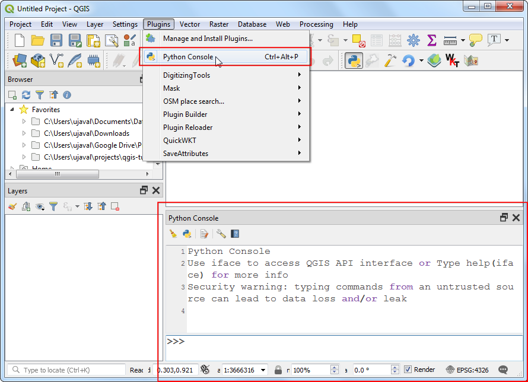{fig-align="center" width="75%"}

En el prompt `>>>`, escriba el siguiente comando y presione Enter.

```python
print('Hello World!')
```

En este paso se ejecuta la función *print()* de Python con el texto 'Hello World'. El resultado de la instrucción se imprimirá debajo.

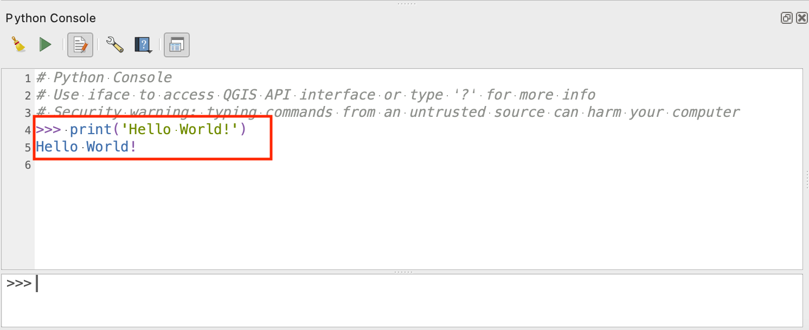{fig-align="center" width="75%"}

Aunque la consola es útil para escribir una o dos líneas de código o para imprimir información de una variable, se debe utilizar el editor integrado para escribir guiones más extensos o fragmentos de código. Haga clic en el botón **Show Editor (Mostrar editor)** para abrir el panel del editor. Ingrese el código y haga clic en el botón **Run Script (Ejecutar guion)** para ejecutarlo. Los resultados aparecerán en la consola como anteriormente. Si se trabaja en un guion largo, se puede utilizar el botón **Save (Guardar)** en el editor para almacenar el archivo.

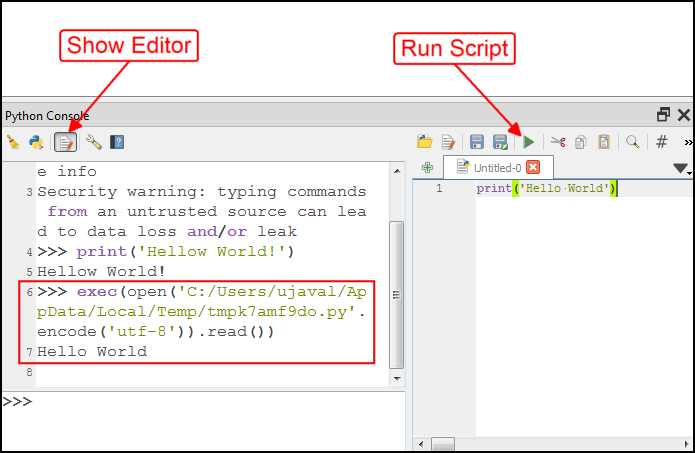{fig-align="center" width="75%"}

Todos los fragmentos de código a continuación deben ejecutarse desde el editor.

## ¡Hola PyQGIS!

QGIS proporciona una API (Interfaz de Programación de Aplicaciones) de Python, conocida como `PyQGIS`. La API es extensa y potente. Casi cualquier operación que se realice mediante la interfaz de QGIS puede ejecutarse a través de la API. Esto permite el desarrollo de nuevas herramientas, la personalización de la interfaz y la automatización de flujos de trabajo.

A continuación, se utiliza la API para realizar tareas de gestión de datos GIS.

Navegue al directorio de datos y cargue la capa `shoreline.shp`. Abra la **Attribute Table (Tabla de atributos)**. Esta capa posee 6 columnas de atributos. Suponga que se desea eliminar la segunda columna (`SDE_SFGIS_`) de la capa.

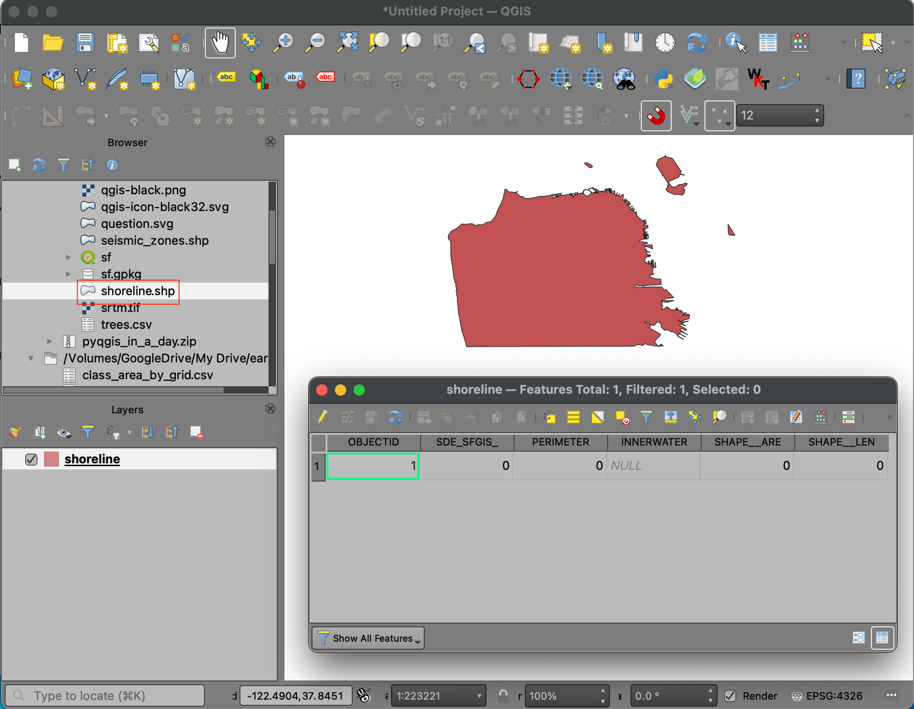{fig-align="center" width="75%"}

Esto puede realizarse mediante la GUI de QGIS de la siguiente manera:

1. Haga clic derecho en la capa `shoreline` y seleccione **Open Attribute Table (Abrir tabla de atributos)**.
2. En la tabla de atributos, haga clic en el botón **Toggle Editing mode (Conmutar edición)**.
3. Haga clic en el botón **Delete field (Borrar campo)**. Seleccione la columna `SDE_SFGIS_` y haga clic en **OK (Aceptar)**.
4. Haga clic en el botón **Save edits (Guardar cambios)** y luego en **Toggle Editing mode (Conmutar edición)** para detener la edición.

QGIS proporciona una API para realizar todo este proceso mediante código Python. Se ejecutará esta tarea utilizando exclusivamente el editor. Abra el **Editor** e ingrese el siguiente código. Haga clic en el botón **Run Script (Ejecutar guion)** para ejecutarlo.


```{mermaid}
%%| fig-align: center
%%| fig-width: 10
%%| fig-height: 6

graph TD
    %% Ajuste clave: Agregamos font-size:12px a la clase code para evitar el desborde y luego usar <br/>
    classDef code fill:#f4f6f9,stroke:#2c3e50,stroke-width:2px,font-family:monospace,font-size:12px;
    classDef expl fill:#e1f5fe,stroke:#0288d1,stroke-width:1px;

    %% Nodo inicial
    A["Panel de capas TOC:<br/>Selección de capa"]:::expl --> B
    B(["layer =<br/>iface.activeLayer"]):::code --> C
    C{"Selección de<br/>API de edición"}:::expl

    %% Camino 1: API del Núcleo (Silenciosa)
    C -->|Clase:<br/>QgsVectorLayer| D
    D["layer<br/>.startEditing()"]:::code --> E
    E["Aislamiento de<br/>transacción en RAM"]:::expl --> F
    F["layer<br/>.deleteAttribute(1)"]:::code --> G
    G["layer<br/>.commitChanges()"]:::code --> H
    H[("Modificación física<br/>en disco")]:::expl
    
    %% Camino 2: API de Interfaz (GUI)
    C -->|Clase:<br/>QgsVectorLayerTools| I
    I["iface.vectorLayerTools<br/>.startEditing(layer)"]:::code --> J
    J["Activación de<br/>indicadores GUI"]:::expl --> K
    K["layer<br/>.deleteAttribute(1)"]:::code --> L
    L["iface.vectorLayerTools<br/>.stopEditing(layer)"]:::code --> M
    M{"Diálogo de<br/>confirmación nativo"}:::expl
    M -->|Guarda cambios| H
    M -->|Cancela o descarta| N["Reversión (Rollback)<br/>del búfer en RAM"]:::expl
```


> Asegúrese de haber seleccionado la capa `shoreline` en el panel **Layers (Capas)** antes de ejecutar el código.

```python
#| eval: false

# -------------------------
# Referencia a la fuente de datos
# -------------------------

# Obtención de la referencia a la capa activa (QgsVectorLayer) en la interfaz
# Debe estar seleccionada la capa `shoreline`
layer = iface.activeLayer()

# -------------------------
# Inicio de la transacción de edición
# -------------------------

# startEditing(): Habilita el modo de edición de la capa.
# Crea un búfer en memoria (QgsVectorLayerEditBuffer) que registra temporalmente todas 
# las modificaciones estructurales y de datos sin alterar el proveedor subyacente en disco.
layer.startEditing()

# -------------------------
# Modificación del esquema tabular
# -------------------------

# deleteAttribute(): Solicita la eliminación de una columna específica del esquema.
# El parámetro requerido es el índice posicional del campo. En la API de QGIS, la indexación 
# comienza en 0. Por lo tanto, el argumento '1' señala la eliminación de la segunda columna.
layer.deleteAttribute(1)

# -------------------------
# Persistencia y cierre de la transacción
# -------------------------

# commitChanges(): Ejecuta la transacción. 
# Descarga los cambios almacenados en el búfer hacia el proveedor físico (ej. OGR/GDAL) 
# modificando el archivo permanentemente, y posteriormente desactiva el modo de edición.
layer.commitChanges()
```

Se observará que la segunda columna ha sido eliminada de la tabla de atributos.

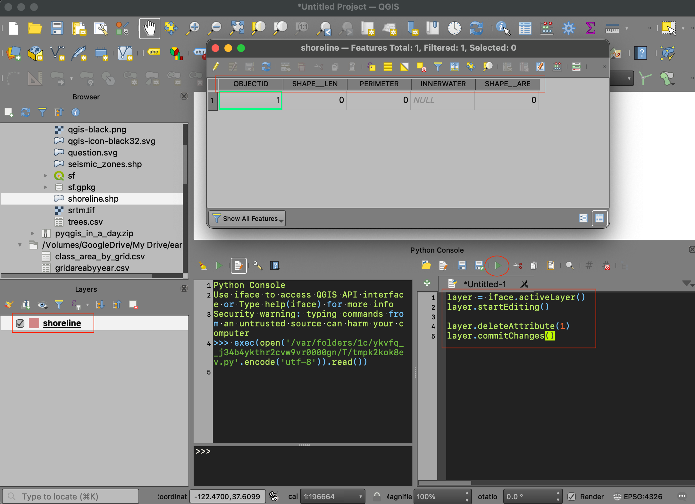{fig-align="center" width="75%"}

Explicación del código paso a paso:

1. `layer = iface.activeLayer()`: Esta línea utiliza el objeto `iface` y ejecuta el método `activeLayer()`, el cual devuelve la capa seleccionada actualmente en QGIS. Se profundizará en `iface` en [@sec-qgis_interface_api_qgisinterface]. El método devuelve la referencia a la capa, que se guarda en la variable `layer`.
2. `layer.startEditing()`: Equivale a poner la capa en modo de edición.
3. `layer.deleteAttribute(1)`: El método `deleteAttribute()` pertenece a la clase `QgsVectorLayer`. Recibe el índice del atributo a eliminar. En este caso, se pasa el índice `1` para el segundo atributo (el índice 0 corresponde al primer atributo).
4. `layer.commitChanges()`: Este método guarda el búfer de edición y desactiva el modo de edición.

Este ejemplo permite visualizar el alcance de la API. Para aprovechar todo el potencial de PyQGIS, es fundamental comprender primero el funcionamiento de las clases.

Tome en cuenta que también es posible activar las acciones de inicio y fin de edición mediante la clase [`QgsVectorLayerTools`](https://qgis.org/pyqgis/3.44/core/QgsVectorLayerTools.html). A continuación, se presenta un código alternativo que muestra un diálogo de confirmación al usuario antes de aplicar los cambios:

```python
#| eval: false

# -------------------------
# Referencia a la fuente de datos
# -------------------------

# Obtención de la referencia a la capa activa en el panel de control
layer = iface.activeLayer()

# -------------------------
# Gestión de transacciones mediante GUI
# -------------------------

# vectorLayerTools().startEditing(): Habilita el modo de edición.
# A diferencia de invocar el método nativo sobre la capa, esta función notifica al 
# entorno gráfico (iface), activando indicadores visuales como el icono de lápiz 
# en el panel de capas y habilitando los botones de edición correspondientes.
iface.vectorLayerTools().startEditing(layer)

# -------------------------
# Modificación del esquema tabular
# -------------------------

# Eliminación de la columna ubicada en la segunda posición (índice 1).
# La modificación se registra en el búfer de edición en memoria RAM.
layer.deleteAttribute(1)

# -------------------------
# Cierre interactivo de la transacción
# -------------------------

# vectorLayerTools().stopEditing(): Solicita la finalización de la edición.
# Este método despliega un cuadro de diálogo nativo de QGIS que interrumpe el flujo 
# y solicita confirmación explícita al usuario para guardar, descartar o cancelar 
# los cambios estructurales antes de alterar el archivo físico.
iface.vectorLayerTools().stopEditing(layer)
```

### Resumen sintáctico

A continuación se presenta la tabla comparativa que contrasta los dos métodos de edición del esquema tabular, destacando las clases empleadas y el comportamiento del sistema en cada etapa del ciclo **CRUD**.

| Etapa del proceso | Método de núcleo (Scripting backend) | Método interactivo (Desarrollo de GUI) |
| :--- | :--- | :--- |
| **Clase gestora principal** | `QgsVectorLayer` | `QgsVectorLayerTools` |
| **Apertura de transacción** | `layer.startEditing()` | `iface.vectorLayerTools().startEditing(layer)` |
| **Comportamiento visual** | Silencioso (sin cambios en la interfaz) | Activa el icono de lápiz y herramientas del panel |
| **Alteración de esquema** | `layer.deleteAttribute(index)` | `layer.deleteAttribute(index)` |
| **Cierre de transacción** | `layer.commitChanges()` | `iface.vectorLayerTools().stopEditing(layer)` |
| **Intervención del usuario** | Nula (ejecución automática en disco) | Obligatoria (despliega ventana de confirmación) |
| **Caso de uso ideal** | Algoritmos de procesamiento en lote | Complementos interactivos y botones de usuario |

## Entendimiento de clases

Antes de profundizar en PyQGIS, es fundamental comprender ciertos conceptos relacionados con las clases en C++ y Python. Tanto Qt como QGIS están desarrollados en lenguaje C++. La funcionalidad de cada widget de Qt/QGIS se implementa como una clase, la cual posee propiedades y funciones específicas. Al utilizar clases de PyQt o PyQGIS, se ejecuta el código de las clases en C++ a través de los enlaces de Python (python bindings).

A continuación, se presenta el código para crear una clase denominada `Car`. El código define una clase, la inicializa para crear nuevas instancias y demuestra el concepto de herencia. Una nueva clase se define mediante la palabra reservada `class`. Todas las clases cuentan con una función denominada `__init__()`, la cual se ejecuta siempre que se crea un nuevo objeto. También se utiliza la palabra clave `self`, que hace referencia a la instancia actual de la clase. El código emplea la palabra clave `super` para referirse a la clase de nivel superior o clase padre.

```{mermaid}
%%| fig-align: center
%%| out-width: 30%

classDiagram
    class Car {
        +String model$
        +String color
        +String type
        +Boolean started
        +Boolean stopped
        +start()
        +stop()
    }
    class Sedan {
        +int seats
    }
    class ElectricSedan {
        +int range_km
    }

    Car <|-- Sedan : Herencia (es un)
    Sedan <|-- ElectricSedan : Herencia multinivel
```

```python
#| file: code/pyqgis/car.py
# Clase padre (superclase)
# Esta clase define atributos y comportamientos comunes para todos los carros
class Car: 
    
    # Variable de clase (compartida por todas las instancias)
    model = 'Civic'
    
    # Constructor: se ejecuta al crear un objeto de la clase
    def __init__(self, color, type):
        # Variables de instancia (propias de cada objeto)
        self.color = color
        self.type = type
        self.started = False
        self.stopped = False
    
    # Método para encender el carro
    def start(self):
        print('Car Started')
        self.started = True
        self.stopped = False
        
    # Método para apagar el carro
    def stop(self):
        print('Car Stopped')
        self.stopped = True
        self.started = False   # (corregido error: "sefl" -> "self")


# -------------------------
# 1. Instanciar la clase base (Car)
# -------------------------
print('1. Instanciar una clase: Car')

# Crear un objeto (instancia) de la clase Car
my_car = Car('blue', 'automatic')

print(my_car)

# Llamar a un método de la clase
my_car.start()

# Consultar una variable de instancia
print('Car Started?', my_car.started)

# Consultar una variable de clase
print('Car model', Car.model)


# -------------------------
# HERENCIA
# -------------------------

# Clase hija (subclase) que hereda de Car
# Sedan ES UN tipo de Car (relación "es-un")
class Sedan(Car):
        
    def __init__(self, color, type, seats):
        # Llamamos al constructor de la clase padre (Car)
        super().__init__(color, type)
        
        # Atributo adicional propio de Sedan
        self.seats = seats
        

# Clase hija de Sedan (y nieta de Car)
# ElectricSedan hereda todo de Sedan y Car
class ElectricSedan(Sedan):

    def __init__(self, color, type, seats, range_km):
        # Llamamos al constructor de Sedan (que a su vez llama a Car)
        super().__init__(color, type, seats)
        
        # Atributo adicional propio de autos eléctricos
        self.range_km = range_km


# -------------------------
# 2. Instanciar una subclase (Sedan)
# -------------------------
print('2. Instanciar una clase que hereda de otra: Sedan <- Car')

# Crear un objeto de Sedan
my_car = Sedan('blue', 'automatic', 5)

# Accedemos a atributos heredados (de Car)
print(my_car.color)

# Atributo propio de Sedan
print(my_car.seats)

# Método heredado de Car
my_car.start()


# -------------------------
# 3. Herencia multinivel
# ElectricSedan <- Sedan <- Car
# -------------------------
print('3. Instanciar una clase que hereda de otra y esta a su vez hereda de otra: ElectricSedan <- Sedan <- Car')

# Crear un objeto de ElectricSedan
my_future_car = ElectricSedan('red', 'automatic', 5, 500)

# Atributos heredados de Car
print(my_future_car.color)

# Atributos heredados de Sedan
print(my_future_car.seats)

# Atributo propio de ElectricSedan
print(my_future_car.range_km)

# Método heredado de Car
my_future_car.start()
```

## Uso de clases de PyQGIS

Se inicia ahora el trabajo con las clases de PyQGIS. QGIS dispone de clases para toda la gama de operaciones, desde la construcción de la interfaz de usuario hasta la ejecución de geoprocesamientos. Se analizará cómo acceder a estas clases mediante la API de PyQGIS.

### Cálculo de distancia mediante PyQGIS

Una operación básica pero fundamental en los SIG es el cálculo de distancias y áreas. Se explicará cómo utilizar las API de PyQGIS para calcular distancias.

```{mermaid}
%%| fig-align: center
%%| out-width: 100%

graph TD
    %% Definición de estilos visuales optimizados contra desbordes
    classDef cod fill:#f4f6f9,stroke:#2c3e50,stroke-width:2px,font-family:monospace,font-size:12px;
    classDef exp fill:#e1f5fe,stroke:#0288d1,stroke-width:1px;

    %% Flujo inicial
    A["Importación de<br/>clases core"]:::exp --> B
    B(["from qgis.core import<br/>QgsDistanceArea, QgsPointXY"]):::cod --> C
    C{"Configuración del<br/>análisis espacial"}:::exp
    
    %% Rama 1: Motor Geodésico
    C -->|Motor de cálculo| D
    D(["d = QgsDistanceArea()"]):::cod --> E
    E["Definición del modelo<br/>terrestre (Elipsoide)"]:::exp --> F
    F(["d.setEllipsoid('WGS84')"]):::cod --> I
    
    %% Rama 2: Geometría
    C -->|Vectores de posición| G
    G["Inversión estricta de<br/>(Lat, Lon) a (X, Y)"]:::exp --> H
    H(["p = QgsPointXY(lon, lat)"]):::cod --> I
    
    %% Fusión y Ejecución
    I{"Cálculo de<br/>distancia elipsoidal"}:::exp --> J
    J(["dist = d.measureLine([p1, p2])"]):::cod --> K
    K["Salida escalar en metros<br/>(Requiere conversión a km)"]:::exp
```

Se calculará la distancia entre las siguientes dos coordenadas:

```python
san_francisco = (37.7749, -122.4194)
new_york = (40.661, -73.944)
```

QGIS proporciona la clase `QgsDistanceArea`, que cuenta con métodos para calcular distancias y áreas.

Para utilizar esta clase, se debe crear un objeto mediante su instanciación. Según la documentación de la clase, el constructor no requiere argumentos. Se puede emplear el constructor por defecto para crear un objeto y asignarlo a la variable `d`.

```python
from qgis.core import QgsDistanceArea
d = QgsDistanceArea()
```

La documentación indica que, si se ha establecido un elipsoide válido para `QgsDistanceArea`, todos los cálculos se realizarán mediante algoritmos elipsoidales (por ejemplo, utilizando las fórmulas de Vincenty). Dado que se requiere calcular la distancia entre un par de latitudes y longitudes, es necesario emplear algoritmos elipsoidales. Se establecerá el elipsoide `WGS84` para el cálculo mediante el método `setEllipsoid()`. Es importante recordar que los métodos deben aplicarse sobre los objetos y no directamente sobre las clases.

```python
d.setEllipsoid('WGS84')
```

> Sugerencia: Todos los elipsoides válidos pueden consultarse llamando a `QgsEllipsoidUtils.acronyms()`.

El objeto `d` es ahora capaz de realizar cálculos de distancia elipsoidales. Al revisar los métodos disponibles en la clase `QgsDistanceArea`, se identifica el método `measureLine()`. Este método requiere una lista de objetos `QgsPointXY`. Estos objetos pueden crearse a partir de los pares de coordenadas y pasarse al método `measureLine()` para obtener la distancia. El resultado se entregará en metros, por lo que se divide entre 1000 para la conversión a kilómetros.

```python
lat1, lon1 = san_francisco
lat2, lon2 = new_york

# El orden requerido es X, Y
from qgis.core import QgsPointXY
point1 = QgsPointXY(lon1, lat1)
point2 = QgsPointXY(lon2, lat2)

distance = d.measureLine([point1, point2])
print(distance/1000)
```

A continuación, se presenta el código completo para calcular la distancia entre un par de coordenadas utilizando PyQGIS. Al ejecutar el código en la `Python Console` (Consola de Python) de QGIS, todas las clases de PyQGIS ya se encuentran importadas. Si este código se ejecuta desde un script externo o un complemento, se debe importar explícitamente la clase `QgsDistanceArea`.

```python
#| file: code/pyqgis/distance.py
# Importamos clases del módulo principal de QGIS para trabajar con geometría
from qgis.core import QgsDistanceArea, QgsPointXY


# Definimos coordenadas geográficas (latitud, longitud)
# San Francisco (California, USA)
san_francisco = (37.7749, -122.4194)

# Nueva York (USA)
new_york = (40.661, -73.944)


# Creamos un objeto de la clase QgsDistanceArea
# Este objeto se usa para calcular distancias y áreas sobre la superficie terrestre
d = QgsDistanceArea()

# Definimos el modelo de la Tierra (elipsoide)
# 'WGS84' es el sistema estándar usado por GPS
# Esto permite calcular distancias más precisas (curvatura de la Tierra)
d.setEllipsoid('WGS84')


# -------------------------
# Preparación de coordenadas
# -------------------------

# Desempaquetamos las tuplas en variables separadas
lat1, lon1 = san_francisco
lat2, lon2 = new_york

# IMPORTANTE:
# QgsPointXY usa el orden (X, Y) = (longitud, latitud)
# Esto suele confundir porque normalmente escribimos (lat, lon)
# Aquí debemos invertir el orden

# Creamos el punto para San Francisco
point1 = QgsPointXY(lon1, lat1)

# Creamos el punto para Nueva York
point2 = QgsPointXY(lon2, lat2)


# -------------------------
# Cálculo de distancia
# -------------------------

# measureLine calcula la distancia entre una serie de puntos
# En este caso pasamos una lista con 2 puntos → distancia directa entre ellos
# El resultado se devuelve en METROS
distance = d.measureLine([point1, point2])


# -------------------------
# Resultado
# -------------------------

# Convertimos de metros a kilómetros dividiendo entre 1000
# y lo imprimimos
print(distance / 1000)
```

#### Resumen sintáctico

Este bloque de código introduce las clases fundamentales del núcleo geométrico de QGIS (`qgis.core`) para realizar análisis espacial geodésico, superando las limitaciones de los cálculos euclidianos planos.

| Clase / Método | Función técnica y consideraciones |
| :--- | :--- |
| `QgsDistanceArea()` | Instancia el motor principal para mediciones de área y longitud. Sin configuración adicional, opera bajo suposiciones planimétricas dependientes del CRS del proyecto. |
| `.setEllipsoid('WGS84')` | Transforma el comportamiento del motor matemático. Al definir un elipsoide válido (ej. `WGS84`), fuerza a la API a utilizar algoritmos de alta precisión (como las ecuaciones de Vincenty) para contemplar la curvatura terrestre. |
| `QgsPointXY(x, y)` | Construye un objeto geométrico primitivo 2D. **Punto crítico de fallo:** Los sistemas de posicionamiento global reportan coordenadas como `(Latitud, Longitud)`. Sin embargo, los sistemas cartesianos SIG requieren estrictamente la notación `(X, Y)`. El desarrollador debe invertir el par a `(Longitud, Latitud)`. |
| `.measureLine([lista_puntos])` | Ejecuta el análisis espacial iterando sobre un arreglo de objetos `QgsPointXY`. Retorna la distancia acumulada. Si el elipsoide está activado, la unidad de salida predeterminada es siempre el **metro lineal**, requiriendo conversión posterior por parte del script. |

#### Ejercicio 1

Suponga que desea realizar una parada en Las Vegas en el trayecto de San Francisco a Nueva York.

Calcule la distancia elipsoidal total considerando la parada en Las Vegas.

```python
san_francisco = (37.7749, -122.4194)
new_york = (40.661, -73.944)
las_vegas = (36.1699, -115.1398)
```

Si el código es correcto, el resultado de la distancia debería ser `4271.02` kilómetros.

### Conversión de distancias

La distancia devuelta por el método `measureLine()` en la sección anterior se expresó en metros. En lugar de realizar la conversión manual dividiendo por 1000, es posible utilizar la API de PyQGIS. 

```{mermaid}
%%| fig-align: center
%%| fig-width: 10
%%| fig-height: 6

graph TD
    %% Definición de estilos para evitar desbordes tipográficos
    classDef cod fill:#f4f6f9,stroke:#2c3e50,stroke-width:2px,font-family:monospace,font-size:12px;
    classDef exp fill:#e1f5fe,stroke:#0288d1,stroke-width:1px;

    %% Flujo de procesamiento
    A["Entrada: Magnitud bruta<br/>en metros (measureLine)"]:::exp --> B
    B(["distance =<br/>d.measureLine([p1, p2])"]):::cod --> C
    C{"Selección de unidad<br/>de destino"}:::exp
    
    %% Rama de Unidades
    C -->|Enumeración| D
    D(["Qgis.DistanceUnit.<br/>Kilometers / Miles"]):::cod --> E
    
    %% Transformación
    E["Invocación del método<br/>de conversión de la API"]:::exp --> F
    F(["d.convertLengthMeasurement(<br/>distance, unidad)"]):::cod --> G
    G["Salida: Valor escalar<br/>en la unidad requerida"]:::exp
```


La clase `QgsDistanceArea` posee el método `convertLengthMeasurement()`, capaz de convertir la distancia medida a cualquier unidad compatible. Este método requiere dos argumentos: la longitud medida y la unidad a la que se desea convertir. La unidad debe ser un valor del tipo `Qgis.DistanceUnit`. Los valores permitidos se definen en la documentación de `Qgis.DistanceUnit`. El siguiente código demuestra la conversión de la distancia medida a kilómetros y millas.

> Nota: En versiones anteriores a QGIS 3.40, los tipos de unidad se especificaban como `QgsUnitTypes.DistanceKilometers`.

```python
#| file: code/pyqgis/distance_conversion.py
# -------------------------
# Importación de dependencias
# -------------------------

# Importamos QgsDistanceArea para cálculos geodésicos, QgsPointXY para geometría vectorial 
# y el espacio de nombres Qgis para acceder a las constantes de unidades de medida
from qgis.core import QgsDistanceArea, QgsPointXY, Qgis


# -------------------------
# Definición de parámetros espaciales
# -------------------------

# Coordenadas geográficas en formato tupla (latitud, longitud)
# Punto de origen: San Francisco, CA
san_francisco = (37.7749, -122.4194)

# Punto de destino: New York City, NY
new_york = (40.661, -73.944)


# -------------------------
# Configuración del motor de cálculo
# -------------------------

# Instanciamos la clase QgsDistanceArea para gestionar el análisis espacial
d = QgsDistanceArea()

# Definimos el elipsoide de referencia como WGS84 para habilitar cálculos elipsoidales.
# Esto asegura que la API utilice fórmulas de alta precisión (como Vincenty) 
# en lugar de aproximaciones planas o esféricas
d.setEllipsoid('WGS84')


# -------------------------
# Preparación de datos geométricos
# -------------------------

# Desempaquetado de coordenadas para procesamiento individual
lat1, lon1 = san_francisco
lat2, lon2 = new_york

# NOTA TÉCNICA: QgsPointXY requiere estrictamente el orden (X, Y).
# En sistemas geográficos, esto corresponde a (Longitud, Latitud)
point1 = QgsPointXY(lon1, lat1)
point2 = QgsPointXY(lon2, lat2)


# -------------------------
# Ejecución del análisis geodésico
# -------------------------

# Cálculo de la distancia de la línea geodésica sobre el elipsoide definido.
# El método measureLine recibe una lista de nodos y devuelve el valor escalar en metros
distance = d.measureLine([point1, point2])

# Salida del valor bruto en metros
print('Distance in meters', distance)


# -------------------------
# Gestión y conversión de unidades mediante API
# -------------------------

# En lugar de conversiones aritméticas manuales, se utiliza el método convertLengthMeasurement.
# Este método requiere el valor de entrada y una constante de la enumeración Qgis.DistanceUnit

# Conversión a kilómetros
distance_km = d.convertLengthMeasurement(distance, Qgis.DistanceUnit.Kilometers)
print('Distance in kilometers', distance_km)

# Conversión a millas
distance_mi = d.convertLengthMeasurement(distance, Qgis.DistanceUnit.Miles)
print('Distance in miles', distance_mi)
```

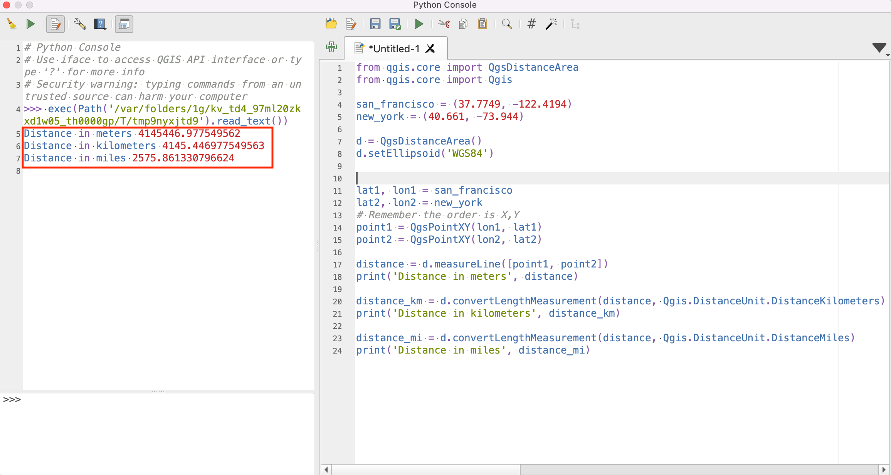{fig-align="center" width="75%"}


#### Resumen sintáctico

La implementación de conversiones mediante la API se fundamenta en el uso de constantes tipificadas que aseguran la precisión de los cálculos según el elipsoide configurado.

| Clase / Constante / Método | Función técnica y especificaciones de uso |
| :--- | :--- |
| `Qgis.DistanceUnit` | Espacio de nombres que contiene las constantes de enumeración para las unidades de medida (ej. `Kilometers`, `Miles`, `Meters`, `Feet`). |
| `.convertLengthMeasurement()` | Método de la clase `QgsDistanceArea` que realiza la conversión escalar. Requiere dos argumentos: el valor original (flotante) y la unidad de destino (constante de `Qgis.DistanceUnit`). |
| `QgsUnitTypes` | Referencia histórica: En versiones anteriores a QGIS 3.40, se utilizaba para definir tipos como `DistanceKilometers`. La migración al espacio `Qgis` es la práctica recomendada actualmente. |
| `d.setEllipsoid('WGS84')` | Configuración mandatoria previa a la conversión. El motor de cálculo requiere un elipsoide de referencia para que la magnitud medida en metros sea coherente con la superficie curva antes de ser transformada. |

## Fundamentos de programación de interfaces gráficas de usuario (GUI)

### Qt y PyQt

[Qt](https://www.qt.io/) es un conjunto de herramientas de widgets de código abierto para la creación de interfaces gráficas de usuario y aplicaciones multiplataforma. QGIS está construido sobre la plataforma Qt. Tanto Qt como QGIS disponen de API documentadas que deben utilizarse al desarrollar código Python para ser ejecutado en QGIS.

[PyQt](https://wiki.python.org/moin/PyQt) es la interfaz de Python para Qt, la cual proporciona clases y funciones para interactuar con los widgets de Qt.

### Construcción de un cuadro de diálogo

Se describe el uso de las clases de PyQt para crear e interactuar con elementos de la GUI. En este ejemplo, se crea un cuadro de diálogo simple para solicitar una confirmación al usuario. 

El siguiente diagrama detalla el ciclo de vida del objeto `QMessageBox`, desde su definición en el entorno de Python hasta la captura de la respuesta en la consola.

```{mermaid}
%%| fig-align: center
%%| out-width: 100%

graph TD
    %% Definición de estilos para evitar desbordes tipográficos
    classDef cod fill:#f4f6f9,stroke:#2c3e50,stroke-width:2px,font-family:monospace,font-size:12px;
    classDef exp fill:#e1f5fe,stroke:#0288d1,stroke-width:1px;

    %% Flujo de procesamiento
    A["Instanciación del objeto:<br/>Clase QMessageBox"]:::exp --> B
    B(["mb = QMessageBox()"]):::cod --> C
    C["Configuración de<br/>interfaz y lógica"]:::exp --> D
    D(["mb.setText('...')<br/>mb.setStandardButtons(...)"]):::cod --> E
    
    %% Ejecución y Captura
    E["Ejecución modal:<br/>Espera de interacción"]:::exp --> F
    F(["return_value = mb.exec()"]):::cod --> G
    
    %% Evaluación de retorno
    G{Evaluación de la<br/>variable de retorno}:::exp
    G -->|return_value == Ok| H["Salida: 'You pressed OK'<br/>en Python Console"]:::exp
    G -->|return_value == Cancel| I["Salida: 'You pressed Cancel'<br/>en Python Console"]:::exp
```


El código puede ingresarse en el `Editor` y ejecutarse mediante `Run Script` (Ejecutar guion).

`QMessageBox` es una clase de PyQt para la creación de diálogos con botones. Para utilizarla, se crea un objeto mediante la instanciación de la clase. En este caso, `mb` es un objeto que representa una instancia de `QMessageBox`, creado con los parámetros por defecto.

```python
mb = QMessageBox()
```

El uso de `type()` permite identificar la clase del objeto:

```python
type(mb)
```

La función `dir()` devuelve la lista de atributos y métodos de cualquier objeto:

```python
dir(mb)
```

Las clases poseen métodos que proporcionan funcionalidad, los cuales pueden ejecutarse sobre los objetos de instancia. Para la clase `QMessageBox`, el método `setText()` añade un texto al diálogo.

```python
mb = QMessageBox()
mb.setText('Click OK to confirm')
```

Las clases también poseen atributos de clase que se comparten entre todas las instancias. La clase `QMessageBox` cuenta con los atributos `Ok` y `Cancel`, a los que se hace referencia como `QMessageBox.Ok` y `QMessageBox.Cancel`.

```python
mb = QMessageBox()
mb.setText('Click OK to confirm')
mb.setStandardButtons(QMessageBox.Ok | QMessageBox.Cancel)
```

Para visualizar el diálogo, se debe utilizar el método `exec()`. La entrada del usuario se captura y almacena en la variable `return_value`.

El fragmento de código completo es el siguiente. Al ejecutarlo, el resultado de la acción se reflejará en la `Python Console` (Consola de Python).

```python
#| eval: false

# -------------------------
# Instanciación y configuración
# -------------------------

# Generación de un objeto de la clase QMessageBox
mb = QMessageBox()

# Definición del contenido textual del diálogo
mb.setText('Click OK to confirm')

# -------------------------
# Configuración de botones y lógica
# -------------------------

# setStandardButtons(): Define los botones disponibles mediante el uso de 
# constantes de enumeración. Se aplica el operador bitwise OR (|) para 
# combinar múltiples opciones en una sola instrucción.
mb.setStandardButtons(QMessageBox.Ok | QMessageBox.Cancel)

# exec(): Ejecuta el diálogo de forma modal, bloqueando el hilo principal 
# hasta que el usuario realice una acción. Devuelve un valor entero 
# correspondiente al botón presionado.
return_value = mb.exec()

# Evaluación de la respuesta mediante comparación con constantes de clase
if return_value == QMessageBox.Ok:
    print('You pressed OK')
elif return_value == QMessageBox.Cancel:
    print('You pressed Cancel')
```

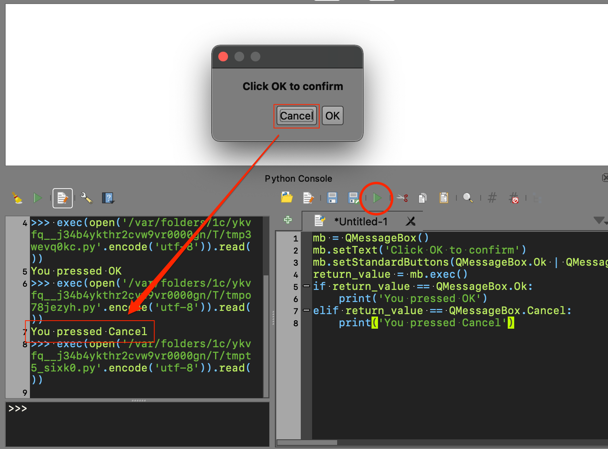{fig-align="center" width="75%"}

### Resumen sintáctico de la construcción de diálogos

La implementación de cuadros de diálogo en PyQt se basa en la instanciación de objetos y la configuración de sus propiedades mediante métodos específicos antes de su ejecución modal.

| Clase / Método / Atributo | Función técnica y especificaciones de uso |
| :--- | :--- |
| `QMessageBox()` | Clase de PyQt diseñada para crear diálogos interactivos. La instanciación genera un objeto con parámetros por defecto. |
| `setText(str)` | Método de instancia que define el mensaje textual que se presentará al usuario dentro del cuadro de diálogo. |
| `setStandardButtons()` | Configura los botones de respuesta. Utiliza atributos de clase (constantes) combinados mediante el operador bitwise OR (`|`). |
| `exec()` | Ejecuta el diálogo de forma modal. Bloquea la aplicación hasta que el usuario interactúa y devuelve un entero representativo de la acción. |
| `QMessageBox.Ok` / `.Cancel` | Atributos de clase (constantes de enumeración) que se utilizan tanto para configurar los botones como para evaluar la respuesta del usuario. |


## Profundización en PyQGIS

[PyQGIS](https://docs.qgis.org/testing/en/docs/pyqgis_developer_cookbook/) es la interfaz de Python para QGIS. Se ha desarrollado mediante SIP e integra las funcionalidades de PyQt.

::: {.callout-note}
### Definición de SIP

SIP es una herramienta de código abierto diseñada para la generación de enlaces (*bindings*), lo que permite la interoperabilidad entre el núcleo de C++ de QGIS y el entorno de Python. La función técnica principal consiste en envolver (*wrapping*) las clases de C++ para que sean interpretadas como objetos nativos dentro de PyQGIS, gestionando de manera eficiente la memoria y el ciclo de vida de los objetos entre ambos lenguajes.
:::


> **Dato de interés:** La mayoría de los nombres de las clases de QGIS comienzan con el prefijo *Qgs*. La **Q** representa a Qt y **gs** hace referencia a Gary Sherman, fundador del proyecto QGIS.

La documentación de la API de QGIS en C++ está disponible en: [https://qgis.org/api/3.44/](https://qgis.org/api/3.44/)

La documentación de la API de QGIS en Python está disponible en: [https://qgis.org/pyqgis/3.44/](https://qgis.org/pyqgis/3.44/)

Ambas API son idénticas en su mayor parte, aunque ciertas funciones específicas podrían no estar disponibles en la API de Python.

### API de la interfaz de QGIS (QgisInterface) {#sec-qgis_interface_api_qgisinterface}

En esta sección se analiza la clase [`QgisInterface`](https://qgis.org/pyqgis/3.44/gui/QgisInterface.html), que proporciona métodos para la interacción con el entorno de QGIS. Durante la ejecución de QGIS, se configura una variable denominada `iface`, la cual provee un objeto de la clase `QgisInterface` para interactuar con la sesión activa. Esta interfaz permite el acceso al lienzo del mapa, menús, barras de herramientas y otros componentes de la aplicación. Tanto la `Python Console` (Consola de Python) como los complementos utilizan `iface` para acceder a diversas partes de QGIS.

#### Cambio del título de la ventana principal de QGIS

```python
#| eval: false

# -------------------------
# Acceso a la interfaz
# -------------------------

# mainWindow(): Recupera el objeto principal de la interfaz (QMainWindow).
# Este objeto controla el marco externo de la aplicación QGIS.
main_window = iface.mainWindow()

# -------------------------
# Recuperación de metadatos
# -------------------------

# windowTitle(): Extrae la cadena de texto que reside actualmente 
# en la barra de título de la ventana principal.
title = main_window.windowTitle()

# -------------------------
# Transformación de cadena
# -------------------------

# Operación estándar de Python para sustituir la subcadena 'QGIS' 
# por una etiqueta personalizada.
new_title = title.replace('QGIS', 'My QGIS')

# -------------------------
# Aplicación de cambios
# -------------------------

# setWindowTitle(): Inyecta el nuevo string en el widget de la ventana.
# El cambio es inmediato y persistirá durante la sesión activa.
main_window.setWindowTitle(new_title)
```

#### Eliminación de los menús de ráster y vectorial

```python
#| eval: false

# -------------------------
# Localización de componentes nativos
# -------------------------

# vectorMenu(): Recupera la instancia del menú 'Vectorial' (QMenu).
vector_menu = iface.vectorMenu()

# rasterMenu(): Recupera la instancia del menú 'Ráster' (QMenu).
raster_menu = iface.rasterMenu()

# -------------------------
# Acceso a la jerarquía superior
# -------------------------

# parentWidget(): Método de Qt que permite escalar en la jerarquía 
# de objetos. En este contexto, devuelve el objeto QMenuBar que 
# contiene a los menús individuales.
menubar = vector_menu.parentWidget()

# -------------------------
# Remoción de acciones
# -------------------------

# removeAction(): Elimina el activador del menú de la barra principal.
# menuAction(): Recupera el QAction asociado al objeto QMenu, 
# necesario para que la barra de menús sepa qué elemento retirar.
menubar.removeAction(vector_menu.menuAction())
menubar.removeAction(raster_menu.menuAction())
```

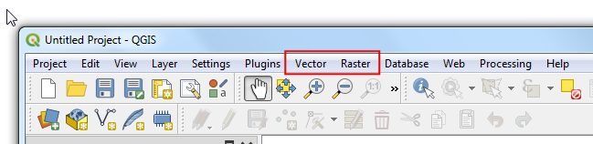{fig-align="center" width="75%"}

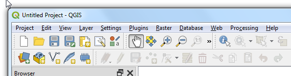{fig-align="center" width="75%"}

#### Entendimiento de señales y ranuras (signals and slots)

La programación de GUI requiere responder a las acciones del usuario. Todos los objetos en Qt poseen un mecanismo para emitir una señal (`signal`) cuando ocurre un cambio de estado, como cuando un usuario hace clic en un botón o se cierra una ventana. El programador puede conectar dicha señal a una ranura (`slot`), que es una función de Python que se llamará al emitirse la señal. La sintaxis general para la conexión es `<objeto>.<señal>.connect(función)`.

#### Adición de un nuevo elemento de menú

Un nuevo botón o elemento de menú se crea mediante `QAction()`. En este caso, se crea una acción y se conecta la señal de activación (`triggered`) a un método que abre un sitio web.

```python
#| eval: false

# -------------------------
# Gestión de dependencias externas
# -------------------------

# Importación del módulo estándar para el control de navegadores web.
# Permite la ejecución de llamadas al sistema para abrir URLs en el navegador predeterminado.
import webbrowser

# -------------------------
# Definición de la lógica de respuesta
# -------------------------

def open_website():
    """
    Función de callback que encapsula la apertura del sitio web.
    Se utiliza el método open() para despachar la URL al sistema operativo.
    """
    webbrowser.open('https://gis.stackexchange.com')

# -------------------------
# Creación y vinculación del objeto de interfaz
# -------------------------

# Instanciación de QAction: define el elemento que residirá en el menú.
# El primer argumento es la cadena de texto que el usuario visualizará.
website_action = QAction('Go to gis.stackexchange')

# Mecanismo Signal-Slot: conecta la señal 'triggered' (clic del usuario) 
# con la función 'open_website' definida anteriormente.
website_action.triggered.connect(open_website)

# -------------------------
# Modificación del menú nativo
# -------------------------

# Acceso al menú de ayuda (QMenu) mediante el objeto global iface.
# addSeparator(): Inserta una línea divisoria para mantener la jerarquía visual.
iface.helpMenu().addSeparator()

# addAction(): Inyecta el objeto QAction al final de la lista del menú de ayuda.
iface.helpMenu().addAction(website_action)
```

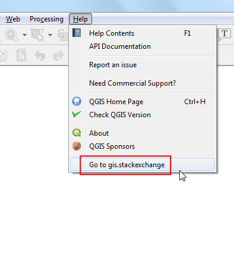{fig-align="center" width="50%"}

#### Cambio de la visibilidad de una barra de herramientas

Hacer visible la barra de herramientas: `Plugins`

```python
iface.pluginToolBar().setVisible(True)
```

#### Adición de un botón a una barra de herramientas


::: {.callout-important}
##### Requisitos para el funcionamiento del código
Para asegurar que los scripts localicen correctamente las rutas a los archivos complementarios en el almacenamiento local, es indispensable crear un proyecto de QGIS denominado `clase.qgz`. Este archivo debe estar posicionado estrictamente dentro del directorio `./data_heavy/pyqgis_masterclass/`.
:::


::: {.callout-note}
##### Evolución de la configuración de rutas
La arquitectura original del código empleaba el directorio de inicio del usuario para centralizar el acceso a los datos. Dicha configuración se fundamentaba en la instrucción `os.path.expanduser('~')`, la cual resuelve la ruta absoluta hacia la carpeta home del sistema operativo. Se informa que este método se ha sustituido en la versión actual de la guía por una estructura de directorios relativa para optimizar la portabilidad del proyecto.
:::

```python
#| eval: false

# -------------------------
# Importación de dependencias
# -------------------------

import os
from datetime import datetime
from qgis.core import QgsProject


# -------------------------
# Validación de precondición
# -------------------------

# Recuperación de la ruta del proyecto activo mediante el singleton QgsProject
project_full_path = QgsProject.instance().fileName()

# Control de flujo: Si la cadena está vacía, el proyecto no ha sido guardado
if not project_full_path:
    # Notificación de error crítico en la barra de mensajes de QGIS
    iface.messageBar().pushCritical(
        'Error de ejecución', 
        'Operación cancelada: El proyecto actual debe estar guardado en ./data_heavy/pyqgis_masterclass/ para cargar iconos locales.'
    )

else:
    # -------------------------
    # Gestión de rutas y recursos
    # -------------------------
    
    # Extracción del directorio base del archivo de proyecto
    project_dir = os.path.dirname(project_full_path)
    icon_name = 'question.svg'
    icon_path = os.path.join(project_dir, icon_name)
    
    # -------------------------
    # Definición de lógica interna
    # -------------------------
    
    def show_time():
        """Captura la hora del sistema y la despliega en la interfaz."""
        now = datetime.now()
        current_time = now.strftime("%H:%M:%S")
        iface.messageBar().pushInfo('Reporte de tiempo', f"Hora actual: {current_time}")

    # -------------------------
    # Integración en la interfaz (UI)
    # -------------------------
    
    # La instanciación de la acción se realiza solo tras validar el proyecto
    action = QAction('Show Time', iface.mainWindow())
    
    # Conexión del evento de activación con la función de reporte temporal
    action.triggered.connect(show_time)
    
    # Verificación de existencia física del archivo SVG antes de su asignación
    if os.path.exists(icon_path):
        action.setIcon(QIcon(icon_path))
    
    # Inserción de la acción en la barra de herramientas de complementos
    iface.addToolBarIcon(action)

    # Si se requiere una barra específica, ej. Barra de Atributos:
    #iface.attributesToolBar().addAction(action)

    # Si se requiere a una barra nueva
    # iface.addToolBar("Nombre de la Barra")
```

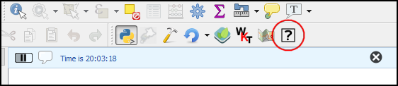{fig-align="center" width="75%"}


#### Estructura y flujo de interacción con QgisInterface

El siguiente diagrama detalla la arquitectura de comunicación entre el objeto global `iface` y los elementos de la GUI, incluyendo el mecanismo de señales y ranuras para la ejecución de funciones personalizadas.

```{mermaid}
%%| fig-align: center
%%| out-width: 100%

graph TD
    %% Definición de estilos para evitar desbordes tipográficos
    classDef cod fill:#f4f6f9,stroke:#2c3e50,stroke-width:2px,font-family:monospace,font-size:12px;
    classDef exp fill:#e1f5fe,stroke:#0288d1,stroke-width:1px;

    %% Nodo Central
    IFACE["Objeto iface<br/>(Clase: QgisInterface)"]:::exp --> MW
    IFACE --> MENU
    IFACE --> TB
    IFACE --> MB

    %% Rama Window
    MW["mainWindow()"]:::cod --> QMW["Clase: QMainWindow<br/>(Título de ventana)"]:::exp
    QMW --> ST["setWindowTitle()"]:::cod

    %% Rama Menús
    MENU["vectorMenu() /<br/>rasterMenu()"]:::cod --> QMB["Clase: QMenuBar<br/>(Gestión de acciones)"]:::exp
    QMB --> RM["removeAction()"]:::cod

    %% Rama Acciones y Señales
    TB["addToolBarIcon() /<br/>helpMenu()"]:::cod --> QA["Clase: QAction<br/>(Botones/Items)"]:::exp
    QA --> SIG["Señal: triggered"]:::exp
    SIG -->|connect| SLOT["Función de Python<br/>(Slot)"]:::exp

    %% Rama Mensajes
    MB["messageBar()"]:::cod --> QMBAR["Clase: QgsMessageBar<br/>(Notificaciones)"]:::exp
    QMBAR --> PI["pushInfo() /<br/>pushCritical()"]:::cod
```

#### Resumen sintáctico de la interfaz de usuario

A continuación se presenta la relación de métodos y clases involucradas en la personalización de la sesión activa de QGIS mediante la API de Python.

| Componente | Método / Atributo | Clase asociada | Descripción técnica |
| :--- | :--- | :--- | :--- |
| **Ventana principal** | `mainWindow()` | `QMainWindow` | Recupera el contenedor de máximo nivel de la aplicación para gestionar títulos y estados de la ventana. |
| **Gestión de menús** | `vectorMenu()`, `helpMenu()` | `QMenu` / `QMenuBar` | Permite acceder a los menús nativos para añadir separadores, acciones o remover menús completos mediante `parentWidget()`. |
| **Eventos de usuario** | `triggered.connect()` | `QAction` (Signal/Slot) | Mecanismo de Qt para vincular un evento de la interfaz (clic) con una función de respuesta (*callback*) en Python. |
| **Barras de herramientas** | `addToolBarIcon()` | `QToolBar` | Inserta objetos `QAction` directamente en la barra de complementos o barras específicas del sistema. |
| **Notificaciones** | `messageBar()` | `QgsMessageBar` | Proporciona una zona de comunicación no bloqueante para desplegar mensajes informativos o errores críticos. |
| **Entorno de datos** | `QgsProject.instance()` | `QgsProject` | Singleton para validar la persistencia del archivo `.qgz`, requisito para el direccionamiento de rutas relativas de iconos. |


#### Ejercicio 2

En el ejemplo anterior, la alerta se muestra en la `message bar` (barra de mensajes) de QGIS como un mensaje de información (`Info`). Cambie el tipo de mensaje a una advertencia (`Warning`).

Sugerencia: Consulte el método apropiado en la clase `QgsMessageBar`.

Reto: El mensaje de advertencia no tiene un tiempo de expiración y debe cerrarse manualmente. Modifique la solución para mostrar un mensaje de advertencia con un tiempo de expiración de 5 segundos. Sugerencia: Revise el método `pushMessage()`.

### Administración de capas

#### Adición de nuevas capas

Las fuentes de datos se identifican mediante un URI (Uniform Resource Identifier).

*   Para archivos locales, el URI es la ruta del archivo.
*   Para bases de datos, el URI se construye mediante la clase `QgsDataSourceUri` e incluye la ruta, tabla, usuario, contraseña, etc.
*   Para capas web (WMF/WFS), el URI es la URL correspondiente.

Se recomienda consultar el `PyQGIS Developer Cookbook` para ejemplos sobre la construcción de URI para distintos tipos de datos.

```python
#| eval: false

# -------------------------
# Importación de dependencias
# -------------------------

# os: Módulo estándar para la gestión de rutas y operaciones del sistema de archivos
import os

# QgsProject: Clase fundamental de la API core de QGIS para interactuar con la sesión activa
from qgis.core import QgsProject


# -------------------------
# Validación de precondición de ruta
# -------------------------

# Recuperación de la ruta absoluta del archivo de proyecto (.qgz o .qgs)
# El método fileName() devuelve una cadena vacía si el proyecto aún no ha sido persistido en disco
project_full_path = QgsProject.instance().fileName()

# Estructura de decisión para gestionar la salida temprana (Early Exit)
if not project_full_path:
    # Despliegue de error crítico en la barra de mensajes de la interfaz de usuario (iface)
    # Impide que el script intente procesar rutas inexistentes
    iface.messageBar().pushCritical(
        'Error de ejecución', 
        'Operación cancelada: El proyecto actual no ha sido guardado en ./data_heavy/pyqgis_masterclass/'
    )

else:
    # -------------------------
    # Definición de rutas relativas
    # -------------------------
    
    # Extracción del directorio base donde reside el archivo de proyecto
    project_dir = os.path.dirname(project_full_path)
    
    # Establecimiento del directorio de datos bajo la premisa de vecindad con el proyecto
    data_dir = project_dir


    # -------------------------
    # Integración de datos vectoriales
    # -------------------------

    # Proceso 1: Carga de archivo de intercambio ESRI Shapefile
    filename_shp = 'seismic_zones.shp'
    uri_shp = os.path.join(data_dir, filename_shp)
    
    # iface.addVectorLayer: Registra la capa en el panel de capas y el canvas
    # Parámetros: (URI del archivo, nombre de la capa en la leyenda, proveedor de datos 'ogr')
    iface.addVectorLayer(uri_shp, 'seismic_zones', 'ogr')

    # Proceso 2: Carga de capa específica desde contenedor OGC GeoPackage
    # Se utiliza el pipe '|' para definir el nombre de la tabla dentro del contenedor
    filename_gpkg = 'sf.gpkg|layername=zoning'
    uri_gpkg = os.path.join(data_dir, filename_gpkg)
    
    iface.addVectorLayer(uri_gpkg, 'zoning', 'ogr')
```

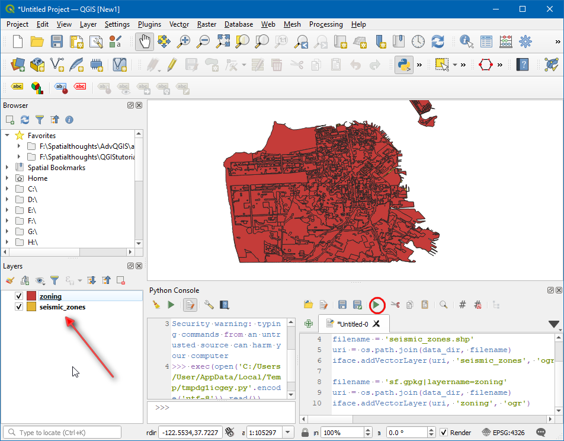{fig-align="center" width="50%"}

#### Cambio del nombre de una capa

```python
# -------------------------
# Identificación del recurso
# -------------------------

# activeLayer(): Método de la clase QgisInterface que devuelve una 
# referencia al objeto de la capa seleccionada actualmente en el panel de capas.
layer = iface.activeLayer()

# -------------------------
# Recuperación de metadatos
# -------------------------

# name(): Función que extrae la cadena de texto correspondiente 
# al nombre actual de la capa en el árbol del proyecto.
name = layer.name()

# -------------------------
# Aplicación de cambios
# -------------------------

# setName(): Método de la clase QgsMapLayer que permite redefinir 
# el nombre de la capa. Se aplica un prefijo ('sf_') al nombre original.
layer.setName('sf_' + name)
```
#### Estructura lógica de la gestión de capas

```{mermaid}
%%| fig-align: center
%%| fig-width: 10
%%| fig-height: 8

graph TD
    %% Definición de estilos para prevenir desbordes tipográficos
    classDef cod fill:#f4f6f9,stroke:#2c3e50,stroke-width:2px,font-family:monospace,font-size:12px;
    classDef exp fill:#e1f5fe,stroke:#0288d1,stroke-width:1px;

    %% Flujo de Adición
    A["Validación: ¿Proyecto guardado?"]:::exp --> B
    B(["path =<br/>QgsProject.instance().fileName()"]):::cod --> C{Evaluación}
    
    C -->|No| D["Error crítico en<br/>iface.messageBar()"]:::exp
    C -->|Sí| E["Construcción de URI<br/>(os.path.join)"]:::exp
    
    E --> F["Carga de Shapefile<br/>(Proveedor 'ogr')"]:::exp
    E --> G["Carga de GeoPackage<br/>(Parámetro |layername=)"]:::exp
    
    F --> H(["iface.addVectorLayer(<br/>uri, name, 'ogr')"]):::cod
    G --> H
    
    %% Flujo de Renombrado
    H --> I["Interacción con<br/>capa activa"]:::exp
    I --> J(["layer =<br/>iface.activeLayer()"]):::cod --> K
    K(["name =<br/>layer.name()"]):::cod --> L
    L(["layer.setName(<br/>'sf_' + name)"]):::cod --> M["Refresco en<br/>Panel de Capas"]:::exp
```

#### Resumen sintáctico

La manipulación de capas integra métodos del núcleo de QGIS para el acceso a datos y métodos de la interfaz para la visualización y control.

| Operación técnica | Componente / Método | Especificación y lógica de uso |
| :--- | :--- | :--- |
| **Validación de entorno** | `QgsProject.instance().fileName()` | Recupera la ruta absoluta del proyecto. Es indispensable para establecer el directorio base en flujos de trabajo con rutas relativas. |
| **Definición de fuente** | `URI (Uniform Resource Identifier)` | Cadena que identifica el origen de datos. En GeoPackage, utiliza el delimitador `|layername=` para especificar la tabla interna del contenedor. |
| **Carga de datos** | `iface.addVectorLayer()` | Registra y visualiza la capa. Requiere la ruta (URI), el alias para la leyenda y el identificador del proveedor (comúnmente `'ogr'`). |
| **Acceso a selección** | `iface.activeLayer()` | Devuelve el objeto de la capa resaltada en la interfaz. Es el punto de entrada para ediciones rápidas por parte del usuario. |
| **Mutación de nombre** | `layer.setName(str)` | Actualiza el atributo visual del objeto `QgsMapLayer`. No afecta el nombre del archivo físico en el almacenamiento. |

Para la construcción de URI complejas en bases de datos (PostGIS o SpatiaLite), se recomienda el uso de la clase `QgsDataSourceUri` para gestionar parámetros de conexión y credenciales de forma estructurada.

#### Ejercicio 3

Escriba un fragmento de código que verifique la capa activa seleccionada por el usuario. Si la capa activa se denomina `sf_zoning`, muestre un mensaje de éxito en la Message bar (Barra de mensajes); de lo contrario, muestre un mensaje de error.

{fig-align="center" width="75%"}

{fig-align="center" width="75%"}

## API del proyecto de QGIS (QgsProject)

Otra clase de gran relevancia en QGIS es [`QgsProject`](https://qgis.org/pyqgis/3.44/core/QgsProject.html). Esta clase se utiliza para todas las operaciones dentro de un proyecto de QGIS, incluyendo la adición o eliminación de capas del mapa, estilos, diseños de impresión, entre otros. `QgsProject` es una **Singleton Class** (Clase única), lo que significa que solo puede tener una instancia a la vez. Dicha instancia hace referencia al proyecto de QGIS cargado actualmente. Al iniciar QGIS, se crea un proyecto en blanco. Cuando se carga otro proyecto, el proyecto existente se cierra y se crea una nueva instancia del proyecto. Es posible obtener la instancia actual de la clase `QgsProject` mediante el método **`QgsProject.instance()`**.


### Carga de un proyecto

```python
#| eval: false

# -------------------------
# Importación de dependencias
# -------------------------

# os: Módulo estándar para la gestión de rutas con independencia de la plataforma
import os

# QgsProject: Clase fundamental para el acceso al estado y metadatos de la sesión
from qgis.core import QgsProject


# -------------------------
# Validación de precondición de ruta
# -------------------------

# Recuperación de la ruta absoluta del archivo de proyecto actual (.qgz o .qgs)
# El método fileName() devuelve una cadena de texto vacía si el proyecto no se ha guardado en disco
project_full_path = QgsProject.instance().fileName()

# Estructura de decisión para gestionar la salida temprana ante proyectos no persistidos
if not project_full_path:
    # Notificación de error crítico en la interfaz de usuario (iface)
    # Impide que el proceso continúe con rutas nulas, evitando excepciones en el sistema
    iface.messageBar().pushCritical(
        'Error de ejecución', 
        'Operación cancelada: El proyecto actual no ha sido guardado en disco.'
    )

else:
    # -------------------------
    # Definición de rutas y carga de datos
    # -------------------------
    
    # os.path.dirname: Recupera el directorio contenedor del proyecto activo
    project_dir = os.path.dirname(project_full_path)
    
    # Establecimiento del directorio de trabajo basado en la ubicación del archivo .qgz
    data_dir = project_dir
    
    # Obtención de la instancia del proyecto para manipulación de datos
    project = QgsProject.instance()
    
    # Definición del nombre y ruta del archivo de proyecto de San Francisco (sf.qgz)
    project_name = 'sf.qgz'
    
    # os.path.join: Garantiza la correcta construcción de la ruta absoluta del recurso
    project_path = os.path.join(data_dir, project_name)
    
    # project.read: Método para cargar la configuración y capas del archivo especificado
    # Esto sustituye el contenido actual de la sesión por el del archivo leído
    project.read(project_path)
```

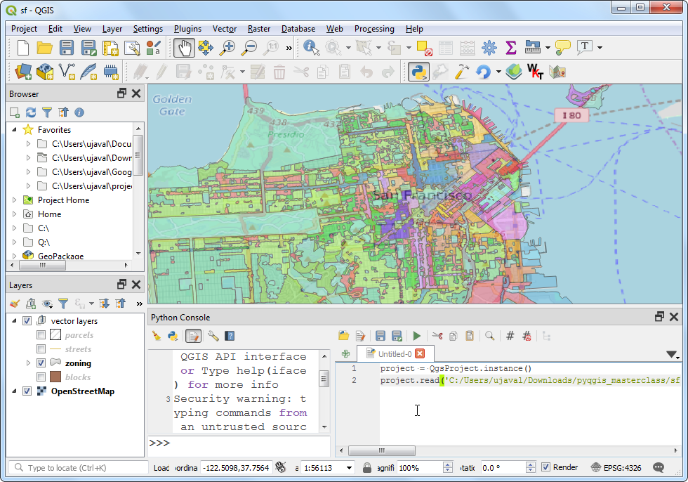{fig-align="center" width="75%"}

### Carga de proyectos mediante un menú desplegable

El siguiente fragmento de código muestra cómo crear una nueva Toolbar (Barra de herramientas) con una Label (Etiqueta) y un menú desplegable. Al seleccionar un elemento, se cargará el proyecto con ese nombre.

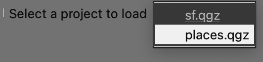{fig-align="center"}

```python
#| file: code/pyqgis/project_toolbar.py
#| eval: false

# -------------------------
# Importación de dependencias
# -------------------------

# os: Gestión de rutas de archivos con independencia del sistema operativo
import os

# qgis.core: Acceso al singleton del proyecto activo
from qgis.core import QgsProject

# PyQt5.QtWidgets: Componentes de la interfaz gráfica (labels y cuadros combinados)
from PyQt5.QtWidgets import QLabel, QComboBox


# -------------------------
# Validación de precondición de persistencia
# -------------------------

# Recuperación de la ruta absoluta del archivo de proyecto actual
# El método fileName() devuelve una cadena vacía si el proyecto no ha sido guardado
project_full_path = QgsProject.instance().fileName()

# Estructura de control para gestionar la salida temprana (Early Exit)
if not project_full_path:
    # Notificación de error crítico en la barra de mensajes de la interfaz (iface)
    # Impide que el script intente referenciar directorios locales inexistentes
    iface.messageBar().pushCritical(
        'Error de ejecución', 
        'Operación cancelada: El proyecto actual debe estar guardado para establecer el directorio raíz.'
    )

else:
    # -------------------------
    # Configuración de rutas y UI
    # -------------------------
    
    # Extracción del directorio base del proyecto activo mediante os.path.dirname
    project_dir = os.path.dirname(project_full_path)
    data_dir = project_dir

    # Creación de una nueva barra de herramientas en la ventana principal de QGIS
    projectToolbar = iface.addToolBar('Project Selector')

    # Instanciación de etiquetas y selectores
    # El parámetro 'parent' vincula la jerarquía del widget a la barra de herramientas
    label = QLabel('Seleccione un proyecto para cargar:', parent=projectToolbar)
    
    projectSelector = QComboBox(parent=projectToolbar)
    projectSelector.addItem('sf.qgz')
    projectSelector.addItem('places.qgz')
    
    # Inicialización del índice en -1 para evitar la carga automática al instanciar
    projectSelector.setCurrentIndex(-1)


    # -------------------------
    # Lógica de carga de proyectos
    # -------------------------

    def loadProject(projectName):
        """
        Lee y carga un archivo de proyecto específico desde el directorio de datos.
        Advertencia: Este método reemplaza la sesión actual en el canvas.
        """
        project = QgsProject.instance()
        
        # Construcción de la ruta absoluta del recurso seleccionado
        project_path = os.path.join(data_dir, projectName)
        
        # Validación opcional: verificar existencia física antes de la lectura
        if os.path.exists(project_path):
            project.read(project_path)
            iface.messageBar().pushInfo('Carga exitosa', f'Proyecto cargado: {projectName}')
        else:
            iface.messageBar().pushWarning('Archivo no encontrado', f'No se halló: {projectName}')


    # -------------------------
    # Conexión de eventos e integración
    # -------------------------

    # Mecanismo de señales y slots: se vincula el cambio de texto con la función de carga
    projectSelector.currentTextChanged.connect(loadProject)

    # Inyección de widgets en la barra de herramientas personalizada
    projectToolbar.addWidget(label)
    projectToolbar.addWidget(projectSelector)
```

### Creación de una nueva capa vectorial

Se procederá a crear una capa de memoria temporal mediante PyQGIS. Las capas de memoria no se guardan en el disco y resultan ideales para almacenar resultados intermedios. El fragmento de código siguiente crea una capa de polígonos con la extensión del Map canvas (Lienzo del mapa) actual.

```python
#| eval: false

# -------------------------
# Captura de parámetros del lienzo
# -------------------------

# Referencia al objeto que gestiona la visualización actual del mapa
mc = iface.mapCanvas()

# Recuperación de los límites geográficos (Xmin, Ymin, Xmax, Ymax) de la vista activa
# El resultado es un objeto de la clase QgsRectangle
extent = mc.extent()


# -------------------------
# Configuración de la capa en memoria
# -------------------------

# Instanciación de QgsVectorLayer
# Parámetros: Geometría ('Polygon'), nombre ('extent'), proveedor de datos ('memory')
vlayer = QgsVectorLayer('Polygon', 'extent', 'memory')

# Definición del Sistema de Referencia de Coordenadas (CRS)
# Se sincroniza con el CRS del proyecto activo para garantizar la consistencia espacial
crs = QgsProject.instance().crs()
vlayer.setCrs(crs)


# -------------------------
# Gestión de entidades y geometría
# -------------------------

# Acceso al proveedor de datos para permitir la edición de la capa en memoria
provider = vlayer.dataProvider()

# Creación de una nueva entidad vectorial (QgsFeature)
f = QgsFeature()

# Conversión del rectángulo de extensión en una geometría de polígono cerrada
geometry = QgsGeometry.fromRect(extent)
f.setGeometry(geometry)


# -------------------------
# Registro y visualización
# -------------------------

# Adición de la entidad al proveedor de la capa vectorial
provider.addFeature(f)

# Actualización de los límites de la capa para asegurar el renderizado correcto
vlayer.updateExtents() 

# Integración de la capa en el registro global del proyecto para su despliegue en el canvas
QgsProject.instance().addMapLayer(vlayer)
```

### Estructura funcional de la clase QgsProject

El siguiente diagrama detalla la interacción entre el objeto único del proyecto, el sistema de archivos y los componentes de la interfaz de usuario para la carga y configuración de datos espaciales.

```{mermaid}
%%| fig-align: center
%%| out-width: 100%

graph TD
    %% Definición de estilos para evitar desbordes tipográficos
    classDef cod fill:#f4f6f9,stroke:#2c3e50,stroke-width:2px,font-family:monospace,font-size:12px;
    classDef exp fill:#e1f5fe,stroke:#0288d1,stroke-width:1px;

    %% Flujo Central
    A["Singleton:<br/>QgsProject.instance()"]:::exp --> B
    B{Áreas de control<br/>del proyecto}:::exp

    %% Rama de Persistencia
    B --> C["Manejo de<br/>archivos (.qgz)"]:::exp
    C --> C1(["project.read(path)"]):::cod
    C --> C2(["project.fileName()"]):::cod

    %% Rama de Datos
    B --> D["Gestión de capas<br/>y Geometría"]:::exp
    D --> D1(["project.addMapLayer()"]):::cod
    D --> D2(["QgsVectorLayer<br/>('memory')"]):::cod

    %% Rama de Configuración
    B --> E["Metadatos y<br/>Espacialidad"]:::exp
    E --> E1(["project.setCrs()"]):::cod
    E --> E2(["project.crs()"]):::cod

    %% Relación con UI
    E1 -.-> F["Refresco del Canvas<br/>(iface.mapCanvas)"]:::exp
```


### Resumen sintáctico de operaciones de proyecto

La manipulación programática de la sesión requiere el conocimiento de los métodos de acceso al Singleton y las clases auxiliares de geometría y referencia espacial.


| Operación técnica | Componente / Método | Especificación y lógica de uso |
| :--- | :--- | :--- |
| **Acceso al Singleton** | `QgsProject.instance()` | Método estático indispensable para obtener el control de la sesión activa de QGIS. |
| **Carga de sesión** | `.read(path)` | Lee el contenido de un archivo `.qgz`, reemplazando el estado actual del lienzo y la leyenda. |
| **Validación de ruta** | `.fileName()` | Recupera la ruta absoluta del proyecto. Una cadena vacía indica que el proyecto no ha sido guardado. |
| **Adición de capas** | `.addMapLayer(layer)` | Registra una capa (vectorial, ráster o de memoria) en el registro global para su visualización. |
| **Gestión de memoria** | `QgsVectorLayer(..., 'memory')` | Genera una capa temporal ideal para procesos intermedios que no requieren almacenamiento físico inmediato. |
| **Referencia espacial** | `.setCrs(crs_obj)` | Define el sistema de referencia de coordenadas del proyecto, forzando la reproyección al vuelo de los datos. |
| **Integración de UI** | `QComboBox / QLineEdit` | Widgets de PyQt5 utilizados para la captura de parámetros del usuario (ej: nombres de proyectos o códigos EPSG). |


### Ejercicio 4

El siguiente fragmento de código crea una Toolbar (Barra de herramientas) denominada *CRS Toolbar* con una Label (Etiqueta), un Textbox (Caja de texto) y un Button (Botón). Al hacer clic en el botón, se llama a la función `changeCRS`. Implemente esta función para que cambie el CRS del proyecto actual al código EPSG ingresado por el usuario.

Sugerencia: Utilice el método [`QgsProject.instance().setCrs()`](https://qgis.org/pyqgis/3.44/core/QgsProject.html).

```{mermaid}
%%| fig-align: center
%%| out-width: 100%
graph TD
    A[Usuario ingresa Código EPSG] --> B[Evento: Click en botón Go!]
    B --> C[Función changeCrs]
    C --> D[Extracción de texto de QLineEdit]
    D --> E{Validación y Asignación}
    E -- Pista 1 --> F[Crear objeto QgsCoordinateReferenceSystem]
    F -- Pista 2 --> G[Asignar CRS a QgsProject.instance]
    G --> H[Actualización del Canvas]
```


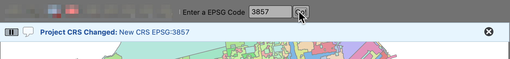{fig-align="center" width="75%"}

```python
#| eval: false

# -------------------------
# Importación de componentes de UI y Core
# -------------------------
from PyQt5.QtWidgets import QLabel, QLineEdit, QPushButton
from qgis.core import QgsProject, QgsCoordinateReferenceSystem

# Creación de contenedor en la interfaz de usuario
crsToolbar = iface.addToolBar('CRS Toolbar')

# Instanciación de widgets con referencia al parent (la barra de herramientas)
label = QLabel('Ingrese un código EPSG (ej: 3116):', parent=crsToolbar)
crsTextBox = QLineEdit('4326', parent=crsToolbar)
crsTextBox.setFixedWidth(80)
button = QPushButton('Establecer!', parent=crsToolbar)

# Integración de componentes en el layout de la barra
crsToolbar.addWidget(label)
crsToolbar.addWidget(crsTextBox)
crsToolbar.addWidget(button)

# -------------------------
# Definición de la lógica de transformación
# -------------------------

def changeCrs():
    """
    Captura el valor numérico del TextBox y actualiza la proyección del proyecto.
    """
    # Extracción del valor ingresado por el usuario
    # Se recomienda validar que la entrada sea numérica para evitar excepciones de tipo ValueError
    input_text = crsTextBox.text()
    
    # Notificación informativa en la barra de mensajes
    iface.messageBar().pushInfo('Procesando', f'Intentando cambiar a EPSG:{input_text}')
    
    # --- BLOQUE PARA EL ESTUDIANTE ---
    
    # PISTA 1: Crear una instancia de la clase QgsCoordinateReferenceSystem.
    # El constructor puede recibir una cadena de texto con el formato 'EPSG:XXXX'.
    # Ejemplo: crs = QgsCoordinateReferenceSystem('EPSG:3116')
    
    # PISTA 2: Acceder a la instancia del proyecto actual mediante QgsProject.instance() 
    # y utilizar el método setCrs(crs_objeto) para aplicar el cambio.
    
    # PISTA 3: Es una buena práctica verificar si el CRS creado es válido antes de aplicarlo
    # usando el método .isValid() del objeto crs.
    
    # ---------------------------------

# Conexión del evento clic del botón con la función lógica
# Nota: Se eliminó el parámetro en el connect para simplificar la ejecución directa
button.clicked.connect(changeCrs)
```

## Ejecución de código Python al inicio de QGIS

Es posible ejecutar código PyQGIS cada vez que se inicia QGIS. La aplicación busca un archivo denominado `startup.py` en el directorio de inicio de Python del usuario y, si lo encuentra, lo ejecuta. Este archivo es de gran utilidad para personalizar la interfaz de QGIS mediante las técnicas aprendidas en la sección anterior.

Si se ejecutan varias versiones de QGIS, una personalización útil consiste en mostrar el número de versión y el nombre de QGIS en la Main window (Ventana principal). El nombre de la versión se almacena en una variable global de QGIS llamada `qgis_version`. Se puede leer esa variable y asignarla al título de la ventana principal. Este código se conecta a la señal `iface.initializationCompleted` cuando se carga la ventana principal.

Cree un nuevo archivo llamado `startup.py` con el código siguiente. Observe las importaciones en la parte superior, incluyendo `iface`. Al ejecutar fragmentos de código en la Python Console (Consola de Python), no fue necesario importar módulos, ya que esto ocurre automáticamente al iniciar la consola. Para scripts de PyQGIS en otros contextos, se deben importar explícitamente los módulos (clases) que se deseen utilizar.

```python
#| file: code/pyqgis/startup.py
#| eval: false

# -------------------------
# Importación de dependencias
# -------------------------

# iface: Instancia global que proporciona acceso a la interfaz de usuario (QgisInterface)
from qgis.utils import iface

# QgsExpressionContextUtils: Herramientas para gestionar y acceder a variables de contexto globales, 
# de proyecto o de capa dentro del motor de expresiones de QGIS
from qgis.core import QgsExpressionContextUtils


# -------------------------
# Lógica de personalización
# -------------------------

def customize():
    """
    Función de callback para modificar los atributos visuales de la ventana principal.
    Extrae la versión global del sistema y la concatena al título actual.
    """
    
    # Recuperación de la versión de QGIS desde el ámbito global (Global Scope)
    # Las variables de contexto permiten acceder a metadatos del sistema sin hardcoding
    version = QgsExpressionContextUtils.globalScope().variable('qgis_version')
    
    # Acceso al objeto de la ventana principal (QMainWindow) de Qt
    main_window = iface.mainWindow()
    
    # Captura del título actual definido por el sistema o el proyecto cargado
    current_title = main_window.windowTitle()
    
    # Actualización del título utilizando f-strings para inyectar la versión recuperada
    # La sintaxis de pipe (|) se utiliza como separador visual estándar en interfaces
    main_window.setWindowTitle(f'{current_title} | {version} | UNAL')


# -------------------------
# Registro en el ciclo de vida de QGIS
# -------------------------

# IMPORTANTE: QGIS carga el script startup.py antes de que la interfaz gráfica esté totalmente lista.
# Intentar manipular 'iface' directamente al cargar el script resultaría en un error de tipo 'NoneType'.
# Se utiliza la señal 'initializationCompleted' para diferir la ejecución hasta que la UI sea funcional.
iface.initializationCompleted.connect(customize)

```

Este archivo debe copiarse en el directorio apropiado del sistema. Consulte la [documentación de QGIS](https://docs.qgis.org/testing/en/docs/pyqgis_developer_cookbook/intro.html#running-python-code-when-qgis-starts) para obtener detalles sobre la ruta según la plataforma utilizada.

En mi caso, para el QGIS iniciado con PIXI es: `C:\Users\alexyshr\AppData\Roaming\QGIS\QGIS3`

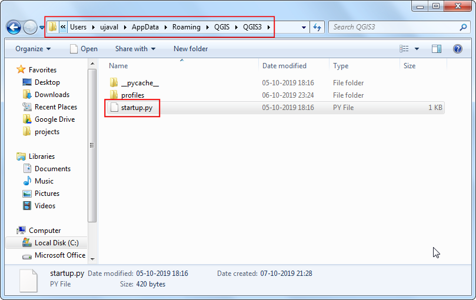{fig-align="center" width="75%"}

Una vez copiado el archivo en dicha ubicación, reinicie QGIS (`pixi run qgis`). La barra de título ahora debería incluir el nombre de la versión de QGIS.

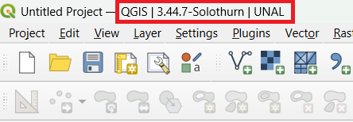{fig-align="center" width="75%"}

> Sugerencia: Es posible ubicar el archivo `startup.py` en una unidad compartida para el despliegue empresarial de personalizaciones de QGIS. [Más información](https://gis.stackexchange.com/questions/319224/central-deployment-of-startup-py-in-qgis/319225).


### Flujo de inicialización y señales

El siguiente diagrama detalla la secuencia de ejecución desde el arranque del software hasta la aplicación de las personalizaciones visuales, destacando la gestión de tiempos de carga de la interfaz gráfica.

```{mermaid}
%%| fig-align: center
%%| out-width: 100%

graph TD
    %% Definición de estilos para prevenir desbordes tipográficos
    classDef cod fill:#f4f6f9,stroke:#2c3e50,stroke-width:2px,font-family:monospace,font-size:12px;
    classDef exp fill:#e1f5fe,stroke:#0288d1,stroke-width:1px;

    %% Secuencia de Arranque
    A["Arranque de la<br/>aplicación QGIS"]:::exp --> B["Búsqueda del archivo<br/>startup.py"]:::exp
    B --> C(["Ejecución del script<br/>(UI en estado preventivo)"]):::cod
    
    %% Gestión de Señales
    C --> D(["iface.initializationCompleted<br/>.connect(customize)"]):::cod
    D --> E["Carga final de los<br/>componentes de la UI"]:::exp
    
    %% Ejecución Diferida
    E --> F(["customize() callback"]):::cod
    F --> G["Recuperación de variable:<br/>qgis_version"]:::exp
    G --> H(["mainWindow().setWindowTitle()"]):::cod
    H --> I["Interfaz personalizada<br/>visible al usuario"]:::exp
```


### Resumen sintáctico

La implementación de scripts de inicio requiere el manejo de variables de contexto globales y la conexión a señales específicas del ciclo de vida de la aplicación.

| Componente / Método | Función técnica y especificaciones de uso |
| :--- | :--- |
| `startup.py` | Archivo de Python ubicado en el directorio de inicio del usuario que QGIS ejecuta automáticamente al arrancar. |
| `initializationCompleted` | Señal de la clase `QgisInterface` indispensable para diferir la ejecución de scripts hasta que la interfaz gráfica (UI) sea funcional. |
| `QgsExpressionContextUtils` | Clase núcleo para gestionar ámbitos de variables. El método `.globalScope()` permite acceder a metadatos del sistema. |
| `variable('qgis_version')` | Método para extraer constantes del sistema, como la versión actual del software, facilitando la identificación en entornos multiversión. |
| `setWindowTitle()` | Función de la ventana principal (`QMainWindow`) que inyecta la cadena de texto personalizada en el encabezado de la aplicación. |

> **Nota para el ejercicio 5**: Para que la personalización persista tras cargar un nuevo proyecto, se debe conectar la función `customize` a señales adicionales del objeto `QgsProject`, tales como `QgsProject.instance().readProject` o `QgsProject.instance().cleared`, ya que la carga de archivos `.qgz` restablece los atributos de la ventana principal.


### Ejercicio 5

Intente abrir un New Project (Nuevo proyecto) en QGIS tras haber reiniciado el software con el archivo `startup.py` configurado. Se observará que el título personalizado con el nombre de la versión es reemplazado por el título predeterminado.

Realice una modificación en el archivo `startup.py` para que la personalización se aplique incluso al cargar un nuevo proyecto.

## Ejecución de algoritmos de procesamiento

Aunque la API de PyQGIS proporciona diversas funciones para trabajar con capas, objetos, atributos y geometría, resulta una práctica superior emplear los algoritmos de procesamiento integrados para modificar capas o realizar análisis. Este enfoque garantiza un mejor rendimiento y reduce significativamente la extensión del código. A continuación, se presentan ejemplos sobre el uso de algoritmos de procesamiento desde Python para la edición de capas vectoriales y ráster. Es posible consultar información adicional sobre opciones y técnicas en el artículo [Using processing algorithms from the console](https://docs.qgis.org/testing/en/docs/user_manual/processing/console.html) de la guía de usuario de QGIS.

### Creación de un sombreado (hillshade) a partir de un modelo digital de elevación (DEM)

Para emplear cualquier Processing algorithm (Algoritmo de procesamiento) mediante Python, es necesario conocer la especificación de todos los parámetros requeridos. El método más sencillo para obtenerlos consiste en ejecutar el algoritmo primero a través de la GUI (Interfaz gráfica de usuario). 

En esta sección se abordará la creación de un ráster de sombreado a partir de un DEM. Inicialmente, se realizará la tarea en QGIS:


1. Navegar al directorio de datos (`./data_heavy/pyqgis_masterclass/`) y cargar la capa `srtm.tif`. Buscar y localizar el algoritmo. Vaya al menú `Processing` (Procesamiento) y seleccione `Toolbox` (Caja de Herramientas). En la sección `Raster terrain analysis` (Análisis de terreno ráster), haga doble click en `Hillshade` (Sombreado) para lanzar la herramienta.

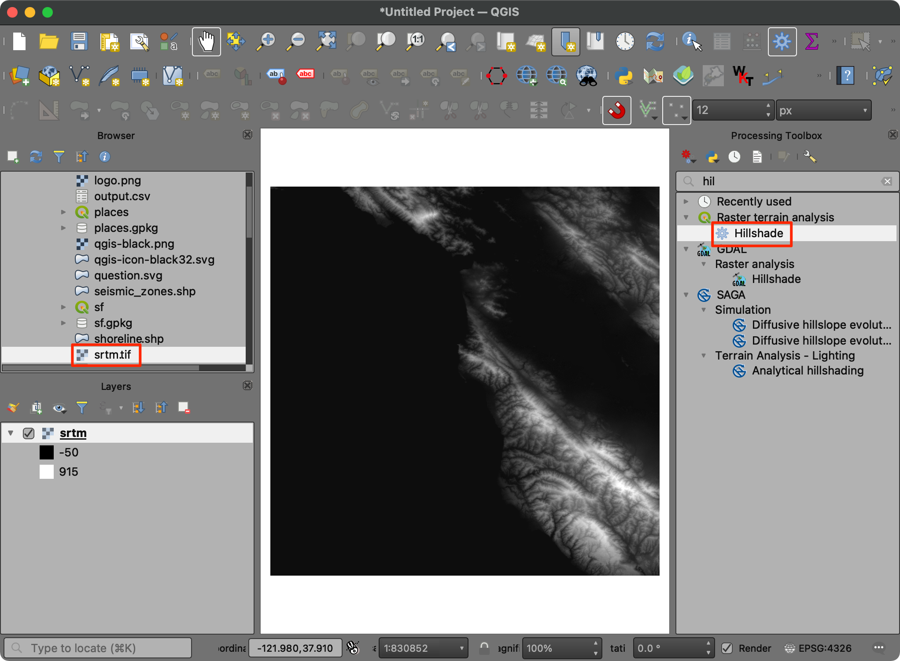{fig-align="center" width="75%"}

2. Seleccionar `srtm` como **Elevation layer (Capa de elevación)** y mantener el resto de los parámetros en sus valores predeterminados. Hacer clic en **Run (Ejecutar)**.

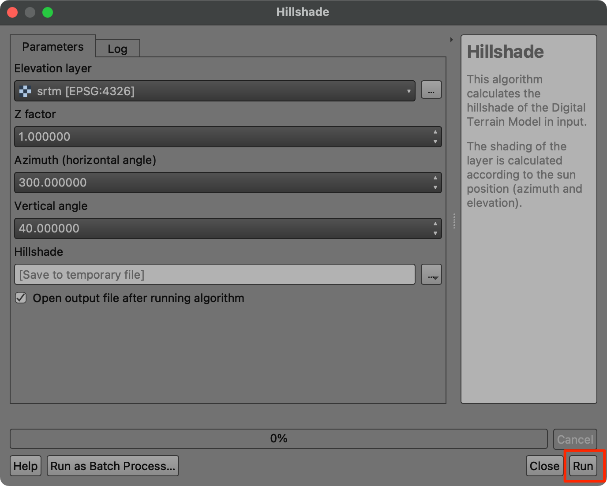{fig-align="center" width="75%"}

3. Una nueva capa denominada `Hillshade` se añadirá al **Layers panel (Panel de capas)**. Posteriormente, se localizará el comando de Python para esta operación desde el **Historial de procesamiento** (Processing history). Ir a `Processing` (Procesamiento) &rarr; `History` (Historial).

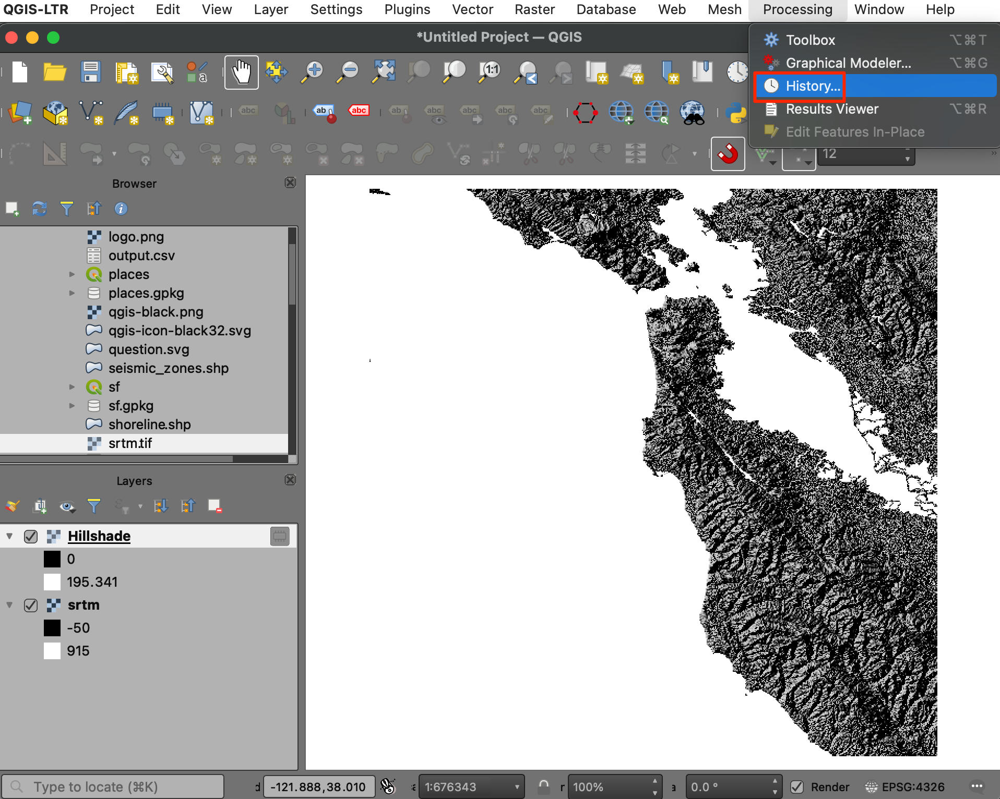{fig-align="center" width="75%"}

4. La primera entrada en el panel superior mostrará el último algoritmo ejecutado. Hacer clic para seleccionarlo. El comando completo de Python se visualizará en la parte inferior. Proceder a copiarlo.

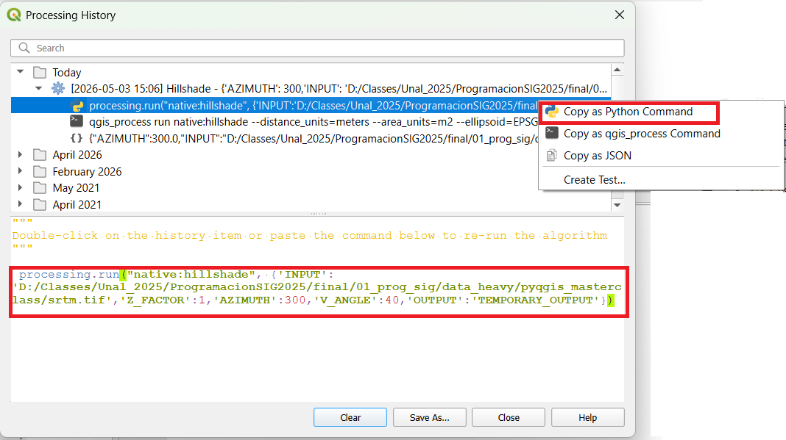{fig-align="center" width="75%"}

Es posible emplear estos parámetros en el código Python y reemplazar la ruta de entrada. El siguiente fragmento de código ejecuta el mismo algoritmo desde un script. Se destaca el uso del método `processing.runAndLoadResults()`, el cual añade la capa resultante al lienzo.

```python
#| eval: false

# -------------------------
# Importación de dependencias
# -------------------------

# os: Gestión de rutas y operaciones del sistema de archivos
import os

# qgis.core: Acceso al núcleo de QGIS y gestión de proyectos
from qgis.core import QgsProject

# processing: Interfaz para ejecutar algoritmos del toolbox de QGIS
import processing


# -------------------------
# Validación de precondición de persistencia
# -------------------------

# Recuperación de la ruta absoluta del archivo de proyecto actual (.qgz o .qgs)
# El método fileName() es crítico para determinar si el entorno de trabajo ha sido guardado
project_full_path = QgsProject.instance().fileName()

# Estructura de control para gestionar la salida temprana (Early Exit)
if not project_full_path:
    # Notificación de error crítico en la barra de mensajes de la interfaz (iface)
    # Esta guarda técnica impide la ejecución de procesos con rutas relativas nulas
    iface.messageBar().pushCritical(
        'Error de ejecución', 
        'Operación cancelada: El proyecto actual debe estar guardado para establecer el directorio raíz.'
    )

else:
    # -------------------------
    # Configuración de rutas y carga de insumos
    # -------------------------
    
    # Extracción del directorio base del proyecto activo mediante os.path.dirname
    project_dir = os.path.dirname(project_full_path)
    data_dir = project_dir

    # Definición y carga del archivo SRTM (Shuttle Radar Topography Mission)
    # Se utiliza el proveedor 'gdal' para asegurar la compatibilidad con el formato .tif
    filename = 'srtm.tif'
    srtm_path = os.path.join(data_dir, filename)
    
    # iface.addRasterLayer: Registra e instancia la capa en el canvas de QGIS
    iface.addRasterLayer(srtm_path, 'srtm', 'gdal')


    # -------------------------
    # Ejecución de algoritmos de geoprocesamiento
    # -------------------------

    # processing.runAndLoadResults: Ejecuta el algoritmo y carga el resultado en el panel de capas
    # El algoritmo "native:hillshade" genera un modelo de sombras basado en la iluminación solar
    results = processing.runAndLoadResults(
        "native:hillshade", 
        {
            'INPUT': srtm_path,       # Capa de elevación de entrada
            'Z_FACTOR': 2,            # Factor de exageración vertical
            'AZIMUTH': 300,           # Ángulo horizontal de la fuente de luz
            'V_ANGLE': 40,            # Ángulo vertical (elevación) de la fuente de luz
            'OUTPUT': 'TEMPORARY_OUTPUT' # El resultado se genera como capa temporal en memoria
        }
    )
```

### Ejecución de múltiples algoritmos de procesamiento

También es factible "encadenar" múltiples herramientas de procesamiento para construir un script que conforme una tubería de procesamiento de datos. En el siguiente ejemplo, se ejecutan dos fases:

1. Recortar el ráster `srtm.tif` empleando la capa `shoreline.shp`.
2. Calcular el sombreado sobre el ráster recortado y cargarlo en QGIS.

Se observa el uso del método `processing.run()` para la primera fase. Este método calcula la salida pero no carga el resultado en QGIS, lo cual permite realizar múltiples pasos de procesamiento sin cargar capas intermedias.

```python
#| eval: false

# -------------------------
# Importación de dependencias
# -------------------------

# os: Gestión de rutas y operaciones del sistema de archivos
import os

# qgis.core: Acceso al núcleo de QGIS para gestión de proyectos y CRS
from qgis.core import QgsProject

# processing: Interfaz de ejecución de algoritmos de la caja de herramientas
import processing


# -------------------------
# Validación de precondición de persistencia
# -------------------------

# Recuperación de la ruta absoluta del archivo de proyecto actual (.qgz o .qgs)
# El método fileName() es fundamental para establecer el contexto de datos relativos
project_full_path = QgsProject.instance().fileName()

# Estructura de control para gestionar la salida temprana (Early Exit)
if not project_full_path:
    # Notificación de error crítico en la interfaz de usuario (iface)
    # Impide la ejecución de procesos que dependen de rutas de archivos locales
    iface.messageBar().pushCritical(
        'Error de ejecución', 
        'Operación cancelada: El proyecto actual debe estar guardado para establecer el directorio raíz.'
    )

else:
    # -------------------------
    # Configuración de rutas e insumos
    # -------------------------
    
    # Extracción del directorio base del proyecto activo mediante os.path.dirname
    project_dir = os.path.dirname(project_full_path)
    data_dir = project_dir

    # Definición de recursos: Ráster de elevación (SRTM) y Máscara vectorial (Shoreline)
    filename_srtm = 'srtm.tif'
    srtm_path = os.path.join(data_dir, filename_srtm)
    
    filename_shore = 'shoreline.shp'
    shoreline_path = os.path.join(data_dir, filename_shore)


    # -------------------------
    # Ejecución de geoprocesamiento encadenado
    # -------------------------

    # Etapa 1: Recorte del ráster por capa de máscara (GDAL)
    # Se utiliza processing.run para generar un objeto intermedio en memoria
    clip_results = processing.run("gdal:cliprasterbymasklayer", 
        {
            'INPUT': srtm_path,
            'MASK': shoreline_path,
            'OUTPUT': 'TEMPORARY_OUTPUT'
        }
    )

    # Recuperación de la referencia del ráster recortado
    clipped_dem = clip_results['OUTPUT']
    
    # Etapa 2: Generación de sombreado analítico (Hillshade)
    # Se emplea runAndLoadResults para visualizar el producto final en el canvas
    processing.runAndLoadResults("native:hillshade", 
        {
            'INPUT': clipped_dem, 
            'Z_FACTOR': 2,               # Exageración vertical para resaltar relieve
            'AZIMUTH': 300,              # Dirección de la fuente de luz (Grados)
            'V_ANGLE': 40,               # Altura solar sobre el horizonte (Grados)
            'OUTPUT': 'TEMPORARY_OUTPUT' # Salida efímera en memoria RAM
        }
    )
```

Asimismo, se puede realizar un procesamiento por lotes iterando a través de múltiples capas mediante un bucle `for`. La ejecución vía Python ofrece mayor flexibilidad, como la combinación de resultados en una sola capa. Se sugiere consultar el tutorial [Running Processing Algorithms via Python](https://www.qgistutorials.com/en/docs/3/processing_algorithms_pyqgis.html) para un ejemplo integral.

### Resumen gráfico de ejecución de algoritmos de procesamiento

El uso de la infraestructura de procesamiento de QGIS a través de Python permite transformar procesos manuales de la GUI en tuberías de datos (*pipelines*) automatizadas. El siguiente diagrama ilustra el ciclo de vida de un algoritmo, desde la captura de parámetros hasta el renderizado final.

```{mermaid}
%%| fig-align: center
%%| out-width: 100%

graph TD
    %% Estilos para evitar desbordes tipográficos
    classDef cod fill:#f4f6f9,stroke:#2c3e50,stroke-width:2px,font-family:monospace,font-size:12px;
    classDef exp fill:#e1f5fe,stroke:#0288d1,stroke-width:1px;

    %% Flujo de preparación
    A["Identificación del algoritmo:<br/>GUI > History > Copy command"]:::exp --> B
    B(["import processing"]):::cod --> C
    C{"Estrategia de<br/>ejecución"}:::exp
    
    %% Ramas de ejecución
    C -->|Capa intermedia| D
    D(["processing.run()"]):::cod --> E["Salida: Diccionario de<br/>objetos en memoria"]:::exp
    
    C -->|Capa final| F
    F(["processing.runAndLoadResults()"]):::cod --> G["Salida: Capa registrada<br/>en el panel y canvas"]:::exp
    
    %% Encadenamiento
    E --> H["Entrada para el<br/>siguiente algoritmo"]:::exp
    H --> F
    
    %% Gestión de salida
    G --> I["'TEMPORARY_OUTPUT'"]:::cod
    I --> J["Optimización: Sin escritura<br/>física en disco"]:::exp
```


### Resumen sintáctico

La ejecución de geoprocesos mediante scripts optimiza la extensión del código al delegar tareas complejas (geometría, topología o análisis ráster) al motor nativo de QGIS o proveedores externos como GDAL/SAGA.

| Método / Parámetro | Función técnica y lógica de implementación |
| :--- | :--- |
| `processing.run()` | Ejecuta un algoritmo de forma interna. Es el método estándar para pasos intermedios, ya que devuelve un diccionario con los resultados sin recargar la interfaz gráfica. |
| `processing.runAndLoadResults()` | Similar a `run()`, pero además añade automáticamente el producto resultante al panel de capas y al lienzo del mapa para su inspección visual. |
| `native:hillshade` | Identificador único del algoritmo. La sintaxis `proveedor:nombre` asegura que se invoque la herramienta correcta dentro del ecosistema de QGIS. |
| `'TEMPORARY_OUTPUT'` | Palabra clave que instruye al motor para generar una capa de memoria (efímera). Reduce el I/O en disco y acelera significativamente los procesos encadenados. |
| `native:fixgeometries` | Herramienta de preprocesamiento crítica para asegurar la validez topológica de capas vectoriales antes de realizar operaciones espaciales (como estadísticas zonales). |
| `native:zonalstatisticsfb` | Algoritmo de estadísticas de zona que extrae métricas ráster (media, suma, etc.) basándose en la delimitación de una capa poligonal. |

Para el **ejercicio 6** (a continuación), la implementación de la estadística zonal permite integrar la información espectral o de elevación de un ráster dentro de la tabla de atributos de una capa vectorial, facilitando análisis multidimensionales de riesgo sísmico.


### Ejercicio 6

El paquete de datos contiene una capa poligonal de zonas sísmicas en San Francisco. El objetivo es calcular la elevación promedio dentro de cada zona sísmica. El código siguiente lee la capa vectorial `seismic_zones.shp` y la capa ráster `srtm.tif`. Dado que la capa vectorial presenta algunos polígonos inválidos, se ejecuta el algoritmo `native:fixgeometries` para corregirlos.

Utilice la capa resultante con las geometrías corregidas y ejecute el algoritmo de estadísticas de zona `native:zonalstatisticsfb` para calcular la elevación promedio a partir de la capa ráster.

```python
#| eval: false

# -------------------------
# Importación de dependencias
# -------------------------

# os: Gestión de rutas y operaciones del sistema de archivos
import os

# qgis.core: Acceso al núcleo de QGIS y gestión de proyectos
from qgis.core import QgsProject

# processing: Interfaz para la ejecución de algoritmos de geoprocesamiento
import processing


# -------------------------
# Validación de precondición de persistencia
# -------------------------

# Recuperación de la ruta absoluta del archivo de proyecto activo
# El método fileName() es indispensable para anclar los datos al directorio de trabajo
project_full_path = QgsProject.instance().fileName()

# Estructura de control para gestionar la salida temprana (Early Exit)
if not project_full_path:
    # Notificación de error en la interfaz de usuario (iface)
    iface.messageBar().pushCritical(
        'Error de ejecución', 
        'Operación cancelada: El proyecto actual debe estar guardado para establecer el directorio raíz.'
    )

else:
    # -------------------------
    # Configuración de rutas e insumos
    # -------------------------
    
    # Establecimiento del directorio base del proyecto
    project_dir = os.path.dirname(project_full_path)
    data_dir = project_dir

    # Definición de rutas absolutas para las capas de entrada
    vector_layer = 'seismic_zones.shp'
    vector_layer_path = os.path.join(data_dir, vector_layer)

    raster_layer = 'srtm.tif'
    raster_layer_path = os.path.join(data_dir, raster_layer)


    # -------------------------
    # Preprocesamiento: Corrección topológica
    # -------------------------

    # El algoritmo "native:fixgeometries" repara estructuras poligonales inválidas (auto-intersecciones, etc.)
    # Se utiliza una salida temporal en memoria para optimizar el rendimiento
    fix_results = processing.run("native:fixgeometries", {
        'INPUT': vector_layer_path,
        'METHOD': 0, # Método de reparación por defecto
        'OUTPUT': 'TEMPORARY_OUTPUT'
    })

    # Recuperación de la referencia de la capa vectorial corregida
    fixed_vector_layer = fix_results['OUTPUT']


    # -------------------------
    # Tarea para el estudiante: Estadísticas zonales
    # -------------------------

    # PISTA 1: Utilice el algoritmo "native:zonalstatisticsfb".
    # Este proceso requiere:
    # - INPUT: La capa vectorial con geometrías corregidas (fixed_vector_layer).
    # - INPUT_RASTER: La ruta de la capa ráster (raster_layer_path).
    # - COLUMN_PREFIX: Un prefijo para el nuevo campo (ej. 'elev_').
    # - STATISTICS: Una lista de enteros que representen las estadísticas deseadas. 
    #   El valor 2 corresponde a la MEDIA (Mean).
    
    # PISTA 2: Utilice processing.runAndLoadResults para visualizar el producto final en el canvas.
    
    # Implemente el código a continuación:
    # processing.runAndLoadResults("native:zonalstatisticsfb", { ... })
```

## Tarea

La siguiente tarea tiene como propósito practicar las competencias adquiridas y explorar la API de PyQGIS.

El objetivo consiste en desarrollar un script de PyQGIS que muestre el valor promedio de la capa ráster seleccionada dentro de la extensión actual del mapa. Por ejemplo, al cargar la capa `srtm`, seleccionarla y activar el botón (ver siguiente imagen), el script debe calcular y mostrar la elevación promedio dentro de la extensión del lienzo. Si se realiza un zoom o desplazamiento y se activa el botón nuevamente, debe recalcular la elevación promedio dentro de la nueva extensión. Se recomienda la siguiente estructura:

* Añadir un botón a la **Plugins toolbar (Barra de herramientas de complementos)** denominado **Show raster statistics** con un icono de elección propia.
* Desarrollar una función llamada `show_statistics()` que sea invocada al hacer clic en el botón.
* La función debe obtener la extensión actual del **Map canvas (Lienzo del mapa)** y calcular las estadísticas del ráster.
* Una vez calculadas, debe mostrar un mensaje informativo en la **Message bar (Barra de mensajes)**.

Sugerencia: La clase [`QgsRasterInterface`](https://qgis.org/pyqgis/3.44/core/QgsRasterInterface.html#module-QgsRasterInterface) proporciona el método `bandStatistics()` para el cálculo de estadísticas de una banda ráster. Es posible obtener la referencia a la instancia de esta clase para una capa ráster mediante `layer.dataProvider()`.

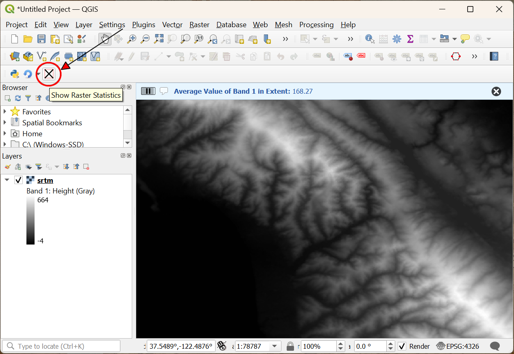{fig-align="center" width="75%"}

Se otorgará crédito adicional si el script incluye validación de errores y muestra mensajes en la barra de mensajes para las siguientes condiciones:

* Si el usuario no ha seleccionado ninguna capa o si la capa seleccionada no es de tipo ráster.
* Si la extensión actual del lienzo no contiene píxeles válidos.

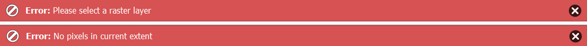{fig-align="center" width="75%"}


## Escritura de complementos

Los complementos (plugins) constituyen un medio fundamental para extender las capacidades funcionales de QGIS. Es posible desarrollar complementos mediante Python que abarcan desde la adición de un botón simple hasta conjuntos de herramientas sofisticados.

> Existe un complemento denominado [Plugin Builder](https://plugins.qgis.org/plugins/pluginbuilder/) que facilita la generación de una estructura inicial. Se dispone de instrucciones detalladas tanto para [complementos con GUI](https://www.qgistutorials.com/en/docs/3/building_a_python_plugin.html) como para [complementos de procesamiento](https://www.qgistutorials.com/en/docs/3/processing_python_plugin.html) utilizando el método de Plugin Builder. Aunque este método ofrece una vía sencilla para obtener un complemento funcional, no representa la forma ideal para el aprendizaje del desarrollo de complementos. Se recomienda iniciar desde una plantilla mínima y añadir elementos conforme sea necesario. En esta sección se abordarán los fundamentos del entorno de trabajo de complementos mediante un ejemplo minimalista y se explicará la adición de diversos elementos para conformar un complemento integral.

### Entendimiento de los complementos

Los complementos están integrados en el sistema de QGIS de manera más profunda que los scripts de Python. Estos son gestionados por el `Plugin Manager` (Administrador de complementos) e inicializados al arrancar QGIS. Para comprender la estructura requerida, se analiza a continuación la composición de un complemento minimalista. Es posible profundizar en esta estructura en [QGIS Minimalist Plugin Skeleton](https://github.com/wonder-sk/qgis-minimal-plugin).

Se procederá al desarrollo de un complemento sencillo denominado **Basemap Loader**, el cual añade un botón en la Plugin Toolbar (Barra de herramientas de complementos) para cargar un mapa base de OpenStreetMap en el proyecto actual.

El primer requisito para los complementos es un archivo denominado `metadata.txt`. Este archivo contiene información general, versión, nombre y otros metadatos utilizados por el sitio web de complementos y el administrador de complementos.

`metadata.txt`

```text
#| file: code/pyqgis/basemap_loader_minimal/metadata.txt
#| eval: false
[general]
name=Basemap Loader
description=This plugin adds a basemap layer to QGIS.
version=1.0
qgisMinimumVersion=3.0
author=Ujaval Gandhi
email=ujaval@spatialthoughts.com
icon=logo.png
```

El segundo requisito es el archivo que contiene la lógica principal del complemento. Este debe poseer un método `__init__()` que proporcione al complemento acceso a la interfaz de QGIS (`iface`). El método `initGui()` se invoca al cargar el complemento y el método `unload()` se llama al descargarlo. Por ahora, se crea un complemento mínimo que simplemente añade un botón que despliega un mensaje al ser activado.


`load_basemap.py`: Este archivo encapsula la lógica de negocio y la definición de los elementos de la interfaz gráfica mediante la biblioteca **PyQt5**.

```python
#| file: code/pyqgis/basemap_loader_minimal/load_basemap.py
#| eval: false

# -------------------------
# Importación de dependencias
# -------------------------
import os
from PyQt5.QtWidgets import QAction
from PyQt5.QtGui import QIcon

# Obtención de la ruta absoluta del directorio del complemento
# Fundamental para referenciar recursos locales como iconos o metadatos
plugin_dir = os.path.dirname(__file__)

class BasemapLoaderPlugin:
    """
    Clase principal que gestiona el ciclo de vida del complemento Basemap Loader.
    """

    def __init__(self, iface):
        """
        Constructor de la clase.
        
        Args:
            iface: Referencia a la interfaz de QGIS (QgisInterface), proporcionada 
                   automáticamente por el núcleo de la aplicación al cargar el plugin.
        """
        self.iface = iface

    def initGui(self):
        """
        Inicialización de la Interfaz Gráfica de Usuario (GUI).
        Este método se invoca exclusivamente cuando se activa el complemento.
        """
        # Definición de la ruta del recurso gráfico
        icon_path = os.path.join(plugin_dir, 'logo.png')
        
        # QAction: Define una abstracción de comando que puede asociarse a botones o menús
        # Se vincula a la ventana principal para asegurar la jerarquía de widgets en Qt
        self.action = QAction(
            QIcon(icon_path), 
            'Load Basemap', 
            self.iface.mainWindow()
        )
        
        # Inserción de la acción en la barra de herramientas de complementos
        self.iface.addToolBarIcon(self.action)
        
        # Conexión mediante el mecanismo de señales y slots: 
        # Al activar el botón (triggered), se ejecuta el método run()
        self.action.triggered.connect(self.run)
      
    def unload(self):
        """
        Gestión de la descarga del complemento.
        Elimina de forma segura los elementos creados de la memoria y de la UI
        para evitar fugas de recursos o iconos huérfanos.
        """
        self.iface.removeToolBarIcon(self.action)
        del self.action
        
    def run(self):
        """
        Punto de entrada de la lógica operativa del complemento.
        En esta etapa inicial, despliega una notificación informativa en la barra de mensajes.
        """
        self.iface.messageBar().pushMessage('Notificación: Basemap Loader activado con éxito')
```

El tercer archivo se denomina `__init__.py`, el cual constituye el punto de entrada del complemento. Este importa la clase del complemento creada en el segundo archivo y genera una instancia de la misma.

`__init__.py`: QGIS identifica cualquier subcarpeta dentro del directorio de complementos como un módulo de Python si contiene este archivo. Es el componente responsable de exponer el complemento al cargador de QGIS.

```python
#| file: code/pyqgis/basemap_loader_minimal/__init__.py
#| eval: false

# Importación de la lógica definida en el módulo hermano
from .load_basemap import BasemapLoaderPlugin

def classFactory(iface):
    """
    Función de factoría requerida por QGIS.
    
    Constituye el puente entre el gestor de complementos y la clase definida.
    Debe retornar una instancia de la clase principal del complemento.

    Args:
        iface: Instancia de QgisInterface para la manipulación de la aplicación.
    """
    return BasemapLoaderPlugin(iface)
```

Es necesario crear estos tres archivos y ubicarlos en una carpeta denominada `basemap_loader`. Se debe copiar el archivo `logo.png` desde la ruta `./data_geavy/pyqgis_masterclass/logo.png` a esta carpeta. Posteriormente, se debe copiar la carpeta al directorio de complementos de Python en `{profile folder}/python/plugins`. En mi equipo Windows: `%APPDATA%\QGIS\QGIS3\profiles\default\python\plugins`, equivalente a `C:\Users\alexyshr\AppData\Roaming\QGIS\QGIS3\profiles\default\python\plugins`.

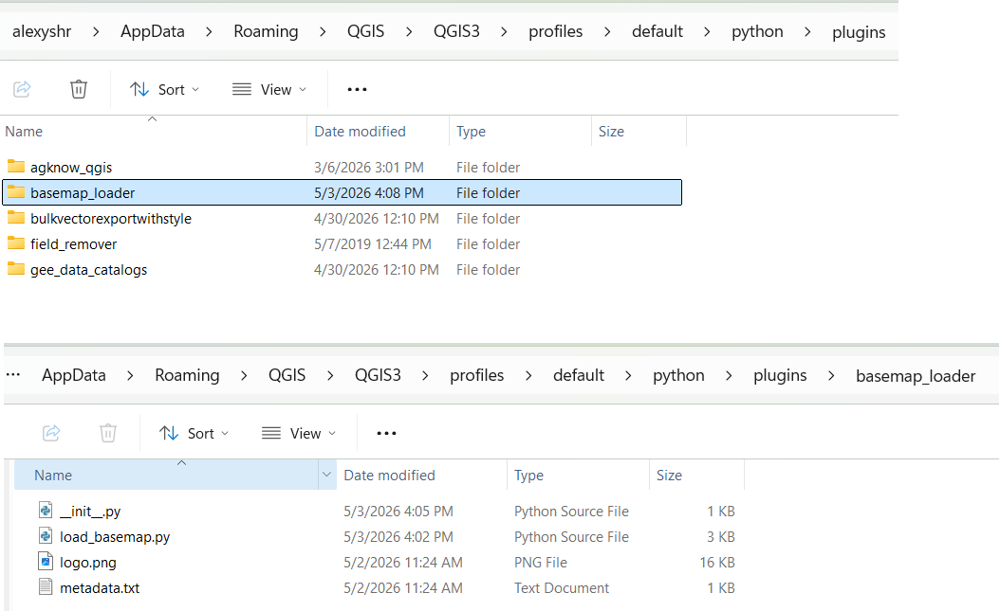{fig-align="center" width="75%"}

Reinicie QGIS. Diríjase a `Plugins` (Complementos) &rarr; `Manage and Install plugins...` (Administrar e instalar complementos...) &rarr; `Installed` (Instalados) y habilite el complemento `Basemap Loader`. Se visualizará el icono en la barra de herramientas. Al hacer clic en el botón, se desplegará el mensaje *Notificación: Basemap Loader activado con éxito*.

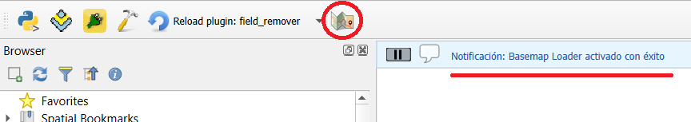{fig-align="center" width="75%"}

### Adición de funcionalidad

A continuación, se expande la estructura básica para añadir la funcionalidad de carga de una XYZ Tile Layer (Capa de teselas XYZ) al activar el botón. Se utilizará la capa XYZ estándar de [OpenStreetMap](https://wiki.openstreetmap.org/wiki/Raster_tile_providers#Base_maps). El código de PyQGIS para cargar una capa de teselas XYZ se adapta del [PyQGIS Cookbook](https://docs.qgis.org/3.44/en/docs/pyqgis_developer_cookbook/cheat_sheet.html). Modifique el archivo `load_basemap.py` con el contenido siguiente:

`load_basemap.py`

```python
#| file: code/pyqgis/basemap_loader_complete/load_basemap.py
#| eval: false
# -------------------------
# Importación de dependencias y módulos core
# -------------------------

# os: Gestión de rutas y directorios del sistema de archivos
import os

# PyQt5: Componentes para la gestión de acciones y recursos gráficos en la interfaz
from PyQt5.QtWidgets import QAction
from PyQt5.QtGui import QIcon

# qgis.core: Clases fundamentales para el manejo de capas ráster, la gestión del proyecto 
# y la definición de sistemas de referencia de coordenadas (CRS)
from qgis.core import QgsRasterLayer, QgsProject, QgsCoordinateReferenceSystem

# Determinación de la ruta absoluta del directorio del complemento
# Se utiliza para localizar recursos locales (como logo.png) independientemente del SO
plugin_dir = os.path.dirname(__file__)

class BasemapLoaderPlugin:
    """
    Clase principal para la carga automatizada de mapas base (XYZ Tiles).
    Establece la conexión entre la interfaz de usuario y el proveedor de datos ráster.
    """

    def __init__(self, iface):
        """
        Constructor de la clase.
        
        Args:
            iface: Instancia de QgisInterface para interactuar con la ventana principal de QGIS.
        """
        self.iface = iface

    def initGui(self):
        """
        Inicialización de la Interfaz Gráfica (GUI).
        Configura la acción del botón, su icono y su ubicación en la barra de herramientas.
        """
        # Localización del recurso gráfico (formato vectorial o ráster)
        icon_path = os.path.join(plugin_dir, 'logo.png')
        
        # QAction: Define una acción ejecutable vinculada al hilo principal de la aplicación
        self.action = QAction(
            QIcon(icon_path), 
            'Load Basemap', 
            self.iface.mainWindow()
        )
        
        # Inserción del icono en la barra de herramientas de complementos (Plugins Toolbar)
        self.iface.addToolBarIcon(self.action)
        
        # Implementación del paradigma dirigido por eventos (Signals and Slots)
        # La señal 'triggered' ejecuta el método run() al interactuar con el botón
        self.action.triggered.connect(self.run)
      
    def unload(self):
        """
        Gestión de la descarga del complemento.
        Libera los recursos de la UI y elimina la acción de la barra de herramientas 
        para mantener la limpieza del entorno al desactivar el plugin.
        """
        self.iface.removeToolBarIcon(self.action)
        del self.action

    def run(self):
        """
        Lógica de procesamiento principal para la carga de capas XYZ.
        """
        # Configuración de parámetros para el servicio de OpenStreetMap (OSM)
        basemap_url = 'https://tile.openstreetmap.org/{z}/{x}/{y}.png'
        zmin = 0     # Nivel mínimo de zoom
        zmax = 19    # Nivel máximo de zoom permitido por el servidor de OSM
        crs = 'EPSG:3857' # Sistema de Referencia Pseudo-Mercator utilizado en web maps
        
        # Codificación de caracteres especiales en la URL para asegurar la compatibilidad con la URI
        # Los caracteres '=' y '&' se sustituyen por sus equivalentes en formato de codificación porcentual
        encoded_url = basemap_url.replace('=', '%3D').replace('&', '%26')
        
        # Construcción de la URI de conexión para el proveedor 'wms' (XYZ)
        # Se define el tipo de proveedor, la URL codificada, los límites de zoom y el CRS
        uri = f'type=xyz&url={encoded_url}&zmax={zmax}&zmin={zmin}&crs={crs}'
        
        # Instanciación de la capa ráster mediante el objeto QgsRasterLayer
        # Parámetros: (URI, nombre de la capa en la leyenda, nombre del proveedor 'wms')
        rlayer = QgsRasterLayer(uri, 'OpenStreetMap', 'wms')
        
        # Bloque de validación de integridad de la capa
        if rlayer.isValid():
            # Adición de la capa al registro global del proyecto activo
            QgsProject.instance().addMapLayer(rlayer)
            
            # Notificación visual de éxito en la barra de mensajes superior de QGIS
            self.iface.messageBar().pushSuccess('Éxito', 'Capa de mapa base cargada correctamente')
        else:
            # Reporte de error en caso de fallo en la conexión o URI malformada
            self.iface.messageBar().pushCritical('Error', 'No se pudo cargar la capa: URI inválida')
```

Para observar el resultado de los cambios, es necesario reiniciar QGIS. Este proceso puede resultar tedioso durante el desarrollo, por lo que existe un complemento útil denominado **Plugin Reloader** que permite recargar un complemento específico sin necesidad de reiniciar la aplicación. Diríjase a `Plugins` (Complementos) &rarr; `Manage and Install plugins...` (Administrar e instalar complementos...) &rarr; `All` (Todos) y busque **Plugin Reloader**. Haga clic en `Install Plugin` (Instalar complemento) o `Reinstall Plugin` (Reinstalar complemento). Una vez instalado, localice el botón `Reload a plugin...` (Recargar un complemento) en la `Plugin Toolbar` (Barra de herramientas de complementos) y seleccione el complemento **Basemap Loader**. Haga clic en `OK` para actualizar el complemento.

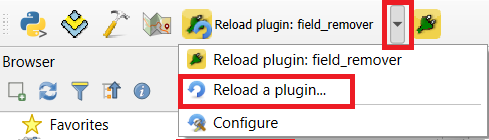{fig-align="center" width="75%"}


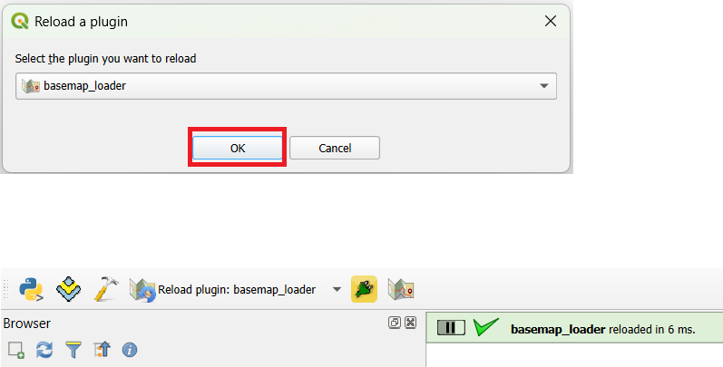{fig-align="center" width="75%"}

Tras la recarga, haga clic en el botón **Load Basemap (Cargar mapa base)** de la barra de herramientas y se observará la carga de la capa del mapa base en QGIS.

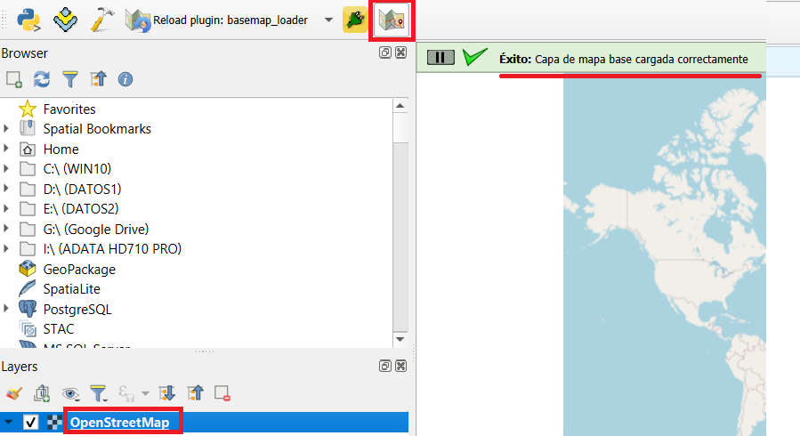{fig-align="center" width="75%"}

### Estructura funcional y ciclo de vida de un complemento

El desarrollo de un complemento requiere una organización modular de archivos que permita al cargador de QGIS identificar la metadata, inicializar la lógica a través de una función de factoría y gestionar la liberación de recursos en la memoria al desactivar la extensión.

```{mermaid}
%%| fig-align: center
%%| out-width: 100%

graph TD
    %% Estilos de alto contraste para legibilidad
    classDef file fill:#ffffff,stroke:#2c3e50,stroke-width:1px,color:#2c3e50,font-family:monospace,font-size:12px;
    classDef qgis fill:#e1f5fe,stroke:#0288d1,stroke-width:1px,color:#01579b;
    classDef action fill:#ffffff,stroke:#455a64,stroke-width:1px,color:#263238,font-style:italic;

    %% Estructura de Archivos en contenedor claro
    subgraph SG1 ["Directorio del Complemento (plugins/basemap_loader)"]
        M["metadata.txt<br/>(Metadatos de registro)"]:::file
        I["__init__.py<br/>(Punto de entrada/Factory)"]:::file
        L["load_basemap.py<br/>(Lógica y Ciclo de vida)"]:::file
        RES["logo.png<br/>(Recursos gráficos)"]:::file
    end

    %% Proceso de Ejecución en contenedor claro
    subgraph SG2 ["Entorno de Ejecución QGIS"]
        QM["Plugin Manager"]:::qgis
        CF(["classFactory(iface)"]):::action
        IG(["initGui()"]):::action
        RU(["run()"]):::action
        UL(["unload()"]):::action
    end

    %% Estilización de los contenedores (subgraphs)
    style SG1 fill:#fcfcfc,stroke:#dcdcdc,stroke-width:1px,color:#666666
    style SG2 fill:#fcfcfc,stroke:#dcdcdc,stroke-width:1px,color:#666666

    %% Relaciones
    M -.->|Registro| QM
    QM -->|Carga| I
    I -->|Instancia| CF
    CF -->|Define| L
    L -->|Crea UI| IG
    IG -->|Evento| RU
    UL -->|Limpieza| L
```

### Resumen sintáctico de desarrollo de extensiones

La creación de complementos se fundamenta en la implementación de una clase principal que actúe como gestora de los eventos de la interfaz y la integración de proveedores de datos externos.

| Componente / Método | Función técnica y especificaciones de uso |
| :--- | :--- |
| `metadata.txt` | Archivo de configuración que define los atributos de identidad (nombre, versión, autor) requeridos para el indexado en el Plugin Manager. |
| `__init__.py` | Módulo de inicialización que contiene la función `classFactory(iface)`. Es el puente obligatorio que retorna la instancia de la clase del plugin a la aplicación. |
| `initGui()` | Método encargado de la construcción de los elementos visuales (`QAction`). Se ejecuta al habilitar el plugin para registrar botones o menús. |
| `unload()` | Método crítico para la limpieza de la UI. Debe invocar `removeToolBarIcon()` para evitar que permanezcan elementos huérfanos tras la desactivación. |
| `QAction` | Clase de PyQt que encapsula un comando de usuario. En los plugins, actúa como el disparador principal vinculado a la lógica de procesamiento. |
| `QgsRasterLayer` | Constructor utilizado para instanciar capas de teselas XYZ mediante URIs codificadas, definiendo el proveedor como `'wms'`. |
| `Plugin Reloader` | Herramienta de desarrollo esencial para la actualización en caliente (*hot-reload*) del código sin reiniciar la sesión de QGIS. |


**Consideraciones para el ejercicio 7 (a continuación):**

Para cumplir con el requerimiento de posicionamiento de la capa en el fondo del panel, es necesario manipular el nodo raíz de la jerarquía visual (`layerTreeRoot`). El registro de la capa mediante `addMapLayer(rlayer, False)` es un paso técnico fundamental: permite que el objeto sea reconocido por el proyecto pero delega la responsabilidad de la inserción visual al desarrollador, permitiendo el uso del método `insertLayer()` en el índice correspondiente al final del árbol de capas.


### Ejercicio 7

Cargue el proyecto `places.qgz` desde el paquete de datos.

Modifique el complemento para cambiar el CRS del proyecto al CRS de la capa de teselas una vez que el mapa base haya sido cargado.

Sugerencia: Utilice el método [`QgsProject.instance().setCrs()`](https://qgis.org/pyqgis/3.44/core/QgsProject.html).

Por defecto, la nueva capa se insertará en la parte superior del árbol de capas. Si se desea insertar la capa en una posición específica, puede emplearse el siguiente fragmento de código:

```python
#| eval: false

# 1. Registro silencioso en el proyecto
# El segundo argumento 'False' evita que QGIS inserte la capa automáticamente en la leyenda visual.
# La capa existe en memoria y en el registro del proyecto, pero no es visible aún en el panel.
QgsProject.instance().addMapLayer(rlayer, False)

# 2. Acceso a la estructura jerárquica de la UI
# Se recupera el nodo raíz que organiza todas las capas y grupos.
root = QgsProject.instance().layerTreeRoot()

# 3. Cálculo de la posición de fondo
# La posición final equivale al número total de elementos hijos en la raíz.
position = len(root.children())

# 4. Inserción manual
# Se inyecta la capa rlayer en la posición calculada (al final del árbol).
root.insertLayer(position, rlayer)
```

## Conceptos avanzados de Python

### Entendimiento de los iteradores de Python

Un *Iterator* (Iterador) es un tipo de objeto de Python que contiene elementos sobre los cuales se puede iterar. Son similares a otros objetos, como las *lists* (listas), pero con una diferencia fundamental: al crear un iterador, **no se almacenan todos los elementos en la memoria**. El iterador carga un solo elemento a la vez y recupera el siguiente solo cuando se le solicita. Esta característica lo hace **altamente eficiente** para la lectura de grandes volúmenes de datos sin necesidad de cargar el conjunto de datos completo. QGIS implementa iteradores para diversos tipos de objetos.

Se continuará trabajando con el proyecto `sf.qgz`. Abra el proyecto y seleccione la capa `blocks`. En el ejemplo siguiente, el resultado de llamar a `layer.getFeatures()` es un iterador. Es posible llamar a la función `next()` para recuperar el siguiente elemento del iterador.

```python
#| eval: false

# -------------------------
# Acceso a la fuente de datos
# -------------------------

# Referencia a la capa vectorial seleccionada actualmente en el panel de capas (TOC)
layer = iface.activeLayer()

# -------------------------
# Instanciación del iterador técnico
# -------------------------

# layer.getFeatures(): Genera un objeto de la clase QgsFeatureIterator
# Este método no carga las entidades en una lista física, sino que establece una 
# conexión para recuperar los registros de forma individual bajo demanda (lazy evaluation)
features = layer.getFeatures()

# -------------------------
# Recuperación secuencial de entidades
# -------------------------

# next(): Función nativa de Python que solicita el siguiente elemento al iterador
# En este punto, el sistema solo carga en memoria la primera entidad (QgsFeature)
f = next(features)

# Extracción y visualización del vector de atributos del primer registro
print(f.attributes())

# La segunda invocación a next() desplaza el puntero interno del objeto QgsFeatureIterator
# Se descarta la entidad anterior y se procesa el segundo registro de la fuente de datos
f = next(features)

# Impresión de los atributos correspondientes al segundo registro recuperado
print(f.attributes())
```

### Iteración exhaustiva y operaciones CRUD

El manejo de datos en sistemas de información geográfica se fundamenta en las operaciones **CRUD** (**C**reate, **R**ead, **U**pdate, **D**elete). Estas funciones permiten gestionar el ciclo de vida de las entidades: crear nuevos registros, leer los existentes, actualizar atributos o geometrías, y borrar elementos de la base de datos. Para ejecutar actualizaciones o eliminaciones precisas, el sistema requiere el **FID** (Feature ID), un identificador único que vincula la entidad en memoria con su registro en el disco.

En el siguiente bloque de código, se emplea un bucle `for` para recorrer el iterador exhaustivamente y compilar los identificadores necesarios para futuras tareas de procesamiento o edición.

```python
#| eval: false

# -------------------------
# Referencia a la fuente de datos
# -------------------------

# Acceso al objeto QgsVectorLayer activo en la interfaz de usuario
layer = iface.activeLayer()

# -------------------------
# Inicialización del iterador de datos
# -------------------------

# getFeatures(): Instancia un objeto QgsFeatureIterator para el acceso secuencial
features = layer.getFeatures()

# -------------------------
# Gestión de la colección de datos y CRUD
# -------------------------

# Inicialización de una lista para el almacenamiento de los identificadores
# Esta estructura de datos persistirá los FIDs en la memoria RAM
ids = []

# Implementación de un ciclo de iteración exhaustiva (Looping)
for f in features:
    # f.id(): Recupera el identificador único (FID) asignado a la entidad actual
    # El FID es el índice indispensable para realizar operaciones CRUD sobre el proveedor
    id = f.id()
    
    # Adición del identificador a la lista de Python para su uso posterior
    ids.append(id)

# Despliegue del reporte de identificadores en el panel de salida de la consola
print(ids)
```

### Comprensión de listas

Una tarea común de procesamiento de datos en Python consiste en leer elementos de una lista o un iterador, realizar un procesamiento sobre cada elemento y crear una nueva lista con los resultados. El procedimiento convencional para esto requiere crear primero una lista vacía, iterar sobre cada elemento de la lista existente y añadir los resultados a la nueva lista. Python ofrece una alternativa potente a este flujo de trabajo mediante la *List Comprehension* (Comprensión de listas). El siguiente fragmento muestra la sintaxis:

```python
#| eval: false
#| file: code/pyqgis/list_comprehensions.py
#| eval: false

# -------------------------
# Definición de la fuente de datos
# -------------------------

# Creación de un objeto iterable (lista) con una secuencia de enteros
my_list = [1, 2, 3, 4, 5]


# -------------------------
# Método 1: Flujo mediante bucle for (método imperativo/covencional)
# -------------------------

# Inicialización de una estructura de datos vacía en la memoria RAM
new_list = []

# Implementación de un ciclo de iteración explícita
for x in my_list:
    # Aplicación de una transformación aritmética (suma)
    # y acumulación secuencial mediante el método .append()
    new_list.append(x + 1)

# Despliegue de la colección resultante: [2, 3, 4, 5, 6]
print(new_list)


# -------------------------
# Método 2: Evaluación declarativa (List Comprehension)
# -------------------------

# La sintaxis de comprensión encapsula la intención del algoritmo en una sola línea.
# [expresión for elemento in iterable]
# Esta construcción es evaluada a nivel del intérprete (C en CPython), lo que suele 
# ofrecer una ventaja de rendimiento sobre el bucle .append() tradicional.
new_list = [x + 1 for x in my_list]

# Verificación de la consistencia de los datos
print(new_list)
```

### Estructura funcional de los iteradores en QGIS

A diferencia de las listas convencionales, el objeto `QgsFeatureIterator` actúa como un puntero hacia la fuente de datos, recuperando un solo registro a la vez bajo demanda. El siguiente diagrama ilustra el flujo de carga selectiva en memoria.

```{mermaid}
%%| fig-align: center
%%| out-width: 100%

graph LR
    %% Definición de estilos de alto contraste
    classDef datasource fill:#f4f6f9,stroke:#2c3e50,stroke-width:2px,color:#2c3e50
    classDef iterator fill:#e1f5fe,stroke:#0288d1,stroke-width:2px,color:#01579b
    classDef ram fill:#fff3e0,stroke:#e65100,stroke-width:2px,color:#e65100

    %% Definición de nodos y flujo
    A["Fuente de datos<br/>(Capa en disco)"]:::datasource --> B("getFeatures()"):::iterator
    B --> C{"Iterador<br/>QgsFeatureIterator"}:::iterator
    C -->|next| D["Entidad actual<br/>(Carga en RAM)"]:::ram
    D -->|next| E["Siguiente entidad<br/>(Libera anterior)"]:::ram

    %% Agrupación lógica
    subgraph SG1 ["Gestión eficiente"]
        C
        D
    end

    %% Estilo del contenedor
    style SG1 fill:#fcfcfc,stroke:#dcdcdc,stroke-width:1px,color:#666666
```


### Resumen sintáctico de procesamiento y CRUD

La interacción con los registros de una capa vectorial se basa en el acceso a sus atributos y su identificador único (FID), facilitando operaciones de gestión de datos.

| Método / Concepto | Función técnica y especificaciones de uso |
| :--- | :--- |
| `getFeatures()` | Genera un `QgsFeatureIterator`. Establece la conexión con el proveedor de datos para la recuperación secuencial. |
| `next()` | Función de Python que solicita el siguiente objeto al iterador, desplazando el puntero interno. |
| `f.id()` | Recupera el Feature ID (FID). Identificador mandatorio para operaciones **CRUD** sobre el proveedor. |
| `f.attributes()` | Retorna un vector con los valores de todos los campos para la entidad cargada actualmente. |
| `layer.fields()` | Devuelve un contenedor `QgsFields` con la definición estructural (esquema) de la tabla de atributos. |
| `List Comprehension` | Sintaxis declarativa que encapsula la iteración y transformación de datos en una instrucción de alto rendimiento. |


**Reporte de optimización para el ejercicio 8 (a continuación):**

Para cumplir con el estándar de eficiencia y brevedad, se transforma el proceso de extracción de nombres de campos utilizando comprensión de listas. Esta técnica reduce la sobrecarga del método `.append()` y mejora la legibilidad del código.

```python
#| eval: false

# -------------------------
# Resolución del ejercicio 8: Comprensión de listas
# -------------------------

# Acceso a la capa y extracción directa de nombres mediante sintaxis declarativa
# La expresión [field.name() for field in fields] reemplaza el bucle for convencional
field_names = [field.name() for field in iface.activeLayer().fields()]

# Despliegue del vector de nombres resultante
print(field_names)
```

### Ejercicio 8

El siguiente código genera una lista de nombres de campos para la Active layer (Capa activa) seleccionada. Convierta el código para que utilice una comprensión de listas.

```python
#| eval: false

# -------------------------
# Acceso a la estructura de la capa
# -------------------------

# Referencia a la capa vectorial activa en la interfaz (QgsVectorLayer)
layer = iface.activeLayer()

# Recuperación del objeto QgsFields, que contiene la definición de todas las columnas
fields = layer.fields()

# -------------------------
# Proceso de extracción (Método convencional)
# -------------------------

# Inicialización manual de una lista vacía para almacenar las cadenas de texto
field_names = []

# Iteración secuencial sobre el contenedor de campos
for field in fields:
    # Extracción del nombre del campo y adición al acumulador mediante .append()
    field_names.append(field.name())

# Visualización del vector de nombres resultante en la consola
print(field_names)
```

## Escritura de complementos de procesamiento

El nuevo método preferido para escribir complementos en QGIS es mediante el **Processing Framework** (Entorno de procesamiento). Este marco elimina la necesidad de diseñar la interfaz de usuario manualmente. El complemento resultante se integra perfectamente en la **Processing Toolbox** (Caja de herramientas de procesamiento) y permite la interoperabilidad con otros algoritmos de procesamiento.

En esta sección se aprenderá a construir un complemento denominado **Save Attributes**, el cual añade un nuevo algoritmo para iterar sobre todos los objetos espaciales de una capa, extraer los valores de sus atributos y guardar los resultados en un archivo CSV. Se explorarán los diferentes componentes de un complemento de procesamiento y se adquirirán las habilidades necesarias para crear una herramienta funcional.

### Iteración sobre objetos espaciales

Se inicia con el aprendizaje de la iteración sobre objetos espaciales de una capa vectorial. Se recorrerá cada objeto para extraer el valor de todos sus atributos. Para simplificar el proceso inicial, se utilizará la biblioteca Pandas para crear un DataFrame y guardar los resultados. Posteriormente, se modificará este código para emplear la API nativa de PyQGIS.

Abra la Python Console (Consola de Python) y haga clic en el botón `Show Editor` (Mostrar editor). Copie y pegue el siguiente código. Seleccione la capa `blocks` y ejecute el script presionando el botón `Run Script` (Ejecutar script). El script procesará la capa y escribirá el archivo en la ubicación especificada.

```python
#| eval: false
#| file: code/pyqgis/save_attributes_pandas.py

# -------------------------
# Importación de dependencias
# -------------------------
import os
import pandas as pd

# -------------------------
# Validación de precondición de persistencia
# -------------------------

# Recuperación de la ruta absoluta del archivo de proyecto activo
# El método fileName() es indispensable para anclar los datos al directorio de trabajo
project_full_path = QgsProject.instance().fileName()

# Estructura de control para gestionar la salida temprana (Early Exit)
if not project_full_path:
    # Notificación de error en la interfaz de usuario (iface)
    iface.messageBar().pushCritical(
      'Error de ejecución', 
      'Operación cancelada: El proyecto actual debe estar guardado para establecer el directorio raíz.'
    )

else:
    
    # -------------------------
    # Configuración de rutas e insumos
    # -------------------------
    
    # Establecimiento del directorio base del proyecto
    project_dir = os.path.dirname(project_full_path)
    data_dir = project_dir


    # Definición del nombre y ruta final del archivo de salida
    output_name = 'output_1.csv'
    output_path = os.path.join(data_dir, output_name)

    # -------------------------
    # Adquisición y validación de la fuente de datos
    # -------------------------

    # Referencia a la capa seleccionada actualmente en la interfaz de QGIS (iface)
    layer = iface.activeLayer()

    # Validación 1: Verificar que exista una capa seleccionada en el panel de capas
    if not layer:
        iface.messageBar().pushMessage(
        'Error crítico', 'Por favor, seleccione una capa en el panel.', level=Qgis.Critical
        )
        
    # Validación 2: Verificar que la capa sea de tipo vectorial (QgsMapLayer.VectorLayer)
    # Este paso es fundamental ya que las capas ráster no poseen una tabla de atributos iterable
    if layer.type() != QgsMapLayer.VectorLayer:
        iface.messageBar().pushMessage(
        'Error de tipo', 'La operación requiere una capa vectorial.', level=Qgis.Critical
        )

    # -------------------------
    # Extracción de metadatos y registros
    # -------------------------

    # Recuperación de la estructura de campos (QgsFields) de la capa
    fields = layer.fields()

    # Generación de la lista de cabeceras mediante comprensión de listas
    # Se extrae únicamente la propiedad .name() de cada objeto QgsField
    fieldnames = [field.name() for field in layer.fields()]

    # Extracción masiva de atributos utilizando el iterador de entidades (getFeatures)
    # Cada elemento de la lista 'data' contiene el vector de atributos de un objeto espacial
    data = [f.attributes() for f in layer.getFeatures()]

    # -------------------------
    # Procesamiento de datos y persistencia
    # -------------------------

    # Instanciación de un DataFrame de Pandas vinculando la matriz de datos con los nombres de campos
    df = pd.DataFrame(data, columns=fieldnames)

    # Exportación física al sistema de archivos
    # Se utiliza index=False para evitar la inclusión de la columna de índices propia de pandas
    df.to_csv(output_path, index=False)

    # Notificación de finalización exitosa en la barra de mensajes de QGIS
    iface.messageBar().pushMessage(
        'Éxito:', 'Archivo de salida escrito en ' + output_path, level=Qgis.Success)
```

#### Arquitectura del flujo de procesamiento de atributos

El desarrollo de algoritmos de extracción se fundamenta en la capacidad de iterar sobre geometrías y atributos, transformando estructuras de datos de PyQGIS en formatos tabulares estándar.

```{mermaid}
%%| fig-align: center
%%| out-width: 100%

graph TD
    %% Estilos de alto contraste
    classDef source fill:#f4f6f9,stroke:#2c3e50,stroke-width:2px,color:#2c3e50;
    classDef process fill:#e1f5fe,stroke:#0288d1,stroke-width:2px,color:#01579b;
    classDef export fill:#fff3e0,stroke:#e65100,stroke-width:2px,color:#e65100;

    A["Capa Vectorial<br/>(QgsVectorLayer)"]:::source --> B["Extracción de Campos<br/>(layer.fields)"]:::process
    A --> C["Iterador de Objetos<br/>(getFeatures)"]:::process
    
    B --> D["Estructura de Datos<br/>(Pandas DataFrame)"]:::process
    C --> D
    
    D --> E["Persistencia Física<br/>(Archivo CSV)"]:::export
    E --> F["Notificación UI<br/>(iface.messageBar)"]:::source
```


#### Resumen sintáctico de operaciones de extracción

La transición hacia complementos de procesamiento requiere el dominio de la validación de tipos de capa y la gestión de iteradores para la captura de metadatos.

| Método / Clase | Función técnica y lógica de aplicación |
| :--- | :--- |
| `Processing Framework` | Marco de trabajo que facilita la creación de herramientas integradas en la caja de herramientas sin diseño manual de GUI. |
| `QgsMapLayer.VectorLayer` | Constante de tipo utilizada para validar que el insumo posea una tabla de atributos iterable. |
| `layer.fields()` | Recupera el objeto `QgsFields`, permitiendo la extracción de nombres de columnas mediante comprensión de listas. |
| `layer.getFeatures()` | Instancia un iterador que recupera los atributos de cada objeto espacial en la capa. |
| `pd.DataFrame(data, columns)` | Constructor de la biblioteca Pandas que vincula la matriz de atributos con sus cabeceras para su procesamiento tabular. |
| `df.to_csv(path, index=False)` | Método de persistencia que exporta el contenido de la memoria al sistema de archivos en formato CSV. |


**Resolución técnica del ejercicio 9: Filtrado por selección (a continuación):**

Para restringir el procesamiento únicamente a las entidades seleccionadas por el operador, se debe sustituir el iterador general por métodos específicos de captura de selección y añadir validadores de conteo para prevenir ejecuciones en capas sin elementos resaltados.

```python
#| eval: false

# -------------------------
# Resolución del ejercicio 9
# -------------------------

# 1. Validación de existencia de selección
# El método selectedFeatureCount() devuelve el número de elementos resaltados
selection_count = layer.selectedFeatureCount()

if selection_count == 0:
    # Notificación de error si no hay selección activa
    iface.messageBar().pushMessage(
        'Error de selección', 
        'La capa no posee objetos seleccionados.', 
        level=Qgis.Warning
    )
else:
    # 2. Iteración restringida
    # selectedFeatures() devuelve una lista únicamente con los objetos seleccionados
    # Se aplica la técnica de comprensión de listas sobre la selección activa
    data = [f.attributes() for f in layer.selectedFeatures()]
    
    # Continuación del flujo de persistencia con Pandas...
    df = pd.DataFrame(data, columns=fieldnames)
    df.to_csv(output_path, index=False)
```

#### Ejercicio 9

Modifique el código anterior para guardar los atributos únicamente de los objetos espaciales seleccionados. Se otorgarán puntos adicionales si el script verifica si existen objetos seleccionados en la capa y despliega un error en caso contrario.

Sugerencia 1: Consulte los métodos disponibles para la clase [`QgsVectorLayer`](https://qgis.org/pyqgis/3.44/core/QgsVectorLayer.html).

Sugerencia 2: Para verificar si la capa tiene objetos seleccionados, busque un método que devuelva el conteo de elementos seleccionados.

### Guardado de capas vectoriales

A partir del script anterior, se aprendió a guardar los resultados de una capa vectorial en un archivo utilizando las clases de PyQGIS. Este es el método recomendado al desarrollar scripts destinados a ser algoritmos o complementos de procesamiento. Se utilizará la clase [`QgsVectorFileWriter`](https://qgis.org/pyqgis/3.44/core/QgsVectorFileWriter.html) para crear un archivo en cualquiera de los formatos de datos vectoriales compatibles.

Se empleará el método `QgsVectorFileWriter.create()`, el cual requiere los siguientes parámetros:

*   `fileName`: Ruta del archivo.
*   `fields`: Campos a escribir.
*   `geometryType`: Tipo de geometría del archivo de salida.
*   `srs`: CRS del archivo de salida.
*   `transformContext`: Configuración de transformación de datum.
*   `options`: Opciones de guardado (formato, codificación, etc.).

Una vez inicializado un objeto `QgsVectorFileWriter`, se itera sobre la capa original y se invoca el método `addFeature()` para añadir los objetos al escritor.

Abra la Python Console (Consola de Python) y haga clic en el botón **Show Editor (Mostrar editor)**. Copie y pegue el siguiente código. Seleccione la capa `blocks` y ejecute este script mediante el botón **Run Script (Ejecutar script)**. El script procesará la capa y escribirá el archivo en la ruta proporcionada.

```python
#| eval: false
#| file: code/pyqgis/save_attributes_console.py
#| eval: false

# -------------------------
# Importación de dependencias
# -------------------------
import os
import time

# -------------------------
# Validación de precondición de persistencia
# -------------------------

# Recuperación de la ruta absoluta del archivo de proyecto activo
# El método fileName() es indispensable para anclar los datos al directorio de trabajo
project_full_path = QgsProject.instance().fileName()

# Estructura de control para gestionar la salida temprana (Early Exit)
if not project_full_path:
    # Notificación de error en la interfaz de usuario (iface)
    iface.messageBar().pushCritical(
      'Error de ejecución', 
      'Operación cancelada: El proyecto actual debe estar guardado para establecer el directorio raíz.'
    )

else:
    
    # -------------------------
    # Configuración de rutas e insumos
    # -------------------------
    
    # Establecimiento del directorio base del proyecto
    project_dir = os.path.dirname(project_full_path)
    data_dir = project_dir


    # -------------------------
    # Adquisición y validación de la capa activa
    # -------------------------

    # Referencia al objeto de la capa seleccionada en la interfaz de usuario (iface)
    layer = iface.activeLayer()

    # Validación de existencia: Asegura que el usuario haya seleccionado una capa en el TOC
    if not layer:
        iface.messageBar().pushMessage('Error:', 'Por favor, seleccione una capa', level=Qgis.Critical) 

    # Validación de tipo: El escritor de archivos vectoriales requiere específicamente una QgsVectorLayer
    if layer.type() != QgsMapLayer.VectorLayer:
        iface.messageBar().pushMessage('Error:', 'La capa seleccionada debe ser de tipo vectorial', level=Qgis.Critical)

    # -------------------------
    # Parámetros de configuración del escritor (Writer)
    # -------------------------

    output_name = 'output_2.csv'
    output_path = os.path.join(data_dir, output_name)

    # Instanciación de las opciones de guardado para definir el formato de salida
    save_options = QgsVectorFileWriter.SaveVectorOptions()
    save_options.driverName = 'CSV'        # Definición del controlador OGR para valores separados por comas
    save_options.fileEncoding = 'UTF-8'    # Codificación de caracteres para asegurar compatibilidad internacional

    # Configuración de opciones específicas de la capa provenientes de GDAL/OGR
    # 'SEPARATOR=COMMA' fuerza el uso de la coma como delimitador, evitando conflictos regionales
    save_options.layerOptions = ['SEPARATOR=COMMA']

    # -------------------------
    # Inicialización del flujo de escritura
    # -------------------------

    # Creación del objeto writer mediante el método factory 'create'
    # Este método inicializa el archivo en disco y prepara el esquema de campos
    writer = QgsVectorFileWriter.create(
        fileName=output_path,
        fields=layer.fields(),                   # Mapeo del esquema de la tabla de atributos original
        geometryType=QgsWkbTypes.NoGeometry,      # Al exportar a CSV, se omite la información geométrica
        srs=layer.crs(),                         # Definición del Sistema de Referencia de Coordenadas
        transformContext=QgsProject.instance().transformContext(), # Gestión del contexto de transformación del proyecto
        options=save_options)

    # Verificación de integridad del escritor
    # Si el archivo está bloqueado o la ruta es inválida, se captura el mensaje de error de la API
    if writer.hasError() != QgsVectorFileWriter.NoError:
        iface.messageBar().pushMessage(
            'Error crítico de escritura:', writer.errorMessage, level=Qgis.Critical)

    # -------------------------
    # Iteración y persistencia de entidades
    # -------------------------

    # Se recorre el iterador de objetos espaciales de la capa fuente
    # Cada entidad (QgsFeature) se envía al búfer del escritor
    for f in layer.getFeatures():
        writer.addFeature(f)

    # -------------------------
    # Finalización y cierre de recursos
    # -------------------------

    # IMPORTANTE: Se debe eliminar explícitamente el objeto writer
    # Esta acción fuerza el vaciado de los búferes (flush) a disco y cierra el manejador del archivo
    del writer

    # Notificación de finalización exitosa en la interfaz de QGIS
    iface.messageBar().pushMessage(
        'Éxito:', 'Archivo exportado correctamente en: ' + output_path, level=Qgis.Success)
```

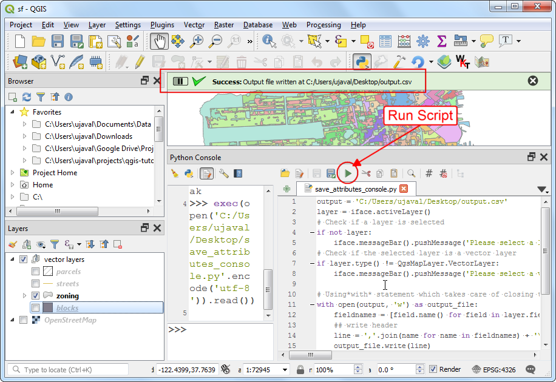{fig-align="center" width="75%"}


#### Flujo lógico de escritura de archivos

El siguiente diagrama ilustra la secuencia de operaciones necesarias para exportar una capa vectorial desde el entorno de memoria hacia un soporte de almacenamiento físico.

```{mermaid}
%%| fig-align: center
%%| out-width: 100%

graph TD
    %% Estilos de alto contraste para legibilidad
    classDef config fill:#ffffff,stroke:#2c3e50,stroke-width:2px,color:#2c3e50;
    classDef process fill:#e1f5fe,stroke:#0288d1,stroke-width:2px,color:#01579b;
    classDef finish fill:#ffffff,stroke:#e65100,stroke-width:2px,color:#e65100;

    %% Declaración aislada de nodos y formas
    A["Configuración de opciones: SaveVectorOptions()"]:::config
    B(["writer = QgsVectorFileWriter.create(...)"]):::process
    C["Apertura de iterador: layer.getFeatures()"]:::process
    D{"¿Existen entidades?"}:::process
    E(["writer.addFeature(f)"]):::process
    F["Finalización del flujo"]:::finish
    G(["del writer"]):::finish
    H["Vaciado de búferes y cierre de archivo"]:::finish

    %% Topología de conexiones
    A --> B
    B --> C
    C --> D
    D -- "Sí" --> E
    E --> D
    D -- "No" --> F
    F --> G
    G --> H

    %% Contenedores con fondo claro
    subgraph SG1 ["Ciclo de persistencia"]
        D
        E
    end
    style SG1 fill:#fcfcfc,stroke:#dcdcdc,stroke-width:1px,color:#666666
```


#### Resumen sintáctico de parámetros de configuración

La ejecución exitosa del método `QgsVectorFileWriter.create()` requiere la definición precisa de metadatos espaciales y opciones del controlador de datos.

| Parámetro | Función técnica y especificaciones |
| :--- | :--- |
| `fileName` | Cadena de texto con la ruta absoluta del archivo de salida en el sistema de archivos. |
| `fields` | Objeto `QgsFields` que define el esquema de columnas y tipos de datos de la tabla resultante. |
| `geometryType` | Definición del tipo de geometría (Punto, Línea, Polígono) o `NoGeometry` para tablas alfanuméricas. |
| `srs` | Instancia de `QgsCoordinateReferenceSystem` para la proyección cartográfica del archivo. |
| `transformContext` | Configuración del proyecto para la gestión de transformaciones de datum. |
| `options` | Objeto `SaveVectorOptions` donde se especifica el driver (ej: 'CSV', 'GPKG') y la codificación. |

> **Nota técnica**: Es importante ejecutar la instrucción `del writer` al finalizar la iteración. Esta acción no solo elimina el objeto de la memoria RAM, sino que dispara el vaciado (*flush*) de los búferes de escritura y libera el bloqueo del sistema de archivos sobre el recurso generado.


### Escritura de un script de procesamiento

Se ha analizado cómo escribir un script de Python en el editor de la consola de QGIS; sin embargo, existe un enfoque preferido: el uso del **Processing Framework (Entorno de procesamiento)** integrado. Esta aproximación ofrece diversas ventajas. Primero, la captura de entradas del usuario y la escritura de archivos de salida es mucho más sencilla debido a que el entorno ofrece interfaces estandarizadas. Segundo, al integrar el script en la Processing Toolbox, este puede formar parte de cualquier modelo de procesamiento o ejecutarse como un trabajo por lotes con múltiples entradas. A continuación, se detalla cómo escribir un script de Python personalizado para el entorno de procesamiento en QGIS.

Es posible revisar información y consejos adicionales en la sección [Writing new Processing algorithms as Python scripts](https://docs.qgis.org/3.44/en/docs/user_manual/processing/scripts.html) de la Guía de usuario de QGIS.

Los algoritmos de procesamiento siguen la estructura que se describe a continuación:

*   Los scripts de procesamiento heredan de la clase base [`QgsProcessingAlgorithm`](https://qgis.org/pyqgis/3.44/core/QgsProcessingAlgorithm.html).
*   El método `initAlgorithm()` se invoca para configurar las entradas y salidas. Estas deben definirse con la clase apropiada según el tipo de parámetro, heredando de [`QgsProcessingParameterDefinition`](https://api.qgis.org/api/classQgsProcessingParameterDefinition.html).
*   El método `processAlgorithm()` contiene la lógica principal del script que se ejecuta cuando el usuario presiona el botón **Run (Ejecutar)**. Se pueden obtener las referencias a las entradas y salidas seleccionadas por el usuario mediante los métodos de la clase `QgsProcessingAlgorithm`.

Existen conceptos y clases adicionales necesarios para la escritura de scripts de procesamiento:

*   **context**: Objeto de la clase [`QgsProcessingContext`](https://qgis.org/pyqgis/3.44/core/QgsProcessingContext.html) que contiene información sobre el proyecto actual y su configuración.
*   **feedback**: Objeto de la clase [`QgsProcessingFeedback`](https://qgis.org/pyqgis/3.44/core/QgsProcessingFeedback.html) utilizado para la comunicación con el usuario durante la ejecución del algoritmo (actualización de la barra de progreso, visualización de errores, etc.).
*   **source** y **sink**: Los algoritmos de procesamiento utilizan clases especializadas para facilitar la lectura y escritura de capas vectoriales. La clase [`QgsFeatureSource`](https://qgis.org/pyqgis/3.44/core/QgsFeatureSource.html) posee métodos para leer objetos espaciales y [`QgsFeatureSink`](https://qgis.org/pyqgis/3.44/core/QgsFeatureSink.html) dispone de métodos para escribirlos.

Se explicará ahora cómo convertir el script de la consola en un script de procesamiento.

Para crear un nuevo script de procesamiento, diríjase a **Processing (Procesamiento) &rarr; Processing Toolbox (Caja de herramientas de procesamiento)**. Haga clic en el botón **Scripts (Scripts)** y seleccione **Create New Script.. (Crear nuevo script..)**.

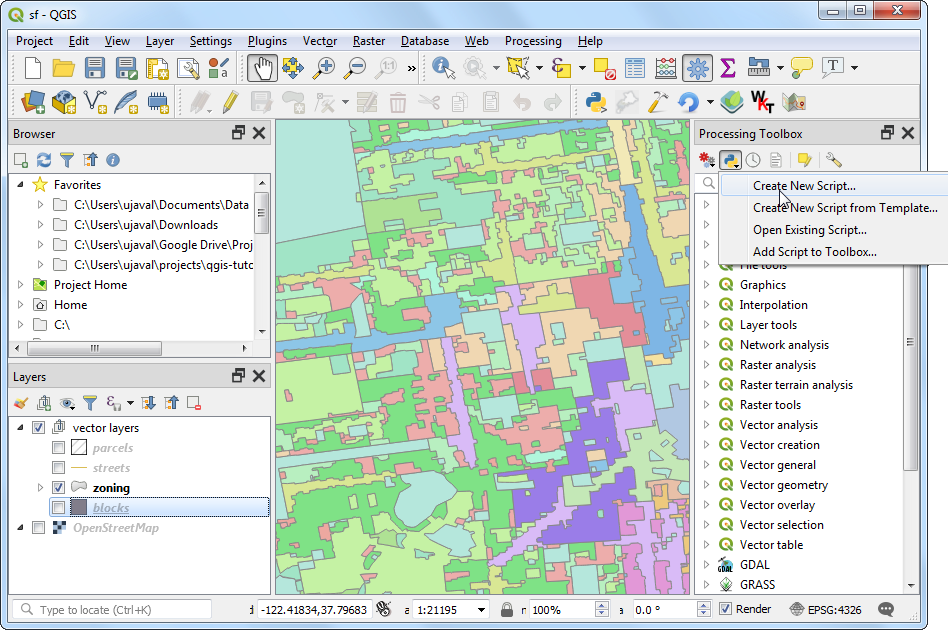{fig-align="center" width="75%"}

Copie y pegue el siguiente código en el **Processing Script Editor (Editor de scripts de procesamiento)**.

`save_attributes_processing.py`

```python
#| eval: false
#| file: code/pyqgis/save_attributes_processing.py

# -------------------------
# Importación de dependencias
# -------------------------
from PyQt5.QtCore import QCoreApplication
from qgis.core import (Qgis,
                       QgsProcessing,
                       QgsProcessingAlgorithm,
                       QgsProcessingParameterFeatureSource,
                       QgsProcessingParameterFileDestination,
                       QgsVectorFileWriter,
                       QgsWkbTypes,
                       QgsProject)

class SaveAttributesAlgorithm(QgsProcessingAlgorithm):
    """
    Extensión del framework de procesamiento para persistir atributos vectoriales
    en formato plano CSV sin componentes geométricos.
    """

    def initAlgorithm(self, config=None):
        """
        Definición de la interfaz de entrada y salida del algoritmo.
        Se configuran los parámetros que el usuario visualizará en el diálogo.
        """
        # Parámetro de entrada: Fuente de objetos espaciales (Capa vectorial)
        self.addParameter(
            QgsProcessingParameterFeatureSource(
                'INPUT',
                'Input layer',
                [Qgis.ProcessingSourceType.VectorAnyGeometry]
            )
        )

        # Parámetro de salida: Destino del archivo CSV
        # QgsProcessingParameterFileDestination gestiona la creación de rutas en el SO
        self.addParameter(
            QgsProcessingParameterFileDestination(
                'OUTPUT',
                'Output File',
                'CSV files (*.csv)',
            )
        )

    def processAlgorithm(self, parameters, context, feedback):
        """
        Núcleo operativo del algoritmo donde se ejecuta la lógica de procesamiento.
        
        Args:
            parameters: Diccionario con los valores proporcionados por el usuario.
            context: Contexto de ejecución del framework de procesamiento.
            feedback: Objeto para reportar progreso y gestionar cancelaciones.
        """
        # Recuperación de la capa vectorial desde el parámetro de entrada
        layer = self.parameterAsVectorLayer(parameters, 'INPUT', context)

        # Recuperación de la ruta de salida definida por el usuario
        output = self.parameterAsFileOutput(parameters, 'OUTPUT', context)

        # Configuración del iterador y conteo para la barra de progreso
        total = layer.featureCount()
        features = layer.getFeatures()
        
        # Definición de opciones técnicas para el escritor de archivos
        # Se utiliza el controlador de CSV de OGR/GDAL
        save_options = QgsVectorFileWriter.SaveVectorOptions()
        save_options.driverName = 'CSV'
        save_options.fileEncoding = 'UTF-8'

        # Inicialización del objeto escritor (Writer)
        # Se define QgsWkbTypes.NoGeometry para omitir la exportación de vértices
        writer = QgsVectorFileWriter.create(
            fileName=output,
            fields=layer.fields(),
            geometryType=QgsWkbTypes.NoGeometry,
            srs=layer.crs(),
            transformContext=QgsProject.instance().transformContext(),
            options=save_options)

        # Ciclo de iteración sobre los objetos espaciales de la capa
        for current, f in enumerate(features):
            # Verificación de interrupción por parte del usuario
            if feedback.isCanceled():
                break

            # Inserción de la entidad en el archivo de salida
            writer.addFeature(f)

            # Actualización dinámica de la barra de progreso en la interfaz
            if total != 0:
                # Cálculo porcentual del avance del proceso
                progress = int(100 * (current / total))
            else:
                progress = 0
            feedback.setProgress(progress)

        # Retorno de los resultados para su integración en modelos o scripts superiores
        return {'OUTPUT': output}

    def name(self):
        """Identificador interno del algoritmo (minúsculas, sin espacios)."""
        return 'save_attributes'

    def displayName(self):
        """Nombre legible que aparecerá en la caja de herramientas."""
        return self.tr('Save Attributes As CSV')

    def group(self):
        """Categoría o grupo de algoritmos al que pertenece."""
        return self.tr(self.groupId())

    def groupId(self):
        """Identificador único del grupo."""
        return ''

    def tr(self, string):
        """Soporte para la internacionalización de cadenas de texto."""
        return QCoreApplication.translate('Processing', string)

    def createInstance(self):
        """Generación de una nueva instancia de la clase del algoritmo."""
        return SaveAttributesAlgorithm()
```

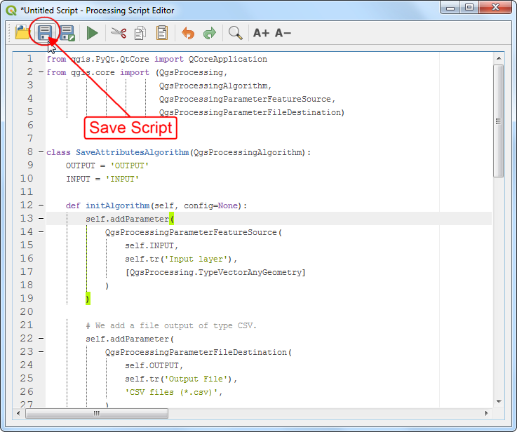{fig-align="center" width="75%"}

Haga clic en el botón **Save Script (Guardar script)** y guarde el archivo como `save_attributes_algorithm.py`. Este script debe almacenarse en el directorio `{profile folder}\processing\scripts/` para que pueda cargarse al iniciar QGIS. En mi equipo Windows: `%APPDATA%\QGIS\QGIS3\profiles\default\processing\scripts`, equivalente a `C:\Users\alexyshr\AppData\Roaming\QGIS\QGIS3\profiles\default\processing\scripts`.

Una vez guardado, el algoritmo aparecerá en la Processing Toolbox bajo **Scripts &rarr; Save Attributes As CSV**. Haga doble clic para iniciarlo. Se desplegará el diálogo estándar de algoritmos de procesamiento donde el usuario puede seleccionar entradas y salidas fácilmente. La barra de progreso se visualizará correctamente y la ejecución se detendrá si el usuario presiona el botón **Cancel (Cancelar)**. Si la capa es extensa y el proceso requiere tiempo, el usuario puede cerrar la ventana y el algoritmo continuará ejecutándose en segundo plano.

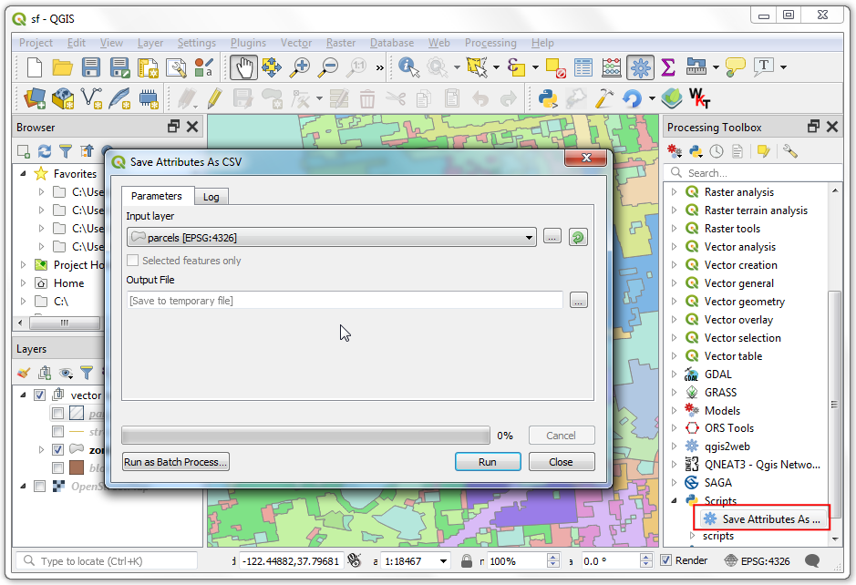{fig-align="center" width="75%"}


A continuación se presenta el reporte técnico sobre el desarrollo de algoritmos personalizados dentro del marco de trabajo (framework) de procesamiento de QGIS, orientado a la creación de herramientas interoperables y estandarizadas.


#### Estructura fundamental de la clase QgsProcessingAlgorithm

Los algoritmos de procesamiento en QGIS se definen mediante la herencia de la clase base `QgsProcessingAlgorithm`. El ciclo de vida de un algoritmo se divide principalmente en la configuración de la interfaz y la ejecución de la lógica de negocio.

*   **`initAlgorithm()`**: Método invocado para declarar los parámetros de entrada (capas, valores numéricos, rutas) y las definiciones de salida mediante clases derivadas de `QgsProcessingParameterDefinition`.
*   **`processAlgorithm()`**: Contiene la lógica operativa que se dispara al ejecutar el algoritmo. Recibe el diccionario de parámetros, el contexto del proyecto y el objeto de retroalimentación para la comunicación con el usuario.
*   **Identificadores**: Métodos como `name()`, `displayName()` y `group()` definen cómo se indexa y visualiza la herramienta dentro de la **Processing Toolbox**.


#### Flujo de datos y gestión de retroalimentación

El framework introduce abstracciones críticas para el manejo eficiente de datos y la experiencia del usuario durante procesos extensos.

*   **QgsFeatureSource y QgsFeatureSink**: Clases optimizadas para la lectura y escritura secuencial de objetos espaciales, respectivamente.
*   **QgsProcessingFeedback**: Permite la interacción dinámica, como la actualización de barras de progreso y la detección de señales de cancelación por parte del operador para detener procesos en curso de manera segura.
*   **QgsProcessingContext**: Provee acceso a la configuración del proyecto, variables de entorno y transformaciones de datum necesarias para la precisión cartográfica.

```{mermaid}
%%| fig-align: center
%%| out-width: 100%

graph TD
    %% Estilos de alto contraste para legibilidad
    classDef init fill:#e1f5fe,stroke:#0288d1,stroke-width:2px,color:#01579b;
    classDef process fill:#fff3e0,stroke:#e65100,stroke-width:2px,color:#e65100;
    classDef ui fill:#ffffff,stroke:#2c3e50,stroke-width:2px,color:#2c3e50;

    %% Declaración aislada de nodos y formas
    START["Carga en Processing Toolbox"]:::ui
    INIT(["initAlgorithm()"]):::init
    PARAM["Definición de parámetros: FeatureSource, FileDestination"]:::init
    DIALOG["Generación automática de GUI"]:::ui
    RUN(["processAlgorithm()"]):::process
    LOOP["Iteración sobre entidades"]:::process
    FEED["feedback.setProgress()"]:::ui
    CANCEL{"¿Usuario canceló?"}:::ui
    BREAK["Finalización segura"]:::process
    END_NODE["Retorno de resultados (dict)"]:::process

    %% Topología de conexiones principal
    START --> INIT
    INIT --> PARAM
    PARAM --> DIALOG
    DIALOG --> RUN

    %% Conexiones del bucle
    RUN --> LOOP
    LOOP --> FEED
    FEED --> CANCEL
    CANCEL -- "No" --> LOOP
    CANCEL -- "Sí" --> BREAK
    
    LOOP --> END_NODE

    %% Contenedores lógicos
    subgraph SG1 ["Bucle de procesamiento"]
        LOOP
        FEED
        CANCEL
        BREAK
    end
    style SG1 fill:#fcfcfc,stroke:#dcdcdc,stroke-width:1px,color:#666666
```


#### Resumen sintáctico de componentes de procesamiento

La transición de scripts de consola a algoritmos integrados requiere el uso de clases que normalizan la interacción con el sistema operativo y el núcleo de QGIS.

| Componente técnico | Clase / Método | Función técnica y lógica de aplicación |
| :--- | :--- | :--- |
| **Parámetro de entrada** | `QgsProcessingParameterFeatureSource` | Define una capa vectorial de entrada, permitiendo al usuario seleccionar capas del mapa o archivos en disco. |
| **Parámetro de salida** | `QgsProcessingParameterFileDestination` | Gestiona la selección de la ruta de destino para archivos no vectoriales, como CSV o reportes. |
| **Recuperación de capas** | `self.parameterAsVectorLayer()` | Método de ayuda para obtener la referencia a la capa cargada a partir de los parámetros del diálogo. |
| **Gestión de progreso** | `feedback.setProgress()` | Actualiza la barra de estado de la interfaz gráfica durante la ejecución de bucles de procesamiento. |
| **Escritura selectiva** | `QgsWkbTypes.NoGeometry` | Opción utilizada en `QgsVectorFileWriter` para indicar que el archivo de salida omitirá la información geométrica. |
| **Internacionalización** | `self.tr()` | Método para facilitar la traducción de cadenas de texto a otros idiomas mediante Qt. |

Para que el algoritmo sea accesible de forma persistente, el archivo `.py` debe almacenarse en el directorio de scripts del perfil de usuario, permitiendo que QGIS lo cargue automáticamente en la caja de herramientas al iniciar la aplicación.


### Complemento de procesamiento

Se procederá a empaquetar el script de procesamiento en un **Complemento de procesamiento** (Processing plugin). Para ello, es necesario crear los siguientes archivos:

*   `metadata.txt`: Información del complemento.
*   `__init__.py`: Archivo de inicialización.
*   `save_attributes.py`: El archivo principal que contiene la clase del complemento.
*   `save_attributes_algorithm.py`: El script de procesamiento. Este es idéntico al script desarrollado anteriormente.
*   `save_attributes_provider.py`: Proveedor de procesamiento que carga el algoritmo.
*   `logo.png`: Logo para la acción del complemento.

Cree estos archivos con el contenido que se presenta a continuación:

`metadata.txt`

```python
#| eval: false
#| file: code/pyqgis/processing/metadata.txt
[general]
name=Save Attributes
description=This plugin saves the attributes of the selected vector layer as a CSV file
version=1.0
qgisMinimumVersion=3.0
author=Ujaval Gandhi
email=ujaval@spatialthoughts.com
icon=logo.png
```

`__init__.py`

```python
#| eval: false
#| file: code/pyqgis/processing/__init__.py

# -------------------------
# Inicialización del módulo
# -------------------------

# Importación de la clase principal desde el archivo de lógica de negocio (save_attributes.py)
# El uso del punto (.) indica una importación relativa dentro del mismo paquete
from .save_attributes import SaveAttributesPlugin

def classFactory(iface):
    """
    Función de factoría requerida por el ecosistema de QGIS.

    Este método es invocado automáticamente por QGIS al cargar el complemento.
    Actúa como constructor global que proporciona al plugin acceso a la interfaz
    de usuario mediante el objeto iface.

    Args:
        iface: Instancia de la clase QgisInterface para la manipulación de la GUI.

    Returns:
        Una instancia de SaveAttributesPlugin que gestiona el ciclo de vida del plugin.
    """
    # Generación y retorno de la instancia de la clase del complemento
    return SaveAttributesPlugin(iface)
```

`save_attributes_algorithm.py`

```python
#| eval: false
#| file: code/pyqgis/processing/save_attributes_algorithm.py
# -------------------------
# Importación de dependencias
# -------------------------
from PyQt5.QtCore import QCoreApplication
from qgis.core import (Qgis,
                       QgsProcessing,
                       QgsProcessingAlgorithm,
                       QgsProcessingParameterFeatureSource,
                       QgsProcessingParameterFileDestination,
                       QgsVectorFileWriter,
                       QgsWkbTypes,
                       QgsProject)

class SaveAttributesAlgorithm(QgsProcessingAlgorithm):
    """
    Extensión del framework de procesamiento para persistir atributos vectoriales
    en formato plano CSV sin componentes geométricos.
    """

    def initAlgorithm(self, config=None):
        """
        Definición de la interfaz de entrada y salida del algoritmo.
        Se configuran los parámetros que el usuario visualizará en el diálogo.
        """
        # Parámetro de entrada: Fuente de objetos espaciales (Capa vectorial)
        self.addParameter(
            QgsProcessingParameterFeatureSource(
                'INPUT',
                'Input layer',
                [Qgis.ProcessingSourceType.VectorAnyGeometry]
            )
        )

        # Parámetro de salida: Destino del archivo CSV
        # QgsProcessingParameterFileDestination gestiona la creación de rutas en el SO
        self.addParameter(
            QgsProcessingParameterFileDestination(
                'OUTPUT',
                'Output File',
                'CSV files (*.csv)',
            )
        )

    def processAlgorithm(self, parameters, context, feedback):
        """
        Núcleo operativo del algoritmo donde se ejecuta la lógica de procesamiento.
        
        Args:
            parameters: Diccionario con los valores proporcionados por el usuario.
            context: Contexto de ejecución del framework de procesamiento.
            feedback: Objeto para reportar progreso y gestionar cancelaciones.
        """
        # Recuperación de la capa vectorial desde el parámetro de entrada
        layer = self.parameterAsVectorLayer(parameters, 'INPUT', context)

        # Recuperación de la ruta de salida definida por el usuario
        output = self.parameterAsFileOutput(parameters, 'OUTPUT', context)

        # Configuración del iterador y conteo para la barra de progreso
        total = layer.featureCount()
        features = layer.getFeatures()
        
        # Definición de opciones técnicas para el escritor de archivos
        # Se utiliza el controlador de CSV de OGR/GDAL
        save_options = QgsVectorFileWriter.SaveVectorOptions()
        save_options.driverName = 'CSV'
        save_options.fileEncoding = 'UTF-8'

        # Inicialización del objeto escritor (Writer)
        # Se define QgsWkbTypes.NoGeometry para omitir la exportación de vértices
        writer = QgsVectorFileWriter.create(
            fileName=output,
            fields=layer.fields(),
            geometryType=QgsWkbTypes.NoGeometry,
            srs=layer.crs(),
            transformContext=QgsProject.instance().transformContext(),
            options=save_options)

        # Ciclo de iteración sobre los objetos espaciales de la capa
        for current, f in enumerate(features):
            # Verificación de interrupción por parte del usuario
            if feedback.isCanceled():
                break

            # Inserción de la entidad en el archivo de salida
            writer.addFeature(f)

            # Actualización dinámica de la barra de progreso en la interfaz
            if total != 0:
                # Cálculo porcentual del avance del proceso
                progress = int(100 * (current / total))
            else:
                progress = 0
            feedback.setProgress(progress)

        # Retorno de los resultados para su integración en modelos o scripts superiores
        return {'OUTPUT': output}

    def name(self):
        """Identificador interno del algoritmo (minúsculas, sin espacios)."""
        return 'save_attributes'

    def displayName(self):
        """Nombre legible que aparecerá en la caja de herramientas."""
        return self.tr('Save Attributes As CSV')

    def group(self):
        """Categoría o grupo de algoritmos al que pertenece."""
        return self.tr(self.groupId())

    def groupId(self):
        """Identificador único del grupo."""
        return ''

    def tr(self, string):
        """Soporte para la internacionalización de cadenas de texto."""
        return QCoreApplication.translate('Processing', string)

    def createInstance(self):
        """Generación de una nueva instancia de la clase del algoritmo."""
        return SaveAttributesAlgorithm()
```

`save_attributes_provider.py`

```python
#| eval: false
#| file: code/pyqgis/processing/save_attributes_provider.py
# -------------------------
# Importación de dependencias
# -------------------------
import os

# PyQt5: Gestión de recursos iconográficos
from PyQt5.QtGui import QIcon

# qgis.core: Clase base para la creación de proveedores de procesamiento
from qgis.core import QgsProcessingProvider

# Importación del algoritmo que será registrado bajo este proveedor
from .save_attributes_algorithm import SaveAttributesAlgorithm

# Determinación del directorio raíz del complemento para la carga de recursos
plugin_dir = os.path.dirname(__file__)

class SaveAttributesProvider(QgsProcessingProvider):
    """
    Clase proveedora que actúa como contenedor y gestor de los algoritmos 
    del complemento Save Attributes dentro del framework de QGIS.
    """

    def __init__(self):
        """
        Constructor de la clase. 
        Inicializa la clase base QgsProcessingProvider.
        """
        QgsProcessingProvider.__init__(self)

    def unload(self):
        """
        Gestión de la descarga del proveedor.
        Se invoca al desactivar el complemento para liberar recursos.
        """
        QgsProcessingProvider.unload(self)

    def loadAlgorithms(self):
        """
        Registro de algoritmos individuales.
        
        En este método se instancian y añaden todos los algoritmos que 
        pertenecen a este proveedor mediante el método addAlgorithm().
        """
        self.addAlgorithm(SaveAttributesAlgorithm())

    def id(self):
        """
        Identificador único del proveedor.
        
        Se utiliza internamente para llamar a los algoritmos desde la consola 
        o desde otros scripts (ej: 'save_attributes:nombre_algoritmo').
        """
        return 'save_attributes'

    def name(self):
        """
        Nombre legible para el usuario.
        
        Es el texto que aparecerá como cabecera de grupo en la 
        Processing Toolbox (Caja de herramientas de procesamiento).
        """
        return self.tr('Save Attributes')

    def icon(self):
        """
        Definición del icono del proveedor.
        
        Carga el recurso gráfico que identificará visualmente al grupo 
        de herramientas en la interfaz de QGIS.
        """
        icon_path = os.path.join(plugin_dir, 'logo.png')
        return QIcon(icon_path)

    def longName(self):
        """
        Nombre extendido del proveedor.
        Generalmente coincide con el nombre principal para mantener consistencia.
        """
        return self.name()
```

`save_attributes.py`

```python
#| eval: false
#| file: code/pyqgis/processing/save_attributes.py
# -------------------------
# Importación de dependencias
# -------------------------

# os: Gestión de rutas de archivos y directorios del sistema operativo
import os

# PyQt5: Clases para la construcción de la interfaz gráfica y gestión de acciones
from PyQt5.QtWidgets import QAction
from PyQt5.QtGui import QIcon

# qgis.core: Acceso al núcleo de procesamiento y al registro de la aplicación
from qgis.core import QgsProcessingAlgorithm, QgsApplication

# processing: Interfaz para la ejecución de diálogos y algoritmos del framework
import processing

# Importación relativa del proveedor de algoritmos personalizado
from .save_attributes_provider import SaveAttributesProvider

# Obtención del directorio absoluto del complemento para referenciar recursos
plugin_dir = os.path.dirname(__file__)

class SaveAttributesPlugin:
    """
    Clase controladora encargada de orquestar la integración del complemento
    con el Framework de Procesamiento y la Interfaz de QGIS.
    """

    def __init__(self, iface):
        """
        Constructor de la clase controladora.
        
        Args:
            iface: Instancia de la interfaz de QGIS proporcionada por la factoría.
        """
        self.iface = iface

    def initProcessing(self):
        """
        Sincronización con el registro de procesamiento.
        
        Instancia el proveedor de algoritmos y lo inyecta en el registro global 
        de QGIS, permitiendo que las herramientas aparezcan en la Processing Toolbox.
        """
        self.provider = SaveAttributesProvider()
        QgsApplication.processingRegistry().addProvider(self.provider)
        
    def initGui(self):
        """
        Inicialización de la Interfaz Gráfica de Usuario (GUI).
        
        Configura los puntos de acceso del usuario (menús e iconos) y conecta
        las señales de interacción con la lógica de ejecución.
        """
        # Registro previo del proveedor para asegurar disponibilidad del algoritmo
        self.initProcessing()
        
        # Localización y carga del recurso iconográfico
        icon = os.path.join(plugin_dir, 'logo.png')
        
        # QAction: Define el comportamiento y apariencia del botón del complemento
        self.action = QAction(
            QIcon(icon), 
            'Save Attributes as CSV', 
            self.iface.mainWindow()
        )
        
        # Conexión mediante mecanismo de Signals/Slots: 
        # Al pulsar el botón, se invoca el método run()
        self.action.triggered.connect(self.run)
        
        # Integración de la acción en el menú de complementos y barra de herramientas
        self.iface.addPluginToMenu('&Save Attributes', self.action)
        self.iface.addToolBarIcon(self.action)

    def unload(self):
        """
        Gestión de la descarga y limpieza de recursos.
        
        Garantiza la remoción segura del proveedor y los elementos de la interfaz,
        evitando colisiones o fugas de memoria al desactivar el complemento.
        """
        # Remoción del proveedor del registro global
        QgsApplication.processingRegistry().removeProvider(self.provider)
        
        # Limpieza de la interfaz gráfica de usuario
        self.iface.removeToolBarIcon(self.action)
        self.iface.removePluginMenu('&Save Attributes', self.action)  
        
        # Eliminación de la referencia del objeto de acción
        del self.action

    def run(self):
        """
        Punto de entrada para la ejecución operativa.
        
        Utiliza el framework de procesamiento para desplegar el diálogo de 
        parámetros correspondiente al algoritmo registrado.
        """
        # Ejecución del diálogo estándar de procesamiento basado en el ID del algoritmo
        processing.execAlgorithmDialog('save_attributes:save_attributes')
```

`logo.png`

Copie el archivo del logo desde la carpeta de datos.

Es necesario copiar todos esos archivos en una carpeta llamada `save_attributes`. Posteriormente, se debe copiar la carpeta al directorio de complementos de Python en `{profile folder}/python/plugins`. En mi equipo Windows: `%APPDATA%\QGIS\QGIS3\profiles\default\python\plugins`, equivalente a `C:\Users\alexyshr\AppData\Roaming\QGIS\QGIS3\profiles\default\python\plugins`

La estructura de la carpeta del complemento debe ser la siguiente:

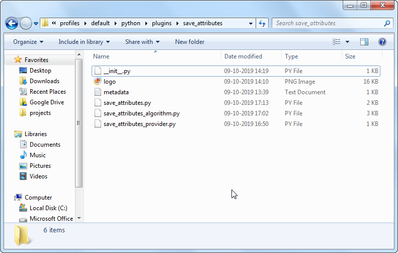{fig-align="center" width="75%"}

Reinicie QGIS y habilite el complemento desde **Plugins (Complementos) &rarr; Manage and Install plugins... (Administrar e instalar complementos...) &rarr; Installed (Instalados) &rarr; Save Attributes**.

Una vez cargado, es posible hacer clic en el botón de la barra de herramientas o en **Plugin (Complemento) &rarr; Save Attributes &rarr; Save Attributes As CSV** para ejecutar el algoritmo de procesamiento.

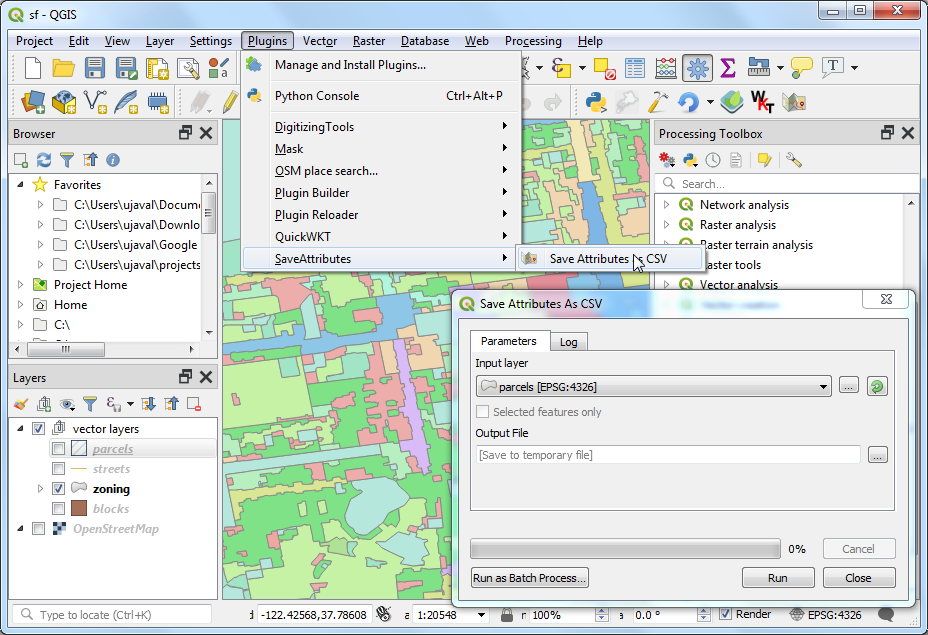{fig-align="center" width="75%"}


#### Arquitectura y jerarquía del complemento

El empaquetamiento requiere una estructura de archivos altamente desacoplada donde cada componente asume un rol específico en el ciclo de vida de la aplicación, desde el registro de metadatos hasta la inyección de algoritmos en el registro global de procesamiento.

```{mermaid}
%%| fig-align: center
%%| out-width: 100%

graph TD
    %% Estilos de alto contrato
    classDef file fill:#ffffff,stroke:#2c3e50,stroke-width:1px,color:#2c3e50,font-family:monospace,font-size:12px;
    classDef action fill:#e1f5fe,stroke:#0288d1,stroke-width:2px,color:#01579b;
    classDef registry fill:#fff3e0,stroke:#e65100,stroke-width:2px,color:#e65100;

    %% Declaración de archivos
    META["metadata.txt<br/>(Metadatos de registro)"]:::file
    INIT_PY["__init__.py<br/>(Factoría de clase)"]:::file
    PLUGIN["save_attributes.py<br/>(Controlador GUI)"]:::file
    PROVIDER["save_attributes_provider.py<br/>(Contenedor de algoritmos)"]:::file
    ALGO["save_attributes_algorithm.py<br/>(Lógica del proceso)"]:::file

    %% Flujo de carga
    META -.->|Identificación| QGM["Gestor de Complementos"]
    QGM --> INIT_PY
    INIT_PY -->|Instancia| PLUGIN
    
    subgraph SG1 ["Ciclo de registro en Procesamiento"]
        PLUGIN -->|Llama a| PROVIDER
        PROVIDER -->|Registra| ALGO
    end

    %% Interacción con el núcleo
    SG1 -->|Inyección| REG["QgsApplication.processingRegistry()"]:::registry
    REG -->|Disponibilidad| TOOL["Processing Toolbox"]:::action

    %% Estilo del contenedor
    style SG1 fill:#fcfcfc,stroke:#dcdcdc,stroke-width:1px,color:#666666
```


#### Resumen sintáctico del sistema de archivos

El empaquetamiento funcional se basa en la correcta comunicación entre los componentes de la interfaz de usuario y los proveedores de datos del framework de procesamiento.

| Archivo | Rol técnico | Descripción y lógica de integración |
| :--- | :--- | :--- |
| **`metadata.txt`** | Descriptor de sistema | Contiene la definición mínima requerida por QGIS para indexar el complemento en el repositorio oficial y local. |
| **`__init__.py`** | Punto de entrada | Implementa `classFactory(iface)`, permitiendo que QGIS genere el objeto controlador del plugin al arranque. |
| **`save_attributes.py`** | Clase controladora | Gestiona la creación de menús e iconos, y orquesta el registro del proveedor en el `processingRegistry()`. |
| **`save_attributes_provider.py`** | Proveedor de geoprocesos | Hereda de `QgsProcessingProvider`. Actúa como el namespace que agrupa uno o varios algoritmos bajo una categoría común. |
| **`save_attributes_algorithm.py`** | Algoritmo de procesamiento | Implementa la lógica CRUD y de persistencia definida mediante la herencia de `QgsProcessingAlgorithm`. |
| **`logo.png`** | Recurso iconográfico | Imagen que proporciona identidad visual al algoritmo tanto en la barra de herramientas como en la Toolbox. |

#### Consideraciones sobre el despliegue

La implementación final mediante `processing.execAlgorithmDialog()` garantiza que el complemento invoque el diálogo de parámetros estandarizado de QGIS. Al desacoplar el proveedor del controlador de la interfaz, se asegura que el algoritmo permanezca accesible desde la consola de Python o el modelador gráfico, incluso si los elementos de la interfaz de usuario (menús/iconos) son removidos.

Para asegurar la correcta actualización de estos componentes durante el desarrollo, se recomienda el uso sistemático de **Plugin Reloader**, lo que evita reinicios innecesarios de la sesión de trabajo.