---
title: "Personalizar QGIS con Python - Segunda Parte"
author: "Alexys H. Rodríguez-Avellaneda, PhD"
date: last-modified
format:
  html:
    toc: true
    code-fold: true
    embed-resources: true
    theme: cosmo
  pdf:
    keep-tex: true       # Esta es la etiqueta que buscas
    toc: true
    number-sections: true
    colorlinks: true
    papersize: letter
    #mermaid-format: png
    # Forzamos a Quarto a usar nuestro wrapper
    #chrome: /usr/local/bin/quarto-browser
execute-dir: project # Asegura contexto limpio
execute:
  cache: true        # Guarda los resultados en disco, si el código no cambia, no lo recalcula.
  freeze: auto       # Evita recompilar el código de capítulos anteriores si solo cambiaste texto.
  echo: true
  warning: false
  message: false
  daemon: false      # Evita que procesos en segundo plano interfieran
  enabled: true      # Asegura la ejecución
engine: knitr
---


> Este contenido fue creado a partir del curso 
> *Customizing QGIS with Python Course* by Ujaval Gandhi
> [www.spatialthoughts.com](https://spatialthoughts.com) 
> [pyQGIS Master Class](https://courses.spatialthoughts.com/pyqgis-masterclass.html)


# 12. Acciones en QGIS

Las [Acciones (Actions)](https://docs.qgis.org/testing/en/docs/user_manual/working_with_vector/vector_properties.html#actions-properties) en QGIS proporcionan un método ágil para activar comportamientos personalizados en respuesta a una interacción del usuario, como hacer clic en un objeto espacial en el Map canvas (Lienzo del mapa) o en un valor de atributo en la Attribute table (Tabla de atributos). Las acciones se definen para una capa específica y se almacenan en los proyectos de QGIS. Esto convierte a las acciones en la forma más sencilla de añadir y distribuir personalizaciones de QGIS sin necesidad de desarrollar complementos.

## 12.1 Hola mundo

Se inicia con el aprendizaje de los fundamentos de las Acciones (Actions) en QGIS. Se creará una acción que utilice una capa de todos los países del mundo y permita extraer el polígono de cualquier país al hacer clic sobre este.

1. Abra QGIS. El software incluye algunos *Easter Eggs* (Huevos de pascua) ocultos que se activan al escribir una palabra clave en la Coordinate box (Caja de coordenadas) en la parte inferior de la ventana principal. Aunque muchos son decorativos, algunos ofrecen funcionalidades útiles. Una de estas características es la capacidad de cargar un mapa mundial. Ingrese la palabra clave **world** en la caja de coordenadas y presione *Enter*.

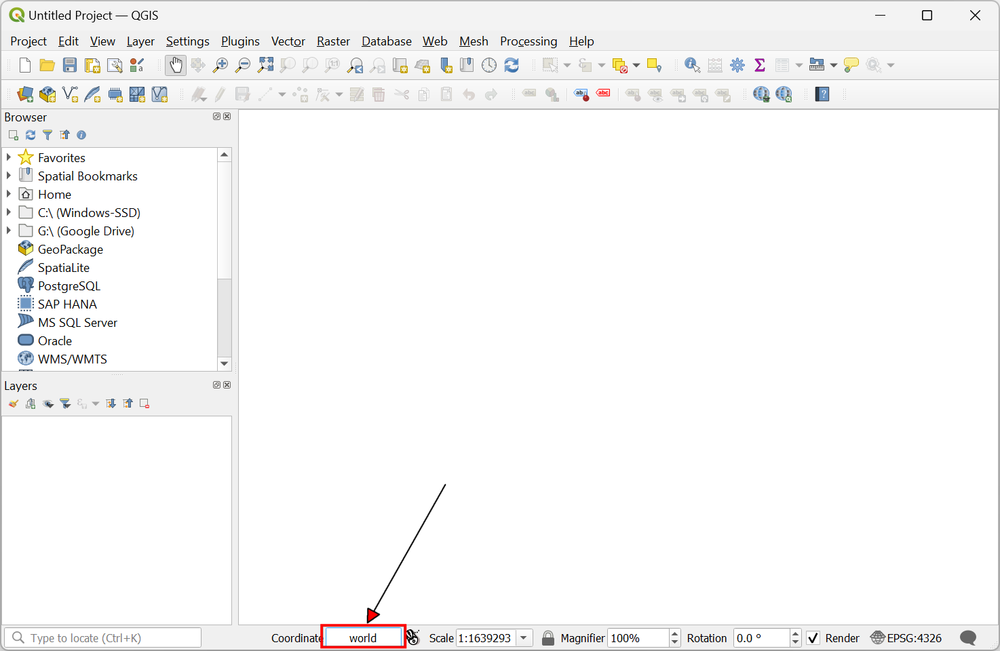{fig-align="center" width="75%"}

2. Se añadirá una nueva capa denominada `World Map` al Layers panel (Panel de capas). Esta capa corresponde al conjunto de datos de límites [Admin0 - Countries](https://www.naturalearthdata.com/downloads/10m-cultural-vectors/) de Natural Earth. Proceda a definir una acción en esta capa. Haga clic derecho en la capa y seleccione Properties (Propiedades).

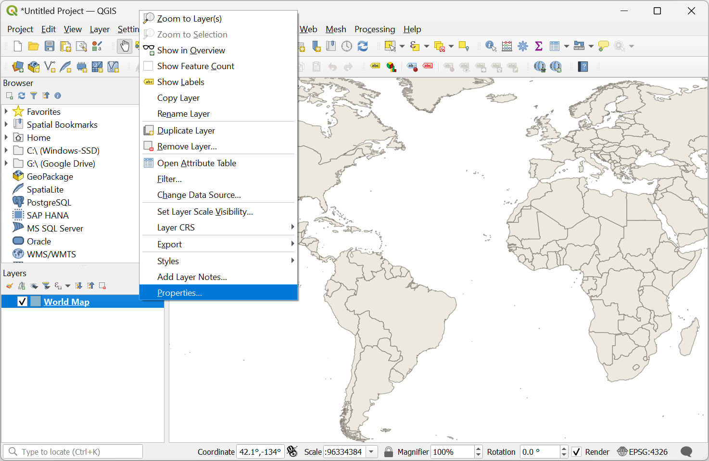{fig-align="center" width="75%"}

3. Diríjase a la Actions tab (Pestaña de acciones) y haga clic en el botón Add a new action (Añadir una nueva acción) (+).

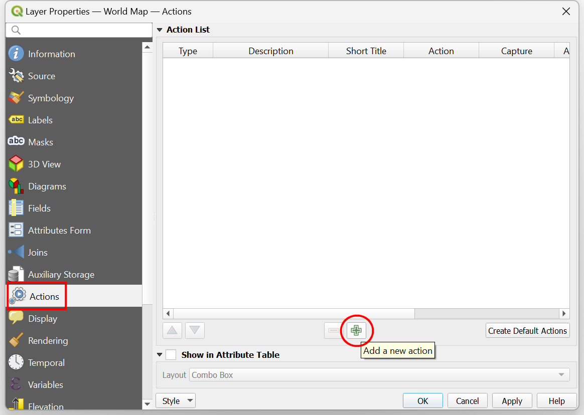{fig-align="center" width="75%"}

4. Seleccione **Python** como el Type (Tipo). Ingrese **Hello World** como la Description (Descripción); este será el nombre de la acción tal como aparecerá en los menús. Mantenga los Action Scopes (Ámbitos de la acción) en los valores predeterminados: **Feature (Objeto espacial)** y **Canvas (Lienzo)**. En el campo Action Text (Texto de la acción), ingrese el siguiente código Python y haga clic en OK (Aceptar).

```python
print('Hello World')
```

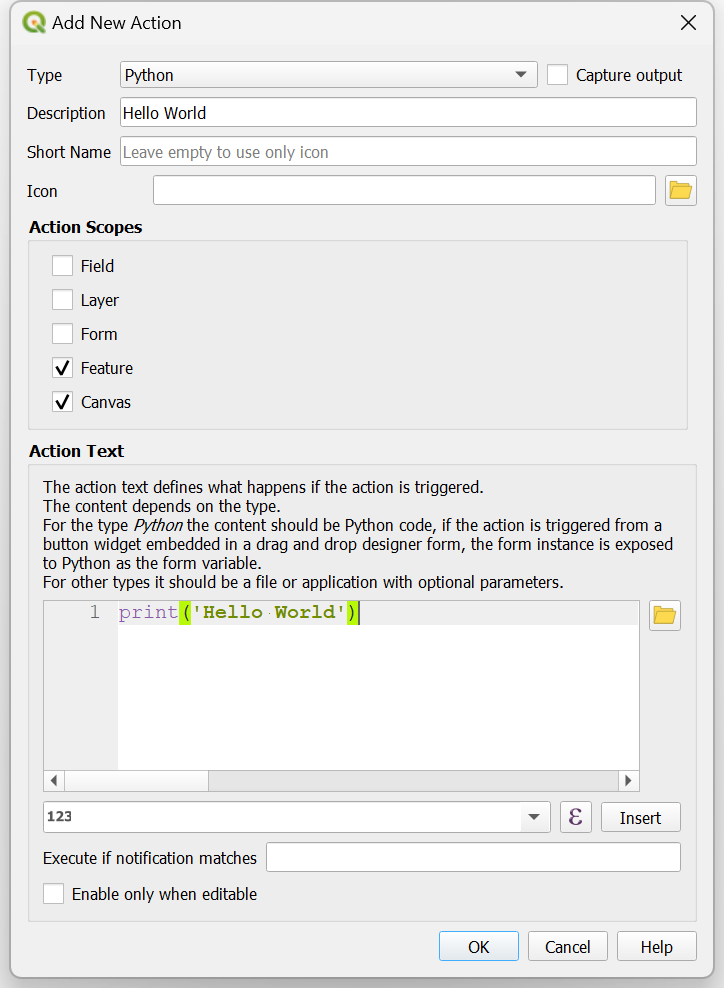{fig-align="center" width="60%"}

5. Haga clic en OK (Aceptar) nuevamente para regresar al Map canvas (Lienzo del mapa). Se ha configurado una acción que imprimirá `Hello World` al hacer clic en un objeto. Para visualizar el resultado, abra la Python Console (Consola de Python) desde **Plugins (Complementos) &rarr; Python Console (Consola de Python)**. Localice el botón de Actions (Acciones) en la Attributes Toolbar (Barra de herramientas de atributos). Haga clic en el menú desplegable junto al botón y seleccione *Hello World*.

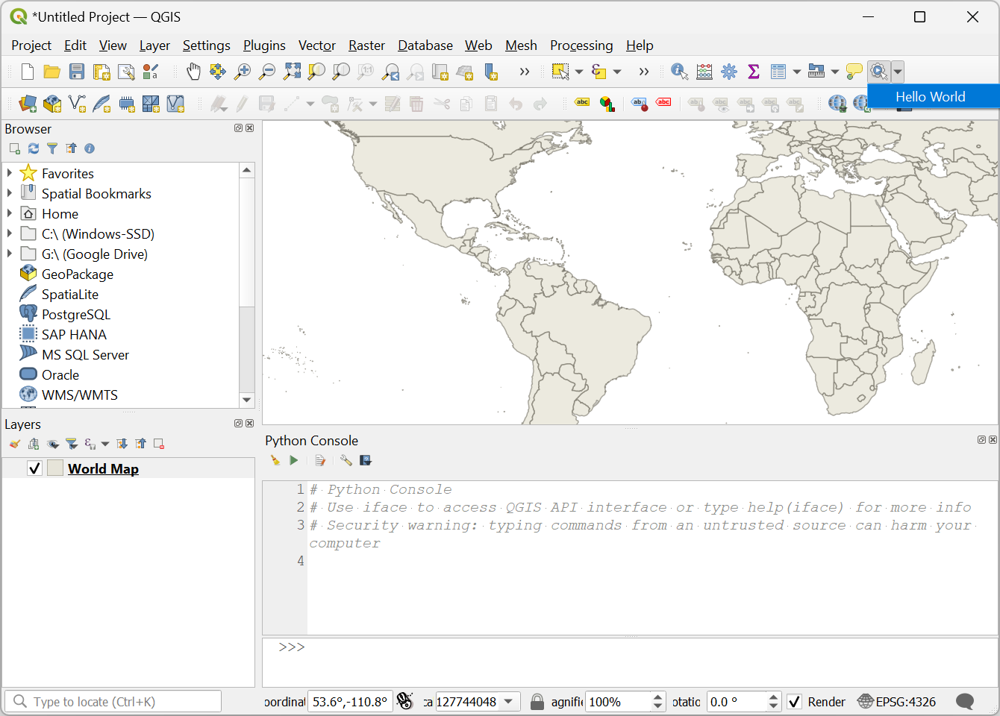{fig-align="center" width="75%"}

6. Una vez seleccionada la acción, haga clic en cualquier objeto espacial de la capa. Se observará el texto *Hello World* impreso en la consola.

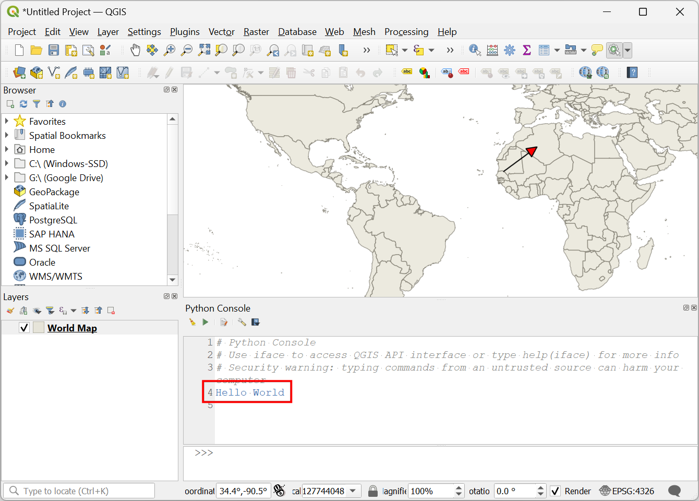{fig-align="center" width="75%"}

7. Con el conocimiento sobre cómo definir y activar una acción de Python, se procederá a dotarla de mayor utilidad. En lugar de imprimir un texto estático, se modificará la acción para que imprima el nombre del país seleccionado. Abra la Attribute table (Tabla de atributos) de la capa `World Map`. Se observará que el atributo **NAME** contiene los nombres de los países.

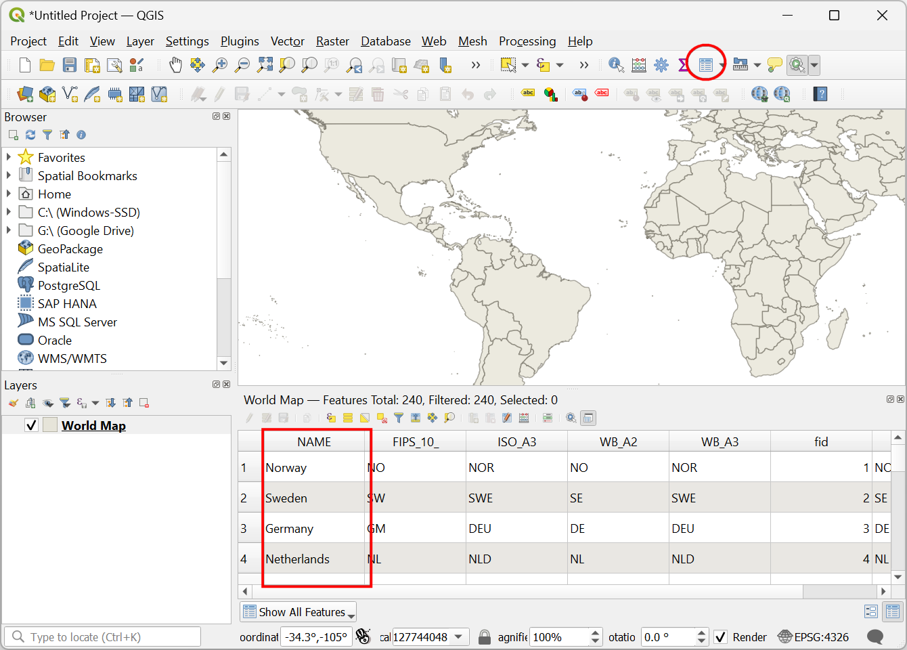{fig-align="center" width="75%"}

8. Haga clic derecho en la capa `World Map` y seleccione Properties (Propiedades). En la Actions tab (Pestaña de acciones), haga doble clic en la acción *Hello World* definida previamente.

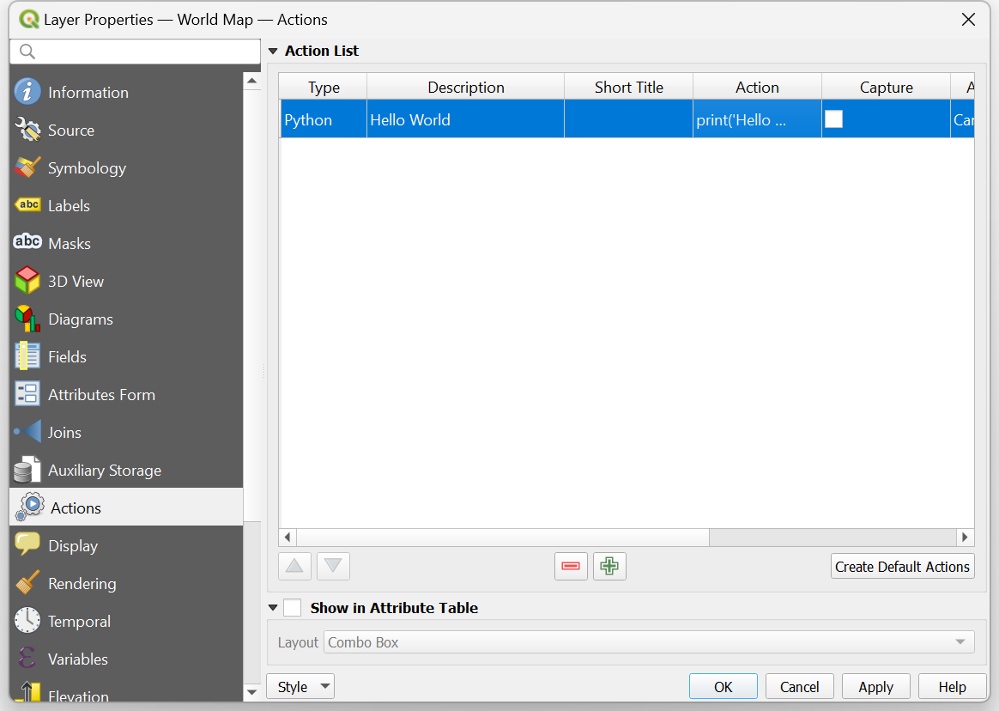{fig-align="center" width="75%"}

9. La acción se activa al hacer clic en un objeto espacial y permite acceder a sus atributos. Seleccione el atributo **NAME** y haga clic en Insert (Insertar).

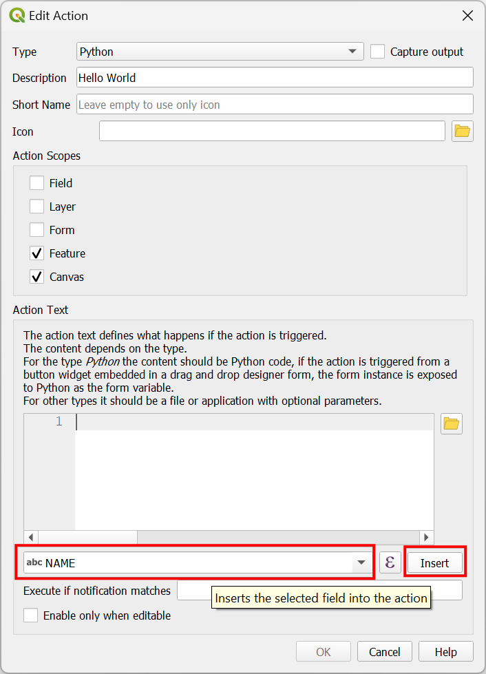{fig-align="center" width="60%"}

10. Se visualizará el valor `[%NAME%]` en el cuadro de texto Action Text (Texto de la acción). Esta es una sintaxis de expresión especial que indica que el valor delimitado por `[%` y `%]` será reemplazado por el valor del atributo del objeto espacial al activar la acción.

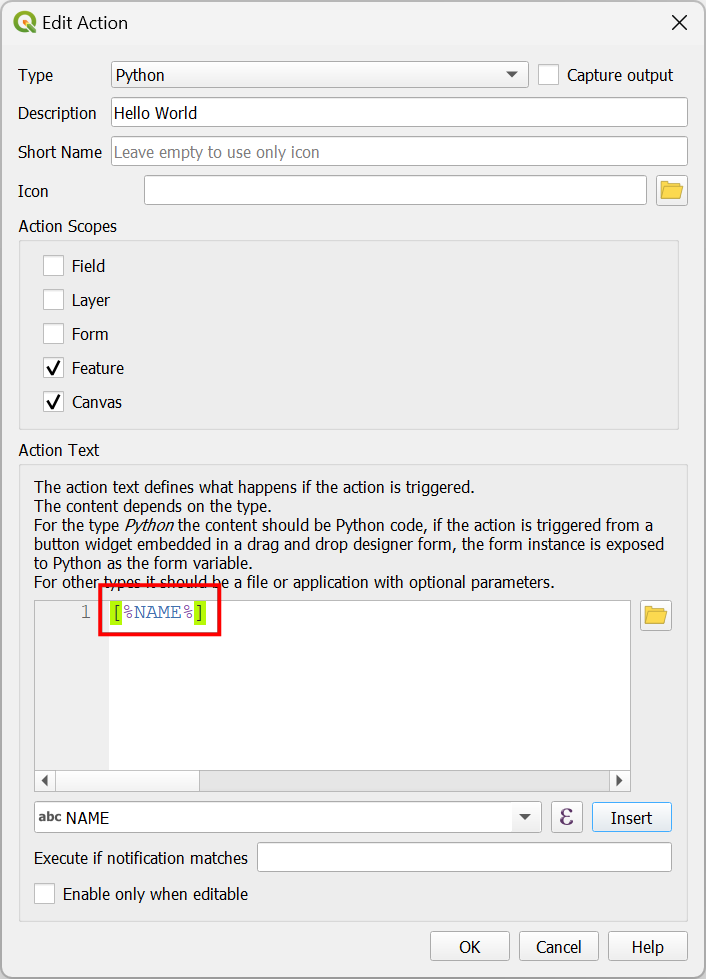{fig-align="center" width="60%"}

11. Actualice el código para imprimir el valor del atributo como se muestra a continuación.

```python
print('[%NAME%]')
```

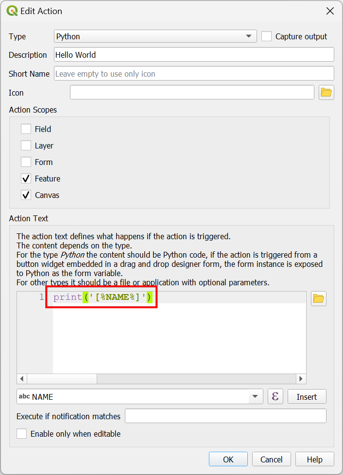{fig-align="center" width="60%"}

12. Haga clic en OK (Aceptar) y regrese a la ventana principal. Seleccione la acción y haga clic en cualquier objeto. El nombre del país se imprimirá en la consola.

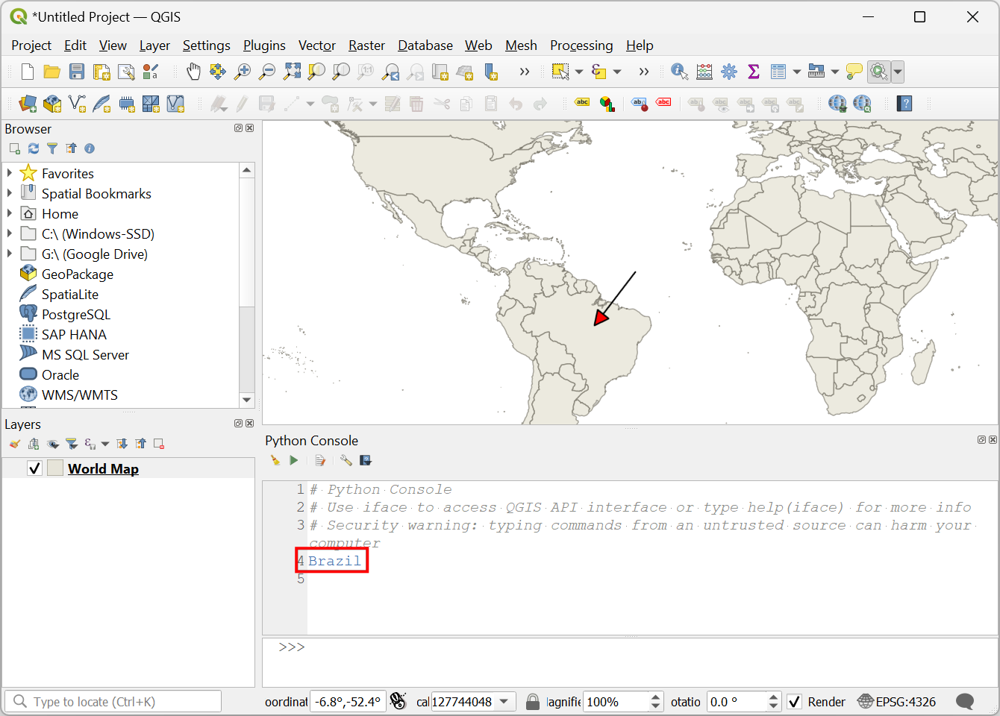{fig-align="center" width="75%"}

13. Además de los atributos del objeto espacial seleccionado, se tiene acceso a otras variables del proyecto y de la capa. Actualice el código para imprimir los valores de ID del objeto y de la capa junto con el atributo `NAME`. Se utilizan las f-strings de Python para el formato de salida.

```python
feature_name = '[%NAME%]'
feature_id = [%$id%]
layer_id = '[%@layer_id%]'
print(f'feature name: {feature_name}')
print(f'feature id: {feature_id}')
print(f'layer id: {layer_id}')
```

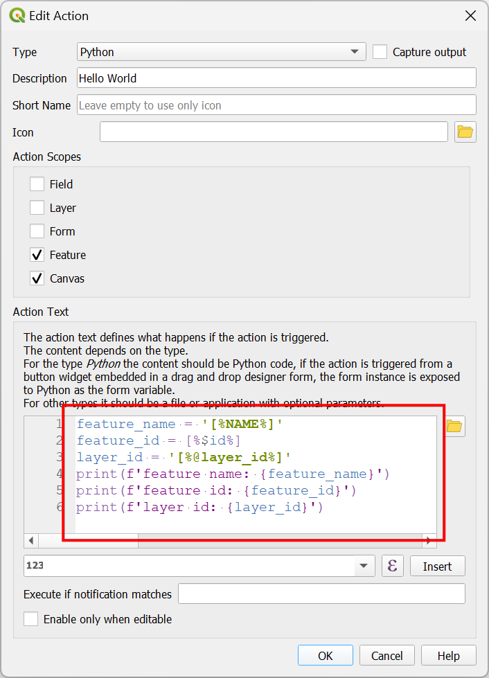{fig-align="center" width="60%"}

14. Haga clic en OK (Aceptar) y pruebe la acción nuevamente. Se visualizarán los identificadores correspondientes junto al nombre del objeto espacial.

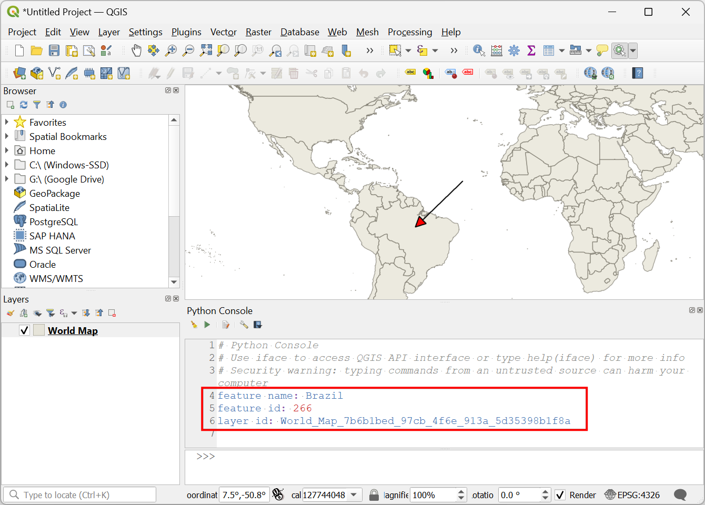{fig-align="center" width="75%"}

15. Con el acceso a los valores de `@layer_id` y `$id`, es posible extraer el objeto espacial actual y generar una nueva capa. Reemplace el Action Text (Texto de la acción) con el siguiente código, el cual emplea el método [`QgsFeatureSource.materialize()`](https://qgis.org/pyqgis/3.44/core/QgsFeatureSource.html#qgis.core.QgsFeatureSource.materialize) para crear una nueva capa vectorial en memoria con el objeto filtrado por su ID.

```python
feature_name = '[%NAME%]'
feature_id = [%$id%]
layer_id = '[%@layer_id%]'

layer = QgsProject.instance().mapLayer(layer_id)
new_layer = layer.materialize(
    QgsFeatureRequest().setFilterFids([feature_id]))
new_layer.setName(feature_name)
QgsProject.instance().addMapLayer(new_layer)
```

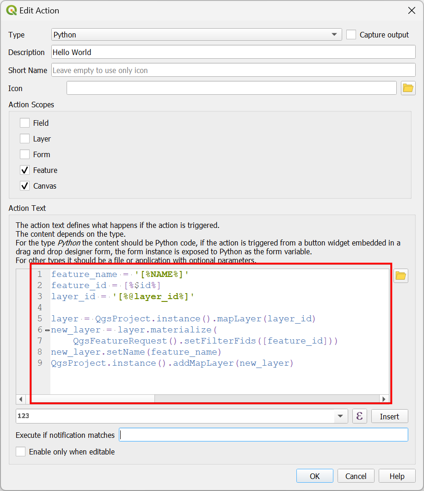{fig-align="center" width="60%"}

16. Regrese al Map canvas (Lienzo del mapa) y cierre la Python Console (Consola de Python). Seleccione la acción *Hello World* y haga clic en cualquier objeto. Se añadirá una nueva capa al Layers panel (Panel de capas) que contiene únicamente el objeto seleccionado.

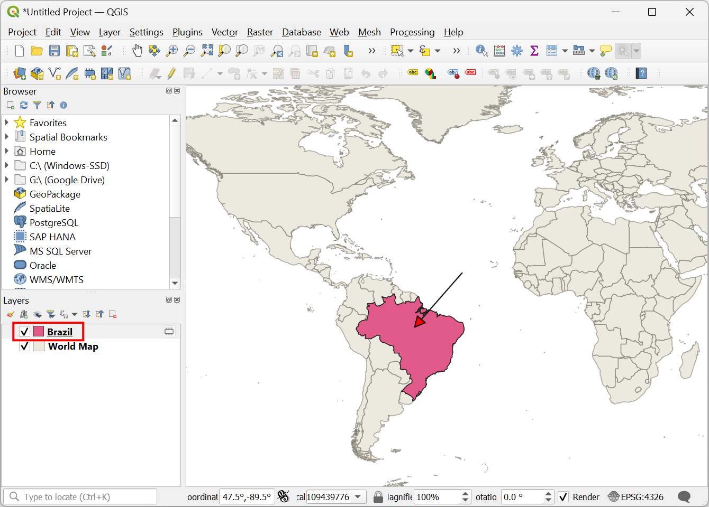{fig-align="center" width="75%"}

17. Existe una limitación: al crearse y añadirse la nueva capa, esta se convierte en la Active layer (Capa activa). Para activar la acción nuevamente, se debe seleccionar de nuevo la capa `World Map`. Para evitar este paso manual, se puede utilizar el método [`QgisInterface.setActiveLayer()`](https://qgis.org/pyqgis/3.44/gui/QgisInterface.html#qgis.gui.QgisInterface.setActiveLayer). Se importa `iface` en el código para acceder a la instancia actual de la clase `QgisInterface`.

```python
from qgis.utils import iface

feature_name = '[%NAME%]'
feature_id = [%$id%]
layer_id = '[%@layer_id%]'

layer = QgsProject.instance().mapLayer(layer_id)
new_layer = layer.materialize(
    QgsFeatureRequest().setFilterFids([feature_id]))
new_layer.setName(feature_name)
QgsProject.instance().addMapLayer(new_layer)
iface.setActiveLayer(layer)
```

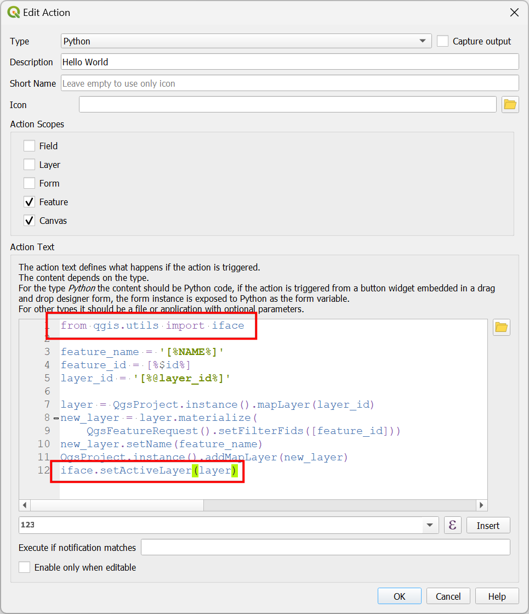{fig-align="center" width="60%"}

18. Ahora es posible extraer múltiples países de forma consecutiva sin necesidad de cambiar manualmente de capa.

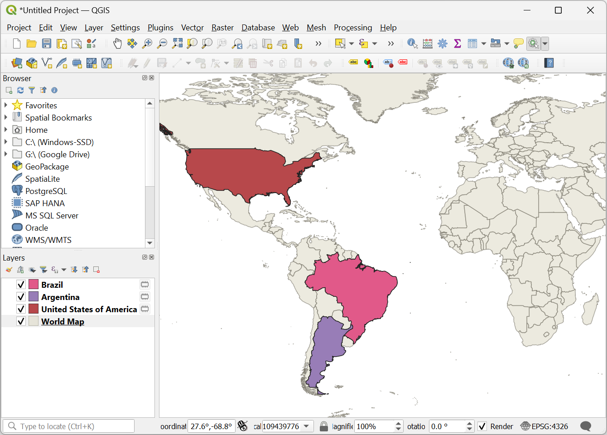{fig-align="center" width="75%"}


# Ejercicio 10

Actualice la acción para mostrar un mensaje de *Info* (Información) en la Message bar (Barra de mensajes) de QGIS, como se ilustra a continuación.

Sugerencia: Se puede utilizar el método [iface.messageBar().pushInfo()](https://qgis.org/pyqgis/3.0/gui/Message/QgsMessageBar.html#qgis.gui.QgsMessageBar.pushInfo) para desplegar un mensaje.

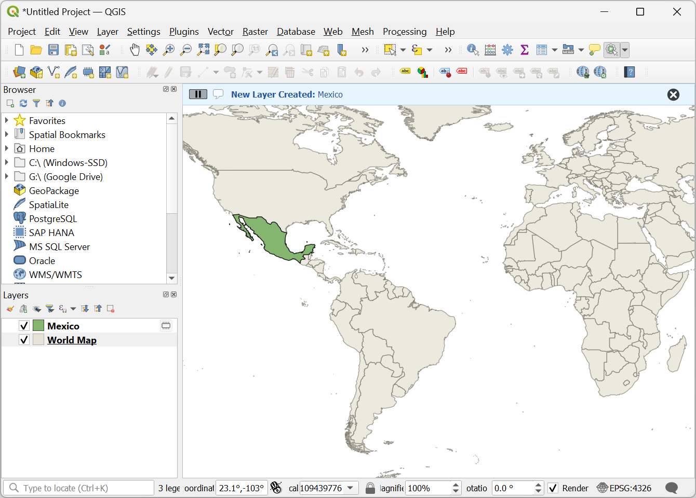{fig-align="center" width="75%"}

## 12.2 Selección de vecinos

En esta sección, se trabajará con un conjunto de datos de los estados de EE. UU. y se implementarán Acciones de QGIS para seleccionar fácilmente los vecinos de cualquier estado.

1. Localice el archivo `neighbors.gpkg` del paquete de datos en el Browser panel (Panel de explorador). Expándalo y haga clic en el proyecto `neighbors.qgz` para abrirlo.

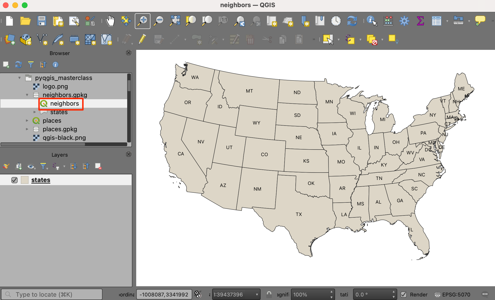{fig-align="center" width="75%"}

2. Haga clic derecho en la capa `states` y seleccione Properties (Propiedades).

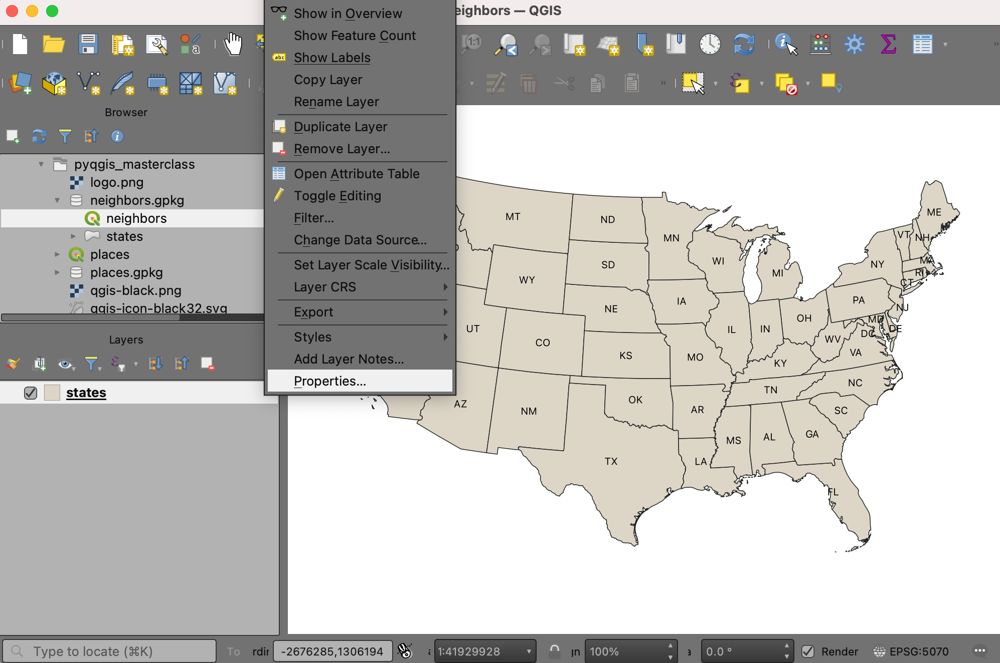{fig-align="center" width="75%"}

3. Diríjase a la Actions tab (Pestaña de acciones) y haga clic en el botón Add a new action (Añadir una nueva acción) (+). Seleccione **Python** como Type (Tipo). Ingrese **Select First-degree Neighbors** como Description (Descripción). Mantenga los Action Scopes (Ámbitos de acción) en los valores predeterminados de **Feature** (Objeto espacial) y **Canvas** (Lienzo). En el campo Action Text (Texto de la acción), ingrese el siguiente código Python y haga clic en OK (Aceptar). Presione OK nuevamente para regresar al lienzo principal.

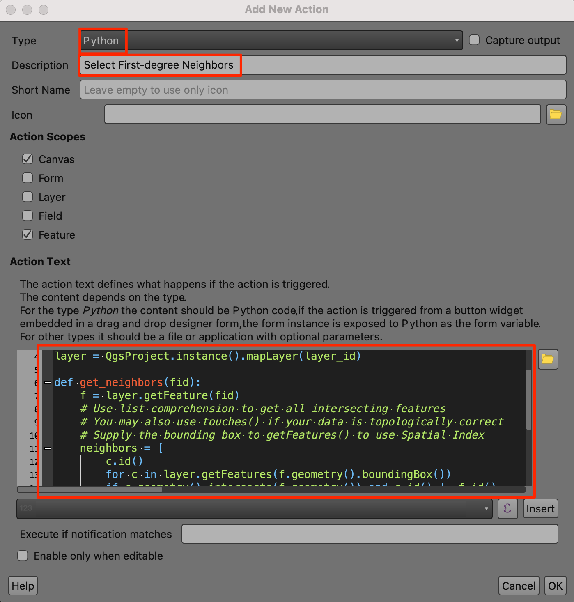{fig-align="center" width="60%"}

```python
#| eval: false
layer_id = '[%@layer_id%]'
fid = [% $id %]

layer = QgsProject.instance().mapLayer(layer_id)

def get_neighbors(fid):
    f = layer.getFeature(fid)
    # Uso de comprensión de listas para obtener objetos espaciales intersectados
    # Se puede usar touches() si los datos poseen corrección topográfica
    # Se provee el bounding box a getFeatures() para emplear el índice espacial
    neighbors = [
        c.id()
        for c in layer.getFeatures(f.geometry().boundingBox())
        if c.geometry().intersects(f.geometry()) and c.id() != f.id()
    ]
    return neighbors


first_degree_neighbors = get_neighbors(fid)

# Aplicación de la selección
layer.selectByIds(first_degree_neighbors)
```

4. Localice el botón de Actions (Acciones) en la Attributes Toolbar (Barra de herramientas de atributos). Active la acción *Select First-degree Neighbors* y haga clic en cualquier estado. Se observará la selección de todos los estados vecinos.

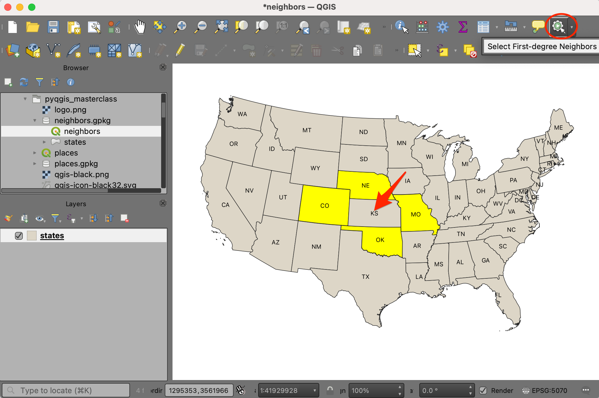{fig-align="center" width="75%"}

5. Es posible añadir una acción adicional para seleccionar vecinos de segundo grado (vecinos de los vecinos). Repita el procedimiento de clic derecho en la capa `states` y seleccione Properties (Propiedades). En la pestaña Actions (Acciones), añada una nueva acción de tipo **Python**. Ingrese **Select Second-degree Neighbors** como Description (Descripción). En el campo Action Text (Texto de la acción), ingrese el código siguiente y confirme con OK.

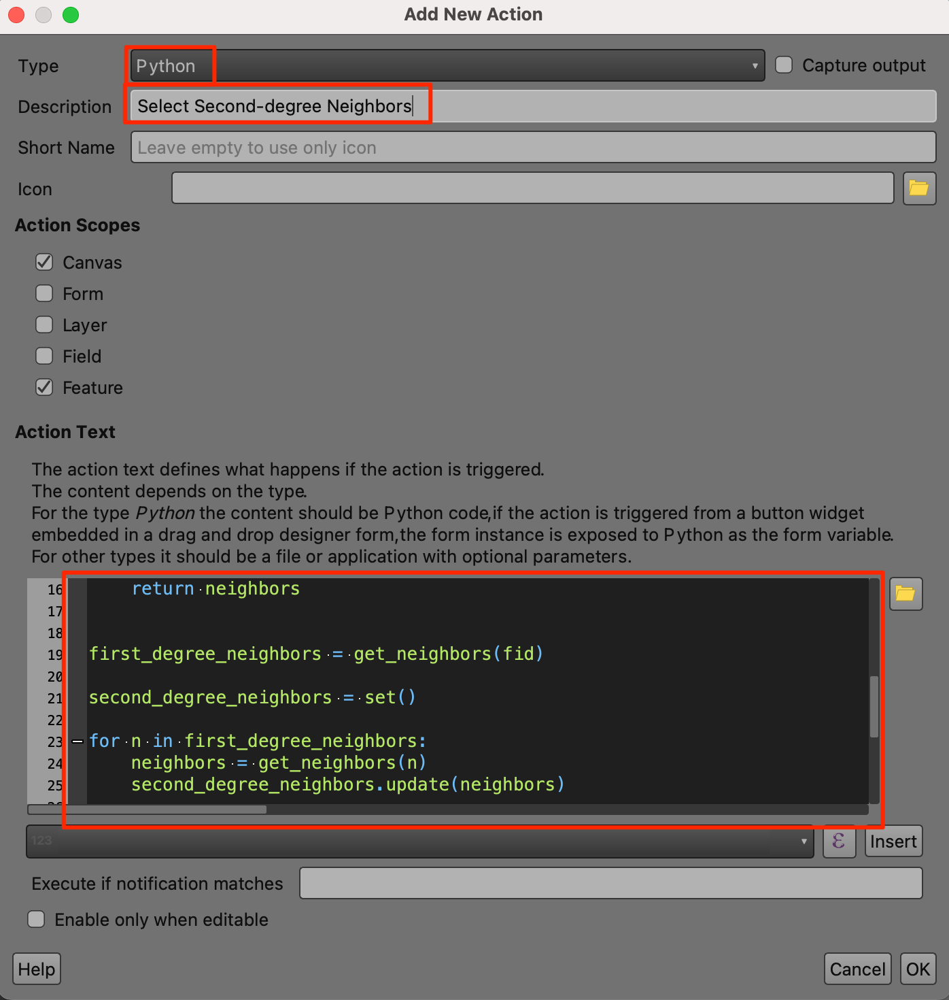{fig-align="center" width="60%"}

```python
#| eval: false
layer_id = '[%@layer_id%]'
fid = [% $id %]

layer = QgsProject.instance().mapLayer(layer_id)

def get_neighbors(fid):
    f = layer.getFeature(fid)
    neighbors = [
        c.id()
        for c in layer.getFeatures(f.geometry().boundingBox())
        if c.geometry().intersects(f.geometry()) and c.id() != f.id()
    ]
    return neighbors


first_degree_neighbors = get_neighbors(fid)

second_degree_neighbors = set()

for n in first_degree_neighbors:
    neighbors = get_neighbors(n)
    second_degree_neighbors.update(neighbors)

# Eliminación de vecinos de primer grado del conjunto
second_degree_neighbors = second_degree_neighbors.difference(
    set(first_degree_neighbors))
    
# Eliminación del objeto espacial inicial del conjunto en caso de existir
second_degree_neighbors.discard(fid)

# Aplicación de la selección
layer.selectByIds(list(second_degree_neighbors))
```

6. Active la acción *Select Second-degree Neighbors* desde la barra de herramientas y haga clic en un estado. Se observará la selección de los vecinos de segundo grado.

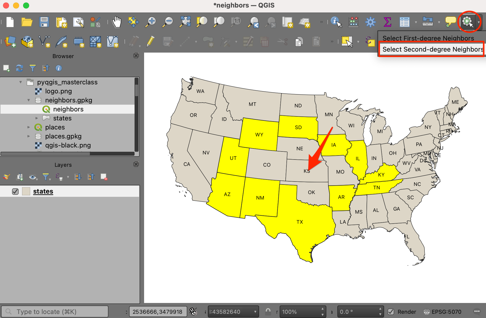{fig-align="center" width="75%"}

## Ejercicio 11

Al ejecutar la acción nuevamente, la selección actual se descarta para generar una nueva. Se requiere modificar este comportamiento para añadir elementos a la selección existente. Actualice el código de la acción *Select Second-degree Neighbors* para que, al ejecutarse, los vecinos de segundo grado se sumen a los objetos ya seleccionados.

Sugerencia: Provea una opción de comportamiento adicional para el método [`QgsVectorLayer.selectByIds()`](https://qgis.org/pyqgis/3.44/core/QgsVectorLayer.html#qgis.core.QgsVectorLayer.selectByIds).

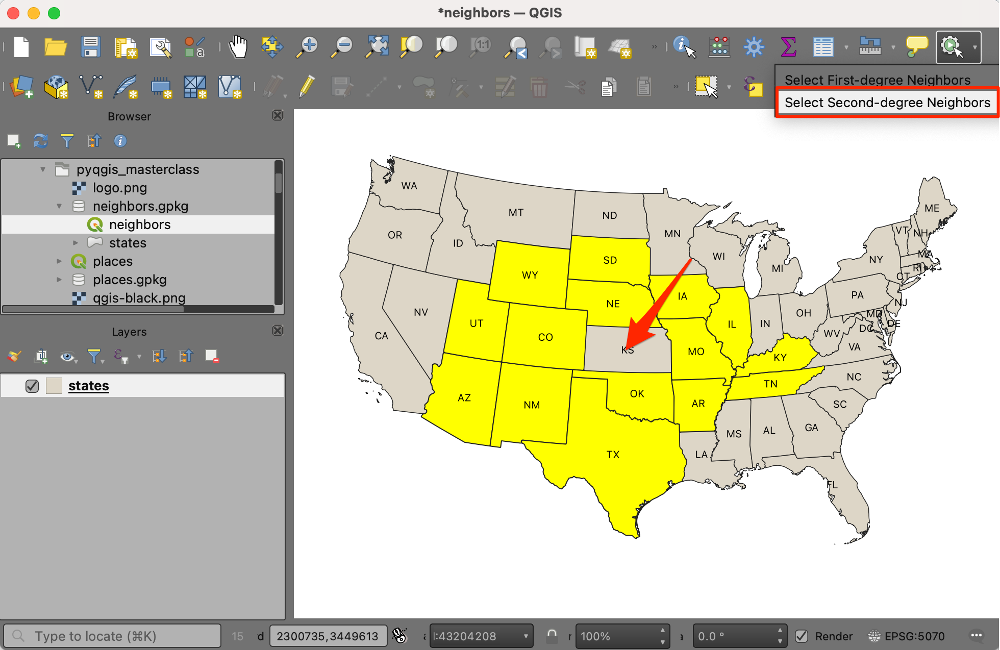{fig-align="center" width="75%"}

## 12.3 Más información

En caso de requerir profundizar en el potencial de las acciones de QGIS, se recomienda consultar el [taller completo de Acciones de QGIS](https://courses.spatialthoughts.com/qgis-actions.html), el cual aborda múltiples ejemplos prácticos sobre automatización de tareas mediante el uso de Acciones.


# 13. Escritura de Scripts de Python Independientes

La ejecución de scripts de Python dentro de QGIS es de gran utilidad en la mayoría de los escenarios. No obstante, existe la posibilidad de desarrollar scripts que funcionen en el sistema sin necesidad de mantener la interfaz de QGIS abierta. La capacidad de ejecutar scripts de PyQGIS en modo headless (sin interfaz gráfica) permite automatizar flujos de trabajo en servidores sin intervención humana. En esta sección se utilizarán algoritmos de procesamiento de QGIS para realizar estadísticas de zona mediante un script de Python independiente.

Se debe crear un archivo nuevo con el código siguiente y guardarlo como `zonal_stats.py`.

```python
#| file: code/pyqgis/zonal_stats.py
```

Se observará que el script posee componentes notables. 

*   En primer lugar, se encuentra la sentencia de importación en la parte superior para cargar explícitamente los módulos requeridos. 
*   A continuación, se crea una instancia de la clase `QgsApplication` y se ejecuta el método `initQgis()` para cargar los proveedores de datos y el registro de capas de QGIS. 
*   También se importa el módulo `Processing` y se procede a su inicialización. 
*   Finalmente, se llama a `exitQgis()` para liberar los recursos de la memoria. 

Se han codificado de forma fija las rutas de las capas de entrada, aunque estas pueden capturarse como banderas de línea de comandos utilizando el módulo [argparse](https://docs.python.org/3/library/argparse.html) de Python. Asimismo, al no contar con la GUI (Interfaz gráfica de usuario) de QGIS, no es posible mostrar mensajes, por lo que dichas sentencias se han omitido.

Al ejecutar el script dentro de QGIS, todas las rutas a las librerías y las variables de entorno ya están configuradas, lo que permite que Python las localice. Sin embargo, al ejecutar el script de forma externa, es necesario configurarlas manualmente. Si se utilizan algoritmos de procesamiento, se debe asegurar que la ruta a la carpeta del complemento core (núcleo) esté incluida en la variable de entorno PYTHONPATH.

La configuración del entorno recomendada gestiona todos los requerimientos y permite ejecutar scripts de PyQGIS con facilidad. Las siguientes secciones describen esta configuración para diversas plataformas.

> Es posible que se deban ajustar estas rutas ligeramente según la ubicación de instalación de QGIS. Los siguientes scripts asumen el uso de QGIS-LTR instalado en la ruta predeterminada.

## Configuración en Windows

En Windows, este proceso puede realizarse mediante un archivo por lotes (batch file). Se debe crear un archivo nuevo llamado `run_script.bat` con el código siguiente, asegurando su almacenamiento en el mismo directorio.

```bash
#| file: code/pyqgis/run_script.bat
```

Abra el Command prompt (Símbolo del sistema), navegue hasta el directorio que contiene los archivos mencionados, escriba `run_script.bat` y presione Enter.

> También es posible ejecutar el archivo mediante doble clic, pero no se visualizarán mensajes de error o de éxito. Por lo tanto, se recomienda ejecutar el script desde el Shell (Intérprete de comandos).

El script se ejecutará y generará la salida en la ruta especificada.

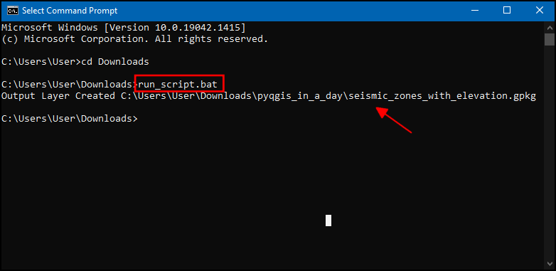{fig-align="center" width="75%"}

La capa vectorial resultante poseerá una columna adicional con las estadísticas del ráster.

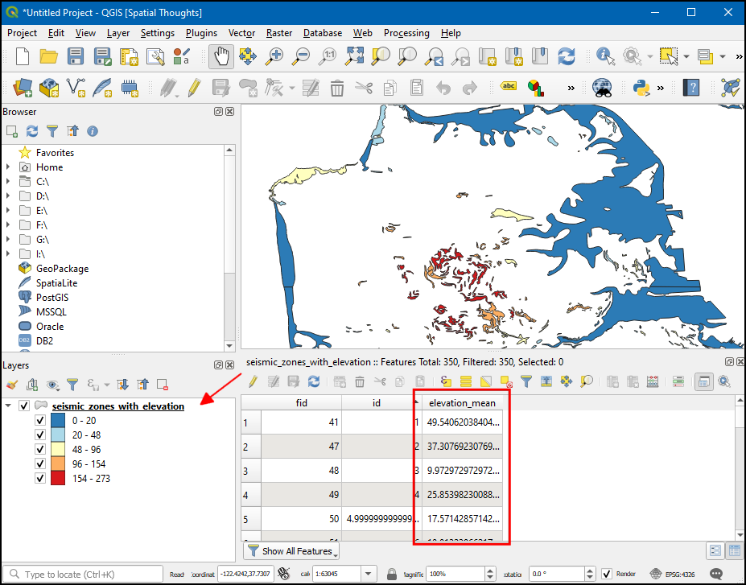{fig-align="center" width="75%"}

## Configuración en MacOS

En MacOS, es posible configurar las variables de entorno requeridas y ejecutar el proceso mediante un script de shell. Cree un archivo llamado `run_script.sh` y guárdelo en el mismo directorio que el script principal.

```bash
#| file: code/pyqgis/run_script.sh
```

Abra una Terminal y navegue hasta el directorio del script. Escriba `bash run_script.sh` y presione Enter. El script procesará los datos y generará el resultado en la ruta definida.

## Configuración en Linux/Conda

La forma más sencilla y recomendada de ejecutar un script de PyQGIS independiente es desde un entorno de Conda. Este método requiere una configuración mínima. Se puede seguir la guía de [Instalación de QGIS vía Conda](install-qgis-ltr.html#install-qgis-via-conda).

> Los paquetes de Conda están disponibles para todas las plataformas, por lo que este método también es aplicable en MacOS o Windows.

Una vez instalado, active el entorno y ejecute el script de la siguiente manera:

```bash
python3 zonal_stats.py
```


# 14. Integración con Entornos de Desarrollo de Python

## Uso de la API de PyQGIS en Jupyter Notebook

El código a continuación muestra cómo utilizar la API de PyQGIS desde un Jupyter Notebook.

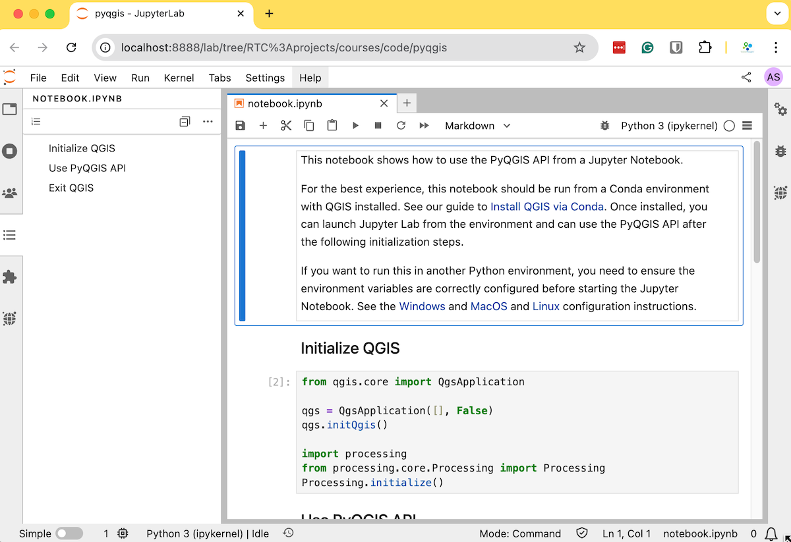{fig-align="center" width="75%"}


Para obtener el mejor rendimiento, se recomienda ejecutar este cuaderno desde un Conda environment (Entorno de conda) con QGIS instalado. Es posible iniciar Jupyter Lab desde dicho entorno y utilizar la API de PyQGIS tras realizar los pasos de inicialización que se detallan a continuación.

Si se desea ejecutar este proceso en otro entorno de Python, es necesario asegurar que las variables de entorno estén configuradas correctamente antes de iniciar el Jupyter Notebook. Consulte las instrucciones de configuración para 

* [Windows](https://courses.spatialthoughts.com/pyqgis-masterclass.html#windows-configuration), 
* [MacOS](https://courses.spatialthoughts.com/pyqgis-masterclass.html#macos-configuration) y 
* [Linux](https://courses.spatialthoughts.com/pyqgis-masterclass.html#linuxconda-configuration).

### Inicialización de QGIS

```python
from qgis.core import QgsApplication

qgs = QgsApplication([], False)
qgs.initQgis()

import processing
from processing.core.Processing import Processing
Processing.initialize()
```

### Uso de la API de PyQGIS

Una vez finalizada la inicialización, es posible utilizar todas las clases y métodos de PyQGIS.

```python
from qgis.core import QgsDistanceArea, QgsPointXY

san_francisco = (37.7749, -122.4194)
new_york = (40.661, -73.944)

d = QgsDistanceArea()
d.setEllipsoid('WGS84')


lat1, lon1 = san_francisco
lat2, lon2 = new_york
point1 = QgsPointXY(lon1, lat1)
point2 = QgsPointXY(lon2, lat2)

distance = d.measureLine([point1, point2])
print('Ellipsoid Distance', distance/1000)
```

**Ellipsoid Distance 4145.446977549562**

### Finalización de la sesión de QGIS

```python
qgs.exitQgis()
```


## Uso de la API de PyQGIS en VS Code

La forma más sencilla de configurar Visual Studio Code para el desarrollo con PyQGIS consiste en iniciar el editor de código desde un entorno de conda con los paquetes requeridos instalados. Se sugiere consultar la guía para [Instalación de QGIS vía Conda](https://courses.spatialthoughts.com/install-qgis-ltr.html#install-qgis-via-conda). Una vez completada la instalación, es posible iniciar VS Code desde dicho entorno y comenzar a utilizar la API de PyQGIS. El completado de código funciona de manera inmediata sin necesidad de configuración adicional. Alexandre Neto, co-mantenedor de los paquetes de QGIS en conda, dispone también de una guía detallada para [Crear un entorno de desarrollo de PyQGIS usando Conda y VS Code](https://aneto.pt/posts/tutorials/2024-05-11-create-easy-pyqgis-developement-environment-using-conda-and-vscode/).

1. Activar el entorno de conda donde se instaló QGIS e iniciar Visual Studio Code mediante el comando `code`. Es posible que se deba [configurar el comando code](https://code.visualstudio.com/docs/setup/mac#_launch-vs-code-from-the-command-line) para la terminal correspondiente.

```bash
conda activate qgis_ltr
code
```

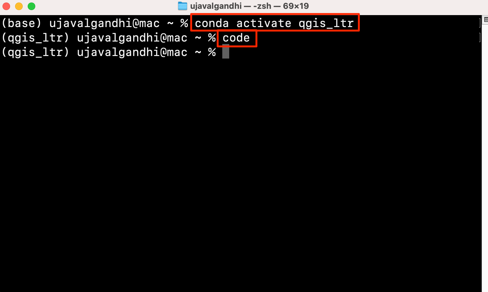{fig-align="center" width="75%"}

2. En Visual Studio Code, ya es posible importar y utilizar todas las clases de PyQGIS. Debido a que se emplean las clases fuera de una instancia de QGIS en ejecución, es imperativo añadir líneas de inicialización en los scripts y finalizar la sesión de QGIS al concluir. El siguiente fragmento de código demuestra la configuración requerida.

```python
#| eval: false
#| file: code/pyqgis/code.py
```

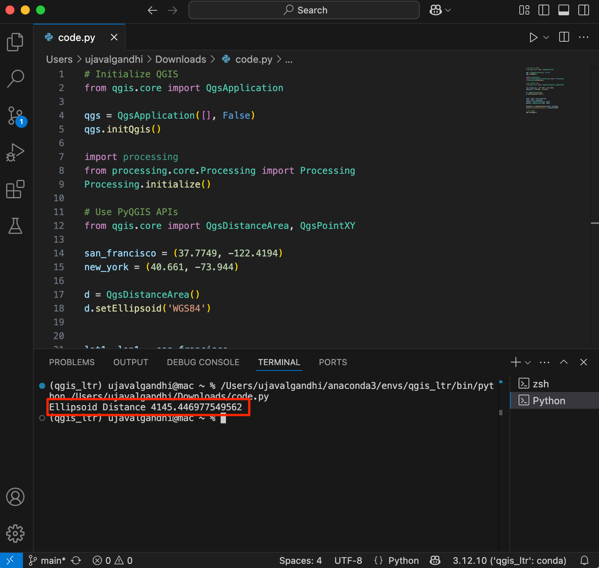{fig-align="center" width="75%"}

---

# Suplemento

Esta sección contiene fragmentos de código para operaciones comunes en PyQGIS.

Todos los fragmentos de código asumen la carga previa del proyecto `sf.qgz`. El proyecto puede cargarse mediante el siguiente código:

```python
#| eval: false
import os
data_dir = os.path.join(os.path.expanduser('~'), 'Downloads', 'pyqgis_masterclass')
project = QgsProject.instance()
project_name = 'sf.qgz'
project_path = os.path.join(data_dir, project_name)
project.read(project_path)
```

## Guardado del renderizado del mapa como una imagen

El método `saveAsImage()` es directo y sencillo; no obstante, ofrece un control limitado sobre el resultado final. No permite ajustar la resolución, el tamaño o la forma en que se renderiza cada capa. Existe un método alternativo que emplea las clases `QgsMapRendererParallelJob` y `QgsMapRendererSequentialJob` para obtener resultados superiores. El siguiente fragmento exporta una imagen de alta resolución del proyecto.

```python
#| eval: false
import os
data_dir = os.path.join(os.path.expanduser('~'), 'Downloads', 'pyqgis_masterclass')
image_name = 'sf_hires.png'
image_path = os.path.join(data_dir, image_name)

settings = iface.mapCanvas().mapSettings()
settings.setOutputSize(QSize(1000,1000))

settings.setFlag(QgsMapSettings.DrawLabeling, False)
settings.setFlag(QgsMapSettings.Antialiasing, True)

job = QgsMapRendererSequentialJob(settings)
job.start()
job.waitForFinished()
image = job.renderedImage()
image.save(image_path)
```

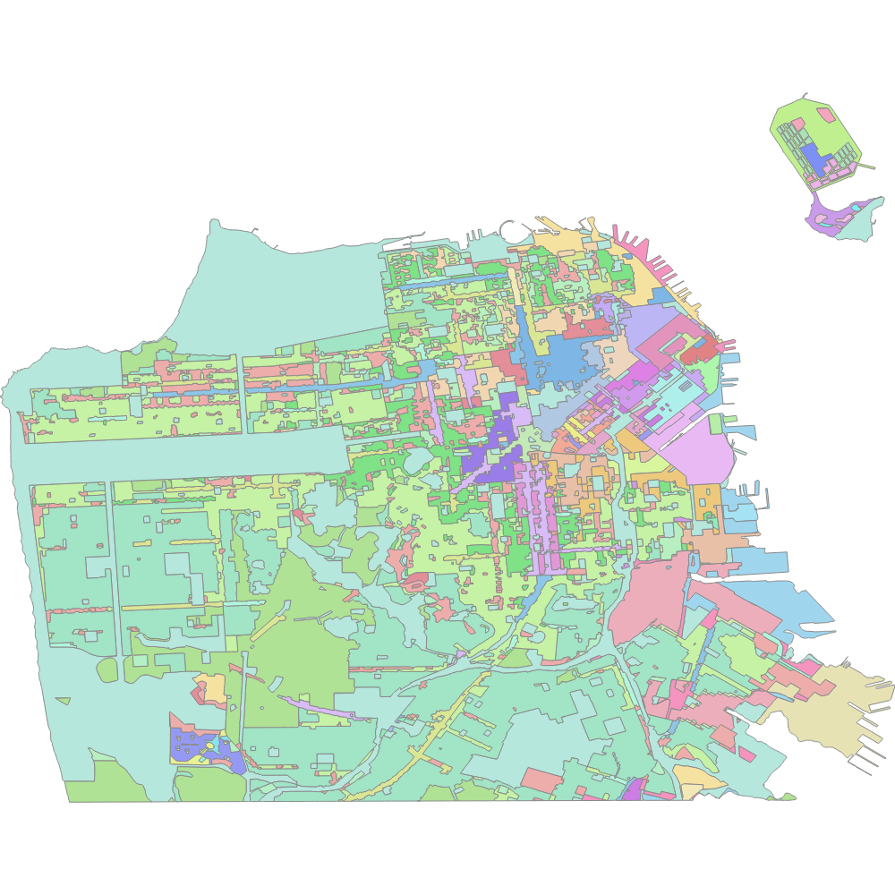{fig-align="center" width="75%"}

## Búsqueda de una capa

```python
#| eval: false
blocks = QgsProject.instance().mapLayersByName('blocks')[0]
```

## Activación y desactivación de una capa

```python
#| eval: false
blocks = QgsProject.instance().mapLayersByName('blocks')[0]
QgsProject.instance().layerTreeRoot().findLayer(blocks.id()).setItemVisibilityChecked(True)
```

## Obtención de todas las capas

```python
#| eval: false
for layer in QgsProject.instance().mapLayers().values():
    print(layer.name())
```

## Obtención de capas visibles (marcadas)

```python
#| eval: false
for layer in iface.mapCanvas().layers():
    print(layer.name())
```

## Obtención de capas seleccionadas

```python
#| eval: false
for layer in iface.layerTreeView().selectedLayers():
    print(layer.name())
```

## Ajuste de la extensión del lienzo a la extensión de la capa

Seleccione una de las capas en el panel de capas y ejecute el siguiente código:

```python
#| eval: false
layer = iface.activeLayer()
mc = iface.mapCanvas()
mc.setExtent(layer.extent())
mc.refresh()
```

## Obtención de capas con jerarquía

Este fragmento de código, adaptado de la guía de referencia de PyQGIS, incluye una modificación relevante: la función `getGroupLayers` se invoca de forma recursiva. Esto permite acceder incluso a las capas contenidas en subgrupos dentro de los grupos de capas.

```python
#| eval: false
def getGroupLayers(group):
    print('- grupo:' + group.name())
    for child in group.children():
        if isinstance(child, QgsLayerTreeGroup):
            getGroupLayers(child)
        else:
            print('  - capa:' + child.name())


root = QgsProject.instance().layerTreeRoot()
for child in root.children():
    if isinstance(child, QgsLayerTreeGroup):
        getGroupLayers(child)
    elif isinstance(child, QgsLayerTreeLayer):
        print ("- capa: " + child.name())
```

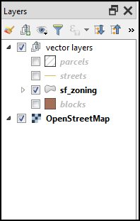{fig-align="center" width="50%"}

## Cambio del ícono de la ventana principal de QGIS

```python
#| eval: false
import os

icon_image = 'qgis-black.png'
data_dir = os.path.join(os.path.expanduser('~'), 'Downloads', 'pyqgis_masterclass')
icon_path = os.path.join(data_dir, icon_image)
icon = QIcon(icon_path)
iface.mainWindow().setWindowIcon(icon)
```

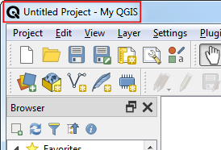{fig-align="center" width="50%"}


## Eliminación de un botón específico de una barra de herramientas

El siguiente fragmento de código ilustra el procedimiento para identificar los nombres de los diversos widgets en la aplicación QGIS y localizar barras de herramientas y botones específicos. El código desactivará el botón Deselect All Features from Layers (Despejar selección de todas las capas) de la Selection Toolbar (Barra de herramientas de selección).

```python
# Localizar todos los objetos hijos de mainWindow que sean del tipo QToolBar
for x in iface.mainWindow().findChildren(QToolBar): 
    print(x.objectName())
    
# En la lista impresa, se observa que la barra de selección se denomina mSelectionToolBar
# Obtener una referencia por su nombre
selectionToolbar = iface.mainWindow().findChild(QToolBar, 'mSelectionToolBar')

# Localizar los botones en la barra de herramientas
for x in selectionToolbar.findChildren(QAction):
    print(x.objectName())

# Alternativamente, se puede utilizar lo siguiente:
for x in selectionToolbar.actions():
    print(x.objectName())

# Si el botón de la barra de herramientas no es una acción, se identifica por su nombre
# Obtener una referencia al botón de deselección por su nombre
deselection = selectionToolbar.findChild(QAction, 'ActionDeselection')

# Es posible desactivar un widget invocando setEnabled(False)
deselection.setEnabled(False)

# Es posible eliminarlo completamente invocando removeAction()
selectionToolbar.removeAction(deselection)
```

## Adición de un menú desplegable a la barra de herramientas

Este ejemplo demuestra la inclusión de un widget `QComboBox` en una barra de herramientas y su población con valores de atributos de una capa. Al accionar el botón, la selección se lee desde el cuadro combinado y se emplea para aplicar un filtro a la capa.

> Se requiere una capa con un atributo denominado **NAME** para la ejecución de este ejemplo. Verificado con la capa [Natural Earth Admin 0 - Countries](https://www.naturalearthdata.com/downloads/10m-cultural-vectors/).

```python
toolBar = iface.addToolBar("My Toolbar")
toolBar.setObjectName("My Toolbar")

countryCombo = QComboBox(toolBar)
toolBar.addWidget(countryCombo)
countryCombo.setToolTip("Select a country (Seleccionar un país)")

filterButton = QPushButton('Filter (Filtrar)')
filterButton.setToolTip('Filter (Filtrar)')
toolBar.addWidget(filterButton)

resetButton = QPushButton('Reset (Reiniciar)')
resetButton.setToolTip('Reset (Reiniciar)')
toolBar.addWidget(resetButton)

# Ordenar la capa por nombres de países
# Configurar QgsFeatureRequest y utilizarlo con getFeatures()
request = QgsFeatureRequest()
clause = QgsFeatureRequest.OrderByClause('NAME')
orderby = QgsFeatureRequest.OrderBy([clause])
request.setOrderBy(orderby)
layer = iface.activeLayer()

# Leer los nombres de los países y almacenarlos en una lista
countries = []
for f in layer.getFeatures(request):
    name = f['NAME']
    if name:
        countries.append(name)

# Añadir elementos al combobox
for country in countries:
    countryCombo.addItem(country)

# Definir funciones para aplicar y reiniciar filtros
def filter_layer():
    layer = iface.activeLayer()
    country = countryCombo.currentText()
    expression = '\"NAME\" = \'{}\''.format(country)
    layer.setSubsetString(expression)

def reset_layer():
    layer = iface.activeLayer()
    layer.setSubsetString('')
    countryCombo.clear()
    for country in countries:
        countryCombo.addItem(country)
      
filterButton.clicked.connect(filter_layer)
resetButton.clicked.connect(reset_layer)
```

## Adición de capas CSV

```python
import os
data_dir = os.path.join(os.path.expanduser('~'), 'Downloads', 'pyqgis_masterclass')

filename = 'trees.csv'
csvpath = 'file:///' + data_dir + filename
uri = '{}?type=csv&xField={}&yField={}&crs={}'.format(
    csvpath, 'Longitude', 'Latitude', 'EPSG:4326')
iface.addVectorLayer(uri, 'trees', 'delimitedtext')
```

## Inserción de capas en el árbol de capas

Se emplea la clase `QgsLayerTree` para insertar la capa en la ubicación adecuada del árbol.

```python
import os
data_dir = os.path.join(os.path.expanduser('~'), 'Downloads', 'pyqgis_masterclass')

filename = 'srtm.tif'
uri = os.path.join(data_dir, filename)
rlayer = QgsRasterLayer(uri, 'srtm', 'gdal')

rastergroup = QgsLayerTreeGroup('raster layers (capas ráster)')
treelayer = QgsLayerTreeLayer(rlayer)
rastergroup.insertChildNode(0, treelayer)

root = QgsProject.instance().layerTreeRoot()
root.insertChildNode(1, rastergroup)
```

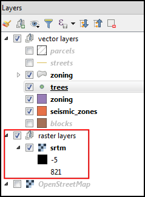{fig-align="center" width="50%"}

## Guardado de capas en el disco

Utilice las clases `QgsRasterFileWriter` o `QgsVectorFileWriter` para la escritura de capas en el almacenamiento local.

```python
import os
data_dir = os.path.join(os.path.expanduser('~'), 'Downloads', 'pyqgis_masterclass')

options = QgsVectorFileWriter.SaveVectorOptions()
options.actionOnExistingFile = QgsVectorFileWriter.CreateOrOverwriteLayer 
options.layerName = 'point'

filename = 'sf.gpkg'
path = os.path.join(data_dir, filename)
QgsVectorFileWriter.writeAsVectorFormat(vlayer, path, options)
```

## Visualización de una etiqueta con color de fondo

Este es un tema extenso, pero permite apreciar la flexibilidad que ofrece la API para controlar todos los aspectos del etiquetado. Se observa el nombre de la clase `QgsPalLayerSettings`, debido a que QGIS utiliza una librería de etiquetado denominada [PAL](http://pal.heig-vd.ch/index.php?page=about-pal). El siguiente fragmento de código ilustra el procedimiento para crear una etiqueta en una capa de puntos con un color de fondo.

```python
#| eval: false
vlayer = QgsProject.instance().mapLayersByName('point')[0]
symbol = QgsMarkerSymbol.createSimple({'name': 'square', 'color': 'red'})
vlayer.renderer().setSymbol(symbol)

label_settings = QgsPalLayerSettings()
#label_settings.drawBackground = True
label_settings.fieldName = 'name'

text_format = QgsTextFormat()
background_color = QgsTextBackgroundSettings()
background_color.setFillColor(QColor('white'))
background_color.setEnabled(True)
text_format.setBackground(background_color )
label_settings.setFormat(text_format)

vlayer.setLabeling(QgsVectorLayerSimpleLabeling(label_settings))
vlayer.setLabelsEnabled(True)
vlayer.triggerRepaint()
```

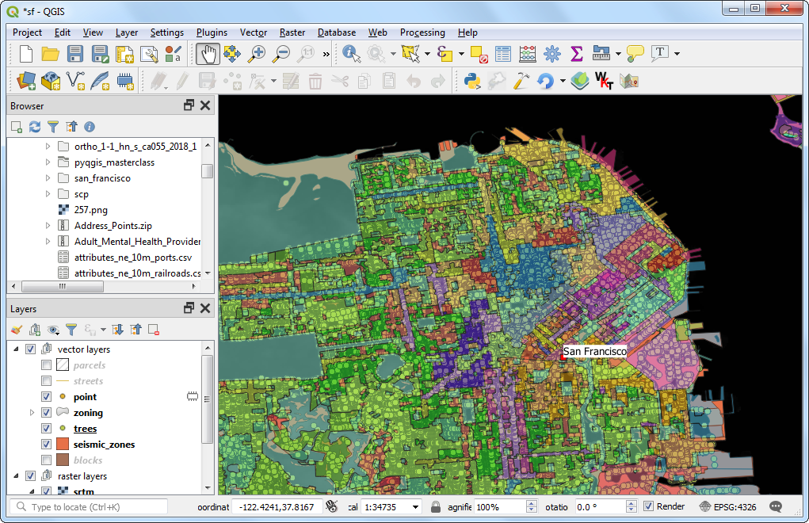{fig-align="center" width="75%"}

## Edición de la tabla de atributos de una capa vectorial

Al utilizar procesos de procesamiento, cada algoritmo genera una capa nueva. Este ejemplo demuestra el procedimiento para emplear el procesamiento con el fin de sobrescribir la capa original con los resultados obtenidos.

```python
#| eval: false
import os
data_dir = os.path.join(os.path.expanduser('~'), 'Downloads', 'pyqgis_masterclass')

filename = 'sf.gpkg|layername=blocks'
uri = os.path.join(data_dir, filename)
blocks = QgsVectorLayer(uri, 'blocks', 'ogr')

output = processing.run(
    "qgis:deletecolumn", 
    {'INPUT': blocks,'COLUMN':['multigeom'],'OUTPUT':'memory:'})
outputlayer = output['OUTPUT']

final = processing.run("qgis:fieldcalculator",
    {'INPUT':outputlayer,
    'FIELD_NAME':'area',
    'FIELD_TYPE':0,
    'FIELD_LENGTH':10,
    'FIELD_PRECISION':3,
    'NEW_FIELD':True,
    'FORMULA':'$area',
    'OUTPUT':'memory:'})
finallayer = final['OUTPUT']

options = QgsVectorFileWriter.SaveVectorOptions()
# Se sobrescribe la capa original
options.layerName = 'blocks'
options.actionOnExistingFile = QgsVectorFileWriter.CreateOrOverwriteLayer 

output_file = 'sf.gpkg'
output_path = os.path.join(data_dir, output_file)
QgsVectorFileWriter.writeAsVectorFormat(finallayer, output_path, options)
QgsProject.instance().reloadAllLayers()
```

## Creación de un PDF con título

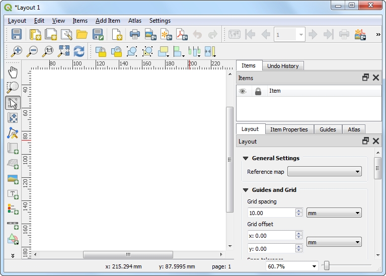{fig-align="center" width="75%"}

```python
#| eval: false
import os
data_dir = os.path.join(os.path.expanduser('~'), 'Downloads', 'pyqgis_masterclass')

project = QgsProject.instance()
extent = QgsRectangle(-122.52, 37.71, -122.35, 37.83)

layout = QgsPrintLayout(project)
layout.initializeDefaults()

pages = layout.pageCollection()
pages.beginPageSizeChange()
page = pages.page(0)
page.setPageSize('A4',  QgsLayoutItemPage.Landscape)
pages.endPageSizeChange()
page_center = page.pageSize().width() / 2


map = QgsLayoutItemMap(layout)
map.setRect(QRectF(-122.52, 37.71, -122.35, 37.83))
map.setExtent(extent)
a4 = QPageSize().size(QPageSize.A4, QPageSize.Millimeter)
map.attemptResize(QgsLayoutSize(a4.height(),  a4.width()))

layout.addItem(map)
title = QgsLayoutItemLabel(layout)
title.setText('San Francisco')
title.setFont(QFont('Arial', 36))
title.adjustSizeToText()
title.setReferencePoint(QgsLayoutItem.UpperMiddle)
title.attemptMove(QgsLayoutPoint(page_center, 10))
layout.addItem(title)

output_file = 'sf.pdf'
output_path = os.path.join(data_dir, output_file)

exporter = QgsLayoutExporter(layout)
exporter.exportToPdf(
    output_path, QgsLayoutExporter.PdfExportSettings())
```

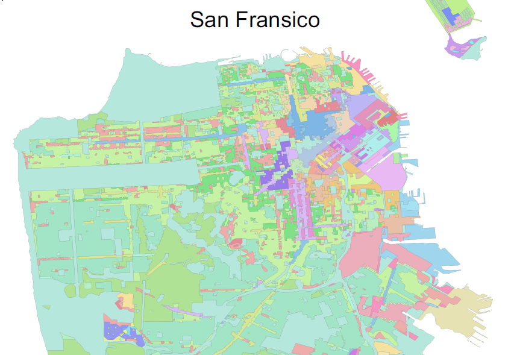{fig-align="center" width="75%"}

## Creación de una línea geodésica

Conecta dos puntos mediante el arco de un círculo máximo a lo largo de un elipsoide. Utiliza el método `geodesicLine()` proporcionado por la clase `QgsDistanceArea()` para el cálculo.

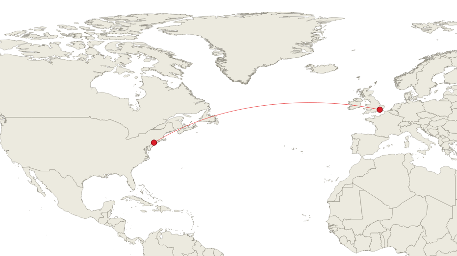{fig-align="center" width="75%"}

```python
#| eval: false
#| file: code/pyqgis/geodesic_line.py
```

## Simplificación de scripts de procesamiento

El Processing Framework (Entorno de procesamiento) proporciona una forma más sencilla de escribir scripts de procesamiento mediante el uso del decorador `@alg`. Al emplear este enfoque, es posible eliminar gran parte del código base (boilerplate) y centrarse exclusivamente en la escritura de la función principal del algoritmo. Este método presenta algunas limitaciones, siendo la principal que los scripts escritos con el decorador `@alg` no pueden utilizarse en complementos. No obstante, si el objetivo es crear scripts de procesamiento, este estilo resulta mucho más simple.

> Nota: El decorador `@alg` no puede utilizarse en complementos. Si se están escribiendo algoritmos de procesamiento para un complemento, se debe utilizar la plantilla de script completa mostrada en la sección anterior.

A continuación, se modifica el script `save_attributes_algorithm.py` cubierto en la sección anterior para utilizar el decorador `@alg` integrado. Localice el script en la **Processing Toolbox (Caja de herramientas de procesamiento)** bajo **Scripts (Scripts) &rarr; Save Attributes As CSV (Guardar atributos como CSV)**. Haga clic derecho sobre él y seleccione **Edit Script... (Editar script...)**. Reemplace todo el código en el **Processing Script Editor (Editor de scripts de procesamiento)** con el siguiente y haga clic en el botón **Save Script (Guardar script)**:

```python
#| eval: false
#| file: code/pyqgis/save_attributes_decorator.py
```

Al ejecutar el script, se observará que el comportamiento es casi idéntico, pero el código es significativamente más sencillo. El código emplea el decorador `@alg` para definir el nombre del algoritmo, el grupo, las entradas y las salidas de una manera más concisa. 

Otro punto importante a considerar es que, para crear un algoritmo de procesamiento, se debe generar una clase que herede de `QgsProcessingAlgorithm`. Al escribir una clase, se hace referencia a la instancia actual de la misma con la palabra clave `self`. En este caso, al escribir solo una función, el decorador creará la clase automáticamente. Por ello, se utiliza un parámetro denominado `instance`. Cuando el decorador genere la clase, la referencia a la instancia se pasará a la función a través de este parámetro.

## Renombrado de capas de salida temporales

Cuando se ejecuta un algoritmo de procesamiento y se opta por generar una capa de salida temporal, la capa resultante tiene un nombre predeterminado establecido por el algoritmo. Si se desea asignar un nombre diferente a la capa de salida temporal, es posible adoptar un enfoque alternativo. El fragmento de código siguiente muestra cómo renombrar la capa de salida para que incluya el nombre de la capa de entrada. Como resultado, la capa de sombreado de salida se denominará `srtm_hillshade` en lugar del nombre predeterminado `Hillshade`.

```python
#| eval: false
import os
data_dir = os.path.join(os.path.expanduser('~'), 'Downloads', 'pyqgis_masterclass')

filename = 'srtm.tif'
srtm = os.path.join(data_dir, filename)

results = processing.run("native:hillshade", 
    {'INPUT': srtm, 
    'Z_FACTOR': 2,
    'AZIMUTH': 300,
    'V_ANGLE': 40,
    'OUTPUT': 'TEMPORARY_OUTPUT'})

# Obtener la ruta de la capa generada
output = results['OUTPUT']

# Extraer el nombre del archivo
input_layer_name = os.path.splitext(os.path.basename(srtm))[0]
output_layer = QgsRasterLayer(output)

# Establecer el nombre de la capa para incluir el nombre del archivo de entrada
output_layer.setName(f'{input_layer_name}_hillshade')
QgsProject.instance().addMapLayer(output_layer)
```

## Selección de objetos conectados mediante acciones

En la sección de selección de vecinos, se analizó cómo crear una acción para seleccionar los vecinos de primer y segundo grado de un objeto espacial. Es posible extender este código para seleccionar vecinos de grado n, lo que permite seleccionar rápidamente regiones contiguas en una capa. Se puede crear una **Python Action (Acción de Python)** denominada **Select Connected Features (Seleccionar objetos conectados)** con el código siguiente. El uso de la acción sobre un objeto seleccionará todos los elementos conectados con un solo clic.

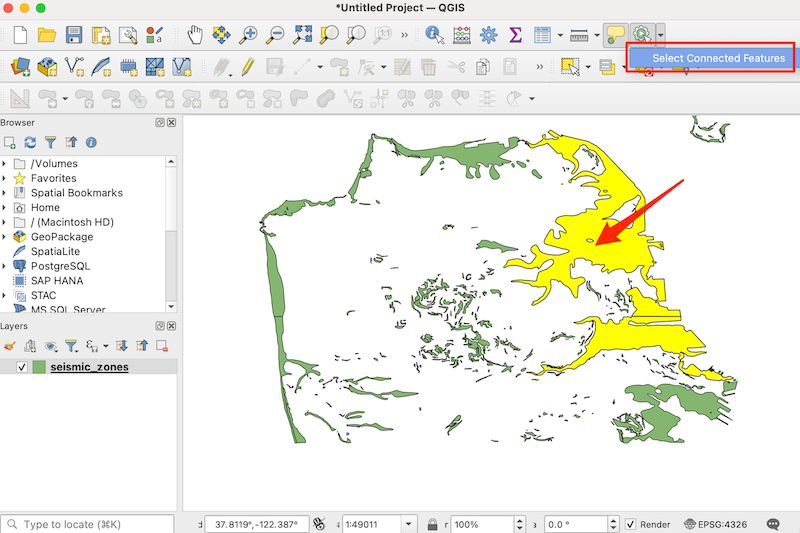{fig-align="center" width="75%"}

```python
#| eval: false
layer_id = '[%@layer_id%]'
fid = [% $id %]

layer = QgsProject.instance().mapLayer(layer_id)

def get_neighbors(feature):
    bbox = feature.geometry().boundingBox()
    neighbors = []
    for f in layer.getFeatures(bbox):
        if f.id() != feature.id() and f.geometry().intersects(feature.geometry()):
            neighbors.append(f.id())
    return neighbors

# Inicializar la selección con el objeto en el que se hizo clic
visited = set()
to_visit = set([fid])

while to_visit:
    current_id = to_visit.pop()
    if current_id in visited:
        continue

    visited.add(current_id)
    current_feature = layer.getFeature(current_id)
    neighbors = get_neighbors(current_feature)

    # Añadir vecinos no visitados a la cola
    new_neighbors = set(neighbors) - visited
    to_visit.update(new_neighbors)

# Aplicar la selección final
layer.selectByIds(list(visited))
```

# Uso de código de otros complementos (Using code from plugins)

Es posible acceder a las clases y métodos de otros complementos mediante PyQGIS. Se puede acceder a todos los complementos instalados mediante el módulo `qgis.utils` y utilizar el código correspondiente de la siguiente manera:

Imprimir la lista de complementos instalados:

```python
#| eval: false
print(qgis.utils.plugins.keys())
```

Acceder al método de un complemento (reemplazar `PluginName` con el nombre obtenido de la lista anterior):

```python
#| eval: false
myPlugin = qgis.utils.plugins['PluginName']
A = myPlugin.A()
A.my_method()
```

# Especificación de dependencias de complementos (Specifying plugin dependencies)

El Plugin Manager (Administrador de complementos) de QGIS admite la instalación de dependencias de otros complementos a través del metadato `plugin_dependencies` en el archivo [`metadata.txt`](https://docs.qgis.org/3.44/en/docs/pyqgis_developer_cookbook/plugins/plugins.html#metadata-txt). El administrador de complementos solicitará al usuario la instalación de estas dependencias al momento de instalar el complemento principal. Existe un complemento reciente denominado [`qpip`](https://github.com/opengisch/qpip) que aprovecha esta funcionalidad y permite especificar paquetes adicionales de Python requeridos por el complemento. Esta representa la forma más elegante de incluir librerías externas. Se requieren dos cambios en el desarrollo para utilizar esta característica:

1. Añadir **qpip** en el campo `plugin_dependencies` del archivo `metadata.txt`.
2. Añadir un archivo `requirements.txt` con la lista de paquetes que se instalarán con el complemento en el formato estándar [soportado por pip](https://pip.pypa.io/en/stable/reference/requirements-file-format/).

Por ejemplo, si se requiere la instalación del paquete `prettyprint` junto con el complemento, se deben realizar las siguientes modificaciones:

Modificar el archivo `metadata.txt` para incluir el metadato de dependencias:

```text
[general]
name=Save Attributes
description=This plugin saves the attributes of the selected vector layer as a CSV file
version=1.0
qgisMinimumVersion=3.0
author=Ujaval Gandhi
email=ujaval@spatialthoughts.com
icon=logo.png
plugin_dependencies=qpip
```

Añadir un nuevo archivo en el directorio del complemento denominado `requirements.txt` con el siguiente contenido:

```text
prettyprint
```

Esto solicitará al usuario la instalación previa del complemento `qpip` y, posteriormente, presentará un diálogo para instalar el paquete de Python en caso de que este no se encuentre en el sistema.

# Uso de enlaces simbólicos para el desarrollo de complementos (Using symbolic links for plugin development)

El Plugin Manager (Administrador de complementos) carga los componentes desde el directorio de complementos del perfil actual. Durante el desarrollo de complementos para QGIS, generalmente se trabaja en un directorio distinto (comúnmente en un repositorio de Git) y se debe copiar manualmente el código al directorio de complementos para las pruebas. Los [Enlaces simbólicos (Symbolic links)](https://www.geeksforgeeks.org/creating-symbolic-links-on-windows/) constituyen una solución eficiente que permite crear vínculos en el directorio de complementos que apuntan directamente al directorio de desarrollo.

### Windows

Se puede utilizar el comando **MKLINK** desde el Command Prompt (Símbolo del sistema) de Windows para crear el vínculo.

El siguiente comando crea un enlace simbólico de carpeta en el perfil que apunta a la carpeta física en el equipo:

```bash
#| eval: false
mklink /d <ruta de la carpeta del complemento en el perfil> <ruta de la carpeta en el entorno de desarrollo> 
```

### Linux y Mac

El comando **ln** permite crear enlaces simbólicos desde la Terminal (Terminal).

> Es importante notar que el comando `ln` utiliza un orden de parámetros que puede resultar poco intuitivo.

```bash
#| eval: false
ln -s <ruta de la carpeta en el entorno de desarrollo> <ruta de la carpeta del complemento en el perfil>
```

Por ejemplo, el siguiente comando crea un enlace simbólico en la carpeta de complementos del perfil predeterminado que apunta a una carpeta ubicada en el escritorio:

```bash
#| eval: false
PROFILE_FOLDER=/Users/ujavalgandhi/Library/Application\ Support/QGIS/QGIS3/profiles/default
ln -s ~/Desktop/basemap_loader $PROFILE_FOLDER/python/plugins/basemap_loader
```

# Siguientes pasos (What next?)

Se dispone de diversos tutoriales y guías paso a paso sobre el desarrollo en PyQGIS para practicar las habilidades adquiridas y fortalecer el dominio de la herramienta.

**Tutoriales**

- [Introducción a la programación en Python](https://www.qgistutorials.com/en/docs/3/getting_started_with_pyqgis.html){target="_blank"}
- [Ejecución de algoritmos de procesamiento mediante Python](https://www.qgistutorials.com/en/docs/3/processing_algorithms_pyqgis.html){target="_blank"}
- [Uso de funciones de expresión personalizadas en Python](https://www.qgistutorials.com/en/docs/3/custom_python_functions.html){target="_blank"}
- [Escritura de scripts de Python para el Processing Framework](https://www.qgistutorials.com/en/docs/3/processing_python_scripts.html){target="_blank"}
- [Construcción de un complemento de Python](https://www.qgistutorials.com/en/docs/3/building_a_python_plugin.html){target="_blank"}
- [Construcción de un complemento de procesamiento](https://www.qgistutorials.com/en/docs/3/processing_python_plugin.html){target="_blank"}

**Guías**

- [Ajuste de trazas GPS a carreteras mediante PyQGIS y OSRM](https://spatialthoughts.com/2020/02/22/snap-to-roads-qgis-and-osrm/){target="_blank"}
- [Aproximación de buffers geodésicos con PyQGIS](https://spatialthoughts.com/2019/04/05/geodesic-buffers-in-qgis/){target="_blank"}
- [Exportación de diseños de impresión desde scripts de procesamiento](https://spatialthoughts.com/2020/02/09/exporting-map-layouts/){target="_blank"}
- [Agrupamiento K-Means con clústeres de tamaño igual en QGIS](https://spatialthoughts.com/2021/01/31/equal-sized-kmeans-qgis/){target="_blank"}
- [Creación de mapas con Google Earth Engine y PyQGIS](https://spatialthoughts.com/2020/04/04/ndvi-time-series-gee-qgis/){target="_blank"}

# Recursos (Resources)

- Documentación oficial de QGIS: [PyQGIS Developer Cookbook](https://docs.qgis.org/testing/en/docs/pyqgis_developer_cookbook/){target="_blank"}
- [PyQGIS 101: Introducción a la programación en QGIS con Python para no programadores](https://anitagraser.com/pyqgis-101-introduction-to-qgis-python-programming-for-non-programmers/){target="_blank"} por Anita Graser
- [Ejemplos de PyQGIS](https://webgeodatavore.github.io/pyqgis-samples/){target="_blank"} por Thomas Gratier
- [Despliegue de una versión personalizada de QGIS](https://github.com/haubourg/custom-osgeo4w-qgis){target="_blank"} por Régis Haubourg 

# Créditos de los datos (Data credits)

- `blocks`, `parcels`, `streets`, `zoning`, `trees`, `seasmic_zones`, `shoreline`: Descargados desde el portal de datos abiertos [DataSF Open Data Portal](https://datasf.org/opendata/).
- `srtm`: NASA Shuttle Radar Topography Mission Global 1 arc second, proporcionado por The Land Processes Distributed Active Archive Center (LP DAAC). Descargado mediante el [30-Meter SRTM Tile Downloader](https://dwtkns.com/srtm30m/).
- `aoi`: Límites de lugares de California de los archivos 2016 TIGER/Line Shapefiles. Descargados desde el portal de datos abiertos [California Open Data Portal](https://data.ca.gov/dataset/ca-geographic-boundaries).
- `populated_places`: Elaborado con Natural Earth. Datos de mapas vectoriales y ráster gratuitos disponibles en [naturalearthdata.com](https://www.naturalearthdata.com/).

