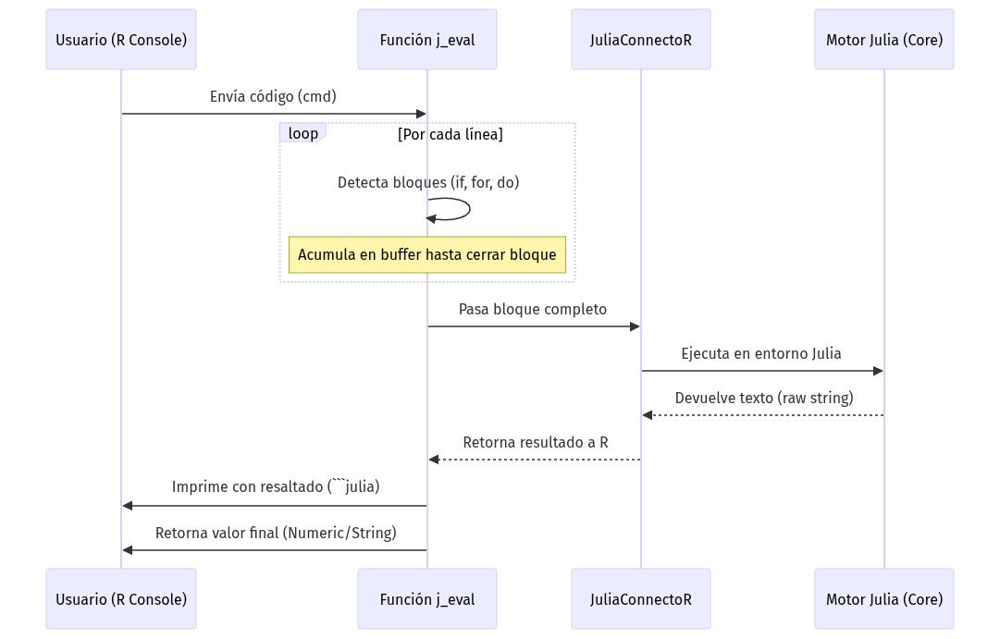
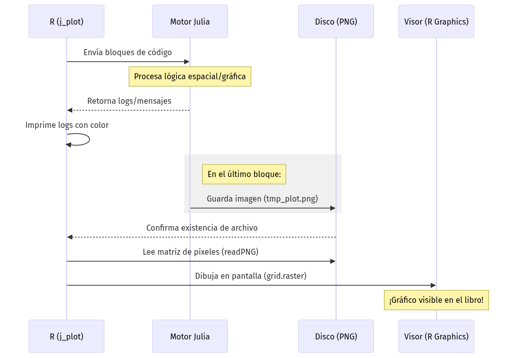
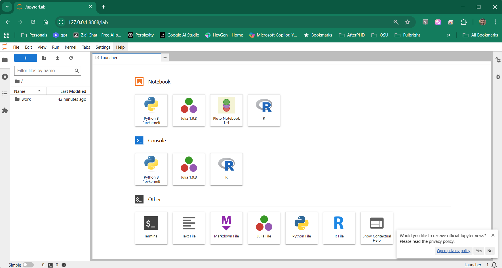
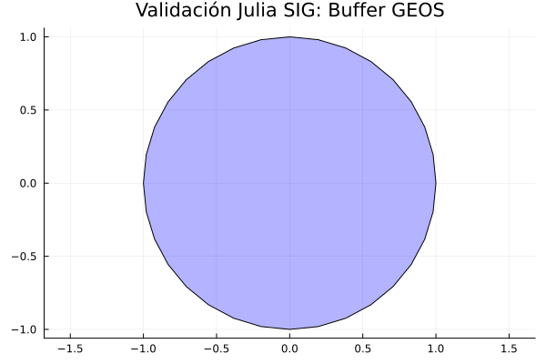

# Uso de la Infraestructura Instalada {#sec-anexo_infraestructura}

## (NEW - use it) Configuración de Mermaid a pdf en Docker (Resumido)

Para que los gráficos de mermaid y los mapas dinámicos se exporten a pdf (en archivos qmd), antes de compilar el proyecto (`quarto render`) ejecute estos pasos:

* Borra las dos últimas líneas de configuración de Google-Chrome en `/etc/R/Rprofile.site`

```text
#Elimina estas líneas en Rprofile.site
Sys.setenv(CHROMOTE_CHROME = "/usr/bin/google-chrome")
options(chromote.args = c("--no-sandbox", "--disable-gpu", "--headless"))
```

* Instala Chromium ejecutando el archivo `install_chromium.sh` el cual descomprime el archivo `quarto-chromium-869685.tar.gz` a las carpetas requeridas (`chromium/linux-869685/`)

```bash
/home/rstudio/work/install_chromium.sh
```
* Agrega esta nueva configuración para apuntar a Chromium

```bash
cat <<EOF >> /etc/R/Rprofile.site

# --- Configuración Mermaid/Chromium para Docker ---
# Definir ruta del binario manual
Sys.setenv(QUARTO_CHROMIUM = "/root/.local/share/quarto/chromium/linux-869685/chrome-linux/chrome")

# Argumentos de seguridad y rendimiento para contenedores
Sys.setenv(QUARTO_CHROME_ARGUMENTS = "--no-sandbox --disable-gpu --disable-dev-shm-usage --headless")
EOF
```

* Corre estos comandos para crear un link a Chromium y asegurar que Quarto cargue primero Chromium en lugar de Google-Chrome


```bash
# Crear carpeta
mkdir -p /tmp/bin

# Crear el enlace simbólico: Se redirigen las peticiones de `google-chrome` hacia el Chromium funcional de Quarto.
ln -s /root/.local/share/quarto/chromium/linux-869685/chrome-linux/chrome /tmp/bin/google-chrome

# Actualizar el Path: Se coloca el nuevo directorio al principio de la variable de entorno para que el sistema lo encuentre primero.
export PATH="/tmp/bin:$PATH"
echo 'export PATH="/tmp/bin:$PATH"' >> ~/.bashrc
# Validación: Confirmar que el comando `which` apunta ahora a nuestra ruta temporal.
which google-chrome
```

* Agrega estas líneas a .bashrc para definir variables de entorno relacionadas con Chromium en cada nueva terminal que se cree dentro de VSCode.

```bash
cat <<EOF >> ~/.bashrc

# --- Configuración Quarto + Chromium para Docker ---
export QUARTO_CHROMIUM="/root/.local/share/quarto/chromium/linux-869685/chrome-linux/chrome"
export QUARTO_CHROME_ARGUMENTS="--no-sandbox --disable-gpu --disable-dev-shm-usage --headless"
EOF

# Aplicar los cambios inmediatamente
source ~/.bashrc
```

## (NEW - don't use) Configuración de Mermaid a pdf en Docker (este es el mismo punto anterior pero con más detalles)

Esta guía detalla la solución técnica para renderizar diagramas Mermaid en pdf dentro de contenedores, evitando los conflictos de seguridad del kernel y los errores al usar Google Chrome (`/usr/bin/google-chrome`).

### Instalación de Chromium y verificación

Es el paso fundamental para obtener el binario funcional dentro del entorno de Linux del contenedor.

* **Instalación inicial:** Ejecutar el comando de Quarto para descargar el motor del navegador.

```bash
quarto install chromium
```

* **Verificar si Quarto reconoce Chromium**:

```bash
quarto check
```

Busca la línea que dice **Chromium**. Si aparece una ruta (como `/root/.local/share/quarto/...`), el navegador está instalado y listo para usar. Si no está instalado dice `Chromium: (not installed)`

* **Localizar la ruta del binario:** Confirmar dónde se almacenó el ejecutable para configurar las rutas de Quarto.

```bash
find / -name chrome -type f 2>/dev/null | grep quarto
# Ruta esperada: /root/.local/share/quarto/chromium/linux-869685/chrome-linux/chrome
```

* **Verificar dependencias de sistema:** Asegurar que el binario tenga acceso a todas las librerías compartidas necesarias. No debe salir nada después de ejecutar el comando.
```bash
ldd /root/.local/share/quarto/chromium/linux-869685/chrome-linux/chrome | grep "not found"
```

---

### El engaño al sistema (solución al error de Chrome)

Dado que el sistema y Quarto suelen priorizar la ruta `/usr/bin/google-chrome` (que falla en Docker por restricciones de Snap o del kernel), creamos un binario falso con alta prioridad.

* **Crear directorio de binarios temporales:** Se genera una carpeta con prioridad en el sistema.

```bash
mkdir -p /tmp/bin
```
* **Crear el enlace simbólico:** Se redirigen las peticiones de `google-chrome` hacia el Chromium funcional de Quarto.

```bash
ln -s /root/.local/share/quarto/chromium/linux-869685/chrome-linux/chrome /tmp/bin/google-chrome
```
* **Actualizar el Path:** Se coloca el nuevo directorio al principio de la variable de entorno para que el sistema lo encuentre primero.
```bash
export PATH="/tmp/bin:$PATH"
echo 'export PATH="/tmp/bin:$PATH"' >> ~/.bashrc
```
* **Validación:** Confirmar que el comando `which` apunta ahora a nuestra ruta temporal.
```bash
which google-chrome
```

---

### Configuración global de R (Rprofile.site)

Para que todos los archivos `.qmd` reconozcan esta configuración automáticamente sin añadir código repetitivo, editamos el archivo de configuración global del sitio en el contenedor.

```bash
cat <<EOF >> /etc/R/Rprofile.site

# --- Configuración Mermaid/Chromium para Docker ---
# Definir ruta del binario manual
Sys.setenv(QUARTO_CHROMIUM = "/root/.local/share/quarto/chromium/linux-869685/chrome-linux/chrome")

# Argumentos de seguridad y rendimiento para contenedores
Sys.setenv(QUARTO_CHROME_ARGUMENTS = "--no-sandbox --disable-gpu --disable-dev-shm-usage --headless")
EOF
```

---


### Configuración de variables en ~/.bashrc

```bash
cat <<EOF >> ~/.bashrc

# --- Configuración Quarto + Chromium para Docker ---
export QUARTO_CHROMIUM="/root/.local/share/quarto/chromium/linux-869685/chrome-linux/chrome"
export QUARTO_CHROME_ARGUMENTS="--no-sandbox --disable-gpu --disable-dev-shm-usage --headless"
EOF

# Aplicar los cambios inmediatamente
source ~/.bashrc
```

### Configuración del proyecto (_quarto.yml)

Si estás trabajando en un proyecto de Quarto, puedes definir estos parámetros de forma centralizada en el archivo `_quarto.yml`. Esto evita tener que configurar cada archivo `.qmd` por separado.

```yaml
project:
  title: "Mi Proyecto de Investigación"

format:
  html: default
  pdf:
    keep-tex: true
    mermaid-format: png
    include-in-header:
      - text: \usepackage{pdflscape}
    chrome-args: 
      - "--no-sandbox"
      - "--disable-gpu"
      - "--disable-dev-shm-usage"
      - "--headless"
```


---

### Evitar el uso de configuración redundante en archivos individuales

Para compilar archivos `.qmd` de forma independiente (por ejemplo, capítulos de un libro) sin tener que repetir el bloque de configuración de Chromium en cada uno, cree un archivo llamado `_metadata.yml` en la carpeta correspondiente con el siguiente contenido:

```yaml
format:
  html: default
  pdf:
    mermaid-format: png
    include-in-header:
      - text: \usepackage{pdflscape}
    chrome-args: 
      - "--no-sandbox"
      - "--disable-gpu"
      - "--disable-dev-shm-usage"
      - "--headless"
```

---

### Diagrama ajustado al ancho de página

Usamos `%%| fig-width` para controlar la resolución interna y `out-width` para el tamaño real en el papel.

```mermaid
%%| label: fig-flujo
%%| fig-cap: "El flujo completo: Desde la declaración hasta el desempaquetado."
%%| fig-width: 8
%%| fig-align: center
%%| out-width: "100%"
graph TD
  A[PYTHON Base 0] --> B(ruta[1])
  B --> C[Terminal: 6.2442, -75.58]
  C --> D[Lat: 6.2442]
  C --> E[Desempaquetado]
```

* **out-width: "100%":** Esto es lo más importante; obliga al diagrama a expandirse hasta los márgenes del PDF sin salirse.
* **fig-width:** Si el texto del diagrama se ve muy pequeño o borroso, aumenta este valor (ej. a `10` o `12`). Si se ve muy gigante, bájalo. 
* **fig-cap:** Agregar un pie de figura (`fig-cap`) le da ese aspecto de "Libro" o "Paper" profesional que buscas.

---

### Estructura del documento .qmd

Para compilar exitosamente, el encabezado yaml debe forzar el formato png para Mermaid, que es el método más estable para "fotografiar" el diagrama dentro de entornos sin interfaz gráfica.

`````yaml
---
title: "Prueba Mermaid"
format:
  pdf:
    mermaid-format: png
    chrome-args: 
      - "--no-sandbox"
      - "--disable-gpu"
      - "--disable-dev-shm-usage"
      - "--headless"
---

Compilación individual funcionó con este:
---
format:
  html: default
  pdf:
    keep-tex: true
    mermaid-format: png
    include-in-header:
      - text: \usepackage{pdflscape}
---

### Diagrama funcional
::: {.content-visible when-format="pdf"}
\blandscape
:::

```{mermaid}
graph TD
  A[Inicio] --> B[Procesamiento en Docker]
  B --> C[PDF generado exitosamente]
```
::: {.content-visible when-format="pdf"}
\elandscape
:::

`````


### Diagnóstico y pruebas manuales

Si el renderizado falla, se puede ejecutar una prueba de navegación directa para confirmar que Chromium responde correctamente a los flags de seguridad.

```bash
/root/.local/share/quarto/chromium/linux-869685/chrome-linux/chrome --headless --no-sandbox --disable-gpu --remote-debugging-port=9222 about:blank
```
*(Si el comando permite la conexión al puerto 9222 sin errores de librerías, el sistema está operativo).*

### Crear el instalador local de Chromium para instalarlo sin Internet

* Instala `quarto install chromium`

* Crear el comprimido en tu carpeta de trabajo persistente

```bash
tar -czvf /home/rstudio/work/quarto-chromium-869685.tar.gz -C /root/.local/share/quarto/ chromium
```

* Comando de instalación rápida (restaurar `quarto-chromium-869685.tar.gz`)

```bash
# Dar permisos de ejecución (solo la primera vez)
chmod +x /home/rstudio/work/install_chromium.sh

# Ejecutar la restauración relámpago
/home/rstudio/work/install_chromium.sh
```

* Alternativa de instalación: corres los comandos individuales que hay en `install_chromium.sh`

```bash
# Asegurar que el directorio base de Quarto exista
mkdir -p /root/.local/share/quarto/

# Descomprimir el instalador directamente en su destino
tar -xzvf /home/rstudio/work/quarto-chromium-869685.tar.gz -C /root/.local/share/quarto/
```

* Verificación de la restauración

Tras ejecutar cualquiera de los métodos anteriores, puedes verificar que el binario de Chromium está en su sitio y listo para operar con el siguiente comando:

```bash
ls -l /root/.local/share/quarto/chromium/linux-869685/chrome-linux/chrome
```
*(Deberías ver el archivo listado con permisos `-rwxr-xr-x`, lo que confirma que Chromium está operativo para renderizar tus diagramas Mermaid).*


## (NEW - do not use) Configuración inicial del entorno (Pre-flight) {#sec-preflight}

Para automatizar el soporte de gráficos mermaid, ejecute estos comandos en la terminal del contenedor `contenedor_sig_unal` inmediatamente después de iniciar los servicios con `docker compose up -d` on con `docker compose start`:


**Contexto del problema**: Al compilar documentos Quarto (`.qmd`) en contenedores Docker, el motor interno que Quarto usa para dibujar diagramas Mermaid suele colapsar por las restricciones de seguridad del sistema (el "sandbox"). Para solucionar esto de forma definitiva, utilizaremos R (`DiagrammeR` y `webshot2`) para procesar la gráfica e incrustarla limpiamente tanto en HTML como en PDF.

* **Paso 1**: Instalar la librería requerida

```bash
Rscript -e "install.packages('DiagrammeR', dependencies=TRUE)"
```

* **Paso 2**: Configurar el entorno global de R (`Rprofile.site`)


Google Chrome se instaló en el contenedor para compilar código `mermaid` dentro de Quarto.Necesitamos indicarle a R dónde está el navegador Chrome y cómo abrirlo sin que el contenedor Docker lo bloquee.

Copien y peguen este bloque completo en la terminal. El comando limpiará cualquier configuración conflictiva anterior y escribirá la configuración correcta:

```bash
# 1. Limpiar configuraciones previas (para evitar duplicados o errores)
sed -i '/CHROMOTE/d' /etc/R/Rprofile.site
sed -i '/chromote/d' /etc/R/Rprofile.site

# 2. Inyectar la configuración limpia
cat << 'EOF' >> /etc/R/Rprofile.site

# --- Configuración segura de Chromote para Docker ---
Sys.setenv(CHROMOTE_CHROME = "/usr/bin/google-chrome")
options(chromote.args = c("--no-sandbox", "--disable-gpu", "--headless", "--remote-debugging-port=9222", "--disable-dev-shm-usage"))
EOF
```

* **Paso 3**: Configuración de contingencia en el documento (ppcional pero recomendado)

Aunque el Paso 2 configura el sistema globalmente, es una excelente práctica (especialmente si comparten su código o lo corren en otro equipo) incluir las variables de entorno directamente en un bloque de configuración (`setup`) dentro de su script. Esto garantiza que el documento sea autónomo y sobreviva a cualquier entorno.


* **Paso 4**: Crear el archivo .qmd de prueba

Creen un archivo llamado `prueba_mermaid.qmd` y peguen exactamente este código. Noten que usamos un bloque `{r}` regular en lugar de `{mermaid}` para forzar al sistema a usar nuestra ruta segura.

``````markdown
---
title: "Prueba Mermaid vía Knitr"
format:
  html: default
  pdf: default
execute:
  echo: false
---

```{.r}
#| label: setup_chrome
#| include: false
# 1. Configuración de Chrome inyectada directamente para sobrevivir a Docker
Sys.setenv(CHROMOTE_CHROME = "/usr/bin/google-chrome")

if (requireNamespace("chromote", quietly = TRUE)) {
  chromote::set_chrome_args(c(
    "--no-sandbox", 
    "--disable-dev-shm-usage", 
    "--headless"
  ))
}

# 2. Cargar la librería que le permite a knitr entender Mermaid
library(DiagrammeR)
```

```{.r}
#| label: plot-mermaid
#| echo: false
# Este bloque genera la gráfica interactiva en HTML o la imagen estática en PDF
mermaid("
graph TD
  A[Anyone] -->|Can help| B(Go to [github.com/yuzutech/kroki](https://github.com/yuzutech/kroki))
  B --> C{How to contribute?}
  C --> D[Reporting bugs]
  C --> E[Sharing ideas]
  C --> F[Advocating]
")
```

``````

> En el contenido del archivo `prueba_mermaid.qmd`, en las dos partes donde aparece, cambie `{.r}` por `{r}` .

* **Paso 5**: Compilar el documento

```bash
quarto render prueba_mermaid.qmd --to all
```

### Test adicionales (Chrome)

* Ejecute uno de lo siguientes comandos para comprobar si Google Chrome web browser está instalado correctamente:

```bash
google-chrome --version
```

```bash
which google-chrome
```

```bash
quarto check
```

* Prueba de vida de Chrome (diagnóstico). Si aparece mucho texto tipo HTML, Chrome está funcionando correctamente.

```bash
/usr/bin/google-chrome --headless --no-sandbox --disable-dev-shm-usage --dump-dom https://example.com
```


## (OLD - No usar) Configuración inicial del entorno (Pre-flight) {#sec-preflight_old}

Para automatizar el soporte de gráficos y capturas sin configurar cada archivo individualmente, ejecute estos comandos en la terminal del contenedor `contenedor_sig_unal` inmediatamente después de iniciar los servicios con `docker compose up -d`:

| Categoría | Comando de Configuración | Propósito |
|:--- |:--- |:--- |
| **Automatización R** | `echo 'Sys.setenv(CHROMOTE_CHROME = "/opt/google/chrome/chrome")' >> /etc/R/Rprofile.site` | Configura la ruta de Chrome para todo el sistema R de forma persistente. (si falla usa `/usr/lib/R/etc/Rprofile.site`. El `R.home("etc")` en nuestro sistema es `/usr/lib/R/etc`)|
| **Seguridad Root** | `echo 'options(chromote.args = c("--no-sandbox", "--disable-gpu", "--headless", "--remote-debugging-port=9222"))' >> /etc/R/Rprofile.site` | Habilita el modo *headless* y evita bloqueos de *sandbox* al ejecutar como root. (si falla usa `/usr/lib/R/etc/Rprofile.site`. El `R.home("etc")` en nuestro sistema es `/usr/lib/R/etc`)|

: Comandos de configuración global del contenedor {#tbl-preflight_old_1}

Google Chrome se necesita para compilar código `mermaid` dentro de Quarto. Ejecute uno de lo siguientes comandos para comprobar si Google Chrome web browser está instalado correctamente:

```bash
google-chrome --version
```

```bash
which google-chrome
```

```bash
quarto check
```

La imagen cargada del archivo tar ya incluye los programas descritos a continuación en @tbl-preflight_old_2. Esta tabla se deja como referencia para facilitar una futura compilación. La tabla descrita líneas abajo servirá para complementar el archivo Dockerfile.

| Categoría | Comando de Configuración | Propósito |
|:--- |:--- |:--- |
| **Soporte Base** | `apt-get update && apt-get install -y fonts-symbola wget` | Fuentes para emojis y herramienta de descarga de paquetes externos. |
| **Navegador** | `wget https://dl.google.com/linux/direct/google-chrome-stable_current_amd64.deb && apt install -y ./google-chrome-stable_current_amd64.deb` | Instala Google Chrome (Bypass de Snap). Obligatorio para capturas de mapas en Docker. |
| **Librerías R** | `Rscript -e "install.packages('webshot2', repos='https://cloud.r-project.org/')"` | Instala el motor de captura de widgets HTML y mapas de Leaflet. |
| **Librerías Python**| `pip3 install selenium` | Habilita la automatización de capturas para visualizaciones dinámicas de Python. |
| **Librerías Julia** | `julia -e 'using Pkg; Pkg.add(["FileIO", "ImageIO"])'` | Soporte esencial para procesar y exportar gráficos en el ecosistema Julia. |

: Comandos de configuración global del contenedor ya incluidos en la imagen cargada a partir del archivo .tar {#tbl-preflight_old_2}


### Ventajas de esta configuración {#sec-ventajas}

Al usar el archivo `Rprofile.site`, hemos logrado que:

1.  **Limpieza:** Sus archivos `.qmd` solo contendrán código de análisis geográfico, eliminando bloques de configuración de sistema repetitivos.
2.  **Persistencia:** Cualquier usuario o script que inicie una sesión de R dentro de este contenedor heredará automáticamente la capacidad de tomar capturas de pantalla.
3.  **Compatibilidad:** Quarto detectará `webshot2` y el navegador Chrome de forma nativa al renderizar a PDF.

### Notas de implementación {#sec-notas-tecnicas}

::: {.callout-note}
#### ¿Por qué Google Chrome y no Chromium?
En distribuciones basadas en Ubuntu 22.04 o superiores, el comando `apt install chromium-browser` instala una versión ligada a **Snap**, la cual no puede ejecutarse dentro de un contenedor Docker por restricciones de seguridad del kernel. La instalación manual del paquete `.deb` de Google Chrome garantiza un binario funcional en `/usr/bin/google-chrome`.
:::

::: {.callout-important}
#### Importancia de ImageIO y FileIO en Julia
En Julia, estas librerías actúan como los "drivers" de imagen. Sin ellas, aunque el código genere un mapa o gráfico, Quarto no podrá convertirlo a un formato que LaTeX entienda (como PNG), resultando en bloques vacíos en el PDF final.
:::


## Función j_eval y j_plot en R

El motor de ejecución de los archivos Quarto (`.qmd`) dentro del contenedor instalado para el curso es `knitr`, el cual está basado en `R`. Esto significa que el código de `Python` y `Julia` se ejecuta a través de `R` para generar los archivos de salida HTML y PDF. 

`Python` se ejecuta mediante el paquete de R `reticulate`, mientras que `Julia` suele hacerlo a través del paquete `JuliaCall`. Debido a que este último presenta problemas de compatibilidad con librerías geoespaciales en `R`, se desarrollaron con apoyo de inteligencia artificial las funciones `j_eval` y `j_plot`, las cuales utilizan el paquete `JuliaConnectoR` en su lugar.

Las funciones `j_eval` y `j_plot` son usadas para ejecutar código **Julia** en **R**. `j_eval` ejecuta comandos que no tengan salidas gráficas, y `j_plot` es necesaria cuándo el código Julia produce salidas gráficas. Puede usar el siguiente chunk de código al inicio de sus archivos qmd

````markdown
```{.r}
#| label: j_eval_j_plot
#| code-fold: true
#| results: asis
# #| include: false
source("./docs/j_eval_j_plot.r")
```
````


### Flujo de ejecución de texto con j_eval {#sec-flujo-jeval}

Para entender por qué los resultados aparecen con colores y cómo se gestionan los bloques de código, observe el siguiente flujo de ejecución de la función `j_eval`:


::: {#fig-flujo-jeval}
{width=100%}
Arquitectura de ejecución de la función puente j_eval.
:::


::: {.callout-note}
Como se ilustra en la @fig-flujo-jeval, la función no solo "pasa" el texto, sino que actúa como un supervisor que espera a que los bloques de programación estén completos antes de despertar al motor de Julia. Esto garantiza la estabilidad del sistema.
:::

### Flujo de generación gráfica con j_plot {#sec-flujo-jplot}

A diferencia de la ejecución de texto, `j_plot` requiere una coordinación adicional para gestionar archivos físicos. Observe el proceso:


::: {#fig-flujo-jplot}
{width=100%}
Arquitectura de generación y renderizado de gráficos Julia-R.
:::

::: {.callout-tip}
#### El rol del disco duro
Como muestra la @fig-flujo-jplot, el secreto de `j_plot` es que utiliza un archivo temporal como "puente" visual. Por eso, si usted tiene el archivo `tmp_plot.png` abierto en otro programa, j_plot podría fallar al intentar sobrescribirlo.
:::


### Interpretación de errores y consola {#sec-errores-consola}

Al trabajar con la interoperabilidad entre lenguajes (usando las funciones `j_eval` y `j_plot` definidas arriba, la consola de **VSCode** nos devolverá mensajes que debemos aprender a interpretar.

#### El error de conexión TCP
Si al usar Julia recibe un mensaje de error que menciona `TCP connection`, usualmente significa que el motor de Julia se ha cerrado o ha entrado en conflicto de memoria.
* **Solución**: Ejecute `.ensure_julia_ready()` en su consola de R para reiniciar el puente de comunicación.

#### Interpretación del Stacktrace en Julia
Cuando Julia detecta un error, genera un rastro de llamadas o *Stacktrace*. No intente leer cada línea; busque siempre la primera (que define el tipo de error) y la última línea de código escrita por usted.

```julia
# Ejemplo de error por índice fuera de rango
ERROR: BoundsError: attempt to access 5-element Vector{Int64} at index [6]
```

#### Resaltado de sintaxis en la salida
Gracias a la configuración de `results: asis` en los bloques de código, la salida de nuestras funciones aparecerá con el prompt `julia>` coloreado, facilitando la distinción entre lo que es un mensaje informativo y un resultado del cálculo.


## Introducción a la infraestructura de datos

Este anexo constituye la guía técnica para la gestión del entorno de desarrollo instalado. Es decir, información que describe y detalla los contenedores instalados (instalación opción A), su estructura y funcionamiento, así mismo como la descripción y detalles adicionales de las dos instalaciones de QGIS (Instalación Opción B) 

### Contenedores instalados (Instalación Opción A) {#sec-contenedores_instalados}

Siguiendo los pasos detallados en @sec-guia_A para instalar los contenedores Docker, en resumen, ellos contendrán:

1. Un contenedor `contenedor_sig_unal` correspondiente a la imagen `image_sig_unal:final` el cual contendrá las siguientes herramientas:

* **Python** (@sec-anexo_python), **R** (@sec-anexo_r) y **Julia** (@sec-anexo_julia) con los principales paquetes/librerías para geoprocesamiento.
* **Quarto** (Ver @sec-anexo_quarto).
* **TinyTeX** (Ver @sec-tinytex).

2. Una contenedor `contenedor_postgis_unal` correspondiente a la imagen `postgis_unal:final` el cual contendrá las siguientes herramientas:

* **PostgreSQL** + **PostGIS** (Ver @sec-anexo_postgresql).


#### 🧪 Batería de pruebas de integridad del docker

| ID | Comando de Verificación (Docker) | Descripción |
|:---|:---|:---|
| 01 | `docker exec contenedor_sig_unal gdalinfo --version` | Verifica que el núcleo de GDAL está activo. |
| 02 | `docker exec contenedor_sig_unal R -e "library(sf); st_point(c(0,0))"` | Prueba la librería `sf` y el motor de geometría en R. |
| 03 | `docker exec contenedor_sig_unal python3 -c "import geopandas; print(geopandas.__version__)"` | Verifica el stack espacial de Python. |
| 04 | `docker exec contenedor_sig_unal R -e "j_eval('sum([1, 2, 3])')"` | **Test Crítico:** Verifica la función personalizada y el puente R -> Julia. |
| 05 | `docker exec contenedor_sig_unal R -e "j_plot('plot(rand(10))')"` | Prueba la generación de gráficos Julia capturados por R. |
| 06 | `docker exec contenedor_sig_unal julia -e 'using ArchGDAL; println(ArchGDAL.GDAL.gdalversioninfo("RELEASE_NAME"))'` | **Cirugía Exitosa:** Confirma que Julia accede a GDAL del sistema (v3.12.1). |
| 07 | `docker exec contenedor_sig_unal R -e "library(RPostgres); dbConnect(Postgres(), host='db-postgis', dbname='sig_db_unal', user='profe_unal', password='geomatica2025')"` | Prueba la conexión R -> PostGIS (Interna). |
| 08 | `docker exec contenedor_sig_unal python3 -c "import psycopg2; conn = psycopg2.connect(host='db-postgis', dbname='sig_db_unal', user='profe_unal', password='geomatica2025'); print('Python PostGIS conectado ✅'); conn.close()"` | Prueba la conexión Python -> PostGIS (Interna). |
| 09 | `docker exec contenedor_sig_unal R -e "cat(whitebox::wbt_version())"` | Verifica que los binarios de WhiteboxTools están instalados y accesibles. |
| 10 | `docker exec contenedor_sig_unal R -e "library(httpgd); print('Visor OK')"` | Verifica que el motor gráfico para VSCode está listo en el puerto `8787`. |

#### Configuración de puertos y conectividad {#sec-puertos}

Para que su computadora (Host) pueda comunicarse con los servicios dentro del contenedor, hemos diseñado un sistema de "puentes" o mapeo de puertos. Esto evita conflictos si ya tiene instalados otros servidores de bases de datos o Jupyter en su PC.

| Servicio | Puerto en su PC (Host) | Puerto en Contenedor | Propósito | Acceso / Conexión |
|:---|:---:|:---:|:---|:---|
| **Jupyter Lab** | `8889` | `8888` | Programación y Notebooks | `http://localhost:8889` |
| **Visor R (httpgd)** | `8788` | `8787` | Gráficos de R y VSCode | `http://localhost:8788` |
| **PostGIS (DB)** | `5434` | `5432` | Base de Datos Espacial | `localhost:5434` |


#### 🔑 Credenciales de la base de datos {#sec-credenciales}

Utilice estos datos para configurar sus conexiones en QGIS, ArcGIS Pro o mediante código (R/Python/Julia):

* **Base de Datos:** `sig_db_unal`
* **Usuario:** `profe_unal`
* **Contraseña:** `geomatica2025`
* **Host:** `localhost`
* **Puerto:** `5434`
* **Host Interno:** `db-postgis` (Use este nombre únicamente para conexiones **dentro** de sus scripts).


#### Lógica de arquitectura (Dockerfile y docker-compose) {#sec-arquitectura-puertos}

La configuración del entorno se ha "blindado" técnicamente para garantizar la estabilidad:

1.  **En el Dockerfile**: Se usan las instrucciones `EXPOSE 8888` y `EXPOSE 8787`. Esto le avisa a Docker que el contenedor tiene dos "puertas" abiertas internamente. Al fijar `httpgd.port = 8787`, nos aseguramos de que el visor de gráficos de R no pelee con Jupyter por el mismo canal.
2.  **En el Docker-Compose**: 
    * **`8889:8888`**: Permite que este curso conviva con otras instalaciones de Jupyter (que suelen usar el 8888).
    * **`8788:8787`**: Habilita la conexión independiente de VSCode al visor de gráficos de R.
    * **`5434:5432`**: Evita el choque con bases de datos locales (Postgres suele usar el 5432 o 5433).


#### Guía de acceso: El concepto de "lados" {#sec-guia-acceso}

Es fundamental entender desde dónde está intentando conectar:

> ##### 🌐 Desde afuera (Su PC / Host)
> Es lo que usted configura en su navegador o en QGIS. Usted ve los puertos mapeados:
> * **Jupyter/Notebooks**: `http://localhost:8889` (usando el token `geomatica2025`).
> * **Base de Datos (QGIS/DBeaver)**: Host: `localhost`, Puerto: `5434`.

> ##### 🐳 Desde adentro (El Contenedor)
> Sus scripts de Python, R y Julia no saben que existe un mapeo externo. Dentro de su "casa" Docker, nada ha cambiado:
> * **PostGIS**: El código debe buscar el puerto estándar `5432` y el host `db-postgis`.
> * **httpgd**: El servidor de gráficos sigue escuchando en el puerto interno `8787`.

::: {.callout-note}
##### Tip de Conexión
Si intenta conectar QGIS usando el puerto `5432` y falla, recuerde que el "puente" hacia el contenedor se construyó específicamente sobre el puerto **`5434`**.
:::

#### Resumen de la infraestructura instalada

| Componente | Versión / Estado | Detalles Técnicos |
|:---|:---|:---|
| **R Engine** | `4.3.3` (Angel Food Cake) | Puente `JuliaConnectoR` y visor `httpgd` configurados. |
| **Julia Stack** | `v1.10.x` | **ArchGDAL 3.12.1** operativo mediante enlaces simbólicos. |
| **Python Stack** | `3.12.x` | GeoPandas, PyTorch y drivers `psycopg2` listos. |
| **Base de Datos** | **PostGIS** (Noble) | Host interno `db-postgis` con extensión espacial activa. |
| **Visualización** | **Dual Mode** | Puertos **8788** (R/Julia Plots) y **8889** (Jupyter Lab). |
| **Persistencia** | **Volúmenes Docker** | Mapeo bidireccional en `/home/rstudio/work` confirmado. |
| **Cirugía SSL** | ✅ Aplicada | Compatibilidad OpenSSL 3.0 (Sistema) vs 3.3 (Julia). |

##  Localización de archivos y persistencia

En el contenedor, su carpeta del equipo local se encuentra vinculada a la ruta **/home/rstudio/work**. 
    * Cualquier archivo guardado en esa ruta dentro de Jupyter aparecerá en su carpeta de Windows.
    * Se recomienda organizar su trabajo en las subcarpetas: `notebooks`, `scripts`, y `data`.
    * La carpeta `imagenes` (sin tílde y provista para las imágenes usadas en los archivos Quarto) debe residir también en esta ruta para un renderizado correcto.

::: {.callout-important}
### Persistencia de Datos
Si su contenedor se apaga o se reinicia, los datos de su base de datos PostGIS y los datos almancenados en `/home/rstudio/work` **no se pierden**. El volumen nombrado actúa como un disco duro externo que sobrevive a cualquier caída del sistema.
:::

## Cargar los contenedores dentro de VSCode {#sec-cargar_contenedores_vscode}

Para una experiencia de desarrollo profesional, conecte VSCode directamente al contenedor:

* Inicie Docker Desktop
* En el "PowerShell" de windows ubíquese en la carpeta donde instaló los contenedores (ver @sec-cargar_docker_tar)
* Ejecute el comando: `docker compose up -d`
* Abra VSCode
* Instale (local) la extensión `Dev Containers`
* Acceda a la paleta de comandos con `Ctrl + Shift + P`, escriba (o seleccione) **Dev Containers: Attach to Running Container...**, y seleccione el contenedor **`contenedor_sig_unal`** (imagen `image_sig_unal`).
* Abra la carpeta `/home/rstudio/work` (esa carpeta corresponde a la carpeta local en dónde instaló los contenedores)
- Una vez conectado "dentro" del contenedor, debe habilitar/instalar las extensiones (*'Install in Container'*). Vea el listado completo en @sec-extensiones-vscode.

## Inicialización del visor gráfico (solo una vez por sesión) {#sec-httpgd}

Para que los gráficos de R (y los puentes de Python/Julia) se visualicen correctamente en VSCode, debe inicializar el dispositivo gráfico. En su terminal de R, ejecute:

```r
# Lanza el servidor de gráficos httpgd
httpgd::hgd()
```

* **Acceso al Visor**: VSCode debería abrir automáticamente una pestaña con el visor. Si esto no sucede o prefiere usar su navegador externo (Chrome/Edge), acceda a la dirección: **`http://127.0.0.1:8788`**.
* **Nota sobre Puertos**: Aunque el comando en R pueda imprimir una URL interna con el puerto `8787` o un token aleatorio, **ignore esa dirección**. Gracias a nuestro archivo `docker-compose.yml`, el puerto **8788** de su Windows está "cableado" permanentemente al visor, eliminando la necesidad de buscar tokens o puertos dinámicos. (xxx)


## Ingreso a Jupyter Lab {#sec-acceder_jupyterlab}

Abra su navegador y acceda a: [http://localhost:8889](http://localhost:8889)
* **Contraseña/Token:** (Si se solicita) `geomatica2025`
* **Persistencia:** Todo archivo guardado en la carpeta `/home/rstudio/work` aparecerá automáticamente en su carpeta de Windows. **No guarde nada fuera de esa ruta**, o se perderá al cerrar el contenedor.


Puede pasar directamente la url completa: 

[http://127.0.0.1:8889/lab?token=geomatica2025](http://127.0.0.1:8889/lab?token=geomatica2025)

Si la url anterior no funciona, puede verificar cuál url usa actualmente el contenedor, la cual aparece al final del log después de ejecutar el siguiente comando:

```bash
docker logs contenedor_sig_unal
```

**Alternativa:** Puede iniciar/reiniciar el servidor de Jupyter Lab en la url [http://127.0.0.1:8889/lab?token=geomatica2025](http://127.0.0.1:8889/lab?token=geomatica2025). Use el siguiente comando ejecutado desde el terminal de VSCode:

```bash
jupyter lab --ip=0.0.0.0 --port=8889 --no-browser --allow-root --ServerApp.token='geomatica2025'
```

## Guía visual de JupyterLab

Al ingresar, se encontrará con el centro de mando de sus kernels, donde podrá elegir entre R, Python o Julia para sus Notebooks:

{#fig-jupyterlab}

### La Carpeta 'work' y el Espejo de Datos

En el panel izquierdo de la @fig-jupyterlab, la carpeta **`/home/rstudio/work/`** es el espejo de su directorio local en Windows. Gracias a la configuración de volúmenes en el archivo `docker-compose.yml`, existe un puente directo: todo cambio realizado en Jupyter se refleja en su disco duro y viceversa, garantizando que su trabajo no se pierda al apagar el contenedor.

## Compilación de la guía completa o documentos individuales {#sec-compilacion}

La guía del curso está organizada a partir de un **archivo orquestador** `_quarto.yml`, el cual contiene una referencia explícita a cada uno de los archivos Quarto (`.qmd`) que definen los capítulos, las presentaciones, los talleres y los anexos. Este archivo centraliza la organización y el formato de la guía tanto en **PDF** como en **HTML**.

### Compilación del proyecto completo

Si desea compilar la guía completa del curso y generar todos los formatos, simplemente ejecute el comando `quarto render` en la carpeta raíz (donde se encuentra el archivo `_quarto.yml`):

```bash
# Desde la carpeta raíz donde reside el archivo '_quarto.yml'
quarto render
```

### Compilación de archivos individuales

En ocasiones, querrá trabajar en un solo capítulo sin procesar el libro entero. Para compilar un archivo específico (ej. `archivo.qmd`) de manera independiente y evitar que Quarto aplique las reglas de numeración y referencias del proyecto global, siga estos pasos:

1.  **Renombrar temporalmente el orquestador:** Cambie el nombre de `_quarto.yml` a **`_quarto.yml.back`**. Esto hace que Quarto trate al archivo como un documento "solitario".
2.  **Ejecutar el renderizado específico:**

* **Generar todos los formatos (HTML y PDF):**
```bash
quarto render archivo.qmd --to all
```
* **Generar solo formato HTML:**
```bash
quarto render archivo.qmd --to html
```
* **Generar solo formato PDF:**
```bash
quarto render archivo.qmd --to pdf
```

### Notas de estudio y personalización

::: {.callout-tip icon="true"}
#### ¡Personaliza tu aprendizaje!
En Quarto, puedes agregar tus propias **notas de estudio** usando la sintaxis de "callouts". Recuerda que este documento está en proceso de **construcción** y sufrirá cambios permanentes hasta terminar el curso. 

Puedes buscar **ayuda en Internet** para personalizar la apariencia de tus notas. La sintaxis básica es:

```markdown
::: {.callout-tip icon="true"}
### ¡Escribe tu nota aquí!
Este es un espacio para tus observaciones personales y recordatorios.
:::
```
:::

## Mapeo de capacidades SIG

Es vital entender que, aunque usemos lenguajes distintos, todos "beben" de las mismas librerías de bajo nivel instaladas en nuestra imagen base de OSGeo:

| Operación | R (`sf` / `terra`) | Python (`GeoPandas`) | Julia (`ArchGDAL`) | Motor de Sistema |
| :--- | :--- | :--- | :--- | :--- |
| Lectura de Datos | `st_read()` / `rast()` | `read_file()` / `open()` | `ArchGDAL.read()` | **GDAL** |
| Buffers / Geometría | `st_buffer()` | `.buffer()` | `LibGEOS.buffer()` | **GEOS** |
| Reproyección | `st_transform()` | `.to_crs()` | `ArchGDAL.reproject()` | **PROJ** |


## Verificación de conectividad multilenguaje

**Nota técnica**: Dentro de la red de Docker, el host es `db-postgis`.

::: panel-tabset
### Python

::: {.content-visible when-format="html"}
::: {.callout-tip collapse="true" icon="false"}
#### ▷ CÓDIGO PURO (Copiar y Pegar)
```{python}
#| label: python_verificacion_codigo
#| eval: false
import psycopg2
import geopandas as gpd
import fiona
import matplotlib.pyplot as plt
from shapely.geometry import Point

print("--- Inicio de Verificación de Python SIG ---")

# 1. Prueba de conexión a la base de datos PostGIS
try:
    conn = psycopg2.connect(
        host="db-postgis", 
        dbname="sig_db_unal", 
        user="profe_unal", 
        password="geomatica2025"
    )
    print("✅ Conexión a PostGIS: Exitosa")
    conn.close()
except Exception as e:
    print(f"❌ Error de conexión a PostGIS: {e}")

# 2. Prueba de Fiona y drivers GDAL
try:
    drivers = len(fiona.supported_drivers)
    print(f"✅ Fiona operativo: {drivers} drivers GDAL detectados")
except Exception as e:
    print(f"❌ Error en Fiona/GDAL: {e}")

# 3. Prueba de GeoPandas, Motores GEOS y Visualización
try:
    # Creamos un punto y su buffer (GEOS)
    punto = Point(0, 0)
    buffer_geom = punto.buffer(1.0)
    
    # Creamos GeoDataFrames para graficar
    gdf_buffer = gpd.GeoDataFrame({'geometry': [buffer_geom]}, crs="EPSG:4326")
    gdf_punto = gpd.GeoDataFrame({'geometry': [punto]}, crs="EPSG:4326")
    
    print(f"✅ GeoPandas {gpd.__version__}: Operativo")
    print(f"✅ Motores GEOS/Shapely: Verificados")

    # Generación del Plot Espacial con Ejes y Cuadrícula
    fig, ax = plt.subplots(figsize=(6, 6))
    
    # Graficamos el buffer
    gdf_buffer.plot(ax=ax, color='lightgreen', edgecolor='green', alpha=0.4, label='Buffer')
    
    # Graficamos el punto original (en rojo)
    gdf_punto.plot(ax=ax, color='red', markersize=50, zorder=5, label='Centro')
    
    # Configuración de estilo consistente (Ejes y Grilla)
    ax.set_title("Validación Python SIG: Buffer GEOS")
    ax.set_xlabel("Longitud")
    ax.set_ylabel("Latitud")
    ax.grid(True, linestyle='--', alpha=0.7) # Cuadrícula activada
    ax.set_aspect('equal') # Proporción 1:1 para evitar deformación
    
    plt.show()
    print("✅ Visualización GeoPandas: Mapa generado con éxito")

except Exception as e:
    print(f"❌ Error en el stack espacial de Python: {e}")

print("--- Verificación Finalizada ---")
```
:::
:::

```{python}
#| label: python_verificacion
import psycopg2
import geopandas as gpd
import fiona
import matplotlib.pyplot as plt
from shapely.geometry import Point

print("--- Inicio de Verificación de Python SIG ---")

# 1. Prueba de conexión a la base de datos PostGIS
try:
    conn = psycopg2.connect(
        host="db-postgis", 
        dbname="sig_db_unal", 
        user="profe_unal", 
        password="geomatica2025"
    )
    print("✅ Conexión a PostGIS: Exitosa")
    conn.close()
except Exception as e:
    print(f"❌ Error de conexión a PostGIS: {e}")

# 2. Prueba de Fiona y drivers GDAL
try:
    drivers = len(fiona.supported_drivers)
    print(f"✅ Fiona operativo: {drivers} drivers GDAL detectados")
except Exception as e:
    print(f"❌ Error en Fiona/GDAL: {e}")

# 3. Prueba de GeoPandas, Motores GEOS y Visualización
try:
    # Creamos un punto y su buffer (GEOS)
    punto = Point(0, 0)
    buffer_geom = punto.buffer(1.0)
    
    # Creamos GeoDataFrames para graficar
    gdf_buffer = gpd.GeoDataFrame({'geometry': [buffer_geom]}, crs="EPSG:4326")
    gdf_punto = gpd.GeoDataFrame({'geometry': [punto]}, crs="EPSG:4326")
    
    print(f"✅ GeoPandas {gpd.__version__}: Operativo")
    print(f"✅ Motores GEOS/Shapely: Verificados")

    # Generación del Plot Espacial con Ejes y Cuadrícula
    fig, ax = plt.subplots(figsize=(6, 6))
    
    # Graficamos el buffer
    gdf_buffer.plot(ax=ax, color='lightgreen', edgecolor='green', alpha=0.4, label='Buffer')
    
    # Graficamos el punto original (en rojo)
    gdf_punto.plot(ax=ax, color='red', markersize=50, zorder=5, label='Centro')
    
    # Configuración de estilo consistente (Ejes y Grilla)
    ax.set_title("Validación Python SIG: Buffer GEOS")
    ax.set_xlabel("Longitud")
    ax.set_ylabel("Latitud")
    ax.grid(True, linestyle='--', alpha=0.7) # Cuadrícula activada
    ax.set_aspect('equal') # Proporción 1:1 para evitar deformación
    
    plt.show()
    print("✅ Visualización GeoPandas: Mapa generado con éxito")

except Exception as e:
    print(f"❌ Error en el stack espacial de Python: {e}")

print("--- Verificación Finalizada ---")
```

### R

::: {.content-visible when-format="html"}
::: {.callout-tip collapse="true" icon="false"}
#### ▷ CÓDIGO PURO (Copiar y Pegar)
```{r}
#| label: r_verificacion_codigo
#| eval: false
library(DBI)
library(RPostgres)
library(sf)
library(terra)

cat("--- Inicio de Verificación de R-Spatial ---\n")

# 1. Prueba de conexión a la base de datos PostGIS
tryCatch({
  con <- dbConnect(
    RPostgres::Postgres(), 
    host = "db-postgis", 
    dbname = "sig_db_unal", 
    user = "profe_unal", 
    password = "geomatica2025"
  )
  cat("✅ Conexión a PostGIS: Exitosa\n")
  dbDisconnect(con)
}, error = function(e) {
  cat("❌ Error de conexión a PostGIS:", conditionMessage(e), "\n")
})

# 2. Prueba de Motores de Sistema y Visualización (sf)
tryCatch({
  conf <- sf_extSoftVersion()
  cat(paste0("✅ sf operativo. Motores detectados:\n",
             "   - GDAL: ", conf["GDAL"], "\n",
             "   - GEOS: ", conf["GEOS"], "\n",
             "   - PROJ: ", conf["PROJ"], "\n"))
  
  # Creamos el punto y el buffer
  punto <- st_point(c(0, 0))
  buffer_geom <- st_buffer(punto, dist = 1)
  cat("✅ Prueba geométrica (GEOS): Buffer creado correctamente\n")

  # Generación del Plot Espacial
  # Usamos st_geometry para graficar solo la forma
  plot(st_geometry(buffer_geom), 
       col = 'lightblue', 
       border = 'blue', 
       main = "Validación R-Spatial: Buffer GEOS",
       axes = TRUE,
       graticule = TRUE)
  
  # Añadimos el punto original para referencia
  plot(st_geometry(punto), add = TRUE, col = 'red', pch = 20)
  
  cat("✅ Visualización sf: Mapa generado con éxito\n")
  
}, error = function(e) {
  cat("❌ Error en el stack sf/GEOS:", conditionMessage(e), "\n")
})

# 3. Prueba de Raster (terra)
tryCatch({
  r <- rast(ncols=10, nrows=10)
  values(r) <- 1:ncell(r)
  cat("✅ Paquete 'terra' operativo: Objetos Raster verificados\n")
}, error = function(e) {
  cat("❌ Error en el stack terra:", conditionMessage(e), "\n")
})

cat("--- Verificación Finalizada ---\n")
```
:::
:::

```{r}
#| label: r_verificacion
library(DBI)
library(RPostgres)
library(sf)
library(terra)

cat("--- Inicio de Verificación de R-Spatial ---\n")

# 1. Prueba de conexión a la base de datos PostGIS
tryCatch({
  con <- dbConnect(
    RPostgres::Postgres(), 
    host = "db-postgis", 
    dbname = "sig_db_unal", 
    user = "profe_unal", 
    password = "geomatica2025"
  )
  cat("✅ Conexión a PostGIS: Exitosa\n")
  dbDisconnect(con)
}, error = function(e) {
  cat("❌ Error de conexión a PostGIS:", conditionMessage(e), "\n")
})

# 2. Prueba de Motores de Sistema y Visualización (sf)
tryCatch({
  conf <- sf_extSoftVersion()
  cat(paste0("✅ sf operativo. Motores detectados:\n",
             "   - GDAL: ", conf["GDAL"], "\n",
             "   - GEOS: ", conf["GEOS"], "\n",
             "   - PROJ: ", conf["PROJ"], "\n"))
  
  # Creamos el punto y el buffer
  punto <- st_point(c(0, 0))
  buffer_geom <- st_buffer(punto, dist = 1)
  cat("✅ Prueba geométrica (GEOS): Buffer creado correctamente\n")

  # Generación del Plot Espacial
  # Usamos st_geometry para graficar solo la forma
  plot(st_geometry(buffer_geom), 
       col = 'lightblue', 
       border = 'blue', 
       main = "Validación R-Spatial: Buffer GEOS",
       axes = TRUE,
       graticule = TRUE)
  
  # Añadimos el punto original para referencia
  plot(st_geometry(punto), add = TRUE, col = 'red', pch = 20)
  
  cat("✅ Visualización sf: Mapa generado con éxito\n")
  
}, error = function(e) {
  cat("❌ Error en el stack sf/GEOS:", conditionMessage(e), "\n")
})

# 3. Prueba de Raster (terra)
tryCatch({
  r <- rast(ncols=10, nrows=10)
  values(r) <- 1:ncell(r)
  cat("✅ Paquete 'terra' operativo: Objetos Raster verificados\n")
}, error = function(e) {
  cat("❌ Error en el stack terra:", conditionMessage(e), "\n")
})

cat("--- Verificación Finalizada ---\n")
```

### Julia

::: {.content-visible when-format="html"}
::: {.callout-tip collapse="true" icon="false"}
#### ▷ CÓDIGO PURO (Copiar y Pegar)
```{julia}
#| label: julia_verificacion_codigo
#| eval: false
using LibPQ
using LibGEOS
using ArchGDAL
using Plots

println("--- Inicio de Verificación de Julia SIG ---")

# 1. Prueba de conexión a la base de datos PostGIS
try
    conn = LibPQ.Connection("host=db-postgis dbname=sig_db_unal user=profe_unal password=geomatica2025")
    println("✅ Conexión a PostGIS: Exitosa")
    close(conn)
catch e
    println("❌ Error de conexión a PostGIS: ", e)
end

# 2. Verificación de LibGEOS y Visualización de Geometría
try
    # Creamos un punto y le aplicamos un buffer de 1.0 unidades
    # Esto valida la integración de Julia con la librería GEOS del sistema
    punto = LibGEOS.readgeom("POINT (0 0)")
    buffer_geom = LibGEOS.buffer(punto, 1.0)
    
    println("✅ LibGEOS operativo: Motores geométricos verificados")
    
    # Graficamos el objeto del buffer
    # fillcolor y alpha ayudan a ver que es un polígono real
    plt = plot(buffer_geom, 
               title="Validación Julia SIG: Buffer GEOS", 
               fillcolor=:blue, 
               fillalpha=0.3, 
               aspect_ratio=:equal, 
               legend=false)
    
    # display() es OBLIGATORIO para mostrar gráficos dentro de bloques try/catch
    display(plt) 
    
catch e
    println("❌ Error en LibGEOS o Visualización: ", e)
end

# 3. Verificación de ArchGDAL (Usando llamada de bajo nivel)
try
    # Accedemos directamente al motor de C para evitar errores de exportación
    gdal_ver = ArchGDAL.GDAL.gdalversioninfo("--version")
    println("✅ ArchGDAL operativo (Versión GDAL: $gdal_ver)")
catch e
    println("❌ Error en ArchGDAL: ", e)
end

println("--- Verificación Finalizada ---")
```
:::
:::


```{r}
#| label: julia_verificacion
#| code-fold: true
#| echo: true
#| results: asis
#| fig-align: "center"
#| out-width: "85%"

# 1. Ejecutamos toda la lógica diagnóstica con j_eval usando println normal
j_eval('
    # Configuramos el entorno para que no pida monitor (Headless)
    ENV["GKSwstype"] = "100" 
    
    using LibPQ
    using LibGEOS
    using ArchGDAL
    using Plots
    gr()

    println("--- Inicio de Verificación de Julia SIG ---")

    # 1. Prueba de conexión a PostGIS
    try
        conn = LibPQ.Connection("host=db-postgis dbname=sig_db_unal user=profe_unal password=geomatica2025")
        println("✅ Conexión a PostGIS: Exitosa")
        close(conn)
    catch e
        println("❌ Error de conexión a PostGIS: ", e)
    end

    # 2. Verificación de LibGEOS y Geometría
    try
        punto = LibGEOS.readgeom("POINT (0 0)")
        buffer_geom = LibGEOS.buffer(punto, 1.0)
        println("✅ LibGEOS operativo: Motores geométricos verificados")
        
        # Generamos el gráfico y lo guardamos directamente
        plt = plot(buffer_geom, 
                   title="Validación Julia SIG: Buffer GEOS", 
                   fillcolor=:blue, 
                   fillalpha=0.3, 
                   aspect_ratio=:equal, 
                   legend=false)
        
        savefig(plt, "verificacion_geos.png")
    catch e
        println("❌ Error en LibGEOS o Visualización: ", e)
    end

    # 3. Verificación de ArchGDAL
    try
        gdal_ver = ArchGDAL.GDAL.gdalversioninfo("--version")
        println("✅ ArchGDAL operativo (Versión GDAL: ", gdal_ver, ")")
    catch e
        println("❌ Error en ArchGDAL: ", e)
    end

    println("--- Verificación Finalizada ---")
')

# 2. Insertamos el gráfico generado de forma segura
if (file.exists("verificacion_geos.png")) {
  
}
```


::: {.content-visible when-format="html"}
::: {.callout-tip collapse="true" icon="false"}
#### ▷ CÓDIGO PURO (Copiar y Pegar)
```{julia}
#| label: julia_verificacion2_codigo
#| eval: false
using LibPQ, LibGEOS, ArchGDAL, Plots

# 1. Prueba de conexión a PostGIS
try
    conn = LibPQ.Connection("host=db-postgis dbname=sig_db_unal user=profe_unal password=geomatica2025")
    println("✅ Conexión a PostGIS: Exitosa")
    close(conn)
catch e
    println("❌ Error de conexión: ", e)
end

# 2. Prueba de Motores Geométricos (GEOS)
try
    punto = LibGEOS.readgeom("POINT (0 0)")
    buffer_geom = LibGEOS.buffer(punto, 1.0)
    println("✅ Motores geométricos operativos (GEOS)")
    
    # Visualización del Buffer
    plt = plot(buffer_geom, title="Validación SIG: Buffer GEOS", 
               fillcolor=:blue, fillalpha=0.3, aspect_ratio=:equal)
    display(plt)
catch e
    println("❌ Error en motores geométricos o gráficos: ", e)
end
```
:::
:::


```{r}
#| label: julia_verificacion2
#| code-fold: true
#| fig-align: "center"
#| out-width: "85%"

# 1. Ejecutamos la validación técnica con j_eval usando println normal
j_eval('
    # Configuración de entorno silencioso
    ENV["GKSwstype"] = "100" 
    using LibPQ, LibGEOS, ArchGDAL, Plots
    gr()

    # 1. Prueba de conexión a PostGIS
    try
        conn = LibPQ.Connection("host=db-postgis dbname=sig_db_unal user=profe_unal password=geomatica2025")
        println("✅ Conexión a PostGIS: Exitosa")
        close(conn)
    catch e
        println("❌ Error de conexión: ", e)
    end

    # 2. Prueba de Motores Geométricos (GEOS)
    try
        punto = LibGEOS.readgeom("POINT (0 0)")
        buffer_geom = LibGEOS.buffer(punto, 1.0)
        println("✅ Motores geométricos operativos (GEOS)")
        
        # Generamos la visualización y la guardamos físicamente
        plt = plot(buffer_geom, 
                   title="Validación SIG: Buffer GEOS", 
                   fillcolor=:blue, 
                   fillalpha=0.3, 
                   aspect_ratio=:equal,
                   legend=false)
        
        savefig(plt, "verificacion_sig_final.png")
    catch e
        println("❌ Error en motores geométricos o gráficos: ", e)
    end
')

# 2. Si se generó el gráfico, lo incluimos de forma segura para R y Quarto
if (file.exists("verificacion_sig_final.png")) {
  
}
```


:::